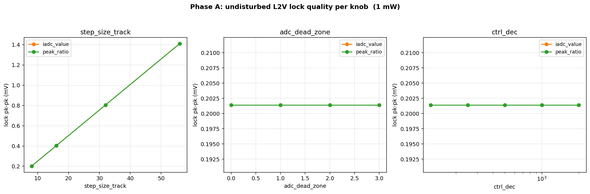
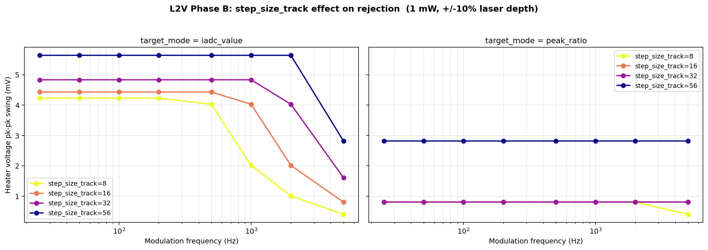
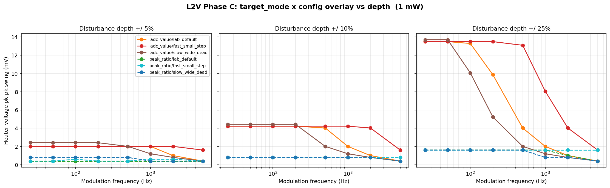
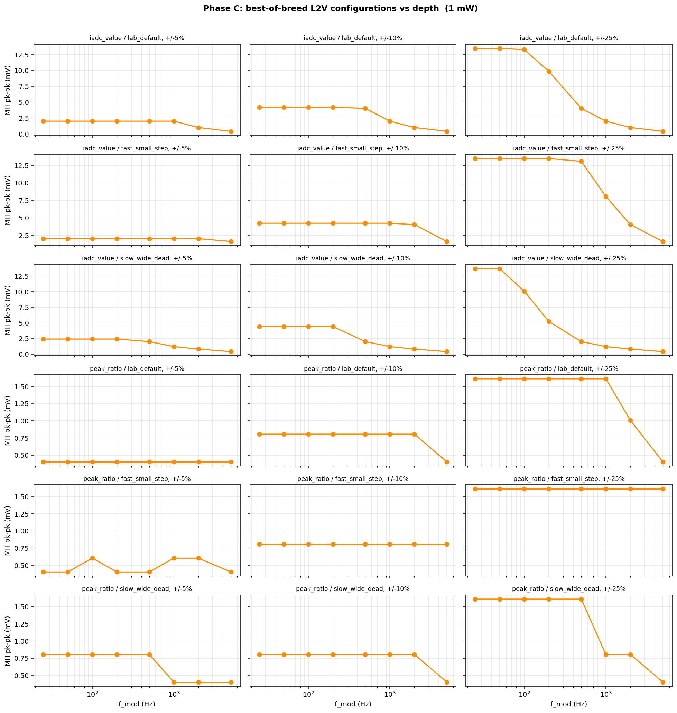
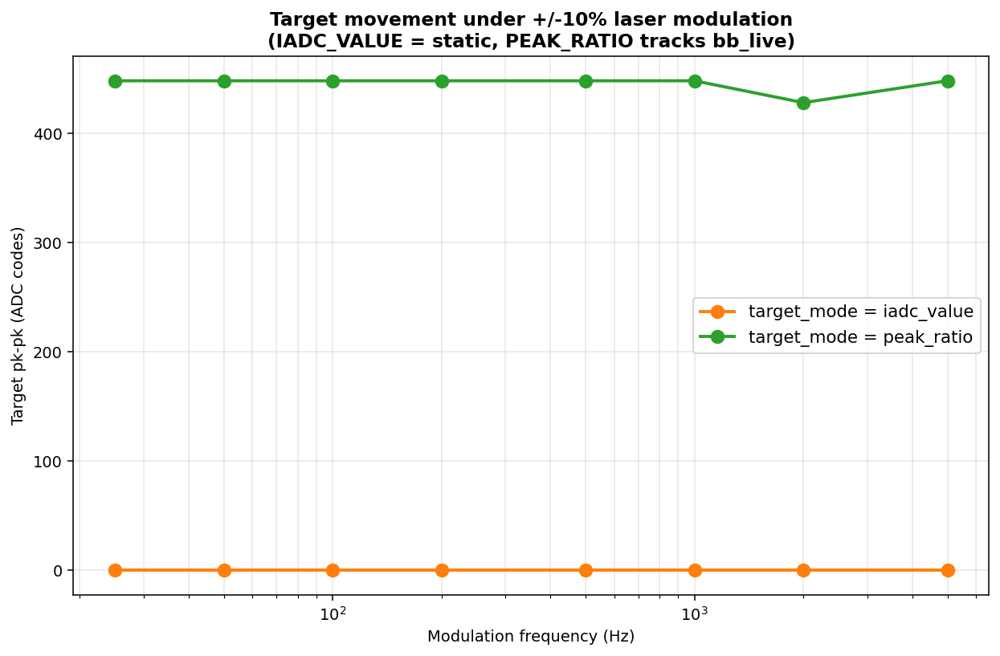
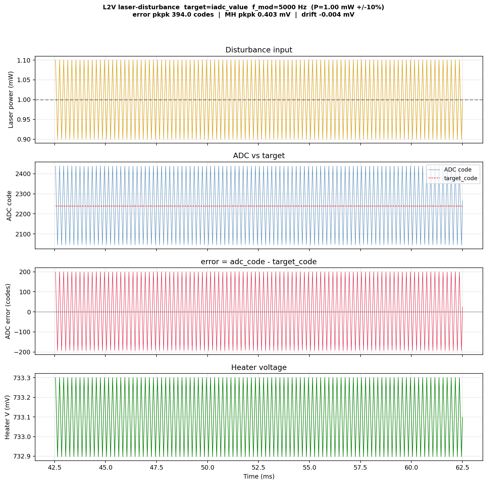
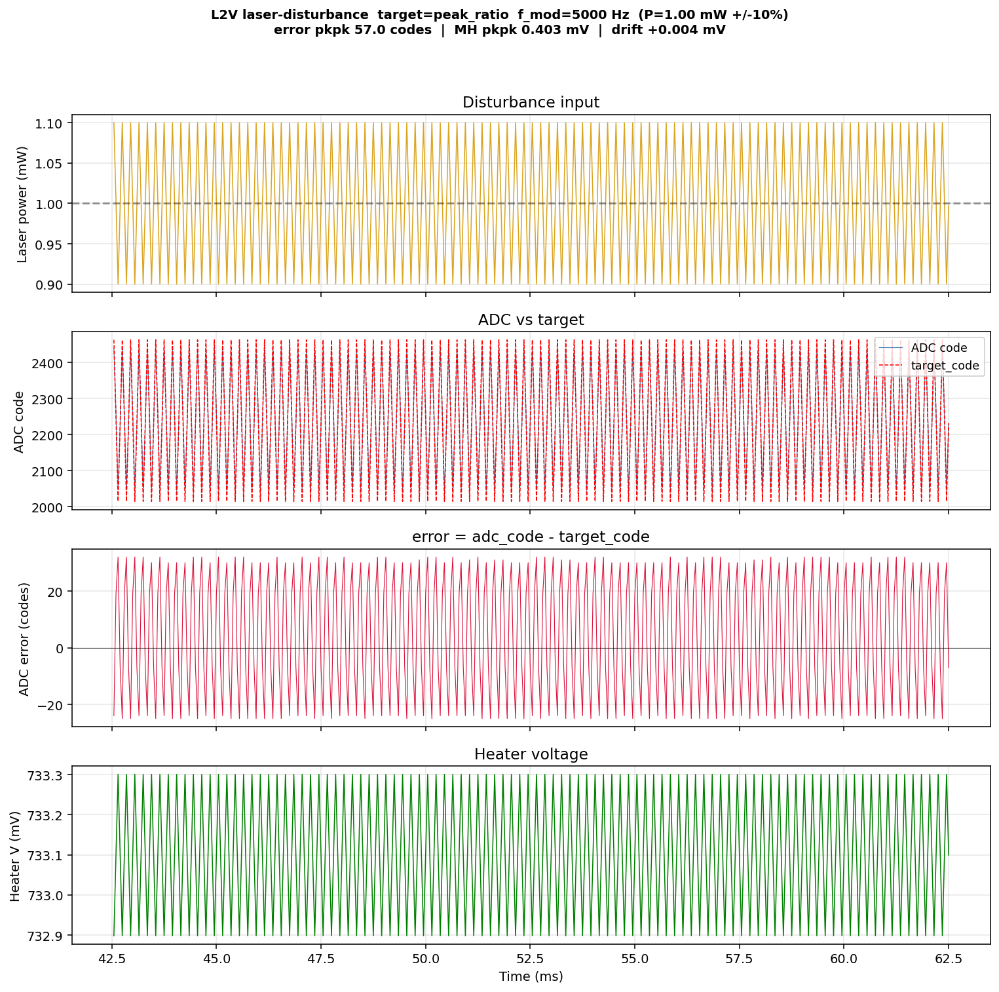
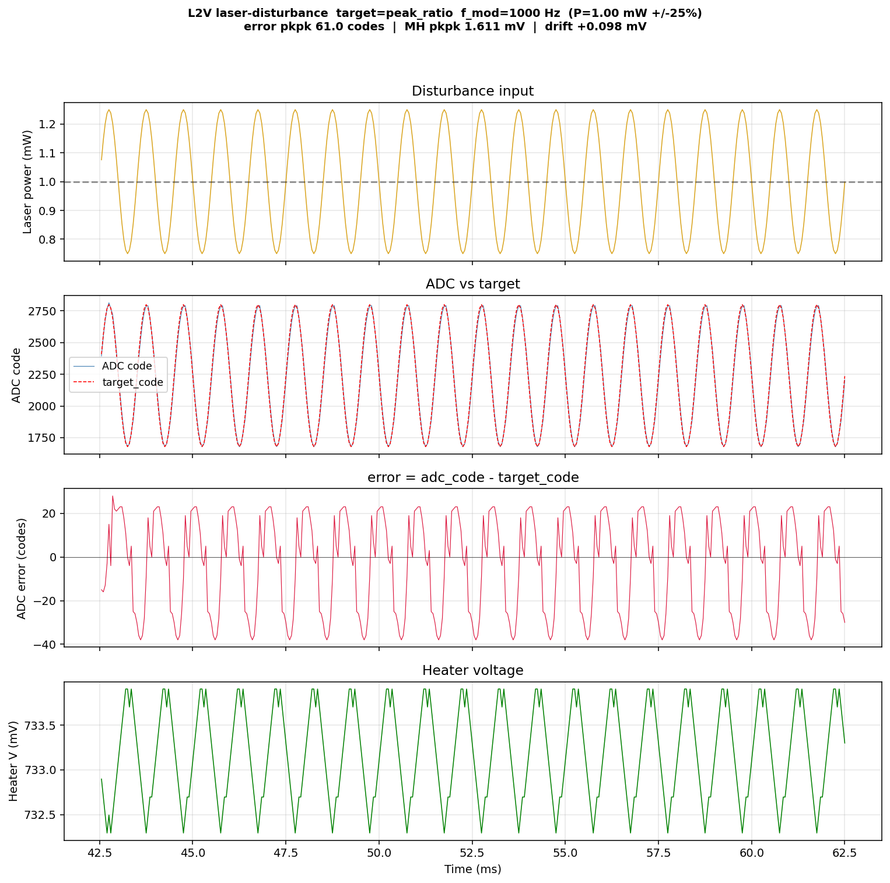

# MRM L2V Laser-Power Aggressor (Loop-Bandwidth) Study — coupe + sweet-spot HDAC, 1 mW

Companion to [`MRM_PGT_LASER_BANDWIDTH_REPORT.md`](MRM_PGT_LASER_BANDWIDTH_REPORT.md).
This repeats the Priority-2 laser-power aggressor study for the **L2V
(lock-to-value)** controller — a dead-zone target-tracking bang-bang on the hot
flank — on the same migrated signal path, and at **1 mW** (deliberately matched
to the PGT and thermal studies, rather than L2V's original 5 mW operating
point). It supersedes the older 5 mW characterization in
`goldens/mrm/docs/MRM_L2V_BANDWIDTH_REPORT.md`.

* **Plant:** `coupe_mrm_block` via `scripts/run_tsmc.sh` (caribou-mrm `.venv`).
* **Heater DAC:** sweet-spot HDAC, 13-bit, **LSB = 0.201 mV** (1.8 V FS, 0.15 V
  boost, 1.62 V clamp). 1 LSB = 8 controller codes.
* **ADC:** 16-bit / 500 µA ideal, with `bb_fullscale_A = 2.0e-3` chosen so the
  1 mW drop peak lands at mid-ADC.
* **Optical power:** 1 mW center, hot-side lock, target 75 % of the 2983-code
  drop peak (IADC target ≈ 2237 codes).
* **Aggressor:** `mrm_l2v_laser_disturbance` sinusoidal modulation, 8 freqs
  25 Hz–5 kHz × 3 depths (±5/10/25 %), one subprocess per plant, 50 µs control
  tick.
* **Two target modes are the headline variable:**
  * **`iadc_value`** — hold the ADC at an **absolute** code. No power reference.
  * **`peak_ratio`** — hold the ADC at a **ratio** of the live broadband
    (through-port / laser-proxy) reading, so the target scales with laser power.
* **Track-step grid:** **8, 16, 32, 56** controller codes = **1, 2, 4, 7 LSB**
  (step < 8 is sub-LSB on the HDAC). Also swept: `adc_dead_zone` (0–3),
  `ctrl_dec` (125–2000).

## Sources

| Artifact | This folder | Regenerated at (repo) |
|---|---|---|
| Phase A floors (figure + CSV) | [`figures/laser_l2v/phaseA_summary.png`](figures/laser_l2v/phaseA_summary.png), [`data/l2v_laser_phaseA_summary.csv`](data/l2v_laser_phaseA_summary.csv) | `output/mrm_l2v_bandwidth_study/` |
| Phase B step-size sweep (both modes) | [`figures/laser_l2v/phaseB_step_size_track_both.png`](figures/laser_l2v/phaseB_step_size_track_both.png), [`data/l2v_laser_phaseB_summary.csv`](data/l2v_laser_phaseB_summary.csv) | same dir |
| Phase C target-mode overlay / target swing | [`figures/laser_l2v/phaseC_target_mode_overlay.png`](figures/laser_l2v/phaseC_target_mode_overlay.png), [`figures/laser_l2v/phaseC_target_pkpk.png`](figures/laser_l2v/phaseC_target_pkpk.png) | same dir |
| Phase C summary grid + CSV | [`figures/laser_l2v/phaseC_summary.png`](figures/laser_l2v/phaseC_summary.png), [`data/l2v_laser_phaseC_summary.csv`](data/l2v_laser_phaseC_summary.csv) | same dir |
| Curated time-domain traces | [`figures/laser_l2v/wave_*.png`](figures/laser_l2v/) | `output/mrm_l2v_bandwidth_study/phaseC/.../l2v_disturbance_trace.png` |

---

## Executive summary

1. **The target mode, not any tuning knob, decides laser-power rejection.**
   `peak_ratio` is **laser-power-invariant by construction**: when the laser
   swings ±10 %, both the measured drop current *and* the broadband-referenced
   target swing together, so the ratio — and the heater — barely move. Residual
   ADC error is **~57 codes pk-pk** at ±10 %. `iadc_value` holds an *absolute*
   code with no power reference, so the full laser swing appears directly as
   error: **~394 codes pk-pk** at ±10 % (Figure 3; the two-trace gallery in §4
   makes the mechanism unmistakable). **Use `peak_ratio` for any system that
   sees laser-power disturbance.**
2. **`iadc_value` pays the disturbance either as heater motion (low freq) or as
   ADC error (high freq).** At low frequency the loop is fast enough to chase the
   slow swing, so the heater moves up to **13.5 mV pk-pk** (±25 %); above ~1 kHz
   it can no longer keep up and the cost shifts entirely into ADC error
   (Figure 5, left/orange). `peak_ratio` pays neither: heater pk-pk stays
   ~0.4–1.6 mV flat across the whole band (Figure 5, dashed).
3. **Within `peak_ratio`, the dominant knob is `step_size_track` (smaller =
   better), with `ctrl_dec` (faster tick = better) second.** Worst-case error at
   ±10 % grows **58 → 94 → 137 → 283 codes** for steps 8/16/32/56, and **35 → 95
   codes** going from the fastest (`ctrl_dec=125`) to slowest (`2000`) tick.
   `adc_dead_zone` (0–3) has **no measurable effect** on rejection.
4. **`adc_dead_zone` is irrelevant to laser rejection in both modes** — the
   dead zone gates *steady-state chatter*, not the disturbance response, so it
   never changes the worst case (Phase B). It remains a steady-state-precision
   knob only.
5. **Recommendation:** run L2V in **`peak_ratio` mode**. For the lowest laser
   residual use **`step_size_track = 8` (1 LSB)** and a fast `ctrl_dec`; for a
   joint laser+thermal optimum, **`step_size_track = 32`** keeps the thermal-drift
   slew margin (see thermal report) while still rejecting laser swings to
   ~137 codes (≈ 6 % of target) at ±10 %. Either way the heater stays within
   ~1 mV. `iadc_value` should only be used where there is no laser-power
   disturbance to reject.

---

## 1. Study execution

| Phase | Sweep | Tasks |
|---|---|---|
| A. Undisturbed floor per knob × mode | each knob × range, `p_depth = 0` | 26 |
| B. Per-knob bandwidth sweep @ ±10 % × both modes | knob × value × 8 freqs × 2 modes | 192 |
| C. Best-of-breed configs × depth × both modes | 3 configs × 3 depths × 8 freqs × 2 modes | 144 |

All via `run_l2v_bandwidth_study.py --phases ABC` (14 workers, one subprocess per
plant). Output root: `output/mrm_l2v_bandwidth_study/`. Phase C configs:

| Config | step_size_track | adc_dead_zone | ctrl_dec |
|---|---|---|---|
| `lab_default` | 8 (1 LSB) | 3 | 500 |
| `fast_small_step` | 8 (1 LSB) | 1 | **125** |
| `slow_wide_dead` | 8 (1 LSB) | **3 (wide)** | **2000** |

## 2. Phase A: undisturbed floor

The undisturbed floor is set by `step_size_track` (a clean step-proportional
bang-bang); `adc_dead_zone` and `ctrl_dec` do not change it:

| step (LSB) | heater pk-pk floor | ADC error std (codes) |
|---|---|---|
| **8 (1)** | 0.20 mV | 9.5 |
| 16 (2) | 0.40 mV | 19.4 |
| 32 (4) | 0.81 mV | 39.5 |
| 56 (7) | 1.41 mV | 69.0 |



## 3. Phase B: per-knob bandwidth sweep at ±10 %

### 3.1 The decisive variable: target mode

| target mode | worst-case ADC error pk-pk (codes), ±10 % | heater pk-pk |
|---|---|---|
| **`iadc_value`** | **~394–417** (saturated at the laser swing, all knobs) | ≤ 4.4 mV |
| **`peak_ratio`** | **35–283** (step/tick dependent) | ≤ 2.8 mV |

In `iadc_value` the error is **independent of `step_size_track`,
`adc_dead_zone`, and `ctrl_dec`** — it is pinned at ≈ ±200 codes (the ±10 % drop
swing about the 2237 target) because there is no power reference to subtract. In
`peak_ratio` the error is dominated by `step_size_track`:

| step (LSB) | `peak_ratio` worst error pk-pk | `iadc_value` worst error pk-pk |
|---|---|---|
| **8 (1)** | **58** | 394 |
| 16 (2) | 94 | 410 |
| 32 (4) | 137 | 387 |
| 56 (7) | 283 | 395 |



### 3.2 The other knobs

* **`ctrl_dec`** (decision decimation) matters only in `peak_ratio`: worst-case
  error 35 (fast, `125`) → 58 (`500`) → 85 (`1000`) → 95 codes (slow, `2000`). A
  faster tick rejects better.
* **`adc_dead_zone`** (0–3): **no measurable effect** in either mode (it gates
  steady-state chatter, not the disturbance response).

## 4. Phase C: target modes across depths — the invariance, in pictures

| mode / config | ±5 % | ±10 % | ±25 % |
|---|---|---|---|
| `iadc_value` / lab_default | 205 | 394 | 986 |
| `iadc_value` / fast_small_step | 195 | 417 | 962 |
| `iadc_value` / slow_wide_dead | 264 | 447 | 995 |
| **`peak_ratio` / lab_default** | 49 | 58 | 183 |
| **`peak_ratio` / fast_small_step** | **34** | **38** | **84** |
| `peak_ratio` / slow_wide_dead | 79 | 135 | 211 |
| | *worst ADC error pk-pk (codes)* | | |

`iadc_value` error scales nearly **linearly with depth** (≈ the un-rejected
laser swing: ~200/400/990 codes at 5/10/25 %), and the config barely matters.
`peak_ratio` is **3–10× lower at every depth**, and within it `fast_small_step`
(fast tick, small step) is the clear winner (Figure 3, 4).



The heater-motion view (Figure 3) tells the complementary half of the story: the
`iadc_value` curves (solid) **rise at low frequency** — at ±25 % the heater
swings up to 13.5 mV chasing the slow laser ramp — then fall toward the floor
above ~1 kHz where the loop gives up and the cost moves into ADC error. The
`peak_ratio` curves (dashed) sit flat at ~0.4–1.6 mV across the whole band: the
heater simply does not chase, because the target moved with the laser.



The target-swing diagnostic confirms the mechanism: in `peak_ratio` the target
code swings with the laser (hundreds of codes), while in `iadc_value` it is flat.



### 4.1 Time-domain gallery — the invariance

**`iadc_value`, 5 kHz, ±10 %:** the target (red dashed) is flat at 2237; the ADC
(blue) swings the full ±200 codes with the laser → error pk-pk **394 codes**.
The heater barely moves (0.4 mV) — but that is *failure to reject*, not
rejection: the resonance position is swinging with the laser and the loop has no
reference to correct it.



**`peak_ratio`, same disturbance (5 kHz, ±10 %):** the target (red) now tracks
the ADC (blue) — they overlap — because the reference scales with the broadband
laser proxy. Error collapses to **57 codes pk-pk** with the *same* 0.4 mV heater
motion. This is the L2V analog of PGT's argmax invariance, achieved by
referencing the target to live power instead of an absolute code.



**`peak_ratio`, stressed (1 kHz, ±25 %):** even at the worst service-event depth
the ratio reference holds the loop, with error well under the `iadc_value` ±10 %
case.



---

## 5. Recommendations

| Setting | Recommended (1 mW) | Note |
|---|---|---|
| **target mode** | **`peak_ratio`** | 3–10× lower ADC error vs `iadc_value`; laser-power-invariant by construction |
| `step_size_track` | **8 (1 LSB)** for min laser residual; **32 (4 LSB)** for joint laser+thermal | step is the dominant `peak_ratio` knob |
| `ctrl_dec` | fast (e.g. **125**) | faster tick rejects better in `peak_ratio` |
| `adc_dead_zone` | leave at default | no effect on laser rejection (steady-state knob only) |

**The cross-study tension:** the thermal-drift study wants a *coarse* step (32,
for slew headroom); this study wants a *fine* step (8, for the lowest laser
residual). In `peak_ratio` the heater barely moves either way, so the conflict
is mild — **`step_size_track = 32` in `peak_ratio` mode** is a sound joint choice
(2000 K/s thermal margin and ~137-code / ~6 % laser residual at ±10 %). Only
drop to step 8 if laser-power disturbance dominates the mission profile and
thermal drift is slow.

## 6. Comparison to PGT

Both controllers have a structural laser-power-invariance: PGT because the
Goertzel argmax is power-independent, L2V (in `peak_ratio`) because the target is
referenced to live power. At ±10 %, PGT holds the heater to ~9 mV pk-pk
worst-case and L2V/`peak_ratio` holds it to ~0.4–2.8 mV with ADC error
≤ 137 codes. The decisive difference from the thermal study persists: PGT must
park *at* the peak (no setpoint) and needs `ovr_counter = 0` to acquire at 1 mW,
whereas L2V's referenced target acquires cleanly and gives an explicit knob
(`peak_ratio`) for power immunity. For laser rejection specifically, **L2V in
`peak_ratio` is the stronger controller**; `iadc_value` is the weaker one and
should be avoided where laser power moves.

## 7. Reproduce

```bash
cd goldens/mrm

# All three phases, both target modes (14 workers):
scripts/run_tsmc.sh -m src.testbench.run_l2v_bandwidth_study \
    --phases ABC --max-workers 14

# Report figures:
scripts/run_tsmc.sh -m src.testbench.make_l2v_bandwidth_report_plots \
    --out-dir output/mrm_l2v_bandwidth_study

# Single-config reproduction of the recommended setting:
scripts/run_tsmc.sh -m src.testbench.mrm_l2v_laser_disturbance \
    --out-dir output/l2v_peakratio_demo \
    --p-center-W 0.001 --p-depth 0.10 \
    --freqs 25,50,100,200,500,1000,2000,5000 \
    --v-heater-fs 1.8 --target-mode peak_ratio \
    --step-size-track 8 --adc-dead-zone 3
```

> Migration fixes applied before running: `DEFAULT_PARAMS` moved to 1 mW
> (`p_center_W=1.0e-3`, `bb_fullscale_A=2.0e-3` to center the drop peak at
> mid-ADC, `v_heater_fs=1.8`, `step_size_track=8`); the back-step calculation was
> corrected from `dac_code_to_voltage(step_size_acq, …)` to
> `dac_step_delta_V(step_size_acq, …)` (the snapped-DAC delta, not an absolute
> voltage); a `--v-heater-fs` CLI was threaded through; step-size grids moved to
> `8,16,32,56`; and the report `suptitle`s were corrected to "1 mW".
