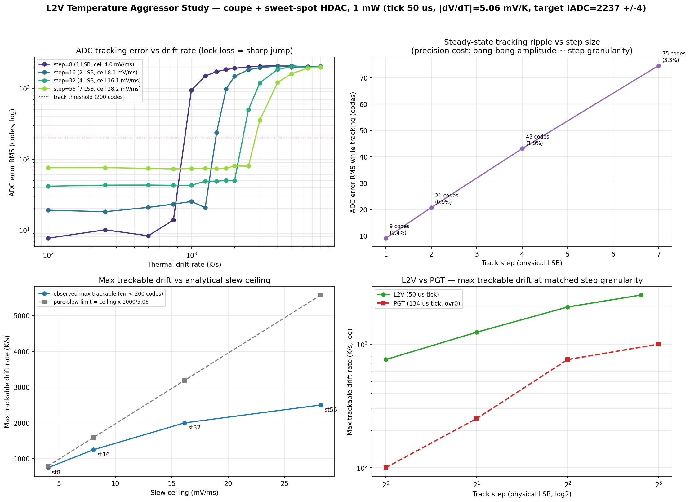
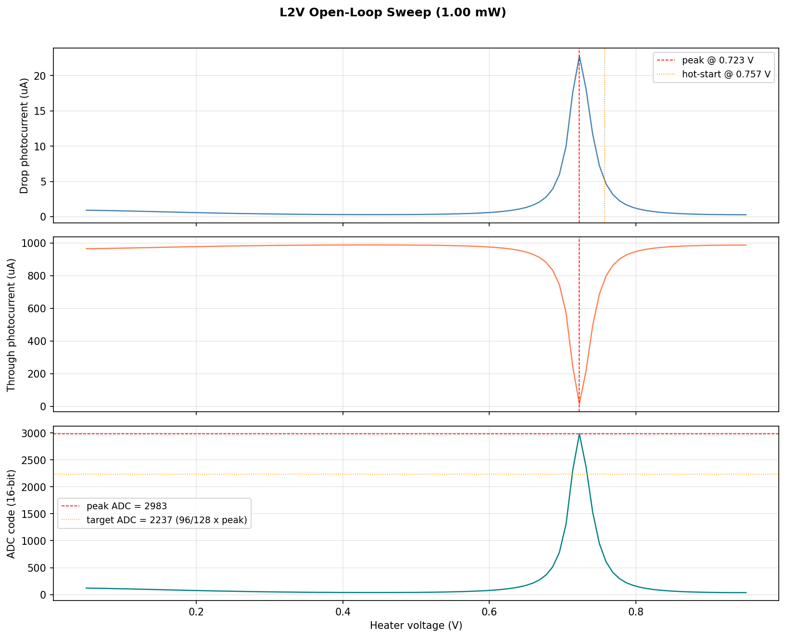
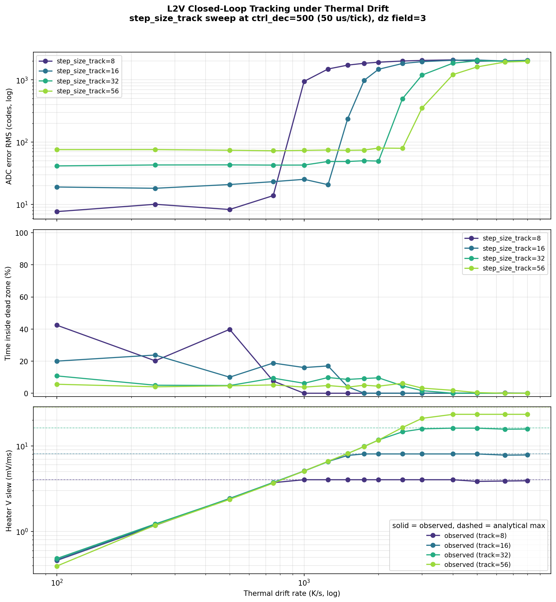

# MRM L2V Temperature (Thermal-Drift) Aggressor Study — coupe + sweet-spot HDAC, 1 mW

Companion to [`MRM_PGT_THERMAL_DRIFT_REPORT.md`](MRM_PGT_THERMAL_DRIFT_REPORT.md).
This repeats the Priority-1 temperature aggressor study for the **L2V
(lock-to-value)** controller — a dead-zone target-tracking bang-bang on the hot
flank of MRM resonance — on the same migrated signal path as the PGT study:

* **Plant:** `coupe_mrm_block` (TSMC Caribou ring) via `scripts/run_tsmc.sh`
  (caribou-mrm `.venv` Skadi — `MRMTestBench` builds `coupe_mrm_block` and
  `mrm_lock_to_value` calls `assert_caribou_skadi()` at import, so a wrong-venv
  run errors before any simulation cost).
* **Heater DAC:** sweet-spot HDAC — 13-bit physical grid (16-bit controller
  code `>> SUB_PWM_BITS=3`), 1.8 V FS, 0.15 V boost, 1.62 V clamp,
  **LSB = 0.201 mV**. This replaces the old linear `code/DAC_MAX × 1.2 V` GF
  RDAC map that L2V was still using.
* **ADC:** 16-bit / 500 µA ideal (unchanged; already correct in L2V).
* **Optical power:** 1 mW. Open-loop sweep finds the hot-flank resonance peak
  **ADC = 2983 at V = 0.723 V** (matches the PGT 1 mW op-point). L2V target is
  `IADC_VALUE = 96/128 × peak = 2237 codes` (75 % of peak, on the hot flank);
  acquisition lands cleanly (post-acq ADC ≈ 2234–2244 vs target 2237, heater
  ≈ 0.731–0.733 V), so the loop is in the dead zone before drift starts.
* **Track-step grid:** **8, 16, 32, 56 controller codes = 1, 2, 4, 7 physical
  LSB** (step < 8 is sub-LSB on the 13-bit HDAC and cannot move the heater; RTL
  `step_size_t` is 6-bit, so 63 is the hard max — 56 is the widest clean
  multiple-of-LSB step). Dead-zone field = 3 → **±4 codes**.
* **Aggressor:** Skadi `disturbances.thermal_drift(rate)`, 15 rates from 100 to
  8000 K/s, 300 acquisition ticks + 500 drift ticks (**50 µs each**, vs PGT's
  134 µs Goertzel window) per run, one subprocess per plant.

## Sources

| Artifact | This folder | Regenerated at (repo) |
|---|---|---|
| Analysis figure (4-panel) | [`figures/l2v_thermal_drift_analysis.png`](figures/l2v_thermal_drift_analysis.png) | `goldens/mrm/output/mrm_l2v_thermal_drift_study/thermal_drift_analysis.png` |
| Analysis summary | [`data/l2v_thermal_drift_analysis.json`](data/l2v_thermal_drift_analysis.json) | same dir |
| Tracking sweep figure + metrics | [`figures/l2v_tracking_vs_drift.png`](figures/l2v_tracking_vs_drift.png), [`data/l2v_sweep_metrics.csv`](data/l2v_sweep_metrics.csv) | `goldens/mrm/output/mrm_l2v_thermal_drift_study/sweep_1mW/` |
| Open-loop op-point (sweep, target, hot-start) | [`figures/l2v_open_loop_sweep.png`](figures/l2v_open_loop_sweep.png), [`data/l2v_open_loop_summary.json`](data/l2v_open_loop_summary.json), [`data/l2v_open_loop_sweep.csv`](data/l2v_open_loop_sweep.csv) | `goldens/mrm/output/mrm_l2v_thermal_drift_study/open_loop_1mW/` |
| PGT counterpart (comparison) | [`MRM_PGT_THERMAL_DRIFT_REPORT.md`](MRM_PGT_THERMAL_DRIFT_REPORT.md) | — |

**Figure 1** below is the 4-panel study summary: (top-left) ADC tracking error
vs drift per step size — the lock-loss knee, (top-right) steady-state tracking
ripple vs step size — the precision cost, (bottom-left) max trackable drift vs
the analytical slew ceiling, (bottom-right) L2V vs PGT max trackable drift at
matched step granularity.



---

## Executive summary

1. **L2V tracks ambient thermal drift up to a step-dependent ceiling, then
   loses lock.** Using "resonance held" = ADC error RMS < 200 codes (≈ 9 % of
   the 2237-code target), the max trackable drift rate at 1 mW is **~750 K/s
   (1 LSB), ~1250 K/s (2 LSB), ~2000 K/s (4 LSB), ~2500 K/s (7 LSB)**. Past the
   ceiling the error jumps from tens of codes to >900 in one grid step and the
   heater slew rails — a sharp, unambiguous lock-loss knee (Figure 1, top-left;
   Figure 3).
2. **L2V tracks 2.7–7.5× faster drift than PGT at matched step granularity**
   (1 LSB: 750 vs 100 K/s = 7.5×; 2 LSB: 1250 vs 250 = 5.0×; 4 LSB: 2000 vs 750
   = 2.7×; Figure 1, bottom-right). Two compounding reasons: L2V's control tick
   is **2.7× faster** (50 µs vs 134 µs — it reads the ADC and steps every tick,
   with no Goertzel integration window), and it spends its whole slew budget
   moving toward the target instead of dithering to sense a gradient.
3. **Small steps are slew-limited and run near the analytical ceiling; large
   steps are not.** Observed/pure-slew efficiency falls from **0.94 (1 LSB) →
   0.79 (2 LSB) → 0.63 (4 LSB) → 0.45 (7 LSB)** (Figure 1, bottom-left). At
   1–2 LSB the loop slews monotonically and tracks within ~6–20 % of its raw
   `step/tick` ceiling. At 4–7 LSB the binding constraint shifts away from slew
   to coarse-step overshoot of the (tight, ±4-code) dead zone plus the rising
   `dV/dT` at high ambient, so the big steps reach lock-loss well before their
   slew ceiling.
4. **Coarse steps trade precision for slew, linearly.** Steady-state tracking
   ripple grows with step size: **9 codes (0.4 %), 21 (0.9 %), 43 (1.9 %),
   75 (3.3 %)** of target RMS for 1/2/4/7 LSB (Figure 1, top-right). The dead
   zone (±4 codes ≈ 1 LSB) is *narrower* than a single coarse step, so for steps
   ≥ 2 LSB the loop never actually sits inside the dead zone — it bang-bangs
   across it. (See metric note in §3: `in_dead_zone` fraction is therefore
   **not** the lock metric; ADC error RMS is.)
5. **Recommendation:** at 1 mW the precision/slew knee is the design choice. For
   the widest drift margin use **step 32 (4 LSB, ~2000 K/s, 1.9 % ripple)**;
   step 56 buys only ~25 % more margin (2500 K/s) for ~1.7× the ripple and is
   near the 6-bit RTL field limit. Use **step 8–16 (1–2 LSB)** only when ambient
   drift is slow (< ~750–1250 K/s) and steady-state precision matters. L2V needs
   **no override / acquisition special-casing** — unlike PGT, it acquires
   cleanly at every step size because the target is referenced, not force-up.

---

## 1. Heater tuning coefficient

From all cleanly-tracked runs (ADC error RMS < 100 codes, ΔT > 3 K), the heater
must move **|dV/dT_amb| ≈ 5.06 mV/K** (heater voltage *decreases* ~5 mV per +1 K
ambient rise to pull the ring back onto resonance). This matches the PGT plant
constant (4.97 mV/K) to within the high-ambient nonlinearity (the coefficient
creeps from ~4.8 mV/K near 25 °C to ~5.9 mV/K by +50 K). It converts a drift
rate to a required heater slew: required slew (mV/ms) = 5.06 × rate(K/s) / 1000.

## 2. Op-point and acquisition (no override needed)

The 1 mW open-loop sweep (**Figure 2**) maps the resonance and fixes the L2V
target: drop-current peak ADC = 2983 at V = 0.723 V, target IADC = 2237 codes
(75 % of peak, on the hot flank), hot-start at 0.757 V. L2V acquires from that
hot-start with coarse step 128 → fine-switch at 50 % of the acquisition ticks.
Post-acquisition steady state lands at ADC ≈ 2234–2244 vs target 2237 (heater
≈ 0.731–0.733 V) at **every** step size — there is no force-up override to
overshoot the sharp 1 mW resonance, so the PGT acquisition trap (kstep-dependent
overshoot, §2 of the PGT report) simply does not exist for L2V. This is the one
place the L2V algorithm is structurally easier to bring up at 1 mW.



## 3. Tracking results — ADC error RMS (codes), full drift phase

| step (LSB) | 100 | 250 | 500 | 750 | 1000 | 1250 | 1500 | 1750 | 2000 | 2500 | 3000 | 4000 K/s |
|---|---|---|---|---|---|---|---|---|---|---|---|---|
| **8 (1)** | 8 | 10 | 8 | 14 | **944** | 1493 | 1723 | 1845 | 1919 | 2005 | 2052 | 2094 |
| **16 (2)** | 19 | 18 | 21 | 23 | 25 | 21 | **237** | 983 | 1477 | 1830 | 1960 | 2063 |
| **32 (4)** | 42 | 43 | 43 | 43 | 43 | 49 | 49 | 50 | 50 | **499** | 1194 | 1854 |
| **56 (7)** | 76 | 76 | 74 | 73 | 74 | 75 | 74 | 74 | 80 | 80 | **354** | 1214 |

Reading along each row: the error is flat (steady-state ripple) until the slew
ceiling is hit, then jumps an order of magnitude in one grid step (bold = first
failing rate). Reading down each column: a bigger step holds resonance to a
higher drift rate but with a larger steady-state ripple. **Figure 3** is the
sweep-driver view of the same data — error RMS, dead-zone retention, and
observed-vs-analytical heater slew vs drift rate, one curve per step size.



> **Metric note.** The drift-phase `in_dead_zone` flag is **not** a reliable
> tracking indicator here: the dead zone is ±4 codes (~1 LSB) while a single
> track step moves the ADC by ~4 codes (1 LSB) to ~31 codes (7 LSB), so for
> steps ≥ 2 LSB the loop bang-bangs *across* the dead zone and `in_dz` reads
> low (4–20 %) even while it is tracking perfectly. **ADC error RMS is the
> correct tracking metric** and is what the tables and max-trackable numbers
> use. (Same lesson as the PGT `in_lock` flag, opposite failure mode.)

## 4. Max trackable drift vs analytical slew ceiling

| step (LSB) | slew ceiling (mV/ms) | max trackable (obs, <200 codes) | pure-slew limit (ceiling·1000/5.06) | obs / slew-limit |
|---|---|---|---|---|
| 8 (1) | 4.03 | ~750 K/s | 796 K/s | **0.94** |
| 16 (2) | 8.06 | ~1250 K/s | 1592 K/s | 0.79 |
| 32 (4) | 16.11 | ~2000 K/s | 3185 K/s | 0.63 |
| 56 (7) | 28.20 | ~2500 K/s | 5573 K/s | 0.45 |

Unlike PGT (uniformly ~0.4× of its pure-slew limit because extremum seeking
must keep dithering), L2V at **1 LSB tracks at 0.94× of the raw `step/tick`
ceiling** — it slews monotonically toward the target with almost no overhead
(Figure 1, bottom-left). The efficiency falls with step size because the coarse
step overshoots the tight ±4-code dead zone and the high-ambient `dV/dT` rise
eats into the budget before the slew ceiling is reached. Practically: at 1 mW,
**trackable rate ≈ slew ceiling × 1000 / 5.06 for 1–2 LSB**, derating to
~0.5–0.6× for 4–7 LSB.

## 5. Comparison to PGT (same plant, DAC, ADC, op-point)

| step granularity | L2V max trackable | PGT max trackable | L2V / PGT |
|---|---|---|---|
| 1 LSB (L2V step 8 / PGT k3) | 750 K/s | 100 K/s | **7.5×** |
| 2 LSB (L2V step 16 / PGT k4) | 1250 K/s | 250 K/s | **5.0×** |
| 4 LSB (L2V step 32 / PGT k5) | 2000 K/s | 750 K/s | **2.7×** |
| 7–8 LSB (L2V step 56 / PGT k6) | 2500 K/s (7 LSB) | 1000 K/s (8 LSB) | **2.5×** |

This is an apples-to-apples comparison (both on coupe + the sweet-spot HDAC +
16-bit/500 µA ADC at 1 mW), plotted in Figure 1, bottom-right. **L2V dominates
PGT for thermal-drift tracking** because (a) its 50 µs tick gives a 2.7× higher
slew ceiling per LSB and (b) it converts that slew into tracking near-losslessly
at small steps. The flip side is what PGT buys: PGT parks *at* the resonance
peak (maximizes drop power) whereas L2V deliberately sits at a 75 %-of-peak
setpoint and carries a step-proportional ripple, and PGT does not need an
absolute ADC target (it is power-reference-free). The choice is mission-level,
but for *pure thermal-drift bandwidth* L2V is the stronger controller here.

## 6. Recommendation & caveats

* **Default to step 32 (4 LSB)** at 1 mW: ~2000 K/s drift margin at 1.9 %
  steady-state ripple — the best precision/slew balance. Step 56 (7 LSB) adds
  ~25 % margin (2500 K/s) for 3.3 % ripple and sits near the 6-bit RTL field
  cap; reserve it for known-fast ramps.
* **Use step 8–16 (1–2 LSB)** only when drift is slow (< ~750–1250 K/s) and
  tight steady-state precision (< ~1 % ripple) is required.
* **No override / acquisition tuning needed** — L2V's target-referenced
  bang-bang acquires cleanly at all step sizes, so the PGT `ovr_counter=0`
  fix has no L2V analog.
* **Caveats:** drift phase is 500 ticks (≈ 25 ms); very low rates do not fully
  exercise long-horizon wander. Max-trackable values are bracketed by the drift
  grid (e.g. step 16 onset is between 1250 and 1500 K/s). The ±4-code dead zone
  is intentionally near 1 LSB; widening it would reduce ripple-driven chatter
  for the coarse steps but would not change the slew-limited ceilings. The
  13-bit DAC model is the static thermal-average (no time-domain PWM), exact
  for the MRM thermal bandwidth. The `AdaptiveLockToValueController` (coarse
  re-arm on large error, fine step otherwise) was not swept this pass and is the
  obvious lever to break the precision/slew tradeoff — coarse slew to chase
  fast drift, fine step for steady-state precision.

## 7. Reproduce

```bash
cd goldens/mrm

# 1 mW open-loop op-point (target + hot-start, fixed sweet-spot HDAC):
scripts/run_tsmc.sh -m src.testbench.skadi_mrm_l2v_open_loop \
    --optical-power-W 0.001 \
    --out-dir output/mrm_l2v_thermal_drift_study/open_loop_1mW

# Tracking sweep (step_size_track x drift_rate):
scripts/run_tsmc.sh -m src.testbench.skadi_mrm_l2v_thermal_drift_sweep \
    --sweep-summary-json output/mrm_l2v_thermal_drift_study/open_loop_1mW/l2v_open_loop_summary.json \
    --step-sizes 8,16,32,56 \
    --drift-rates 100,250,500,750,1000,1250,1500,1750,2000,2500,3000,4000,5000,6500,8000 \
    --n-acq-ticks 300 --n-drift-ticks 500 --adc-dead-zone 3 --n-workers 10 \
    --out-dir output/mrm_l2v_thermal_drift_study/sweep_1mW

# Analysis figure + summary (pure post-processing, plain python3):
python3 -m src.testbench.analyze_l2v_thermal_drift_study
```

> Migration fixes applied before running (the L2V analog of the two PGT traps):
> the **DAC model** in `mrm_lock_to_value.py` was changed from the linear
> `code/DAC_MAX × 1.2 V` GF RDAC map to the **13-bit snapped sweet-spot HDAC**
> (`(code >> 3)/8192 × (v_fs − boost_v) + boost_v`, 1.8 V FS, 0.15 V boost,
> 1.62 V clamp) with a `dac_step_delta_V` helper for slew/back-step math; the
> sweep **step-size grid** went `4,8,16,32 → 8,16,32,56` (4 is sub-LSB on the
> new DAC), the slew-ceiling overlay was rewritten to the snapped model, and
> `v_heater_fs` defaults went `1.2 → 1.8` across the open-loop, worker, and
> sweep driver. The plant (`coupe_mrm_block`) and ADC (16-bit/500 µA) were
> already correct.
