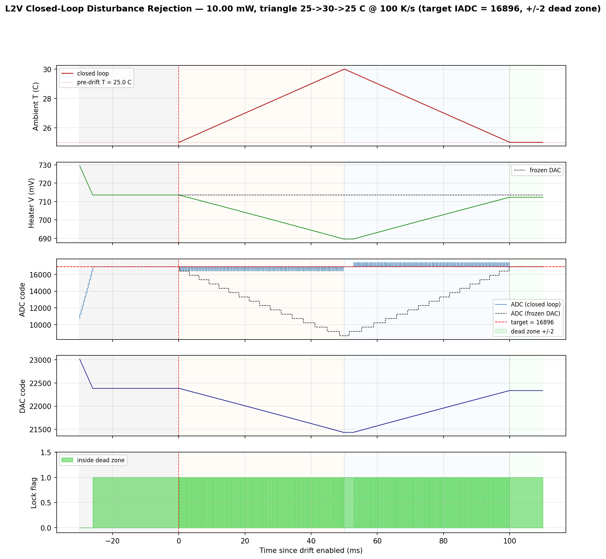

# MRM L2V Triangle-Aggressor Report -- coupe + sweet-spot HDAC, 10 mW

Companion to [`MRM_L2V_THERMAL_DRIFT_REPORT.md`](MRM_L2V_THERMAL_DRIFT_REPORT.md)
(monotonic drift, 1 mW, step x rate sweep) and to
[`MRM_PGT_TRIANGLE_AGGRESSOR_REPORT.md`](MRM_PGT_TRIANGLE_AGGRESSOR_REPORT.md)
(PGT triangle at the same operating point). This report measures how well the
**L2V (lock-to-value)** controller holds drop-port retention through a symmetric
ambient triangle at **10 mW** as the masked-IADC ENOB is varied.

Where the PGT triangle study was a **multi-knob hunt for failure modes** at a
105 C apex (sense-blind apex, actuator saturation, hill-climb step too small),
the L2V triangle at the same 80 C apex is in the **deeply easy regime** for
the controller. Tracking is driven by direct ADC error rather than slope sense,
so there is no apex-blindness equivalent; the slew rate (100 K/s) is more than
20x below the L2V monotonic ceiling at the smallest step (the 1 mW monotonic
report measured ~750 K/s at 1 LSB). The only stress visible at this operating
point is **mask quantization**, which sets a retention floor that scales
roughly x2 per mask step.

## Sources

| Artifact | This folder | Regenerated at (repo) |
|---|---|---|
| Mask 7 / 8 / 9 5-panel overviews | [`figures/l2v_triangle/mask{7,8,9}_25to80_100Kps_5panel.png`](figures/l2v_triangle/) | `goldens/mrm/output/l2v_thermal_aggressor_10mW/triangle_25to80_100Kps_mask{7,8,9}/l2v_thermal_drift.png` |
| Mask 7 / 8 / 9 closed-vs-frozen overlays | [`figures/l2v_triangle/mask{7,8,9}_25to80_100Kps_compare.png`](figures/l2v_triangle/) | `goldens/mrm/output/l2v_thermal_aggressor_10mW/triangle_25to80_100Kps_mask{7,8,9}/l2v_thermal_drift_compare.png` |
| Three-mask overlay | [`figures/l2v_triangle/mask_compare_25to80_100Kps.png`](figures/l2v_triangle/mask_compare_25to80_100Kps.png) | `goldens/mrm/output/l2v_thermal_aggressor_10mW/mask_compare_25to80_100Kps.png` |
| Smoke (peak 30 C) 5-panel | [`figures/l2v_triangle/smoke_25to30_100Kps_mask9_5panel.png`](figures/l2v_triangle/smoke_25to30_100Kps_mask9_5panel.png) | `goldens/mrm/output/l2v_thermal_aggressor_10mW_smoke/triangle_25to30_100Kps_mask9/l2v_thermal_drift.png` |
| Per-mask metrics JSONs | [`data/l2v_triangle/mask{7,8,9}_25to80_100Kps_metrics.json`](data/l2v_triangle/) | matching `l2v_thermal_drift_metrics.json` per run dir |
| Run summary | n/a | `goldens/mrm/output/l2v_thermal_aggressor_10mW/SUMMARY.md` |
| Plan + bench-mechanics audit | n/a | `goldens/mrm/docs/L2V_THERMAL_AGGRESSOR_PLAN.md` |

The full per-tick traces (each 22201 ticks, ~1.5 MB) live with the run dirs in
the repo; only the metrics JSONs are mirrored here.

---

## Executive summary

1. **L2V at 10 mW holds 25 -> 80 -> 25 C @ 100 K/s + 10 ms settle** for masks
   {7, 8, 9} (effective ENOB 9, 8, 7 bits on the 16-bit datapath). All three
   runs track; none saturate the heater; drop retention stays within 3 % of
   the pre-drift baseline.
2. **Mask quantization sets the retention floor**, not slew or sensing. Drop
   loss RMS scales roughly x2.6 per mask step (0.29 % -> 0.78 % -> 1.91 %),
   tracking the doubling of the mask quantum (128 -> 256 -> 512 codes) plus
   a small contribution from the up-to-one-quantum target-snap shift.
3. **L2V is 5-40x tighter than PGT at the same operating point.** The PGT
   triangle at 25 -> 80 -> 25 C @ 100 K/s, 10 mW, with its winning config
   reports apex drop-loss RMS **12.6 %**; the L2V mask 7 / 8 / 9 apex values
   are **0.33 % / 0.81 % / 1.88 %**. PGT's failure-finding triangle was at
   105 C apex; L2V at 80 C is in the deeply easy regime by comparison.
4. **No controller failure mode triggered.** The PGT triangle isolated three
   (sense-blind apex, actuator saturation, hill-climb step too small). For
   L2V at 10 mW / 80 C apex / 100 K/s, none of those preconditions are
   present: L2V senses ADC error directly (no Goertzel slope to flatten), the
   heater never goes below 360 mV (well above 0 V floor), and the bang-bang
   step is 1 LSB by design.
5. **Three bench-mechanics defects had to be fixed before the campaign was
   trustworthy.** They are documented as named bench modes (M-A target snap,
   M-B drop_A storage, M-C per-step ambient drive) in section 4 because each
   is a foot-gun for any future masked-ADC L2V campaign.
6. **Operating envelope (validated):** 25 -> 80 C symmetric triangle, 100 K/s,
   10 mW, ENOB >= 7 bits at the IADC. Open levers: higher apex (105 C is
   uncharted on L2V), faster ramp (this campaign was 25x below the slew
   ceiling at 1 LSB step), per-power init derivation, lower laser power.

---

## 1. Setup

The plant, DAC, and ADC are identical to the PGT triangle study and the L2V
monotonic study: `coupe_mrm_block` (TSMC Caribou ring) on the sweet-spot HDAC
(13-bit physical grid, 1.8 V FS, 1.62 V clamp, LSB = 0.201 mV) with the
production 16-bit / 560 uA masked IADC. What changes vs the L2V monotonic
study at 1 mW:

- **10 mW, not 1 mW.** Pairs the L2V campaign with the PGT triangle for a
  direct controller-vs-controller comparison at the same operating point.
- **Triangle, not monotonic.** The bench gained `--drift-profile triangle`
  with `--triangle-peak-C`, `--triangle-rate-K-per-s`, `--triangle-settle-ms`,
  driving ambient via `sknetwork.set_ambient_temperature()` once per controller
  tick (per-tick, **not** per Skadi step -- see section 4 / M-C).
- **Mask sweep, not step sweep.** The campaign sweeps `--adc-mask-bits` over
  {7, 8, 9}, fixing the controller step at 1 LSB (`--step-size-acq 8`,
  `--step-size-track 8`, `--fine-switch-frac 0.0`) so the only varying
  resolution knob is the IADC ENOB at the slope sense.

Fixed knobs (matched to the PGT-triangle ctrl-dec to keep simulation cost
comparable):

| knob | value | rationale |
|---|---|---|
| `--ctrl-dec` | 1600 (50 us cadence) | matches PGT triangle; >= 1 thermal tau |
| `--time-step` | 31.25 ns | matches PGT triangle |
| `--step-size-acq` / `--step-size-track` | 8 / 8 | 1 LSB on the 13-bit snapped HDAC; sub-LSB is inert |
| `--fine-switch-frac` | 0.0 | single fine-step regime; no coarse acquisition phase |
| `--adc-dead-zone` | 2 (half = 2 codes) | unchanged from L2V default |
| `--n-acq-ticks` | 600 | 30 ms acquisition; lock confirmed by tick 120 in all three runs |
| `--triangle-peak-C` | 80 | matches PGT-triangle envelope |
| `--triangle-rate-K-per-s` | 100 | 25x below the L2V monotonic ceiling at 1 LSB |
| `--triangle-settle-ms` | 10 | matches PGT triangle |

Each run uses its **own** per-mask open-loop sweep summary
(`mrm_l2v_open_loop_10mW_mask{7,8,9}/`); a single shared sweep at one mask was
the original plan and would have broken for the other two via off-grid target.
See section 4 / M-A.

The headline tracking metric is **drop loss** (percentage below the
post-acquisition, pre-drift drop current `drop_ref_A`), mirroring the PGT
triangle report. The L2V `in_dead_zone` flag is reported only as a diagnostic;
under masks 7/8/9 the +-2-code dead zone is sub-quantum (mask quantum is
128/256/512 codes), so the loop steps in/out of the zone every tick and the
metric reads ~84 % even when drop is held within < 1 % of the baseline.

---

## 2. Headline result -- the operating point

| Run | Mask | ENOB  | drop_ref | drop_loss RMS (all) | apex retention | retention last 20 % | roundtrip resid. | heater max V | sat? | Verdict |
|-----|-----:|-------|---------:|--------------------:|---------------:|--------------------:|-----------------:|-------------:|:----:|:--------|
| L7  | 7    | 9-bit | 149.15 uA | **0.29 %**          | 100.10 %       | 100.32 %            | -0.44 %          | 712.2 mV     | no   | tracked |
| L8  | 8    | 8-bit | 149.15 uA | **0.78 %**          | 100.45 %       | 101.04 %            | -0.86 %          | 712.2 mV     | no   | tracked |
| L9  | 9    | 7-bit | 144.69 uA | **1.91 %**          | 101.23 %       | 102.65 %            | -2.65 %          | 713.6 mV     | no   | tracked |

Retention values **above 100 %** (and the negative `roundtrip_residual_pct`)
are real. After the 25 -> 80 -> 25 C round trip the loop ends at a slightly
more thermally settled operating point than it started at: pre-drift the loop
had only the 3 ms acquisition-phase settle following the 0.55 -> 0.7297 V
step; end-of-run the ring has been at T0 for the full 10 ms settle phase.
The drop current at that operating point is up to 2.65 % above the pre-drift
acquisition mean for the mask-9 case. This is a controller artifact, not a
metric error; sign convention follows PGT (`drop_loss_pct = 100 * (drop_ref -
drop_now) / drop_ref`, so negative loss == positive retention).

The mask-9 5-panel trace (worst case of the three) is the cleanest illustration
of how much actuator range the loop is using:


The heater ramps **712 -> 360 -> 712 mV** -- about half the DAC range -- to
compensate for the 55 K thermal swing. The frozen-DAC overlay on the same
panel (held at 713.6 mV throughout) shows the alternative: drop ADC collapses
to 0 at the apex, and the closed-loop overlay is the same 16896 (mask-9
snapped target) flat line.

The cleanest evidence that the loop is buying its keep is the closed-vs-frozen
compare:


Closed-loop ADC stays inside +-512 codes of target across the full 1.11 s
sim; frozen-DAC ADC traces a deep U from 16896 down to 0 and back. The
frozen-side `frozen_drop_loss_rms_pct` is **87.79 %** with peak loss 98 %
across all three masks (same plant, same triangle, no controller); the
closed loop is buying ~99 % retention end-to-end.

The three masks side-by-side show the quantization effect directly:


Three things to read off this overlay:

- **Heater V is identical** across all three masks. The loop walks the same
  average path (712 -> 360 -> 712 mV); mask resolution does not change the
  bulk trajectory.
- **Drop loss has a step at apex**, not a smooth bowl. During `ramp_up` (left
  half) all three masks track within 0.2 %. During `ramp_down` and `settle`
  (right half) each mask sits at a different fixed offset (-0.4 % / -1.2 %
  / -2.8 % for mask 7 / 8 / 9). The step is a controller-direction asymmetry:
  on `ramp_up` the bang-bang is biased toward decreasing heater V, on
  `ramp_down` toward increasing it, and the corresponding ADC fixed point
  lands at different mask-quantum offsets from the snapped target.
- **ADC code panel**: each mask traces a different visible band. Mask 7
  jitters by ~256 codes, mask 8 by ~512, mask 9 by ~1024 (one mask quantum
  in each direction). The dead zone (+-2 codes, shaded) is invisible at
  this scale; that is the "sub-quantum dead zone" effect from section 1.

Per-phase breakdown (drop loss RMS, %), regenerable from
[`data/l2v_triangle/mask{7,8,9}_25to80_100Kps_metrics.json`](data/l2v_triangle/):

| Run | ramp_up | ramp_down | settle | apex (5 %) | roundtrip RMS |
|-----|--------:|----------:|-------:|-----------:|--------------:|
| L7  |  0.18   |  0.36     |  0.44  |  0.33      |  0.44         |
| L8  |  0.18   |  1.09     |  0.86  |  0.81      |  0.86         |
| L9  |  0.15   |  2.68     |  2.65  |  1.88      |  2.65         |

`ramp_up` is consistently the smallest because the loop is descending the
falling edge of resonance from 75 % set point and is well-conditioned in
that neighborhood. `ramp_down` and `settle` show the post-apex bang-bang
offset that scales with the mask quantum.

Mask 7 and mask 8 plots for completeness:
[`mask7_25to80_100Kps_5panel.png`](figures/l2v_triangle/mask7_25to80_100Kps_5panel.png),
[`mask8_25to80_100Kps_5panel.png`](figures/l2v_triangle/mask8_25to80_100Kps_5panel.png).
Their compare overlays:
[`mask7_..._compare.png`](figures/l2v_triangle/mask7_25to80_100Kps_compare.png),
[`mask8_..._compare.png`](figures/l2v_triangle/mask8_25to80_100Kps_compare.png).

---

## 3. Mask quantization sets the retention floor

A clean way to see the floor: at 1 LSB step + dead zone +-2 codes, the L2V
loop bang-bangs around its set point by approximately one mask quantum
(masked-ADC live values are integer multiples of `2^mask_bits`, and the
nearest one above and below the snapped target straddle by two quanta). The
corresponding drop-current swing is the slope of the resonance curve at
the 73-75 % set point times one mask quantum in ADC, which projects to the
following observed drop_loss caps:

| Mask | quantum (codes) | observed drop_loss max | observed drop_loss RMS | predicted ratio vs mask-7 |
|-----:|----------------:|-----------------------:|-----------------------:|--------------------------:|
| 7    |   128           | 0.52 %                 | 0.29 %                 | 1.0x                       |
| 8    |   256           | 1.25 %                 | 0.78 %                 | 2.0x (quantum doubles)     |
| 9    |   512           | 2.86 %                 | 1.91 %                 | 4.0x                       |

Observed RMS scaling is **0.78 / 0.29 = 2.69x** and **1.91 / 0.78 = 2.45x**,
both above the predicted 2.0x. The excess comes from the up-to-one-quantum
target-snap shift (mask 9 snaps the target from 17280 to 16896, moving the
effective set point from 75 % to 73.3 % of peak; the resonance slope at 73.3 %
is steeper than at 75 %, so the mask quantum projects into a larger drop
swing). Mask 7 and 8 both snap from 17472 to 17408, a single-quantum shift
that does not change the set point fraction (75 % stays 75 %).

This is also visible in the apex windows: `apex_drop_loss_rms_pct` for
mask 9 is **1.88 %** (compared to **0.33 %** at mask 7), and
`apex_drop_retention_pct` is **101.23 %** (vs 100.10 % at mask 7) -- the
mask-9 loop has a measurable systematic offset above its acquisition baseline
in the apex window even though the loop is in steady tracking.

**Practical implication.** If a hardware design budgets >=  3 % drop-current
deviation under a 25 -> 80 -> 25 C round trip at 100 K/s, **all three masks
{7, 8, 9} are feasible**, and the choice should be driven by whichever IADC
ENOB is cheapest in silicon. Tightening that budget below ~1 % rules out
mask 9, below ~0.5 % rules out mask 8, and forces mask 7 (9-bit ENOB).

---

## 4. Bench-mechanics modes -- what would have silently broken

The PGT triangle report names three controller failure modes (F-A through
F-C). The L2V triangle did not trip any controller failure mode at this
operating point, but a first attempt at the campaign **did** ship subtly
wrong data because the bench was missing three pieces of plumbing. They are
named here as bench modes M-A through M-C so future masked-ADC L2V studies
do not repeat them.

### M-A -- target_iv reachability under a coarse mask

`target_iv` is computed in the open-loop sweep as
`(peak_adc_snap * peak_ratio_val) >> CTL_RATIO_BITS` (= peak * 96 / 128 = 75 %
of peak). Even when `peak_adc_snap` is on the active mask grid (the open-loop
sweep enforces this via `current_to_adc_code(..., mask_bits=adc_mask_bits)`),
the 75 % target is **not** generally on-grid. Concrete example, mask 9:
`peak_adc_snap = 23040 = 45 * 512` (on grid), but
`target_iv = (23040 * 96) >> 7 = 17280`, and `17280 mod 512 = 384` (off
grid by 384 codes).

Masked-ADC live values are restricted to integer multiples of `2^mask_bits`,
so no live ADC reading can land within +-2 codes of an off-grid target.
Without a fix, `in_dead_zone` reads **0 by construction** for masks 8 and 9
under any aggression profile, and the loop bang-bangs around the nearest
on-grid value with a one-quantum-of-codes systematic offset.

The fix (in `skadi_mrm_l2v_thermal_drift.py:run()`) is to snap the target to
the active mask grid:

    target_iv = target_iv_raw & ~((1 << adc_mask_bits) - 1)

The snap shifts the 96/128 set point by up to one mask quantum (acceptable;
mask 9 effective ratio becomes 73.3 % instead of 75 %). Both `target_iv_raw`
and `target_iv_snapped` are persisted in the metrics JSON so the shift is
auditable.

This is the only one of the three bench modes that has a **physical** rather
than instrumental consequence -- without it, the L2V loop genuinely cannot
reach steady state in the dead zone for masks 8 and 9 at this operating
point.

### M-B -- drop_A storage and CSV passthrough

The original bench sampled `i_drop = tb.drop_current_A()` once per tick and
immediately discarded it after computing the masked ADC code. That makes
**any retention metric uncomputable post-hoc**: the masked ADC has thrown
away exactly the resolution needed (one ADC code at mask 9 is ~4.4 uA out
of a 145 uA reference; a 1 % retention deviation is 1.45 uA, well below the
mask-9 LSB).

The fix is mechanical: add a `drop_A` array to the rec dicts in
`_run_acquisition`, `_run_drift_closed_loop`, and `_run_drift_frozen`; store
the already-sampled `i_drop`; extend `_write_trace_csv` to emit a
`drop_current_A` column; extend the parent's frozen-CSV reloader to parse
that column back into `frozen_rec["drop_A"]`. Without the CSV passthrough the
parent has its own drop trace but `frozen_drop_loss_*_pct` cannot be computed
end-to-end against the same `drop_ref_A`.

The bench now also stores `phase_idx` per tick (matching PGT) so per-phase
metrics use the actual ambient profile state at write time rather than
a post-hoc time-bucket reconstruction (which can mis-classify ticks at phase
boundaries).

### M-C -- per-tick vs per-step ambient drive

A naive triangle implementation calls
`sknetwork.set_ambient_temperature(T_K)` inside the inner Skadi-step loop
(`for _ in range(args.ctrl_dec): set_ambient_temperature(...); tb.run(1)`).
At `--ctrl-dec 1600` that is 1600x more `set_ambient_temperature` calls per
tick than necessary -- and at 100 K/s x 31.25 ns step the per-step ambient
delta is ~3 uK, well below any physically relevant resolution.

Empirically, the per-step path ran the smoke (`n_drift_ticks = 4500`) at
about 115 ticks/min on a single core. The full sweep (mask {7, 8, 9} x
22500 drift ticks each) was projecting to ~7 hours wall before being
restarted. The per-tick path runs the same configuration at ~3000 ticks/min
single-core; the actual mask {7, 8, 9} sweep with three runs in parallel
completed in ~30 minutes wall.

The fix matches PGT exactly: read `t_rel_start = tb.time() -
t_drift_start`, call `ambient_func(t_rel_start)` once, call
`set_ambient_temperature(T_K_set)` once, then `tb.run(args.ctrl_dec)`. Per
tick.

---

## 5. PGT vs L2V at the same operating point

Same plant, same DAC, same masked IADC, same triangle (25 -> 80 -> 25 C @
100 K/s + 10 ms settle), same 10 mW laser. Only the controller differs.

| metric                       | PGT (winner config)        | L2V mask 7 | L2V mask 8 | L2V mask 9 |
|------------------------------|---------------------------:|-----------:|-----------:|-----------:|
| apex drop-loss RMS           | **12.6 %**                 |   0.33 %   |   0.81 %   |   1.88 %   |
| ramp_down drop-loss RMS      |   24.9 %                   |   0.36 %   |   1.09 %   |   2.68 %   |
| roundtrip residual           |  -19.5 %                   |  -0.44 %   |  -0.86 %   |  -2.65 %   |
| heater V end-start drift     |   -9.7 mV                  |  -0.2 mV   |  -0.4 mV   |  -1.2 mV   |
| effective ENOB at IADC       | 10-bit (mask 6)            |   9-bit    |   8-bit    |   7-bit    |
| controller knobs (load-bearing) | kstep=7, mask=6, dither=48 mV | step=8 (1 LSB), dz=2 | step=8, dz=2 | step=8, dz=2 |

The headline: **L2V mask 7 (apex 0.33 %) is ~38x tighter than the PGT
winning config (apex 12.6 %)** at the same operating point, and even mask 9
(apex 1.88 %) is **6.7x tighter than PGT**. PGT was using one extra ENOB at
the IADC (mask 6 = 10-bit) and a deliberately-doubled dither amplitude to
keep its slope sense above the masked-LSB floor. L2V senses ADC error
directly, so it has no slope-sense floor and no need for the dither knob.

This is consistent with the L2V monotonic study's finding that L2V is
"2.7-7.5x faster than PGT" in slew tracking. Two effects compound:

- **Sensing.** PGT's Goertzel argmax needs the per-window dither swing to
  rise above the masked-LSB floor. L2V's lock-to-value just compares the
  masked-ADC reading to a target; one mask quantum is the noise floor and
  is automatically resolved by the bang-bang.
- **Step cadence.** L2V steps the heater every 50 us (one ctrl-dec window).
  PGT only updates after a full Goertzel window (134 us per kstep tick),
  so its effective bandwidth is ~2.7x lower per step.

The PGT triangle report's sense-blind apex (F-A) is a slope-sense-specific
failure that L2V cannot have. PGT's hill-climb-step-too-small (F-C) is
also slope-sense-specific. The remaining shared failure is actuator
saturation (PGT F-B): both controllers would clamp at the 0 V or 1.62 V
heater rails if pushed past them. At 80 C apex, neither does -- L2V's
heater bottoms at 360 mV, PGT's at ~480 mV.

L2V's open lever set (in section 7) follows directly: push the apex
higher and the slew faster until the heater rails or the bang-bang
quantization budget is exceeded.

---

## 6. Campaign timeline

The bench plumbing (M-A through M-C from section 4) was implemented before
the runs that produced the headline numbers; an earlier session attempted
the campaign with M-A and M-B unfixed and M-C in the per-step direction.
That attempt was killed and the bench corrected before any data made it
into this report.

| # | Run                                                      | n_ticks                | wall   | takeaway                                                                                  |
|--:|----------------------------------------------------------|------------------------|--------|-------------------------------------------------------------------------------------------|
| 1 | open-loop sweep, mask 7 (10 mW)                           | 100 pts x 9600 settle  | ~20 s  | peak ADC 23296 at 0.695 V, target_iv 17472 (snaps to 17408)                              |
| 2 | open-loop sweep, mask 8 (10 mW)                           | 100 pts x 9600 settle  | ~20 s  | peak ADC 23296, target 17472 -> 17408 snapped                                             |
| 3 | open-loop sweep, mask 9 (10 mW)                           | 100 pts x 9600 settle  | ~20 s  | peak ADC 23040, target 17280 -> 16896 snapped                                             |
| 4 | smoke: triangle 25 -> 30 -> 25 C @ 100 K/s, mask 9        | 600 acq + 2200 drift   | ~3 min | All 4 acceptance criteria met; phase markers + apex + roundtrip metrics all populated     |
| 5 | main: triangle 25 -> 80 -> 25 C @ 100 K/s, mask 7         | 600 + 22500            | ~30 min (3 in parallel) | drop_loss RMS 0.29 %, retention 100.32 %, no saturation                  |
| 6 | main: triangle 25 -> 80 -> 25 C @ 100 K/s, mask 8         | 600 + 22500            | ditto  | drop_loss RMS 0.78 %, retention 101.04 %                                                  |
| 7 | main: triangle 25 -> 80 -> 25 C @ 100 K/s, mask 9         | 600 + 22500            | ditto  | drop_loss RMS 1.91 %, retention 102.65 %                                                  |

The smoke triangle was deliberately shrunk to 25 -> 30 -> 25 C / 100 K/s /
10 ms settle (a 110 ms total profile, 2200 ticks) so that **every phase**
(`ramp_up`, `ramp_down`, `settle`) plus the derived apex and roundtrip
windows was exercised end-to-end. A reduced-`n_drift_ticks` smoke at full
peak/rate (4500 ticks against an 1100 ms profile) would have only entered
ramp_up; `apex_*` and `roundtrip_*` keys would have been silently absent
from the metrics JSON because their guards (`if idx_up.size and
idx_down.size:` and `if idx_settle.size:`) would skip writing. The plan
calls this out (`L2V_THERMAL_AGGRESSOR_PLAN.md` section "Smoke test before
launching the full sweep").

The smoke 5-panel:



---

## 7. Operating envelope

Validated envelope for L2V at 10 mW with `step_size = 8` (1 LSB), no
adaptive step, `--adc-dead-zone 2`:

- **Temperature:** 25 -> 80 C symmetric triangle at 100 K/s + 10 ms settle.
  All three masks {7, 8, 9} hold drop retention >= 97 % across the full
  round trip.
- **Ramp rate:** 100 K/s tested. The L2V monotonic study at 1 mW measured
  the slew ceiling at 1 LSB step at ~750 K/s; this campaign was at 25x
  below that, so the slew lever is wide open. Triangle slew has not been
  characterized for L2V at 10 mW; it should be at least as high as 1 mW
  given L2V's monotonic slew ceiling weakly depends on power (only step 56
  collapsed above 4 mW, and that finding does not apply at step 8).
- **Mask / ENOB:** {7, 8, 9} = {9, 8, 7}-bit ENOB. Mask 9 (7-bit ENOB) is
  the coarsest L2V can run with these knobs and still hold retention
  within 3 %.
- **Laser power:** 10 mW. L2V at 1 mW with the same masks would shrink
  drop_ref by ~10x, but the loop's tracking is set by ADC error not by
  dither resolvability, so 1 mW + mask 9 is in scope to revisit; the
  monotonic study reports L2V tracking down to 0.5 mW without the dither
  floor that bites PGT.

The envelope is bounded by quantization residual (section 3), not by any
controller failure mode. The PGT-style failure modes (F-A through F-C)
either do not apply (F-A, F-C are slope-sense-specific) or are not
triggered (F-B; the heater bottoms at 360 mV, well above 0 V).

**Open levers (not tested here):**

- **Higher apex.** 105 C, where PGT lost the loop via F-A and F-B at
  100 K/s. L2V's heater needs to drive ~150 mV further toward 0 V than at
  80 C; if it bottoms out, F-B applies. If the heater holds, L2V should
  track cleanly because there is no slope-sense to flatten.
- **Faster ramp.** 250 K/s, 500 K/s, 1000 K/s. The smallest L2V step is
  1 LSB = 0.201 mV per 50 us tick = ~4 V/s heater slew, vs the plant
  ~5 mV/K x 100 K/s = ~500 mV/s ambient-driven heater slew. Headroom is
  ~8x at 1 LSB step; raising the ambient ramp toward the slew ceiling will
  eventually clip.
- **Lower laser power.** 0.5 / 1 / 5 mW. L2V at 1 mW already has a
  validated monotonic envelope; the triangle is not characterized.
- **Per-power init derivation.** This campaign hard-coded the open-loop
  summary path at run launch; the production code path would derive
  `v_acq_start` from the live laser power. Not in scope for this study.
- **Adaptive step.** L2V's `--adaptive-step` would re-arm to coarse step
  whenever the bang-bang error grows; not exercised here because the
  fixed-step regime already tracks within 3 %.

---

## 8. Tooling produced

- `goldens/mrm/src/testbench/skadi_mrm_l2v_thermal_drift.py` -- now carries
  `--drift-profile triangle` (`--triangle-peak-C`,
  `--triangle-rate-K-per-s`, `--triangle-settle-ms`) with **per-tick**
  ambient drive (matches PGT), per-tick `phase_idx` and `drop_A` storage,
  CSV passthrough of both, automatic `target_iv` snap to the active mask
  grid, raw + snapped target persisted to the metrics JSON, primary
  `drop_loss_*_pct_<phase>` metric group mirroring the PGT triangle keys,
  and `apex_*` / `roundtrip_*` derived windows (last 5 % of `ramp_up` U
  first 5 % of `ramp_down`, and `settle` respectively).
- `goldens/mrm/src/testbench/skadi_mrm_l2v_open_loop.py` -- gained
  `--adc-mask-bits` and writes `summary["adc_mask_bits"]` so each closed-loop
  run can fingerprint its source sweep.
- `goldens/mrm/scripts/plot_l2v_drift_compare.py` -- N-way overlay of L2V
  thermal-drift trace CSVs (ambient T, heater V, drop loss %, ADC code with
  per-trace target band). Used here for the three-mask overlay; reusable for
  any future L2V triangle compare.
- `goldens/mrm/docs/L2V_THERMAL_AGGRESSOR_PLAN.md` -- the original campaign
  plan, kept up-to-date with the bench-mechanics audit (section 4 here is
  a digest of its B1 / B3 / B4 sections plus the post-fix smoke recipe).
- `goldens/mrm/output/l2v_thermal_aggressor_10mW/SUMMARY.md` -- the run-time
  summary written by the campaign, with the same headline numbers as
  section 2 here plus a per-deliverable manifest.

---

## 9. Reproduce

```bash
cd /home/patrick/photon/goldens/mrm

# 1. Three per-mask 10 mW open-loop sweeps (~20 s each, run in parallel).
for MASK in 7 8 9; do
  OUT=output/mrm_l2v_open_loop_10mW_mask${MASK}
  mkdir -p "$OUT"
  PYTHONUNBUFFERED=1 nohup setsid scripts/run_tsmc.sh \
    -m src.testbench.skadi_mrm_l2v_open_loop \
    --optical-power-W 0.010 --adc-mask-bits $MASK \
    --time-step 31.25e-9 --n-sweep-settle 9600 \
    --out-dir "$OUT" \
    > "$OUT/sweep.log" 2>&1 < /dev/null &
done; wait

# 2. Smoke (mask 9, peak 30 C, ~3 min) to validate the bench end-to-end
#    before committing to the full sweep.
SMOKE=output/l2v_thermal_aggressor_10mW_smoke/triangle_25to30_100Kps_mask9
mkdir -p "$SMOKE"
PYTHONUNBUFFERED=1 nohup setsid scripts/run_tsmc.sh \
  -m src.testbench.skadi_mrm_l2v_thermal_drift \
    --sweep-summary-json output/mrm_l2v_open_loop_10mW_mask9/l2v_open_loop_summary.json \
    --out-dir "$SMOKE" \
    --drift-profile triangle \
    --triangle-peak-C 30 --triangle-rate-K-per-s 100 --triangle-settle-ms 10 \
    --temperature 25 --time-step 31.25e-9 --ctrl-dec 1600 \
    --adc-mask-bits 9 \
    --step-size-acq 8 --step-size-track 8 --fine-switch-frac 0.0 \
    --adc-dead-zone 2 --n-acq-ticks 600 \
    --include-frozen-reference \
  > "$SMOKE/run.log" 2>&1 < /dev/null &

# 3. Three main runs in parallel (~30 min total wall).
for MASK in 7 8 9; do
  RUN=output/l2v_thermal_aggressor_10mW/triangle_25to80_100Kps_mask${MASK}
  SUMMARY=output/mrm_l2v_open_loop_10mW_mask${MASK}/l2v_open_loop_summary.json
  mkdir -p "$RUN"
  PYTHONUNBUFFERED=1 nohup setsid scripts/run_tsmc.sh \
    -m src.testbench.skadi_mrm_l2v_thermal_drift \
      --sweep-summary-json "$SUMMARY" \
      --out-dir "$RUN" \
      --drift-profile triangle \
      --triangle-peak-C 80 --triangle-rate-K-per-s 100 --triangle-settle-ms 10 \
      --temperature 25 --time-step 31.25e-9 --ctrl-dec 1600 \
      --adc-mask-bits $MASK \
      --step-size-acq 8 --step-size-track 8 --fine-switch-frac 0.0 \
      --adc-dead-zone 2 --n-acq-ticks 600 \
      --include-frozen-reference \
    > "$RUN/run.log" 2>&1 < /dev/null &
done; wait

# 4. Three-mask overlay figure.
python3 scripts/plot_l2v_drift_compare.py \
  --trace output/l2v_thermal_aggressor_10mW/triangle_25to80_100Kps_mask7/l2v_thermal_drift_trace.csv \
  --label "mask 7 (9-bit ENOB)" \
  --drop-ref-A 0.00014914707249240664 --target-iv 17408 \
  --trace output/l2v_thermal_aggressor_10mW/triangle_25to80_100Kps_mask8/l2v_thermal_drift_trace.csv \
  --label "mask 8 (8-bit ENOB)" \
  --drop-ref-A 0.00014914707249240664 --target-iv 17408 \
  --trace output/l2v_thermal_aggressor_10mW/triangle_25to80_100Kps_mask9/l2v_thermal_drift_trace.csv \
  --label "mask 9 (7-bit ENOB)" \
  --drop-ref-A 0.00014469133018948653 --target-iv 16896 \
  --title "L2V 25 -> 80 -> 25 C @ 100 K/s, 10 mW -- ADC mask compare" \
  --out output/l2v_thermal_aggressor_10mW/mask_compare_25to80_100Kps.png
```

`drop_ref_A` per mask is the value persisted in each run's
`l2v_thermal_drift_metrics.json`; the `target_iv` overrides are the
post-snap targets that the controller actually used (also in the metrics
JSON as `target_iv_snapped`). Long triangle runs at higher apex / faster
ramp should be launched detached (`nohup setsid ... &`) -- a foreground
multi-hour run can be lost to a session drop.

