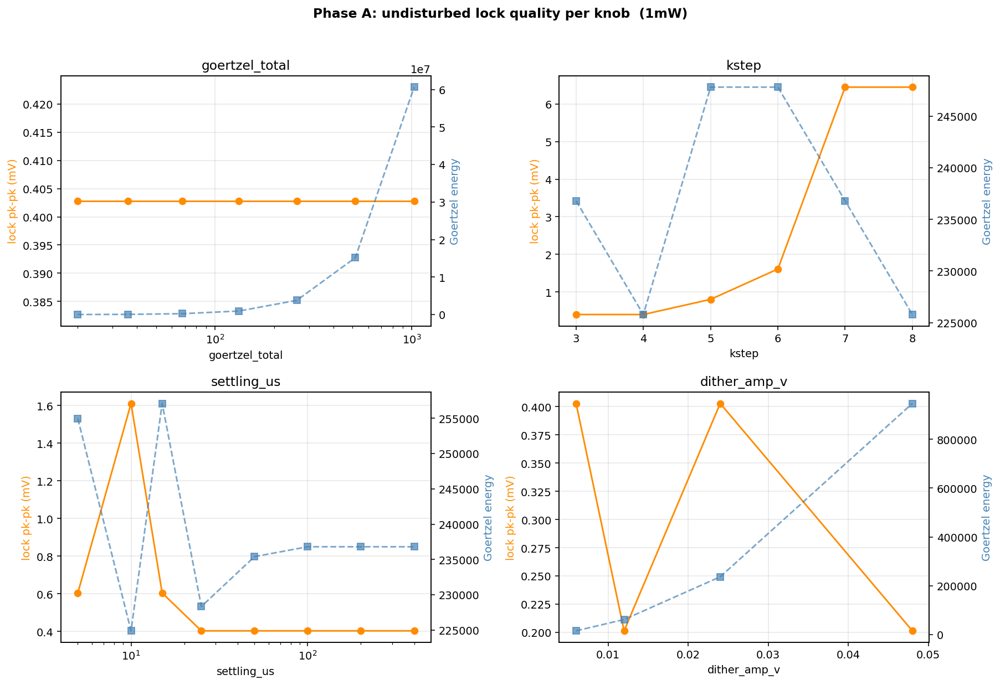
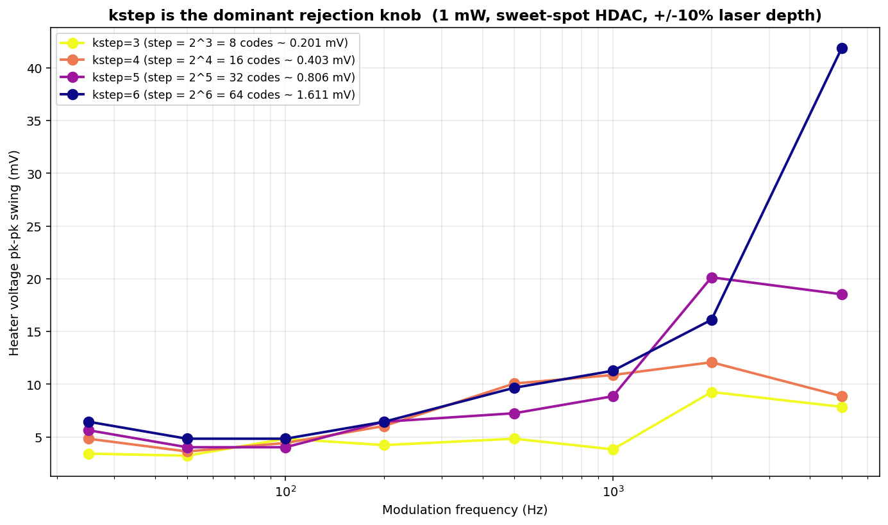
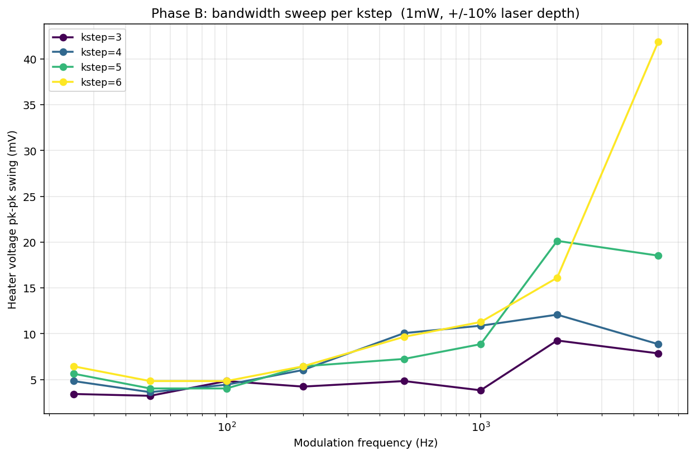
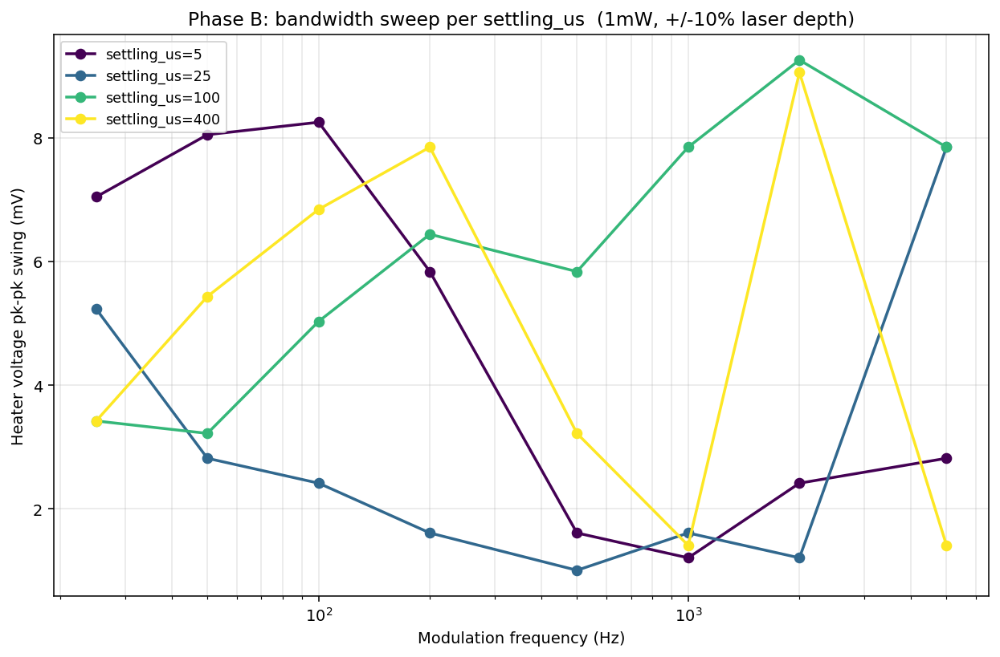
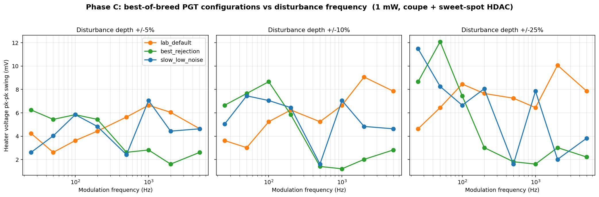
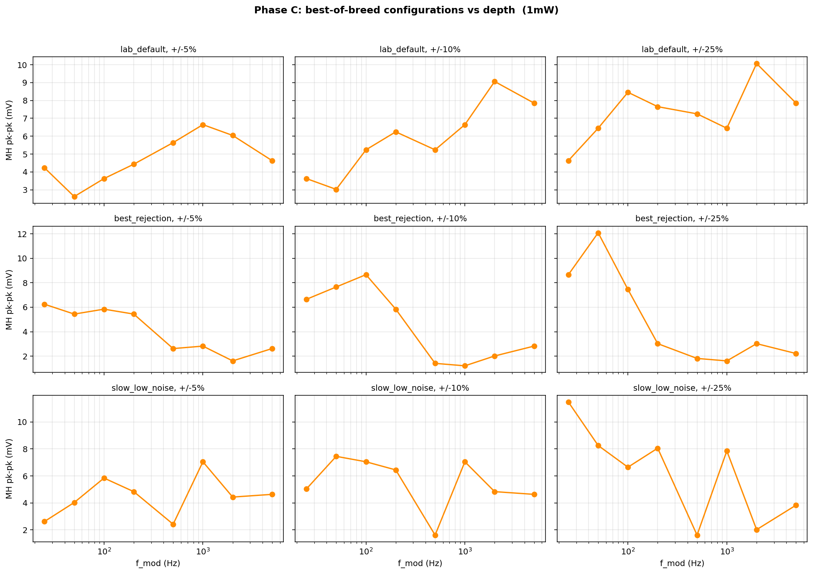
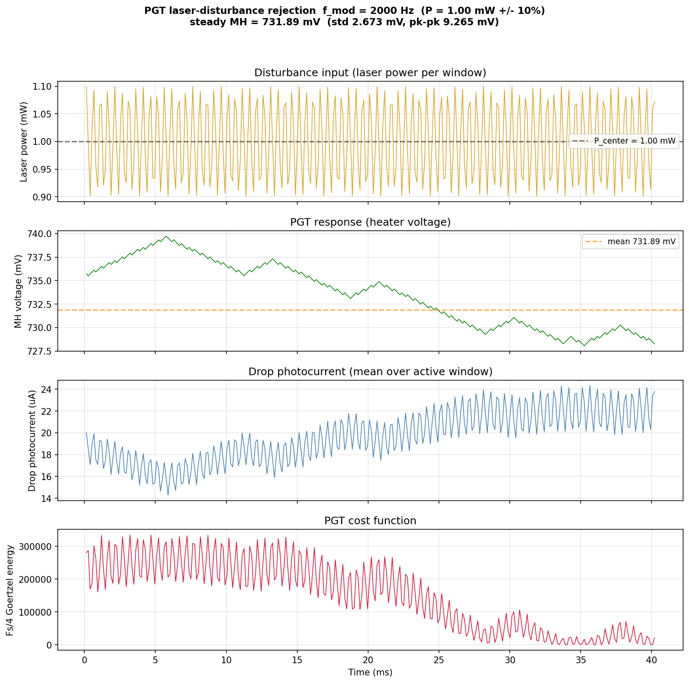
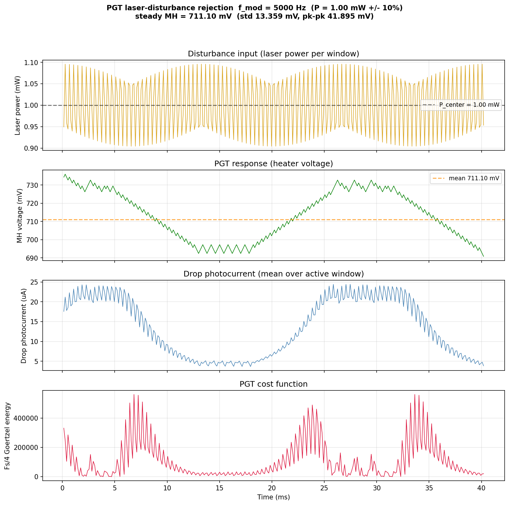
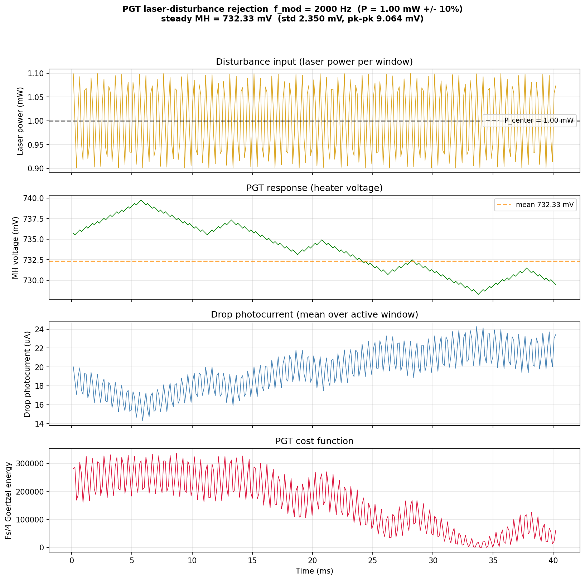
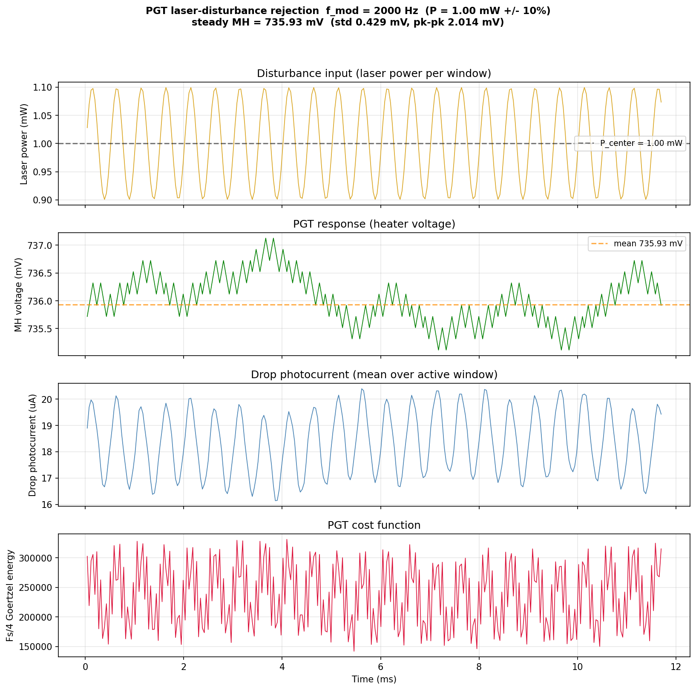

# MRM PGT Laser-Power Aggressor (Loop-Bandwidth) Study — coupe + sweet-spot HDAC, 1 mW

**Priority 2** of `MRM_PGT_BANDWIDTH_REPORT_UPDATE_INSTRUCTIONS.md`, run after
the Priority-1 thermal-drift study. This characterizes how well the PGT
extremum-seeking controller (Goertzel-energy hill-climb on the hot flank) holds
its lock when the **laser power** is sinusoidally modulated, on the migrated
signal path. It **supersedes** the older 0.5 mW characterization in
`goldens/mrm/docs/MRM_PGT_BANDWIDTH_REPORT.md`, whose headline recommendation
("drop `kstep` from 3 to 1") is **physically impossible on the sweet-spot HDAC**
— see the boxed note below.

* **Plant:** `coupe_mrm_block` (TSMC Caribou ring) via `scripts/run_tsmc.sh`
  (caribou-mrm `.venv` Skadi — `skadi.__file__` confirmed under
  `caribou-mrm/.venv`).
* **Heater DAC:** sweet-spot HDAC — 13-bit physical grid (16-bit controller
  code `>> SUB_PWM_BITS=3`), 1.8 V FS, 0.15 V boost, 1.62 V clamp,
  **LSB = 0.201 mV**.
* **ADC:** 16-bit / 500 µA ideal.
* **Optical power:** 1 mW center (matches the thermal study op-point), hot-side
  lock, `mh_voltage_init = 0.736 V`, hot-side Goertzel peak 0.738 V.
* **Aggressor:** `skadi_mrm_pgt_laser_disturbance` sinusoidal laser modulation,
  8 frequencies 25 Hz–5 kHz × 3 depths (±5 %, ±10 %, ±25 %), one subprocess per
  plant. The Fs/4 dither is biased on `PIN_DC_V` (the bug fix that let the
  disturbed testbench `sim.step` at all).
* **kstep grid:** Phase A/B sweep **3, 4, 5, 6 (–8)**; kstep < 3 is sub-LSB on
  the 13-bit HDAC and cannot move the heater, so **kstep = 3 is the floor**.

> ### Why the old "kstep → 1" recommendation no longer applies
> The 0.5 mW report (old GF plant, linear 1.2 V RDAC) recommended `kstep = 1`
> (2 DAC codes ≈ 37 µV) as the dominant disturbance-rejection lever, claiming a
> 5.9× win over the lab default. On the **sweet-spot HDAC the controller code is
> right-shifted by 3 before it reaches the physical 13-bit grid**, so any step
> below 8 controller codes (kstep < 3) rounds to **zero physical movement**.
> kstep = 3 (= 1 LSB = 0.201 mV) is the smallest step that moves the heater at
> all. The old report's entire "make the step smaller" axis is therefore
> truncated at what is now the floor — the rejection knob is gone, and the right
> question becomes "how well does the *floor* step reject, and what is the cost
> of going coarser." That is what this study answers.

## Sources

| Artifact | This folder | Regenerated at (repo) |
|---|---|---|
| Phase A floors (figure + CSV) | [`figures/laser_pgt/phaseA_summary.png`](figures/laser_pgt/phaseA_summary.png), [`data/pgt_laser_phaseA_summary.csv`](data/pgt_laser_phaseA_summary.csv) | `output/mrm_pgt_bandwidth_study/1mW/` |
| Phase B kstep focus / overlay | [`figures/laser_pgt/phaseB_kstep_focus.png`](figures/laser_pgt/phaseB_kstep_focus.png), [`figures/laser_pgt/phaseB_kstep_overlay.png`](figures/laser_pgt/phaseB_kstep_overlay.png) | same dir |
| Phase B other knobs | [`figures/laser_pgt/phaseB_settling_us_overlay.png`](figures/laser_pgt/phaseB_settling_us_overlay.png), [`figures/laser_pgt/phaseB_goertzel_total_overlay.png`](figures/laser_pgt/phaseB_goertzel_total_overlay.png), [`figures/laser_pgt/phaseB_dither_amp_v_overlay.png`](figures/laser_pgt/phaseB_dither_amp_v_overlay.png) | same dir |
| Phase B summary CSV | [`data/pgt_laser_phaseB_summary.csv`](data/pgt_laser_phaseB_summary.csv) | same dir |
| Phase C overlay / grid | [`figures/laser_pgt/phaseC_overlay.png`](figures/laser_pgt/phaseC_overlay.png), [`figures/laser_pgt/phaseC_summary.png`](figures/laser_pgt/phaseC_summary.png) | same dir |
| Phase C summary CSV | [`data/pgt_laser_phaseC_summary.csv`](data/pgt_laser_phaseC_summary.csv) | same dir |
| Curated time-domain traces | [`figures/laser_pgt/wave_*.png`](figures/laser_pgt/) | `output/mrm_pgt_bandwidth_study/1mW/phase{B,C}/.../disturbance_trace.png` |

---

## Executive summary

1. **The PGT lock is laser-power-invariant by design, and on the HDAC floor it
   stays that way.** The Goertzel cost `|I|²+|Q|²` scales with laser power but
   its argmax over heater voltage does not, so the *correct* response to a laser
   swing is for the heater **not to move**. At `kstep = 3` (1 LSB) the residual
   heater swing under a ±10 % laser modulation is **≤ 9.3 mV pk-pk** worst-case
   across the whole 25 Hz–5 kHz band — and only ~0.4 mV undisturbed.
2. **`kstep` is still the single dominant rejection knob — now over the
   3→6 range instead of 1→7.** Worst-case heater pk-pk at ±10 % grows
   **9.3 → 12.1 → 20.1 → 41.9 mV** for kstep 3/4/5/6 (Phase B; Figure 2). A
   coarser step amplifies the controller's spurious chase of the disturbance, so
   **the floor (kstep = 3) is the best rejection setting** and there is nowhere
   better to go.
3. **The other three knobs are second-order at the floor.** `settling_us`
   5–25 µs is marginally better than the 100 µs lab default (≈ 8 vs 9 mV);
   `goertzel_total` ≥ 36 is flat (only the 1024-sample window is slightly worse
   at low frequency); `dither_amp_v` 6–24 mV is indistinguishable and 48 mV is
   slightly worse. None of them moves the worst-case by more than ~15 %.
4. **The worst case has moved to high frequency (2–5 kHz).** With the small step
   the residual no longer drifts monotonically (the 0.5 mW report's
   bias-drift failure is gone); instead the per-window sampling of a 2–5 kHz
   disturbance **aliases to a slow beat** that the loop chases, and a coarse
   kstep turns that beat into tens of mV of heater wander (Figure 5).
5. **Recommendation:** at 1 mW run PGT at **`kstep = 3` (the floor) and
   `settling_us` ≤ 25 µs**, leaving `goertzel_total = 68` and
   `dither_amp_v = ±24 mV` at their defaults. The lab-default config is already
   within ~1 mV of this; the only change worth making is shortening the settling
   delay. Worst-case residual is ~9 mV at ±10 % and ~12 mV at ±25 % — there is no
   longer a dramatic config win to be had, because the HDAC floor already pins
   the step to 1 LSB.

---

## 1. Study execution

| Phase | Sweep | Tasks | Outcome |
|---|---|---|---|
| A. Undisturbed lock floor per knob | each knob × full range, `p_depth = 0` | 24 | all OK |
| B. Per-knob bandwidth sweep @ ±10 % | each knob × 4 values × 8 freqs | 128 | all OK |
| C. Best-of-breed configs × depth | 3 configs × 3 depths × 8 freqs | 72 | all OK |

All runs via `run_pgt_bandwidth_study.py --power 1mW --phases ABC` (14 workers,
one subprocess per plant). Output root:
`output/mrm_pgt_bandwidth_study/1mW/`. The three Phase C configs are
**all pinned at `kstep = 3`** (the floor) and differ only in
`settling_us`/`goertzel_total`:

| Config | goertzel_total | kstep | settling_us | dither_amp_v |
|---|---|---|---|---|
| `lab_default` | 68 | 3 | 100 | ±24 mV |
| `best_rejection` | 68 | 3 | **5** | ±24 mV |
| `slow_low_noise` | **260** | 3 | **200** | ±24 mV |

## 2. Phase A: undisturbed lock floor

With `p_depth = 0`, the settled limit cycle is a clean **2× step** bang-bang
across the peak (Figure 1):

| kstep | step (codes → LSB, mV) | undisturbed pk-pk |
|---|---|---|
| **3** | 8 → 1 LSB, 0.201 mV | **0.40 mV** |
| 4 | 16 → 2 LSB, 0.403 mV | 0.40 mV |
| 5 | 32 → 4 LSB, 0.806 mV | 0.81 mV |
| 6 | 64 → 8 LSB, 1.611 mV | 1.61 mV |
| 7 | 128 → 16 LSB, 3.22 mV | 6.45 mV |
| 8 | 256 → 32 LSB, 6.44 mV | 6.45 mV |

`goertzel_total`, `settling_us` (≥ 15 µs) and `dither_amp_v` are all flat at the
0.40 mV floor; `settling_us = 10` shows a transient-interaction outlier
(1.6 mV) but is otherwise usable. The floor is set entirely by `kstep`.



## 3. Phase B: per-knob bandwidth sweep at ±10 %

### 3.1 The dominant knob: `kstep`

| kstep | step | worst pk-pk (mV) | worst freq |
|---|---|---|---|
| **3** | 1 LSB | **9.3** | 2 kHz |
| 4 | 2 LSB | 12.1 | 2 kHz |
| 5 | 4 LSB | 20.1 | 2 kHz |
| 6 | 8 LSB | 41.9 | 5 kHz |

A 4.5× spread from floor to kstep = 6. The mechanism is unchanged from the old
study (each spurious direction reversal moves the heater by 2× step), but the
usable range is now 3→6, and **the floor is the winner** (Figure 2, 3).





### 3.2 The second-order knobs

| knob | best / worst value | worst pk-pk (mV) | verdict |
|---|---|---|---|
| `settling_us` | 25 µs / 100 µs | 7.9 / 9.3 | short settling marginally better; lab default is the worst of the four |
| `goertzel_total` | 260 / 1028 | 6.6 / 9.3 | flat above 36; only the 1024-sample window is slightly worse (at 50 Hz) |
| `dither_amp_v` | 12 mV / 48 mV | 7.3 / 8.1 | indistinguishable 6–24 mV; 48 mV slightly worse |



None of these moves the worst case by more than ~15 %, in sharp contrast to the
0.5 mW study where `settling_us` was a 2–3× lever. With the step pinned at the
floor, the loop is already near its rejection limit and the remaining knobs only
trim it.

## 4. Phase C: best-of-breed configurations across depths

Because all three configs share `kstep = 3`, they cluster tightly — there is no
Pareto-dominant config any more:

| Config | ±5 % worst pk-pk | ±10 % worst pk-pk | ±25 % worst pk-pk |
|---|---|---|---|
| `lab_default` | 6.7 mV @ 1 kHz | 9.1 mV @ 2 kHz | 10.1 mV @ 2 kHz |
| `best_rejection` (settle 5 µs) | 6.2 mV @ 25 Hz | **8.7 mV @ 100 Hz** | 12.1 mV @ 50 Hz |
| `slow_low_noise` (gt 260, settle 200 µs) | 7.1 mV @ 1 kHz | **7.5 mV @ 50 Hz** | 11.5 mV @ 25 Hz |

`best_rejection` wins at high frequency (short settling tracks the aliased beat
faster), `slow_low_noise` wins at low frequency (longer integration averages out
the per-decision noise), and `lab_default` is within ~1–2 mV of both everywhere.
The spread between configs (≤ 4 mV) is now *smaller* than the spread across
frequency within a single config — the config choice barely matters once the
step is at the floor (Figure 5, 6).





### 4.1 Time-domain gallery

**Floor step, worst-case high frequency (kstep = 3, 2 kHz, ±10 %):** the heater
makes a tight ±5 mV residual; the per-window sampling of the disturbance is
visible but the small step keeps the chase contained.



**Coarse step, the worst point in the whole study (kstep = 6, 5 kHz, ±10 %):**
the 5 kHz disturbance, sampled at the ~7.5 kHz Goertzel-window rate, **aliases to
a slow beat**, and the kstep = 6 step walks the heater ±20 mV (41.9 mV pk-pk,
690→730 mV) chasing it. Drop photocurrent swings 4–25 µA as the operating point
runs off resonance. This is the single failure mode that coarse kstep
introduces.



**lab_default vs best_rejection at the lab-default worst case (2 kHz, ±10 %):**
shortening `settling_us` from 100 µs to 5 µs lets the loop sample the aliased
beat more often, trimming the residual.





---

## 5. Recommendations

### 5.1 Configuration

| Knob | Recommended (1 mW) | Lab default | Note |
|---|---|---|---|
| `csr_hill_climb_kstep` | **3** (floor = 1 LSB) | 3 | already correct; cannot go lower on the HDAC |
| `csr_ds_start_dly` (settling) | **≤ 25 µs** | 100 µs | the only change worth making; ~15 % less residual |
| `csr_goertzel_total_cycles` | 68 | 68 | unchanged (≥ 36 is flat) |
| `dither_amp_v` | ±24 mV | ±24 mV | unchanged (cap at 24 mV) |

A **single configuration** suffices at all three depths; `best_rejection` (the
short-settling variant) is the marginal best, but the lab default is within
~1–2 mV. The dramatic per-config win of the 0.5 mW report is gone because the
step is now pinned at the floor.

### 5.2 Knob ranking by single-factor impact

1. **`kstep`** (decisive): 4.5× across the usable 3→6 range — but the floor is
   the answer, so the practical guidance is "do not increase it."
2. **`settling_us`** (minor): ~15 % improvement going 100 → ≤25 µs.
3. **`goertzel_total`** (negligible above 36).
4. **`dither_amp_v`** (negligible 6–24 mV).

### 5.3 Failure-mode catalogue

| Regime | Symptom | Cause | Mitigation |
|---|---|---|---|
| `kstep ≥ 5`, 2–5 kHz | 20–42 mV pk-pk heater wander | per-window sampling aliases the disturbance to a slow beat; coarse step amplifies the chase | keep `kstep = 3` |
| `kstep < 3` | heater never moves; lock cannot be held against drift | sub-LSB on the HDAC (`code >> 3` rounds to 0) | floor is `kstep = 3` |
| `goertzel_total = 1028`, 50 Hz | ~9 mV at low freq | very long window stretches the decision period | keep `goertzel_total ≈ 68` |
| `dither_amp_v = 48 mV` | ~8 mV, slightly worse | dither itself perturbs the drop signal | cap dither at ±24 mV |

---

## 6. Lab-deployable CSR settings

| Symbolic name | RTL CSR | Width | Recommended | Lab default | Note |
|---|---|---|---|---|---|
| Hill-climb step | `csr_hill_climb_kstep` | 4 bit | **3** | 3 | floor = 8 codes = 1 LSB = 0.201 mV |
| Plant-settling delay | `csr_ds_start_dly` | 7 bit | **≤ 50 samples** (≤ 25 µs) | 200 (100 µs) | only field worth changing |
| Goertzel window | `csr_goertzel_total_cycles` | 12 bit | 68 | 68 | unchanged |
| Goertzel clear | `csr_goertzel_clear_cycles` | — | 4 | 4 | unchanged |
| PN dither amplitude | n/a | n/a | ±24 mV | ±24 mV | unchanged |
| Override-up counter | `csr_pgt_ovr_sel_counter_value` | 3 bit | **0** at 1 mW | 3 | hot peak sits above warmup at 1 mW — see thermal report §2 |

> The override-counter recommendation comes from the thermal study, not this
> one: at 1 mW the hot-side Goertzel peak (0.738 V) is *above* the warmup init
> (0.736 V), so the force-up override causes acquisition overshoot. Use
> `ovr_counter = 0` at 1 mW.

## 7. Out of scope / follow-up

* **Multi-power laser study.** This run is at 1 mW only (for parity with the
  thermal study). The thermal-drift bandwidth was characterized 0.5–8 mW (see
  [`MRM_PGT_THERMAL_DRIFT_REPORT.md`](MRM_PGT_THERMAL_DRIFT_REPORT.md) §8); the
  laser-rejection bandwidth-vs-power sweep is the obvious next step.
* **Non-sinusoidal disturbances** (square/random/chirp), self-heating dynamics,
  and RTL-level Goertzel changes remain out of scope as in the original spec.

## 8. Reproduce

```bash
cd goldens/mrm

# All three phases at 1 mW (14 workers):
scripts/run_tsmc.sh -m src.testbench.run_pgt_bandwidth_study \
    --power 1mW --phases ABC --max-workers 14

# Report figures:
scripts/run_tsmc.sh -m src.testbench.make_pgt_bandwidth_report_plots \
    --power-dir output/mrm_pgt_bandwidth_study/1mW

# Single-config reproduction of the recommended setting:
scripts/run_tsmc.sh -m src.testbench.skadi_mrm_pgt_laser_disturbance \
    --out-dir output/pgt_floor_demo \
    --p-center-W 0.001 --p-depth 0.10 \
    --freqs 25,50,100,200,500,1000,2000,5000 \
    --mh-voltage-init 0.736 --v-heater-fs 1.8 --target-side hot \
    --goertzel-total 68 --goertzel-clear 4 \
    --kstep 3 --settling-us 25 --dither-amp-v 0.024 --ovr-counter 0
```

> Migration fixes applied before running: `DEFAULT_PARAMS` moved to the
> sweet-spot HDAC (`v_heater_fs=1.8`, `boost=True`, `boost_v=0.15`,
> `vout_max=1.62`, `mh_voltage_init=0.736`); kstep sweep grids `1,3,5,7,8 →
> 3,4,5,6,7,8` (Phase A) and `→ 3,4,5,6` (Phase B); all Phase C configs pinned
> at `kstep=3`; and the `pin_driver` override in `_tick_one_adc` was biased on
> `PIN_DC_V` (without which the disturbed `sim.step` failed).
