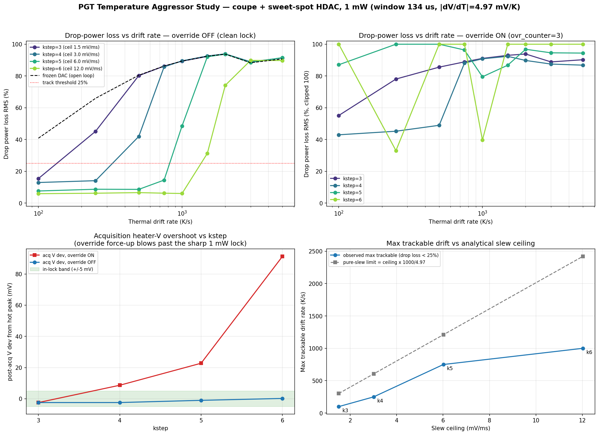
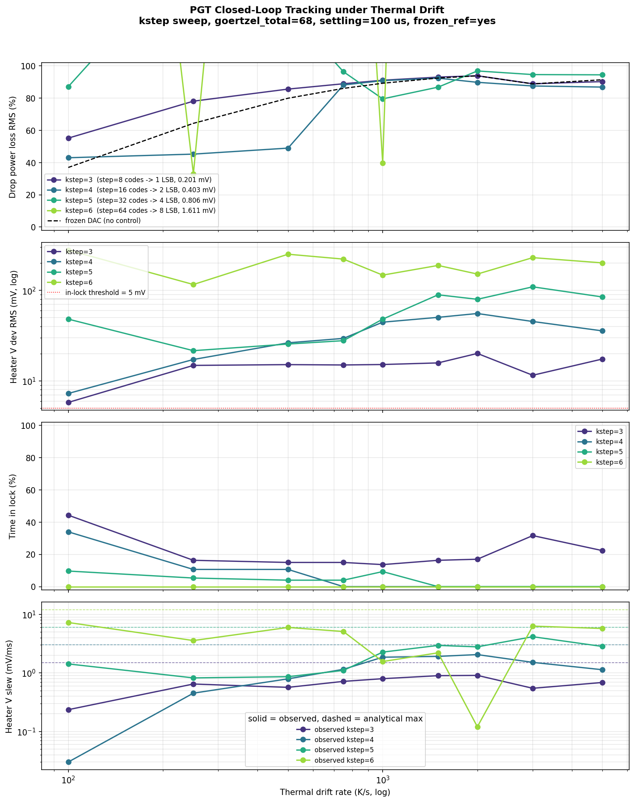
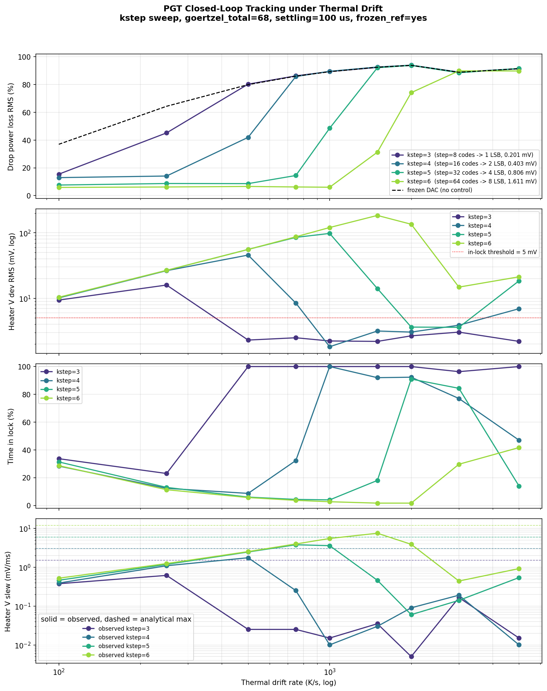

# MRM PGT Temperature (Thermal-Drift) Aggressor Study — coupe + sweet-spot HDAC, 1 mW

**Priority 1** of `MRM_PGT_BANDWIDTH_REPORT_UPDATE_INSTRUCTIONS.md`. This
characterizes how well the PGT extremum-seeking controller (Goertzel-energy
hill-climb on the hot flank of MRM resonance) holds lock under a continuous
ambient **thermal-drift** aggressor, on the new signal path:

* **Plant:** `coupe_mrm_block` (TSMC Caribou ring) via `scripts/run_tsmc.sh`
  (caribou-mrm `.venv` Skadi — confirmed `skadi.__file__` contains
  `caribou-mrm/.venv`).
* **Heater DAC:** sweet-spot HDAC — 13-bit physical grid (16-bit controller
  code `>> SUB_PWM_BITS=3`), 1.8 V FS, 0.15 V boost, 1.62 V clamp,
  **LSB = 0.201 mV**.
* **ADC:** 16-bit / 500 µA ideal.
* **Optical power:** 1 mW. Hot-side Goertzel peak = **0.7381 V**; loop
  initialized at `mh_voltage_init = 0.736 V` after PXV overshoot-and-cool.
  Pre-drift lock is acquired cleanly (acq V dev −2.4 mV, drop ref 18.6 µA ≈
  83 % of the 22.3 µA drop peak — expected for a hot-flank lock).
* **kstep grid:** **3, 4, 5, 6** (kstep < 3 is sub-LSB on the 13-bit HDAC and
  cannot move the heater).
* **Aggressor:** Skadi `disturbances.thermal_drift(rate)`, 9 rates from 100 to
  5000 K/s, 300 controller windows (134 µs each) per run, one subprocess per
  plant, each with a frozen-DAC open-loop reference.

## Sources

| Artifact | This folder | Regenerated at (repo) |
|---|---|---|
| Analysis figure (4-panel) | [`figures/pgt_thermal_drift_analysis.png`](figures/pgt_thermal_drift_analysis.png) | `goldens/mrm/output/mrm_pgt_thermal_drift_study/thermal_drift_analysis.png` |
| Analysis summary | [`data/pgt_thermal_drift_analysis.json`](data/pgt_thermal_drift_analysis.json) | same dir |
| Tracking sweep, override **OFF** (`ovr_counter=0`) — primary | [`figures/pgt_tracking_vs_drift_ovr0.png`](figures/pgt_tracking_vs_drift_ovr0.png), [`data/pgt_sweep_metrics_ovr0.csv`](data/pgt_sweep_metrics_ovr0.csv) | `goldens/mrm/output/mrm_pgt_thermal_drift_study/1mW_ovr0/` |
| Tracking sweep, override **ON** (`ovr_counter=3`, lab default) | [`figures/pgt_tracking_vs_drift_ovr3.png`](figures/pgt_tracking_vs_drift_ovr3.png), [`data/pgt_sweep_metrics_ovr3.csv`](data/pgt_sweep_metrics_ovr3.csv) | `goldens/mrm/output/mrm_pgt_thermal_drift_study/1mW/` |

**Figure 1** below is the 4-panel study summary: (top-left) drop-power loss vs
drift with the override off, (top-right) the same with the lab-default override
on, (bottom-left) acquisition overshoot vs kstep, (bottom-right) max trackable
drift vs the analytical slew ceiling.



---

## Executive summary

1. **The PGT loop tracks ambient thermal drift up to a kstep-dependent ceiling,
   then loses lock.** Using "resonance substantially held" = drop-power-loss
   RMS < 25 %, the max trackable drift rate is **~100 K/s (k3), ~250 K/s (k4),
   ~750 K/s (k5), ~1000–1250 K/s (k6)** at 1 mW. It roughly **doubles per kstep
   increment**, mirroring the slew-ceiling doubling (Figure 1, bottom-right).
2. **Slew is the binding constraint — once the loop is allowed to lock.** The
   max trackable rate tracks the analytical 13-bit slew ceiling linearly, at
   **~0.4× the pure-slew limit** (the extremum-seeking overhead: the loop must
   keep dithering to sense the gradient and only a fraction of windows yield a
   productive same-direction step).
3. **Acquisition, not tracking, is the real trap at high kstep with the lab
   default override.** With `ovr_counter=3` (force-up after osc events), the
   coarse step **overshoots the sharp 1 mW resonance during acquisition** and
   the overshoot grows with kstep: post-acq V dev **+8.7 mV (k4), +22.8 mV
   (k5), +91 mV (k6)**; the lock-point drop current collapses 18.6 → 11.0 →
   5.3 → 0.7 µA. **k5/k6 are off-resonance before drift even starts** (Figure 1,
   bottom-left; Figure 3).
4. **Disabling the override (`ovr_counter=0`) fixes acquisition** at all
   ksteps (post-acq V dev ≤ +0.2 mV) and is the correct config at 1 mW, where
   the hot peak (0.738 V) sits **above** the warmup init (0.736 V) — exactly
   the case the closed-loop CLI documents for `ovr-counter=0`.
5. **Recommendation:** at 1 mW run PGT with **`ovr_counter=0` and `kstep=5–6`**
   for the widest drift margin (~750–1250 K/s) while still acquiring cleanly.
   k6 gives the most headroom; k5 is a slightly more conservative limit-cycle.

---

## 1. Heater tuning coefficient

From all cleanly-tracked runs (drop loss < 15 %), the heater must move
**|dV/dT_amb| ≈ 4.97 mV/K** (heater voltage *decreases* ~5 mV per +1 K ambient
rise, to pull the ring back onto resonance). This is consistent to within
±0.5 mV/K across kstep and drift rate, so it is a robust plant constant for the
1 mW hot-flank operating point. It converts a drift rate to a required heater
slew:  required slew (mV/ms) = 4.97 × rate(K/s) / 1000.

## 2. Acquisition overshoot vs kstep (override ON vs OFF)

| kstep | step (codes → LSB, mV) | acq V dev, `ovr=3` | acq drop ref, `ovr=3` | acq V dev, `ovr=0` |
|---|---|---|---|---|
| 3 | 8 → 1 LSB, 0.201 mV | −2.4 mV | 18.58 µA | −2.4 mV |
| 4 | 16 → 2 LSB, 0.403 mV | **+8.7 mV** | 10.98 µA | −2.4 mV |
| 5 | 32 → 4 LSB, 0.806 mV | **+22.8 mV** | 5.34 µA | −1.0 mV |
| 6 | 64 → 8 LSB, 1.611 mV | **+91.3 mV** | 0.71 µA | +0.2 mV |

With the override on, only **kstep=3** lands inside the ±5 mV in-lock band.
The override force-up combined with a coarse step walks the operating point up
the steep hot flank and never reverses; the larger the step, the further it
runs. With the override off, the hill-climb reverses at the peak and all
ksteps settle within ±2.4 mV. **Figure 2** shows the override-ON sweep, where
the k5/k6 curves start already degraded because acquisition put them
off-resonance before drift began (contrast with the clean override-OFF curves
in Figure 1, top-left).



## 3. Tracking results — drop-power loss RMS (%), override OFF

| kstep | 100 | 250 | 500 | 750 | 1000 | 1500 | 2000 | 3000 | 5000 K/s |
|---|---|---|---|---|---|---|---|---|---|
| **3** | 15.4 | 45.2 | 80.2 | 86.2 | 89.3 | 92.3 | 93.7 | 88.8 | 91.4 |
| **4** | 12.9 | 14.1 | 41.9 | 85.7 | 89.5 | 92.6 | 93.9 | 88.9 | 91.4 |
| **5** | 7.6 | 8.7 | 8.6 | 14.5 | 48.5 | 92.1 | 93.8 | 88.5 | 91.6 |
| **6** | 5.9 | 6.2 | 6.6 | 6.2 | 6.0 | 31.3 | 74.1 | 89.8 | 89.7 |
| *frozen (open loop)* | ~38 | ~65 | ~80 | ~86 | ~89 | ~92 | ~94 | ~88 | ~91 |

Reading down each column: higher kstep holds resonance to a higher drift rate.
Reading the closed-loop rows against the frozen baseline: where the loop is in
its tracking band (e.g. k5/k6 ≤ 500 K/s: 6–9 % vs ~80 % open-loop) the control
benefit is large; once drift exceeds the slew ceiling, the heater can no longer
keep up and closed-loop converges onto the open-loop loss (the loop parks near
the last peak while the resonance runs away). **Figure 3** plots these rows
(error RMS, lock retention, and observed-vs-analytical heater slew vs drift)
for the override-OFF sweep.



> **Metric note.** The drift-phase `in_lock` flag (`|V − V_hot_peak| < 5 mV`)
> is *not* a reliable tracking indicator here: past the slew ceiling the heater
> simply stops moving (sits near the peak it started on), so `in_lock` can read
> high while drop power is fully lost. **Drop-power loss is the correct
> tracking metric** and is what the tables and the max-trackable numbers use.

## 4. Max trackable drift vs analytical slew ceiling

| kstep | slew ceiling (mV/ms) | max trackable (obs, <25 %) | pure-slew limit (ceiling·1000/4.97) | obs / slew-limit |
|---|---|---|---|---|
| 3 | 1.50 | ~100 K/s | 302 K/s | 0.33 |
| 4 | 3.01 | ~250 K/s | 605 K/s | 0.41 |
| 5 | 6.01 | ~750 K/s | 1210 K/s | 0.62 |
| 6 | 12.02 | ~1000–1250 K/s | 2419 K/s | ~0.4 |

The observed ceiling scales linearly with the slew ceiling (Figure 1,
bottom-right) but lands at ~40 % of the pure-slew limit. The shortfall is
intrinsic to extremum seeking: the loop dithers and hill-climbs rather than
slewing monotonically, so its *effective* tracking slew is a fraction of the
raw `step/window`. Practically, budget **trackable rate ≈ 0.4 × (slew ceiling ×
1000 / 4.97 mV/K)**.

## 5. Comparison to L2V

The L2V controller was run through the **identical** study (coupe + sweet-spot
HDAC + 16-bit/500 µA ADC at 1 mW) — see
[`MRM_L2V_THERMAL_DRIFT_REPORT.md`](MRM_L2V_THERMAL_DRIFT_REPORT.md). At matched
physical step granularity L2V tracks **2.7–7.5× faster drift** than PGT:

| step granularity | PGT max trackable | L2V max trackable | L2V / PGT |
|---|---|---|---|
| 1 LSB (PGT k3 / L2V step 8) | 100 K/s | 750 K/s | 7.5× |
| 2 LSB (k4 / step 16) | 250 K/s | 1250 K/s | 5.0× |
| 4 LSB (k5 / step 32) | 750 K/s | 2000 K/s | 2.7× |
| 7–8 LSB (k6 / step 56) | 1000 K/s | 2500 K/s | 2.5× |

Both controllers are **slew-ceiling limited**, but L2V's edge is structural:
its control tick is **50 µs vs PGT's 134 µs** Goertzel window (2.7× higher slew
ceiling per LSB), and it slews monotonically toward an absolute ADC target
(efficiency 0.94 at 1 LSB) instead of spending half its budget dithering to
sense a gradient (PGT ~0.4× at all ksteps). The trade-offs PGT keeps: it parks
*at* the resonance peak (max drop power, no fixed ADC setpoint) whereas L2V sits
at a 75 %-of-peak target with step-proportional ripple — and PGT, not L2V, is
the one that needs `ovr_counter=0` to acquire cleanly at high step. For pure
thermal-drift bandwidth, L2V wins here.

## 6. Recommendation & caveats

* **Run PGT at 1 mW with `ovr_counter=0`.** At 1 mW the hot-side lock is above
  the warmup voltage, so the force-up override only hurts (acquisition
  overshoot). `ovr_counter=0` is the documented config for this case.
* **Use kstep = 5 or 6** for the widest thermal-drift margin (~750–1250 K/s)
  while still acquiring within ±1 mV. k6 maximizes headroom; k5 trades a little
  margin for a tighter steady-state limit cycle.
* **kstep = 3 is fragile** at 1 mW (max ~100 K/s, and even there 15 % drop
  loss) — the 1-LSB step is too slow for any meaningful ambient drift.
* **Caveats:** drift phase is 300 windows (≈40 ms), so very low rates do not
  fully exercise long-horizon wander; max-trackable values are bracketed by the
  drift grid (k6 onset is between 1000 and 1500 K/s). The 13-bit DAC model is
  the static thermal-average (no time-domain PWM), exact for the MRM thermal
  bandwidth. Adaptive-kstep (boost on sustained drift) was not run this pass and
  is the obvious next lever to widen margin without sacrificing acquisition.

## 7. Reproduce

```bash
cd goldens/mrm

# Primary tracking sweep (override OFF — clean lock at all ksteps):
scripts/run_tsmc.sh -m src.testbench.skadi_mrm_pgt_thermal_drift_sweep \
    --sweep-summary-json output/skills_rerun_1mW/pgt_lock_sweep/pgt_lock_sweep_summary.json \
    --ksteps 3,4,5,6 \
    --drift-rates 100,250,500,750,1000,1500,2000,3000,5000 \
    --mh-voltage-init 0.736 --v-heater-fs 1.8 --ovr-counter 0 \
    --n-acq-windows 150 --n-drift-windows 300 --n-workers 8 \
    --out-dir output/mrm_pgt_thermal_drift_study/1mW_ovr0

# Lab-default sweep (override ON — documents the acquisition overshoot):
#   ... same as above with --ovr-counter 3 and --out-dir .../1mW

# Analysis figure + summary (pure post-processing, plain python3):
python3 -m src.testbench.analyze_pgt_thermal_drift_study
```

> Two traps fixed in `skadi_mrm_pgt_thermal_drift_sweep.py` before running:
> `--ksteps` default 1,2,3,4 → **3,4,5,6** (sub-LSB floor), and
> `_slew_ceiling_mV_per_ms()` rewritten from the old linear DAC math to the
> **13-bit snapped sweet-spot model** (`(2^kstep >> 3)/8192 × (v_fs − boost_v)`).
> The DAC defaults (`v_heater_fs` 1.2 → 1.8, `mh_voltage_init` → 0.736) were
> also corrected.
