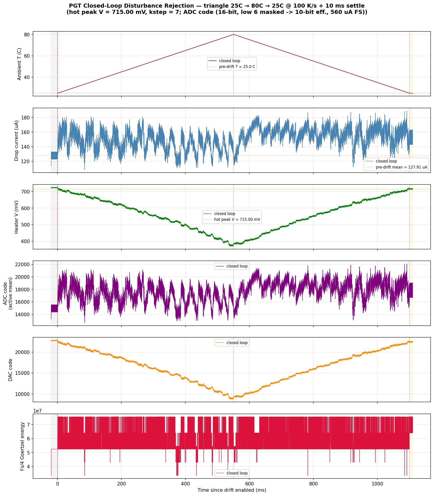
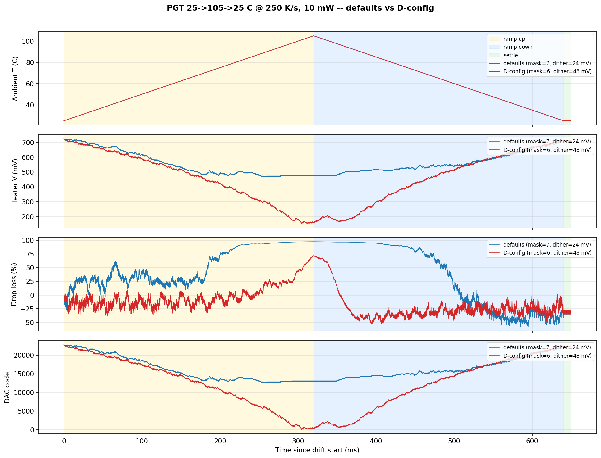
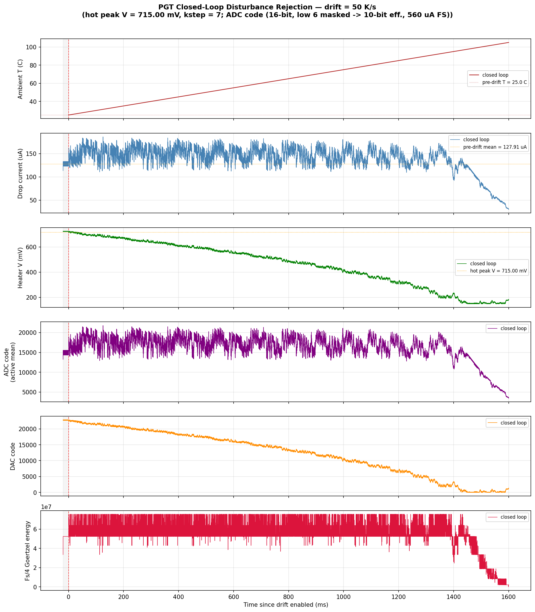
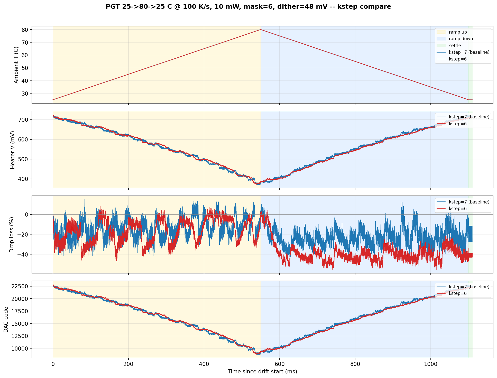

# MRM PGT Triangle-Aggressor Report -- coupe + sweet-spot HDAC, 10 mW

Companion to [`MRM_PGT_THERMAL_DRIFT_REPORT.md`](MRM_PGT_THERMAL_DRIFT_REPORT.md)
(monotonic drift, 1 mW, kstep x rate sweep). This report extends the PGT
thermal-aggressor study to a **triangular** ambient profile (ramp up to a peak
and back down), a **10 mW** operating point, and a **multi-knob sweep** over
`kstep`, `adc_mask_bits`, and `dither_amp_v`. Where the 1 mW report measured the
max trackable monotonic *rate*, this report measures the operating *envelope* --
how warm the ring can run before the loop fails, and which of three distinct
failure modes binds first.

## Sources

| Artifact | This folder | Regenerated at (repo) |
|---|---|---|
| Winning config, 5-panel | [`figures/pgt_triangle/winner_25to80_100Kps_5panel.png`](figures/pgt_triangle/winner_25to80_100Kps_5panel.png) | `goldens/mrm/output/pgt_baseline_10mW/triangle_25to80_100Kps_mask6_dither48/pgt_thermal_drift.png` |
| kstep=6 vs 7 overlay | [`figures/pgt_triangle/kstep_compare_25to80_100Kps.png`](figures/pgt_triangle/kstep_compare_25to80_100Kps.png) | `goldens/mrm/output/pgt_baseline_10mW/k6_vs_k7_100Kps_compare.png` |
| Defaults vs D-config overlay | [`figures/pgt_triangle/defaults_vs_dconfig_25to105_250Kps.png`](figures/pgt_triangle/defaults_vs_dconfig_25to105_250Kps.png) | `goldens/mrm/output/pgt_baseline_10mW/defaults_vs_dconfig_25to105_250Kps_compare.png` |
| Per-run 5-panels + metrics | [`figures/pgt_triangle/`](figures/pgt_triangle/), [`data/pgt_triangle/`](data/pgt_triangle/) | `goldens/mrm/output/pgt_baseline_10mW/<run>/` |

The methodology, pitfall taxonomy, and a preflight dither-resolvability checker
live in the repo skill `agents/skills/pgt-thermal-aggressor-sweep/`.

---

## Executive summary

1. **PGT at 10 mW holds a 25 -> 80 -> 25 C triangle at 100 K/s** with apex
   drop-loss RMS **12.6 %** and a round-trip residual of **-19.5 %** (drop loss
   remaining in the 10 ms settle window after ambient returns to 25 C). This is
   the validated operating point.
2. **The winning configuration is `kstep=7`, `adc_mask_bits=6` (10-bit ENOB),
   `dither_amp_v=0.048`, `goertzel_total=68`**, with the init lock point derived
   per-power from the 10 mW open-loop sweep (`hot_peak_V = 0.715 V`).
3. **The configuration is brittle.** Dropping any single tuning knob measurably
   degrades tracking: `kstep -> 6` wrecks round-trip recovery (-41 % vs -19 %),
   `mask -> 7` re-blinds the apex, and `dither -> 24 mV` destabilizes the settle.
4. **Three distinct failure modes were isolated.** Conflating them was the main
   time sink, so they are named and separated here:
   - **F-A sense-blind apex** -- at a 105 C apex the resonance slope at the
     masked-LSB threshold collapses; the loop goes blind near the peak.
   - **F-B actuator saturation** -- a monotonic ramp to 105 C drives the heater
     past 0 V; the DAC clamps ~150 mV short of what the ring needs.
   - **F-C hill-climb step too small** -- `kstep=6` makes the dither slope-sign
     decision unreliable on the way down from apex.
5. **Operating envelope:** 25-80 C, ramp <= 100 K/s triangle (or <= 50 K/s
   monotonic to ~80 C), 10 mW. Pushing the apex to 105 C blows it open via F-A
   and F-B simultaneously.

---

## 1. Setup and what is new vs the 1 mW report

The plant, DAC, and ADC models are identical to the 1 mW thermal-drift report:
`coupe_mrm_block` (TSMC Caribou ring) on the sweet-spot HDAC (13-bit physical
grid, 1.8 V FS, LSB = 0.201 mV) with the production 16-bit / 560 uA masked IADC.
Three things change:

- **10 mW, not 1 mW.** At 1 mW the PN-dither swing at the resonance slope sits
  below the masked-ADC LSB once the low bits are zeroed, so the Goertzel
  gradient sense goes blind (the `closed_loop` row in the timeline below). The
  preflight checker (`preflight_dither_check.py`) flags 1 mW BLIND and 10 mW
  MARGINAL (recommending `mask=6`) for the production ADC with a 100x
  thermal-attenuation factor. 10 mW is the realistic stress-test power.
- **Triangle, not monotonic.** A symmetric ramp up to a peak and back to 25 C
  exposes two behaviors a monotonic ramp cannot: apex recovery (does the loop
  survive the slope-flattening near the peak) and round-trip residual (does it
  reacquire the original lock once ambient relaxes). The bench gained
  `--drift-profile triangle` with `--triangle-peak-C`, `--triangle-rate-K-per-s`,
  and `--triangle-settle-ms`, driving ambient directly via
  `sknetwork.set_ambient_temperature()` per window.
- **Multi-knob sweep.** Beyond `kstep`, this study sweeps `adc_mask_bits`
  (effective ENOB at the slope sense) and `dither_amp_v` (slope-sense headroom),
  because the apex failure at 10 mW is a sensing problem, not purely a slew one.

Metrics are reported per triangle phase (ramp-up / apex / ramp-down / settle).
The headline tracking metric is **drop-power loss** (percentage below the
post-acquisition, pre-drift drop current); the `in_lock` flag is unreliable
under drift (it is tied to a fixed initial lock voltage that the loop is
supposed to walk away from) and is not used for pass/fail.

## 2. Headline result -- the operating point

Winning configuration on **25 -> 80 -> 25 C @ 100 K/s + 10 ms settle, 10 mW**:

| knob | value | rationale |
|---|---|---|
| `kstep` | **7** (128 codes ~ 303 mV) | larger steps sample more of the resonance per dither cycle; k=6 collapses on ramp-down (section 5) |
| `adc_mask_bits` | **6** (10-bit ENOB) | one fewer masked bit doubles effective ADC resolution at the slope sense |
| `dither_amp_v` | **0.048** (2x default) | raises AC slope swing above the masked-LSB floor |
| `goertzel_total` | **68** | default; longer windows cost wallclock with no measurable gain |
| `settling_us` | **100** | default |
| init lock point | derived per-power | hot-side resonance from the 10 mW open-loop sweep (`hot_peak_V = 0.715 V`), not hardcoded |

Phase metrics (from
[`data/pgt_triangle/winner_25to80_100Kps_metrics.json`](data/pgt_triangle/winner_25to80_100Kps_metrics.json)):

| phase | drop-loss RMS | drop-loss max |
|---|---|---|
| ramp-up | 17.6 % | 41.6 % |
| apex | 12.6 % | 29.2 % |
| ramp-down | 24.9 % | 47.7 % |
| settle | 20.3 % | 27.3 % |
| round-trip residual | -19.5 % | -- |

Heater V end-start drift is only **-9.7 mV** -- the loop returns essentially to
its starting operating point after the full round trip. The 5-panel trace
(temperature, drop current, ADC mean, heater V, DAC code, Goertzel energy):



## 3. Failure mode F-A -- sense-blind apex

At a **105 C** apex the heater must drive toward ~0 V to keep the ring on
resonance, and the resonance slope at the masked-LSB threshold flattens. The
Goertzel gradient sense loses its sign and the loop goes blind near the peak.
This is a *sensing* limit, not a slew or actuator limit: ramp-up looks fine and
ramp-down recovers once the loop re-enters the linear-slope regime.

The cleanest evidence is the defaults-vs-D-config overlay on
**25 -> 105 -> 25 C @ 250 K/s**:



- **Defaults (mask=7, dither=24 mV):** apex drop-loss RMS **97.2 %**. The heater
  stops moving near 480 mV and the loop is fully blind across the apex shoulder
  (the long flat 95-100 % loss plateau in the drop-loss panel).
- **D-config (mask=6, dither=48 mV):** apex drop-loss RMS **63.7 %**. One bit of
  recovered ENOB plus 2x dither lets the heater track all the way down to
  ~100 mV, but it still loses the apex -- it just recovers faster on the way
  down.

Per-run 5-panels:
[`defaults_25to105_250Kps_5panel.png`](figures/pgt_triangle/defaults_25to105_250Kps_5panel.png)
and
[`dconfig_25to105_250Kps_5panel.png`](figures/pgt_triangle/dconfig_25to105_250Kps_5panel.png).
Neither mask=6 alone (71.9 % apex) nor dither=48 mV alone (77.3 % apex, and it
*destabilizes* the settle with a +83 % round-trip residual) fixes it; see the
timeline rows 7-9. **Fix: lower the apex to 80 C**, which keeps operation below
the sense-blind region entirely.

## 4. Failure mode F-B -- actuator saturation

On a **monotonic 25 -> 105 C ramp at 50 K/s** with the D-config, the loop tracks
cleanly until ~95 C, then the heater voltage drifts down past 0 V and the DAC
clamps. With `hot_peak_V = 0.715 V` and a 1.8 V FS HDAC, the heater is pulled
toward 0 V as ambient rises (the plant constant is ~5 mV/K from the 1 mW report);
by 105 C the DAC floor is ~150 mV short of the drive needed to hold resonance.



Evidence (from
[`data/pgt_triangle/actuator_saturation_50Kps_25to105_metrics.json`](data/pgt_triangle/actuator_saturation_50Kps_25to105_metrics.json)):
heater V end-start drift **-539 mV**, drop loss climbing monotonically after the
heater flatlines. This is distinct from F-A: F-A is the loop going blind near
the peak (a sensing problem that recovers); F-B is the loop running out of
physical actuator range (a hardware limit that does not). **Fix: more heater
range (a HW change) or stay below ~80 C.**

## 5. Failure mode F-C -- hill-climb step too small

With **`kstep=6`** (step ~152 mV) the per-window dither becomes too small
relative to the in-window resonance curvature, so the slope-sign decision gets
noisy on the way down from apex. The loop oscillates near a sub-optimal lock
point and never reacquires the resonance peak as ambient relaxes.

The kstep=6-vs-7 overlay on the winning **25 -> 80 -> 25 C @ 100 K/s** profile
shows the mechanism precisely: heater V and DAC trajectories are nearly
*identical* between the two -- the loop walks the same average distance -- but
drop loss diverges only on the ramp-down phase.



| metric | kstep=7 (winner) | kstep=6 |
|---|---|---|
| apex drop-loss RMS | 12.6 % | 15.6 % |
| ramp-down drop-loss RMS | 24.9 % | 40.2 % |
| round-trip residual | -19.5 % | -41.1 % |
| heater V end-start | -9.7 mV | -17.7 mV |

Slowing the ramp to **50 K/s** does not rescue kstep=6 (round-trip residual
-33.0 %, and the apex actually gets *worse* at 23.2 % because the loop spends
twice as long mid-flank with an insufficient step). Per-run 5-panels:
[`kstep6_25to80_100Kps_5panel.png`](figures/pgt_triangle/kstep6_25to80_100Kps_5panel.png)
and
[`kstep6_25to80_50Kps_5panel.png`](figures/pgt_triangle/kstep6_25to80_50Kps_5panel.png).
**Fix: keep kstep=7.**

## 6. Campaign timeline

The run sequence reflects the diagnostic path more than a pre-planned matrix.
All runs are 10 mW unless noted; "defaults" means `mask=7, dither=24 mV`.

| # | Run | Profile | knobs vs default | apex drop-loss RMS | round-trip residual | takeaway |
|---|---|---|---|---|---|---|
| 1 | `closed_loop` | 1 mW, monotonic 50 K/s | defaults | n/a | n/a | Blind loop. 1 mW dither below masked-ADC LSB. |
| 2 | `closed_loop_250ms` | 10 mW, monotonic 50 K/s | defaults | low | n/a | Tracks fine; established 10 mW as the working baseline. |
| 3 | `drift250Kps_k7` | monotonic 250 K/s | kstep=7 | last-20 % 14.9 % | n/a | Tracks but accumulates -416 mV heater drift over 250 ms. |
| 4 | `drift250Kps_k7_dither48` | monotonic 250 K/s | kstep=7, dither=48 mV | last-20 % 18.0 % | n/a | Higher dither alone slightly worse on a monotonic ramp. |
| 5 | `drift250Kps_k7_mask6` | monotonic 250 K/s | kstep=7, mask=6 | last-20 % 14.8 % | n/a | mask=6 ~ defaults on monotonic; benefit shows up under triangle. |
| 6 | `triangle_pivot` | 25->105->25 @ 250 K/s | defaults | **97.2 %** | -31.1 % | F-A: apex blindness, dither below LSB at the peak. |
| 7 | `triangle_mask6` (B) | 25->105->25 @ 250 K/s | mask=6 | 71.9 % | -27.4 % | One bit of ENOB recovered; apex still ugly. |
| 8 | `triangle_dither48` (C) | 25->105->25 @ 250 K/s | dither=48 mV | 77.3 % | +83.4 % | Higher dither alone destabilizes the settle. |
| 9 | `triangle_mask6_dither48` (D) | 25->105->25 @ 250 K/s | mask=6, dither=48 mV | 63.7 % | -31.1 % | Best D combo at 250 K/s; still loses apex (F-A). |
| 10 | `ramp_50Kps_mask6_dither48` | 25->105 monotonic @ 50 K/s | D-config | last-20 % 33.9 % | n/a | F-B: heater drift -539 mV, DAC saturated near apex. |
| 11 | `triangle_25to80_100Kps_mask6_dither48` (winner) | 25->80->25 @ 100 K/s | D-config | **12.6 %** | **-19.5 %** | Operating envelope. |
| 12 | `triangle_25to80_100Kps_k6_mask6_dither48` (F1) | 25->80->25 @ 100 K/s | D-config + kstep=6 | 15.6 % | -41.1 % | F-C: smaller step wrecks round-trip; rules out k=6. |
| 13 | `triangle_25to80_50Kps_k6_mask6_dither48` (F2) | 25->80->25 @ 50 K/s | D-config + kstep=6 | 23.2 % | -33.0 % | Slowing the ramp does not rescue k=6. |

## 7. Operating envelope

Validated envelope for PGT at 10 mW with the winning config:

- **Temperature:** 25-80 C. The 80 C apex keeps operation below the F-A
  sense-blind region and within F-B actuator headroom.
- **Ramp rate:** <= 100 K/s symmetric triangle, or <= 50 K/s monotonic up to
  ~80 C.
- **Laser power:** 10 mW. 1 mW is below the dither-resolvability floor for the
  production masked ADC.

The envelope is bounded by all three failure modes at once: pushing the apex to
105 C trips F-A (sensing) and, on a sustained monotonic ramp, F-B (actuator);
relaxing kstep to 6 trips F-C (hill-climb). Each tuning knob is load-bearing --
this is a corner, not a plateau.

**Not tested (open levers):** per-power init derivation in the production code
path (computed by hand here and passed via `--mh-voltage-init`); D-config with
`kstep=8` on a 25->90->25 profile; laser power > 10 mW (should push the dither
further above LSB and widen the envelope); `goertzel_total >= 132` under a
triangle profile (no benefit seen on monotonic). Adaptive kstep is explicitly
out of scope -- not available in hardware.

## 8. Tooling produced

- `agents/skills/pgt-thermal-aggressor-sweep/SKILL.md` -- reusable methodology:
  pitfall taxonomy (blind-loop, wrong-metric, kstep-too-small, apex-asymmetry),
  parameter trade-offs, wall-time budgeting, plotting helpers.
- `agents/skills/pgt-thermal-aggressor-sweep/scripts/preflight_dither_check.py`
  -- predicts dither resolvability from laser power, dither amplitude, mask
  bits, and a thermal-attenuation factor (default 100x). Run before any sweep.
- `goldens/mrm/scripts/plot_pgt_drift_compare.py` -- N-way overlay of trace CSVs
  (ambient, heater V, drop loss, DAC code) with per-phase shading; used for both
  comparison figures here.
- `goldens/mrm/src/testbench/skadi_mrm_pgt_thermal_drift.py` -- gained
  `--drift-profile triangle` (`--triangle-peak-C`, `--triangle-rate-K-per-s`,
  `--triangle-settle-ms`) and per-phase metric fields in the metrics JSON.

A companion plan to port this study to the L2V controller is at
`goldens/mrm/docs/L2V_THERMAL_AGGRESSOR_PLAN.md`.

## 9. Reproduce

```bash
cd goldens/mrm

# 10 mW open-loop op-point (provides hot_peak_V for the init lock point):
#   output/mrm_pgt_power_campaign/10p0mW/op_point/pgt_lock_sweep_summary.json
# (already on disk; regenerate via the power campaign if needed)

SUMMARY=output/mrm_pgt_power_campaign/10p0mW/op_point/pgt_lock_sweep_summary.json

# Winning config -- 25 -> 80 -> 25 C @ 100 K/s, kstep=7, mask=6, dither=48 mV:
scripts/run_tsmc.sh -m src.testbench.skadi_mrm_pgt_thermal_drift \
  --sweep-summary-json "$SUMMARY" \
  --out-dir output/pgt_baseline_10mW/triangle_25to80_100Kps_mask6_dither48 \
  --drift-profile triangle --triangle-peak-C 80 \
  --triangle-rate-K-per-s 100 --triangle-settle-ms 10 \
  --kstep 7 --adc-mask-bits 6 --dither-amp-v 0.048 \
  --goertzel-total 68 --temperature 25

# F-C kstep=6 comparators (same profile, kstep=6; and a 50 K/s variant):
#   --kstep 6 ... --triangle-rate-K-per-s 100   (-> triangle_25to80_100Kps_k6_mask6_dither48)
#   --kstep 6 ... --triangle-rate-K-per-s 50     (-> triangle_25to80_50Kps_k6_mask6_dither48)

# Comparison overlays:
python3 scripts/plot_pgt_drift_compare.py \
  --trace output/pgt_baseline_10mW/triangle_25to80_100Kps_mask6_dither48/pgt_thermal_drift_trace.csv \
  --label "kstep=7 (baseline)" \
  --trace output/pgt_baseline_10mW/triangle_25to80_100Kps_k6_mask6_dither48/pgt_thermal_drift_trace.csv \
  --label "kstep=6" \
  --title "PGT 25->80->25 C @ 100 K/s, 10 mW, mask=6, dither=48 mV -- kstep compare" \
  --out output/pgt_baseline_10mW/k6_vs_k7_100Kps_compare.png
```

Long triangle runs (hours of wallclock) should be launched detached
(`nohup setsid ... &`) -- a foreground 50 K/s run was lost to a session drop
during this campaign.
