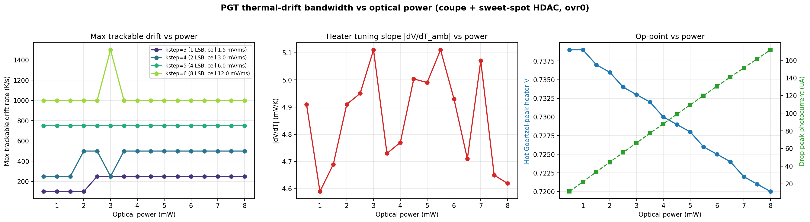
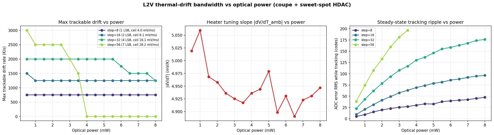
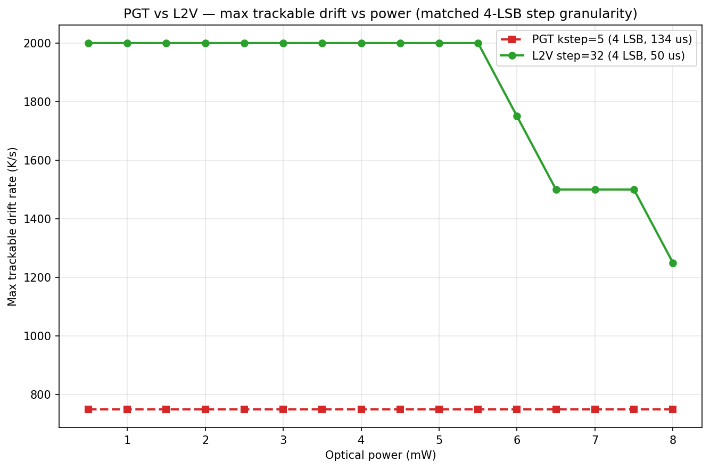
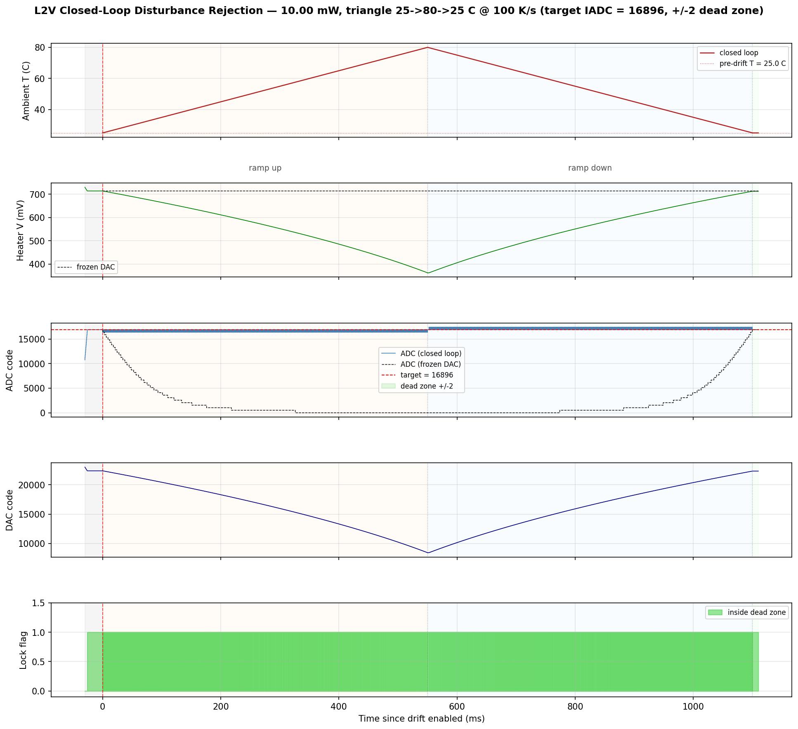
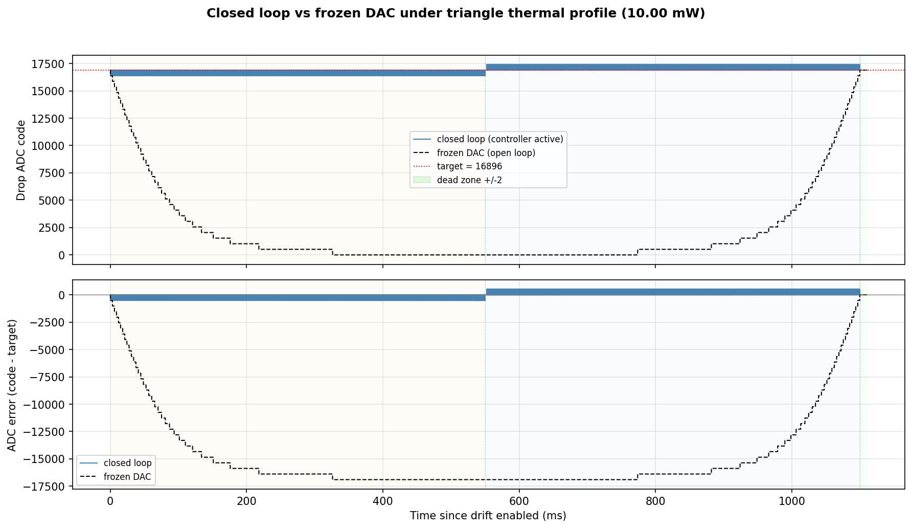
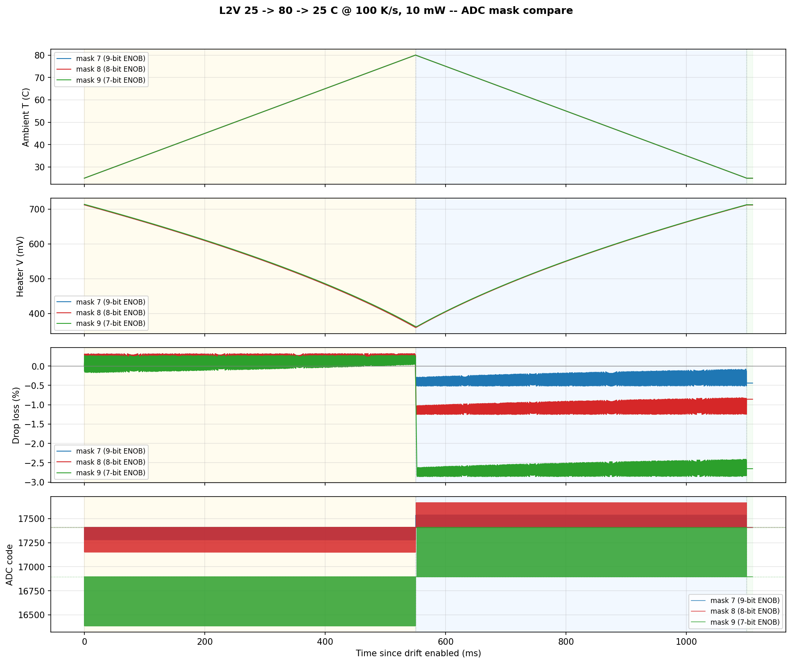

# MRM Thermal-Aggressor Simulations — PGT & L2V (consolidated)

Single-document capture of **all MRM thermal-aggressor simulation work** for both
controllers on the **coupe** ring + **sweet-spot HDAC**:

* **Controllers:** **PGT** (Goertzel-energy extremum-seeking hill-climb on the hot
  flank) and **L2V** (dead-zone target-tracking bang-bang to an absolute / ratio
  ADC setpoint on the hot flank).
* **Thermal profiles:** **monotonic drift** (continuous ambient ramp at a fixed
  K/s rate, 1 mW, step × rate sweep) and **triangle** (symmetric ramp up to an
  apex and back, 10 mW, masked-ADC sweep).
* **Aggressor:** ambient temperature only. Laser-power aggressor studies are
  documented separately (`docs/MRM_PGT_LASER_BANDWIDTH_REPORT.md`,
  `docs/MRM_L2V_LASER_BANDWIDTH_REPORT.md`) and are **not** covered here.

This document consolidates the four standalone thermal reports
(`docs/MRM_PGT_THERMAL_DRIFT_REPORT.md`, `docs/MRM_L2V_THERMAL_DRIFT_REPORT.md`,
`docs/MRM_PGT_TRIANGLE_AGGRESSOR_REPORT.md`, `docs/MRM_L2V_TRIANGLE_AGGRESSOR_REPORT.md`).
Each still exists with its full detail, per-run tables, and bench-mechanics
notes; this file is the cross-cutting view. Figures are embedded from
[`figures/`](figures); aggregate data is in [`data/`](data).

## Contents

1. [Common setup](#1-common-setup)
2. [Simulation fidelity — read before comparing numbers](#2-simulation-fidelity--read-before-comparing-numbers)
3. [Monotonic drift — PGT (1 mW)](#3-monotonic-drift--pgt-1-mw)
4. [Monotonic drift — L2V (1 mW)](#4-monotonic-drift--l2v-1-mw)
5. [Monotonic drift — PGT vs L2V and power scaling](#5-monotonic-drift--pgt-vs-l2v-and-power-scaling)
6. [Triangle — PGT (10 mW)](#6-triangle--pgt-10-mw)
7. [Triangle — L2V (10 mW)](#7-triangle--l2v-10-mw)
8. [Triangle — PGT vs L2V](#8-triangle--pgt-vs-l2v)
9. [Consolidated recommendations](#9-consolidated-recommendations)
10. [Reproduce](#10-reproduce)

---

## 1. Common setup

Shared across every thermal sim in this document:

| Element | Model |
|---|---|
| **Plant** | `coupe_mrm_block` (TSMC Caribou ring) via `scripts/run_tsmc.sh` (caribou-mrm `.venv` Skadi) |
| **Heater DAC** | sweet-spot HDAC — 13-bit physical grid (16-bit controller code `>> SUB_PWM_BITS=3`), 1.8 V FS, 0.15 V boost, 1.62 V clamp, **LSB = 0.201 mV** |
| **Operating flank** | hot flank of MRM resonance |
| **Aggressor** | Skadi ambient temperature drive (`disturbances.thermal_drift(rate)` for monotonic; per-tick `set_ambient_temperature()` for triangle) |

**Plant thermal coefficient (the one number that governs everything):**
**|dV/dT_amb| ≈ 5 mV/K** — the heater voltage must *decrease* ~5 mV per +1 K
ambient rise to pull the ring back onto resonance. Measured at 4.97 mV/K (PGT)
and 5.06 mV/K (L2V), power-independent across 0.5–8 mW (4.6–5.1 mV/K), creeping
from ~4.8 mV/K near 25 °C to ~5.9 mV/K by +50 K (high-ambient nonlinearity). It
converts a drift rate to a required heater slew:

> required slew (mV/ms) = ~5 × rate(K/s) / 1000

**Step-size granularity on the snapped HDAC** (the per-step heater delta is
`dac_step_delta_V`, *not* an absolute voltage — a step `< 8` controller codes is
sub-LSB and moves the heater not at all):

| controller codes | physical LSB | step delta (mV) | PGT name | L2V name |
|---|---|---|---|---|
| 8 | 1 LSB | 0.201 | kstep 3 | step 8 |
| 16 | 2 LSB | 0.403 | kstep 4 | step 16 |
| 32 | 4 LSB | 0.806 | kstep 5 | step 32 |
| 64 | 8 LSB | 1.611 | kstep 6 | — |
| 56 | 7 LSB | 1.41 | — | step 56 |
| 128 | 16 LSB | 3.22 | kstep 7 | — |

(PGT `kstep` = `2^kstep` controller codes; L2V `step` is the literal code count.
The PGT triangle study uses kstep 7; the monotonic study uses kstep 3–6.)

---

## 2. Simulation fidelity — read before comparing numbers

**The thermal sims span two deliberate points on the model-fidelity axis.** The
actuator (sweet-spot HDAC) is the hardware-representative 13-bit snapped grid in
**all four**; the **ADC / IADC** sense path is where fidelity changes:

| Study | Optical power | ADC model | ADC full-scale | Effective ENOB |
|---|---|---|---|---|
| PGT monotonic drift | 1 mW | **ideal** 16-bit | 500 µA | 16-bit (no masking) |
| L2V monotonic drift | 1 mW | **ideal** 16-bit | 500 µA | 16-bit (no masking) |
| PGT triangle | 10 mW | **production masked IADC** | 560 µA | **10-bit** (mask 6; mask 7 = 9-bit also run) |
| L2V triangle | 10 mW | **production masked IADC** | 560 µA | **9 / 8 / 7-bit** (mask 7 / 8 / 9 swept) |

Three consequences, and they matter whenever a number from the monotonic group
is set beside a number from the triangle group:

* **Fidelity and power are coupled, not free knobs.** The masked IADC is *why*
  the triangle studies run at 10 mW rather than 1 mW: with the low bits zeroed,
  the signal / dither swing at 1 mW falls below the masked LSB and the PGT
  preflight checker flags 1 mW **BLIND**. The ideal-ADC monotonic studies have
  no such floor and so sit at 1 mW. You cannot simply re-run a masked study at
  1 mW or an ideal study at production resolution without changing the regime.
* **ADC quantization is first-order only in the masked (triangle) studies.**
  There it *is* the headline physics — mask quantization sets the L2V retention
  floor (≈ ×2 per mask step), and the masked-LSB dither floor is the PGT
  **sense-blind apex** failure (§6). In the ideal-ADC monotonic studies that
  floor is absent by construction, so their ripple / error numbers are
  *optimistic* about quantization relative to silicon.
* **Absolute tightness is not directly comparable across the two groups.** The
  trustworthy comparisons are **controller-vs-controller within a group** (both
  monotonic at 1 mW-ideal; both triangle at 10 mW-masked) and within a single
  report. Cross-group absolutes carry the converter caveat above.

The two 10 mW triangle studies are the closest to hardware; the two 1 mW
monotonic studies trade converter realism for a clean, power-matched controller
comparison and a wide rate × step sweep.

---

## 3. Monotonic drift — PGT (1 mW)

PGT extremum-seeking under a continuous ambient ramp, ideal 16-bit/500 µA ADC,
kstep grid 3–6, 9 drift rates 100–5000 K/s, 300 Goertzel windows (134 µs each)
per run, each with a frozen-DAC open-loop reference.

### Key findings

1. **Tracks drift up to a kstep-dependent ceiling, then loses lock.** Using
   "resonance substantially held" = drop-power-loss RMS < 25 %, the max
   trackable rate is **~100 K/s (k3), ~250 K/s (k4), ~750 K/s (k5),
   ~1000–1250 K/s (k6)** — roughly doubling per kstep, mirroring the slew-ceiling
   doubling.
2. **Slew is the binding constraint, at ~0.4× the pure-slew limit** — the
   extremum-seeking overhead: the loop must keep dithering to sense the gradient,
   so only a fraction of windows yield a productive same-direction step.
3. **Acquisition, not tracking, is the real trap with the lab-default override.**
   With `ovr_counter=3` the coarse step overshoots the sharp 1 mW resonance
   during acquisition, growing with kstep (post-acq V dev +8.7 mV k4, +22.8 mV
   k5, +91 mV k6); **k5/k6 are off-resonance before drift even starts**.
4. **Disabling the override (`ovr_counter=0`) fixes acquisition** at all ksteps
   (post-acq V dev ≤ +0.2 mV) and is the correct 1 mW config, where the hot peak
   (0.738 V) sits above the warmup init (0.736 V).

### Tracking — drop-power loss RMS (%), override OFF

| kstep | 100 | 250 | 500 | 750 | 1000 | 1500 | 2000 | 3000 | 5000 K/s |
|---|---|---|---|---|---|---|---|---|---|
| **3** | 15.4 | 45.2 | 80.2 | 86.2 | 89.3 | 92.3 | 93.7 | 88.8 | 91.4 |
| **4** | 12.9 | 14.1 | 41.9 | 85.7 | 89.5 | 92.6 | 93.9 | 88.9 | 91.4 |
| **5** | 7.6 | 8.7 | 8.6 | 14.5 | 48.5 | 92.1 | 93.8 | 88.5 | 91.6 |
| **6** | 5.9 | 6.2 | 6.6 | 6.2 | 6.0 | 31.3 | 74.1 | 89.8 | 89.7 |
| *frozen (open loop)* | ~38 | ~65 | ~80 | ~86 | ~89 | ~92 | ~94 | ~88 | ~91 |

### Max trackable vs analytical slew ceiling

| kstep | slew ceiling (mV/ms) | max trackable (<25 %) | pure-slew limit | obs / limit |
|---|---|---|---|---|
| 3 | 1.50 | ~100 K/s | 302 K/s | 0.33 |
| 4 | 3.01 | ~250 K/s | 605 K/s | 0.41 |
| 5 | 6.01 | ~750 K/s | 1210 K/s | 0.62 |
| 6 | 12.02 | ~1000–1250 K/s | 2419 K/s | ~0.4 |

> **Metric note.** The `in_lock` flag (`|V − V_hot_peak| < 5 mV`) is *not* a
> reliable tracking indicator: past the slew ceiling the heater simply stops
> moving and `in_lock` can read high while drop power is fully lost.
> **Drop-power loss is the correct metric.**

Full detail, override-ON acquisition table, and the override-ON sweep figure:
[`MRM_PGT_THERMAL_DRIFT_REPORT.md`](docs/MRM_PGT_THERMAL_DRIFT_REPORT.md).

---

## 4. Monotonic drift — L2V (1 mW)

L2V dead-zone target-tracking under the same ramp, same ideal ADC and plant.
Target `IADC_VALUE = 96/128 × peak = 2237 codes` (75 % of the 2983-code hot-flank
peak). Track-step grid 8/16/32/56 codes (1/2/4/7 LSB), dead-zone ±4 codes, 500
drift ticks (50 µs each) per run.

### Key findings

1. **Tracks up to a step-dependent ceiling, then loses lock sharply.** Using
   "resonance held" = ADC error RMS < 200 codes (~9 % of target), max trackable
   is **~750 K/s (1 LSB), ~1250 (2 LSB), ~2000 (4 LSB), ~2500 (7 LSB)**. Past
   the knee the error jumps from tens of codes to >900 in one grid step.
2. **Near the slew ceiling at small steps; not at large.** Observed/pure-slew
   efficiency falls **0.94 (1 LSB) → 0.79 (2 LSB) → 0.63 (4 LSB) → 0.45
   (7 LSB)** — at 1–2 LSB the loop slews monotonically toward the target; at
   4–7 LSB the coarse step overshoots the tight ±4-code dead zone and the rising
   high-ambient dV/dT eats the budget first.
3. **Coarse steps trade precision for slew, linearly.** Steady-state ripple:
   **9 codes (0.4 %), 21 (0.9 %), 43 (1.9 %), 75 (3.3 %)** of target for
   1/2/4/7 LSB.
4. **No acquisition special-casing needed** — the target-referenced bang-bang
   acquires cleanly at every step size (post-acq ADC 2234–2244 vs target 2237),
   so the PGT override trap has no L2V analog.

### Tracking — ADC error RMS (codes), full drift phase

| step (LSB) | 100 | 250 | 500 | 750 | 1000 | 1250 | 1500 | 1750 | 2000 | 2500 | 3000 | 4000 K/s |
|---|---|---|---|---|---|---|---|---|---|---|---|---|
| **8 (1)** | 8 | 10 | 8 | 14 | **944** | 1493 | 1723 | 1845 | 1919 | 2005 | 2052 | 2094 |
| **16 (2)** | 19 | 18 | 21 | 23 | 25 | 21 | **237** | 983 | 1477 | 1830 | 1960 | 2063 |
| **32 (4)** | 42 | 43 | 43 | 43 | 43 | 49 | 49 | 50 | 50 | **499** | 1194 | 1854 |
| **56 (7)** | 76 | 76 | 74 | 73 | 74 | 75 | 74 | 74 | 80 | 80 | **354** | 1214 |

(bold = first failing rate)

### Max trackable vs analytical slew ceiling

| step (LSB) | slew ceiling (mV/ms) | max trackable (<200 codes) | pure-slew limit | obs / limit |
|---|---|---|---|---|
| 8 (1) | 4.03 | ~750 K/s | 796 K/s | **0.94** |
| 16 (2) | 8.06 | ~1250 K/s | 1592 K/s | 0.79 |
| 32 (4) | 16.11 | ~2000 K/s | 3185 K/s | 0.63 |
| 56 (7) | 28.20 | ~2500 K/s | 5573 K/s | 0.45 |

> **Metric note.** The `in_dead_zone` flag is *not* a reliable tracking
> indicator: the dead zone (±4 codes ≈ 1 LSB) is narrower than a single coarse
> step, so for steps ≥ 2 LSB the loop bang-bangs *across* it and `in_dz` reads
> low (4–20 %) even while tracking perfectly. **ADC error RMS is the correct
> metric.** (Same lesson as the PGT `in_lock` flag, opposite failure mode.)

Full detail incl. the open-loop op-point sweep:
[`MRM_L2V_THERMAL_DRIFT_REPORT.md`](docs/MRM_L2V_THERMAL_DRIFT_REPORT.md).

---

## 5. Monotonic drift — PGT vs L2V and power scaling

### Controller comparison (identical plant, DAC, ideal ADC, 1 mW)

| step granularity | PGT max trackable | L2V max trackable | L2V / PGT |
|---|---|---|---|
| 1 LSB (PGT k3 / L2V step 8) | 100 K/s | 750 K/s | **7.5×** |
| 2 LSB (k4 / step 16) | 250 K/s | 1250 K/s | **5.0×** |
| 4 LSB (k5 / step 32) | 750 K/s | 2000 K/s | **2.7×** |
| 7–8 LSB (k6 8 LSB / step 56 7 LSB) | 1000 K/s | 2500 K/s | **2.5×** |

**L2V tracks 2.7–7.5× faster drift than PGT at matched step granularity.** Two
compounding reasons: L2V's control tick is **2.7× faster** (50 µs vs PGT's
134 µs Goertzel window, so a higher slew ceiling per LSB), and it spends its
whole budget slewing toward the target (efficiency 0.94 at 1 LSB) instead of
dithering to sense a gradient (PGT ~0.4× at all ksteps).

**What PGT keeps in exchange:** it parks *at* the resonance peak (max drop power,
no fixed ADC setpoint and no absolute power reference needed), whereas L2V sits
at a 75 %-of-peak target with step-proportional ripple; and PGT — not L2V — is
the one needing `ovr_counter=0` to acquire cleanly at high step. For *pure
thermal-drift bandwidth*, L2V is the stronger controller here.

### Bandwidth across optical power (0.5–8 mW campaign)

**Thermal-tracking bandwidth is essentially power-independent** because the slew
ceiling is a pure DAC/timing property (step ÷ window) — with one exception
(L2V's coarse steps at high power):

* **PGT:** k5 holds 750 K/s and k6 holds 1000 K/s at *all* 16 powers; no
  high-power cliff. `dV/dT_amb` stays 4.6–5.1 mV/K; the hot lock point drifts
  down 0.739 → 0.720 V with self-heating.
* **L2V:** steps 8 and 16 hold 750 / 1250 K/s flat at every power; **step 32
  erodes above ~5.5 mW (2000 → 1250 K/s by 8 mW) and step 56 fails to hold lock
  at all above ~4 mW** — as power rises the resonance sharpens and the IADC
  target grows, so a fixed coarse step overshoots the fixed ±4-code dead zone.

| | PGT bandwidth vs power | L2V bandwidth vs power |
|---|---|---|
| |  |  |

L2V's 2.7× edge at 4-LSB granularity holds to ~5.5 mW, then erodes toward ~1.7×
by 8 mW as step 32 loses bandwidth while PGT k5 stays flat:

**Above ~4 mW: cap the L2V step at 32 (prefer 16); step 56 is unusable.** PGT has
no equivalent high-power derate.

---

## 6. Triangle — PGT (10 mW)

Symmetric ambient triangle (ramp up to apex and back to 25 °C + settle), 10 mW,
**production masked IADC**, multi-knob sweep over `kstep`, `adc_mask_bits`,
`dither_amp_v`. Where the monotonic study measured a max trackable *rate*, the
triangle study measures the operating *envelope* — how warm the ring can run
before the loop fails, and which failure mode binds first.

### Winning configuration — 25 → 80 → 25 °C @ 100 K/s + 10 ms settle

`kstep=7` (128 codes ≈ 3.22 mV/step), `adc_mask_bits=6` (10-bit ENOB),
`dither_amp_v=0.048` (2× default), `goertzel_total=68`, init lock point derived
per-power (`hot_peak_V = 0.715 V`).

| phase | drop-loss RMS | drop-loss max |
|---|---|---|
| ramp-up | 17.6 % | 41.6 % |
| apex | **12.6 %** | 29.2 % |
| ramp-down | 24.9 % | 47.7 % |
| settle | 20.3 % | 27.3 % |
| round-trip residual | **−19.5 %** | — |

Heater V end-start drift is only **−9.7 mV** — the loop returns essentially to
its starting operating point.

### The configuration is brittle — three named failure modes

* **F-A — sense-blind apex.** At a **105 °C** apex the resonance slope at the
  masked-LSB threshold flattens; the Goertzel gradient sense loses its sign and
  the loop goes blind near the peak. A *sensing* limit (recovers on the way
  down). Apex drop-loss RMS hits **97.2 %** at defaults, **63.7 %** even with
  mask=6 + dither=48 mV. **Fix: keep the apex ≤ 80 °C.**
* **F-B — actuator saturation.** On a monotonic 25 → 105 °C ramp the heater
  drifts past 0 V and the DAC clamps ~150 mV short of what the ring needs
  (heater end-start drift −539 mV). A hardware-range limit (does not recover).
  **Fix: more heater range or stay ≤ ~80 °C.**
* **F-C — hill-climb step too small.** At `kstep=6` (1.61 mV/step) the per-window
  dither becomes too small relative to in-window resonance curvature; the
  slope-sign decision gets noisy on the way down and round-trip residual wrecks
  to **−41.1 %** (vs −19.5 % at k7). Slowing to 50 K/s does not rescue it.
  **Fix: keep kstep=7.**

Each tuning knob is load-bearing — this is a corner, not a plateau. Full
multi-knob timeline and per-run 5-panels:
[`MRM_PGT_TRIANGLE_AGGRESSOR_REPORT.md`](docs/MRM_PGT_TRIANGLE_AGGRESSOR_REPORT.md).

---

## 7. Triangle — L2V (10 mW)

Same plant / DAC / masked IADC / triangle (25 → 80 → 25 °C @ 100 K/s + 10 ms
settle), 10 mW. Controller fixed at 1 LSB step (`step=8`), dead zone ±2 codes;
the swept knob is the masked-IADC ENOB (`adc_mask_bits` ∈ {7, 8, 9} = ENOB
{9, 8, 7}).

### Headline — all three masks track

| Mask | ENOB | drop-loss RMS (all) | apex retention | roundtrip resid. | heater max V | Verdict |
|---|---|---|---|---|---|---|
| 7 | 9-bit | **0.29 %** | 100.10 % | −0.44 % | 712.2 mV | tracked |
| 8 | 8-bit | **0.78 %** | 100.45 % | −0.86 % | 712.2 mV | tracked |
| 9 | 7-bit | **1.91 %** | 101.23 % | −2.65 % | 713.6 mV | tracked |

None saturate the heater (it ramps 712 → 360 → 712 mV, ~half the DAC range, for
the 55 K swing); drop retention stays within 3 % of baseline. Retention slightly
*above* 100 % is real — after the round trip the ring is more thermally settled
than at the 3 ms-acquisition start.

### Mask quantization sets the retention floor

No controller failure mode triggers at this operating point — the binding
constraint is purely ADC quantization. Drop-loss RMS scales ≈ ×2 per mask step
(plus a target-snap contribution):

| Mask | quantum (codes) | drop-loss max | drop-loss RMS | ratio vs mask-7 |
|---|---|---|---|---|
| 7 | 128 | 0.52 % | 0.29 % | 1.0× |
| 8 | 256 | 1.25 % | 0.78 % | 2.69× |
| 9 | 512 | 2.86 % | 1.91 % | 6.59× |

The closed-vs-frozen overlay shows the loop is buying ~99 % retention end-to-end
(frozen DAC drops to 0 at the apex, 87.8 % frozen drop-loss RMS):

The three masks side-by-side make the quantization effect direct (identical
heater path; a per-mask fixed offset on ramp-down/settle):

**Practical implication.** For a ≥ 3 % drop-deviation budget all three masks
{7, 8, 9} are feasible — choose whichever IADC ENOB is cheapest in silicon.
Tightening below ~1 % rules out mask 9; below ~0.5 % rules out mask 8 and forces
mask 7. Full bench-mechanics notes (target-snap, drop_A storage, per-tick
ambient drive) are in
[`MRM_L2V_TRIANGLE_AGGRESSOR_REPORT.md`](docs/MRM_L2V_TRIANGLE_AGGRESSOR_REPORT.md).

---

## 8. Triangle — PGT vs L2V

Same plant, DAC, masked IADC, triangle (25 → 80 → 25 °C @ 100 K/s), 10 mW. Only
the controller differs. (Note the within-group ENOB difference: PGT runs mask 6 =
10-bit, L2V runs mask 7/8/9 = 9/8/7-bit — PGT carries one extra ENOB bit.)

| metric | PGT (winner) | L2V mask 7 | L2V mask 8 | L2V mask 9 |
|---|---|---|---|---|
| apex drop-loss RMS | **12.6 %** | 0.33 % | 0.81 % | 1.88 % |
| ramp-down drop-loss RMS | 24.9 % | 0.36 % | 1.09 % | 2.68 % |
| roundtrip residual | −19.5 % | −0.44 % | −0.86 % | −2.65 % |
| heater V end-start drift | −9.7 mV | −0.2 mV | −0.4 mV | −1.2 mV |
| load-bearing knobs | kstep=7, mask=6, dither=48 mV | step=8, dz=2 | step=8, dz=2 | step=8, dz=2 |

**L2V mask 7 is ~38× tighter than the PGT winner (apex 0.33 % vs 12.6 %); even
mask 9 is 6.7× tighter.** Two structural reasons (the same ones behind L2V's
monotonic edge):

* **Sensing.** PGT's Goertzel argmax needs the dither swing to rise above the
  masked-LSB floor (and at 105 °C it cannot — that *is* F-A). L2V compares the
  masked-ADC reading to a target directly; one mask quantum is its noise floor
  and the bang-bang resolves it automatically. No slope-sense floor, no dither
  knob.
* **Step cadence.** L2V steps every 50 µs; PGT updates only per Goertzel window
  (134 µs), ~2.7× lower effective bandwidth.

PGT's F-A (sense-blind apex) and F-C (hill-climb step too small) are
slope-sense-specific and **cannot occur for L2V**. The only shared failure is
actuator saturation (F-B); at 80 °C neither hits it (L2V heater bottoms 360 mV,
PGT ~480 mV). PGT's compensating value is unchanged: it parks at the peak with no
setpoint, while L2V deliberately sits at 75 % of peak.

---

## 9. Consolidated recommendations

**Controller choice for thermal aggressors:** **L2V is the stronger thermal
controller** on both axes measured here — 2.7–7.5× faster monotonic drift
tracking and 5–40× tighter triangle retention — *provided* an absolute/ratio ADC
setpoint is acceptable. Use **PGT** where parking at the resonance peak (maximum
drop power, no power reference) is required.

**PGT settings**
* Monotonic, 1 mW: `ovr_counter=0` and **kstep 5–6** for the widest margin
  (~750–1250 K/s) while still acquiring cleanly. kstep 3 is fragile (max
  ~100 K/s).
* Triangle, 10 mW: the winner config (**kstep=7, mask=6, dither=48 mV**) on a
  **≤ 80 °C** apex, **≤ 100 K/s**. Do not push the apex to 105 °C (F-A + F-B) or
  relax to kstep=6 (F-C).

**L2V settings**
* Monotonic, 1 mW: default **step 32 (4 LSB)** — ~2000 K/s at 1.9 % ripple, the
  best precision/slew balance. Use step 8–16 only for slow drift needing tight
  precision. No override/acquisition tuning needed.
* High power (> ~4 mW): **cap the step at 32, prefer 16; step 56 is unusable.**
* Triangle, 10 mW: tracks on ENOB ≥ 7 bits (mask ≤ 9); pick the cheapest ENOB
  that meets the drop-deviation budget (mask 7 for < 0.5 %, mask 9 for ≤ 3 %).

**Open levers (not yet run):** adaptive kstep/step (coarse to chase fast drift,
fine for steady-state precision) for both controllers; higher apex / faster
triangle ramp for L2V (this campaign was 25× below its slew ceiling); per-power
init derivation in the production code path.

**Caveats:** drift/triangle horizons are finite (monotonic ≈ 25–40 ms drift
phase; max-trackable values bracketed by the rate grid). The 13-bit DAC model is
the static thermal-average (no time-domain PWM), exact for the MRM thermal
bandwidth. And per §2, cross-fidelity (1 mW-ideal vs 10 mW-masked) absolute
numbers are not directly comparable.

---

## 10. Reproduce

All commands run from `goldens/mrm` via the caribou-mrm venv
(`scripts/run_tsmc.sh`). The four standalone reports carry the exact,
copy-pasteable invocations; the entry points are:

| Study | Entry point |
|---|---|
| PGT monotonic + power campaign | `src.testbench.skadi_mrm_pgt_thermal_drift_sweep`, `src.testbench.run_power_campaign`, `analyze_pgt_thermal_drift_study` |
| L2V monotonic + power campaign | `src.testbench.skadi_mrm_l2v_thermal_drift_sweep`, `src.testbench.run_power_campaign`, `analyze_l2v_thermal_drift_study` |
| PGT triangle | `src.testbench.skadi_mrm_pgt_thermal_drift --drift-profile triangle` |
| L2V triangle | `src.testbench.skadi_mrm_l2v_thermal_drift --drift-profile triangle` |

See each report's *Reproduce* section for the full argument lists, the per-mask
open-loop sweeps the triangle runs depend on, and the plotting helpers. Long
triangle runs should be launched detached (`nohup setsid … &`).

---

## Source reports

| Profile | Controller | Standalone report |
|---|---|---|
| Monotonic drift (1 mW) | PGT | [`MRM_PGT_THERMAL_DRIFT_REPORT.md`](docs/MRM_PGT_THERMAL_DRIFT_REPORT.md) |
| Monotonic drift (1 mW) | L2V | [`MRM_L2V_THERMAL_DRIFT_REPORT.md`](docs/MRM_L2V_THERMAL_DRIFT_REPORT.md) |
| Triangle (10 mW) | PGT | [`MRM_PGT_TRIANGLE_AGGRESSOR_REPORT.md`](docs/MRM_PGT_TRIANGLE_AGGRESSOR_REPORT.md) |
| Triangle (10 mW) | L2V | [`MRM_L2V_TRIANGLE_AGGRESSOR_REPORT.md`](docs/MRM_L2V_TRIANGLE_AGGRESSOR_REPORT.md) |
