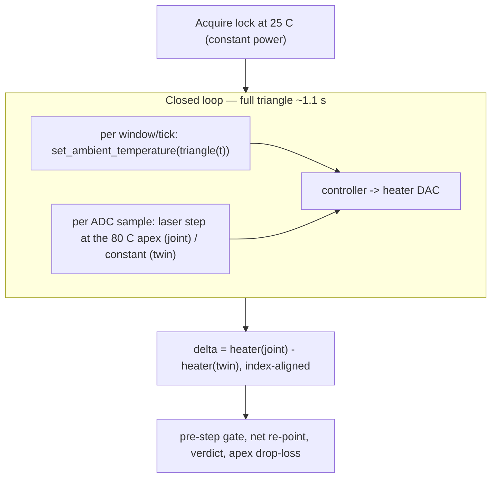
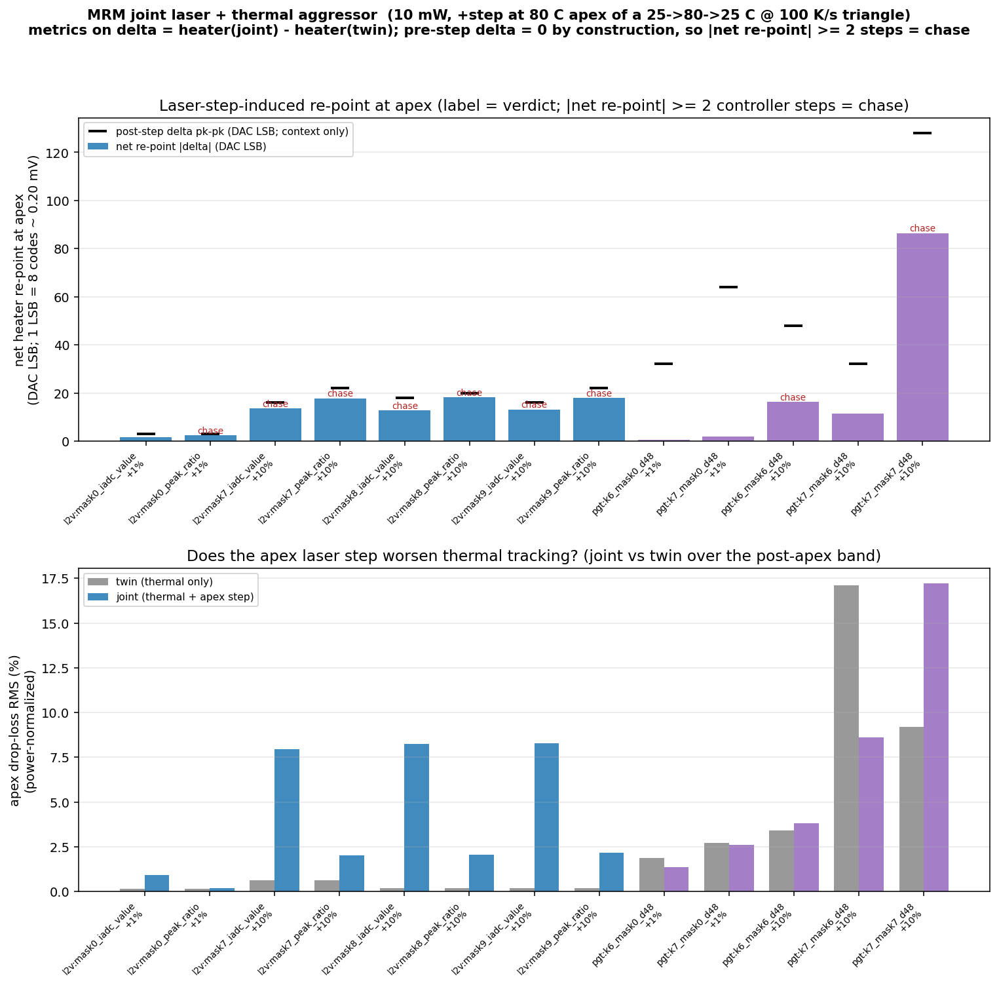

# MRM Joint Laser + Thermal Aggressor — PGT + L2V, 10 mW masked IADC

Companion to the pure laser-step study
([`MRM_LASER_STEP_RESPONSE_PGT_L2V.md`](MRM_LASER_STEP_RESPONSE_PGT_L2V.md))
and the thermal-triangle studies
([`MRM_PGT_TRIANGLE_AGGRESSOR_REPORT.md`](MRM_PGT_TRIANGLE_AGGRESSOR_REPORT.md),
[`MRM_L2V_TRIANGLE_AGGRESSOR_REPORT.md`](MRM_L2V_TRIANGLE_AGGRESSOR_REPORT.md),
[`../MRM_THERMAL_SIMS_PGT_L2V.md`](../MRM_THERMAL_SIMS_PGT_L2V.md)).

Those two studies asked their questions in isolation: *"can the loop track a
thermal ramp?"* and *"does the loop chase a laser-power step?"* This study runs
**both aggressors at once** and asks the combined question:

> **When a laser-power step lands at the worst thermal operating point — the
> 80 C apex of a thermal ramp the loop is already working to track — does each
> controller still do the right thing?**

The answer carries the three-way framing of the laser-step study into the joint
regime:

* **PGT** should *reject* the laser step (hold lock) even at the apex.
* **L2V `peak_ratio`** should *track the real self-heating shift* (a correct move).
* **L2V `iadc_value`** should *chase unnecessarily* (defends a stale absolute
  photocurrent, detuning off-peak).

## Setup

* **Plant:** `coupe_mrm_block` via `scripts/run_tsmc.sh` (caribou-mrm `.venv`).
* **Thermal aggressor (underneath the loop):** a temperature **triangle
  25 → 80 → 25 C @ 100 K/s + 10 ms settle** (apex at `t = 0.55 s`, total
  ≈ 1.11 s), driven by `sknetwork.set_ambient_temperature()` per control
  window/tick — the identical mechanism and parameters as the triangle studies
  (thermal doc §6/§7).
* **Laser aggressor:** a **+10 % laser-power step** injected at the **80 C apex**
  (the PGT "sense-blind apex", failure mode F-A), at the ADC sample rate inside
  the control window, exactly as the pure laser-step harness injects it.
* **Optical power:** **10 mW** center, hot-side lock.
* **Heater DAC:** sweet-spot HDAC, 16-bit controller code on a 13-bit physical
  grid. **1 physical LSB = 8 controller codes = (1.8 − 0.15)/8192 V ≈ 0.20 mV.**
  All re-point sizes are quoted in these LSBs (identical convention to the
  laser-step study, so the two are directly comparable).
* **ADC:** 16-bit / 560 µA drop FS with the low *N* bits masked (ENOB cut), the
  same masked-IADC model as the 10 mW triangle/step studies. L2V `peak_ratio`
  uses a separate broadband full-scale (`bb_fullscale_A = 2·P_center = 20 mA`)
  so the operating point lands mid-ADC with ±10 % headroom.
* **Depth matrix:**
  * **+10 %** at the **production masked IADC** (PGT kstep/mask, L2V mask ×
    target-mode) — the headline result.
  * **+1 %** at **full 16-bit ENOB (mask 0)** — re-runs the small step with the
    ENOB floor removed, to separate "held because the step is sub-quantum" from
    "held because the controller genuinely rejects it".

## Method — why a twin difference, and how a "move" is measured

The thermal triangle keeps the heater **slewing the entire run** (the loop is
actively tracking the ramp), so the heater trajectory is *not* flat even with no
laser step. A raw post-step heater excursion would therefore be dominated by the
ongoing thermal slew, not by the laser step. To isolate the laser-step response
at the apex, every joint run is paired with a **thermal-only twin**: an identical
timeline (same warmup, acquisition, triangle, deterministic Fs/4 dither and
deterministic Skadi thermal) with the **laser held constant** at `P_center` (no
step). All laser-step figures are then computed on the **difference**:

```
delta[i] = heater_joint[i] − heater_twin[i]      (indexed by window / tick)
```

* **Alignment is by construction** — twin and joint share the same deterministic
  timeline, so their window/tick indices line up 1:1. Each trace records its
  per-window ambient temperature; the difference reader **asserts the two
  ambient profiles match** before differencing.
* **Pre-step gate (`delta_prestep_resid_lsb`).** Before the apex step, twin and
  joint are bit-identical, so the delta must be ~0. The RMS of delta over the
  pre-step band is reported as `delta_prestep_resid_lsb`; **a value > ~1 LSB
  flags a determinism/alignment bug and invalidates the run.** This is the first
  gate checked for every cell.
* **Net re-point (`net_repoint_dac_lsb`, `net_repoint_steps`).**
  `mean(delta, post-step band) − mean(delta, pre-step band)` (the second term
  ≈ 0), expressed in DAC LSBs and in controller steps (PGT: `2^kstep`
  codes/step; L2V: `step_size_track = 8` codes = 1 LSB/step).
* **Held vs chased.** As in the laser-step report, the discriminator is the net
  re-point **relative to the loop's own limit cycle** — here the **post-step
  pk-pk of the difference** (`limit_cycle_pkpk_lsb`). A move is a real
  **chase** only when the permanent delta re-point clears that pk-pk; otherwise
  the loop **held**.
* **Bounded settle band.** The post-step (and the symmetric pre-step) band is
  bounded to **50 windows/ticks** around the apex, so the re-point reflects the
  *apex response* and not the subsequent ramp-down drift (at 100 K/s, 50 PGT
  windows ≈ 6.7 ms ≈ 0.67 K of additional drift → negligible).
* **Rise time → loop bandwidth.** When the loop chases, the 10–90 % rise of the
  delta toward its settled value gives `loop_bw_hz = 0.35 / t_rise` (a
  large-signal, slew-limited number, same caveat as the step study). For a
  holding loop `loop_bw_hz` is blank (`bw_source = rejected`).
* **Apex drop-loss (absolute robustness), power-normalized.** Alongside the
  delta metrics, `apex_droploss_rms_{joint,twin}_pct` asks *did the step worsen
  apex thermal tracking?* Drop current is **normalized by instantaneous laser
  power** (`drop/P_laser`) before computing the loss, so the +10 % optical
  scaling of the joint step does not masquerade as tracking gain; the twin
  (constant power) is unaffected by the normalization. Joint ≈ twin means the
  step did not degrade apex tracking.



## Sources (in `goldens/mrm/`)

| Artifact | Path |
|---|---|
| Aggregated summary (one row per joint cell) | `output/mrm_joint_aggressor_study/joint_aggressor_summary.csv` |
| Re-point + apex drop-loss comparison figure | `output/mrm_joint_aggressor_study/joint_aggressor_bandwidth.png` |
| Per-run traces / metrics (joint + delta) | `output/mrm_joint_aggressor_study/{pgt,l2v}/<config>_<depth>/` |
| Thermal-only twin references | `output/mrm_joint_aggressor_study/twin/<controller>_<config>/` |
| PGT joint worker | `src/testbench/skadi_mrm_pgt_laser_disturbance.py --profile step --thermal triangle` |
| L2V joint worker | `src/testbench/mrm_l2v_laser_disturbance.py --profile step --thermal triangle` |
| Shared triangle profile + twin-difference metrics | `src/testbench/joint_aggressor_metrics.py` |
| Study orchestrator (`--replot` re-aggregates without re-simulating) | `src/testbench/run_joint_aggressor_study.py` |

<!-- RESULTS:BEGIN (filled from joint_aggressor_summary.csv after the full matrix run) -->
## TL;DR — three responses to a laser step at the thermal apex

_Results section is populated from `joint_aggressor_summary.csv` after the full
100 K/s matrix completes._
<!-- RESULTS:END -->

## Figures

### Re-point vs limit cycle, and apex drop-loss (all cells)

Top: net heater re-point at the apex in DAC LSBs (bars) with the post-step delta
pk-pk overlaid as caps (a move above its cap is a real "chase"). Bottom: apex
drop-loss RMS (power-normalized) for the thermal-only twin vs the joint run — if
the joint bar is not higher than the twin bar, the laser step did not worsen
apex thermal tracking.



<!-- FIGURES:BEGIN (per-cell trace tables filled after the run) -->
<!-- FIGURES:END -->

## Method notes / caveats

* **Verdicts come from the canonical 100 K/s triangle.** The orchestrator's
  `--quick` mode compresses the triangle to a fast rate for plumbing smoke tests
  only; in that regime the ramp swamps a +10 % step at the apex turning point
  and everything reads "held", which is *not* physically representative. All
  reported verdicts are from the full 100 K/s run.
* **Apex = turning point.** The step lands exactly at the apex, where the ramp
  derivative passes through zero, so the post-step settle band sees the slowest
  thermal drift of the whole triangle — the cleanest place to read a laser-step
  re-point out of the difference. `--step-at {rampup,apex,rampdown,settle}` is
  wired for later sensitivity sweeps.
* **+1 % at 16-bit.** The production-mask +1 % step is sub-quantum (held by the
  ENOB floor, same as the laser-step study). The +1 % cells here are run at
  full 16-bit ENOB (mask 0) specifically to remove that floor, so a "held" +1 %
  result there reflects the controller, not quantization.
* **Bandwidth is large-signal.** Rise time is quantized by the control update
  period (PGT window ≈ 134 µs; L2V tick = 50 µs); the bandwidth is the bang-bang
  slew rate, not a small-signal loop bandwidth.
* **`worst_abs_delta_mV`** (in each per-run JSON) records the largest transient
  |delta| over the whole triangle, including brief single-window divergences
  during the steep ramp that the limit cycle heals; the verdict is read from the
  bounded apex band, not this transient.

## Reproduce

```bash
cd goldens/mrm
# full matrix, +10 % production masks AND +1 % at 16-bit ENOB (6 workers).
# PGT triangles are long (~1.1 s sim each); expect ~1.5-2.5 h wall.
scripts/run_tsmc.sh -m src.testbench.run_joint_aggressor_study \
    --out-dir output/mrm_joint_aggressor_study --depths 1,10 --max-workers 6

# +10 % only (default depth):
scripts/run_tsmc.sh -m src.testbench.run_joint_aggressor_study \
    --out-dir output/mrm_joint_aggressor_study --max-workers 6

# re-aggregate + re-plot from existing runs (no re-simulation):
scripts/run_tsmc.sh -m src.testbench.run_joint_aggressor_study \
    --out-dir output/mrm_joint_aggressor_study --depths 1,10 --replot

# single PGT cell (triangle winner, +10 % at apex) — twin then joint:
scripts/run_tsmc.sh -m src.testbench.skadi_mrm_pgt_laser_disturbance \
    --profile step --twin --thermal triangle --thermal-apex-C 80 \
    --thermal-rate-K-s 100 --thermal-settle-ms 10 --p-center-W 0.01 \
    --kstep 7 --adc-mask-bits 6 --dither-amp-v 0.048 --mh-voltage-init 0.715 \
    --ovr-counter 0 --out-dir /tmp/pgt_twin
scripts/run_tsmc.sh -m src.testbench.skadi_mrm_pgt_laser_disturbance \
    --profile step --thermal triangle --thermal-apex-C 80 --thermal-rate-K-s 100 \
    --thermal-settle-ms 10 --step-at apex --p-center-W 0.01 --p-depth 0.10 \
    --kstep 7 --adc-mask-bits 6 --dither-amp-v 0.048 --mh-voltage-init 0.715 \
    --ovr-counter 0 --twin-trace /tmp/pgt_twin/joint_trace.csv --out-dir /tmp/pgt_joint

# single L2V cell (iadc_value, mask 7, +10 % at apex):
scripts/run_tsmc.sh -m src.testbench.mrm_l2v_laser_disturbance \
    --profile step --twin --thermal triangle --thermal-apex-C 80 \
    --thermal-rate-K-s 100 --thermal-settle-ms 10 --p-center-W 0.01 \
    --target-mode iadc_value --adc-mask-bits 7 --bb-fullscale-A 0.02 \
    --out-dir /tmp/l2v_twin
scripts/run_tsmc.sh -m src.testbench.mrm_l2v_laser_disturbance \
    --profile step --thermal triangle --thermal-apex-C 80 --thermal-rate-K-s 100 \
    --thermal-settle-ms 10 --step-at apex --p-center-W 0.01 --p-depth 0.10 \
    --target-mode iadc_value --adc-mask-bits 7 --bb-fullscale-A 0.02 \
    --twin-trace /tmp/l2v_twin/joint_trace.csv --out-dir /tmp/l2v_joint
```
