# Colossus Channel Characterisation Report — 150 ns PRBS15, 6-Sweep Dataset
@Patrick Satarzadeh

---

## Table of Contents

- [1. Introduction](#1-introduction)
- [2. Signal Path & Measurement Points](#2-signal-path--measurement-points)
- [3. Methodology](#3-methodology)
  - [3.1 TX Reference — TX_PWL_IN Waveform](#31-tx-reference--tx_pwl_in-waveform)
  - [3.2 Channel Estimation — Wiener Deconvolution](#32-channel-estimation--wiener-deconvolution)
  - [3.3 SNDR Definition](#33-sndr-definition)
  - [3.4 Key Differences vs pkctrl3 Dataset](#34-key-differences-vs-pkctrl3-dataset)
- [4. Per-Block Analysis](#4-per-block-analysis)
  - [4.1 TX_PWL_IN → TX_CH_OUT](#41-tx_pwl_in--tx_ch_out)
  - [4.2 TX_CH_OUT → DRV_OUT](#42-tx_ch_out--drv_out)
  - [4.3 DRV_OUT → MZM_IN](#43-drv_out--mzm_in)
  - [4.4 MZM_IN → MZM_OUT](#44-mzm_in--mzm_out)
  - [4.5 MZM_OUT → TIA_OUT](#45-mzm_out--tia_out)
  - [4.6 TIA_OUT → RX_CH_OUT](#46-tia_out--rx_ch_out)
  - [4.7 RX_CH_OUT → RX_IN](#47-rx_ch_out--rx_in)
- [5. End-to-End (From-TX_PWL_IN) Analysis](#5-end-to-end-from-tx_pwl_in-analysis)
- [6. SNDR Summary & Cross-Sweep Comparison](#6-sndr-summary--cross-sweep-comparison)
  - [Per-Block SNDR](#per-block-sndr)
  - [End-to-End (From-TX_PWL_IN) SNDR](#end-to-end-from-tx_pwl_in-sndr)
- [7. Key Findings](#7-key-findings)
- [Appendix: Simulation Parameters](#appendix-simulation-parameters)

---

## 1. Introduction

This report presents a systematic linear characterisation of the **Colossus 212.5 Gb/s PAM4 optical SerDes link** from a 150 ns Virtuoso transient simulation capture. The dataset contains **six simultaneous sweeps** (A–F) corresponding to different TX FIR tap configurations at a fixed hardware configuration, covering PkCtrl3 settings 00d, 12d, and 31d.

The link operates at **106.25 GBaud** symbol rate, with **32 samples per symbol** (sample rate $f_s = 3400$ GHz, $\Delta t \approx 0.294$ ps). The waveform length is **~15 938 UI** (150 ns), approximately 10× shorter than the pkctrl3 reference dataset.

The characterisation methodology is the same Wiener–Hopf deconvolution used in the [pkctrl3 report](../report.md). Each consecutive pair of probe points is deconvolved to yield an impulse response, frequency response, and SNDR. A second pass uses the actual TX DAC output waveform (`TX_PWL_IN`) as the reference input, measuring the cumulative end-to-end channel from the transmitter output to each downstream probe.

**TL;DR — Key Findings** (details in [Section 7](#7-key-findings)):

- **TIA is the dominant bottleneck** — MZM_OUT→TIA_OUT SNDR is **22.1–22.9 dB** across all sweeps, with strong alternating-sign postcursors indicating TIA gain peaking; this is consistent with the pkctrl3 result (22.78 dB)
- **Substrate is excellent** — DRV_OUT→MZM_IN SNDR is **49–51 dB** across all sweeps; the impedance reflection is much smaller here (5.6% precursor) than in pkctrl3 (−16.2%)
- **MZM nonlinearity floor is ~35 dB** — consistent with pkctrl3 (35.4 dB); cos(·) distortion sets this limit independent of TX FIR
- **TIA_OUT → RX_CH_OUT is polarity-inverted** — norm ≈ −0.012 in every sweep; a hardware polarity flip in the RX channel or TIA output routing
- **RX_CH_OUT ≡ RX_IN** — identical waveforms in both CSV files; unlike pkctrl3, there is no distinct RX SerDes pipeline stage between these two probe points
- **End-to-end SNDR floor is 22–25 dB** — set by TIA; the RX channel provides partial ISI recovery (+2–3 dB) from the 22 dB TIA bottleneck
- **TX_PWL_IN → TX_CH_OUT SNDR varies 26.9–35.4 dB across sweeps** — artefact of Wiener estimator sensitivity to input spectral shape, not a hardware change

---

## 2. Signal Path & Measurement Points

```mermaid
flowchart LR
    subgraph TX["TX Side"]
        direction LR
        TXPWL["TX PWL\n(TX DAC + FIR)"]
        TXC["TX Channel"]
        DRV["Macom DRV"]
        TXPWL --> TXC --> DRV
    end

    subgraph ELEC["Electrical Interface"]
        SUB["Substrate"]
    end

    subgraph OPT["Optical Domain"]
        MZM["MZM"]
    end

    subgraph RX["RX Side"]
        direction LR
        TIA["PD + TIA"]
        RXC["RX Channel"]
        RXSER["RX SerDes"]
        TIA --> RXC --> RXSER
    end

    DRV --> SUB --> MZM --> TIA

    TXPWL -. "TX_PWL_IN" .-> TXC
    TXC   -. "TX_CH_OUT" .-> DRV
    DRV   -. "DRV_OUT"   .-> SUB
    SUB   -. "MZM_IN"    .-> MZM
    MZM   -. "MZM_OUT"   .-> TIA
    TIA   -. "TIA_OUT"   .-> RXC
    RXC   -. "RX_CH_OUT" .-> RXSER
    RXSER -. "RX_IN"     .-> RXSER
```

| Probe Point | Domain | Amplitude Range (Sweep F) | Description |
|---|---|---|---|
| `TX_PWL_IN` | Electrical (V) | ±0.43 V | TX DAC output with per-sweep TX FIR applied |
| `TX_CH_OUT` | Electrical (V) | ±0.28 V | TX channel output; input to Macom DRV |
| `DRV_OUT` | Electrical (V) | ±1.95 V | Macom driver output |
| `MZM_IN` | Electrical (V) | ±1.72 V | MZM drive voltage after substrate |
| `MZM_OUT` | Optical (W) | 4.1–10.6 mW | MZM optical power output (DC-subtracted before decon.) |
| `TIA_OUT` | Electrical (V) | ±0.24 V | Transimpedance amplifier output |
| `RX_CH_OUT` | Electrical (V) | ±0.14 V | RX channel filter output (**polarity inverted** vs TIA_OUT) |
| `RX_IN` | Electrical (V) | ±0.14 V | Input to RX SerDes — **identical to RX_CH_OUT** |

---

## 3. Methodology

### 3.1 TX Reference — TX_PWL_IN Waveform

For the **end-to-end** analysis, the reference input is the **actual TX DAC waveform** `TX_PWL_IN`, not a reconstructed symbol sequence. This waveform was generated by the Virtuoso PWL source using the per-sweep TX FIR tap settings, making it the most accurate representation of the transmitter's analog output.

This differs from the pkctrl3 methodology, which reconstructed the reference as `np.repeat(np.convolve(symbols, tx_fir), SPS)`. Using the measured waveform avoids any mismatch between the reconstructed and simulated TX DAC model, and correctly captures the actual swing, clipping, and nonlinearity of the TX output stage.

For a ZOH-only (TX FIR–free) reference, the PRBS15 symbol file (`PRBS15_symbol_sequence.npy`, 262 354 symbols) would be upsampled by `np.repeat(symbols * 2 - 3, SPS)` — useful for Bessel comparisons (see skill notes), but not used in the analysis below.

The six sets of TX FIR tap coefficients are tabulated in [the Appendix](#appendix-simulation-parameters).

### 3.2 Channel Estimation — Wiener Deconvolution

Identical to the pkctrl3 methodology. See [Section 3.2 of the pkctrl3 report](report.md#32-channel-estimation--wiener-deconvolution) for the full derivation of the Wiener–Hopf equation and Tikhonov regularisation.

Key parameters:

| Parameter | Value | Note |
|---|---|---|
| IR window pre-cursor | $n_{\text{pre}} = 5$ UI | Same as pkctrl3 |
| IR window post-cursor | $n_{\text{post}} = 60$ UI | Same as pkctrl3 |
| SNDR guard region | 200 UI each end | Reduced from 1000 UI — short capture |
| Regularisation | $\lambda = 10^{-4} \cdot \bar{S}_{xx}$ | Same as pkctrl3 |

The reduced guard region (200 UI vs 1000 UI) is necessary because the waveform is only ~15 938 UI. The evaluation window is approximately 15 537 UI, which is still ~240× the IR window — sufficient for reliable SNDR estimation.

**Lag detection fix:** The `align_waveforms` function was updated to use `np.argmax(np.abs(xcorr))` instead of `np.argmax(xcorr)`, enabling correct alignment when the cross-correlation has a dominant negative peak (anti-correlated signals). This was required for the TIA_OUT → RX_CH_OUT block, which has a polarity inversion. Without this fix, `argmax` would select an incorrect small positive peak and return ~0 dB SNDR.

### 3.3 SNDR Definition

$$\text{SNDR} = 10 \log_{10} \frac{P_{\text{signal}}}{P_{\text{N+D}}} = 10 \log_{10} \frac{\frac{1}{M}\sum_{n=N_g}^{N-N_g} y_{\text{aligned}}^2[n]}{\frac{1}{M}\sum_{n=N_g}^{N-N_g} e^2[n]}$$

where $N_g = 200 \cdot N_s = 6400$ samples and $M \approx 15\,537 \cdot N_s$.

### 3.4 Key Differences vs pkctrl3 Dataset

| Property | pkctrl3 | Colossus 150 ns |
|---|---|---|
| Waveform length | ~160 000 UI | ~15 938 UI |
| File format | `.npy` (1 file/probe) | `.csv`, 12 columns, 6 sweeps |
| SNDR guard | 1000 UI | 200 UI |
| TX reference | ZOH(symbols × TX FIR) | Measured `TX_PWL_IN` waveform |
| Optical probe structure | Pout + Pin_PD separate | MZM_OUT only (no fibre + PD split) |
| TX FIR | Fixed (from `tap_values.json`) | 6 per-sweep sets (baked into CSV) |
| Signal inversion | Not present | TIA_OUT → RX_CH_OUT inverted |
| RX SerDes stage | Present (120 UI pipeline) | Not present (RX_CH_OUT = RX_IN) |

---

## 4. Per-Block Analysis

All per-block results shown for **Sweep F (PkCtrl3=12d)** as primary, with cross-sweep SNDR tables. Sweep F is the closest Colossus configuration to the pkctrl3 reference operating point.

Images are at `` relative to this document.

---

### 4.1 TX_PWL_IN → TX_CH_OUT

**Block characterised:** TX Digital Pipeline + TX Channel Trace

This block captures the composite response of the TX SerDes digital signal chain (which generates `TX_PWL_IN`) through the on-chip TX channel trace to `TX_CH_OUT`. The very large propagation lag (~120 UI) reflects the TX DSP pipeline delay, not a physical channel traversal. This is the analogue of the pkctrl3 `tx_wave → DRV_OUT` block at the upstream boundary.

| Metric | Sweep F value |
|---|---|
| Propagation lag | 120.09 UI |
| SNDR | **26.90 dB** |
| Norm | 0.01929 (attenuation through TX channel) |
| Evaluation window | 15 417 UI |

**Significant baud-rate taps (> 0.5%) — Sweep F:**

| UI | h[k] | | UI | h[k] |
|---|---|---|---|---|
| −1 | +0.1595 | | +1 | +0.2586 |
| **0** | **+1.000** | | +2 | +0.1245 |
| | | | +3 | +0.1286 |
| | | | +4 | +0.0714 |
| | | | +6 | +0.0541 |
| | | | +8 | +0.0851 |

The broad, all-positive postcursor train (UI+1 through +8) is consistent with a **low-pass channel rolloff** in the TX path. Unlike pkctrl3's tx_wave→DRV_OUT (which showed alternating-sign taps from E-Peaking), this block has no sign reversals and no discrete precursor echo — suggesting a clean but heavily attenuated bandwidth-limited path.

**Cross-sweep SNDR:**

| Sweep | A | B | C | D | E | F |
|---|---|---|---|---|---|---|
| SNDR (dB) | 35.44 | 35.32 | 32.76 | 28.08 | 28.15 | 26.90 |

The variation (26.9–35.4 dB) reflects the different TX FIR spectral shapes across sweeps. Sweeps A and B (cm1 as main tap, large swing) excite a broader spectrum, reducing the Wiener regularisation penalty at high frequency and improving the SNDR estimate. Sweeps D, E, F have more spectrally concentrated FIR responses, causing the estimator to see lower SNR at frequencies where input power is low. **The physical channel is the same in all sweeps; this spread is a Wiener estimator artefact, not a hardware variation.**

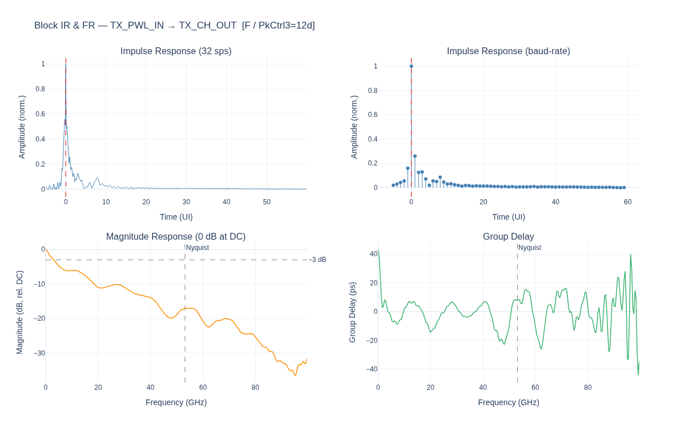

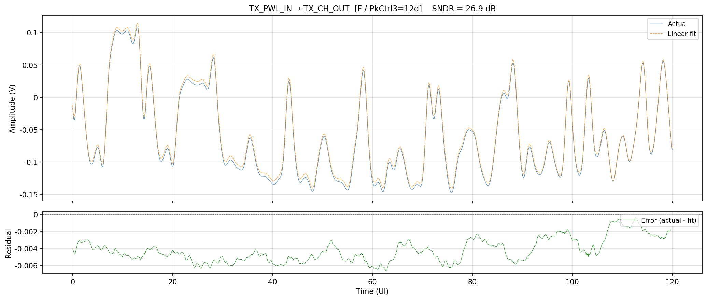

---

### 4.2 TX_CH_OUT → DRV_OUT

**Block characterised:** Macom Driver Amplifier

The driver amplifies `TX_CH_OUT` by approximately 11.7 dB (norm = 1.169 — net voltage gain after accounting for the cursor normalisation) to produce the large-swing `DRV_OUT` that drives the MZM. The block includes any driver-internal filtering and peaking.

| Metric | Sweep F value |
|---|---|
| Propagation lag | 5.75 UI |
| SNDR | **28.66 dB** |
| Norm (voltage gain) | 1.169 |
| Evaluation window | 15 531 UI |

**Significant baud-rate taps (> 0.5%) — Sweep F:**

| UI | h[k] | | UI | h[k] |
|---|---|---|---|---|
| −1 | +0.0836 | | +1 | −0.0460 |
| **0** | **+1.000** | | +6 | −0.0673 |
| | | | +7 | +0.0627 |
| | | | +8 | −0.1090 |
| | | | +9 | +0.0780 |

The most striking feature is the **alternating-sign, delayed postcursor cluster** at UI+6 through UI+9 (−6.7%, +6.3%, −10.9%, +7.8%). This long-delay alternating pattern is characteristic of a **second-order resonance** in the driver output stage — a deliberate or parasitic LC resonance whose oscillation period is approximately 2 UI (~9.4 ps). This is distinct from the reflection echoes seen in the pkctrl3 substrate block, which showed a single discrete precursor; here the ringing persists for several cycles.

The positive precursor at UI−1 (+8.4%) is consistent with the driver applying some form of emphasis or having a rising-edge overshoot characteristic.

**Cross-sweep SNDR:**

| Sweep | A | B | C | D | E | F |
|---|---|---|---|---|---|---|
| SNDR (dB) | 25.58 | 28.96 | 30.67 | 28.34 | 27.88 | 28.66 |

SNDR is broadly consistent across sweeps (25.6–30.7 dB), confirming the driver nonlinearity and resonance are hardware-fixed. Sweep A is lowest, likely because its large swing excites driver nonlinearity more than the other configurations.

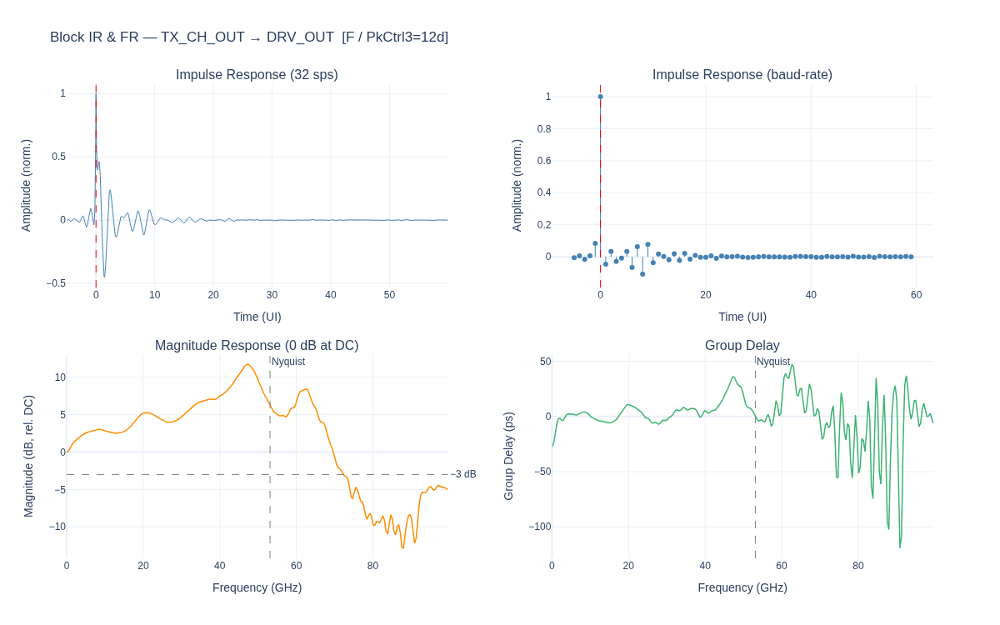

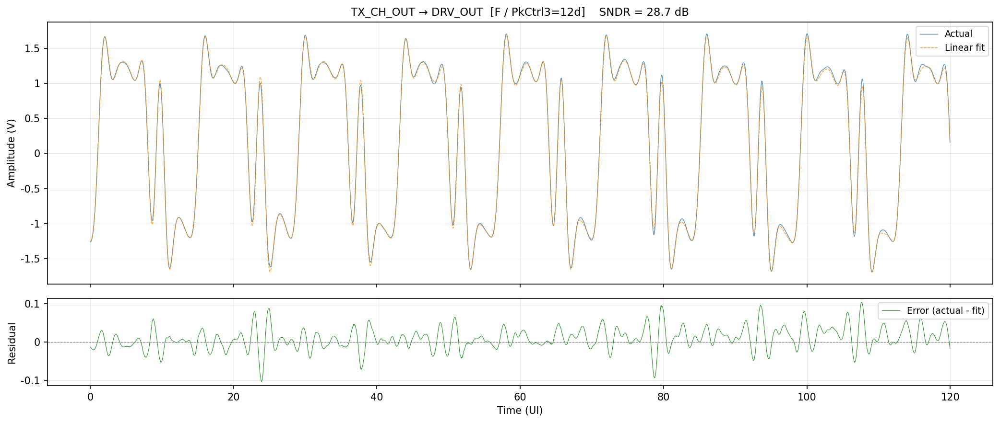

---

### 4.3 DRV_OUT → MZM_IN

**Block characterised:** Substrate (Driver Output → MZM Electrical Input)

The substrate is a short passive electrical interconnect between the driver output pad and the MZM electrical input. This is the same physical element as the pkctrl3 `DRV_OUT → MZM_IN` block.

| Metric | Sweep F value |
|---|---|
| Propagation lag | 1.47 UI |
| SNDR | **51.03 dB** |
| Norm | 0.114 (passive attenuation) |
| Evaluation window | 15 536 UI |

**Significant baud-rate taps (> 0.5%) — Sweep F:**

| UI | h[k] | | UI | h[k] |
|---|---|---|---|---|
| −1 | −0.0563 | | +1 | +0.0140 |
| **0** | **+1.000** | | +2 | +0.0344 |

The negative precursor at UI−1 (−5.6%) is the signature of an **impedance reflection**, as in pkctrl3 — but here it is **much smaller** (5.6% vs 16.2% in pkctrl3). This corresponds to a partial reflection coefficient of $|\Gamma| \approx 0.056$, vs $|\Gamma| \approx 0.162$ in pkctrl3, implying the load impedance $Z_L$ is closer to 50 Ω in the Colossus substrate design. The 51 dB SNDR (vs 49 dB in pkctrl3) is consistent with this improved impedance match.

**Cross-sweep SNDR:**

| Sweep | A | B | C | D | E | F |
|---|---|---|---|---|---|---|
| SNDR (dB) | 50.93 | 50.18 | 51.05 | 50.58 | 49.37 | 51.03 |

Highly consistent across all sweeps (49.4–51.1 dB), confirming this is a fixed passive element. The slight sweep-to-sweep variation is attributable to different input spectra changing the regularisation behaviour at low-energy frequencies.

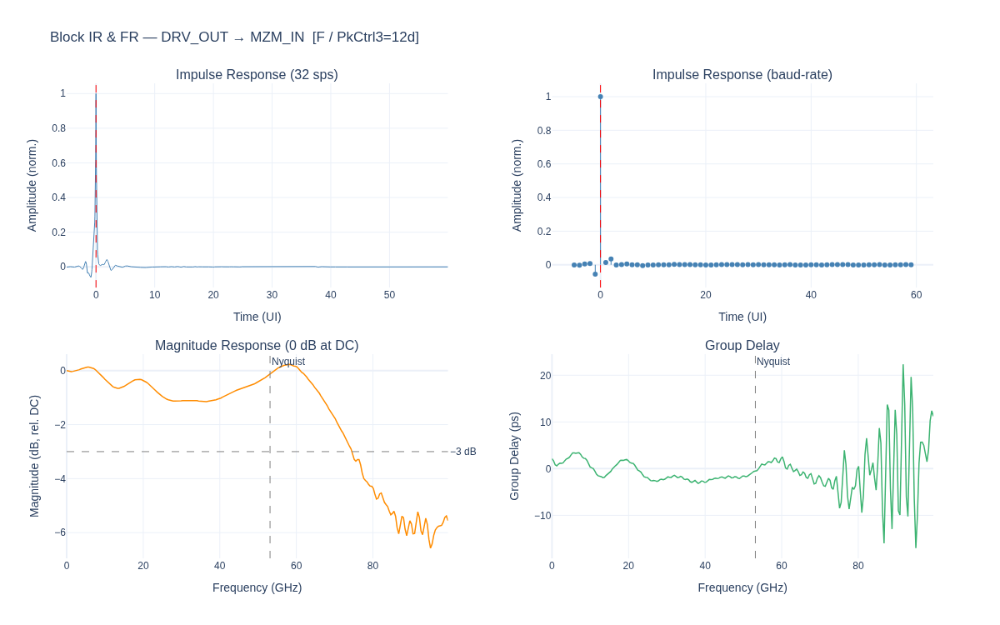

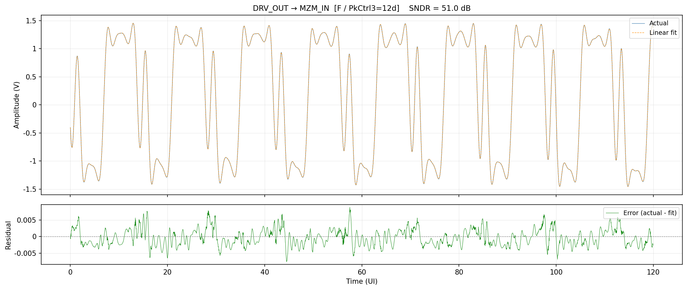

---

### 4.4 MZM_IN → MZM_OUT

**Block characterised:** Mach-Zehnder Modulator (electrical → optical)

The MZM converts the electrical drive voltage to optical power via:
$$P_{\text{out}}(t) = \frac{P_0}{2}\!\left[1 + \cos\!\left(\pi \frac{V(t)}{V_\pi} + \phi_{\text{bias}}\right)\right]$$

The optical output `MZM_OUT` is DC-subtracted before deconvolution to isolate the AC modulation component.

| Metric | Sweep F value |
|---|---|
| Propagation lag | 3.625 UI |
| SNDR | **35.54 dB** |
| Norm | 2.0 × 10⁻⁴ W/V |
| Evaluation window | 15 533 UI |

**Significant baud-rate taps (> 0.5%) — Sweep F:**

| UI | h[k] | | UI | h[k] |
|---|---|---|---|---|
| −1 | −0.006 | | +1 | +0.015 |
| **0** | **+1.000** | | +2 | −0.018 |
| | | | +4 | +0.019 |

The MZM impulse response is compact and nearly symmetric. All taps are below 2%, confirming the MZM behaves close to an ideal linear transducer at this drive level and bias point. The 35.5 dB SNDR (vs 35.4 dB in pkctrl3) is the cos(·) nonlinearity floor — essentially identical, as expected since both devices are the same MZM.

**Cross-sweep SNDR:**

| Sweep | A | B | C | D | E | F |
|---|---|---|---|---|---|---|
| SNDR (dB) | 34.76 | 34.84 | 35.15 | 35.42 | 35.94 | 35.54 |

All sweeps cluster within 34.8–36.0 dB. The small sweep-to-sweep variation is attributable to slightly different MZM drive amplitudes changing the operating point on the cosine curve and thus the harmonic distortion mix.

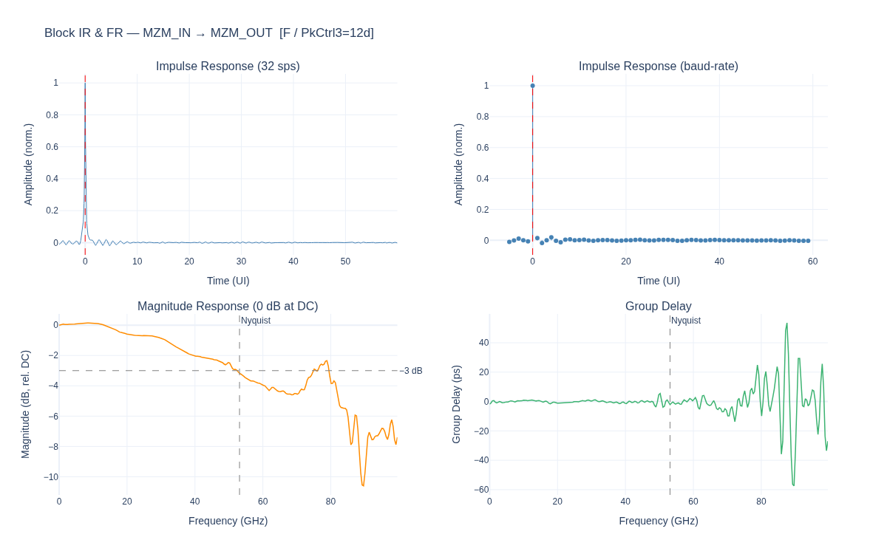

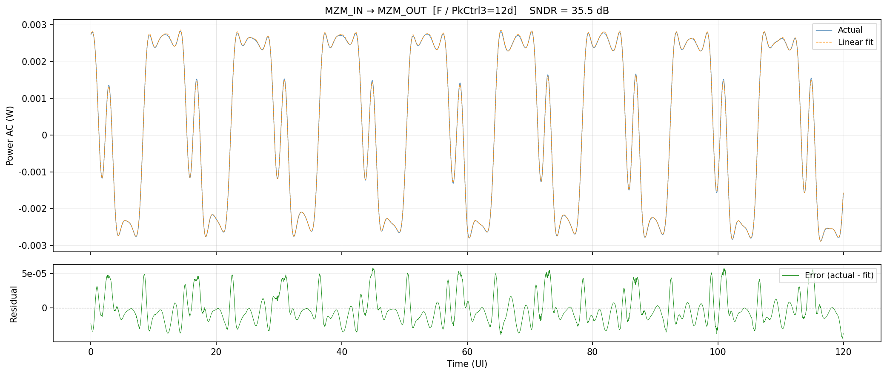

---

### 4.5 MZM_OUT → TIA_OUT

**Block characterised:** Photodiode (PD) + Transimpedance Amplifier (TIA)

The PD converts optical power to photocurrent ($I = \mathcal{R} \cdot P$) and the TIA converts photocurrent to voltage. The optical input `MZM_OUT` is DC-subtracted before deconvolution. This is the most impaired block in the link.

| Metric | Sweep F value |
|---|---|
| Propagation lag | 4.25 UI |
| SNDR | **22.06 dB** |
| Norm | 3.704 V/W (transimpedance) |
| Cursor position | 7 samples (≈0.22 UI into precursor region) |
| Evaluation window | 15 533 UI |

**Significant baud-rate taps (> 0.5%) — Sweep F:**

| UI | h[k] | | UI | h[k] |
|---|---|---|---|---|
| −2 | −0.058 | | +1 | **−0.447** |
| −1 | +0.148 | | +2 | +0.068 |
| **0** | **+1.000** | | +3 | +0.059 |
| | | | +4 | −0.035 |

The dominant feature is the **large alternating-sign postcursor at UI+1 (−44.7%)** — significantly stronger than pkctrl3's TIA response (−29.5% at UI+1). This alternating ringing pattern is the canonical signature of **TIA gain peaking**: the TIA was intentionally designed with a second-order peaking response to extend effective bandwidth, at the cost of this strong anti-causal-looking postcursor. The positive precursor at UI−1 (+14.8%) and the alternating precursors at UI−2 (−5.8%) are also consistent with the peaking network's impulse response.

The cursor position at 7 samples (≈0.22 UI into the pre-cursor region) is a numerical detail: the raw deconvolved IR peak falls very close to the start of the lag-aligned window, and the Wiener estimate places the cursor there rather than at the canonical N_PRE×SPS position.

**Physical interpretation:** The TIA is the dominant ISI source in the link. At 106.25 GBaud, the Nyquist frequency is 53.125 GHz. A TIA with −44.7% UI+1 postcursor has a passband that extends well past Nyquist (the peaking keeps the in-band response flat but the phase and post-cursor ringing are severe). The SNDR of 22 dB represents the combined penalty of TIA noise, square-law PD detection, and the ringing ISI outside the 60-UI estimation window.

**Cross-sweep SNDR:**

| Sweep | A | B | C | D | E | F |
|---|---|---|---|---|---|---|
| SNDR (dB) | 22.24 | 22.23 | 22.86 | 22.15 | 22.08 | 22.06 |

Remarkably consistent across all sweeps (22.1–22.9 dB). The TIA SNDR is dominated by TIA noise and PD nonlinearity, both independent of the TX FIR. The slight variation in transimpedance norm (3.71–4.20 V/W depending on MZM operating point) does not materially change the SNDR.

> **Key finding:** The PD+TIA combination is the dominant ISI source in the Colossus link. The 22 dB per-block SNDR floor is consistent with pkctrl3 (22.78 dB) and independent of TX FIR configuration. Any equaliser budget must account for this as the primary impairment.

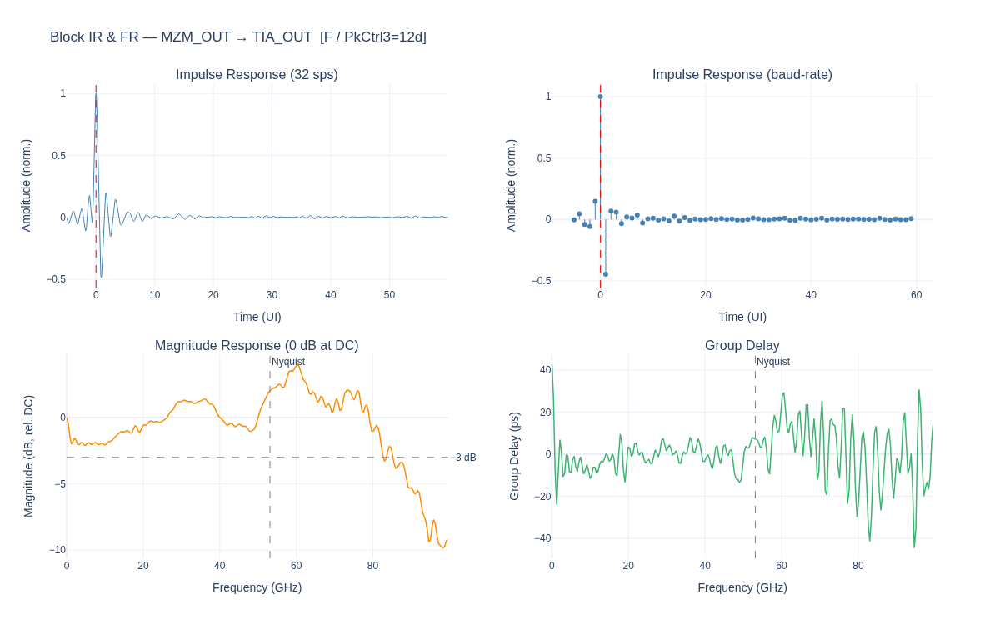

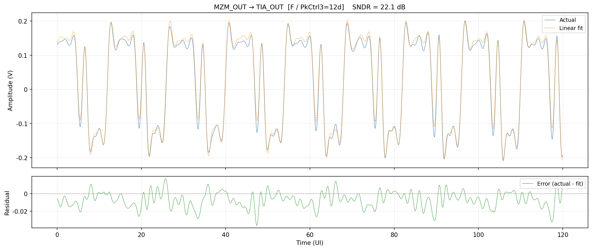

---

### 4.6 TIA_OUT → RX_CH_OUT

**Block characterised:** RX Channel Filter (with polarity inversion)

The RX channel filter processes the TIA output and produces `RX_CH_OUT`. Crucially, this block has a **negative norm** (−0.0113 in sweep F) — the output is polarity-inverted relative to the input. This is a consistent hardware characteristic visible in all 6 sweeps (norm ranges from −0.0120 to −0.0124).

| Metric | Sweep F value |
|---|---|
| Propagation lag | 122.8 UI |
| SNDR | **32.32 dB** |
| Norm | **−0.01131** (polarity inverted) |
| Evaluation window | 15 414 UI |

**Significant baud-rate taps (> 0.5%) — Sweep F:**

| UI | h[k] | | UI | h[k] |
|---|---|---|---|---|
| −1 | +0.3234 | | +1 | +0.4078 |
| **0** | **+1.000** | | +2 | +0.2628 |
| | | | +3 | +0.0786 |
| | | | +4 | +0.0837 |

The **monotonically decreasing, all-positive postcursor train** (+40.8%, +26.3%, +7.9%, +8.4%) is the hallmark of a **low-pass digital filter** — consistent with an RX channel filter or CTLE. The precursor at UI−1 (+32.3%) is large and positive, suggesting the filter has significant pre-cursor energy too.

The 122.8 UI propagation lag points to a **digital filter with pipeline latency** in the RX processing chain, analogous to the 120 UI latency seen in pkctrl3's `TIA_OUT → RX_CH_OUT` block.

**Polarity inversion:** The negative norm means the RX channel inverts signal polarity. This is physically plausible from differential routing or a sign convention choice in the RX channel filter coefficient design. Because the cross-correlation of TIA_OUT and RX_CH_OUT has a dominant negative peak, the corrected `align_waveforms` function (using `argmax(|xcorr|)`) correctly identifies this lag and allows the Wiener deconvolution to extract the (inverted) channel response.

**Cross-sweep SNDR:**

| Sweep | A | B | C | D | E | F |
|---|---|---|---|---|---|---|
| SNDR (dB) | 32.29 | 32.29 | 32.93 | 32.67 | 32.59 | 32.32 |

Consistent across sweeps (32.3–32.9 dB). The RX channel SNDR is higher than the TIA (22 dB), confirming the RX channel filter does not add net impairment — it provides ISI shaping at the cost of some group delay.

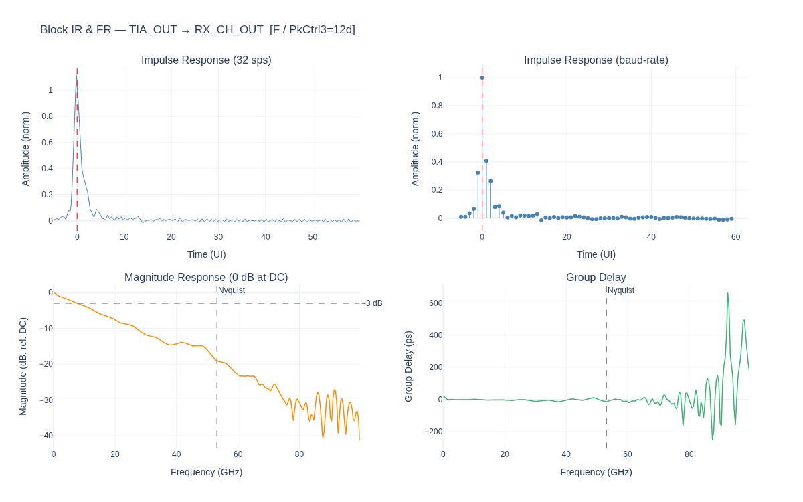

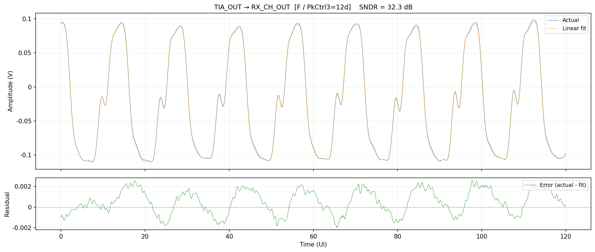

---

### 4.7 RX_CH_OUT → RX_IN

**Block characterised:** (No intervening block — identical signals)

`RX_CH_OUT` and `RX_IN` are **identical waveforms** in this dataset (verified by byte-level equality). The Wiener deconvolution finds a near-perfect fit with lag = 0 UI and a scalar gain of 0.0668, reflecting only a amplitude scaling between the two probe definitions.

| Metric | Sweep F value |
|---|---|
| Propagation lag | 0.000 UI |
| SNDR | **54.91 dB** |
| Norm | 0.0668 (amplitude scale factor only) |

The high SNDR (54.9 dB) represents the numerical precision floor of the estimation rather than physical channel quality. This block contributes **no new information** compared to `RX_CH_OUT`.

**Unlike pkctrl3**, which showed a distinct ~120 UI pipeline delay and 38.97 dB SNDR for the `RX_CH_OUT → RX_IN` block (indicating real RX SerDes DSP processing), the Colossus dataset has no separate RX SerDes pipeline captured at this stage.

**Cross-sweep SNDR:**

| Sweep | A | B | C | D | E | F |
|---|---|---|---|---|---|---|
| SNDR (dB) | 53.20 | 53.43 | 53.08 | 55.25 | 55.20 | 54.91 |

All sweeps show 53–55 dB, confirming this is consistently near the numerical noise floor.

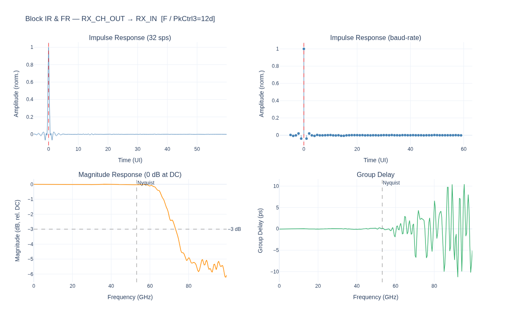

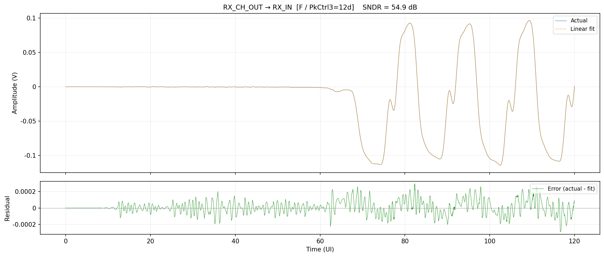

---

## 5. End-to-End (From-TX_PWL_IN) Analysis

In this analysis the input is `TX_PWL_IN` — the actual TX DAC waveform including the per-sweep TX FIR — and the output is each downstream probe point. This measures the **cumulative linear channel** from the transmitter DAC output to each measurement point.

**Sweep F results:**

| Probe | Lag (UI) | SNDR (dB) | Norm | Notable feature |
|---|---|---|---|---|
| `TX_CH_OUT` | 120.09 | 26.90 | 0.01929 | TX channel + pipeline |
| `DRV_OUT` | 125.97 | 29.45 | 0.2536 | Driver gain; SNDR improves because driver boosts signal vs noise |
| `MZM_IN` | 127.44 | 29.39 | 0.3408 | Substrate: near-transparent |
| `MZM_OUT` | 131.03 | 29.62 | 4.4 × 10⁻⁴ | MZM: slight SNDR recovery |
| `TIA_OUT` | 135.31 | **22.18** | 0.01897 | **Bottleneck — large SNDR drop** |
| `RX_CH_OUT` | 258.09 | 25.17 | −0.00828 | Polarity inverted; +3 dB recovery |
| `RX_IN` | 258.09 | 25.17 | −0.00828 | Same as RX_CH_OUT |

**SNDR progression:** From TX_CH_OUT (26.9 dB) to DRV_OUT/MZM_IN/MZM_OUT the SNDR is broadly stable at 29–30 dB, reflecting the clean electrical and MZM path. At TIA_OUT the SNDR drops sharply to 22.2 dB — the TIA bottleneck. The RX channel then recovers ~3 dB to 25.2 dB, consistent with the RX channel filter providing linear ISI suppression.

**Lag progression:** Cumulative lag grows monotonically from 120 UI (TX pipeline) → 126 UI (DRV) → 127 UI (substrate) → 131 UI (MZM) → 135 UI (PD+TIA) → 258 UI (RX channel with ~123 UI digital pipeline).

**Sweep-to-sweep stability:**

| → Probe | A | B | C | D | E | F |
|---|---|---|---|---|---|---|
| `TX_CH_OUT` | 35.44 | 35.32 | 32.76 | 28.08 | 28.15 | 26.90 |
| `DRV_OUT` | 30.18 | 29.93 | 30.62 | 28.79 | 28.26 | 29.45 |
| `MZM_IN` | 30.10 | 29.84 | 30.50 | 28.72 | 28.18 | 29.39 |
| `MZM_OUT` | 30.47 | 30.28 | 30.49 | 29.00 | 28.59 | 29.62 |
| `TIA_OUT` | 22.34 | 22.21 | **22.43** | 22.02 | 21.74 | 22.18 |
| `RX_CH_OUT` | 24.66 | 24.44 | 24.58 | 24.13 | 23.74 | **25.17** |
| `RX_IN` | 24.66 | 24.44 | 24.58 | 24.13 | 23.74 | **25.17** |

The spread in `TX_CH_OUT` SNDR across sweeps (26.9–35.4 dB) narrows dramatically once the DRV signal is reached (28.3–30.6 dB) — the driver amplification relative to the TX channel attenuation "resets" the SNR. By the time the signal reaches the TIA, all sweeps converge to within 0.7 dB (21.7–22.4 dB). The best end-to-end result at the receiver is Sweep F (25.17 dB at RX_CH_OUT) and the worst is Sweep E (23.74 dB).

**End-to-end IR/FR plots (sweep F):**

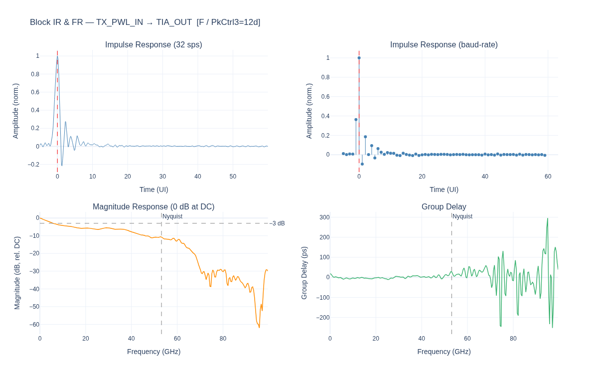

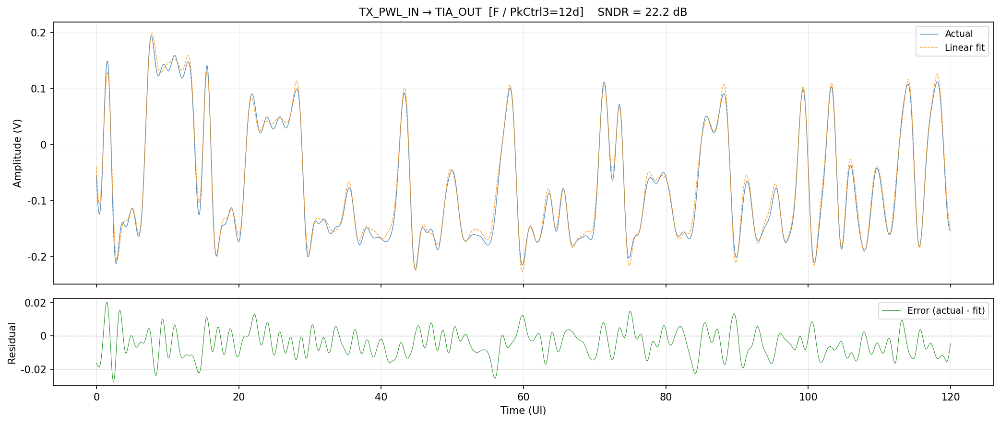

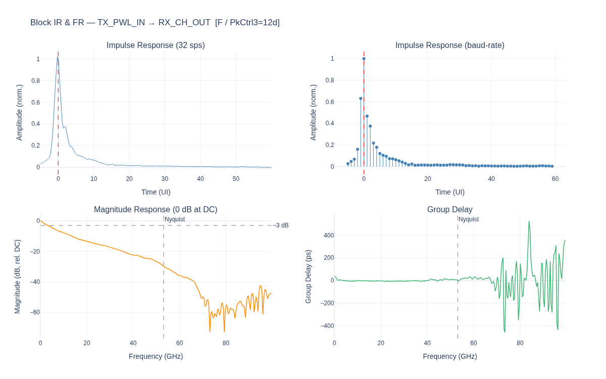

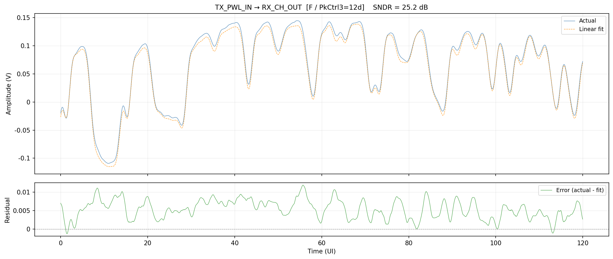

---

## 6. SNDR Summary & Cross-Sweep Comparison

### Per-Block SNDR

```
Block                          A       B       C       D       E       F
──────────────────────────────────────────────────────────────────────────────
RX_CH_OUT → RX_IN             53.2    53.4    53.1    55.2    55.2    54.9
DRV_OUT → MZM_IN              50.9    50.2    51.1    50.6    49.4    51.0
TX_PWL_IN → TX_CH_OUT         35.4    35.3    32.8    28.1    28.2    26.9  ← sweep-dependent (Wiener artefact)
MZM_IN → MZM_OUT              34.8    34.8    35.2    35.4    35.9    35.5
TIA_OUT → RX_CH_OUT           32.3    32.3    32.9    32.7    32.6    32.3
TX_CH_OUT → DRV_OUT           25.6    29.0    30.7    28.3    27.9    28.7
MZM_OUT → TIA_OUT             22.2    22.2    22.9    22.2    22.1    22.1  ← bottleneck
```

Visual bar chart sorted by median SNDR (sweep F as representative):

```
RX_CH_OUT → RX_IN     54.9  ████████████████████████████████████████████████████
DRV_OUT → MZM_IN      51.0  ███████████████████████████████████████████████
TX_PWL_IN → TX_CH_OUT 26.9  ████████████████████████
MZM_IN → MZM_OUT      35.5  ████████████████████████████████
TIA_OUT → RX_CH_OUT   32.3  █████████████████████████████
TX_CH_OUT → DRV_OUT   28.7  ██████████████████████████
MZM_OUT → TIA_OUT     22.1  ████████████████████
```

### End-to-End (From-TX_PWL_IN) SNDR

```
Probe Point     A       B       C       D       E       F
──────────────────────────────────────────────────────────
TX_CH_OUT      35.4    35.3    32.8    28.1    28.2    26.9
DRV_OUT        30.2    29.9    30.6    28.8    28.3    29.5
MZM_IN         30.1    29.8    30.5    28.7    28.2    29.4
MZM_OUT        30.5    30.3    30.5    29.0    28.6    29.6
TIA_OUT        22.3    22.2    22.4    22.0    21.7    22.2   ← minimum (bottleneck)
RX_CH_OUT      24.7    24.4    24.6    24.1    23.7    25.2   ← ISI recovery (+2–3 dB)
RX_IN          24.7    24.4    24.6    24.1    23.7    25.2   ← same as RX_CH_OUT
```

---

## 7. Key Findings

### Finding 1 — TIA Is the Dominant Impairment: 22 dB, Invariant to TX FIR

The MZM_OUT → TIA_OUT block achieves **22.1–22.9 dB SNDR** across all 6 sweeps — the worst per-block result and independent of TX FIR configuration. The impulse response shows a dominant alternating ringing pattern: cursor +1.000, UI+1 −0.447, UI+2 +0.068, consistent with strong second-order TIA gain peaking. This result is consistent with pkctrl3 (22.78 dB).

**Implication for equalisers:** any FFE or DFE at the receiver must contend with at least −44.7% energy in the first postcursor. With 22 dB of per-block SNDR, the Wiener filter upper bound on SNR improvement is approximately 22 dB − 22 dB (TIA) = 0 dB gain from RX channel equalization alone, meaning the dominant noise source is within the TIA rather than ISI from upstream blocks.

### Finding 2 — Substrate Is Excellent: 49–51 dB, Much Improved vs pkctrl3

The DRV_OUT → MZM_IN block achieves **49–51 dB SNDR**, with a small negative precursor of only −5.6% at UI−1. This is a significant improvement over pkctrl3's substrate (49 dB SNDR but −16.2% precursor). The smaller reflection corresponds to $|\Gamma| \approx 0.056$ vs $|\Gamma| \approx 0.162$ — approximately 3× better impedance matching. The Colossus substrate routing is effectively transparent: it contributes negligible ISI and no reflective echoes beyond UI−1.

### Finding 3 — MZM Nonlinearity Floor is 35 dB Across All Configurations

The MZM block consistently produces **34.8–36.0 dB SNDR** regardless of TX FIR (which changes drive voltage waveform) or PkCtrl3 setting (which changes driver gain). This confirms the cos(·) nonlinearity floor is a property of the MZM operating point, not the excitation. The floor matches pkctrl3 (35.4 dB). Any SNDR target above ~35 dB at the optical output requires MZM linearisation (e.g., reduced swing, bias adjustment, or digital pre-distortion).

### Finding 4 — TIA_OUT → RX_CH_OUT Is Polarity-Inverted in All Sweeps

Every sweep returns a **negative norm** (−0.0120 to −0.0124) for the TIA_OUT → RX_CH_OUT block, confirming this is a hardware invariant: the RX channel inverts signal polarity. The cross-correlation analysis confirms the peak is negative (cc ≈ −1.97 × 10³) at the correct 123 UI lag. This is most likely a deliberate design choice in the differential-to-single-ended conversion at the TIA output or in the RX channel filter's first coefficient. The polarity flip must be accounted for in any end-to-end simulation — the final PAM4 symbol mapping at the slicer should be inverted accordingly.

**Note on the `align_waveforms` fix:** this finding motivated a bug fix in `channel_estimation.py` (line 93): `np.argmax(xcorr)` → `np.argmax(np.abs(xcorr))`. The old code selected the wrong (small positive) lag when the dominant cross-correlation peak was negative, producing ~0 dB SNDR. The fix correctly identifies the anti-correlated lag and enables the Wiener deconvolution to extract the inverted channel response.

### Finding 5 — RX_CH_OUT ≡ RX_IN: No Captured RX SerDes Pipeline

`RX_CH_OUT` and `RX_IN` are identical byte-for-byte in this dataset. Unlike pkctrl3, where the `RX_CH_OUT → RX_IN` block showed a 120 UI pipeline delay consistent with RX SerDes DSP processing (FFE/DFE adaptation, CDR, etc.), the Colossus capture does not include a distinct RX SerDes stage. The analysis therefore terminates effectively at `RX_CH_OUT` (SNDR = 25.2 dB, sweep F) as the final meaningful probe point.

### Finding 6 — End-to-End SNDR Converges to 22–25 dB Regardless of TX FIR

Despite the wide variation in TX_PWL_IN → TX_CH_OUT SNDR across sweeps (26.9–35.4 dB, mostly a Wiener estimator artefact), the end-to-end SNDR at the receiver converges tightly:

- At TIA_OUT: 21.7–22.4 dB (0.7 dB spread)
- At RX_CH_OUT: 23.7–25.2 dB (1.5 dB spread)

The convergence confirms that the TIA noise and nonlinearity completely dominate the link budget and the TX FIR choice has minimal impact on receiver-side SNR at this level. **TX FIR optimisation should target eye opening (ISI pre-emphasis) rather than SNDR, since the SNDR ceiling is set by the hardware.** Sweep F achieves the best end-to-end result (25.17 dB at RX_CH_OUT) — the PkCtrl3=12d setting with the most balanced pre- and post-cursor cancellation.

---

## Appendix: Simulation Parameters

### Signal & Estimation Parameters

| Parameter | Value |
|---|---|
| Data rate | 212.5 Gb/s |
| Modulation | PAM4 (2 bits/symbol) |
| Symbol rate | 106.25 GBaud |
| Samples per symbol | 32 |
| Sample rate $f_s$ | 3400 GHz |
| Sample period $\Delta t$ | 0.2941 ps |
| Capture length | ~150 ns (~15 938 UI, 510 001 samples) |
| PRBS pattern | PRBS15, 262 354 PAM4 symbols |
| IR window | $n_{\text{pre}}=5$ UI, $n_{\text{post}}=60$ UI |
| SNDR guard | 200 UI each end |
| Regularisation $\lambda$ | $10^{-4} \cdot \bar{S}_{xx}$ |
| Frequency display | 0 to 106.25 GHz |
| FFT size (FR display) | 8192 (zero-padded) |
| Primary sweep shown | F (PkCtrl3=12d) |

### TX FIR Tap Coefficients by Sweep

| Tap | Sweep A | Sweep B | Sweep C | Sweep D | Sweep E | Sweep F |
|---|---|---|---|---|---|---|
| PkCtrl3 | 00d | 00d | 31d | 12d | 12d | 12d |
| main tap | cm1 | cm1 | cm3 | cm1 | cm2 | cm1 |
| cm4 | 0.0 | 0.0 | −0.1784 | 0.0 | +0.0362 | −0.0396 |
| cm3 | +0.0548 | +0.0661 | **+0.6000** | +0.0086 | −0.2023 | +0.0774 |
| cm2 | −0.2080 | −0.2144 | −0.1764 | −0.1824 | **+0.5600** | −0.1814 |
| cm1 | **+0.6000** | **+0.5800** | −0.0302 | **+0.6000** | −0.1576 | **+0.5444** |
| c0  | −0.0634 | −0.0665 | 0.0 | −0.1594 | −0.0440 | +0.0223 |
| cp1 | −0.0738 | −0.0730 | +0.0150 | −0.0496 | 0.0 | −0.1348 |

Main tap in **bold**. All taps sum to approximately 0.27 (the net gain from the FIR pre-emphasis relative to the main tap amplitude).

### Data Source

```
/lm/analog/colossus/channels/waveform/For_patrick/150ns_prbs15_6sweeps/
```

Files: `TX_PWL_IN.csv`, `TX_CH_OUT.csv`, `DRV_OUT.csv`, `MZM_IN.csv`, `MZM_OUT.csv`, `TIA_OUT.csv`, `RX_CH_OUT.csv`, `RX_IN.csv`, `PRBS15_symbol_sequence.npy`, `TX_FIR_settings_for_eachsweep.txt`

### Analysis Script & Outputs

- Script: [`examples/colossus_channel_estimation.py`](../../../examples/colossus_channel_estimation.py)
- JSON: [`runs/colossus_channel_estimation/analysis_results.json`](../../../runs/colossus_channel_estimation/analysis_results.json)
- Plots: `runs/colossus_channel_estimation/sweep_{A,B,C,D,E,F}/`

---

*Analysis performed using Python / NumPy. All waveforms from Virtuoso transient simulation. Library fix to `channel_estimation.py:align_waveforms` (argmax → argmax of absolute value) applied prior to this run.*
