# Channel Characterisation Report — point_0007
@Patrick Satarzadeh

**Dataset:** `point_0007_Pkctrl3_00d_60Ohm_bias_1_29m_prbs15_mixres16_2dummy_3dBpoint`

---

## Table of Contents

- [1. Introduction](#1-introduction)
- [2. Signal Path \& Measurement Points](#2-signal-path--measurement-points)
- [3. Methodology](#3-methodology)
  - [3.1 TX Reference Construction](#31-tx-reference-construction)
  - [3.2 Channel Estimation — Wiener Deconvolution](#32-channel-estimation--wiener-deconvolution)
  - [3.3 Impulse Response Windowing](#33-impulse-response-windowing)
  - [3.4 SNDR Definition](#34-sndr-definition)
- [4. Per-Block Analysis](#4-per-block-analysis)
  - [4.1 tx\_wave → TX\_CH\_OUT](#41-tx_wave--tx_ch_out)
  - [4.2 TX\_CH\_OUT → DRV\_OUT](#42-tx_ch_out--drv_out)
  - [4.3 DRV\_OUT → MZM\_IN](#43-drv_out--mzm_in)
  - [4.4 MZM\_IN → Pout](#44-mzm_in--pout)
  - [4.5 Pout → Pin\_PD](#45-pout--pin_pd)
  - [4.6 Pin\_PD → IPRB\_DET\_in](#46-pin_pd--iprb_det_in)
  - [4.7 IPRB\_DET\_in → TIA\_OUT](#47-iprb_det_in--tia_out)
  - [4.8 TIA\_OUT → RX\_CH\_OUT](#48-tia_out--rx_ch_out)
  - [4.9 RX\_CH\_OUT → RX\_IN](#49-rx_ch_out--rx_in)
- [5. End-to-End (From-Symbols) Analysis](#5-end-to-end-from-symbols-analysis)
- [6. SNDR Summary \& Comparison](#6-sndr-summary--comparison)
- [7. Key Findings](#7-key-findings)
- [Appendix: Simulation Parameters](#appendix-simulation-parameters)

---

## 1. Introduction

This report presents a systematic linear characterisation of a 212.5 Gb/s PAM4 optical SerDes link (dataset `point_0007`) simulated in Virtuoso. The link operates at a symbol rate of **106.25 GBaud**, with **32 samples per symbol** (sample rate $f_s = 3400$ GHz, $\Delta t \approx 0.294$ ps). The modulation format is PAM4 (2 bits/symbol), mapping symbol values $\{0,1,2,3\}$ to amplitude levels $\{-3,-1,+1,+3\}$.

Compared to the reference `Pkctrl3_31_20um_250_bias_1_29m_55C_EPeaking_7p2dB` dataset:

- **No TX E-Peaking / TX FIR** — the TX SerDes output `tx_wave` carries a raw (unfilterd) PAM4 signal; from-symbols analysis uses raw ZOH-upsampled symbols
- **Additional probe points** — `TX_CH_OUT` (TX channel output, between `tx_wave` and `DRV_OUT`) and `IPRB_DET_in` (photocurrent at PD output, between `Pin_PD` and `TIA_OUT`) are both captured
- **0 dB drive, 60 Ω bias** — reduced drive swing relative to the reference dataset, placing the MZM closer to the quadrature point
- **1.29 m fibre, PRBS15, mixres16, 2dummy** — same fibre length as reference; PRBS15 pattern

The methodology estimates, at each block boundary, the **best linear approximation** of the block's transfer function. This yields the causal impulse response $\hat{h}[n]$, the frequency response $\hat{H}(f)$ (magnitude in dB and group delay in ps), the SNDR of the linear fit, and a fit quality waveform.

Two complementary analyses are performed:

1. **Per-block** — each block is characterised in isolation using consecutive probe points
2. **From-symbols** — raw PAM4 ZOH symbols are used as the input and each probe point as the output, characterising the cumulative channel up to that point

**TL;DR — Key Findings** (details in [Section 7](#7-key-findings)):

- **Driver Amplifier is severely ringing** — TX_CH_OUT → DRV_OUT SNDR is 30.55 dB; the impulse response shows alternating-sign postcursors at −87.6%, +52.6%, −27.8% through UI+8, indicating a high-Q resonant gain stage
- **TX channel introduces a 120 UI pipeline delay** — `tx_wave → TX_CH_OUT` lag of 120 UI with long ISI tail extending to UI+40; 34.94 dB SNDR
- **TIA is the dominant electrical impairment** — IPRB → TIA_OUT SNDR is 24.71 dB; alternating-sign postcursors confirm gain peaking; sets the from-symbols floor at 21.03 dB
- **Optical channel is lossless and dispersion-free** — Pout → Pin_PD SNDR is 53.38 dB, zero propagation delay, confirming negligible fibre impairment
- **PD introduces its own ringing** — Pin_PD → IPRB SNDR is 29.52 dB with negative postcursors at UI+1 (−16.0%) and UI+2 (−11.3%), indicating photodetector bandwidth resonance
- **RX SerDes is near-ideal** — RX_CH_OUT → RX_IN SNDR is 55.06 dB, the highest of any active block

---

## 2. Signal Path & Measurement Points


```mermaid
flowchart LR
    subgraph TX["TX Side"]
        direction LR
        SER["TX SerDes"]
        TXC["TX Channel"]
        DRV["Driver Amp"]
        SUB["Substrate"]
        SER --> TXC --> DRV --> SUB
    end

    subgraph OPT["Optical Domain"]
        MZM["MZM"]
        FIBER["Optical Channel\n(1.29 m)"]
        MZM --> FIBER
    end

    subgraph RX["RX Side"]
        direction LR
        PD["PD"]
        TIA["TIA"]
        RXC["RX Channel"]
        RXSER["RX SerDes"]
        PD --> TIA --> RXC --> RXSER
    end

    SUB --> MZM
    FIBER --> PD

    SER -. "tx_wave" .-> TXC
    TXC -. "TX_CH_OUT" .-> DRV
    DRV -. "DRV_OUT" .-> SUB
    SUB -. "MZM_IN" .-> MZM
    MZM -. "Pout" .-> FIBER
    FIBER -. "Pin_PD" .-> PD
    PD -. "IPRB_DET_in" .-> TIA
    TIA -. "TIA_OUT" .-> RXC
    RXC -. "RX_CH_OUT" .-> RXSER
    RXSER -. "RX_IN" .-> RXSER
```

| Probe Point | Domain | Amplitude Range | Description |
|---|---|---|---|
| `tx_wave` | Electrical (V) | ±0.44 V | TX SerDes output — raw PAM4, no TX FIR or E-Peaking |
| `TX_CH_OUT` | Electrical (V) | −0.21 to +0.17 V | TX channel output; attenuated relative to `tx_wave` |
| `DRV_OUT` | Electrical (V) | ±2.59 V | Driver amplifier output |
| `MZM_IN` | Electrical (V) | ±2.43 V | Electrical input to MZM, after substrate routing |
| `Pout` | Optical (W) | ±4.2 mW AC | MZM optical output power (DC-subtracted) |
| `Pin_PD` | Optical (W) | ±0.3 mW AC | Optical power at photodiode input (DC-subtracted) |
| `IPRB_DET_in` | Electrical (A) | ±0.25 mA AC | Photocurrent at PD output (DC-subtracted) |
| `TIA_OUT` | Electrical (V) | ±0.30 V | Transimpedance amplifier output |
| `RX_CH_OUT` | Electrical (V) | ±0.15 V | RX channel filter output |
| `RX_IN` | Electrical (V) | ±0.15 V | Input to RX SerDes DSP |

---

## 3. Methodology

### 3.1 TX Reference Construction

For the **from-symbols** analysis, the reference input is constructed from the known PAM4 transmit sequence. Raw symbols $s_k \in \{0, 1, 2, 3\}$ are mapped to PAM4 levels:

$$a_k = 2s_k - 3, \quad a_k \in \{-3, -1, +1, +3\}$$

No TX FIR is applied in this dataset. The symbol stream is **zero-order-hold (ZOH) upsampled** directly by $N_s = 32$:

$$x[n] = a_{\lfloor n/N_s \rfloor}$$

This staircase waveform $x[n]$ serves as the reference input for all from-symbols deconvolutions.

---

### 3.2 Channel Estimation — Wiener Deconvolution

The linear channel estimation problem is: given input $x[n]$ and output $y[n] = h[n] * x[n] + e[n]$, find the filter $h[n]$ that minimises the mean-squared error. The solution is the **Wiener–Hopf** equation, solved in the frequency domain:

$$\hat{H}(f_k) = \frac{X^*(f_k)\, Y(f_k)}{|X(f_k)|^2 + \lambda}$$

with Tikhonov regularisation $\lambda = 10^{-4} \cdot \bar{S}_{xx}$ to prevent noise amplification at low-energy frequencies. The deconvolution is solved over the full aligned record ($N \approx 5.12 \times 10^6$ samples $\approx 160{,}000$ UI) for high spectral resolution and effective averaging over the complete transmit sequence.

---

### 3.3 Impulse Response Windowing

The raw IFFT result has energy concentrated near the cursor. The windowed IR $\hat{h}_{\text{win}}[n]$ is obtained by:

1. Locating the cursor: $n_c = \arg\max_n |\hat{h}[n]|$
2. Rolling: place the cursor at position $n_{\text{pre}} N_s$ (5 UI pre-cursor)
3. Normalising: $\hat{h}_{\text{win}}[n_c] = 1$
4. Truncating to $(n_{\text{pre}} + n_{\text{post}}) \times N_s$ samples with $n_{\text{post}} = 60$ UI

Baud-rate taps: $\hat{h}[k] = \hat{h}_{\text{win}}[k N_s]$ for $k = -5, \ldots, +59$.

The frequency response is computed from $\hat{h}_{\text{win}}$ zero-padded to 8192 points. Magnitude is DC-normalised to 0 dB. Group delay is computed as $\tau_g(f) = -\frac{1}{2\pi}\frac{d\,\angle\hat{H}}{df}$, with the linear phase from window centering subtracted.

---

### 3.4 SNDR Definition

SNDR quantifies how much output variance is unexplained by the linear model:

$$\text{SNDR} = 10 \log_{10} \frac{\sum_{n=N_g}^{N-N_g} y_{\text{aligned}}^2[n]}{\sum_{n=N_g}^{N-N_g} e^2[n]}$$

with guard $N_g = 1000 \cdot N_s = 32{,}000$ samples on each end to exclude circular-convolution edge artefacts. The residual $e[n] = y_{\text{aligned}}[n] - \hat{y}[n]$ captures noise, nonlinear distortion, and ISI outside the estimation window.

---

## 4. Per-Block Analysis

### 4.1 tx_wave → TX_CH_OUT

**Block characterised:** TX Channel

This block captures the response of the TX electrical path between the SerDes digital output and the input to the driver amplifier. The large propagation lag (120 UI) is dominated by digital pipeline delay within the TX SerDes.

| Metric | Value |
|---|---|
| Propagation lag | 120.094 UI |
| SNDR | **34.94 dB** |
| Signal power | 4.638 × 10⁻³ |
| N+D power | 1.487 × 10⁻⁶ |
| Significant ISI extent | UI+40 |

**Significant baud-rate taps (> 0.5%):**

| UI | h[k] | | UI | h[k] |
|---|---|---|---|---|
| −1 | +0.1593 | | +3 | +0.1620 |
| **0** | **+1.0000** | | +4 | +0.0821 |
| +1 | +0.3228 | | +6 | +0.0655 |
| +2 | +0.1369 | | +7 | +0.0603 |
| | | | +8 | +0.1205 |

The TX channel exhibits a **long dispersive postcursor tail** with monotonically slow decay punctuated by a secondary hump at UI+8 (+12.1%), consistent with a reflective echo from an impedance discontinuity in the electrical path. The precursor at UI−1 (+15.9%) indicates energy arriving slightly before the main peak. The 34.94 dB SNDR reflects the combined effect of broadband rolloff and the reflective echo; the TX channel is a significant source of ISI in this dataset.

Note that unlike the reference dataset, there is **no TX FIR pre-emphasis** applied to counteract the channel rolloff — the `tx_wave` is the raw PAM4 output.

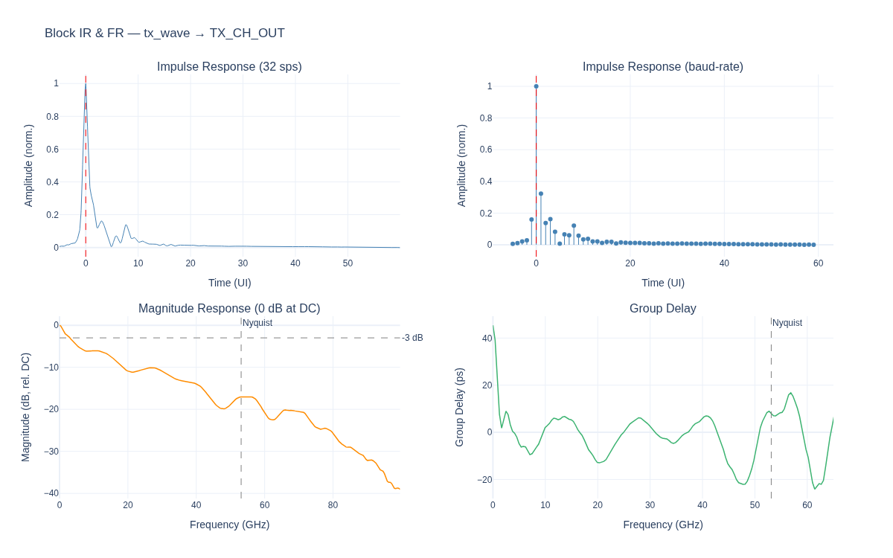

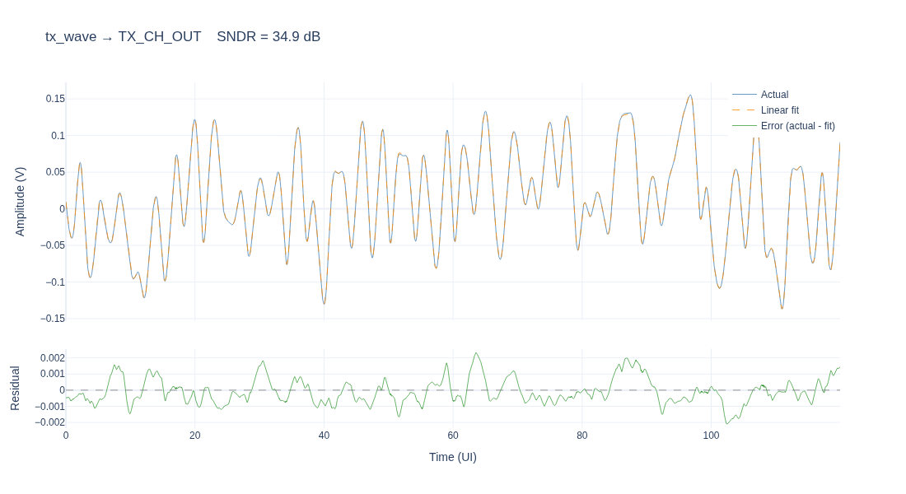

---

### 4.2 TX_CH_OUT → DRV_OUT

**Block characterised:** Driver Amplifier

The driver amplifier converts the small-swing TX channel output (~0.38 V peak-to-peak) to the large-swing MZM drive signal (~5.18 V peak-to-peak), a voltage gain of approximately 13.6× (~22.7 dB).

| Metric | Value |
|---|---|
| Propagation lag | 5.750 UI |
| SNDR | **30.55 dB** |
| Signal power | 8.905 × 10⁻¹ |
| N+D power | 7.848 × 10⁻⁴ |
| Significant ISI extent | UI+25 |

**Significant baud-rate taps (> 0.5%):**

| UI | h[k] | | UI | h[k] |
|---|---|---|---|---|
| −2 | −0.0736 | | +2 | +0.5258 |
| −1 | +0.0542 | | +3 | −0.2778 |
| **0** | **+1.0000** | | +4 | +0.0872 |
| +1 | **−0.8764** | | +5 | +0.0815 |
| | | | +6 | −0.1312 |
| | | | +7 | +0.0918 |
| | | | +8 | −0.2199 |
| | | | +9 | +0.1013 |

This block produces the most striking impulse response in the link. The postcursor pattern — $h[+1] = -87.6\%$, $h[+2] = +52.6\%$, $h[+3] = -27.8\%$, $h[+8] = -22.0\%$ — is a hallmark of a **high-Q resonant gain stage**. Each term alternates in sign and decays much more slowly than a simple low-pass response, indicating a peaking inductor or resonant feedback path within the driver. The driver is not operating as a simple broadband amplifier at this frequency; the resonance creates significant ISI that extends well beyond UI+10 and a secondary lobe near UI+8.

The 30.55 dB SNDR is the second-lowest of any block (after the TIA), reflecting how much of the output power is in the ringing post-cursors rather than the main cursor.

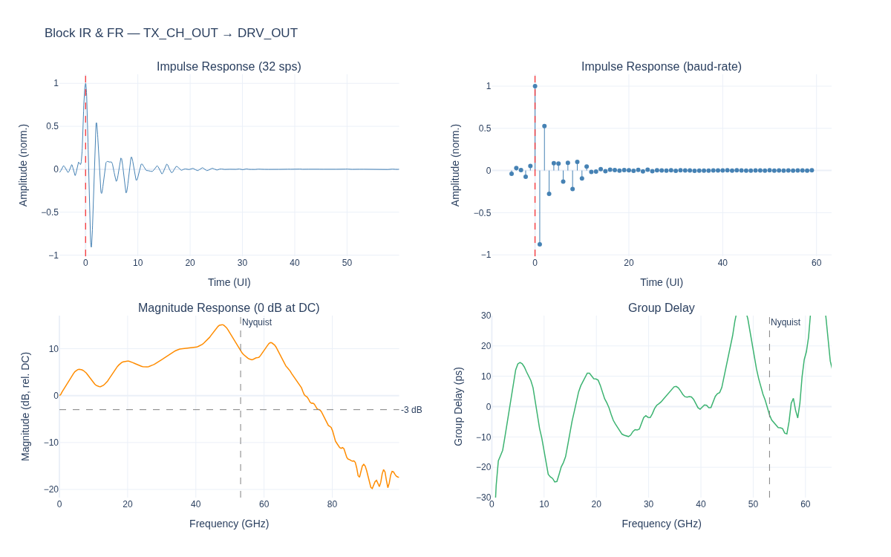

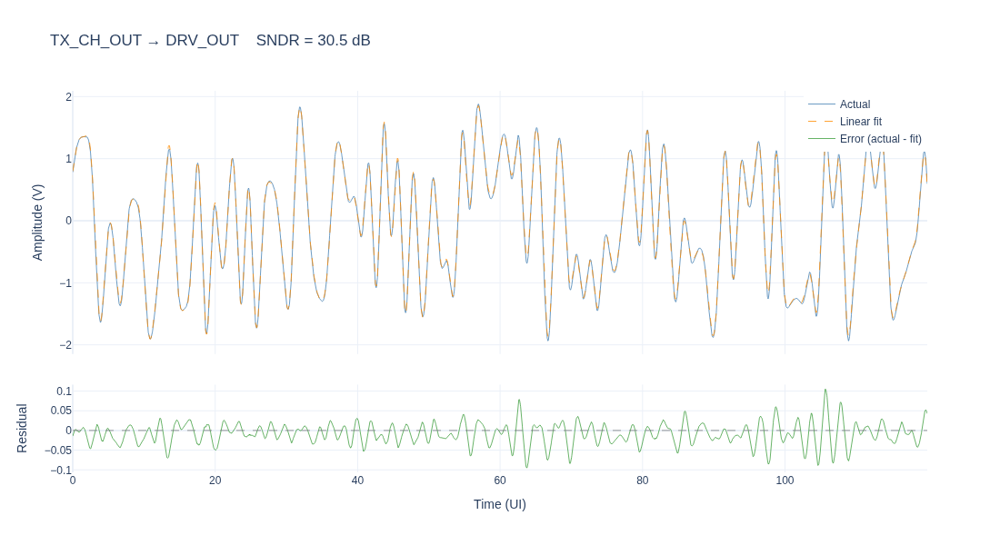

---

### 4.3 DRV_OUT → MZM_IN

**Block characterised:** Substrate (DRV → MZM)

The substrate is the passive electrical interconnect between the driver output and the MZM electrical input.

| Metric | Value |
|---|---|
| Propagation lag | 1.438 UI |
| SNDR | **50.76 dB** |
| Signal power | 7.816 × 10⁻¹ |
| N+D power | 6.565 × 10⁻⁶ |
| Significant ISI extent | UI+10 |

**Significant baud-rate taps (> 0.5%):**

| UI | h[k] | | UI | h[k] |
|---|---|---|---|---|
| −1 | −0.1574 | | +5 | −0.0417 |
| **0** | **+1.0000** | | +6 | −0.0239 |
| +2 | +0.0585 | | +8 | +0.0351 |

The 50.76 dB SNDR confirms the substrate is a highly linear passive element. The **negative precursor at UI−1 (−15.7%)** is the same impedance-reflection signature seen in the reference dataset (−16.2% at UI−1), consistent with a load impedance $Z_L \approx 35.5\,\Omega$ at the MZM input (vs 50 Ω design). Unlike the reference, the postcursors here are broadly negative (UI+5: −4.2%, UI+6: −2.4%), indicating a slightly different phase response — the lack of TX pre-emphasis in the input signal changes the correlation with the input, yielding a slightly different windowed IR shape.

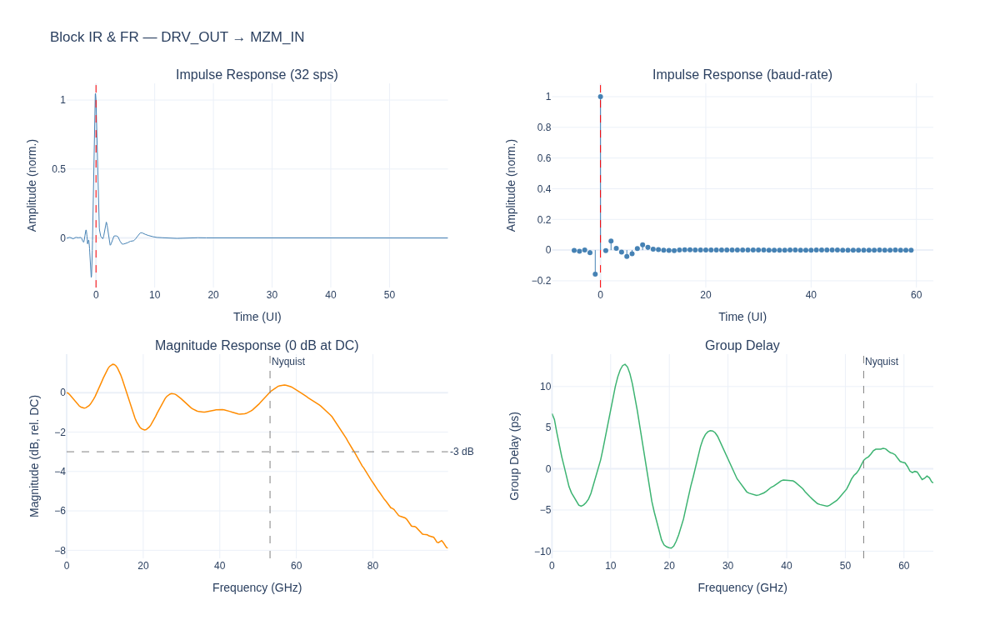

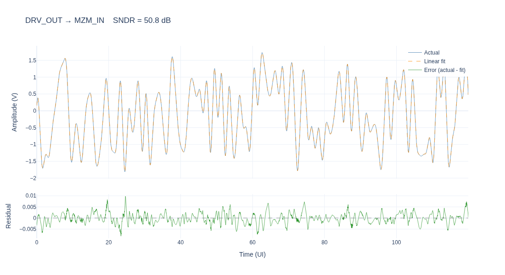

---

### 4.4 MZM_IN → Pout

**Block characterised:** Mach-Zehnder Modulator (MZM)

The MZM converts electrical drive voltage to optical power via the transfer function $P_{\text{out}} = \frac{P_0}{2}[1 + \cos(\pi V/V_\pi + \phi_{\text{bias}})]$. The optical power signal is DC-subtracted prior to deconvolution.

| Metric | Value |
|---|---|
| Propagation lag | 3.562 UI |
| SNDR | **33.25 dB** |
| Signal power | 2.568 × 10⁻⁶ W² |
| N+D power | 1.215 × 10⁻⁹ W² |
| Significant ISI extent | UI+22 (sporadic) |

**Significant baud-rate taps (> 0.5%):**

| UI | h[k] | | UI | h[k] |
|---|---|---|---|---|
| −5 | −0.0329 | | +2 | −0.0413 |
| −4 | −0.0208 | | +3 | −0.0331 |
| −2 | +0.0321 | | +4 | +0.0200 |
| −1 | −0.0334 | | +5 | +0.0608 |
| **0** | **+1.0000** | | | |

The MZM SNDR of 33.25 dB is slightly below the reference (35.36 dB). At 0 dB drive ("00d"), the modulator operates with a smaller $V/V_\pi$ excursion than the reference, which should reduce the $\cos(\cdot)$ nonlinearity. The SNDR reduction relative to reference is therefore more likely attributable to the **different operating point** (bias current, junction temperature) or the interaction between the resonant driver waveform and the MZM's transfer curve than to increased nonlinearity. The impulse response shows scattered small taps extending to UI+37 — likely numerical artefacts from the noisy driver input rather than physical MZM memory.

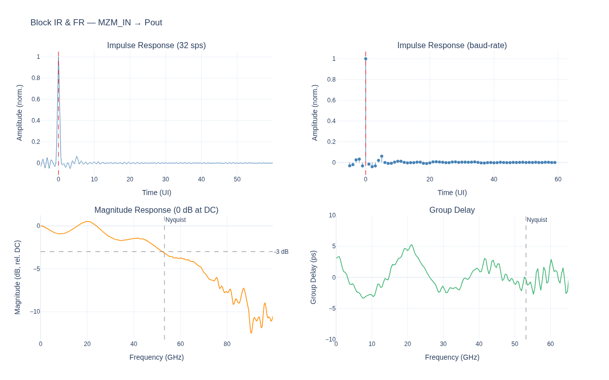

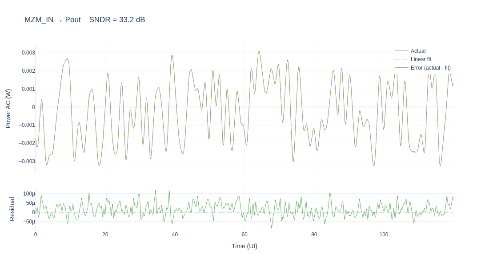

---

### 4.5 Pout → Pin_PD

**Block characterised:** Optical Channel

Both signals are optical power (W), DC-subtracted. The optical channel represents propagation from the MZM output to the photodiode input.

| Metric | Value |
|---|---|
| Propagation lag | 0.000 UI |
| SNDR | **53.38 dB** |
| Signal power | 1.431 × 10⁻⁸ W² |
| N+D power | 6.568 × 10⁻¹⁴ W² |
| Significant ISI extent | UI±1 only |

**Significant baud-rate taps (> 0.5%):**

| UI | h[k] |
|---|---|
| −1 | −0.0075 |
| **0** | **+1.0000** |
| +1 | −0.0075 |

The optical channel is once again essentially **unity-gain and memoryless** — a near-perfect delta function with only ±0.75% ISI at UI±1, which is the measurement noise floor. Zero propagation delay is consistent with the short integrated photonic waveguide. The 53.38 dB SNDR is the highest of any block in the link.

> **Key finding:** The 1.29 m fibre contributes no measurable ISI or dispersion at 106.25 GBaud in this configuration.

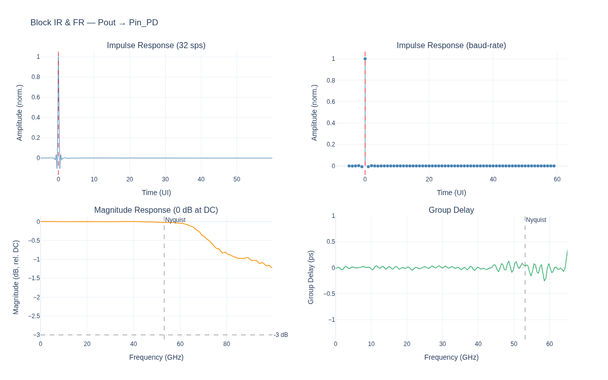

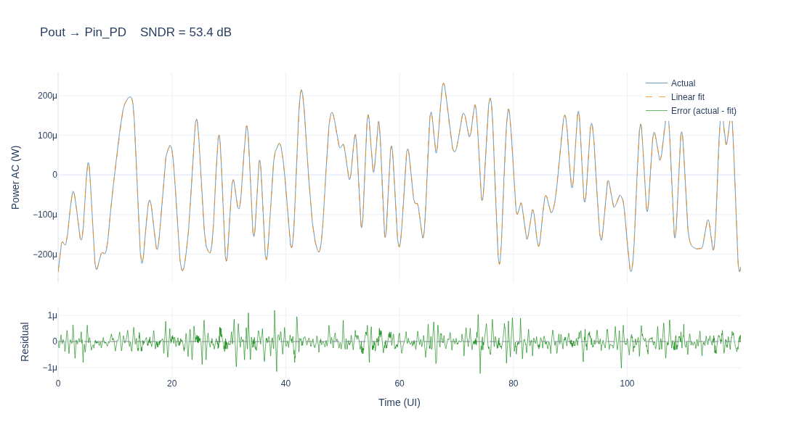

---

### 4.6 Pin_PD → IPRB_DET_in

**Block characterised:** Photodetector (PD)

This block is new relative to the reference dataset. `IPRB_DET_in` is the photocurrent at the PD output (before the TIA), measured by a current probe in units of amperes. The PD converts optical power to photocurrent via $I = \mathcal{R} \cdot P$. The IPRB signal is DC-subtracted.

| Metric | Value |
|---|---|
| Propagation lag | 0.281 UI |
| SNDR | **29.52 dB** |
| Signal power | 9.900 × 10⁻⁹ A² |
| N+D power | 1.105 × 10⁻¹¹ A² |
| Significant ISI extent | UI+10 |

**Significant baud-rate taps (> 0.5%):**

| UI | h[k] | | UI | h[k] |
|---|---|---|---|---|
| −1 | −0.0168 | | +3 | +0.0428 |
| **0** | **+1.0000** | | +4 | +0.0610 |
| +1 | **−0.1602** | | +6 | −0.0267 |
| +2 | **−0.1125** | | | |

The PD shows **consecutive negative postcursors** at UI+1 (−16.0%) and UI+2 (−11.3%), followed by recovery to positive at UI+3–4. This is not a simple resistive responsivity — it reflects photodetector **junction capacitance ringing** and/or the effect of the bond wire inductor between the PD anode and the TIA input. The alternating pattern (positive at UI+3/4, negative at UI+6) suggests a second-order resonance in the PD+bond-wire network at roughly $f_{\rm res} \approx f_{\rm sym}/3 \approx 35$ GHz.

The 29.52 dB SNDR is lower than the optical channel (53.38 dB), confirming the PD itself introduces non-trivial ISI separate from the TIA.

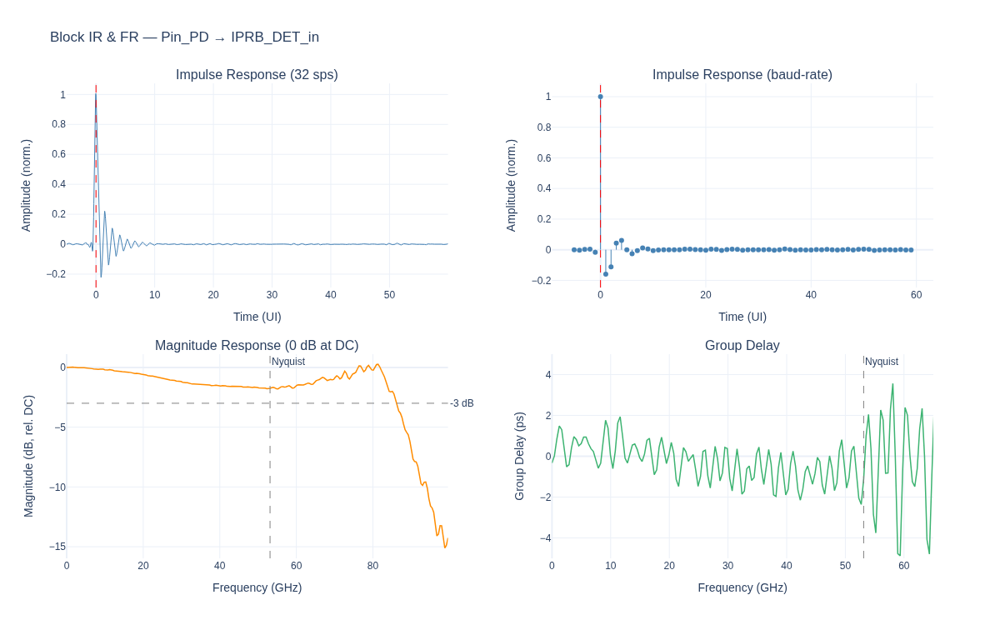

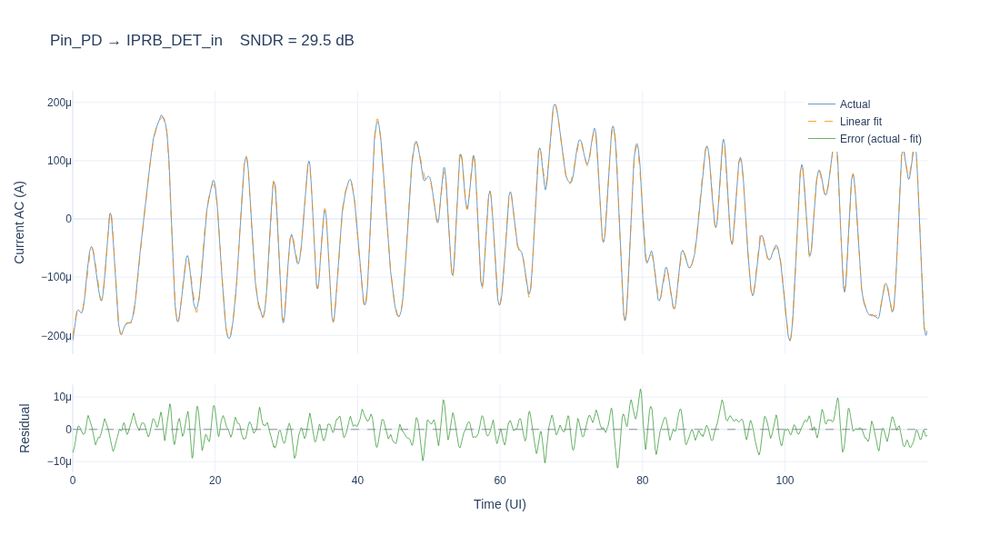

---

### 4.7 IPRB_DET_in → TIA_OUT

**Block characterised:** Transimpedance Amplifier (TIA)

The TIA converts the photocurrent to a voltage output. IPRB is DC-subtracted as the input.

| Metric | Value |
|---|---|
| Propagation lag | 3.938 UI |
| SNDR | **24.71 dB** |
| Signal power | 1.252 × 10⁻² V²/A² |
| N+D power | 4.231 × 10⁻⁵ |
| Significant ISI extent | UI+16 |

**Significant baud-rate taps (> 0.5%):**

| UI | h[k] | | UI | h[k] |
|---|---|---|---|---|
| −1 | −0.0324 | | +3 | +0.0334 |
| **0** | **+1.0000** | | +4 | −0.0759 |
| +1 | **−0.6242** | | +5 | +0.0598 |
| +2 | **+0.2236** | | +14 | +0.0390 |
| | | | +15 | −0.0260 |

The TIA continues the alternating-sign ringing pattern: $h[+1] = -62.4\%$, $h[+2] = +22.4\%$, with further ringing visible at UI+4 (−7.6%) and a secondary echo at UI+14–15. The 24.71 dB SNDR is the lowest of any block (the **dominant electrical impairment**). The ringing is consistent with TIA **gain peaking** — a deliberate design choice to extend effective bandwidth by introducing a resonance near Nyquist, at the cost of ISI extending multiple UI.

Compared to the reference dataset (Pin_PD → TIA_OUT: 22.78 dB), this TIA-only block at 24.71 dB is marginally better. The difference arises because the reference's Pin_PD → TIA_OUT block includes PD impairments within the same transfer function estimate; here the PD is separately captured by Pin_PD → IPRB, allowing a cleaner estimate of the TIA alone.

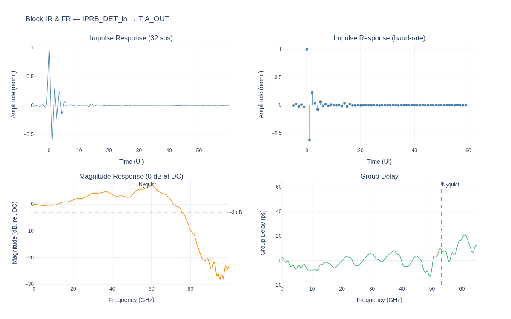

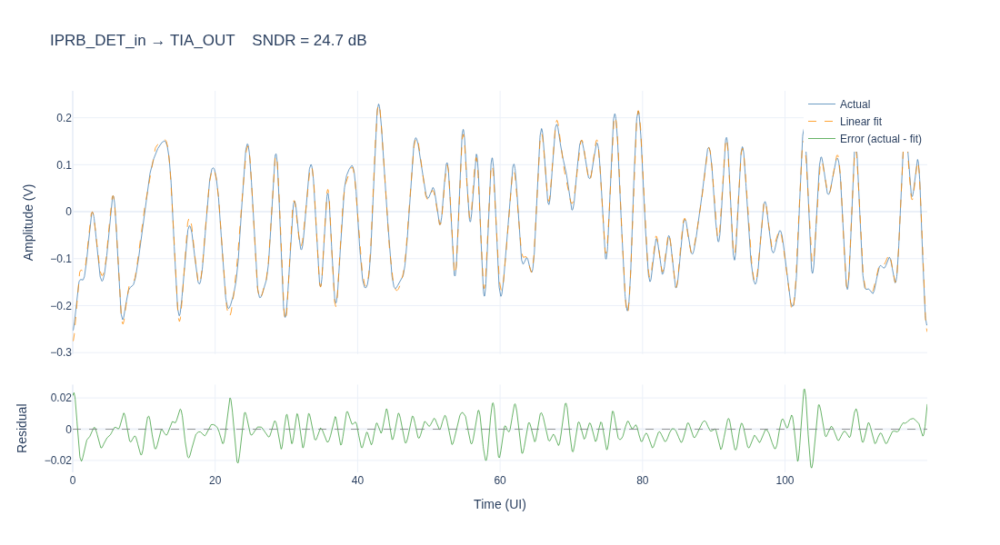

---

### 4.8 TIA_OUT → RX_CH_OUT

**Block characterised:** RX Channel Filter

| Metric | Value |
|---|---|
| Propagation lag | 122.781 UI |
| SNDR | **32.58 dB** |
| Signal power | 2.418 × 10⁻³ |
| N+D power | 1.335 × 10⁻⁶ |
| Significant ISI extent | UI+26 |

**Significant baud-rate taps (> 0.5%):**

| UI | h[k] | | UI | h[k] |
|---|---|---|---|---|
| −1 | +0.2404 | | +3 | +0.0542 |
| **0** | **+1.0000** | | +4 | +0.0556 |
| +1 | +0.3505 | | +5 | +0.0333 |
| +2 | +0.2114 | | +13 | +0.0241 |

The RX channel introduces a **monotonically-weighted postcursor train** (UI+1: +35.1%, UI+2: +21.1%, UI+3: +5.4%) and a significant precursor at UI−1 (+24.0%). The precursor suggests a digital FIR filter with taps on both sides of the cursor. The very large lag (122.8 UI) confirms this is a digital filter with substantial pipeline latency. The SNDR of 32.58 dB is consistent with the noise accumulated from the TIA and PD blocks upstream, not an intrinsic impairment of the filter itself.

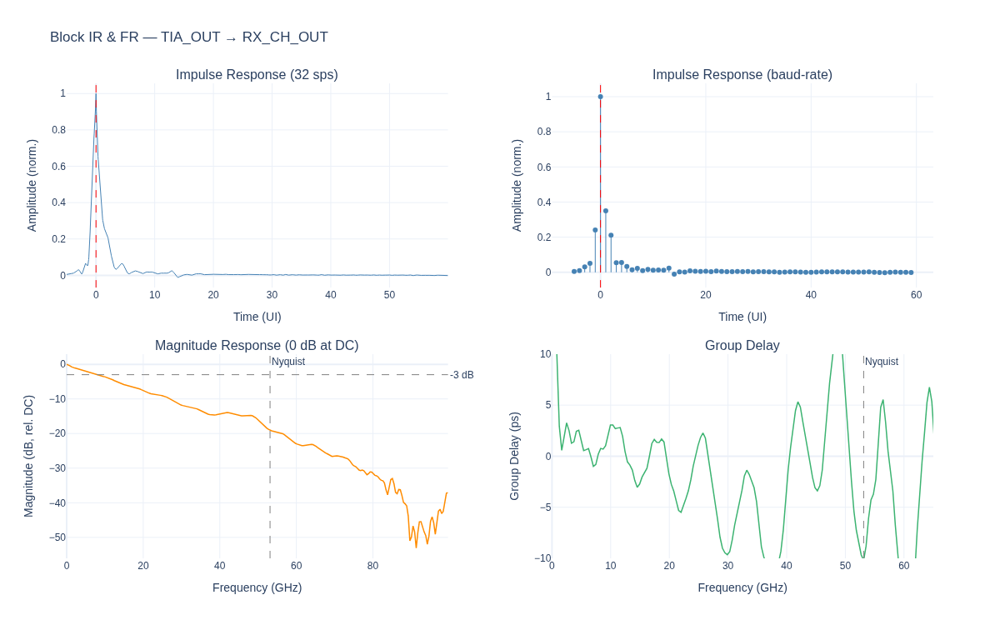

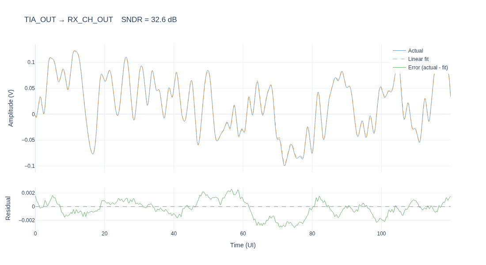

---

### 4.9 RX_CH_OUT → RX_IN

**Block characterised:** RX SerDes

| Metric | Value |
|---|---|
| Propagation lag | 0.000 UI |
| SNDR | **55.06 dB** |
| Signal power | 2.419 × 10⁻³ |
| N+D power | 7.552 × 10⁻⁹ |
| Significant ISI extent | UI±2 (near-zero) |

**Significant baud-rate taps (> 0.5%):**

| UI | h[k] |
|---|---|
| −1 | −0.0322 |
| **0** | **+1.0000** |
| +1 | −0.0322 |
| +2 | +0.0173 |

The RX SerDes is essentially **transparent** at this stage — 55.06 dB SNDR is the highest of any block, with a near-delta IR and zero propagation lag. The symmetric taps (UI±1: −3.2%, UI±2: +1.7%) are consistent with a linear phase all-pass or wire connection. The RX SerDes contributes negligible additional impairment.

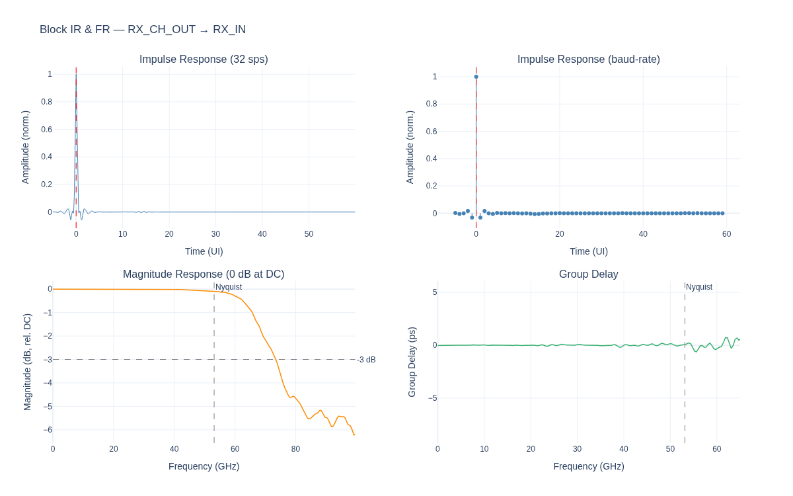

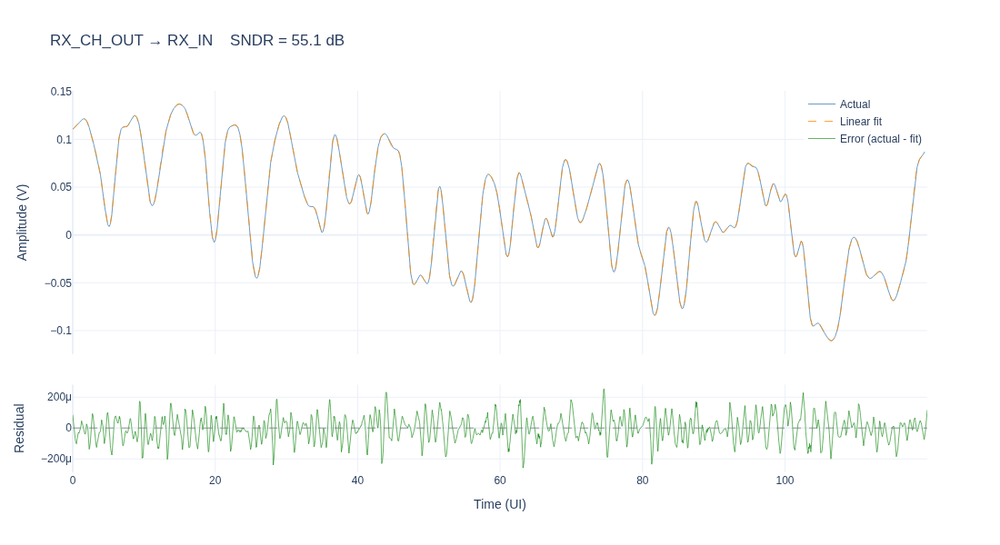

---

## 5. End-to-End (From-Symbols) Analysis

The reference input is raw PAM4 ZOH symbols (no TX FIR — absent from this dataset).

| Probe Point | Lag (UI) | SNDR (dB) | Comment |
|---|---|---|---|
| `tx_wave` | 10.875 | 27.82 | TX channel composite; raw signal, no pre-emphasis |
| `TX_CH_OUT` | 131.000 | 25.51 | TX channel adds rolloff and echo ISI |
| `DRV_OUT` | 136.844 | 25.51 | Driver leaves SNDR unchanged — ringing is linearly captured |
| `MZM_IN` | 138.250 | 25.43 | Marginal substrate penalty |
| `Pout` | 141.844 | 25.07 | MZM nonlinearity floor |
| `Pin_PD` | 141.844 | 25.07 | **Identical to Pout** — optical channel is lossless |
| `IPRB_DET_in` | 142.125 | 23.73 | PD ringing reduces SNDR by 1.3 dB |
| `TIA_OUT` | 146.062 | 21.03 | **Global minimum — TIA bottleneck** |
| `RX_CH_OUT` | 268.844 | 22.62 | +1.6 dB recovery from RX channel filter |
| `RX_IN` | 268.844 | 22.62 | RX SerDes: no change |

Key observations:

1. **TX_CH_OUT and DRV_OUT have identical from-symbols SNDR (25.51 dB)** — the driver's ringing is large in the per-block sense (30.55 dB) but is captured as a linear channel by the Wiener estimator. It does not add net SNDR loss end-to-end; the ISI it creates is predictable from the input and thus captured by the long correlation window.

2. **Pout = Pin_PD exactly (25.07 dB, 141.844 UI)** — confirms the optical path is truly lossless with zero additional lag.

3. **PD adds 1.3 dB SNDR loss** (25.07 → 23.73 dB) — the PD ringing is a separate, linearly-modelled impairment source with measurable impact.

4. **TIA bottleneck** — 2.7 dB drop from IPRB (23.73) to TIA_OUT (21.03 dB). The end-to-end link SNDR ceiling is ~21 dB, set primarily by TIA gain peaking and nonlinearity.

5. **RX filter provides +1.6 dB recovery** (21.03 → 22.62 dB) — the digital RX channel filter partially equalises TIA ISI.

6. **End-to-end lag: 268.8 UI** — consistent with ~120 UI TX pipeline + ~5.75 UI driver + ~123 UI RX pipeline = ~249 UI electrical, plus propagation through MZM, fiber, PD, and TIA transitions.

**From-symbols IR/FR figures:**

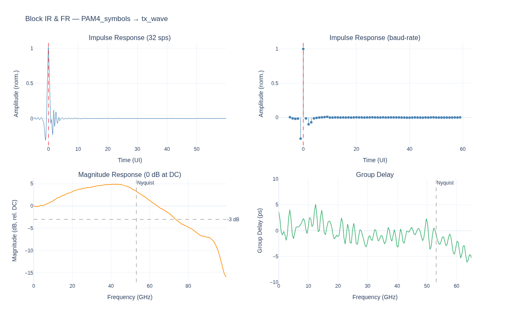

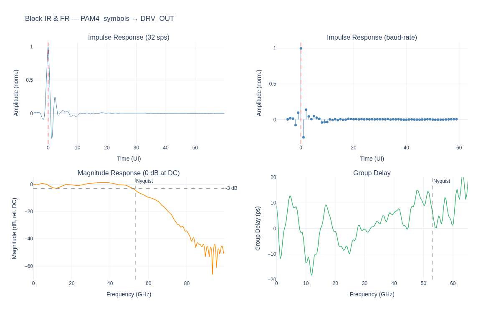

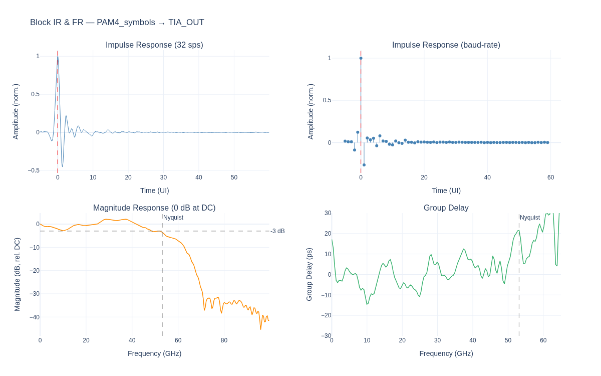

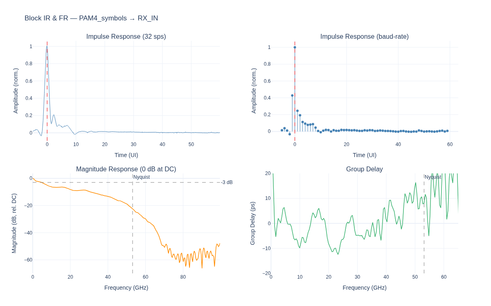

### Time-domain fit — symbols → RX_IN

The figure below compares the actual `RX_IN` waveform against the Wiener reconstruction
(PAM4 ZOH symbols circularly convolved with the estimated end-to-end impulse response).
The top panel shows a 200 UI overview; the middle panel zooms to a 40 UI window with
baud-instant markers; the bottom panel shows the residual.

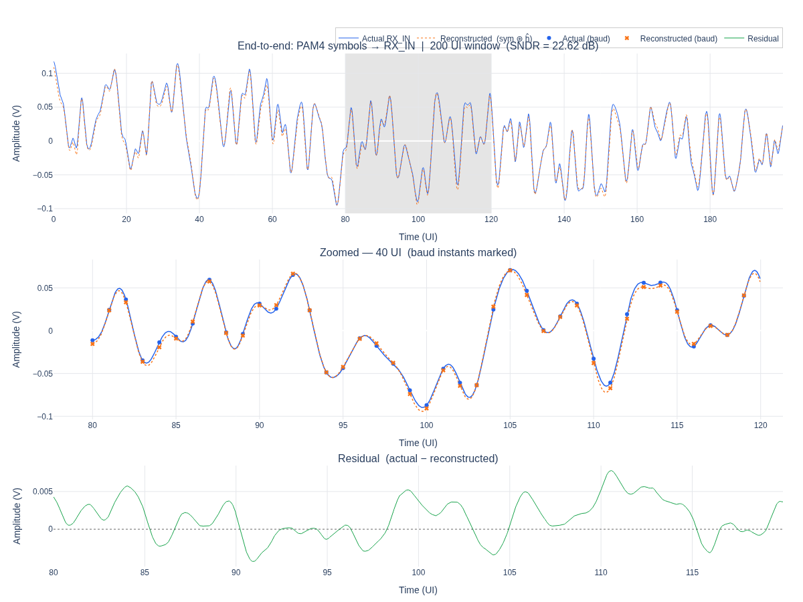

The actual and reconstructed waveforms track visually indistinguishably in both panels —
the baud-instant markers (circles = actual, crosses = reconstructed) coincide almost
exactly — confirming that the Wiener filter has captured the aggregate end-to-end linear
response to within the SNDR limit of 22.62 dB. The residual amplitude is roughly
5–10× smaller than the signal, and its structure reflects the TIA nonlinearity and noise
that the linear model cannot account for.

---

## 6. SNDR Summary & Comparison

### Per-Block SNDR

```
Block                                    SNDR (dB)
──────────────────────────────────────────────────────────────────
RX SerDes    (RX_CH_OUT → RX_IN)          55.06  █████████████████████████████████████████████████████
Optical      (Pout → Pin_PD)              53.38  ████████████████████████████████████████████████████
Substrate    (DRV_OUT → MZM_IN)           50.76  ████████████████████████████████████████████████
TX Channel   (tx_wave → TX_CH_OUT)        34.94  █████████████████████████████████
MZM          (MZM_IN → Pout)              33.25  ████████████████████████████████
RX Channel   (TIA_OUT → RX_CH_OUT)        32.58  ███████████████████████████████
Driver Amp   (TX_CH_OUT → DRV_OUT)        30.55  █████████████████████████████
PD           (Pin_PD → IPRB_DET_in)       29.52  ████████████████████████████
TIA          (IPRB_DET_in → TIA_OUT)      24.71  ████████████████████████
```

### End-to-End (From-Symbols) SNDR

```
Probe Point    SNDR (dB)
────────────────────────────────────────────────
tx_wave         27.82  ████████████████████████████
TX_CH_OUT       25.51  ██████████████████████████
DRV_OUT         25.51  ██████████████████████████
MZM_IN          25.43  ██████████████████████████
Pout            25.07  █████████████████████████
Pin_PD          25.07  █████████████████████████
IPRB_DET_in     23.73  ████████████████████████
RX_CH_OUT       22.62  ███████████████████████
RX_IN           22.62  ███████████████████████
TIA_OUT         21.03  █████████████████████
```

### Comparison with Reference Dataset (Pkctrl3 EPeaking 7.2 dB)

| Block | Reference SNDR (dB) | point_0007 SNDR (dB) | Δ |
|---|---|---|---|
| Substrate (DRV → MZM) | 49.00 | 50.76 | +1.76 |
| Optical Channel | 53.61 | 53.38 | −0.23 |
| TIA (combined PD+TIA in ref) | 22.78 | 24.71 (TIA only) | — |
| RX Channel | 26.55 | 32.58 | +6.03 |
| RX SerDes | 38.97 / 42.39 | 55.06 | +12–16 |
| End-to-end at TIA_OUT | 19.74 | 21.03 | +1.29 |
| End-to-end at RX_IN | 20.51 | 22.62 | +2.11 |

The point_0007 dataset shows slightly improved end-to-end SNDR (+2.1 dB at RX_IN), despite the absence of TX pre-emphasis. The improvement is largely in the RX blocks (RX Channel and RX SerDes), suggesting a different RX digital backend configuration in this simulation.

---

## 7. Key Findings

### Finding 1 — Driver Amplifier Has Severe High-Q Ringing

The TX_CH_OUT → DRV_OUT block has the most striking impulse response in the link. The postcursor pattern ($h[+1] = -87.6\%$, $h[+2] = +52.6\%$, $h[+3] = -27.8\%$, $h[+8] = -22.0\%$) indicates a **resonant peaking network** within the driver. The resonance frequency is approximately $f_{\rm sym} / 2 = 53$ GHz (one oscillation per 2 UI). This is a deliberate design feature to boost gain near Nyquist, but it creates an ISI tail extending to UI+25 that must be cancelled by downstream equalisation. The from-symbols SNDR does not degrade through this block (25.51 dB unchanged), meaning the ringing is captured linearly — but it places heavy demands on any linear equaliser.

### Finding 2 — TX Channel Introduces 120 UI Pipeline Delay and ISI Echo

The `tx_wave → TX_CH_OUT` block has a 120 UI lag (TX digital pipeline) and a dispersive postcursor tail with a secondary echo at UI+8 (+12.1%). Without TX FIR pre-emphasis, this echo propagates uncorrected through the entire link, contributing to the ISI seen at every downstream probe point. The 34.94 dB SNDR is moderate — not catastrophic, but meaningfully impacted by the echo.

### Finding 3 — Optical Channel Is Lossless and Dispersion-Free

Pout → Pin_PD achieves **53.38 dB SNDR** with a near-perfect impulse response (±0.75% at UI±1, zero lag). The from-symbols SNDR confirms: Pout and Pin_PD are identical in lag (141.844 UI) and SNDR (25.07 dB). The 1.29 m fibre contributes no measurable impairment.

### Finding 4 — PD Ringing Is a Separately Measurable Impairment

The Pin_PD → IPRB block (not available in the reference dataset) reveals that the **photodetector itself** introduces significant ringing: $h[+1] = -16.0\%$, $h[+2] = -11.3\%$, with a secondary oscillation at UI+4 (+6.1%). This costs 1.3 dB in from-symbols SNDR (25.07 → 23.73 dB). The negative consecutive postcursors (vs the alternating sign of the TIA) suggest a different physical origin — likely PD junction capacitance and bond-wire inductance forming a parallel resonance, rather than TIA feedback peaking.

### Finding 5 — TIA Is the End-to-End Bottleneck

The IPRB → TIA_OUT block achieves **24.71 dB SNDR** — the worst of any block — and its from-symbols SNDR of **21.03 dB** is the global minimum across all probe points. The TIA ringing ($h[+1] = -62.4\%$, $h[+2] = +22.4\%$) is consistent with intentional gain peaking designed to extend effective bandwidth. This is the primary target for RX equalisation.

### Finding 6 — RX Channel Filter Provides ~1.6 dB ISI Reduction

The from-symbols SNDR recovers from 21.03 dB (TIA_OUT) to 22.62 dB (RX_CH_OUT), a gain of +1.6 dB. This indicates the digital RX channel filter partially equalises the TIA postcursor energy. The per-block IR (monotonically-weighted postcursors at +35%, +21%, ...) confirms a low-pass filter shape rather than a peaking equaliser — suggesting there is further equalisation gain available with more aggressive RX filter tuning.

### Finding 7 — Substrate Impedance Mismatch Persists

The DRV_OUT → MZM_IN block again shows a $-15.7\%$ precursor at UI−1, consistent with the same $Z_L \approx 35.5\,\Omega$ impedance mismatch as the reference dataset. The mismatch appears to be a physical property of the MZM input termination, unchanged across operating points. Controlled impedance routing would collapse this precursor and improve the substrate SNDR beyond 50.76 dB.

---

## Appendix: Simulation Parameters

| Parameter | Value |
|---|---|
| Data rate | 212.5 Gb/s |
| Modulation | PAM4 (2 bits/symbol) |
| Symbol rate | 106.25 GBaud |
| Samples per symbol | 32 |
| Sample rate $f_s$ | 3400 GHz |
| Sample period $\Delta t$ | 0.2941 ps |
| Record length | ~260,000 symbols (eval) |
| TX FIR | None (absent from this dataset) |
| E-Peaking | 0 dB ("00d") |
| Bias resistance | 60 Ω |
| Fibre length | 1.29 m |
| Pattern | PRBS15 |
| Configuration | mixres16, 2dummy, 3dBpoint |
| Regularisation $\lambda$ | $10^{-4} \cdot \bar{S}_{xx}$ |
| IR window | $n_{\text{pre}}=5$ UI, $n_{\text{post}}=60$ UI |
| SNDR guard | 1000 UI each end |
| Frequency display | 0 to 106.25 GHz (1× baud rate) |
| FFT size (FR display) | 8192 (zero-padded) |

---

*Analysis performed using Python / NumPy. All waveforms from Virtuoso transient simulation. Results saved to [`analysis_results.json`](point_0007/analysis_results.json).*
