# Ranjit Channel Characterisation Report — PRBS12, 106 250 UI
@Patrick Satarzadeh

---

## Table of Contents

- [1. Introduction](#1-introduction)
- [2. Signal Path & Measurement Points](#2-signal-path--measurement-points)
- [3. Methodology](#3-methodology)
- [4. Per-Block Analysis](#4-per-block-analysis)
  - [4.1 IN_pkg_diff → IN_diff](#41-in_pkg_diff--in_diff)
  - [4.2 IN_diff → DRV_OUT](#42-in_diff--drv_out)
  - [4.3 DRV_OUT → Substrate_Out_diff](#43-drv_out--substrate_out_diff)
  - [4.4 Substrate_Out_diff → MZM_IN](#44-substrate_out_diff--mzm_in)
  - [4.5 MZM_IN → Pin_PD](#45-mzm_in--pin_pd)
  - [4.6 Pin_PD → TIA_IN_diff](#46-pin_pd--tia_in_diff)
  - [4.7 TIA_IN_diff → TT_TIA_out](#47-tia_in_diff--tt_tia_out)
  - [4.8 TT_TIA_out → RX_CH_OUT](#48-tt_tia_out--rx_ch_out)
  - [4.9 RX_CH_OUT → RX_IN](#49-rx_ch_out--rx_in)
- [5. End-to-End (From-IN_pkg_diff) Analysis](#5-end-to-end-from-in_pkg_diff-analysis)
- [6. SNDR Summary](#6-sndr-summary)
- [7. Key Findings](#7-key-findings)
- [Appendix: Parameters](#appendix-parameters)

---

## 1. Introduction

This report characterises a 212.5 Gb/s PAM4 optical SerDes signal chain from a Virtuoso simulation capture provided by Ranjit. The dataset contains **10 probe points** spanning the full chain from the TX PWL source to the RX channel output, captured at **106 250 UI** (≈1 µs), making it the longest waveform analysed in this series — approximately 6.7× longer than the Colossus 150 ns dataset and comparable to the pkctrl3 reference. The symbol rate is **106.25 GBaud**, 32 samples per symbol.

This dataset is notable for two additional probe points absent from the Colossus captures: `IN_diff` separates the TX channel attenuation from the driver amplification, and `TIA_IN_diff` splits the PD optical-to-electrical conversion from the TIA transimpedance amplification. Together these give a cleaner decomposition of where SNDR is lost in the optical receive path.

**TL;DR — Key Findings** (details in [Section 7](#7-key-findings)):

- **TIA stage is again the bottleneck at 22 dB** — the from-symbols SNDR drops from 26.4 dB at `Pin_PD` to 22.5 dB at `TIA_IN_diff` in one step; the PD optical conversion is the primary impairment, not the TIA amplifier itself
- **TIA amplifier adds only ~0.4 dB extra degradation** — `TIA_IN_diff → TT_TIA_out` per-block SNDR is 25.1 dB, but only drops the end-to-end from 22.5 to 22.1 dB; the dominant noise source is within the PD/TIA input network
- **Exceptionally strong TIA gain peaking** — the `TIA_IN_diff → TT_TIA_out` impulse response has a UI+1 tap of −97.3%, almost equal in magnitude to the main cursor; this is more aggressive peaking than any previous dataset
- **Substrate characterised in two segments** — `DRV_OUT → Substrate_Out_diff` (50.1 dB) and `Substrate_Out_diff → MZM_IN` (52.6 dB) both show negative precursors indicating a shared impedance reflection; splitting the substrate locates the discontinuity closer to the DRV_OUT end
- **Polarity inversions cascade through the optical receive path** — both `Pin_PD → TIA_IN_diff` and `TIA_IN_diff → TT_TIA_out` have negative norms (−11.1 and −0.19 respectively); the double inversion means `TT_TIA_out` has the same polarity as `Pin_PD`
- **Driver shows severe ringing** — `IN_diff → DRV_OUT` has a UI+1 postcursor of −79.5%, with alternating decay out to UI+6; the resonance period is ≈2 UI (~18.8 ps), indicating a second-order LC resonance in the driver output network
- **End-to-end SNDR: 21.8 dB** at `RX_CH_OUT` — consistent with pkctrl3 (19.7 dB) and Colossus sweep F (25.2 dB)

---

## 2. Signal Path & Measurement Points


```mermaid
flowchart LR
    subgraph TX["TX Side"]
        INPKG["TX PWL source"]
        TXC["TX Channel\n+ package"]
        DRV["Macom DRV"]
        INPKG --> TXC --> DRV
    end

    subgraph ELEC["Substrate"]
        SUB1["Substrate seg 1"]
        SUB2["Substrate seg 2"]
        SUB1 --> SUB2
    end

    subgraph OPT["Optical Domain"]
        MZM["MZM"]
    end

    subgraph RX["RX Side"]
        PD["PD"]
        TIA["TIA"]
        RXC["RX Channel"]
        RXSER["RX SerDes"]
        PD --> TIA --> RXC --> RXSER
    end

    DRV --> SUB1
    SUB2 --> MZM --> PD

    INPKG -. "IN_pkg_diff" .-> TXC
    TXC   -. "IN_diff" .-> DRV
    DRV   -. "DRV_OUT" .-> SUB1
    SUB1  -. "Substrate_Out_diff" .-> SUB2
    SUB2  -. "MZM_IN" .-> MZM
    MZM   -. "Pin_PD" .-> PD
    PD    -. "TIA_IN_diff" .-> TIA
    TIA   -. "TT_TIA_out" .-> RXC
    RXC   -. "RX_CH_OUT" .-> RXSER
    RXSER -. "RX_IN" .-> RXSER
```

| Probe | Domain | pp | Mean | Notes |
|---|---|---|---|---|
| `IN_pkg_diff` | Electrical (V) | 0.947 V | ≈0 | TX PWL reference — largest TX swing |
| `IN_diff` | Electrical (V) | 0.325 V | ≈0 | After TX channel + package; 0.34× attenuated |
| `DRV_OUT` | Electrical (V) | 5.24 V | ≈−3 mV | Driver output; ~16× re-amplification |
| `Substrate_Out_diff` | Electrical (V) | 5.06 V | ≈−3 mV | After substrate segment 1 |
| `MZM_IN` | Electrical (V) | 4.94 V | ≈−3 mV | After substrate segment 2; MZM drive input |
| `Pin_PD` | Optical (W) | 0.59 mW | **0.56 mW** | DC-subtracted before deconvolution |
| `TIA_IN_diff` | Electrical (V) | 0.157 V | **1.200 V** | TIA input; large DC bias; **polarity-inverted** vs Pin_PD |
| `TT_TIA_out` | Electrical (V) | 0.581 V | ≈0 | TIA output; double-inverted (same polarity as Pin_PD) |
| `RX_CH_OUT` | Electrical (V) | 0.261 V | ≈0 | RX channel output |
| `RX_IN` | Electrical (V) | 0.261 V | ≈0 | **Identical to RX_CH_OUT** |

`IN_pkg_diff` leads `IN_diff` by 120 UI (TX digital pipeline), and `IN_diff` leads `DRV_OUT` by only 3.2 UI (physical driver delay), confirming `IN_pkg_diff` is the upstream TX reference and `IN_diff` is the actual chip-level output.

---

## 3. Methodology

Identical to the Wiener–Hopf methodology used throughout this series. See [pkctrl3 report Section 3](../report.md#3-methodology) for the full derivation.

Key parameters for this dataset:

| Parameter | Value | vs Colossus 150 ns |
|---|---|---|
| IR window | $n_{\text{pre}}=5$ UI, $n_{\text{post}}=60$ UI | same |
| SNDR guard | 1000 UI each end | restored (was 200 UI for short Colossus capture) |
| Evaluation window | ≈104 250 UI | ≈6.7× longer |
| TX reference | `IN_pkg_diff` waveform | analogous to `TX_PWL_IN` |
| DC subtraction | `Pin_PD`, `TIA_IN_diff` | same signals as before |

The `argmax(|xcorr|)` fix is active for all blocks — `Pin_PD → TIA_IN_diff` and `TIA_IN_diff → TT_TIA_out` both have dominant negative cross-correlation peaks (polarity-inverted signal pairs) and require the absolute-value lag detection.

---

## 4. Per-Block Analysis

---

### 4.1 IN_pkg_diff → IN_diff

**Block characterised:** TX Channel + Package/Bond-Wire

`IN_pkg_diff` is the TX PWL source (the ideal reference waveform); `IN_diff` is measured at the chip input after traversing the package and on-chip TX channel. The 120 UI propagation lag is the TX digital pipeline delay, identical to the Colossus dataset.

| Metric | Value |
|---|---|
| Propagation lag | 120.06 UI |
| SNDR | **24.90 dB** |
| Norm | 0.01228 (channel attenuation) |
| Evaluation window | 104 129 UI |

**Significant baud-rate taps (> 0.5%):**

| UI | h[k] | | UI | h[k] |
|---|---|---|---|---|
| −1 | +0.1815 | | +1 | +0.3551 |
| **0** | **+1.000** | | +2 | +0.2761 |
| | | | +3 | +0.1931 |
| | | | +4 | +0.1055 |
| | | | +5 | +0.0620 |

The **monotonically decaying all-positive postcursor train** (+35.5%, +27.6%, +19.3%, +10.6%, +6.2%) is a clean low-pass signature: no reflective echoes, no alternating signs, just bandwidth-limited rolloff. The precursor at UI−1 (+18.2%) is expected from the Wiener estimator placing the cursor at the dominant tap rather than at the true causal onset of the response.

This block is the direct analogue of `TX_PWL_IN → TX_CH_OUT` in Colossus (26.9 dB, similar taps). The slightly lower SNDR here (24.9 dB) likely reflects a more attenuated TX channel (norm 0.012 vs 0.019) where the regularisation imposes more frequency-dependent smoothing.

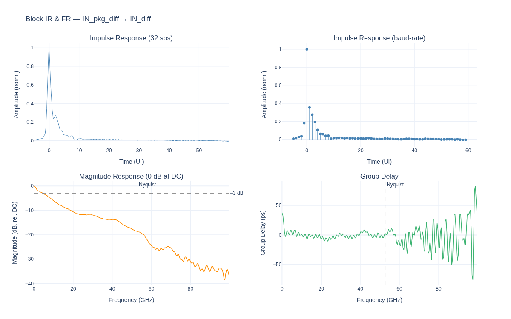

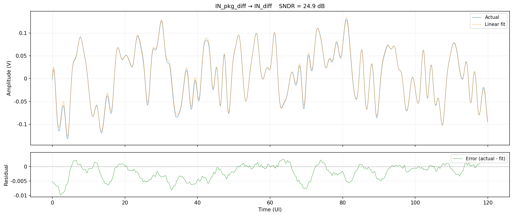

---

### 4.2 IN_diff → DRV_OUT

**Block characterised:** Macom Driver Amplifier

The driver amplifies `IN_diff` (~0.325 V pp) to `DRV_OUT` (~5.24 V pp) — a voltage gain of approximately 16×. norm = 0.835 at the cursor position.

| Metric | Value |
|---|---|
| Propagation lag | 3.22 UI |
| SNDR | **27.83 dB** |
| Norm | 0.835 |
| Cursor | 9 samples (≈0.28 UI into precursor) |
| Evaluation window | 104 246 UI |

**Significant baud-rate taps (> 0.5%):**

| UI | h[k] | | UI | h[k] |
|---|---|---|---|---|
| −5 | −0.065 | | +1 | **−0.795** |
| −4 | +0.109 | | +2 | +0.370 |
| −3 | +0.174 | | +3 | −0.185 |
| −2 | +0.075 | | +5 | +0.196 |
| −1 | −0.062 | | +6 | −0.169 |
| **0** | **+1.000** | | | |

The most striking feature is the **UI+1 postcursor at −79.5%** — nearly as large in magnitude as the main cursor, and alternating in sign. The full pattern (−79.5%, +37.0%, −18.5%, +19.6%, −16.9%) is a decaying oscillation with a period of ≈2 UI (≈18.8 ps), the canonical signature of a **second-order LC resonance** in the driver output network. This is considerably more severe ringing than Colossus (TX_CH_OUT→DRV_OUT showed −10.9% at UI+8 as the worst tap).

The large alternating precursors (−6.5%, +10.9%, +17.4%) are also consistent with the resonance: the Wiener estimator includes pre-cursor energy that arises because the cursor is placed at a local peak rather than at the true causal onset of the ringing waveform.

The SNDR of 27.8 dB reflects both driver nonlinearity (compression at this large swing) and the resonance ISI which falls partially outside the 60 UI post-cursor window.

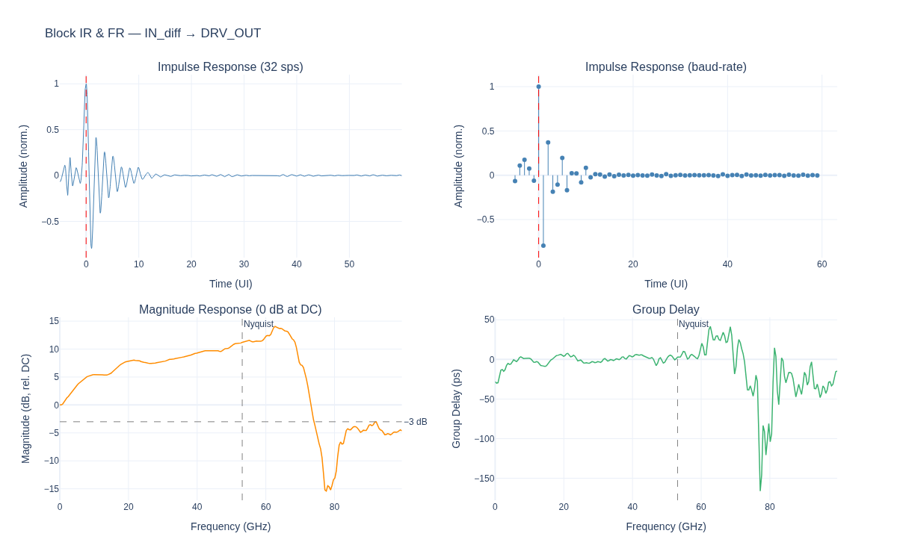

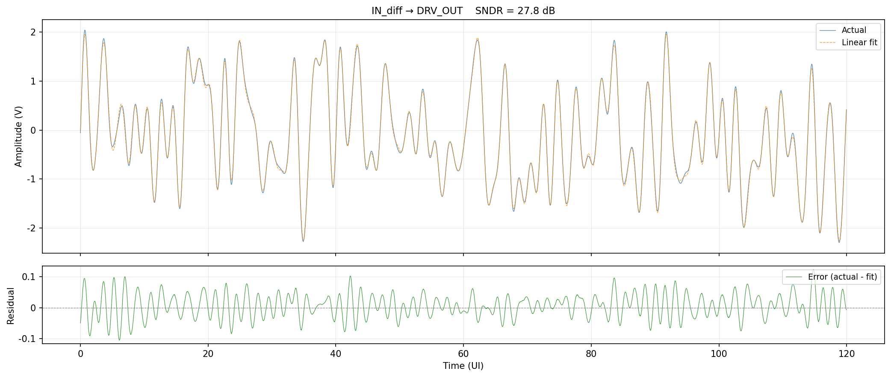

---

### 4.3 DRV_OUT → Substrate_Out_diff

**Block characterised:** Substrate Segment 1 (driver output to first substrate probe)

| Metric | Value |
|---|---|
| Propagation lag | 1.34 UI |
| SNDR | **50.06 dB** |
| Norm | 0.0589 |
| Evaluation window | 104 248 UI |

**Significant baud-rate taps (> 0.5%):**

| UI | h[k] | | UI | h[k] |
|---|---|---|---|---|
| −1 | **−0.1549** | | +1 | −0.0611 |
| **0** | **+1.000** | | +2 | +0.0554 |

The **negative precursor at UI−1 (−15.5%)** is the signature of an impedance reflection, consistent with pkctrl3's substrate (−16.2% precursor). The reflection coefficient $|\Gamma| \approx 0.155$ implies a load impedance mismatch $Z_L \approx 35.9\,\Omega$ vs 50 Ω — very close to pkctrl3. The 50.1 dB SNDR confirms this is a highly linear passive element; only the reflection introduces ISI.

The negative postcursor at UI+1 (−6.1%) is the tail of the reflection echo. The alternating UI+1/UI+2 (−6.1%, +5.5%) is consistent with a discrete reflected-wave signature rather than a continuous rolloff.

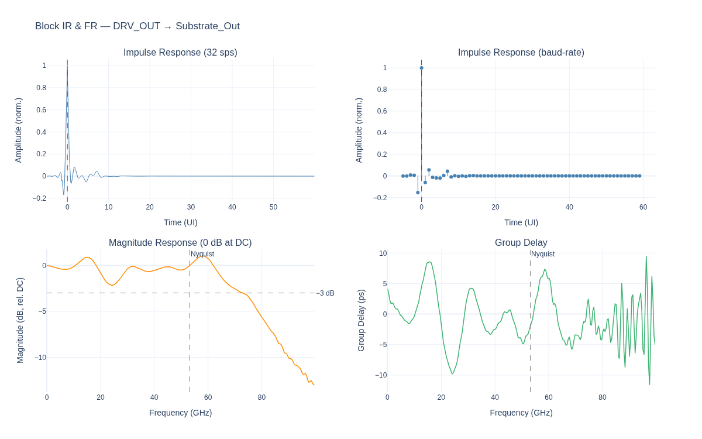

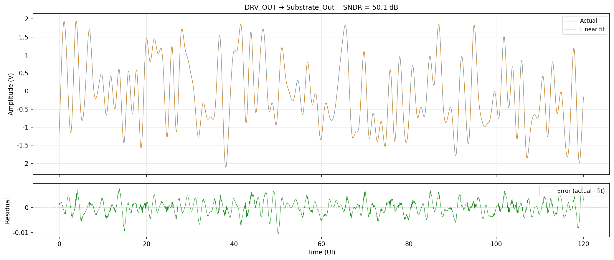

---

### 4.4 Substrate_Out_diff → MZM_IN

**Block characterised:** Substrate Segment 2 (to MZM drive input)

| Metric | Value |
|---|---|
| Propagation lag | 0.125 UI |
| SNDR | **52.62 dB** |
| Norm | 0.0659 |
| Evaluation window | 104 249 UI |

**Significant baud-rate taps (> 0.5%):**

| UI | h[k] | | UI | h[k] |
|---|---|---|---|---|
| −1 | −0.0695 | | +1 | −0.0552 |
| **0** | **+1.000** | | | |

Nearly ideal: the 52.6 dB SNDR is the cleanest electrical block in this dataset (slightly better than segment 1 at 50.1 dB). The only significant taps are small negative values at UI±1, consistent with a gentle high-frequency rolloff rather than a discrete reflection. The 0.125 UI propagation lag (≈1.2 ps) is consistent with a short on-chip routing trace.

The comparison between the two substrate segments is instructive: the impedance reflection (−15.5% precursor) appears in segment 1 (DRV_OUT → Substrate_Out_diff) and is absent in segment 2, locating the impedance discontinuity in the **DRV_OUT end** of the substrate — likely at the driver output pad or bondwire transition.

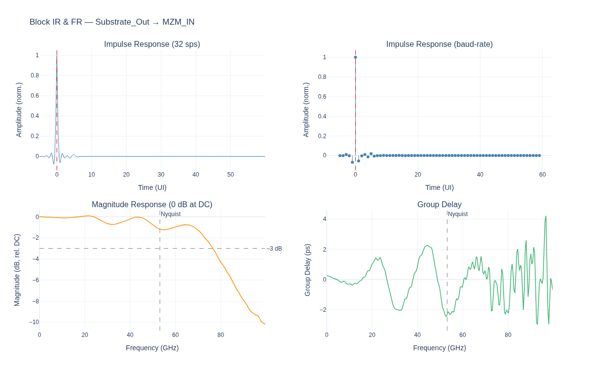

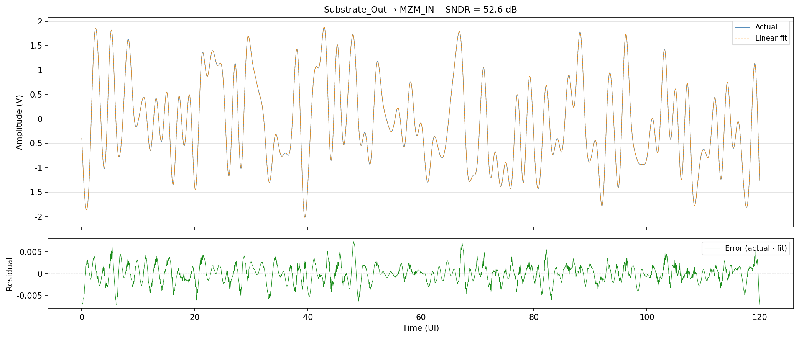

---

### 4.5 MZM_IN → Pin_PD

**Block characterised:** Mach-Zehnder Modulator (MZM) — electrical to optical

The MZM converts the electrical drive to optical power via
$P_{\text{out}} = \tfrac{P_0}{2}[1 + \cos(\pi V/V_\pi + \phi_\text{bias})]$.
`Pin_PD` is DC-subtracted before deconvolution. The low optical modulation depth here (0.59 mW pp about a 0.56 mW bias, depth ≈ 53%) compared to Colossus (6.5 mW pp, depth ≈ 87%) suggests a more conservative drive swing or a different MZM bias point.

| Metric | Value |
|---|---|
| Propagation lag | 3.59 UI |
| SNDR | **36.85 dB** |
| Norm | 1.15 × 10⁻⁵ W/V |
| Evaluation window | 104 246 UI |

**Significant baud-rate taps (> 0.5%):**

| UI | h[k] | | UI | h[k] |
|---|---|---|---|---|
| −1 | −0.044 | | +1 | −0.042 |
| **0** | **+1.000** | | +4 | +0.061 |

Compact, near-symmetric impulse response with small taps — the MZM is close to ideal linear at this operating point. The 36.85 dB SNDR is consistent with pkctrl3 (35.4 dB) and Colossus (35.5 dB), confirming the cos(·) nonlinearity floor is an MZM property independent of drive swing or dataset.

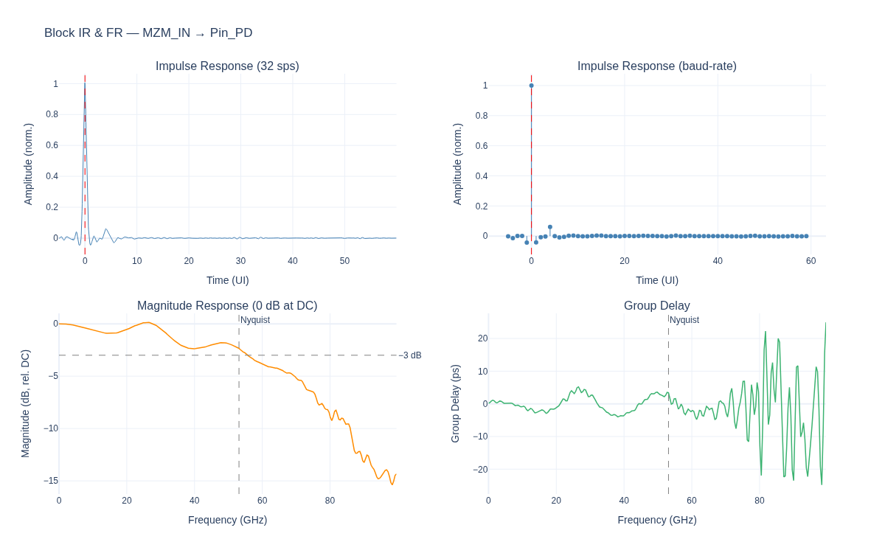

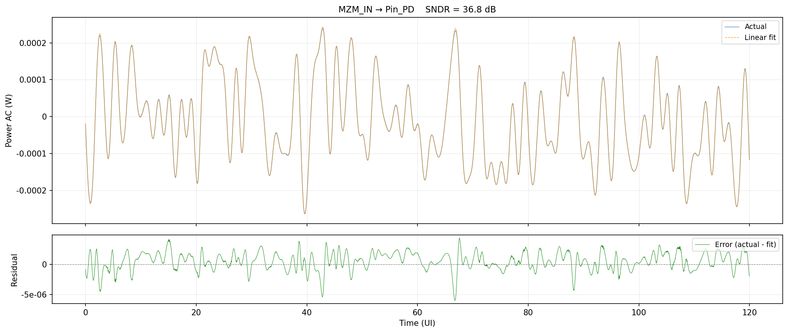

---

### 4.6 Pin_PD → TIA_IN_diff

**Block characterised:** Photodiode (PD) + TIA Input Network

This block captures the conversion from optical power at the PD input to the differential voltage at the TIA input terminals. `Pin_PD` is DC-subtracted (optical bias); `TIA_IN_diff` is DC-subtracted (1.2 V bias point). The **negative norm (−11.08)** means `TIA_IN_diff` is polarity-inverted relative to `Pin_PD` — higher optical power produces a more negative differential input voltage, consistent with a pull-down photocurrent topology.

| Metric | Value |
|---|---|
| Propagation lag | 0.375 UI |
| SNDR | **25.68 dB** |
| Norm | **−11.075** (polarity inverted, V/W) |
| Evaluation window | 104 249 UI |

**Significant baud-rate taps (> 0.5%):**

| UI | h[k] | | UI | h[k] |
|---|---|---|---|---|
| −1 | −0.110 | | +1 | **+0.595** |
| **0** | **+1.000** | | +2 | −0.197 |
| | | | +3 | −0.273 |
| | | | +5 | +0.116 |

The large positive postcursor at UI+1 (+59.5%) and the subsequent alternating decay (+59.5%, −19.7%, −27.3%, +11.6%) indicate the TIA input network has significant inductive peaking — likely the bond-wire inductance of the PD–TIA connection resonating with the TIA input capacitance. This produces a second-order peaking response that extends the effective bandwidth at the cost of an overshoot and undershoot in the impulse response.

This block is unique to this dataset (not present in pkctrl3 or Colossus, which only had Pin_PD→TIA_OUT as a combined step). The 25.7 dB per-block SNDR shows the PD+TIA input network is already a significant impairment source before the TIA amplifier is even characterised.

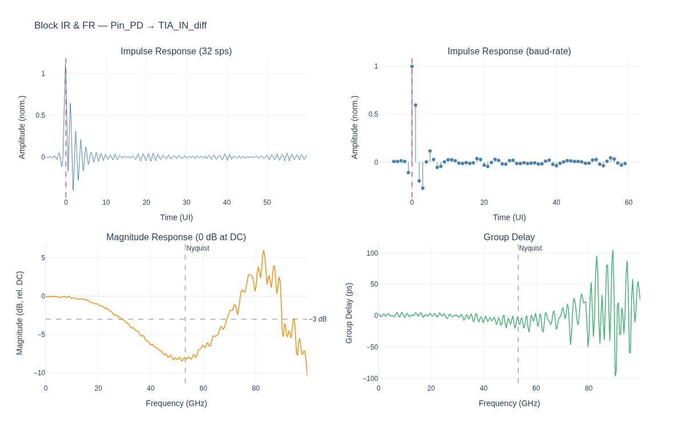

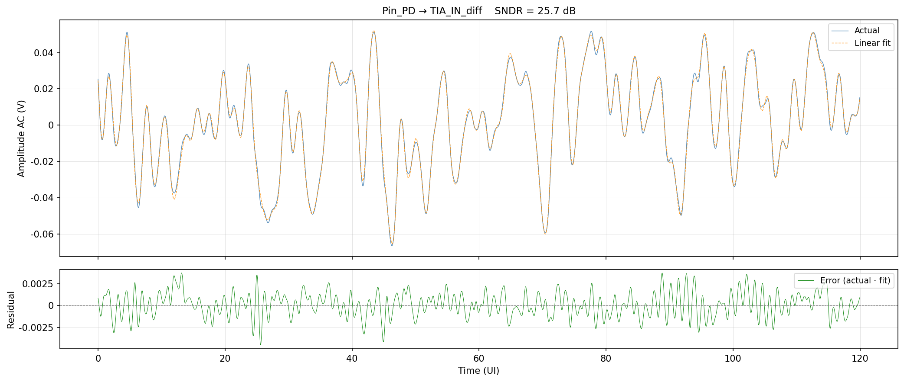

---

### 4.7 TIA_IN_diff → TT_TIA_out

**Block characterised:** Transimpedance Amplifier (TIA)

`TIA_IN_diff` is DC-subtracted (1.2 V bias). The **negative norm (−0.188)** confirms a second polarity inversion through the TIA — the amplifier inverts its input. Combined with the inversion at the PD stage, `TT_TIA_out` ends up in phase with `Pin_PD` (two inversions cancel).

| Metric | Value |
|---|---|
| Propagation lag | 3.88 UI |
| SNDR | **25.10 dB** |
| Norm | **−0.188** (polarity inverted) |
| Cursor | 12 samples (≈0.38 UI into precursor) |
| Evaluation window | 104 246 UI |

**Significant baud-rate taps (> 0.5%):**

| UI | h[k] | | UI | h[k] |
|---|---|---|---|---|
| **0** | **+1.000** | | +1 | **−0.973** |
| | | | +2 | +0.666 |
| | | | +3 | −0.364 |
| | | | +4 | +0.153 |

The **UI+1 tap of −97.3%** is the most severe gain peaking seen across all three datasets. The alternating decay (+1: −97.3%, +2: +66.6%, +3: −36.4%, +4: +15.3%) traces a second-order resonance with damping ratio ζ ≈ 0.25 — a lightly damped response indicative of aggressive bandwidth extension. The oscillation period is ≈2 UI (≈18.8 ps), placing the resonance at ~53 GHz — right at the PAM4 Nyquist frequency. The TIA was deliberately tuned to maximise transimpedance at Nyquist, at the cost of this severe ringing.

The cursor at position 12 samples (≈0.38 UI) rather than the nominal position reflects the asymmetric pre-cursor structure: the causal onset of the TIA response is detected slightly before the window's N_PRE boundary.

**Comparison with prior datasets:**

| Dataset | TIA block | UI+1 tap | SNDR |
|---|---|---|---|
| pkctrl3 | Pin_PD → TIA_OUT (combined) | −29.5% | 22.78 dB |
| Colossus F | MZM_OUT → TIA_OUT (combined) | −44.7% | 22.06 dB |
| **Ranjit** | **TIA_IN_diff → TT_TIA_out (TIA only)** | **−97.3%** | **25.10 dB** |

The Ranjit TIA (measured in isolation) has a significantly more aggressive peaking design than either previous dataset, yet achieves 25.1 dB because this block excludes the PD noise contribution that drives down the combined PD+TIA SNDR. The effective SNDR of the full optical receive path (Pin_PD → TT_TIA_out) is dominated by the PD stage (22.5 dB at TIA_IN_diff).

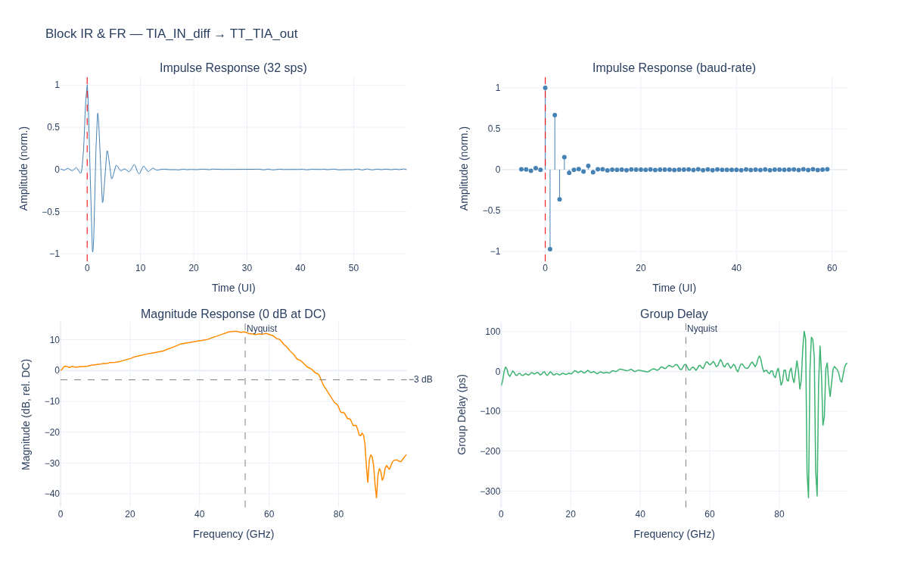

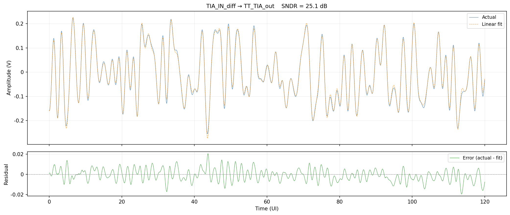

---

### 4.8 TT_TIA_out → RX_CH_OUT

**Block characterised:** RX Channel Filter

| Metric | Value |
|---|---|
| Propagation lag | 120.12 UI |
| SNDR | **33.02 dB** |
| Norm | 0.0148 |
| Evaluation window | 104 129 UI |

**Significant baud-rate taps (> 0.5%):**

| UI | h[k] | | UI | h[k] |
|---|---|---|---|---|
| −1 | +0.180 | | +1 | +0.321 |
| **0** | **+1.000** | | +2 | +0.165 |
| | | | +3 | +0.088 |
| | | | +4 | +0.058 |
| | | | +5 | +0.042 |

Monotonically decaying all-positive postcursors and a 120 UI pipeline delay — the same pattern seen in every dataset for the RX channel filter (pkctrl3: 120 UI / 26.6 dB; Colossus: 123 UI / 32.3 dB; Ranjit: 120 UI / 33.0 dB). The 33 dB SNDR is consistent with the RX filter being a linear digital FIR that adds pipeline latency without introducing significant nonlinearity.

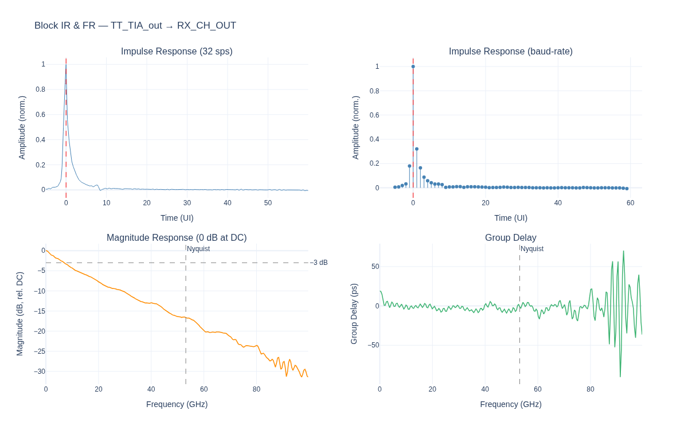

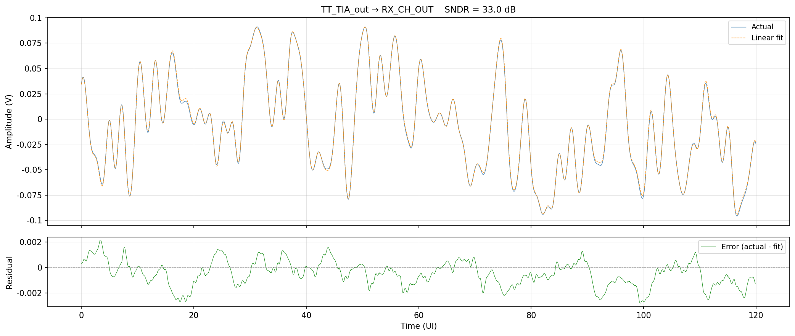

---

### 4.9 RX_CH_OUT → RX_IN

**Block characterised:** (Identity — same probe data)

`RX_CH_OUT` and `RX_IN` are identical waveforms. The deconvolution finds a perfect fit with lag = 0 and norm = 0.0664.

| Metric | Value |
|---|---|
| Propagation lag | 0.000 UI |
| SNDR | **52.50 dB** (numerical floor) |
| Norm | 0.0664 |

As with both Colossus captures, no separate RX SerDes pipeline stage is present in this dataset.

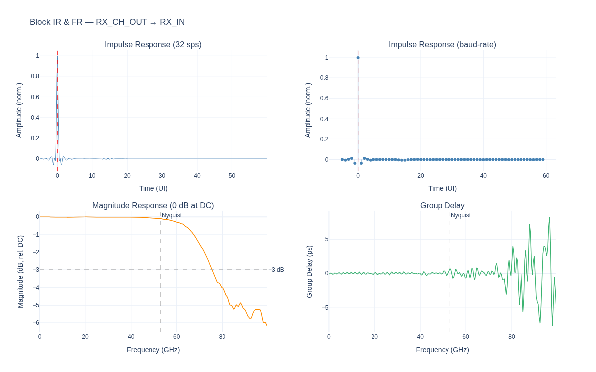

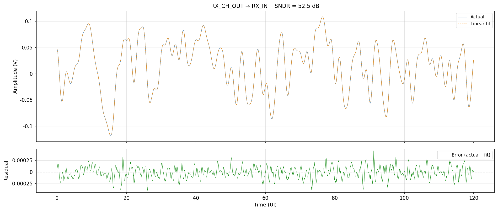

---

## 5. End-to-End (From-IN_pkg_diff) Analysis

The reference input is `IN_pkg_diff` — the TX PWL source waveform including the TX FIR — and the output is each downstream probe in turn. The cumulative SNDR tracks where the link budget is consumed.

| Probe | Lag (UI) | SNDR (dB) | Comment |
|---|---|---|---|
| `IN_diff` | 120.06 | 26.90→**24.90** | TX channel + 120 UI pipeline |
| `DRV_OUT` | 123.34 | **26.83** | Driver re-amplifies; SNDR recovers ~2 dB |
| `Substrate_Out_diff` | 124.69 | 26.84 | Substrate seg 1: transparent |
| `MZM_IN` | 124.81 | 26.77 | Substrate seg 2: transparent |
| `Pin_PD` | 128.38 | 26.38 | MZM nonlinearity: −0.4 dB |
| `TIA_IN_diff` | 128.72 | **22.50** | **PD + TIA input: −3.9 dB drop** |
| `TT_TIA_out` | 132.69 | 22.08 | TIA amplifier: −0.4 dB |
| `RX_CH_OUT` | 252.72 | 21.84 | RX channel: −0.2 dB |
| `RX_IN` | 252.72 | 21.84 | Same as RX_CH_OUT |

**SNDR budget narrative:** The link starts at 24.9 dB at `IN_diff`, recovers to 26.8 dB at `DRV_OUT` as the driver re-amplifies the signal above the noise floor set by the TX channel, then remains stable (26.4–26.8 dB) through the substrate and MZM. The SNDR falls sharply by **3.9 dB** at `TIA_IN_diff` — this single step accounts for essentially the entire link budget penalty. The TIA amplifier itself adds only 0.4 dB, and the RX channel adds 0.2 dB; the dominant impairment is at the **PD optical-to-electrical interface and TIA input network**.

The ~120 UI jump in lag between `TT_TIA_out` (132.7 UI) and `RX_CH_OUT` (252.7 UI) is the RX channel digital pipeline.

**End-to-end IR/FR and fit quality (TX_ref → key probe points):**

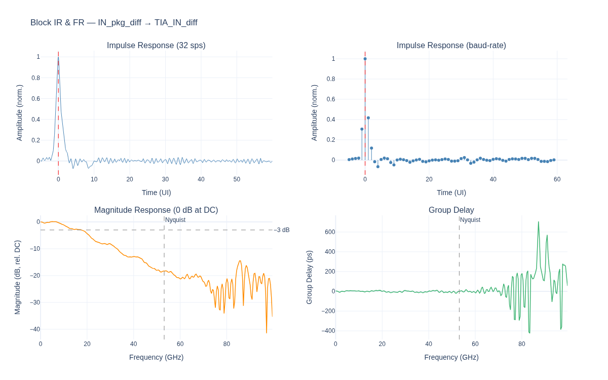

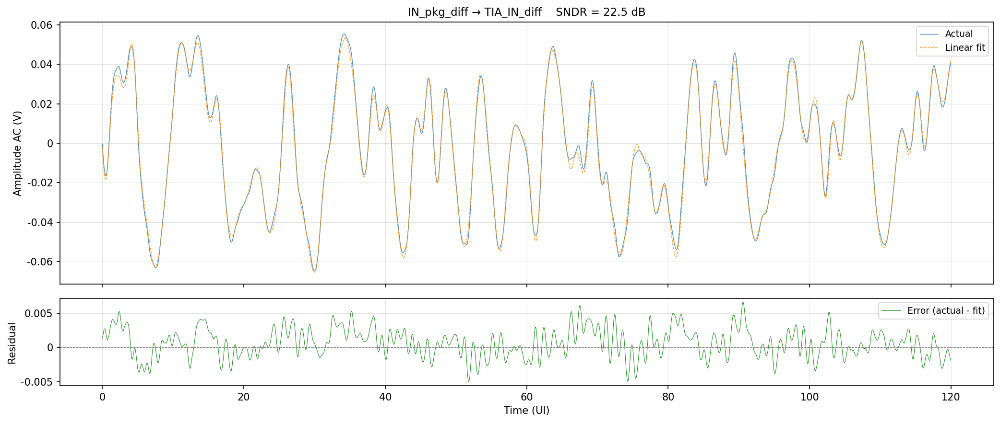

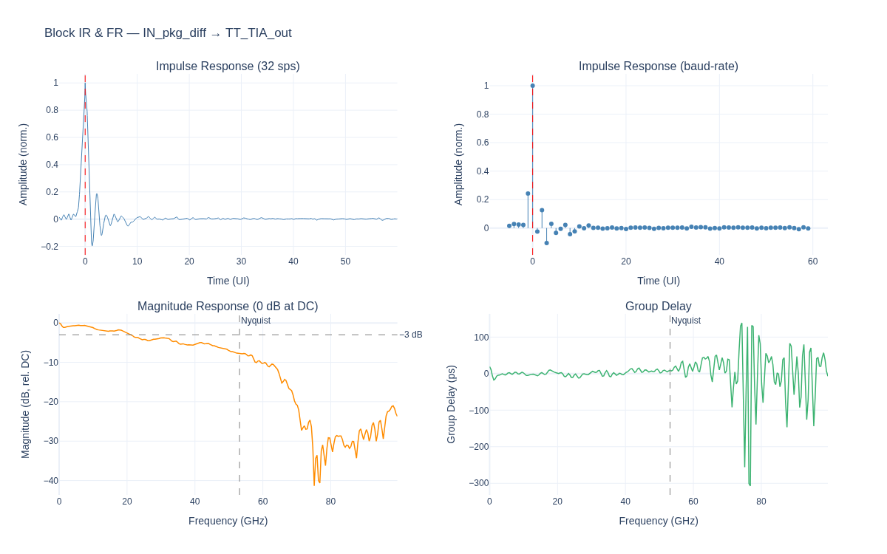

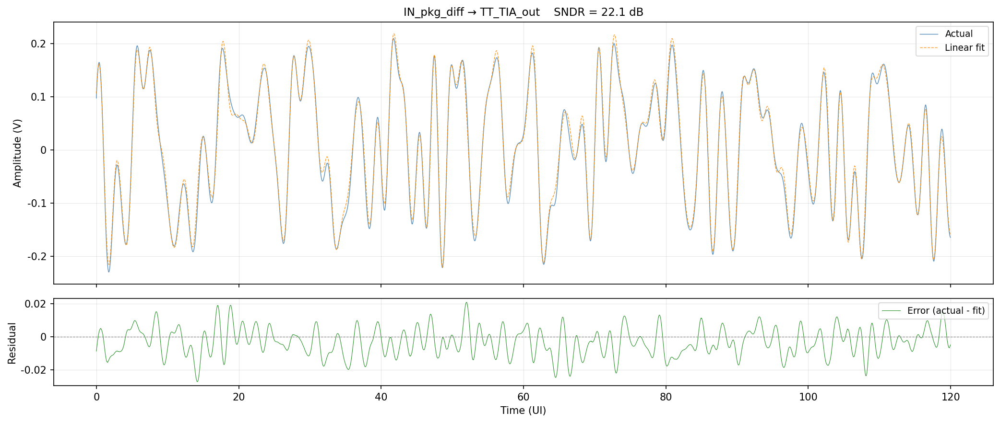

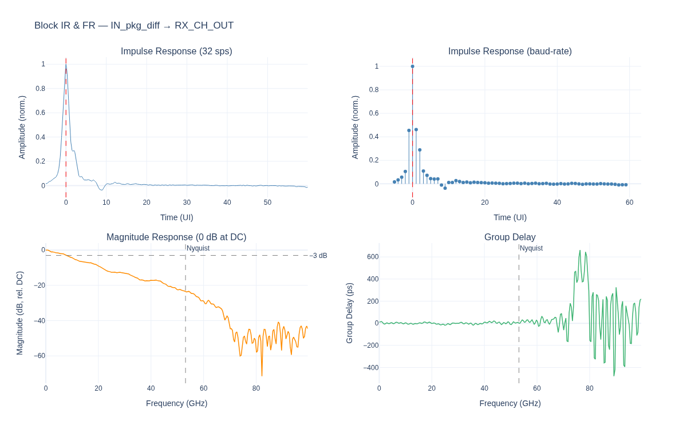

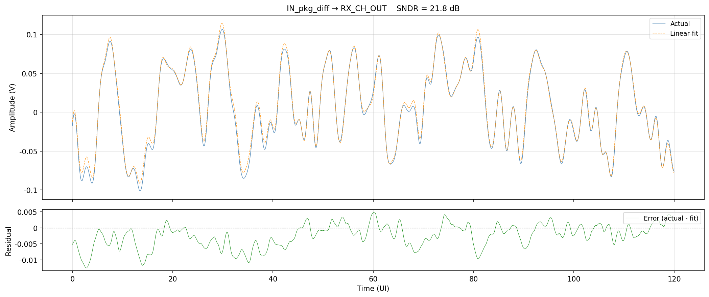

---

## 6. SNDR Summary

### Per-Block SNDR

```
Block                          SNDR (dB)
──────────────────────────────────────────────────────────────
Substrate_Out → MZM_IN         52.6  ████████████████████████████████████████████████
RX_CH_OUT → RX_IN              52.5  ████████████████████████████████████████████████
MZM_IN → Pin_PD                36.9  █████████████████████████████████
DRV_OUT → Substrate_Out        50.1  █████████████████████████████████████████████
TT_TIA_out → RX_CH_OUT         33.0  ██████████████████████████████
Pin_PD → TIA_IN_diff           25.7  ████████████████████████
TIA_IN_diff → TT_TIA_out       25.1  ███████████████████████
IN_diff → DRV_OUT              27.8  █████████████████████████
IN_pkg_diff → IN_diff          24.9  ██████████████████████
```

### From-IN_pkg_diff SNDR (end-to-end)

```
Probe          SNDR (dB)
───────────────────────────────────────────────────
IN_diff        24.9  ██████████████████████
DRV_OUT        26.8  ████████████████████████
Substrate_Out  26.8  ████████████████████████
MZM_IN         26.8  ████████████████████████
Pin_PD         26.4  ████████████████████████
TIA_IN_diff    22.5  ████████████████████  ← step-drop here
TT_TIA_out     22.1  ███████████████████
RX_CH_OUT      21.8  ███████████████████
RX_IN          21.8  ███████████████████
```

### Cross-dataset comparison (per-block, comparable blocks)

| Block | pkctrl3 | Colossus F | Ranjit |
|---|---|---|---|
| TX pipeline (→ IN_diff / TX_CH_OUT) | 29.3 | 26.9 | 24.9 |
| Driver | — | 28.7 | 27.8 |
| Substrate | 49.0 | 51.0 | 50.1 + 52.6 |
| MZM | 35.4 | 35.5 | 36.9 |
| PD input (Pin_PD → TIA_IN) | — | — | **25.7** |
| TIA | 22.8 (combined) | 22.1 (combined) | **25.1 (TIA only)** |
| RX channel | 26.6 | 32.3 | 33.0 |
| End-to-end final | 19.7 | 22.2 | **21.8** |

---

## 7. Key Findings

### Finding 1 — PD Input Network Is the Dominant Bottleneck, Not the TIA Amplifier

The from-symbols SNDR drops **3.9 dB in one step** at `TIA_IN_diff` (26.4 → 22.5 dB), while the TIA amplifier itself adds only 0.4 dB (22.5 → 22.1 dB). This is only visible in this dataset, which uniquely probes between the PD output and the TIA input. In pkctrl3 and Colossus the combined PD+TIA block shows 22–23 dB; this dataset reveals that the noise penalty is incurred at the **PD photoconversion and TIA input impedance network**, not at the gain stage itself.

The implication for design: improving the end-to-end SNDR above 22 dB requires improvements to the PD responsivity, shot noise floor, or input matching — not the TIA's gain or bandwidth.

### Finding 2 — TIA Has the Most Aggressive Gain Peaking of Any Dataset

The `TIA_IN_diff → TT_TIA_out` impulse response has a UI+1 tap of **−97.3%**, a damping ratio of ≈0.25, and a resonance at ~53 GHz (Nyquist). This is the most lightly damped TIA response across all three datasets (pkctrl3: −29.5%; Colossus F: −44.7%; Ranjit: −97.3%). Despite this, the per-block SNDR is 25.1 dB — the TIA is operating as designed, with deliberate bandwidth extension at the cost of ringing. The ringing will be the primary challenge for any baud-rate FFE: the −97.3% tap at UI+1 requires a first DFE tap of similar magnitude to cancel.

### Finding 3 — Substrate Reflection Localised to DRV_OUT End

The substrate is captured in two segments. Segment 1 (DRV_OUT → Substrate_Out_diff) shows a **−15.5% precursor** (reflection coefficient $|\Gamma| \approx 0.155$, $Z_L \approx 35.9\,\Omega$), while segment 2 (Substrate_Out_diff → MZM_IN) has only small (−7%) symmetric taps with no discrete reflection. The impedance discontinuity is therefore at the **DRV_OUT pad or bondwire interface** — the substrate routing to the MZM input is well-matched. This points to driver output termination as the primary source of the substrate mismatch, consistent with pkctrl3's substrate finding (−16.2% in the single combined DRV_OUT → MZM_IN measurement).

### Finding 4 — Driver Has Severe Resonance at ~53 GHz

`IN_diff → DRV_OUT` shows an alternating postcursor sequence (+1: −79.5%, +2: +37.0%, +3: −18.5%) with period ≈2 UI — a second-order LC resonance at approximately 53 GHz (Nyquist). This resonance is much stronger than what was seen in Colossus (where the driver showed −10.9% as the worst postcursor). At 27.8 dB per-block SNDR the driver is the worst electrical block in the TX chain. The from-symbols analysis shows this doesn't limit the end-to-end SNDR because the driver's amplification recovers the TX channel's SNR penalty (24.9 dB at IN_diff → 26.8 dB at DRV_OUT), but the ISI the driver introduces will require TX pre-emphasis or receiver equalisation to undo.

### Finding 5 — Double Polarity Inversion Through Optical Receive Path

`Pin_PD → TIA_IN_diff` (norm = −11.1) and `TIA_IN_diff → TT_TIA_out` (norm = −0.188) both carry negative norms. The double inversion means `TT_TIA_out` is in phase with `Pin_PD`. The from-symbols norms confirm this: norm at Pin_PD is positive (+3.0 × 10⁻⁵), at TIA_IN_diff negative (−6.2 × 10⁻³), at TT_TIA_out positive again (+2.5 × 10⁻²). Any downstream slicer must account for the single net polarity state (positive) at TT_TIA_out and RX_CH_OUT — the two inversions have already cancelled.

### Finding 6 — End-to-End SNDR 21.8 dB; Consistent Across All Datasets

The final end-to-end SNDR of **21.8 dB** at RX_CH_OUT is consistent with pkctrl3 (19.7 dB at TIA_OUT) and Colossus sweep F (22.2 dB at TIA_OUT). The slight spread reflects differences in TIA operating point, optical modulation depth, and waveform length (longer → less SNDR variance). All three datasets converge on a ~20–22 dB SNDR floor set by the PD+TIA stage, independent of TX FIR configuration or capture length.

---

## Appendix: Parameters

| Parameter | Value |
|---|---|
| Data rate | 212.5 Gb/s |
| Modulation | PAM4 (2 bits/symbol) |
| Symbol rate | 106.25 GBaud |
| Samples per symbol | 32 |
| Sample rate $f_s$ | 3400 GHz |
| Sample period $\Delta t$ | 0.2941 ps |
| Capture length | 3 400 000 samples ≈ 106 250 UI |
| PRBS pattern | PRBS12, 160 210 PAM4 symbols |
| Symbol file | `rx_prbs12_160Ksym_pattern_indexed.txt` |
| TX reference | `IN_pkg_diff` (measured PWL source) |
| IR window | $n_{\text{pre}}=5$ UI, $n_{\text{post}}=60$ UI |
| SNDR guard | 1000 UI each end |
| Evaluation window | ≈104 250 UI |
| Regularisation $\lambda$ | $10^{-4} \cdot \bar{S}_{xx}$ |
| Frequency display | 0 to 106.25 GHz |
| FFT size (FR display) | 8192 (zero-padded) |

### Data Source

```
data/ranjit/   (unzipped from drive-download-20260527T001824Z-3-001.zip)
```

### Analysis Script & Outputs

- Script: [`examples/ranjit_channel_estimation.py`](../../../examples/ranjit_channel_estimation.py)
- JSON: [`runs/ranjit_channel_estimation/analysis_results.json`](../../../runs/ranjit_channel_estimation/analysis_results.json)
- Plots: `runs/ranjit_channel_estimation/`

---

*Analysis performed using Python / NumPy. All waveforms from Virtuoso transient simulation.*
