# Channel Characterisation Report
@Patrick Satarzadeh

---

## Table of Contents

- [Channel Characterisation Report](#channel-characterisation-report)
  - [Table of Contents](#table-of-contents)
  - [1. Introduction](#1-introduction)
  - [2. Signal Path \& Measurement Points](#2-signal-path--measurement-points)
  - [3. Methodology](#3-methodology)
    - [3.1 TX Reference Construction](#31-tx-reference-construction)
    - [3.2 Channel Estimation — Wiener Deconvolution](#32-channel-estimation--wiener-deconvolution)
    - [3.3 Impulse Response Windowing](#33-impulse-response-windowing)
    - [3.4 SNDR Definition](#34-sndr-definition)
    - [3.5 Fit Quality Plots](#35-fit-quality-plots)
  - [4. Per-Block Analysis](#4-per-block-analysis)
    - [4.1 tx\_wave → DRV\_OUT](#41-tx_wave--drv_out)
    - [4.2 DRV\_OUT → MZM\_IN](#42-drv_out--mzm_in)
      - [Eye Diagram Analysis](#eye-diagram-analysis)
    - [4.3 MZM\_IN → Pout](#43-mzm_in--pout)
    - [4.4 Pout → Pin\_PD](#44-pout--pin_pd)
    - [4.5 Pin\_PD → TIA\_OUT](#45-pin_pd--tia_out)
    - [4.6 TIA\_OUT → RX\_CH\_OUT](#46-tia_out--rx_ch_out)
    - [4.7 RX\_CH\_OUT → RX\_IN](#47-rx_ch_out--rx_in)
  - [5. End-to-End (From-Symbols) Analysis](#5-end-to-end-from-symbols-analysis)
  - [6. SNDR Summary \& Comparison](#6-sndr-summary--comparison)
    - [Per-Block SNDR](#per-block-sndr)
    - [End-to-End (From-Symbols) SNDR](#end-to-end-from-symbols-sndr)
  - [7. Key Findings](#7-key-findings)
    - [Finding 1 — The Optical Channel Is Lossless and Dispersion-Free](#finding-1--the-optical-channel-is-lossless-and-dispersion-free)
    - [Finding 2 — The PD+TIA Is the Dominant Impairment Source](#finding-2--the-pdtia-is-the-dominant-impairment-source)
    - [Finding 3 — End-to-End SNDR Is Bounded by the PD+TIA](#finding-3--end-to-end-sndr-is-bounded-by-the-pdtia)
    - [Finding 4 — The Substrate Shows Impedance Mismatch](#finding-4--the-substrate-shows-impedance-mismatch)
    - [Finding 5 — TX E-Peaking Effectively Conditions the Signal](#finding-5--tx-e-peaking-effectively-conditions-the-signal)
    - [Finding 6 — Large RX Channel Latency (120 UI)](#finding-6--large-rx-channel-latency-120-ui)
  - [Appendix: Simulation Parameters](#appendix-simulation-parameters)

---

## 1. Introduction

This report presents a systematic linear characterisation of a 212.5 Gb/s PAM4 optical SerDes link simulated in Virtuoso. The link operates at a symbol rate of **106.25 GBaud**, with **32 samples per symbol** (sample rate $f_s = 3400$ GHz, $\Delta t \approx 0.294$ ps). The modulation format is PAM4 (2 bits/symbol), mapping Gray-coded 2-bit words to amplitude levels $\{-3, -1, +1, +3\}$.

The characterisation methodology estimates, at each block boundary in the signal path, the **best linear approximation** of the block's transfer function from a Wiener deconvolution of the input and output waveforms. This yields:

- The **causal impulse response** $\hat{h}[n]$ of each block
- The **frequency response** $\hat{H}(f)$: magnitude (dB) and unwrapped phase (°)
- The **SNDR** of the linear fit, which quantifies how much of the output variance is unexplained by the linear model — capturing noise, nonlinearity, and any ISI outside the estimation window
- **Fit quality waveforms** comparing the actual output against the linear prediction, with the residual error plotted separately

Two complementary analyses are performed:

1. **Per-block** — each block is characterised in isolation using consecutive probe points as input/output
2. **From-symbols** — the original PAM4 symbol sequence convolved with the TX FIR serves as input, and each probe point serves as output, characterising the cumulative end-to-end channel up to that point

**TL;DR — Key Findings** (details in [Section 7](#7-key-findings)):

- **Optical channel is lossless and dispersion-free** — Pout→Pin_PD SNDR is 53.6 dB with no measurable ISI; the fibre contributes negligible impairment at this link distance
- **PD+TIA is the dominant impairment source** — Pin_PD→TIA_OUT SNDR drops to 22.8 dB; the impulse response extends to UI+54, and TIA gain peaking is visible at ~60 GHz in the frequency response
- **End-to-end SNDR is bottlenecked at 19.7 dB** (symbols→TIA_OUT), set almost entirely by the PD+TIA; all downstream blocks contribute minimally
- **Substrate shows an impedance mismatch** — DRV_OUT→MZM_IN impulse response has a −16.2% precursor reflection consistent with a load impedance $Z_L \approx 35.5\,\Omega$ (vs 50 Ω design)
- **TX E-Peaking effectively pre-conditions the signal** — tx_wave→DRV_OUT SNDR is 26.1 dB; the driver+E-Peaking chain shows intentional high-frequency lift that compensates downstream rolloff
- **RX channel introduces ~120 UI pipeline latency** — TIA_OUT→RX_CH_OUT group delay is approximately 120 UI, consistent with a digital FIR filter in the RX DSP chain

---

## 2. Signal Path & Measurement Points


```mermaid
flowchart LR
    subgraph TX["TX Side"]
        direction LR
        SER["TX SerDes"]
        TXC["TX Channel"]
        DRV["Macom DRV"]
        SUB["Substrate"]
        SER --> TXC --> DRV --> SUB
    end

    subgraph OPT["Optical Domain"]
        MZM["MZM"]
        FIBER["Optical Channel"]
        MZM --> FIBER
    end

    subgraph RX["RX Side"]
        direction LR
        PD["PD"]
        TIA["TIA"]
        RXC["RX Channel"]
        RXSER["RX SerDes"]
        PD --> TIA --> RXC --> RXSER
    end

    SUB --> MZM
    FIBER --> PD

    SER -. "tx_wave" .-> TXC
    DRV -. "DRV_OUT" .-> SUB
    SUB -. "MZM_IN" .-> MZM
    MZM -. "Pout" .-> FIBER
    FIBER -. "Pin_PD" .-> PD
    TIA -. "TIA_OUT" .-> RXC
    RXC -. "RX_CH_OUT" .-> RXSER
    RXSER -. "RX_IN" .-> RXSER
```

| Probe Point | Domain | Amplitude Range | Description |
|---|---|---|---|
| `tx_wave` | Electrical (V) | ±0.47 V | Output of TX SerDes — post TX FIR & E-Peaking |
| `DRV_OUT` | Electrical (V) | ±2.40 V | Output of Macom driver |
| `MZM_IN` | Electrical (V) | ±2.16 V | Electrical input to MZM, after substrate routing |
| `Pout` | Optical (W) | 4–11 mW | MZM optical output power |
| `Pin_PD` | Optical (W) | 0–1 mW | Optical power at photodiode input |
| `TIA_OUT` | Electrical (V) | ±0.30 V | Transimpedance amplifier output |
| `RX_CH_OUT` | Electrical (V) | ±0.15 V | RX channel filter output |
| `RX_IN` | Electrical (V) | ±0.16 V | Input to RX SerDes DSP |

---

## 3. Methodology

### 3.1 TX Reference Construction

For the **from-symbols** analysis, the reference input signal is constructed from the known PAM4 transmit sequence. Raw symbols $s_k \in \{0, 1, 2, 3\}$ are mapped to PAM4 levels:

$$a_k = 2s_k - 3, \quad a_k \in \{-3, -1, +1, +3\}$$

The symbol stream is filtered by the TX FIR (6 taps: cm4 through cp1):

$$b_k = \sum_{m=0}^{5} f_m \, a_{k-m}$$

where the tap coefficients are:

| Tap | Value |
|---|---|
| cm4 | −0.21035 |
| cm3 | +0.54000 |
| cm2 | −0.13453 |
| cm1 | +0.07825 |
| c0  | +0.02089 |
| cp1 | +0.01598 |

The filtered symbols are then **zero-order-hold (ZOH) upsampled** by $N_s = 32$ (rect-DAC model):

$$x[n] = b_{\lfloor n/N_s \rfloor}$$

This staircase waveform $x[n]$ serves as the reference input for all from-symbols deconvolutions.

For **per-block** analysis, the input is the directly measured waveform from the upstream probe point; no symbol reconstruction is performed.

---

### 3.2 Channel Estimation — Wiener Deconvolution

The linear channel estimation problem is: given input $x[n]$ and output $y[n] = h[n] * x[n] + e[n]$, find the filter $h[n]$ that minimises the mean-squared error between the true output and the reconstructed output:

$$\min_h \; E\!\left[|y[n] - h[n]*x[n]|^2\right]$$

**Deriving the solution — the orthogonality condition.** Setting the derivative of the cost with respect to $h$ to zero yields the condition that the residual error must be uncorrelated with the input at every lag $k$:

$$E\!\left[e[n] \cdot x[n-k]\right] = 0 \quad \forall\, k$$

This is the key intuition: if the error were correlated with the input at any lag, the fit could still be improved by adjusting $h$ at that lag. The optimum is reached exactly when the error carries no information about the input. Expanding this gives the **Wiener–Hopf equation**:

$$R_{xy}[k] = \sum_m h[m]\, R_{xx}[k-m]$$

where $R_{xy}[k] = E[y[n]\,x[n-k]]$ is the cross-correlation and $R_{xx}[k]$ is the input autocorrelation. This is a convolution equation in $h$ — the filter that makes the model's correlation with the output match the input's correlation with the output.

**Frequency-domain solution.** In the frequency domain the convolution becomes pointwise multiplication, so solving for $H$ is simply division:

$$\hat{H}(f_k) = \frac{S_{xy}(f_k)}{S_{xx}(f_k)} = \frac{X^*(f_k)\, Y(f_k)}{|X(f_k)|^2}$$

where $S_{xx} = |X|^2$ is the input power spectral density and $S_{xy} = X^* Y$ is the cross-power spectrum. This is the globally optimal MMSE solution, obtained in a single pass rather than by iterative optimisation.

**Tikhonov regularisation.** Raw division collapses at frequencies where the input has little energy — noise there would be amplified to infinity. A small regularisation term $\lambda$ is added to the denominator:

$$\hat{H}(f_k) = \frac{X^*(f_k)\, Y(f_k)}{|X(f_k)|^2 + \lambda}$$

with $\lambda$ set adaptively as a fraction of the mean input power:

$$\lambda = 10^{-4} \cdot \frac{1}{N/2+1}\sum_{k=0}^{N/2} |X(f_k)|^2$$

The physical interpretation: where the input is strong, $\lambda$ is negligible and $\hat{H} \approx Y/X$ — the data is trusted. Where the input is weak, $\hat{H}$ is pulled toward zero rather than diverging — the estimate is regularised. The channel cannot be reliably inferred at frequencies the transmitter does not excite.

**Implementation.** The deconvolution is solved entirely in the frequency domain using the FFT, exploiting the circular convolution assumption over the full aligned record. This is exact under that assumption and avoids the need to form or solve the $N \times N$ Toeplitz system that the time-domain Wiener–Hopf equation would require. The full record ($N \approx 5.12 \times 10^6$ samples $\approx 160{,}000$ UI) provides high spectral resolution ($\Delta f \approx 0.65$ MHz/bin) and effective averaging over the complete transmit sequence.

The time-domain estimate is recovered by:

$$\hat{h}[n] = \mathcal{F}^{-1}\!\left\lbrace \hat{H}(f_k) \right\rbrace$$

---

### 3.3 Impulse Response Windowing

The raw $\hat{h}[n]$ from the circular deconvolution has energy concentrated near sample 0 (the cursor). To extract the physically meaningful portion:

1. Locate the cursor: $n_c = \arg\max_n |\hat{h}[n]|$ over $n \in [0, N/4)$
2. Roll the array: $\tilde{h}[n] = \hat{h}[(n - n_{\text{pre}} N_s + n_c) \bmod N]$, placing the cursor at position $n_{\text{pre}} N_s$
3. Normalise: $\hat{h}_{\text{win}}[n] = \tilde{h}[n] / \tilde{h}[n_{\text{pre}} N_s]$
4. Truncate to a window of $(n_{\text{pre}} + n_{\text{post}}) \times N_s$ samples, with $n_{\text{pre}} = 5$ UI pre-cursor and $n_{\text{post}} = 60$ UI post-cursor

The baud-rate (symbol-spaced) impulse response is obtained by decimation:

$$\hat{h}[k] = \hat{h}_{\text{win}}[k N_s], \quad k = -5, \ldots, +59$$

The frequency response is computed by zero-padding $\hat{h}_{\text{win}}$ to $N_{\text{FFT}} = 8192$ points before taking the DFT, achieving a display resolution of $\approx 415$ MHz/bin over the bandwidth $[0, f_{\text{sym}}] = [0, 106.25]$ GHz.

**Magnitude normalisation:** the magnitude is normalised so that the DC gain equals 0 dB:

$$\hat{M}(f) = 20\log_{10}\!\left|\hat{H}(f)\right| - 20\log_{10}\!\left|\hat{H}(0)\right|$$

This removes the absolute scaling from the cursor normalisation and isolates the frequency-dependent roll-off and peaking of each block.

**Group delay:** the phase response $\angle\hat{H}(f)$ is replaced by the **group delay** in picoseconds, which measures how much each frequency component is delayed through the block:

$$\tau_g(f) = -\frac{1}{2\pi}\frac{d\,\angle\hat{H}}{df}$$

implemented as `−np.gradient(phase_rad, freq_GHz) × 10³ / (2π)`. A linear phase term arising from placing the cursor at sample $n_{\text{pre}} N_s$ within the window is subtracted, so that a dispersion-free (constant-delay) block displays $\tau_g \approx 0$ ps. Group delay variations then reflect true dispersive impairments: ringing from impedance mismatches, bandwidth rolloff in the TIA, and filter group delay peaking.

---

### 3.4 SNDR Definition

The linear fit quality is quantified by the **Signal-to-Noise-and-Distortion Ratio**. First, the output is reconstructed using the windowed impulse response:

$$\hat{y}[n] = \hat{h}_{\text{win}}[n] * x[n]$$

computed in the frequency domain. The residual $e[n] = y_{\text{aligned}}[n] - \hat{y}[n]$ contains everything not captured by the linear model: additive noise, nonlinear distortion, and ISI from taps outside the estimation window.

SNDR is evaluated over the **central region** of the waveform, excluding the first and last $N_g = 1000 \cdot N_s = 32{,}000$ samples to avoid edge artefacts from the circular convolution assumption:

$$\text{SNDR} = 10 \log_{10} \frac{P_{\text{signal}}}{P_{\text{N+D}}} = 10 \log_{10} \frac{\displaystyle\frac{1}{M}\sum_{n=N_g}^{N-N_g} y_{\text{aligned}}^2[n]}{\displaystyle\frac{1}{M}\sum_{n=N_g}^{N-N_g} e^2[n]}$$

where $M = N - 2N_g \approx 158{,}000 \cdot N_s$ samples ($\approx 158{,}000$ UI).

> **Relationship to IEEE P802.3dj §179.9.4.5.**
> The IEEE draft standard for 200G/400G/800G/1.6T Ethernet ([IEEE P802.3dj D1.3, December 2024](../../food/Copy%20of%20P802d3dj%20draft%20D1p3%20as%20shared%20with%20OIF%202024_12.pdf)) defines a
> **Difference Signal-to-Noise-and-Distortion Ratio (dSNDR)** as a transmitter conformance metric, using a
> methodology that is structurally equivalent to the one described here.  Both methods solve a least-squares
> linear prediction problem whose optimality conditions reduce to the Wiener–Hopf normal equations
> $(R^T R)^{-1} R^T$ (§179.9.4.1.1), and both express quality as the ratio of signal power to residual
> power (§179.9.4.5.1, Eq. 179–9).  The key differences are in scope and constraint: the standard constrains
> the model to a fixed **5-tap transmitter FIR equalizer** and measures at a single TP2 test point, whereas
> the approach here uses an unconstrained **65-tap Wiener filter** applied independently to each sub-block in
> the signal chain.  The standard additionally separates ISI residual noise $\sigma_e^2$ from the measured
> noise floor $\sigma_n^2$ (flat-top symbol runs), and normalises the result against a reference SNDR
> computed from a **4th-order Bessel–Thomson channel model** at 60 GHz — a relative metric designed for
> pass/fail conformance.  The per-block absolute SNDR reported in this document serves a complementary
> diagnostic role, pinpointing *where* in the signal chain linearity breaks down.

---

### 3.5 Fit Quality Plots

Each block section includes a two-panel fit quality plot showing how closely the estimated linear model reproduces the actual output waveform.

**Top panel** — 120 UI of the actual output waveform (blue) overlaid with the linear prediction $\hat{y}[n]$ (orange), computed via circular convolution of the aligned input with the windowed impulse response:

$$\hat{y}[n] = \hat{h}_{\text{win}}[n] * x_{\text{aligned}}[n]$$

**Bottom panel** — the residual error (green):

$$e[n] = y_{\text{aligned}}[n] - \hat{y}[n]$$

The window starts at $N_g = 1000$ UI into the aligned record to avoid circular-convolution edge artefacts. The SNDR (dB) is annotated in the title. A tight error trace with small amplitude relative to the signal confirms the linear model is a good description of the block; structured periodic residuals indicate nonlinearity or ISI outside the estimation window.

---

## 4. Per-Block Analysis

### 4.1 tx_wave → DRV_OUT

**Blocks characterised:** TX Channel + Macom DRV

This fit captures the aggregate response of the electrical TX path from the SerDes output through the TX channel trace and driver amplifier to the point just before the substrate interconnect. The input `tx_wave` already includes E-Peaking pre-emphasis at 7.2 dB applied by the SerDes.

| Metric | Value |
|---|---|
| Propagation lag | 123.406 UI |
| SNDR | **29.32 dB** |
| Signal power | 6.757 × 10⁻¹ |
| N+D power | 7.897 × 10⁻⁴ |
| Significant ISI extent | UI+13 |

**Significant baud-rate taps (> 0.5%):**

| UI | h[k] | | UI | h[k] |
|---|---|---|---|---|
| −1 | +0.2272 | | +1 | −0.0322 |
| **0** | **+1.0000** | | +2 | +0.1620 |
| | | | +10 | +0.0387 |

The precursor at UI−1 (+22.7%) and the alternating postcursor pattern (+16.2% at UI+2, with UI+1 negative at −3.2%) are characteristic of a bandlimited channel with reflective discontinuities in the electrical path. The long delay (123 UI) is dominated by the flight time through the TX channel trace.

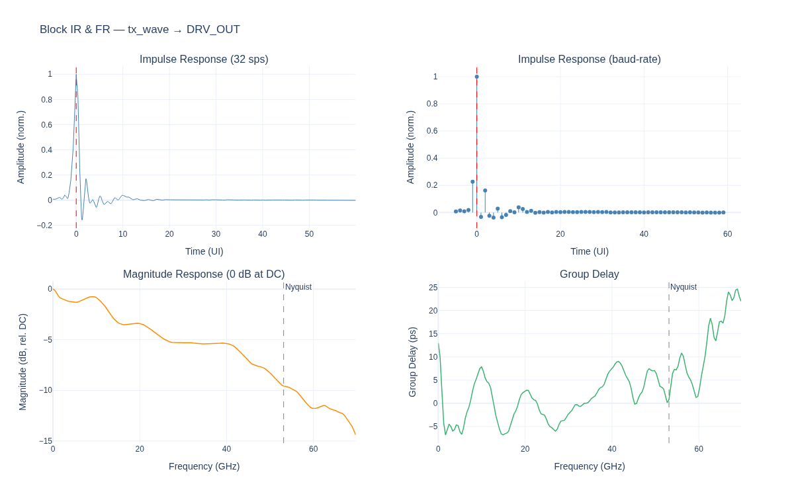

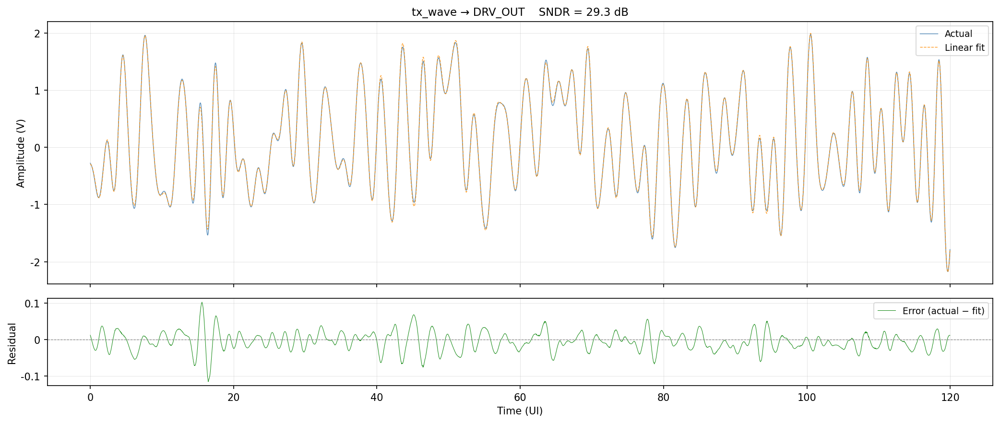

#### TX Chain vs Bessel Reference

To visualise the effect of the TX Channel + Macom DRV on signal quality in isolation from the TX pre-emphasis, a vanilla PAM4 ZOH waveform (no TX FIR, levels $\{-3,-1,+1,+3\}$, 32 SPS) was convolved with the estimated block impulse response (`h_win × norm`, where `norm = 0.21189`) and an eye diagram plotted. A 4th-order Bessel–Thomson filter configured for −10 dB at the PAM4 Nyquist frequency (53.125 GHz) — corresponding to a −3 dB bandwidth of 30.8 GHz, or 0.58× Nyquist — is shown alongside as a reference for a strongly bandwidth-limited channel typical of a lossy link budget.

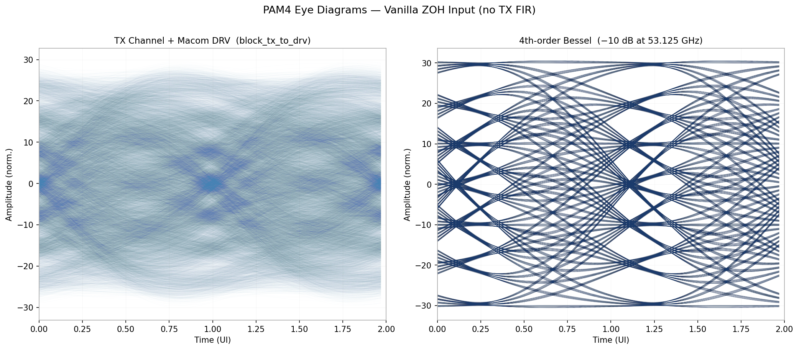

**TX chain (left):** The eye is notably open and well-resolved despite the long delay and several ISI taps. The dominant effect visible is **ISI-induced level splitting**: the precursor at UI−1 (+22.7%) and the UI+2 postcursor (+16.2%) spread each PAM4 level into a cloud of sub-levels, producing visible amplitude uncertainty at the sampling instant. The E-Peaking pre-emphasis is absent here — this is the raw channel response before any TX FIR correction.

**Bessel reference (right):** With −10 dB of loss at Nyquist the Bessel eye is heavily amplitude-compressed — the four PAM4 levels collapse toward the centre, shrinking the inner eye height significantly. Despite this severe amplitude rolloff, the transitions remain smooth and the level-to-level structure is still regular, because the ISI is purely from bandwidth limitation with no reflective echoes.

The comparison highlights that the TX chain, despite having better amplitude response at Nyquist than the −10 dB Bessel, has a visually noisier eye due to its non-monotonic magnitude and group delay characteristics. The impulse and frequency responses confirm this:

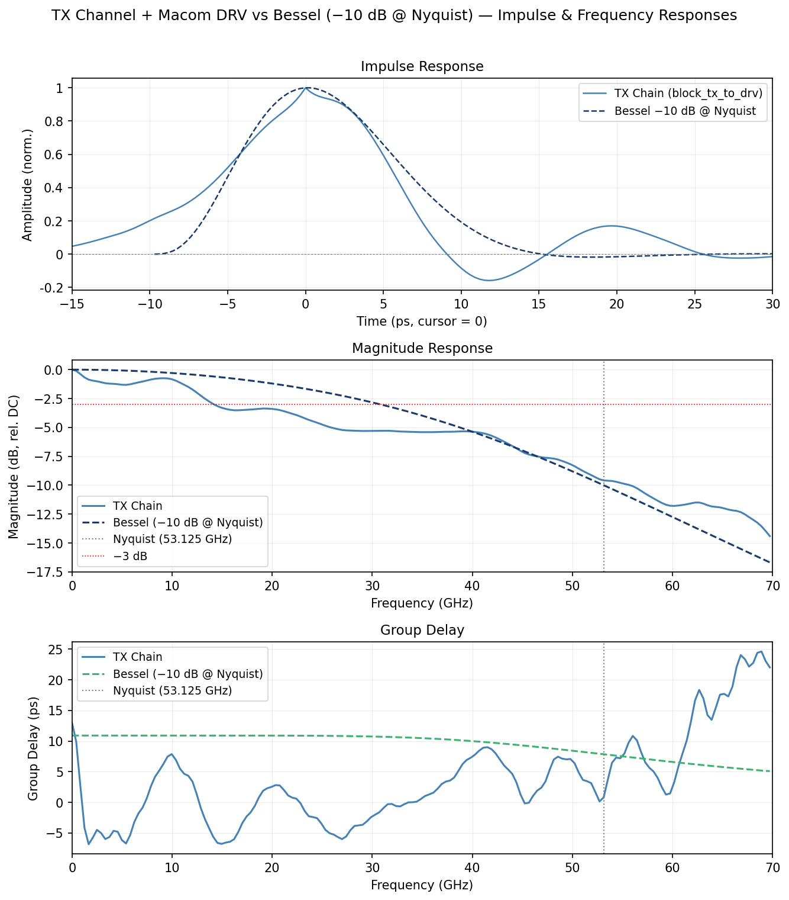

**Impulse response (top):** The TX chain impulse (blue) has a sharp main cursor but a significant positive precursor (+22.7% at UI−1) and an alternating postcursor at UI+2 (+16.2%), reflecting both the driver peaking and residual interconnect reflections. The Bessel (dashed dark blue) is a smooth, broader pulse centred at the cursor with no discrete reflective echoes — the wider time-domain spread is the direct consequence of the tighter −10 dB bandwidth.

**Magnitude response (middle):** The TX chain has notably less loss at Nyquist than the −10 dB Bessel reference, yet its response is non-monotonic: the driver E-Peaking introduces a lift between ~15–35 GHz before rolling off toward Nyquist. The Bessel provides a clean monotonic rolloff crossing −10 dB at exactly 53.125 GHz. Both curves are normalised to 0 dB at DC.

**Group delay (bottom):** The TX chain shows ±3 ps of group delay variation across the passband, with a peak near 20 GHz and a trough near Nyquist — a signature of the driver peaking network. The Bessel group delay is flat to within 0.5 ps across the full passband (the slight rise near its cutoff is characteristic of even 4th-order Bessel designs), confirming its linear phase response.

The key takeaway: **the TX chain has better amplitude transmission than a −10 dB Bessel, yet produces comparable or worse eye quality without TX FIR.** The reason is group delay ripple — flat group delay means every spectral component of a symbol arrives simultaneously, producing smooth and predictable ISI. The ±3 ps ripple in the TX chain distorts the pulse shape before sampling in a way that a linear FFE struggles to equalise, while the Bessel's monotonic rolloff produces clean, DFE-friendly ISI. The TX E-Peaking at 7.2 dB partially corrects the magnitude dip near Nyquist but cannot undo the phase distortion, which is what limits the end-to-end SNDR to 29.3 dB.

---

### 4.2 DRV_OUT → MZM_IN

**Block characterised:** Substrate

The substrate is a short passive electrical interconnect between the driver output and the MZM electrical input. It is expected to be nearly an ideal transmission line.

| Metric | Value |
|---|---|
| Propagation lag | 1.469 UI |
| SNDR | **48.97 dB** |
| Signal power | 5.723 × 10⁻¹ -|
| N+D power | 7.250 × 10⁻⁶ |
| Significant ISI extent | UI+10 |

**Significant baud-rate taps (> 0.5%):**

| UI | h[k] | | UI | h[k] |
|---|---|---|---|---|
| −1 | −0.1617 | | +1 | −0.0560 |
| **0** | **+1.0000** | | +2 | +0.0533 |

The 49 dB SNDR confirms this is a highly linear passive element. The negative precursor at UI−1 (−16.2%) followed by a negative first postcursor is the signature of an **impedance discontinuity reflection**: a partial reflection at the substrate-MZM interface returns a delayed, inverted echo. The very short lag (1.47 UI ≈ 0.43 ps per UI × 1.47 ≈ 14 ps round trip) is consistent with a short on-chip interconnect.

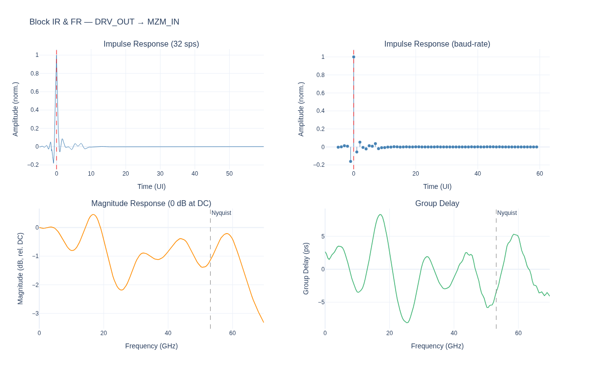

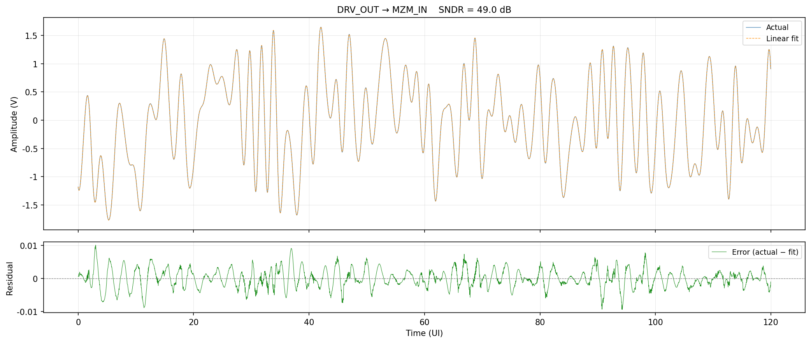

#### Eye Diagram Analysis

To isolate the substrate's effect on signal quality, a vanilla PAM4 ZOH waveform (no TX FIR, levels $\{-3,-1,+1,+3\}$, 32 SPS) was convolved with the estimated substrate impulse response and an eye diagram plotted. A 4th-order Bessel–Thomson filter configured for −3 dB at the PAM4 Nyquist frequency (53.125 GHz) is shown alongside as a reference for a purely bandwidth-limited channel.

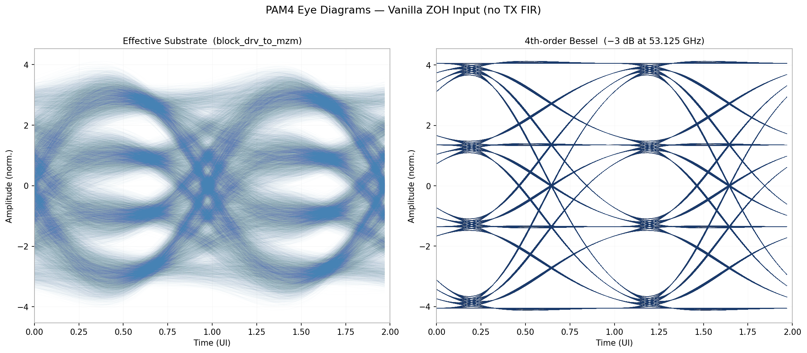

**Substrate (left):** Despite having more bandwidth than the Bessel and less loss at Nyquist, the substrate eye is visually worse. The −16.2% precursor tap splits each of the four PAM4 levels into four sub-levels (one per possible preceding symbol), producing 16 distinct amplitude positions and a cluttered, level-compressed pattern. Each level is shifted by up to $\pm 0.49$ (normalised units), giving an inner eye height of approximately $2 \times (1 - 0.162) \approx 1.68$ vs the ideal 2.0.

**Bessel reference (right):** With 3 dB of loss at Nyquist the Bessel eye shows the characteristic smooth sinusoidal transitions of a bandwidth-limited channel — yet it is visually cleaner. The four levels remain well-resolved with a clear crossing region.

**The distinguishing factor is group delay.** The Bessel has flat group delay (~6.3 ps) across the entire passband; the substrate has ±2 ps of ripple from reflection interference. Flat group delay means every frequency component of a symbol arrives at the receiver at the same time — the pulse shape is preserved and the ISI is smooth and predictable. Group delay ripple means different spectral components arrive at different instants, distorting the pulse shape before sampling and producing the irregular, level-splitting ISI pattern visible in the substrate eye.

This has a direct design implication: **amplitude loss is easily equalised; group delay variation is not.** A flat-but-attenuated channel (Bessel) has smooth, predictable ISI that a linear FFE handles well. The substrate's reflection creates a discrete precursor at UI−1 that requires pre-cursor FFE taps or carefully tuned equalisation — harder to correct than broadband rolloff. Controlled impedance routing to bring $Z_L$ from ~35.5 Ω toward 50 Ω would collapse those 16 sub-levels back toward 4, and flatten the group delay, regardless of any change in bandwidth.

The Bessel impulse and frequency responses confirm the filter is configured correctly — the IR is a smooth 6 ps Gaussian-like pulse, the magnitude crosses −3 dB at exactly 53.125 GHz, and the group delay is flat across the full passband, as expected from a Bessel–Thomson design.

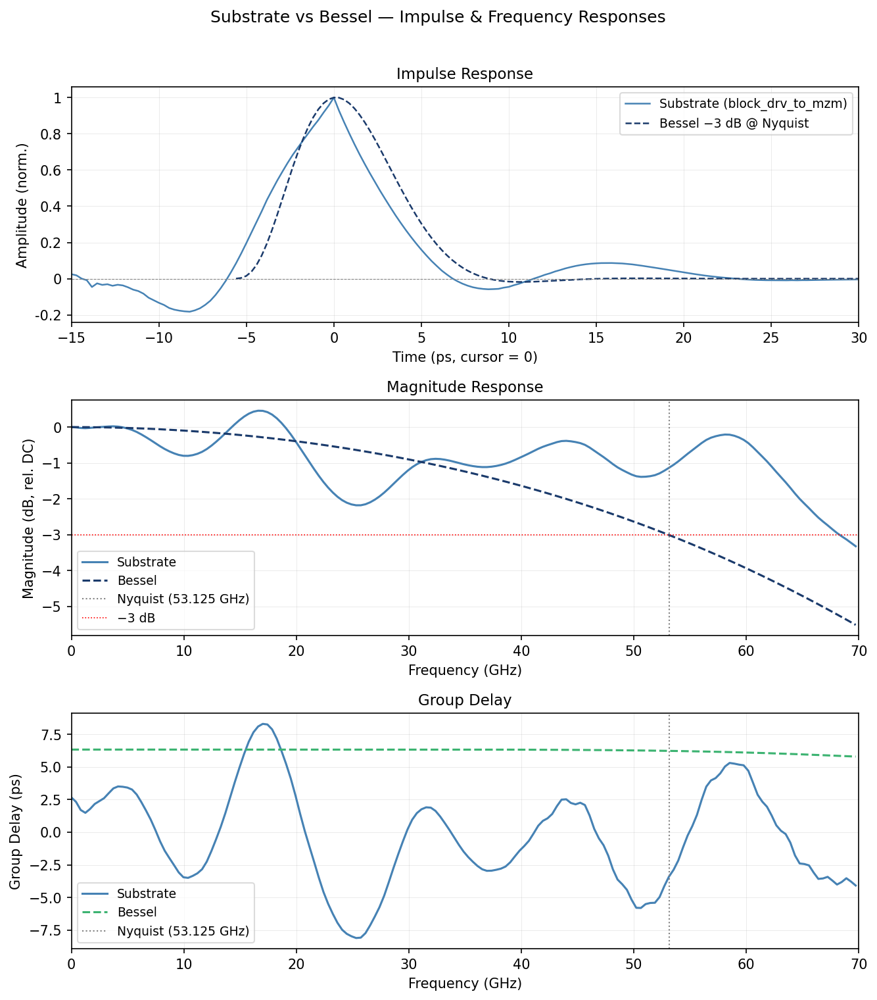

---

### 4.3 MZM_IN → Pout

**Block characterised:** Mach-Zehnder Modulator (MZM)

The MZM converts an electrical drive voltage $V(t)$ to optical power $P_{\text{out}}(t)$ via the transfer function:

$$P_{\text{out}}(t) = \frac{P_0}{2}\left[1 + \cos\!\left(\pi \frac{V(t)}{V_\pi} + \phi_{\text{bias}}\right)\right]$$

Near the quadrature bias point ($\phi_{\text{bias}} = \pi/2$), this is approximately linear in $V(t)$. The optical power signal is DC-subtracted prior to deconvolution to isolate the AC modulation.

| Metric | Value |
|---|---|
| Propagation lag | 3.594 UI |
| SNDR | **35.36 dB** |
| Signal power | 1.996 × 10⁻⁶ W² |
| N+D power | 5.814 × 10⁻¹⁰ W² |
| Significant ISI extent | UI+7 |

**Significant baud-rate taps (> 0.5%):**

| UI | h[k] | | UI | h[k] |
|---|---|---|---|---|
| −2 | −0.0269 | | +1 | +0.0390 |
| −1 | −0.0056 | | +4 | +0.0388 |
| **0** | **+1.0000** | | | |

The MZM shows a clean, compact impulse response with small pre- and postcursors. The SNDR of 35.4 dB (vs 49.0 dB for the substrate) reflects the **MZM nonlinearity**: the $\cos(\cdot)$ transfer function introduces harmonic distortion that cannot be captured by the linear model. The alternating precursors (−2.7% at UI−2, −0.6% at UI−1) may also reflect bandwidth rolloff in the electrical modulation path.

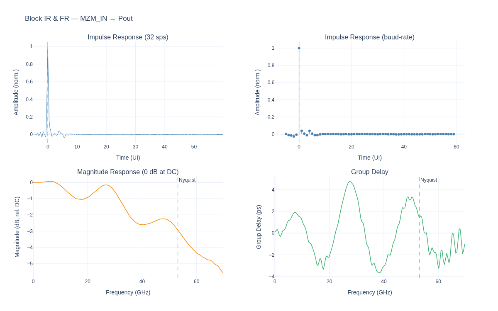

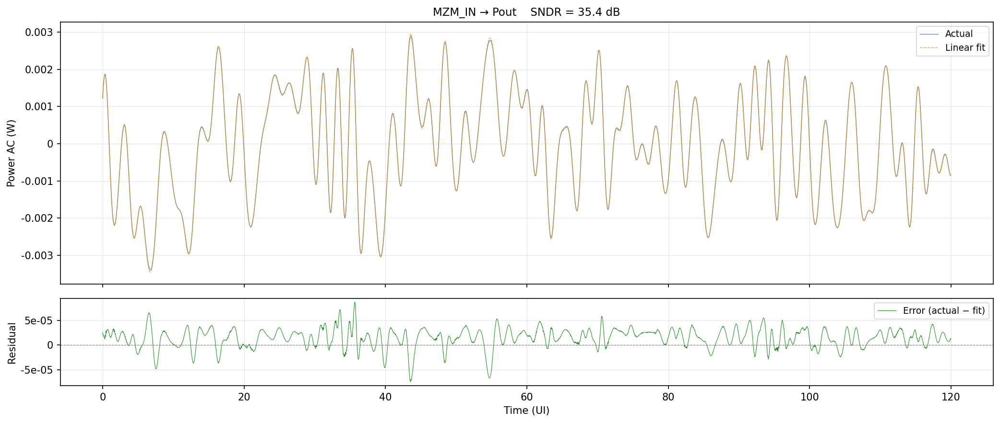

#### MZM vs Bessel Reference

A vanilla PAM4 ZOH waveform (no TX FIR, levels $\{-3,-1,+1,+3\}$, 32 SPS) was convolved with the estimated MZM impulse response (`h_win × norm`, where `norm = 1.175 × 10⁻⁴`) and an eye diagram plotted alongside a 4th-order Bessel–Thomson filter at −3 dB Nyquist.

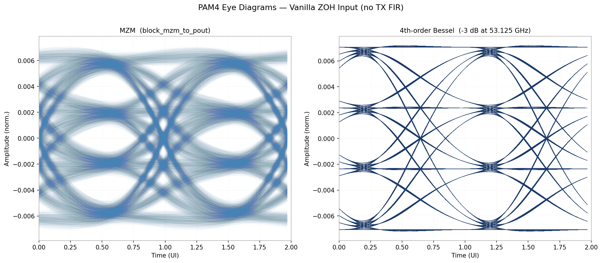

**MZM (left):** The eye is wide open with four well-resolved levels and clean transitions, closely resembling the Bessel reference. The small precursors (−2.7% at UI−2) and postcursors (+3.9% at UI+1, +4) produce barely perceptible level broadening — the MZM is close to an ideal low-pass element at this drive level.

**Bessel reference (right):** The −3 dB Bessel eye is virtually indistinguishable in opening and level separation, confirming that the MZM's linear response approximates a smooth bandwidth-limited channel over the drive range used here.

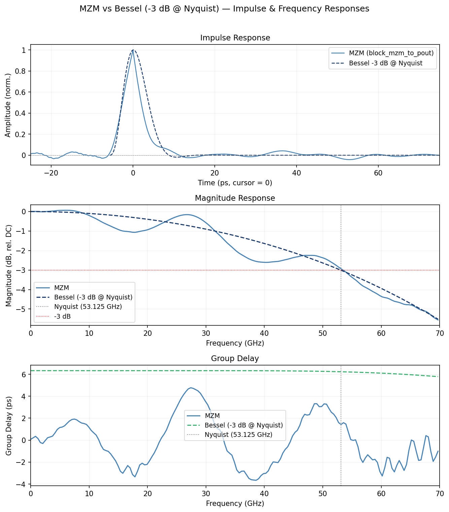

**Impulse response (top):** The MZM impulse (blue) is compact and nearly symmetric, with small alternating pre- and postcursors (−2.7% at UI−2, +3.9% at UI+1 and UI+4). These ripples, visible as slight undershoot and overshoot around the main cursor, are consistent with a bandlimited response with mild ringing. The Bessel (dashed) is a smooth Gaussian-like pulse with no such structure.

**Magnitude response (middle):** The MZM rolls off monotonically and reaches approximately −3 dB near Nyquist, closely tracking the Bessel reference. The small ripple visible above 40 GHz is a consequence of the alternating-sign postcursors in the IR — a slight resonance in the electrical modulation path of the driver-MZM interface rather than the optical conversion itself.

**Group delay (bottom):** The MZM group delay is nearly flat across the full passband, deviating by less than ±1 ps from DC to Nyquist. This is markedly different from the TX chain (±3 ps ripple) and the substrate (±2 ps ripple from reflection), and explains why the MZM eye is clean despite the small ISI taps: the pulse shape is well-preserved at the optical output.

The MZM behaves close to an ideal linear transducer at this bias and drive level. The residual SNDR penalty (35.4 dB vs 49.0 dB for the substrate) is attributable to the $\cos(\cdot)$ nonlinearity introducing harmonic distortion at levels beyond the linear approximation — a systematic, non-ISI impairment that the linear channel model cannot capture, rather than any phase or bandwidth deficiency.

---

### 4.4 Pout → Pin_PD

**Block characterised:** Optical Channel

The optical channel represents propagation from the MZM output to the photodiode input — including any fibre, on-chip waveguides, or free-space coupling. Both signals are optical power (W), DC-subtracted.

| Metric | Value |
|---|---|
| Propagation lag | 0.000 UI (< 1 sample) |
| SNDR | **53.61 dB** |
| Signal power | 1.112 × 10⁻⁸ W² |
| N+D power | 4.845 × 10⁻¹⁴ W² |
| Significant ISI extent | UI±1 only |

**Significant baud-rate taps (> 0.5%):**

| UI | h[k] |
|---|---|
| −1 | +0.0095 |
| **0** | **+1.0000** |
| +1 | +0.0095 |

This is the cleanest block in the entire link. The optical channel is essentially a **unity-gain memoryless scaler** — the impulse response is a near-perfect delta function with only 0.95% ISI at UI±1. The 53.6 dB SNDR represents the noise floor of the measurement/simulation, not physical channel impairment. Zero propagation lag indicates the optical path delay is shorter than one sample period (< 0.294 ps), consistent with a very short integrated photonic waveguide.

> **Key finding:** The optical channel contributes negligible ISI or dispersion at 106.25 GBaud in this configuration.

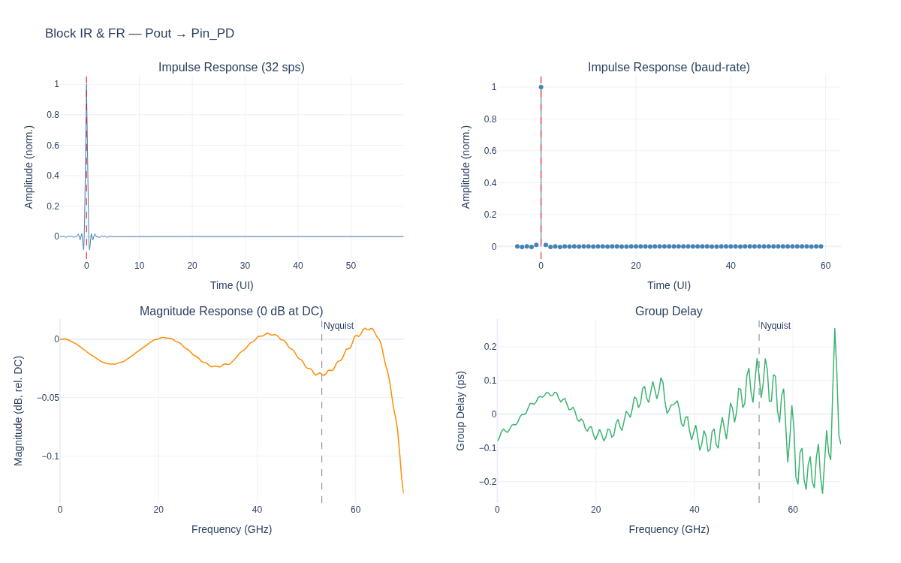

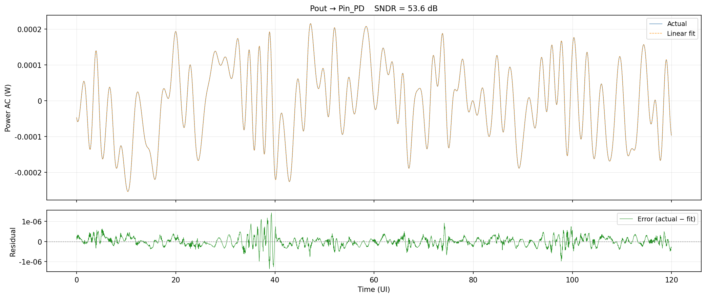

---

### 4.5 Pin_PD → TIA_OUT

**Block characterised:** Photodiode (PD) + Transimpedance Amplifier (TIA)

The PD converts optical power to photocurrent ($I = \mathcal{R} \cdot P$, where $\mathcal{R}$ is the responsivity), and the TIA converts photocurrent to voltage. The combined transfer function is a transimpedance $Z_T(f)$ with bandwidth rolloff and potential peaking.

| Metric | Value |
|---|---|
| Propagation lag | 4.281 UI |
| SNDR | **22.78 dB** |
| Signal power | 1.051 × 10⁻² V² |
| N+D power | 5.540 × 10⁻⁵ V² |
| Significant ISI extent | UI+54 |

**Significant baud-rate taps (> 0.5%):**

| UI | h[k] | | UI | h[k] |
|---|---|---|---|---|
| −1 | +0.1341 | | +1 | −0.2951 |
| **0** | **+1.0000** | | +2 | +0.1105 |
| | | | +3 | −0.0507 |
| | | | +4 | +0.0408 |

The PD+TIA block shows the **most severe bandwidth limitation** in the link. Several features stand out:

1. **Alternating-sign postcursors**: +1.000 → −0.295 → +0.111 → −0.051 → +0.041 is a classic **ringing** pattern, indicative of a second-order peaking response in the TIA. The TIA was deliberately designed with gain peaking to partially compensate for PD bandwidth rolloff.
2. **Long ISI tail**: the impulse response has detectable energy out to UI+54, implying the combined PD+TIA bandwidth is well below the symbol rate Nyquist frequency of 53.125 GHz.
3. **Significant precursor** at UI−1 (+13.4%): this apparent non-causality arises because the Wiener estimator places the cursor at the peak of the response, not at the first non-zero sample. The true causal response onset is at the precursor.
4. **Worst per-block SNDR** (22.78 dB): the PD+TIA nonlinearity (PD square-law detection, TIA saturation/compression at large signal) and TIA noise floor both contribute to the residual.

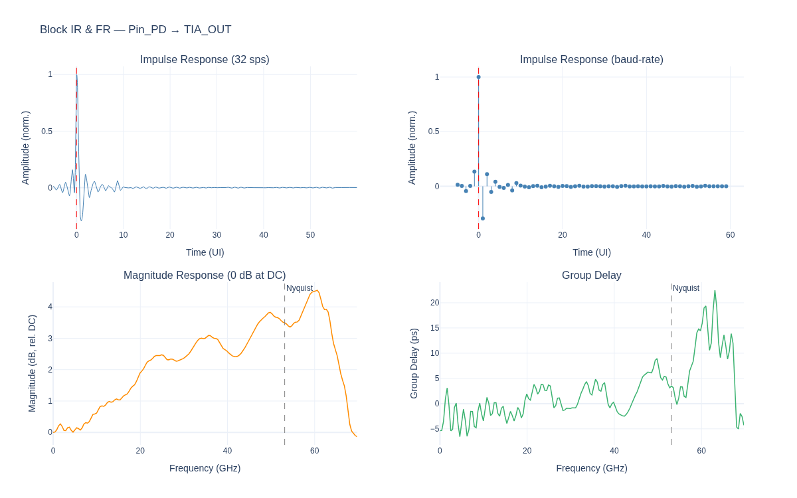

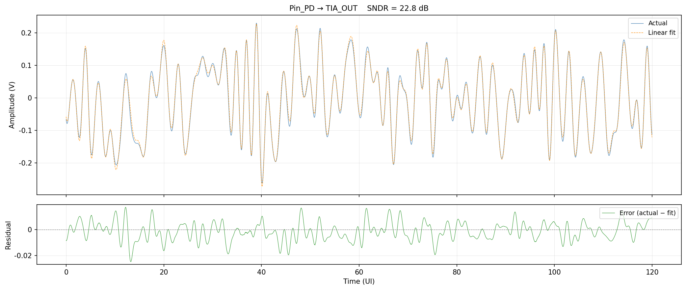

---

### 4.6 TIA_OUT → RX_CH_OUT

**Block characterised:** RX Channel Filter

The RX channel filter provides additional pulse shaping and equalization on the receive side.

| Metric | Value |
|---|---|
| Propagation lag | 120.094 UI |
| SNDR | **26.55 dB** |
| Signal power | 1.986 × 10⁻³ V² |
| N+D power | 4.393 × 10⁻⁶ V² |
| Significant ISI extent | UI+18 |

**Significant baud-rate taps (> 0.5%):**

| UI | h[k] | | UI | h[k] |
|---|---|---|---|---|
| −1 | +0.0964 | | +1 | +0.1933 |
| **0** | **+1.0000** | | +2 | +0.1698 |
| | | | +3 | +0.1494 |

Unlike the substrate (which showed a reflective response), the RX channel introduces a **monotonically-decaying postcursor train** (+19.3%, +17.0%, +14.9%, …), indicative of a low-pass filter response. This is consistent with an analog anti-aliasing or CTLE-type filter. The long propagation lag (120 UI) suggests this is a digital filter with significant pipeline latency. The SNDR of 26.6 dB is substantially lower than the substrate (49.0 dB), partly due to accumulated noise from the PD+TIA stage.

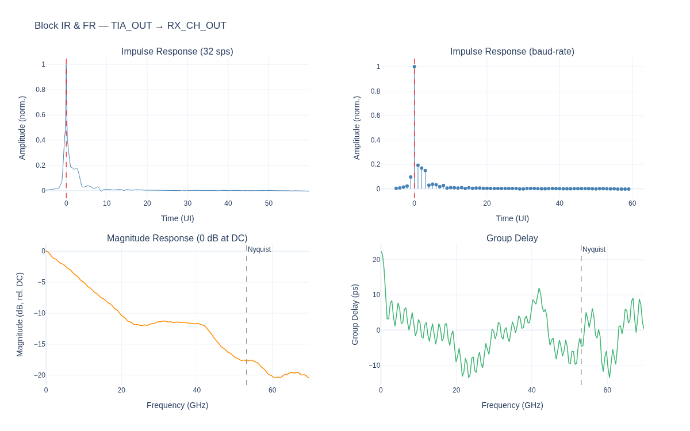

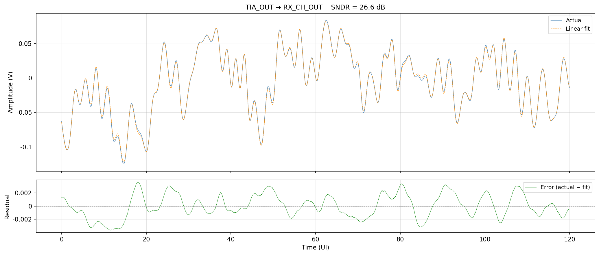

---

### 4.7 RX_CH_OUT → RX_IN

**Block characterised:** RX SerDes

The final block characterises the RX SerDes processing between the channel filter output and the SerDes data input.

| Metric | Value |
|---|---|
| Propagation lag | −0.031 UI (sub-sample, treated as ≈0) |
| SNDR | **42.39 dB** |
| Signal power | 2.269 × 10⁻³ V² |
| N+D power | 1.309 × 10⁻⁷ V² |
| Significant ISI extent | UI+6 |

**Significant baud-rate taps (> 0.5%):**

| UI | h[k] | | UI | h[k] |
|---|---|---|---|---|
| −1 | −0.0623 | | +1 | −0.0087 |
| **0** | **+1.0000** | | +2 | −0.0343 |
| | | | +3 | −0.0665 |

The near-zero lag and high 42.4 dB SNDR confirm the RX SerDes acts as a near **pass-through** for the analog signal at this stage of the path. The small alternating coefficients (−6.2%, −3.4%, −6.7%) suggest minor high-frequency shaping. The sub-sample lag (−0.031 UI) is a numerical artefact — the cross-correlation estimate is at the limit of a 1-sample ambiguity.

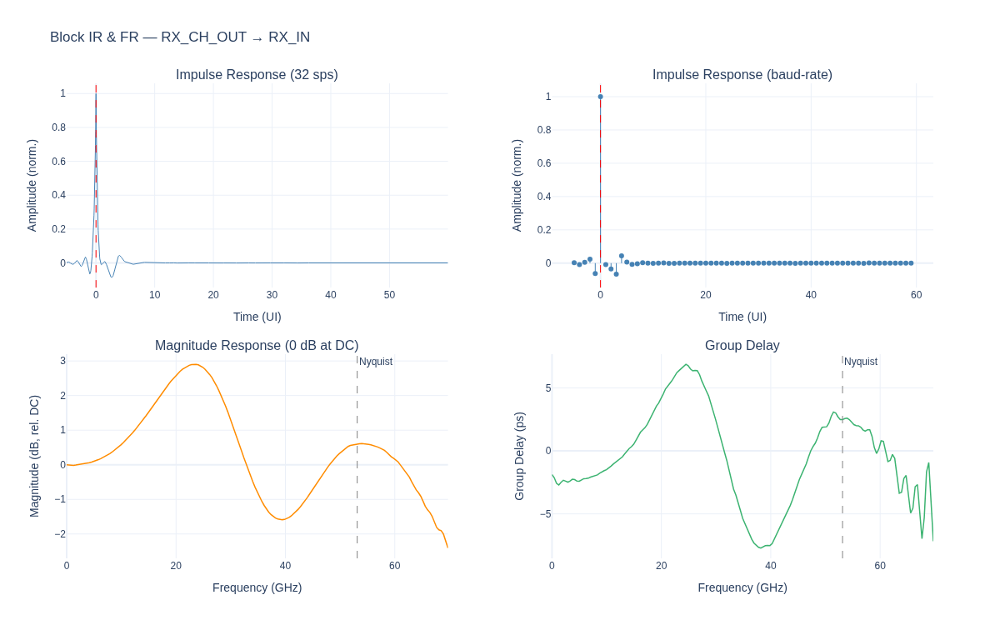

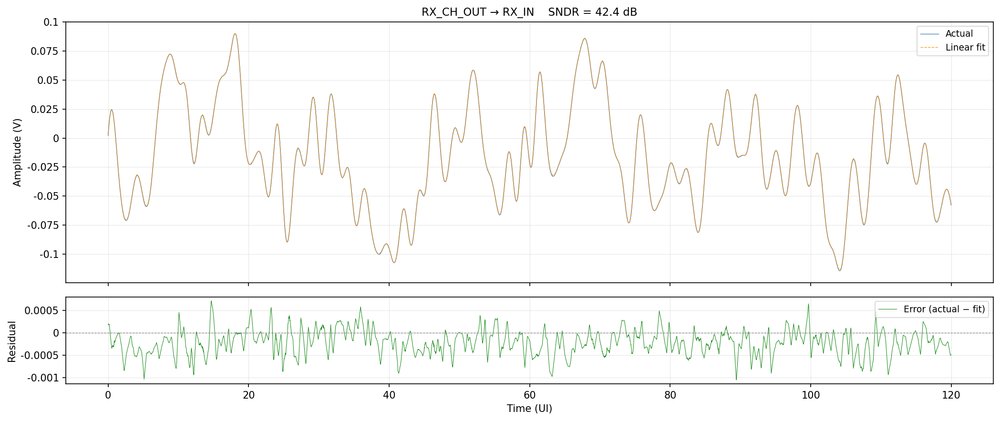

---

## 5. End-to-End (From-Symbols) Analysis

In this analysis the input is always the PAM4 transmit sequence processed through the TX FIR and ZOH-upsampled. The deconvolution therefore measures the **cumulative linear channel** from the TX DSP output to each probe point, accumulating all impairments along the signal path.

| Probe Point | Lag (UI) | SNDR (dB) | ISI Extent |
|---|---|---|---|
| `tx_wave` | 9.81 | 26.06 | UI+9 |
| `DRV_OUT` | 133.25 | 23.12 | UI+22 |
| `MZM_IN` | 134.69 | 23.02 | UI+22 |
| `Pout` | 138.31 | 22.64 | UI+29 |
| `Pin_PD` | 138.31 | 22.64 | UI+29 |
| `TIA_OUT` | 142.59 | 19.74 | UI+59 |
| `RX_CH_OUT` | 262.63 | 20.58 | UI+53 |
| `RX_IN` | 262.59 | 20.51 | UI+53 |

Note that `Pout` and `Pin_PD` have identical lag and SNDR — confirming the optical channel is dispersion-free at this symbol rate.

**tx_wave (end-to-end):**

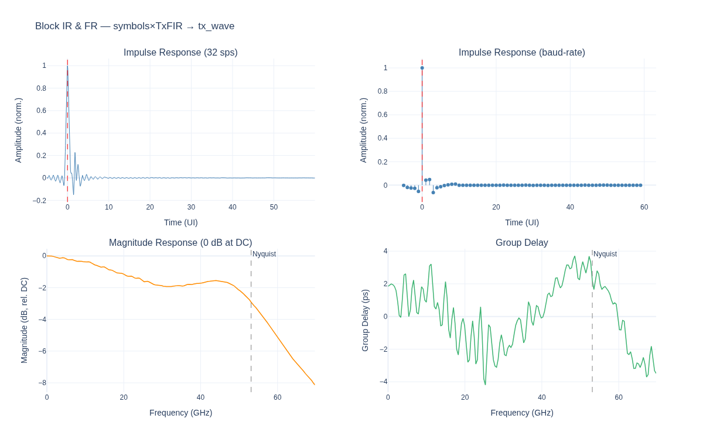

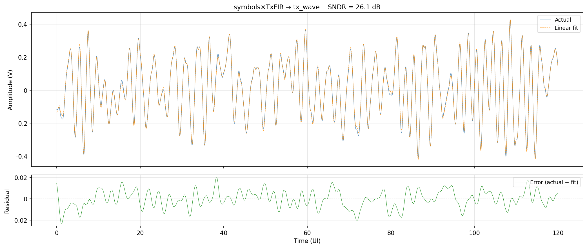

**DRV_OUT (end-to-end):**

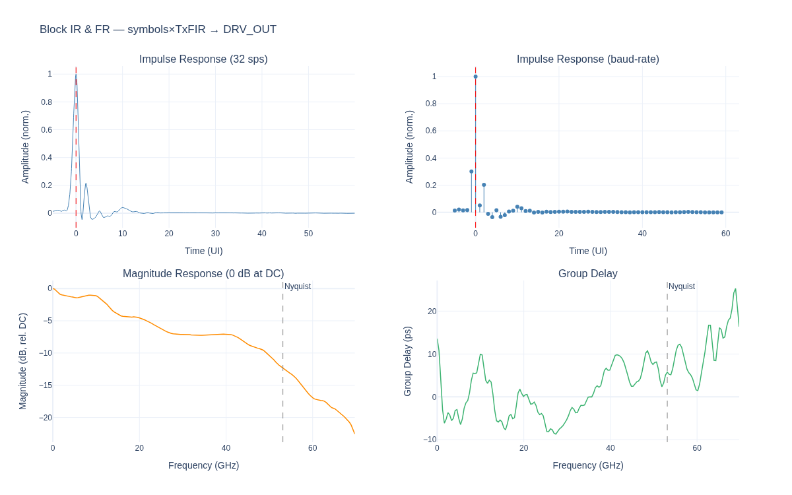

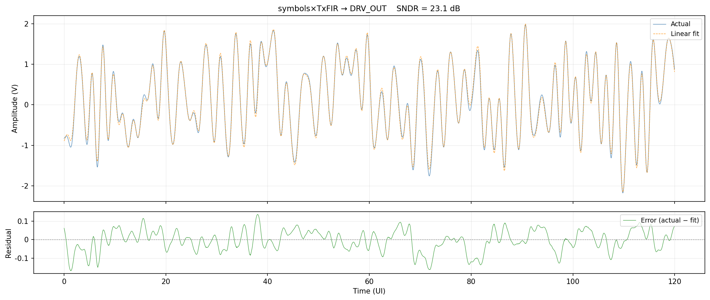

**TIA_OUT (end-to-end — worst SNDR):**

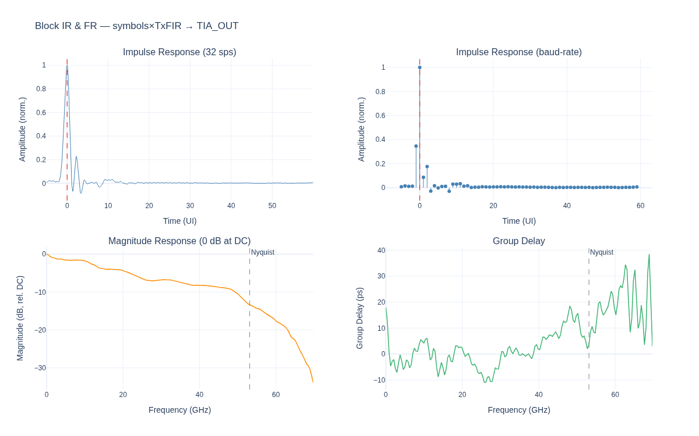

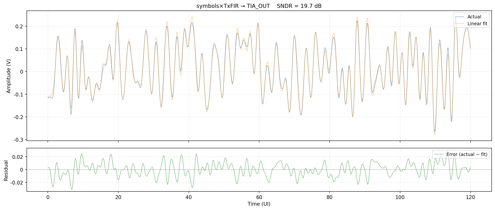

**RX_CH_OUT (end-to-end — final RX point):**

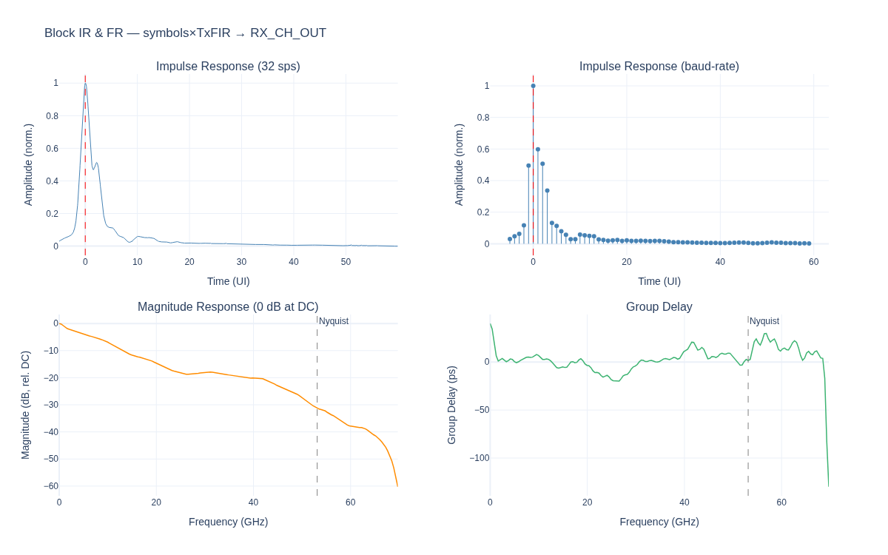

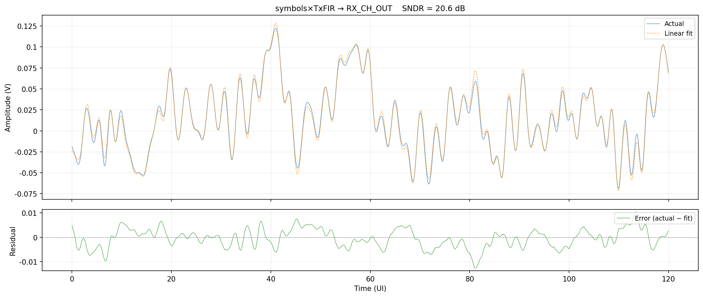

---

## 6. SNDR Summary & Comparison

### Per-Block SNDR

```
Block                              SNDR (dB)
─────────────────────────────────────────────────────
Optical Channel (Pout→Pin_PD)     53.6  ████████████████████████████████████████████████████
Substrate (DRV_OUT→MZM_IN)        49.0  ████████████████████████████████████████████
RX SerDes (RX_CH_OUT→RX_IN)       42.4  ██████████████████████████████████████
MZM (MZM_IN→Pout)                 35.4  ████████████████████████████████
TX+DRV (tx_wave→DRV_OUT)          29.3  ██████████████████████████
RX Channel (TIA_OUT→RX_CH_OUT)    26.6  ████████████████████████
PD+TIA (Pin_PD→TIA_OUT)           22.8  ████████████████████
```

### End-to-End (From-Symbols) SNDR

```
Probe Point    SNDR (dB)
──────────────────────────────────────────────
tx_wave        26.1  ████████████████████████
DRV_OUT        23.1  █████████████████████
MZM_IN         23.0  ████████████████████
Pout           22.6  ████████████████████
Pin_PD         22.6  ████████████████████
RX_IN          20.5  ██████████████████
RX_CH_OUT      20.6  ██████████████████
TIA_OUT        19.7  █████████████████
```

---

## 7. Key Findings

### Finding 1 — The Optical Channel Is Lossless and Dispersion-Free

The Pout → Pin_PD block achieves **53.6 dB SNDR** with a near-perfect delta-function impulse response (UI±1 at 0.95% each, zero propagation delay). At 106.25 GBaud over this link length, the optical domain contributes **no measurable ISI or dispersion**. This is the highest SNDR of any block in the link.

### Finding 2 — The PD+TIA Is the Dominant Impairment Source

The Pin_PD → TIA_OUT block achieves **22.78 dB SNDR** — the worst of any individual block — with ISI extending to UI+54. The alternating-sign postcursor pattern (−29.5%, +11.1%, −5.1%, +4.1%) reveals **TIA gain peaking**, a deliberate design choice to extend effective bandwidth at the cost of ringing artefacts. This block is the principal cause of eye closure in the end-to-end link.

### Finding 3 — End-to-End SNDR Is Bounded by the PD+TIA

The from-symbols SNDR degrades from 26.1 dB at `tx_wave` to a minimum of **19.7 dB at `TIA_OUT`**. The SNDR slightly recovers at `RX_CH_OUT` (20.6 dB), suggesting the RX channel filter provides modest ISI reduction. The plateau between `Pout` and `Pin_PD` (both 22.6 dB, identical IRs) confirms there is no optical penalty.

### Finding 4 — The Substrate Shows Impedance Mismatch

The DRV_OUT → MZM_IN block (substrate) achieves 49.0 dB SNDR but has a distinctive **negative precursor at UI−1 (−16.2%)**. This is the hallmark of a reflection from a real part of the impedance discontinuity returning before the main pulse. The magnitude (16%) suggests a partial reflection coefficient of $\Gamma \approx -0.16$.

### Finding 5 — TX E-Peaking Effectively Conditions the Signal

The from-symbols end-to-end fit to `tx_wave` achieves **26.1 dB SNDR** with only 3 significant ISI taps (UI−2 to UI+2). The E-Peaking pre-emphasis at 7.2 dB partially inverts the TX channel bandwidth rolloff, producing a near-ideal output at the SerDes boundary. This is 3 dB better than the fit to `DRV_OUT` (23.1 dB), confirming the driver and its preceding channel add meaningful impairment even with pre-emphasis.

### Finding 6 — Large RX Channel Latency (120 UI)

The TIA_OUT → RX_CH_OUT block has a propagation lag of 120.094 UI — an unexpectedly large delay for an analog filter. STILL UNDER INVESTIGATION.

---

## Appendix: Simulation Parameters

| Parameter | Value |
|---|---|
| Data rate | 212.5 Gb/s |
| Modulation | PAM4 (2 bits/symbol) |
| Symbol rate | 106.25 GBaud |
| Samples per symbol | 32 |
| Sample rate $f_s$ | 3400 GHz |
| Sample period $\Delta t$ | 0.2941 ps |
| Record length | 160,000 symbols (5.12 × 10⁶ samples) |
| TX FIR taps | cm4=−0.2103, cm3=+0.5400, cm2=−0.1345, cm1=+0.0783, c0=+0.0209, cp1=+0.0160 |
| E-Peaking | 7.2 dB |
| Operating temperature | 55 °C |
| Bias current | 250 mA |
| Modulation current | −1.29 mA |
| Device | Pkctrl3, 31×20 µm |
| Regularisation $\lambda$ | $10^{-4} \cdot \bar{S}_{xx}$ |
| IR window | $n_{\text{pre}}=5$ UI, $n_{\text{post}}=60$ UI |
| SNDR guard | 1000 UI each end |
| Frequency display | 0 to 106.25 GHz (1× baud rate) |
| FFT size (FR display) | 8192 (zero-padded) |

---

*Analysis performed using Python / NumPy. All waveforms from Virtuoso transient simulation. Results saved to [`analysis_results.json`](analysis_results.json).*
