# TIA Responses Data Consumption

## Overview
This document records the steps and results of generating plots from the step and single-bit response data of the TIA across multiple settings. The raw data was provided in CSV format under:
- `temp/data/single_bit_response/`
- `temp/data/step_response/`

## Steps Taken
1. **Identified Data Sources**: Examined the structure of the `temp/data` directories which contain CSV files with sweep results for different TIA settings (e.g., `attn10_main0p7_tamerolloff`, `attn11_tamerolloff`, etc.).
2. **Created Plotting Script**: Wrote a Python script (`scripts/plot_tia_responses.py`) to systematically read and plot this data.
   - Utilized `pandas` for CSV parsing and data extraction.
   - Utilized `matplotlib` to generate the step and single-bit response waveforms.
3. **Data Type Coercion**: Handled mixed-type column values that caused plotting to fail initially. Implemented `pd.to_numeric(df[col], errors='coerce')` to clean non-numeric artifacts safely.
4. **Generated Figures**: Executed the script, successfully generating plots for each CSV.
5. **Organized Results**: Consolidated all generated PNG figures into the `figures/` directory located alongside this document.

## Results
Below are the generated response plots for both Single Bit and Step responses across the various configurations.

### Single Bit Responses

#### Attenuation 10 (Main 0.7, Tamerolloff Bypass PD)
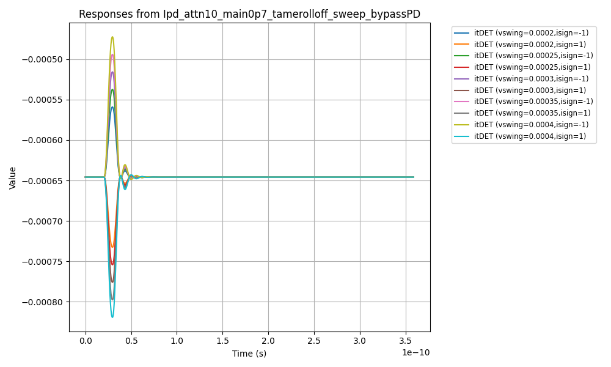
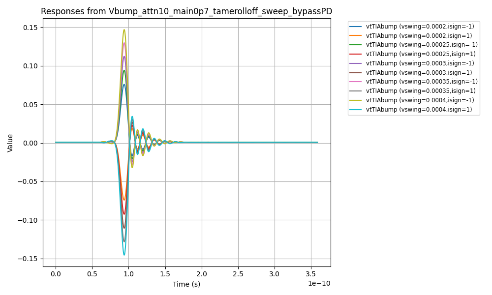

#### Attenuation 11 (Tamerolloff)
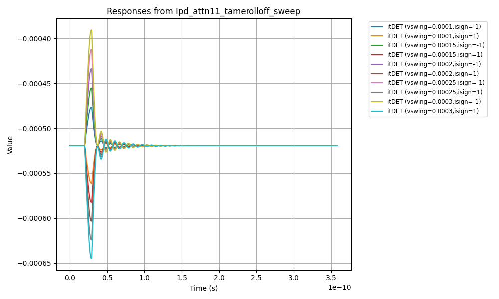
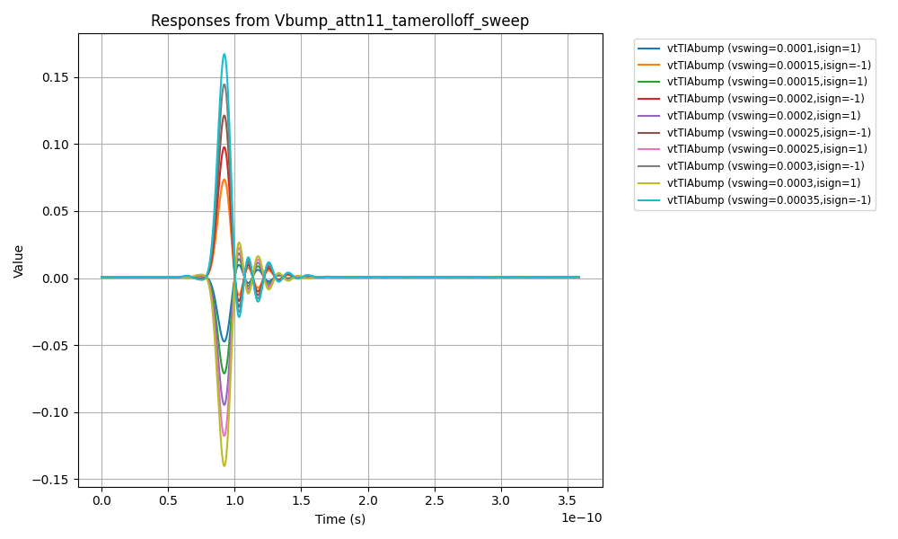

#### Attenuation 11 (Xtmpeak)
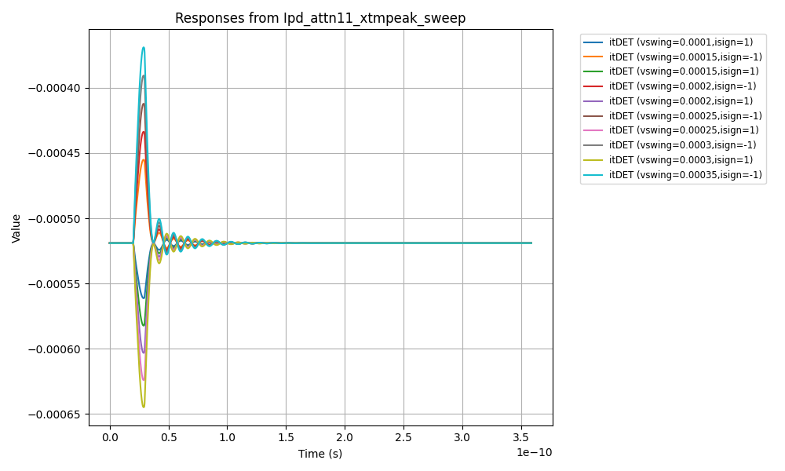
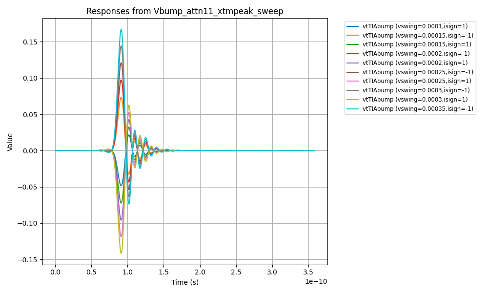

#### Attenuation 12 (Tamerolloff)

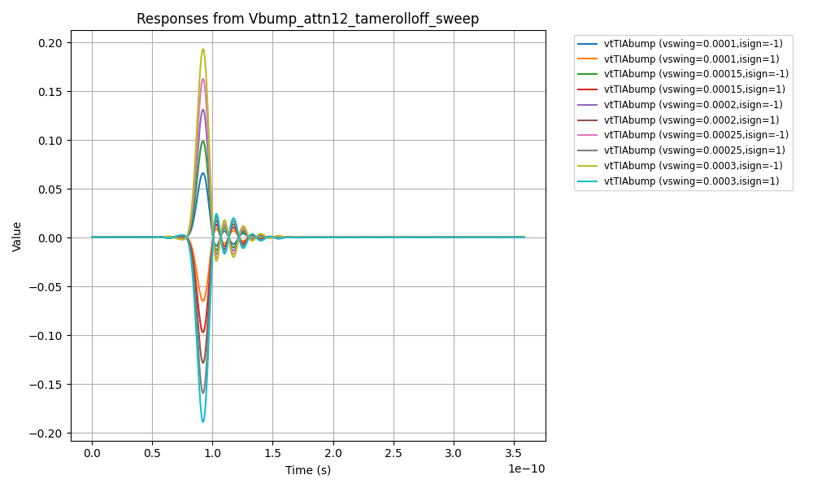

#### Attenuation 12 (Xtmpeak)
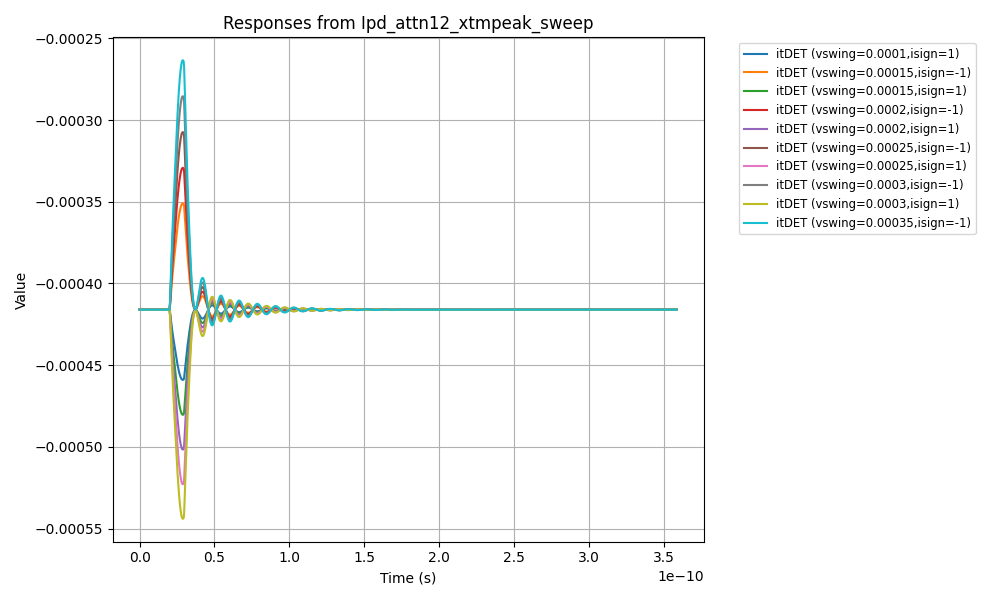
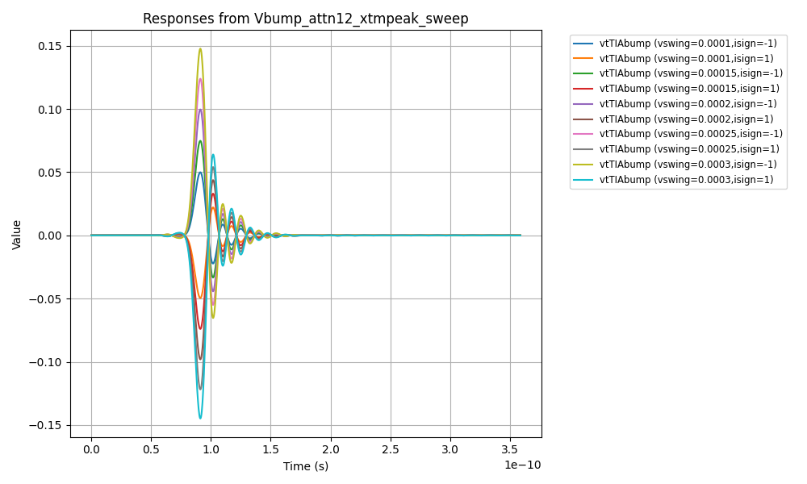

---

### Step Responses

#### Attenuation 10 (Main 0.7, Tamerolloff Bypass PD)
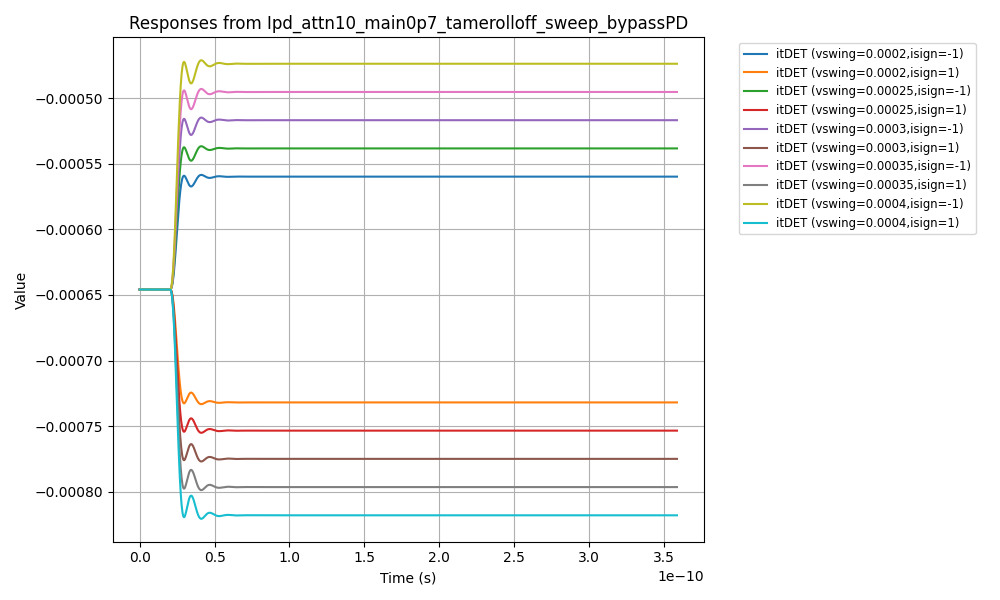
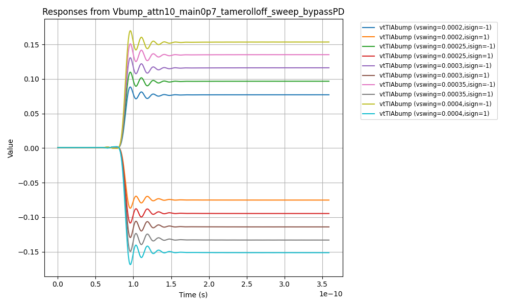

#### Attenuation 11 (Tamerolloff)
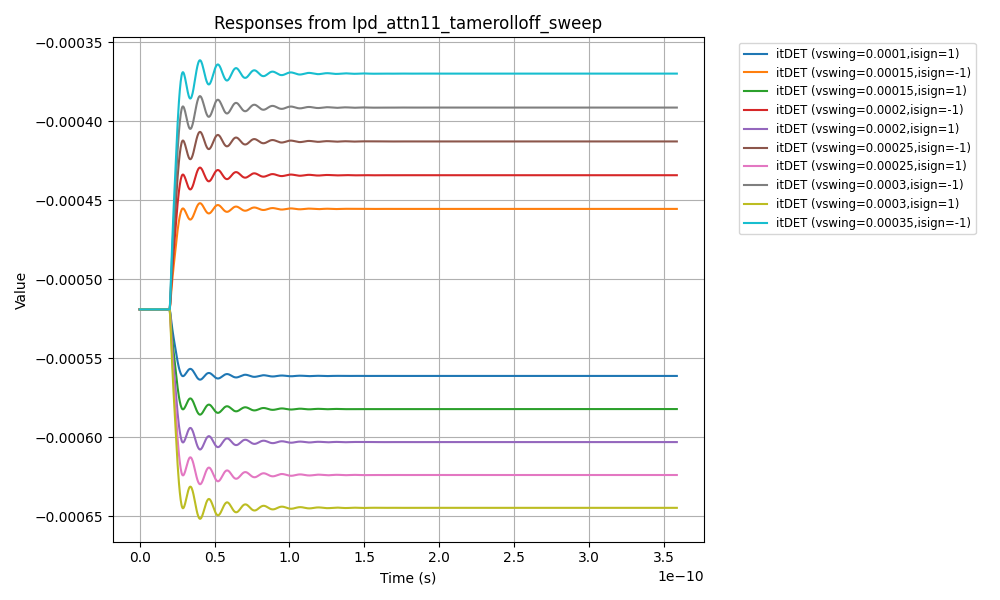
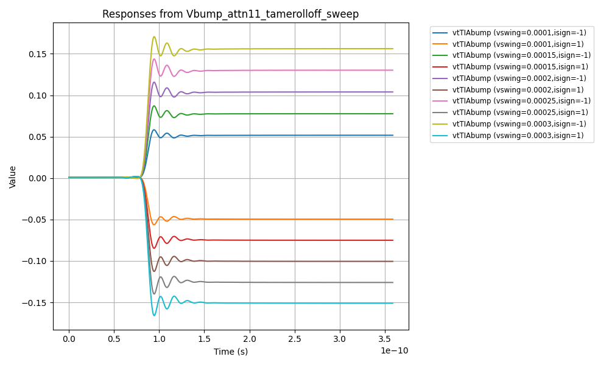

#### Attenuation 11 (Xtmpeak)

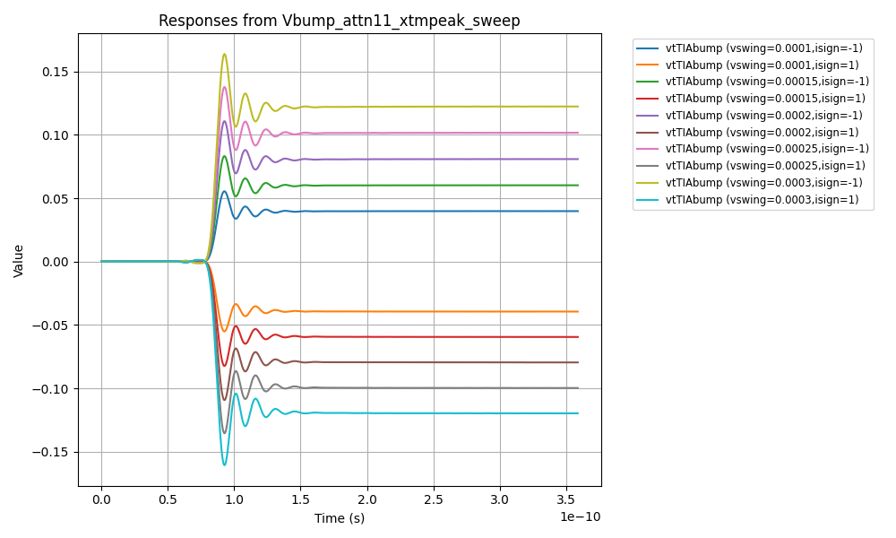

#### Attenuation 12 (Tamerolloff)
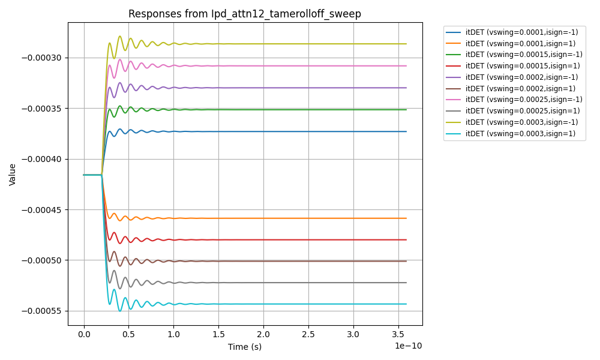
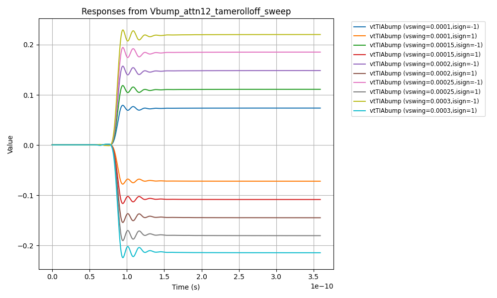

#### Attenuation 12 (Xtmpeak)

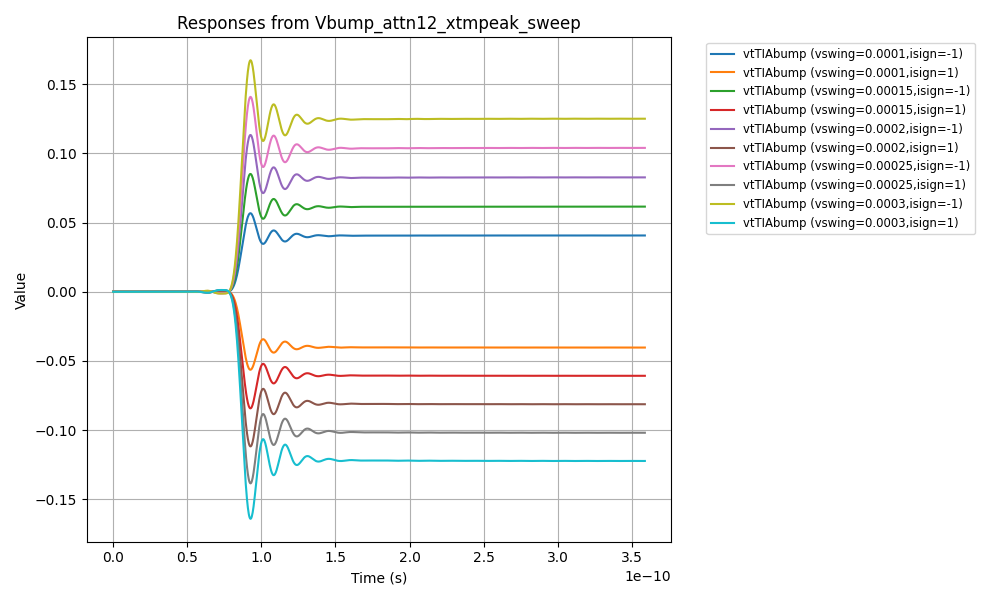