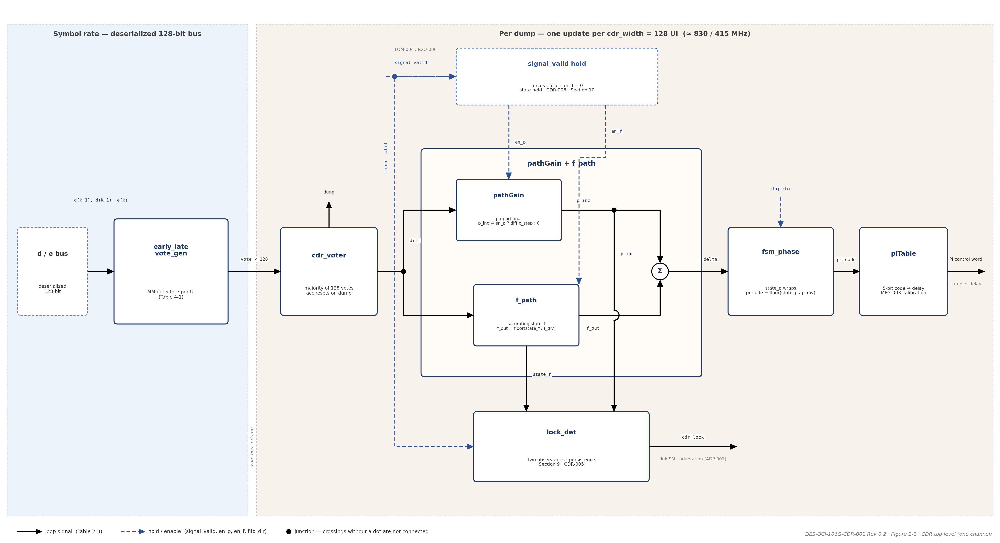

DES-OCI-106G-CDR-001 Rev 0.2 | Companion to ARCH-OCI-106G-001 Rev 0.7 | CDR Design Specification

**400G OCI Line-Side SerDes Chiplet**

Clock and Data Recovery — Design Specification

*Companion to ARCH-OCI-106G-001 Rev 0.7 | Design decomposition of CDR-001..007, DRX-006, CMP-005 | Both operating modes (106.25 / 53.125 GBd)*

| **Document ID** | DES-OCI-106G-CDR-001 |
| --- | --- |
| **Revision** | 0.2 (Draft for review) |
| **Date** | September 21, 2026 |
| **Status** | DRAFT. Design companion to the Architecture and Requirements Specification ARCH-OCI-106G-001 Rev 0.7. Where this document and Rev 0.7 differ, Rev 0.7 governs. Design confidence: Medium. |
| **Parent requirements** | CDR-001..007 (Rev 0.7 §6.5); DRX-006 (JTOL mask); CMP-005 (dual-rate operation); RXO-007 (t_lock / t_loselock); ADP-001, ADP-002 (adaptation gating); LOM-004 (signal_valid hand-off); BUP-003 (relink on loss of lock). |
| **Governing specifications** | IEEE Draft P802.3dj/D1.3 Table 176D-10 (= Table 179-12) and 179.9.4.6 via Annex 176C/176D — native-baud JTOL mask and 4 MHz CRU for 400G OCI mode; OIF CEI-05.3 Clause 24 (CEI-112G-XSR) — baud-matched JTOL cross-check for 200G OCI mode and JTOL/CID test-pattern method in both modes; OCI Gen1 Optical PHY Specification v1.0 Table 1-3 and Table 2-3 n.5 — lock timers. |
| **Scope** | Baud-rate Mueller–Müller CDR: block partition, loop-filter and phase-accumulator arithmetic, register sizing, frequency-tracking range, closed-loop bandwidth window, cycle-slip policy, lock detector, signal-valid state hold, CID coast, verification hooks. Per channel; four instances per fiber port. |
| **Out of scope** | Phase-interpolator circuit design and PI linearity calibration (MFG-003); slicer/error-slicer design (DRX-005); adaptation-loop internals (ADP family); LOS and loss-of-modulation detector design (RXO-006, DES-OCI-106G-SQL-001); link-controller squelch/relink timing (BUP family). |

| **Revision** | **Date** | **Change summary** |
| --- | --- | --- |
| 0.1 | September 18, 2026 | Initial issue. Design decomposition of CDR-001..007, DRX-006, and CMP-005 per ARCH-OCI-106G-001 Rev 0.6; JTOL basis re-attributed (802.3dj Table 176D-10 native in 400G mode; CEI-112G-XSR baud-matched in 200G mode only; the CEI f_b/13280 ≈ 8 MHz corner at 106.25 GBd and the 802.3dj Cl.182 tables are no longer cited, per Rev 0.6 Table 2-1 / B6); 200G OCI mode column added to every mode-dependent table (CMP-005); Python listings replaced by update-equation tables; lock_f_tol frequency-resolution note corrected from ≈ 4 ppm to ≈ 12 ppm per dump; frequency-register model default (2^20) removed in favor of the specification value (2^15). |
| 0.2 | September 21, 2026 | Re-pinned to ARCH-OCI-106G-001 Rev 0.7 (hub revision; its Section 1.7 indexes this document). Predecessor-document references removed throughout per the OCI 106G document-structure convention: the Status field now states scope and confidence only; provenance statements are replaced by citations of the owning document in the set or by open items; cross-references into DES-OCI-106G-CDR-001 converted from legacy §6-x numbering to its Section numbers. No technical values changed. |

# 1. Introduction

## 1.1 Purpose

This document is the design decomposition of the receive clock-and-data-recovery requirements of ARCH-OCI-106G-001 Rev 0.7 (CDR-001..007, DRX-006, CMP-005). It fixes the CDR architecture, arithmetic, parameter values, and observable behaviors so that RTL, behavioral model, and verification share one definition. Rev 0.7 states what the CDR must do; this document states how, in tables that map each behavior back to its requirement.
## 1.2 Conventions

| **Item** | **Convention** |
| --- | --- |
| Operating modes | 400G OCI mode: 106.25 GBd NRZ, UI = 9.412 ps. 200G OCI mode: 53.125 GBd NRZ, UI = 18.824 ps. Unless a mode is stated, a value applies to both; values in UI are mode-independent, absolute values (fs, ns, MHz) are given per mode. |
| Requirement references | FAMILY-NNN (e.g. CDR-002) refers to the requirement of that ID in Rev 0.7. Section references of the form §x.y without a family prefix are to Rev 0.7; §x.y within this document are written “Section x.y”. |
| Symbols | Configuration and register names appear in monospace (cdr_width, state_f). Names are shared by the behavioral model and the RTL. |
| Sign convention | Vote and diff are (early − late). Positive diff ⇒ increase PI delay (sample later). Lock at h(−1) = h(+1) on the equalized pulse. |
| Data inputs | Sliced data decision d(k) ∈ {±1} and signed error e(k) ∈ {±1} from the dual-error-slicer stage only. No soft samples. |
| Placeholders | TBD = value tracked in the requirements database; not yet fixed by analysis. Section 13 lists the open items. |

## 1.3 Parent requirement map

**Table 1-1. Rev 0.7 requirements satisfied by this document**
| **Req ID** | **Rev 0.7 obligation (abridged)** | **Design response** | **Section** |
| --- | --- | --- | --- |
| **CDR-001** | Closed-loop bandwidth in a 4–6 MHz window, both modes; heavily damped (ζ ≫ 1); low jitter peaking. | Mission gain set p_step/p_div = 2/512, f_step/f_div = 2/64; bandwidth window and damping stated; re-tune of integral gain pending (Section 13). | 7 |
| **CDR-002** | Acquire and track ±200 ppm; frequency register ≥ 20 % clamp margin; saturate, never wrap. | f_bound = 2^15 → ±244 ppm capability (22 % margin); state_f clamped; only state_p wraps. | 6 |
| **CDR-003** | Coast ≥ 72 UI CID under full JTOL mask; frequency estimate keeps advancing phase. | Transition-gated votes contribute zero during CID; state_f holds and drives the phase ramp; 72 UI spans ≤ 2 windows. | 11 |
| **CDR-004** | Cycle slips only in acquisition; mission bursts > 7 symbols at P < 1E-20. | Acquisition/mission gain sets; overdamped mission loop; 1-PI-code dither floor. | 8 |
| **CDR-005** | Lock detector with programmable phase/frequency thresholds, assert/de-assert persistence, exposed to link SM; supports t_lock/t_loselock ≤ 50 ms. | Two-observable detector on every dump; lock_p_tol, lock_f_tol, lock_thresh, unlock_thresh; qualification time 2048 UI ≪ 50 ms. | 9 |
| **CDR-006** | Hold PI code, phase accumulator, frequency register on invalid signal; freeze adaptation; warm resume; gate must not fire during CID. | External signal_valid forces en_p = en_f = 0; all state held; resume from held state; CID is a valid-signal condition. | 10 |
| **CDR-007** | Programmable acquisition and mission gain sets; gear-shift must not cause loss of lock or a phase transient beyond the tracking budget. | p_div programmable; shift on lock assert; state_p sub-code continuity preserved across the shift. | 7.3 |
| **DRX-006** | 802.3dj Table 176D-10 JTOL mask at native baud; same shape at 53.125 GBd; lock through training/release/mission transitions. | Bandwidth window placed above the 4 MHz mask corner; pattern-swap robustness by transition-gated voting. | 7, 11 |
| **CMP-005** | CDR operates at 106.25 and 53.125 GBd, ±50 ppm; CDR-001..007 apply in both modes. | All arithmetic in UI; only the digital update clock and absolute resolutions change (Table 3-3). | 3.3 |
| **RXO-007** | Loss-of-lock detection delay ≤ 50 ms. | Lock detector latency ≈ 20–40 ns worst case; flag routed to link SM. | 9.3 |
| **ADP-001 / ADP-002** | Adaptation frozen until CDR lock, then released in nesting order; frozen during non-mission patterns and invalid signal. | Lock flag gates adaptation release; signal_valid low freezes adaptation; non-mission pattern freeze is a link-controller action. | 9.3, 10, 11 |
| **LOM-004 / BUP-003** | Loss-of-modulation de-asserts signal_valid; CDR loss of lock re-enters Deskew_Data_Relink. | signal_valid is an input to this block; lock de-assert is an output to the deskew state machine. | 9.3, 10 |

# 2. Architecture

## 2.1 Loop topology

**Table 2-1. CDR type and structure**
| **Attribute** | **Value** |
| --- | --- |
| **Phase detector** | Baud-rate Mueller–Müller, ternary bang-bang vote per symbol from d(k−1), d(k+1), e(k). |
| **Loop order** | Second order (type II): proportional path + saturating frequency integrator. |
| **Arithmetic** | Integer only; floor division by powers of two for p_div, f_div; no multipliers beyond small constant p_step, f_step. |
| **Actuator** | 5-bit phase interpolator, 32 codes across 1.0 UI (full-rate PI). |
| **Downsampling** | Majority voter over cdr_width = 128 UI; loop filter and phase FSM update once per window. |
| **Wrapping vs. saturating** | state_p (phase accumulator) wraps modulo 2·reg_max. state_f (frequency register) and the voter saturate. No other wrapping register in the receiver. |
| **Partitioning** | Block boundaries chosen to map one-to-one onto RTL modules (Table 2-3); the behavioral model uses the same names and update order. See Figure 2-1 for the top-level signal flow. |

## 2.2 Block diagram

**Figure 2-1. CDR top-level block diagram**

*One channel. Blocks and arrow names are the RTL partition of Table 2-3. The signal_valid hold (Section 10) forces en_p = en_f = 0. Solid arrows: loop signals; dashed: enables and signal_valid. A hop marks a crossing that does not connect.*

## 2.3 Block partition

**Table 2-3. RTL blocks, clock domains, and interfaces**
| **RTL block** | **Function** | **Rate / domain** | **Inputs** | **Outputs** |
| --- | --- | --- | --- | --- |
| early_late_vote_gen | Per-symbol ternary vote generator (MM phase detector, Table 4-1). | Symbol rate, on the deserialized 128-bit bus. | d(k−1), d(k+1), e(k) | vote ∈ {+1, 0, −1} |
| cdr_voter | Accumulates votes over cdr_width UI; emits signed majority sum and resets. | One dump per window (≈ 830 / 415 MHz). | vote × 128 | diff, dump |
| pathGain + f_path | Second-order integer loop filter: proportional path and saturating frequency register. | Per dump. | diff, en_p, en_f | delta, state_f, p_inc |
| fsm_phase | Wrapping phase accumulator in sub-code units; PI code extraction. | Per dump. | delta, flip_dir | state_p, pi_code |
| piTable | 5-bit PI code → sampler delay LUT (PI linearity calibration per MFG-003). | Per dump. | pi_code | PI control word |
| lock_det | Two-observable lock detector with persistence counters (Section 9). | Per dump. | p_inc, state_f, signal_valid | cdr_lock |
| top | Orchestration: step(d, e, state) → (state, pi_code); applies signal_valid hold. | — | signal_valid, all above | pi_code, cdr_lock, dump_count |

## 2.4 Signal flow

**Table 2-4. Per-window processing sequence**
| **Step** | **Operation** | **Granularity** | **Result** |
| --- | --- | --- | --- |
| 1 | Phase detector generates a ternary vote per symbol; non-transitions vote 0. | Per UI | vote |
| 2 | Voter accumulates 128 votes; on the 128th, dumps the signed sum and clears. | Per 128 UI | diff, │diff│ ≤ 128 |
| 3 | Loop filter splits diff into proportional increment and frequency-register update; forms delta. | Per dump | delta (sub-codes) |
| 4 | Phase FSM adds delta into the wrapping accumulator; extracts the 5-bit PI code. | Per dump | pi_code |
| 5 | PI table maps code to sampler delay; loop closes on the sampling instant. | Per dump | Sampling phase |
| 6 | Lock detector evaluates p_inc/p_div and Δstate_f/f_div; updates persistence counters. | Per dump | cdr_lock |

# 3. Parameters and Register Widths

## 3.1 Configuration parameters

**Table 3-1. Configuration parameters (identical in both operating modes unless noted)**
| **Parameter** | **Name** | **Range** | **Default** | **Meaning / mode dependence** |
| --- | --- | --- | --- | --- |
| Update window | cdr_width | TBD | 128 UI | UI accumulated per loop-filter update; equals the deserialized bus width in silicon. Sets the digital update clock (Table 3-3). |
| Proportional numerator | p_step | TBD | 2 | Per-window proportional step = diff · p_step / p_div PI codes. |
| Proportional divider | p_div | TBD (power of 2) | 512 | Also the sub-code granularity of the phase accumulator. Programmable: smaller value = acquisition gear (CDR-007, Table 7-3). |
| Frequency step | f_step | TBD | 2 | state_f += diff · f_step per window. |
| Frequency divider | f_div | TBD (power of 2) | 64 | f_out = floor(state_f / f_div) sub-codes per window. Paired with cdr_width so f_div·cdr_width is invariant under window-width changes. |
| Frequency clamp | f_bound | TBD | 2^15 = 32 768 | state_f saturates at ±f_bound. Sized for ±200 ppm with ≥ 20 % margin (CDR-002, Section 6). |
| Path enables | en_p, en_f | {0, 1} | 1, 1 | Gate the proportional / frequency paths. Forced to 0 while signal_valid = 0 (Section 10). |
| Loop polarity | flip_dir | {0, 1} | 0 | Negates delta before the phase accumulator. |
| PI resolution | n_pi_codes | TBD | 32 (5-bit) | Codes across the PI span. |
| PI span | pi_span_ui | — | 1.0 UI | Full-rate PI. Absolute span = 9.412 ps (400G) / 18.824 ps (200G). |
| Initial PI code | init_pi | 0..31 | 0 | Cold-start code; not used on warm re-acquisition (Section 10). |
| Lock: phase tolerance | lock_p_tol | TBD | 0.1 PI code | Section 9, Table 9-2. |
| Lock: frequency tolerance | lock_f_tol | TBD | 0.05 PI code/dump | Section 9, Table 9-2. |
| Lock: assert persistence | lock_thresh | 8..16 typ. | 16 dumps | Section 9, Table 9-2. |
| Lock: de-assert persistence | unlock_thresh | TBD | = lock_thresh | Section 9, Table 9-2. |

## 3.2 Derived register widths

**Table 3-2. Fixed-point widths (derived from Table 3-1; not stored as separate configuration)**
| **Register** | **Model name** | **Symbol** | **Width formula** | **Default width** | **Behavior at bound** |
| --- | --- | --- | --- | --- | --- |
| Voter accumulator | CdrVoter.acc | N_diff | ⌈log2(cdr_width)⌉ + 2, signed | 9 bits (±128) | Cannot exceed ±cdr_width by construction |
| Frequency register | LoopFilter.state_f | N_f | ⌈log2(f_bound)⌉ + 2, signed, holds ±f_bound inclusive | 17 bits (±2^15) | Saturate (clip) |
| Phase accumulator | FsmPhase.state_p | N_p | ⌈log2(n_pi_codes · p_div)⌉ + 1, signed | 15 bits (±16 384) | Wrap modulo 2·reg_max, reg_max = n_pi_codes·p_div = 16 384 |
| PI code | pi_code | — | log2(n_pi_codes) | 5 bits | Modulo n_pi_codes |
| Lock persistence counters | lock_count | — | ⌈log2(max(lock_thresh, unlock_thresh))⌉ + 1 | 5 bits | Saturate at threshold |

## 3.3 Mode-dependent absolute values

**Table 3-3. Rates and resolutions per operating mode (defaults of Table 3-1)**
| **Quantity** | **Expression** | **400G OCI mode (106.25 GBd)** | **200G OCI mode (53.125 GBd)** |
| --- | --- | --- | --- |
| Unit interval | 1 / f_baud | 9.412 ps | 18.824 ps |
| Update window | cdr_width · UI | 1.205 ns | 2.409 ns |
| Loop-filter / phase-FSM update clock | f_baud / cdr_width | ≈ 830 MHz | ≈ 415 MHz |
| PI code (phase step) | UI / n_pi_codes = 1/32 UI | 294 fs | 588 fs |
| Phase-accumulator sub-code | UI / (n_pi_codes · p_div) = 1/16 384 UI | 0.574 fs | 1.149 fs |
| Proportional step per unit diff per window | p_step / p_div = 1/256 PI code = 1.22×10⁻⁴ UI | 1.15 fs | 2.30 fs |
| Frequency resolution (1 LSB of state_f) | 10⁶ / (f_div·p_div·cdr_width·n_pi_codes) = 10⁶ / 2²⁷ | 0.00745 ppm | 0.00745 ppm |
| Maximum trackable offset | ±f_bound · 10⁶ / 2²⁷ | ±244 ppm | ±244 ppm |
| Minimum frequency pull-in, 200 ppm (saturated votes) | ≈ 26.8k UI | ≈ 0.25 µs | ≈ 0.51 µs |
| Simulated full settle, 200 ppm | ≈ 56k UI | ≈ 0.53 µs | ≈ 1.05 µs |
| Lock qualification (16 consecutive dumps) | lock_thresh · cdr_width = 2048 UI | 19.3 ns | 38.5 ns |
| 72-UI CID run (CDR-003) | 72 · UI | 678 ps (≤ 2 windows) | 1.355 ns (≤ 2 windows) |
| Loss-of-lock budget (RXO-007) | t_lock, t_loselock | ≤ 50 ms | ≤ 50 ms |

*All quantities expressed in UI, PI codes, or ppm are mode-independent; the digital update path scales with baud and stays below 1 GHz in both modes (CMP-005).*
# 4. Phase Detector

For sliced ±1 NRZ every data transition is symmetric (d(k+1) = −d(k−1)), so the Mueller–Müller detector reduces to a single ternary vote per symbol. The vote for symbol k is produced when d(k+1) arrives.
**Table 4-1. Vote truth table**
| **d(k−1)** | **d(k+1)** | **e(k)** | **Vote** | **Verdict** |
| --- | --- | --- | --- | --- |
| +1 | +1 | ± | 0 | No crossing — no vote |
| −1 | −1 | ± | 0 | No crossing — no vote |
| +1 | −1 | +1 | +1 | Early |
| +1 | −1 | −1 | −1 | Late |
| −1 | +1 | +1 | −1 | Late |
| −1 | +1 | −1 | +1 | Early |

**Table 4-2. Phase-detector properties**
| **Property** | **Value** | **Consequence** |
| --- | --- | --- |
| **Vote condition** | Transition only: vote = 0 when d(k+1) · d(k−1) ≥ 0 | CID runs contribute nothing to diff (Section 11); vote density tracks transition density |
| **Sign convention** | Vote and diff are (early − late) | Positive diff ⇒ increase PI delay |
| **Lock point** | h(−1) = h(+1) on the equalized pulse | Balance point set by CTLE response; moves if CTLE code changes (ADP-004 de-glitch) |
| **Saturated │diff│ (all transitions same sign, PRBS density ≈ 0.5)** | ≈ 64 of 128 | Sets the frequency-register slew during acquisition (Table 6-2) |
| **Inputs required** | d(k), e(k) only | No soft samples; compatible with the CTLE-only, ADC-free receiver |

# 5. Loop Filter and Phase Accumulator

## 5.1 Update equations

**Table 5-1. Per-window arithmetic (evaluated in order on each dump)**
| **Step** | **Block** | **Equation** | **Units** | **Bound behavior** |
| --- | --- | --- | --- | --- |
| V1 | cdr_voter | acc += vote; count += 1 | votes | — |
| V2 | cdr_voter | if count = cdr_width: diff = acc; acc = 0; count = 0; dump_count += 1 | votes | │diff│ ≤ cdr_width |
| L1 | pathGain | p_inc = en_p ? diff · p_step : 0 | sub-codes | — |
| L2 | f_path | state_f = en_f ? clip(state_f + diff · f_step, −f_bound, +f_bound) : state_f | counts | Saturate |
| L3 | f_path | f_out = floor(state_f / f_div) | sub-codes / window | Floor (toward −∞) |
| L4 | pathGain | delta = p_inc + f_out | sub-codes | — |
| F1 | fsm_phase | state_p = wrap(state_p + (flip_dir ? −delta : delta), [−reg_max, +reg_max)) | sub-codes | Wrap modulo 2·reg_max |
| F2 | fsm_phase | pi_code = floor(state_p / p_div) mod n_pi_codes | PI codes | Modulo 32 |

## 5.2 Path characteristics

**Table 5-2. Proportional and frequency paths at default parameters**
| **Attribute** | **Proportional (phase) path** | **Frequency path** |
| --- | --- | --- |
| **Per-window phase movement** | diff · p_step / p_div = diff · 2/512 ≈ diff · 0.0039 PI codes = diff · 1.22×10⁻⁴ UI | floor(state_f / f_div) sub-codes, added every window ⇒ constant phase ramp (frequency offset) |
| **Dependence on cdr_width** | None per UI: diff scales with window length for a persistent phase error | None in ppm: f_div·cdr_width held invariant (Table 3-1) |
| **Quantization** | pi_code changes only when state_p crosses a p_div = 512 sub-code boundary; at │diff│ ≈ 1 this takes ≈ 256 windows ⇒ dither pinned to 1 PI code (0.031 UI pp, ≈ 0.004 UI rms) | state_f must accumulate ≥ f_div = 64 counts before the ramp changes by one sub-code per window; 1-LSB wobble of the divided value = 0.57 fs (400G), negligible |
| **Relative weight** | — | f_step/f_div ≈ two decades below p_step/p_div: frequency path cannot contribute hunting |
| **Enable** | en_p (forced 0 when signal_valid = 0) | en_f (forced 0 when signal_valid = 0) |
| **Storage** | state_p: only wrapping register in the receiver | state_f: saturating; never wraps (CDR-002) |

**Table 5-3. Noise-rejection mechanisms (dead-band / hysteresis equivalents)**
| **Mechanism** | **Where** | **Effect** |
| --- | --- | --- |
| **Majority voting over 128 UI** | cdr_voter | Uncorrelated dither averages toward diff ≈ 0; only persistent early/late majorities move phase |
| **Floor-division by p_div** | fsm_phase | Sub-LSB proportional noise truncated; PI output cannot chatter faster than ≈ 256 windows per code at lock |
| **Floor-division by f_div** | f_path | Frequency contribution changes in 64-count steps; hysteresis-free but coarse |
| **Overdamped mission gains** | Section 7.3 | ζ ≫ 1: no jitter peaking; loop damps into a single PI code rather than hunting across two |

# 6. Frequency Register Sizing (CDR-002)

A steady state_f produces a phase ramp of (state_f / f_div) / p_div · (pi_span_ui / n_pi_codes) UI per window. In ppm: state_f · 10⁶ / (f_div · p_div · cdr_width · n_pi_codes / pi_span_ui). With defaults the denominator is 64 · 512 · 128 · 32 = 2²⁷ = 134 217 728. The relation depends only on this product, not on how the factors are distributed, so the sizing holds for n_pi_codes = 32 with p_div = 512 and is identical in both operating modes.
**Table 6-1. Frequency-tracking quantities at defaults**
| **Quantity** | **Expression** | **Value** | **Requirement check** |
| --- | --- | --- | --- |
| **Frequency resolution** | 10⁶ / 2²⁷ | 0.00745 ppm per LSB of state_f | — |
| **Design target offset** | TXO-001 ±50 ppm per end ⇒ ±100 ppm relative; 2× margin | ±200 ppm | CDR-002 |
| **state_f** **at 200 ppm** | 200×10⁻⁶ · 2²⁷ | 26 844 counts | — |
| **Clamp** | f_bound = 2^15 | 32 768 counts | ≥ 26 844 ✓ |
| **Maximum trackable offset** | ±2¹⁵ / 2²⁷ · 10⁶ | ±244 ppm | — |
| **Clamp margin over design target** | (32 768 − 26 844) / 26 844 | ≈ 22 % | CDR-002: ≥ 20 % ✓ |
| **Pull-in overshoot absorbed** | Type-II large-signal capture, ζ ≈ 2 | ≈ −28k transient before settling at −26.6k for +200 ppm (≈ 5 %) | Inside clamp ✓ |
| **Register width** | ⌈log2(32 768)⌉ + 2 | 17 bits signed | Table 3-2 |
| **Saturation logic** | state_f = clip(state_f + diff · f_step, −f_bound, +f_bound) | Clamp, never wrap | CDR-002 ✓ |

**Table 6-2. Sizing rule for a different target offset Δf_ppm**
| **Step** | **Rule** |
| --- | --- |
| 1 | f_bound ≥ Δf_ppm · 10⁻⁶ · f_div · p_div · cdr_width · (n_pi_codes / pi_span_ui) |
| 2 | Round up to a power of two; confirm ≥ 20 % margin (CDR-002) |
| 3 | N_f = ⌈log2(f_bound)⌉ + 2 (signed register holding ±f_bound inclusive) |
| 4 | Minimum pull-in windows ≈ state_f(target) / (│diff│_sat · f_step); at 200 ppm: 26 844 / (64 · 2) ≈ 210 windows ≈ 26.8k UI. Behavioral full-settle ≈ 2× (vote majority collapses near lock). Both ≪ t_lock = 50 ms in either mode (Table 3-3). |

*The behavioral-model default of 2^20 (±7 812.5 ppm) is not the specification value and shall not be used for RTL sizing.*
# 7. Closed-Loop Bandwidth and Damping (CDR-001, DRX-006)

## 7.1 Bandwidth window

**Table 7-1. Closed-loop bandwidth bounds by operating mode**
| **Bound** | **400G OCI mode (106.25 GBd)** | **200G OCI mode (53.125 GBd)** | **Basis** |
| --- | --- | --- | --- |
| **Governing JTOL mask** | 802.3dj Table 176D-10 (= Table 179-12), native baud via Annex 176C/176D | Same mask shape at 53.125 GBd (CMP-005); baud-matched cross-check OIF CEI-112G-XSR Cl.24 | Rev 0.7 Table 2-1, B6; DRX-006 |
| **Mask 1/f corner** | 4 MHz (0.05 UI shelf from 4 MHz; 4 MHz CRU per 179.9.4.6) | ≈ 4.0 MHz (CEI f_CRU = f_b/13 280 at 53.125 GBd) | Rev 0.7 CDR-001 |
| **Lower bound on tracking corner** | ≥ 4 MHz | ≥ 4 MHz | Untracked 1/f SJ must stay under the eye-width budget |
| **Design target** | 4–6 MHz | 4–6 MHz | CDR-001: binds untracked SJ under ≈ 0.10–0.15 UI pp |
| **Damping** | ζ ≫ 1 (overdamped) | ζ ≫ 1 (overdamped) | CDR-001: minimal jitter peaking; numeric peaking limit TBD (Rev 0.7 §9) |
| **Untracked floor above corner** | 0.05 UI pp out to ≈ 10× the CRU corner, absorbed by the eye budget | Same | Mask shelf |
| **Not used** | CEI-112G-XSR f_b/13 280 ⇒ ≈ 8 MHz at 106.25 GBd; 802.3dj Cl.182 tables | — | Rev 0.7 Table 2-1: not baud-matched / concatenated-FEC class |
| **Watch item** | Re-check window against OIF CEI-224G-XSR JTOL corner when published | — | Rev 0.7 §9 |

## 7.2 Jitter-tolerance mask

**Table 7-2. DRX-006 JTOL mask points (UI pk-pk sinusoidal jitter; same shape in both modes)**
| **Frequency** | **40 kHz** | **133 kHz** | **400 kHz** | **1.33 MHz** | **4 MHz** | **12 MHz** | **40 MHz** |
| --- | --- | --- | --- | --- | --- | --- | --- |
| **SJ amplitude** | 5 UI | 1.5 UI | 0.5 UI | 0.15 UI | 0.05 UI | 0.05 UI | 0.05 UI |

*Test pattern: PRBS31 with 72-UI CID runs of both polarities inserted between segments (OIF CEI-05.3 JTOL method; used in both modes). BER ≤ 2.4E-4 at every mask point.*
## 7.3 Gain sets and gear-shift (CDR-007)

**Table 7-3. Acquisition and mission gain sets**
| **Attribute** | **Acquisition gear** | **Mission gear** | **Rule** |
| --- | --- | --- | --- |
| **p_step** **/** **p_div** | Higher proportional gain via smaller p_div (programmable; value TBD) | 2 / 512 (1-PI-code dither floor) | Mission value is fixed by the dither criterion (Table 5-2); acquisition value by pull-in time |
| **f_step** **/** **f_div** | 2 / 64 | 2 / 64 | Frequency quantum held two decades below the proportional quantum in both gears |
| **Cycle slips** | Permitted | Not permitted (Section 8) | CDR-004 |
| **Selection** | From reset, from cold acquisition, and until cdr_lock asserts | On cdr_lock assert | Gear-shift is triggered by the lock detector, not by a timer |
| **Transition constraint** | — | — | Shift shall not cause loss of lock or a phase transient beyond the tracking budget: state_p sub-code value is preserved and only the interpretation scale (p_div) changes; state_f is unaffected (CDR-007) |
| **Re-acquisition after unlock** | Not re-entered automatically; warm continuation in mission gear (Section 9.3, Section 10) | — | Cold acquisition gear used only from reset / init_pi |

*The linearized analysis of the baseline gains of Table 7-3 gives a tracking corner ≈ 8.8 MHz, above the 4–6 MHz window; a reduction of the integral gain (≈ ×0.32, holding ζ) is pending as an open item (Section 13). Table 7-3 defaults shall be re-confirmed when that re-tune closes.*
# 8. Cycle-Slip Policy (CDR-004)

**Table 8-1. Cycle-slip policy by link phase**
| **Phase** | **Cycle slips** | **Loop shaping** | **Basis** |
| --- | --- | --- | --- |
| **Acquisition (before cdr_lock, before mission data)** | Permitted while pulling in phase and frequency | Acquisition gear (Table 7-3) | CDR-004; LOG-004 training window ≥ 285 ms available |
| **Mission tracking** | Not permitted: error bursts > 7 symbols at probability < 1E-20 | Mission gear; ζ ≫ 1; 1-PI-code dither floor; frequency path two decades below proportional | CDR-004; DJI-002 FEC bin-histogram acceptance; OIF CEI burst limits |
| **Adaptation stepping (CTLE / AGC code changes)** | Not permitted | De-glitched code swaps; timing loop allowed to re-settle before new windows are used | ADP-004; DRX-003 |
| **Pattern transitions (training → release → mission)** | Not permitted; lock maintained | Transition-gated voting is pattern-agnostic while transitions remain frequent | DRX-006; LOG-003 |

# 9. Lock Detector (CDR-005)

## 9.1 Observables

**Table 9-1. Lock-detector observables (evaluated on every dump)**
| **Observable** | **Expression** | **Units** | **During acquisition** | **At lock** |
| --- | --- | --- | --- | --- |
| **Proportional contribution** | p_inc / p_div | PI codes per dump | Large: slewing toward the eye center | Small: dithering within the PI quantization floor |
| **Frequency contribution** | state_f / f_div; detector uses its change over one dump, Δ(state_f / f_div) | PI codes per dump | Ramping: integrator pulling in the frequency error | Constant: settled ppm offset |

## 9.2 Thresholds

**Table 9-2. Lock-detector parameters and working points**
| **Parameter** | **Symbol** | **Default** | **Pass condition** | **Interpretation** |
| --- | --- | --- | --- | --- |
| **Proportional tolerance** | lock_p_tol | 0.1 PI code (≈ 0.003 UI) | │p_inc / p_div│ ≤ lock_p_tol | At defaults passes for │diff│ ≤ 25 of 128. Steady ±1-code dither corresponds to │diff│ ≈ 1, so the threshold sees sub-code proportional jitter: the loop is settled inside the PI quantization floor |
| **Frequency tolerance** | lock_f_tol | 0.05 PI code per dump (≈ 0.0016 UI) | │Δstate_f / f_div│ ≤ lock_f_tol over one dump | 1 PI code per window = 244 ppm; 0.05 code/dump ⇒ frequency estimate changing by ≤ ≈ 12 ppm per dump (both modes) |
| **Assert persistence** | lock_thresh | 16 dumps (8–16 typical) | Both conditions true for lock_thresh consecutive dumps | Prevents false lock on a transient; 16 dumps = 2048 UI = 19.3 ns (400G) / 38.5 ns (200G) |
| **De-assert persistence** | unlock_thresh | = lock_thresh | Either condition false for unlock_thresh consecutive dumps | Prevents chatter on a single bad window |

## 9.3 State behavior and interfaces

**Table 9-3. Lock-detector transitions and their effect on the rest of the receiver**
| **Event** | **Condition** | **CDR action** | **Downstream effect** | **Req** |
| --- | --- | --- | --- | --- |
| **Lock assert** | Both Table 9-2 conditions pass for lock_thresh consecutive dumps | Gear-shift to mission gains (Table 7-3); cdr_lock = 1 | Adaptation loops (Vp, offset, CTLE, AGC) released from presets in nesting order | CDR-005, CDR-007, ADP-001 |
| **Lock de-assert** | Either condition fails for unlock_thresh consecutive dumps | cdr_lock = 0; CDR keeps running with en_p = en_f = 1; pi_code, state_p, state_f not reset (warm continuation) | Adaptation loops frozen (adapt = 0); bring-up sequence re-enters stage 1; deskew engine notified for Deskew_Data_Relink | CDR-005, ADP-001, BUP-003 |
| **Lock re-assert** | As lock assert | Loop resumes from wherever it was, not from presets | Adaptation released again in nesting order | CDR-005 |
| **Detection latency** | Worst case: lock_thresh + unlock_thresh dumps | ≈ 40 ns (400G) / 80 ns (200G) | Fits t_lock / t_loselock ≤ 50 ms with ≫ 10⁵× margin; the 50 ms budget is consumed elsewhere in the link SM path | RXO-007, LOG-004 |
| **Distinction** | Lock detect gates adaptation bring-up; it does not freeze the CDR itself | CDR continues to update pi_code before lock | See Table 10-2 for the contrast with the signal-valid gate | CDR-005 / CDR-006 |

# 10. Signal-Valid Gate — CDR State Hold (CDR-006)

signal_valid is an external input from the optical/analog domain (average-power LOS per RXO-006, loss-of-modulation per LOM-004); it is not derived from CDR loop observables. Exposing the hold is the CDR’s only obligation toward the squelch/relink handshake; handshake timing is a link-controller concern (BUP family).
**Table 10-1. CDR state by signal_valid**
| **Element** | **signal_valid** **= 1** | **signal_valid** **= 0 (LOS or loss of modulation)** | **On return to 1** |
| --- | --- | --- | --- |
| **en_p, en_f** | As configured (default 1, 1) | Forced 0 | Restored to configured values |
| **pi_code, state_p** | Updated per Table 5-1 | Held (no update via delta) | Resume from held value; init_pi not applied |
| **state_f** | Updated per Table 5-1 | Held (no diff · f_step integration) | Resume from held value; not reset |
| **early_late_vote_gen, cdr_voter** | Running | May keep running; outputs cannot move phase or frequency state | Running |
| **Lock detector** | Running per Section 9 | Held; cdr_lock state retained for the link SM, adaptation gate forced off | Re-arms; re-qualifies lock per Table 9-2 and re-gates adaptation |
| **Adaptation loops** | Per ADP-001 gating on cdr_lock | Frozen (adapt = 0) | Released per ADP-001 once lock re-asserts |
| **Re-acquisition type** | — | — | Warm: sampling phase is at or near its pre-gate operating point; no cold re-acquisition |

**Table 10-2. Lock detect vs. signal-valid gate vs. CID coast**
| **Attribute** | **Lock detect (Section 9)** | **Signal-valid gate (this section)** | **CID coast (Section 11)** |
| --- | --- | --- | --- |
| **Purpose** | Distinguish acquisition from tracking | Stop the CDR drifting on noise when there is no meaningful d, e stream | Ride through a legal no-transition interval on a valid signal |
| **Trigger source** | Internal loop observables | External assertion (LOS detector, loss-of-modulation detector) | Pattern content; no trigger — inherent behavior |
| **CDR phase/frequency state** | Keeps updating | Held | Keeps updating; state_f drives the phase ramp |
| **Adaptation loops** | Gated: frozen until lock | Frozen | Unaffected by the CDR; pattern-dependent freeze is an ADP-002 / link-controller decision |
| **Must not fire during CID** | n/a | Yes (CDR-006): 72 UI is far below any LOM persistence window (LOM-003 ≥ 1 µs) | — |
| **Requirement** | CDR-005 | CDR-006, LOM-004 | CDR-003 |

# 11. Pattern Robustness (CDR-003, DRX-006)

## 11.1 Consecutive-identical-digit coast

**Table 11-1. Behavior across a CID run (72 UI, both polarities, full JTOL mask applied)**
| **Interval** | **Phase detector** | **Voter / diff** | **Proportional path** | **Frequency path** | **Sampling instant** |
| --- | --- | --- | --- | --- | --- |
| **Before the run** | Normal transition votes | Normal | Tracking | state_f at learned offset | Inside the eye |
| **During the run** | vote = 0 every symbol | Windows overlapping the run see a diluted majority sum; a 72-UI run fits inside ≤ 2 windows of 128 UI | Update trends toward zero | state_f holds and keeps advancing state_p along the tracked ramp | Follows the frequency estimate only |
| **First symbol after the run** | Transition votes resume | Normal | Re-engages | Unchanged | Still inside the eye, provided state_f was correct entering the run and the applied SJ is within the Table 7-1 budget |

*Lock detector across the run: proportional observable stays small and the frequency observable stays constant, so* ***cdr_lock** is not de-asserted (CDR-003).*
## 11.2 Pattern transitions

**Table 11-2. Pattern-swap behavior**
| **Pattern event** | **CDR behavior** | **Adaptation-loop behavior** | **Req** |
| --- | --- | --- | --- |
| **Deskew training → release → mission (phase-continuous)** | Lock maintained; ternary-vote design is pattern-agnostic while transitions remain frequent | Frozen until mission-rate data is present | DRX-006, LOG-003, ADP-002 |
| **Non-mission periodic pattern (e.g. 0xCC = 1100 repeat) presented before mission data** | Lock maintained across the swap | Frozen (adapt = 0): non-white autocorrelation biases the loop observables; re-enabled only once the mission pattern is running | ADP-002 |
| **PRBS13 / SSPR / PRBS31 test patterns (DFT-001)** | Normal tracking | Normal | VER-003 |
| **72-UI CID insertion (JTOL test)** | Table 11-1 | Unaffected | CDR-003 |

# 12. Verification

**Table 12-1. Verification matrix**
| **Req** | **Item** | **Method** | **Condition** | **Pass criterion** |
| --- | --- | --- | --- | --- |
| **CDR-001** | Closed-loop bandwidth and damping | A (linearized model) / T (jitter transfer, both modes) | Mission gain set; clean input then SJ sweep | Tracking corner in 4–6 MHz; ζ ≫ 1; peaking below the (TBD) limit |
| **CDR-002** | Frequency range and clamp | A / T | TX offset stepped to ±200 and ±244 ppm | Lock at ±200 ppm; state_f saturates (no wrap) beyond ±244 ppm; margin ≥ 20 % |
| **CDR-003** | CID coast | T | JTOL mask applied; PRBS31 with 72-UI runs, both polarities; both modes | No lock de-assert; no error burst at run exit |
| **CDR-004** | Mission cycle slips | A (bounded-error model) / T (bin histograms) | Mission gear; ≥ 1E13 bits per corner; FEC 17-bin counters (DJI-001) | No bursts > 7 symbols attributable to the CDR; consistent with P < 1E-20 extrapolation |
| **CDR-005** | Lock detector | T | Cold start, frequency step, injected phase hit | Assert only after lock_thresh dumps; de-assert after unlock_thresh; flag latency ≪ 50 ms |
| **CDR-006** | Signal-valid hold and warm resume | T / D | signal_valid toggled during traffic; partner squelch (SQL-001..005 soak) | All three state registers held; resume without cold re-acquisition; no false gate during CID |
| **CDR-007** | Gear-shift | T | Acquisition → mission transition captured on pi_code | No loss of lock; phase transient inside the tracking budget |
| **DRX-006** | JTOL mask | T | Table 7-2 points, both modes; pattern transitions | BER ≤ 2.4E-4 at every mask point; lock through training/release/mission |
| **CMP-005** | Dual-rate operation | T | All of the above at 53.125 GBd | Same pass criteria in UI; update clock ≈ 415 MHz |
| **RXO-007** | Loss-of-lock delay | T | Modulation on/off at TP3 | Flag change ≤ 50 ms end-to-end |

# 13. Open Items

**Table 13-1. Open items and dependencies**
| **#** | **Item** | **Owner** | **Dependency / closure** |
| --- | --- | --- | --- |
| 1 | Integral-gain re-tune to place the tracking corner inside 4–6 MHz (baseline analysis gives ≈ 8.8 MHz); confirm f_step/f_div and acquisition p_div defaults afterwards | CDR architecture | Behavioral model re-run; Table 7-3 update |
| 2 | Jitter-peaking numeric limit for CDR-001 | RX eye budget | Rev 0.7 §9 placeholder |
| 3 | Parameter ranges marked TBD in Table 3-1 (register-map min/max) | RTL | Register map freeze |
| 4 | Acquisition-gear p_div value and cold-acquisition time budget vs. LOG-004 training window | CDR architecture | Behavioral model |
| 5 | Cross-check of the bandwidth window against the OIF CEI-224G-XSR JTOL corner when published | Standards | Rev 0.7 §9 watch list |
| 6 | Confirm lock_f_tol default (0.05 code/dump ≈ 12 ppm/dump) against the ±50 ppm/end reference stack-up dynamics; the earlier “≈ 4 ppm” note was arithmetically inconsistent and has been replaced | CDR architecture | Lock-detector simulation |
| 7 | PI linearity requirement feeding piTable (code-to-delay monotonicity and INL) and its production calibration | Analog / MFG-003 | Circuit design |
| 8 | Interaction of AGC gain-step switching with lock (DRX-003) and CTLE code de-glitch timing (ADP-004) — unlock_thresh may need to exceed lock_thresh | Adaptation / CDR | Co-simulation |
| 9 | Behavioral-model 200G-mode regression (all Section 12 items at 53.125 GBd) | Verification | CMP-005 |

*End of DES-OCI-106G-CDR-001 Rev 0.2.*

DES-OCI-106G-CDR-001 Rev 0.2 | DRAFT | Page of
