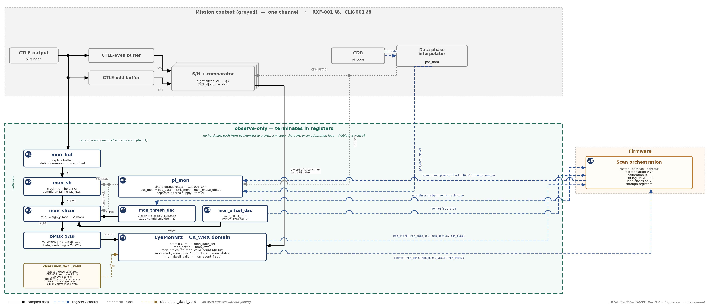

DES-OCI-106G-EYM-001 Rev 0.2 | Companion to ARCH-OCI-106G-001 Rev 0.7 | EYM Design Specification

**400G OCI Line-Side SerDes Chiplet**

**RX Eye Monitor (EyeMonNrz) — Design Specification**

*Companion to ARCH-OCI-106G-001 Rev 0.7 | In-situ 2D eye / BER-contour measurement at the slicer input; observe-only instrument serving DFT-003, DRX-004, ADP-003, MFG-003 | Both operating modes (106.25 / 53.125 GBd)*

| Document ID | DES-OCI-106G-EYM-001 |
| --- | --- |
| Revision | 0.2 (Draft for review) |
| Date | September 21, 2026 |
| Status | DRAFT. Design companion to the Architecture and Requirements Specification ARCH-OCI-106G-001 Rev 0.7. Where this document and Rev 0.7 differ, Rev 0.7 governs. Defined for the 8-way interleaved sample/hold receiver of DES-OCI-106G-CLK-001 Section 8 and DES-OCI-106G-RXF-001 Section 8. Design confidence: Medium for the measurement architecture and the digital block; Low–Medium for the analog monitor slice, whose loading, matching, and settling values are owner deliverables (Section 13). The block is not yet in the behavioural model. |
| Parent requirements | DFT-003 (MPI-detection metric derived from slicer margin — the eye monitor is the proposed margin observable), DFT-004 / REG-009 (BER telemetry statistically consistent with host FEC counters — the mission-point hit ratio is a slicer-level BER estimator), DFT-001/002 (loopback and pattern generators used for absolute-mode characterisation); DRX-004 (statistical-eye closure of the no-DFE architecture — the monitor is the on-silicon confirmation), DRX-005 (slicer offset trim, applied to the monitor comparator), DRX-006 (JTOL — eye-width erosion observable); CDR-001/002/006 (the monitor sampling phase is slaved to the CDR phase-interpolator code and follows its hold), CDR-004 (no mission-path disturbance); ADP-001 (bring-up staging), ADP-002 (telemetry gated invalid during non-mission patterns, squelch, invalid signal), ADP-003 (aggregate dither budget — measured by the monitor, not added to); LOG-002 (2.4E-4 compliance point; 1e-12 internal design point of the contour extrapolation); MGT-003 (scan results logged to the flight data recorder), MGT-004 (margin alarm candidate), MFG-003 (monitor calibrations code_zero_mon / phase_zero_mon in NVM with integrity protection); FW-005 (calibration changes confined to the maintenance state or shown hitless); CMP-005/007/009 (both operating modes, per-mode parameter sets); SYS-008 (pJ/bit). |
| Sibling documents | DES-OCI-106G-CLK-001 — clock generation, distribution, and phase interpolation (owns the monitor phase interpolator pi_mon, the monitor sampling clock CK_MON, the monitor word clock and its alignment: Section 9.4 there; this document consumes them as its horizontal axis); DES-OCI-106G-RXF-001 — RX analog front end (Section 8 there defines the mission slices whose eye is measured; the monitor slice is a replica of them and loads the CTLE output node defined there); DES-OCI-106G-CDR-001 — baud-rate Mueller–Müller CDR (source of pi_code, the 128-UI deserialized word, the signal-valid gate, and the stress patterns); DES-OCI-106G-ADP-001 — adaptation loops (Vp, offset / BLW, AGC, CTLE: the loops whose convergence the monitor cross-checks, and the one-controller-per-node rule the monitor must not break); DES-OCI-106G-JIT-001 Rev 0.2 — TP1 jitter budget (dual-Dirac / Q conventions reused for the contour extrapolation); DES-OCI-106G-CHE-001 and DES-OCI-106G-TDC-001 — RX channel estimator and TX disparity checker (planned, ARCH-OCI-106G-001 Rev 0.7 Table 1-3), the two companion observe-only instruments. |
| Governing specifications | ARCH-OCI-106G-001 Rev 0.7 — DFT, MGT, ADP, CDR, DRX, and CMP families; internal raw-BER design point < 1e-12 FEC-free (Rev 0.7 §3.3) and the 2.4E-4 pre-FEC compliance point (LOG-002). IEEE Draft P802.3dj — dual-Dirac / Q-scale extrapolation conventions as adopted by DES-OCI-106G-JIT-001 Section 3; Annex 174A error-histogram method (VER-007) for correlation. OCI Gen1 Optical PHY Specification v1.0 — VDM observables and MPI metric (Table 3-2) that the monitor feeds. Design inputs: DES-OCI-106G-CLK-001 Section 8 / 9.4 and DES-OCI-106G-RXF-001 Section 8 (interleaved receiver); CDNS “Proposed Interleaved RX Architecture” / “8-Phase S/H Timing” material (2026). |
| Scope | One eye monitor per channel: the monitor slice (replica buffer, sample/hold, comparator, threshold DAC, offset trim) on the CTLE output; the vertical axis (threshold DAC grid); the horizontal axis as consumed from the monitor phase interpolator (slice select, fine offset, slaving); the comparison and accumulation logic EyeMonNrz (hit definition, polarity gating, dwell, counters, handshake, validity flag); the register interface; measurement modes, the firmware raster, dwell / noise-floor / scan-time relations, and the extrapolation to 1e-12; calibration (vertical zero, per-slice horizontal zero) and the diagnostic cross-checks the calibrated monitor enables; non-intrusiveness constraints; dual-rate provisions; power; verification hooks. |
| Out of scope | The monitor phase interpolator, monitor clock branch, word alignment, and clock-coupling limits (DES-OCI-106G-CLK-001 Section 9.4 — this document states what it needs from them); the mission slices, CTLE, buffers, and the slicer-input full-scale (DES-OCI-106G-RXF-001); the CDR loop and the definition of pi_code (DES-OCI-106G-CDR-001); the adaptation loops (DES-OCI-106G-ADP-001); the RX eye budget itself (Rev 0.7 §9 placeholder; the monitor measures it, it does not allocate it); VDM register mapping and CMIS presentation (MGT-001, CMP-010 — management documents); the channel estimator and disparity checker. |

| **Revision** | **Date** | **Change summary** |
| --- | --- | --- |
| 0.1 | September 19, 2026 | Initial issue. Design of the in-situ RX eye monitor per ARCH-OCI-106G-001 Rev 0.6 (DFT-003/004, DRX-004/005, ADP-003, MFG-003): sign-magnitude threshold DAC on the Vp grid, dedicated monitor PI slaved to pi_code with a ±0.5 UI offset, hit = d ⊕ m with polarity gating, dwell-windowed counters, raster procedure, dwell / floor / scan-time table, vertical- and horizontal-zero calibrations, adaptation cross-checks, non-intrusiveness constraints; the monitor defined for the 8-way interleaved sample/hold receiver — the “fourth comparator on the y(k) node” becomes a ninth slice (replica buffer + S/H + comparator) clocked at baud/8 by a dedicated single-output rotator, with a slice-select register k_mon that pairs the monitor with any mission slice and a fine offset of ±16 codes; dwell re-based on monitor samples (one per 8 UI) and the scan-time table stated for one monitor sample per 8 UI (8× longer per point than a full-rate monitor on a common slicer node); per-slice horizontal-zero calibration added, which makes the monitor the observable for the 8-phase skew calibration of DES-OCI-106G-CLK-001 Table 8-2; an absolute (unslaved) test mode added for data-PI characterisation in synchronous loopback; ADP-002 telemetry gating implemented as a sticky dwell-validity flag; monitor architecture alternatives tabled (Table 2-4); the horizontal axis delegated to DES-OCI-106G-CLK-001 Section 9.4 with the interface values stated here; Q(1e-12) aligned to 7.034 (DES-OCI-106G-JIT-001 Table 3-3); ownership placeholders retained as explicit deliverables (Section 13). |
| 0.2 | September 21, 2026 | Re-pinned to ARCH-OCI-106G-001 Rev 0.7 (hub revision; its Section 1.7 indexes this document). Predecessor-document references removed throughout per the OCI 106G document-structure convention: the Status field now states scope and confidence only; provenance statements are replaced by citations of the owning document in the set or by open items; cross-references into DES-OCI-106G-CDR-001 converted from legacy §6-x numbering to its Section numbers. No technical values changed. |

# 1. Introduction

## 1.1 Purpose

The receiver of this program has no accessible electrical test point: the only bench-accessible plane is the optical input TP3, and the electrical eye at the slicer input — the quantity against which the receive eye budget (Rev 0.7 §9), the clocking terms of DES-OCI-106G-CLK-001 Table 8-3, the vertical bookkeeping of DES-OCI-106G-RXF-001 Table 8-3, and the DRX-004 statistical-eye analysis ultimately close — can otherwise only be inferred. The eye monitor measures that eye directly, in situ, during live mission traffic, at sub-UI phase resolution and arbitrary amplitude, without disturbing the mission slicers, the CDR, or the adaptation loops. It is one of three observe-only telemetry instruments (with the channel estimator and the TX disparity checker) and the only one that measures off the mission sampling point.

This document defines the monitor for the 8-way interleaved sample/hold receiver: which node it loads and how, how its two axes are generated, how the monitor decision is compared with the mission decision, what the dwell-windowed counters resolve, how firmware turns the single-point primitive into bathtubs and contours and extrapolates them to the 1e-12 internal design point, how the monitor is calibrated, and what it must not do to the mission path. Values not yet fixed are structured as owner deliverables (Section 13).

## 1.2 Conventions

| **Item** | **Convention** |
| --- | --- |
| Operating modes | 400G OCI mode: 106.25 GBd NRZ, UI = 9.412 ps, slice clock 13.28125 GHz. 200G OCI mode: 53.125 GBd NRZ, UI = 18.824 ps, slice clock 6.640625 GHz. Horizontal quantities are stated in UI and PI codes and apply in both modes; absolute values are given per mode. Vertical quantities are stated in V_LSB,mon codes (no absolute voltage is committed at this interface — see Placeholders). |
| Requirement references | FAMILY-NNN refers to the requirement of that ID in Rev 0.7; §x.y without prefix refers to Rev 0.7. “DES-OCI-106G-CDR-001 Section x.y” refers to that document’s own section numbering; the channel estimator and TX disparity checker are cited by their planned Document IDs (DES-OCI-106G-CHE-001, DES-OCI-106G-TDC-001); “ADP-001 doc” refers to DES-OCI-106G-ADP-001 with the loop named in words (Vp, offset / BLW, AGC, CTLE). CLK = DES-OCI-106G-CLK-001; RXF = DES-OCI-106G-RXF-001; JIT = DES-OCI-106G-JIT-001 Rev 0.2. |
| Signals | y(t) — CTLE output as seen by the mission buffers (RXF Section 8). d(n) — mission data decision for UI n, taken by slice ((n + 4) mod 8) (CLK Table 8-1). e_top / e_bot — mission error-slicer decisions. y_mon(n) — the monitor sample of UI n, taken Δt_mon from the mission sampling instant of that UI. m(n) = +1 if y_mon(n) > V_mon else −1 — monitor decision. hit(n) = d(n) ⊕ m(n). |
| Monitor coordinates | Horizontal: Δt_mon = mon_phase_offset × (1/32 UI), signed, −16 … +15 codes = −0.5 … +0.47 UI about the sampling instant of the selected mission slice k_mon; the eye is periodic in 1 UI, so this range covers it. Vertical: V_mon = s · code · V_LSB,mon, s ∈ {+1, −1}, code ∈ 0 … 255, referenced to code_zero_mon after calibration. The 2D map eye[Δt, V] is the hit ratio at that point. |
| Hit ratio and BER | hit_ratio = mon_hit_count / mon_valid_count over one dwell. With d(n) taken as ground truth, the hit ratio at (Δt, V) is the BER the receiver would suffer if it sliced there — valid below the mission error rate (< 1e-12 internal design point, Rev 0.7 §3.3); near the mission decision point the mission errors themselves bias the reading (Table 6-1). BER points: 2.4E-4 (Q = 3.49, LOG-002 compliance anchor) and 1e-12 (Q = 7.034, internal design point) per JIT Table 3-3. |
| Dwell | D_mon counts monitor samples, not UI: the single monitor slice takes one sample per 8 UI, so a dwell of D_mon samples spans 8 · D_mon UI. The mon_dwell register counts monitor words (16 samples per CK_WMON word at W_rx = 128). Statistical floor per point: hit ratios below 1/D_mon cannot be resolved (single-hit floor); a contour at hit ratio p needs of order 10–100/p samples near the contour for a stable estimate. |
| Owners | CDNS — monitor slice (replica buffer, S/H, comparator, DACs), monitor clocking (CLK Section 9.4), EyeMonNrz RTL, register interface; LM — CTLE / buffer node definition (RXF); Firmware — scan orchestration, calibration policy, VDM derivation; Verification — model-to-silicon correlation. An entry marked “CDNS” (or another owner) in a Target column is a value that owner shall supply; it is tracked in Section 13. |
| Placeholders | TBD = value tracked in the requirements database; TBD_analog_design and TBD_from_sim_sweep mark the closure route. “Working target” = a value proposed here for closure and not yet committed by the owner. Model / RTL names (mon_*) are the register and class names of the behavioural model and RTL. |

## 1.3 Parent requirement map

**Table 1-1. Rev 0.7 requirements satisfied or interfaced by this document**

| **Req ID** | **Rev 0.7 obligation (abridged)** | **Design response** | **Section** |
| --- | --- | --- | --- |
| DFT-003 | Per-channel MPI-detection metric (VDM types 125–128), e.g. derived from slicer margin, sensitive enough to flag links approaching the 0.2 dB MPI allocation. | Eye height / eye width at a target BER from the monitor bathtubs as the slicer-margin observable; derivation of the VDM metric is a firmware deliverable (Table 7-1, Open item 10). | 7, 8 |
| DFT-004, REG-009 | Pre-FEC BER monitors per host stream; chiplet telemetry statistically consistent with host-PCS FEC counters. | The mission-point hit ratio (Δt = 0, V = 0) is a slicer-level disagreement rate, not the line BER; its relation to the host FEC counters is a correlation item (Table 12-1), not a replacement for DFT-004. | 6, 12 |
| DFT-001 / 002 | Line-rate PRBS generation / checking; electrical and optical loopback. | Synchronous electrical loopback with a frozen CDR is the condition for the absolute (unslaved) monitor mode used to characterise the data phase interpolator (Table 4-1). | 4, 8 |
| DRX-004 | Statistical-eye analysis shall demonstrate CTLE-only closure of the SRS condition (gating analysis for the no-DFE architecture). | The measured 2D contour is the on-silicon confirmation of that analysis at the slicer input; contour set and extrapolation conventions in Section 7. | 7 |
| DRX-005 | Slicer input-referred offset trimmable. | Monitor comparator offset trimmed by the vertical-zero calibration (code_zero_mon), with a replica offset DAC as the baseline trim actuator (Table 5-1). | 5, 8 |
| DRX-006 | JTOL mask at both bauds; lock through pattern transitions. | Eye-width erosion under applied SJ / CID stress is directly observable at the slicer (Table 8-2). | 8 |
| CDR-001 / 002 / 006 | PI actuator, ±200 ppm tracking, hold on invalid signal. | Monitor sampling phase slaved to the data-path position so the monitor point tracks the rotating eye centre; follows the CDR hold (Table 4-1; CLK Table 9-4). | 4 |
| CDR-004 | No mission-mode cycle slips; bursts > 7 symbols < 1E-20. | The monitor has its own sampler, comparator, and clock branch: a monitor glitch corrupts only monitor samples. Coupling into the data phase bounded (CLK Table 9-5). | 9 |
| ADP-001 | Nested bring-up: loops frozen until CDR lock, then released in order. | Monitor usable from CDR lock (its horizontal axis needs pi_code); margins meaningful once all loops have converged (Table 9-2). | 9 |
| ADP-002 | Telemetry accumulation gated invalid during non-mission patterns, TX squelch, invalid-signal conditions. | Sticky mon_dwell_valid flag cleared by any gate, re-acquisition, gear-shift, or pattern-freeze event during a dwell; counters hold, firmware discards (Tables 6-2, 9-2). The monitor itself carries no white-data assumption. | 6, 9 |
| ADP-003 | Aggregate loop and CDR dither budgeted within the RX eye margin at 2.4E-4 and 1e-12. | The monitor adds no dither (open-loop, no code to dither) and measures the aggregate dither as part of the eye it sees; observe-only by structure (Table 9-1 item 3). | 6, 9 |
| LOG-002 | 2.4E-4 pre-FEC compliance point; internal 1e-12 design point (Rev 0.7 §3.3). | Contours measured in the 1e-4 … 1e-9 range and extrapolated to 1e-12 with Q(1e-12) = 7.034 (Table 7-2). | 7 |
| MGT-003, MGT-004 | Flight data recorder; alarms per channel. | Scan summaries (eye height / width at BER, calibration values, validity) logged; margin alarm candidate for MGT-004 thresholds (Table 7-1). | 7 |
| MFG-003 | Monitor calibrations stored in NVM with integrity protection. | code_zero_mon and phase_zero_mon[k_mon] per mode (Table 8-1). | 8 |
| FW-005 | Compliance-critical configuration changed only in the maintenance state; changes logged. | Calibration updates in the maintenance state or shown hitless; scan configuration itself is not compliance-critical (observe-only). | 8, 9 |
| CMP-005 / 007 / 009 | Both bauds; UI-relative limits; per-mode parameter sets. | Step 1/32 UI in both modes; scan times double in 200G mode; per-mode calibration set (Table 10-1). | 10 |
| SYS-008 | pJ/bit power target per mode. | Monitor power tally (Table 11-1). | 11 |

# 2. Architecture and Partition

## 2.1 Function and the instrument set

The mission loops already provide two in-situ instruments, both pinned to the data sample phase: the Vp codes digitise |h₀| (ADP-001 doc, Vp loop) and the channel estimator reads back the baud-spaced cursors ĥ_i (DES-OCI-106G-CHE-001, planned; ADP-001 doc Section 5). The eye monitor completes the set: it is the only instrument that measures off the mission sampling point. Comparing the monitor decision m(n) against the mission data decision d(n) and accumulating mismatches over a dwell window yields the hit ratio at any (Δt, V) point; rastering both axes yields the full 2D eye / BER contour.

**Table 2-1. Observe-only RX instruments and what each measures**

| **Instrument** | **Observable** | **Units** | **Coverage** |
| --- | --- | --- | --- |
| Vp_top / Vp_bot codes (ADP-001 doc, Vp loop) | Rail medians = h₀ | V_LSB,vp codes | Vertical, at the data sample phase; converged loop state |
| Channel estimator ĥ_i (DES-OCI-106G-CHE-001 planned; ADP-001 doc Section 5) | Baud-spaced cursors | Normalised (units of σ_e) | Horizontal at baud-spaced lags, at the data sample phase |
| Eye monitor (this document) | Hit ratio / BER at any (Δt, V) point | V_LSB,mon codes × 1/32 UI | Full 2D eye interior, off the data sample point, per selectable mission slice |

What this buys against the committed internal raw-BER design point (< 1e-12, Rev 0.7 §3.3): direct measurement of eye height and eye width at a target BER at the slicer input, where the RX budgets bind, rather than inference from external instrumentation; margin monitoring during live traffic, non-destructively; BER-contour / bathtub estimation and extrapolation toward 1e-12 with the dual-Dirac / Q conventions of JIT Section 3; and — new in the interleaved receiver — a per-slice observable for the sampling-phase skew and decision health of each of the eight mission slices.

## 2.2 Block diagram

**Figure 2-1. Eye monitor block diagram**

*One channel. The monitor is the ninth slice beside the greyed mission path. Block numbers are Table 2-2; names are the Class / RTL names and the Table 6-2 registers. Solid arrows: sampled data; dashed: register and control; dotted: clocks; amber dash: events that clear mon_dwell_valid. The teal boundary is observe-only (Table 9-1): the scan loop closes only through registers. An arch is an unconnected crossing.*

## 2.3 Block partition

A monitor realised as a fourth comparator on a common slicer-input node y(k) presupposes a full-rate receiver. In the 8-way interleaved receiver (CLK Section 8, RXF Section 8) there is no such node: each mission slice samples the CTLE output through its own sample/hold and holds the value for four UI while its three comparators resolve, so the horizontal axis of a monitor cannot be created by re-clocking a comparator — the sampling instant is fixed by the S/H switch. The monitor is therefore a ninth slice: its own sampler, clocked at baud/8 by a dedicated phase, feeding one comparator. Table 2-2 fixes the blocks; Figure 2-1 (Section 2.2) draws them.

**Table 2-2. Blocks of the eye monitor (per channel)**

| **#** | **Block** | **Function** | **Owner** | **Class / RTL name** | **Governing documents** |
| --- | --- | --- | --- | --- | --- |
| 1 | Monitor replica buffer | Scaled replica of a mission CTLE-output buffer, tapping the CTLE output beside the even and odd buffers and driving only the monitor S/H (plus static dummies so that its relative load, and hence its transfer function, matches a mission buffer). Presents a constant input load to the CTLE output regardless of monitor state. | CDNS (LM node) | mon_buf | RXF Section 8 (node); Section 5; Table 9-1 item 1 |
| 2 | Monitor sample / hold | Copy of the mission S/H cell; tracks for 4 UI and samples on the falling edge of CK_MON; hold 4 UI | CDNS | mon_sh | CLK Table 8-1 timing; Section 5 |
| 3 | Monitor comparator | Copy of the mission comparator cell on the monitor hold node; m(n) = sign(y_mon − V_mon); clocked from CK_MON; deliberately operated at decision boundaries | CDNS | mon_slicer | RXF Table 8-2; Section 5 |
| 4 | Monitor threshold DAC | Sign-magnitude V_mon = s · code · V_LSB,mon on the Vp grid; register-driven — terminates a register, not a loop | CDNS | mon_thresh_dac | Section 3 |
| 5 | Monitor offset trim | Replica of the mission offset DAC on the monitor comparator; set once by the vertical-zero calibration | CDNS | mon_offset_dac | DRX-005; Section 5, Section 8 |
| 6 | Monitor phase interpolator and clock branch | Single-output rotator pi_mon slaved to the data-path position plus slice select and fine offset → CK_MON; monitor DMUX 1:16 → CK_WMON word aligned to the selected slice | CDNS (clocking) | pi_mon | CLK Section 9.4, Tables 9-4 / 9-5; Section 4 |
| 7 | Comparison and accumulation | hit = d ⊕ m per monitor sample, polarity gating, dwell-windowed hit / valid counters, settle timer, start / done handshake, dwell-validity flag, register interface | CDNS (RTL) | EyeMonNrz | Section 6 |
| 8 | Scan orchestration | Raster, bathtubs, contour extraction, extrapolation, calibration, VDM derivation, FDR logging | Firmware | — | Sections 7, 8; MGT-003/004, DFT-003 |

*Mapping to the adaptation-loop template of ADP-001 doc (observe → average → vote → scale → DAC): stages 1–2 only, like the channel estimator — observe = per-sample (d, m) pair; average = dwell-window accumulation; no vote, no scale, no DAC. The accumulated value terminates in a readback register, not an actuator. Power is booked in Table 11-1.*

## 2.4 Partition of specifications

**Table 2-3. Where each specification lives**

| **Specification** | **Lives with** | **Rationale** |
| --- | --- | --- |
| Vertical axis: DAC grid, sign convention, range, resolution | This document (Section 3); V_LSB,vp and the slicer-input full-scale in RXF Table 8-2 | The monitor reuses the Vp grid so that monitor codes and Vp readbacks are on one scale. |
| Horizontal axis: monitor PI position law, step, offset range, slaving, skew and jitter bounds, coupling limits, word alignment | CLK Section 9.4 (Tables 9-4 / 9-5); this document states the interface (Table 4-1) and the calibration that uses it (Section 8) | pi_mon is a clocking block slaved to the data PI; its analog properties belong with the clock chain. |
| Monitor slice analog: replica buffer, S/H, comparator, matching and static-load obligations | This document (Section 5) as obligations; cell designs and the CTLE output node in RXF Section 8 | The monitor cells are copies of the mission cells; only the monitor-specific constraints are new. |
| Comparison logic, counters, registers, handshake, validity flag | This document (Section 6) | EyeMonNrz is new RTL with no counterpart in the sibling documents. |
| Scan procedure, measurement modes, dwell / floor / time, extrapolation to 1e-12 | This document (Section 7); Q conventions from JIT Section 3 | Firmware-visible behaviour; the hardware supplies only the single-point primitive. |
| Calibration values and their storage | This document (Section 8); NVM per MFG-003 | code_zero_mon and phase_zero_mon are monitor calibrations in the MFG-003 sense. |
| Mission-path non-intrusiveness | Split: static loading and observe-only policy here (Section 9); clock coupling and idle behaviour in CLK Table 9-5 | Two analog coupling paths and one policy rule; each has one owner. |
| VDM / MPI metric derivation, alarm thresholds, CMIS presentation | Firmware and management documents (DFT-003, MGT-004, CMP-010) | This document supplies the observable and its accuracy, not its presentation. |

## 2.5 Architecture decisions

**Table 2-4. Monitor architecture options in the interleaved receiver**

| **Attribute** | **Option A — monitor slice on a scaled replica buffer (baseline)** | **Alternatives** | **Decision / status** |
| --- | --- | --- | --- |
| Node loaded | CTLE output: one additional buffer input, constant. Mission even / odd buffers untouched. | B — monitor S/H on the CTLE-even buffer with a complementary dummy switch (load constant in time) and a matched static dummy on the odd buffer: no replica buffer, but a permanent extra tracking load on both mission buffers (bandwidth, power). | A. Static-loading constraint (Table 9-1 item 1) is met by construction rather than by a switching scheme. |
| Sampler | Own S/H (copy of the mission cell), track 4 UI / hold 4 UI, sampled on the falling edge of CK_MON. | D — re-clocked comparator on the common slicer node without S/H: not applicable; in the S/H receiver the sampling instant is the switch edge, and a comparator aperture would not reproduce the mission S/H eye. | A. The monitor eye must be the mission eye as the mission slices see it. |
| Coverage | One monitor sample per 8 UI; slice select k_mon pairs it with any of the eight mission slices. Full per-slice characterisation = 8 scans. | C — one monitor S/H + comparator per slice driven by an 8-phase monitor rotator: full-rate coverage (8× faster scans, all slices at once) but doubles the S/H load on both mission buffers and adds eight comparators and DACs. | A; C retained if scan time (Table 6-3) proves binding (Open item 8). |
| What differs from the mission eye | Buffer mismatch (offset, bandwidth) of the scaled replica against the even / odd buffers; monitor S/H and comparator offset; monitor-unique clock jitter and skew. | B shares a mission buffer exactly but loads it; C shares the buffers exactly and loads them twice. | A with calibration: offset and skew calibrated (Section 8); bandwidth match a design obligation (Table 5-1). |
| Horizontal axis | Dedicated single-output rotator slaved to the data position (CLK Section 9.4). | Free-running monitor PI: rejected — the data position rotates at the ppm offset and the monitor point would smear across the eye. | Slaved; source decision retained. |
| Vertical axis | Sign-magnitude DAC on the Vp grid, ±255 codes. | Unipolar per-rail DACs (as Vp): rejected — the monitor must reach both rails and the space between. | Source decision retained. |
| Comparison reference | d(n) of mission slice k_mon (same UI). | External reference pattern: rejected — a pattern checker would make the measurement traffic-dependent. | Source decision retained; traffic-transparent. |

# 3. Vertical Axis — Monitor Threshold DAC (DRX-005, RXF Table 8-2)

The monitor threshold must reach both rails and the space between them, so unlike the unipolar per-rail Vp DACs it is sign-magnitude about the vertical eye centre: V_mon = s · code · V_LSB,mon, s ∈ {+1, −1}, code ∈ 0 … 2^N_code,mon − 1. The grid reuses the Vp LSB, V_LSB,mon = V_LSB,vp. This makes a monitor threshold code directly comparable to the Vp code readbacks — the monitor at s = +1 with code equal to the settled Vp_top code sits on the adapted upper-rail median, a convergence cross-check used in Section 8 — and it makes the monitor’s ±255-code span cover, by construction, everything the 8-bit Vp DACs can represent, with the same margin above the converged rails.

**Table 3-1. Monitor threshold DAC parameters**

| **Placeholder** | **Model / RTL name** | **Default** | **Meaning / constraint** | **Req** |
| --- | --- | --- | --- | --- |
| N_code,mon | mon_dac_bits | 8 (proposed, = Vp dac_bits) | Magnitude code width, codes 0 … 255 per polarity (TBD_analog_design) | RXF Table 8-2 |
| V_LSB,mon | mon_v_lsb | = V_LSB,vp (proposed; TBD — slicer-input full-scale not yet determined) | Threshold LSB; sharing the Vp grid keeps monitor codes and Vp readbacks on one scale. Indicative: with the RXF ≥ 300 mV single-rail range, V_LSB,vp ≈ 1.2 mV | RXF Table 8-2; Open item 1 |
| — | mon_thresh_sign | +1 | Rail select s: +1 = upper half of the eye, −1 = lower half | — |
| — | mon_thresh_code | 0 | Threshold magnitude; code = 0 puts the monitor on the data-slicer level (0 V) — the Section 8 vertical-zero anchor | — |
| Range | — | ±255 · V_LSB,mon (≈ ±300 mV indicative) | Covers the 600 mVpp swing ceiling of RXF Table 8-1 (±300 mV) and hence every converged Vp code; the DAC is referenced to the same vertical centre as the mission thresholds (offset / BLW loop reference) | RXF Tables 8-1 / 8-2 |
| Resolution vs. eye | — | ≈ 42 codes per rail at the 100 mVpp minimum swing; 255 at 600 mVpp (indicative) | Vertical bathtub resolution ≥ 40 points per rail at minimum swing; adequate for contour fitting (Table 7-2) | RXF Table 8-1 |
| DAC settling | — | TBD_analog_design | Covered by the EyeMonNrz settle timer before the dwell opens (Table 6-2); the DAC drives a static comparator reference, so linearity, not speed, is the design driver | CDNS |
| DAC linearity | — | INL ≤ ½ LSB working target (as the Vp DACs) | Vertical accuracy of the measured eye height; the Vp cross-check of Table 8-2 detects grid mismatch | CDNS |

*As with V_LSB,vp and V_LSB,off, no absolute voltage is committed at this interface: the vertical axis is specified symbolically in V_LSB,mon units pending the slicer-input full-scale (RXF Section 8, Open item 1). The indicative millivolt values assume the ≥ 300 mV single-rail range of RXF Table 8-2 divided by 255.*

# 4. Horizontal Axis — Monitor Sampling Phase (CDR-001/002, CLK Section 9.4)

The monitor sample phase comes from a dedicated phase interpolator, pi_mon, separate from the data-path PI, so the monitor point can be swept in time while the mission slices stay pinned to the CDR-recovered sample phase. pi_mon is not free-running: the data-path position is not static in mission mode — the wrapping phase accumulator of DES-OCI-106G-CDR-001 Section 5.1 rotates continuously under a ppm offset and dithers with tracked jitter — and an absolute monitor phase would smear across the eye at the tracking ramp rate. pi_mon therefore receives the data PI’s position every update and adds a programmed displacement, so the monitor point stays at a fixed horizontal offset from the eye centre as the CDR tracks. In the interleaved receiver the displacement has two parts: an integer number of UI that selects which mission slice’s UIs the monitor observes (k_mon), and a fine offset of ±16 codes (±0.5 UI) that sweeps across that UI. The hardware definition is CLK Table 9-4; this section states the interface as the monitor sees it.

**Table 4-1. Horizontal-axis parameters (interface to CLK Section 9.4)**

| **Placeholder** | **Model / RTL name** | **Default** | **Meaning / constraint** | **Source / Req** |
| --- | --- | --- | --- | --- |
| Position law | — | pos_mon = (pos_data + 32 · k_mon + mon_phase_offset) mod 256 | pos_data = 32 · pair + pi_code is the data PI’s full 8-bit position over the 8-UI clk8 period; computed by an adder in the CK_WRX domain every CDR update | CLK Table 9-4; DES-OCI-106G-CDR-001 Section 5.1 |
| N_PI,mon | n_pi_codes_mon | = n_pi_codes = 32 (5-bit per UI) | Monitor-PI resolution; inherits the data-path PI decision, including the DES-OCI-106G-CDR-001 Section 3.3 caveat that 5-bit / ≈ 294 fs is an illustrative operating point | CLK Table 9-1 |
| Span | pi_span_ui_mon | = pi_span_ui = 1.0 UI interpolation interval; rotation modular over 8 UI (256 positions) | Follows the data path (CLK Table 9-2 Option A rotator) | CLK Table 9-1 |
| Phase step | — | 1/32 UI = 294 fs (400G) / 588 fs (200G) | Horizontal scan resolution, identical to the data-path PI code step | DES-OCI-106G-CDR-001 Section 3.1 |
| Slice select | mon_slice_sel (k_mon) | 0; range 0 … 7 | Selects the mission slice whose UIs the monitor observes and whose d(n) it is compared with; UI index n of the 8-UI frame belongs to slice ((n + 4) mod 8) (CLK Table 8-1). Changing k_mon re-aligns the monitor word (Table 6-1) | CLK Tables 8-1 / 8-4 |
| Fine offset | mon_phase_offset | 0; signed −16 … +15 codes = −0.5 … +0.47 UI | Displacement of the monitor sampling instant from the sampling instant of slice k_mon; the eye is periodic in 1 UI, so the range covers the whole eye. Referenced to phase_zero_mon[k_mon] after calibration (Section 8) | Section 4 |
| Slaving | mon_slave_en | 1 (mission): pos_mon tracks pos_data | 0 (test): pos_mon absolute = 32 · k_mon + mon_phase_offset with pos_data forced to zero — used only with a frozen CDR (code override) in synchronous electrical loopback (DFT-002), where the far-end ppm offset is zero; enables data-PI transfer characterisation (Table 8-2) | CLK Table 9-3; DFT-002 |
| Update timing | — | Same CK_WRX cycle as the data PI code; latency matched (CLK Table 9-4) | A latency mismatch Δ displaces the monitor by 244 ppm × Δ during a ramp — ≈ 0.3 fs for Δ = 1.2 ns, negligible; transient (gear-shift) steps invalidate the dwell anyway (Table 9-2) | CLK Table 9-4 |
| Static skew to the data phase | — | Uncalibrated ≤ ±2 codes; residual after phase_zero_mon ≤ 0.25 code (74 fs / 147 fs) — working targets | Calibrated per k_mon by the horizontal-zero procedure; the uncalibrated bound must lie inside the ±16-code offset range with margin | CLK Table 9-4; Section 8 |
| Monitor-unique jitter | — | ≤ 50 fs rms working (pi_mon + monitor branch) | Instrument broadening of the measured bathtub (Table 7-2); common-chain jitter is shared with the data clock and does not broaden it | CLK Tables 8-3 / 9-4 |
| Settling after reprogramming | mon_settle | TBD_analog_design (CDNS) | Phase moves within ≤ 1 update period; analog settling of pi_mon and the monitor DAC is covered by the settle timer before the dwell opens (Table 6-2) | CLK Table 9-4 |
| Hold on signal-invalid | — | Follows the data PI hold; k_mon and offset retained | CDR-006; counters held, not cleared (Table 9-2) | CDR-006 |
| Idle behaviour | — | pi_mon and CK_MON keep running at the parked position when the monitor is disabled | Constant supply signature and coupling regardless of monitor state (Table 9-1 item 2) | CLK Table 9-4 |

**Table 4-2. Sample pairing across the offset range**

| **Case** | **Pairing of m(n) with d(n)** | **Consequence** |
| --- | --- | --- |
| │Δt_mon│ ≤ 0.5 UI (the full fine range) | The monitor sample lies inside the UI of slice k_mon or within half a UI of its edges; the pairing with d(n) of that UI is unambiguous | Word alignment fixed once per k_mon and held across the whole offset sweep (CLK Table 8-4) |
| Offset wrap (−16 ↔ +15) | Firmware never wraps: the raster runs −16 … +15 monotonically; hardware clamps mon_phase_offset to the legal range | No pairing ambiguity; the −0.5 UI and +0.47 UI points are the two eye-edge extremes of the same UI |
| Change of k_mon | The monitor moves by 32 codes per unit of k_mon and the monitor word is re-aligned to the new slice’s word | Requires a fresh settle; any dwell in flight is discarded (Table 6-2 handshake) |
| Absolute mode (mon_slave_en = 0) | The pairing holds only while the CDR is frozen and the loopback is synchronous | Test mode; pairing is re-established when slaving is re-enabled |

*The monitor slicer output crosses from the CK_MON domain into the ≈ 830 MHz deserialized digital domain through its own 1:16 DMUX. Because the monitor is designed to be parked near decision boundaries, its comparator is driven metastable at contour points by construction, and the retiming must resolve metastable outputs to a legal ±1 without corrupting adjacent bus lanes (CLK Table 9-5). The mission data path is unaffected by construction: separate sampler, separate comparator, separate clock branch.*

# 5. Monitor Slice — Replica Buffer, Sample/Hold, Comparator (RXF Section 8, DRX-005)

The monitor slice is built from the mission cells so that its metastability, sensitivity, and input-loading characteristics track the mission slices by construction: the S/H is the mission S/H cell, the comparator is the mission comparator cell (RXF Table 8-2 — one structure for all comparators: sample vs. threshold-DAC voltage), and the offset trim is the mission offset DAC. Only the buffer is monitor-specific: a scaled replica of a mission CTLE-output buffer whose sole purpose is to make the monitor a constant, mission-independent load on the CTLE output while reproducing the mission buffers’ transfer function.

**Table 5-1. Monitor slice — analog obligations**

| **Item** | **Obligation** | **Basis / constraint** | **Req / owner** |
| --- | --- | --- | --- |
| Node tapped | CTLE output, beside the CTLE-even and CTLE-odd buffer inputs (the node y(t) of RXF Section 8) | The mission eye is defined at the mission buffers’ inputs; the monitor must see the same node | RXF Section 8; LM / CDNS |
| Load presented to the CTLE output | One additional buffer input, present and biased whenever the receiver is powered — independent of monitor enable, threshold, phase, and k_mon | Static-loading rule (Table 9-1 item 1): a load that toggled with monitor activity would modulate the very eye being measured. Budgeted in the RXF Section 5 bandwidth allocation from the outset | DRX-004; RXF Table 5-1; Open item 2 |
| Replica scaling | Buffer device sizes and its load scaled by the same factor (working: ¼ of a mission buffer, load = 1 monitor S/H + static dummies) so that the transfer function matches a mission buffer to first order | A mission buffer drives four S/H cells of which two track at any time; the replica reproduces the same relative load and bandwidth at a quarter of the power | CDNS; Open item 2 |
| Buffer matching | Bandwidth and peaking match to the mission buffers TBD (working ± 5 % of the −3 dB frequency); offset calibrated out (code_zero_mon) | Bandwidth mismatch changes the ISI content of the monitor eye relative to the mission eye; it is the dominant unmodelled instrument error and shall be characterised on the test vehicle | DRX-004; Open item 2 |
| Sample / hold | Mission S/H cell; track 4 UI, sample on the falling edge of CK_MON, hold 4 UI; hold-mode bandwidth and kickback per RXF Table 8-1 | CLK Table 8-1 timing applies unchanged; the monitor S/H is the only tracking capacitor on the replica buffer, so the 2-of-4 charge-share settling of the mission buffers does not apply — the dummies are static | CLK Table 8-1; RXF Table 8-1 |
| Comparator | Mission comparator cell on the monitor hold node; regenerates during the 4-UI hold; reference = monitor threshold DAC (Section 3) | Operated at decision boundaries by design: metastable outputs are the normal case and are resolved digitally (Table 6-1) | RXF Table 8-2 |
| Comparator noise and hysteresis | As the mission comparators (RXF Table 8-2, TBD mV rms / TBD mV) | Enter the vertical-bathtub correction (Table 7-2); characterised, not budgeted | RXF Table 8-2 |
| Offset trim | Mission offset DAC (8 bits, V_LSB,off < V_LSB,vp) on the monitor comparator; set once by the vertical-zero calibration; residual stored as code_zero_mon | Baseline keeps the threshold code space unshifted (code 0 = data-slicer level). Alternative — no trim DAC, code_zero_mon absorbs the whole offset — is Option 5-B (Open item 5) | DRX-005; RXF Table 8-2 |
| Threshold DAC reference | Shares the static reference of the mission Vp DACs (one grid) but not any switched node: a monitor code change shall not glitch a mission threshold | Same grid for comparability (Section 3); isolation for non-intrusiveness (Table 9-1 item 4) | CDNS |
| Clocking | CK_MON from pi_mon (CLK Section 9.4); comparator clock and DMUX first stage derived from it inside the slice, as for a mission slice | One clock branch per slice; no CK8_PI load added by the monitor | CLK Tables 8-2 / 9-4 |
| Power | Replica buffer ≈ 1.3 mW (¼ of a 5 mW mission buffer), S/H + comparator ≈ 0.5 mW, DACs ≈ 0.3 mW — working estimates | Table 11-1 | SYS-008 |
| Test access | Comparator output observable at the DMUX; DAC and trim codes readable; slice power-down for A/B loading checks in test only | Table 12-1 non-intrusiveness test | DFT |

# 6. Comparison Logic and Error Accumulation (EyeMonNrz)

Per monitor sample, the monitor decision is compared against the mission data decision of the same UI; a mismatch is a hit. The hit ratio over a dwell window is the BER the receiver would suffer if it sliced at (Δt_mon, V_mon) instead of at the mission decision point, under the assumption that d(n) is ground truth — valid to the committed < 1e-12 internal operating point. No pattern generator or checker is involved, which is what makes the measurement traffic-transparent: the monitor measures the eye as decided by this receiver on whatever traffic is present, not against an external reference pattern.

**Table 6-1. Hit definition, polarity gating, and domain crossing**

| **Item** | **Definition** | **Notes** |
| --- | --- | --- |
| Hit | hit(n) = d(n) ⊕ m(n): (+1, +1) → 0 mark, monitor agrees; (+1, −1) → 1 mark fell below the monitor point; (−1, +1) → 1 space rose above the monitor point; (−1, −1) → 0 space, monitor agrees | d(n) from mission slice k_mon; m(n) from the monitor slice at the same UI index |
| Polarity gate | mon_gate_sel = 0: count all samples (BER mode). +1 / −1: count only samples with d(n) = ±1 (per-rail CDF mode); mon_valid_count counts the samples passing the gate | Rail-CDF mode is used by the Vp cross-check of Table 8-2 (conditional hit ratio ≈ 0.5 at the rail median) |
| Ground-truth bias | Near the mission decision point the reading is P(m ≠ d) ≈ BER_mon + BER_mission; on a healthy link (BER_mission < 1e-12) the bias is negligible for every contour ≥ 1e-9; on a marginal link the contour near the centre is biased high | Contours are measured where BER_mon ≫ BER_mission (Table 7-2); the mission-point reading itself is reported as a disagreement rate, not a BER |
| Word-level implementation | The per-sample XOR and gate are evaluated as a 16-bit mask per monitor word and popcounted (the adder-tree class of the DES-OCI-106G-CDR-001 Section 5 voter), accumulated at CK_WRX; the dwell is counted in monitor words | One monitor word (16 samples) per 128-UI CK_WRX cycle at W_rx = 128; 8 samples per word if W_rx = 64 (CLK Open item 7) |
| Domain crossing | m(n) is deserialized 1:16 in the monitor slice on CK_WMON = CK_MON ÷ 16, whose word boundary is aligned to the CK_WRX word of slice k_mon; the monitor word is then retimed into the CK_WRX domain | Alignment is fixed once per k_mon and holds across the full ±16-code offset range (Table 4-2); mechanism is a CLK deliverable (CLK Tables 8-4 / 9-5) |
| Metastability | Two-stage retiming of the monitor comparator output before deserialization; an unresolved sample resolves to a legal ±1 and never corrupts an adjacent bus lane | The monitor is parked at decision boundaries by design, so this is the normal case, not a corner |
| Dead-band / hysteresis | None, and none needed: open-loop instrument with no code to dither and no vote quantization (as the channel estimator) | The per-point noise floor is statistical (Table 6-3) |
| Template mapping | Stages 1–2 of the ADP-001 doc loop template only — observe (d, m) and average over the dwell; no vote, scale, or DAC | The accumulated value terminates in a readback register, not an actuator (Table 9-1 item 3) |

**Table 6-2. EyeMonNrz registers and placeholders**

| **Placeholder** | **Model / RTL name** | **Default / width** | **Meaning** |
| --- | --- | --- | --- |
| — | mon_enable | 0 | Enables the comparison logic; the monitor slice and pi_mon stay powered and clocked regardless (Table 9-1) |
| — | mon_slice_sel | 0; 3 bits (k_mon = 0 … 7) | Mission slice paired with the monitor (Table 4-1); a write re-aligns the monitor word and clears any dwell in flight |
| — | mon_phase_offset | 0; signed 5 bits, −16 … +15 codes | Fine horizontal offset in 1/32-UI codes (Table 4-1); hardware clamps writes outside the range |
| — | mon_slave_en | 1 | Slaved (mission) / absolute (test) monitor position (Table 4-1) |
| — | mon_thresh_sign, mon_thresh_code | +1; 0 (8 bits) | Vertical axis (Table 3-1) |
| — | mon_offset_trim | From calibration; 8 bits | Monitor comparator offset DAC code (Table 5-1) |
| — | mon_gate_sel | 0; 2 bits | 0 all samples; +1 / −1 rail-CDF mode (Table 6-1) |
| t_settle | mon_settle | TBD_analog_design; 16 bits in CK_WRX cycles | Delay from a threshold / offset / k_mon write (or from mon_start) to the opening of the dwell window; covers pi_mon, DAC, and comparator-reference settling (CLK Table 9-4, Table 3-1) |
| D_mon | mon_dwell | 2^16 words = 2^20 samples = 2^23 UI ≈ 79 µs (proposed, TBD_from_sim_sweep); 32 bits | Dwell per measurement point in monitor words (16 samples each); maximum 2^32 words = 2^36 samples = 2^39 UI ≈ 5.2 s per point (400G), 10.3 s (200G) |
| N_hit | mon_hit_count | 40 bits unsigned | Hit counter; bounded by 2^36 samples at maximum dwell — saturation impossible by construction (as the channel-estimator accumulator) |
| — | mon_valid_count | 40 bits unsigned | Samples passing the polarity gate — the denominator; = dwell in samples when mon_gate_sel = 0 |
| — | mon_start, mon_busy, mon_done | Handshake | Firmware programs (k_mon, offset, s, code), asserts start; hardware waits mon_settle, opens the dwell, counts, snapshots and halts; firmware polls done, reads the counters and the validity flag, reprograms, restarts |
| — | mon_dwell_valid | Sticky, set at dwell open | Cleared by any of: signal-valid gate (CDR-006), CDR re-acquisition or lock de-assert (CDR-005), acquisition gear-shift (CDR-007), adaptation freeze / non-mission-pattern indication (ADP-002), AGC gain step (DRX-003), k_mon or slave-mode write, squelch of this channel’s partner (LOM). Firmware discards the dwell when clear — the ADP-002 gating |
| — | mon_event_flags | Sticky per cause | Which event(s) invalidated the dwell; logged with the scan (MGT-003) |
| — | mon_status | Read-only | Current pos_mon, alignment lock, calibration-loaded flag, pi_mon idle / active |

Dwell, noise floor, and scan time. The single monitor slice takes one sample per 8 UI, so a dwell of D_mon samples spans 8 · D_mon UI — eight times the wall-clock time of a full-rate monitor for the same statistical floor. Table 6-3 states three operating points for the interleaved monitor; a full raster is 32 offsets × 511 thresholds = 16 352 points.

**Table 6-3. Dwell per point, single-hit floor, and scan time (400G mode; 200G mode is 2× every time)**

| **Dwell D_mon (samples)** | **mon_dwell (words)** | **Line time per point** | **Single-hit floor 1/D_mon** | **Full raster (16 352 points)** | **Use** |
| --- | --- | --- | --- | --- | --- |
| 2^20 ≈ 1.05 M | 2^16 | 2^23 UI ≈ 79 µs | ≈ 9.5e-7 | ≈ 1.3 s | Coarse raster; 1e-4 … 1e-5 contours with ≥ 100 hits per contour point |
| 2^26 ≈ 67 M | 2^22 | 2^29 UI ≈ 5.1 ms | ≈ 1.5e-8 | ≈ 83 s | Refinement near the 1e-6 … 1e-7 contours |
| 2^32 ≈ 4.3 G | 2^28 | 2^35 UI ≈ 0.32 s | ≈ 2.3e-10 | ≈ 88 min | 1e-8 … 1e-9 contour points (a few dozen points, not a raster) |
| 2^36 (maximum) | 2^32 | 2^39 UI ≈ 5.2 s | ≈ 1.5e-11 | — | Single-point checks only |
| Practical margin scan: 2^20 on a coarse 8 × 64 grid (512 points), then 2^26 on ≈ 200 points near the contour | 2^16, then 2^22 | ≈ 40 ms + 1.0 s in total | ≈ 9.5e-7, then 1.5e-8 | ≈ 1 s per slice | Mission-time margin monitoring (DFT-003 metric refresh) |
| Per-slice skew scan: 2^20; 32 offsets × 8 slices at V_mon = 0 (256 points) | 2^16 | ≈ 20 ms in total | ≈ 9.5e-7 | — | phase_zero_mon[k] (Section 8); CLK Table 8-2 skew observable |

*Directly resolving the 1e-12 internal-design-point contour is impractical per point (≳ 10³ s for a stable count in the interleaved monitor); the intended methodology is to measure contours in the 1e-4 … 1e-9 range and extrapolate (Table 7-2). Contour-point dwell rule: D_mon ≥ 100 / p gives ≈ 10 % relative error on the hit ratio, which maps to ≤ 0.02 Q-units of error at the fitted point.*

# 7. Measurement Modes, Scan Procedure, and Extrapolation (DRX-004, DFT-003, LOG-002)

The hardware provides only the single-point primitive of Section 6 (program → settle → dwell → read); scan orchestration is firmware over the register interface. A raster is a nested loop over the horizontal offset (−16 … +15 codes) and the vertical threshold (s, code over −255 … +255 on the V_LSB,mon grid) for one selected slice k_mon; each point is programmed, settled for mon_settle, dwelt for mon_dwell, and read back as eye[Δt, V] = mon_hit_count / mon_valid_count with its validity flag. Practical scans run a coarse grid first and refine near the contour of interest (Table 6-3). Every mode below is a subset or a post-processing of the raster.

**Table 7-1. Standard measurement modes**

| **Mode** | **Procedure** | **Output** | **Consumer / Req** |
| --- | --- | --- | --- |
| Vertical bathtub / eye height | k_mon fixed; mon_phase_offset = phase_zero_mon[k_mon] (eye centre); sweep V_mon upward until the hit ratio crosses the target p at V₊(p) and downward to V₋(p) | EH(p) = V₊(p) − V₋(p) in V_LSB,mon units; vertical centre (V₊ + V₋) / 2 | DFT-003 margin metric; RXF Table 8-3 vertical bookkeeping; MGT-004 alarm candidate |
| Horizontal bathtub / eye width | k_mon fixed; V_mon = code_zero_mon (0 V); sweep the offset left and right until the hit ratio crosses p at Δt_L(p) and Δt_R(p) | EW(p) = Δt_R(p) − Δt_L(p) in 1/32-UI steps; horizontal centre | On-die counterpart of the horizontal closure of CLK Table 8-3; DRX-006 stress correlation |
| Full 2D scan / BER contour | Full or coarse-then-refined raster; the locus of hit_ratio = p is the BER-p eye contour | eye[Δt, V]; contour set for p = 1e-4 … 1e-9 | DRX-004 statistical-eye confirmation; extrapolation input (Table 7-2) |
| Per-slice skew scan (new) | V_mon = code_zero_mon; horizontal bathtub for each k_mon = 0 … 7 at a moderate p (1e-4); centre of each bathtub relative to offset 0 | phase_zero_mon[k] (Section 8); the spread across k is the sampling-instant skew of the eight mission slices | CLK Table 8-2 calibration observable; CLK Table 8-3 skew term |
| Per-slice decision health (new) | mon_phase_offset = phase_zero_mon[k_mon], V_mon = code_zero_mon, long dwell, for each k_mon | Mission-point disagreement rate per slice; a slice whose rate stands out has an offset, skew, or comparator problem | Bring-up triage; not a BER (Table 6-1); REG-009 correlation item |
| Rail-CDF mode | mon_gate_sel = ±1; sweep V_mon on the selected rail | Conditional CDF of the rail; median at conditional hit ratio 0.5 | Vp convergence cross-check (Table 8-2) |
| Margin monitoring in mission | Practical margin scan of Table 6-3 repeated at a firmware-chosen cadence per slice; results logged | EH(p), EW(p) trend; alarm when below MGT-004 thresholds (TBD) | DFT-003 VDM MPI metric derivation (Open item 10); MGT-003 FDR |
| Absolute-mode PI characterisation (test) | Synchronous electrical loopback (DFT-002), CDR frozen by code override, mon_slave_en = 0; step pi_code and re-find the bathtub centre against the fixed absolute monitor phase | Data-PI phase vs. code over 256 positions: DNL, INL, monotonicity | CLK Table 9-3 characterisation path; MFG-003 piTable calibration |

## 7.2 Extrapolation to the 1e-12 design point and instrument corrections

Contours are measured where the dwell is affordable and the ground-truth bias negligible (1e-4 … 1e-9) and extrapolated to the 1e-12 internal design point with the same dual-Dirac / Q-scale conventions as JIT Section 3: horizontally per eye side, vertically per rail. Each measured edge position is fitted as x(p) = x_δδ ± Q(p) · σ over the contour set; the intercept and slope give the bounded (dual-Dirac) and Gaussian parts, and the opening at 1e-12 follows from Q(1e-12) = 7.034. The validity bounds of the extrapolation (minimum contour set, fit-residual limits) are TBD_from_sim_sweep (Open item 4).

**Table 7-2. Extrapolation conventions and instrument corrections**

| **Item** | **Convention / correction** | **Notes** |
| --- | --- | --- |
| Q values | Q(1e-4) 3.719, Q(1e-5) 4.265, Q(1e-6) 4.753, Q(1e-7) 5.199, Q(1e-8) 5.612, Q(1e-9) 5.998; Q(2.4E-4) 3.49; Q(1e-12) 7.034 | JIT Table 3-3 (ρ = 1); 7.035 is the same value at different rounding |
| Horizontal fit | Per eye side: Δt_L(p) and Δt_R(p) vs. Q(p), linear fit → σ_L, σ_R (Gaussian) and the dual-Dirac edge positions; EW(1e-12) = Δt_R,δδ − Δt_L,δδ − 7.034 · (σ_L + σ_R) | Minimum three contour levels per side (working); fit residual limit TBD |
| Vertical fit | Per rail: V₊(p), V₋(p) vs. Q(p) → σ_v per rail and the dual-Dirac rail edges; EH(1e-12) likewise | Rail-CDF mode separates the two rails cleanly |
| Monitor-unique jitter | σ_meas² = σ_eye² + σ_u², with σ_u ≤ 50 fs rms characterised per device (CLK Table 9-4); report σ_eye = √(σ_meas² − σ_u²) | At σ_eye = 100 fs the raw bias is +12 fs rms (0.0013 UI) → 0.018 UI pp of pessimism at 1e-12 if uncorrected. Common-chain jitter is shared with the data clock and is not an instrument term |
| Residual monitor skew | ≤ 0.25 code after phase_zero_mon; cancels in EW (both edges shift together) and enters only the eye-centre estimate | CLK Table 9-4 |
| Monitor comparator noise | σ_v,meas² = σ_v,eye² + σ_n,mon², σ_n,mon = mission comparator noise (RXF Table 8-2, TBD mV rms) characterised per device | Adds to the vertical bathtub slope; corrected, not budgeted |
| Threshold quantization | ½ V_LSB,mon per edge | Reported as an uncertainty, not corrected |
| Replica-buffer bandwidth mismatch | Not correctable by fitting; bounded by design (Table 5-1) and characterised on the test vehicle as an eye-width / eye-height bias per mode | Dominant unmodelled instrument error; Open item 2 |
| Statistical error | Relative std of the hit count 1/√(p · D_mon); with ≥ 100 hits per contour point ≈ 10 %, i.e. ≤ 0.02 in Q at the fitted point | Dwell rule of Table 6-3 |
| Ground-truth bias | Negligible for contours ≥ 1e-9 on a link at the < 1e-12 design point; on a marginal link fit only contours with p ≥ 100 × the mission BER estimate | Table 6-1 |
| Reporting | EH(p) and EW(p) at the measured levels, the extrapolated EH / EW at 2.4E-4 and 1e-12 with fit residuals, per slice and per mode, with dwell-validity status; logged to the FDR | MGT-003; DFT-003; VER-007 correlation with FEC histograms |

# 8. Calibration and Diagnostic Cross-Checks (MFG-003, DRX-005, CLK Table 8-2)

The mission slicers get their vertical zero from the offset / BLW loop and their sampling phase from the CDR; the monitor, being outside all loops, needs explicit calibration of both axes. Both calibrations are observe-only, run any time after CDR lock, and are stored per mode in NVM with integrity protection (MFG-003). Slow PVT tracking of the calibration values is a firmware policy, not a hardware loop; updates are made in the maintenance state or shown hitless (FW-005).

**Table 8-1. Monitor calibrations**

| **Calibration** | **Procedure** | **Stored value / use** | **Req** |
| --- | --- | --- | --- |
| Vertical zero (code_zero_mon) | k_mon = 0, mon_phase_offset = 0, mon_slave_en = 1. With V_mon = 0 the monitor replicates the data slicer (m ≡ d = sign(y)), so the hit ratio collapses to the monitor comparator’s own offset and metastability residue. Sweep mon_thresh_code through zero (both signs) and locate the code of minimum hit ratio; trim mon_offset_trim to bring that minimum to code 0 and store the sub-LSB residual | code_zero_mon (one value per mode; the monitor’s own offset, independent of k_mon — verified across k_mon); all threshold programming referenced to it | DRX-005, MFG-003 |
| Horizontal zero (phase_zero_mon[k]) | After the vertical zero: V_mon = code_zero_mon; for each k_mon = 0 … 7 sweep mon_phase_offset and find the horizontal bathtub centre as the midpoint of Δt_L(p) and Δt_R(p) at p ≈ 1e-4 (more robust than the flat minimum); the displacement from offset 0 is the static skew between the monitor phase and the sampling instant of slice k | phase_zero_mon[k], eight values per mode; all horizontal sweeps for slice k referenced to it. Uncalibrated bound ≤ ±2 codes (CLK Table 9-4) keeps it well inside the ±16-code range | MFG-003; CLK Table 9-4 |
| Per-slice skew (derived) | phase_zero_mon[k] − mean_k(phase_zero_mon) — the common monitor term cancels | Sampling-instant skew of the eight mission slices against their ensemble: the observable for the per-phase delay-DAC calibration of CLK Table 8-2 (working residual ≤ 0.02 UI pp) and the per-slice skew term of CLK Table 8-3 | CLK Tables 8-2 / 8-3 |
| Averaging of pi_mon pair mismatch | Because pos_mon is slaved, the monitor’s own interpolation pair cycles through all eight pairs as the CDR rotates: at ≥ 1 ppm far-end offset one full 8-UI rotation completes within a 79 µs dwell, so pi_mon pair-to-pair skew averages out of phase_zero_mon | Holds in mission (the far-end offset is never exactly zero); does not hold in synchronous loopback, where the pair mismatch appears as a k_mon-dependent term — characterised there and stored if not negligible (Open item 7) | CLK Table 9-4 |
| Re-check policy | Both calibrations re-verified at a firmware cadence and after temperature excursions; drift beyond TBD codes triggers a maintenance-state update and an FDR entry | Slow PVT tracking is firmware policy, not a hardware loop | FW-005, MGT-003 |

**Table 8-2. Diagnostic cross-checks enabled by the calibrated monitor**

| **Cross-check** | **Method** | **What a deviation flags / consumer** |
| --- | --- | --- |
| Vp / h₀ (ADP-001 doc, Vp loop) | Rail-CDF mode (mon_gate_sel = +1), s = +1, code = settled Vp_top code (referenced to code_zero_mon): the conditional hit ratio should read ≈ 0.5 — the monitor sitting on the adapted rail median; likewise for Vp_bot | Standing deviation → Vp mis-convergence or V_LSB,mon / V_LSB,vp grid mismatch |
| Offset / BLW (ADP-001 doc, offset loop) | Upper and lower BER contours should be symmetric about V_mon = code_zero_mon beyond the Vp top / bottom asymmetry | Residual vertical-centring error of the mission slicers |
| CTLE (ADP-001 doc, CTLE loop) and channel estimator (DES-OCI-106G-CHE-001, planned) | Eye-opening change across a peaking-code sweep gives a direct margin-vs-code curve; the absolute (code-unit) 2D eye complements the σ_e-normalised ĥ_i readbacks | CTLE lock at a non-optimal peaking code; ISI content vs. the DRX-004 statistical eye |
| AGC (ADP-001 doc, AGC loop) | Eye height vs. gain code; rail medians vs. the AGC target | Gain referral of the LOM-002 absolute threshold (RXF Table 9-1) |
| MM lock point (DES-OCI-106G-CDR-001 Section 4) | Left / right eye-width asymmetry about the data sample phase (offset 0 after phase_zero_mon) cross-checks the h(−1) = h(+1) lock condition, corroborating the ĥ₋₁ vs. ĥ₊₁ comparison of the channel estimator | Lock at a point that is not the maximum-margin point; input to a deliberate sampling-phase offset (CDR document decision) |
| 8-phase skew calibration (CLK Table 8-2) | Per-slice skew from Table 8-1; the per-phase delay DACs are adjusted (foreground, bring-up) until the spread is inside the ≤ 0.02 UI pp working target | Divider / buffer mismatch of the CK8 set; the monitor is the proposed calibration observable |
| Per-slice decision health | Mission-point disagreement rate per k_mon (Table 7-1) | A slice with an offset, skew, or comparator problem; bring-up triage |
| Data-PI transfer (CLK Table 9-3) | Absolute mode in synchronous loopback with a frozen CDR: bathtub centre vs. stepped pi_code over 256 positions | DNL / INL / monotonicity of the data rotator; piTable calibration (MFG-003) |
| Aggregate dither (ADP-003) | Eye width / height with the adaptation loops adapting vs. frozen at their converged codes (maintenance state) | Footprint of the aggregate loop and CDR dither against the ADP-003 allocation |
| JTOL / stress correlation (DRX-006; DES-OCI-106G-CDR-001 Section 7 / 11) | Eye-width erosion under applied SJ or CID stress patterns is directly observable at the slicer | Closes the loop between the mask-derived untracked-jitter allocations (CLK Table 8-3) and the physical eye |
| FEC-counter consistency (REG-009, VER-007) | Extrapolated BER at the mission point vs. host-PCS pre-FEC BER and 17-bin histograms during system qualification | Telemetry coherence across the stack; a correlation item, not a replacement for DFT-004 |

# 9. Non-Intrusiveness and Operating Constraints (ADP-002, ADP-003, CDR-004)

The observe-only property is structural — one controller per node (ADP-001 doc rule 1): every node the monitor observes already has its owner, and the monitor terminates in registers. But two analog coupling paths do not vanish by architecture, and one structural policy rule and one reference-sharing rule must be kept; together they are explicit sign-off items.

**Table 9-1. Non-intrusiveness sign-off items**

| **#** | **Item** | **Requirement** | **How it is met** | **Owner / Req** |
| --- | --- | --- | --- | --- |
| 1 | Static input loading | The monitor’s load on the CTLE output shall be constant regardless of monitor enable, threshold, phase, k_mon, or slave mode — present and biased even when idle. The mission eye with the monitor off shall not differ from the eye while it scans | By construction: the only mission node the monitor touches is the CTLE output, loaded by one always-on replica buffer input (Table 5-1); the sweeping elements (S/H, comparator, DAC) sit behind that buffer. Included in the RXF bandwidth budget from the outset | CDNS / LM; DRX-004; Open item 2 |
| 2 | Monitor-clock coupling | During a scan pi_mon sweeps every phase relative to the data-path clock, so supply / substrate coupling from the monitor branch arrives at the data PI at every possible phase relationship; injected jitter on the data sample phase shall remain negligible against the RX allocations — ≤ 10 fs pp (≈ 0.001 UI) at any pos_mon, working target | Separate filtered supply and routing for pi_mon and the monitor branch; pi_mon runs continuously (idle at a parked position) so the coupling does not change with monitor state; verified by a pos_mon sweep with the on-die TIE monitor on the data phase (CLK Table 9-5) | CDNS clocking; EMC-003, DTX-010 |
| 3 | Future auto-margining stays observe-only | Any feature that acts on monitor results (e.g. margin-triggered re-adaptation, sampling-phase offset) shall gate through firmware policy, never close a hardware loop on a mission node | No hardware path from EyeMonNrz to any DAC or PI code; firmware actions on monitor data are logged (MGT-003) and, if compliance-relevant, confined to the maintenance state (FW-005) | Architecture; ADP-003, FW-005 |
| 4 | Reference and supply sharing | The monitor DAC may share the static Vp reference grid but no switched node; monitor code changes and the metastable monitor comparator shall not glitch a mission threshold or the mission comparators’ supply | Grid sharing for comparability, isolated buffers; local decoupling of the monitor slice; verified by the non-intrusiveness test (Table 12-1) | CDNS |

**Table 9-2. Bring-up and operating constraints**

| **Constraint** | **Statement** | **Basis / Req** |
| --- | --- | --- |
| Enable point | Usable from CDR lock (the horizontal axis is slaved to pi_code); Vp convergence is not required (the comparison reference is d(n), not e(n)); measured margins are fully meaningful once all adaptation loops have converged | ADP-001 nesting; CDR-005 lock |
| Event discard | A dwell overlapping a CDR re-acquisition, lock de-assert, gear-shift, signal-valid gate event, AGC gain step, or a k_mon / slave-mode write is invalid (mon_dwell_valid cleared); firmware discards it and repeats the point | CDR-005/006/007, DRX-003; Table 6-2 |
| White-data assumption | None — unlike the channel estimator the monitor measures the actual eye under whatever traffic is present and needs no freeze for the measurement itself. A contour measured on a periodic pattern (e.g. the 0xCC stress pattern, DES-OCI-106G-CDR-001 Section 11) reflects that pattern’s ISI content, not the mission eye | Table 6-1 |
| ADP-002 gating | Telemetry accumulated during non-mission periodic patterns, TX squelch of the partner, or invalid-signal conditions is marked invalid through mon_dwell_valid (adaptation-freeze indication, LOM, signal-valid gate); counters hold rather than clear, and firmware discards flagged dwells — meeting the ADP-002 obligation without a hardware freeze | ADP-002; Table 6-2 |
| Hold across the signal-valid gate | Counters and registers are held (not cleared) across the CDR-006 gate, consistent with the receiver-wide hold-don’t-wrap convention; the dwell in flight is flagged invalid | CDR-006 |
| Calibration updates | code_zero_mon / phase_zero_mon updates in the maintenance state or shown hitless; every update logged with a timestamp | FW-005, MGT-003 |
| Scan scheduling | Mission-time scans use the practical margin scan of Table 6-3; long-dwell contour points are scheduled by firmware so that FDR logging and VDM refresh cadences are met per channel | DFT-003, MGT-003 |
| Absolute mode | mon_slave_en = 0 only in test (frozen CDR, synchronous loopback); a write while the CDR is tracking is legal but yields meaningless data and clears mon_dwell_valid | DFT-002; Table 4-1 |
| Power-down | The monitor slice and pi_mon are never powered down in mission mode (item 1 and 2 of Table 9-1); a test-only power-down exists for A/B loading verification | Table 5-1 |

# 10. Dual-Rate Provisions (CMP-005, CMP-007, CMP-009)

Every horizontal quantity of the monitor is UI-relative and every vertical quantity is a DAC code, so the measurement definition is identical in both operating modes. What changes is the absolute value of a step, the wall-clock time of a dwell, and the per-mode calibration set.

**Table 10-1. Monitor parameters per operating mode**

| **Item** | **400G OCI mode** | **200G OCI mode** | **Notes / Req** |
| --- | --- | --- | --- |
| Monitor sample rate | 13.28125 GSa/s (one per 8 UI) | 6.640625 GSa/s | CK_MON = baud/8 (CLK Table 2-2) |
| Horizontal step | 1/32 UI = 294 fs | 1/32 UI = 588 fs | CLK Table 9-4; same code space |
| Fine offset range | ±0.5 UI = ±4.71 ps | ±0.5 UI = ±9.41 ps | Table 4-1 |
| Vertical grid | V_LSB,mon = V_LSB,vp; ±255 codes | Same (slicer-input swing window unchanged, RXF Table 8-1) | Section 3 |
| Dwell in words / samples | Unchanged registers | Unchanged | Table 6-2 — the word carries 16 samples in both modes at W_rx = 128 (8 if W_rx = 64, CLK Open item 7) |
| Wall-clock time per point | 2^20 samples ≈ 79 µs | ≈ 158 µs | Table 6-3 ×2; full raster ≈ 2.6 s at 2^20 |
| Calibration set | code_zero_mon, phase_zero_mon[0 … 7], mon_settle | Separate set | Loaded with the CMP-009 parameter set before port enable; stored per mode (MFG-003) |
| Monitor-unique jitter, skew (absolute) | ≤ 50 fs rms; ≤ 0.25 code = 74 fs residual | Same fs; 147 fs (0.25 code) | Hardware values are fixed in fs (CLK Table 9-4); half the UI fraction in 200G mode |
| Extrapolation | Same Q table; UI-relative results | Same | Table 7-2; report per mode |
| Regression | Full Table 12-1 matrix | Repeated at 53.125 GBd (Open item 13) | CMP-007 |

# 11. Power and Area (SYS-008)

The monitor’s power is booked in the SerDes energy line of the SYS-008 tally (RX slicers + clocking + RX logic, TBD pending PMA closure). The interleaved monitor adds one scaled replica buffer, one S/H, one comparator with two DACs, one single-output rotator with its clock branch and DMUX, and a small digital block. Working estimates are given so that the SYS-008 tally can carry a number; all are CDNS deliverables.

**Table 11-1. Eye-monitor power and area (per channel)**

| **Block** | **400G OCI mode** | **200G OCI mode** | **Status / notes** |
| --- | --- | --- | --- |
| Monitor replica buffer (¼-scale) | ≈ 1.3 mW | ≈ 1.3 mW | Working estimate: ¼ of a 5 mW mission buffer (CLK Table 12-1 books 10 mW for the two mission buffers) |
| Monitor S/H + comparator | ≈ 0.5 mW | ≈ 0.3 mW | One of 24 mission comparators ≈ 0.4 mW at 13.28 GHz (10 mW / 24); scales with clock rate |
| Threshold DAC + offset trim | ≈ 0.3 mW | ≈ 0.3 mW | Static references |
| Monitor PI, clock branch, monitor DMUX first stage | TBD — ≈ 3 mW working | TBD | CLK Table 12-1 / Section 9.4 |
| EyeMonNrz (16-bit mask, popcount, 40-bit accumulators, registers) | < 0.5 mW | < 0.3 mW | At 830 / 415 MHz; the adder tree is one-eighth of the CDR voter class |
| Total | ≈ 5.5 mW ≈ 0.05 pJ/bit | ≈ 5 mW ≈ 0.10 pJ/bit | Against 0.94 pJ/bit for the RX EIC (CLK Table 12-1); no power-down in mission (Table 9-2) |
| Area | TBD — one slice equivalent plus a rotator; the replica buffer and static dummies dominate | — | CDNS |

# 12. Verification

The slicer input is not bench-accessible, so the monitor is verified in three stages: model (Python behavioural model and RTL against it), extracted-view simulation of the monitor slice and its clock branch, and silicon correlation of the monitor’s eye against external instruments where a reference exists — the electrical loopback eye at the SerDes and the optical stress conditions at TP3. S = simulation, M = model / RTL, V = test vehicle, T = system test, A = analysis, O = on-die instrumentation.

**Table 12-1. Verification matrix**

| **Req** | **Item** | **Method** | **Condition** | **Pass criterion** |
| --- | --- | --- | --- | --- |
| Section 6 | EyeMonNrz logic | M | RTL vs. the Python model: hit / gate / popcount / dwell / handshake / validity flag over randomised (d, m) streams including metastable-resolution corner cases | Bit-exact counters; no saturation at maximum dwell; validity flag cleared by every listed event and by nothing else |
| Section 3 | Threshold DAC | S / V | INL / DNL over ±255 codes, PVT; grid match to the Vp DACs | INL ≤ ½ LSB working; monitor-at-Vp-code reads 0.5 ± statistical error in rail-CDF mode (Table 8-2) |
| Section 5, DRX-004 | Replica-buffer match and static loading | S / V | Transfer function of the replica vs. mission buffers over PVT; CTLE-output load with monitor enabled / disabled / sweeping and with the test-only monitor power-down | Bandwidth match within the Table 5-1 target; no measurable change of the mission eye or CTLE bandwidth with monitor state (working: < 0.5 % of the −3 dB frequency) |
| CLK Section 9.4 | Horizontal axis | S / V / O | pos_mon vs. commanded position over 256 positions; k_mon 0 … 7; offset −16 … +15; skew calibration convergence; monitor-unique jitter; coupling sweep | Per CLK Table 13-1 (≤ ±2 codes uncalibrated, ≤ 0.25 code residual, ≤ 50 fs rms, ≤ 10 fs pp coupling); alignment held across the sweep |
| Sections 6–7 | Single-point primitive and raster | S / T | Extracted monitor slice on a simulated stressed eye; silicon: electrical loopback (DFT-002) with PRBS31 at both bauds | Measured bathtubs match the simulated eye within the Table 7-2 instrument terms; scan times per Table 6-3 |
| DRX-004, LOG-002 | Contour extrapolation | A / T | Contours 1e-4 … 1e-9 fitted per Table 7-2; comparison with a long-dwell direct point at 1e-9 … 1e-10 and with the DRX-004 statistical-eye prediction | Extrapolated vs. direct point within the fit-residual limit (TBD, Open item 4); prediction agreement within the instrument terms |
| Table 9-1 | Non-intrusiveness | T | Mission BER (PRBS checker, DFT-001) and CDR / adaptation observables recorded with the monitor idle, scanning the full raster, and parked at each of the 256 positions; both bauds; stressed input (SRS condition, VER-004) | No statistically significant change of mission BER, FEC histogram (VER-007), CDR phase dither, or loop codes with monitor state |
| Section 8 | Calibrations | T | code_zero_mon and phase_zero_mon[k] repeatability across temperature and after power cycles; NVM round-trip with integrity check | Repeatability ≤ 1 code vertical, ≤ 0.25 code horizontal (working); MFG-003 integrity behaviour |
| CLK Table 8-2 | Per-slice skew observable | T / O | Per-slice skew scan vs. an independent phase measurement on the test vehicle (probe access to the CK8 set) | Agreement within 0.25 code; skew calibration converges to ≤ 0.02 UI pp |
| CLK Table 9-3 | Absolute-mode PI characterisation | T | Synchronous loopback, frozen CDR, mon_slave_en = 0; pi_code stepped over 256 positions | Data-PI DNL / INL / monotonicity per CLK Table 9-1 targets; piTable calibration loads |
| DRX-006 | Stress correlation | T | Applied SJ per the JTOL mask and CID stress patterns at TP3; eye width tracked | Eye-width erosion consistent with the untracked-jitter allocation of CLK Table 8-3 |
| ADP-002 | Telemetry gating | T | Non-mission pattern, partner squelch, LOS injected during dwells | Every affected dwell flagged invalid; counters hold; no wrap |
| REG-009, DFT-003 | Telemetry consistency | T / A | Extrapolated mission-point BER and margin metric vs. host-PCS pre-FEC BER and 17-bin histograms across MPI injection and thermal transients | Coherent trend; MPI metric flags links approaching the 0.2 dB allocation (threshold TBD) |
| CMP-007 | Dual-rate | T | Full matrix repeated at 53.125 GBd with the 200G parameter set | UI-relative results within the same criteria |

# 13. Open Items and Owner Deliverables

Items marked TBD in this document are collected here with their owner and closure route. Items 2, 3, and 4 gate the first correlation of the monitor against a simulated eye; item 1 gates any absolute vertical claim.

**Table 13-1. Open items**

| **#** | **Item** | **Owner** | **Dependency / closure** |
| --- | --- | --- | --- |
| 1 | Slicer-input full-scale and V_LSB,vp, hence V_LSB,mon and the absolute vertical range of the monitor (Table 3-1); confirm ±255 codes cover the 600 mVpp swing ceiling | LM / CDNS (RXF) | RXF Table 8-2 (Open item there); DRX-005 |
| 2 | Monitor replica buffer: scaling factor, bandwidth match target to the mission buffers (working ± 5 %), static dummy load, and confirmation that the added CTLE-output load fits the RXF Section 5 bandwidth allocation; characterisation of the residual bandwidth mismatch as an instrument bias (Tables 5-1, 7-2) | CDNS / LM | RXF Table 5-1; DRX-004; test vehicle |
| 3 | Monitor phase interpolator values from CLK Section 9.4: uncalibrated skew (±2 codes), per-pair skew, monitor-unique jitter (50 fs), coupling limit (10 fs pp), settling time after reprogramming (mon_settle), and the k_mon word-alignment mechanism (Tables 4-1, 6-2) | CDNS clocking | CLK Table 9-4 / 9-5 and CLK Open item 17 |
| 4 | Dwell defaults and extrapolation validity: minimum contour set, fit-residual limits, and the D_mon ≥ 100 / p rule to be confirmed by simulation sweep on stressed eyes; direct 1e-9 … 1e-10 points as the check (Tables 6-3, 7-2) | Verification / architecture | TBD_from_sim_sweep; DRX-004 statistical eye |
| 5 | Monitor comparator offset: replica offset-trim DAC (baseline) vs. code_zero_mon absorbing the whole offset (Option 5-B); trim resolution vs. V_LSB,off (Table 5-1) | CDNS | TBD_analog_design; DRX-005 |
| 6 | Settle time mon_settle after threshold, offset, and k_mon writes; pi_mon and DAC settling to ≤ ¼ code / ¼ LSB (Table 6-2) | CDNS | TBD_analog_design; CLK Table 9-4 |
| 7 | Per-k_mon storage of phase_zero_mon (eight values) vs. a single value plus a pi_mon pair-skew table; depends on the pair-to-pair skew of pi_mon measured in synchronous loopback (Table 8-1) | CDNS / firmware | CLK Table 9-4; MFG-003 NVM budget |
| 8 | Scan time: the single-slice monitor is 8× slower per point than a full-rate monitor; confirm the practical margin scan (≈ 1 s per slice) meets the DFT-003 refresh cadence, else revisit Option C (monitor comparator per slice) of Table 2-4 | Architecture / firmware | Table 6-3; MGT-004 alarm latency (TBD) |
| 9 | Event sources for mon_dwell_valid: exact signal set (CDR lock / gate / gear-shift, adaptation-freeze indication, AGC step, LOM) and their latencies relative to the dwell window (Table 6-2) | CDNS RTL / CDR / ADP | DES-OCI-106G-CDR-001 §6-11; DES-OCI-106G-ADP-001; ADP-002 |
| 10 | Derivation of the DFT-003 VDM MPI metric and the MGT-004 margin alarm from EH(p) / EW(p): which p, which slice aggregation, thresholds; consistency with the Vp-code-based candidate of RXF Table 9-1 | Firmware / management | DFT-003; MGT-004 thresholds (Rev 0.7 §9) |
| 11 | Document homes for the companion instruments: channel estimator (DES-OCI-106G-CHE-001) and TX disparity checker (DES-OCI-106G-TDC-001); cross-references in Tables 2-1 and 8-2 to be updated when issued | Architecture | ARCH-OCI-106G-001 Rev 0.7 Table 1-3 (planned documents) |
| 12 | Behavioural model: EyeMonNrz and the monitor slice are not yet in the Python model; add with the interleaved sample pairing, the validity flag, and the instrument terms of Table 7-2 so that RTL verification (Table 12-1) has its reference | Architecture / CDNS | Model release |
| 13 | 200G-mode confirmation of the full Table 12-1 matrix and of the per-mode calibration set | Verification | CMP-007 / CMP-009 |
| 14 | Test-only power-down of the monitor slice for A/B loading verification: confirm it does not compromise the mission-mode always-on rule (Table 9-2) — e.g. fuse or maintenance-state lock | CDNS / firmware | Table 9-1 item 1; FW-005 |

*End of DES-OCI-106G-EYM-001 Rev 0.2.*

DES-OCI-106G-EYM-001 Rev 0.2 | DRAFT | Page  of