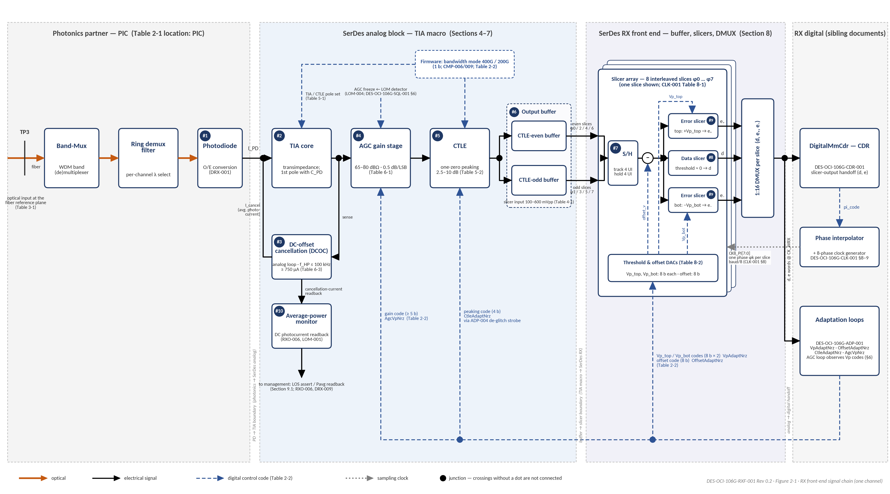

DES-OCI-106G-RXF-001 Rev 0.2 | Companion to ARCH-OCI-106G-001 Rev 0.7 | RXF Design Specification

**400G OCI Line-Side SerDes Chiplet**

RX Analog Front End — TIA, CTLE, AGC, and Slicer Interface — Design Specification

*Companion to ARCH-OCI-106G-001 Rev 0.7 | Design decomposition of DRX-001..005, RXO-003/004, CMP-006/009 | Both operating modes (106.25 / 53.125 GBd)*

| **Document ID** | DES-OCI-106G-RXF-001 |
| --- | --- |
| **Revision** | 0.2 (Draft for review) |
| **Date** | September 21, 2026 |
| **Status** | DRAFT. Design companion to the Architecture and Requirements Specification ARCH-OCI-106G-001 Rev 0.7. Where this document and Rev 0.7 differ, Rev 0.7 governs. Design confidence: Medium for the TIA / CTLE / AGC macro; the slicer front end (Section 8) is a placeholder set awaiting owner values. |
| **Parent requirements** | DRX-001 (photodetector targets), DRX-002 (TIA noise from sensitivity), DRX-003 (gain range / AGC, no overload, gain step vs. CDR), DRX-004 (CTLE range, receive bandwidth 64–80 GHz), DRX-005 (slicer offset trim, threshold servo, AC-coupling corner); RXO-001/002 (sensitivity, SRS), RXO-003 (BER floor, no overload), RXO-004 (Pavg range, damage threshold), RXO-006 (LOS from an average-power monitor independent of the data path); CMP-006 (200G-mode bandwidth configuration), CMP-009 (per-mode gain ranges and thresholds); ADP-005 (BLW ≤ 0.05 dB over 72 UI); LOM-001/002/004 (gain-referred detection, AGC interaction); DRX-009 (LOS calibration); DTX-010 (PSRR, applied to the receive rails); EMC-003; ROB-001. |
| **Sibling documents** | DES-OCI-106G-ADP-001 — digital adaptation loops that command the AGC, CTLE, threshold, and offset codes defined here; DES-OCI-106G-CDR-001 — CDR consuming the slicer outputs; DES-OCI-106G-SQL-001 — loss-of-modulation detector consuming the monitors of Section 9. |
| **Governing specifications** | OCI Gen1 Optical PHY Specification v1.0 Tables 2-3 / 2-4 (200G-mode receiver limits); 400G-mode receiver baseline per Rev 0.7 §1.5 B3 (3 dB power offset); IEEE P802.3dj Cl.180 receiver class (5 dBm damage threshold). RXTIA partner specification (referenced as “RXTIA spec”; values quoted for comparison only). |
| **Scope** | One combined analog macro per channel — photodiode interface, transimpedance amplifier with DC-offset cancellation, AGC gain stage, CTLE peaking equalizer, output buffer — plus the SerDes receive front end it drives: sample/hold (if present), data slicer, dual error slicers, threshold and offset DACs, and the average-power monitor. Electrical parameters, link-budget derivations, mode-dependent settings, control interfaces to the digital loops, monitors, verification hooks. Four instances per fiber port. |
| **Out of scope** | Ring demux filter and its lock servo (DRX-007/008); adaptation-loop algorithms (DES-OCI-106G-ADP-001); CDR (DES-OCI-106G-CDR-001); LOS / LOM decision logic (RXO-006, DES-OCI-106G-SQL-001); deskew and D2D (BUP, SYS families). |

| **Revision** | **Date** | **Change summary** |
| --- | --- | --- |
| 0.1 | September 18, 2026 | Initial issue. Design decomposition of DRX-001..005, RXO-003/004, and CMP-006/009 per ARCH-OCI-106G-001 Rev 0.6; receive-chain bandwidth stated against the DRX-004 window (64–80 GHz in 400G mode, 32–40 GHz in 200G mode) with the 60 GHz first-cut and the RXTIA ≥ 50 GHz minimum flagged as below the window; 200G OCI mode column added to every mode-dependent table (CMP-006/009); the DRX-002 noise derivation chain laid out with its inputs; the ADP-005 baseline-wander check of the 100 kHz DCOC corner computed for both modes; the gain-range × input-current vs. output-swing consistency check added and flagged; the slicer-front-end placeholders (“?”) structured into owner deliverables with the code widths already fixed in DES-OCI-106G-ADP-001; the average-power monitor identified as the RXO-006 / LOM-001 observable. |
| 0.2 | September 21, 2026 | Re-pinned to ARCH-OCI-106G-001 Rev 0.7 (hub revision; its Section 1.7 indexes this document). Predecessor-document references removed throughout per the OCI 106G document-structure convention: the Status field now states scope and confidence only; provenance statements are replaced by citations of the owning document in the set or by open items; cross-references into DES-OCI-106G-CDR-001 converted from legacy §6-x numbering to its Section numbers. No technical values changed. |

# 1. Introduction

## 1.1 Purpose

This document is the design decomposition of the receive analog front end of ARCH-OCI-106G-001 Rev 0.7: the DRX-001..005 budget allocations, the RXO-003/004 range and overload obligations, and the dual-rate provisions of CMP-006/009, applied to the combined TIA / CTLE / AGC macro and the slicer front end it drives. It fixes the electrical parameter set, derives the mode-dependent values, defines the control and monitor interfaces to the digital loops and detectors, and maps each item back to its requirement.

## 1.2 Conventions

| **Item** | **Convention** |
| --- | --- |
| Operating modes | 400G OCI mode: 106.25 GBd NRZ, UI = 9.412 ps, Nyquist 53.125 GHz. 200G OCI mode: 53.125 GBd NRZ, UI = 18.824 ps, Nyquist 26.5625 GHz. Bandwidth, gain range, target amplitude, and thresholds are stored and reloaded per mode (CMP-006/009); the hardware is shared. |
| Requirement references | FAMILY-NNN refers to the requirement of that ID in Rev 0.7; §x.y without prefix refers to Rev 0.7. |
| Reference planes | TP3 — optical input at the fiber reference plane (Rev 0.7 §4.2). PD — photocurrent at the photodiode, after coupling loss and demux. Slicer input — differential voltage at the comparator inputs, after buffer. |
| “RXTIA spec” | The partner TIA specification. Its values appear in a comparison column only; they are not requirements of this document. Where they fall short of a Rev 0.7-derived value, the gap is an open item (Section 12). |
| Gain | Transimpedance gain in dBΩ = 20·log10(Z_T / 1 Ω), differential output over differential input current, at the reference plane stated in the table. The reference plane for the RXTIA values is itself an open item (Section 6.1). |
| Codes | Digital control codes for gain, peaking, threshold, and offset are owned by the loops of DES-OCI-106G-ADP-001; this document fixes the analog range, step, and mapping each code commands. |
| Placeholders | TBD = value tracked in the requirements database; not yet fixed by analysis or by the owner. |

## 1.3 Parent requirement map

**Table 1-1. Rev 0.7 requirements satisfied or interfaced by this document**

| **Req ID** | **Rev 0.7 obligation (abridged)** | **Design response** | **Section** |
| --- | --- | --- | --- |
| **DRX-001** | PD responsivity, dark current, capacitance, bandwidth derived to make RXO-001 achievable; PD capacitance treated as the primary sensitivity-limiting term (risk R2). | PD interface table with the four targets as inputs to the noise chain. | 3.2 |
| **DRX-002** | TIA input-referred noise back-computed from −5.2 dBm OMA at BER 2.4E-4 (Q ≈ 3.5) through responsivity and coupling loss over the 400G bandwidth; mode-to-mode sensitivity delta reported against the 3 dB allowance. | Derivation chain Table 3-2; 4 µA rms first-cut allocation with integration band 1.5 × Nyquist per mode; realized delta is a verification item. | 3.2, 7 |
| **DRX-003** | Gain range from sensitivity floor to +2 dBm OMA (+3 dBm avg) without overload; 200G ranges per CMP-009; gain-step switching shall not disturb CDR lock. | 65–80 dBΩ in 0.5 dB steps (≥ 14 dB link-budget requirement); overload range 160–700 µA pp; step is a constant fractional amplitude change. | 6 |
| **DRX-004** | CTLE peaking range/shape opens the 3.4 dB SEC eye; overall RX bandwidth 0.6–0.75 × baud (64–80 GHz; 32–40 GHz in 200G mode). | Bandwidth allocation Table 5-1; peaking 2.5–10.0 dB in 0.5 dB steps; statistical-eye closure is the gating analysis (risk R2). | 5 |
| **DRX-005** | Slicer offset trimmable; threshold-adaptation servo tracks BLW; AC-coupling corner co-designed with deskew-pattern and NRZ LF content at both rates. | DCOC high-pass 100 kHz with the ADP-005 check; threshold and offset DACs Table 8-2. | 6.3, 8 |
| **RXO-003 / RXO-004** | BER floor ≤ 1E-6 over (−5.2 + TDEC) to +2 dBm OMA with no TIA/AGC overload; Pavg −8 to +3 dBm; survive 5 dBm continuous. | Optical-to-electrical range Table 3-1; overload and DC-cancellation currents Table 6-2. | 3.1, 6.2 |
| **RXO-006 / DRX-009** | LOS from an average-power monitor independent of the data path, −16 / −13.5 / −11 dBm AOP with 1–3 dB hysteresis; calibration accuracy shared with ±2 dB power reporting. | The DCOC photocurrent readback is the average-power monitor (Table 9-1). | 9 |
| **CMP-006 / CMP-009** | 200G-mode bandwidth configuration 32–40 GHz; per-mode gain ranges, thresholds, and bandwidth settings reloaded on mode change. | Per-mode columns throughout; switching mechanism is an open item (Rev 0.7 §9). | 5.1, 6 |
| **ADP-005** | AC-coupling / DCOC corner holds BLW ≤ 0.05 dB over 72-UI CID (678 ps / 1.36 ns). | 100 kHz corner gives ≈ 0.004 / 0.007 dB — compliant with > 10× margin (Table 6-3). | 6.3 |
| **LOM-001 / LOM-002 / LOM-004** | LOM = AND of (average power above LOS de-assert) and (gain-referred amplitude metric below threshold); adaptive Vp not the reference; detector tracks AGC code or freezes AGC. | Monitor and calibration interfaces Table 9-1; gain-code-to-dBΩ table stored in NVM. | 9 |
| **DTX-010 / EMC-003 / ROB-001** | PSRR per rail; crosstalk within the RX eye budget; CDM ≥ 250 V. | Robustness interfaces Table 9-2. | 9.2 |
| **SYS-008** | pJ/bit power target per mode. | Power allocation Table 10-1. | 10 |

# 2. Architecture

## 2.1 Macro partition

**Table 2-1. Blocks of the receive analog front end (per channel)**

| **#** | **Block** | **Function** | **Location** | **Commanded by** | **Governing requirements** |
| --- | --- | --- | --- | --- | --- |
| 1 | Photodiode | Optical-to-current conversion after the ring demux | PIC | — (bias) | DRX-001, RXO-004 |
| 2 | TIA core | Transimpedance amplification; sets input-referred noise and the first bandwidth pole with the PD capacitance | TIA macro | — | DRX-002, DRX-004 |
| 3 | DC-offset cancellation (DCOC) | Removes average photocurrent (≥ 750 µA); sets the high-pass corner; its cancellation current is the average-power readback | TIA macro | Analog loop (autonomous) | DRX-005, ADP-005, RXO-006 |
| 4 | AGC gain stage | Programmable transimpedance / post-gain, linear-in-dB | TIA macro | AGC loop code (ADP-001 §6) | DRX-003, CMP-009 |
| 5 | CTLE | Peaking equalizer, one-zero class; only equalization in the receiver (no DFE/FFE/DSP) | TIA macro | CTLE loop code (ADP-001 §8) | DRX-004, CMP-006 |
| 6 | Output buffer | Drives the SerDes slicer front end at the defined swing and common mode | TIA macro / SerDes boundary | — | Section 8 |
| 7 | Sample / hold (if used) | Optional track-and-hold ahead of the comparators | SerDes RX | — | Section 8; Open item 9 |
| 8 | Data slicer | Decision d at threshold ≈ 0 (offset-corrected) | SerDes RX | Offset DAC (ADP-001 §7) | DRX-005 |
| 9 | Error slicers (top, bottom) | Signed error e against ±Vp rails for the MM CDR and the adaptation loops | SerDes RX | Vp_top / Vp_bot DACs (ADP-001 §4) | DRX-005, CDR-001 |
| 10 | Average-power monitor | DC photocurrent readback, independent of the data path | TIA macro → management | — | RXO-006, LOM-001, DRX-009 |

## 2.2 Block diagram

**Figure 2-1. RX front-end signal chain block diagram**

*One channel shown. Block numbers refer to Table 2-1; control codes to Table 2-2; ownership zones follow the Location column of Table 2-1. Solid arrows: signal path (optical in orange); dashed: digital control codes; dotted: sampling clock.*

## 2.3 Control interfaces

**Table 2-2. Digital codes commanding the analog front end (widths per DES-OCI-106G-ADP-001)**

| **Knob** | **Code width** | **Step (LSB)** | **Range (400G mode)** | **Mapping** | **Owner loop / doc** |
| --- | --- | --- | --- | --- | --- |
| **AGC gain** | ≥ 5 bits (30 codes needed; TBD) | 0.5 dB | 65–80 dBΩ | Linear-in-dB about mid-scale | AgcVpNrz — ADP-001 §6 |
| **CTLE peaking** | 4 bits | 0.5 dB | 2.5–10.0 dB | peaking_dB = 2.5 + code · 0.5 | CtleAdaptNrz — ADP-001 §8 |
| **Vp_top, Vp_bot thresholds** | 8 bits each | V_LSB,vp (TBD) | 0 … 255 · V_LSB,vp | Threshold = code · V_LSB,vp | VpAdaptNrz — ADP-001 §4 |
| **Offset** | 8 bits | V_LSB,off (TBD; < V_LSB,vp) | ±128 · V_LSB,off | offset_v = (code − 128) · V_LSB,off, subtracted ahead of the slicers | OffsetAdaptNrz — ADP-001 §7 |
| **Bandwidth mode** | 1 bit (or per-mode register set) | — | 64–80 GHz / 32–40 GHz | Selects the 400G or 200G receive-chain configuration | Firmware, CMP-006 |
| **AGC freeze** | 1 bit | — | — | Holds the gain code during LOM candidate evaluation | LOM detector, LOM-004 |

# 3. Link-Budget Derived Targets

## 3.1 Optical input ranges

**Table 3-1. Optical conditions at TP3 the front end must serve (Rev 0.7 Table 4-1)**

| **Condition** | **400G OCI mode** | **200G OCI mode** | **Front-end obligation** | **Req** |
| --- | --- | --- | --- | --- |
| **Sensitivity (OMA), BER 2.4E-4, PRBS31** | ≤ max(−5.2, −6.6 + TDEC) dBm | ≤ max(−8.2, −9.6 + TDEC) dBm | Noise floor (Section 7) at maximum gain | RXO-001, DRX-002 |
| **Stressed sensitivity (OMA), SEC 3.4 dB, aggressors active** | ≤ −3.2 dBm (aggressors −0.2 dBm) | ≤ −6.2 dBm (aggressors −3.2 dBm) | CTLE-only eye opening; crosstalk (Section 5) | RXO-002, DRX-004 |
| **BER floor ≤ 1E-6, no overload** | (−5.2 + TDEC) to +2 dBm OMA | (−8.2 + TDEC) to −1 dBm OMA | Gain range and overload (Section 6) | RXO-003, DRX-003 |
| **Average power, operating** | −8 to +3 dBm | −11 to 0 dBm | DC cancellation range (Section 6.2) | RXO-004 |
| **Damage threshold, continuous** | 5 dBm | 4.5 dBm (hardware meets 5 dBm) | Input survives the corresponding photocurrent | RXO-004 |
| **Channel-to-channel OMA difference** | ≤ 3 dB | ≤ 3 dB | Per-channel AGC absorbs the imbalance | RXO-004 |
| **LOS assert (AOP) min / typ / max, hysteresis** | −16 / −13.5 / −11 dBm, 1–3 dB | −19 / −16.5 / −14 dBm, 1–3 dB | Average-power monitor range and accuracy (Section 9) | RXO-006, DRX-009 |
| **Loss-of-modulation threshold (nominal)** | −9 to −8 dBm OMA-equivalent | −12 to −11 dBm OMA-equivalent | Gain-referred amplitude metric (Section 9) | LOM-002 |

## 3.2 Photodiode inputs and the noise derivation

**Table 3-2. DRX-002 derivation chain (inputs TBD; the 4 µA rms allocation of Table 4-1 is checked against the result)**

| **Step** | **Quantity** | **Expression / value** | **Source** | **Status** |
| --- | --- | --- | --- | --- |
| 1 | Sensitivity OMA at TP3 | −5.2 dBm = 0.302 mW (400G); −8.2 dBm = 0.151 mW (200G) | RXO-001, Table 3-1 | Fixed |
| 2 | Coupling and demux loss, TP3 → PD | L_c (dB) | DTX-009 coupling-loss allocation table | TBD |
| 3 | PD responsivity | R (A/W) | DRX-001 | TBD |
| 4 | PD capacitance | C_PD (fF) — primary sensitivity-limiting term for the CTLE-only receiver | DRX-001 (risk R2) | TBD |
| 5 | PD dark current and bandwidth | I_dark; f_PD consistent with the 64–80 GHz chain | DRX-001 | TBD |
| 6 | Signal photocurrent at PD | I_OMA = R · OMA_TP3 · 10^(−L_c/10) | Steps 1–3 | Derived |
| 7 | Required input-referred noise | I_n,rms ≤ I_OMA / (2 · Q) · (1 − ISI/TDEC penalty share), Q ≈ 3.5 for BER 2.4E-4 NRZ | DRX-002 | Derived |
| 8 | Integration bandwidth | DC → 1.5 × Nyquist = 79.7 GHz (400G) / 39.8 GHz (200G); consistent with the DRX-004 chain bandwidth | Table 4-1, DRX-004 | Fixed |
| 9 | Shot noise | Added separately from the Pavg range (−8 to +3 dBm); excluded from the TIA figure | RXO-004 | Derived |
| 10 | Mode-to-mode sensitivity delta | Realized 400G vs. 200G sensitivity difference reported against the 3 dB allowance of B3 | DRX-002, Rev 0.7 §9 first item | Verification |

# 4. TIA / CTLE / AGC Macro Parameters

**Table 4-1. Electrical parameter set (this document’s values; RXTIA spec quoted for comparison)**

| **Parameter** | **Symbol** | **400G OCI mode** | **200G OCI mode** | **RXTIA spec** | **Basis / status** | **Req** |
| --- | --- | --- | --- | --- | --- | --- |
| **Transimpedance gain range** | G_range | 65–80 dBΩ | TBD (per-mode set) | — | First cut, awaiting roll-up; ≥ 14 dB required by the link budget; reference plane to be fixed (Section 6.1) | DRX-003, CMP-009 |
| **Transimpedance gain step** | G_step | 0.5 dB | 0.5 dB | 0.25 typ / 0.5 max | Fluid; ≤ 1 dB required by the link budget; matches the AGC loop LSB | DRX-003 |
| **CTLE peaking range** | P_min … P_max | 2.5–10.0 dB | TBD (per-mode set) | — | Fluid; depends on the TIA front-end pole; matches DES-OCI-106G-ADP-001 Table 8-4 | DRX-004, CMP-006 |
| **CTLE peaking step** | C_step | 0.5 dB | 0.5 dB | — | Fluid | DRX-004 |
| **Receive-chain −3 dB bandwidth (overall)** | f_c,chain | 64–80 GHz | 32–40 GHz | ≥ 50 GHz (TIA) | Rev 0.7 window 0.6–0.75 × baud governs. Source first-cut 60 GHz and RXTIA 50 GHz are below the 400G window — Open item 1 | DRX-004, CMP-006 |
| **High-pass corner (DCOC)** | f_HP | 100 kHz | 100 kHz | ≤ 100 kHz | Set by the DCOC loop bandwidth; holds BLW ≤ 0.05 dB over 72 UI with > 10× margin (Table 6-3) | DRX-005, ADP-005 |
| **Input-referred noise (rms), excl. PD shot noise** | I_n,rms | 4 µA rms over DC–79.7 GHz | ≈ 4/√2 µA rms expected over DC–39.8 GHz (white-noise scaling; TBD) | ≤ 2 µA rms (flagged likely infeasible) | First-cut allocation; to be checked against the Table 3-2 chain | DRX-002 |
| **Differential output swing (pp)** | V_out | 100–600 mVpp | 100–600 mVpp | 100–300 mVpp | Discrepancy — Open item 3; must cover the threshold DAC range of Table 8-2 | Section 8 |
| **Total harmonic distortion** | THD | ≤ 8 % | ≤ 8 % | ≤ 8 % | Linearity of the CTLE-only chain at maximum input | DRX-004 |
| **Input overload range (pp)** | I_in | 160–700 µA pp | TBD from Table 3-1 200G column | 125–400 µA pp (narrower) | Link-budget requirement; RXTIA range narrower — Open item 4 | RXO-003, DRX-003 |
| **DC cancellation range** | I_DC,max | ≥ 750 µA | TBD (lower Pavg) | ≤ 520 µA | Link-budget requirement; RXTIA below — Open item 4 | RXO-004, DRX-005 |
| **Group-delay variation, DC–Nyquist** | GDV | ≤ 8 ps | ≤ 8 ps (DC–26.6 GHz) | ≤ 8 ps | Matches RXTIA spec | DRX-004 |
| **Phase-delay variation** | PDV | ≤ 3 ps | ≤ 3 ps | — | — | DRX-004 |
| **Energy efficiency (macro incl. CTLE/AGC)** | — | 0.4 pJ/bit = 42.5 mW | 0.4 pJ/bit = 21.3 mW if held; analog power likely does not scale — TBD | ≤ 0.2 pJ/bit (≈ 20 mW) | Analog TIA allocation of the chiplet power budget; tallied separately from the SerDes RX budget | SYS-008 |
| **Area** | — | TBD | — | — | Scales with the TIA option and CTLE pole count | — |

# 5. Bandwidth and Equalization (DRX-004, CMP-006)

## 5.1 Bandwidth allocation

**Table 5-1. Receive-chain bandwidth by block and mode**

| **Element** | **400G OCI mode** | **200G OCI mode** | **Notes** | **Req** |
| --- | --- | --- | --- | --- |
| **Overall chain −3 dB (TIA → slicer input)** | 64–80 GHz (0.6–0.75 × 106.25) | 32–40 GHz (0.6–0.75 × 53.125) | Rev 0.7 window; both bounds normative | DRX-004, CMP-006 |
| **PD + TIA input pole** | TBD ≥ chain target | Same hardware | Set by C_PD and input impedance; gating term (risk R2) | DRX-001/002 |
| **CTLE zero / poles** | Peaking 2.5–10 dB, TBD pole placement | Re-programmed pole set or post-filter | 200G-mode switching mechanism: TIA feedback / CTLE pole programming vs. post-CTLE filtering — to be selected before RTL freeze | DRX-004, Rev 0.7 §9 |
| **Output buffer and slicer front end** | TBD (Section 8) | TBD | Must not pull the chain below 64 GHz | Section 8 |
| **Noise integration band** | DC–79.7 GHz (1.5 × Nyquist) | DC–39.8 GHz | Consistent with the chain upper bound | DRX-002 |
| **Group-delay variation** | ≤ 8 ps to 53.1 GHz | ≤ 8 ps to 26.6 GHz | 0.85 UI / 0.43 UI — checked in the statistical-eye analysis | DRX-004 |
| **Phase-delay variation** | ≤ 3 ps | ≤ 3 ps | — | DRX-004 |

*Operating the 400G-mode front end at full bandwidth in 200G mode is acceptable only if the 200G sensitivity (−8.2 dBm), stressed sensitivity (−6.2 dBm), and BER-floor limits are demonstrated with margin (CMP-006); Rev 0.7 §9 judges this unlikely without a bandwidth switch.*

## 5.2 CTLE

**Table 5-2. CTLE parameters and closure obligations**

| **Attribute** | **Value** | **Notes** | **Req** |
| --- | --- | --- | --- |
| **Topology class** | One-zero peaking equalizer | The only equalization in the receiver; no DFE / FFE / DSP | Rev 0.7 §3.3 |
| **Peaking range** | 2.5–10.0 dB (16 codes × 0.5 dB) | Per-mode range stored (CMP-009); P_min / P_max fluid pending TIA front-end pole | DRX-004 |
| **Control** | 4-bit code, de-glitched swap between UI | Code changes routed through the ADP-004 strobe | ADP-004 |
| **Gating analysis** | Statistical eye at −3.2 dBm OMA, 3.4 dB SEC, three aggressors at −0.2 dBm | Must close with CTLE only over 64–80 GHz; fallback is an added peaking stage or reduced SRS margin claim (risk R2) | DRX-004, RXO-002 |
| **Adaptation observable** | Sign-sign correlation of e with lagged d | Requires the error slicers of Section 8; single-metric equilibrium premise (one dominant tail time constant) checked by ĥ_m sweep | DES-OCI-106G-ADP-001 §8 |

# 6. Gain, Overload, and DC Cancellation (DRX-003, RXO-003/004)

## 6.1 AGC

**Table 6-1. AGC gain stage**

| **Attribute** | **Value** | **Notes** | **Req** |
| --- | --- | --- | --- |
| **Gain range** | 65–80 dBΩ (1.78–10.0 kΩ) | 15 dB span; link budget requires ≥ 14 dB; first cut, awaiting roll-up | DRX-003 |
| **Gain step** | 0.5 dB / LSB (≤ 1 dB required) | ≈ 6 % amplitude per step; constant fractional step keeps the AGC loop dynamics code-independent | DRX-003 |
| **Code width** | ≥ 5 bits (30 steps) | DES-OCI-106G-ADP-001 assumed 62–80 dBΩ ⇒ ≥ 6 bits; reconcile the lower bound (Open item 2) | DRX-003 |
| **Mapping** | Linear-in-dB, mid-scale = nominal | Gain-code-to-dBΩ calibration table stored in NVM for LOM gain referral | LOM-002, MFG-003 |
| **Gain step vs. CDR lock** | One step shall not disturb CDR lock | MM lock point is amplitude-independent; verified per Table 11-1 | DRX-003 |
| **Per-mode set** | 400G and 200G ranges and targets stored separately | Reloaded with the CMP-009 parameter set on mode change | CMP-009 |
| **Consistency check (flag)** | 65 dBΩ × 160 µA pp = 0.28 Vpp; 80 dBΩ × 160 µA pp = 1.6 Vpp; 65 dBΩ × 700 µA pp = 1.24 Vpp | The upper products exceed the 600 mVpp output-swing window of Table 4-1. Either the dBΩ figures are referred ahead of a fixed attenuation / buffer, or the swing plane differs — reference planes to be fixed (Open item 2) | Section 4 |

## 6.2 Overload and DC range

**Table 6-2. Input current ranges**

| **Quantity** | **This document** | **RXTIA spec** | **Optical origin (400G mode)** | **Req** |
| --- | --- | --- | --- | --- |
| **Input signal range without overload (pp)** | 160–700 µA pp | 125–400 µA pp | OMA from (−5.2 + TDEC) to +2 dBm at TP3 through coupling loss and responsivity; BER ≤ 1E-6 across the range | RXO-003, DRX-003 |
| **DC cancellation capacity** | ≥ 750 µA | ≤ 520 µA | Pavg up to +3 dBm at TP3 | RXO-004, DRX-005 |
| **Survival photocurrent** | TBD from R · 10^(5 dBm) · coupling | — | 5 dBm continuous at TP3 (802.3dj Cl.180 receiver class) | RXO-004 |
| **Channel imbalance absorbed by AGC** | 3 dB | — | Any two channels of the port | RXO-004 |
| **200G-mode ranges** | TBD — approximately 3 dB lower | — | Table 3-1 200G column | CMP-009 |

## 6.3 DC-offset cancellation and baseline wander

**Table 6-3. DCOC high-pass corner vs. the ADP-005 baseline-wander limit**

| **Quantity** | **Expression** | **400G OCI mode** | **200G OCI mode** | **Verdict** |
| --- | --- | --- | --- | --- |
| **72-UI CID duration** | 72 · UI | 678 ps | 1.355 ns | — |
| **Droop at f_HP = 100 kHz** | 2π · f_HP · t | 4.3 × 10⁻⁴ (−0.0037 dB) | 8.5 × 10⁻⁴ (−0.0074 dB) | ≤ 0.05 dB ✓ |
| **Maximum f_HP for 0.05 dB** | (1 − 10^(−0.05/20)) / (2π · t) | 1.35 MHz | 0.67 MHz | 100 kHz has > 6× margin in the worst mode |
| **Digital Offset-loop timescale (ADP-001 Table 7-3)** | 4096 UI per LSB | 38.6 ns (≈ 4.1 MHz) | 77.1 ns (≈ 2.1 MHz) | DCOC at 100 kHz is ≥ 20× slower ⇒ quasi-static as required by ADP-001 Table 7-4 ✓ |
| **Deskew-pattern LF content** | 160-bit training / release patterns | TBD | TBD | Co-design check outstanding (Open item 6) |
| **Corner basis** | Set by the DCOC loop bandwidth | ≤ 100 kHz | ≤ 100 kHz | Matches RXTIA spec |

# 7. Noise and Linearity (DRX-002)

**Table 7-1. Noise and linearity**

| **Quantity** | **400G OCI mode** | **200G OCI mode** | **Notes** | **Req** |
| --- | --- | --- | --- | --- |
| **Input-referred current noise, rms** | 4 µA (allocation) | TBD (≈ 2.8 µA if white) | Integrated DC → 1.5 × Nyquist; excludes PD shot noise; the RXTIA ≤ 2 µA target is flagged infeasible at the input capacitance | DRX-002 |
| **Noise budget check** | Table 3-2 step 7 vs. 4 µA | Same at −8.2 dBm | Pass/fail depends on R, L_c, C_PD (TBD) | DRX-002 |
| **Shot noise at maximum Pavg** | TBD | TBD | From +3 dBm / 0 dBm through coupling and R | RXO-004 |
| **Mode-to-mode sensitivity delta** | Reference | Reported | Against the 3 dB B3 allowance; first item to confirm against OCI Gen2 | DRX-002, Rev 0.7 §9 |
| **THD at maximum input** | ≤ 8 % | ≤ 8 % | Preserves the CTLE-only eye at +2 dBm OMA | DRX-004 |
| **Output swing window** | 100–600 mVpp | 100–600 mVpp | AGC holds the slicer-input amplitude at V_target inside this window | Section 8 |

# 8. SerDes Receive Front End — Buffer and Slicers

The TIA macro drives the SerDes receive analog circuitry: an input buffer, an optional sample/hold, the data slicer, and the two error slicers with their threshold and offset DACs. The tables below structure these as owner deliverables with the code widths already fixed by the adaptation loops.

**Table 8-1. Buffer and sampling front end**

| **Parameter** | **Default** | **Constraint** | **Req** |
| --- | --- | --- | --- |
| **Front-end bandwidth (buffer + S/H + comparator)** | TBD GHz | Shall not pull the overall chain below the DRX-004 window (64 GHz in 400G mode) | DRX-004 |
| **Input swing accepted** | 100–600 mVpp | Matches the TIA output window | Section 4 |
| **Common mode** | TBD | Compatible with the TIA output buffer | — |
| **Sample / hold** | TBD (present / absent) | If present: hold-mode bandwidth and kickback budgeted against the slicer noise | Open item 9 |

**Table 8-2. Comparators and DACs**

| **Parameter** | **Default** | **Constraint** | **Req** |
| --- | --- | --- | --- |
| **Slicer set** | Data slicer + top / bottom error slicers | Dual-error-slicer stage: provides d and signed e for the MM CDR and every adaptation loop; no soft samples | CDR-001, DES-OCI-106G-ADP-001 |
| **Threshold DAC width** | 8 bits per rail | Fixed by the Vp loops | DES-OCI-106G-ADP-001 §4 |
| **Threshold DAC range** | ±TBD mV | Shall cover the maximum rail amplitude at the 600 mVpp swing ceiling (≥ 300 mV single rail) | DRX-005 |
| **Threshold DAC LSB** | V_LSB,vp = TBD mV | Range / 255; sets the Vp dither amplitude of ADP-003 | DRX-005, ADP-003 |
| **Offset DAC width / LSB** | 8 bits; V_LSB,off = TBD mV, < V_LSB,vp | Fine trim resolving fractions of a Vp code; range ±128 · V_LSB,off covers the untrimmed slicer offset | DRX-005, DES-OCI-106G-ADP-001 §7 |
| **Comparator input-referred noise (rms)** | TBD mV rms | Subtracted from eye height in the BER calculation | DRX-002 |
| **Comparator error (hysteresis, residual offset)** | TBD mV | Subtracted from eye height in the BER calculation | DRX-005 |
| **Comparator bandwidth / aperture** | TBD | Consistent with 9.412 ps UI sampling at the PI phase | CDR-001 |

**Table 8-3. Eye-height bookkeeping at the slicer input**

| **Term** | **Source** | **Sign** | **Status** |
| --- | --- | --- | --- |
| **Rail amplitude h₀ at V_target** | AGC target (Table 6-1) | + | V_target TBD |
| **TIA input-referred noise × gain** | Table 7-1 | − | 4 µA rms allocation |
| **Comparator noise** | Table 8-2 | − | TBD |
| **Comparator hysteresis / residual offset after trim** | Table 8-2, Offset loop | − | TBD |
| **Threshold quantization (½ V_LSB,vp) and Vp dither** | ADP-003 | − | TBD |
| **CDR phase dither (1 PI code = 0.031 UI pp)** | DES-OCI-106G-CDR-001 | − (horizontal) | Fixed |
| **Residual ISI after CTLE** | Statistical eye (DRX-004) | − | Analysis |
| **Margin at BER 2.4E-4 and at 1e-12** | Sum of the above | = | RX eye budget — Rev 0.7 §9 placeholder |

# 9. Monitors and Robustness Interfaces

## 9.1 Monitors

**Table 9-1. Observables the macro exports**

| **Observable** | **Source in the macro** | **Consumer** | **Obligation** | **Req** |
| --- | --- | --- | --- | --- |
| **Average optical power (AOP)** | DCOC cancellation current readback (DC photocurrent) | LOS detector; LOM condition (a); power reporting | Independent of the data path; range covers −16 to +3 dBm AOP (400G) / −19 to 0 dBm (200G); accuracy such that the 5 dB LOS assert window and ±2 dB power reporting are met by the same path | RXO-006, LOM-001, DRX-009, MGT-005 |
| **AGC gain code and gain calibration** | Gain-code-to-dBΩ table (NVM) | LOM detector (gain referral of the absolute amplitude threshold) | Absolute, gain-referred threshold −9 to −8 dBm OMA-equivalent (400G) / −12 to −11 dBm (200G) at the slicer input; adaptive Vp thresholds shall not be the reference | LOM-002, MFG-003 |
| **AGC freeze input** | Gain-code register hold | LOM detector | Freeze before the persistence window is evaluated, or the detector tracks the code | LOM-004 |
| **Amplitude metric** | Threshold-crossing / amplitude statistics at the slicer input | LOM detector | Not transition density | LOM-002 |
| **Vp codes, ĥ_i** | Adaptation loops | VDM; MPI-metric candidate | Per DES-OCI-106G-ADP-001 §10 | MGT-004, DFT-003 |
| **Temperature** | RX-region sensor | Heater servos; MGT-005 | Placement per MGT-006 | MGT-006 |

## 9.2 Robustness and EMC

**Table 9-2. Interfaces toward the productization families**

| **Interface** | **Obligation** | **Req** |
| --- | --- | --- |
| **Supply-induced noise / PSRR** | PSRR per receive rail over the 64–80 GHz signal bandwidth such that induced noise fits inside the Table 8-3 margin; heater-rail ripple kept off the TIA rails | DTX-010 (applied to RX) |
| **Crosstalk** | TX-to-RX, D2D-to-analog, and channel-to-channel coupling into the TIA input budgeted within the RX eye margin; verified with all lanes active and the SRS aggressor condition | EMC-003, RXO-002 |
| **ESD** | PD / TIA input microbump interface withstands ≥ 250 V CDM (JS-002) | ROB-001 |
| **Optical overload survival** | Continuous 5 dBm at TP3 without damage; AGC and DCOC recover to normal operation after removal | RXO-004 |
| **Squelch / dark-fiber behavior** | With no modulation (partner squelch) or no light, the AGC and DCOC shall not rail into a state from which recovery exceeds the t_lock budget; monitors remain valid for the LOS / LOM decision | DRX-008, BUP-004, RXO-007 |
| **Wearout** | Continuously active 106.25 GBd receive path signed off for ≥ 100 000 power-on hours | ROB-007 |

# 10. Power and Area

**Table 10-1. Receive analog power (per channel)**

| **Block** | **400G OCI mode** | **200G OCI mode** | **Notes** |
| --- | --- | --- | --- |
| **TIA / CTLE / AGC macro (analog TIA allocation)** | 0.4 pJ/bit = 42.5 mW | TBD (21.3 mW at the same pJ/bit; analog current unlikely to halve) | Includes CTLE and AGC current living in the macro; not a partner deliverable |
| **RXTIA spec target (comparison)** | ≤ 0.2 pJ/bit ≈ 20 mW | — | Half the allocation above |
| **SerDes RX front end (buffer, slicers, DACs)** | TBD | TBD | Tallied in the SerDes RX budget with clocking and RX logic |
| **Area, TIA / CTLE / AGC macro** | TBD | — | Scales with TIA option and CTLE pole count |
| **Chiplet target** | SYS-008 pJ/bit per mode | SYS-008 | Roll-up pending |

# 11. Verification

**Table 11-1. Verification matrix**

| **Req** | **Item** | **Method** | **Condition** | **Pass criterion** |
| --- | --- | --- | --- | --- |
| **DRX-002 / RXO-001** | Sensitivity and noise | A / T | PRBS31, TP3 OMA swept to −5.2 dBm (400G) / −8.2 dBm (200G); reference TX | BER ≤ 2.4E-4 at sensitivity; input-referred noise ≤ Table 3-2 result; mode delta reported vs. 3 dB |
| **DRX-004 / RXO-002** | CTLE-only SRS closure | A (statistical eye) / T (SRS bench) | 3.4 dB SEC, three aggressors, 64–80 GHz chain | BER ≤ 2.4E-4 at −3.2 dBm (400G) / −6.2 dBm (200G) |
| **DRX-004 / CMP-006** | Bandwidth and GDV | T (test vehicle) / S | Both mode configurations | Chain −3 dB inside 64–80 / 32–40 GHz; GDV ≤ 8 ps; PDV ≤ 3 ps |
| **DRX-003 / RXO-003** | Gain range, overload, BER floor | T | OMA from sensitivity to +2 dBm (−1 dBm in 200G); all gain codes | BER ≤ 1E-6 throughout; no AGC/TIA overload; each 0.5 dB step leaves CDR locked |
| **RXO-004** | DC range and damage | T | Pavg to +3 dBm; 5 dBm continuous | DCOC cancels ≥ 750 µA; no damage; recovery |
| **DRX-005 / ADP-005** | DCOC corner and BLW | S / T | 72-UI CID in PRBS31; deskew training pattern; both modes | BLW ≤ 0.05 dB; Offset loop not disturbed; f_HP ≤ 100 kHz |
| **RXO-006 / DRX-009** | Average-power monitor | T | AOP swept −20 to +3 dBm; dark fiber; partner squelch | LOS window and hysteresis met; ±2 dB reporting; monitor independent of modulation |
| **LOM-002 / LOM-004** | Gain-referred amplitude metric | T | Partner squelch at all AGC codes | Threshold inside the discrimination band; no false assert with AGC active or frozen |
| **Section 8** | Slicer front end | T (test vehicle) | Threshold and offset DAC sweeps; comparator noise | DAC range ≥ rail amplitude at 600 mVpp; noise and hysteresis within Table 8-3 allocation |
| **CMP-009** | Per-mode reload | T | Mode change sequence | Bandwidth, gain range, V_target, thresholds reloaded before port enable |

# 12. Open Items

**Table 12-1. Open items and dependencies**

| **#** | **Item** | **Owner** | **Dependency / closure** |
| --- | --- | --- | --- |
| 1 | Receive-chain bandwidth: source first-cut 60 GHz and RXTIA ≥ 50 GHz are below the DRX-004 window (64–80 GHz). Set the TIA macro corner and the buffer / slicer allocation so the overall chain lands inside the window; select the 200G-mode switching mechanism | Analog / partner | Statistical-eye analysis; Rev 0.7 §9 “200G-mode receive bandwidth” |
| 2 | Gain reference plane: 65–80 dBΩ × 160–700 µA pp exceeds the 600 mVpp swing window (Table 6-1). Fix the dBΩ and swing reference planes; reconcile the range lower bound with DES-OCI-106G-ADP-001 (62 vs. 65 dBΩ) and the AGC code width | Analog / adaptation | TIA option selection |
| 3 | Output swing: 100–600 mVpp (this document) vs. 100–300 mVpp (RXTIA spec); must also cover the threshold DAC range | Analog / partner | Slicer front-end design |
| 4 | Overload range 160–700 µA pp and DC cancellation ≥ 750 µA exceed the RXTIA spec (125–400 µA pp; ≤ 520 µA) — partner gap to be closed or the link budget re-derived | Partner / link budget | RXO-003/004 through R and coupling loss |
| 5 | Noise: 4 µA rms allocation to be checked against the DRX-002 chain once R, L_c, C_PD are fixed; RXTIA ≤ 2 µA flagged infeasible | Analog / photonics | DRX-001, DTX-009 |
| 6 | DCOC corner co-design with the OCI v1.0 160-bit deskew-pattern spectrum and the digital Offset loop (Table 6-3 last rows) | Analog / adaptation | BUP-001; DES-OCI-106G-ADP-001 §7 |
| 7 | CTLE P_min / P_max and pole placement per mode; peaking range “fluid” | Analog | TIA front-end pole; DRX-004 |
| 8 | 200G-mode parameter set: gain range, V_target, noise, overload, DC range (≈ 3 dB lower optical levels) | Analog / CMP | CMP-009 |
| 9 | Slicer front end deliverables: buffer bandwidth, S/H presence, threshold DAC range and LSB, offset DAC LSB, comparator noise and hysteresis (Tables 8-1, 8-2) | SerDes RX | Owner values |
| 10 | Power: 0.4 pJ/bit allocation vs. RXTIA 0.2 pJ/bit target; 200G-mode analog power | Analog / system | SYS-008 roll-up |
| 11 | Photodiode targets (R, I_dark, C_PD, bandwidth) and survival photocurrent at 5 dBm | Photonics | DRX-001 |

*End of DES-OCI-106G-RXF-001 Rev 0.2.*

DES-OCI-106G-RXF-001 Rev 0.2 | DRAFT | Page  of