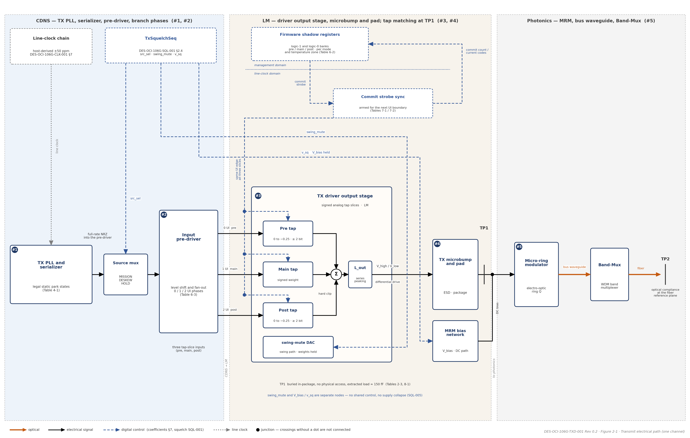

DES-OCI-106G-TXD-001 Rev 0.2 | Companion to ARCH-OCI-106G-001 Rev 0.7 | TXD Design Specification

**400G OCI Line-Side SerDes Chiplet**

TX Pre-Driver and Driver — Design Specification

*Companion to ARCH-OCI-106G-001 Rev 0.7 | Design decomposition of ELE-001..010, DTX-006, CMP-007 | Both operating modes (106.25 / 53.125 GBd)*

| **Document ID** | DES-OCI-106G-TXD-001 |
| --- | --- |
| **Revision** | 0.2 (Draft for review) |
| **Date** | September 21, 2026 |
| **Status** | DRAFT. Design companion to the Architecture and Requirements Specification ARCH-OCI-106G-001 Rev 0.7. Where this document and Rev 0.7 differ, Rev 0.7 governs. Design confidence: Medium. Many electrical values are owner deliverables not yet populated (Section 11). |
| **Parent requirements** | ELE-001..010 (Rev 0.7 §6.4, TP1 electrical decomposition); DTX-001 (TX jitter budget), DTX-002 (bandwidth partition), DTX-006 (drive levels, slew, pre-emphasis per mode), DTX-010 (PSIJ / PSRR); TXO-008 (TP2 transition time, 22 % overshoot); CMP-007 (baud-tracking FIR delays, per-mode coefficient banks, 200G-mode jitter absolutes); SYS-002 (clock-chain phase noise); ROB-001 (CDM), ROB-005 (short/open survival, TX fault); EMC-003 (crosstalk within BUJ), EMC-004 (spurs); SQL-001 (static-rail park for squelch). |
| **Sibling documents** | DES-OCI-106G-SQL-001 — TX Squelch (serializer static-rail park, drop-port servo, exit sequence); DES-OCI-106G-CDR-001 and DES-OCI-106G-ADP-001 — receive-side companions. |
| **Governing specifications** | IEEE Draft P802.3dj/D1.3 179.9.4.6 via Annex 176C/176D — TP1 clock-jitter metrics (JRMS03 / EOJ03 / J4u03; later drafts JHRMS / JH4u) at 106.25 ± 50 ppm GBd; OIF CEI-05.3 Clause 19 (CEI-56G-XSR-NRZ) — 4.0 ps hard-maximum switching edge (edge-rate and jitter limits only; linearity and output-level limits do not transfer to a switching driver); OIF CEI-112G-XSR — 200G-mode jitter cross-check (CMP-007). |
| **Scope** | Transmit electrical path from the serializer output to TP1, the electrical input of the micro-ring modulator: input pre-driver (fan-out and conditioning into the tap slices), voltage-mode switching driver with three-tap analog FIR and series inductive peaking, TX microbump and pad load, coefficient banks and glitchless update, TP1 jitter allocation, robustness and EMC interfaces, verification hooks. Per channel; four instances per fiber port. |
| **Out of scope** | Serializer and TX PLL design (SYS-001/002); MRM device design, ring Q selection and heater servo (DTX-002..005); optical compliance at TP2 (TXO family — bound through the MRM electro-optic model, ELE-001); squelch sequencing (DES-OCI-106G-SQL-001); FIR coefficient values (populated by simulation sweep per mode, ELE-010). |

| **Revision** | **Date** | **Change summary** |
| --- | --- | --- |
| 0.1 | September 18, 2026 | Initial issue. Design decomposition of ELE-001..010, DTX-006, and CMP-007 per ARCH-OCI-106G-001 Rev 0.6; the driver is described as a voltage-mode nonlinear switching output stage consistent with Rev 0.6 §3.1 and DTX-006 (V_high / V_low and slew rate rather than “swing and linearity”); TP1 transition-time typical stated at the ELE-006 value of 0.35 UI = 3.3 ps with the 4.0 ps hard maximum made explicit; inter-tap matching stated as 2.6 % UI = 0.24 ps (ELE-008); 200G OCI mode column added to every UI-referenced table (CMP-007); independent logic-1 / logic-0 coefficient banks (ELE-010) and per-mode / per-temperature-zone storage (DTX-006) added; the requested transmit-path block diagram replaced by the signal-chain table 2-1 and block nomenclature fixed there; ownership placeholders retained as explicit deliverables (Section 11). |
| 0.2 | September 21, 2026 | Re-pinned to ARCH-OCI-106G-001 Rev 0.7 (hub revision; its Section 1.7 indexes this document). Predecessor-document references removed throughout per the OCI 106G document-structure convention: the Status field now states scope and confidence only; provenance statements are replaced by citations of the owning document in the set or by open items; cross-references into DES-OCI-106G-CDR-001 converted from legacy §6-x numbering to its Section numbers. No technical values changed. |

# 1. Introduction

## 1.1 Purpose

This document is the design decomposition of the transmitter electrical requirements of ARCH-OCI-106G-001 Rev 0.7 at TP1 (ELE-001..010) together with the driver-facing parts of DTX-006 and CMP-007. It partitions the transmit electrical path into two blocks with separate owners — the input pre-driver and the TX driver — fixes which specifications live with which block, and states the TP1 limits, the FIR definition, and the coefficient-update behavior so that circuit design, the MRM electro-optic model, firmware, and verification share one definition.

## 1.2 Conventions

| **Item** | **Convention** |
| --- | --- |
| Operating modes | 400G OCI mode: 106.25 GBd NRZ, UI = 9.412 ps. 200G OCI mode: 53.125 GBd NRZ, UI = 18.824 ps. Limits stated in UI apply in both modes; absolute values are given per mode. Edge rates and matching are hardware properties, fixed in ps, and are therefore a smaller UI fraction in 200G mode. |
| Requirement references | FAMILY-NNN refers to the requirement of that ID in Rev 0.7; §x.y without prefix refers to Rev 0.7. |
| TP1 | The differential electrical input of the micro-ring modulator, measured under the extracted MRM-plus-pad load (Table 8-1). Buried in-package and unprobeable; every TP1 value is verified by simulation, on-die instrumentation, or test-vehicle measurement (ELE-001). |
| TP2 | The optical output at the fiber reference plane (Rev 0.7 §4.1). TP1 limits bind TP2 only through the MRM electro-optic model. |
| Owners | CDNS — serializer interface and input pre-driver deliverable. LM — TX driver output stage, FIR, and pad deliverable. An entry marked “CDNS” or “LM” in a Target column is a value that owner shall supply; it is tracked in Section 11. |
| Jitter metrics | 802.3dj clock-jitter metrics are measured on full-swing transitions with a 4 MHz CRU at 20 dB/decade (179.9.4.6). The internal dual-Dirac budget (Table 3-2) uses the worst-case-additive convention for bounded terms and RSS at Q = 7.034 for Gaussian terms, at the raw-BER 1e-12 FEC-free operating point. |
| Placeholders | TBD = value tracked in the requirements database; not yet fixed by analysis or by the owner. Section 11 lists the open items and owner deliverables. |

## 1.3 Parent requirement map

**Table 1-1. Rev 0.7 requirements satisfied or interfaced by this document**

| **Req ID** | **Rev 0.7 obligation (abridged)** | **Design response** | **Section** |
| --- | --- | --- | --- |
| **ELE-001** | All TX electrical requirements defined at TP1; verified by simulation, on-die instrumentation, test vehicle; TP1→TP2 correlation documented through the MRM model. | TP1 definition and load model; verification matrix built on the three methods; MRM model is the correlation vehicle. | 2.4, 8, 10 |
| **ELE-002 / 003 / 004** | TP1 JRMS ≤ 0.023 UI rms; EOJ ≤ 0.025 UI pp; J4u ≤ 0.118 UI pp (802.3dj 179.9.4.6 via Annex 176C). | Table 3-1 with both-mode absolutes; allocated across clock chain, pre-driver, and driver in Table 3-2. | 3 |
| **ELE-005** | Internal dual-Dirac budget at 1e-12: σ_RJ ≤ 104 fs; DCD ≤ 235 fs; ISI ≤ 113 fs; BUJ ≤ 339 fs; DJ-dd ≤ 1.16 / 0.69 ps; TJ ≤ 2.61 / 2.14 ps. | Table 3-2 restates the budget and opens per-block allocation columns for the owner deliverables. | 3.2 |
| **ELE-006** | TP1 20–80 % transition ≤ 0.35 UI typical (3.3 ps), 4.0 ps hard maximum under extracted load; rise/fall mismatch ≤ 3.7 % UI (0.35 ps). | Driver electrical limits Table 5-2; pre-driver edge must not become the dominant ISI source (Table 4-1). | 5.2, 4 |
| **ELE-007** | 3-tap FIR (pre, main, post), delays 0/1/2 UI of the operating baud, pre/post weights 0 to −0.25, ≥ 2-bit resolution, quantization noise negligible. | FIR definition Table 6-1 with per-mode delays; quantization-noise check in the verification matrix. | 6 |
| **ELE-008** | Inter-tap phase-delay matching ≤ 2.6 % UI (0.24 ps) across PVT and all legal tap codes. | Table 6-1; matching is a driver (LM) obligation; tap-delay generation is a CDNS deliverable. | 6 |
| **ELE-009** | Glitchless (hitless) coefficient updates in mission mode; no raw-BER degradation, FEC-visible bursts, or partner CDR re-acquisition. | Update mechanism and sequence, Section 7. | 7 |
| **ELE-010** | Independent logic-1 and logic-0 coefficient banks; hardware normative, values by simulation sweep per mode. | Bank structure and storage, Table 6-2. | 6.2 |
| **DTX-006** | V_high / V_low and slew rate through the ring EO transfer function land ER in 3.5–4.5 dB in both modes; pre-emphasis stored per mode and temperature zone; overshoot ≤ 22 %; edge / photon-lifetime interaction characterised. | Drive-level table 5-3 (2.0 / 3.0 Vppd options); coefficient storage Table 6-2; edge-interaction characterisation in the verification matrix. | 5.3, 6.2, 10 |
| **DTX-002 / TXO-008** | TX bandwidth partition to meet 8 ps optical transition; ring Q 2500–4000. | Driver electrical edge (3.3 ps typ.) leaves the photon-lifetime term its share of the 8 ps; series inductive peaking for driver bandwidth. | 5.1, 5.2 |
| **CMP-007** | FIR delays track the baud (0 / 9.41 / 18.82 ps vs. 0 / 18.82 / 37.65 ps); coefficient banks per mode; TP1 jitter met in UI in both modes. | 200G-mode columns throughout; per-mode banks in Table 6-2. | 3, 6 |
| **SYS-002 / DTX-001** | Clock-chain phase noise to σ_RJ ≤ 104 fs; TX jitter well under 0.3 UI pk-pk. | Clock-chain term carried in Table 3-2 as the largest margin lever (risk R8). | 3.2 |
| **DTX-010** | PSIJ and heater-rail ripple within TDEC/RIN; PSRR per rail over the signal bandwidth. | Supply interface and PSRR obligations, Table 8-2. | 8.2 |
| **ROB-001 / ROB-005** | CDM ≥ 250 V on line-side microbumps; driver survives indefinite short/open at the MRM interface; latched TX fault. | Robustness interface Table 8-2. | 8.2 |
| **EMC-003 / EMC-004** | Aggregate crosstalk within BUJ ≤ 0.036 UI (339 fs) with all lanes active; no SSC; spur limits from ELE-004. | BUJ line of Table 3-2 is the crosstalk allocation; verification with all-lanes-active worst-case tap codes. | 3.2, 10 |
| **SQL-001** | Squelch suppresses modulation only; full-swing toggling prohibited; static-rail serializer park. | Serializer legal static states (Table 4-1) are the park states; driver behavior in the parked state defined. | 4, 8.2 |

# 2. Architecture and Partition

## 2.1 Transmit electrical signal chain

**Table 2-1. Blocks of the TX electrical path (nomenclature fixed here; per channel)**

| **#** | **Block** | **Function** | **Owner** | **Output interface** | **Governing requirements** |
| --- | --- | --- | --- | --- | --- |
| 1 | TX PLL and serializer | Host-derived line clock (±50 ppm); full-rate NRZ serialization at 106.25 or 53.125 Gb/s; legal static output states for squelch park. | CDNS | Full-rate NRZ into the pre-driver | SYS-001, SYS-002, TXO-001, SQL-001 |
| 2 | Input pre-driver | Receives the serializer output; conditions, level-shifts, and fans out the NRZ into the driver’s three signed tap slices with 0 / 1 / 2 UI branch phases. | CDNS (with LM interface parameters) | Three tap-slice inputs (pre, main, post) at defined swing and common mode | ELE-002..005 allocations; ELE-007 branch phases (Section 4) |
| 3 | TX driver output stage | Voltage-mode nonlinear switching output stage implementing the three-tap analog FIR with hard clip after summation; series inductive peaking (L_out) for bandwidth; independent logic-1 / logic-0 coefficient banks. | LM | Differential drive at V_high / V_low into the TX microbump | ELE-006..010, DTX-006 (Sections 5–7) |
| 4 | TX microbump and pad | EIC-to-PIC interconnect and pad assembly; ESD; MRM bias network. | LM / package | TP1 — MRM electrical input, extracted load ≈ 150 fF | ELE-001, ROB-001, ROB-005 (Section 8) |
| 5 | Micro-ring modulator | Electro-optic conversion; photon-lifetime bandwidth set by ring Q; optical linearity obligation. | Photonics | TP2 (optical, via bus waveguide and Band-Mux) | DTX-002..006, TXO family (out of scope here) |

## 2.2 Block diagram

**Figure 2-1. Transmit electrical path block diagram**

*One channel shown. Block numbers refer to Table 2-1; each hop is that row's output interface. Ownership zones follow the Owner column of Table 2-1. Solid arrows: signal path (optical in orange); dashed: coefficient update (Section 7) and squelch (DES-OCI-106G-SQL-001); dotted: line clock. Crossings without a dot are not connected.*

## 2.3 Partition of specifications

**Table 2-2. Where each specification lives**

| **Specification** | **Lives with** | **Rationale** |
| --- | --- | --- |
| **FIR tap count, weight bounds and resolution, coefficient matching, coefficient banks, glitchless update** | TX driver | The FIR is implemented in the driver’s tap slices; the pre-driver only supplies the phased copies. |
| **Branch phase generation (0 / 1 / 2 UI) and inter-phase skew** | Pre-driver (generation), driver (matching at the output) | Phases are created in the serializer/pre-driver domain; the ELE-008 matching limit is measured at TP1. |
| **Edge rate and edge symmetry at TP1** | TX driver | ELE-006 is a TP1 limit; the pre-driver edge is an internal allocation that must not dominate ISI. |
| **Random, bounded, and DCD jitter** | Allocated across PLL/serializer, pre-driver, driver (Table 3-2) | TP1 totals are ELE-002..005; each block receives an allocation from the link budget. |
| **Drive levels V_high / V_low, supply and MRM-bias headroom** | TX driver | Set by the ring EO transfer function and ER window (DTX-006). |
| **Serializer legal static states** | Serializer / pre-driver | Squelch is a static-rail park (SQL-001); the parked state must be a legal, non-toggling driver input. |
| **Power and area** | Each block separately | Pre-driver power scales with fan-out; driver power with swing. |

## 2.4 Reference point TP1

**Table 2-3. TP1 definition and access**

| **Attribute** | **Value** | **Req** |
| --- | --- | --- |
| **Location** | Differential electrical input of the MRM, after the TX microbump and pad assembly | ELE-001 |
| **Load** | Extracted MRM plus pad, ≈ 150 fF differential (Table 8-1); all TP1 limits are stated under this load | ELE-006 |
| **Physical access** | None — buried in-package | ELE-001 |
| **Verification routes** | Extracted-view simulation across PVT and tap codes; on-die instrumentation (edge monitor, eye/jitter monitor, static-level readback); driver test vehicle with probe-able replica pad | ELE-001, VER family |
| **Correlation to TP2** | MRM electro-optic model maps TP1 V_high / V_low, edge, and jitter to TP2 ER, transition time, overshoot, TDEC | ELE-001, DTX-006 |
| **Test conditions** | PRBS13 and PRBS31; PVT corners; extreme (all-legal) tap codes; all four lanes active on uncorrelated data (WDM aggressors) | ELE-008, EMC-003, VER-003 |

# 3. TP1 Jitter Budget (ELE-002..005, CMP-007)

## 3.1 802.3dj clock-jitter limits at TP1

**Table 3-1. Standards-derived TP1 limits (802.3dj 179.9.4.6 via Annex 176C, full-swing transitions, 4 MHz CRU)**

| **Metric** | **Definition** | **Limit (UI)** | **400G OCI mode** | **200G OCI mode** | **Cross-check (200G mode)** | **Req** |
| --- | --- | --- | --- | --- | --- | --- |
| **JRMS03 / JHRMS** | RMS clock jitter, slope-extrapolated with additive noise removed | ≤ 0.023 UI rms | 216 fs | 433 fs | CEI-112G-XSR JRMS ≤ 0.0224 UI | ELE-002, CMP-007 |
| **EOJ03** | Even-odd jitter (duty-cycle-distortion analog on full-swing NRZ edges) | ≤ 0.025 UI pp | 235 fs | 471 fs | CEI-112G-XSR EOJ ≤ 0.025 UI | ELE-003, CMP-007 |
| **J4u03 / JH4u** | Bounded high-probability jitter, all-but-1E-4 interval | ≤ 0.118 UI pp (D1.3 Class A; Class B 0.12 UI) | 1.11 ps | 2.22 ps | — | ELE-004, CMP-007 |

## 3.2 Internal dual-Dirac budget and block allocation

The dual-Dirac budget is the internal decomposition that no standard specifies. Its totals are fixed by ELE-005; the per-block allocation columns are the owner deliverables that Section 4 (pre-driver) and Section 5 (driver) must return. Bounded terms add linearly; Gaussian terms add in RSS at Q = 7.034 (raw BER 1e-12).

**Table 3-2. Dual-Dirac budget at TP1 (ELE-005) with allocation columns**

| **Term** | **Total (UI)** | **400G abs.** | **200G abs.** | **PLL / serializer (CDNS, SYS-002)** | **Pre-driver (CDNS)** | **Driver + FIR (LM)** | **Crosstalk / supply (EMC-003, DTX-010)** |
| --- | --- | --- | --- | --- | --- | --- | --- |
| **σ_RJ (rms)** | ≤ 0.011 | 104 fs | 207 fs | Dominant term; largest margin lever (risk R8) — TBD | TBD | TBD | — |
| **DCD (pp)** | ≤ 0.025 | 235 fs | 471 fs | TBD | TBD | TBD (rise/fall mismatch ≤ 0.35 ps, ELE-006) | — |
| **ISI (pp)** | ≤ 0.012 | 113 fs | 226 fs | — | TBD (edge must not dominate) | TBD (loaded-pad bandwidth) | — |
| **DDJ = DCD + ISI (pp)** | ≤ 0.037 | 348 fs | 696 fs | Sum of the two rows above |  |  |  |
| **BUJ (pp)** | ≤ 0.036 | 339 fs | 678 fs | — | TBD | TBD | Aggregate on-die / in-package crosstalk, all lanes active, worst-case tap codes |
| **DJ-dd (pp), FIR enabled** | ≤ 0.123 | 1.16 ps | 2.32 ps | Worst-case-additive over the bounded rows |  |  |  |
| **DJ-dd (pp), no FIR** | ≤ 0.073 | 0.69 ps | 1.37 ps |  |  |  |  |
| **TJ(1e-12) (pp), FIR enabled** | ≤ 0.278 | 2.61 ps | 5.23 ps | DJ-dd + 2 · 7.034 · σ_RJ |  |  |  |
| **TJ(1e-12) (pp), no FIR** | ≤ 0.228 | 2.14 ps | 4.29 ps |  |  |  |  |

*Allocations marked TBD are returned by the owners against the link budget (Open item 1). The DTX-001 working target — total TX jitter well under 0.3 UI pk-pk before optical penalties — is consistent with the TJ row.*

# 4. Input Pre-Driver (CDNS deliverable)

The serializer-to-driver interface and the pre-driver shall be completed by CDNS. CDNS shall return values that close the Section 3 TP1 jitter allocations and support the Section 5 loaded-pad driver limits. Interface parameters that depend on the driver’s tap-slice design are set by LM and marked accordingly.

**Table 4-1. Pre-driver and interface parameters**

| **Parameter** | **Target / Default** | **Owner** | **Basis / constraint** | **Req** |
| --- | --- | --- | --- | --- |
| **Serializer legal static states** | TBD | CDNS | Legal non-toggling output states, used for squelch park and idle; the parked state shall hold the driver at a static rail with modulation suppressed | SQL-001, DES-OCI-106G-SQL-001 |
| **Serializer lane count** | TBD | CDNS | Lane count of the serializer-to-driver interface (per channel) | SYS-001 |
| **Serializer interface buffering** | TBD | CDNS | Buffer stages between serializer and driver, with their jitter contribution inside the Table 3-2 allocation | ELE-005 |
| **Termination / level conversion** | TBD | CDNS | Any termination or level shift between serializer and pre-driver | — |
| **Input termination** | TBD | CDNS | At the pre-driver input | — |
| **Output termination** | TBD | LM | At the tap-slice inputs | — |
| **Driver input loading, differential** | TBD | CDNS | Maximum differential capacitance presented to the serializer including routing | — |
| **Driver input loading, common-mode** | TBD | CDNS | Maximum common-mode capacitance presented to the serializer including routing | — |
| **Pre-driver output swing** | TBD | LM | Swing into the driver’s signed analog-FIR tap slices across all enabled tap codes | ELE-007 |
| **Pre-driver output common mode** | TBD | LM | Common mode into the tap slices across all enabled tap codes | ELE-007 |
| **Pre-driver rise time (20–80 %)** | TBD | LM | Shall support the TP1 transition-time window (3.3 ps typ., 4.0 ps max) without becoming the dominant ISI source (Table 3-2 ISI row) | ELE-006 |
| **Pre-driver fall time (20–80 %)** | TBD | LM | As above | ELE-006 |
| **Random-jitter allocation** | TBD from link budget | CDNS | Within Table 3-2 σ_RJ (104 fs rms total at TP1, both JHRMS and JH4u) | ELE-002/004/005 |
| **DCD allocation** | TBD from link budget | CDNS | Within Table 3-2 DCD (235 fs pp total; EOJ03) | ELE-003/005 |
| **Bounded (uncorrelated) jitter allocation** | TBD from link budget | CDNS | Within Table 3-2 BUJ (339 fs pp total; JH4u) | ELE-004/005 |
| **1-UI tap-delay accuracy** | TBD | LM | Accuracy of the 1-UI and 2-UI branch phases under PVT, both bauds (9.41 / 18.82 ps and 18.82 / 37.65 ps) | ELE-007, CMP-007 |
| **Inter-phase skew** | TBD | LM | Phase skew between interface signals under PVT; feeds the 0.24 ps ELE-008 matching at TP1 | ELE-008 |

**Table 4-2. Pre-driver power and area**

| **Parameter** | **Value** | **Basis** |
| --- | --- | --- |
| **Power, FO4 pre-driver** | 0.33 pJ/bit (diff), ≈ 33 % of total driver power | TX driver architecture study (TxDriver.pdf) at 3.0 Vppd |
| **Power, FO2 pre-driver** | 0.40 pJ/bit (diff), ≈ 40 % of total driver power | Lower fan-out costs power for a faster, cleaner edge into the tap slices |
| **Area** | TBD | CDNS; scales with fan-out and device count |

# 5. TX Driver (LM deliverable)

## 5.1 Topology

**Table 5-1. Output-stage architecture decisions**

| **Attribute** | **Decision** | **Rationale / consequence** | **Req** |
| --- | --- | --- | --- |
| **Output stage** | Voltage-mode, nonlinear switching | Approximately twice the energy efficiency of current-mode at equal swing. Because the driver switches, ER and TDEC are set by drive-level selection plus FIR pre-emphasis, and the optical linearity obligation falls on the ring transfer function; CEI-56G-XSR-NRZ linearity and output-level limits do not apply, only its edge-rate and jitter limits transfer. | Rev 0.7 §3.1, DTX-006, Table 2-1 |
| **Bandwidth extension** | Series inductive peaking (L_out) at the output node | Expands bandwidth into the ≈ 150 fF pad load; the electrical edge is one term of the DTX-002 TX bandwidth partition alongside ring photon lifetime | DTX-002, ELE-006 |
| **Optional bandwidth enhancement** | Resistive feedback | Adds ≈ 0.1 pJ/bit if used | — |
| **Equalization** | Three-tap analog FIR in the tap slices, hard clip after summation | Section 6 | ELE-007..010 |
| **Overshoot control** | Drive-level and coefficient selection | Optical overshoot ≤ 22 % at TP2 is the acceptable-nonlinearity limit; driver-edge interaction with ring photon lifetime and any TP1 ringing shall be characterised, not assumed benign | TXO-008, DTX-006 |
| **Alternative under study** | Non-standard FIR strategy addressing MRM lock-point sensitivity | Investigation in progress; not the baseline | Open item 5 |

## 5.2 Electrical limits at TP1

**Table 5-2. Driver electrical limits, differential at TP1 under the extracted ≈ 150 fF MRM-plus-pad load**

| **Parameter** | **Limit** | **400G OCI mode** | **200G OCI mode** | **Basis** | **Req** |
| --- | --- | --- | --- | --- | --- |
| **Transition time 20–80 %, typical** | ≤ 0.35 UI (400G) | 3.3 ps | 3.3 ps (0.175 UI) | Hardware edge; leaves the photon-lifetime term its share of the 8 ps TP2 limit | ELE-006, TXO-008 |
| **Transition time 20–80 %, hard maximum** | 4.0 ps | 4.0 ps (0.42 UI) | 4.0 ps (0.21 UI) | CEI-56G-XSR-NRZ switching-edge maximum retained as the TP1 limit | ELE-006, Table 2-1 |
| **Rise / fall mismatch** | ≤ 3.7 % UI (400G) | ≤ 0.35 ps | ≤ 0.35 ps (1.9 % UI) | Keeps TP1 asymmetry within the correction capacity of the asymmetric coefficient banks (ELE-010) for the ring’s nonlinear depletion dynamics | ELE-006 |
| **Inter-tap phase-delay matching** | ≤ 2.6 % UI | 0.24 ps | 0.49 ps | Across PVT and all legal tap codes | ELE-008 |
| **TP2 optical transition time (for reference)** | — | ≤ 8 ps | ≤ 17 ps | Optical limit the electrical edge must leave room for | TXO-008, CMP-002 |
| **Optical overshoot / undershoot at TP2 (for reference)** | ≤ 22 % | ≤ 22 % | ≤ 22 % | Acceptable nonlinearity of the switching driver + ring | TXO-008 |
| **Jitter at TP1** | Table 3-1 and Table 3-2 | — | — | Driver column of Table 3-2 | ELE-002..005 |

*Rev 0.7 ELE-006 fixes 0.35 UI = 3.3 ps typical with the 4.0 ps hard maximum; that value is carried here.*

## 5.3 Drive levels, supply, and MRM bias

**Table 5-3. Output-level options (DTX-006: levels are selected through the ring EO transfer function to land ER in 3.5–4.5 dB in both modes)**

| **Parameter** | **2.0 Vppd option** | **3.0 Vppd option** | **Notes** |
| --- | --- | --- | --- |
| **Differential output swing (V_high − V_low)** | 2.0 Vppd | 3.0 Vppd | Hard clip after FIR summation; the range 2.0–3.0 Vppd is the design space, the operating level is per mode and temperature zone |
| **Main supply** | 0.90–0.96 V | ≥ 1.5 V | 2.0 Vppd follows from the unstacked single-device < 0.96 V ceiling |
| **MRM bias** | ≥ 1.2 V | ≥ 1.7 V | Headroom assumes ≈ 0.2 V drop across the bias resistor from photodiode current, to avoid forward-biasing the MRM |
| **Output ESD clamp** | ≥ MRM bias + 0.5 V | ≥ MRM bias + 0.75 V | Clamp must sit above the highest legal output level |
| **Power, output stage only** | TBD pJ/bit (diff) | TBD pJ/bit (diff) | Excludes pre-driver (Table 4-2) and tap-slice / bias overhead; + ≈ 0.1 pJ/bit with resistive-feedback enhancement |
| **Area, output stage** | TBD | TBD | LM |
| **ER outcome** | Per MRM model | Per MRM model | Both options shall be evaluated against the 3.5–4.5 dB window at the DTX-002 ring Q in both modes (DTX-006, CMP-008); the selection closes risk R1 |

# 6. Analog TX FIR (ELE-007, ELE-008, ELE-010, CMP-007)

## 6.1 Definition

**Table 6-1. FIR parameters**

| **Parameter** | **Value** | **400G OCI mode** | **200G OCI mode** | **Notes** | **Req** |
| --- | --- | --- | --- | --- | --- |
| **Number of taps** | 3 (pre, main, post) | — | — | Implemented as signed analog tap slices in the driver | ELE-007 |
| **Branch delays** | 0 / 1 / 2 UI of the operating baud | 0 / 9.41 / 18.82 ps | 0 / 18.82 / 37.65 ps | Delays track the baud; generation is a CDNS deliverable (Table 6-3) | ELE-007, CMP-007 |
| **Pre-tap weight range** | 0 to −0.25 | — | — | May be made asymmetric with the post-tap if pre/post ISI differ strongly (Open item 4) | ELE-007 |
| **Post-tap weight range** | 0 to −0.25 | — | — | As above | ELE-007 |
| **Tap resolution** | 2 bits (minimum) | — | — | Coefficient-quantization noise shall be shown negligible within the TDEC budget | ELE-007 |
| **Inter-tap phase-delay matching** | ≤ 2.6 % UI | 0.24 ps | 0.49 ps | PVT and all legal tap codes | ELE-008 |
| **Coefficient banks** | Independent logic-1 and logic-0 banks | — | — | Corrects the asymmetric rise/fall dynamics of the carrier-depletion MRM (voltage-dependent junction capacitance, detuning-dependent transitions) | ELE-010 |
| **Coefficient update** | Glitchless in mission mode | — | — | Section 7 | ELE-009 |
| **Summation** | Analog, hard clip | — | — | Switching output: clipped sum sets V_high / V_low | DTX-006 |

## 6.2 Coefficient storage

**Table 6-2. Coefficient bank structure**

| **Dimension** | **Entries** | **Basis** |
| --- | --- | --- |
| **Polarity bank** | Logic-1 bank, logic-0 bank (each: pre, main, post codes) | ELE-010 — hardware normative; values by simulation sweep |
| **Operating mode** | 400G OCI, 200G OCI | CMP-007 — banks stored per mode; reloaded with the CMP-009 parameter set on mode change |
| **Temperature zone** | TBD zones | DTX-006 — pre-emphasis characterised and stored per temperature zone |
| **Per-device trim** | Delta over the zone table from production characterisation | MFG-003 — calibration NVM with integrity check |
| **Live trim** | Firmware updates during mission via the Section 7 mechanism | ELE-009 — temperature and aging drift |

## 6.3 Tap-delay generation

**Table 6-3. Branch-phase generation (CDNS deliverable)**

| **Item** | **Value** | **Owner** | **Constraint** |
| --- | --- | --- | --- |
| **Method** | TBD | CDNS | Defines how the 0 / 1 / 2 UI pre / main / post phases are produced (e.g. serializer-domain phase copies or delay elements) |
| **Baud tracking** | Required | CDNS | Delays scale with the line clock: 9.41 → 18.82 ps per UI on mode change (CMP-007) |
| **1-UI delay accuracy** | TBD | LM (target) / CDNS (achieved) | Under PVT; contributes to the ELE-008 0.24 ps matching at TP1 |
| **Inter-phase skew** | TBD | LM (target) / CDNS (achieved) | Under PVT; measured at the tap-slice inputs |

# 7. Glitchless Coefficient Update (ELE-009)

Tap codes shall be updatable during live transmission without raw-BER degradation, without error bursts visible in the host FEC bin counters, and without partner CDR re-acquisition. Required in mission mode, this enables live trimming for temperature and aging drift.

**Table 7-1. Update mechanism requirements**

| **Attribute** | **Requirement** | **Req** |
| --- | --- | --- |
| **Timing** | New codes take effect on a UI boundary, aligned across all three tap slices and both polarity banks | ELE-009 |
| **Intermediate states** | No intermediate or partially-updated code shall drive the output; shadow registers with an atomic commit strobe | ELE-009 |
| **Step size** | One LSB per tap per commit in mission mode; larger jumps only in maintenance state | ELE-009, FW-005 |
| **Observability** | Commit count and current codes readable; commit events logged to the flight data recorder | MGT-003 |
| **Pass criterion** | No raw-BER degradation; no FEC 17-bin histogram excursion; partner CDR lock maintained (partner lock detector per DES-OCI-106G-CDR-001 Section 9) | ELE-009, DJI-002 |
| **Squelch interaction** | No commits while the channel is parked (SQL-001); coefficient reload before unsquelch is part of the exit sequence | DES-OCI-106G-SQL-001 |

**Table 7-2. Update sequence**

| **Step** | **Action** | **Domain** |
| --- | --- | --- |
| 1 | Firmware writes new pre / main / post codes for the target bank(s) into shadow registers | Management |
| 2 | Firmware asserts commit | Management |
| 3 | Commit is synchronised into the line-clock domain and armed for the next UI boundary | Line clock |
| 4 | All three tap slices (and both banks if both are shadowed) switch codes on the same UI edge | Line clock |
| 5 | Commit counter increments; event logged; busy cleared | Management |

# 8. Load, Supply, and Robustness Interfaces

## 8.1 TP1 load model

**Table 8-1. Extracted load at TP1**

| **Element** | **Value** | **Notes** |
| --- | --- | --- |
| **MRM plus pad assembly, differential** | ≈ 150 fF | Extracted; the load under which every Table 5-2 limit is stated |
| **TX microbump** | Included in the extraction | EIC-to-PIC interconnect |
| **MRM bias network** | Bias resistor with ≈ 0.2 V photocurrent drop assumed | Table 5-3 headroom basis |
| **ESD structure** | Clamp above the highest legal output level (Table 5-3) | ROB-001 |
| **Model status** | TBD — extraction to be refreshed at each package revision | Open item 2 |

## 8.2 Supply, robustness, and EMC interfaces

**Table 8-2. Interfaces the driver must satisfy toward the productization families**

| **Interface** | **Obligation** | **Req** |
| --- | --- | --- |
| **Supply-induced jitter / PSRR** | PSRR per rail derived over the signal bandwidth so that PSIJ fits inside the Table 3-2 allocation and the TDEC / RIN budgets; heater-rail coupling excluded from the driver rails | DTX-010 |
| **ESD** | Line-side microbump interface withstands ≥ 250 V CDM (JS-002); output clamp per Table 5-3 | ROB-001 |
| **Short / open at the MRM interface** | Indefinite short or open (including unbonded or failed microbump) without damage; stuck or non-responding modulator interface detected and reported as a latched TX fault | ROB-005, REG-007 |
| **Crosstalk** | Driver-to-driver and driver-to-RX coupling within the aggregate BUJ allocation (339 fs pp), verified with all lanes active on uncorrelated data and worst-case tap codes | EMC-003 |
| **Clock purity** | No spread-spectrum on the line clock; spur limits derived from the ELE-004 bounded-jitter ceiling at each baud, verified at the serializer output | EMC-004 |
| **Squelch park** | In the parked state the driver holds a static rail at mission average power (modulation suppressed, OMA ≤ −12 / −15 dBm at TP2); full-swing toggling prohibited; parked-state power dissipation documented | SQL-001, TXO-010 |
| **Wearout** | Continuously toggling 106.25 GBd output path signed off for ≥ 100 000 power-on hours at the declared mission profile | ROB-007 |

# 9. Power and Area Summary

**Table 9-1. TX electrical path power and area (per channel, differential)**

| **Block** | **Power** | **Area** | **Status** |
| --- | --- | --- | --- |
| **Pre-driver, FO4** | 0.33 pJ/bit | TBD | Architecture study value |
| **Pre-driver, FO2** | 0.40 pJ/bit | TBD | Architecture study value |
| **Driver output stage, 2.0 Vppd** | TBD pJ/bit | TBD | LM deliverable |
| **Driver output stage, 3.0 Vppd** | TBD pJ/bit | TBD | LM deliverable |
| **Resistive-feedback enhancement (optional)** | + ≈ 0.1 pJ/bit | — | Only if adopted |
| **Tap-slice and bias overhead** | TBD | TBD | Excluded from the output-stage figures |
| **Total TX electrical path** | TBD | TBD | Feeds the SYS-008 pJ/bit target per mode |

# 10. Verification

**Table 10-1. Verification matrix (TP1 is unprobeable: S = extracted-view simulation, O = on-die instrumentation, V = test vehicle)**

| **Req** | **Item** | **Method** | **Condition** | **Pass criterion** |
| --- | --- | --- | --- | --- |
| **ELE-002/003/004** | TP1 clock jitter | S / V | PRBS13, PRBS31; PVT; all legal tap codes; 4 MHz CRU | JRMS ≤ 216 fs, EOJ ≤ 235 fs, J4u ≤ 1.11 ps (400G); 433 fs / 471 fs / 2.22 ps (200G) |
| **ELE-005** | Dual-Dirac budget | S / A | Per-block allocations of Table 3-2 returned and summed | TJ(1e-12) ≤ 2.61 ps FIR / 2.14 ps no-FIR (400G); bounded terms additive, Gaussian RSS |
| **ELE-006** | Edge rate and symmetry | S / O / V | Extracted 150 fF load; PVT; extreme tap codes | 3.3 ps typical, ≤ 4.0 ps always; rise/fall mismatch ≤ 0.35 ps |
| **ELE-007** | FIR delays and quantization | S | Both bauds; all codes | Delays 0 / 9.41 / 18.82 ps and 0 / 18.82 / 37.65 ps within the 1-UI accuracy; quantization penalty negligible in TDEC |
| **ELE-008** | Inter-tap matching | S / V | PVT; all legal codes | ≤ 0.24 ps (400G) / 0.49 ps (200G) at TP1 |
| **ELE-009** | Glitchless update | V / T (system) | Live traffic; ±1 LSB commits on each tap and bank; FEC 17-bin counters | No raw-BER change; no bin-histogram excursion; partner CDR lock held |
| **ELE-010** | Polarity banks | S / I | Asymmetric MRM model; independent bank codes | Optical rise/fall asymmetry corrected within the ELE-006 residual |
| **DTX-006** | Drive levels vs. ER | S (MRM model) / T (TP2) | 2.0 and 3.0 Vppd options; DTX-002 ring Q; both modes | ER 3.5–4.5 dB; overshoot ≤ 22 %; edge / photon-lifetime interaction characterised |
| **DTX-010** | PSIJ / PSRR | S / V | Rail noise masks per PDN specification | Induced jitter within Table 3-2 allocation |
| **ROB-005** | Short / open survival | V / T | Indefinite short and open at the pad | No damage; latched TX fault reported |
| **EMC-003** | Crosstalk | S / V | All four lanes active, uncorrelated PRBS31, worst-case tap codes | BUJ contribution within 339 fs pp aggregate |
| **SQL-001** | Parked state | V / T | Serializer static states applied | OMA ≤ −12 / −15 dBm at TP2 with average power constant; no toggling |
| **CMP-007** | Dual-rate FIR and jitter | S / V | All of the above at 53.125 GBd with the 200G bank | UI-relative limits met; CEI-112G-XSR cross-check passed |

# 11. Open Items and Owner Deliverables

**Table 11-1. Open items**

| **#** | **Item** | **Owner** | **Dependency / closure** |
| --- | --- | --- | --- |
| 1 | Per-block jitter allocations of Table 3-2 (σ_RJ, DCD, ISI, BUJ) for PLL/serializer, pre-driver, and driver; the clock-chain σ_RJ ≤ 104 fs closes first (risk R8, SYS-002) | CDNS / LM / link budget | Phase-noise budget; extracted simulations |
| 2 | TP1 load extraction (≈ 150 fF) to be confirmed at the current package revision and re-issued on change | LM / package | Package design |
| 3 | All CDNS and LM entries marked TBD in Tables 4-1, 4-2, 5-3, 6-3, 9-1 | CDNS / LM | Owner deliverables against this document |
| 4 | Asymmetric pre/post tap weight ranges if pre- and post-cursor ISI differ strongly; tap resolution above 2 bits if quantization noise is not negligible | LM / MRM model | ELE-007 quantization check |
| 5 | Non-standard FIR strategy addressing MRM lock-point sensitivity — study in progress; decide whether it replaces or augments the three-tap baseline | Architecture | Study result; DTX-006 |
| 6 | Selection between the 2.0 Vppd and 3.0 Vppd drive options against the ER window at the DTX-002 ring Q in both modes (risk R1) | Photonics / LM | MRM co-simulation, CMP-008 |
| 7 | Temperature-zone count and zone boundaries for coefficient storage; per-mode bank contents | Firmware / LM | DTX-006 characterisation; MFG-003 NVM layout |
| 8 | On-die TP1 instrumentation set (edge monitor, static-level readback, jitter monitor) sufficient for ELE-001 verification without physical access | LM / DFT | DFT plan |
| 9 | Squelch parked-state definition at the serializer (legal static states) and driver dissipation in the parked state | CDNS / LM | DES-OCI-106G-SQL-001 |
| 10 | Behavioral / extracted 200G-mode regression (all Section 10 items at 53.125 GBd) | Verification | CMP-007 |

*End of DES-OCI-106G-TXD-001 Rev 0.2.*

DES-OCI-106G-TXD-001 Rev 0.2 | DRAFT | Page  of