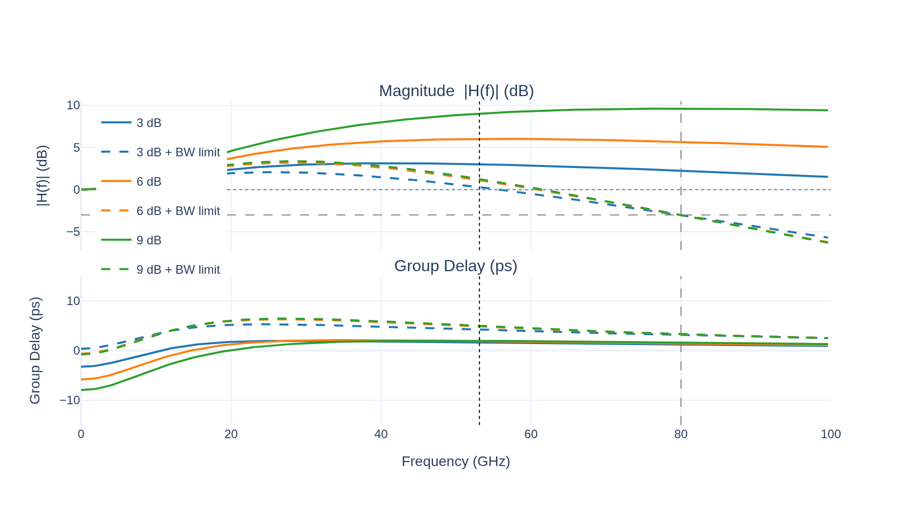
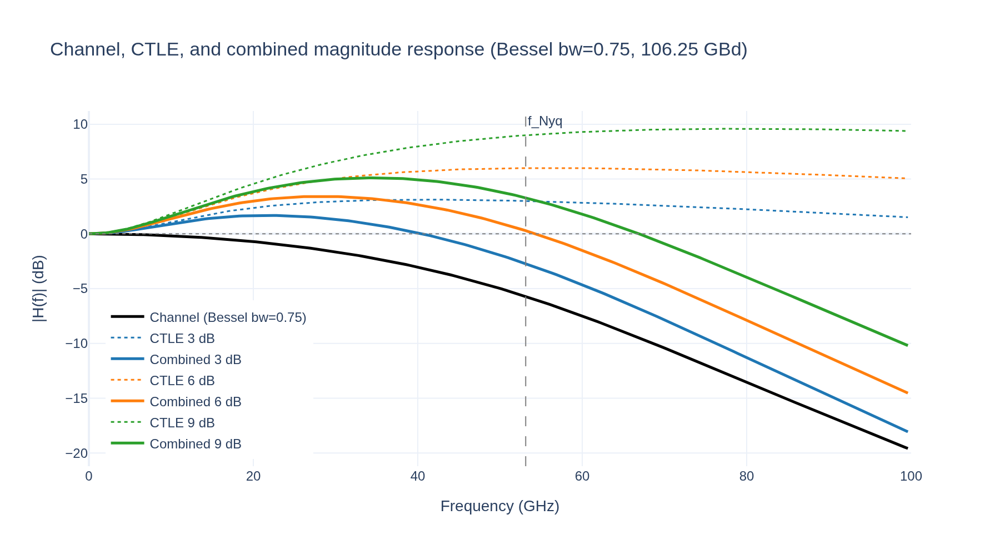
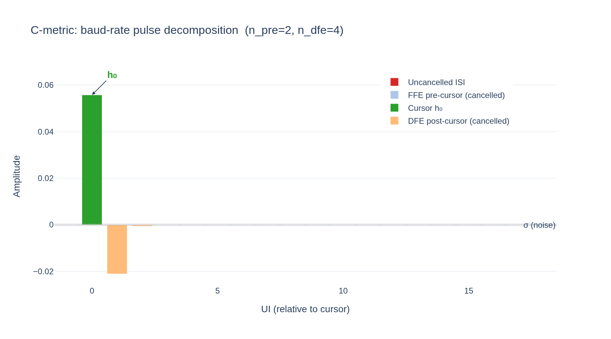
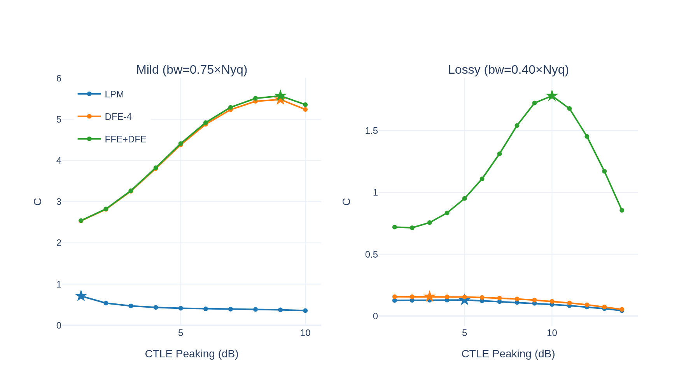
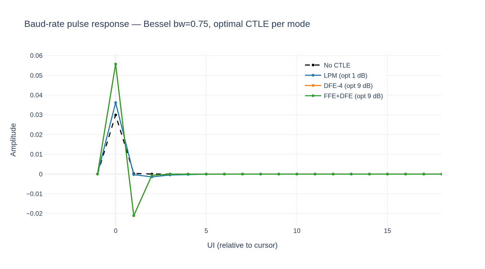

# CTLE Optimisation Framework

**Project:** optical-serdes  
**Date:** 2026-06-09  
**Development log:** `.claude/projects/-data-home-patrick-optical-serdes/memory/project_ctle_design_framework.md`  
**Source:** `src/optical_serdes/rx/ctle.py`, `src/optical_serdes/rx/ctle_design.py`

---

## 1. Background

A Continuous-Time Linear Equaliser (CTLE) is an analogue high-frequency peaking filter placed at the front end of the receiver, before the ADC. Its role is to partially compensate the low-pass roll-off of the channel — raising the gain at high frequencies so that the signal arriving at the slicer has a more open eye.

The CTLE operates in continuous time and therefore shapes the spectrum of the received signal before sampling. This is in contrast to the FFE (a discrete-time FIR filter) and the DFE (a nonlinear feedback equaliser), both of which operate on already-sampled data. In a practical receiver the three are complementary:

- **CTLE** partially flattens the channel magnitude response, reducing the burden on the DSP equalisers
- **FFE** (FIR, typically 1–5 pre-cursor taps) cancels the residual inter-symbol interference (ISI) not removed by the CTLE
- **DFE** (IIR feedback, 4–30 taps) cancels post-cursor ISI at near-zero noise enhancement

Because the CTLE is analogue, its parameters are typically fixed at link bring-up based on a channel characterisation measurement, and held constant during operation (static design). Adaptive CTLE schemes exist but remain future work in this framework.

---

## 2. Transfer Function

### 2.1 Canonical 1z2p Topology

The default CTLE topology is a one-zero / two-pole (1z2p) all-pass-normalised filter:

```
         (s + ωz)
H(s) = K ─────────────────────
         (s + ωp1)(s + ωp2)
```

The gain constant K is set so that |H(0)| = 10^(g_DC/20), i.e.:

```
K = (ωp1 · ωp2 / ωz) · 10^(g_DC/20)
```

With g_DC = 0 the filter has unity DC gain. The zero at ωz provides a rising frequency response; ωp1 creates a shelf that limits the maximum gain; ωp2 rolls off the response above the signal band to prevent excessive noise amplification.

**Design constraint:** |H(jωNyq)| = 10^(peaking_db/20)

Given fixed ωz = 2π · fz_ratio · fNyq and ωp2 = 2π · fp2_ratio · fNyq, the intermediate pole ωp1 is solved numerically (via Brent's method) to satisfy the constraint at ωNyq = π · fBaud.

### 2.2 Arbitrary Topology — CtleZPK

The `CtleZPK` class generalises this to an arbitrary number of poles and zeros specified as physical frequencies in Hz:

```python
CtleZPK(
    zeros = (fz1, fz2, ...),   # Hz, all > 0
    poles = (fp1, fp2, ...),   # Hz, all > 0, len ≥ len(zeros)
    gain_dc_db = 0.0,          # DC gain offset from unity
    data_rate  = 106.25e9,
    samples_per_symbol = 32,
)
```

Unity DC gain is enforced by construction: `K = ∏ωp / ∏ωz · 10^(g_DC/20)`. The analogue ZPK is discretised via the bilinear transform at sample rate `data_rate × samples_per_symbol`, yielding a cascade of second-order sections (SOS) for numerically stable filtering.

### 2.3 Discrete-Time Implementation

The bilinear transform maps the analogue s-plane to the unit circle:

```
s = (2/T) · (z − 1)/(z + 1)
```

This is exact (no approximation) and guarantees discrete-time stability for any stable analogue prototype. The SOS implementation (`sosfilt`) avoids the numerical overflow that would occur when multiplying high-order polynomial coefficients together.

---

## 3. Bandwidth Limiting

An unconstrained CTLE continues to amplify noise above the signal band. In a real circuit, the analogue bandwidth is naturally limited by parasitic poles; in simulation it must be added explicitly.

### 3.1 Specification

Given a target −3 dB bandwidth fBW (measured relative to DC gain = 0 dB), we add n_bw_poles identical real poles at frequency fLP to the base design.

### 3.2 Analytical Solution

The combined magnitude at fBW must equal −3 dB (linear: 10^(−3/20) = 0.7079):

```
|H_base(j2π·fBW)| · (fLP / √(fBW² + fLP²))^n = target
```

Solving for fLP in closed form:

```
β   = (target / |H_base(j2π·fBW)|)^(1/n)
fLP = fBW · β / √(1 − β²)
```

If `|H_base(fBW)| ≤ target` the base CTLE already meets the bandwidth constraint and no extra poles are added.

**Example:** 9 dB peaking CTLE at 106.25 GBd, fBW = 80 GHz, n = 2 poles.  
The base CTLE (fz = 13.25 GHz, fp2 = 106.25 GHz) has analogue gain ≈ +10.4 dB at 80 GHz.  
Solving gives fLP ≈ 43 GHz — inside the Nyquist band and therefore visible in the frequency response.

This is implemented in `CtleZPK.from_peaking_with_bw_limit()`.

### 3.3 Transfer Function Plots



*Solid lines: 1z2p CTLE at 3/6/9 dB peaking.  Dashed: same with BW = 80 GHz limit (n = 2 extra poles).  Vertical dashed: fNyq = 53.125 GHz.  Vertical dotted: fBW = 80 GHz.  Horizontal reference: 0 dB and −3 dB.*

Key observations:
- The BW-limited CTLEs converge to exactly −3 dB at 80 GHz by construction
- The additional poles land at ~30–45 GHz (inside the signal band), creating visible in-band rolloff
- The group delay contribution from the extra poles is ≤ 5 ps across the signal band

---

## 4. Equalization Effect

The combined channel + CTLE magnitude response illustrates the compensation:



*Black: Bessel channel (bw = 0.75 × fNyq, 4th order).  Dotted: CTLE-only response.  Solid colour: combined channel × CTLE.  The 9 dB CTLE (green) brings the combined response within ±3 dB of 0 dB from DC to Nyquist.*

---

## 5. The C-Metric Design Cost Function

### 5.1 Motivation

Given a baud-rate channel pulse response `h[n]` after CTLE, the receiver slicer sees signal sample:

```
y[k] = h[0]·a[k] + Σ_{n≠0} h[n]·a[k−n] + noise
```

The second term is ISI. The equaliser DSP (FFE + DFE) cancels some of it; the remainder degrades eye opening. A useful scalar quality metric must reward large cursor amplitude `h[0]` while penalising uncancelled ISI and noise.

### 5.2 Definition

```
         h[0]
C = ─────────────────────────────────────
    √( σ²  +  Σ|h[n]|_pre  +  Σ|h[n]|_post )
```

Where:
- `h[0]` is the cursor sample (maximum absolute value of the baud-rate pulse)
- `σ` is the additive noise RMS
- `Σ|h[n]|_pre` sums `|h[n]|` for `n < −n_pre` (pre-cursors not cancelled by the FFE)
- `Σ|h[n]|_post` sums `|h[n]|` for `n > n_dfe` (post-cursors not cancelled by the DFE)

The denominator is an amplitude-domain measure of the effective eye-closing penalty.

### 5.3 Receiver Modes

| Mode     | n_pre | n_dfe | Cancelled ISI                          |
|----------|-------|-------|----------------------------------------|
| LPM      | 0     | 0     | None — CTLE only                       |
| DFE      | 0     | N     | N post-cursor samples by DFE           |
| FFE+DFE  | M     | N     | M pre-cursors by FFE, N post by DFE    |

Higher n_pre and n_dfe increase the uncancelled ISI that C ignores, making C more optimistic. The correct (n_pre, n_dfe) to use during CTLE design should match the actual DSP equaliser configuration.

### 5.4 Illustration



*Baud-rate pulse after 9 dB CTLE on a Bessel bw=0.75 channel.  Green bar: cursor h₀.  Light blue: FFE-cancelled pre-cursors (n_pre=2).  Light orange: DFE-cancelled post-cursors (n_dfe=4).  Red: uncancelled ISI that enters the C denominator.  Grey band: noise floor σ.*

---

## 6. Design Workflow

### 6.1 Inputs

| Input              | Description                                               |
|--------------------|-----------------------------------------------------------|
| `channel_ir`       | Oversampled impulse response at `sps` — any source        |
| `candidates`       | `list[CtleZPK]` — CTLE variants to score                  |
| `sps`              | Samples per symbol (must match `channel_ir` and CTLEs)    |
| `n_pre`, `n_dfe`   | DSP equaliser configuration                               |
| `noise_rms`        | Additive noise RMS in amplitude units of the IR           |

The channel IR is intentionally format-agnostic. It can come from:
- `BesselChannel.filter(delta)` — analytic model
- Wiener deconvolution of a waveform capture (e.g. from Virtuoso)
- S-parameter conversion
- Any other source that produces a time-domain impulse response at the correct SPS

### 6.2 Steps

```
1. Obtain channel_ir at SPS
       ↓
2. Fix cursor: hint = channel_cursor(channel_ir, sps)
       ↓
3. Build candidate list: candidate_sweep_peaking(data_rate, sps, peaking_range)
       ↓
4. Score: result = design_grid_search(channel_ir, candidates, sps,
                       n_pre=n_pre, n_dfe=n_dfe, noise_rms=σ,
                       cursor_hint=hint)
       ↓
5. Inspect: result.print_summary()
            result.best_ctle, result.best_score, result.best_baud_pulse
```

**Cursor stability:** Anchoring the cursor to the unequalized channel (`channel_cursor`) prevents argmax from jumping to different samples as the CTLE changes the pulse shape, which would make scores incomparable across candidates.

### 6.3 Code Example

```python
import numpy as np
from optical_serdes.channel.electrical import BesselChannel
from optical_serdes.rx.ctle_design import (
    channel_cursor, candidate_sweep_peaking, design_grid_search,
)

DATA_RATE, SPS = 106.25e9, 32

# 1. Channel IR (any source)
ch = BesselChannel(bw_factor=0.75, order=4, data_rate=DATA_RATE,
                   samples_per_symbol=SPS)
delta = np.zeros(64 * SPS); delta[0] = 1.0
ch_ir = ch.filter(delta)

# 2. Stable cursor
hint = channel_cursor(ch_ir, SPS)

# 3. Candidates: 1 to 10 dB peaking, optional BW limit
candidates = candidate_sweep_peaking(
    DATA_RATE, SPS,
    peaking_dbs=np.arange(1.0, 11.0),
    f_z_ratio=0.25,
    bw_3db_hz=80e9,    # optional — omit for unbounded
)

# 4. Score for DFE-4 mode
result = design_grid_search(
    ch_ir, candidates, SPS,
    n_pre=0, n_dfe=4,
    noise_rms=0.01,
    cursor_hint=hint,
)
result.print_summary()
```

---

## 7. Results on a Bessel Channel

The Bessel low-pass filter is the canonical channel model for a bandwidth-limited analogue front end with maximally flat group delay. It serves as the baseline validation channel for the design framework.

**Setup:** 4th-order Bessel, 106.25 GBd, SPS = 32, noise_rms = 0.01.

### 7.1 C Metric vs Peaking



*Stars mark the optimal peaking level per mode.  Left: mild channel (bw = 0.75 × fNyq, −3 dB at 40 GHz).  Right: lossy channel (bw = 0.40 × fNyq, −3 dB at 21 GHz).*

**Mild channel observations:**
- **LPM mode:** CTLE *reduces* C relative to the baseline (no CTLE). The channel is already open; boosting high frequencies creates ISI that LPM cannot cancel. Optimal CTLE for LPM is no peaking at all.
- **DFE-4 / FFE+DFE:** Clear interior optimum at **9 dB peaking** (C ≈ 5.5 vs baseline 2.9). The DFE cancels the post-cursor ISI introduced by the peaking, and the net eye opening is substantially improved.
- FFE pre-cursors add only marginal improvement over DFE-only for this channel.

**Lossy channel observations:**
- The score is monotonically increasing across the sweep — indicating the 14 dB ceiling of the topology is insufficient to fully equalise the channel.
- The DFE-4 score curve shows non-monotonic behaviour at intermediate peaking values. This is an artefact of the cursor stability issue (see Section 8.1) where the cursor position shifts on a heavily distorted pulse.

### 7.2 Equalized Baud-Rate Pulse



*Dashed black: unequalized channel pulse.  Coloured: optimal CTLE pulse per mode.  The DFE-4 and FFE+DFE optimal CTLEs produce a sharper main cursor with a long but manageable post-cursor tail — the DFE handles the tail.*

The unequalized pulse has a broad, symmetric shape with significant ISI extending many UIs. After the optimal CTLE (9 dB for DFE/FFE modes), the cursor amplitude increases and the energy is concentrated in the first few post-cursor samples — exactly the ISI profile that a DFE handles most efficiently.

---

## 8. Known Limitations and Future Work

### 8.1 Cursor Stability

On heavily distorted channels, `argmax(|h[n]|)` can jump to a secondary peak as the CTLE changes the pulse shape, making C scores incomparable across candidates. The current mitigation is `channel_cursor()` — fixing the cursor from the unequalized channel. A more robust alternative is cross-correlation with an ideal Nyquist pulse, or iterative cursor refinement.

### 8.2 Peaking Range Limit

The `from_peaking` factory with default topology (fz_ratio = 0.25, fp2_ratio = 2.0) is limited to approximately 10.3 dB. Reducing `f_z_ratio` to 0.15 extends this to ~15 dB. For higher peaking requirements:
- Use a 1z3p topology (add a third pole beyond Nyquist)
- Or chain two 1z2p sections

### 8.3 Noise Penalty Accuracy

The denominator `σ + ΣISI` mixes units (amplitude vs power) and is a heuristic rather than a rigorous SNR calculation. For a more accurate metric, replace with the minimum mean-squared error (MMSE) expression accounting for noise colouring introduced by the CTLE.

### 8.4 CTLE Adaptation

The current framework performs **static offline design** — sweep candidate CTLEs, pick the best, configure once. Adaptive CTLE would:

1. **Pilot-based:** Transmit a known sequence, compute the baud-rate pulse via cross-correlation, evaluate C in real time as CTLE coefficients are stepped
2. **Error-signal based:** Use the DFE or slicer error signal as a proxy for eye quality; gradient-descend the CTLE coefficients
3. **Hardware codes:** In a real CTLE (e.g. `CtleCom` with OIF CEI-224G codes), the adaptation loop steps discrete g_dc / g_dc2 codes and re-evaluates

The `ctle_design.py` module is structured to support this — `design_grid_search` can be called on a freshly measured `channel_ir` at any time, and `CtleZPK` instances are immutable, making them safe to pass to a control loop.

### 8.5 Extension to Real Channels

To apply the framework to a measured waveform:
1. Deconvolve the waveform against the transmitted symbol sequence (Wiener deconvolution, already implemented in `src/optical_serdes/analysis/`) to obtain the channel impulse response
2. Pass the resulting IR array directly to `design_grid_search` — no other changes required
3. The modulation format (NRZ / PAM4) affects which `(n_pre, n_dfe)` to choose, but not the scoring function itself

---

## Appendix: API Reference

### `CtleZPK` — `src/optical_serdes/rx/ctle.py`

| Factory | Description |
|---|---|
| `CtleZPK(zeros, poles, gain_dc_db, data_rate, samples_per_symbol)` | Direct construction |
| `CtleZPK.from_peaking(peaking_db, *, f_z_ratio, f_p2_ratio)` | 1z2p, target gain at Nyquist |
| `CtleZPK.from_peaking_with_bw_limit(peaking_db, bw_3db_hz, n_bw_poles)` | 1z2p + BW-limiting poles |
| `CtleZPK.from_peaking_norm(peaking_db)` | Normalised: peak = 0 dB |
| `CtleZPK.from_nominal_channel_loss_db(loss_db)` | Heuristic 1z3p indexed by IL |

| Method | Returns |
|---|---|
| `.filter(waveform)` | Filtered waveform (SOS) |
| `.frequency_response(freqs_hz)` | Complex H at given frequencies |
| `.bode(freqs_hz)` | `(mag_db, phase_deg)` |
| `.second_order_sections()` | SOS array for scipy |

### `ctle_design` — `src/optical_serdes/rx/ctle_design.py`

| Function | Description |
|---|---|
| `channel_cursor(ch_ir, sps)` | Stable cursor from unequalized IR |
| `baud_pulse_response(ch_ir, ctle, sps, cursor_hint)` | Cascade + downsample |
| `ctle_score(pulse, cursor, n_pre, n_dfe, noise_rms)` | C metric |
| `design_grid_search(ch_ir, candidates, sps, ...)` | Sweep + rank all candidates |
| `candidate_sweep_peaking(data_rate, sps, peaking_dbs, ...)` | Build candidate list |
