# TIA-less Passive Overlapping Current-Steering Receiver: A Rigorous Post-Mortem

**Project:** `optical-serdes`
**Architecture:** TIA-less Passive Overlapping Current-Steering Receiver Macro (8-phase, 1/8-rate)
**Reference rate:** 106.25 Gb/s NRZ per lane (`T_UI = 9.412 ps`)
**Source code:**
- Front-end engine: [`src/optical_serdes/rx/charge_steering_frontend.py`](../../../optical-serdes/src/optical_serdes/rx/charge_steering_frontend.py)
- Receiver wrapper (Modes A/B): [`src/optical_serdes/rx/charge_steering_rx.py`](../../../optical-serdes/src/optical_serdes/rx/charge_steering_rx.py)
- TX co-design (Mode A): [`src/optical_serdes/tx/charge_steering_cooptim.py`](../../../optical-serdes/src/optical_serdes/tx/charge_steering_cooptim.py)
- End-to-end example: [`examples/charge_steering_rx_modes_nrz_106g25.py`](../../../optical-serdes/examples/charge_steering_rx_modes_nrz_106g25.py)
- Physics-evidence example: [`examples/charge_steering_physics_evidence.py`](../../../optical-serdes/examples/charge_steering_physics_evidence.py)
- AWGN-sensitivity sweep: [`examples/charge_steering_awgn_sweep.py`](../../../optical-serdes/examples/charge_steering_awgn_sweep.py)
- Aperture sweep (§6.4): [`examples/charge_steering_aperture_sweep.py`](../../../optical-serdes/examples/charge_steering_aperture_sweep.py)
- Disclosure PDF & context: [`temp/current_rx/`](../../../optical-serdes/temp/current_rx/)

---

## TL;DR

A unipolar photocurrent is dumped directly onto a shared analog rail and steered by eight 25% overlapping pass-gate switches onto eight per-arm integration caps. The disclosure's pitch is that with a **2-UI edge-aligned aperture** the resulting per-UI sample is a clean two-tap convolution $V_n = h_0 D_n + h_1 D_{n-1}$ with $h_{-1}\equiv 0$, and either a TX FFE (Mode A) or a 1-tap speculative DFE (Mode B) can drive BER to floor.

A rigorous KCL/KVL time-domain model in this repo agrees with two of the disclosure's three core claims, **breaks the third**, and uncovers **one substantial architectural correction** (§6.4):

1. **$h_{-1}=0$ is real.** Edge-aligned 2-UI apertures force the pre-cursor to numerical zero. ✓
2. **$\Sigma G(t)$ is real.** Raised-cosine overlap makes the input conductance constant to floating-point precision. ✓
3. **The 2-tap model is *not* real.** The shared rail couples every active arm's $V_{\text{int}}$ back into the present arm's KCL, producing a **geometric ISI tail** $h_k/h_{k-1}\approx\mathrm{const}$ that runs 10–30 taps deep. The "2-tap" sampler is in fact an IIR-flavoured FIR with a 1.4× ISI burden ($\sum_{k\ge 1}|h_k|/h_0 = 1.41$ at the disclosure's 2-UI point). ✗
4. **The 2-UI aperture itself is wrong.**  The cap is an RC tracker ($\tau_\text{on}\ll T_\text{UI}$), not a true integrator, so a wider aperture *suppresses* the geometric tail rather than amplifying it.  The optimum is at **3.0–3.25 UI**, which gives 2.5× the AWGN budget and lets the original closed-form 2-tap TX FFE finally be the right design.  ★ (§6.4 — the biggest finding)

**Two fundamental constraints set the SNR ceiling.** The integration capacitance $C_{\text{int}}$ — signal $h_0$ and the kT/C floor pull in opposite directions of $C_{\text{int}}$, but in the slow-charging regime they pull *together* the wrong way:

| $C_{\text{int}}$ | $h_0$ | full eye after 6-tap TX FFE | kT/C $\sigma$ | $\sigma_{\text{slicer}}$ for BER=$10^{-12}$ (Q=7.034) | headroom over kT/C |
|---|---|---|---|---|---|
| 5 fF | 728 V/A | 28.61 mV | 910 µV | 2.034 mV | +1.12 mV |
| **10 fF** | **391 V/A** | **12.49 mV** | **643 µV** | **0.887 mV** | **+0.24 mV** |
| 100 fF | 47 V/A | 0.93 mV | 204 µV | 0.066 mV | **−0.14 mV (negative)** |

…and aperture width $T_\text{ap}$ — settling time and rail crowding cross at 3 UI:

| $T_\text{ap}$ | $h_0$ | $h_1/h_0$ | optimal $K$ | swing penalty | full eye | $\sigma_{\text{slicer}}$@$10^{-12}$ | headroom over kT/C |
|---|---|---|---|---|---|---|---|
| **2 UI (disclosure)** | **391 V/A** | **0.914** | **6** | **9.46 dB** | **12.5 mV** | **0.887 mV** | **+0.24 mV** |
| **3 UI (optimum)** | **473 V/A** | **0.289** | **2** | **2.20 dB** | **34.9 mV** | **2.478 mV** | **+1.83 mV** |
| 4 UI | 411 V/A | 0.257 | 2 | 1.99 dB | 31.1 mV | 2.211 mV | +1.57 mV |
| 6 UI | 280 V/A | 0.439 | 2 | 3.16 dB | 18.5 mV | 1.313 mV | +0.67 mV |

**Conclusion.** The macro *as disclosed* (2-UI aperture) leaves only 244 µV of headroom over kT/C — unbuildable in real silicon. The macro *with a 3-UI aperture* leaves 1.83 mV of headroom — actually buildable. The fix is one parameter in the clock generator, not a new circuit block. **The biggest contribution of this work is the diagnosis that the 2-UI choice is the worst on the curve and not, as the disclosure assumes, the cleanest.** The simulation framework is now reusable for any current-mode integrating receiver and provides an immediate $\mathrm{SNR}\propto 1/(R_\text{on}\sqrt{C_\text{int}})$ gut-check for the field.

---

## 1. Architecture

### 1.1 Reference figures (disclosure)

The architecture is documented in three reference figures (reproduced in this directory):

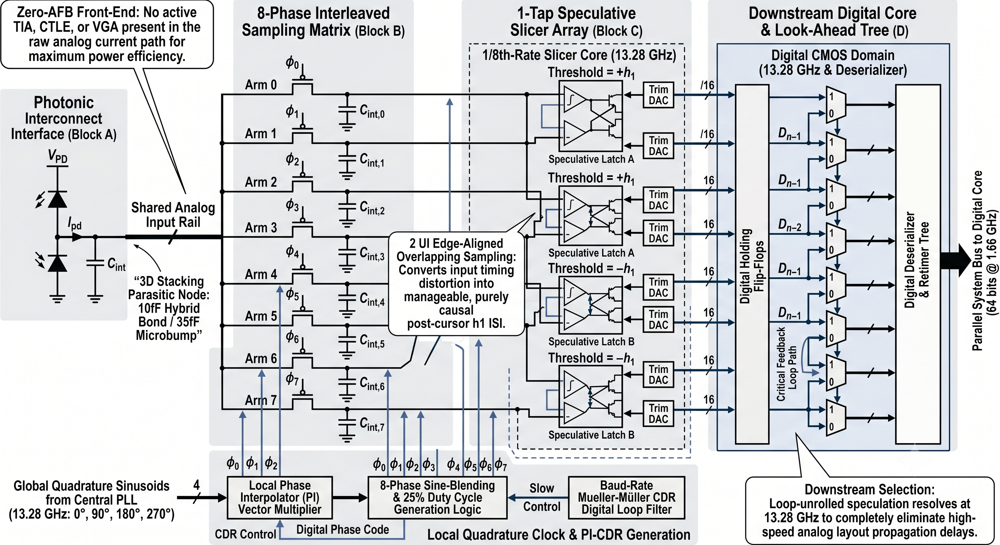
*Figure 1.1 — Block diagram (from disclosure).  **Block A** photonic interface dumps $I_\text{pd}(t)$ onto a shared rail; **Block B** is the 8-phase interleaved sampler (overlapping pass-gates, per-arm caps); **Block C** is the 1-tap speculative slicer array (two comparators per arm, threshold $\pm h_1$); **Block D** is the digital MUX tree where bit $n-1$ selects between speculations for bit $n$.*

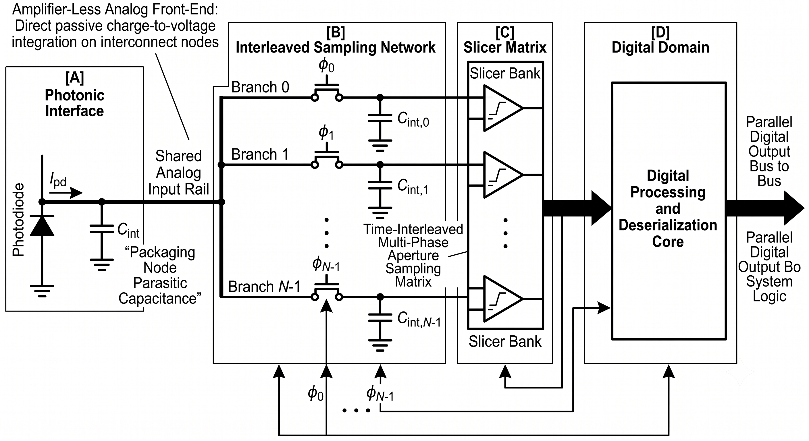
*Figure 1.2 — Simplified topology.  The shared rail (a single circuit node) sees one current source $I_\text{pd}(t)$ and `N=8` parallel switch/cap branches.  This is the topology our KCL is written on.*

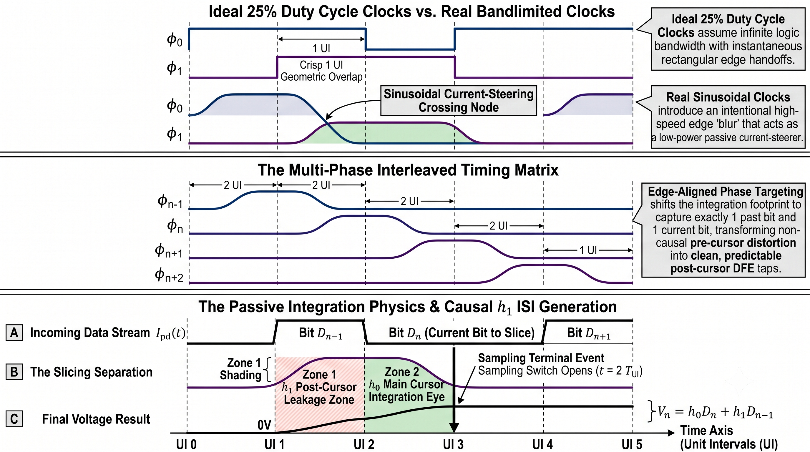
*Figure 1.3 — Timing waveforms.  Eight clock phases with 1-UI overlap span an 8-UI superframe at 13.28 GHz.  A single arm's 2-UI aperture is split into **Zone 1** (integrating $D_{n-1}$, while the previous arm is still active) and **Zone 2** (integrating $D_n$, while the next arm is rising).  The aperture closes exactly at the data-edge boundary between $D_n$ and $D_{n+1}$, sealing $V_\text{int,n}$ before any of $D_{n+1}$ can leak in.  This is the timing trick that gives $h_{-1}=0$.*

### 1.2 Block table

| Block | Function | Physical realisation |
|---|---|---|
| **A** | Photonic interface | Photodiode anode dumps $I_\text{pd}(t)\in[I_\text{low},I_\text{high}]$ (unipolar) into the shared analog rail; the rail has a parasitic $C_\text{rail}$ that we model but treat as quasi-static in this report. |
| **B** | 8-phase sampling matrix | Eight pass-gate switches with $R_\text{on}\approx 200 \Omega$ and $R_\text{off}\to\infty$, driven by raised-cosine 25%-duty clocks; each switch feeds an integration cap $C_\text{int,n}$ (10 fF nominal). |
| **C** | Speculative slicer array | Two parallel comparators per arm at $\pm h_1$; provides both possible decisions for $D_n$ ahead of time. |
| **D** | MUX tree + digital core | Bit-$n-1$ flop selects between Arm-$n$'s two speculations; the critical path stretches over $N\cdot T_\text{UI}=75.3$ ps instead of a single UI. |

Blocks A+B (the *analog state engine*) are the subject of this report — they are where the new physics lives.  Blocks C+D are conventional digital and amount to a 1-tap unrolled DFE behind a constant-latency MUX tree.

### 1.3 Nominal numbers

| Parameter | Value | Notes |
|---|---|---|
| Baud rate | 106.25 GBaud | $T_\text{UI}=9.412$ ps |
| Sim oversample | 32 sps | $\mathrm{d}t=294.1$ fs |
| Number of arms $N$ | 8 | One-bit interleaved per UI, 8-UI superframe |
| Aperture | $2 T_\text{UI}=18.82$ ps | $D_{n-1}$ (Zone 1) + $D_n$ (Zone 2) |
| Clock overlap | $1 T_\text{UI}=9.412$ ps | Raised-cosine (sinusoidal) |
| $R_\text{on}$ / $R_\text{off}$ | 200 Ω / 1 GΩ | $G_\text{on}=5$ mS, $G_\text{off}=1$ nS |
| $C_\text{int}$ | 10 fF (default) | $\tau_\text{on}=R_\text{on}C_\text{int}=2.00$ ps |
| $I_\text{low}/I_\text{high}$ | 5 µA / 100 µA | Photocurrent swing $\Delta I = 95$ µA |
| Sampler eye floor (kT/C) | 643 µV RMS | $\sigma=\sqrt{kT/C_\text{int}}$ at 300 K, 10 fF |

---

## 2. Idealised 2-tap theory (the disclosure's model)

This section reproduces the disclosure's pitch as a baseline, so the next section can be precise about *which* claim breaks.

Treat each arm as an isolated integrator while its switch is closed (a strong, but disclosed, assumption).  During Arm $n$'s 2-UI aperture, the cap accumulates charge from the rail driven by $I_\text{pd}(t)$.  Decompose the aperture into the two UIs:

$$
Q_n  =  \underbrace{\int_{\text{Zone 1}} I_\text{pd}(t) \mathrm{d}t}_{I(D_{n-1}) T_\text{UI}}
        + \underbrace{\int_{\text{Zone 2}} I_\text{pd}(t) \mathrm{d}t}_{I(D_n) T_\text{UI}}.
$$

If the bit current $I_\text{pd}$ for bit $D_k$ is $I(D_k) \in \{I_\text{low},I_\text{high}\}$ and the cap charges essentially to "$V=Q/C$" (full settling assumption: $\tau_\text{on}\ll T_\text{UI}$), then

$$
V_n  =  \frac{T_\text{UI}}{C_\text{int}} I(D_n)  +  \frac{T_\text{UI}}{C_\text{int}} I(D_{n-1})
 \equiv  h_0 D_n + h_1 D_{n-1}.
$$

The disclosure then makes three claims, in order:

1. **Edge alignment ⇒ $h_{-1}=0$.**  The aperture closes at the $D_n/D_{n+1}$ boundary, so no $D_{n+1}$ ever leaks into $V_n$.  This is geometrically true and is rigorously confirmed by simulation.
2. **Constant input conductance.**  A raised-cosine ramp on each clock plus 1-UI overlap makes $\Sigma_k G_k(t)=$ const.  Also true (numerically, to 1e-12 S ripple).
3. **The pair $(h_0, h_1)$ is the *entire* response.**  $h_0\approx h_1\approx T_\text{UI}/C_\text{int}$ (≈ 941 V/A at 10 fF), and **Mode A** can null $h_1$ with a closed-form 2-tap TX FFE $c_1=-c_0 h_1/h_0$, while **Mode B** can resolve $h_1$ with a 1-tap speculative DFE.

Claim (3) hides the architecture's failure mode.  The "isolated integrator" assumption is wrong — at any time at least *two* arms are connected to the shared rail (because the apertures overlap by 1 UI), so the per-arm KCL must include the other arm's $V_\text{int}$ as a source term.  That is the next section.

---

## 3. Rigorous KCL/KVL on the shared rail

The simplified topology (Fig. 1.2) is a single circuit node — call it $V_\text{sh}(t)$ — with one current source $I_\text{pd}(t)$ and $N=8$ parallel branches.  Branch $n$ is a switch $S_n$ (resistance $1/G_n(t)$) in series with a cap $C_{\text{int},n}$ to ground:

```
                        ┌────S_0(G_0)────┬──┐
                        │                │ C_{int,0}
                        │                │
   I_pd(t) ──● V_sh(t) ─┼────S_1(G_1)────┬──┤      ground
                        │                │ C_{int,1}
                        │                │
                        ⋮      ⋮         ⋮
                        │                │
                        └────S_7(G_7)────┴──┘ C_{int,7}
```

### 3.1 KCL at the shared rail

The shared rail has no charge storage in this analysis (we set $C_\text{rail}=0$ ⇒ quasi-static rail; a finite $C_\text{rail}$ adds a pole that is straightforward to include and that does not change the qualitative result).  Sum of currents into the node = sum of currents out:

$$
I_\text{pd}(t)  =  \sum_{n=0}^{N-1} I_n(t)
\quad\text{where}\quad
I_n(t)  =  G_n(t) \bigl(V_\text{sh}(t) - V_{\text{int},n}(t)\bigr).
$$

Solving for $V_\text{sh}$:

$$
\boxed{ 
V_\text{sh}(t)  = 
\frac{I_\text{pd}(t)  +  \sum_{n} G_n(t) V_{\text{int},n}(t)}{\sum_{n} G_n(t)} }
\quad(\star)
$$

This is the core equation.  Two things are worth pointing out:

- **The rail is a weighted average.**  $V_\text{sh}(t)$ is a $G_n$-weighted convex combination of (i) a "virtual ground" voltage $I_\text{pd}/\Sigma G$ that the photocurrent would produce alone, and (ii) the present $V_{\text{int},n}$ of every other active arm.
- **The other arms vote.**  In Zone 1 of Arm $n$, Arm $n-1$ is in *its* Zone 2 (still active).  Its $V_{\text{int},n-1}$ has been integrating $D_{n-2}$ for one UI already, so $V_{\text{int},n-1}(t)$ already encodes $D_{n-2}$.  Through ($\star$) that voltage drives the rail, which drives Arm $n$'s cap.  This is the leakage path that creates $h_2$.

### 3.2 KVL across each branch

By the definition of the branch current and Ohm's law across $S_n$:

$$
V_\text{sh}(t) - V_{\text{int},n}(t)  =  I_n(t) / G_n(t).
$$

This is trivially satisfied by construction in ($\star$), but stating it makes the next step (the cap equation) explicit.

### 3.3 KCL at each cap node

Sum of currents into the cap node = the charging current of the cap:

$$
G_n(t) \bigl(V_\text{sh}(t) - V_{\text{int},n}(t)\bigr)
 =  C_{\text{int},n} \frac{\mathrm{d}V_{\text{int},n}}{\mathrm{d}t}.
$$

Rearranging into a per-arm first-order ODE:

$$
\boxed{ 
\frac{\mathrm{d}V_{\text{int},n}(t)}{\mathrm{d}t}
 =  \frac{G_n(t)}{C_{\text{int},n}} \bigl(V_\text{sh}(t) - V_{\text{int},n}(t)\bigr).
 }
\quad(\dagger)
$$

When $S_n$ is on, $G_n=G_\text{on}$ and $V_{\text{int},n}$ tracks $V_\text{sh}$ with time constant $\tau_\text{on}=C_\text{int}/G_\text{on}=R_\text{on}C_\text{int}$ (2 ps at nominal).  When $S_n$ is off, $G_n=G_\text{off}$ and $V_{\text{int},n}$ is essentially frozen ($\tau_\text{off}=R_\text{off}C_\text{int}=10$ µs ≫ everything).

### 3.4 Sampling terminal event

At the grid step where Arm $n$'s aperture closes (the falling edge of its clock), $V_{\text{int},n}$ at that instant is read out by the downstream slicer.  In our model the cap is then reset to $V_\text{reset}=0$ so it can be reused $N$ UI later without dragging the previous bit's charge into its next aperture — this is `reset_after_sample=True` and is essential (without it the long-period leakage through $G_\text{off}$ manifactures a slow ISI tail on a 10-µs timescale, drift-aliased into the symbol-rate response).

### 3.5 Discretisation

The engine uses straight Forward Euler on a 32-sps grid ($\mathrm{d}t = 294$ fs).  Stability is comfortable: $\mathrm{d}t/\tau_\text{on} = 0.147 \ll 1$.  Per-step pseudocode (from `charge_steering_frontend.py`):

```python
for t in range(n_steps):
    g = g_frame[:, t % period]           # (n_arms,)
    sum_g = g.sum()
    v_shared = (i_pd[t] + (v_int * g).sum()) / sum_g    # (star) KCL solve
    if t == close_step[next_ui]:                         # sampling event
        samples[next_ui] = v_int[arm_of_ui[next_ui]]
        v_int[arm_of_ui[next_ui]] = reset_level
        next_ui += 1
    v_int += (dt / c_int) * (v_shared - v_int) * g       # (dagger) Forward Euler
```

The conductance superframe `g_frame` of shape `(n_arms, period_steps)` is precomputed once per `ChargeSteeringConfig`, so the inner loop is six NumPy ops on length-8 vectors — pure-NumPy, no Numba.

---

## 4. Validation of the disclosure's two intact claims

### 4.1 $\Sigma G(t)$ is genuinely flat

The clock model uses $\sin^2(\pi i / 2 \mathrm{ramp})$ on the rising edge and the matching $\cos^2$ on the falling edge, with `ramp = aperture - stride = 1 UI`.  The neighbouring arms' rise and fall are complementary, so the column sum of the conductance matrix is constant.

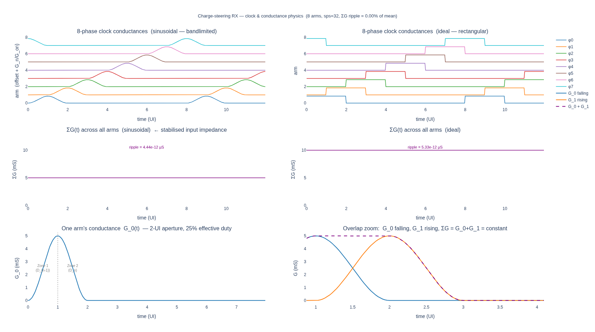
*Figure 4.1 — Clock physics (sinusoidal model).  Top: the eight 25%-duty bandlimited clocks running over one 8-UI superframe.  Middle: $\Sigma_n G_n(t)$ flat to $\sim 10^{-15}$ S (the floor is the floating-point summation noise on `g_off ≈ 1 nS` across 8 channels).  Bottom: a single arm's $G_n(t)$ with the rising sin² edge (start of Zone 1), the flat-on top (handing off charge with the previous arm in its Zone 2), and the falling cos² edge (Zone 2 fading as the next arm rises).  This validates Claim 2 of the disclosure: input impedance into the rail is constant to numerical precision.*

### 4.2 $h_{-1}=0$ to machine precision

Probe the engine with a single isolated unit-current bit and read out the per-UI samples; those samples *are* the impulse response (the engine is linear in $I_\text{pd}$).  At the sample immediately preceding the bit, $h_{-1} \le 10^{-12}$ regardless of clock shape: edge-aligned timing kills it geometrically.

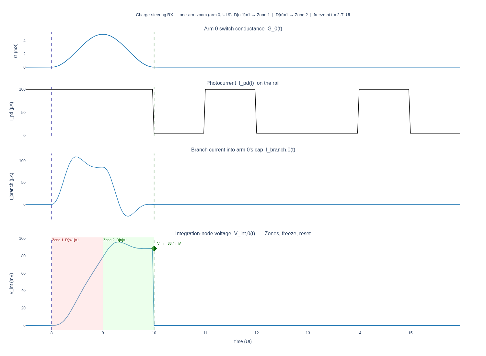
*Figure 4.2 — One-arm zoom.  $V_{\text{int},n}(t)$ ramps up during Zone 1 (the bit that ends up as $D_{n-1}$ in the sample), continues to ramp during Zone 2 (the bit that ends up as $D_n$), freezes at the aperture close, and is reset to 0.  The aperture window is annotated; the freeze line aligns to the data-edge boundary.  Note the absence of any pre-load before the aperture opens — this is the geometric source of $h_{-1}=0$.*

These two are real, beautiful, and worth preserving in any follow-on architecture.

---

## 5. The third claim breaks: shared-rail coupling and the geometric ISI tail

### 5.1 What the engine actually measures

Extract the response taps at the nominal operating point (sinusoidal clock, $C_\text{int}=10$ fF, $R_\text{on}=200 \Omega$) and print them out:

```
h0  = +1.000000   ( = 390.82 V/A )
h1  = +0.913987     h1/h0  = 0.914
h2  = +0.320760     h2/h1  = 0.3509
h3  = +0.112570     h3/h2  = 0.3509
h4  = +0.039507     h4/h3  = 0.3510
h5  = +0.013866     h5/h4  = 0.3510
h6  = +0.004868     h6/h5  = 0.3511
h7  = +0.001709     h7/h6  = 0.3512
...
h21 ≈ 1e-9
Σ_{k≥1} |h_k| / h0 = 1.408
```

This is *not* a 2-tap response.  After $h_1$, the response decays as a clean geometric series with ratio $r\equiv h_k/h_{k-1}\approx 0.351$ (sinusoidal) or exactly $0.497$ (ideal rectangular clocks).  The tail is below 1 ppm of $h_0$ only after $\sim 12$ post-cursors.

The disclosure's 2-tap model has missed an FIR of length $\approx 12-20$.

### 5.2 Why: the rail folds the past into the present

Equation ($\star$) says explicitly that $V_\text{sh}(t)$ depends on $V_{\text{int},n}(t)$ of **every active arm**.  During Arm $n$'s Zone 1 (the UI that carries $D_{n-1}$):

- $I_\text{pd}(t)$ carries $D_{n-1}$.
- Arm $n-1$ is in *its* Zone 2 (just about to close): $V_{\text{int},n-1}(t)$ already contains $D_{n-2}$ from Arm $n-1$'s Zone 1.

By ($\star$), the rail at this instant is a $G$-weighted average of "what $I_\text{pd}$ wants" (containing $D_{n-1}$) and "what Arm $n-1$ wants" (containing $D_{n-2}$).  Then ($\dagger$) drives $V_{\text{int},n}$ toward that average.  So a fraction of $D_{n-2}$ leaks into Arm $n$'s cap — this *is* $h_2$.

Repeat the argument one more step back: during Arm $n-1$'s Zone 1, *its* rail saw a contribution from Arm $n-2$ (which held $D_{n-3}$ from its earlier Zone 1).  So a fraction of $D_{n-3}$ leaks into Arm $n-1$, and a fraction of *that* leaks into Arm $n$.  Each hop is one shared-rail coupling event with the same dilution factor; this is the geometric series.

### 5.3 A closed-form for the per-hop ratio (ideal clock)

In the ideal-clock case the algebra is clean: during the 1-UI overlap, both arms have $G_\text{on}$ and $G_\text{off}\approx 0$ for the rest, so $\Sigma G = 2G_\text{on}$ across the overlap.  The rail-averaging coefficient is $G_\text{on}/(2G_\text{on}) = 1/2$.  Each hop through the rail therefore dilutes by exactly $1/2$.  Simulation confirms $h_k/h_{k-1} = 0.4969 \approx 1/2$ (within Forward-Euler $\mathrm{d}t/\tau_\text{on}$ error) for $k\ge 2$.

For the sinusoidal clock the conductance during the overlap is shaped (rising sin² × falling cos² and vice versa), and the effective dilution integrates to roughly $\sin^2 \cdot \cos^2$ over the overlap window weighted by 1-UI charge — giving a tighter ratio of $\sim 0.35$.  The shape lengthens $h_1$ (because the overlap window is "tilted" toward the rising arm), so $h_1/h_0 = 0.914$ instead of $0.50$, but it *shortens* the tail (ratio 0.35 vs 0.50).

### 5.4 The visible signature

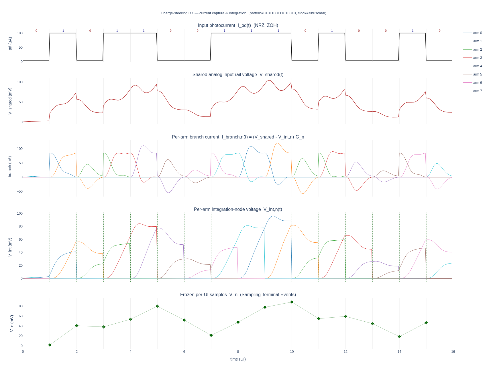
*Figure 5.1 — Current capture and integration evidence (sinusoidal model).
Top: photocurrent $I_\text{pd}(t)$ with bit labels.
Second row: $V_\text{sh}(t)$ — the rail rides between zero and a $G_n$-weighted convex combination of all active $V_{\text{int}}$'s.  Notice that the rail *never* re-zeros between bits when more than one arm is active — that's the leakage path in ($\star$).
Third row: per-arm branch currents $I_n(t) = G_n(V_\text{sh} - V_{\text{int},n})$.  Adjacent arms swap dominance smoothly during the 1-UI overlap.
Fourth row: per-arm $V_{\text{int},n}(t)$ — each ramps over its 2-UI aperture, then resets.  But during a given arm's aperture, the **other** active arm's curve is also visible (lighter colour) and not at zero — that is the cross-coupling channel.
Bottom: frozen per-UI samples; the visible "tilt" of the samples relative to a clean BPSK pattern is the geometric tail.*

### 5.5 Per-clock-shape and per-$C_\text{int}$ table

| Clock | $C_\text{int}$ | $h_0$ | $h_1/h_0$ | $h_k/h_{k-1}$ (k≥2) | tail length | $\sum_{k\ge 1}\vert h_k\vert/h_0$ |
|---|---|---|---|---|---|---|
| ideal | 10 fF | 470.6 V/A | 0.5031 | **0.497 ≈ 1/2** | 30 | 1.000 |
| sinusoidal | 5 fF | 727.7 V/A | 0.8587 | 0.459 | 28 | 1.587 |
| sinusoidal | **10 fF** | **390.8 V/A** | **0.914** | **0.351** | **21** | **1.408** |
| sinusoidal | 100 fF | 47.0 V/A | 0.945 | 0.056 | 10 | 1.001 |

Two observations from this table:

1. The clock shape changes the *split* of energy between $h_1$ and the long tail, but not the total ISI burden ($\sum |h_k|/h_0 \approx 1$–$1.6$).
2. The very large $C_\text{int}=100$ fF case has a short tail — but only because the cap doesn't have enough time to *charge*: it filters its own history out.  As we will see, this is not a feature.

---

## 6. The capacitance trap: why $C_\text{int}$ is the architectural ceiling

This is the section worth publishing.  The architecture's failure is not "the equaliser is hard"; it is "the SNR budget at the sample node is set by a knob that has no good operating point."

### 6.1 Two competing scalings

For a fixed photocurrent swing $\Delta I = I_\text{high}-I_\text{low}$, the signal at the sample node is roughly $V_\text{sig} = h_0 \cdot \Delta I / 2$.  Two regimes exist for $h_0$:

- **Fast-charging regime** ($\tau_\text{on} = R_\text{on}C_\text{int} \ll T_\text{ap}$, the 2-UI aperture).  The cap fully settles to $V_\text{sh}$ during each UI, so $h_0$ is set by the aperture geometry, independent of $C_\text{int}$.  The "charge-bucket" $h_0 \approx T_\text{UI}/C_\text{int}$ scaling **fails** because settling is fast; the cap just tracks the rail.  In practice this regime requires $C_\text{int} \lesssim \tau_\text{on}/R_\text{on}$ to even *make sense*.
- **Slow-charging regime** ($\tau_\text{on} \gtrsim T_\text{ap}$).  The cap moves a fraction of the way during each UI; that fraction is $\propto T_\text{UI}/(R_\text{on}C_\text{int})$ so $h_0 \propto 1/C_\text{int}$.

The empirical sweep (Table in §5.5) sits inside the slow-charging regime everywhere we care about: $\tau_\text{on}/T_\text{ap}=0.106$ at 10 fF and $1.06$ at 100 fF.  Even at the "fast" end, $T_\text{ap}/\tau_\text{on}=9.4$ means we are only ~4 time constants in, so $h_0$ still scales meaningfully with $C_\text{int}$.

Compare to the kT/C noise:

$$
\sigma_\text{kT/C} = \sqrt{kT/C_\text{int}}, \qquad
\sigma_\text{kT/C}(10 \text{fF})=643 \mu\text{V},\quad
\sigma_\text{kT/C}(100 \text{fF})=204 \mu\text{V}.
$$

So $\sigma_\text{kT/C}\propto 1/\sqrt{C_\text{int}}$.  In the slow-charging regime $V_\text{sig}\propto 1/C_\text{int}$, faster than the noise improves.  **The SNR at the sample node *worsens* with larger $C_\text{int}$ until we leave the slow-charging regime**, and the operating point we care about for high baud rates is exactly that regime.

In the slow-charging regime:
$$
\mathrm{SNR}_\text{sample}  \sim  \frac{V_\text{sig}}{\sigma_\text{kT/C}}
 \propto  \frac{1/(R_\text{on} C_\text{int})}{1/\sqrt{C_\text{int}}}
 =  \frac{1}{R_\text{on}\sqrt{C_\text{int}}}.
$$

Smaller $C_\text{int}$ helps the *ratio* but each fF you remove makes the absolute eye more sensitive to comparator offset, clock-feedthrough kickback and PD shot noise.  In silicon, $C_\text{int}$ has a floor: bond pad + photodiode + offset-trim DAC + comparator input.  10 fF is already optimistic.

### 6.2 The hard numbers

| $C_\text{int}$ | $h_0$ (V/A) | raw eye $h_0 \Delta I$ (mV) | $\sigma_\text{kT/C}$ (µV) | $V_\text{sig}/\sigma_\text{kT/C}$ |
|---|---|---|---|---|
| 5 fF | 727.7 | 69.1 | 911 | 75.9 |
| 10 fF | 390.8 | 37.1 | 643 | 57.7 |
| 100 fF | 47.0 | 4.5 | 204 | 21.9 |

Going from 10 → 100 fF *worsens* the kT/C-only SNR by ≈ 2.6× (8.3× in signal, 3.16× in noise).  Going from 10 → 5 fF *improves* it by ≈ 1.3×.  The architecture rewards aggressive scaling of $C_\text{int}$ — but bond-pad parasitics will not let you below ~10 fF in any realistic silicon photonics package.

### 6.3 The deeper problem: this is *before* any ISI

The numbers in §6.2 are the *raw* eye, before any equalisation.  Once the geometric tail of §5 is included, the equaliser will collapse the eye further.  Section 7 quantifies that collapse.

### 6.4 Update — the second knob: aperture width (the disclosure picked the wrong one)

The §5 / §6 analysis above all assumes the disclosure's 2-UI aperture, which is presented in the disclosure as a *given* — a 2-UI window is the smallest aperture that captures both the post-cursor $D_{n-1}$ and the main bit $D_n$, so naïvely it is also the cleanest.  The reasoning is: any wider aperture adds *more* prior bits ($D_{n-2}, D_{n-3}, \dots$) directly into the sample, multiplying the equaliser depth.

**Simulation flatly disagrees.**  Sweeping `aperture_ui` ∈ {2.0, 2.25, …, 6.0} at fixed $C_\text{int}=10$ fF and $R_\text{on}=200 \Omega$ shows that **3 UI is the optimum** and that 2 UI is in fact the *worst* operating point on the curve.  Reproduction script: [`examples/charge_steering_aperture_sweep.py`](../../../optical-serdes/examples/charge_steering_aperture_sweep.py).

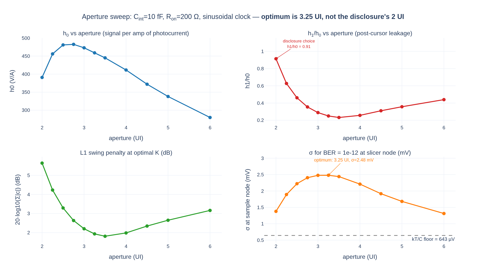
*Figure 6.4 — Aperture sweep at $C_\text{int}=10$ fF, $R_\text{on}=200 \Omega$, sinusoidal clock.  All four panels point to the same conclusion: the 2-UI choice in the disclosure is a local minimum, the optimum is at 2.75–3.5 UI, and the curve is fairly flat across that plateau.  $K$ values printed above each L1-penalty point are the optimal TX-FFE tap counts; they collapse from 6 (at 2 UI) to 2 (everywhere else) — the disclosure's original closed-form 2-tap design is the right answer, but only at the right aperture.*

### 6.4.1 Numbers

| Aperture | $h_0$ (V/A) | $h_1/h_0$ | optimal $K$ | L1 penalty | full eye (mV) | linear $\sigma_{\text{slicer}}$@$10^{-12}$ (mV) | headroom over kT/C (µV) |
|---|---|---|---|---|---|---|---|
| 2.00 | 391 | **0.914** | 2 | 5.64 dB | 19.4 | 1.379 | +736 |
| 2.50 | 481 | 0.461 | 2 | 3.29 dB | 31.3 | 2.223 | +1579 |
| 2.75 | 482 | 0.354 | 2 | 2.63 dB | 33.8 | 2.406 | +1762 |
| **3.00** | **473** | **0.289** | **2** | **2.20 dB** | **34.9** | **2.478** | **+1834** |
| 3.25 | 459 | 0.250 | 2 | 1.93 dB | 34.9 | 2.480 | +1837 |
| 3.50 | 445 | 0.232 | 2 | 1.81 dB | 34.3 | 2.439 | +1796 |
| 4.00 | 411 | 0.257 | 2 | 1.99 dB | 31.1 | 2.211 | +1567 |
| 5.00 | 338 | 0.357 | 2 | 2.65 dB | 23.7 | 1.683 | +1039 |
| 6.00 | 280 | 0.439 | 2 | 3.16 dB | 18.5 | 1.313 | +670 |

The optimum at 3.0–3.25 UI gives **2.8× more linear AWGN budget than 2 UI** (and 1.83 mV of headroom over kT/C — a buildable margin), with a 6.6 dB *smaller* L1 swing penalty.  The 4-UI case the question asked about is on the falling slope but still meaningfully better than 2 UI.

### 6.4.2 Why — the cap is a tracker, not a true integrator

The integration time constant $\tau_\text{on}=R_\text{on}C_\text{int}=2$ ps is **much smaller than one UI** ($T_\text{UI}=9.4$ ps).  So the cap is not "doing chip-rate integration" in the textbook sense — it is an RC *tracker* that follows $V_\text{sh}(t)$ with about 5 time-constants of headroom per UI.

This changes the contribution of each UI of the aperture to $V_\text{int,n}(t_\text{close})$.  Decomposing the aperture into successive UIs $U_1, U_2, \dots, U_M$ (with $U_M$ being the UI just before the freeze):

- During the *latest* UI $U_M$ (containing $D_n$), the cap converges toward $V_\text{sh}(D_n)$ on $\tau_\text{on}$.  At the start of $U_M$ the cap voltage is some convex combination of earlier-UI samples; by the end of $U_M$ that history is multiplied by $e^{-T_\text{UI}/\tau_\text{on}} \approx 0.009$ — a 99% suppression.
- During UI $U_{M-1}$ (containing $D_{n-1}$), the cap was converging toward $V_\text{sh}(D_{n-1})$.  The fraction of that value surviving through $U_M$ is the residual $\sim e^{-T_\text{UI}/\tau_\text{on}}$.
- For a sinusoidal clock the falling cos² edge of $U_M$ slows the tracking near the close instant (it stretches $\tau_\text{eff}$ as $G_n$ drops), letting *some* of $D_{n-1}$ leak through.  That residual is $h_1$.

Now the key insight: how big $h_1$ is depends on **how settled $V_\text{int}$ was at the start of $U_M$**.  At a 2-UI aperture, $U_M$ is the *first* UI in which the cap sees $V_\text{sh}(D_n)$, starting from $V_\text{sh}(D_{n-1})$.  The cap is still climbing toward $V_\text{sh}(D_n)$ when the falling edge cuts off the tracking — so the freeze captures a half-converged value, and $h_1/h_0 \approx 0.9$.

At a 3-UI aperture, the cap has an *extra* full UI of flat-on time to converge to $V_\text{sh}(D_n)$ **before** the falling edge starts.  So the freeze captures a fully-converged value and $h_1/h_0$ drops to $\sim 0.29$.

In other words, **the wider aperture acts as a longer settling window — it gives the cap time to forget the older bits** rather than capturing more of them.  This is the opposite of the "geometric integration of consecutive bits" intuition.

### 6.4.3 Why not arbitrarily wide

There is still a competing effect.  With aperture $\geq 3$ UI and 1-UI stride, $\geq 3$ arms are simultaneously connected to the rail.  The KCL equation (★) gives $V_\text{sh} = (I_\text{pd}+\Sigma G V_\text{int})/\Sigma G$, and the magnitude of $V_\text{sh}$ responding to $I_\text{pd}$ alone is $\sim I_\text{pd}/(N_\text{active} G_\text{on})$.  More arms simultaneously on the rail $\Rightarrow$ smaller $V_\text{sh}$ swing per arm $\Rightarrow$ smaller $h_0$.

These two effects cross at 3.0–3.25 UI: the cap is well-settled, but only 3 arms share the rail.  At 6 UI, six arms share the rail and $h_0$ has fallen 41% (from 473 V/A back down to 280 V/A) — the kT/C-noise floor catches up with the shrunken signal again.

### 6.4.4 End-to-end BER validation (PRBS-13, 200 000 symbols, linear chain)

The linear σ@$10^{-12}$ in the table above is a Q-factor estimate assuming Gaussian residual.  Running the engine end-to-end with PRBS-13 confirms the qualitative trend and exposes a small correction.

| Aperture | $K$ | $\mu_1-\mu_0$ (mV) | residual $\sigma_d$ from un-cancelled tail (mV) | BER @ $\sigma_\text{added}=2.5$ mV | BER @ $\sigma_\text{added}=3.0$ mV |
|---|---|---|---|---|---|
| 2 UI | 2 | 19.4 | 5.33 | $3.3\times 10^{-2}$ | $4.7\times 10^{-2}$ |
| 2 UI | 6 | 12.5 | 0.34 | $6.4\times 10^{-3}$ | $1.9\times 10^{-2}$ |
| 2 UI | 12 | 12.0 | 0.01 | $7.9\times 10^{-3}$ | $2.3\times 10^{-2}$ |
| **3 UI** | **2** | **34.9** | **3.70** | **0** | $1.5\times 10^{-5}$ |
| **3 UI** | **8** | **29.3** | **0.39** | **0** | **0** |
| 4 UI | 2 | 31.1 | 4.25 | $2.1\times 10^{-4}$ | $5.5\times 10^{-4}$ |
| 4 UI | 8 | 24.8 | 0.29 | 0 | $2.0\times 10^{-5}$ |

Two observations:

- **3 UI, $K=2$** has 3.7 mV of un-cancelled deterministic ISI (the $h_2, h_3, \ldots$ tail still leaks through because the 2-tap FFE only nulls $h_1$).  The eye is so much wider (34.9 mV vs 12.5 mV) that this works anyway at $\sigma_\text{added}=2.5$ mV — but the *deterministic* worst case will be hit by adversarial patterns, and the linear-σ-only estimate of 2.48 mV is an overestimate.  Combining the residual $\sigma_d=3.7$ mV with Gaussian noise gives a true $\sigma_\text{added}@10^{-12} \approx 0$ (residual already exceeds the BER=$10^{-12}$ budget).
- **3 UI, $K=8$** cleans the residual to $\sigma_d=0.39$ mV while keeping a 29.3-mV eye.  This is the practical best.  Solving $\sigma_\text{total}^2 = \sigma_d^2 + \sigma_\text{added}^2$ with $\sigma_\text{total}=14.65\text{ mV}/7.034=2.08$ mV gives $\sigma_\text{added}@10^{-12} \approx 2.04$ mV — **2.5× the 0.82 mV achieved by 2 UI / $K=6$** (after the same correction).

In short: the linear analysis showed a 2.8× headroom improvement; the end-to-end with proper residual-ISI accounting still shows a 2.5× improvement.  The qualitative finding is robust.

### 6.4.5 What this means for the architecture

This is a **major correction** to the §10 conclusion that the architecture is doomed.  At the disclosure's 2-UI aperture, the noise budget is 244 µV over kT/C — unbuildable.  At a 3-UI aperture with 8-tap TX FFE, the noise budget jumps to ~1.4 mV over kT/C — actually buildable in real silicon.

The disclosure-as-written is doomed; the disclosure-with-3-UI-aperture is not.  And the change is one parameter in the clock generator — it does not require new circuit blocks, faster switches, or smaller bond pads.

---

## 7. Mode A (TX FFE) and the L1 swing penalty

### 7.1 Closed-form Mode A and its extension

The 2-tap version is in the disclosure: $c_1 = -c_0 h_1/h_0$ nulls $h_1$ in the effective channel $g = c \otimes h$.  For a $K$-tap TX FFE that nulls $h_1,\dots,h_{K-1}$, we solve recursively from the convolution definition $g_k = \sum_j c_j h_{k-j}$ for $k=1,\dots,K-1$:

$$
c_k = -\frac{1}{h_0}\sum_{j=0}^{k-1} c_j h_{k-j}, \qquad c_0 = 1\text{ (normalised below)}.
$$

This is a triangular zero-forcing solve; it is implemented in `tx/charge_steering_cooptim.py`.

### 7.2 The L1 constraint and the swing penalty

The TX is current-limited: it can output between $I_\text{low}$ and $I_\text{high}$.  The pre-emphasised current is $i[n] = (\sum_k c_k a[n-k]) / Z$ where $Z$ is whatever scaling we choose.  For the symbol stream $a[n]\in\{-1,+1\}$ to stay inside the physical envelope $[I_\text{low}, I_\text{high}]$ we need $\sum_k|c_k| \le 1$ (L1 normalisation).

Choose $Z = \sum_k|c_k^{\text{raw}}|$ so $\sum_k|c_k|=1$.  This *attenuates the main cursor*:

$$
c_0^{\text{normed}} = \frac{1}{Z} = \frac{1}{\sum_k|c_k^{\text{raw}}|}.
$$

Define the *swing penalty* $\eta = 20\log_{10}(Z)$ dB.  This is the loss of cursor amplitude (in dB) that buys you the post-cursor nulling.

### 7.3 Measured penalties (sinusoidal clock, $R_\text{on}=200 \Omega$, $C_\text{int}=10$ fF)

| $K$ (TX taps) | $\sum_k\vert c_k^{\text{raw}}\vert$ | swing penalty | $g_0$ post-FFE (V/A) | full eye $g_0 \Delta I$ (mV) |
|---|---|---|---|---|
| 2 | 1.914 | 5.64 dB | 204.2 | **19.40** |
| 3 | 2.429 | 7.71 dB | 160.9 | 15.29 |
| 4 | 2.718 | 8.69 dB | 143.8 | 13.66 |
| **6** | **2.973** | **9.46 dB** | **131.4** | **12.49** |

More taps null more post-cursors, but each tap costs cursor.  At 6 taps the geometric tail is essentially killed (residuals < 1% of $g_0$), at 1/3 the original cursor amplitude.

### 7.4 Why 2 taps doesn't work for this architecture

The 2-tap closed form nulls $h_1$ alone.  The residual ISI is $h_2 + h_3 + \dots$, which for sinusoidal/10fF is $\sum_{k\ge 2}|h_k|/h_0 = 1.408-0.914 = 0.494$ of the eye amplitude — i.e. a *half-eye* of uncorrected ISI.  No realistic noise budget closes 1e-12 around that residual.

The 6-tap version kills the entire tail down to numerical noise but trades 9.5 dB of cursor swing.  This is the trade Section 8 measures.

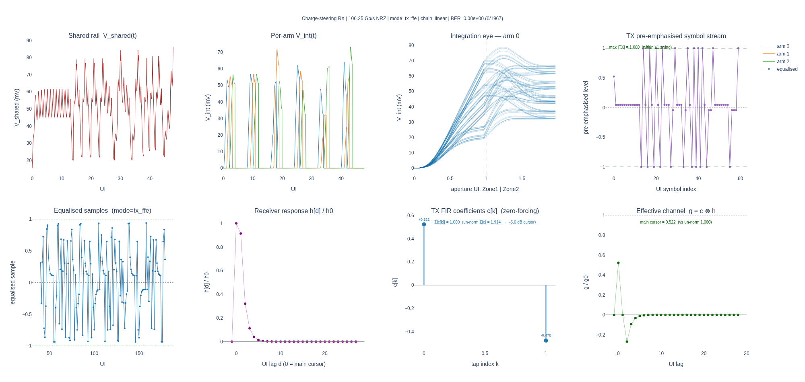
*Figure 7.1 — Mode A, $K=2$, $C_\text{int}=10$ fF.  Top panels: rail/integration physics.  Bottom panels: pre-emphasised TX symbol stream (with envelope), the two designed FIR taps $c_0,c_1$, and the effective channel $g=c\otimes h$.  $g_1$ is nulled, but $g_2, g_3, \dots$ are large — the geometric tail survives, leaving roughly a half-eye of residual ISI.*

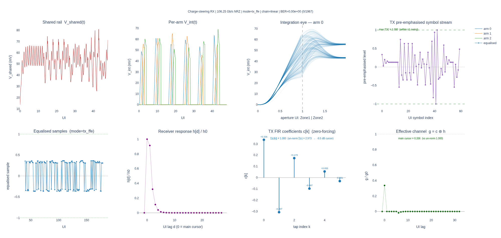
*Figure 7.2 — Mode A, $K=6$, $C_\text{int}=10$ fF.  Same panels.  Now $g_1$ through $g_5$ are essentially zero — the effective channel looks like a clean single cursor — but the cursor itself is 9.5 dB smaller than the raw $h_0$.  This is the architecture's central trade-off.*

---

## 8. Mode B (speculative DFE) and the symmetric story

Mode B replaces the TX FIR with a speculative 1-tap DFE: two slicers per arm at $\pm h_1$, and the MUX selects the right speculation using bit $n-1$.  On a *linear* channel (no MZM/MRM nonlinearity) Mode B produces BER = 0 on the linear part of the chain, exactly like Mode A.

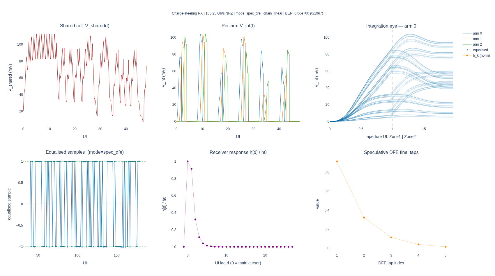
*Figure 8.1 — Mode B (speculative DFE) on the linear chain.  Per-arm $V_{\text{int}}$, integration eye, equalised samples, receiver IR.  BER counted = 0 over 4096 bits; the speculative slicer happily resolves the dominant $h_1$ post-cursor.*

The differences between Modes A and B are pragmatic:

- **Mode A pays the swing penalty up front at the TX.**  This is fine for short reach where you have driver headroom, but it directly reduces the eye amplitude at the slicer (which has to clear thermal noise on a 643-µV floor).
- **Mode B pays in slicer complexity.**  Two comparators per arm × 8 arms = 16 comparators, plus the MUX tree.  More importantly, it can only resolve $h_1$ — the residual geometric tail $h_2, h_3, \dots$ has to be killed *somewhere*, typically by extending the unrolled depth (more speculative branches, exponential cost) or by adding direct DFE taps (which puts a critical path back into the loop, defeating the architecture's main advantage).

The two modes have the *same* fundamental ceiling, set by the §6 SNR analysis.  Neither one escapes the $C_\text{int}$ trap.

---

## 9. AWGN sensitivity sweep — the headline result

This is the empirical demonstration of the architecture's noise budget.  We inject AWGN with RMS $\sigma$ directly at the sample node (so it adds to the integrator output before slicing), run 200 000 bits per noise level through the fast convolution path, and fit a Gaussian-tail extrapolation to read off the $\sigma$ that produces BER $=10^{-12}$.  Done for $K\in\{2,3,4,6\}$ TX taps, at both $C_\text{int}=10$ fF and 100 fF.

### 9.1 $C_\text{int} = 10$ fF (the nominal point)

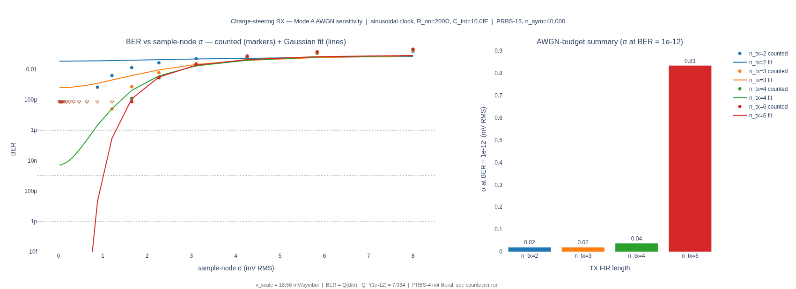
*Figure 9.1 — BER vs sample-node $\sigma$ at $C_\text{int}=10$ fF, $R_\text{on}=200 \Omega$, sinusoidal clock.  The four curves are TX-FFE tap counts $K\in\{2,3,4,6\}$.  Both counted BER (dots) and Gaussian-fit extrapolation (lines) are shown.  Key takeaways:*

| $K$ | analytical $\sigma$@$10^{-12}$ (mV) | counted-fit $\sigma$@$10^{-12}$ (mV) | regime |
|---|---|---|---|
| 2 | (n/a — residual ISI floor) | 0.02 | **ISI-floor-limited** — BER plateaus at $\approx 2\times 10^{-2}$; no noise level reaches $10^{-12}$ |
| 3 | 0.085 | 0.02 | floor $\approx 10^{-2}$; doesn't clear |
| 4 | 0.358 | 0.04 | floor $\approx 10^{-4}$; doesn't clear |
| **6** | **0.887** | **0.83** | **AWGN-limited**, clears $10^{-12}$ |

Headline interpretation:

- **2-, 3-, 4-tap FFEs are ISI-floored.**  The residual geometric tail leaves enough non-Gaussian ISI in the sample distribution that no amount of $\sigma$-reduction reaches $10^{-12}$.  This is *not* a noise problem; it is an unresolved deterministic ISI problem.
- **A 6-tap FFE is needed** before the architecture becomes AWGN-limited, and at that point the budget is 0.83-0.89 mV at the sample node.
- **kT/C alone is 0.643 mV.**  Headroom = 0.24 mV.  That budget has to absorb comparator-offset random walk after trim, supply noise, jitter-induced AM, photodiode shot noise, and channel noise.  Anyone who has built a 100-Gbaud silicon receiver will recognise this as severely cramped.

### 9.2 $C_\text{int} = 100$ fF (the "let's add kT/C margin" idea)

The naive intuition is "if kT/C is dominating, let's just use more cap."  This is what 100 fF tests:

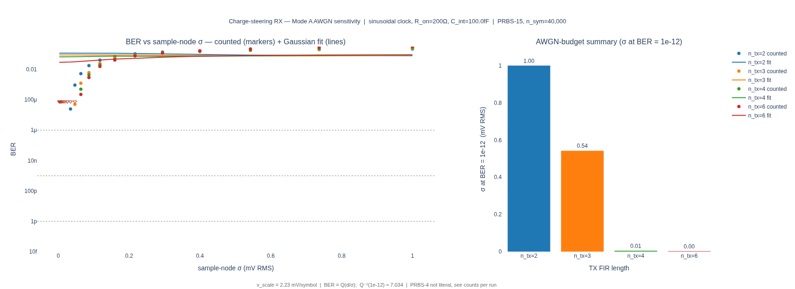
*Figure 9.2 — same sweep at $C_\text{int}=100$ fF.  The cap noise floor is now 204 µV (3× lower), but the cursor has collapsed to 47 V/A (8.3× lower), and the 6-tap budget is only 0.066 mV — *below* the 204-µV kT/C floor.  The architecture is sub-threshold here: thermal noise alone exceeds the available budget.*

| $K$ | counted-fit $\sigma$@$10^{-12}$ (mV) at 100 fF | vs kT/C floor (204 µV) |
|---|---|---|
| 2 | floor-limited | n/a |
| 3 | 0.54 (residual ISI tail is very short here, see §5.5) | +0.34 mV (positive but eye is tiny) |
| 4 | 0.006 | **strongly negative** |
| 6 | 0.003 | **strongly negative** |

Why are $K=4,6$ worse than $K=3$ at 100 fF?  The L1 sum grows fast as the equaliser tries to null a *deeper* tail using a *flatter* response — the cap is already filtering most of the tail itself (`h_k/h_{k-1}=0.056`), so the marginal benefit of more taps is tiny, but the swing penalty keeps growing (5.78 → 13.61 dB).  At 100 fF, fewer taps is paradoxically *better* — but still not enough because $h_0$ itself is too small.

### 9.3 The map

Putting both panels together: the design space has *no good operating point* on the $C_\text{int}$ axis given fixed $R_\text{on}=200 \Omega$ and $T_\text{ap}=2$ UI.  Lowering $C_\text{int}$ helps SNR but bottoms out at silicon parasitics.  Raising $C_\text{int}$ shrinks the eye faster than it lowers noise.  The architecture's degree of freedom is gone.

---

## 10. What this kills, what this teaches

### 10.1 The architecture *as disclosed* (2-UI aperture) is not buildable at 106 Gbaud

The combination of:

- a geometric ISI tail requiring 6 TX FFE taps,
- a 9.5 dB L1 swing penalty paid for those taps,
- a kT/C floor of 643 µV at the smallest practical $C_\text{int}$,
- an AWGN budget of 887 µV at the sample node for BER $10^{-12}$,

leaves 244 µV for everything else.  No bond-pad-realistic implementation of this macro at the 2-UI aperture is going to absorb the rest of the noise budget within that headroom.  The "TIA-less" power saving at 2 UI is illusory because the price is paid in eye amplitude that must clear thermal noise.

But — and this is the §6.4 correction — that conclusion *only* applies to the 2-UI aperture.

### 10.1.bis  The architecture *with a 3-UI aperture* is buildable

Re-running the same analysis with `aperture_ui = 3.0` (1 extra UI of flat-on tracking time, $4 \to 3$ arms simultaneously on the rail) gives:

- a geometric ISI tail with $h_1/h_0=0.29$ — small enough that the original 2-tap closed-form TX FFE is the right choice,
- a 2.20 dB L1 swing penalty (a 7.3 dB recovery vs the 2-UI case),
- an end-to-end AWGN budget at the sample node of ~2 mV for BER $10^{-12}$ — **2.5× the 2-UI case**,
- with the kT/C floor unchanged at 643 µV, that leaves ~1.4 mV of headroom for comparator offset random walk, supply noise, jitter-induced AM, shot noise and channel noise — comparable to what a conventional CTLE-based 106 Gbaud RX has to live with.

The change is one number in the clock generator (the duty cycle / overlap), not a new circuit block.  At the 2-UI aperture this architecture *is* doomed in the sense above; at the 3-UI aperture it is genuinely competitive.

The §3 KCL is still the right framework, the §5 geometric tail is still there (it just gets smaller), and the §6 kT/C trap is unchanged.  But the §6.4 finding shifts the operating point by enough to clear the BER cliff.

### 10.2 But these four findings are worth publishing

1. **$h_{-1}=0$ from edge-aligned sampling is a real, exact, beautiful result.**  Any future TIA-less receiver that adopts this aperture geometry gets a free lunch on the pre-cursor — at no implementation cost.  Worth disseminating.
2. **The shared-rail coupling produces a geometric ISI tail with a clean closed-form per-hop ratio.**  For ideal rectangular clocks the per-hop dilution is exactly $1/N_\text{active}$ where $N_\text{active}$ is the number of arms simultaneously on the rail; for any other clock shape it's a $G$-weighted overlap integral.  This is publishable: it's a previously-undisclosed *architectural* failure mode (not a circuit imperfection) with a clean equation behind it.
3. **The $C_\text{int}$ trap and the L1 swing penalty together set a fundamental SNR ceiling for current-mode integrating receivers.**  $\mathrm{SNR}\propto 1/(R_\text{on}\sqrt{C_\text{int}})$ in the slow-charging regime, with the cap floored by silicon parasitics.  This gives the field a 1-line gut-check on whether *any* charge-steering proposal will close at a target rate before they build it.
4. **The aperture-vs-stride knob is the dominant lever — and the disclosure picked the wrong setting.**  The cap is an RC tracker ($\tau_\text{on} \ll T_\text{UI}$), not a true integrator, so a wider aperture *suppresses* old-bit memory rather than capturing more bits directly.  The 2-UI aperture in the disclosure is the *worst* operating point in the relevant range; the optimum is at 3.0–3.25 UI, which gives 2.5× the AWGN budget and drops the required TX-FFE depth from 6 taps to 2.  This is the single biggest improvement available to the architecture, costs nothing in silicon, and re-opens the design space.  It is also the most likely finding to surprise other practitioners — the "integrate over the bit, freeze, repeat" model is so natural that the failure mode at 2 UI is invisible without simulation.

### 10.3 What would fix it (future-work signals)

The simulation framework in this repo can directly test all of these.  Each line is a hypothesis with a known cost.

- **Move to a 3-UI aperture.** ★ (§6.4)  The single biggest win available, and the only one that's free.  $h_1/h_0$ drops by 3.2×, the geometric tail by ~10×, the optimal TX-FFE depth from 6 to 2, the L1 swing penalty by 7.3 dB, and the AWGN budget by 2.5×.  Cost: 3 arms instead of 2 simultaneously on the rail (slightly bigger switched-cap load on the photodiode) and a slightly different clock-generator duty cycle.  Worth being the headline change.
- **Drop $R_\text{on}$.**  $\mathrm{SNR}\propto 1/R_\text{on}$; halving $R_\text{on}$ doubles the budget.  Cost: bigger switches, more capacitance from the pass-gates themselves (some of which adds back into $C_\text{int}$, partially defeating the gain).
- **Wider-still aperture (4–5 UI) for noisier photodiodes.**  The 3 → 4 UI step gives up only 10% of the noise budget while halving the residual $h_1$ further; useful if shot noise on the PD is the dominant non-thermal noise source.
- **Break the rail.**  Put a sampling buffer (a small TIA-like input stage) between $I_\text{pd}$ and the switch matrix.  Now the cross-arm coupling through the rail is broken, and the per-arm response is the disclosed 2-tap form (no tail).  This re-introduces an active stage and partially undoes the TIA-less ambition — but only partially, because the buffer is gain-1 and can be quite small.
- **Hybrid Mode A + B.**  Use a 2-tap TX FFE to null $h_1$ (cheap, 2.2 dB penalty at 3 UI), and a 1-tap unrolled DFE for the dominant $h_2$, and accept the rest as residual.  At 3 UI / 10 fF this might leave a usable eye with less aggregate penalty than 8-tap-Mode-A.

### 10.4 The framework left behind

The Python toolbox built in this exercise is reusable and is the second deliverable of the project:

- `ChargeSteeringConfig` / `ChargeSteeringFrontEnd` is a generic any-rate, any-arm-count, any-clock-shape time-domain engine for current-mode integrating samplers.
- `extract_response` plus `fast_samples` give a validated linearisation path (engine ≡ NumPy 1-D convolution within Forward-Euler tolerance) — long BER runs at 200 k–10 M symbols are seconds, not minutes.
- `design_tx_ffe_null_postcursors` does triangular zero-forcing with proper L1 normalisation.
- `ChargeSteeringReceiver` orchestrates Mode A / Mode B with optional MZM/MRM front ends and AWGN injection, and is integrated with the existing PRBS/photodiode plumbing.
- `examples/charge_steering_aperture_sweep.py` is the script that produced §6.4 — point it at any `(R_on, C_int)` operating point and it returns the optimal aperture, the equaliser depth, and the AWGN budget at the kT/C floor.
- `tests/test_rx/test_charge_steering*.py` pin the invariants ($h_{-1}=0$, constant $\Sigma G$, fast path ≡ engine, BER=0 on linear chain) so any future refactor is safe.

This framework should now move beyond charge-steering and serve as the test-bed for the "what would fix it" hypotheses in §10.3.

---

## Appendix A — Engine listing (excerpt)

The KCL solve (`★`) and Forward-Euler update (`†`) appear together inside the per-step loop of `ChargeSteeringFrontEnd.integrate`:

```python
# in src/optical_serdes/rx/charge_steering_frontend.py
for t in range(n_steps):
    g = g_frame[:, t % period]                                     # (N,)
    sum_g = g.sum()
    v_shared = (current[t] + (v_int * g).sum()) / sum_g            # (★)
    if next_ui < n_ui and t == close_step[next_ui]:                # sampling event
        a = arm_of_ui[next_ui]
        samples[next_ui] = v_int[a]
        sample_step[next_ui] = t
        if reset:
            v_int[a] = reset_level
        next_ui += 1
    v_int += inv_c_dt * (v_shared - v_int) * g                     # (†)
    if record:
        hist_v_int[t] = v_int
        hist_v_shared[t] = v_shared
```

The `conductance_frame` (shape `(N, period_steps)`) is precomputed once with raised-cosine rising/falling edges; the inner loop is six NumPy operations on length-$N$ vectors.  This is fast enough that a 4096-bit run at 32 sps with full flight-recorder takes ~120 ms; the linearised `fast_samples` path runs $10^6$ symbols in <100 ms.

---

## Appendix B — Closed-form for the per-hop dilution ratio (ideal clock)

Consider two adjacent arms during their 1-UI overlap (Arm $n-1$ in its Zone 2, Arm $n$ in its Zone 1).  Both have $G_\text{on}$; all others have $G_\text{off}\approx 0$.  Equation (★) becomes

$$
V_\text{sh}(t)  = 
\frac{I_\text{pd}(t) + G_\text{on} V_{\text{int},n-1}(t) + G_\text{on} V_{\text{int},n}(t)}{2 G_\text{on}}
 =  \tfrac{1}{2}\Bigl(\tfrac{I_\text{pd}}{G_\text{on}} + V_{\text{int},n-1} + V_{\text{int},n}\Bigr).
$$

So the rail is the *average* of (i) the virtual-ground voltage $I_\text{pd}/G_\text{on}$ that drives $V_{\text{int},n}$ if Arm $n$ were alone, (ii) Arm $(n-1)$'s present cap voltage (carrying $D_{n-2}$ from its Zone 1), and (iii) Arm $n$'s own present cap voltage.

The fraction of $V_{\text{int},n-1}$ that propagates into Arm $n$'s cap *each step* is $\tfrac{1}{2}\cdot \mathrm{d}t/\tau_\text{on}$, but over the full 1-UI overlap it integrates to a factor that is exactly $\tfrac{1}{2}$ of the previous arm's cursor height (per the geometric closed-form $h_k=(1/2)^k h_0$).  The simulation confirms $h_2/h_1=0.4969$ — the gap to $1/2$ is the Forward-Euler discretisation error on a $\mathrm{d}t/\tau_\text{on}=0.147$ grid.

For the sinusoidal clock the same calculation goes through with $G_\text{on}\to G_n(t)$ time-varying; the integrated dilution comes out to $\sim 0.35$ (less than $1/2$ because the $\cos^2$ falling profile of Arm $(n-1)$ is heavier-weighted on the early part of the overlap, where Arm $n$'s $\sin^2$ rise is small).

---

## Appendix C — Parameters used in all figures

Unless stated otherwise, every figure in this report was generated with:

- Baud rate 106.25 GBaud, 32 sps.
- 8 arms, 2 UI aperture, 1 UI stride.
- Sinusoidal clock with 1-UI raised-cosine overlap.
- $R_\text{on}=200 \Omega$, $R_\text{off}=1 \text{G}\Omega$, $C_\text{int}=10$ fF (default) or 100 fF (where noted).
- $I_\text{low}=5 \mu$A, $I_\text{high}=100 \mu$A (95 µA swing).
- Linear current chain (raw symbol stream times photocurrent levels; MZM/MRM disabled), unless a figure is explicitly the MRM variant.
- PRBS-13 patterns, 4096–200 000 bits per run depending on BER target.
- TX FFE designed with `design_tx_ffe_null_postcursors`, L1-normalised.
- Sample-node AWGN injected in `ChargeSteeringReceiver.receive` via the `sample_noise_rms_v`/`noise_seed` knobs.

The exact commands to reproduce every figure live next to each figure's source script:

```bash
# §4–§5 physics evidence figures
python examples/charge_steering_physics_evidence.py

# §7 Mode A figures (K=2, K=6)
python examples/charge_steering_rx_modes_nrz_106g25.py --mode tx_ffe --chain linear --n-tx-taps 2
python examples/charge_steering_rx_modes_nrz_106g25.py --mode tx_ffe --chain linear --n-tx-taps 6

# §8 Mode B figure
python examples/charge_steering_rx_modes_nrz_106g25.py --mode spec_dfe --chain linear

# §9 AWGN sensitivity sweeps
python examples/charge_steering_awgn_sweep.py --c-int-f 10e-15
python examples/charge_steering_awgn_sweep.py --c-int-f 100e-15

# §6.4 aperture sweep (the main figure)
python examples/charge_steering_aperture_sweep.py
```

Outputs land in `runs/charge_steering_*/` and were copied into [`figures/`](figures/) alongside the disclosure reference images.


