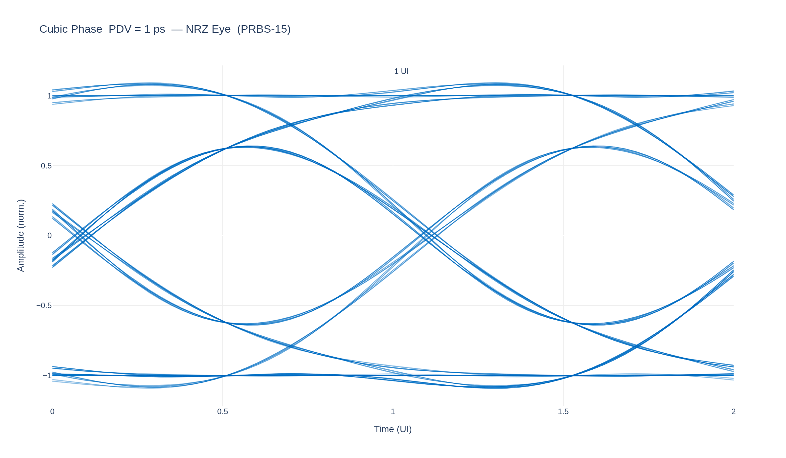
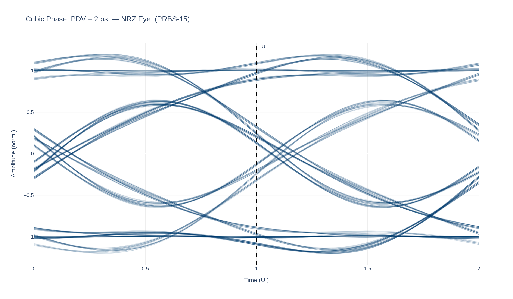
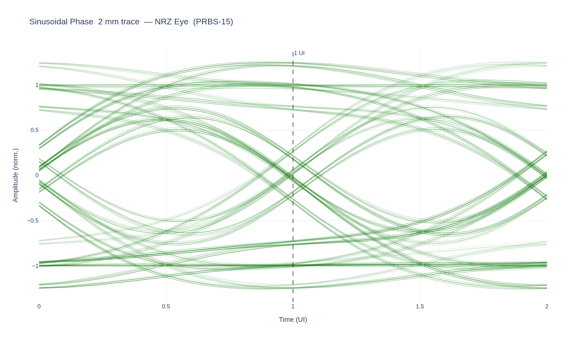
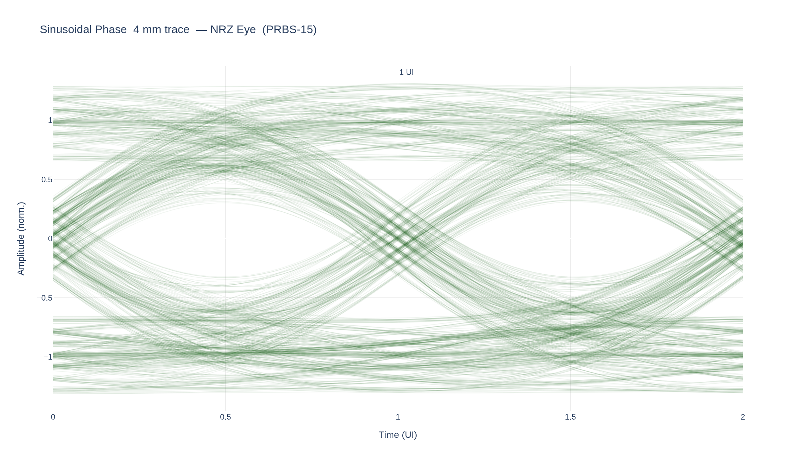
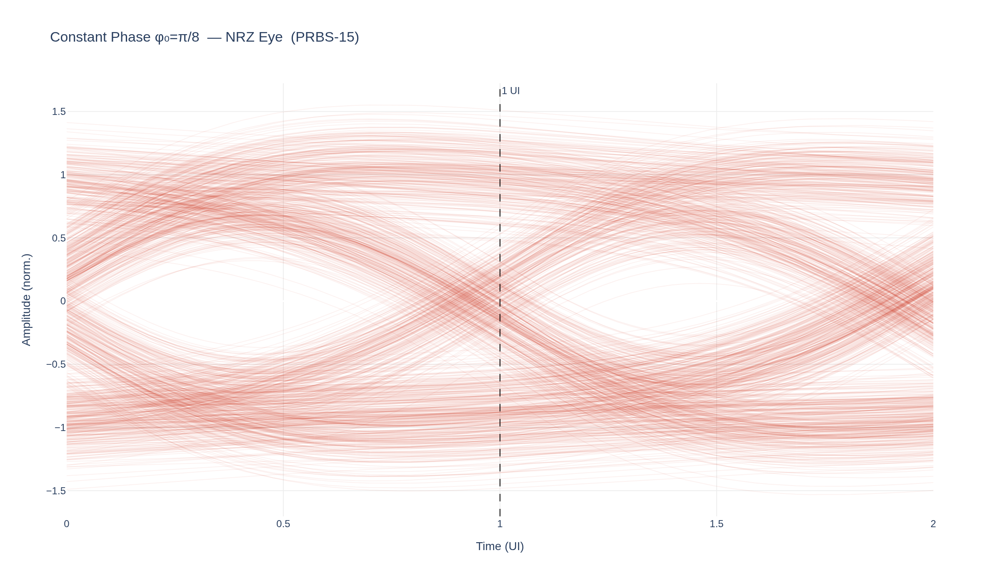
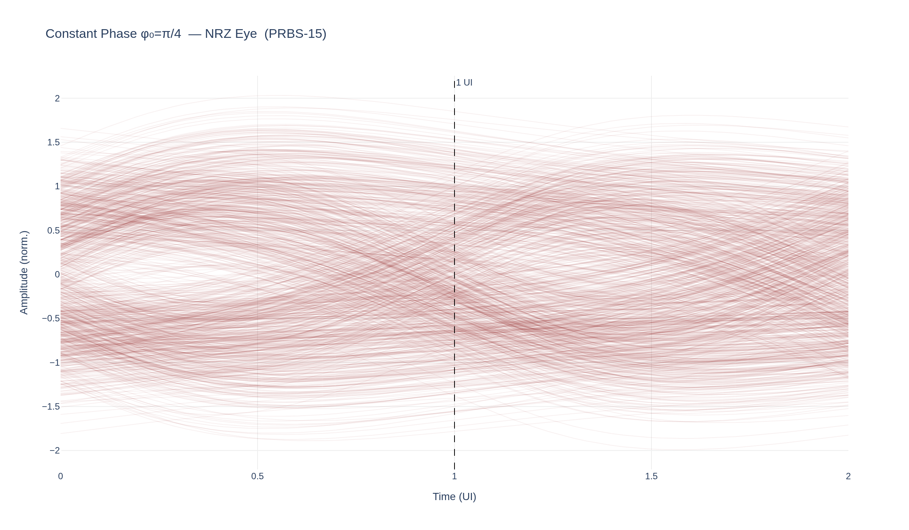

# Non-Linear Phase Distortion and Eye Closure in a 106.25 Gbps NRZ Link

*Generated by `scripts/phase_delay/phase_delay_report.py`*

---

## 1  Abstract

Standard group-delay analysis characterises a channel by
$\tau_g(\omega) = -d\phi/d\omega$.
This metric has a structural blind spot: it is insensitive to constant
(frequency-independent) phase offsets because differentiation annihilates
constants.
Phase delay $\tau_p(\omega) = -\phi(\omega)/\omega$ does not share this
deficiency.

This report isolates the two metrics by holding the amplitude envelope of a
4th-order Bessel–Thomson filter fixed at $-6\text{dB}$ at the Nyquist
frequency ($f_\text{Nyq} = 53.125\text{GHz}$, corresponding to a
106.250 Gbps NRZ link with $T_U = 9.412\text{ps}$)
while synthetically injecting four families of non-linear phase error.
For each family the impulse response and NRZ eye diagram are computed via
inverse FFT and convolution with a PRBS-15 bit stream upsampled to a
$T_U/32$ grid ($f_s = 3.40\text{THz}$,
$\Delta t = 0.2941\text{ps}$).

---

## 2  System Model

### 2.1  Transfer Function Decomposition

The composite channel transfer function is defined as

$$
H(\omega) = |H_{\text{base}}(\omega)|  e^{j\theta(\omega)}
$$

where $|H_{\text{base}}(\omega)|$ is the amplitude-only Bessel–Thomson
baseline (fixed across all experiments) and

$$
\theta(\omega) = \underbrace{-\tau_L \omega}_{\text{linear bulk delay}} + \underbrace{\theta_{\text{err}}(\omega)}_{\text{injected error}}
$$

with $\tau_L = 94.118\text{ps}$ chosen to push the
impulse-response peak at least 10 UI into the simulation
window, preventing anti-causal wrap-around in the IFFT buffer.

### 2.2  Group Delay and Phase Delay

**Group delay** (standard metric):

$$
\tau_g(\omega) = -\frac{d\phi}{d\omega}
   = -\frac{d\theta}{d\omega}
   = \tau_L - \frac{d\theta_{\text{err}}}{d\omega}
$$

**Phase delay** (complete metric):

$$
\tau_p(\omega) = -\frac{\phi(\omega)}{\omega}
   = -\frac{\theta(\omega)}{\omega}
   = \tau_L - \frac{\theta_{\text{err}}(\omega)}{\omega}
$$

Peak-to-peak variation over the evaluation band
$[5\text{GHz}, 53.125\text{GHz}]$:

$$
\text{GDV} = \max_\omega \tau_g - \min_\omega \tau_g, \qquad
\text{PDV} = \max_\omega \tau_p - \min_\omega \tau_p
$$

Note that only the $\theta_{\text{err}}$ component contributes to
GDV and PDV; the linear bulk delay $\tau_L$ contributes a constant $\tau_L$
to both $\tau_g$ and $\tau_p$ which cancels in the peak-to-peak difference.

### 2.3  Hermitian Symmetry and Causality

For $h(t) = \mathcal{F}^{-1}\{H\}$ to be real-valued the spectrum must
satisfy the conjugate-symmetry condition

$$
H(-\omega) = H^*(\omega)
$$

This is enforced by working with the one-sided rfft grid
$\omega_k = 2\pi k \Delta f$, $k = 0, 1, \ldots, N/2$,
ensuring $\theta(-\omega) = -\theta(\omega)$ for odd-symmetric error
profiles (cubic, sinusoidal), and explicitly constructing the antisymmetric
sign function for the constant-offset case.

### 2.4  NRZ Eye Diagram

A PRBS-15 bit stream of length $2^{15}-1 = 32767$ bits is mapped to
NRZ symbols $\{+1,-1\}$ and zero-order-hold upsampled by $\times 32$
to the simulation grid.
The waveform is convolved with $h[n]$ via causal FIR filtering
($\mathtt{lfilter}(h, [1], x)$).
The output is then folded into $2T_U$ windows with the cursor aligned
to $1T_U$ from the window start using the formula

$$
n_{\text{fold}} = \text{first} \; n \geq n_{\text{transient}}
  \;\text{such that}\;
  (n_{\text{peak}} - 32) \bmod 64 \equiv n \bmod 64
$$

where $n_{\text{peak}}$ is the sample index of the IR peak and
$n_{\text{transient}} = \text{len}(h)$.

---

## 3  Baseline: 4th-Order Bessel–Thomson Channel

### 3.1  Analytical Properties

The 4th-order Bessel–Thomson prototype $B_4(s)$ is defined by the
transfer function

$$
B_4(s) = \frac{105}{s^4 + 10s^3 + 45s^2 + 105s + 105}
$$

(normalised for unity group delay at DC).  The `scipy` implementation with
`norm='mag'` scales the prototype so that $|B_4(j\Omega_c)| = -3\text{dB}$,
then $\Omega_c$ is found via bisection such that
$|H_{\text{base}}(j\omega_{\text{Nyq}})| = -6.0\text{dB}$.

With $\theta_{\text{err}} = 0$:

$$
\tau_g(\omega) = \tau_L + \tau_{g,\text{Bessel}}(\omega), \qquad
\text{GDV} = \text{PDV} = 0
$$

(the Bessel filter itself has a slowly varying group delay, but the
injected *error* component is zero by definition for the baseline).

### 3.2  Figures

#### Frequency Response


#### Impulse Response


#### NRZ Eye Diagram — PRBS-15


**Baseline metrics:**

| Metric | Value |
|--------|-------|
| GDV (error component) | 0.0000 ps |
| PDV (error component) | 0.0000 ps |
| +2 UI ISI tap / cursor | 0.0094 |
| +3 UI ISI tap / cursor | 0.0015 |

---

## 4  Cubic Phase Distortion

### 4.1  Why Cubic?

**Hermitian symmetry constrains the allowed phase orders.**
For $h(t)$ to be real-valued the spectrum must satisfy
$H(-\omega) = H^*(\omega)$, which requires the phase to be an *odd* function
of frequency: $\theta(-\omega) = -\theta(\omega)$.
A Taylor expansion of any such phase around $\omega = 0$ therefore contains
only odd powers:

$$
\theta_{\text{err}}(\omega)
  = c_1\omega + c_3\omega^3 + c_5\omega^5 + \cdots
$$

The $c_1$ term is *linear* phase — a pure bulk propagation delay
$\tau = c_1$ that shifts every frequency component by the same time.
It produces zero group-delay variation and zero ISI: it is physically
benign and already absorbed into $\tau_L$.

The **$c_3\omega^3$ term is therefore the lowest-order non-trivial
phase error** that is (a) consistent with real-valued impulse responses
and (b) actually distinct from a simple propagation delay.

**Physical origin: quadratic group delay in LC bandwidth-extension circuits.**
The group delay corresponding to cubic phase is

$$
\tau_g^{\text{err}}(\omega) = -\frac{d(c_3\omega^3)}{d\omega} = -3c_3\omega^2
$$

a *quadratic* function of frequency.
This is precisely the residual group-delay profile of LC bandwidth-extension
networks — T-coils, shunt-series inductive peaking, and bond-wire capacitance
resonances — all of which are commonly placed at the RX input pad to extend
bandwidth toward Nyquist.

**Series-peaking circuit derivation.**
The canonical bandwidth-extension stage at an RX input pad places a series
inductor $L$ between the driving source resistance $R_s$ and the photodiode /
TIA load capacitance $C_L$:

```
V_in ──[ R_s ]──[ L ]──┬── V_out
                        │
                       C_L
                        │
                       GND
```

**KVL / KCL in the Laplace domain.**

The mesh current $I(s)$ charges $C_L$, so $V_\text{out} = I/(sC_L)$.
Kirchhoff's voltage law around the single loop gives:

$$
V_\text{in} = (R_s + sL)\,I + \frac{I}{sC_L}
$$

Substituting $I = sC_L V_\text{out}$:

$$
V_\text{in} = \bigl(1 + sR_sC_L + s^2 LC_L\bigr)\,V_\text{out}
$$

**Standard second-order low-pass form.**

Defining the natural frequency $\omega_0 = 1/\sqrt{LC_L}$ and the damping
ratio $\zeta = (R_s/2)\sqrt{C_L/L}$:

$$
\boxed{H(s) = \frac{\omega_0^2}{s^2 + 2\zeta\omega_0 s + \omega_0^2}}
$$

**Phase response.**

On the imaginary axis $s = j\omega$:

$$
\angle H(j\omega)
  = -\arctan\!\left(\frac{2\zeta\omega_0\omega}{\omega_0^2 - \omega^2}\right)
$$

Differentiating with respect to $\omega$ (quotient rule on
$u = 2\zeta\omega_0\omega$, $v = \omega_0^2 - \omega^2$):

$$
\tau_g(\omega)
  = -\frac{d}{d\omega}\angle H
  = \frac{2\zeta\omega_0\,(\omega_0^2 + \omega^2)}
         {(\omega_0^2 - \omega^2)^2 + 4\zeta^2\omega_0^2\omega^2}
$$

**Taylor expansion for $\omega \ll \omega_0$.**

Let $x = \omega/\omega_0$ and $\tau_0 = 2\zeta/\omega_0$ (the DC group delay):

$$
\tau_g = \tau_0\,\frac{1 + x^2}{1 + (4\zeta^2 - 2)x^2 + x^4}
$$

Expanding the denominator to $O(x^2)$:

$$
\tau_g(\omega)
  \approx \tau_0\Bigl[1 + (3 - 4\zeta^2)\,\frac{\omega^2}{\omega_0^2}\Bigr]
$$

The group delay has a **quadratic** frequency dependence with signed coefficient
$(3 - 4\zeta^2)/\omega_0^2$.  Note:

| $\zeta$ | Condition | $\tau_g$ shape |
|---------|-----------|----------------|
| $< \sqrt{3}/2 \approx 0.866$ | under-damped peaking | peaks before $\omega_0$ |
| $= \sqrt{3}/2$ | Bessel-Thomson 2nd order | flat to $O(\omega^4)$ |
| $> \sqrt{3}/2$ | over-damped | monotone decrease |

**Mapping to cubic phase.**

Integrating the quadratic group delay deviation:

$$
\theta_\text{err}(\omega)
  = -\int_0^\omega \tau_g^\text{err}(\omega')\,d\omega'
  = -\frac{\tau_0(3 - 4\zeta^2)}{3\omega_0^2}\,\omega^3
  = a\,\omega^3
$$

with

$$
\boxed{a = -\frac{\tau_0(3 - 4\zeta^2)}{3\omega_0^2}
       = -\frac{R_s C_L(3 - 4\zeta^2)}{3\omega_0^2}}
$$

This is precisely the cubic coefficient in our phase model, expressed entirely
in terms of circuit parameters $(R_s, L, C_L)$.
A T-coil is a coupled two-winding extension of the same topology;
its group delay has an identical parabolic shape away from resonance,
with a more complex expression for $a$ involving the mutual coupling
coefficient $k$ and bridge capacitor $C_b$, but the same qualitative
behaviour.  T-coil networks are designed to flatten $\tau_g$ (pushing
toward the Bessel-Thomson point), but layout-dependent self-resonance
and termination mismatch leave a residual that still conforms to the
quadratic model.

The cubic case therefore represents not just a convenient toy model but
a direct surrogate for the dominant phase error mechanism of the analog
front end in ultra-low-power CPO receivers that omit the CTLE and rely
solely on inductive peaking for bandwidth recovery.

### 4.2  Analytical Derivation

The cubic error profile

$$
\theta_{\text{err}}(\omega) = a\omega^3
$$

**Group delay:**

$$
\tau_g^{\text{err}}(\omega)
  = -\frac{d\theta_{\text{err}}}{d\omega} = -3a\omega^2
$$

**Phase delay:**

$$
\tau_p^{\text{err}}(\omega)
  = -\frac{\theta_{\text{err}}(\omega)}{\omega} = -a\omega^2
$$

Both delay curves share the same quadratic shape; the group delay is
exactly **three times** the phase delay at every frequency:

$$
\boxed{\tau_g^{\text{err}}(\omega) = 3\tau_p^{\text{err}}(\omega)}
$$

**PDV to coefficient mapping.**
Over $[5\text{GHz},53.125\text{GHz}]$:

$$
\text{PDV} = |a|(\omega_{\max}^2 - \omega_{\min}^2)
  \quad\Longrightarrow\quad
  a = \frac{\text{PDV}}{\omega_{\max}^2 - \omega_{\min}^2}
$$

For the two cases shown:

| PDV target | $a$ (s³/rad³) |
|-----------|--------------|
| 1 ps | $9.0554e-36$ |
| 2 ps | $1.8111e-35$ |

### 4.3  Figures

#### Frequency Response (magnitude / τ_g / τ_p)


#### Impulse Response


#### NRZ Eye — PDV = 1 ps



#### NRZ Eye — PDV = 2 ps



**Cubic phase metrics:**

| PDV target | GDV (ps) | PDV (ps) | GDV/PDV | +2 UI tap | +3 UI tap |
|-----------|---------|---------|---------|----------|----------|
| 1 ps | 3.000 | 1.000 | 3.000 | 0.0642 | 0.0005 |
| 2 ps | 6.000 | 2.000 | 3.000 | 0.1368 | 0.0018 |

The GDV/PDV ratio converges to $3.000$ as predicted analytically.

---

## 5  Sinusoidal Phase Ripple (Substrate Reflections)

### 5.1  Analytical Derivation

A package-level impedance discontinuity at distance $d$ from the receiver
creates a reflected wave with round-trip delay $2\tau_d$ where
$\tau_d = d / v_p$ and $v_p \approx c/\sqrt{\varepsilon_r}$.
The resulting ripple in the insertion loss translates to a sinusoidal
phase error

$$
\theta_{\text{err}}(\omega) = A\sin(b\omega), \qquad b = \tau_d
$$

**Group delay:**

$$
\tau_g^{\text{err}}(\omega)
  = -\frac{d\theta_{\text{err}}}{d\omega} = -Ab\cos(b\omega)
$$

A pure cosine ripple with peak-to-peak GDV $= 2Ab$.

**Phase delay:**

$$
\tau_p^{\text{err}}(\omega)
  = -\frac{A\sin(b\omega)}{\omega}
$$

The phase delay *is not* sinusoidal in $\omega$; near DC it diverges
($\lim_{\omega\to 0} \tau_p = -Ab$), while at higher frequencies it
oscillates with decreasing amplitude.

**Trace-length parameterisation.**
With $\varepsilon_r = 4$ (microstrip, $v_p = c/2 \approx 1.5\times 10^8\text{m/s}$):

| Trace $d$ | $b = \tau_d$ | Peak GDV $= 2Ab$ | Period in $f$ |
|---------|------------|----------------|--------------|
| 2 mm | 13.33 ps | 8.000 ps | 37.5 GHz |
| 4 mm | 26.67 ps | 16.000 ps | 18.8 GHz |

### 5.2  Figures

#### Frequency Response


#### Impulse Response


#### NRZ Eye — 2 mm trace



#### NRZ Eye — 4 mm trace



**Sinusoidal phase metrics:**

| Trace | GDV (ps) | PDV (ps) | +2 UI tap | +3 UI tap |
|-------|---------|---------|----------|----------|
| 2 mm | 7.653 | 4.752 | 0.2354 | 0.0007 |
| 4 mm | 16.000 | 8.832 | 0.0119 | 0.1975 |

---

## 6  Constant Phase Offset — Bae Blind Spot

### 6.1  Analytical Proof

Define the frequency-domain phase error as a Heaviside-based step:

$$
\theta_{\text{err}}(\omega) = \phi_0\operatorname{sgn}(\omega)
  = \begin{cases}
      +\phi_0 & \omega > 0 \\
       0       & \omega = 0 \\
      -\phi_0 & \omega < 0
    \end{cases}
$$

This corresponds to an **all-pass** phase shifter: the amplitude
spectrum is unchanged, but every positive-frequency component is rotated
by $\phi_0$ radians.

**Group delay of the error:**

$$
\tau_g^{\text{err}}(\omega)
  = -\frac{d}{d\omega}\bigl[\phi_0\operatorname{sgn}(\omega)\bigr]
  = -2\phi_0\delta(\omega)
  \equiv 0 \quad \text{for } \omega \neq 0
$$

A group-delay measurement instrument integrates over a finite frequency
interval that excludes $\omega = 0$, so it reads **exactly zero** regardless
of $\phi_0$.  The group-delay display is perfectly flat — no alarm is raised.

**Phase delay of the error:**

$$
\tau_p^{\text{err}}(\omega)
  = -\frac{\phi_0\operatorname{sgn}(\omega)}{\omega}
  = -\frac{\phi_0}{|\omega|}
$$

This diverges as $\omega \to 0$ and decays as $1/|\omega|$; it is never zero
for $\phi_0 \neq 0$.

**Time-domain consequence.**
In the time domain, multiplication by $e^{j\phi_0\operatorname{sgn}(\omega)}$ is
a Hilbert-transform mix: for a real analytic signal $x(t)$ the output is

$$
y(t) = x(t)\cos\phi_0 + \hat{x}(t)\sin\phi_0
$$

where $\hat{x}$ is the Hilbert transform.  Even a small $\phi_0$
bleeds $\sin\phi_0$ of the Hilbert-transformed signal (a 90° rotated
replica) into the eye, closing it vertically.

### 6.2  Bae Validation Figure

The plot below shows $\tau_g^{\text{err}}$ and $\tau_p^{\text{err}}$ for
all $\phi_0$ values simultaneously.  The group delay curves are
numerically identical (differences $< 10^{-10}\text{ps}$), while the
phase delay curves fan out proportionally to $\phi_0$.


#### Frequency Response


#### Impulse Response


#### NRZ Eye — φ₀ = π/8



#### NRZ Eye — φ₀ = π/4



**Constant-phase metrics:**

| φ₀ | GDV (ps) | PDV (ps) | +2 UI tap | +3 UI tap |
|----|---------|---------|----------|----------|
| π/8 | 0.000000 | 11.308 | 0.1771 | 0.0874 |
| π/4 | 0.000000 | 22.615 | 0.3441 | 0.1663 |

The GDV values are numerical-gradient artefacts $\ll 10^{-3}\text{ps}$,
confirming the analytical result that group delay is blind to constant
phase offsets.

---

## 7  Summary Metrics

| Variant | GDV (ps) | PDV (ps) | GDV/PDV | +2 UI tap | +3 UI tap |
|---------|---------|---------|---------|----------|----------|
| Baseline | 0.0000 | 0.0000 | — | 0.0094 | 0.0015 |
| Cubic 1 ps | 3.000 | 1.000 | 3.000 | 0.0642 | 0.0005 |
| Cubic 2 ps | 6.000 | 2.000 | 3.000 | 0.1368 | 0.0018 |
| Sinusoidal 2 mm | 7.653 | 4.752 | — | 0.2354 | 0.0007 |
| Sinusoidal 4 mm | 16.000 | 8.832 | — | 0.0119 | 0.1975 |
| Constant φ₀=π/8 | 0.000000 | 11.308 | ∞ (blind) | 0.1771 | 0.0874 |
| Constant φ₀=π/4 | 0.000000 | 22.615 | ∞ (blind) | 0.3441 | 0.1663 |

---

## 8  Conclusions

1. **Cubic phase** ($a\omega^3$) produces GDV exactly 3× PDV. The ISI tail at
   +2 UI grows monotonically with PDV, eventually threatening the capacity of
   a 1-tap speculative DFE to absorb all post-cursor energy.

2. **Sinusoidal phase ripple** ($A\sin(b\omega)$) generates periodic group-delay
   ripple whose spatial frequency in $f$ is set by the trace length.
   Longer traces concentrate the energy deeper in the ISI tail (+3 UI and
   beyond), making multi-tap DFE or TX FFE unavoidable.

3. **Constant phase offset** ($\phi_0\operatorname{sgn}(\omega)$) is
   **invisible to group-delay instruments** yet causes progressive eye
   closure through Hilbert-transform mixing.  Phase-delay measurements and
   direct eye analysis are required to detect this failure mode.
