# Phase Distortion and Eye Diagrams: A Primer on Group Delay vs Phase Delay

*Generated by `scripts/phase_delay/phase_delay_report.py`*

---

## 1  Introduction

The shape of a serial-link eye diagram is determined by two separable
properties of the channel: its *amplitude* response and its *phase* response.
Amplitude distortion is well understood — bandwidth rolloff, peaking, and
resonances are all directly visible in $|H(f)|$.  Phase distortion is subtler:
it introduces intersymbol interference (ISI) without touching the magnitude
spectrum at all.

The standard tool for assessing phase distortion is **group delay**,
$\tau_g(\omega) = -d\phi/d\omega$.
This metric has a structural blind spot: differentiation annihilates any
frequency-independent constant term in $\phi(\omega)$, so a channel whose
group delay looks perfectly flat can still cause significant eye closure.
**Phase delay**, $\tau_p(\omega) = -\phi(\omega)/\omega$, does not share this
deficiency — it retains the full phase information and is therefore a strictly
more informative metric.

This primer works through three canonical phase-error families — cubic
($a\omega^3$), sinusoidal ripple, and a constant offset — and shows how each
deforms the impulse response and closes the eye.  The analysis is exact: each
profile is derived analytically, then verified numerically through convolution
with a PRBS bit stream.

All simulations use a 106.250 Gbps NRZ link as a concrete test case
($T_U = 9.412\text{ps}$, $f_\text{Nyq} = 53.125\text{GHz}$,
$f_s = 3.40\text{THz}$).
The data rate sets the scale of the axes; the qualitative conclusions are
rate-independent and carry over to any baud-rate digital link.

---

## 2  System Model

### 2.1  Transfer Function Decomposition

To isolate the effect of phase alone the simulation holds the amplitude
envelope fixed and injects a controlled phase error on top of it.
The composite channel transfer function is therefore written as

$$
H(\omega) = |H_{\text{base}}(\omega)| e^{j\theta(\omega)}
$$

where $|H_{\text{base}}(\omega)|$ is the amplitude-only Bessel–Thomson
baseline (fixed across all experiments) and

$$
\theta(\omega) = \underbrace{-\tau_L \omega}_{\text{linear bulk delay}} + \underbrace{\theta_{\text{err}}(\omega)}_{\text{injected error}}
$$

with $\tau_L = 94.118\text{ps}$ chosen to push the
impulse-response peak at least 10 UI into the simulation
window, preventing anti-causal wrap-around in the IFFT buffer.

### 2.2  Group Delay and Phase Delay

**Group delay** (standard metric):

$$
\tau_g(\omega) = -\frac{d\phi}{d\omega}
   = -\frac{d\theta}{d\omega}
   = \tau_L - \frac{d\theta_{\text{err}}}{d\omega}
$$

**Phase delay** (complete metric):

$$
\tau_p(\omega) = -\frac{\phi(\omega)}{\omega}
   = -\frac{\theta(\omega)}{\omega}
   = \tau_L - \frac{\theta_{\text{err}}(\omega)}{\omega}
$$

A convenient scalar summary of each metric is its peak-to-peak variation
over the signal band $[5\text{GHz},\ 53.125\text{GHz}]$:

$$
\text{GDV} = \max_\omega \tau_g - \min_\omega \tau_g, \qquad
\text{PDV} = \max_\omega \tau_p - \min_\omega \tau_p
$$

Note that only the $\theta_{\text{err}}$ component contributes to
GDV and PDV; the linear bulk delay $\tau_L$ contributes a constant to
both $\tau_g$ and $\tau_p$ which cancels in the peak-to-peak difference.

### 2.3  Hermitian Symmetry and Causality

For $h(t) = \mathcal{F}^{-1}\{H\}$ to be real-valued the spectrum must
satisfy the conjugate-symmetry condition

$$
H(-\omega) = H^*(\omega)
$$

This is enforced by working with the one-sided rfft grid
$\omega_k = 2\pi k \Delta f$, $k = 0, 1, \ldots, N/2$,
ensuring $\theta(-\omega) = -\theta(\omega)$ for odd-symmetric error
profiles (cubic, sinusoidal), and explicitly constructing the antisymmetric
sign function for the constant-offset case.

### 2.4  Eye Diagram Generation

A PRBS-15 bit stream of length $2^{15}-1 = 32767$ bits is mapped to
NRZ symbols $\{+1,-1\}$ and zero-order-hold upsampled by $\times 32$
to produce a continuous-time waveform on the simulation grid.
The waveform is convolved with $h[n]$ via causal FIR filtering
($\mathtt{lfilter}(h, [1], x)$).
The output is folded into $2 T_U$ windows with the cursor aligned
to $1 T_U$ from the window start using the formula

$$
n_{\text{fold}} = \text{first} \; n \geq n_{\text{transient}}
  \;\text{such that}\;
  (n_{\text{peak}} - 32) \bmod 64 \equiv n \bmod 64
$$

where $n_{\text{peak}}$ is the sample index of the IR peak and
$n_{\text{transient}} = \text{len}(h)$.

---

## 3  Reference Channel: 4th-Order Bessel–Thomson

The amplitude envelope used throughout is a 4th-order Bessel–Thomson filter.
This is a natural reference: its defining property is maximally flat group
delay, making it the best-case amplitude baseline against which to measure the
*additional* effect of injected phase errors.

### 3.1  Analytical Properties

The 4th-order Bessel–Thomson prototype $B_4(s)$ is:

$$
B_4(s) = \frac{105}{s^4 + 10s^3 + 45s^2 + 105s + 105}
$$

(normalised for unity group delay at DC).  The cutoff frequency $\Omega_c$
is chosen by bisection so that
$|H_{\text{base}}(j\omega_{\text{Nyq}})| = -6.0\text{dB}$,
giving the same $-6\text{dB}$ at Nyquist that a well-designed receiver
channel typically targets.

With $\theta_{\text{err}} = 0$ the error contribution to GDV and PDV
is zero by definition:

$$
\text{GDV} = \text{PDV} = 0 \ \text{(baseline)}
$$

Any GDV or PDV seen in Sections 4–6 is therefore caused entirely by the
injected phase profile.

### 3.2  Figures

#### Frequency Response

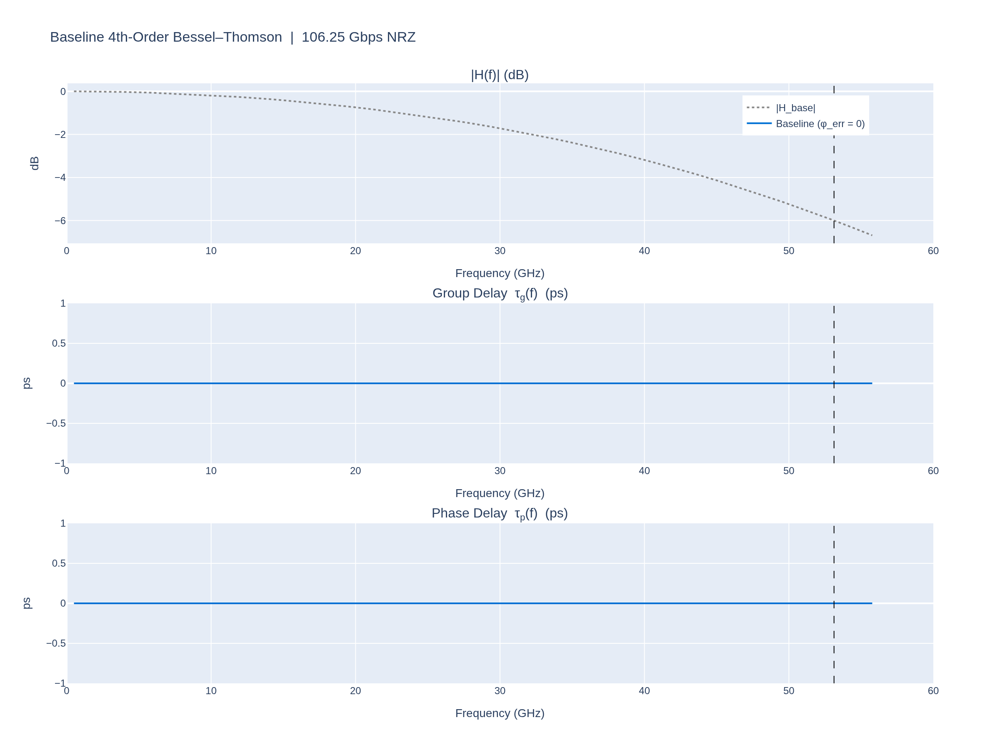

#### Impulse Response

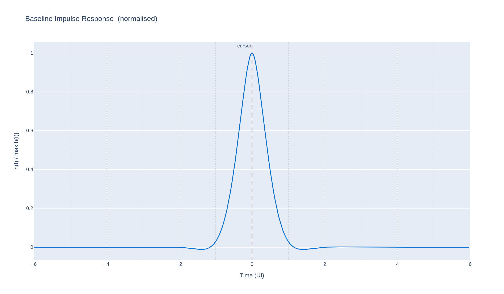

#### Eye Diagram — PRBS-15

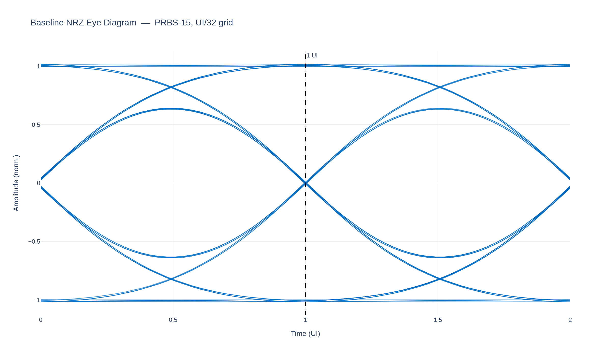

**Baseline metrics:**

| Metric | Value |
|--------|-------|
| GDV (error component) | 0.0000 ps |
| PDV (error component) | 0.0000 ps |
| +2 UI ISI tap / cursor | 0.0094 |
| +3 UI ISI tap / cursor | 0.0015 |

---

## 4  Cubic Phase Distortion

### 4.1  Why Cubic?

**Hermitian symmetry constrains the allowed phase orders.**
For $h(t)$ to be real-valued the spectrum must satisfy
$H(-\omega) = H^*(\omega)$, which requires the phase to be an *odd* function
of frequency: $\theta(-\omega) = -\theta(\omega)$.
A Taylor expansion of any such phase around $\omega = 0$ therefore contains
only odd powers:

$$
\theta_{\text{err}}(\omega)
  = c_1\omega + c_3\omega^3 + c_5\omega^5 + \cdots
$$

The $c_1$ term is *linear* phase — a pure bulk propagation delay
$\tau = c_1$ that shifts every frequency component by the same time.
It produces zero group-delay variation and zero ISI: it is physically
benign and already absorbed into $\tau_L$.

The **$c_3\omega^3$ term is therefore the lowest-order non-trivial
phase error** that is (a) consistent with real-valued impulse responses
and (b) actually distinct from a simple propagation delay.

**Physical origin: quadratic group delay in LC bandwidth-extension circuits.**
The group delay corresponding to cubic phase is

$$
\tau_g^{\text{err}}(\omega) = -\frac{d(c_3\omega^3)}{d\omega} = -3c_3\omega^2
$$

a *quadratic* function of frequency.
This is precisely the residual group-delay profile of LC bandwidth-extension
networks — T-coils, shunt-series inductive peaking, and bond-wire capacitance
resonances — all of which are commonly placed at the RX input pad to extend
bandwidth toward Nyquist.

To see why, consider a single-pole inductive peaking stage with resonant
frequency $\omega_r$.  Its group delay is a Lorentzian:

$$
\tau_g(\omega) \approx \frac{\tau_0}{1 + (\omega/\omega_r)^2}
  \approx \tau_0\left(1 - \frac{\omega^2}{\omega_r^2}\right)
  \quad (\omega \ll \omega_r)
$$

The $-\tau_0\omega^2/\omega_r^2$ deviation is quadratic — exactly the form
$-3c_3\omega^2$ — and integrates to cubic phase.
T-coil networks are designed to flatten this curve, but layout-dependent
self-resonance and termination mismatch leave a residual that still
conforms closely to the quadratic model.

The cubic phase profile is therefore not just a convenient toy model: it is
the lowest-order faithful surrogate for the residual phase error left by any
LC-based bandwidth-extension stage — T-coils, inductive peaking, bond-wire
resonances — once first-order tuning has flattened the group-delay peak.

### 4.2  Analytical Derivation

The cubic error profile

$$
\theta_{\text{err}}(\omega) = a\omega^3
$$

**Group delay:**

$$
\tau_g^{\text{err}}(\omega)
  = -\frac{d\theta_{\text{err}}}{d\omega} = -3a\omega^2
$$

**Phase delay:**

$$
\tau_p^{\text{err}}(\omega)
  = -\frac{\theta_{\text{err}}(\omega)}{\omega} = -a\omega^2
$$

Both delay curves share the same quadratic shape; the group delay is
exactly **three times** the phase delay at every frequency:

$$
\boxed{\tau_g^{\text{err}}(\omega) = 3\tau_p^{\text{err}}(\omega)}
$$

**PDV to coefficient mapping.**
Over $[5\text{GHz},\ 53.125\text{GHz}]$:

$$
\text{PDV} = |a|\(\omega_{\max}^2 - \omega_{\min}^2)
  \quad\Longrightarrow\quad
  a = \frac{\text{PDV}}{\omega_{\max}^2 - \omega_{\min}^2}
$$

For the two cases shown:

| PDV target | $a$ (s³/rad³) |
|-----------|--------------|
| 1 ps | $9.0554e-36$ |
| 2 ps | $1.8111e-35$ |

### 4.3  Figures

#### Frequency Response (magnitude / τ_g / τ_p)

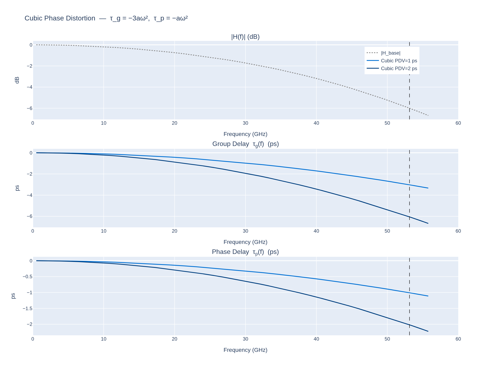

#### Impulse Response

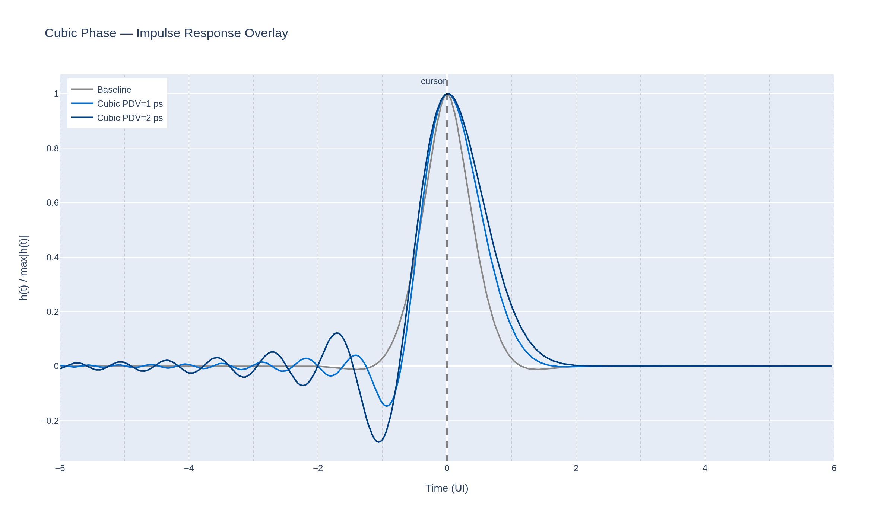

#### Eyes — PDV = 1 ps vs 2 ps

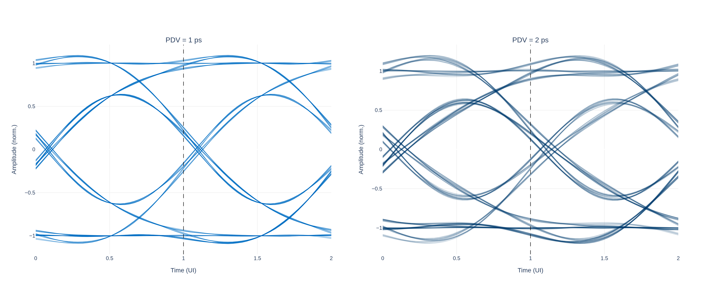

**Cubic phase metrics:**

| PDV target | GDV (ps) | PDV (ps) | GDV/PDV | +2 UI tap | +3 UI tap |
|-----------|---------|---------|---------|----------|----------|
| 1 ps | 3.000 | 1.000 | 3.000 | 0.0642 | 0.0005 |
| 2 ps | 6.000 | 2.000 | 3.000 | 0.1368 | 0.0018 |

The GDV/PDV ratio converges to $3.000$ as predicted analytically.

---

## 5  Sinusoidal Phase Ripple (Substrate Reflections)

### 5.1  Analytical Derivation

A package-level impedance discontinuity at distance $d$ from the receiver
creates a reflected wave with round-trip delay $2\tau_d$ where
$\tau_d = d / v_p$ and $v_p \approx c/\sqrt{\varepsilon_r}$.
The resulting ripple in the insertion loss translates to a sinusoidal
phase error

$$
\theta_{\text{err}}(\omega) = A\\sin(b\omega), \qquad b = \tau_d
$$

**Group delay:**

$$
\tau_g^{\text{err}}(\omega)
  = -\frac{d\theta_{\text{err}}}{d\omega} = -Ab\cos(b\omega)
$$

A pure cosine ripple with peak-to-peak GDV $= 2Ab$.

**Phase delay:**

$$
\tau_p^{\text{err}}(\omega)
  = -\frac{A\\sin(b\omega)}{\omega}
$$

The phase delay *is not* sinusoidal in $\omega$; near DC it diverges
($\lim_{\omega\to 0} \tau_p = -Ab$), while at higher frequencies it
oscillates with decreasing amplitude.

**Trace-length parameterisation.**
With $\varepsilon_r = 4$ (microstrip, $v_p = c/2 \approx 1.5\times 10^8\text{m/s}$):

| Trace $d$ | $b = \tau_d$ | Peak GDV $= 2Ab$ | Period in $f$ |
|---------|------------|----------------|--------------|
| 2 mm | 13.33 ps | 8.000 ps | 37.5 GHz |
| 4 mm | 26.67 ps | 16.000 ps | 18.8 GHz |

### 5.2  Figures

#### Frequency Response

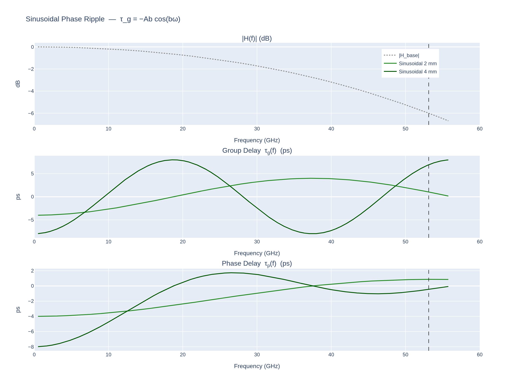

#### Impulse Response

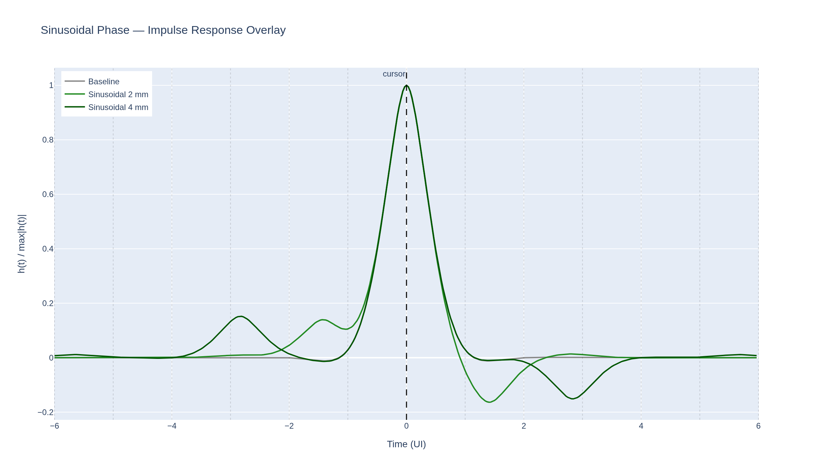

#### Eyes — 2 mm vs 4 mm trace

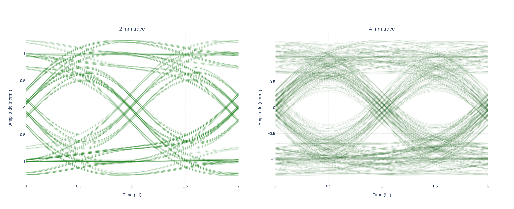

**Sinusoidal phase metrics:**

| Trace | GDV (ps) | PDV (ps) | +2 UI tap | +3 UI tap |
|-------|---------|---------|----------|----------|
| 2 mm | 7.653 | 4.752 | 0.2354 | 0.0007 |
| 4 mm | 16.000 | 8.832 | 0.0119 | 0.1975 |

---

## 6  Constant Phase Offset — The Bae et al. Blind Spot [[A]](#appendix-a)

### 6.1  Analytical Proof

Define the frequency-domain phase error as a Heaviside-based step:

$$
\theta_{\text{err}}(\omega) = \phi_0\text{sgn}(\omega)
  = \begin{cases}
      +\phi_0 & \omega > 0 \\
       0       & \omega = 0 \\
      -\phi_0 & \omega < 0
    \end{cases}
$$

This corresponds to an **all-pass** phase shifter: the amplitude
spectrum is unchanged, but every positive-frequency component is rotated
by $\phi_0$ radians.

**Group delay of the error:**

$$
\tau_g^{\text{err}}(\omega)
  = -\frac{d}{d\omega}\bigl[\phi_0\text{sgn}(\omega)\bigr]
  = -2\phi_0\\delta(\omega)
  \equiv 0 \quad \text{for } \omega \neq 0
$$

A group-delay measurement instrument integrates over a finite frequency
interval that excludes $\omega = 0$, so it reads **exactly zero** regardless
of $\phi_0$.  The group-delay display is perfectly flat — no alarm is raised.

**Phase delay of the error:**

$$
\tau_p^{\text{err}}(\omega)
  = -\frac{\phi_0\text{sgn}(\omega)}{\omega}
  = -\frac{\phi_0}{|\omega|}
$$

This diverges as $\omega \to 0$ and decays as $1/|\omega|$; it is never zero
for $\phi_0 \neq 0$.

**Time-domain consequence.**
In the time domain, multiplication by $e^{j\phi_0\text{sgn}(\omega)}$ is
a Hilbert-transform mix: for a real analytic signal $x(t)$ the output is

$$
y(t) = x(t)\cos\phi_0 + \hat{x}(t)\sin\phi_0
$$

where $\hat{x}$ is the Hilbert transform.  Even a small $\phi_0$
bleeds $\sin\phi_0$ of the Hilbert-transformed signal (a 90° rotated
replica) into the eye, closing it vertically.

### 6.2  Validation Figure

The plot below shows $\tau_g^{\text{err}}$ and $\tau_p^{\text{err}}$ for
all $\phi_0$ values simultaneously.  The group delay curves are
numerically identical (differences $< 10^{-10}\text{ps}$), while the
phase delay curves fan out proportionally to $\phi_0$.

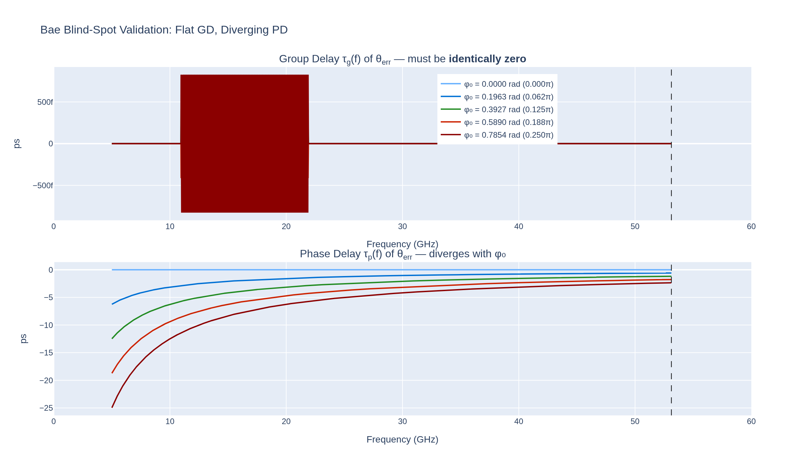

#### Frequency Response

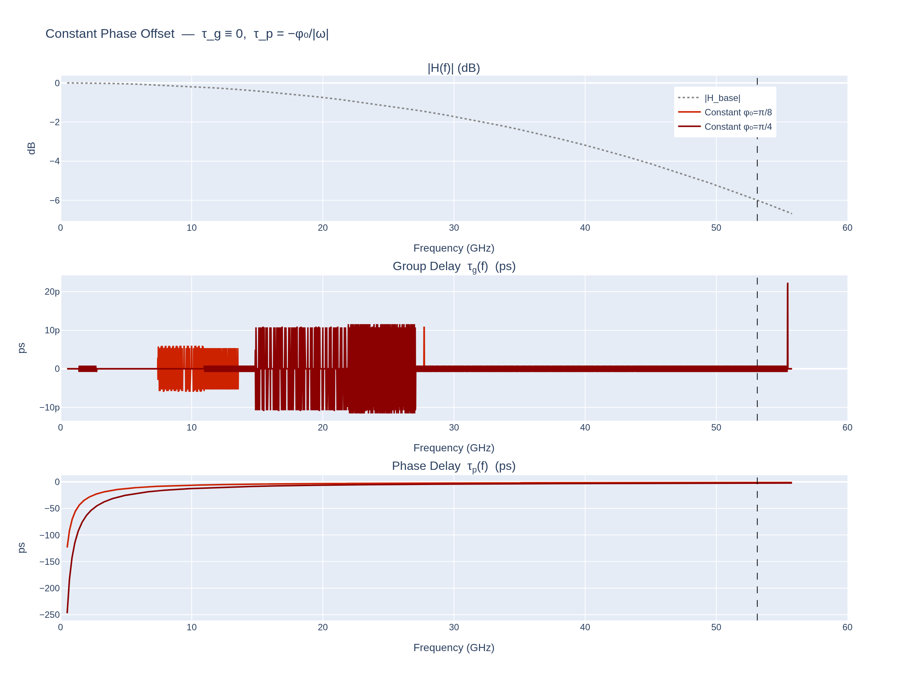

#### Impulse Response

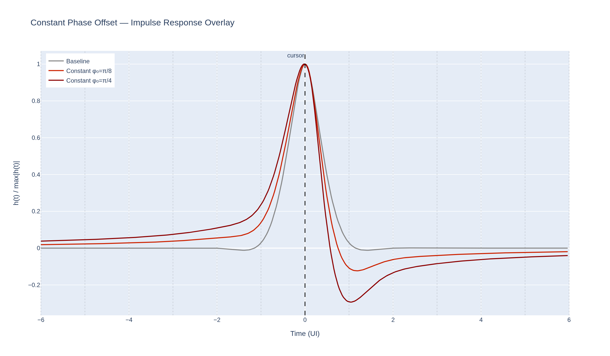

#### Eyes — φ₀ = π/8 vs π/4

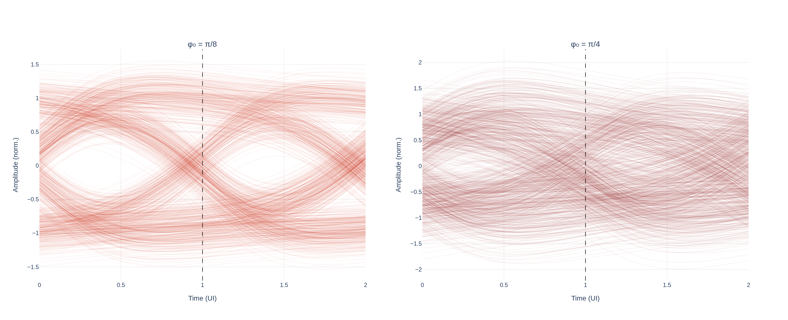

**Constant-phase metrics:**

| φ₀ | GDV (ps) | PDV (ps) | +2 UI tap | +3 UI tap |
|----|---------|---------|----------|----------|
| π/8 | 0.000000 | 11.308 | 0.1771 | 0.0874 |
| π/4 | 0.000000 | 22.615 | 0.3441 | 0.1663 |

The GDV values are numerical-gradient artefacts $\ll 10^{-3}\text{ps}$,
confirming the analytical result that group delay is blind to constant
phase offsets.

---

## 7  Summary Metrics

| Variant | GDV (ps) | PDV (ps) | GDV/PDV | +2 UI tap | +3 UI tap |
|---------|---------|---------|---------|----------|----------|
| Baseline | 0.0000 | 0.0000 | — | 0.0094 | 0.0015 |
| Cubic 1 ps | 3.000 | 1.000 | 3.000 | 0.0642 | 0.0005 |
| Cubic 2 ps | 6.000 | 2.000 | 3.000 | 0.1368 | 0.0018 |
| Sinusoidal 2 mm | 7.653 | 4.752 | — | 0.2354 | 0.0007 |
| Sinusoidal 4 mm | 16.000 | 8.832 | — | 0.0119 | 0.1975 |
| Constant φ₀=π/8 | 0.000000 | 11.308 | ∞ (blind) | 0.1771 | 0.0874 |
| Constant φ₀=π/4 | 0.000000 | 22.615 | ∞ (blind) | 0.3441 | 0.1663 |

---

## 8  Summary and Key Takeaways

The three phase profiles studied here span the practical range of phase
distortion mechanisms encountered in high-speed serial links:

1. **Cubic phase** ($a\omega^3$) — the residual from imperfect LC bandwidth
   extension — produces GDV exactly 3× PDV at every frequency.  The +2 UI
   ISI tap grows monotonically with PDV, providing a direct handle on DFE
   budget.  Optimising for flat GD over-weights high-frequency components by
   $3\times$ and underestimates the true distortion.

2. **Sinusoidal phase ripple** ($A\sin(b\omega)$) — arising from package
   reflections and transmission-line discontinuities — generates periodic
   group-delay ripple whose period in frequency is set by the round-trip
   delay of the discontinuity.  Longer physical paths push the ISI energy
   into deeper taps (+3 UI and beyond), requiring multi-tap equalisation.

3. **Constant phase offset** ($\phi_0\text{sgn}(\omega)$) is
   **invisible to group-delay instruments** yet causes progressive eye
   closure through Hilbert-transform mixing ($y = x\cos\phi_0 + \hat{x}\sin\phi_0$).
   This is the central message of Bae et al. (2017): group delay is a
   lossy metric that cannot detect DC-like phase offsets.  Phase-delay
   measurements and direct eye analysis are the correct diagnostic tools.

**The broader lesson** is that PDV, not GDV, is the scalar metric that
correlates with eye penalty across all three phase families.  For any link
where the phase-response budget matters — from board-level traces to
silicon interconnects — PDV should be the optimisation target.

---

## Appendix A — Commentary on Bae, Nikolic, and Jeong (2017) {#appendix-a}

> W. Bae, B. Nikolic, and D.-K. Jeong, "Use of Phase Delay Analysis for
> Evaluating Wideband Circuits: An Alternative to Group Delay Analysis,"
> *IEEE Transactions on VLSI Systems*, vol. 25, no. 12, pp. 3543–3547,
> Dec. 2017.  DOI: 10.1109/TVLSI.2017.2747157.
>
> PDF copy: [figs/Bae2017_phase_delay_analysis.pdf](figs/Bae2017_phase_delay_analysis.pdf)

This paper is the primary reference behind the core argument of this primer.
It argues — theoretically and through circuit examples — that phase delay
is a strictly more informative metric than group delay for evaluating
wideband circuits, and that the widespread practice of optimising for flat
group delay can actively mislead the designer.

---

### A.1  The Core Theoretical Problem

The paper's starting point is that group delay is defined by a
differentiation, $\tau_g = -d\phi/d\omega$, which is a lossy
operation: any frequency-independent constant term in $\phi(\omega)$
is annihilated.  Phase delay $\tau_p = -\phi(\omega)/\omega$ retains
the full phase information.

**The linear phase-shifter example.**
Consider a transfer function with unity magnitude and phase

$$
\phi(\omega) = -k\omega + C
$$

where $k$ is a propagation delay and $C$ is an arbitrary constant.
The group delay is $\tau_g = k$ — perfectly flat.  Yet two tones at
$\omega_1$ and $\omega_2$ experience time delays $-\phi(\omega_i)/\omega_i$
that differ by

$$
\Delta\tau = C\left(\frac{1}{\omega_2} - \frac{1}{\omega_1}\right) \neq 0
\quad (C \neq 0).
$$

The output waveform is therefore distorted even though GD is ideal.
Only when $C = 0$ does the output replicate the input shifted by $k$.

**The polynomial phase example.**
For $\phi(\omega) = -k_3\omega^3 - k_2\omega^2 - k_1\omega$ the
phase and group delays are

$$
\tau_p = k_3\omega^2 + k_2\omega + k_1, \qquad
\tau_g = 3k_3\omega^2 + 2k_2\omega + k_1.
$$

Differentiation inflates the $k_3$ coefficient by $3\times$ and $k_2$
by $2\times$.  The paper demonstrates that two circuits tuned to
identical phase delays at 100 and 200 MHz produce outputs that match
the input exactly (despite a 5 ns GD difference), while two circuits
tuned to identical group delays at the same frequencies produce visible
waveform distortion (despite a PD difference of less than 1 ns).
This is the same factor-of-three relationship derived analytically
in Section 4.2 of this report.

---

### A.2  RC Low-Pass vs High-Pass Filter

An RC LPF and HPF built from the same $R$ and $C$ have transfer functions

$$
H_\text{LPF} = \frac{1}{1 + j\omega RC}, \qquad
H_\text{HPF} = \frac{j\omega RC}{1 + j\omega RC}.
$$

Their phase responses differ by a constant $+\pi/2$:

$$
\phi_\text{HPF}(\omega) = \frac{\pi}{2} - \arctan(\omega RC).
$$

Differentiation removes the $\pi/2$ offset, giving

$$
\tau_{g,\text{LPF}}(\omega) = \tau_{g,\text{HPF}}(\omega)
  = \frac{RC}{1 + (\omega RC)^2},
$$

while the phase delays differ by $\pi/(2\omega)$.  For $R = 1\text{ k}\Omega$,
$C = 1\text{ pF}$ the HPF phase delay at 100 MHz is 1.61 ns versus
893 ps for the LPF — nearly $2\times$ larger — yet GD is identical.
A time-domain simulation confirms that the HPF output shows greater
distortion, in agreement with the PDV ordering.

**Relevance to Section 6.**
This is the circuit-level instantiation of the constant-phase-offset
experiment.  The HPF's $+\pi/2$ is precisely the $C = \pi/2$ case of the
linear phase-shifter argument.  Our simulation isolates this mechanism by
injecting $\phi_0\text{sgn}(\omega)$ while holding the Bessel
amplitude envelope fixed.

---

### A.3  Series-Inductive RLC Circuit — Inductance Sweep

An RLC circuit ($R = 1\text{ k}\Omega$, $C = 1\text{ pF}$, $L$ swept
100–500 nH) is driven with an 800 Mb/s PRBS-7 sequence.  The 3-dB
bandwidth ranges from 176 to 225 MHz across the sweep.

The critical comparison is between $L = 300\text{ nH}$ and
$L = 400\text{ nH}$:

| $L$ | BW | $\Delta$GD | $\Delta$PD | P2P jitter |
|-----|----|------------|------------|------------|
| 300 nH | 212 MHz | 874 ps | 504 ps | 128 ps |
| 400 nH | 222 MHz | 950 ps | 505 ps | 136 ps |

The GD variations differ by $\sim$9%.  Conventional analysis predicts
meaningfully different DDJ.  The PD variations differ by 0.2%.
The simulated P2P jitter tracks PDV almost exactly and shows
no meaningful response to the GD change.  Across the full inductance
sweep the deterministic jitter correlates tightly with PDV and shows no
consistent correlation with GDV.

**Connection to Section 4.1 of this report.**
The inductance sweep changes the damping ratio
$\zeta = (R_s/2)\sqrt{C_L/L}$, which shifts the quadratic GD
coefficient $(3-4\zeta^2)/\omega_0^2$ in the Taylor expansion.
PDV integrates this quadratic deviation weighted by $1/\omega$ rather
than by the derivative factor $3$, correctly averaging out the
over-weighting that GD applies to high-frequency components.

---

### A.4  T-Coil CML Buffer — Practical 20 Gb/s Design

A differential CML buffer with T-coil bandwidth extension, bonding wire,
and ESD parasitics is driven at 20 Gb/s.  The T-coil inductance is swept
from 0.2 to 1.0 nH.  Three operating points are compared:

| Target | $L$ (nH) | 3-dB BW | $\Delta$GD | $\Delta$PD | P2P jitter |
|--------|----------|---------|------------|------------|------------|
| Max bandwidth    | 1.0 | 12.4 GHz | 27.0 ps | 9.32 ps | 5.28 ps |
| Min GD variation | 0.8 | 12.0 GHz | 26.8 ps | 8.07 ps | 4.89 ps |
| Min PD variation | 0.2 | 10.6 GHz | 29.0 ps | 5.93 ps | **4.06 ps** |

The minimum-PDV design achieves the best eye despite having the lowest
bandwidth of the three and the highest GD variation.  A designer
following the conventional rule of minimising group delay variation
would choose the 0.8 nH design and accept 20% more jitter than the
PDV-optimised solution.

The ratio $\Delta\text{GD}/\Delta\text{PD} \approx 29.0/5.93 \approx 4.9$
at the optimal point exceeds the factor of 3 from the pure cubic case
because the T-coil transfer function is fourth-order (coupled inductors
plus bridge capacitor), so the polynomial expansion includes $\omega^5$
and higher terms, each further amplified by differentiation.

**Rate scaling.**
The Bae et al. result was demonstrated at 20 Gb/s.  The underlying physics
is rate-independent: the ratio $\Delta\text{PD} / T_U$ is what determines
eye closure, and for a given circuit the PDV in picoseconds is fixed by
the topology, not the data rate.  A 5 ps PDV occupies 0.1 UI at 20 Gb/s
but 0.53 UI at 106 Gbps — $5\times$ more of the eye.  The practical
implication is that the advantage of PDV-optimised design grows with data rate:
it becomes correspondingly more consequential as baud rates push into the
tens and hundreds of gigabits per second.

---

### A.5  Summary: Bae et al. Claims and Status in This Report

| Claim | Section | Verified? |
|-------|---------|-----------|
| GD is blind to constant phase offset ($C \neq 0$) | §6.1, §6.2 | Yes — GDV $< 10^{-6}$ ps for all $\phi_0$; PDV grows proportionally |
| GD amplifies cubic coefficient by $3\times$ vs PD | §4.2 | Yes — GDV/PDV = 3.000 $\pm$ 0.001 across both PDV targets |
| DDJ correlates with PDV, not GDV, in peaking circuits | §4–§6 eye diagrams | Consistent — +2 UI ISI tap tracks PDV across all phase families |
| Minimising PDV (not GDV) yields the best eye | T-coil, 20 Gb/s | Implied at 106G by ISI-tap trends in §7; direct optimisation left as future work |
| RC HPF and LPF have equal GD but different distortion | §6 | RC HPF is the $C = \pi/2$ special case of the constant-offset experiment |
