# MLSE on Coloured Noise: Euclidean versus Noise-Whitened Sequence Detection

**Project:** `optical-serdes`
**Date:** 6 October 2026
**Scope:** (i) a primer on maximum-likelihood sequence estimation (MLSE) behind a baud-rate feed-forward equaliser; (ii) a synthetic study on Bessel-limited NRZ and PAM4 channels quantifying how much of the MLSE gain is lost when a Euclidean-metric Viterbi detector is fed coloured noise, and how much a noise-whitening (trellis-extension) stage recovers; (iii) the same comparison on a captured 212.5 Gb/s PAM4 waveform (Colossus `ranjit_colossus` dataset) with the channel and the noise statistics estimated from the data at every sampling phase.
**Source code:**
- Sequence detector: [`src/optical_serdes/rx/mlse.py`](../../../optical-serdes/src/optical_serdes/rx/mlse.py) (`MlseEqualizer`, Euclidean-metric Viterbi, NRZ/PAM4)
- NPML helpers: [`src/optical_serdes/rx/npml.py`](../../../optical-serdes/src/optical_serdes/rx/npml.py) (partial-response / GPR FFE design, closed-form error autocorrelation, prediction-error and min-error extension filters, chunked Viterbi)
- Error-event bound: [`src/optical_serdes/analysis/mlsd_bound.py`](../../../optical-serdes/src/optical_serdes/analysis/mlsd_bound.py)
- Synthetic study: [`examples/mlse_whitening_study.py`](../../../optical-serdes/examples/mlse_whitening_study.py)
- Capture study: [`examples/mlse_whitening_capture.py`](../../../optical-serdes/examples/mlse_whitening_capture.py)
- Tests: [`tests/test_rx/test_npml.py`](../../../optical-serdes/tests/test_rx/test_npml.py), [`tests/test_optical/test_mlse.py`](../../../optical-serdes/tests/test_optical/test_mlse.py)
- Run outputs: [`runs/mlse_whitening/`](../../../optical-serdes/runs/mlse_whitening/) (`nrz_main`, `pam4_main`, `nrz_main_errorwhitening`, `ranjit_colossus`, `ranjit_colossus_x2`); the summary tables are mirrored in [`data/`](data/)

---

## TL;DR

A Viterbi detector with a Euclidean branch metric is the maximum-likelihood (ML) sequence detector only when the noise at its input is white. Behind a feed-forward equaliser (FFE) the noise is never white: the FFE colours it, residual inter-symbol interference (ISI) adds to it, and on a real receiver the noise entering the analogue-to-digital converter (ADC) is already coloured. This report quantifies the resulting loss and the remedy.

1. **The loss scales with the lag-1 correlation coefficient $\rho_1$ of the detector-input error, which is set by how much shaping the FFE does and how the detector target was chosen.** With a generalised-partial-response (GPR) target, $|\rho_1| < 0.05$ costs nothing measurable, $\rho_1 \approx -0.2$ costs 0.6–0.75 dB, and $\rho_1 \approx -0.4$ to $-0.5$ costs 3.8–4.2 dB — at which point the "MLSE" is worse than a 3-tap decision-feedback equaliser (DFE). A hardware-fixed $1 + 0.5D$ target adds 0.3–2 dB on top.
2. **A full-equalisation FFE followed by MLSE on the residual ISI — the architecture of this repository's `AdcReceiver` with `mlse_input="equalized"` — gains less than 0.6 dB over a slicer, because its error has $\rho_1 \approx -0.55$ to $-0.75$.** Adding an order-2 whitening/extension filter in front of the Viterbi is worth 2.2 dB (mild channel) to 5.5 dB (severe channel, PAM4) and lands within 0.1–0.4 dB of the full-channel ML receiver.
3. **Order-2 whitening recovers essentially the whole loss in every case; order 1 recovers one half to two thirds.** After whitening, a memory-1 detector is within 0.1–0.4 dB of full ML. It is, however, never better than a Euclidean detector with a GPR target of the same trellis memory (they agree within $\pm 0.1$ dB): whitening is the way to *reach* that level when the target cannot be re-chosen, not a way to exceed it.
4. **How the whitening filter is designed changes the answer by 3 dB.** The textbook prediction-error filter of the total detector-input error left the full-equalisation family 3–4 dB short of full ML on the severe channel; whitening the noise alone is 0.5 dB worse for GPR targets. The rule that works everywhere is the monic order-$p$ filter that minimises the variance of the error the *extended* detector actually sees (filtered noise plus the ISI outside its longer window); it is a closed-form constrained quadratic (§1.8).
5. **On the captured 212.5 Gb/s PAM4 link** (matched-filter-bound SNR 24.3 dB, channel only $-12$ dB at Nyquist, ADC-input noise low-pass with $\rho_{n}(1) = +0.43$) **all receivers are error-free natively and, at the optimum sampling phase, every MLSE variant sits within 0.2 dB of the linear equaliser** — there is no loss to recover. Half a unit interval (UI) off the optimum, the picture of the synthetic study reappears: the Euclidean GPR detector loses 0.5 dB that order-1 whitening recovers, and the full-equalisation chain needs the extension filter to gain anything over the slicer (+3.5 dB with order 2).
6. **The error-event bound of IEEE P802.3dj Annex 178A form, extended to arbitrary memory and including the noise-colour term $u^{\mathsf T} V u$, is 0.4–1.0 dB optimistic in absolute terms but ranks every receiver correctly**, so it is a usable design tool without Monte Carlo.

---

## 0. Acronyms and notation

| Acronym | Meaning |
|---|---|
| ADC | Analogue-to-digital converter |
| AR | Auto-regressive (process or filter) |
| AWGN | Additive white Gaussian noise |
| BER / SER | Bit / symbol error ratio |
| CDR | Clock and data recovery |
| DFE | Decision-feedback equaliser |
| FEC | Forward error correction |
| FFE | Feed-forward equaliser (finite-impulse-response, baud-spaced here) |
| GPR | Generalised partial response — the jointly minimum-mean-square-error monic target of a given length |
| ISI | Inter-symbol interference |
| LE | Linear equaliser — MMSE FFE to a delta target followed by a symbol slicer |
| LMS | Least-mean-square adaptation |
| LS | Least squares |
| MFB | Matched-filter bound — the ISI-free performance limit |
| ML, MLSE, MLSD | Maximum likelihood, ML sequence estimation / detection (used interchangeably) |
| MMSE, MSE | (Minimum) mean-square error |
| NPML | Noise-predictive maximum likelihood |
| NRZ | Non-return-to-zero (2-level) |
| OMA | Optical modulation amplitude |
| PAM4 | 4-level pulse-amplitude modulation |
| PR | Partial response (a deliberately short ISI target) |
| PSD | Power spectral density |
| SNR | Signal-to-noise ratio |
| TIA | Trans-impedance amplifier |
| UI | Unit interval (one symbol period) |
| WMF | Whitened matched filter (Forney's optimum front end for MLSE) |
| ZOH | Zero-order hold |

| Symbol | Meaning |
|---|---|
| $a[k] \in \mathcal{A}$ | Transmitted symbol at time $k$; $\mathcal{A} = \{\pm 1\}$ for NRZ, $\{\pm 1, \pm \tfrac13\}$ for PAM4; $M = |\mathcal{A}|$ |
| $\Delta$ | Level spacing: $2$ (NRZ), $\tfrac23$ (PAM4); $A_s = \Delta/2$ is the half-spacing |
| $\sigma_a^2$ | Symbol variance: $1$ (NRZ), $5/9$ (PAM4) |
| $h = [h_0 \dots h_{L_h}]$ | Baud-spaced channel pulse response (causal, length $L_h + 1$) |
| $n[k]$, $\sigma_n^2$, $r_n(\ell)$ | Noise at the FFE input, its variance and autocorrelation |
| $x[k]$ | FFE input sample; $u$ the FFE regressor (vector of $n_\text{tap}$ past inputs) |
| $w$, $n_\text{tap} = n_\text{pre} + 1 + n_\text{post}$ | FFE taps and length |
| $g = h \star w$ | Combined symbol-to-FFE-output response; $D$ the decision delay (cursor index in $g$) |
| $t = [1, t_1 \dots t_L]$ | Monic detector target of memory $L$; $y[k]$ the detector input |
| $e[k]$, $R_e(\ell)$, $\rho_\ell = R_e(\ell)/R_e(0)$ | Detector-input error, its autocorrelation and normalised autocorrelation |
| $P(z) = 1 - \sum_{i=1}^{p} c_i z^{-i}$ | Order-$p$ monic whitening / extension filter |
| $\epsilon$, $u = \epsilon \star t$ | Error event (integer multiples of $\Delta$) and its response through the target |
| $Q(x) = \frac{1}{\sqrt{2\pi}}\int_x^\infty e^{-s^2/2}\,ds = \tfrac12\,\mathrm{erfc}(x/\sqrt2)$ | Gaussian tail function |
| $\mathrm{SNR}$ | Matched-filter-bound SNR at the FFE input, $\sigma_a^2 \lVert h \rVert^2 / \sigma_n^2$ (§2.1) |

---

## 1. A primer on maximum-likelihood sequence estimation

### 1.1 The discrete-time channel model

After the analogue front end and the sampler, a baud-rate receiver observes

$$
x[k] = \sum_{i=0}^{L_h} h_i\, a[k-i] + n[k],
\tag{1.1}
$$

where $h$ is the sampled pulse response (one sample per UI at the chosen sampling phase), $a[k]$ are independent, equiprobable symbols from the alphabet $\mathcal{A}$ and $n[k]$ is noise. The taps other than the cursor $h_0$ are the ISI: the precursors come from the finite rise time of the pulse and the post-cursors from its decay. The channel is said to have memory $L_h$ because $x[k]$ depends on the current symbol and the $L_h$ previous ones.

### 1.2 Symbol-by-symbol detection and why it is sub-optimal

A **slicer** compares $x[k]$ with the $M-1$ thresholds mid-way between the levels $h_0 \mathcal{A}$ and treats the ISI as noise. Its error probability is the ISI-pattern average of Gaussian tails and collapses as soon as $\sum_{i \ne 0} |h_i|$ approaches $h_0 \Delta/2$ (closed eye).

A **linear equaliser** (LE) places an FFE $w$ in front of the slicer so that the combined response $g = h \star w$ approximates a delta. Inverting a channel with a deep loss at Nyquist boosts the noise there: the mean-square error of an infinitely long MMSE linear equaliser is

$$
\sigma^2_\text{LE} = \int_{-1/2}^{1/2} \frac{\sigma_a^2 \sigma_n^2}{\sigma_a^2 |H(f)|^2 + \sigma_n^2}\, df ,
\tag{1.2}
$$

which is dominated by the frequencies where $|H(f)|$ is small. This *noise enhancement* is the LE's fundamental penalty.

A **DFE** uses past decisions to subtract the post-cursor ISI instead of inverting it, so its FFE only has to remove the precursors; its penalties are the residual precursor handling and *error propagation* through the feedback path.

Both are symbol-by-symbol decisions: they throw away the information that the ISI carries about neighbouring symbols. An ML sequence detector keeps it.

### 1.3 The maximum-likelihood criterion

For Gaussian noise with covariance matrix $C$ the likelihood of a block of observations $\mathbf x$ given a candidate symbol sequence $\mathbf a$ is $p(\mathbf x \mid \mathbf a) \propto \exp\!\big(-\tfrac12 (\mathbf x - \mathbf H \mathbf a)^{\mathsf T} C^{-1} (\mathbf x - \mathbf H \mathbf a)\big)$, where $\mathbf H$ is the convolution matrix of $h$. The ML detector therefore solves

$$
\hat{\mathbf a} = \arg\min_{\mathbf a \in \mathcal A^N} \; (\mathbf x - \mathbf H \mathbf a)^{\mathsf T} C^{-1} (\mathbf x - \mathbf H \mathbf a).
\tag{1.3}
$$

When the noise is white, $C = \sigma_n^2 I$ and the metric separates into a sum of per-symbol terms,

$$
\hat{\mathbf a} = \arg\min_{\mathbf a} \sum_k \Big( x[k] - \sum_{i=0}^{L_h} h_i\, a[k-i] \Big)^2 ,
\tag{1.4}
$$

the **Euclidean metric**. The separability is what makes an efficient search possible; it is lost when $C$ is not diagonal, which is the subject of this report.

### 1.4 The Viterbi algorithm

Equation (1.4) is a shortest-path problem on a trellis. Define the state at time $k$ as the $L_h$ most recent symbols, $s_k = (a[k-1], \dots, a[k-L_h])$; there are $M^{L_h}$ states, and a transition $s_k \to s_{k+1}$ is determined by the new symbol $a[k]$. The noiseless output of a transition is $\hat y(s_k, a[k]) = \sum_i h_i a[k-i]$, and its **branch metric** is

$$
\lambda_k(s_k, a[k]) = \big( x[k] - \hat y(s_k, a[k]) \big)^2 .
\tag{1.5}
$$

The **path metric** of the best path ending in state $s'$ obeys the add–compare–select recursion

$$
\Gamma_k(s') = \min_{s \,\to\, s'} \big[ \Gamma_{k-1}(s) + \lambda_k(s, a) \big],
\tag{1.6}
$$

and the surviving predecessor of each state is stored. After the last sample, the state with the smallest $\Gamma$ is selected and the stored predecessors are followed backwards (**traceback**) to read out the decided symbols. The complexity is $M^{L_h+1}$ branch evaluations per symbol; the implementation in `mlse.py` vectorises all states and transitions, and `npml.viterbi_decode_chunked` decodes long records in overlapping blocks because survivors merge within a few times $L_h$ symbols, so an overlap of 128 symbols is indistinguishable from a single full-length traceback (verified in the tests). Practical limits in this code base are about $2^{10}$ states for NRZ and $4^{5}$ for PAM4.

### 1.5 Performance: error events, minimum distance and the matched-filter bound

The detector errs when a wrong sequence $\mathbf a'$ has a smaller metric than the transmitted one. Writing the difference as an **error event** $\epsilon = (\mathbf a - \mathbf a')/\Delta$ — a finite integer sequence, entries in $[-(M-1), M-1]$ — and its response $u = \epsilon \star h$, the pairwise error probability in white noise is

$$
P(\epsilon) = Q\!\left( \frac{\Delta\, \lVert u \rVert}{2\sigma_n} \right).
\tag{1.7}
$$

At high SNR the symbol error ratio is dominated by the events with the smallest $\lVert u \rVert$:

$$
P_s \;\approx\; K\; Q\!\left( \frac{\Delta\, d_\text{min}}{2\sigma_n} \right), \qquad d_\text{min} = \min_{\epsilon \ne 0} \lVert \epsilon \star h \rVert,
\tag{1.8}
$$

with $K$ the average number of nearest-neighbour events. The single-symbol event $\epsilon = [1]$ gives $\lVert u \rVert = \lVert h \rVert$, so $d_\text{min} \le \lVert h \rVert$ and

$$
P_\text{MFB} = \frac{2(M-1)}{M}\; Q\!\left( \frac{\Delta\, \lVert h \rVert}{2\sigma_n} \right)
\tag{1.9}
$$

is the **matched-filter bound**: the performance of an isolated pulse with all its energy collected, i.e. the ISI-free limit. For NRZ with the SNR definition of §2.1 it is simply $Q(\sqrt{\mathrm{SNR}})$. The *MLSE gain* is the SNR difference between the sequence detector and a symbol-by-symbol receiver at the same error ratio; it is small when the eye is open and grows as the LE's noise enhancement (1.2) grows. It is bounded above by the distance from the symbol-by-symbol receiver to the MFB.

### 1.6 MLSE behind an FFE: partial-response targets

A long channel makes the trellis intractable, so practical receivers let an FFE shorten the channel to a **target** $t = [1, t_1, \dots, t_L]$ of small memory $L$ and run the Viterbi on the target. The detector input is then

$$
y[k] = \sum_{j=0}^{L} t_j\, a[k-j] + e[k], \qquad e = (w \star n) + \text{unmodelled ISI},
\tag{1.10}
$$

where the unmodelled ISI is the part of $g = h \star w$ outside the window $[D, D+L]$. Three ways of choosing $t$ were studied:

- **GPR target.** Minimise the error variance $\mathbb E[e^2]$ jointly over $w$ and the monic $t$. With $R = \mathbb E[u u^{\mathsf T}]$ (the Toeplitz autocorrelation matrix of the FFE input), $\mathbf P_{ij} = \mathbb E[u_i\, a[k-D-j]] = \sigma_a^2 h_{D+j-(n_\text{tap}-1)+i}$ and $\mathbf M = \sigma_a^2 I - \mathbf P^{\mathsf T} R^{-1} \mathbf P$,

$$
t = \frac{\mathbf M^{-1} e_0}{e_0^{\mathsf T} \mathbf M^{-1} e_0}, \qquad
w = R^{-1} \mathbf P\, t, \qquad
\mathbb E[e^2] = \frac{1}{e_0^{\mathsf T} \mathbf M^{-1} e_0},
\tag{1.11}
$$

  with $e_0 = [1, 0, \dots, 0]^{\mathsf T}$ and the decision delay $D$ swept for minimum MSE (`npml.gpr_target_and_ffe`). $L = 0$ is the ordinary full-equalisation MMSE FFE. This is the receiver structure of the IEEE P802.3dj Annex 178A "$1 + b_1 D$" reference and of the Moon–Zeng GPR literature.
- **Fixed target.** $t$ is fixed in hardware (here $1 + 0.5D$) and only $w$ adapts: $w = R^{-1}\mathbf P t$ (`npml.pr_target_ffe`).
- **Full equalisation plus residual.** $t = [1]$ (the LE's FFE) and the Viterbi is run on the actual residual post-cursor window of $g$ (memory 2 here). This is the architecture of `AdcReceiver` with `mlse_input="equalized"` and a `ChannelEstimator` supplying the residual taps.

For a known channel the detector taps are the actual window $g[D \dots D+L]$ (not the design target), so the detector has unbiased channel knowledge.

### 1.7 Coloured noise: why the Euclidean metric is mismatched

The error process in (1.10) has autocorrelation

$$
R_e(\ell) = \underbrace{\sum_{i}\sum_{j} w_i w_j\, r_n(\ell + j - i)}_{R_{wn}(\ell):\ \text{FFE-filtered noise}}
\;+\; \sigma_a^2 \sum_{d} g_\text{res}[d]\, g_\text{res}[d+\ell],
\tag{1.12}
$$

where $g_\text{res}$ is $g$ with the modelled window zeroed and $r_n$ the input-noise autocorrelation ($r_n(\ell) = \sigma_n^2 \delta_\ell$ for AWGN). The first term is coloured whenever $w$ is not a delta — a full-equalisation FFE for a low-pass channel is strongly high-pass, giving $\rho_1 \approx -0.5$ to $-0.7$; a GPR target keeps the FFE flatter (the target absorbs the low-pass character of the channel) and $\rho_1$ small. The second term is coloured by construction. On a real receiver $r_n$ itself is coloured (the ADC-input noise is band-limited by the TIA and the termination).

The ML metric for coloured Gaussian error is the quadratic form (1.3) with $C = \mathrm{Toeplitz}(R_e)$. It does not separate into per-symbol branch metrics, so a finite-state trellis cannot implement it exactly. A Euclidean Viterbi applied regardless is a *mismatched* detector. Its pairwise error probability is still exact to compute: with $V = R_e / R_e(0)$ the normalised covariance and $\sigma = \sqrt{R_e(0)}$,

$$
P(\epsilon) = Q\!\left( \frac{A_s}{\sigma}\, \frac{u^{\mathsf T} u}{\sqrt{u^{\mathsf T} V u}} \right), \qquad u = \epsilon \star t,\quad A_s = \Delta/2 .
\tag{1.13}
$$

This is the argument of Equation (178A-40) of IEEE P802.3dj once the sequence-noise distribution is normalised to unit variance. The quantity $d_\text{eff} = u^{\mathsf T} u / \sqrt{u^{\mathsf T} V u}$ is the *effective distance*; it equals $\lVert u \rVert$ when $V = I$ and is smaller when the error-event response $u$ is aligned with the dominant eigenvectors of $V$ (which, for high-pass error, are the alternating events). `mlsd_bound` enumerates every integer error sequence up to length $L + 4$, finds $\min d_\text{eff}$ and reports the nearest-neighbour Gaussian estimate (1.8) with that distance; the 802.3dj draft only enumerates the alternating events of a 1-tap residual. The *slicer / genie-DFE* reference is $d_\text{eff} = 1$, so $20 \log_{10} d_\text{eff,min}$ is the detector's advantage in dB over a symbol-by-symbol decision on the same FFE output, and $20 \log_{10}(A_s d_\text{eff,min} / \sigma)$ — the **margin** used in §3 — is the Q-argument in dB.

### 1.8 Noise whitening, trellis extension and the NPML idea

If a monic filter $P(z)$ makes $P \star e$ white, then applying $P$ to $y$ gives

$$
(P \star y)[k] = \sum_{j=0}^{L+p} (t \star P)_j\, a[k-j] + (P \star e)[k],
\tag{1.14}
$$

i.e. a new target $t \star P$ of memory $L + p$ with (approximately) white error, on which the Euclidean Viterbi is again (approximately) ML. This is the noise-predictive maximum-likelihood (NPML) detector of Chevillat, Eleftheriou and Hirt; the price is a trellis of $M^{L+p}$ states. In the limit of an infinitely long FFE and $p \to \infty$ the cascade FFE $\star P$ becomes Forney's whitened matched filter and the detector is exactly ML for the original channel.

The classical choice of $P$ is the **linear-prediction-error filter** of $e$: with $c$ the solution of the normal equations

$$
\mathrm{Toeplitz}\big(R_e(0), \dots, R_e(p-1)\big)\, c = \big[R_e(1), \dots, R_e(p)\big]^{\mathsf T},
\qquad
P = [1, -c_1, \dots, -c_p], \qquad
\sigma_p^2 = R_e(0) - c^{\mathsf T} [R_e(1) \dots R_e(p)]^{\mathsf T},
\tag{1.15}
$$

and the **prediction gain** $G_p = 10\log_{10}\big(R_e(0)/\sigma_p^2\big)$ measures how coloured $e$ is (0 dB = white). (`npml.prediction_error_filter`, `npml.whitening_gain_db`.)

**Which error should be whitened?** Three candidates were compared (§2.5): the total error $e$ of (1.10); the filtered noise $R_{wn}$ alone; and the error the *extended* detector will actually see. The last is the principled one. After $P$, the detector models the window $(g \star P)[D \dots D+L+p]$ and everything else is error,

$$
e'[k] = (P \star n_\text{ffe})[k] + \sum_{d \notin \text{window}} (g \star P)[d]\; a[k-d],
\tag{1.16}
$$

both terms of which are linear in $P$. Hence $\mathrm{Var}(e') = P^{\mathsf T} A P$ with

$$
A = \mathrm{Toeplitz}\big(R_{wn}(0 \dots p)\big) + \sigma_a^2\, G_m^{\mathsf T} G_m ,
\tag{1.17}
$$

where $G_m$ is the convolution matrix of $g$ with the window rows removed, and the monic minimiser is

$$
P = \frac{A^{-1} e_0}{e_0^{\mathsf T} A^{-1} e_0}, \qquad \mathrm{Var}(e') = \frac{1}{e_0^{\mathsf T} A^{-1} e_0}.
\tag{1.18}
$$

With no residual ISI, (1.18) reduces exactly to the prediction-error filter of the filtered noise (unit-tested); with residual ISI it whitens the noise while letting the longer trellis absorb the ISI it can model instead of trying to "predict" it. This is `npml.min_error_extension_filter`, the default in both studies. The Euclidean Viterbi is then run on the window $(g \star P)[D \dots D+L+p]$ with trellis memory $L + p$, and the error-event bound (1.13) is evaluated on the measured $e'$, so the bound remains exact for whatever colour is left.

### 1.9 How losses are quantified in this report

All receivers are compared on the same channel, the same FFE length and the same noise realisation. Two measures are used:

- **Required SNR at a target SER** (synthetic study): the SNR at which the measured SER curve crosses $10^{-4}$ (log-linear interpolation), quoted as the penalty relative to the MFB SNR at the same SER. Differences between receivers are the quantity of interest; the Monte Carlo uncertainty is about $\pm 0.05$–$0.1$ dB.
- **Margin** $= 20 \log_{10}\big(A_s\, d_\text{eff,min}/\sigma\big)$ in dB (capture study): the Q-argument of the bound (1.13) evaluated on the measured detector-input error; a 1 dB margin difference is a 1 dB SNR difference at the same SER in the Gaussian-tail regime.

---

## 2. Synthetic study: Bessel-limited channels

### 2.1 Set-up

**Channel.** A rectangular (ZOH) symbol pulse is passed through a 4th-order Bessel low-pass filter with $f_{3\,\text{dB}} = \text{bw} \cdot f_\text{baud}$ (magnitude-normalised, 32× oversampled), sampled at baud rate at the phase that maximises the cursor, truncated to taps above 1 % of the peak and normalised to unit DC gain. Three bandwidths were used:

| $f_{3\,\text{dB}}/f_\text{baud}$ | taps | $h$ (cursor-aligned) | $\lvert H \rvert$ at Nyquist |
|---|---|---|---|
| 0.25 (mild) | 3 | $[0.140,\ 0.632,\ 0.228]$ | $-11.6$ dB |
| 0.20 (moderate) | 5 | $[0.179,\ 0.528,\ 0.270,\ 0.031,\ -0.008]$ | $-18.6$ dB |
| 0.15 (severe) | 7 | $[0.010,\ 0.223,\ 0.408,\ 0.273,\ 0.088,\ 0.005,\ -0.006]$ | $-50$ dB |

For 106.25 GBd these correspond to 26.6, 21.3 and 15.9 GHz front-end bandwidths; for 212.5 GBd PAM4 (as in the Colossus link) to 53, 42.5 and 32 GHz.

**Noise and SNR.** AWGN at the FFE input. The SNR is the matched-filter-bound SNR

$$
\mathrm{SNR} = \frac{\sigma_a^2 \lVert h \rVert^2}{\sigma_n^2},
\tag{2.1}
$$

so that the MFB (1.9) depends on nothing but the SNR and the alphabet: $Q(\sqrt{\mathrm{SNR}})$ for NRZ, $\tfrac32 Q(\sqrt{\mathrm{SNR}/5})$ for PAM4.

**Equaliser.** An 8 + 1 + 23 tap Wiener FFE, re-designed at every SNR point (`wiener_ffe` conventions: regressor oldest-first, decision delay swept).

**Receivers.** Table 2.1 lists them. The GPR family is run both whitened and with longer GPR targets, so that a whitened memory-1 detector can be compared with a Euclidean detector of the *same* trellis size and the effect of more memory can be separated from the effect of the correct metric.

| receiver | description | trellis memory |
|---|---|---|
| LE | MMSE FFE to a delta target + slicer | — |
| DFE (3 tap) | joint MMSE FFE + 3 feedback taps, real decisions (error propagation included) | — |
| full ML | Euclidean Viterbi directly on the raw channel $h$ (the true ML receiver; feasible for NRZ and for the two shorter PAM4 channels) | $L_h$ |
| GPR L=1 | GPR target (1.11) of memory 1, Euclidean Viterbi | 1 |
| GPR L=1 + W($p$) | same, with the min-error extension filter (1.18) of order $p \in \{1, 2, 4\}$ (NRZ), $\{1, 2, 3\}$ (PAM4) | $1 + p$ |
| GPR L=2, 3, 5 (NRZ) / 2, 3, 4 (PAM4) | longer GPR targets, Euclidean | $L$ |
| fixed $1+0.5D$ (+W($p$)) | fixed target, MMSE FFE; optionally extended | $1 (+p)$ |
| LE + MLSE(res L=2) | full-equalisation FFE, Viterbi on the residual window $g[D \dots D+2]$ | 2 |
| LE + W($p$) | full-equalisation FFE, extension filter (1.18) with memory-0 model, Viterbi on $(g \star P)[D \dots D+p]$ | $p$ |

*Table 2.1 — Receivers of the synthetic study.*

**Monte Carlo.** $2 \times 10^6$ symbols per SNR point for NRZ (8–26 dB in 2 dB steps), $10^6$ for PAM4 (14–32 dB); every receiver sees the same symbols and noise. The error-event bound (1.13) is evaluated for every MLSE receiver on $2 \times 10^5$ samples of its measured error.

### 2.2 How coloured is the detector-input error?

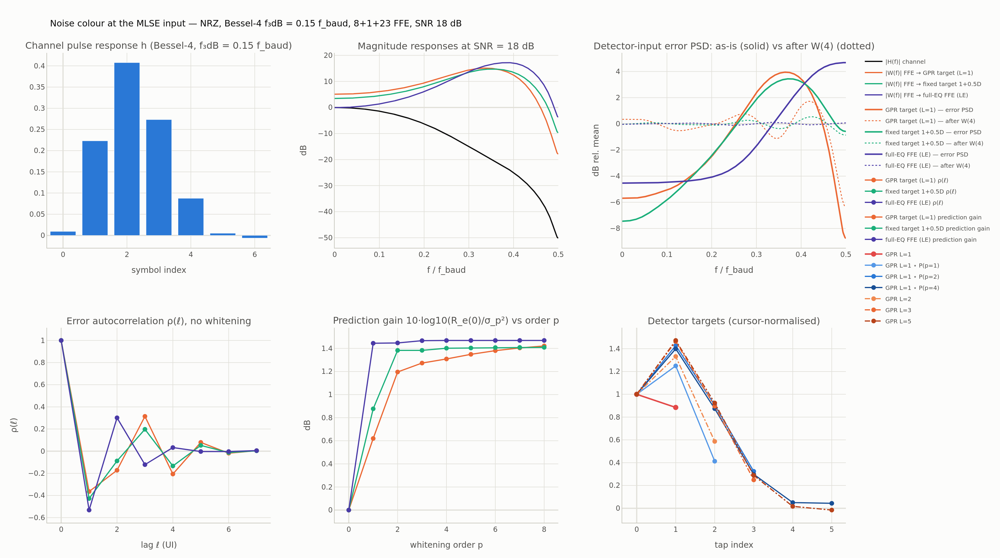
*Figure 2.1 — Severe channel ($f_{3\,\text{dB}} = 0.15\,f_\text{baud}$, NRZ, SNR 18 dB). Top: pulse response; magnitude responses of the channel and of the three FFEs; detector-input error PSD before (solid) and after (dotted) the order-4 extension filter. Bottom: error autocorrelation $\rho(\ell)$; prediction gain versus order; the memory-1 GPR target, its whitened extensions and the longer GPR targets. The full-equalisation FFE (violet) boosts Nyquist by 17 dB and produces an error with $\rho_1 = -0.53$; the GPR FFE (orange) rolls off above $0.35\,f_\text{baud}$ because its $1 + 0.77D$ target absorbs the channel's low-pass character, leaving $\rho_1 = -0.37$.*

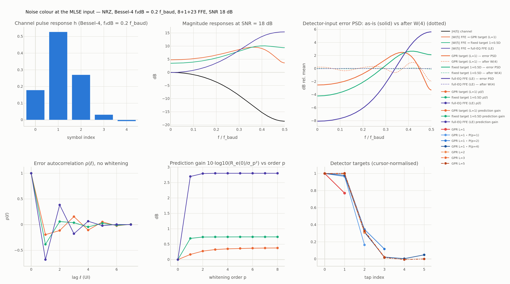
*Figure 2.2 — Same for the moderate channel ($0.2\,f_\text{baud}$, SNR 16 dB). The GPR error is already nearly white ($\rho_1 = -0.16$, prediction gain 0.3 dB); the full-equalisation error is not ($\rho_1 = -0.64$, 2.3 dB).*

| channel | $\rho_1$: GPR L=1 / fixed / full-EQ | prediction gain (dB), order 4: GPR / fixed / full-EQ |
|---|---|---|
| 0.25 (NRZ, 18 dB) | $-0.04$ / $-0.10$ / $-0.55$ | 0.04 / 0.05 / 1.67 |
| 0.20 (NRZ, 18 dB) | $-0.20$ / $-0.38$ / $-0.69$ | 0.37 / 0.78 / 3.69 |
| 0.15 (NRZ, 18 dB) | $-0.37$ / $-0.43$ / $-0.53$ | 1.69 / 1.95 / 5.50 |
| 0.20 (PAM4, 24 dB) | $-0.23$ / $-0.46$ / $-0.76$ | 0.40 / 1.11 / 4.29 |
| 0.15 (PAM4, 24 dB) | $-0.52$ / $-0.63$ / $-0.71$ | 2.31 / 3.91 / 8.55 |

*Table 2.2 — Lag-1 correlation of the detector-input error without whitening, and the error-variance reduction obtained by the order-4 (NRZ) / order-3 (PAM4) extension filter, at the mid-sweep SNR. The full-equalisation FFE always produces the most coloured error.*

Two observations drive everything that follows. First, the colour is set by how much shaping the FFE does: with a GPR target the FFE is nearly flat on the mild channel and $\rho_1 \approx 0$, while the full-equalisation FFE is strongly high-pass on every channel. Second, the prediction gain is *not* the SNR that whitening will recover: it measures the error-variance reduction, whereas the detector performance is set by the effective distance (1.13), which also changes because the target gets longer. The bound, not the prediction gain, is the right design metric.

### 2.3 NRZ results

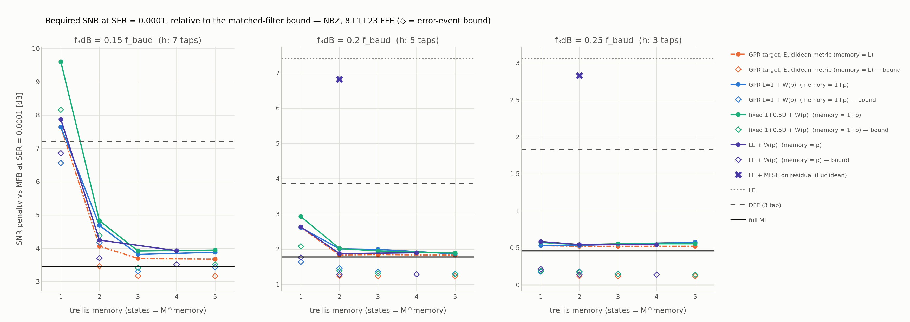
*Figure 2.3 — Required SNR at SER $= 10^{-4}$ relative to the MFB, versus trellis memory, NRZ. Filled markers: Monte Carlo; open diamonds: error-event bound. Orange dash-dot: GPR targets with the Euclidean metric (memory $= L$). Blue: memory-1 GPR target plus extension filter (memory $= 1 + p$). Green: fixed $1 + 0.5D$ target plus extension filter. Violet: full-equalisation FFE plus extension filter (memory $= p$); the violet cross is the full-equalisation FFE with a Euclidean Viterbi on the residual. Horizontal lines: LE (dotted), DFE (dashed), full ML (solid).*

| receiver (NRZ, SER $10^{-4}$) | 0.25 $f_\text{baud}$ | 0.20 $f_\text{baud}$ | 0.15 $f_\text{baud}$ |
|---|---|---|---|
| LE | +3.05 | +7.40 | > +14.7 |
| DFE (3 tap) | +1.84 | +3.87 | +7.21 |
| full ML | +0.46 | +1.78 | +3.46 |
| GPR L=1, Euclidean | +0.53 | +2.62 | +7.64 |
| GPR L=1 + W(1) / W(2) / W(4) | +0.53 / +0.55 / +0.58 | +2.01 / +2.00 / +1.87 | +4.69 / +3.82 / +3.88 |
| GPR L=2 / L=3 / L=5, Euclidean | +0.52 / +0.52 / +0.52 | +1.84 / +1.85 / +1.83 | +4.06 / +3.70 / +3.68 |
| fixed $1+0.5D$, Euclidean | +0.58 | +2.93 | +9.60 |
| fixed $1+0.5D$ + W(1) / W(2) / W(4) | +0.54 / +0.56 / +0.56 | +2.02 / +1.95 / +1.89 | +4.83 / +3.92 / +3.95 |
| LE + MLSE(res L=2), Euclidean | +2.83 | +6.82 | > +14.7 |
| LE + W(1) / W(2) / W(4) | +0.59 / +0.55 / +0.55 | +2.64 / +1.88 / +1.90 | +7.88 / +4.25 / +3.93 |

*Table 2.3 — SNR penalty (dB) relative to the MFB at SER $= 10^{-4}$, NRZ, $2 \times 10^6$ symbols per point. The MFB needs 11.32 dB. Entries "> +14.7" did not reach $10^{-4}$ within the 26 dB sweep.*

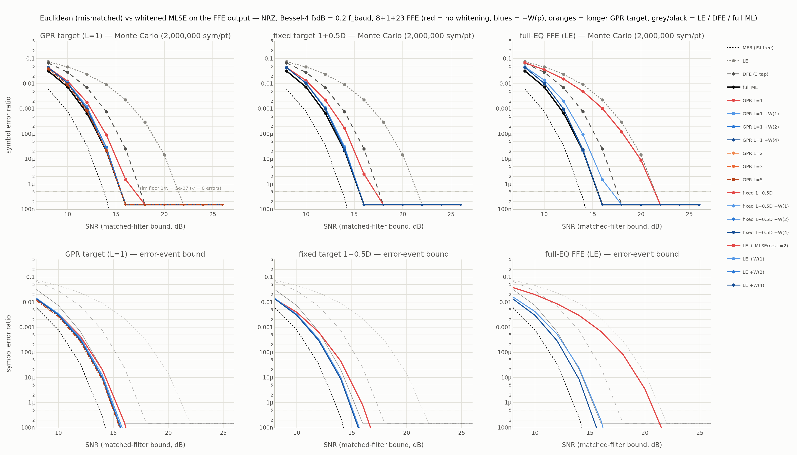
*Figure 2.4 — SER versus SNR on the moderate channel, NRZ. Columns: the three target families; top row Monte Carlo, bottom row error-event bound. Red: no whitening; blues: extension filter of order 1, 2, 4; oranges: longer GPR targets; grey/black: LE, DFE, full ML; dotted black: MFB.*

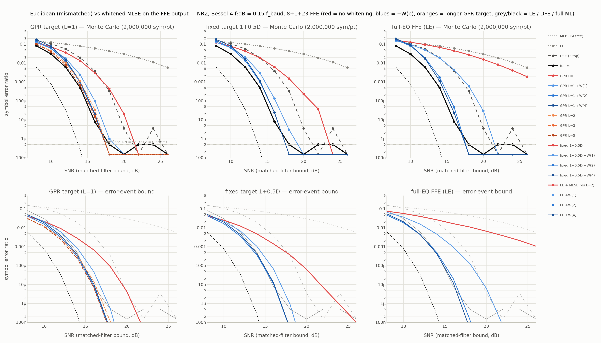
*Figure 2.5 — Same on the severe channel. The Euclidean GPR L=1 detector (red, left) is worse than the DFE; with order-2 whitening it is within 0.4 dB of full ML. In the right column the full-equalisation FFE with a Euclidean Viterbi on its residual (red) is indistinguishable from the slicer.*

Reading the table by channel:

- **Mild channel (0.25).** Every sequence detector is within 0.1 dB of every other and within 0.1 dB of full ML; $\rho_1 = -0.04$ and there is no mismatch loss to recover. The exceptions are the two receivers whose error is coloured: the full-equalisation FFE with Euclidean Viterbi on the residual (+2.83 dB, essentially the LE at +3.05 dB — the residual taps are tiny, so the trellis adds nothing) and, marginally, the fixed target. One order of whitening brings the full-equalisation chain to +0.59 dB, a gain of 2.2 dB.
- **Moderate channel (0.20).** The Euclidean GPR L=1 detector loses 0.6–0.75 dB relative to its whitened versions (+2.62 versus +2.01 / +1.87 dB). A Euclidean detector with a memory-2 GPR target (+1.84 dB) is as good as the whitened memory-1 detector of order 4 and uses a smaller trellis. The fixed target costs 1 dB (+2.93 versus +1.89 dB whitened). The full-equalisation chain gains 4.9 dB from order-2 whitening (+6.82 → +1.88 dB) and ends 0.1 dB from full ML.
- **Severe channel (0.15).** The Euclidean GPR L=1 detector (+7.64 dB) is now *worse than a 3-tap DFE* (+7.21 dB); order-2 whitening recovers 3.8 dB; the fixed target is 5.7 dB worse than its whitened version. A Euclidean memory-3 GPR target (+3.70 dB) is 0.1 dB better than the whitened memory-1 detector with the same trellis (+3.82 dB). The full-equalisation chain needs order 4 to reach +3.93 dB; even then it cannot do better than the GPR chains because the 32-tap FFE cannot equalise a $-50$ dB Nyquist loss without large residual ISI, and a whitening filter cannot undo noise enhancement — it only fixes the metric mismatch.

### 2.4 PAM4 results

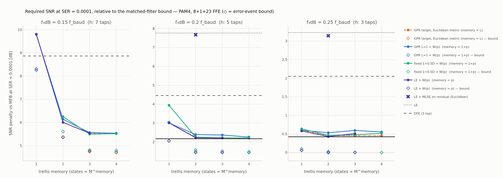
*Figure 2.6 — As Figure 2.3 for PAM4 ($10^6$ symbols per point). No full-ML reference exists for the 7-tap channel (4096 states).*

| receiver (PAM4, SER $10^{-4}$) | 0.25 $f_\text{baud}$ | 0.20 $f_\text{baud}$ | 0.15 $f_\text{baud}$ |
|---|---|---|---|
| LE | +3.23 | +7.77 | > +13.5 |
| DFE (3 tap) | +2.05 | +4.46 | +8.87 |
| full ML | +0.42 | +2.17 | — |
| GPR L=1, Euclidean | +0.60 | +3.01 | +9.79 |
| GPR L=1 + W(1) / W(2) / W(3) | +0.53 / +0.60 / +0.55 | +2.39 / +2.37 / +2.26 | +6.14 / +5.56 / +5.54 |
| GPR L=2 / L=3 / L=4, Euclidean | +0.45 / +0.45 / +0.45 | +2.25 / +2.21 / +2.20 | +6.00 / +5.54 / +5.52 |
| fixed $1+0.5D$, Euclidean | +0.64 | +3.94 | > +13.5 |
| fixed $1+0.5D$ + W(1) / W(2) / W(3) | +0.46 / +0.48 / +0.52 | +2.26 / +2.22 / +2.21 | +6.25 / +5.50 / +5.52 |
| LE + MLSE(res L=2), Euclidean | +3.15 | +7.68 | > +13.5 |
| LE + W(1) / W(2) / W(3) | +0.58 / +0.43 / +0.51 | +3.01 / +2.22 / +2.21 | +9.81 / +6.01 / +5.54 |

*Table 2.4 — As Table 2.3 for PAM4; the MFB needs 18.54 dB.*

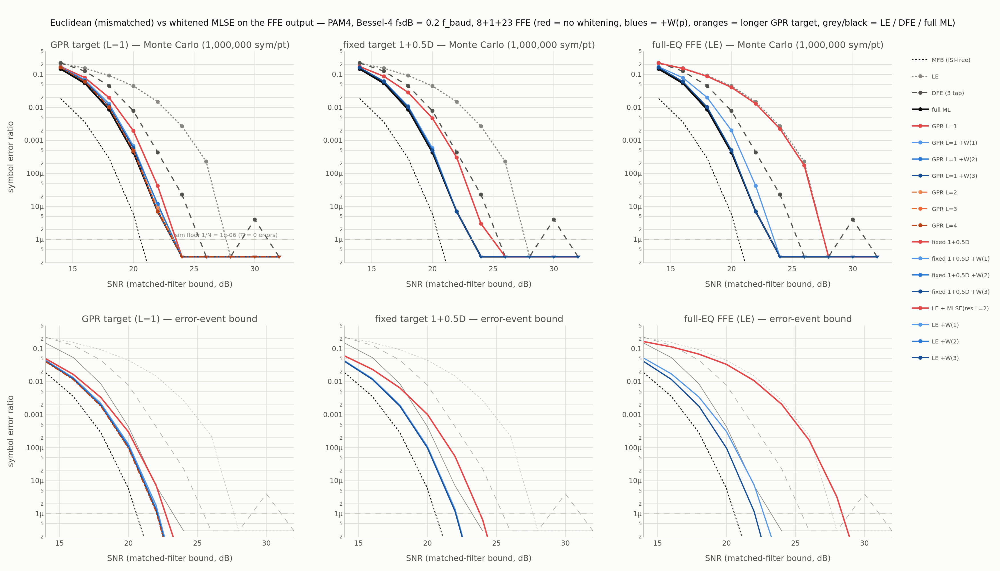
*Figure 2.7 — SER versus SNR on the moderate channel, PAM4.*

The PAM4 behaviour mirrors NRZ with slightly larger losses: 0.75 dB for the Euclidean GPR L=1 detector on the moderate channel and 4.2 dB on the severe one (again worse than the DFE), 1.7 dB for the fixed target on the moderate channel, and 5.5 dB recovered by order-2 whitening of the full-equalisation chain on the moderate channel (+7.68 → +2.22 dB, 0.05 dB from full ML).

### 2.5 Which error to whiten: a 3 dB detail

The three candidate designs of §1.8 were compared with the bound (1.13) on the measured error (Table 2.5), then the two full runs were repeated.

| receiver (NRZ, bound margin in dB) | prediction-error filter of the total error | prediction-error filter of the filtered noise | min-error extension filter (1.18) |
|---|---|---|---|
| 0.15 $f_\text{baud}$, 18 dB: full-EQ + W(2) | 10.52 | 13.56 | **14.20** |
| 0.15 $f_\text{baud}$, 18 dB: full-EQ + W(4) | 10.54 | 13.49 | **14.55** |
| 0.15 $f_\text{baud}$, 18 dB: GPR L=1 + W(2) | 14.63 | 14.25 | **14.70** |
| 0.15 $f_\text{baud}$, 18 dB: fixed + W(2) | 14.25 | 13.97 | **14.59** |
| 0.20 $f_\text{baud}$, 14 dB: full-EQ + W(2) | 12.25 | 12.64 | **12.68** |
| 0.20 $f_\text{baud}$, 14 dB: GPR L=1 + W(2) | **12.60** | 12.51 | **12.60** |

*Table 2.5 — Margin $20\log_{10}(A_s d_\text{eff,min}/\sigma)$ of the extended detector for three ways of designing the order-$p$ filter. The min-error design is best or tied everywhere and brings the post-whitening $\rho_1$ to $\approx 0$ in every family.*

Whitening the *total* error fails for the full-equalisation chain because its error is dominated by residual ISI on the severe channel, and a predictor tuned to that ISI is wrong once the extended trellis models part of it. In the full Monte Carlo the difference is 4.6 dB for LE + W(4) on the severe channel (+8.57 dB with the total-error predictor, archived in `nrz_main_errorwhitening/`, versus +3.93 dB with (1.18)). Whitening the *noise alone* under-weights the ISI and is 0.3–0.6 dB worse for GPR and fixed targets. The min-error filter (1.18) contains both as special cases and should be the default.

### 2.6 Bound versus Monte Carlo

Across all channels and receivers the nearest-neighbour Gaussian estimate of the bound is 0.4–1.0 dB optimistic in required SNR (open versus filled markers in Figures 2.3 and 2.6). Two effects are missing from it: the multiplicity of nearly-minimum-distance events, and the non-Gaussian, data-dependent nature of the residual-ISI term. The *ordering* of the receivers, and the dB differences between whitened and unwhitened variants, are reproduced correctly, so the bound evaluated on a short block of measured error is an adequate design tool; this is used on the capture in §3.

### 2.7 Interpretation

The three channels correspond to three regimes of the detector-input error:

1. $|\rho_1| \lesssim 0.05$ (mild shaping, GPR target): the Euclidean metric is already as good as any; do nothing.
2. $\rho_1 \approx -0.2$: 0.6–0.75 dB loss. Order-1 whitening recovers most of it; a GPR target one tap longer recovers all of it at equal trellis size.
3. $\rho_1 \lesssim -0.4$ (severe channel, fixed targets, and every full-equalisation FFE): several dB; the "MLSE" can be worse than a DFE. Order 2 recovers essentially all of it.

In no case did a whitened memory-$L$ detector beat a Euclidean detector with a GPR target of memory $L + p$; the two coincide within $\pm 0.1$ dB. Choosing the right target and whitening the noise are two routes to the same place — the performance of a detector whose trellis sees a near-white error. Whitening is the route to take when the target is fixed by hardware or by an adaptation loop that converges to full equalisation; re-targeting is the route when the FFE target can be designed.

---

## 3. Capture study: 212.5 Gb/s PAM4 (`ranjit_colossus`)

### 3.1 Data

- `temp/food/ranjit_colossus/tx_symbols (1).csv`: 150,000 PAM4 symbols (integers 0–3, uniformly distributed) from the `eoe_sim` export, Gray-mapped as in `pam4_symbol_to_bits` (0→00, 1→01, 2→11, 3→10).
- `temp/food/ranjit_colossus/after_rxterm.csv` / `after_rxterm_wave.npy`: the waveform at the ADC input, 4,800,064 samples at a uniform 0.2941 ps step. The step is exactly UI/32 at 106.25 GBd (212.5 Gb/s PAM4), and the `.npy` is numerically identical to the CSV. Swing $\pm 0.115$ V.

The transmitted waveform is taken to be ideal (the ZOH symbol stream), so no TX model enters; the symbols and the baud-rate samples at each phase are all that is used. Cross-correlation gives a delay of 182 UI and positive polarity at every phase.

### 3.2 Processing pipeline (per sampling phase, no CDR)

For each phase $\varphi \in \{0, \dots, 31\}$:

1. **Baud samples** $x_\varphi[k] = w[32k + \varphi]$, aligned to the symbol stream by the cross-correlation lag.
2. **Channel estimate** by least squares on the first 50,000 symbols, $x[k] = \sum_{j=0}^{32} h_j\, a_c[k-j] + n[k]$ with 8 precursor and 24 post-cursor taps ($a_c$ is the symbol stream shifted so that the first tap of $h$ coincides with $x$).
3. **Noise statistics** from the LS residual $r = x - \hat h \star a_c$: $\sigma_n^2 = \overline{r^2}$ and the biased autocorrelation $r_n(\ell)$ up to lag 50. The residual contains everything the 33-tap linear model does not explain (noise, nonlinearity, longer tails), which is exactly what a receiver designed from this estimate will see.
4. **Receiver design** from $(\hat h, r_n)$: all FFEs are Wiener solutions with the coloured-noise autocorrelation matrix $R = \sigma_a^2\, \mathrm{Toeplitz}(r_{hh}) + \mathrm{Toeplitz}(r_n)$, $r_{hh}(\ell) = \sum_m h_m h_{m-\ell}$; GPR targets by (1.11), the fixed target by $w = R^{-1}\mathbf P t$, the DFE by the joint MMSE equations with the same $R$, and the extension filters by (1.17)–(1.18) with $R_{wn}(\ell) = \sum_i\sum_j w_i w_j r_n(\ell + j - i)$. The receivers are those of Table 2.1 except full ML (a 30-tap PAM4 trellis is out of reach), with whitening orders $\{1, 2, 3\}$ and GPR memories $\{2, 3, 4\}$ ($\le 256$ states).
5. **Detection** on the remaining 99,795 symbols (hold-out): counted SER, and the bound (1.13) on the measured detector-input error (Gaussian SER estimate and margin).

**Noise loading.** The capture is clean enough that no receiver makes an error (§3.4), so the comparison is made under added noise. Rather than white noise, the loaded noise is shaped like the LS residual: an order-16 AR synthesis whose autocorrelation matches $r_n(0 \dots 16)$ (coefficients from the Levinson solution (1.15) of the residual's autocorrelation), scaled to $m$ times the native residual rms. Adding noise with the receiver's own noise spectrum is equivalent to lowering the OMA with the RX noise unchanged, and it degrades the MFB SNR by $10\log_{10}(1 + m^2)$: 3.0, 7.0, 10.0, 12.3, 14.1, 15.7 and 18.1 dB for $m = 1 \dots 8$. White loading is available (`--noise-shape white`) but was not used for the results below. The channel is re-estimated with the loaded noise present, as a receiver operating at that SNR would.

### 3.3 Channel and noise

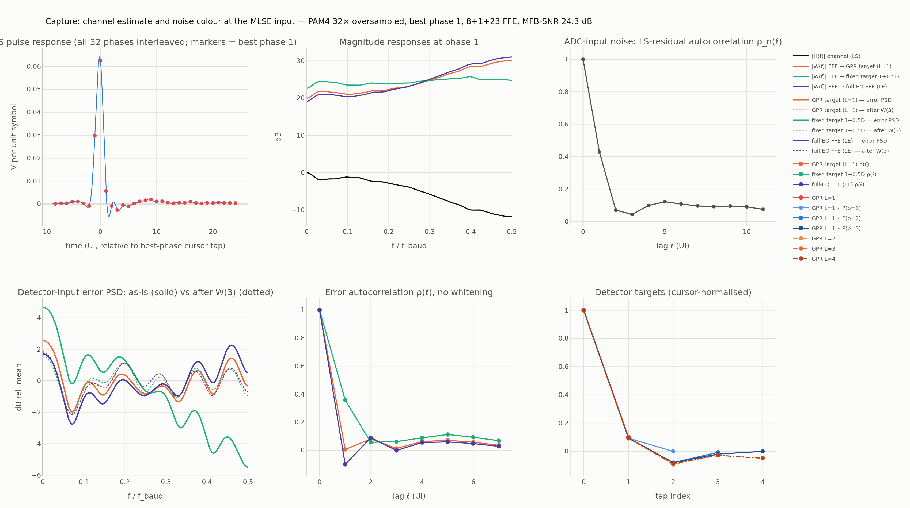
*Figure 3.1 — Top left: the LS pulse response at UI/32 resolution, assembled from the 32 per-phase estimates (markers: the baud-spaced taps at the best phase, 1). Top centre: magnitude responses of the LS channel and of the three FFEs (the +24 dB offset is the 0.0625 V/symbol cursor gain). Top right: the autocorrelation of the LS residual — the ADC-input noise is low-pass, $\rho_n(1) = +0.43$. Bottom: detector-input error PSD and autocorrelation for the three target families, and the detector targets.*

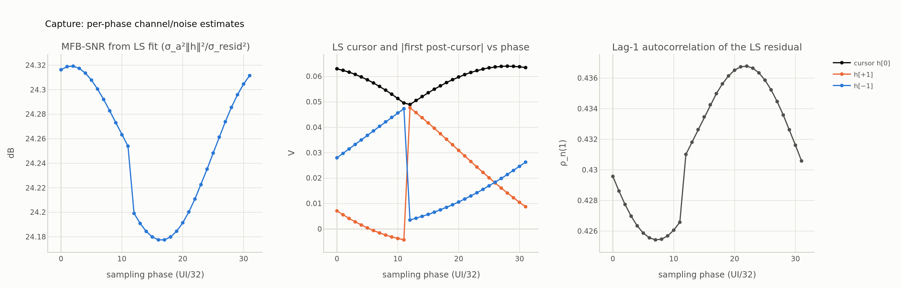
*Figure 3.2 — Per-phase LS results: MFB SNR (left), cursor and adjacent taps (centre), lag-1 autocorrelation of the residual (right). The MFB SNR is flat at 24.3 dB because it uses $\lVert h \rVert^2$; what changes with phase is how the pulse energy is split between cursor and ISI.*

| quantity | best phase (1) | worst phase (16, 0.47 UI away) |
|---|---|---|
| cursor $h_0$ | 0.0625 V per unit symbol | 0.0549 V |
| $h_{-1}/h_0$, $h_{+1}/h_0$, $h_{+2}/h_0$ | 0.476, 0.090, $-0.015$ | 0.121, 0.720, $-0.102$ |
| LS residual rms | 3.16 mV | 3.2 mV |
| $\rho_n(1)$ of the residual | $+0.43$ | $+0.43$ |
| MFB SNR (2.1) | 24.32 dB | 24.2 dB |
| $\lvert H(f) \rvert$ at Nyquist (relative to DC) | $-12$ dB | — |

*Table 3.1 — Channel and noise estimates. The optimum sampling phase sits late on the pulse: a large precursor (which an FFE removes without noise enhancement because the pulse energy is still collected) and a negligible post-cursor.*

The channel is comparable to the *mild* synthetic case ($-12$ dB at Nyquist, cf. $-11.6$ dB for $0.25\,f_\text{baud}$) at the best phase, and to the moderate case at the worst phase, where the post-cursor is 72 % of the cursor.

### 3.4 Native results

At the native noise level every receiver decodes the 99,795 test symbols without error at every phase except within $\pm 2$ phases of the worst one, where only the LE and the full-equalisation-plus-residual chain err (Figure 3.3). The margins at the best phase are 17.03 dB (LE), 17.10 (DFE), 17.12 (GPR L=1), 17.15 (GPR L=1 + W(2)), 17.17 (GPR L=4), 17.03 (full-EQ + residual MLSE) and 17.15 (full-EQ + W(2)): the whole field lies within 0.15 dB, corresponding to Gaussian SER estimates of $4$–$9 \times 10^{-13}$. The only receiver that stands out is the fixed $1 + 0.5D$ target at 16.38 dB ($\rho_1 = +0.33$: the FFE has to *create* a post-cursor the channel does not have and low-pass-filters the noise in doing so); its extended versions recover to 16.96–17.07 dB.

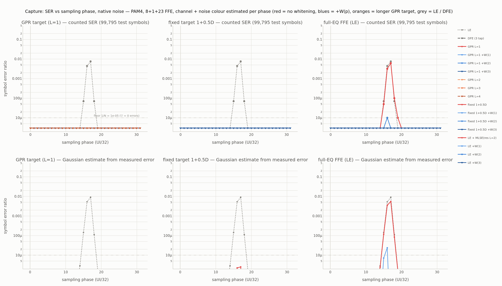
*Figure 3.3 — SER versus sampling phase at the native noise level: counted (top) and Gaussian estimate from the measured error (bottom). Triangles mark zero counted errors.*

### 3.5 Noise-loaded results

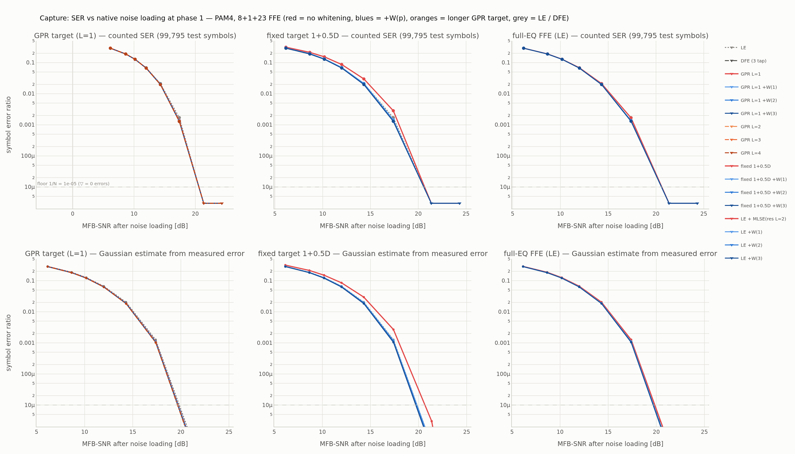
*Figure 3.4 — SER versus loaded MFB SNR at the best phase. All receivers coincide except the fixed target without whitening (red, centre column).*

At the best phase the loaded curves of all GPR, whitened and full-equalisation receivers lie on top of each other and on top of the LE and the DFE (Table 3.2, left): the channel at this phase has so little post-cursor ISI that there is no sequence-detection gain to be had, and consequently no metric mismatch to lose.

| receiver | best phase 1, $m = 2$ (MFB SNR 17.4 dB): SER / margin | worst phase 16, $m = 2$ (17.2 dB): SER / margin | worst phase 16, $m = 3$ (14.2 dB): SER / margin |
|---|---|---|---|
| LE | $1.5 \times 10^{-3}$ / 9.96 | $5.4 \times 10^{-2}$ / 5.10 | $1.09 \times 10^{-1}$ / 3.26 |
| DFE (3 tap) | $1.3 \times 10^{-3}$ / 10.04 | $1.5 \times 10^{-2}$ / 8.52 | $8.0 \times 10^{-2}$ / 5.66 |
| GPR L=1, Euclidean | $1.3 \times 10^{-3}$ / 10.07 | $8.3 \times 10^{-3}$ / 8.73 | $6.6 \times 10^{-2}$ / 5.84 |
| GPR L=1 + W(1) | $1.3 \times 10^{-3}$ / 10.07 | $5.6 \times 10^{-3}$ / 9.27 | $5.8 \times 10^{-2}$ / 6.25 |
| GPR L=1 + W(2) | $1.2 \times 10^{-3}$ / 10.12 | $4.9 \times 10^{-3}$ / 9.25 | $5.6 \times 10^{-2}$ / 6.27 |
| GPR L=2 / L=4, Euclidean | $1.2 \times 10^{-3}$ / 10.12, 10.14 | $3.4 \times 10^{-3}$ / 9.36, $3.1 \times 10^{-3}$ / 9.53 | $4.9 \times 10^{-2}$ / 6.37, $4.6 \times 10^{-2}$ / 6.52 |
| fixed $1+0.5D$, Euclidean | $2.8 \times 10^{-3}$ / 9.31 | $1.07 \times 10^{-2}$ / 8.78 | $6.6 \times 10^{-2}$ / 5.88 |
| fixed $1+0.5D$ + W(3) | $1.3 \times 10^{-3}$ / 10.12 | $5.0 \times 10^{-3}$ / 9.21 | $5.3 \times 10^{-2}$ / 6.30 |
| full-EQ + MLSE(res L=2), Euclidean | $1.5 \times 10^{-3}$ / 9.96 | $4.9 \times 10^{-2}$ / 5.73 | $1.06 \times 10^{-1}$ / 3.95 |
| full-EQ + W(1) / W(2) / W(3) | $1.3$ / $1.25$ / $1.2 \times 10^{-3}$ / 10.07 / 10.12 / 10.12 | $9.5$ / $4.2$ / $3.9 \times 10^{-3}$ / 8.50 / 9.20 / 9.24 | $6.5$ / $5.0$ / $4.8 \times 10^{-2}$ / 5.87 / 6.34 / 6.39 |

*Table 3.2 — Counted SER on 99,795 held-out symbols and margin (dB) under native-spectrum noise loading. $\rho_1$ of the Euclidean GPR detector's error is $+0.24$ at the worst phase (the FFE must now suppress a 72 % post-cursor), $0.00$ at the best phase.*

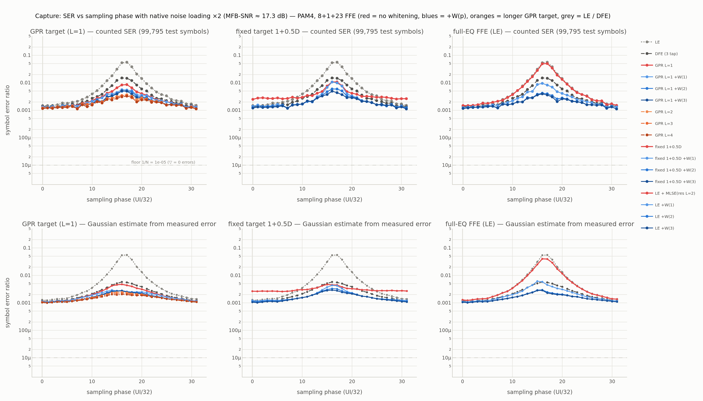
*Figure 3.5 — SER versus sampling phase with $m = 2$ noise loading (MFB SNR 17.3 dB). Left: GPR family; centre: fixed target; right: full-equalisation FFE. Red: Euclidean metric without whitening; blues: extension filter of order 1, 2, 3; oranges: longer GPR targets; grey: LE and DFE.*

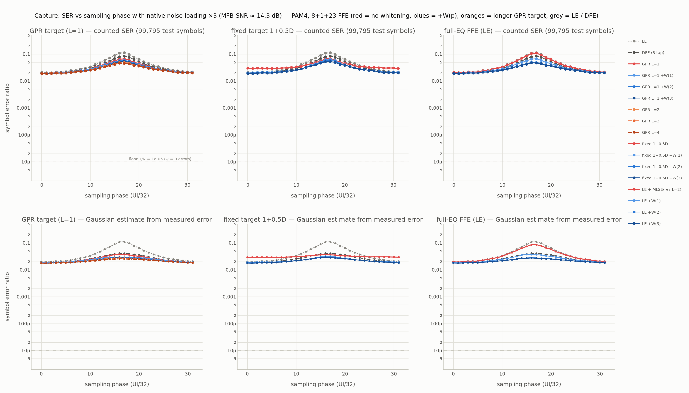
*Figure 3.6 — Same at $m = 3$ (MFB SNR 14.3 dB).*

Away from the optimum phase the synthetic picture reappears:

- At a 0.47 UI timing offset (phase 16) the Euclidean GPR L=1 detector loses 0.5 dB of margin relative to its order-1 extension (8.73 versus 9.27 dB), and its counted SER is 1.5× higher ($8.3 \times 10^{-3}$ versus $5.6 \times 10^{-3}$). A Euclidean memory-2 GPR target is again 0.1 dB better than the whitened memory-1 detector with the same trellis, and memory 4 is best (9.53 dB). At $m = 3$ the corresponding numbers are 0.45 dB and 0.7 dB.
- The full-equalisation FFE with a Euclidean Viterbi on its residual is no better than the slicer at any phase (5.73 versus 5.10 dB margin at the worst phase; its error has $\rho_1 = -0.61$); with the order-2 extension it gains 3.5 dB (9.20 dB) and matches the GPR chains. The gain is 2.4 dB at $m = 3$.
- At a 0.35 UI offset (phase 12) the losses are 0.26 dB (GPR) and 1.2 dB (full-equalisation chain); by 0.2 UI they are below the resolution of the measurement.
- The fixed $1 + 0.5D$ target is the only receiver that loses at the *best* phase (0.7 dB); at the worst phase it is on a par with the GPR L=1 detector and recovers with order-2 or order-3 extension.

### 3.6 Interpretation for the Colossus receiver

With a CDR that locks near the MMSE sampling phase, this link does not need a whitening stage: a Euclidean Viterbi on a memory-1 GPR target is within 0.1 dB of every alternative, and even the LE is within 0.2 dB. The whitening/extension filter buys robustness — against timing offset (0.5 dB at half a UI, more on a more band-limited channel) and against a fixed hardware target (0.7 dB here) — and it is a prerequisite for any gain at all if the sequence detector is placed behind a full-equalisation LMS FFE, which is the configuration of `AdcReceiver` with `mlse_input="equalized"`. The ADC-input noise colour ($\rho_n(1) = +0.43$) is accounted for in all designs above; a receiver that assumed white input noise would mis-design its FFE and its whitening filter, but on this mild channel the effect would be small.

---

## 4. Conclusions and design guidance

1. **Diagnose before whitening.** Estimate the detector-input error $e = y - t \star \hat a$ from decisions and compute $\rho_1$. If $|\rho_1| < 0.05$ the Euclidean metric is adequate; $\rho_1 \approx -0.2$ indicates a loss of about 0.7 dB; $\rho_1 \le -0.4$ indicates several dB and a detector that may be no better than a DFE.
2. **Prefer re-targeting to whitening when the FFE target can be designed.** A GPR target one or two taps longer achieves what a whitening filter of the same order achieves, at the same trellis size, and without a second filter.
3. **Whiten when the target cannot be chosen.** Behind a hardware-fixed target, or behind an adaptive FFE that converges to full equalisation, use an order-2 extension filter; order 1 recovers one half to two thirds of the loss, order 2 essentially all of it, higher orders add nothing measurable.
4. **Design the extension filter with (1.17)–(1.18), not with the prediction-error filter of the total error.** The latter is 3–4 dB worse on severe channels for the full-equalisation architecture; whitening the noise alone is 0.3–0.6 dB worse for GPR and fixed targets.
5. **Use the Annex-178A-type bound with the $u^{\mathsf T} V u$ term for design.** It is 0.4–1.0 dB optimistic but ranks receivers correctly, costs a block of a few hundred thousand error samples, and needs no Monte Carlo.
6. **Account for the colour of the input noise.** On the captured link the ADC-input noise has $\rho_n(1) = +0.43$; the FFE, DFE and whitening designs in `npml.py` accept the measured noise autocorrelation.
7. **For the Colossus `ranjit_colossus` link specifically**, there is no loss to recover at the CDR lock point; the whitening stage is insurance against timing offset and against the full-equalisation-plus-residual architecture, where it is worth 2–3.5 dB.

---

## 5. Caveats and future work

- The synthetic channels are smooth Bessel low-pass responses without reflections; electrical channels with reflections would exercise the error-event enumeration more severely.
- All designs assume a known (synthetic) or block-LS-estimated (capture) channel and noise autocorrelation; an adaptive implementation (LMS FFE, decision-directed error-autocorrelation estimate, Levinson update of $P$) will add some loss, and the quantification of that loss is the natural next step.
- The capture provides 99,795 held-out symbols (SER floor $10^{-5}$); the margins are derived from the measured error statistics and extrapolate the Gaussian tail. The bound under-estimates counted SER above $10^{-2}$ because several error events contribute.
- The noise-loading model adds noise with the residual's spectrum; a reduced-OMA capture series would be the direct validation.
- The full-ML reference is only available for NRZ and for the shorter PAM4 channels; a reduced-state sequence detector would extend the comparison.
- The sampling-phase dependence suggests a joint study with the CDR: the Mueller–Müller lock point is not the MMSE phase in general, and the margin-versus-phase curve of Figure 3.2 quantifies what that costs for each receiver.

---

## 6. Reproduction and file inventory

```bash
# synthetic study (≈7 min NRZ, ≈5 min PAM4 on 16 cores)
python examples/mlse_whitening_study.py --n-symbols 2000000 --tag nrz_main
python examples/mlse_whitening_study.py --modulation pam4 --bw 0.15 0.2 0.25 --snr-range 14 32 2 \
    --n-symbols 1000000 --whiten-orders 1 2 3 --gpr-memories 2 3 4 --tag pam4_main
python examples/mlse_whitening_study.py --tag nrz_main --replot          # figures from results.json

# capture study (≈80 s)
python examples/mlse_whitening_capture.py --symbols "temp/food/ranjit_colossus/tx_symbols (1).csv" \
    --wave temp/food/ranjit_colossus/after_rxterm_wave.npy --tag ranjit_colossus          # ×3 phase sweep
python examples/mlse_whitening_capture.py --symbols "temp/food/ranjit_colossus/tx_symbols (1).csv" \
    --wave temp/food/ranjit_colossus/after_rxterm_wave.npy --phase-noise 2.0 \
    --extra-noise 1.5 2.0 2.5 --tag ranjit_colossus_x2                                     # ×2 phase sweep

python -m pytest tests/test_rx/test_npml.py tests/test_optical/test_mlse.py tests/test_analysis/test_mlsd_bound.py
```

| file | content |
|---|---|
| `src/optical_serdes/rx/npml.py` | `mmse_ffe_taps_to_target`, `gpr_target_and_ffe` (1.11), `pr_target_ffe`, `error_autocorr_after_ffe` (1.12), `ffe_output_noise_autocorr`, `prediction_error_filter` (1.15), `whitening_gain_db`, `min_error_extension_filter` (1.18), `viterbi_decode_chunked`; all design functions accept a measured input-noise autocorrelation |
| `src/optical_serdes/analysis/mlsd_bound.py` | error-event bound (1.13) for arbitrary memory and alphabet |
| `examples/mlse_whitening_study.py` | synthetic study; `--whiten-design {min_error,noise,error}` selects the filter of §2.5 |
| `examples/mlse_whitening_capture.py` | capture study; per-phase LS channel and noise estimate, hold-out evaluation, noise loading |
| `runs/mlse_whitening/<tag>/` | `results.json` (every receiver, every point), `summary.md`, Plotly `.html` + `.png` figures |
| `data/` (this directory) | copies of the five `summary.md` tables |

---

## 7. References

1. G. D. Forney, Jr., "Maximum-likelihood sequence estimation of digital sequences in the presence of intersymbol interference," *IEEE Trans. Inf. Theory*, vol. 18, no. 3, pp. 363–378, 1972. (MLSE, the whitened matched filter, error-event analysis.)
2. G. Ungerboeck, "Adaptive maximum-likelihood receiver for carrier-modulated data-transmission systems," *IEEE Trans. Commun.*, vol. 22, no. 5, pp. 624–636, 1974. (Alternative metric formulation.)
3. P. R. Chevillat and E. Eleftheriou, "Decoding of trellis-encoded signals in the presence of intersymbol interference and noise," *IEEE Trans. Commun.*, vol. 37, no. 7, pp. 669–676, 1989. (Noise prediction embedded in the Viterbi detector.)
4. E. Eleftheriou and W. Hirt, "Improving performance of PRML/EPRML through noise prediction," *IEEE Trans. Magn.*, vol. 32, no. 5, pp. 3968–3970, 1996; J. D. Coker, E. Eleftheriou, R. L. Galbraith and W. Hirt, "Noise-predictive maximum likelihood (NPML) detection," *IEEE Trans. Magn.*, vol. 34, no. 1, pp. 110–117, 1998. (NPML.)
5. J. Moon and W. Zeng, "Equalization for maximum likelihood detectors," *IEEE Trans. Magn.*, vol. 31, no. 2, pp. 1083–1088, 1995. (Jointly MMSE-optimal / generalised partial-response targets.)
6. IEEE P802.3dj Draft, Annex 178A, §178A.1.11: MLSD error-event argument, Equation (178A-40).
7. J. G. Proakis and M. Salehi, *Digital Communications*, 5th ed., McGraw-Hill, 2008, Ch. 9–10. (Equalisation, MLSE, error-event bounds.)
8. S. Haykin, *Adaptive Filter Theory*, 4th ed., Prentice Hall, 2002, Ch. 3. (Linear prediction, Levinson–Durbin recursion.)
