# Waveform Decomposition: Signal + ISI + Distortion + Noise

**Project:** optical-serdes
**Source:** [`src/optical_serdes/analysis/waveform_decomposition.py`](../../../optical-serdes/src/optical_serdes/analysis/waveform_decomposition.py)
**Example:** [`examples/waveform_decomposition_demo.py`](../../../optical-serdes/examples/waveform_decomposition_demo.py)
**Skill (linear baseline):** [`channel-characterise`](../../../optical-serdes/.claude/skills/channel-characterise.md)

---

## 1  Motivation

A captured serial-link waveform is the sum of several physically distinct
contributions. The textbook decomposition is

$$
r(t) = a[m]  h_0 + \sum_{k\neq m} a[k]  h_{m-k} + d(t) + n(t)
$$

evaluated at every UI's cursor sampling instant. The four terms are, in order: the **desired** cursor-only signal $a[m]  h_0$; the linear **ISI** $\sum_{k\neq m} a[k]  h_{m-k}$ from neighbouring symbols; the deterministic **distortion** $d(t)$ from any non-LTI behaviour of the channel; and the random **noise** $n(t)$ that is uncorrelated with the symbol stream.

This nugget describes the procedure used by
`optical_serdes.analysis.waveform_decomposition` to recover each of the
four components from a single captured waveform together with the known
transmitted symbol sequence. The construction generalises in two ways:

* **From-symbols mode** (`decompose_waveform`) treats the entire link
  from symbols to the probe point as one black box.
* **Per-block mode** (`decompose_block_waveform`) characterises one
  block (upstream-probe → downstream-probe) in isolation, attributing
  every joule of impairment in the result to that block alone.

The linear baseline is Wiener-Hopf channel estimation from the
[`channel-characterise`](../../../optical-serdes/.claude/skills/channel-characterise.md)
skill; the new piece is the pattern-conditioned residual averaging
that separates deterministic distortion from random noise. How wide a
symbol context that averaging needs is governed by the collapse law
$L_\text{collapse} = \min(M, N)$ derived and validated in §7.8.

Notation: lowercase Latin letters denote time-domain real signals;
boldface uppercase denotes their length-$N$ rfft transforms;
$a[k] \in \mathcal{A}$ is the transmitted symbol at UI $k$, with
alphabet $\mathcal{A} = \{-1, +1\}$ for NRZ or
$\mathcal{A} = \{-3, -1, +1, +3\}$ for PAM4; $T$ is the symbol period and
$L = T \cdot f_s$ is the integer "samples per UI" (SPS).

---

## 2  System Model

The link is modelled as

$$
y(t) = \int_{-\infty}^{\infty} h(\tau)  x(t-\tau)  d\tau + d(t) + n(t)
$$

where $x(t)$ is whatever LTI input drives the block under study and
$h(t)$ is the block's symbol-spaced single-bit response (SBR).
We discretise at sample period $T_s = T/L$, write $y[t] = y(t T_s)$, and
work on a finite record of length $N$.

The two modes differ only in their choice of $x$:

| Mode            | $x[t]$                                              | $h[\tau]$ recovered                 |
|-----------------|-----------------------------------------------------|-------------------------------------|
| from-symbols    | $\delta_L(t)\sum_k a[k] \delta[t - kL]$ (Dirac train) | full link SBR (symbols → probe)     |
| per-block       | measured upstream probe waveform                    | block-only IR (upstream → block out) |

In from-symbols mode the Dirac train carries all frequencies, so the
estimated $h$ is the *true* SBR. In per-block mode $x$ is already
band-limited (it carries the upstream chain's pulse shape), so the
estimated $h$ is the *block's* IR but the recovered numerical values
inherit the band-limited cursor-tap artifact discussed in §6.

---

## 3  Linear Stage: Wiener-Hopf Channel Estimation

Steps 1–3 reuse the routine documented by
[`channel-characterise`](../../../optical-serdes/.claude/skills/channel-characterise.md);
they are summarised here only to establish notation.

### 3.1  Alignment

Cross-correlation gives the integer-sample lag

$$
\hat\tau = \arg\max_\tau \big| (y \star x)[\tau] \big|, \qquad (y \star x)[\tau] = \sum_t y[t+\tau] x[t]
$$

After alignment we work on a trimmed pair $(\tilde x[t], \tilde y[t])$
of length $N$ chosen as the largest multiple of $L$ that fits, with
$\tilde y[t] = y[t + y_\text{off}]$ and $y_\text{off} = \max(\hat\tau, 0)$.

### 3.2  Wiener-Hopf Deconvolution

With $\mathbf{X}[f] = \mathcal{F}\{\tilde x\}$ and
$\mathbf{Y}[f] = \mathcal{F}\{\tilde y\}$, the Tikhonov-regularised
deconvolution is

$$
\mathbf{H}[f] = \frac{\overline{\mathbf{X}[f]} \mathbf{Y}[f]}{|\mathbf{X}[f]|^2 + \lambda}, \qquad \lambda = \rho \overline{|\mathbf{X}|^2}
$$

with $\rho \in [10^{-5}, 10^{-3}]$ a fractional regularisation. The
length-$N$ time-domain estimate is
$h_\text{full}[\tau] = \mathcal{F}^{-1}\{\mathbf{H}\}$.

### 3.3  Windowing and Normalisation

The cursor sample is identified as
$c = \arg\max_{\tau < N/4} |h_\text{full}[\tau]|$. The windowed,
cursor-normalised IR is

$$
h_\text{win}[\tau] = \frac{h_\text{full}\big[(\tau - L n_\text{pre} + c) \bmod N\big]}{h_\text{full}[c]}, \qquad \tau \in [0, L(n_\text{pre}+n_\text{post}))
$$

so that $h_\text{win}[L n_\text{pre}] = 1$ and $\|h_\text{win}\|$ is
bounded. The "actual" IR is then $h_\text{win} \cdot \text{norm}$ with
$\text{norm} = h_\text{full}[c]$.

### 3.4  Reconstruction $\hat y$

For both modes the linear prediction is

$$
\hat{y}[t] = \mathcal{F}^{-1} \left\{ X[f] \cdot \mathcal{F}\{h_{\text{rec}}\}[f] \right\}[t]
$$

where $h_\text{rec}$ is $h_\text{win}\cdot\text{norm}$ embedded in a
length-$N$ kernel and rolled back so its cursor sits at sample
index $c$. This is the canonical $\hat y$ used by `compute_sndr`.

The **LTI residual** is

$$
e[t] = \tilde y[t] - \hat y[t]
$$

and the **classical SNDR** of the linear fit is

$$
\text{SNDR}_\text{dB} = 10 \log_{10} \frac{\langle \tilde y^2\rangle}{\langle e^2 \rangle}
$$

evaluated over a guard-trimmed window to suppress circular-edge
artefacts of $\mathcal{F}^{-1}$.

---

## 4  Linear Split: Desired + ISI

We split $\hat y$ into a "main symbol pulse" and "everything else"
in two different ways depending on the mode.

### 4.1  From-Symbols Split (Eq. 7)

In from-symbols mode the LTI input is the Dirac train
$x[t] = \sum_k a[k] \delta[t - kL]$. The natural continuous-time
extension of the cursor-only decomposition in Eq. (1) is

**Boxed relation (Eq. 7):**

$$
y_\text{desired}(t) = h_0 \cdot \mathrm{ZOH}(a)(t), \qquad y_\text{ISI}(t) = \hat y(t) - y_\text{desired}(t)
$$

where $h_0 = h_\text{win}[L n_\text{pre}] \cdot \text{norm}$ is the
cursor tap value and $\mathrm{ZOH}(a)$ is the rectangular PAM4 staircase
holding $a[m]$ throughout UI $m$. Because the Dirac input has a flat
spectrum, $h_0$ recovers the link's true cursor gain without
band-limiting error.

For an ideal cursor-only link ($h = h_0 \cdot \mathrm{rect}_T$),
$y_\text{desired} \equiv \hat y$ and $y_\text{ISI} \equiv 0$, so this
view is invariant under "ideal channel ⇒ no ISI". Reflections,
overshoot, and pulse-shape rise/fall time all appear in $y_\text{ISI}$.

### 4.2  Per-Block Split (Eq. 8)

In per-block mode the LTI input $x$ is itself an analog waveform
carrying upstream pulse shape. The natural split now uses $x$ directly
in place of $\mathrm{ZOH}(a)$:

**Boxed relation (Eq. 8):**

$$
y_\text{desired}(t) = h_{0,\text{block}} \cdot x(t - c), \qquad y_\text{ISI}(t) = \hat y(t) - y_\text{desired}(t)
$$

i.e. *what the block would produce if it were a perfect scalar gain
plus its own delay*. For a memoryless block $y_\text{ISI} \equiv 0$
(see §6 for the band-limited subtlety).

### 4.3  Closure

By construction, both splits satisfy

$$
\hat y(t) \equiv y_\text{desired}(t) + y_\text{ISI}(t) \quad \text{(exact, up to FP rounding)}
$$

so the full four-way decomposition

$$
\tilde y(t) = y_\text{desired}(t) + y_\text{ISI}(t) + y_\text{distortion}(t) + y_\text{noise}(t)
$$

closes to machine epsilon (see §5 for the residual split). The
implementation reports `closure_rms`; it has been observed at
$10^{-17}$ – $10^{-20}$ for typical inputs.

---

## 5  Distortion / Noise Split: Pattern-Conditioned Averaging

The LTI residual $e[t]$ contains two distinct phenomena:

* **Deterministic distortion**, which is a function of the local
  symbol pattern. Examples: TX driver compression, TIA saturation,
  MZM cosine bend, supply-bounce-induced level shifts.
* **Random noise** that is uncorrelated with the symbol stream.
  Examples: thermal Johnson noise, shot noise, oscillator phase noise.

The key observation is that ensemble averaging over UIs sharing the
same local symbol context kills the random component (zero-mean by
assumption) while preserving the deterministic component.

### 5.1  UI Windows and Symbol Indexing

Let $\phi = c \bmod L$ be the within-UI cursor phase. We bin
$\tilde y$ into cursor-centred UI windows of width $L$,

$$
\mathcal{W}_{m_\text{UI}} = \big[ m_\text{UI} L + \phi - \lfloor L/2 \rfloor, m_\text{UI} L + \phi + L - \lfloor L/2 \rfloor \big)
$$

each of which contains exactly one cursor sample. The map from UI
window $m_\text{UI}$ to symbol index $m_\text{sym}$ depends on the mode:

* From-symbols: $m_\text{sym} = m_\text{UI} - \lfloor c / L\rfloor$ since
  $x = \mathrm{Dirac}(a)$ makes $c$ the symbol→$\tilde y$ lag.
* Per-block: $c$ is only the **block's** cursor lag (x → y). The
  symbol→$\tilde y$ lag $c_\text{sym}$ must be recovered separately by
  cross-correlating $\mathrm{Dirac}(a)$ with $\tilde y$:

$$
c_\text{sym} = \arg\max_\tau \big|(\tilde y \star \mathrm{Dirac}(a))[\tau]\big|
$$

after which $m_\text{sym} = m_\text{UI} - \lfloor c_\text{sym} / L\rfloor$
and the UI grid uses $\phi = c_\text{sym} \bmod L$.

### 5.2  Pattern Definition

The local symbol context at UI $m_\text{sym}$ of length $P = p_- + 1 + p_+$ is

$$
\pi_{m_\text{sym}} = \big(a[m_\text{sym} - p_-], \ldots, a[m_\text{sym}], \ldots, a[m_\text{sym} + p_+]\big) \in \mathcal{A}^P
$$

There are $|\mathcal{A}|^P$ distinct patterns; for PAM4 with $P=5$ this
is $4^5 = 1024$.

### 5.3  Conditional Mean and Distortion Estimate

For each pattern $\pi \in \mathcal{A}^P$ let
$\mathcal{M}_\pi = \{ m_\text{UI} : \pi_{m_\text{sym}} = \pi \}$, the set
of UIs sharing that context. The empirical conditional mean of the
residual restricted to UI $m_\text{UI}$ is

$$
\bar e_\pi[j] = \frac{1}{|\mathcal{M}_\pi|} \sum_{m \in \mathcal{M}_\pi} e\big[mL + \phi - \lfloor L/2\rfloor + j\big], \qquad j \in [0, L)
$$

The distortion estimate at sample $t = m_\text{UI}  L + \phi - \lfloor L/2\rfloor + j$ is

$$
\hat d(t) = \bar e_{\pi_{m_\text{sym}}}[j] \quad \text{for} \quad |\mathcal{M}_{\pi_{m_\text{sym}}}| \ge N_\text{min}
$$

$$
\hat d(t) = 0 \quad \text{for} \quad |\mathcal{M}_{\pi_{m_\text{sym}}}| < N_\text{min}
$$

and the random-noise estimate is the complementary residual

$$
\hat n(t) = e(t) - \hat d(t)
$$

The minimum-hits threshold $N_\text{min}$ (default $4$) prevents
patterns with too few observations from contaminating the distortion
estimate; their residual flows entirely into $\hat n$.

### 5.4  Statistical Properties

Under the model $e[t] = d_\pi[j] + n[t]$ with $n[t]$ zero-mean and
uncorrelated with $\pi$,

$$
\mathbb{E}\big[\bar e_\pi[j]\big] = d_\pi[j], \qquad \mathrm{Var}\big[\bar e_\pi[j]\big] = \frac{\sigma_n^2}{|\mathcal{M}_\pi|}
$$

So $\bar e_\pi$ is an *unbiased* estimator of the deterministic
distortion at the cost of a per-bin variance $\sigma_n^2 /
|\mathcal{M}_\pi|$. For $|\mathcal{M}_\pi| \gtrsim 100$ (typical at
$N_\text{sym} \cdot |\mathcal{A}|^{-P} \gtrsim 100$) this is two orders of
magnitude below $\sigma_n^2$ and $\hat d$ closely tracks the true $d$.

A useful design rule:

**Boxed rule of thumb (Eq. 18):**

$$
N_\text{sym} \gtrsim 100 \cdot |\mathcal{A}|^P
$$

for an unbiased and well-conditioned $\hat d$. PAM4 with $P=5$ asks for
$\sim 10^5$ symbols; the pkctrl3 dataset's $N_\text{sym} = 1.6 \cdot 10^5$
gives $\sim 156$ hits per pattern.

---

## 6  Scalar Metrics

All metrics are computed over a guard-trimmed evaluation region
$\mathcal{R} = [G L,  N - G L)$ with $G$ the guard in UIs. Define

$$
P_q = \frac{1}{|\mathcal{R}|} \sum_{t\in\mathcal{R}} q[t]^2, \qquad q \in \{\tilde y, y_\text{desired}, y_\text{ISI}, \hat d, \hat n, e\}
$$

Then the three SNDR-like quantities are

$$
\text{SNDR}_\text{dB} = 10 \log_{10} \frac{P_{\tilde y}}{P_e}
$$

$$
\text{SDR}_\text{dB} = 10 \log_{10} \frac{P_{\tilde y}}{P_{\hat d}}
$$

$$
\text{SNR}_\text{dB} = 10 \log_{10} \frac{P_{\tilde y}}{P_{\hat n}}
$$

Interpretation:

* **SNDR** — total LTI-fit quality. The standard channel-characterisation metric.
* **SDR**  — *deterministic floor.* The ceiling that any LTI equaliser
  reaches if all random noise is removed. The portion not reachable by
  any linear EQ; reachable in principle by Volterra / LUT / NN
  cancellation.
* **SNR**  — *random-noise floor.* The ceiling that any nonlinear
  canceller reaches if all deterministic content is removed.

These three satisfy

$$
\frac{1}{10^{\text{SNDR}/10}} = \frac{1}{10^{\text{SDR}/10}} + \frac{1}{10^{\text{SNR}/10}} + \frac{2 \langle \hat d, \hat n\rangle / |\mathcal{R}|}{P_{\tilde y}}
$$

so the gap $\min(\text{SDR}, \text{SNR}) - \text{SNDR}$ measures how
close the link is to being limited by a single mechanism.

The implementation also exports `closure_rms`,

$$
\text{closure\_rms} = \sqrt{\frac{1}{|\mathcal{R}|} \sum_{t\in\mathcal{R}} \Big(\tilde y[t] - y_\text{desired}[t] - y_\text{ISI}[t] - \hat d[t] - \hat n[t]\Big)^2}
$$

which by Eq. (9), (15), (16) is identically zero up to floating-point
rounding.

---

## 7  Synthetic Verification and New Sweep Results

The synthetic validation was expanded to stress identifiability and
conditioning, not just "single-point" correctness. The central result of
this section is the **collapse law** $L_\text{collapse} = \min(M, N)$
(§7.8): the context window needed to fully separate deterministic
distortion from noise is the smaller of the channel memory $M$ and the
source-state order $N$, bounded by data starvation. §7.1–§7.7 build up
the evidence; §7.8 states and verifies the law, and §7.9 shows the
pre-collapse floor *value* is itself predicted by the IR taps. Readers
after the punchline can jump to §7.8. §7.10 closes the loop with the dual
null case — known channel, no nonlinearity, noise only — confirming
distortion $\approx 0$ and exact noise-variance recovery up to the
$\sigma^2/K$ averaging penalty.  §7.11 calibrates the **Wiener-baseline
SDR floor**: the default Tikhonov reg $=10^{-4}$ introduces a $\sim 1.4\%$
cursor-tap bias that lands in $\hat d$, giving an effective SDR floor of
$\sim 40$ dB; lowering reg to $10^{-6}$ recovers $\sim 60$ dB.

### 7.1  Current Synthetic Setup

For the controlled experiments in this report, the generator now uses:

1. **PRBS13 NRZ** source, length $N_\text{bits}=500\cdot512=256{,}000$.
2. 5th-order digital Bessel pulse at $L=8$ SPS (same construction as §3).
3. Optional weak nonlinearity:
   $y_\text{nonlinear}=\tanh(\alpha y_\text{linear})/\tanh(\alpha)$
   (typical sweep value $\alpha=0.15$).
4. Configurable AWGN $\sigma_n$.
5. Two linear-baseline modes in plotting:
   - **wiener**: $\hat y$ from Wiener deconvolution
   - **exact**: planted pulse used directly (oracle baseline)

The main diagnostic remains:
[`figures/synthetic_decomposition.png`](figures/synthetic_decomposition.png).

### 7.2  Pattern Coverage Sanity Check

To verify that finite-context averaging is statistically meaningful, we
added explicit 5-bit context histograms for the PRBS streams:

* [`figures/prbs13_5ui_sequence_histogram.png`](figures/prbs13_5ui_sequence_histogram.png)
* (historical comparison) [`figures/prbs9_5ui_sequence_histogram.png`](figures/prbs9_5ui_sequence_histogram.png)

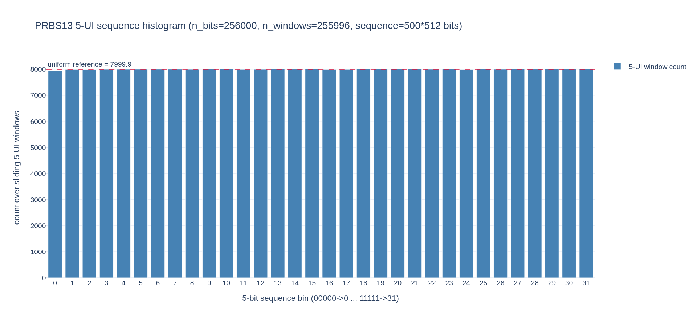

These figures show that pattern occupancy is close to uniform but not
exactly identical for a finite capture, which matters for per-pattern
variance.

### 7.3  Noise Sweep at Fixed Context

The 1-D sweep
[`figures/distortion_sigma_vs_noise_sigma.png`](figures/distortion_sigma_vs_noise_sigma.png)
shows distortion-estimate sigma vs injected noise sigma (exact linear
baseline, nonlinearity off):

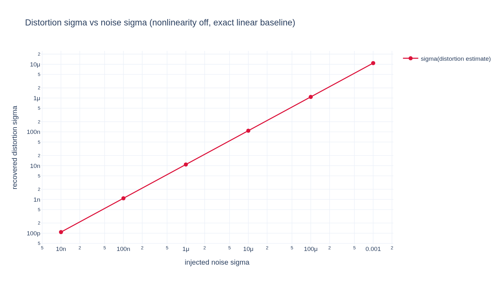

Result: $\sigma_{\hat d}$ scales approximately linearly with $\sigma_n$,
as expected from Eq. (17) ($\mathrm{Var}(\bar e_\pi)\propto \sigma_n^2 /
|\mathcal M_\pi|$).

### 7.4  2-D Sweep: Noise Sigma vs Context Length

The new heatmap
[`figures/distortion_error_heatmap_noise_vs_context.png`](figures/distortion_error_heatmap_noise_vs_context.png)
maps distortion RMS error over:

* x-axis: $\sigma_n \in [10^{-8},10^{-2}]$ (log-spaced)
* y-axis: context length $P=2p+1$ with $p\in\{2,\ldots,14\}$

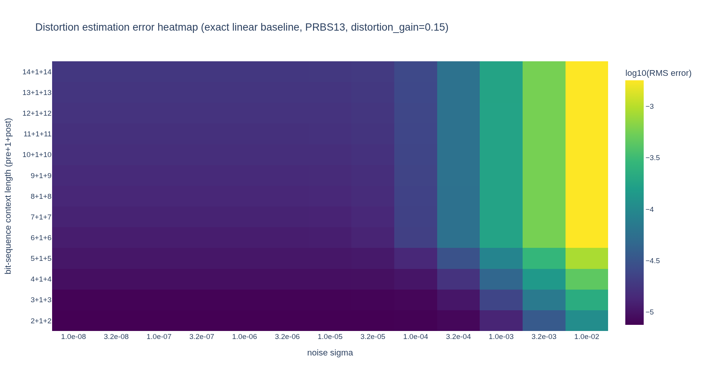

This makes two trends explicit:

1. At fixed context, higher noise raises distortion-estimate error.
2. At fixed noise, increasing context lowers deterministic leakage until
   a floor set by finite data / edge handling / floating-point limits.

### 7.5  Context-Length Sweep at Zero Noise (Interior Region)

The figure
[`figures/distortion_error_vs_bit_sequence_no_noise.png`](figures/distortion_error_vs_bit_sequence_no_noise.png)
plots (i) distortion RMS error and (ii) estimated noise sigma vs
bit-sequence window length, **computed on the interior analyzed region
only**.

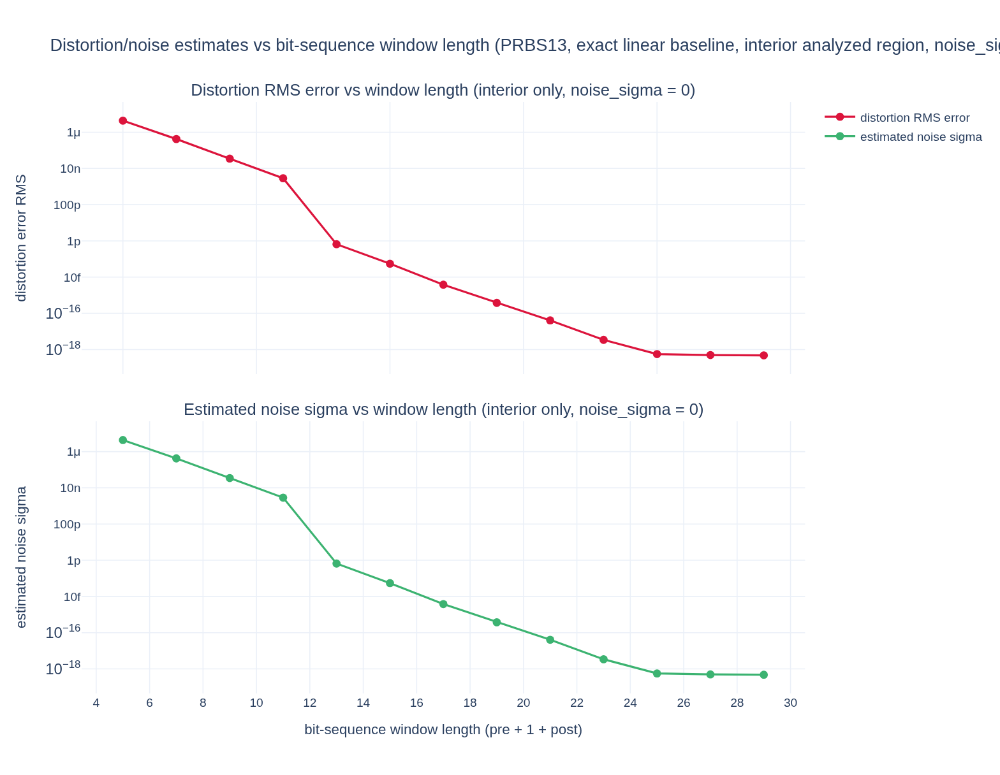

Key finding: with PRBS13 + exact baseline + zero injected noise, both
curves collapse to machine epsilon as context approaches the PRBS order
(about 13 bits and above in this setup). This reproduces the expected
state-identifiability behavior: once the context effectively resolves
the driving sequence state, deterministic residuals are fully captured
by $\hat d$ and $\hat n\to0$.

### 7.6  Static Nonlinearity Strength vs Context

To check whether the collapse context depends on the *severity* of the
distortion, we sweep the static (memoryless) tanh compression strength
$\alpha \in \{0.05, 0.1, 0.2, 0.3, 0.4\}$ and re-run the context sweep
(5–15 UI) at exact baseline, zero noise.

* [`figures/nonlinearity_gain_context_sweep.png`](figures/nonlinearity_gain_context_sweep.png) — PRBS13.
* [`figures/nonlinearity_gain_context_sweep_prbs31.png`](figures/nonlinearity_gain_context_sweep_prbs31.png) — PRBS31, same 5–15 UI window.
* [`figures/nonlinearity_gain_context_sweep_prbs31_ctx25-35.png`](figures/nonlinearity_gain_context_sweep_prbs31_ctx25-35.png) — PRBS31 extended to 25–35 UI, chasing the PRBS31 collapse.

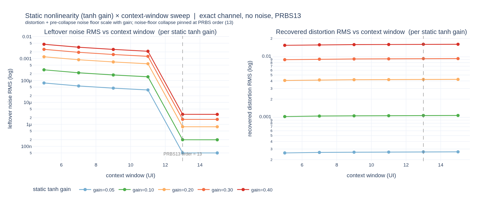

Two findings, both as predicted:

1. **Magnitude scales, location does not.** Stronger $\alpha$ raises the
   distortion magnitude and the *pre-collapse* leftover-noise floor in
   lockstep, but the context at which the floor collapses is unchanged.
   The collapse is a property of *source-state identifiability*, not of
   how hard the nonlinearity bends.
2. **PRBS13 collapses at 13; PRBS31 does not collapse in-window.** With
   PRBS31 the floor keeps descending but never crashes to epsilon — even
   out to 35 UI — because the 31-bit state is never resolved within a
   feasible window (and the available record starves long before then,
   see §7.8).

### 7.7  Source-Order Dependence and the Identifiability Mechanism

Holding the channel and a weak nonlinearity fixed, sweeping the PRBS
order across $\{7, 9, 11, 13, 15\}$ shows the collapse context tracking
the order exactly:

[`figures/prbs_order_context_collapse_sweep.png`](figures/prbs_order_context_collapse_sweep.png)

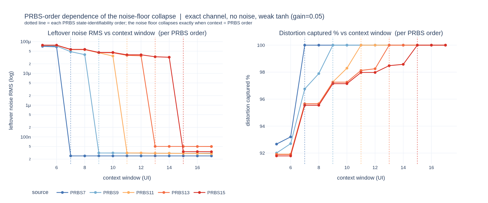

Each PRBS-$N$ noise floor crashes to the floating-point floor precisely
when the context window reaches $N$ UI, and the distortion-captured
fraction hits 100 % there. The mechanism is illustrated in

[`figures/context_identifiability_intuition.png`](figures/context_identifiability_intuition.png)

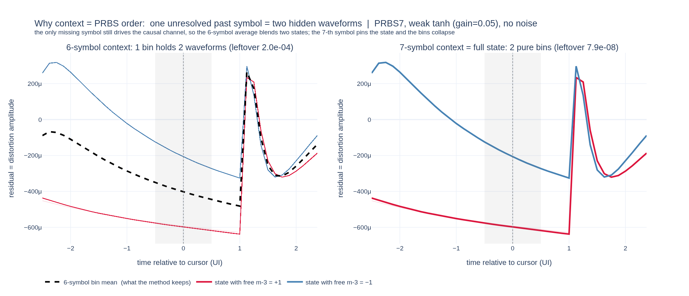

Conditioning on $N-1$ symbols leaves one past symbol free; because the
channel is causal, that free symbol still drives the cursor distortion,
so a single context bin secretly holds **two** distinct distortion
waveforms and their conditional mean leaves a residual (the "noise"
floor). Extending the context to the full $N$ symbols pins the LFSR
state, splitting the bin into two pure groups that each collapse onto a
single waveform — residual $\to 0$.

### 7.8  The Collapse Law: Context $= \min(M, N)$

The §7.5–§7.7 results are unified by recognising **two independent
routes** to fully resolving the linear ISI by conditional averaging:

* **Cover the memory.** If the context window spans every significant
  channel tap, the distortion is determined by the in-window symbols
  regardless of the source. This needs context $\ge M$, the **channel
  memory** (effective tap span in UI).
* **Identify the source state.** For an order-$N$ PRBS, any $N$
  consecutive symbols uniquely fix the LFSR state and therefore the
  *entire* surrounding sequence — all taps, however far. This needs
  context $\ge N$, the **source-state order**, independent of $M$.

Whichever fires first wins, giving the

**Boxed collapse law:**

$$
\boxed{\;L_\text{collapse} \;=\; \min(M,\, N)\;}
$$

subject to enough data for the patterns to recur (§5.4). This is
verified by fixing the source and varying the channel memory $M$ (via
the skin + dielectric loss budget), then repeating across three sources
of increasing entropy:

| Channel memory $M$ (UI) | 3 | 7 | 9 | 13 | 51 |
|---|---|---|---|---|---|
| **PRBS9** ($N=9$) collapse | 3 | 7 | 9 | **9** | **9** |
| **IID** ($N\to\infty$) collapse | 3 | 7 | 11 | **13** | **never** |
| **PRBS31** ($N=31$) collapse | 3 | 7 | 11 | **13** | **never** |

* [`figures/channel_memory_vs_context_prbs9.png`](figures/channel_memory_vs_context_prbs9.png) — fixed PRBS9, varied $M$: points land on $\min(M, 9)$ (flat cap at $N=9$ once $M\ge 9$).
* [`figures/channel_memory_vs_context_iid.png`](figures/channel_memory_vs_context_iid.png) — IID source: $N\to\infty$, so the law degenerates to $L_\text{collapse}=M$ (the bare diagonal); the long-memory channel never collapses.
* [`figures/channel_memory_vs_context_prbs31.png`](figures/channel_memory_vs_context_prbs31.png) — PRBS31: $N=31$ exceeds both the sweep and the data-starvation wall, so it is locally indistinguishable from IID and reproduces it exactly.

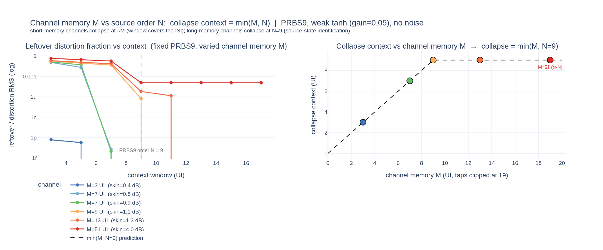

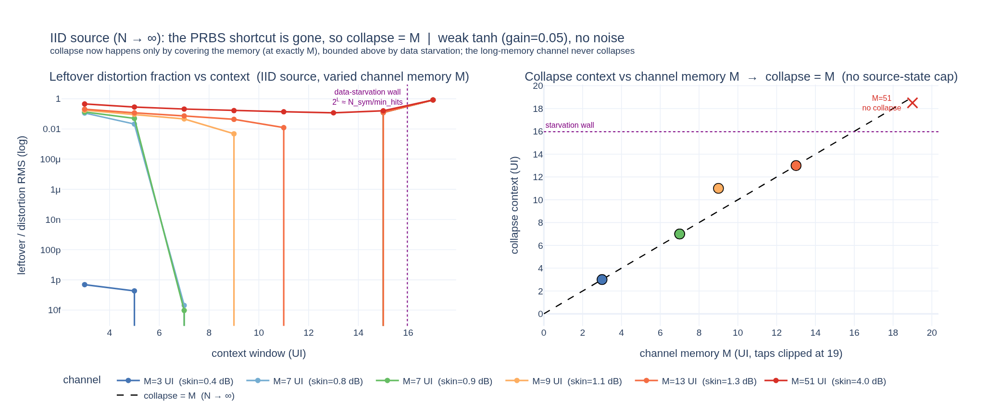

The PRBS9 panel shows the cap: channels with $M = 13$ or $51$ both
collapse at $N=9$, because identifying the 9-bit state resolves taps the
window cannot reach. Removing the state shortcut (IID, or PRBS31 over a
record far shorter than its $2^{31}-1$ period) pushes the collapse back
to $M$: $M=13$ now needs context 13, and $M=51$ never collapses.

**Data-starvation ceiling.** With a high-entropy source, conditioning on
$L$ symbols creates $2^L$ distinct patterns, each recurring
$\approx N_\text{sym}/2^L$ times. Once $2^L \gtrsim N_\text{sym}/N_\text{min}$
the bins stop recurring often enough to estimate, so the leftover noise
*rises* again past that wall (here $L\approx\log_2(256{,}000/4)\approx 16$
UI). A PRBS-$N$ source never hits this wall as long as $N$ is small,
because its distinct patterns saturate at $2^N$ rather than $2^L$ — which
is exactly why PRBS9 collapses cleanly but IID/PRBS31 degrade beyond
~16 UI.

### 7.9  The Pre-Collapse Floor is Predicted by the IR

The §7.8 *location* of the collapse is set by $\min(M,N)$; its *value*
before collapse is set quantitatively by the IR. The leftover noise at a
finite context is the first-order distortion response to the **uncovered
ISI**. At context $L = 2W+1$ the symbols outside the window contribute a
linear component

$$
u_W(t) = \sum_{|k|>W} a[m-k]\, p_k
$$

— exactly $\mathrm{conv}(a, p)$ with the pulse's central $\pm W$ UI
zeroed — and a first-order expansion of the static nonlinearity
$g(y)=\tanh(\alpha y)/\tanh(\alpha)-y$ about the covered value gives

**Boxed pre-collapse floor:**

$$
\boxed{\;\hat n_\text{RMS}(L) \;\approx\; \mathrm{RMS}\big( g'(y_\text{lin})\, u_W \big),
\qquad g'(y) = \tfrac{\alpha}{\tanh\alpha}\,\mathrm{sech}^2(\alpha y) - 1\;}
$$

This prediction uses **only the planted IR taps and the known
nonlinearity — no fit**.

[`figures/predicted_floor_vs_ir.png`](figures/predicted_floor_vs_ir.png)

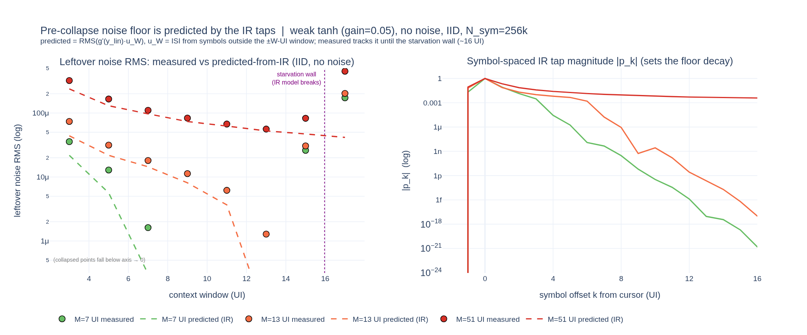

For three IID-driven channels ($M = 7, 13, 51$ UI) the predicted curve
(dashed) lands on the measured leftover (markers) across the entire
descent and into the collapse — e.g. for $M=13$, measured
$[2.7, 1.6, 0.99, 0.58, 0.16]\times10^{-5}$ vs predicted
$[2.8, 1.5, 0.99, 0.54, 0.17]\times10^{-5}$. Two consequences:

1. **The floor decay rate is the IR tail.** As $W$ grows, $u_W$ loses the
   taps now inside the window, so the floor falls like the square root of
   the *uncovered tap energy* $\sum_{|k|>W}p_k^2$. The right panel shows
   the symbol-spaced $|p_k|$ profiles: the long-memory channel ($M=51$)
   has the slowest-decaying tail and therefore the slowest-falling floor.
2. **Divergence pinpoints data starvation.** Measured and predicted agree
   until $L \gtrsim 16$, where the *measured* floor turns back up (the
   §7.8 starvation wall) while the IR prediction keeps falling. The gap is
   the signature that the rise is a finite-data artefact, not channel
   physics.

So the deterministic-distortion floor is fully accounted for: its
*location* by $\min(M,N)$ and its *value* by the IR taps, leaving only
genuine random noise and finite-data starvation unmodelled.

#### 7.9.1  Confirming the rise is data starvation, not channel physics

The leftover *climbs* past $\sim$16 UI in the figure above. To prove this
is the data-starvation ceiling and not a channel effect, re-run the
identical $M=51$ channel with **10× more symbols** ($N_\text{sym}$:
$256\text{k}\to2.56\text{M}$). The IR — and therefore the IR-predicted
floor — is unchanged, so any movement must be a finite-data artefact.

[`figures/predicted_floor_vs_ir_2p5M.png`](figures/predicted_floor_vs_ir_2p5M.png)

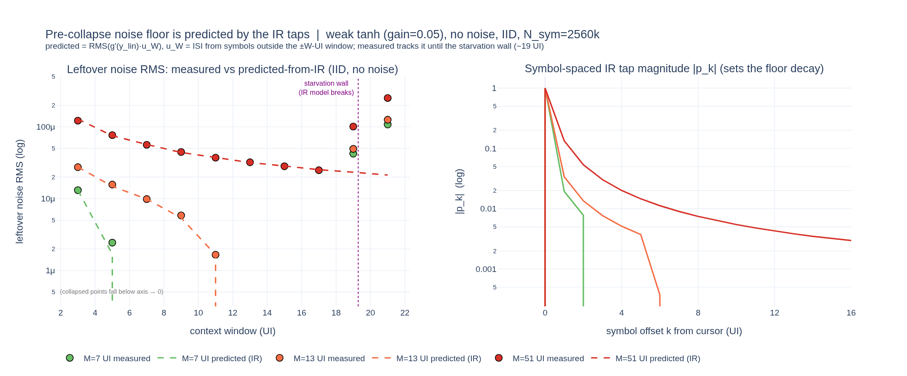

| Context $L$ | leftover @256k | %UIs kept @256k | leftover @2.56M | %UIs kept @2.56M | IR-predicted |
|---|---|---|---|---|---|
| 13 | $3.2\times10^{-5}$ | 100 % | $3.2\times10^{-5}$ | 100 % | $3.2\times10^{-5}$ |
| 15 | $4.3\times10^{-5}$ | 98 % | $2.8\times10^{-5}$ | 100 % | $2.9\times10^{-5}$ |
| **17** | $\mathbf{2.3\times10^{-4}}$ | **31 %** | $\mathbf{2.5\times10^{-5}}$ | **100 %** | $2.5\times10^{-5}$ |
| 19 | $2.7\times10^{-4}$ | 1 % | $1.0\times10^{-4}$ | 87 % | $2.3\times10^{-5}$ |
| 21 | $2.7\times10^{-4}$ | 0 % | $2.5\times10^{-4}$ | 13 % | $2.1\times10^{-5}$ |

Three things confirm the mechanism:

1. **The $L=17$ climb vanishes with more data** — leftover drops $2.3\times10^{-4}\to2.5\times10^{-5}$ (9×) purely by adding symbols, and `%UIs kept` flips $31\%\to100\%$. The channel was identical, so that floor was a starvation artefact.
2. **The measured floor lands on the $N_\text{sym}$-independent IR prediction** once the data permits ($2.5\times10^{-5}$ at $L=17$, matching the prediction exactly) — the IR said where the floor *should* be; 256k was too starved to reach it, 2.56M does.
3. **The wall moves by exactly $\log_2(10)\approx 3.3$ UI** (from $\sim$16 to $\sim$19.3 UI), relocating the climb to $L=19$–$21$ where hits-per-pattern fall back through $N_\text{min}=4$. A channel-physics floor cannot move when only data is added; a starvation floor must — and does, by the predicted amount.

### 7.10  Null Case: Known Channel, No Nonlinearity, Noise Only

The dual of §7.6–§7.9 (distortion, no noise) is the pure-noise case: known
channel, $\alpha = 0$, AWGN only. The LTI residual is then *pure noise*, so
the split should return distortion $\approx 0$ and recover the injected
noise variance.

[`figures/null_case_noise_recovery.png`](figures/null_case_noise_recovery.png)

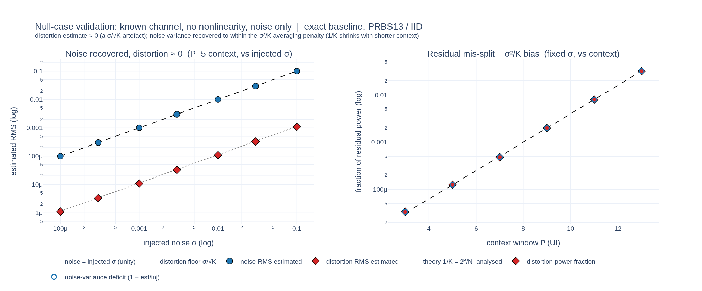

**Panel 1 (vs injected $\sigma$, short $P=5$ context).** The estimated
noise RMS lands on the unity diagonal across three decades of $\sigma$
(recovered/injected variance $= 0.9994$), while the estimated distortion
RMS sits a factor $\sqrt{K}\approx 89$ below it and scales linearly with
$\sigma$ — i.e. it is a finite-sample artefact, not real distortion.

**Why distortion is not *exactly* zero.** With $e = n$ the per-pattern
mean of $K$ noise samples is itself random with variance $\sigma^2/K$.
Power conservation $P_e = P_{\hat d} + P_{\hat n}$ then splits as

$$
P_{\hat d} = \frac{\sigma^2}{K}, \qquad
P_{\hat n} = \sigma^2\Big(1 - \frac{1}{K}\Big), \qquad
K = \frac{N_\text{analysed}}{N_\text{patterns}}
$$

so the distortion soaks up exactly the fraction $1/K$ of the noise and the
noise estimate is biased *low* by the same $1/K$. This is Eq. (17)/§5.4
made concrete: $\hat d$ is unbiased ($\mathbb E[\bar e_\pi]=0$ here) with
per-bin variance $\sigma^2/|\mathcal M_\pi|$.

**Panel 2 (vs context, fixed $\sigma$).** Sweeping $P$ with an IID source,
the residual mis-split fraction — equivalently the distortion power
*and* the noise-variance deficit, which are equal by power conservation —
tracks the prediction $1/K = 2^P/N_\text{analysed}$ across three decades:
$3\times10^{-5}$ at $P=3$ rising to $3.2\times10^{-2}$ at $P=13$. The
engineering rule follows directly: **when only the noise floor is of
interest, use the shortest context that still covers the channel memory**
($P \gtrsim M$, §7.8) — every extra UI of context beyond that trades real
noise for spurious distortion at rate $1/K$.

### 7.11  Wiener vs Exact Linear Baseline

Every validation in §7.1–§7.10 used the **exact** (oracle) planted pulse
as the linear baseline.  Real captures use the **Wiener** estimate via
[`estimate_channel`](../../../optical-serdes/src/optical_serdes/utils/channel_estimation.py),
whose fit error $\varepsilon_W = \hat y_\text{exact}-\hat y_\text{Wiener}$
is *deterministic and symbol-correlated*: pattern-averaging will then push
part of it into $\hat d$, inflating the apparent distortion floor.  This
section calibrates that leakage with a synthetic where ground truth is
known: $y = y_\text{lin}+d_\text{true}+n_\text{true}$ is decomposed twice
on the same alignment grid (PRBS13, weak tanh $\alpha=0.1$ giving
$d_\text{true,RMS}\approx 4.7\times10^{-4}$, 50-UI Wiener IR window).

[`figures/wiener_vs_exact_baseline.png`](figures/wiener_vs_exact_baseline.png)

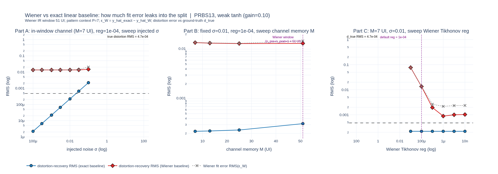

**Panel A — vs injected $\sigma$, in-window channel ($M=7$ UI), default
reg $=10^{-4}$.**  The exact-baseline distortion error scales linearly
with $\sigma$ (the $\sigma/\sqrt{K}$ averaging artefact, §7.10) and stays
well below $d_\text{true,RMS}$.  The Wiener distortion error sits at a
floor of $1.35\times10^{-2}$ — **30× the true distortion RMS** — and is
~independent of $\sigma$.  The leakage is dominated by a deterministic,
SNR-independent Wiener fit error.

| $\sigma$ | $\varepsilon_W$ RMS | $d_\text{err}$ (exact) | $d_\text{err}$ (Wiener) |
|---|---|---|---|
| $10^{-4}$ | $1.35\times10^{-2}$ | $2.2\times10^{-6}$ | $1.35\times10^{-2}$ |
| $10^{-3}$ | $1.35\times10^{-2}$ | $2.2\times10^{-5}$ | $1.35\times10^{-2}$ |
| $10^{-2}$ | $1.36\times10^{-2}$ | $2.2\times10^{-4}$ | $1.35\times10^{-2}$ |
| $10^{-1}$ | $2.03\times10^{-2}$ | $2.2\times10^{-3}$ | $1.47\times10^{-2}$ |

**Panel B — fixed $\sigma=10^{-2}$, sweep channel memory $M$.**  As long as
$M$ fits inside the Wiener window ($M\in\{7, 13, 25\}$ UI within a 51-UI
window), $\varepsilon_W$ and the Wiener distortion error are essentially
constant: the leakage is *not* IR-truncation, the IR fits.  At $M=51$ UI
(right at the window edge) $\varepsilon_W$ ticks up modestly ($1.31\to
1.46\times10^{-2}$) and the noise-variance ratio jumps
($\text{var}(\hat n_W)/\sigma^2: 1.04\to 1.44$) — the small truncation
*does* leak some unstructured energy into $\hat n$.  But the bulk of the
floor is set elsewhere.

**Panel C — sweep Wiener Tikhonov regularisation `reg` (in-window, fixed
$\sigma$).**  This pins the mechanism: the Wiener cursor tap $h_0$ is
systematically *biased low* by an amount $\approx\text{reg}$ for a Dirac
drive, and $\varepsilon_W$ shrinks linearly with `reg`:

| `reg` | $h_0$ bias | $\varepsilon_W$ RMS | $d_\text{err}$ (Wiener) |
|---|---|---|---|
| $10^{-3}$ | $-8.1\times10^{-2}$ | $7.7\times10^{-2}$ | $7.7\times10^{-2}$ |
| $10^{-4}$ **(default)** | $-1.4\times10^{-2}$ | $1.4\times10^{-2}$ | $1.4\times10^{-2}$ |
| $10^{-5}$ | $-1.8\times10^{-3}$ | $2.6\times10^{-3}$ | $2.0\times10^{-3}$ |
| $10^{-6}$ | $+1.3\times10^{-4}$ | $2.2\times10^{-3}$ | $8.9\times10^{-4}$ |
| $10^{-7}$ | $+4.0\times10^{-4}$ | $2.3\times10^{-3}$ | $1.0\times10^{-3}$ |

So $\varepsilon_W$ is dominated by a **regularisation-induced
cursor-tap underestimate** — exactly the band-limited cursor-tap effect
noted in §9.1, now quantified.  Because the bias is symbol-correlated
(it's $\Delta h_0\cdot a[m]$ at the cursor sample), pattern-averaging
attributes it to $\hat d_W$, not $\hat n_W$.  This sets a **Wiener-baseline
SDR floor of $\approx -20\log_{10}(\text{reg})$ dB**: 40 dB at default
reg $=10^{-4}$, 60 dB at $10^{-6}$.  Below $\text{reg}\sim 10^{-6}$ a
noise-amplification floor takes over and further reduction stops helping.

**Operating guidance (closes the §1 motivation):**

* For coarse measurements where the *real* SDR is far below 40 dB, the
  default `reg=1e-4` is fine — the Wiener floor is well under the signal.
* For fine measurements (SDR target 40–60 dB), **lower `reg` to $10^{-6}$**
  *when the channel comfortably fits the Wiener window* (§7.11.1);
  $d_\text{err}$ drops by an order of magnitude with no penalty in our
  tests.
* The §7.8 collapse law and §7.9 IR-prediction were validated against the
  exact baseline and are unchanged.  Under the Wiener baseline, the
  pre-collapse floors in those experiments would be **clipped from below**
  at $\varepsilon_W$; collapse locations are unaffected.
* The **exact-baseline** path remains the right tool for any quantitative
  ground-truth synthetic validation.

### 7.11.1  §7.9 IR-prediction under the Wiener baseline

§7.9 validated the IR-predicted leftover-noise floor against the exact
baseline; §7.11 calibrated the Wiener clip at default reg.  Tying the two
together: can the Wiener pipeline recover the §7.9 descent if we use the
recommended low reg?  Re-running the §7.9 measurement (IID source, weak
tanh $\alpha=0.05$, no noise, 50-UI Wiener IR window) at both reg
$=10^{-4}$ and reg $=10^{-6}$ for two channels — $M=7$ UI (well
in-window) and $M=51$ UI (right at the window edge) — gives:

[`figures/predicted_floor_wiener_recovers_ir.png`](figures/predicted_floor_wiener_recovers_ir.png)

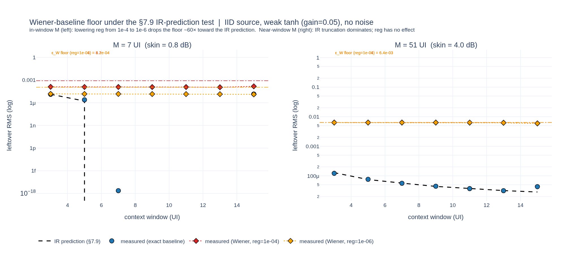

| channel | reg | $\varepsilon_W$ RMS | floor at $L=3$ | floor at $L=15$ |
|---|---|---|---|---|
| $M=7$ (in-window) | $10^{-4}$ | $8.2\times10^{-4}$ | $1.27\times10^{-4}$ | $1.49\times10^{-4}$ |
| $M=7$ (in-window) | $10^{-6}$ | $1.13\times10^{-4}$ | $1.49\times10^{-5}$ | $1.28\times10^{-5}$ |
| $M=51$ (window-edge) | $10^{-4}$ | $6.42\times10^{-3}$ | $6.36\times10^{-3}$ | $5.96\times10^{-3}$ |
| $M=51$ (window-edge) | $10^{-6}$ | $6.37\times10^{-3}$ | $6.35\times10^{-3}$ | $5.95\times10^{-3}$ |

Two failure modes, two regimes:

* **In-window $M$ (left panel).**  Lowering reg from $10^{-4}$ to $10^{-6}$
  drops the Wiener floor ~10× (from $\sim 1.2\times10^{-4}$ to $\sim
  1.4\times10^{-5}$), consistent with the cursor-tap-bias model of §7.11.
  Wiener at reg $=10^{-6}$ now sits within 14 % of the IR prediction at
  $L=3$.  It still cannot follow the rapid IR-prediction descent below
  its own clip — a residual $\varepsilon_W\sim 10^{-4}$ remains, and
  pattern-averaging absorbs ~90 % of it into $\hat d_W$, leaving a flat
  Wiener floor at $\sim 10^{-5}$ across $L$.  The exact baseline is the
  only path that follows the prediction down to machine epsilon.
* **Near-window $M$ (right panel).**  When $M$ approaches the Wiener
  window length (51 UI vs a 51-UI IR window), the dominant $\varepsilon_W$
  term is no longer the cursor-tap bias but **IR truncation**: the
  missing tail beyond the window cannot be recovered by tightening reg.
  Both reg values give an identical floor of $6.4\times10^{-3}$, flat in
  $L$.  The IR-predicted descent visible cleanly under the exact baseline
  is invisible to the Wiener path at this $M$.

So the Wiener floor is set by the larger of two independent terms:

| failure mode | symptom | fix |
|---|---|---|
| cursor-tap bias | $\varepsilon_W \propto$ reg $\cdot \lvert y_\text{lin}\rvert$, flat at default reg | lower `reg` (§7.11 Panel C) |
| IR truncation | $\varepsilon_W$ independent of `reg`, scales with channel energy beyond window | **widen the Wiener window** ($n_\text{pre}, n_\text{post}$ each $\gtrsim M$) |

For pkctrl3-class channels (skin-and-dielectric $\sim 5$–$10$ dB,
$M\lesssim 20$–$30$ UI), the default 51-UI window covers $M$ comfortably
and lowering reg is the productive lever.  If a longer channel pushes $M$
toward the window edge, widen the window first — *then* tighten reg.

---

## 8  Worked Example: pkctrl3 PAM4 at 106.25 GBaud

The pkctrl3 dataset is a 160 000 UI PAM4 capture with seven probe
points along the link (TX → DRV_OUT → MZM_IN → Pout → Pin_PD → TIA_OUT
→ RX_CH_OUT → RX_IN). Running
`examples/waveform_decomposition_demo.py` reproduces both flavours of
the decomposition.

### 8.1  From-Symbols, TIA_OUT

Result: SNDR = 19.76 dB, SDR = 29.58 dB, SNR = 20.24 dB,
closure = $4.4\cdot10^{-18}$. This reproduces the from-symbols TIA_OUT
SNDR of 19.70 dB published in the `channel-characterise` skill's worked
example.

What's new is the SDR/SNR split: SDR − SNR = 9.3 dB, so TIA_OUT's link
floor is dominated by random noise (~$8\times$ more than deterministic
distortion). A perfect nonlinear canceller would reach SNR = 20.2 dB,
only 0.5 dB above the current SNDR — a small target.

### 8.2  Per-Block, MZM and PD+TIA

Per-block view of the TIA alone. The middle panel's $y_\text{desired}$
is small relative to $y_\text{ISI}$ — see §6.1 — but this is the
expected band-limited cursor-tap behavior, not a real signal-loss
defect. The bottom panel reveals the genuine distortion vs noise
character of the block.

The MZM block: SDR = 36.8 dB, SNR = 40.7 dB. Here SDR < SNR, so
*deterministic distortion dominates noise* — the cosine bend's
fingerprint. This is the only block in the chain where nonlinear
cancellation (LUT or analytic inversion of the cosine) would buy more
than ~0.5 dB.

### 8.3  Cross-Block Summary

Comparison across the three analysed blocks:

| Block                | SNDR (dB) | SDR (dB) | SNR (dB) | dominated by    |
|----------------------|-----------|----------|----------|-----------------|
| MZM (IN→Pout)        | 35.4      | 36.8     | 40.7     | **distortion**  |
| PD + TIA (Pin→TIA_OUT) | 22.8    | 32.6     | 23.3     | random noise    |
| RX channel (TIA→RX_CH_OUT) | 26.6 | 48.0   | 26.6     | random noise    |

The bar chart makes the engineering tradeoff explicit: the MZM is the
only block where deterministic-distortion budget is the binding
constraint; the rest of the chain is random-noise-limited and would
benefit from a quieter front end before a nonlinear canceller is added.

---

## 9  Limitations and Caveats

1. **Band-limited cursor-tap and the Wiener-baseline SDR floor.** Eq. (8)'s
   $h_{0,\text{block}}$ is the *cursor sample* of the Wiener IR, not the
   block's true scalar gain. The Tikhonov regularisation of
   [`estimate_channel`](../../../optical-serdes/src/optical_serdes/utils/channel_estimation.py)
   biases $h_0$ low by approximately the regularisation fraction
   $\rho$ (quantified in §7.11): default $\rho=10^{-4}$ gives a
   $-1.4\%$ $h_0$ bias and an $\sim 1.4\%$ RMS Wiener fit error
   $\varepsilon_W$.  When $x$ is bandwidth-limited (typical for
   per-block analysis, e.g. Pin_PD or TIA_OUT as inputs), the same
   effect manifests as a band-limited delta whose peak tap is below
   the true gain, with the missing weight spread into the IR tails.

   Two distinct consequences:

   * *Cosmetic effect on the desired/ISI split.* A non-zero
     $y_\text{ISI}$ appears even for a memoryless block.  This is an
     artefact of the cursor-tap split; the total LTI fit $\hat y$ and
     the SNDR / closure are unaffected.
   * *Quantitative effect on $\hat d$.* Because $\varepsilon_W$ is
     deterministic and symbol-correlated, pattern-averaging attributes
     it to $\hat d$, not $\hat n$ — so the Wiener-baseline SDR has an
     **effective floor of $\approx -20\log_{10}(\rho)$ dB** (40 dB at
     $\rho=10^{-4}$, 60 dB at $\rho=10^{-6}$).  Real distortion above
     this floor is resolved correctly; below it, $\hat d$ is dominated
     by the regularisation artefact and SDR cannot be trusted to be
     measurement-limited.  Lower $\rho$ to $10^{-6}$ for SDR target
     $\gtrsim 40$ dB; below $\rho\sim 10^{-6}$ a noise-amplification
     floor takes over.

   An alternative split is the projection coefficient
   $g_\text{eff} = \langle \hat y, x\rangle / \langle x, x\rangle$,
   which recovers the true scalar gain for memoryless blocks but
   conflates correlated ISI taps with gain. The module chooses
   cursor-tap by default because the multi-tap ISI structure is
   preserved cleanly (important for real TIA-style blocks with
   actual postcursor memory).

2. **Pattern context vs. nonlinear memory and sequence state.** Eq. (15)
   bins on a finite symbol window. If context is too short, deterministic
   structure leaks into $\hat n$. The context needed to capture all of it
   follows the collapse law $L_\text{collapse} = \min(M, N)$ (§7.8): the
   smaller of the **channel memory** $M$ and the **source-state order**
   $N$. PRBS-driven synthetic tests can collapse early via state
   identifiability (the $N$ route), masking the true channel memory;
   IID or long-PRBS drives remove that shortcut and expose $M$ directly,
   but are then bounded by the data-starvation ceiling
   $2^P \lesssim N_\text{sym}/N_\text{min}$. For real captures (effectively
   high-entropy sources) choose $P$ to cover the dominant memory $M$, and
   verify with context sweeps (§7.4–§7.8).

3. **Pattern sparsity.** Eq. (18) is a soft floor. For PAM4 with
   $P=7$ ($4^7 = 16{,}384$ patterns), the pkctrl3 capture only delivers
   ~10 hits per pattern, marginal for stable averaging. Either reduce
   $P$ or increase capture length; the module reports
   `pattern_uis_kept` so the user can see how many UIs survived
   $N_\text{min}$.

4. **Negative alignment lag is not supported.** If the captured $y$
   arrives *before* $x$ in time (rare, requires deliberate misalignment),
   the routines raise `NotImplementedError`. Pre-pad with leading zeros
   or pre-trim to enforce positive lag.

5. **Linear baseline assumes time-invariance.** Slow drift in the
   channel (thermal, supply, etc.) appears as a long-memory pattern
   correlated with no symbol pattern and lands in $\hat n$. For DCD or
   slow gain wander, a more elaborate Volterra estimate of $\hat d$
   would be needed.

6. **Interior vs full-wave metrics.** `_pattern_average_distortion`
   populates $\hat d$ only on valid cursor-centered UI windows. Samples
   outside that analyzed span are left at zero in $\hat d$, so full-wave
   `std(ŷ_noise)` can be dominated by edge regions. For context-sweep
   diagnostics, report interior-only metrics (as in §7.5) unless edge
   behaviour is explicitly the quantity of interest.

---

## 10  Module Reference

* [`decompose_waveform(y, symbols, …)`](../../../optical-serdes/src/optical_serdes/analysis/waveform_decomposition.py)
  — from-symbols mode (§4.1).
* [`decompose_block_waveform(x, y, symbols, …)`](../../../optical-serdes/src/optical_serdes/analysis/waveform_decomposition.py)
  — per-block mode (§4.2).
* `WaveformDecomposition` — result dataclass containing every component
  waveform, the underlying `ChannelEstimate`, and a
  `DecompositionMetrics` block with all scalar metrics from §6.
* `plot_decomposition(decomp, …)` — three-panel Plotly figure
  (LTI fit, desired/ISI, distortion/noise) used in the pkctrl3 figures
  above.

The pattern-conditioned distortion / noise machinery is fully reused
between modes; only the linear split (§4) and the
symbol→$\tilde y$ cursor (§5.1) differ.

The example workflow lives at
[`examples/waveform_decomposition_demo.py`](../../../optical-serdes/examples/waveform_decomposition_demo.py)
and the test suite at
[`tests/test_analysis/test_waveform_decomposition.py`](../../../optical-serdes/tests/test_analysis/test_waveform_decomposition.py)
covers closure, LTI-fit quality, distortion recovery, validation, and
the surface invariants of `WaveformDecomposition`.

---

## 11  References

1. **`channel-characterise` skill** —
   [`.claude/skills/channel-characterise.md`](../../../optical-serdes/.claude/skills/channel-characterise.md).
   Documents the Wiener-Hopf channel-estimation primitives this module
   builds on (steps 1–3 of §3).
2. Jeruchim, Balaban, Shanmugan, *Simulation of Communication Systems*,
   2nd ed., Kluwer 2000. §5.4 derives the characteristic-function PDF
   convolution that motivates the per-pattern averaging form in §5.
3. Proakis, *Digital Communications*, 4th ed., McGraw-Hill 2001,
   Ch. 10 — exact BER for ISI channels via pattern enumeration; the
   same pattern grouping is the basis of Eq. (14).
4. Forney, "Maximum-Likelihood Sequence Estimation of Digital Sequences
   in the Presence of Intersymbol Interference," *IEEE Trans. Inf.
   Theory*, vol. 18, no. 3, pp. 363–378, 1972 — foundational
   enumeration of ISI pattern combinations.
