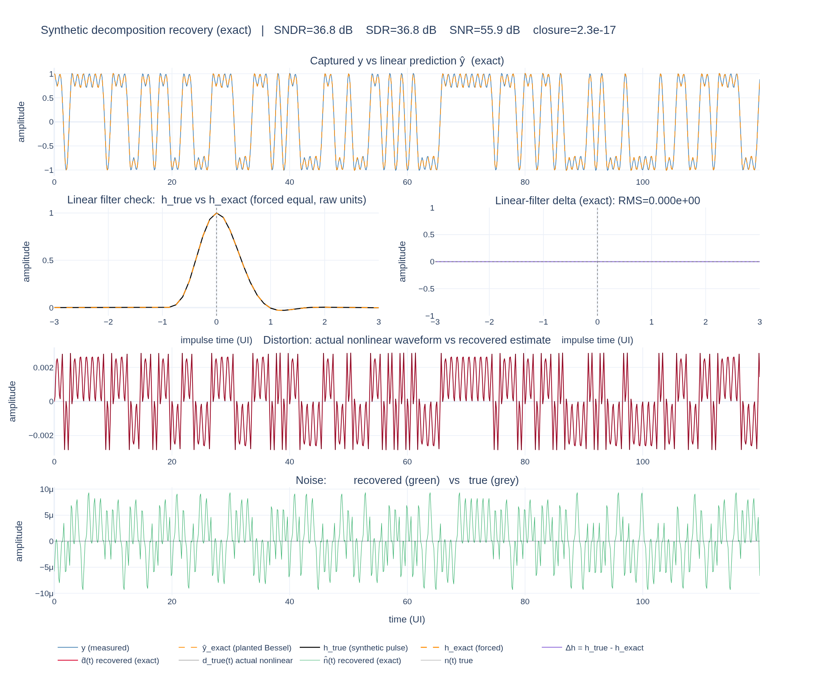
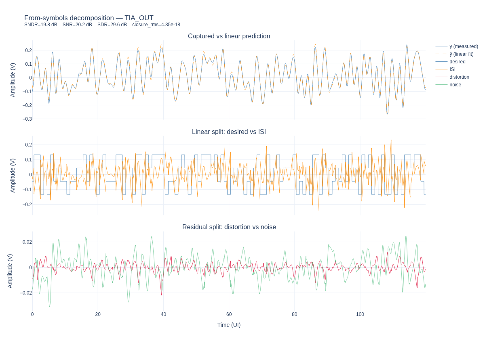
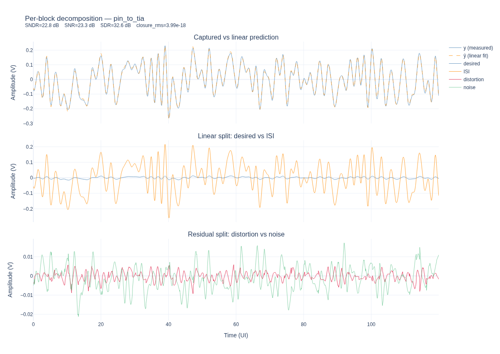
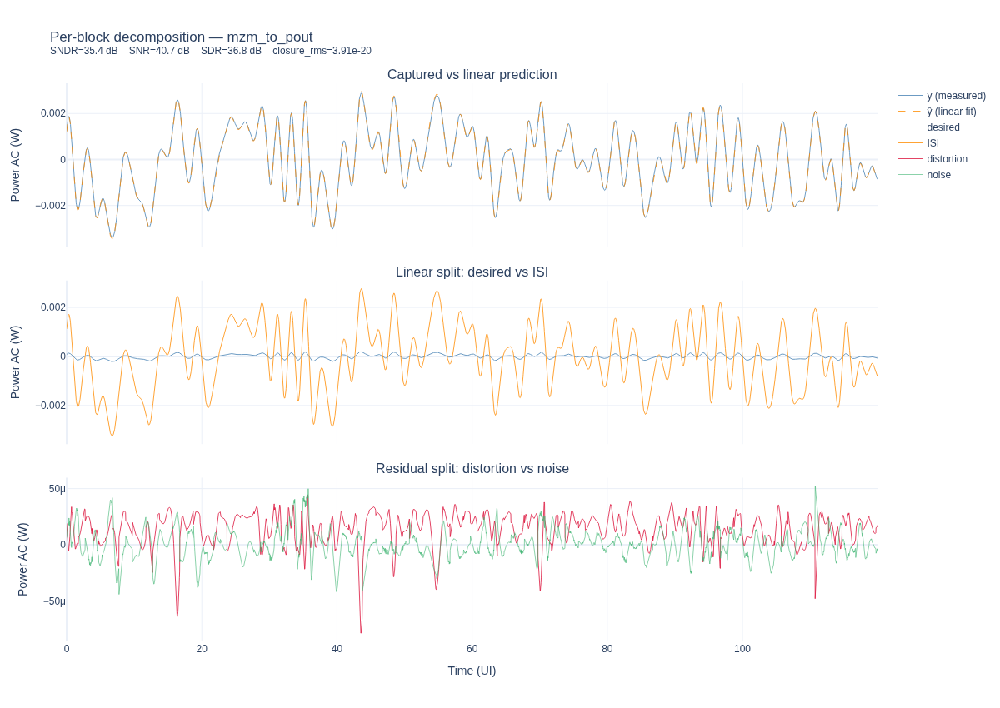
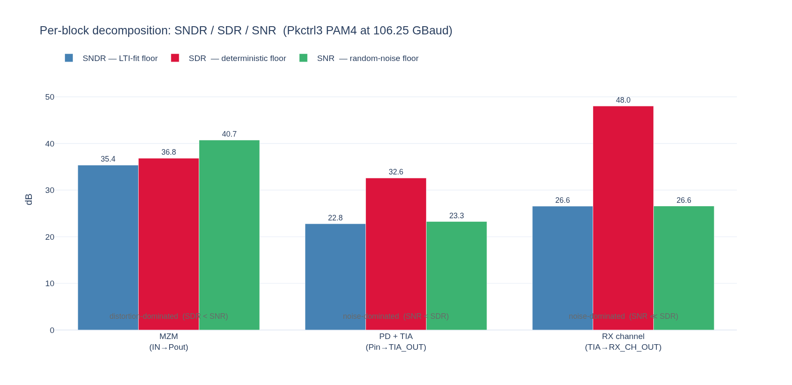

# Waveform Decomposition: Signal + ISI + Distortion + Noise

**Project:** optical-serdes
**Source:** [`src/optical_serdes/analysis/waveform_decomposition.py`](../../../optical-serdes/src/optical_serdes/analysis/waveform_decomposition.py)
**Example:** [`examples/waveform_decomposition_demo.py`](../../../optical-serdes/examples/waveform_decomposition_demo.py)
**Skill (linear baseline):** [`channel-characterise`](../../../optical-serdes/.claude/skills/channel-characterise.md)

---

## 1  Motivation

A captured serial-link waveform is the sum of several physically distinct
contributions. The textbook decomposition is

$$
r(t) = a[m]  h_0 + \sum_{k\neq m} a[k]  h_{m-k} + d(t) + n(t)
$$

evaluated at every UI's cursor sampling instant. The four terms are, in order: the **desired** cursor-only signal $a[m]  h_0$; the linear **ISI** $\sum_{k\neq m} a[k]  h_{m-k}$ from neighbouring symbols; the deterministic **distortion** $d(t)$ from any non-LTI behaviour of the channel; and the random **noise** $n(t)$ that is uncorrelated with the symbol stream.

This nugget describes the procedure used by
`optical_serdes.analysis.waveform_decomposition` to recover each of the
four components from a single captured waveform together with the known
transmitted symbol sequence. The construction generalises in two ways:

* **From-symbols mode** (`decompose_waveform`) treats the entire link
  from symbols to the probe point as one black box.
* **Per-block mode** (`decompose_block_waveform`) characterises one
  block (upstream-probe → downstream-probe) in isolation, attributing
  every joule of impairment in the result to that block alone.

The linear baseline is Wiener-Hopf channel estimation from the
[`channel-characterise`](../../../optical-serdes/.claude/skills/channel-characterise.md)
skill; the new piece is the pattern-conditioned residual averaging
that separates deterministic distortion from random noise.

Notation: lowercase Latin letters denote time-domain real signals;
boldface uppercase denotes their length-$N$ rfft transforms;
$a[k] \in \mathcal{A}$ is the transmitted symbol at UI $k$, with
alphabet $\mathcal{A} = \{-1, +1\}$ for NRZ or
$\mathcal{A} = \{-3, -1, +1, +3\}$ for PAM4; $T$ is the symbol period and
$L = T \cdot f_s$ is the integer "samples per UI" (SPS).

---

## 2  System Model

The link is modelled as

$$
y(t) = \int_{-\infty}^{\infty} h(\tau)  x(t-\tau)  d\tau + d(t) + n(t)
$$

where $x(t)$ is whatever LTI input drives the block under study and
$h(t)$ is the block's symbol-spaced single-bit response (SBR).
We discretise at sample period $T_s = T/L$, write $y[t] = y(t T_s)$, and
work on a finite record of length $N$.

The two modes differ only in their choice of $x$:

| Mode            | $x[t]$                                              | $h[\tau]$ recovered                 |
|-----------------|-----------------------------------------------------|-------------------------------------|
| from-symbols    | $\delta_L(t)\sum_k a[k] \delta[t - kL]$ (Dirac train) | full link SBR (symbols → probe)     |
| per-block       | measured upstream probe waveform                    | block-only IR (upstream → block out) |

In from-symbols mode the Dirac train carries all frequencies, so the
estimated $h$ is the *true* SBR. In per-block mode $x$ is already
band-limited (it carries the upstream chain's pulse shape), so the
estimated $h$ is the *block's* IR but the recovered numerical values
inherit the band-limited cursor-tap artifact discussed in §6.

---

## 3  Linear Stage: Wiener-Hopf Channel Estimation

Steps 1–3 reuse the routine documented by
[`channel-characterise`](../../../optical-serdes/.claude/skills/channel-characterise.md);
they are summarised here only to establish notation.

### 3.1  Alignment

Cross-correlation gives the integer-sample lag

$$
\hat\tau = \arg\max_\tau \big| (y \star x)[\tau] \big|, \qquad (y \star x)[\tau] = \sum_t y[t+\tau] x[t]
$$

After alignment we work on a trimmed pair $(\tilde x[t], \tilde y[t])$
of length $N$ chosen as the largest multiple of $L$ that fits, with
$\tilde y[t] = y[t + y_\text{off}]$ and $y_\text{off} = \max(\hat\tau, 0)$.

### 3.2  Wiener-Hopf Deconvolution

With $\mathbf{X}[f] = \mathcal{F}\{\tilde x\}$ and
$\mathbf{Y}[f] = \mathcal{F}\{\tilde y\}$, the Tikhonov-regularised
deconvolution is

$$
\mathbf{H}[f] = \frac{\overline{\mathbf{X}[f]} \mathbf{Y}[f]}{|\mathbf{X}[f]|^2 + \lambda}, \qquad \lambda = \rho \overline{|\mathbf{X}|^2}
$$

with $\rho \in [10^{-5}, 10^{-3}]$ a fractional regularisation. The
length-$N$ time-domain estimate is
$h_\text{full}[\tau] = \mathcal{F}^{-1}\{\mathbf{H}\}$.

### 3.3  Windowing and Normalisation

The cursor sample is identified as
$c = \arg\max_{\tau < N/4} |h_\text{full}[\tau]|$. The windowed,
cursor-normalised IR is

$$
h_\text{win}[\tau] = \frac{h_\text{full}\big[(\tau - L n_\text{pre} + c) \bmod N\big]}{h_\text{full}[c]}, \qquad \tau \in [0, L(n_\text{pre}+n_\text{post}))
$$

so that $h_\text{win}[L n_\text{pre}] = 1$ and $\|h_\text{win}\|$ is
bounded. The "actual" IR is then $h_\text{win} \cdot \text{norm}$ with
$\text{norm} = h_\text{full}[c]$.

### 3.4  Reconstruction $\hat y$

For both modes the linear prediction is

$$
\hat{y}[t] = \mathcal{F}^{-1} \left\{ X[f] \cdot \mathcal{F}\{h_{\text{rec}}\}[f] \right\}[t]
$$

where $h_\text{rec}$ is $h_\text{win}\cdot\text{norm}$ embedded in a
length-$N$ kernel and rolled back so its cursor sits at sample
index $c$. This is the canonical $\hat y$ used by `compute_sndr`.

The **LTI residual** is

$$
e[t] = \tilde y[t] - \hat y[t]
$$

and the **classical SNDR** of the linear fit is

$$
\text{SNDR}_\text{dB} = 10 \log_{10} \frac{\langle \tilde y^2\rangle}{\langle e^2 \rangle}
$$

evaluated over a guard-trimmed window to suppress circular-edge
artefacts of $\mathcal{F}^{-1}$.

---

## 4  Linear Split: Desired + ISI

We split $\hat y$ into a "main symbol pulse" and "everything else"
in two different ways depending on the mode.

### 4.1  From-Symbols Split (Eq. 7)

In from-symbols mode the LTI input is the Dirac train
$x[t] = \sum_k a[k] \delta[t - kL]$. The natural continuous-time
extension of the cursor-only decomposition in Eq. (1) is

$$
\boxed{ y_\text{desired}(t) = h_0 \cdot \mathrm{ZOH}(a)(t), \qquad y_\text{ISI}(t) = \hat y(t) - y_\text{desired}(t) }
$$

where $h_0 = h_\text{win}[L n_\text{pre}] \cdot \text{norm}$ is the
cursor tap value and $\mathrm{ZOH}(a)$ is the rectangular PAM4 staircase
holding $a[m]$ throughout UI $m$. Because the Dirac input has a flat
spectrum, $h_0$ recovers the link's true cursor gain without
band-limiting error.

For an ideal cursor-only link ($h = h_0 \cdot \mathrm{rect}_T$),
$y_\text{desired} \equiv \hat y$ and $y_\text{ISI} \equiv 0$, so this
view is invariant under "ideal channel ⇒ no ISI". Reflections,
overshoot, and pulse-shape rise/fall time all appear in $y_\text{ISI}$.

### 4.2  Per-Block Split (Eq. 8)

In per-block mode the LTI input $x$ is itself an analog waveform
carrying upstream pulse shape. The natural split now uses $x$ directly
in place of $\mathrm{ZOH}(a)$:

$$
\boxed{ y_\text{desired}(t) = h_{0,\text{block}} \cdot x(t - c), \qquad y_\text{ISI}(t) = \hat y(t) - y_\text{desired}(t) }
$$

i.e. *what the block would produce if it were a perfect scalar gain
plus its own delay*. For a memoryless block $y_\text{ISI} \equiv 0$
(see §6 for the band-limited subtlety).

### 4.3  Closure

By construction, both splits satisfy

$$
\hat y(t) \equiv y_\text{desired}(t) + y_\text{ISI}(t) \quad \text{(exact, up to FP rounding)}
$$

so the full four-way decomposition

$$
\tilde y(t) = y_\text{desired}(t) + y_\text{ISI}(t) + y_\text{distortion}(t) + y_\text{noise}(t)
$$

closes to machine epsilon (see §5 for the residual split). The
implementation reports `closure_rms`; it has been observed at
$10^{-17}$ – $10^{-20}$ for typical inputs.

---

## 5  Distortion / Noise Split: Pattern-Conditioned Averaging

The LTI residual $e[t]$ contains two distinct phenomena:

* **Deterministic distortion**, which is a function of the local
  symbol pattern. Examples: TX driver compression, TIA saturation,
  MZM cosine bend, supply-bounce-induced level shifts.
* **Random noise** that is uncorrelated with the symbol stream.
  Examples: thermal Johnson noise, shot noise, oscillator phase noise.

The key observation is that ensemble averaging over UIs sharing the
same local symbol context kills the random component (zero-mean by
assumption) while preserving the deterministic component.

### 5.1  UI Windows and Symbol Indexing

Let $\phi = c \bmod L$ be the within-UI cursor phase. We bin
$\tilde y$ into cursor-centred UI windows of width $L$,

$$
\mathcal{W}_{m_\text{UI}} = \big[ m_\text{UI} L + \phi - \lfloor L/2 \rfloor, m_\text{UI} L + \phi + L - \lfloor L/2 \rfloor \big)
$$

each of which contains exactly one cursor sample. The map from UI
window $m_\text{UI}$ to symbol index $m_\text{sym}$ depends on the mode:

* From-symbols: $m_\text{sym} = m_\text{UI} - \lfloor c / L\rfloor$ since
  $x = \mathrm{Dirac}(a)$ makes $c$ the symbol→$\tilde y$ lag.
* Per-block: $c$ is only the **block's** cursor lag (x → y). The
  symbol→$\tilde y$ lag $c_\text{sym}$ must be recovered separately by
  cross-correlating $\mathrm{Dirac}(a)$ with $\tilde y$:

$$
c_\text{sym} = \arg\max_\tau \big|(\tilde y \star \mathrm{Dirac}(a))[\tau]\big|
$$

after which $m_\text{sym} = m_\text{UI} - \lfloor c_\text{sym} / L\rfloor$
and the UI grid uses $\phi = c_\text{sym} \bmod L$.

### 5.2  Pattern Definition

The local symbol context at UI $m_\text{sym}$ of length $P = p_- + 1 + p_+$ is

$$
\pi_{m_\text{sym}} = \big(a[m_\text{sym} - p_-], \ldots, a[m_\text{sym}], \ldots, a[m_\text{sym} + p_+]\big) \in \mathcal{A}^P
$$

There are $|\mathcal{A}|^P$ distinct patterns; for PAM4 with $P=5$ this
is $4^5 = 1024$.

### 5.3  Conditional Mean and Distortion Estimate

For each pattern $\pi \in \mathcal{A}^P$ let
$\mathcal{M}_\pi = \{ m_\text{UI} : \pi_{m_\text{sym}} = \pi \}$, the set
of UIs sharing that context. The empirical conditional mean of the
residual restricted to UI $m_\text{UI}$ is

$$
\bar e_\pi[j] = \frac{1}{|\mathcal{M}_\pi|} \sum_{m \in \mathcal{M}_\pi} e\big[mL + \phi - \lfloor L/2\rfloor + j\big], \qquad j \in [0, L)
$$

The distortion estimate at sample $t = m_\text{UI}  L + \phi - \lfloor L/2\rfloor + j$ is

$$
\hat d(t) = \begin{cases} \bar e_{\pi_{m_\text{sym}}}[j], & \text{if } |\mathcal{M}_{\pi_{m_\text{sym}}}| \ge N_\text{min} \\ 0, & \text{otherwise} \end{cases}
$$

and the random-noise estimate is the complementary residual

$$
\hat n(t) = e(t) - \hat d(t)
$$

The minimum-hits threshold $N_\text{min}$ (default $4$) prevents
patterns with too few observations from contaminating the distortion
estimate; their residual flows entirely into $\hat n$.

### 5.4  Statistical Properties

Under the model $e[t] = d_\pi[j] + n[t]$ with $n[t]$ zero-mean and
uncorrelated with $\pi$,

$$
\mathbb{E}\big[\bar e_\pi[j]\big] = d_\pi[j], \qquad \mathrm{Var}\big[\bar e_\pi[j]\big] = \frac{\sigma_n^2}{|\mathcal{M}_\pi|}
$$

So $\bar e_\pi$ is an *unbiased* estimator of the deterministic
distortion at the cost of a per-bin variance $\sigma_n^2 /
|\mathcal{M}_\pi|$. For $|\mathcal{M}_\pi| \gtrsim 100$ (typical at
$N_\text{sym} \cdot |\mathcal{A}|^{-P} \gtrsim 100$) this is two orders of
magnitude below $\sigma_n^2$ and $\hat d$ closely tracks the true $d$.

A useful design rule:

$$
\boxed{ N_\text{sym} \gtrsim 100 \cdot |\mathcal{A}|^P }
$$

for an unbiased and well-conditioned $\hat d$. PAM4 with $P=5$ asks for
$\sim 10^5$ symbols; the pkctrl3 dataset's $N_\text{sym} = 1.6 \cdot 10^5$
gives $\sim 156$ hits per pattern.

---

## 6  Scalar Metrics

All metrics are computed over a guard-trimmed evaluation region
$\mathcal{R} = [G L,  N - G L)$ with $G$ the guard in UIs. Define

$$
P_q = \frac{1}{|\mathcal{R}|} \sum_{t\in\mathcal{R}} q[t]^2, \qquad q \in \{\tilde y, y_\text{desired}, y_\text{ISI}, \hat d, \hat n, e\}
$$

Then the three SNDR-like quantities are

$$
\text{SNDR}_\text{dB} = 10 \log_{10} \frac{P_{\tilde y}}{P_e}
$$

$$
\text{SDR}_\text{dB} = 10 \log_{10} \frac{P_{\tilde y}}{P_{\hat d}}
$$

$$
\text{SNR}_\text{dB} = 10 \log_{10} \frac{P_{\tilde y}}{P_{\hat n}}
$$

Interpretation:

* **SNDR** — total LTI-fit quality. The standard channel-characterisation metric.
* **SDR**  — *deterministic floor.* The ceiling that any LTI equaliser
  reaches if all random noise is removed. The portion not reachable by
  any linear EQ; reachable in principle by Volterra / LUT / NN
  cancellation.
* **SNR**  — *random-noise floor.* The ceiling that any nonlinear
  canceller reaches if all deterministic content is removed.

These three satisfy

$$
\frac{1}{10^{\text{SNDR}/10}} = \frac{1}{10^{\text{SDR}/10}} + \frac{1}{10^{\text{SNR}/10}} + \frac{2 \langle \hat d, \hat n\rangle / |\mathcal{R}|}{P_{\tilde y}}
$$

so the gap $\min(\text{SDR}, \text{SNR}) - \text{SNDR}$ measures how
close the link is to being limited by a single mechanism.

The implementation also exports `closure_rms`,

$$
\text{closure\_rms} = \sqrt{\frac{1}{|\mathcal{R}|} \sum_{t\in\mathcal{R}} \Big(\tilde y[t] - y_\text{desired}[t] - y_\text{ISI}[t] - \hat d[t] - \hat n[t]\Big)^2}
$$

which by Eq. (9), (15), (16) is identically zero up to floating-point
rounding.

---

## 7  Synthetic Verification

To confirm the algorithm recovers each component on a controlled signal,
build a synthetic NRZ waveform with **known** truth values:

1. $a[k] \stackrel{\text{iid}}{\sim} \mathrm{Uniform}\{-1, +1\}$, $N_\text{sym} = 6000$.
2. Pulse $p[t] = \mathrm{sinc}(t/T) \cdot \exp(-(t/2T)^2)$, $L = 8$ SPS.
3. $y_\text{linear} = (a \otimes \delta_L) * p$ — pure LTI baseline.
4. $y_\text{nonlinear} = \tanh(\alpha y_\text{linear}) / \tanh(\alpha)$,
   $\alpha = 1.1$ — known compression.
5. $y = y_\text{nonlinear} + n$, $n \sim \mathcal{N}(0, \sigma^2)$,
   $\sigma = 0.02$.

Running `decompose_waveform(y, a, sps=8, n_pre=4, n_post=8,
pattern_n_pre=2, pattern_n_post=2)` produces the four panels of
[`figures/synthetic_decomposition.png`](figures/synthetic_decomposition.png).

Observations:

* Row 1: $y$ (blue) and $\hat y$ (orange dashed) overlap — the linear fit
  captures the LTI portion well.
* Row 2: the new from-symbols split. **Desired** is a clean PAM4
  staircase at $\pm h_0$; **ISI** is the smooth deviation
  $\hat y - h_0\cdot\mathrm{ZOH}(a)$, which carries the pulse-shape rise/fall.
* Row 3: the recovered $\hat d(t)$ (red) closely tracks the true
  $d(t) = \tanh(\alpha y_\text{linear})/\tanh\alpha - y_\text{linear}$ (grey).
  The match confirms that pattern conditioning is unbiased on the
  deterministic structure of $d$.
* Row 4: the recovered $\hat n(t)$ (green) matches the injected
  $n(t)$ (grey). Some of $n$ leaks into $\hat d$ via Eq. (17), but only
  at the $\sigma_n^2 / |\mathcal{M}_\pi|$ level.

For this synthetic example: SNDR = 24.6 dB, SDR = 25.3 dB, SNR = 32.9 dB,
closure = $3.1\cdot10^{-17}$. The fact that SDR < SNR correctly flags
the link as *distortion-dominated*, consistent with the strong tanh
compression we injected.

---

## 8  Worked Example: pkctrl3 PAM4 at 106.25 GBaud

The pkctrl3 dataset is a 160 000 UI PAM4 capture with seven probe
points along the link (TX → DRV_OUT → MZM_IN → Pout → Pin_PD → TIA_OUT
→ RX_CH_OUT → RX_IN). Running
`examples/waveform_decomposition_demo.py` reproduces both flavours of
the decomposition.

### 8.1  From-Symbols, TIA_OUT

Result: SNDR = 19.76 dB, SDR = 29.58 dB, SNR = 20.24 dB,
closure = $4.4\cdot10^{-18}$. This reproduces the from-symbols TIA_OUT
SNDR of 19.70 dB published in the `channel-characterise` skill's worked
example.

What's new is the SDR/SNR split: SDR − SNR = 9.3 dB, so TIA_OUT's link
floor is dominated by random noise (~$8\times$ more than deterministic
distortion). A perfect nonlinear canceller would reach SNR = 20.2 dB,
only 0.5 dB above the current SNDR — a small target.

### 8.2  Per-Block, MZM and PD+TIA

Per-block view of the TIA alone. The middle panel's $y_\text{desired}$
is small relative to $y_\text{ISI}$ — see §6.1 — but this is the
expected band-limited cursor-tap behavior, not a real signal-loss
defect. The bottom panel reveals the genuine distortion vs noise
character of the block.

The MZM block: SDR = 36.8 dB, SNR = 40.7 dB. Here SDR < SNR, so
*deterministic distortion dominates noise* — the cosine bend's
fingerprint. This is the only block in the chain where nonlinear
cancellation (LUT or analytic inversion of the cosine) would buy more
than ~0.5 dB.

### 8.3  Cross-Block Summary

Comparison across the three analysed blocks:

| Block                | SNDR (dB) | SDR (dB) | SNR (dB) | dominated by    |
|----------------------|-----------|----------|----------|-----------------|
| MZM (IN→Pout)        | 35.4      | 36.8     | 40.7     | **distortion**  |
| PD + TIA (Pin→TIA_OUT) | 22.8    | 32.6     | 23.3     | random noise    |
| RX channel (TIA→RX_CH_OUT) | 26.6 | 48.0   | 26.6     | random noise    |

The bar chart makes the engineering tradeoff explicit: the MZM is the
only block where deterministic-distortion budget is the binding
constraint; the rest of the chain is random-noise-limited and would
benefit from a quieter front end before a nonlinear canceller is added.

---

## 9  Limitations and Caveats

1. **Band-limited cursor-tap (per-block mode).** Eq. (8)'s
   $h_{0,\text{block}}$ is the *cursor sample* of the Wiener IR, not the
   block's true scalar gain. When $x$ is bandwidth-limited (typical for
   per-block analysis, e.g. Pin_PD or TIA_OUT as inputs), the
   regularised Wiener IR is a band-limited delta whose peak tap is
   below the true gain, with the missing weight spread into the IR
   tails. The result is a non-zero $y_\text{ISI}$ even for a memoryless
   block — but this is a cosmetic artifact of the cursor-tap split; the
   total LTI fit $\hat y$ and all scalar metrics
   (SNDR/SDR/SNR/closure) are unaffected.

   An alternative split is the projection coefficient
   $g_\text{eff} = \langle \hat y, x\rangle / \langle x, x\rangle$,
   which recovers the true scalar gain for memoryless blocks but
   conflates correlated ISI taps with gain. The module chooses
   cursor-tap by default because the multi-tap ISI structure is
   preserved cleanly (important for real TIA-style blocks with
   actual postcursor memory).

2. **Pattern context vs. nonlinear memory.** Eq. (15) bins on a finite
   symbol window. Nonlinear effects with longer memory than
   $L \cdot (p_- + p_+)$ samples appear in $\hat n$ (treated as noise)
   even though they're deterministic. The user should choose $P$ large
   enough to cover the IR's significant ISI span — for the TIA's
   ~UI+50 postcursor tail, that means $p_+ \gtrsim 5$ if you want to
   catch slow nonlinear memory effects.

3. **Pattern sparsity.** Eq. (18) is a soft floor. For PAM4 with
   $P=7$ ($4^7 = 16{,}384$ patterns), the pkctrl3 capture only delivers
   ~10 hits per pattern, marginal for stable averaging. Either reduce
   $P$ or increase capture length; the module reports
   `pattern_uis_kept` so the user can see how many UIs survived
   $N_\text{min}$.

4. **Negative alignment lag is not supported.** If the captured $y$
   arrives *before* $x$ in time (rare, requires deliberate misalignment),
   the routines raise `NotImplementedError`. Pre-pad with leading zeros
   or pre-trim to enforce positive lag.

5. **Linear baseline assumes time-invariance.** Slow drift in the
   channel (thermal, supply, etc.) appears as a long-memory pattern
   correlated with no symbol pattern and lands in $\hat n$. For DCD or
   slow gain wander, a more elaborate Volterra estimate of $\hat d$
   would be needed.

---

## 10  Module Reference

* [`decompose_waveform(y, symbols, …)`](../../../optical-serdes/src/optical_serdes/analysis/waveform_decomposition.py)
  — from-symbols mode (§4.1).
* [`decompose_block_waveform(x, y, symbols, …)`](../../../optical-serdes/src/optical_serdes/analysis/waveform_decomposition.py)
  — per-block mode (§4.2).
* `WaveformDecomposition` — result dataclass containing every component
  waveform, the underlying `ChannelEstimate`, and a
  `DecompositionMetrics` block with all scalar metrics from §6.
* `plot_decomposition(decomp, …)` — three-panel Plotly figure
  (LTI fit, desired/ISI, distortion/noise) used in the pkctrl3 figures
  above.

The pattern-conditioned distortion / noise machinery is fully reused
between modes; only the linear split (§4) and the
symbol→$\tilde y$ cursor (§5.1) differ.

The example workflow lives at
[`examples/waveform_decomposition_demo.py`](../../../optical-serdes/examples/waveform_decomposition_demo.py)
and the test suite at
[`tests/test_analysis/test_waveform_decomposition.py`](../../../optical-serdes/tests/test_analysis/test_waveform_decomposition.py)
covers closure, LTI-fit quality, distortion recovery, validation, and
the surface invariants of `WaveformDecomposition`.

---

## 11  References

1. **`channel-characterise` skill** —
   [`.claude/skills/channel-characterise.md`](../../../optical-serdes/.claude/skills/channel-characterise.md).
   Documents the Wiener-Hopf channel-estimation primitives this module
   builds on (steps 1–3 of §3).
2. Jeruchim, Balaban, Shanmugan, *Simulation of Communication Systems*,
   2nd ed., Kluwer 2000. §5.4 derives the characteristic-function PDF
   convolution that motivates the per-pattern averaging form in §5.
3. Proakis, *Digital Communications*, 4th ed., McGraw-Hill 2001,
   Ch. 10 — exact BER for ISI channels via pattern enumeration; the
   same pattern grouping is the basis of Eq. (14).
4. Forney, "Maximum-Likelihood Sequence Estimation of Digital Sequences
   in the Presence of Intersymbol Interference," *IEEE Trans. Inf.
   Theory*, vol. 18, no. 3, pp. 363–378, 1972 — foundational
   enumeration of ISI pattern combinations.
