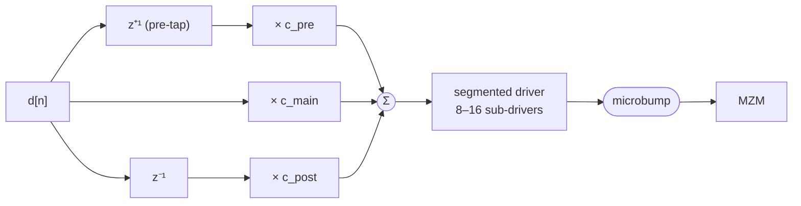
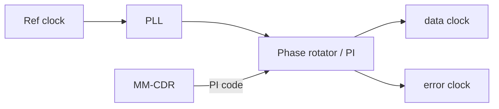
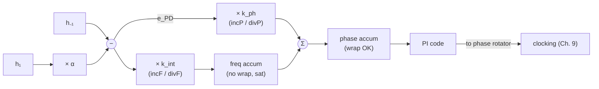
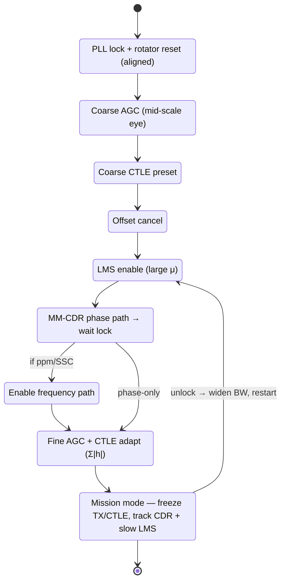

# OCI-Gen2 PMA Architecture Document

**106.25G NRZ Co-Packaged Optics — Electrical PMA**

Reference block diagram: [OCI-Gen2.png](./OCI-Gen2.png)

Related: OCI-Gen2 Chip Plan, OCI-CDNS Sketchbook

Diagram history (from sketch):
- 1/14/2022 — initial draft
- 2/1/2022 — remove wraparound loop around CDR; CTLE on PD side only

---

## Notation

| Symbol | Meaning |
|--------|---------|
| UI | Unit interval ≈ 9.41 ps at 106.25 Gbps |
| $d(n)$ | Recovered (or decided) data bit at baud index $n$ |
| $e(n)$ | Error sample / signed error for LMS |
| $h_k$ | Estimated channel cursor at lag $k$ (esp. $h_{-1}$, $h_0$, $h_1$) |
| $\mu$ | LMS step size |
| PI code | Phase interpolator / phase-rotator control word |
| ppm | Parts-per-million frequency offset |
| CPO | Co-packaged optics |
| MZM | Mach–Zehnder modulator |

**Domain colors (diagram):** yellow = optical (LightMatter), blue = analog, purple = digital.

---

# Chapter 1: Introduction

## 1-1 Purpose

This document describes the architecture and adaptation algorithms of the **OCI-Gen2 electrical PMA** for a **106.25 Gbps NRZ** co-packaged optics link. It covers:

- TX **Driver** with 3-tap analog FFE (pre / main / post)
- RX **TIA**, **CTLE**, and **AGC**
- Sampling path producing $d(n)$ and $e(n)$
- Digital **LMS channel estimator** and **Mueller–Müller (MM) CDR**

Algorithms are intended to be simulated in Matlab (or equivalent), then coded in Verilog. Layout of digital loops is by synthesis/APR. For those loops, **truth tables, filter equations, and code ranges are the source of truth** — there is no readable schematic.

Placeholder tables are layered into each algorithm chapter: **decision truth tables** and **fixed-point / range-resolution** tables sit next to the loop that uses them. A chapter index is in Appendix E.

This document is written in a loop-centric style — one chapter per adaptation loop with its truth tables, filter equations, and fixed-point ranges — targeted to baud-rate MM-CDR + LMS and to CPO front-ends (Driver + TIA).

## 1-2 System context

End-to-end path:

```mermaid
flowchart LR
  subgraph TX["Analog TX (blue)"]
    D["NRZ data<br/>106.25 Gbps"] --> UI["UI delays"] --> FFE["Driver FFE<br/>pre / main / post<br/>(8–16 segments)"]
  end
  subgraph OPT["LightMatter — optical (yellow)"]
    LAS["Laser"] --> MZM["MZM"]
    MZM --> BM1["Band mux"] --> OC["Optical channel"] --> BM2["Band mux"] --> PD["OE / PD"]
  end
  subgraph RX["Analog RX (blue)"]
    TIA["TIA"] --> CTLE["CTLE"] --> SH["S/H<br/>data + error slicers"]
  end
  subgraph DIG["Digital (purple)"]
    ETT["Error truth table"] --> LMS["LMS estimator<br/>h₋₁, h₀, h₁"]
    LMS --> MM["Mueller–Müller CDR"] --> PI["PI code"]
    LMS -.->|Σ&#124;h&#124;| CTLEA["CTLE adapt"]
    LMS -.->|&#124;h₀&#124;| AGC["AGC"]
  end
  FFE -->|microbump| MZM
  PD -->|microbump| TIA
  SH --> ETT
  PI -->|phase| CLK["PLL + phase rotator"] -->|sampler clks| SH
  AGC -.->|gain| TIA
  CTLEA -.->|peaking| CTLE

  classDef opt fill:#fff3c4,stroke:#c9a227,color:#000;
  classDef ana fill:#cfe2ff,stroke:#3b6fb6,color:#000;
  classDef dig fill:#e6d6f5,stroke:#7a4fa3,color:#000;
  class LAS,MZM,BM1,OC,BM2,PD opt;
  class D,UI,FFE,TIA,CTLE,SH,CLK ana;
  class ETT,LMS,MM,PI,CTLEA,AGC dig;
```



*Text fallback:* `NRZ → Driver FFE → microbump → [laser/MZM/mux/channel/mux/OE/PD] → microbump → TIA → CTLE → S/H → error truth table → LMS → MM-CDR → PI code` (PI closes back on the phase rotator; AGC and CTLE adapt off LMS taps).

The optical chain (laser, MZM, band muxes, channel, OE/PD) is **LightMatter responsibility**. The electrical PMA owns everything on either side of the microbumps except that optical chain.

## 1-3 Block / loop inventory

| # | Block / loop | Domain | Type | Role |
|---|--------------|--------|------|------|
| 1 | Driver FFE (pre/main/post) | Analog + control | Full or static | TX eye into MZM |
| 2 | TIA (± integrated CTLE/AGC) | Analog | Full | $I_{PD}$ → voltage |
| 3 | CTLE | Analog | Full | Linear EQ / buffer to samplers |
| 4 | AGC | Analog/digital | Full | Hold $\lvert h_0\rvert$ (or amplitude) at target |
| 5 | Offset cancel | Analog/digital | Full | Vertical eye center |
| 6 | S/H + data/error slicers | Analog | — | Produce $d(n)$, $e(n)$ |
| 7 | PLL + phase rotator / PI | Analog | — | Sampling clock |
| 8 | Error truth table | Digital | Semi | Gate / map samples → $e(n)$ |
| 9 | LMS channel estimator | Digital | Full | Estimate $h_k$ |
| 10 | Mueller–Müller CDR | Digital | Full (2nd-order optional) | Timing → PI code |
| 11 | CTLE adaptation | Digital | Full | Minimize residual ISI metric |
| 12 | Lock detect / freeze | Digital | Semi | Declare lock; freeze loops |

A **full loop** does detect → average/filter → correct (usually via DAC). A **semi-loop** detects and reports only.

## 1-4 How loops share the eye

Rough partitioning:

- **MM-CDR** sets the **horizontal** sampling location (via PI / phase rotator).
- **Offset** sets the **vertical** decision threshold / common offset.
- **AGC** sets **amplitude** (TIA gain so $\lvert h_0\rvert$ hits a preset).
- **CTLE adaptation + LMS** shape the eye by reducing residual ISI.
- **Driver FFE** opens the TX/optical eye before the PD (usually programmed statically at bring-up; can be adapted offline or via back-channel).

CDR is the only loop that is naturally **second-order** if a frequency path is enabled (integration twice). All others are first-order. Some loops are nested: AGC and CTLE should be slower than LMS/CDR tracking, or freeze after acquisition.

## 1-5 Optical vs electrical ownership

| Owner | Blocks |
|-------|--------|
| LightMatter | Laser, MZM, band mux, optical channel, OE, PD |
| Electrical PMA | Driver, TIA, CTLE, AGC, offset, S/H, PLL/PI, LMS, MM-CDR |

Interface contracts live at the **microbumps**: TX driver swing/impedance into the MZM; PD current/capacitance into the TIA.

---

# Chapter 2: Top-Level Signal Flow and Eye / Pulse Response

## 2-1 End-to-end signal flow

1. **NRZ data** at 106.25G enters UI delay taps and the segmented Driver (pre / main / post).
2. Driver output is a **continuous** equalized waveform into the TX microbump.
3. LightMatter path: laser → MZM → band mux → optical channel → band mux → OE/PD.
4. PD current enters RX microbump → **TIA** → **CTLE** → dual **S/H** paths.
5. Data and error decisions feed the digital block: error truth table, LMS ($h_{-1}, h_0, h_1, \ldots$), MM-CDR → **PI code** closing on the phase rotator.

## 2-2 Rate and UI

| Parameter | Value |
|-----------|-------|
| Baud rate | 106.25 Gbps NRZ |
| UI | $1/106.25\text{e9} \approx 9.412$ ps |
| Internal clocking | Prefer 2T or 4T (half/quarter rate) for digital; exact width TBD by floorplan |

Digital adaptation runs on a deserialized bus. Let $W$ be the CDR/LMS interface width in bits per digital cycle. One digital cycle spans $W$ UIs. Gains and ppm formulas below keep $W$ explicit so settings scale when width changes.

### Global digital fixed-point (placeholder)

| Parameter | Symbol | Format / value | Notes |
|-----------|--------|----------------|-------|
| Baud rate | — | 106.25 Gbps | |
| Deserial width | $W$ | TBD bits / cycle | LMS & CDR cycle = $W$ UI |
| Digital clock | — | TBD MHz | |
| Data bus | $d\langle W-1:0\rangle$ | TBD_rtl_floorplan | Coding default: **`{0,1}` on the bus**, mapped to ±1 as $d_\pm = 2d-1$ for LMS / PD (§10-2). Confirm with RTL (`TBD_convention`). |
| Error bus | $e\langle W-1:0\rangle$ | TBD_rtl_floorplan | Coding default: **one 2-b ternary $e(n)$ per UI** (§8-3), not packed signs. Confirm with RTL (`TBD_convention`). |
| PI taps per UI | $N_{\mathrm{taps}}$ | TBD | full-rate equivalent |
| Loop latency | $\tau$ | TBD UI | for BW / PM budget |

**Saturate vs wrap (global rule):** only the CDR phase accumulator / PI path may wrap; all other adaptation registers saturate.

## 2-3 Eye diagram (diagram inset)

The eye inset shows a 106G NRZ eye with horizontal and vertical cursors. Conceptually:

- **Data sampling** is at the eye center (baud-rate sample for $d(n)$).
- **Error sampling** is at a vertical offset (or dual-threshold mux) to measure amplitude / sign of residual for LMS.
- Timing does **not** use dedicated crossing slicers; it comes from **cursor balance** via MM-CDR.

## 2-4 Pulse response and cursors

The pulse-response inset marks:

| Cursor | Meaning |
|--------|---------|
| $h_{-1}$ | Precursor (sample one UI early relative to main) |
| $h_0$ | Main cursor (desired sampling instant) |
| $h_1$ | First postcursor |

MM-CDR drives phase so that precursor and postcursor estimates are balanced (optionally with a slight preference to match $h_1$ — see Ch. 11). LMS estimates these taps continuously from $e(n)$ and delayed $d(n)$.

---

# Chapter 3: TX Driver and Analog FFE

## 3-1 Role in CPO

The Driver turns discrete NRZ symbols into a continuous voltage/current waveform that drives the **MZM** through the TX microbump. At 106G, package + modulator bandwidth roll off hard; a short **analog FFE** (pre / main / post) restores edge rate and opens the optical eye into the PD.

Diagram intent:

- Segment the driver into a few sub-drivers (**8 or 16** suggested) for layout matching and swing control.
- Use **analog FFE** (from CR/CP methodology) so discrete data in → continuous equalized drive out.

## 3-2 Three-tap structure: pre / main / post



*(Continuous-time reconstruction happens in the driver segments; the pre-tap is shown as a look-ahead for clarity — confirm the actual delay/index convention in RTL.)*

Functional model (confirm index convention in RTL):

$$
y(t) = c_{\mathrm{pre}}\,d[n+1] + c_{\mathrm{main}}\,d[n] + c_{\mathrm{post}}\,d[n-1]
$$

(with continuous-time reconstruction through the driver segments).

| Tap | Intent |
|-----|--------|
| **pre** | Boost precursor / advance edge (compensate package + MZM lag) |
| **main** | Set swing / cursor weight |
| **post** | Cancel first postcursor into the optical+electrical plant |

Layout note from diagram: segment carefully so pre/main/post see **matched** parasitics; mismatch shows up as fixed pattern jitter and asymmetric FFE.

## 3-3 Equalization intent

Target plant: Driver → microbump → MZM → optical path → PD → TIA input. The Driver FFE is the **TX-side** linear equalizer. Prefer:

1. Set Driver taps for a clean optical eye / PD current eye under nominal channel.
2. Leave residual ISI to RX CTLE + AGC + sampling margins.
3. Avoid over-emphasis that saturates the MZM or starves SNR.

## 3-4 Fixed-point specification

The Driver signal path is analog; the fixed-point content of this chapter is
the **control-side** view — three tap codes, a swing-limit compare, and an
optional adaptation-step register.

#### Datapath signals

| Signal | Role | Width | Format | Range | Consumer / notes |
|---|---|---|---|---|---|
| `DRV_PRE` | state | `TBD_analog_design` | signed | $[-C_{\mathrm{tap,max}}, +C_{\mathrm{tap,max}}]$ | To pre-tap segmented DAC. |
| `DRV_MAIN` | state | `TBD_analog_design` | signed | same | Main tap. |
| `DRV_POST` | state | `TBD_analog_design` | signed | same | First post-tap. |
| `SEG_EN` | param | 8b or 16b | unsigned | one-per-segment | Per-segment enable. |
| $\lvert c_i\rvert$, $i\in\{\text{pre,main,post}\}$ | intermediate | code-width | unsigned | $[0, C_{\mathrm{tap,max}}]$ | Per-tap magnitude. |
| $\sum\lvert c\rvert$ | intermediate | code-width + 2 | unsigned | $[0, 3\,C_{\mathrm{tap,max}}]$ | Total drive requirement. |
| $C_{\max}$ | param | code-width + 2 | unsigned | $[0, 3\,C_{\mathrm{tap,max}}]$ | Swing budget. |
| `SWING_VIOL` | out (sticky) | 1b | boolean | {0,1} | Set when $\sum\lvert c\rvert > C_{\max}$. |
| $\Delta$ | param (optional) | 2b signed | {−1, 0, +1} | 1 | Only if the offline / back-channel adapt path is enabled (§3-5). |
| `DRV_FRZ` | param | 1b | boolean | {0,1} | Default 1 (frozen after bring-up). |

#### Arithmetic stages

| # | Stage | Operation | Input widths | Output width | Overflow | Rounding |
|---|---|---|---|---|---|---|
| D1 | per-tap abs | $\lvert c_i\rvert$, $i\in\{\text{pre,main,post}\}$ | 3× code-width (signed) | 3× code-width (unsigned) | — | — |
| D2 | swing sum | $\sum\lvert c_i\rvert$ | 3× code-width | code-width + 2 | saturate | — |
| D3 | swing compare | `SWING_VIOL = Σ|c| > C_max` | 2× (code+2) | 1b (sticky) | — | — |
| D4 | adapt step (optional) | `c_i += Δ` gated by `~DRV_FRZ` | code-width, 2b + 1b | code-width | saturate at rails | — |

#### Programmable parameters

| Parameter | Symbol | Width / format | Range | Default | Notes |
|---|---|---|---|---|---|
| Precursor code | `DRV_PRE` | `TBD_analog_design` signed | $[-C_{\mathrm{tap,max}}, +C_{\mathrm{tap,max}}]$ | `TBD_from_link_budget` | Default index convention per §3-2: pre = $d[n+1]$, main = $d[n]$, post = $d[n-1]$; positive code ⇒ positive tap weight. Confirm sign & index with RTL (`TBD_convention`). |
| Main code | `DRV_MAIN` | `TBD_analog_design` signed | same | `TBD_from_link_budget` | |
| Post code | `DRV_POST` | `TBD_analog_design` signed | same | `TBD_from_link_budget` | |
| Segment enable | `SEG_EN` | 8b or 16b | one-per-segment | all-on | Segment count from §3-2. |
| Segment count | $N_{\mathrm{seg}}$ | fixed at synthesis | integer | 8 or 16 | Diagram note in §3-2. |
| Swing limit | $C_{\max}$ | `TBD_analog_design` unsigned | $[0, 3\,C_{\mathrm{tap,max}}]$ | `TBD_analog_design` | Hard clip on $\sum\lvert c\rvert$. |
| Swing violation flag | `SWING_VIOL` | 1b (sticky) | boolean | 0 | Write-1-to-clear. |
| Adapt step (optional) | $\Delta$ | 2b signed | {−1, 0, +1} | 1 | Only if adapt path enabled. |
| Freeze | `DRV_FRZ` | 1b | boolean | 1 | Default frozen. |

#### Overflow / rounding policy

All Driver codes **saturate** at their DAC rails; the swing sum (D2)
saturates at (code + 2) bits. `SWING_VIOL` is sticky (write-1-to-clear).
No fractional rounding — every operation is an integer add, abs, or
compare.

Exact LSB sizes are process-specific; mirror the frozen numbers into the
register map (Appendix F) once analog is signed off. Layout controls
(CM, impedance, matching across segments) are not fixed-point concerns
and remain in §3-2 / §3-6.

| Control | Suggested approach |
|---------|-------------------|
| Codes | Independent DACs / codes for $c_{\mathrm{pre}}$, $c_{\mathrm{main}}$, $c_{\mathrm{post}}$. |
| Segmentation | 8 or 16 unit drivers enabled by the segment code. |
| Swing limit | Hard clip total weight so $\lvert c_{\mathrm{pre}}\rvert+\lvert c_{\mathrm{main}}\rvert+\lvert c_{\mathrm{post}}\rvert \le C_{\max}$ (D3). |
| CM / impedance | Meet microbump / MZM load (100 Ω-class differential if electrical spec requires). |

## 3-5 Adaptation policy

Default for Gen2:

- **Static / bring-up programmed** Driver taps (lab sweep or known channel preset).
- Optional: offline LMS-style TX adapt if a back-channel or loopback exists.
- Freeze after training; do not fight RX CTLE in mission mode unless a supervised link-training state machine owns both ends.

### Decision truth table — Driver FFE adaptation (optional / offline)

Only if TX taps are adapted (else N/A — static codes).

| Metric (BER / $J$ / back-channel) | Tap under test | Update |
|-------------------------------------|----------------|--------|
| TBD improve | pre | $+\Delta$ or $-\Delta$ |
| TBD worsen | pre | opposite |
| TBD | main | TBD |
| TBD | post | TBD |
| Swing limit hit | * | $0$ + saturate |
| Freeze / mission mode | * | $0$ |

## 3-6 Driver–optical interface

Must specify (chip plan / SI doc):

- Differential swing into MZM at microbump
- Return loss / ESD / common-mode
- Latency (UI) from digital launch to optical modulation (for any TX–RX coordinated training)

## 3-7 Electrical specification (first cut)

The table below reproduces the LightMatter *Requirements Specifications for the
IP cores* (224G RX TIA & TX Driver / 64G RX TIA & TX Driver, rev 0.12, TSMC
N3P) and adds a **first-cut 106.25G NRZ column** for this design.

**Baud-rate bridging.** Our target is **106.25 Gbps NRZ = 106.25 GBd**
(Nyquist $f_N \approx 53.1$ GHz, UI $\approx 9.41$ ps). This shares the
**symbol rate / Nyquist** of the source document's high-rate part (specified as
224G PAM4 over a 106.25–224 Gbps range — i.e. the 106 GBd / "212G PAM4" lower
end), so the **bandwidth, load, and impedance** specs track that PAM4 front
end, while **linearity (THD), gain-ripple, and noise** relax toward the NRZ
family. Numbers in the 106G column are **first-cut engineering estimates** — not
silicon and not from any `optical-serdes` simulation; each derived value
carries a basis note or a `TBD_*` tag. Cells show `min–max` where a range
applies, otherwise a typical value.

**CPO channel context (drives the EQ / termination / return-loss numbers
below).** This is a **co-packaged (CPO)** part: the driver (EIC) drives each MRM
(PIC) through a **microbump only** — there is no PCB trace, connector, cable, or
transmission line between them, and **no series or back-termination resistors**.
The interconnect is essentially a lumped microbump + pad capacitance with
**negligible frequency-dependent loss**. The ISI budget is therefore dominated
by the **bandwidths of the driver, MRM, and RX TIA** (plus PD / optical), *not*
by channel loss. Two consequences flow into the specs: (1) equalisation is light
— the driver de-emphasis and TIA CTLE peaking only pre-/post-compensate the
analog blocks' own roll-off, so their ranges are reduced; and (2)
matched-impedance / return-loss targets are relaxed, since there is no line to
reflect on and no termination resistor to match. The dominant ISI lever is the
low-pass bandwidth of each analog block, not equalisation.

### Driver — operational / electrical specification

| Metric | 64G NRZ (ref) | 224G PAM4 (ref) | 106G NRZ (first cut) | Unit | Basis / notes |
|---|---|---|---|---|---|
| Data operating range | 28–64 (NRZ) | 106.25–224 (PAM4) | 106.25 (NRZ) | Gbps | 106.25 GBd, $f_N\approx53.1$ GHz. |
| Power consumption | 0.3 (≤0.4) | 0.7 (≤0.9) | 0.4 (≤0.5) | pJ/bit | Between refs; NRZ simpler than PAM4 but 3 Vpp out at high BW. Revisit for 30 Ω load (`TBD_from_partner`). |
| Diff input resistance | 80/100/120 | 100 | 100 | Ω | Match SerDes launch. |
| Diff input swing, pk-pk | 0.9–1.2 | 0.5–1 | 0.9–1.2 | Vpp | From SerDes output (Ch. 2). |
| Diff output swing, pk-pk | 3 | 3 | 3 | Vpp | Into MRM; ≤3.3 V max ΔV (N3P). Report rms output noise. |
| Mid-band gain (max) | — | 16 | 14 | dB | First cut: 3 Vpp out / ~1 Vpp in + headroom; ≥10 dB needed at 1.2 Vpp in. |
| Gain control range | — | 6 (1 dB steps) | 6 (1 dB steps) | dB | Preserve frequency response. |
| In-band gain ripple | — | 0.3 | 0.5 | dB | Relaxed vs PAM4. |
| EQ gain peaking (de-emphasis) | — | 4 | 0–2 | dB | CPO near-zero channel — de-emphasis only pre-compensates driver/MRM BW roll-off, not channel loss, so a small range suffices (`TBD_from_sim_sweep`). |
| EQ gain peaking step | — | 0.5 | 0.5 | dB | |
| High-pass 3 dB BW | 50 | 100 | 100 | kHz | |
| Low-pass 3 dB BW | 32 (guideline) | 60 | 55 | GHz | First cut ≈$f_N$–1.1$f_N$; with near-zero channel this BW (with MRM/TIA) is the **dominant ISI lever** — eye mask governs (`TBD_from_sim_sweep`). |
| Output diff DC impedance | — | 30 | — | Ω | CPO: no back-termination resistor (direct microbump to capacitive MRM); load is the MRM cap below, not a matched line (`TBD_analog_design`). |
| Diff capacitive output load | 60 | 60 | 60 | fF | |
| THD | — | 3 | 8 | % | NRZ-tolerant (cf. 64G TIA 8 %). |
| Group-delay variation, band 1 (DC–$f_1$) | — | 3 | 3 | ps | Frequency-dependent GDV. Band edges $f_1$/$f_2$/$f_3$ `TBD_from_sim_sweep` ($f_3\lesssim$ low-pass BW). Small vs 9.41 ps UI. |
| Group-delay variation, band 2 ($f_1$–$f_2$) | — | 3 | 3 | ps | Band edges per band-1 note. |
| Group-delay variation, band 3 ($f_2$–$f_3$) | — | 3 | 3 | ps | Band edges per band-1 note. |
| Diff output eye width @1e-12 | 12 | — | ≥7 | ps | First cut: 0.77 UI scaled from 64G (SSPR-NRZ) (`TBD_from_link_budget`). |
| X × Y dimension | 0.30 × 0.15 | 0.40 × 0.20 | 0.40 × 0.20 | mm | Tentative. |
| Poly orientation / HS edge | Y / X-edge | Y / X-edge | Y / X-edge | — | Tentative. |

An **output bias circuit** at the driver output sets the MRM bias, couples the
data signal to each MRM, and suppresses HF common-mode; **no back-termination
resistor is used** — the MRM is attached directly through a microbump (detailed
spec `TBD_from_partner`).

**PVT / sign-off corners (apply to both Driver and TIA):** process TT, SS, FF,
FS, SF, FFA, SSA; temperature 0–125 °C; supply variation ±5 %; absolute supply
rails `TBD_analog_design`.

## 3-8 Conclusions

The Driver is a **3-tap analog FFE** into the CPO MZM. It is a first-class PMA block (not an RX-only concern). Prefer segmented layout, static tap programming for Gen2, and clear swing limits so RX AGC/CTLE see a consistent optical eye.

---

# Chapter 4: TIA Front-End

## 4-1 Role

The TIA converts PD photocurrent to a voltage the CTLE and samplers can use. At 106G CPO it is the RX noise / bandwidth bottleneck: PD capacitance + microbump parasitics set the input pole; TIA peaking and noise figure set SNR.

## 4-2 Prefer CTLE + AGC integrated into TIA

Diagram note: *“Better to have CTLE and AGC integrated into TIA if space permits.”*

| Option | Pros | Cons |
|--------|------|------|
| Integrated CTLE/AGC in TIA | Fewer stages, less loading, smaller cross-section | Harder to reuse / retune; floorplan risk |
| Discrete CTLE after TIA | Clear partition; easier bring-up | Extra buffer power / peaking interaction |

**Architecture stance:** design the TIA so peaking (CTLE-like) and gain (AGC) **can** live inside the TIA; keep a standalone CTLE block in the diagram as the portable control abstraction. RTL/adaptation talks to “CTLE codes” and “AGC codes” regardless of whether the DAC sits inside the TIA macro.

## 4-3 Transfer function

Idealized:

$$
V_{\mathrm{out}}(s) = Z_T(s)\, I_{\mathrm{PD}}(s)
$$

with peaking:

$$
Z_T(s) \approx R_T \frac{1+s/\omega_z}{(1+s/\omega_{p1})(1+s/\omega_{p2})}
$$

Peaking zeros/poles are the knobs CTLE adaptation will move (Ch. 5). AGC moves $R_T$ or an equivalent VGA gain after the first stage.

## 4-4 PD / microbump input

Constraints:

- Linear current range (don’t saturate on max optical power)
- Stability with $C_{\mathrm{PD}}+C_{\mathrm{bump}}$
- DC / overload recovery
- Differential vs single-ended OE topology per LightMatter PD

## 4-5 Programmability and monitors

Expose:

- Coarse/fine gain (AGC)
- Peaking / CTLE codes
- Optional offset DAC at TIA output
- Peak detectors or replica taps for AGC error (or rely on digital $\lvert h_0\rvert$)

## 4-6 Electrical specification (first cut)

Reproduces the LightMatter requirements (224G RX TIA & TX Driver / 64G RX TIA &
TX Driver, rev 0.12, TSMC N3P) and adds a first-cut 106.25G NRZ column. See
§3-7 for the baud-rate-bridging rationale and the first-cut disclaimer (the
106G column is engineering estimate, not silicon or `optical-serdes` output).
Cells show `min–max` where a range applies, otherwise a typical value.

### TIA — electrical specification

| Metric | 64G NRZ (ref) | 224G PAM4 (ref) | 106G NRZ (first cut) | Unit | Basis / notes |
|---|---|---|---|---|---|
| Data operating range | 28–64 (NRZ) | 106.25–224 (PAM4) | 106.25 (NRZ) | Gbps | 106.25 GBd, $f_N\approx53.1$ GHz. |
| Power consumption | 0.2 | 0.2 (≤0.3) | 0.2 (≤0.3) | pJ/bit | Track PAM4 front end. |
| Peak-peak input current | 50–400 | 125–400 | 50–400 | µApp | PD responsivity × optical power (`TBD_from_partner`). |
| Max transimpedance gain | 80–82 | 66 | 80 | dBΩ | First cut: ~500 mVpp out at ~50 µApp in (mid-band). |
| Min transimpedance gain | 68 | 54 | 62 | dBΩ | First cut: ~500 mVpp out at 400 µApp in. |
| Transimpedance gain step | 0.5 | 0.25–0.5 | 0.5 | dB | |
| CTLE peaking | — | 0–3 (1 dB steps) | 0–2 (1 dB steps) | dB | At $f_N$; CPO near-zero channel — peaking only offsets TIA/PD/MRM BW roll-off, so a small range suffices. Ch. 5 owns adaptation (`TBD_from_sim_sweep`). |
| Diff output swing, pk-pk | 600 | 100–500 | 200–600 | mVpp | Into samplers (Ch. 8). |
| Input-referred noise (rms, excl PD shot) | 1 | 2 (critical) | 1.5 | µArms | Integrate DC→1.5$f_N$≈80 GHz; NRZ tolerates > PAM4 (`TBD_from_link_budget`). |
| High-pass 3 dB BW | 50 | 100 | 100 | kHz | Set by DCOC loop (Ch. 7). |
| Low-pass 3 dB BW | 30 | 50 | 50 | GHz | First cut ≈$f_N$; with near-zero channel this (with MRM/driver BW) is a **dominant ISI lever** (`TBD_from_sim_sweep`). |
| Return loss SDD22 @ $f_N$ | 15 | 15 | 10 | dB | Relaxed: microbump direct attach, no transmission line to reflect (`TBD_analog_design`). |
| THD @ max swing | 8 | 3 | 8 | % | NRZ-tolerant. |
| Group-delay variation, band 1 (DC–$f_1$) | 5 | 3 | 3 | ps | Frequency-dependent GDV. Band edges $f_1$/$f_2$/$f_3$ `TBD_from_sim_sweep` ($f_3\lesssim$ low-pass BW). Small vs 9.41 ps UI. |
| Group-delay variation, band 2 ($f_1$–$f_2$) | 5 | 3 | 3 | ps | Band edges per band-1 note. |
| Group-delay variation, band 3 ($f_2$–$f_3$) | 5 | 3 | 3 | ps | Band edges per band-1 note. |
| Max input DC current | 520 | 520 | 520 | µA | Corrected by DCOC (Ch. 7). |
| Output (monitor) current | 0–100 | 0–100 | 0–100 | µA | 1:1 mirror of DC current; N:1 divider option. |
| Output current noise (ref. input) | 95 | 95 | 95 | nA | RMS 5 kHz–1 MHz @ 75 dBΩ, 80 µW optical. |
| X × Y dimension | 0.30 × 0.15 | 0.40 × 0.20 | 0.40 × 0.20 | mm | Tentative. |
| Poly orientation / HS edge | Y / X-edge | Y / X-edge | Y / X-edge | — | Tentative. |

The TIA integrates the CTLE peaking and AGC gain functions (§4-2): the *CTLE
peaking* and *transimpedance gain* rows are the analog knobs that Ch. 5 (CTLE
adaptation) and Ch. 6 (AGC) drive, and the high-pass corner / max input DC
current are the analog side of Ch. 7 offset cancellation (DCOC). PVT sign-off
corners are shared with the Driver — see §3-7.

## 4-7 Conclusions

TIA is the RX gateway from optical current to the electrical PMA. Prefer integrating CTLE/AGC functionally into the TIA while keeping adaptation algorithms identical. Bandwidth and noise at 106G dominate link margin; AGC must keep the samplers in their linear/sweet-spot region.

---

# Chapter 5: CTLE

## 5-1 Why CTLE

CTLE provides **linear** high-frequency boost for residual ISI after Driver FFE + optical plant + TIA. Diagram notes also cast it as a **buffer** into the sampler path and as a tool to flatten the noise floor / manage TIA LF behavior.

## 5-2 Transfer function (control view)

Treat CTLE as a programmable boost:

$$
H_{\mathrm{CTLE}}(s) = G_{\mathrm{dc}}\frac{1+s/\omega_z}{1+s/\omega_p}
$$

Codes move $\omega_z$, $\omega_p$, and/or $G_{\mathrm{dc}}$. Exact circuit may live inside TIA (Ch. 4).

## 5-3 CTLE adaptation (under consideration)

Diagram proposal:

> Minimize the **sum of absolute values of estimated channel coefficients**, excluding the main cursor.

Metric:

$$
J = \sum_{k \neq 0} \lvert h_k\rvert
$$

(typically at least $k \in \{-1,+1\}$; extend if LMS has more taps).

**Update rule (sign-sign style):**

- If increasing peaking reduces $J$ over an averaging window → keep moving that way.
- Else reverse.
- Optionally use $\partial J / \partial c$ via perturbation (dither) if one-bit search is too slow.

Alternative metrics (document if chosen later): minimize $\lvert h_{-1}\rvert+\lvert h_1\rvert$ only; or subset-MMSE on error power.

### Decision truth table — CTLE adaptation

Cost $J=\sum_{k\neq 0}\lvert h_k\rvert$. One-bit search / dither:

| Compare $J$ after trial step | Last step direction | Next CTLE code update |
|-------------------------------|---------------------|------------------------|
| $J$ decreased | $+1$ (more peaking) | keep $+1$ |
| $J$ decreased | $-1$ | keep $-1$ |
| $J$ increased | $+1$ | flip to $-1$ |
| $J$ increased | $-1$ | flip to $+1$ |
| $\lvert\Delta J\rvert < \varepsilon_J$ | * | $0$ (done / freeze candidate) |
| Freeze / LMS not settled | * | $0$ |

**Optional gradient form:**

| $\partial J/\partial c_{\mathrm{CTLE}}$ approx | Update |
|--------------------------------------------------|--------|
| $> 0$ | decrease peaking |
| $< 0$ | increase peaking |
| $\approx 0$ | hold |

## 5-4 Fixed-point specification

- CTLE must be **slower** than LMS (LMS needs quasi-static plant to estimate $h_k$).
- Use a long dwell counter / large `divCTLE` so each trial waits for the LMS taps to settle.
- Support **adapt-and-freeze** after acquisition.

#### Datapath signals

| Signal | Role | Width | Format | Range | Consumer / notes |
|---|---|---|---|---|---|
| $h_k$, $k\neq 0$ | in | tap-width (Ch. 10) | signed `sN.F` | $\pm H_{\max}$ | From LMS. Excludes $h_0$. |
| $\lvert h_k\rvert$ | intermediate | tap-width | unsigned `uN.F` | $[0, H_{\max}]$ | Per-tap absolute value. |
| $J = \sum_{k\neq 0}\lvert h_k\rvert$ | intermediate | tap-width + $\lceil\log_2 N_{\mathrm{tap}}\rceil$ | unsigned `uN.F` | $[0, N_{\mathrm{tap}} H_{\max}]$ | Cost function; $N_{\mathrm{tap}}$ = active tap count. |
| $J_{\mathrm{prev}}$ | state | same as $J$ | unsigned `uN.F` | same | Latched previous-window cost. |
| $\Delta J = J - J_{\mathrm{prev}}$ | intermediate | J-width + 1 | signed `sN.F` | $\pm N_{\mathrm{tap}} H_{\max}$ | Sign encodes "better/worse". |
| $\varepsilon_J$ | param | J-width | unsigned `uN.F` | $[0, J_{\max}]$ | Dead-band. |
| `flag_worse`, `flag_better` | intermediate | 1b each | boolean | {0,1} | $\Delta J > +\varepsilon_J$ / $< -\varepsilon_J$. |
| `last_dir` | state | 2b | signed | {−1, 0, +1} | Previous step direction. |
| `next_dir` | intermediate | 2b | signed | {−1, 0, +1} | From §5-3 direction truth table. |
| `dwell_cnt` | state | `TBD_rtl_floorplan` | unsigned | $[0, T_{\mathrm{dwell}}]$ | Counts LMS-settle cycles between trials. |
| `dwell_pulse` | intermediate | 1b | boolean | {0,1} | Asserts when `dwell_cnt = T_dwell`. |
| $\Delta c$ | intermediate | 2b | signed | {−1, 0, +1} | Signed step onto the code. |
| `CTLE_CODE` | state / out | `TBD_analog_design` | unsigned | $[0, C_{\max}]$ | DAC control to the CTLE (or the peaking bias inside the TIA — Ch. 4). |
| `CTLE_EN`, `CTLE_FRZ` | param | 1b each | boolean | {0,1} | Master enable / freeze. |
| `LMS_SETTLED` | in | 1b | boolean | {0,1} | Gate from Ch. 10 / Ch. 12 acquisition FSM. |

#### Arithmetic stages

| # | Stage | Operation | Input widths | Output width | Overflow | Rounding |
|---|---|---|---|---|---|---|
| C1 | per-tap abs | $\lvert h_k\rvert$ | tap-width (signed) | tap-width (unsigned) | — | — |
| C2 | cost sum | $J = \sum_{k\neq 0}\lvert h_k\rvert$ | $N_{\mathrm{tap}}$× tap-width | J-width | saturate | — |
| C3 | dwell counter | `dwell_cnt++` while `dwell_cnt < T_dwell`; else emit `dwell_pulse`, reset | dwell-cnt width | dwell-cnt width, 1b | saturate | — |
| C4 | snapshot | on `dwell_pulse`: `J_prev ← J` | J-width | J-width | — | — |
| C5 | subtract | $\Delta J = J - J_{\mathrm{prev}}$ | J-width | J-width + 1 | saturate | — |
| C6 | compare | `flag_worse = ΔJ > +ε_J`; `flag_better = ΔJ < −ε_J` | ΔJ-width × ε-width | 2× 1b | — | — |
| C7 | direction LUT | `next_dir = f(flag_worse, flag_better, last_dir)` per §5-3 | 2b + 2b + 2b | 2b | — | — |
| C8 | encode step | $\Delta c \leftarrow$ `next_dir` gated by `CTLE_EN & ~CTLE_FRZ & LMS_SETTLED & dwell_pulse` | 2b + 4× 1b | 2b | — | — |
| C9 | code accumulator | `CTLE_CODE += Δc` | code-width, 2b | code-width | saturate at $[0, C_{\max}]$ | — |
| C10 | direction latch | `last_dir ← next_dir` on `dwell_pulse` | 2b | 2b | — | — |

#### Programmable parameters

| Parameter | Symbol | Width / format | Range | Default | Notes |
|---|---|---|---|---|---|
| Cost | $J$ | J-width unsigned `uN.F` | $[0, J_{\max}]$ | — | Combinational readout. |
| Dwell period | $T_{\mathrm{dwell}}$ / `divCTLE` | `TBD_rtl_floorplan` unsigned | $\gg$ LMS convergence | `TBD_from_sim_sweep` | Slower than LMS (Ch. 10). |
| Cost dead-band | $\varepsilon_J$ | J-width unsigned `uN.F` | $[0, J_{\max}]$ | `TBD_from_sim_sweep` | Termination criterion. |
| Step size | $\Delta c$ | 2b signed | {−1, 0, +1} | 1 | Typically ±1 code per trial. |
| CTLE DAC code | `CTLE_CODE` | `TBD_analog_design` unsigned | $[0, C_{\max}]$ | `TBD_analog_design` | Saturates at rails; flag `RAIL_HIGH` / `RAIL_LOW`. |
| Code saturation | $C_{\max}$ | `TBD_analog_design` | code-width max | `TBD_analog_design` | DAC full-scale. |
| Enable | `CTLE_EN` | 1b | {0,1} | 0 | Master enable. |
| Freeze | `CTLE_FRZ` | 1b | {0,1} | 0 | Adapt-and-freeze support. |
| Direction state | `last_dir` | 2b | {−1, 0, +1} | 0 | Written by C10. |

#### Overflow / rounding policy

Per Ch. 2-2, `CTLE_CODE` **saturates** at its DAC rails; `J`, `J_prev`, and
`ΔJ` also saturate at their local widths. Rounding is not required inside the
loop since every stage is either a sum of unsigned magnitudes, a comparison,
or a discrete step; no fractional trim is performed. Rail hits should raise
`RAIL_HIGH` / `RAIL_LOW` for diagnostics (Ch. 6 uses the same convention).

## 5-5 Nesting

Recommended acquisition order (detail in Ch. 12): coarse AGC → coarse CTLE → LMS converge → MM-CDR lock → fine CTLE → freeze CTLE/AGC as needed → leave LMS/CDR tracking.

## 5-6 Conclusions

CTLE is the RX linear equalizer. Adaptation should close on LMS tap magnitudes (Σ|h| excluding $h_0$), not on a separate analog peak detector, so the same channel estimate serves CDR, AGC, and EQ.

---

# Chapter 6: AGC Loop

## 6-1 Why AGC

Optical power, PD responsivity, and TIA gain variation move the eye height. Samplers and LMS need a stable $\lvert h_0\rvert$ (or peak voltage). AGC holds amplitude at a **preset target**.

## 6-2 What AGC controls

Primary: **TIA gain** (or integrated VGA). Secondary (optional): digital scaling of error path — prefer analog gain so SNR is set before slicing.

Diagram note:

> AGC adaptation: adjust TIA gain so the $h_0$ estimate reaches a desired preset value.

Error:

$$
e_{\mathrm{AGC}} = \lvert h_0\rvert - H_{0,\mathrm{target}}
$$

- $e_{\mathrm{AGC}} > 0$ → decrease gain  
- $e_{\mathrm{AGC}} < 0$ → increase gain  

### Decision truth table — AGC

| $e_{\mathrm{AGC}}$ | Hysteresis $\Delta_{\mathrm{hyst}}$ | Freeze | Gain code update |
|---------------------|--------------------------------------|--------|------------------|
| $> +\Delta_{\mathrm{hyst}}$ | armed | 0 | $-$1 (decrease gain) |
| $< -\Delta_{\mathrm{hyst}}$ | armed | 0 | $+$1 (increase gain) |
| $\lvert e_{\mathrm{AGC}}\rvert \le \Delta_{\mathrm{hyst}}$ | — | 0 | $0$ |
| * | * | 1 | $0$ |
| At DAC min/max | * | 0 | $0$ + flag rail |

## 6-3 Hysteresis mode (optional)

To avoid chatter when $\lvert h_0\rvert$ sits near target, use a deadband:

$$
\text{update only if } \lvert e_{\mathrm{AGC}}\rvert > \Delta_{\mathrm{hyst}}
$$

## 6-4 Fixed-point specification

AGC should be the **slowest** among AGC / CTLE / LMS tracking, to avoid
fighting MM-CDR and CTLE. Typical target: tens of thousands of UIs time
constant.

#### Datapath signals

| Signal | Role | Width | Format | Range | Consumer / notes |
|---|---|---|---|---|---|
| $\lvert h_0\rvert$ | in | tap-width (Ch. 10) | unsigned `uN.F` | $[0, H_{\max}]$ | Abs of LMS $h_0$. |
| $H_{0,\mathrm{target}}$ | param | tap-width | unsigned `uN.F` | $[0, H_{\max}]$ | AGC set-point. |
| $e_{\mathrm{AGC}} = \lvert h_0\rvert - H_{0,\mathrm{target}}$ | intermediate | tap-width + 1 | signed `sN.F` | $\pm H_{\max}$ | Signed error. |
| $\Delta_{\mathrm{hyst}}$ | param | tap-width | unsigned `uN.F` | $[0, H_{\max}]$ | Dead-band. |
| `flag_hi`, `flag_lo` | intermediate | 1b each | boolean | {0,1} | $e_{\mathrm{AGC}} > +\Delta_{\mathrm{hyst}}$ / $< -\Delta_{\mathrm{hyst}}$. |
| `agc_cnt` | state | `TBD_rtl_floorplan` | unsigned | $[0, \mathrm{divAGC}]$ | Divider counter for slow update. |
| `agc_pulse` | intermediate | 1b | boolean | {0,1} | Asserts when `agc_cnt = divAGC`. |
| $\Delta g$ | intermediate | 2b | signed | {−1, 0, +1} | Encoded gain step. |
| `AGC_CODE` | state / out | `TBD_analog_design` | unsigned | $[0, G_{\max}]$ | To TIA / VGA (Ch. 4). |
| `RAIL_HI`, `RAIL_LO` | out | 1b each | boolean | {0,1} | Latched when `AGC_CODE` hits rails. |
| `AGC_EN`, `AGC_FRZ` | param | 1b each | boolean | {0,1} | Master enable / freeze. |

#### Arithmetic stages

| # | Stage | Operation | Input widths | Output width | Overflow | Rounding |
|---|---|---|---|---|---|---|
| A1 | subtract | $e_{\mathrm{AGC}} = \lvert h_0\rvert - H_{0,\mathrm{target}}$ | tap × tap | tap+1 | saturate | — |
| A2 | hysteresis compare | `flag_hi = e_AGC > +Δ_hyst`; `flag_lo = e_AGC < −Δ_hyst` | (tap+1) × tap | 2× 1b | — | — |
| A3 | slow divider | `agc_cnt++` while `agc_cnt < divAGC`; else emit `agc_pulse`, reset | div-cnt width | div-cnt width, 1b | saturate | — |
| A4 | step encode | `Δg = −1` if `flag_hi & agc_pulse & AGC_EN & ~AGC_FRZ`; `+1` if `flag_lo & …`; else `0` | 4× 1b + 4× 1b | 2b | — | — |
| A5 | gain accumulator | `AGC_CODE += Δg` | code-width, 2b | code-width | saturate at $[0, G_{\max}]$ | — |
| A6 | rail detect | `RAIL_HI = (AGC_CODE = G_max) & (Δg > 0)`; `RAIL_LO = (AGC_CODE = 0) & (Δg < 0)` | code-width, 2b | 2× 1b (sticky) | — | — |

#### Programmable parameters

| Parameter | Symbol | Width / format | Range | Default | Notes |
|---|---|---|---|---|---|
| Target | $H_{0,\mathrm{target}}$ | tap-width unsigned `uN.F` | $[0, H_{\max}]$ | `TBD_from_link_budget` | Sets eye amplitude. |
| Hysteresis | $\Delta_{\mathrm{hyst}}$ | tap-width unsigned `uN.F` | $[0, H_{\max}]$ | `TBD_from_sim_sweep` | 0 disables. |
| Step size | $\Delta g$ | 2b signed | {−1, 0, +1} | ±1 | ±$N$ supported by widening this field. |
| Divider | `divAGC` | `TBD_rtl_floorplan` unsigned | $\gg$ LMS convergence | `TBD_from_sim_sweep` | Slowest of the adapt loops. |
| Gain DAC code | `AGC_CODE` | `TBD_analog_design` unsigned | $[0, G_{\max}]$ | `TBD_analog_design` | Saturates; feeds TIA gain (Ch. 4). |
| Code saturation | $G_{\max}$ | `TBD_analog_design` | code-width max | `TBD_analog_design` | DAC full-scale. |
| Rail flags | `RAIL_HI` / `RAIL_LO` | 1b each (sticky) | {0,1} | 0 | Latched; write-1-to-clear. |
| Enable | `AGC_EN` | 1b | {0,1} | 0 | Master enable. |
| Freeze | `AGC_FRZ` | 1b | {0,1} | 0 | Freeze after acquisition (Ch. 12). |

#### Overflow / rounding policy

`AGC_CODE` **saturates** at both rails; the subtract in A1 saturates at
tap+1 width; there is no wrap in this loop. All operations are integer
comparisons and up/down counting, so no rounding is needed. Rail flags
are sticky and require an explicit clear (mirrors the offset-cancel
convention in Ch. 7).

## 6-5 Range and freeze

- Clamp gain codes; flag underflow/overflow for diagnostics.
- Freeze AGC after lock if mission mode prefers fixed gain.

## 6-6 Conclusions

AGC closes on digital $\lvert h_0\rvert$ vs a preset. It owns eye amplitude; keep it slow and optionally hysteretic.

---

# Chapter 7: Offset Cancellation

## 7-1 Need

Comparator offset, TIA/CTLE offset, and residual DC from OE shift the vertical decision level. At 106G eye heights are small — offset cancel is mandatory unless trimmed in test.

## 7-2 Decision truth tables (should-move-up / down)

Using data decisions (duty-cycle style) when pattern is DC-balanced:

**Duty-cycle (data balance) mode:**

| Ones count in window $N_{\mathrm{ofs}}$ | vs $N_{\mathrm{ofs}}/2$ | Offset DAC update |
|------------------------------------------|--------------------------|-------------------|
| $> N_{\mathrm{ofs}}/2 + M$ | high | TBD (threshold up / code −) |
| $< N_{\mathrm{ofs}}/2 - M$ | low | TBD (threshold down / code +) |
| inside $\pm M$ | — | $0$ |
| Freeze | — | $0$ |

**Error-slicer balance mode (optional):**

| Upper error hits | Lower error hits | Offset update |
|------------------|------------------|---------------|
| ≫ lower | — | TBD |
| ≪ lower | — | TBD |
| balanced | — | $0$ |

Convention summary:

| Observed $d=1$ rate | Action |
|-----------------------|--------|
| Too high (> 0.5 + ε) | Raise threshold / subtract offset |
| Too low | Lower threshold / add offset |

## 7-3 Fixed-point specification

First-order accumulator into the offset DAC (at TIA output, CTLE output,
or slicer reference). Medium speed — faster than AGC (Ch. 6), slower than
CDR phase tracking (Ch. 11-3) is typical.

Two detection modes share this datapath. **Duty-cycle mode** counts data
`1`s over a window $N_{\mathrm{ofs}}$; **error-slicer balance mode**
counts upper-vs-lower error hits. The stages below are written for
duty-cycle mode; the error-balance variant swaps `d(n)` for the level-mux
outputs from Ch. 8-3 but is otherwise identical.

#### Datapath signals

| Signal | Role | Width | Format | Range | Consumer / notes |
|---|---|---|---|---|---|
| $d(n)$ | in | 1b | unsigned | {0,1} | From data slicer. |
| `ones_cnt` | state | $\lceil\log_2 N_{\mathrm{ofs}}\rceil + 1$ | unsigned | $[0, N_{\mathrm{ofs}}]$ | Running count within window. |
| `win_cnt` | state | $\lceil\log_2 N_{\mathrm{ofs}}\rceil$ | unsigned | $[0, N_{\mathrm{ofs}})$ | Window position. |
| `win_end` | intermediate | 1b | boolean | {0,1} | Asserts when `win_cnt = N_ofs − 1`. |
| `ones_snap` | state | ones-cnt width | unsigned | same | Latched at `win_end`. |
| $N_{\mathrm{ofs}}/2$ | param | ones-cnt width | unsigned | $[0, N_{\mathrm{ofs}}]$ | Reference (typically $N_{\mathrm{ofs}}\gg 1$). |
| $\Delta_{\mathrm{ones}} =$ `ones_snap` $- N_{\mathrm{ofs}}/2$ | intermediate | ones-cnt width + 1 | signed | $\pm N_{\mathrm{ofs}}/2$ | Signed departure from mid. |
| $M$ | param | ones-cnt width | unsigned | $[0, N_{\mathrm{ofs}}/2]$ | Dead-band count. |
| `flag_high`, `flag_low` | intermediate | 1b each | boolean | {0,1} | $\Delta_{\mathrm{ones}} > +M$ / $< -M$. |
| `ofs_pulse` | intermediate | 1b | boolean | {0,1} | Post-`divOFS` divider pulse. |
| $\Delta_{\mathrm{ofs}}$ | intermediate | 2b | signed | {−1, 0, +1} | Encoded offset step. |
| `OFS_CODE` | state / out | `TBD_analog_design` | signed or unsigned | $[-O_{\max}, +O_{\max}]$ or $[0, 2O_{\max}]$ | To offset DAC. |
| `OFS_EN`, `OFS_FRZ` | param | 1b each | boolean | {0,1} | Master enable / freeze. |

#### Arithmetic stages

| # | Stage | Operation | Input widths | Output width | Overflow | Rounding |
|---|---|---|---|---|---|---|
| O1 | ones counter | `ones_cnt += d(n)` | ones-cnt width, 1b | ones-cnt width | saturate | — |
| O2 | window counter | `win_cnt++`; wrap at $N_{\mathrm{ofs}}$ | win-cnt width | win-cnt width, 1b | wrap (bounded window) | — |
| O3 | snapshot & reset | on `win_end`: `ones_snap ← ones_cnt`; `ones_cnt ← 0`; `win_cnt ← 0` | ones-cnt width | ones-cnt width | — | — |
| O4 | subtract from mid | $\Delta_{\mathrm{ones}} =$ `ones_snap` $- N_{\mathrm{ofs}}/2$ | ones-cnt × ones-cnt | ones-cnt+1 | saturate | — |
| O5 | margin compare | `flag_high = Δ_ones > +M`; `flag_low = Δ_ones < −M` | (ones+1) × ones | 2× 1b | — | — |
| O6 | slow divider | emit `ofs_pulse` once every `divOFS` `win_end` events | div-cnt width | 1b | — | — |
| O7 | step encode | $\Delta_{\mathrm{ofs}}$ = ±1 per §7-2 table, gated by `OFS_EN & ~OFS_FRZ & ofs_pulse` | 2b + 3× 1b | 2b | — | — |
| O8 | offset accumulator | `OFS_CODE += Δ_ofs` | code-width, 2b | code-width | saturate at rails | — |

#### Programmable parameters

| Parameter | Symbol | Width / format | Range | Default | Notes |
|---|---|---|---|---|---|
| Window | $N_{\mathrm{ofs}}$ | `TBD_rtl_floorplan` unsigned | TBD symbols | `TBD_from_sim_sweep` | Should be DC-balanced pattern-friendly. |
| Margin | $M$ | ones-cnt width unsigned | $[0, N_{\mathrm{ofs}}/2]$ | `TBD_from_sim_sweep` | 0 disables. |
| Divider | `divOFS` | `TBD_rtl_floorplan` unsigned | TBD windows | `TBD_from_sim_sweep` | Faster than AGC, slower than CDR. |
| Step | $\Delta_{\mathrm{ofs}}$ | 2b signed | {−1, 0, +1} | ±1 | |
| Offset DAC code | `OFS_CODE` | `TBD_analog_design` signed / unsigned | $[-O_{\max}, +O_{\max}]$ | midscale | Saturates; no wrap. |
| Per-slicer enable | — | 1b | {0,1} | 0 | Optional; adds one instance per slicer. |
| Enable | `OFS_EN` | 1b | {0,1} | 0 | Master enable. |
| Freeze | `OFS_FRZ` | 1b | {0,1} | 0 | Freeze after acquisition (Ch. 12). |

#### Overflow / rounding policy

`OFS_CODE` **saturates** at its rails; `ones_cnt` saturates at $N_{\mathrm{ofs}}$
(cannot exceed the window size); the window counter `win_cnt` **wraps**
at $N_{\mathrm{ofs}}$ as a bounded modulus counter (this is not a
free-running wrap — it always resets to 0 at `win_end`). All operations
are integer arithmetic; no fractional rounding.

## 7-4 Common vs per-slicer

Prefer a **common** offset first. Add per-slicer trim only if data vs error paths show static mismatch that biases LMS.

## 7-5 Baseline wander

If the electrical path is AC-coupled or optical average power wanders, a slow BLW loop can share the offset DAC (combined offset+BLW loop). For DC-coupled PD→TIA, BLW may be unnecessary — mark TBD with LightMatter PD bias.

## 7-6 Conclusions

Offset centers the eye vertically. Keep the algorithm simple (duty / error balance); document DAC range in the register map.

---

# Chapter 8: Sampling Path — Data, Error, Truth Tables

## 8-1 S/H topology

Diagram shows dual sample-and-hold into data and error paths, clocked from PLL + phase rotator. Data path yields $d(n)$; error path yields the raw sample used to form $e(n)$.

## 8-2 Data decisions $d(n)$

Baud-rate (or interleaved 2T/4T) slicing at threshold $V_{\mathrm{th}}$ (after offset cancel). Deserialized to width $W$ for digital LMS/CDR.

## 8-3 Error signal and Error Truth Table

LMS needs a signed error correlated with data. Typical NRZ forms:

1. **Amplitude error vs target:** $e(n) = y(n) - d(n)\cdot V_p$ (needs analog/digital reference).
2. **Sign-sign:** $e(n) = \mathrm{sgn}(y(n) - d(n)\cdot V_p)$.
3. **Level-mux error slicer** (diagram suggestion): one comparator, mux upper/lower eye levels, adjust effective CDR/LMS bandwidth by how often each is selected.

**Error Truth Table** gates invalid patterns and maps raw slicer outcomes → $e(n) \in \{+1,-1,0\}$.

### Decision truth table — Error → $e(n)$

**Inputs (placeholders):** data decision $d(n)$, error-slicer outcome $s_e(n)$, level-mux select $L\in\{\mathrm{upper},\mathrm{lower}\}$, optional pattern qualifiers. $d \in \{0,1\}$; LMS maps to $\{+1,-1\}$ as $d_{\pm}=2d-1$.

| $d(n)$ | $s_e(n)$ | $L$ | Pattern valid? | $e(n)$ | Notes |
|----------|------------|-------|----------------|----------|-------|
| TBD | TBD | upper | TBD | $+1$ | TBD — upper-eye error hit |
| TBD | TBD | upper | TBD | $-1$ | TBD |
| TBD | TBD | lower | TBD | $+1$ | TBD — lower-eye error hit |
| TBD | TBD | lower | TBD | $-1$ | TBD |
| * | * | * | no | $0$ | Gated / neutral |
| TBD | TBD | TBD | TBD | TBD | Extra row |

**Alternate (amplitude error, no level mux):**

| Condition | $e(n)$ |
|-----------|----------|
| $y(n) > d(n)\cdot V_p$ | $+1$ |
| $y(n) < d(n)\cdot V_p$ | $-1$ |
| $\lvert y(n)-d(n)\cdot V_p\rvert < \varepsilon_e$ (optional deadband) | $0$ |
| Freeze / unlock gate | $0$ |

Diagram LMS form (sign-sign):

$$
h_k(n+1) = h_k(n) + \mu \cdot \mathrm{sgn}(e_n) \cdot d(n-k), \quad k \in \{-1,0,1\}
$$

### Fixed-point specification — Error path

The datapath below covers the **digital** portion of the error path, from
the 1-bit slicer outputs (level-mux variant) or the sign-of-residual
comparator output (amplitude-error variant) through pattern gating and
pipelining to the LMS input $e(n)$. The analog slicers themselves are
not fixed-point — see §8-1.

#### Datapath signals

| Signal | Role | Width | Format | Range | Consumer / notes |
|---|---|---|---|---|---|
| $d(n)$ | in | 1b | unsigned | {0,1} | Data slicer output. Also selects mux and provides D-latch source for Ch. 10. |
| $z_p(n)$, $z_m(n)$ | in | 1b each | unsigned | {0,1} | Upper / lower error-slicer outputs (level-mux variant). |
| $s_e(n)$ | in | 1b | unsigned | {0,1} | Sign-of-residual comparator output (amplitude-error variant). |
| $L$ | param / dyn | 1b | boolean | {0,1} | Level-mux select — static or per-symbol pattern-driven. |
| $z(n)$ | intermediate | 1b | unsigned | {0,1} | `mux(d(n), z_p, z_m)`; encodes sign of $y - d\cdot h_0$. |
| $y_e$ | in (optional) | `TBD_rtl_floorplan` (only if digitised) | signed `sN.F` | $\pm y_{\max}$ | Diagnostic ADC path only. |
| $\varepsilon_e$ | param | `TBD_rtl_floorplan` | unsigned `uN.F` | $[0, y_{\max}]$ | Amplitude-error dead-band; ignored in level-mux mode. |
| `pattern_valid` | intermediate | 1b | boolean | {0,1} | From pattern-qualifier logic (e.g. transition-only, DC-balanced window). |
| `e_pre(n)` | intermediate | 2b | signed ternary | {−1, 0, +1} | Truth-table output before gating. |
| `e_gate` | intermediate | 1b | boolean | {0,1} | `LMS_EN & pattern_valid & (~unlock_gate ∨ LOCK)`. |
| $e(n)$ | out | 2b | signed ternary | {−1, 0, +1} | To LMS (Ch. 10). |
| $e(n-\tau)$ | state | 2b × $\tau$ stages | signed ternary | {−1, 0, +1} | Pipeline registers aligning to LMS delay-line depth. |

#### Arithmetic stages

Level-mux variant:

| # | Stage | Operation | Input widths | Output width | Overflow | Rounding |
|---|---|---|---|---|---|---|
| E1 | slicer mux | $z(n) = d(n)\,?\,z_p(n) : z_m(n)$ | 3× 1b | 1b | — | — |
| E2 | truth LUT | `e_pre(n)` per §8-3 level-mux truth table, indexed by `{d, z, L, pattern_valid}` | 4b | 2b | — | — |

Amplitude-error variant:

| # | Stage | Operation | Input widths | Output width | Overflow | Rounding |
|---|---|---|---|---|---|---|
| E1' | dead-band clip | $\lvert y_e\rvert < \varepsilon_e \Rightarrow 0$; else sign | $y_e$-width, $\varepsilon_e$-width | 2b | — | — |
| E2' | (optional) sign-map | `e_pre = sgn(y_e)` if dead-band cleared | 2b | 2b | — | — |

Common tail:

| # | Stage | Operation | Input widths | Output width | Overflow | Rounding |
|---|---|---|---|---|---|---|
| E3 | gate build | `e_gate = LMS_EN & pattern_valid & (~unlock_gate ∨ LOCK)` | 4× 1b | 1b | — | — |
| E4 | gate mux | $e(n) =$ `e_gate` $\,?\,$ `e_pre` $:0$ | 2b + 1b | 2b | — | — |
| E5 | pipeline | shift $e(n)$ through $\tau$ register stages to match LMS delay-line depth | 2b × $\tau$ | 2b | — | — |

#### Programmable parameters

| Parameter | Symbol | Width / format | Range | Default | Notes |
|---|---|---|---|---|---|
| Raw error sample | $y_e$ | `TBD_rtl_floorplan` signed `sN.F` | $\pm y_{\max}$ | — | Only if digitised (diagnostic). |
| Error truth out | $e(n)$ | 2b signed ternary | {−1, 0, +1} | — | To Ch. 10-2. |
| Error dead-band | $\varepsilon_e$ | `TBD_rtl_floorplan` unsigned `uN.F` | $[0, y_{\max}]$ | `TBD_from_sim_sweep` | Amplitude-error variant only. |
| Level-mux select | $L$ | 1b | {0,1} | `0` (static) | Default static `L=0` at bring-up; per-symbol pattern-driven optional. `0`/`1` → lower/upper eye level — confirm mapping with the slicer schematic (`TBD_convention`). |
| Pattern gate enable | `pattern_valid` | 1b (dynamic) | boolean | {0,1} | From pattern-qualifier LUT. |
| Unlock gate | `unlock_gate` | 1b | boolean | {0,1} | Shares register with Ch. 10 `LMS_GATE_UNLK`. |
| Pipeline depth | $\tau$ | `TBD_rtl_floorplan` (cycles) | — | `TBD_rtl_floorplan` | Aligns $e(n)$ with $d(n-k)$ at LMS input. |

#### Overflow / rounding policy

There is no accumulator in the error path — all stages are combinational
or pipeline latches. The optional digitised $y_e$ saturates at ADC full
scale; the dead-band clip (E1') is a magnitude compare + mux and cannot
overflow. Pipeline latches (E5) simply retime a 2-bit ternary signal;
no arithmetic width changes downstream of E4.

## 8-4 Eye-scan (optional)

A roaming vertical/horizontal sample path (a dedicated scan slicer) is optional for diagnostics. Not required for MM-CDR.

## 8-5 Conclusions

Sampling produces $d(n)$ and a gated $e(n)$. The Error Truth Table is the contract between analog slicers and LMS/CDR — freeze its definition early.

---

# Chapter 9: Clocking — PLL, Phase Rotator / PI

## 9-1 Architecture



## 9-2 PI / rotator — fixed-point specification

- Control word: PI code (binary in the digital domain; decoded inside the analog rotator macro).
- Resolution: $N_{\mathrm{taps}}$ steps per UI (or per 2 UI if 2T clocking) — freeze with analog design.
- Code is **cyclic**; only the CDR phase accumulator (Ch. 11-3) should wrap. The PI code register on this side simply exposes the top $N_{PI}$ bits of that accumulator.

This chapter's digital datapath is deliberately thin — the PI is dominated
by analog. What lives here is the code interface, the reset-alignment
qualifier, and (optionally) a per-slicer skew register.

#### Datapath signals

| Signal | Role | Width | Format | Range | Consumer / notes |
|---|---|---|---|---|---|
| `PI_code` | in | $N_{PI}$ bits | unsigned (cyclic) | $[0, 2^{N_{PI}}-1]$ | From Ch. 11-3 stage S9. |
| $N_{\mathrm{taps}}$ | param | fixed at synthesis | integer | `TBD_analog_design` | Rotator resolution (implicit in $N_{PI}$). |
| `dxd_skew` | param (optional) | `TBD_rtl_floorplan` | signed | $\pm N_{PI}/2$ | Static offset added to error-path clock code. |
| `PI_code_err` | out (optional) | $N_{PI}$ | unsigned (cyclic) | same | Error-clock PI code = `PI_code + dxd_skew` mod $2^{N_{PI}}$. |
| `reset_aligned` | out | 1b | boolean | {0,1} | Asserts after reset-alignment sequence completes. |

#### Arithmetic stages

| # | Stage | Operation | Input widths | Output width | Overflow | Rounding |
|---|---|---|---|---|---|---|
| P1 | dxd skew add | `PI_code_err = PI_code + dxd_skew` mod $2^{N_{PI}}$ | $N_{PI}$, skew-width | $N_{PI}$ | **wrap** (same modulus as `PI_code`) | — |
| P2 | reset align | qualify divider start on ref-clock edge | 1b (ref edge) | 1b (`reset_aligned`) | — | — |

How `PI_code` is decoded onto the rotator's unit cells is an analog-macro
concern and is left out of this first draft; whichever side owns it must
expose the same `PI_code` / `PI_code_err` view to the CDR (Ch. 11).

#### Programmable parameters

| Parameter | Symbol | Width / format | Range | Default | Notes |
|---|---|---|---|---|---|
| PI taps per UI | $N_{\mathrm{taps}}$ | fixed at synthesis | integer | `TBD_analog_design` | Determines $N_{PI}$. Ch. 2-2 uses the same symbol. |
| PI code | `PI_code` | `TBD_analog_design` ($N_{PI}$ bits) | $[0, 2^{N_{PI}}-1]$ | mid-scale (aligned) | Cyclic wrap; view of Ch. 11-3 $\phi$. Default = mid-scale, matching the $\phi$ reset in §11-3 and the rotator alignment in §9-3; exact aligned phase is `TBD_convention` with the rotator macro. |
| Data/error clock skew | `dxd_skew` | `TBD_rtl_floorplan` signed | $\pm N_{PI}/2$ | 0 | Optional per-slicer skew. |
| Reset alignment | — | — | — | aligned | Deterministic dividers on ref-clock edge. |

#### Overflow / rounding policy

The PI code path **wraps** at $2^{N_{PI}}$ — it mirrors the Ch. 11-3
phase accumulator, which is the only PMA register allowed to wrap under
the Ch. 2-2 global rule. The skew adder (P1) wraps at the same modulus.
No fractional arithmetic is performed inside this chapter.

## 9-3 Reset

At reset release, align rotator phases so dividers (if any) start deterministically. Then MM-CDR may slew PI code to lock.

## 9-4 Latency

Total loop latency $\tau$ (UIs) = analog clock path + deserializer + LMS pipeline + CDR filter + PI settle. Latency sets the **upper bound** on CDR bandwidth (phase margin). Budget it explicitly (Ch. 11, Appendix D).

## 9-5 Conclusions

PLL provides the high-frequency clock; MM-CDR steers only the fine phase via PI code. Keep PI resolution and latency numbers in the architecture sheet — all bandwidth math depends on them.

---

# Chapter 10: Channel Estimator — LMS Filter

## 10-1 Purpose

Estimate discrete equivalent channel taps $h_k$ for:

- MM-CDR ($h_{-1}$, $h_1$)
- AGC ($\lvert h_0\rvert$)
- CTLE adaptation (Σ|h|)
- Bring-up plots / diagnostics

## 10-2 Structure (per diagram)

Delay line on decisions:

$$
d(n+1),\; d(n),\; d(n-1),\; \ldots
$$



```mermaid
flowchart LR
  DN["d(n)"] --> Z1["z⁻¹"] --> Z2["z⁻¹"]
  DN --> C0["corr h₀"]
  Z1 --> Cm1["corr h₋₁"]
  Z2 --> Cp1["corr h₁"]
  E["sgn(e(n))"] --> C0
  E --> Cm1
  E --> Cp1
  C0 --> MU0["× μ"] --> ACC0["Σ / accum"] --> H0["h₀"]
  Cm1 --> MUm["× μ"] --> ACCm["Σ / accum"] --> Hm1["h₋₁"]
  Cp1 --> MUp["× μ"] --> ACCp["Σ / accum"] --> H1["h₁"]
  H0 -.->|&#124;h₀&#124;| AGC["→ AGC"]
  Hm1 -.-> MM["→ MM-CDR"]
  H1 -.-> MM
  H0 -.->|Σ&#124;h&#124;| CTLE["→ CTLE adapt"]
  Hm1 -.-> CTLE
  H1 -.-> CTLE
```

Tap update (diagram):

$$
h_k(n+1) = h_k(n) + \mu \cdot \mathrm{sgn}(e_n) \cdot d(n-k)
$$

for $k = -1, 0, 1$ (extend as needed).

This is **sign-sign LMS**: robust, RTL-friendly, no true multiplier if $\mathrm{sgn}(e)$ and $d \in \{\pm 1\}$.

### Decision truth table — LMS update enable / tap contribution

Per tap $k\in\{-1,0,1,\ldots\}$. Update only when enable = 1.

| LMS enable | Freeze | CDR lock (optional gate) | $e(n)$ | $d(n-k)$ | $\Delta h_k$ contribution |
|------------|--------|--------------------------|----------|------------|------------------------------|
| 0 | * | * | * | * | $0$ |
| 1 | 1 | * | * | * | $0$ |
| 1 | 0 | 0 (if gated) | * | * | $0$ |
| 1 | 0 | 1 / don't-care | $0$ | * | $0$ |
| 1 | 0 | 1 / don't-care | $+1$ | $0$ | $-\mu$ *(if $d_{\pm}=-1$)* |
| 1 | 0 | 1 / don't-care | $+1$ | $1$ | $+\mu$ |
| 1 | 0 | 1 / don't-care | $-1$ | $0$ | $+\mu$ |
| 1 | 0 | 1 / don't-care | $-1$ | $1$ | $-\mu$ |

Sign-sign: $\Delta h_k = \mu\cdot\mathrm{sgn}(e)\cdot d_{\pm}(n-k)$. Replace rows with exact RTL encoding when $d$ coding is frozen.

## 10-3 Tap set

| Tap | Use |
|-----|-----|
| $h_{-1}$ | MM PD, CTLE metric |
| $h_0$ | AGC target, amplitude monitor |
| $h_1$ | MM PD, CTLE metric |
| $h_{\pm 2},\ldots$ | Optional richer CTLE cost |

## 10-4 Fixed-point specification

The datapath below realises the update rule from §10-2,
$h_k(n+1) = h_k(n) + \mu\cdot\mathrm{sgn}(e(n))\cdot d(n-k)$, with a
pre-trim accumulator wider than the readable tap register.

Design preferences:

- $\mu_{\mathrm{acq}} > \mu_{\mathrm{trk}}$; large $\mu$ during acquisition, reduce for tracking.
- Freeze taps for snapshot diagnostics without stopping CDR (read stable copies).
- Accumulator must be **wider than tap storage** so large-$\mu$ acquisition steps do not saturate before the trim stage.

#### Datapath signals

| Signal | Role | Width | Format | Range | Consumer / notes |
|---|---|---|---|---|---|
| $e(n)$ | in | 2b | ternary {−1,0,+1} | {−1,0,+1} | From Ch. 8-3 Error Truth Table. |
| $d(n-k)$ | in | 1b | unsigned | {0,1} | From data slicer after D-latch. |
| $d_{\pm}(n-k)$ | intermediate | 2b | signed | {−1,+1} | $2d-1$; combinational. |
| $s_k \triangleq \mathrm{sgn}(e)\cdot d_{\pm}(n-k)$ | intermediate | 2b | signed | {−1,0,+1} | Per-tap sign × data product. |
| $\mu$ | param | `TBD_rtl_floorplan` (shift-encoded, `K_\mu`-bit code) | shift-$K_\mu$ | $\{2^{-1},\ldots,2^{-2^{K_\mu}}\}$ | Selects one of $2^{K_\mu}$ power-of-½ steps. |
| $\Delta h_k(n) \triangleq \mu\cdot s_k$ | intermediate | `TBD_rtl_floorplan` | signed `sN.F` | $\pm\mu$ | Fractional-bit width grows with max $\mu$ exponent. |
| $h_k^{\mathrm{acc}}$ | state | `TBD_rtl_floorplan` (> tap width) | signed `sN.F` | $\pm H_{\max}^{\mathrm{acc}}$ | Pre-trim accumulator (one per tap). |
| $h_k$ | state / out | `TBD_analog_design` | signed `sN.F` | $\pm H_{\max}$ | Readable tap register (feeds Ch. 5, 6, 11). |
| $\hat y(n) \triangleq \sum_j \hat h_j\,d_{\pm}(n-j)$ | intermediate | `TBD_rtl_floorplan` | signed `sN.F` | — | Replica sum for the sign-of-residual variant (see Ch. 8-3). |
| `LMS_EN` | param | 1b | boolean | {0,1} | Master update enable. |
| `LMS_FRZ` | param | 1b | boolean | {0,1} | Freeze register write; read-out stays live. |
| `LMS_GATE_UNLK` | param | 1b | boolean | {0,1} | If 1, gate updates while `LOCK = 0`. |
| `LOCK` | in | 1b | boolean | {0,1} | From Ch. 11-6 (only sampled if gating enabled). |

#### Arithmetic stages

| # | Stage | Operation | Input widths | Output width | Overflow | Rounding |
|---|---|---|---|---|---|---|
| S1 | ±1 map | $d_{\pm} = 2d - 1$ | 1b | 2b | — | — |
| S2 | sign × data | $s_k = \mathrm{sgn}(e)\cdot d_{\pm}$ | 2b × 2b | 2b | — | — |
| S3 | shift-scale | $\Delta h_k = s_k \gg K_\mu\text{-code}$ | 2b, shift-$K_\mu$ | step-width (`TBD_rtl_floorplan`) | — | truncate |
| S4 | update-enable mux | `en = LMS_EN & ~LMS_FRZ & (~LMS_GATE_UNLK ∨ LOCK)` | 4× 1b | 1b | — | — |
| S5 | gated-add | $h_k^{\mathrm{acc}} \mathrel{+}= \mathrm{en}\cdot\Delta h_k$ | acc-width, step-width | acc-width | saturate | — |
| S6 | trim | $h_k \leftarrow \mathrm{sat}(\mathrm{round}(h_k^{\mathrm{acc}}))$ | acc-width | tap-width | saturate | round-half-up |

Optional replica path (only used by the sign-of-residual error-truth variant in Ch. 8-3):

| # | Stage | Operation | Input widths | Output width | Overflow | Rounding |
|---|---|---|---|---|---|---|
| R1 | tap × data | $\hat h_j\,d_{\pm}(n-j)$ | tap-width × 2b | tap-width | — | — |
| R2 | tap-sum | $\hat y = \sum_j (\hat h_j\,d_{\pm})$ | $N$× tap-width | tap-width + $\lceil\log_2 N\rceil$ | saturate | truncate |

#### Programmable parameters

| Parameter | Symbol | Width / format | Range | Default | Notes |
|---|---|---|---|---|---|
| Tap register $h_{-1}$ | $h_{-1}$ | `TBD_analog_design` signed `sN.F` | $\pm H_{\max}$ | 0 | Saturate, no wrap. |
| Tap register $h_0$ | $h_0$ | `TBD_analog_design` signed `sN.F` | $\pm H_{\max}$ | 0 | AGC (Ch. 6) reads $\lvert h_0\rvert$. |
| Tap register $h_1$ | $h_1$ | `TBD_analog_design` signed `sN.F` | $\pm H_{\max}$ | 0 | MM-CDR (Ch. 11) reads. |
| Extra taps $h_k$ | $h_k$ | `TBD_analog_design` signed `sN.F` | $\pm H_{\max}$ | 0 | Optional; extend for CTLE cost (Ch. 5). |
| Accumulator | $h_k^{\mathrm{acc}}$ | `TBD_rtl_floorplan` signed `sN.F` (> tap width) | $\pm H_{\max}^{\mathrm{acc}}$ | 0 | One per tap. |
| Step (acquire) | $\mu_{\mathrm{acq}}$ | `TBD_rtl_floorplan` shift-$K_\mu$ | $\{2^{-1},\ldots,2^{-2^{K_\mu}}\}$ | `TBD_from_sim_sweep` | Larger during acquisition. |
| Step (track) | $\mu_{\mathrm{trk}}$ | `TBD_rtl_floorplan` shift-$K_\mu$ | same code space | `TBD_from_sim_sweep` | Smaller for tracking. |
| Update enable | `LMS_EN` | 1b | {0,1} | 0 | Master enable. |
| Freeze | `LMS_FRZ` | 1b | {0,1} | 0 | Retains readouts. |
| Gate on unlock | `LMS_GATE_UNLK` | 1b | {0,1} | `0` | Default `0`: LMS keeps updating while `LOCK = 0`, as required by the §12 acquisition order (LMS enables before CDR lock). Set `1` only if unlock-time tap wander must be gated (policy — `TBD_convention`). |
| Tap saturation clamp | $H_{\max}$ | `TBD_analog_design` uN.F | — | `TBD_analog_design` | Windup guard. |

#### Overflow / rounding policy

Per the Ch. 2-2 global rule, all LMS state (`h_k`, $h_k^{\mathrm{acc}}$)
**saturates**; only the CDR phase accumulator wraps. Inside this loop:
stages S1–S2 cannot overflow (ternary and ±1 domain); S3 is loss-free at its
output width and truncates only if a downstream narrowing is applied; S5
saturates at the accumulator width; S6 uses round-half-up followed by
saturation to the tap register format. The tap register value is what the
CDR (Ch. 11), AGC (Ch. 6), and CTLE adaptation (Ch. 5) consume.

## 10-5 Coupling

LMS assumes timing is close enough that $h_0$ is meaningful. During gross unlock, gate LMS or use a reduced tap set. After MM lock, enable full LMS + CTLE adapt.

## 10-6 Conclusions

LMS is the shared sensor for CDR, AGC, and CTLE. Prefer sign-sign updates on $\{h_{-1},h_0,h_1\}$ as the Gen2 baseline.

---

# Chapter 11: Mueller–Müller CDR

## 11-1 Why MM-CDR

Baud-rate timing recovery fits a single sampling phase plus LMS cursor estimates.

Phase detector idea (from the Mueller–Müller principle):

- If sample is **late**, precursor $\lvert h_{-1}\rvert$ grows relative to postcursor $\lvert h_1\rvert$ (or signed imbalance flips).
- If **early**, the opposite.

Diagram note: PD based on difference of estimates of $h_{-1}$ and $h_1$; optional weighting to slightly prefer matching the first post-tap $h_1$.

## 11-2 Phase detector and decision truth tables

Define a signed timing error (example form — freeze sign with SI):

$$
e_{\mathrm{PD,raw}} = h_{-1} - \alpha\, h_1
$$

- $\alpha = 1$: symmetric balance  
- $\alpha > 1$: slight preference to null/match $h_1$ (per diagram “weighting”)

Map $e_{\mathrm{PD}}$ through gain $k_{\mathrm{ph}}$ into the loop filter. Optional: use only $\mathrm{sgn}(e_{\mathrm{PD}})$ for bang-bang-like MM.

### Decision truth table — MM-CDR phase detector

| $e_{\mathrm{PD,raw}}$ vs 0 | $\mathrm{sgn}(e_{\mathrm{PD}})$ | Phase update meaning | Inc into phase filter |
|-----------------------------|-------------------------------|----------------------|------------------------|
| $> +\varepsilon_{\mathrm{PD}}$ | $+1$ | TBD (Early / Late) | $+1$ or weighted |
| $< -\varepsilon_{\mathrm{PD}}$ | $-1$ | TBD (opposite) | $-1$ or weighted |
| $\lvert e_{\mathrm{PD,raw}}\rvert \le \varepsilon_{\mathrm{PD}}$ | $0$ | Neutral | $0$ |

This table tabulates the **sign / bang-bang** decision only. Under `CDR_MODE = proportional` (§11-3) the increment into the phase filter scales with $\lvert e_{\mathrm{PD}}\rvert$: stage **S4** passes $e_{\mathrm{PD}}$ instead of its sign and stage **S6** applies the gain $k_{\mathrm{ph}}$, so the `+1 / −1` entries above become the *sign of a magnitude-weighted step* (the "or weighted" note). The bang-bang rows are exact only for `CDR_MODE = bang-bang`.

**Weighted PD modes:**

| Mode | $e_{\mathrm{PD}}$ formula | $\alpha$ |
|------|---------------------------|------------|
| Symmetric | $h_{-1}-h_1$ | $1$ |
| Prefer $h_1$ | $h_{-1}-\alpha h_1$ | TBD (>1) |
| Bang-bang | $\mathrm{sgn}(h_{-1}-\alpha h_1)$ | TBD |

**Sign freeze with SI (default, `TBD_convention` — see Ch. 15 item 8):** adopt the convention $\mathrm{sgn}(e_{\mathrm{PD,raw}}) = +1$ (i.e. $h_{-1} > \alpha h_1$) $\Rightarrow$ sample **late** $\Rightarrow$ phase filter retards the sampling instant, consistent with §11-1. Confirm the raw-comparison sign against SI before the "Phase update meaning" cells above are frozen.

### Neutral / invalid gating

| Condition | PD output |
|-----------|-----------|
| LMS freeze | $0$ |
| $\lvert h_0\rvert < H_{0,\min}$ (eye too small) | $0$ |
| Unlock restart / reset | $0$ |
| TBD pattern gate | TBD |

## 11-3 Phase path — fixed-point specification

Diagram: gains $k_{\mathrm{ph}}$, $k_{\mathrm{int}}$, integrator → **PI code**.



Phase path (proportional):

$$
\Delta\phi \propto k_{\mathrm{ph}}\,e_{\mathrm{PD}}
$$

The frequency-path signal `f[n]` enters this datapath at the pre-accumulator
adder; its own datapath is specified in §11-4.

#### Datapath signals

| Signal | Role | Width | Format | Range | Consumer / notes |
|---|---|---|---|---|---|
| $h_{-1}$, $h_1$ | in | tap-width (Ch. 10) | signed `sN.F` | $\pm H_{\max}$ | From LMS (Ch. 10-4). |
| $\alpha$ | param | `TBD_rtl_floorplan` (shift or `uN.F`) | shift-$K_\alpha$ / `uN.F` | $\ge 1$ typical | If shift-encoded, $\alpha \in \{1, 2, 4, \ldots\}$. |
| $\alpha\,h_1$ | intermediate | tap-width + $K_\alpha$ if shift; tap+$\alpha$-width if mult | signed `sN.F` | $\pm\alpha H_{\max}$ | Weighted post-cursor. |
| $e_{\mathrm{PD,raw}} = h_{-1} - \alpha h_1$ | intermediate | max(tap, $\alpha h_1$)-width + 1 | signed `sN.F` | $\pm 2H_{\max}$ | Raw phase discriminant. |
| $\varepsilon_{\mathrm{PD}}$ | param | `TBD_rtl_floorplan` unsigned | `uN.F` | $\ge 0$ | Dead-band threshold. |
| $e_{\mathrm{PD}}$ | intermediate | 2b (bang-bang) or `TBD_rtl_floorplan` (linear) | 2b ternary / signed `sN.F` | {−1,0,+1} or $\pm 2H_{\max}$ | Selected by `CDR_MODE` (bang-bang vs proportional). |
| $\mathrm{sgn}(\hat h_0)$ | in | 2b | signed | {−1,+1} | From Ch. 10 $h_0$; resolves loop polarity. |
| $e_{\mathrm{PD}}'$ | intermediate | same as $e_{\mathrm{PD}}$ | signed | same | Polarity-corrected: $e_{\mathrm{PD}}\cdot\mathrm{sgn}(\hat h_0)$. |
| $k_{\mathrm{ph}}$ | param | `TBD_rtl_floorplan` shift-encoded | shift-$K_{ph}$ | $\{2^{0},\ldots,2^{-2^{K_{ph}}}\}$ | Proportional gain. |
| $\Delta\phi = k_{\mathrm{ph}}\,e_{\mathrm{PD}}'$ | intermediate | `TBD_rtl_floorplan` | signed `sN.F` | $\pm$ small | Per-cycle phase update. |
| $f[n]$ | in | freq-width (§11-4) | signed `sN.F` | $\pm F_{\max}$ | From §11-4 frequency accumulator. |
| $\phi$ | state | `TBD_rtl_floorplan` (wide) | unsigned `uN.F` (cyclic) | $[0, 2^{N_\phi})$ | Phase accumulator — **wraps**. |
| `PI_code` | out | `TBD_analog_design` (see Ch. 9) | unsigned | $[0, 2^{N_{PI}}-1]$ | Top bits of $\phi$; to phase rotator. |
| `CDR_FRZ_PH` | param | 1b | boolean | {0,1} | Freeze phase accumulator. |
| `CDR_MODE` | param | 1b or 2b | enum | {bang-bang, proportional} | Selects $e_{\mathrm{PD}}$ form. |

#### Arithmetic stages

| # | Stage | Operation | Input widths | Output width | Overflow | Rounding |
|---|---|---|---|---|---|---|
| S1 | weight-mult | $\alpha\cdot h_1$ (shift if $\alpha$ shift-encoded) | tap × shift-$K_\alpha$ *or* tap × `uN.F` | tap + $K_\alpha$ *or* tap + $\alpha$-width | saturate | truncate |
| S2 | subtract | $h_{-1} - (\alpha h_1)$ | max(S1-out, tap)-width | +1b | saturate | — |
| S3 | dead-band clip | $\lvert e_{\mathrm{PD,raw}}\rvert < \varepsilon_{\mathrm{PD}} \Rightarrow 0$ | S2-width, $\varepsilon$-width | S2-width | — | — |
| S4 | mode select | bang-bang: $\mathrm{sgn}(\cdot)$; proportional: pass | S3-width | 2b or S3-width | — | — |
| S5 | polarity fix | $e_{\mathrm{PD}}' = e_{\mathrm{PD}}\cdot\mathrm{sgn}(\hat h_0)$ | S4-width × 2b | S4-width | — | — |
| S6 | phase-gain shift | $\Delta\phi = e_{\mathrm{PD}}' \gg K_{ph}\text{-code}$ | S5-width, shift-$K_{ph}$ | step-width (`TBD_rtl_floorplan`) | — | truncate |
| S7 | freq inject | $\Delta\phi + f[n]$ | step-width, freq-width | max+1 | saturate | — |
| S8 | phase accum | $\phi\mathrel{+}= \mathrm{en}\cdot(S7)$ with `en = ~CDR_FRZ_PH` | $\phi$-width, S7-width | $\phi$-width | **wrap** | truncate |
| S9 | PI expose | `PI_code = $\phi$[N_φ−1 : N_φ − N_{PI}]` | $\phi$-width | $N_{PI}$ bits | wrap | truncate |

#### Programmable parameters

| Parameter | Symbol | Width / format | Range | Default | Notes |
|---|---|---|---|---|---|
| Weight | $\alpha$ | `TBD_rtl_floorplan` shift-$K_\alpha$ or `uN.F` | $\ge 1$ | 1 (symmetric) | Shift form gives $\{1,2,4,\ldots\}$; `uN.F` allows fine trim. |
| Dead-band | $\varepsilon_{\mathrm{PD}}$ | `TBD_rtl_floorplan` unsigned `uN.F` | $\ge 0$ | `TBD_from_sim_sweep` | Zero disables. |
| PD mode | `CDR_MODE` | 1b or 2b | enum | `bang-bang` | Default `bang-bang` (sign-only) for bring-up robustness, matching the sign-sign LMS baseline; switch to `proportional` for finer jitter once SI is characterised (`TBD_convention`). |
| Polarity gate | — | 1b (enable) + 1b (`sign(\hat h_0)`) | boolean | 1 | Disable if channel polarity is known-fixed. |
| Phase gain | $k_{\mathrm{ph}}$ / `incP` | `TBD_rtl_floorplan` shift-$K_{ph}$ | $\{2^{0},\ldots,2^{-2^{K_{ph}}}\}$ | `TBD_from_sim_sweep` | Proportional gain. |
| Phase divider (alt encoding) | `divP` | `TBD_rtl_floorplan` | equivalent to `incP` | `TBD_from_sim_sweep` | Alternate LSB-select encoding. |
| Phase accumulator | $\phi$ | `TBD_rtl_floorplan` unsigned `uN.F` (cyclic) | $[0, 2^{N_\phi})$ | mid | **Wrap** (only wrapping register in the whole PMA). |
| PI code | `PI_code` | `TBD_analog_design` (see Ch. 9-2) | $[0, 2^{N_{PI}}-1]$ | mid-scale (aligned) | Top $N_{PI}$ bits of $\phi$; default = mid-scale per the §11-3 $\phi$ reset and §9-3 alignment (`TBD_convention`). |
| Freeze phase | `CDR_FRZ_PH` | 1b | {0,1} | 0 | Halts $\phi$ update; PI code holds. |

#### Overflow / rounding policy

The **phase accumulator $\phi$ is the only register in the PMA that may wrap**
— see Ch. 2-2. All other stages in this loop **saturate**: the weight
multiplier (S1), the subtract (S2), and the freq-inject sum (S7) saturate at
their local widths. Rounding is truncate throughout the phase path, since the
loop absorbs any residual bias in the CDR integrator; if that assumption is
revisited, S6 is the natural place to switch to round-half-up.

## 11-4 Frequency path (optional second-order) — fixed-point specification

If RX ref vs TX optical/electrical clock can have ppm or SSC:

$$
f[n+1] = f[n] + k_{\mathrm{int}}\,e_{\mathrm{PD}}, \quad
\mathrm{PI\_code} \mathrel{+}= k_{\mathrm{ph}}\,e_{\mathrm{PD}} + f[n]
$$

Damping: keep the frequency path slower than the phase path (damping factor
~1.4–3). If CPO is plesiochronous with tiny ppm, phase-only may suffice — in
that case set `CDR_FRZ_F = 1` and leave the frequency register at 0.

#### Datapath signals

| Signal | Role | Width | Format | Range | Consumer / notes |
|---|---|---|---|---|---|
| $e_{\mathrm{PD}}'$ | in | from §11-3 S5 | same as §11-3 | same | Polarity-corrected discriminant. |
| $k_{\mathrm{int}}$ | param | `TBD_rtl_floorplan` shift-$K_{int}$ | shift-$K_{int}$ | $\{2^{-1},\ldots,2^{-2^{K_{int}}}\}$ | Integrator gain — smaller than $k_{\mathrm{ph}}$. |
| $\Delta f = k_{\mathrm{int}}\,e_{\mathrm{PD}}'$ | intermediate | `TBD_rtl_floorplan` | signed `sN.F` | $\pm$ small | Per-cycle frequency update. |
| $f$ | state | `TBD_rtl_floorplan` (wide, $> \Delta f$ width) | signed `sN.F` | $\pm F_{\max}$ | Frequency register — **saturates**. |
| $F_{\max}$ | param | `TBD_from_link_budget` | signed `sN.F` | $\pm$ppm-limit | Programmable clamp to enforce ppm mask. |
| `CDR_FRZ_F` | param | 1b | boolean | {0,1} | Freeze integrator; `f` holds. |
| `f_out` | out | freq-width | signed `sN.F` | $\pm F_{\max}$ | To phase-path S7 (see §11-3). |

#### Arithmetic stages

| # | Stage | Operation | Input widths | Output width | Overflow | Rounding |
|---|---|---|---|---|---|---|
| F1 | freq-gain shift | $\Delta f = e_{\mathrm{PD}}' \gg K_{int}\text{-code}$ | disc-width, shift-$K_{int}$ | step-width | — | truncate |
| F2 | gated-add | $f \mathrel{+}= \mathrm{en}\cdot\Delta f$ with `en = ~CDR_FRZ_F` | freq-width, step-width | freq-width | saturate at $\pm F_{\max}$ | — |
| F3 | ppm clamp | $f \leftarrow \mathrm{clip}(f, \pm F_{\max})$ | freq-width, $F_{\max}$-width | freq-width | saturate | — |

#### Programmable parameters

| Parameter | Symbol | Width / format | Range | Default | Notes |
|---|---|---|---|---|---|
| Freq gain | $k_{\mathrm{int}}$ / `incF` | `TBD_rtl_floorplan` shift-$K_{int}$ | $\{2^{-1},\ldots,2^{-2^{K_{int}}}\}$ | `TBD_from_sim_sweep` | Should be $<k_{\mathrm{ph}}$ for damping. |
| Freq divider (alt encoding) | `divF` | `TBD_rtl_floorplan` | equivalent to `incF` | `TBD_from_sim_sweep` | Alternate LSB-select encoding. |
| Freq register | $f$ | `TBD_rtl_floorplan` signed `sN.F` (> step width) | $\pm F_{\max}$ | 0 | **No wrap** — saturate at $\pm F_{\max}$. |
| ppm limit | $F_{\max}$ | `TBD_from_link_budget` signed `sN.F` | $\pm$ `TBD_from_link_budget` ppm | `TBD_from_link_budget` | Set by tolerable frequency offset (Ch. 14-1). |
| Freeze freq | `CDR_FRZ_F` | 1b | {0,1} | 1 (phase-only) | Set to 0 only when ppm/SSC tracking is required. |

#### Overflow / rounding policy

The frequency register $f$ **saturates** at $\pm F_{\max}$; it does **not**
wrap (contrast Ch. 2-2 and §11-3 phase accumulator). Truncate after F1; F2
saturates on add; F3 is a redundant clamp for defence in depth if the
accumulator width is larger than the ppm limit.

## 11-5 Bandwidth and latency bounds

Same philosophy as classical CDR bandwidth placement:

- Too slow → fail SJ / tracking masks  
- Too fast → latency eats phase margin  

Place CDR time-constant typically in a few thousand UIs once $N_{\mathrm{taps}}$, $W$, and PD gain are known. Worked worksheet: Appendix D.

## 11-6 Lock detect — truth table and fixed-point specification

Declare lock when PI code slew is below a threshold over a window
(half-saturation criterion), $\lvert h_{-1}-\alpha h_1\rvert$ is small, and
$\lvert h_0\rvert$ is near target.

Handle PI wrap: compute three deltas (raw, +period, −period) and pick the
smallest magnitude (see stage L2 below).

### Decision truth table — CDR lock detect

| PI $\lvert\Delta\rvert$ over window | $\lvert h_{-1}-\alpha h_1\rvert$ | $\lvert h_0\rvert$ vs target band | Lock output |
|--------------------------------------|------------------------------------|-------------------------------------|-------------|
| $< T_{\mathrm{lock}}$ | $< E_{\mathrm{bal}}$ | in band | **LOCK=1** |
| $\ge T_{\mathrm{lock}}$ | * | * | **LOCK=0** |
| * | $\ge E_{\mathrm{bal}}$ | * | **LOCK=0** (optional) |
| * | * | out of band | **LOCK=0** (optional) |
| Hysteresis enter ($N_{\mathrm{hyst\_en}}$ matches) | TBD_convention | TBD_convention | set LOCK |
| Hysteresis exit ($N_{\mathrm{hyst\_ex}}$ mismatches) | TBD_convention | TBD_convention | clear LOCK |

#### Datapath signals

| Signal | Role | Width | Format | Range | Consumer / notes |
|---|---|---|---|---|---|
| `PI_code` | in | Ch. 9-2 width | unsigned (cyclic) | $[0, 2^{N_{PI}}-1]$ | From §11-3 S9. |
| `PI_snap` | state | $N_{PI}$ bits | unsigned (cyclic) | same | Snapshot at window start. |
| $\Delta_{\mathrm{raw}}$ | intermediate | $N_{PI}$+1 | signed | $\pm 2^{N_{PI}}$ | `PI_code - PI_snap`. |
| $\Delta_{\pm}$ | intermediate | $N_{PI}$+1 | signed | same | $\Delta_{\mathrm{raw}} \pm 2^{N_{PI}}$. |
| $\lvert\Delta\rvert$ | intermediate | $N_{PI}$ | unsigned | $[0, 2^{N_{PI}-1}]$ | `min(|Δ_raw|, |Δ_+|, |Δ_−|)`. |
| $T_{\mathrm{lock}}$ | param | $N_{PI}$ | unsigned | $[0, 2^{N_{PI}-1}]$ | PI-slew threshold. |
| $\lvert e_{\mathrm{PD,raw}}\rvert$ | intermediate | disc-width | unsigned | $[0, 2H_{\max}]$ | `abs(h_{-1} - αh_1)` from §11-3 S2. |
| $E_{\mathrm{bal}}$ | param | disc-width | unsigned | $[0, H_{\max}]$ | Balance threshold. |
| $\lvert h_0\rvert$ | in | tap-width (Ch. 10) | unsigned | $[0, H_{\max}]$ | From LMS. |
| $H_{0,\mathrm{target}}$ | param | tap-width | unsigned | same | From Ch. 6 AGC. |
| $H_{0,\mathrm{band}}$ | param | tap-width | unsigned | same | Half-width of the "in-band" region. |
| `flag_PI`, `flag_E`, `flag_H0` | intermediate | 1b each | boolean | {0,1} | Per-criterion pass. |
| `LOCK_pre` | intermediate | 1b | boolean | {0,1} | AND of the three flags. |
| `hyst_cnt` | state | $\lceil\log_2 \max(N_{\mathrm{hyst\_en}}, N_{\mathrm{hyst\_ex}})\rceil$ | unsigned | | Consecutive-match counter. |
| $N_{\mathrm{hyst\_en}}$, $N_{\mathrm{hyst\_ex}}$ | param | hyst-cnt width | unsigned | | Entry / exit hysteresis. |
| `LOCK` | out | 1b | boolean | {0,1} | Hysteresis-filtered lock status. |
| $N_{\mathrm{lock}}$ | param | `TBD_rtl_floorplan` | unsigned | window in cycles | Window length. |

#### Arithmetic stages

| # | Stage | Operation | Input widths | Output width | Overflow | Rounding |
|---|---|---|---|---|---|---|
| L1 | snapshot | latch `PI_snap ← PI_code` every $N_{\mathrm{lock}}$ cycles | $N_{PI}$ | $N_{PI}$ | — | — |
| L2 | wrap-safe delta | $\lvert\Delta\rvert = \min(\lvert\Delta_{\mathrm{raw}}\rvert, \lvert\Delta_+\rvert, \lvert\Delta_-\rvert)$ | 3× ($N_{PI}$+1) | $N_{PI}$ | — | — |
| L3 | PI compare | `flag_PI = |Δ| < T_lock` | $N_{PI}$ × $N_{PI}$ | 1b | — | — |
| L4 | disc abs + compare | `flag_E = |h_{-1} - αh_1| < E_bal` | disc-width | 1b | — | — |
| L5 | h₀ band compare | `flag_H0 = |h₀| ∈ [H_target − band, H_target + band]` | 3× tap-width | 1b | — | — |
| L6 | AND | `LOCK_pre = flag_PI & flag_E & flag_H0` | 3× 1b | 1b | — | — |
| L7 | hysteresis counter | `hyst_cnt` accumulates matches / mismatches | hyst-cnt width | same | saturate | — |
| L8 | lock FSM | assert `LOCK` when `hyst_cnt ≥ N_hyst_en`, clear when `≥ N_hyst_ex` mismatches | hyst-cnt × 2× hyst-cnt | 1b | — | — |

#### Programmable parameters

| Parameter | Symbol | Width / format | Range | Default | Notes |
|---|---|---|---|---|---|
| Window length | $N_{\mathrm{lock}}$ | `TBD_rtl_floorplan` unsigned | TBD cycles | `TBD_from_sim_sweep` | In digital-cycle units (Ch. 2-2 $W$ UI each). |
| PI slew threshold | $T_{\mathrm{lock}}$ | `TBD_rtl_floorplan` unsigned, $N_{PI}$-bit | $[0, 2^{N_{PI}-1}]$ | `TBD_from_sim_sweep` | Half-saturation criterion. |
| Balance threshold | $E_{\mathrm{bal}}$ | disc-width unsigned | $[0, H_{\max}]$ | `TBD_from_sim_sweep` | Set 0 to disable. |
| $h_0$ lock band | $H_{0,\mathrm{band}}$ | tap-width unsigned | $[0, H_{\max}]$ | `TBD_from_sim_sweep` | Symmetric around $H_{0,\mathrm{target}}$; set to $H_{\max}$ to disable. |
| Enter hysteresis | $N_{\mathrm{hyst\_en}}$ | hyst-cnt width | $\ge 1$ | `TBD_from_sim_sweep` | Consecutive matches to assert LOCK. |
| Exit hysteresis | $N_{\mathrm{hyst\_ex}}$ | hyst-cnt width | $\ge 1$ | `TBD_from_sim_sweep` | Consecutive mismatches to clear LOCK. |
| Lock status | `LOCK` | 1b | {0,1} | 0 | Sticky through hysteresis. |

#### Overflow / rounding policy

Lock-detect state is comparison + counting only; there are no accumulators
that could wrap. `hyst_cnt` **saturates** at both `N_hyst_en` and
`N_hyst_ex` values; the FSM does not require exact counts, only the
threshold-crossing event. The PI delta uses **wrap-safe** subtraction
(stage L2) so that lock is still declared when the PI code straddles the
cyclic boundary.

## 11-7 Nesting with LMS

LMS produces $h_k$; MM-CDR consumes $h_{-1}, h_1$. Prefer:

1. Coarse timing lock with large $k_{\mathrm{ph}}$ / gated LMS  
2. Enable LMS  
3. Reduce gains for tracking  
4. Enable CTLE adapt last  

## 11-8 Conclusions

MM-CDR closes timing on LMS cursor imbalance $h_{-1}$ vs $\alpha h_1$, steering PI code. Optional integrator path handles ppm. Lock detect watches PI slew and cursor balance.

---

# Chapter 12: Acquisition Sequence and Loop Nesting

## 12-1 Recommended bring-up order



1. PLL lock; release rotator reset (aligned phases).  
2. TIA power; **coarse AGC** to mid-scale eye.  
3. **Coarse CTLE** preset (channel guess).  
4. **Offset** cancel.  
5. Enable **LMS** (large $\mu$).  
6. Enable **MM-CDR** phase path; wait lock detect.  
7. Enable frequency path if needed.  
8. **Fine AGC** to $H_{0,\mathrm{target}}$.  
9. **CTLE adaptation** on Σ|h|; then freeze CTLE.  
10. Reduce $\mu$ / CDR gains for mission mode; optionally freeze AGC.

## 12-2 Freeze policies

| Loop | Mission mode default |
|------|----------------------|
| Driver FFE | Frozen (static) |
| CTLE | Freeze after adapt |
| AGC | Freeze or very slow track |
| Offset | Slow track or freeze |
| LMS | Track (slow $\mu$) |
| MM-CDR | Track |

## 12-3 Failure / recovery

- Unlock → widen CDR bandwidth temporarily; restart from step 5.  
- AGC rail → check optical power / Driver swing.  
- LMS diverge → freeze CTLE, reset taps, reduce $\mu$.  

## 12-4 Conclusions

Acquisition is staged so each loop sees a plant the next loop can trust. Freeze TX and CTLE for mission stability; leave CDR (+ light LMS) tracking.

---

# Chapter 13: Optical Channel Interface (LightMatter)

## 13-1 Out-of-scope blocks

Laser, MZM, band mux, optical channel, OE, PD — owned by LightMatter. Electrical PMA treats them as a black-box plant from Driver microbump to TIA microbump.

## 13-2 Contracts to freeze with partners

| Interface | Need |
|-----------|------|
| TX microbump | Swing, Z, CM, max voltage |
| RX microbump | $I_{\mathrm{PD}}$ range, $C_{\mathrm{PD}}$, polarity |
| Optical impairments | Loss, reflections, MR/mux ISI as seen electrically |
| Latency | Optical delay for any training protocols |

## 13-3 What adaptation absorbs

RX AGC/CTLE/LMS/CDR absorb **electrical-equivalent** ISI and gain error. They do not control laser power or MZM bias (unless a separate sideband API exists — out of scope here).

---

# Chapter 14: Performance Targets and Validation

## 14-1 Link targets (fill with project numbers)

| Metric | Target (TBD) |
|--------|----------------|
| BER | e.g. < 1e-12 pre-FEC or per product |
| Eye height / width at sampler | TBD |
| CDR lock time | TBD µs |
| ppm tolerance | TBD (0 if mesochronous) |

## 14-2 Validation checklist

- Driver tap sweep vs optical eye / BER  
- TIA gain steps vs $\lvert h_0\rvert$  
- CTLE peaking vs Σ|h| and BER  
- LMS tap trajectories vs Matlab  
- MM-CDR PI code vs injected phase / SJ  
- Lock detect assert/deassert margins  
- Latency measurement vs CDR stability  

## 14-3 Model correlation

Match pulse-response inset ($h_{-1}, h_0, h_1$) and eye inset between Matlab, schematic AMS, and silicon readout of LMS taps.

---

# Chapter 15: Open Items

1. **CTLE+AGC physically inside TIA** vs discrete macros — floorplan decision.  
2. Final **CTLE cost** (Σ|h| vs alternatives).  
3. **Driver**: static only vs supervised adapt.  
4. **Offset/BLW** necessity given PD coupling.  
5. **Frequency-path CDR** needed or phase-only.  
6. Deserialization width $W$ and $N_{\mathrm{taps}}$ per UI.  
7. Exact **Error Truth Table** and error-slicer level mux.  
8. Sign of MM PD ($h_{-1}-\alpha h_1$) confirmed in SI. Default adopted in §11-2: $\mathrm{sgn}(e_{\mathrm{PD,raw}})=+1 \Rightarrow$ late — confirm against SI.
9. **CDR lock-detect hysteresis conventions** — the hysteresis-enter/exit rows in the §11-6 truth table leave the $\lvert h_{-1}-\alpha h_1\rvert$ and $\lvert h_0\rvert$-band columns as `TBD_convention`. Recommended default: during hysteresis dwell, re-check only the PI-slew criterion (`flag_PI`) and treat the balance / $h_0$-band criteria as don't-care once `LOCK_pre` was satisfied at entry. Left in place pending SI / RTL sign-off (this reshape does not edit existing truth tables — see AGENT_HANDOFF §7/§8).
10. **MM-PD table reads as bang-bang** — the §11-2 phase-detector truth table is keyed on $\mathrm{sgn}(e_{\mathrm{PD}})$ and so tabulates only the bang-bang decision; proportional operation lives in §11-3 (stage S4 mode select + S6 $k_{\mathrm{ph}}$ gain) and is selected by `CDR_MODE`. A clarifying note now sits under the table, but the table itself is left unchanged (protected truth table, AGENT_HANDOFF §7/§8). If a magnitude-resolved PD table is wanted, add it as a *companion* table rather than editing the existing one.

---

# Appendix A: Block Diagram

Master sketch: [OCI-Gen2.png](./OCI-Gen2.png).

- Yellow: optical (LightMatter)  
- Blue: analog PMA  
- Purple: digital LMS + MM-CDR  

**Inline diagrams:** block/flow diagrams are authored as **Mermaid** (```` ```mermaid ````) next to the relevant algorithm:

| Diagram | Location |
|---------|----------|
| Top-level architecture | Ch. 1-2 |
| Driver 3-tap FFE | Ch. 3-2 |
| Clocking (PLL / rotator) | Ch. 9-1 |
| LMS estimator | Ch. 10-2 |
| MM-CDR loop filter | Ch. 11-3 |
| Acquisition sequence (state) | Ch. 12-1 |

**Rendering notes:**
- GitHub/GitLab, VS Code (Markdown Mermaid extension), and Cursor preview render Mermaid inline.
- For `.docx`/`.pdf` export via Pandoc, add `mermaid-filter` (or pre-render with `mermaid-cli`) so blocks rasterize; otherwise embed exported SVG/PNG.
- Detailed analog schematics that Mermaid can't express should be kept in `OCI/figs/` as SVG/PNG and referenced by figure number.

---

# Appendix B: Signal Dictionary

| Name | Domain | Description |
|------|--------|-------------|
| NRZ data | Digital TX | 106.25G symbols into Driver |
| pre/main/post codes | Control | Driver FFE weights |
| $I_{\mathrm{PD}}$ | Analog | Photodiode current into TIA |
| AGC code | Control | TIA/VGA gain |
| CTLE code | Control | Peaking / EQ |
| Offset code | Control | Vertical DAC |
| $d(n)$ | Digital | Data decisions |
| $e(n)$ | Digital | Error for LMS |
| $h_k$ | Digital | LMS channel taps |
| PI code | Digital→Analog | Phase rotator control |
| Lock | Digital | CDR/adapt status |

---

# Appendix C: LMS and MM-CDR Notes

## C-1 Sign-sign LMS

For $d \in \{+1,-1\}$ and $e_s = \mathrm{sgn}(e)$:

$$
h_k \leftarrow h_k + \mu\, e_s\, d(n-k)
$$

Equivalent to correlating error sign with delayed data — the classical sign-sign MMSE / tap adaptation family.

## C-2 MM timing from cursors

Ideal baud-rate sample at pulse peak ⇒ $h_{-1} \approx h_1$ (symmetric pulse) or $h_{-1} \approx \alpha h_1$ with intentional weight. Drive PI until that equality holds in the averaged LMS estimates.

## C-3 CTLE cost

$$
J = \sum_{k\neq 0}\lvert h_k\rvert
$$

Move CTLE code to reduce $J$ after $h_k$ have settled.

---

# Appendix D: Bandwidth / Damping Worksheet (template)

Fill when $N_{\mathrm{taps}}$, $W$, $k_{\mathrm{ph}}$, $k_{\mathrm{int}}$ known.

**Phase-path time constant (UI), schematic form:**

$$
\tau_{\phi} \propto \frac{N_{\mathrm{taps}}}{k_{\mathrm{ph}}\, G_{\mathrm{PD}}}
$$

where $G_{\mathrm{PD}}$ is linearized PD gain (change in $E[e_{\mathrm{PD}}]$ per UI of phase error).

**Damping (if frequency path on):**

$$
\zeta \sim \frac{1}{2}\sqrt{\frac{k_{\mathrm{ph}}}{k_{\mathrm{int}}\cdot(\text{UI per update})}}
$$

Target $\zeta \approx 1.4$–$3$.

**Latency bound:** keep open-loop unit-gain period ≫ $4\tau_{\mathrm{loop}}$ (phase-margin rule of thumb).

Example placeholder at 106.25G: aim $\tau_{\phi} \sim 1000$–$3500$ UI pending SI.

---

# Appendix E: Truth-Table and Fixed-Point Index

Tables live **in the algorithm chapters**, not duplicated here. Fill every `TBD` when slicer topology and SI signs are frozen. Convention: loop-filter increments are `+1` / `−1` / `0` unless noted.

| Loop / block | Decision truth table | Fixed-point / range-resolution |
|--------------|----------------------|--------------------------------|
| Global bus / rate / wrap rules | — | Ch. 2-2 |
| Driver FFE (optional adapt) | Ch. 3-5 | Ch. 3-4 |
| CTLE adaptation | Ch. 5-3 | Ch. 5-4 |
| AGC | Ch. 6-2 | Ch. 6-4 |
| Offset cancellation | Ch. 7-2 | Ch. 7-3 |
| Error path → $e(n)$ | Ch. 8-3 | Ch. 8-3 |
| PI / phase rotator | — | Ch. 9-2 |
| LMS channel estimator | Ch. 10-2 | Ch. 10-4 |
| MM-CDR phase detector | Ch. 11-2 | Ch. 11-3 |
| MM-CDR frequency path | — | Ch. 11-4 |
| CDR lock detect | Ch. 11-6 | Ch. 11-6 |

**Saturate vs wrap (summary):** only CDR phase accumulator / PI may wrap; LMS taps, freq register, AGC / CTLE / Offset / Driver codes saturate.

---

# Appendix F: Register / Programming Map (placeholder)

| Field | Width | Description |
|-------|-------|-------------|
| `DRV_PRE` | TBD | Driver precursor weight |
| `DRV_MAIN` | TBD | Driver main weight |
| `DRV_POST` | TBD | Driver postcursor weight |
| `TIA_GAIN` / `AGC_CODE` | TBD | TIA gain |
| `CTLE_CODE` | TBD | Peaking |
| `OFS_CODE` | TBD | Offset DAC |
| `LMS_MU` | TBD | Step size encode |
| `LMS_H_M1` / `H0` / `H1` | TBD | Tap readbacks |
| `CDR_KPH` | TBD | Phase gain |
| `CDR_KINT` | TBD | Freq gain |
| `CDR_DIVP` / `DIVF` | TBD | Dividers |
| `PI_CODE` | TBD | Phase rotator code readback |
| `H0_TARGET` | TBD | AGC target |
| `ALPHA_H1` | TBD | MM weight $\alpha$ |
| `AGC_HYST` | TBD | AGC deadband |
| `LOCK_WIN` / `LOCK_THR` | TBD | Lock detect |
| `FREEZE_*` | 1-bit each | Per-loop freeze |
| `LOCK` | status | Lock detect |

Bit widths must match the fixed-point tables in Chapters 2–11 once frozen.

---

# Appendix G: Revision History

| Date | Rev | Notes |
|------|-----|-------|
| 2026-07-17 | 0.1 | Initial full architecture draft from OCI-Gen2 diagram + loop-centric outline |
| 2026-07-17 | 0.2 | Add truth-table and fixed-point placeholders|
| 2026-07-17 | 0.3 | Layer truth tables and fixed-point into algorithm chapters; App. E is index only |
| 2026-07-17 | 0.4 | Add Mermaid block diagrams (top-level, Driver, clocking, LMS, MM-CDR, acquisition state) |
| 2026-07-17 | 0.5 | Remove legacy-design comparisons; document is now standalone |
| 2026-07-17 | 0.6 | Reshape every algorithm chapter (Chs. 3, 5, 6, 7, 8, 9, 10, 11) to carry the four-part fixed-point specification: datapath signals, arithmetic stages (mults, adds, shifts, accumulators, trims), programmable parameters, and overflow/rounding policy. All numeric widths remain `TBD_*` per the taxonomy in `AGENT_HANDOFF.md` §5; no values imported from simulation. |
| 2026-07-17 | 0.7 | Resolve `TBD_convention` tags — pick + flag defaults for data/error bus coding (Ch. 2-2), Driver tap sign/index (Ch. 3-4), level-mux select $L$ (Ch. 8-3), `LMS_GATE_UNLK` (Ch. 10-4), MM-PD sign (Ch. 11-2), `CDR_MODE` and PI-code reset (Chs. 9-2 / 11-3); lock-detect hysteresis conventions flagged in Ch. 15 rather than editing the frozen truth table. No numeric widths resolved. |
| 2026-07-17 | 0.8 | Clarify that the §11-2 MM-PD truth table tabulates only the sign / bang-bang decision (proportional path lives in §11-3 S4/S6, selected by `CDR_MODE`): add a prose note under the table and Ch. 15 item 10. Truth table itself unchanged. |
| 2026-07-17 | 0.9 | Add Driver (§3-7) and TIA (§4-6) electrical specification tables, reproduced from the LightMatter *Requirements Specifications for the IP cores* (rev 0.12, N3P) with a first-cut 106.25G NRZ column derived by bridging the 64G-NRZ and 224G-PAM4 refs (bandwidth tracks the 106 GBd PAM4 front end; linearity/noise relax toward NRZ). Driver/TIA Conclusions renumbered to §3-8 / §4-7. First-cut numbers flagged `TBD_from_partner` / `TBD_from_sim_sweep` / `TBD_from_link_budget`; none sourced from `optical-serdes`. |
| 2026-07-17 | 0.10 | Drop premature encoder detail: remove the thermometer-decode arithmetic stages (Driver §3-4 D4, PI §9-2 P2) and the `PI_therm` signal, and the "thermometer" wording on `SEG_EN` / PI code. Rotator/segment decode is deferred to the analog macro for this first draft. Remaining stages renumbered. |
| 2026-07-17 | 0.11 | Convert all math delimiters from `\(…\)` / `\[…\]` to GitHub-compatible `$…$` / `$$…$$` so equations render on GitHub (overrides `AGENT_HANDOFF.md` §7 per owner request). Three interleaved math/inline-code cells (Ch. 8-3 O-stages, Ch. 8-4 E4) reworded to keep spaces outside the `$…$` delimiters. No equation content changed. |
| 2026-07-18 | 0.12 | Make Driver (§3-7) and TIA (§4-6) group-delay-variation spec frequency-dependent: split the single GDV row into three frequency bands (DC–$f_1$, $f_1$–$f_2$, $f_2$–$f_3$) with placeholder band edges $f_1$/$f_2$/$f_3$ flagged `TBD_from_sim_sweep`. First-cut ps values unchanged. |
| 2026-07-18 | 0.13 | Reflect CPO near-zero electrical channel (EIC driver → PIC MRM through a microbump only; no transmission line or termination resistors, negligible frequency-dependent loss; ISI set by driver/MRM/TIA bandwidth). Add a "CPO channel context" note to §3-7; reduce Driver de-emphasis (4→0–2 dB) and TIA CTLE peaking (0–4→0–2 dB); drop Driver back-termination (output diff DC impedance → n/a, bias-circuit note updated); relax TIA return loss (15→10 dB); flag low-pass BW as the dominant ISI lever in both tables. |
