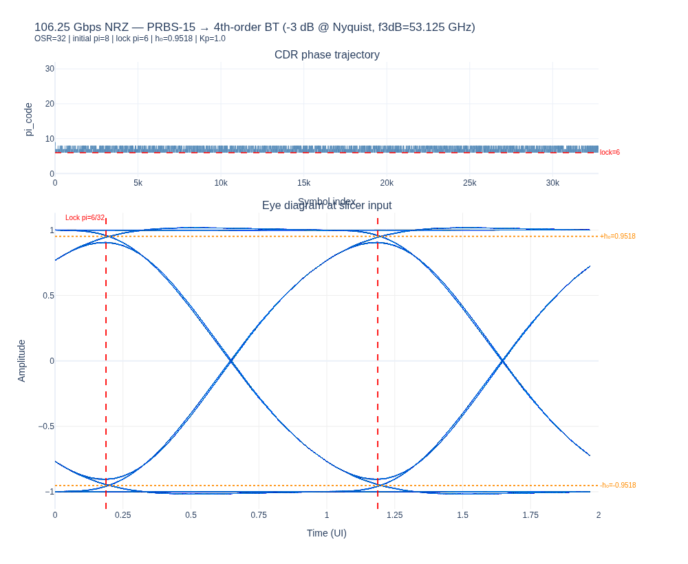
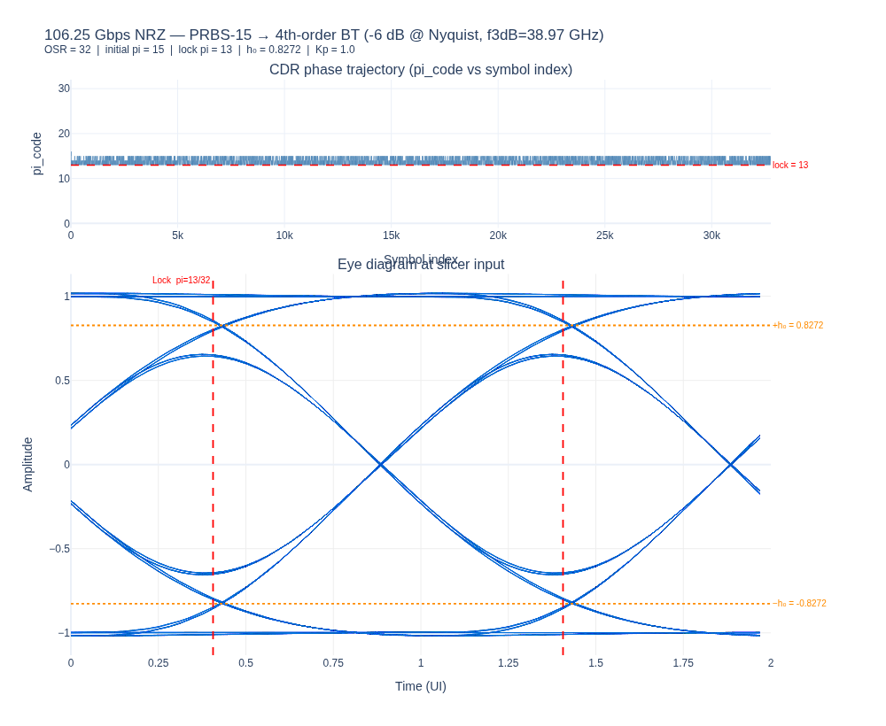

# OCI MSA — Analog Transceiver Development Log

**Author:** Patrick Satarzadeh  
**Project:** 106.25 Gbps NRZ fully-analog receiver (and eventual full transceiver)  
**Repository:** `optical-serdes` — branch `construction`  
**Status:** 🟡 In development

---

## Contents

1. [Motivation](#1-motivation)
2. [Target Specification](#2-target-specification)
3. [Receiver Architecture](#3-receiver-architecture)
4. [Development Log](#4-development-log)
5. [Open Questions](#5-open-questions)
6. [Roadmap](#6-roadmap)

---

## 1. Motivation

Conventional coherent and short-reach SerDes receivers rely on a high-resolution
ADC in the data path, followed by a DSP core running FFE/DFE and digital CDR.  
For cost- and power-constrained OCI MSA applications, a **fully-analog receiver**
offers a lower-power, lower-latency alternative: all timing and level decisions are
made by analog comparators, and the only digital circuitry is the CDR back-end loop
filter and calibration engine.

The architecture explored here targets **106.25 Gbps NRZ** — the OCI MSA line-rate.

---

## 2. Target Specification

| Parameter | Value | Notes |
|-----------|-------|-------|
| Line rate | 106.25 Gbps | NRZ |
| Symbol rate | 106.25 GBaud | |
| UI | ≈ 9.41 ps | |
| Technology | < 7 nm CMOS | Enables fast digital gates in CDR path |
| CDR architecture | Baud-rate bang-bang MM | No edge sampler |
| ADC in data path | None | Fully-analog decision path |
| Phase interpolator resolution | 1/32 UI ≈ 0.29 ps | 32-phase grid |
| Front-end equalization | CTLE (future) | VGA for gain control (future) |
| h₀ calibration | Digital engine | Fixed or adaptive (TBD) |

---

## 3. Receiver Architecture

**Detailed block diagram and signal definitions:**
[diagrams/analog_nrz_rx_106g25.md](diagrams/analog_nrz_rx_106g25.md)

### Summary

```
Analog in
  │
  ├─[CTLE]──[VGA]──[T/H, baud-rate]──────────────────── Data Slicer (0) ──► d[n] ──► DATA OUT
  │                       │                                    │
  │                       ├── Error Slicer (+h₀) ── z_p[n]   │
  │                       └── Error Slicer (−h₀) ── z_m[n]   │
  │                                │                           │
  │                         MUX (sel=d[n])                     │
  │                                │                           │
  │                              z[n] = sign(y[n] − d[n]·h₀) │
  │                                │                           │
  │                         D-latch (1 UI)  ◄──────────────────┘
  │                        d[n-1], z[n-1]
  │                                │
  │                         BB MM-TED
  │                  e[n] = d[n-1]·z[n] − d[n]·z[n-1]
  │                                │
  │                          sign(e[n])  ──►  [Digital CDR Engine]
  │                                               │
  │                            ┌──────────────────┤
  │                         Loop filter         h₀ est.   VGA ctrl
  │                            │
  └──────────────────────── DCO/PI  (32-phase) ──► CK (baud)
```

### Key design decisions

* **No edge sampler.** MM is baud-rate: timing information is extracted from the
  amplitude of consecutive data samples through residual ISI — not from a midpoint
  transition sample.
* **Error slicers at ±h₀, not ±1.** The slicers detect residual ISI relative to
  the cursor amplitude.  `z[n] = sign(y[n] − d[n]·h₀)` strips the cursor term and
  exposes the sign of the postcursor ISI coefficient h₁, which is the timing error
  signal.
* **Digital MUX is safe at < 7 nm.** All slicer outputs are rail-to-rail digital.
  A 2:1 digital MUX costs ~1–2 ps in advanced CMOS — well within the 9.41 ps UI.
* **No analog delay cell.** d[n-1] and z[n-1] are obtained by D-latching the
  slicer outputs at the baud clock — no precision analog delay line.
* **h₀ in digital engine, not analog.** The error slicer threshold is a DAC-driven
  voltage from the CDR back-end.  The CDR also controls VGA gain, so h₀ and the eye
  amplitude track each other.

---

## 4. Development Log

---

### Milestone 1 — 2026-06-08 · Architecture definition + BB MM-CDR lock (ideal channel)

#### What was done

Defined the complete receiver architecture from first principles:

1. Established the bang-bang Mueller-Muller TED formulation:
   - Data slicer: `d[n] = sign(y[n])`
   - Two error slicers: `z_p[n] = sign(y[n] − h₀)`,  `z_m[n] = sign(y[n] + h₀)`
   - MUX: `z[n] = sign(y[n] − d[n]·h₀)`
   - TED: `e[n] = d[n-1]·z[n] − d[n]·z[n-1]`
   - CDR drives on `sign(e[n])` (bang-bang, ∈ {−1, 0, +1})

2. Implemented `AnalogMmCdr` in
   `src/optical_serdes/rx/mm_cdr.py` — a new class alongside the existing
   ADC-based `MuellerMullerCDR`.  Key interface: `step(d_curr, z_curr, state)`
   takes pre-sliced binary inputs; the analog `y[n]` value never enters the CDR
   loop.

3. Ran the first end-to-end simulation:
   - PRBS-15 (32 767 symbols) → 4th-order Bessel-Thomson channel → `AnalogMmCdr`
   - Phase interpolator: `PhaseInterpolator(n_phases=32)` from
     `src/optical_serdes/rx/pi.py`
   - No noise, no CTLE, no VGA — bare minimum to demonstrate lock

#### Results

| Run | BT loss @ Nyquist | f₃dB | h₀ | Initial pi | Lock pi | Lock phase |
|-----|------------------|------|----|-----------|---------|------------|
| A | −3 dB | 53.125 GHz | 0.9518 | 8 | **6** | 0.188 UI / 1.76 ps |
| B | −6 dB | 38.97 GHz  | 0.8272 | 15 | **13** | 0.406 UI / 3.82 ps |

Both runs: **BER = 0** after settling (noiseless channel, < 500 UI acquisition).

Eye diagrams (slicer input, 2 000 overlaid 2-UI windows):

| Run A (−3 dB) | Run B (−6 dB) |
|---|---|
| Wide open eye; lock at ≈ 0.19 UI | Increased ISI spread; lock at ≈ 0.41 UI |
|  |  |

> Figures also in `optical-serdes/runs/analog_rx/`.

#### Key observations

* **CDR needs residual ISI to operate.** The BB MM-TED error signal is
  `sign(d[n-1]·h₁)` — it is zero if the channel has no postcursor ISI (h₁ = 0).
  The BT filter at Nyquist bandwidth deliberately leaves significant h₁, which
  provides the timing discriminant.  A perfectly equalized channel (after full CTLE)
  would blind the TED — CTLE tuning must stop short of zeroing the postcursor.

* **Lock point ≈ single-symbol peak.** The predicted lock phase (from the
  single-symbol BT response peak, `pi_natural`) matched the CDR lock within 1
  PI step in both runs.  This confirms the TED zero-crossing coincides with the
  cursor of the channel impulse response, as expected from MM theory.

* **Acquisition is very fast.** From initial offsets of ¼ UI (run A) and nearly
  ½ UI (run B), the CDR was effectively locked within ~50 UI.  The phase trajectory
  showed clean bang-bang limit-cycling (±1 PI step) from the first few hundred
  symbols.

* **h₀ drops with more bandwidth limiting.** Run B (−6 dB at Nyquist) gives
  h₀ = 0.827 vs. 0.952 in run A.  When CTLE and VGA are added, the VGA will
  restore the eye amplitude to a design target and h₀ will be set accordingly
  by the calibration engine.

#### Simulation code

```
scripts/analog_rx/analog_rx_prbs15_eye.py
src/optical_serdes/rx/mm_cdr.py   → AnalogMmCdr, AnalogMmCdrState
src/optical_serdes/rx/pi.py       → PhaseInterpolator
```

---

## 5. Open Questions

These are the unresolved design questions that will drive the next development phases.

### CDR & TED

| # | Question | Impact | Status |
|---|---------|--------|--------|
| Q1 | What is the CDR bandwidth and jitter peaking for the bang-bang loop? | Jitter tolerance, limit-cycle amplitude | Not yet measured |
| Q2 | Is a proportional-only (first-order) loop sufficient, or do we need frequency acquisition (integral path)? | Lock range, ppm tolerance | Open |
| Q3 | How sensitive is the lock point to errors in h₀? | Error slicer miscalibration → phase offset | Open |
| Q4 | Does the TED remain well-conditioned after CTLE equalizes most of the channel? | TED gain reduction, possible loss of lock | Open |

### h₀ calibration

| # | Question | Impact | Status |
|---|---------|--------|--------|
| Q5 | What algorithm estimates h₀ without ADC access to `y[n]`? | The LMS formula `d[n]·y[n]` is unavailable in all-slicer path | Open |
| Q6 | Peak detector on the eye opening vs. fixed calibration on known pilot sequence? | Convergence time, accuracy | Open |

### Analog front-end

| # | Question | Impact | Status |
|---|---------|--------|--------|
| Q7 | What CTLE topology and peaking target for the OCI MSA channel? | ISI structure, h₀ level, TED gain | Open |
| Q8 | Half-rate (53.125 GHz × 2) or full-rate (106.25 GHz) clocking? | T/H bandwidth, VCO design | Open |
| Q9 | How is the VGA gain controlled to keep the eye amplitude ≈ h₀_target? | Error slicer accuracy | Open |

---

## 6. Roadmap

### Phase 1 — Ideal simulation ✅ (Milestone 1)
- [x] Define BB MM-TED architecture (two error slicers, digital MUX)
- [x] Implement `AnalogMmCdr` class
- [x] Demonstrate lock on PRBS-15 through BT channel (no noise, no CTLE)
- [x] Validate lock point = single-symbol peak of channel response

### Phase 2 — Loop characterisation
- [ ] Sweep initial phase offset: verify lock-in range
- [ ] Measure CDR bandwidth and jitter transfer / jitter tolerance (sinusoidal jitter injection)
- [ ] Characterise limit-cycle jitter amplitude vs. Kp
- [ ] Add integral path (Ki) and verify frequency acquisition range

### Phase 3 — Channel realism
- [ ] Add AWGN — measure BER vs. SNR floor with analytic MM-CDR
- [ ] Add CTLE (1z2p or 1z3p) — verify TED does not lose discriminant after equalization
- [ ] Confirm h₀ tracking still accurate after CTLE reshapes eye

### Phase 4 — h₀ calibration
- [ ] Implement pilot-sequence-based h₀ estimator (periodic known pattern)
- [ ] Evaluate peak detector approach
- [ ] Close the loop: h₀ estimate → error slicer → CDR → h₀ estimate

### Phase 5 — Full analog front-end integration
- [ ] Integrate VGA model (gain controlled from digital engine)
- [ ] CTLE + VGA + BB MM-CDR end-to-end
- [ ] Verify BER vs. channel loss sweep

### Phase 6 — Transmitter (future)
- [ ] TX driver model
- [ ] TX FIR pre-emphasis (2-tap minimum)
- [ ] Combined TX + channel + analog RX link simulation

---

*This document is updated at each development milestone.
Detailed architecture reference: [diagrams/analog_nrz_rx_106g25.md](diagrams/analog_nrz_rx_106g25.md)*
