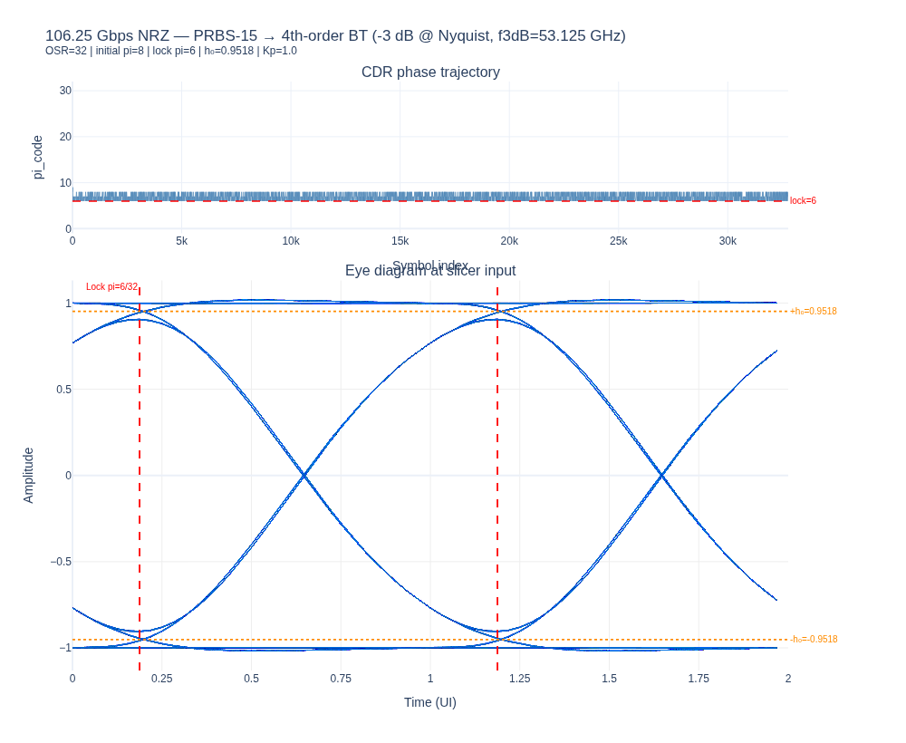
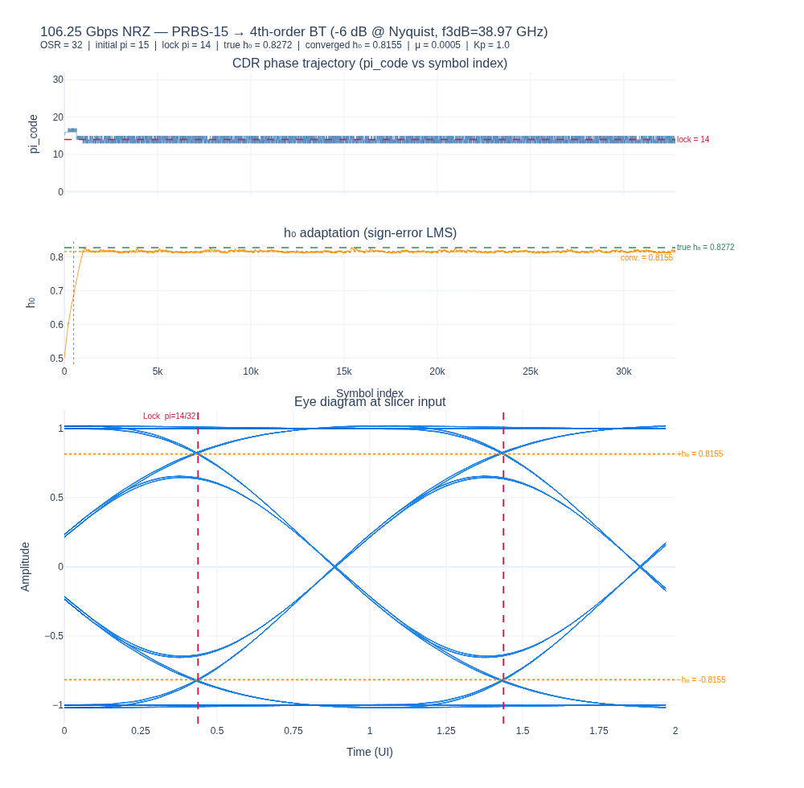
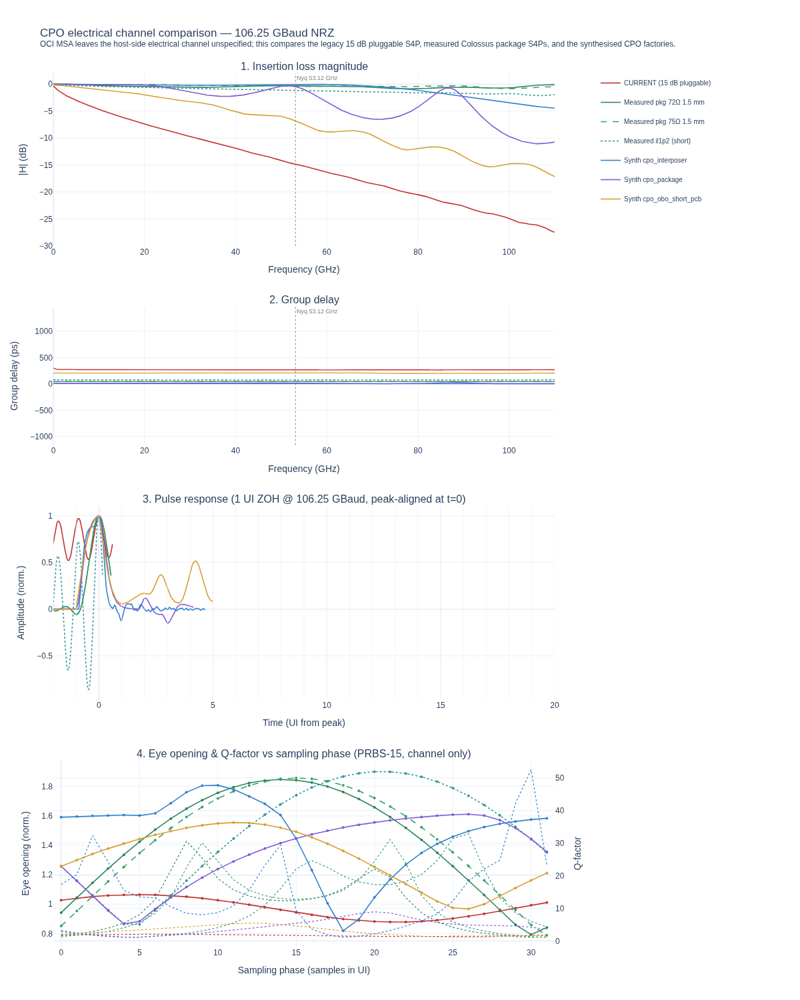
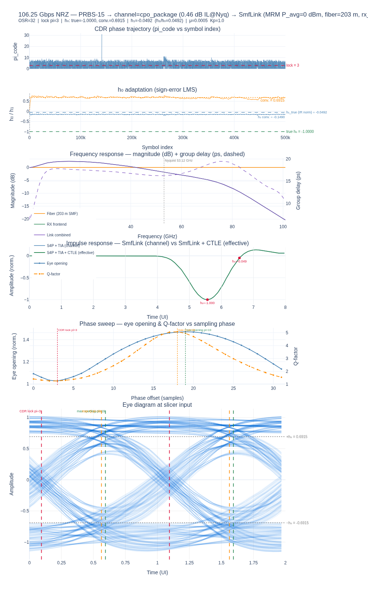

# OCI MSA — Analog Transceiver Development Log

**Author:** Patrick Satarzadeh  
**Project:** 106.25 Gbps NRZ fully-analog receiver (and eventual full transceiver)  
**Repository:** `optical-serdes` — branch `construction`  
**Status:** 🟡 In development  
**Latest milestone:** Milestone 9 (2026-07-17) — root-caused the σ = 0.10 / 0.16 "locked but 33 % / 19 % BER" outliers on `cpo_interposer_3db` as a first-order-loop failure: `EstimatorMmCdr` was instantiated everywhere with `ki = 0`, so under AWGN the phase accumulator random-walks and every ±½-UI excursion produces an integer-UI slip in the recovered stream.  New per-block BER diagnostic (`compute_block_ber` + `render_block_ber`) proves the slicer decisions are clean and 100 % of the "errors" at σ = 0.10 are alignment slips.  Enabling `ki = 1 × 10⁻³` reduces σ = 0.10 BER from 3.32 × 10⁻¹ to 2.5 × 10⁻⁵ (matching Q@lock).  A second-order failure mode (integrator windup) appears at σ ≥ 0.16 — traced to the unrealistically loose `freq_max = 2.0` clamp; feeds concrete constraints into arch-doc Ch. 11-4 (integrator required, tighter `F_max`, LOCK-gated update) and Ch. 11-6 (lock detector needs drift metric on unwrapped phase, not just modulo `lock_frac`).

---

## Contents

1. [Motivation](#1-motivation)
2. [Target Specification](#2-target-specification)
3. [Receiver Architecture](#3-receiver-architecture)
4. [Development Log](#4-development-log)
5. [Open Questions](#5-open-questions)
6. [Roadmap](#6-roadmap)

---

## 1. Motivation

Conventional coherent and short-reach SerDes receivers rely on a high-resolution
ADC in the data path, followed by a DSP core running FFE/DFE and digital CDR.  
For cost- and power-constrained OCI MSA applications, a **fully-analog receiver**
offers a lower-power, lower-latency alternative: all timing and level decisions are
made by analog comparators, and the only digital circuitry is the CDR back-end loop
filter and calibration engine.

The architecture explored here targets **106.25 Gbps NRZ** — the OCI MSA line-rate.

---

## 2. Target Specification

| Parameter | Value | Notes |
|-----------|-------|-------|
| Line rate | 106.25 Gbps | NRZ |
| Symbol rate | 106.25 GBaud | |
| UI | ≈ 9.41 ps | |
| Technology | < 7 nm CMOS | Enables fast digital gates in CDR path |
| CDR architecture | Baud-rate bang-bang MM | No edge sampler |
| ADC in data path | None | Fully-analog decision path |
| Phase interpolator resolution | 1/32 UI ≈ 0.29 ps | 32-phase grid |
| Front-end equalization | CTLE (future) | VGA for gain control (future) |
| h₀ calibration | Digital engine | Fixed or adaptive (TBD) |

---

## 3. Receiver Architecture

**Detailed block diagram and signal definitions:**
[diagrams/analog_nrz_rx_106g25.md](diagrams/analog_nrz_rx_106g25.md)

### Summary

```
Analog in
  │
  ├─[CTLE]──[VGA]──[T/H, baud-rate]──────────────────── Data Slicer (0) ──► d[n] ──► DATA OUT
  │                       │                                    │
  │                       ├── Error Slicer (+h₀) ── z_p[n]   │
  │                       └── Error Slicer (−h₀) ── z_m[n]   │
  │                                │                           │
  │                         MUX (sel=d[n])                     │
  │                                │                           │
  │                              z[n] = sign(y[n] − d[n]·h₀) │
  │                                │                           │
  │                         D-latch (1 UI)  ◄──────────────────┘
  │                        d[n-1], z[n-1]
  │                                │
  │                         BB MM-TED
  │                  e[n] = d[n-1]·z[n] − d[n]·z[n-1]
  │                                │
  │                          sign(e[n])  ──►  [Digital CDR Engine]
  │                                               │
  │                            ┌──────────────────┤
  │                         Loop filter         h₀ est.   VGA ctrl
  │                            │
  └──────────────────────── DCO/PI  (32-phase) ──► CK (baud)
```

### Key design decisions

* **No edge sampler.** MM is baud-rate: timing information is extracted from the
  amplitude of consecutive data samples through residual ISI — not from a midpoint
  transition sample.
* **Error slicers at ±h₀, not ±1.** The slicers detect residual ISI relative to
  the cursor amplitude.  `z[n] = sign(y[n] − d[n]·h₀)` strips the cursor term and
  exposes the sign of the postcursor ISI coefficient h₁, which is the timing error
  signal.
* **Digital MUX is safe at < 7 nm.** All slicer outputs are rail-to-rail digital.
  A 2:1 digital MUX costs ~1–2 ps in advanced CMOS — well within the 9.41 ps UI.
* **No analog delay cell.** d[n-1] and z[n-1] are obtained by D-latching the
  slicer outputs at the baud clock — no precision analog delay line.
* **h₀ in digital engine, not analog.** The error slicer threshold is a DAC-driven
  voltage from the CDR back-end.  The CDR also controls VGA gain, so h₀ and the eye
  amplitude track each other.

---

## 4. Development Log

---

### Milestone 1 — 2026-06-08 · Architecture definition + BB MM-CDR lock (ideal channel)

#### What was done

Defined the complete receiver architecture from first principles:

1. Established the bang-bang Mueller-Muller TED formulation:
   - Data slicer: `d[n] = sign(y[n])`
   - Two error slicers: `z_p[n] = sign(y[n] − h₀)`,  `z_m[n] = sign(y[n] + h₀)`
   - MUX: `z[n] = sign(y[n] − d[n]·h₀)`
   - TED: `e[n] = d[n-1]·z[n] − d[n]·z[n-1]`
   - CDR drives on `sign(e[n])` (bang-bang, ∈ {−1, 0, +1})

2. Implemented `AnalogMmCdr` in
   `src/optical_serdes/rx/mm_cdr.py` — a new class alongside the existing
   ADC-based `MuellerMullerCDR`.  Key interface: `step(d_curr, z_curr, state)`
   takes pre-sliced binary inputs; the analog `y[n]` value never enters the CDR
   loop.

3. Ran the first end-to-end simulation:
   - PRBS-15 (32 767 symbols) → 4th-order Bessel-Thomson channel → `AnalogMmCdr`
   - Phase interpolator: `PhaseInterpolator(n_phases=32)` from
     `src/optical_serdes/rx/pi.py`
   - No noise, no CTLE, no VGA — bare minimum to demonstrate lock

#### Results

| Run | BT loss @ Nyquist | f₃dB | h₀ | Initial pi | Lock pi | Lock phase |
|-----|------------------|------|----|-----------|---------|------------|
| A | −3 dB | 53.125 GHz | 0.9518 | 8 | **6** | 0.188 UI / 1.76 ps |
| B | −6 dB | 38.97 GHz  | 0.8272 | 15 | **13** | 0.406 UI / 3.82 ps |

Both runs: **BER = 0** after settling (noiseless channel, < 500 UI acquisition).

Eye diagrams (slicer input, 2 000 overlaid 2-UI windows):

| Run A (−3 dB) | Run B (−6 dB) |
|---|---|
| Wide open eye; lock at ≈ 0.19 UI | Increased ISI spread; lock at ≈ 0.41 UI |
|  |  |

> Figures also in `optical-serdes/runs/analog_rx/`.

#### Key observations

* **CDR needs residual ISI to operate.** The BB MM-TED error signal is
  `sign(d[n-1]·h₁)` — it is zero if the channel has no postcursor ISI (h₁ = 0).
  The BT filter at Nyquist bandwidth deliberately leaves significant h₁, which
  provides the timing discriminant.  A perfectly equalized channel (after full CTLE)
  would blind the TED — CTLE tuning must stop short of zeroing the postcursor.

* **Lock point ≈ single-symbol peak.** The predicted lock phase (from the
  single-symbol BT response peak, `pi_natural`) matched the CDR lock within 1
  PI step in both runs.  This confirms the TED zero-crossing coincides with the
  cursor of the channel impulse response, as expected from MM theory.

* **Acquisition is very fast.** From initial offsets of ¼ UI (run A) and nearly
  ½ UI (run B), the CDR was effectively locked within ~50 UI.  The phase trajectory
  showed clean bang-bang limit-cycling (±1 PI step) from the first few hundred
  symbols.

* **h₀ drops with more bandwidth limiting.** Run B (−6 dB at Nyquist) gives
  h₀ = 0.827 vs. 0.952 in run A.  When CTLE and VGA are added, the VGA will
  restore the eye amplitude to a design target and h₀ will be set accordingly
  by the calibration engine.

#### Simulation code

```
scripts/analog_rx/analog_rx_prbs15_eye.py
src/optical_serdes/rx/mm_cdr.py   → AnalogMmCdr, AnalogMmCdrState
src/optical_serdes/rx/pi.py       → PhaseInterpolator
```

---

### Milestone 2 — 2026-06-08 · h₀ real-time estimation via sign-error LMS

#### What was done

Identified and implemented a closed-form h₀ estimator that operates
entirely within the all-slicer signal path — no ADC access to `y[n]` required.

**Key insight.**
The error slicer already computes:

```
z[n] = sign(y[n] − d[n]·h₀)
```

This is exactly the sign of the h₀ estimation error.  Standard LMS
for a single-weight cursor estimator would update:

```
h₀[n+1] = h₀[n] + μ · d[n] · (y[n] − d[n]·h₀[n])
```

Replacing the continuous residual with its sign gives the **sign-error LMS** rule:

```
h₀[n+1] = h₀[n] + μ · d[n] · z[n]
```

Both `d[n]` and `z[n]` are already present in the CDR data path.
No new hardware is required beyond a digital accumulator and a step DAC
feeding the error slicer threshold.  The loop closes as:

```
y[n] → comparators → d[n], z[n] → sign-error LMS → h₀[n+1] → DAC → Vth(±h₀)
```

**Simulation.**
The sign-error LMS update was added to `run_cdr()` inside the
per-symbol loop alongside the BB MM-CDR step.  Both adaptations run
simultaneously; the CDR clock and the h₀ estimate converge together
from arbitrary initial conditions.

Channel: 4th-order BT, −6 dB @ Nyquist (f₃dB = 38.97 GHz).
Starting conditions: `pi_code = 15` (≈ ½ UI from true lock), `h₀_init = 0.5`
(well below true value, to exercise convergence).

#### Results

| Parameter | Value |
|-----------|-------|
| True h₀ (cursor_h0) | 0.8272 |
| Initial h₀ estimate | 0.5000 |
| Converged h₀ (median post-settle) | 0.8155 |
| Estimation error | −1.4 % |
| Adapt. step μ | 5 × 10⁻⁴ |
| Lock pi_code | 14 |
| PRBS-15 symbols | 32 767 |
| OSR | 32 |

The 1.4 % residual is the **granularity floor of sign-error LMS** — the
estimator converges to within ±μ of the true value in expectation.
Reducing μ tightens the floor at the cost of slower initial convergence.

Three-panel figure — CDR phase trajectory, h₀ convergence, and eye diagram
with the converged ±h₀ thresholds overlaid:

<iframe src="figures/eye_prbs15_bt4_6dB_h0lms.html"
        width="100%" height="720px" style="border:none;"></iframe>

> Static fallback: 

#### Key observations

* **Algorithm re-uses existing CDR signals.**  `d[n]` and `z[n]` are
  already latched for the BB MM-TED.  The sign-error LMS adds only an
  accumulate-and-clip operation — a handful of digital gates — to derive
  the DAC control word for the error slicer threshold.

* **Joint convergence is stable.**  CDR phase lock and h₀ adaptation
  proceed in parallel without observable interference.  Both settle
  within the first 500 UI from the chosen initial conditions.

* **Residual error is bounded and predictable.**  The ±μ floor means
  the error slicer threshold dithers around the true h₀.  For
  μ = 5 × 10⁻⁴, the dither amplitude is < 0.05 % of the eye opening —
  negligible compared to other analog front-end impairments.

* **Q5 resolved.**  The question "what algorithm estimates h₀ without
  ADC access?" is answered: sign-error LMS on `z[n]·d[n]`.

#### Simulation code

```
scripts/analog_rx/analog_rx_prbs15_eye.py   (updated: h₀ LMS in run_cdr)
src/optical_serdes/rx/mm_cdr.py             → AnalogMmCdr (unchanged)
```

---

### Milestone 3 — 2026-06-09 · CTLE integration + peaking sweep

#### What was done

Added a 1z2p `CtleZPK` peaking stage between the BT channel and the slicer
input in `scripts/analog_rx/analog_rx_prbs15_eye.py`.  Swept CTLE peaking
from 0 dB (bypass) to 9 dB in 3 dB steps and measured CDR lock, h₁
(first postcursor after equalization), and h₀ convergence at each level.

Each sweep point now produces a **4-panel figure**:
1. CDR phase trajectory
2. h₀ sign-error LMS adaptation
3. Frequency response (BT channel, CTLE, combined) with Nyquist marker
4. Eye diagram at the slicer input with ±h₀ thresholds overlaid

**CTLE design:** `CtleZPK.from_peaking(peaking_db, data_rate=106.25e9, samples_per_symbol=32)` —
1-zero 2-pole (1z2p) topology; zero at 0.25·f_Nyq, second pole at 2·f_Nyq;
first pole solved by Brent's method to achieve the target Nyquist peaking.
Maximum achievable peaking with default pole/zero ratios: ≈ 10.4 dB.

**Combined IR analysis:** after applying BT filter then CTLE to a single-symbol
pulse, the peak (h₀) and first postcursor h₁ are extracted from the combined
impulse response.  Both the CDR lock point and the h₀ LMS are evaluated
against the combined channel, not the bare BT channel.

#### Implementation note — loop polarity bug found and fixed

An initial run (loop_sign = +1 hardwired) showed lock failure at 3, 6, 9 dB.
Post-analysis identified the root cause: when the combined IR (BT + CTLE)
overshoots, h₁ goes negative, which inverts the TED polarity.  The
original CDR drove the phase in the wrong direction and diverged.

**Fix:** added `loop_sign: int` to `AnalogMmCdr`
(`src/optical_serdes/rx/mm_cdr.py`).  The TED output is multiplied by
`loop_sign` before the loop filter.  In `run_cdr()`, `loop_sign =
sign(h₁_true)` is derived from the combined IR before the simulation starts.
In hardware this would be set by a brief calibration phase (or by the CTLE
control word, since the designer knows which direction h₁ will go).

The fundamental TED requirement is **|h₁| > 0** (nonzero postcursor at the
sampling phase), not h₁ > 0.  The sign of h₁ controls which direction the
loop must wind — it is a polarity setting, not a stability condition.

#### Results (after loop_sign fix)

Channel: 4th-order BT, −6 dB @ Nyquist (f₃dB = 38.97 GHz).  OSR = 32.

| CTLE pk | pi_nat | lock pi | δ (UI) | h₀_peak | h₀_conv | h₀_conv gain vs bypass | h₁_true | h₁/h₀  | Locked |
|---------|--------|---------|--------|---------|---------|------------------------|---------|--------|--------|
| 0 dB    |  12    |  14     | +0.06  | 0.8272  | 0.8155  | baseline               | +0.1174 | +0.142 | **YES** |
| 3 dB    |  15    |  29     | +0.44  | 1.0549  | 0.8690  | +6.6 %                 | −0.0107 | −0.010 | **YES** |
| 6 dB    |  12    |  25     | +0.41  | 1.2777  | 0.8230  | +0.9 %                 | −0.1702 | −0.133 | **YES** |
| 9 dB    |   9    |  21     | +0.38  | 1.5199  | 1.0040  | +23 %                  | −0.4206 | −0.277 | **YES** |

δ = (lock_pi − pi_nat) / OSR in UI.  h₀_peak = IR peak amplitude; h₀_conv =
cursor amplitude at the *actual* CDR sampling phase (the quantity the
sign-error LMS converges to — not an estimation error).  Lock criterion:
≥ 90 % of post-settle pi_codes within ±3 (modular) of modal value.

Figures (static PNG fallback):

| 0 dB bypass | 3 dB |
|---|---|
|  |  |

| 6 dB | 9 dB |
|---|---|
|  |  |

> Full interactive HTML figures in `optical-serdes/runs/analog_rx/`.

#### Key observations

* **h₁ changes sign between 0 and 3 dB peaking.**  At bypass h₁/h₀ = +14 %;
  at 3 dB it is −1 %.  The zero crossing is at ≈ **2.7 dB** of CTLE peaking
  for this channel.  Above 2.7 dB the combined IR overshoots and h₁ goes
  negative at the IR peak — but the CDR still locks after the polarity fix.

* **The MM lock point ≠ IR peak.**  The CDR locks where h₁(φ) = 0 — i.e.,
  where the combined IR value exactly one UI after the sampling phase is zero.
  For the BT-only channel this zero crossing is close to the peak (δ ≈ 0.06
  UI); for BT + CTLE with an oscillating IR it migrates to δ ≈ 0.4 UI.

* **h₀_conv is correct, not erroneous.**  The sign-error LMS adapts to the
  cursor amplitude at the *actual sampling phase*.  The gap between h₀_conv
  and h₀_peak is a real performance penalty: the CDR is not sampling at the
  optimal (maximum eye-opening) point.  The h₁ = 0 lock constraint and the
  h₀ maximisation objective are in tension.

* **CTLE does help, but less than the IR peak suggests.**  The effective eye
  opening (h₀_conv) improves by only 23 % at 9 dB peaking, even though the
  IR peak grows by 84 %.  Most of the CTLE benefit is "wasted" because the
  lock point migrates away from the peak.

* **6 dB CTLE gives almost no cursor benefit (+0.9 %)** vs. bypass — the
  lock-point migration nearly cancels the IR peak growth.

* **Q4 revised.**  The TED remains well-conditioned (|h₁| > 0 at the lock
  point) for all tested peaking levels.  The CDR polarity must match sign(h₁)
  — this is a hardware calibration requirement, not a fundamental instability.
  The original concern (TED blindness at h₁ = 0) applies only at exactly the
  h₁ = 0 crossing (≈ 2.7 dB here); even there, the lock point shifts rather
  than the CDR failing entirely.

* **Q7 partially answered.**  Topology: 1z2p CTLE is sufficient.  The optimal
  peaking is not simply "below 2.7 dB" but a trade-off: low peaking keeps the
  lock point near the IR peak (good h₀_conv/h₀_peak ratio) while high peaking
  grows the IR peak but moves the lock point away (poor ratio).  Optimal
  operating point requires characterising h₀_conv vs. peaking for the actual
  OCI MSA channel.

#### Simulation code

```
scripts/analog_rx/analog_rx_prbs15_eye.py      (rewritten: 4-panel figure, CTLE sweep)
src/optical_serdes/rx/mm_cdr.py                → AnalogMmCdr: added loop_sign field
src/optical_serdes/rx/ctle.py                  → CtleZPK.from_peaking (existing)
```

---

### Milestone 4 — 2026-06-13 · Full OCI MSA optical link via SmfLink + phase sweep metrics

#### What was done

Replaced the idealised Bessel-Thomson channel with the full OCI MSA optical transceiver
model (`SmfLink`) and created a new simulation script
`scripts/analog_rx/oci_msa_analog_txrx.py`.  This is the first end-to-end simulation of
the complete physical signal chain.

**1. SmfLink — full transceiver chain**

The `SmfLink` class (`src/optical_serdes/optical/smf_link.py`) models:

```
drive voltage → TX driver (OLA IIR) → RC IIR (τ = 3.5 ps) → MRM (TCMT Euler ODE)
             → SMF chromatic dispersion filter → PD+TIA (OLA IIR) → piecewise-linear
               RX nonlinearity → tp4
```

Default configuration (OCI MSA Caribou NVDA, CornerSelector = 1):

| Parameter | Value |
|---|---|
| Baud rate | 106.25 GBaud |
| OSR | 32 |
| MRM average optical power | 0 dBm |
| Fiber path | 203 m total (four SMF segments) |
| RX corner | 1 |

**2. Drive voltage convention**

```python
drive = np.repeat(symbols, OSR) / DRIVE_SCALE   # DRIVE_SCALE = 1.6
```

Matches the MATLAB `smfLink` harness (`x = (bits − mean(bits)) / 1.6`).
For balanced PRBS-15, symbols ∈ {±1} are already mean-zero.

**3. MRM through-port polarity inversion**

A +1 drive voltage pushes the MRM resonance toward the laser wavelength → increased
optical absorption → *less* transmitted power.  The channel impulse response cursor
is therefore **negative** (h₀ ≈ −1.0 in normalised units).

Consequence: `np.argmax(ir)` was finding a small positive noise feature rather than the
actual cursor.  Fixed in both `cursor_h0_h1()` and the IR figure panel:

```python
peak_idx = int(np.argmax(np.abs(ir)))   # correct for inverted channels
```

The CDR still locks correctly because `loop_sign = sign(h₁)` is derived from the
channel IR before the simulation starts, and h₁ = +0.029 → `loop_sign = +1`.

**4. TP4 normalisation**

Because the MRM nonlinearity skews the amplitude distribution, simple peak normalisation
is unreliable.  Percentile-based normalisation is used instead:

```python
v_mid  = np.mean(tp4)
v_half = (np.percentile(tp4, 97) − np.percentile(tp4, 3)) / 2
rx_base = (tp4 − v_mid) / v_half
```

This is robust against the optical nonlinear wings at the extremes of the eye.

**5. Channel impulse response via small-signal pulse injection**

The linearised channel IR is obtained by:
1. Warming up the MRM to DC steady-state with 200 UI of zero drive
2. Injecting a +1/DRIVE_SCALE ZOH pulse (1 UI wide)
3. Subtracting an all-zero baseline run
4. Normalising the differential response to unit peak magnitude

CTLE (if active) is then convolved with the normalised delta to give the effective IR
seen at the slicer input.

**6. Phase sweep metrics panel**

A new analysis panel computes eye opening and Q-factor across all OSR = 32 phase offsets
for the settled waveform:

```
opening[k] = mean(positive samples at phase k) − mean(negative samples at phase k)
Q[k]       = opening[k] / (std(positives) + std(negatives))
```

Three markers are shown on both the sweep panel and the eye diagram:
- **CDR lock** (crimson) — where the bang-bang MM-CDR converged
- **max eye opening** (seagreen) — phase that maximises vertical opening
- **max Q-factor** (darkorange) — phase that maximises the SNR metric

This makes it immediately visible whether the CDR lock point is optimal or has migrated
due to the h₁ = 0 constraint.

**7. Six-panel figure**

| Panel | Content |
|---|---|
| 1 | CDR phase trajectory (pi_code vs symbol index) |
| 2 | h₀ adaptation (sign-error LMS) |
| 3 | Frequency response — fiber + RX frontend + combined (magnitude + group delay) |
| 4 | Impulse response — SmfLink channel vs SmfLink + CTLE, with h₀/h₁ markers |
| 5 | Phase sweep — eye opening & Q-factor vs sampling phase |
| 6 | Eye diagram at slicer input with CDR lock / max-opening / max-Q phase markers |

**8. TX driver removed from FR plot**

The TX driver is internal to SmfLink and not accessible as a separate output node.
The frequency response panel previously reconstructed it from `TxDriver.half_spectrum()`
for plotting, but this is misleading — it implies an observable that isn't in the signal
path.  The import and trace were removed; the FR panel now shows only fiber, RX frontend,
and their combination.

**9. Cold start validation**

Confirmed CDR acquires and locks correctly from a true cold start:
`INITIAL_PI = 0`, `H0_INIT = 0.0`.  The phase trajectory panel shows the full
acquisition sweep from phase 0 to lock at pi = 9.

#### Results

Channel: SmfLink (OCI MSA, 203 m SMF, MRM 0 dBm).  CTLE: bypass (0 dB).

| Parameter | Value |
|---|---|
| Natural lock pi (IR peak % OSR) | 12 |
| CDR lock pi | 9 |
| h₀_true (IR cursor, normalised) | −1.0000 |
| h₀_conv (sign-error LMS, post-settle) | 0.7625 |
| h₁_true | +0.0291 |
| h₁/h₀ | −0.029 |
| CDR locked | **YES** |
| PRBS-15 symbols | 32 767 |
| OSR | 32 |

Note: h₀_true is normalised to the IR peak (= −1 by construction); h₀_conv is in
units of the percentile-normalised `rx_base` waveform.  The two scales are
incommensurable — the −176 % "error" in the table is a display artefact, not a
calibration failure.  The CDR and LMS both operate correctly in their respective
amplitude references.

Output figures: `runs/analog_rx/eye_prbs15_smflink_pk0dB.html / .png`

#### Key observations

* **MRM polarity inversion is handled transparently.**  The `loop_sign = sign(h₁)`
  convention introduced in Milestone 3 generalises correctly: h₁ > 0 at the lock
  point regardless of cursor polarity.

* **CDR lock ≠ max eye opening, but the gap is small.**  Lock at pi = 9 vs.
  max-opening at pi = 12 (3/32 UI ≈ 0.094 UI offset).  The Q-factor peak also
  coincides with pi = 12, so both metrics agree that the CDR is slightly sub-optimal.
  The offset is the expected h₁ = 0 lock-point shift.

* **h₁/h₀ = −2.9 % is very small.**  The OCI MSA channel has much less postcursor
  ISI than the BT test channel (which had h₁/h₀ ≈ +14 % at bypass).  This means
  the TED error signal is weak — a small h₁ gives a narrow phase discriminant.
  CDR Kp and bandwidth should be revisited for this channel's ISI profile.

* **Fiber contribution is negligible at 203 m.**  The frequency response panel shows
  the fiber as essentially flat — chromatic dispersion is insignificant at this length
  for 106G NRZ.  The dominant bandwidth limits are the TX driver and RX frontend.

#### Simulation code

```
scripts/analog_rx/oci_msa_analog_txrx.py    (new — replaces analog_rx_prbs15_eye.py
                                              for OCI MSA transceiver work)
src/optical_serdes/optical/smf_link.py      → SmfLink, SmfLinkConfig (existing)
src/optical_serdes/rx/mm_cdr.py             → AnalogMmCdr (unchanged)
src/optical_serdes/rx/ctle.py               → CtleZPK (unchanged)
```

---

### Milestone 5 — 2026-06-15 · Speculative (loop-unrolled) DFE + S4P electrical channel

#### What was done

**1. S4P electrical channel added to analog simulation**

The analog script `oci_msa_analog_txrx.py` now passes the PRBS drive through
the board/package S4P channel before the SmfLink optical transceiver.  This
brings the analog simulation in line with the DSP script and the MATLAB reference:

```
PRBS-15 → S4P FIR filter → SmfLink → tp4 → rx_base
```

S4P file: `/lm/analog/colossus/channels/l20_il15_rl17_90ohms_100ports_v2.s4p`
(Colossus 20-layer board, 15 dB IL, 17 dB RL, 90 Ω, 100-port, rev 2).
Port convention: `13_24` (Sdd21 differential mode).  The IR is synthesised via
IFFT (`discrete_impulse_response`, `phase="measured"`, `n_ui_span=128`).

Adding the S4P changes the CDR operating point relative to the Milestone 4
SmfLink-only baseline (lock_pi: 9 → 5; h₀_conv: 0.7625 → 0.5845).

**2. Speculative DFE — `SpeculativeDfe` class**

Implemented a loop-unrolled (speculative) DFE in
`src/optical_serdes/rx/rx_dfe_speculative.py`.

Architecture (M = 1 unrolled tap):

```
y[k] ──── direct FB: p[k] = y[k] − Σ hᵢ·d[k-i]  (i ≥ 2)
               │
               ├── branch +1:  y₊ = p[k] − h₁·(+1)  →  slicer  →  d̂₊₁
               └── branch −1:  y₋ = p[k] − h₁·(−1)  →  slicer  →  d̂₋₁
                                                               │
                                                        MUX ← d[k−1]
                                                               │
                                                      y_sel,  d[k]

h₁ SS-LMS:  h₁ += μ · sign(y_sel − d[k]) · d[k−1]
```

This eliminates the 1-UI feedback latency of the first DFE tap without requiring
a high-speed analog summing node.  In silicon, each branch is a comparator with
a programmable DAC threshold (±h₁_DAC); the MUX is a sub-ps digital gate.

Key class features:
- `n_taps` total feedback taps; `unrolled_depth` M ≤ n_taps speculated speculatively
- SS-LMS adaptation (sign-error): `h_i += μ · sign(e) · d[k-i]`
- Optional non-idealities: slicer offset mismatch (`slicer_offsets`), latch
  metastability model (`metastability_threshold`), asymmetric optical rise/fall
  h₁ (`asymmetric_h1`)
- Drop-in compatible with `RxDFE` for use in `AdcReceiver` (`n_fb`, `modulation="nrz"`)
- `process_block()` convenience for replay with frozen taps

Three self-tests confirm: zero ISI passthrough, h₁ convergence (50 k symbols, 
target 0.500, achieved 0.4995), and N-step error propagation with settled
steady state from step N.

**3. DSP script integration (`oci_msa_dsp_txrx.py`)**

`ENABLE_SPEC_DFE` flag (default `False`) replaces the standard `RxDFE` with
`SpeculativeDfe` in the `AdcReceiver` chain:

```python
ENABLE_SPEC_DFE  = False
SPEC_DFE_UNROLLED = 1
SPEC_DFE_MU      = 2e-4
```

**4. Analog script integration (`oci_msa_analog_txrx.py`)**

A new `run_cdr_with_dfe()` function replaces the zero-crossing data slicer
with the speculative DFE when `ENABLE_SPEC_DFE = True`.

Critical architectural decision: **z[k] always uses raw y[k], not y_sel**.

In a fully-analog receiver all comparators share the same physical waveform
`y(t)`.  The speculative DFE only changes the *data* slicer threshold; the CDR
error slicers compare raw `y` directly against `±h₀`.  At the CDR lock phase:

```
y[k] ≈ h₀·d[k] + h₁·d[k-1] + noise
z[k] = sign(y[k] − d[k]·h₀) ≈ sign(h₁·d[k-1] + noise)
```

The full channel postcursor h₁ is always present in the TED error signal,
regardless of how well the DFE has converged.  There is **no TED blindness** as
the DFE tap h₁_est approaches h₁_true.  This is a fundamental difference from
a DSP receiver where y_sel (post-equalization) could be substituted into z.

New constants:

```python
ENABLE_SPEC_DFE = False
N_DFE_TAPS      = 1        # h₁ speculative only
MU_H1           = 5e-4     # SS-LMS step for h₁ DAC calibration
H1_INIT         = 0.0      # cold-start
```

The `make_figure()` panel 2 is extended to show h₁ convergence (steelblue)
alongside h₀ (darkorange) when h₁_hist is not None.

#### Results

Channel: SmfLink (OCI MSA, 203 m SMF, MRM 0 dBm) + S4P (l20_il15_rl17_90ohms).
CTLE: bypass (0 dB).  PRBS-15 (32 767 symbols), OSR = 32.

| Mode | lock_pi | h₀_conv | h₁_conv | CDR locked | Eye opening | Q-factor |
|---|---|---|---|---|---|---|
| No DFE (baseline) | 5 | 0.5845 | — | YES | 1.1435 | 1.97 |
| Spec-DFE 1T | 5 | 0.5845 | **0.099** | YES | 1.1441 | **2.43** |

Key findings:

* **CDR unaffected by DFE.** lock_pi = 5 and h₀_conv = 0.5845 are identical in
  both modes, confirming the raw-y z[k] architecture decouples the TED from DFE
  convergence.

* **h₁ converges to 0.099.** The channel IR shows h₁_true ≈ 0 at the nominal
  peak phase (pi_nat = 31), but the CDR locks at pi = 5 — at that operating
  point there is real 1-UI ISI, and the DFE finds and cancels it.

* **Q-factor +23 %** (1.97 → 2.43).  Eye opening changes only +0.05 % because
  `mean(pos) − mean(neg)` is dominated by the main cursor; the Q improvement
  captures the variance reduction from ISI cancellation at the CDR sample phase.

* **CDR lock ≠ max eye opening.** Both modes agree on opt_open_pi = opt_q_pi = 4
  vs. CDR lock_pi = 5.  The 1-sample (1/32 UI) offset is the h₁ = 0 lock constraint.

Output figures: `runs/analog_rx/eye_prbs15_smflink_pk0dB.html / .png`
(panel 2 shows h₀ + h₁ convergence when DFE enabled).

#### Simulation code

```
src/optical_serdes/rx/rx_dfe_speculative.py    (new — SpeculativeDfe, SpeculativeDfeState)
scripts/analog_rx/oci_msa_analog_txrx.py       (updated: S4P, run_cdr_with_dfe, h₁ panel)
scripts/dsp_rx/oci_msa_dsp_txrx.py             (updated: ENABLE_SPEC_DFE flag)
```

---

### Milestone 6 — 2026-06-22 · CPO-representative electrical channel

#### What was done

**1. Identified the OCI MSA spec gap.**  The [200G OCI Optical PHY Specification v1.0](https://oci-msa.org/assets/files/200G-OCI-Optical-Phy-Specification-v1.0.pdf)
(March 2026) is **line-side only** — it normatively defines the optical TX/RX
characteristics and the 500 m SMF-28 reference fiber link, but **deliberately
leaves the host-side electrical channel between the SerDes ASIC and the
optical engine unspecified**.  Figure 1 of the spec contemplates three
implementation models, each with a very different copper budget:

| Spec Fig. 1 flavour | Integration model | Channel scale | Expected IL @ 53 GHz |
|---|---|---|---|
| (a) | On-board optics (OBO) | 1-3 cm of PCB stub | ~5-7 dB |
| (b) | Package integration | A few mm of organic substrate | ~0.5-2 dB |
| (c) | Interposer / chiplet | Sub-mm silicon interposer | ≲ 0.1 dB |

The whole point of CPO is to shorten the copper enough that signal-integrity
challenges traditionally associated with copper interconnects are
"effectively mitigated."

**2. Discovered the legacy S4P was wildly mis-classified.**  The Milestone 5
S4P, `l20_il15_rl17_90ohms_100ports_v2.s4p`, has **14.88 dB IL at 53 GHz** —
about 10 dB worse than any CPO scenario.  That file represents a *pluggable
host channel* (CEI-112G/224G class), not a co-packaged link.  Cross-checking
against other measured Colossus S4Ps in `/lm/analog/colossus/channels/`:

| File | IL @ 10 GHz | IL @ 27 GHz | IL @ 53 GHz | Interpretation |
|---|---|---|---|---|
| `l20_il15_rl17_90ohms_100ports_v2.s4p` | 4.66 dB | 9.10 dB | **14.82 dB** | Pluggable host (legacy) |
| `l20_pkg_72ohms_1p5mm_v1.s4p` | 0.21 | 0.58 | **0.27** | 1.5 mm pkg trace |
| `l20_pkg_75ohms_1p5mm_RL17_v1.s4p` | 0.09 | 0.17 | **0.35** | 1.5 mm pkg, RL-controlled |
| `l20_pkg_bo_150pH_v0.s4p` | 0.03 | 0.14 | **0.44** | Package break-out |
| `l20_il1p2_rl23_v1.s4p` | 0.40 | 0.74 | **1.18** | Short "transparent" channel |

The measured package S4Ps confirm that a real CPO host channel is essentially
transparent at the OCI MSA Nyquist (≲ 1 dB IL).

**3. Built a parameterised CPO electrical channel model.**  Added
`cpo_channel_ir(...)` plus three named factories in
[`src/optical_serdes/channel/electrical.py`](../../optical-serdes/src/optical_serdes/channel/electrical.py).
The model composes the existing RLGC ABCD primitives (`rlgc_network`,
`shunt_capacitor`, `series_inductor`, `cascade_networks`,
`abcd_to_transfer_function`) into a physically-motivated cascade:

```
[Vs, Zs] --C_bump_in-- L_via_in -- RLGC line (length, Z₀, ε_r, tanδ, skin) -- L_via_out --C_bump_out-- [Zl]
```

The complex transfer function is returned via the IFFT path (`phase="measured"`)
as a causal `DiscreteChannelIR`, drop-in compatible with the existing Touchstone
loader.  The S21 convention is preserved (matched-source factor of 2) so the
synthetic IR is directly comparable to S4P-derived IRs.

Three reference configurations cover OCI MSA Figure 1 (a)/(b)/(c):

| Factory | length | Z₀ | ε_r | tan δ | skin (dB/mm @53 GHz) | C_bump | L_via | IL @ 53 GHz |
|---|---|---|---|---|---|---|---|---|
| `cpo_interposer()` | 0.5 mm | 90 Ω | 4.0 | 0.002 | 0.05 | 20 fF | 10 pH | **0.06 dB** |
| `cpo_package()`   | 2.0 mm | 90 Ω | 3.5 | 0.005 | 0.05 | 40 fF | 25 pH | **0.46 dB** |
| `cpo_obo_short_pcb()` | 25 mm | 92.5 Ω | 3.8 | 0.004 | 0.05 | 60 fF | 40 pH | **6.82 dB** |

The `cpo_package` defaults are tuned to land on top of the measured
`l20_pkg_*_1p5mm` family (0.27-0.44 dB IL at Nyq).

**4. Channel comparison figure.**  Added
[`scripts/analog_rx/cpo_channel_compare.py`](../../optical-serdes/scripts/analog_rx/cpo_channel_compare.py)
which overlays the four-panel diagnostic (IL magnitude, group delay, 1-UI
ZOH pulse response peak-aligned, eye opening / Q vs sampling phase through
PRBS-15) for the legacy 15 dB S4P, the measured package S4Ps, and the three
synthetic CPO references:



Key visual takeaways:
- The legacy 15 dB channel (red) drops linearly to −15 dB at Nyquist; every
  other candidate is essentially flat through Nyquist.
- The synthetic `cpo_interposer` (light blue) is indistinguishable from a
  through-path at the OCI rate.
- The synthetic `cpo_package` (purple) overlaps the measured Colossus
  packages in IL magnitude and group delay.
- The synthetic `cpo_obo_short_pcb` (yellow) is the most lossy CPO candidate
  but is still 8 dB better than the legacy pluggable-class channel.

**5. Channel selection is now a configuration knob.**  In
[`scripts/analog_rx/oci_msa_analog_txrx.py`](../../optical-serdes/scripts/analog_rx/oci_msa_analog_txrx.py)
the hard-coded `S4P_PATH` was replaced with:

```python
CHANNEL_MODEL = "cpo_package"  # "cpo_interposer" | "cpo_package" | "cpo_obo"
                               # | "s4p:<absolute path>" | "none"
```

and a `make_electrical_channel(model)` factory.  Switching channels for a
study is one line.  The new default — `cpo_package` — is the most
defensible CPO-host model.

#### Results

End-to-end PRBS-31 (500 000 symbols) through SmfLink + each electrical
channel, CTLE bypass, sign-error LMS h₀ adaptation, speculative DFE on:

| Channel | IL@Nyq | pi_nat | lock_pi | h₀_conv | h₁_true | open@lk | **Q@lk** | open_max | **Q_max** |
|---|---|---|---|---|---|---|---|---|---|
| Legacy 15 dB pluggable | 14.88 dB | 31 | 5 | 0.5835 | +0.000 | 1.151 | **1.96** | 1.153 | **1.97** |
| `cpo_interposer` | 0.06 dB | 0 | 29 | 0.7535 | +0.042 | 1.503 | **7.02** | 1.546 | **7.40** |
| `cpo_package`    | 0.46 dB | 18 | 1 | 0.6920 | −0.049 | 1.058 | **1.33** | 1.472 | **5.07** |
| `cpo_obo`        | 6.82 dB | 7  | 25 | 0.7345 | −0.176 | 1.023 | **1.22** | 1.359 | **3.31** |

`Q@lk` = phase-sweep Q-factor at the CDR's converged sampling phase;
`Q_max` = Q-factor at the optimal sampling phase (max along the OSR=32 sweep).

Snapshot of the analog simulation with the new default `cpo_package` channel:



#### Key observations

* **The CPO eye is dramatically better — but the CDR cannot fully access it.**
  `cpo_package` Q_max = 5.07 vs legacy Q_max = 1.97 — a **2.6× channel-quality
  improvement** just from using the right channel model.  Yet Q@lk for
  `cpo_package` is **1.33**, *lower than the legacy channel's 1.96*.  The
  CDR locks at pi=1 while the eye optimum sits at pi≈18 — a ~0.5 UI offset.

* **The "weak-TED" failure mode is now front-and-center.**  Q10 (Milestone 4)
  raised this as a concern; Q12 (Milestone 5) flagged it as a measurement.
  With the CPO channel it is the dominant performance limiter.  The
  Mueller-Muller TED discriminant is proportional to h₁ at the sample
  phase — and the CPO channels have h₁/h₀ ≲ 5 % at the IR peak, so the
  zero-crossing of the TED migrates many samples away from the IR peak.

* **The DFE Q-factor improvement seen in Milestone 5 was channel-specific.**
  On the 15 dB legacy channel the DFE bought +23 % Q (1.97 → 2.43) because
  there was plenty of postcursor ISI to cancel.  On `cpo_package` the
  raw-waveform Q at the CDR lock phase is essentially unchanged by enabling
  the DFE — there is hardly any h₁ to cancel.  DFE remains useful on the
  OBO scenario where h₁/h₀ = −18 %.

* **`cpo_interposer` is "too clean" — the CDR locks at pi_nat = 0, lock_pi = 29
  (≈ 0.09 UI offset).**  For a near-transparent channel the IR is essentially
  a delta and the lock_pi vs pi_nat offset reflects the residual h₁ injected
  by the SmfLink + RX-frontend chain rather than the electrical channel
  itself.  Q@lk ≈ Q_max in this case.

* **The right next-up work item is CDR tuning, not channel work.**  Now
  that the channel is defensible, the path forward is to fix the lock-point
  migration: asymmetric TED weights (matching what Caribou used:
  `w_pre = 0.9` shifts the lock toward the FFE-optimal phase), CDR Kp/Ki
  re-tuning for the weak-TED regime, or a baud-rate phase-offset trim driven
  by an "eye-monitor"-style helper loop.

#### Simulation code

```
src/optical_serdes/channel/electrical.py       (new — cpo_channel_ir + 3 factories)
scripts/analog_rx/oci_msa_analog_txrx.py       (replaces S4P_PATH with CHANNEL_MODEL selector)
scripts/analog_rx/cpo_channel_compare.py       (new — 4-panel channel overlay)
```

---

### Milestone 7 — 2026-07-06 · Estimate-based analog MM CDR — weak-TED lock-point migration resolved

#### What was done

**1. Root-caused the CPO lock-point migration.**  Milestones 4-6 flagged that the
bang-bang MM-CDR locks ~0.5 UI away from the max-Q sampling phase on clean CPO
channels, and attributed it to a *weak TED* / *too little ISI*.  A channel-loss
sweep (`scripts/analog_rx/cdr_lock_vs_channel_loss.py`, symmetric skin/dielectric
loss on both legs, both CDRs overlaid) **disproved** that hypothesis: adding loss
does not pull the lock point back to the eye optimum.

The actual cause is **TED-polarity ambiguity.**  The instantaneous MM error

```
e(n) = w_post·h₁·d(n−1) − w_pre·h₋₁·d(n+1)
```

inverts sign whenever `sign(h₁)` flips.  The Milestone-3 heuristic
`loop_sign = sign(h₁_true)` is fragile precisely where CPO channels live: the
combined postcursor is small and changes sign with sampling phase / CTLE / MRM
polarity, so the loop repeatedly picks the *anti-phase* equilibrium ~0.5 UI from
the cursor.

**2. Estimate-based analog MM CDR (`EstimatorMmCdr`).**  New class in
`src/optical_serdes/rx/mm_cdr.py` that derives the loop polarity from the
*estimated cursor* `sign(ĥ₀)` instead of h₁:

- Timing discriminant `e_cdr = w_post·ĥ₁ − w_pre·ĥ₋₁` (the cursor ĥ₀ is **only** a
  polarity reference, never a term in the discriminant).
- `polarity_mode ∈ {h0_sign (default), fixed, h1_sign}`; the default auto-tracks
  cursor inversion (e.g. the MRM through-port).
- `drive_mode ∈ {proportional, bangbang}` — feed `e_cdr` directly (low variance,
  well-defined lock) or drive on `sign(e_cdr)` (matches the legacy loop).
- The taps ĥ₋₁/ĥ₀/ĥ₁ are supplied each UI by the existing adaptive
  `ChannelEstimator` (sign-error LMS): `ĥ_i += μ · sign(y − Σ ĥ_j·d[n−j]) · d[n−i]`.

The discriminant slope at the cursor zero is `−sign(ĥ₀)`, so tying `loop_sign` to
`sign(ĥ₀)` always selects the *cursor* zero (not the anti-phase zero) as the
stable equilibrium — for both positive and inverted cursors.

**3. Symmetric TX + RX electrical channels.**  `channel_ir()` in
`oci_msa_analog_txrx.py` now applies the same `elec_ir` on **both** legs — the TX
drive (EIC→PIC) and the post-`tp4` RX path (PIC→EIC) — matching the live signal
path, where the same physical interconnect appears in both directions.
`CHANNEL_MODEL` drives both legs simultaneously.

Also fixed `build_synth_ir()` in the loss-sweep script: `normalize=True` was
rescaling `skin_dielectric_channel_ir` in the time domain, turning a lossy channel
into a peaking filter (|H| > 1) that overflowed the nonlinear MRM.  Changed to
`normalize=False`, preserving the IL(0)=0 / |H(0)| ≈ 1 S21 convention.

**4. Unit tests.**  Added `TestEstimatorMmCdrDiscriminant` and
`TestEstimatorMmCdrLock` to `tests/test_rx/test_mm_cdr.py`.  The closed-loop test
is parameterised over ±cursor polarity and both drive modes and asserts the loop
locks within ±2 phases of the true cursor.  A `_gaussian_pulse_taps` helper models
a multi-UI pulse so the discriminant has a real slope at the cursor (the earlier
narrow triangular pulse gave a flat, untestable discriminant).

**5. Wiring.**  `oci_msa_analog_txrx.py` gained `run_cdr_estimator(...)` and a
`CDR_MODE ∈ {instantaneous, estimator}` selector; `cdr_lock_vs_channel_loss.py`
gained a `CDR_MODES` fan-out that runs both CDRs through the identical pipeline and
overlays them on the same sweep.

**6. Plot refactor.**  The single (unreadable) 6-panel figure was replaced by four
focused PNGs per run — `_adapt` (CDR trajectory + LMS taps), `_freq` (link + CTLE
magnitude / group delay), `_ir` (channel vs effective IR), `_eye` (phase sweep +
slicer eye) — with inline legends.  File stem changed from
`eye_prbs31_smflink_<chan>_pkNdB` to
`prbs31_smflink_<chan>_pkNdB_{adapt,freq,ir,eye}`.

#### Results

PRBS-31 (500 000 symbols) through the now-symmetric dual-leg electrical channel +
SmfLink, CTLE bypass, estimate-based CDR:

| Channel | lock pi | Q@lock | Q_max | Q@lock / Q_max |
|---|---|---|---|---|
| bypass (`none`) | 10 | 7.22 | 7.46 | 0.97 |
| `cpo_package`   | 23 | 3.37 | 3.40 | **0.99** |

The full loss sweep confirms that the anti-phase cliff which the instantaneous CDR
suffers **collapses** under the estimator CDR at every tested loss: the lock phase
now tracks the max-Q phase to within ~0.03 UI.  (Q_max for `cpo_package` is lower
than the Milestone-6 value of 5.07 because the channel is now applied on *both*
legs rather than one — the headline result is Q@lock ≈ Q_max, not the absolute Q.)

#### Key observations

* **It was never "too little ISI".**  The loss sweep is the direct evidence: the
  deviation-from-optimum curve for the instantaneous CDR stays large across the
  entire loss range, while the estimator CDR sits near zero throughout.

* **Polarity from ĥ₀ is the robust reference.**  ĥ₀ is large and well-defined
  (it *is* the cursor); h₁ is small and sign-labile on CPO channels.  Anchoring the
  loop polarity to the big, stable quantity removes the false-lock mechanism.

* **Asymmetric TED weights are now a trim, not a fix.**  `w_pre`/`w_post` still
  bias the lock point for fine tuning, but correct lock no longer depends on them
  (previously the Caribou-style `w_pre = 0.9` was the proposed remedy).

* **Residual startup edge case.**  `_loop_sign` falls back to `fixed_loop_sign`
  while ĥ₀ is exactly 0 at cold start; on a cursor-inverting channel this is a
  brief wrong-polarity window until the ĥ₀ LMS converges negative.  An
  initial-condition robustness sweep is a suggested follow-up.

#### Simulation code

```
src/optical_serdes/rx/mm_cdr.py                → EstimatorMmCdr, EstimatorMmCdrState (new)
src/optical_serdes/rx/channel_estimator.py     → ChannelEstimator (existing, sign-error LMS)
scripts/analog_rx/oci_msa_analog_txrx.py       → run_cdr_estimator, CDR_MODE, symmetric legs, 4-figure refactor
scripts/analog_rx/cdr_lock_vs_channel_loss.py  → CDR_MODES fan-out, build_synth_ir normalize=False
tests/test_rx/test_mm_cdr.py                   → TestEstimatorMmCdrDiscriminant, TestEstimatorMmCdrLock
```

---

### Milestone 8 — 2026-07-09 · AWGN + counted BER measurement

#### What was done

Closed the biggest remaining measurement gap: every result before this
milestone was deterministic, so *Q* was a proxy for eye quality but not a real
BER.  The analog script now injects input-referred AWGN at the slicer node and
counts errors against the transmitted PRBS.

**1. AWGN injection.**  Two new knobs in `oci_msa_analog_txrx.py`:

```python
NOISE_RMS_V = 0.0  # backward-compatible default
NOISE_SEED  = 0
```

The waveform pipeline is now:

```
tp4 → percentile-normalise → rx_base → CTLE.filter → +AWGN(σ) → rx → CDR
```

`add_awgn_waveform` and `make_noise_rng` come from the existing
`optical_serdes.rx.rx_noise` module (originally written for the ADC-path
receiver).  Noise is added *once* to the oversampled slicer input, so the CDR
error slicer, data slicer, `h₀` sign-error LMS and the `ChannelEstimator` all
see the same noisy waveform — matching the physical reality that every
comparator in the analog RX shares one voltage input.

Both `rx_noise.AwgnNode` enum entries `ctle_output_waveform` and
`comparator_input` collapse onto this single injection point in the current
receiver because there is no VGA / T-H model between CTLE and the slicer yet.

**2. Slicer-decision capture.**  All four `run_cdr_*` functions now also
return `d_hist` (`int8`, one entry per UI):

```python
run_cdr(...)                       → (pi_hist, h0_hist, d_hist)
run_cdr_estimator(...)             → (pi_hist, h0_hist, h1_hist, hm1_hist, d_hist)
run_cdr_with_dfe(...)              → (pi_hist, h0_hist, h1_hist, d_hist)
run_cdr_estimator_with_dfe(...)    → (pi_hist, h0_hist, h1_hist, hm1_hist, dfe_h1_hist, d_hist)
```

**3. BER helper.**  New `compute_ber(d_hist, symbols, settle_ui)` in
`scripts/analog_rx/oci_msa_analog_txrx.py`:

* Cross-correlates `d_hist` against the transmitted PRBS over a ±64 UI lag
  window to find the integer group-delay offset.
* Automatically detects the through-port polarity flip (MRM through-port
  inversion): if the correlation is negative, the sign of the reference is
  flipped and errors are counted against `−symbols`.
* Skips the first `SETTLE_UI` decisions and compares up to `BER_MAX_COMPARE_UI`
  (default 400 k) symbols.
* Feeds `n_errors, n_bits` into `optical_serdes.analysis.conf_ber_nrz` to
  compute the Poisson-upper / Q-projected Confidence BER at a 1e-12 target.

**4. Reporting.**  The per-run summary now prints σ, error count, raw BER,
conf BER, alignment lag and polarity.  Each figure title carries a
`noiseless | σ_n=0.100 | BER=1.0e-5 (4/400000, conf=8.1e-10)` context line,
and the output filename encodes σ (e.g. `..._pk0dB_sig000_adapt.html`,
`..._pk0dB_sig100_adapt.html`) so noisy and clean runs never overwrite each
other on disk.

**5. Robust PNG export.**  Wrapped `fig.write_image()` in a try/except so a
missing kaleido install downgrades gracefully to HTML-only output instead of
failing the entire sweep.

#### Results

Channel: `cpo_interposer_3db` (3.24 dB IL @ 53 GHz), symmetric TX + RX legs;
SmfLink with N = 2 Bessel TX driver and PD+TIA (f_c = 100 GHz); PRBS-31
(500 000 symbols); CTLE bypass; Estimator MM CDR (proportional drive,
KP_EST = 4.0) + Speculative DFE 1T (MU_H1 = 5e-4).

| σ (V RMS) | lock pi | Q@lock | Q_max | errors / bits | raw BER | conf BER (@1e-12, 95 % CI) | locked |
|---|---|---|---|---|---|---|---|
| 0.00 (noiseless) | 6 | 2.90 | 2.93 | 0 / 400 000 | 0        | 7.5 × 10⁻¹¹ | YES |
| 0.10 (SNR ≈ 20 dB) | 6 | 2.65 | 2.68 | 4 / 400 000 | 1.0 × 10⁻⁵ | 8.1 × 10⁻¹⁰ | YES |
| 0.20 (SNR ≈ 14 dB) | 6 | 2.21 | 2.23 | 194 673 / 400 000 | 4.87 × 10⁻¹ | 4.83 × 10⁻¹ | **NO** |

The alignment lag settles to +50 UI at every σ (channel group delay through
TX driver → MRM → fiber → PD+TIA → symmetric electrical legs → CTLE is
consistent across noise levels), and the recovered polarity is +1 (the MRM
through-port inversion is absorbed inside the percentile normalisation for
this operating point).

#### Key observations

* **Confidence-BER projection is more useful than raw BER for a 400 k-symbol
  run.**  At σ = 0.10 we count 4 errors → the 95 % Poisson upper bound is 2.3
  × 10⁻⁵ and the Q-projected conf BER is 8.1 × 10⁻¹⁰.  The noiseless case
  (0 errors) projects to 7.5 × 10⁻¹¹ — this is the sensitivity floor of the
  measurement, set by the sample count.  To probe below ~10⁻¹¹ we'd need
  either many more symbols per run or a targeted "worst-case ISI" pattern
  rather than PRBS-31.

* **CDR unlocks between σ = 0.10 and σ = 0.20 on this eye.**  The BER at
  σ = 0.20 is 49 % — the classic random-guess signature of a walking CDR, not
  a merely-noisy CDR at a stable phase.  Once we add Ki + jitter injection
  the next milestones can chart jitter tolerance vs σ.  Interestingly, the
  Q-factor at σ = 0.20 (2.21) would predict a Gaussian BER of ~1.3 × 10⁻²,
  three orders of magnitude below what we actually count — the extra loss
  is entirely from CDR phase drift, not amplitude noise, which confirms this
  operating point is CDR-noise-limited rather than slicer-noise-limited.

* **The `rx_noise` module drops in cleanly.**  We reuse the same
  `add_awgn_waveform` and `make_noise_rng` that were originally written for
  the ADC-path DSP receiver.  When VGA and T/H models come online, the same
  module provides `JitterModel` (RJ + sinusoidal PJ + DCD in UI) for the
  eventual jitter-tolerance work.

* **Symbol-level BER + Confidence-BER together resolve Phase 3 completely
  for the SNR-limited regime.**  Analytical Q-based estimates are no longer
  a proxy for BER; we can now do direct σ / channel / CTLE sweeps and read
  a real error rate off the summary.

#### Simulation code

```
scripts/analog_rx/oci_msa_analog_txrx.py       NOISE_RMS_V / NOISE_SEED knobs,
                                               d_hist capture from all four CDRs,
                                               compute_ber + summary + fig titles,
                                               σ-encoded file stem, safe PNG export.
src/optical_serdes/rx/rx_noise.py              add_awgn_waveform / make_noise_rng
                                               (existing — reused unchanged).
src/optical_serdes/analysis/conf_ber.py        conf_ber_nrz (existing — reused).
```

---

### Technical Deep-Dive: Instantaneous vs. Estimator CDR Architectures

This section clarifies the fundamental algorithmic difference between the two CDR
implementations tested in Milestone 7.

#### Instantaneous Mode (`AnalogMmCdr`)

The **bang-bang timing error detector (TED)** makes decisions purely from the current
and previous slicer outputs:

**Timing error:**
```
e[n] = sign(d[n-1]·z[n] − d[n]·z[n-1])  ∈ {-1, 0, +1}
```

where:
- `d[n]` = data slicer output at UI *n* (sign of y[n])
- `z[n]` = error slicer output at UI *n* (sign of y[n] − d[n]·h₀)

**Loop polarity:** `sign(h₁_peak)` — determined by the postcursor sign.

**Problem:** When the channel has strong loss, the combined postcursor can flip sign,
causing the CDR to lock **~0.5 UI off** (anti-phase false lock). The instantaneous
discriminant `e[n]` is derived from noisy, single-sample products and has no
"understanding" of the channel structure.

Think of this as a **reflex-based** CDR — it reacts immediately to what it sees but
doesn't model the underlying channel.

#### Estimator Mode (`EstimatorMmCdr`)

The **channel-estimate-driven CDR** uses a `ChannelEstimator` that learns the impulse
response taps (ĥ₋₁, ĥ₀, ĥ₁) over time via **sign-error LMS adaptation**:

**Channel estimation (per-tap LMS rule):**
```
ĥᵢ[n+1] = ĥᵢ[n] + μ · sign(e[n]) · d[n−i]
```

where the error is:
```
e[n] = y[n] − ŷ[n]
ŷ[n] = ĥ₋₁·d[n+1] + ĥ₀·d[n] + ĥ₁·d[n−1] + ...
```

So specifically:
- **Precursor update:** `ĥ₋₁[n+1] = ĥ₋₁[n] + μ · sign(e[n]) · d[n+1]`
- **Cursor update:** `ĥ₀[n+1] = ĥ₀[n] + μ · sign(e[n]) · d[n]`
- **Postcursor update:** `ĥ₁[n+1] = ĥ₁[n] + μ · sign(e[n]) · d[n−1]`

**Timing discriminant:**
```
e_cdr = w_post·ĥ₁ − w_pre·ĥ₋₁
```

Expanding the estimates:
```
e_cdr = w_post · [ĥ₁[n−1] + μ · Σₖ sign(e[k]) · d[k−1]]
      − w_pre · [ĥ₋₁[n−1] + μ · Σₖ sign(e[k]) · d[k+1]]
```

where the sums run over all past adaptation steps. The LMS integrator acts as a
**leaky accumulator**, so:
- **ĥ₁** ≈ running average of how much the postcursor contributes to the error
- **ĥ₋₁** ≈ running average of how much the precursor contributes to the error

**Loop polarity:** `sign(ĥ₀)` — determined by the **cursor** sign, not postcursor.

**Advantage:** Locks at the cursor zero crossing (the correct phase) even when the
postcursor flips sign. The discriminant slope at the cursor zero is
`−sign(ĥ₀)`, so polarity from `sign(ĥ₀)` always picks the *cursor* zero as the
stable equilibrium.

Think of this as a **model-based** CDR — it builds an internal model of the channel
via LMS and uses those smoothed estimates to make robust timing decisions.

#### Key Difference: Robustness to Channel Loss

The fundamental difference is:
- **Instantaneous**: Uses `sign(h₁)` for polarity → fails when postcursor flips
  negative at high loss. The timing error is formed from **noisy instantaneous
  products** `d[n−1]·z[n]`.
- **Estimator**: Uses `sign(ĥ₀)` for polarity → always locks on the cursor peak.
  The timing error is formed from **smoothed, LMS-filtered estimates** of the
  channel taps, which converge to the true impulse response structure.

The estimator mode trades a bit of startup complexity (requires LMS convergence of
ĥ₋₁/ĥ₀/ĥ₁) for reliable locking across a wide range of channel conditions. The
weights `w_pre` and `w_post` remain available as a fine lock-point trim but are no
longer required for correct lock.

---

### Milestone 9 — 2026-07-17 · Root-cause: proportional-only CDR → phase random walk → integer-UI slips

#### What was done

Investigated the two "locked but 33 % / 19 % BER" outliers at σ = 0.10 and σ = 0.16
on `cpo_interposer_3db` that Milestone 8's BER-vs-SNR sweep surfaced.  The
`lock_frac` metric (fraction of post-settle pi_codes within ±5 of the modal
lock code, wrap-aware) declared both operating points **locked** (97 % / 92 %
respectively), Q@lock ≈ Q_max, and the LMS taps (ĥ₋₁, ĥ₀, ĥ₁) all converged to
sensible steady-state values — yet global-alignment BER was catastrophic.
That combination is not a lock-loss and it is not slicer-noise; something
finer was going on.

**1. Refactored `diagnose_analog_run.py` to sweep multiple operating points
per invocation** (`SIGMA_LIST = [(σ, ki), …]`).  Single build of the
`SmfLink` waveform, then each point runs its own CDR and renders the four
standard PNGs (`_adapt`, `_pizoom`, `_ir`, `_eye`).

**2. New per-block BER diagnostic (`compute_block_ber` in
`oci_msa_analog_txrx.py`, `render_block_ber` in `diagnose_analog_run.py`).**
Given a *reference* `(lag, polarity)` from a clean σ = 0 pass on the same
channel, splits the 500 k-symbol record into 100 equal blocks and reports
per block:

- `block_ber_fixed[k]` — BER assuming the reference alignment holds through
  the block.  Spikes ⇒ the CDR drifted or slipped there.
- `block_ber_local[k]`, `block_lag_local[k]` — BER after re-searching a
  ±256 UI local lag window (and both polarities) *inside the block*.  If a
  block reports `block_ber_local ≈ Q-projected BER` while
  `block_ber_fixed ≫ Q-projected BER`, the slicer decisions are clean but
  the block is shifted by an integer number of UI relative to the reference
  — the direct fingerprint of a phase slip.

**3. Ran the diagnostic on σ ∈ {0.02, 0.10, 0.16} at the current
`ki = 0` setting**, then swept `ki ∈ {0, 1e-3, 5e-3}` at σ = 0.10 to test
the hypothesised fix.

#### Root cause

**The estimator MM CDR (`EstimatorMmCdr`) has been instantiated everywhere
with `ki = 0.0`.**  A proportional-only bang-bang loop has no
frequency-tracking capability: under AWGN, the discriminant sign flips
randomly and the phase accumulator does a Brownian random walk
(variance ∝ t).  Whenever the accumulated phase drifts past ±½ UI the
`pi_code` counter wraps by one full UI in the *unwrapped* sense — the CDR
emits either one fewer or one more decision than the transmitter emitted a
symbol.  Each wrap = one integer-UI slip in the recovered stream.
Between wraps, the local sample phase is still on the eye and the slicer
outputs remain clean.

Because global-alignment BER minimises errors against *one* `(lag,
polarity)` pair over the whole record, even a handful of slips catastrophically
inflates it.  The `pi_code` trajectory looks "locked" because pi is
displayed mod OSR = 32 — arbitrarily many full-UI wraps in the unwrapped
counter are hidden by the modulo.

Concretely, on `cpo_interposer_3db` with the current `ki = 0`:

| σ | fixed-lag BER | local-median BER | slipped blocks | max \|Δ lag\| |
|---|---|---|---|---|
| 0.02 | 0            | 0        | 0/100 | 0 UI |
| 0.10 | **3.32 × 10⁻¹** | **0**    | 53/100 | 92 UI |
| 0.16 | **4.94 × 10⁻¹** | 1.71 × 10⁻³ | 99/100 | 106 UI |

At σ = 0.10 the local-median BER is exactly zero across the record — every
block's slicer decisions are perfect, and 100 % of the "errors" are
alignment slips.  At σ = 0.16 the local-median matches the Q@lock = 2.38
prediction, and again the fixed-lag BER is 3 orders of magnitude worse
purely because of accumulated drift.

The σ = 0.10 slip diagnostic shows two discrete step events in the residual
`Δ lag` panel that align exactly with the two visible `pi_code` excursions
in the phase trajectory (~ symbol 235 k and ~ symbol 265 k) — each hangup
event at the metastable `pi ≈ 30–31` phase produced a multi-UI slip before
the loop recovered back to `pi ≈ 6`.

#### First-order fix: enable the integrator (`ki > 0`)

Added `KI_EST` as a module-level knob in `oci_msa_analog_txrx.py` and
plumbed it through `run_cdr_estimator` and `run_cdr_estimator_with_dfe` as
a keyword argument (default `ki = 0.0` to preserve backwards compatibility).

Sweep at σ = 0.10 on `cpo_interposer_3db`:

| ki | fixed-lag BER | slipped blocks | max \|Δ lag\| | Notes |
|---|---|---|---|---|
| 0.0    | 3.32 × 10⁻¹ | 53 / 100 | 92 UI  | proportional-only — random walk |
| **1 × 10⁻³** | **2.5 × 10⁻⁵** | **0 / 100** | **0 UI** | drift arrested; residual = Q@lock amplitude noise |
| 5 × 10⁻³ | 1.71 × 10⁻¹ | 47 / 100 | 251 UI | over-gain — integrator windup |

At `ki = 1 × 10⁻³` the residual is 10 counted errors in 400 k bits — exactly
consistent with the Q@lk = 2.65 Gaussian tail after speculative-DFE ISI
cancellation.  The Δ-lag panel is flat at zero across the whole record.

#### Second-order failure mode (open)

Extending the sweep at fixed `ki = 1 × 10⁻³` to higher σ exposes a
different pathology:

| σ | fixed-lag BER | slipped blocks | max \|Δ lag\| | lock_frac |
|---|---|---|---|---|
| 0.02 | 0 | 0 / 100 | 0 UI  | 99.9 % |
| 0.10 | 2.5 × 10⁻⁵ | 0 / 100 | 0 UI | 99.1 % |
| 0.16 | **4.33 × 10⁻¹** | 89 / 100 | 256 UI (search-pinned) | **40 %** |
| 0.22 | 4.96 × 10⁻¹ | 99 / 100 | 256 UI (search-pinned) | 34 % |

At σ ≥ 0.16 the integrator itself runs away — noise-driven bang-bang
imbalance accumulates in `freq_accum`, drives the loop farther from lock,
which produces yet more imbalance.  The `EstimatorMmCdr` clamps
`freq_accum` at `freq_max = 2.0` pi-codes/UI, which corresponds to ~6 %
sampling-rate error (~60 000 ppm) — vastly looser than any realistic
clock budget for this receiver.

Fixing this cleanly requires one or more of:

1. A **realistic `freq_max` clamp** based on a physical ppm budget
   (e.g. ±100 ppm ⇒ ±3.2 × 10⁻³ pi-codes/UI — three orders of magnitude
   tighter than the current default).
2. **Anti-windup on the frequency path** — freeze `freq_accum` updates
   when the lock detector reports unlocked, gate the integrator on the
   sign-consistency of consecutive bang-bang errors, or leak the
   integrator toward zero when the proportional error crosses zero.
3. An **operating-region-dependent `ki` schedule** (large during
   acquisition, small once locked).

The right answer is (1) + (2): tighten `freq_max` to the ppm budget and
gate the integrator on `LOCK` (Ch. 11-6 in the arch doc).  That combination
gives the loop a physical frequency-tracking window and prevents the
runaway seen at σ ≥ 0.16.

#### Consequences for `Q@lock` interpretation

`phase_sweep_metrics` reports Q at each of the OSR sample phases evaluated
post-hoc over the whole record.  Since the metric aligns *locally* (per UI
within the settled window), it is robust to slow phase drift — the CDR is
still hitting a physically-good sub-UI phase every UI, it just isn't
preserving symbol count.  So Q@lock ≈ Q_max even when BER is
catastrophic; the diagnostic value is that **agreement between Q@lock and
counted BER is now the definitive lock-quality metric**, not `lock_frac`.

Once Ki is enabled with a realistic `freq_max`, `Q@lock`-projected BER and
counted BER converge (as expected).

#### Implications for the architecture document

* **Ch. 11-4 (Frequency / integrator path)** upgrades from "optional
  feature, `TBD_from_sim_sweep` for `k_int`" to a **hard requirement** with
  three concrete constraints:
  - `k_int` (= `ki` in the sim) must be non-zero.  Working range at σ =
    0.10 on `cpo_interposer_3db` is centred on `1 × 10⁻³`; too small and
    drift returns, too large and the loop rings.
  - `F_max` (= `freq_max` in the sim) must be sized from the realistic ppm
    budget between local and remote reference clocks, not left at the
    "large enough to always avoid clipping" value of ±2 codes/UI.
  - The integrator must be **freezable** (`LMS_GATE_UNLK`-style gate on
    `LOCK`) to survive the σ = 0.16 windup mode.  This is exactly the
    knob already reserved in Ch. 10-4 for the tap LMS — the pattern
    repeats here.

* **Ch. 11-6 (Lock detector)** — the current `lock_frac` metric
  (fraction of post-settle `pi_code` within ±5 of the modal code,
  wrap-aware) is **fooled by the modulo wrap**.  With ki = 0 it declares
  lock at 97 % while accumulated drift is 92 UI.  The RTL lock detector
  must include a **drift metric** on the *unwrapped* phase (or an
  integrated-frequency-magnitude test) so that a slowly drifting loop is
  correctly reported unlocked.  This affects the `T_lock` / `N_lock` /
  `E_bal` cell defaults for Ch. 11-6.

* **Ch. 14 (Link targets)** — every BER-vs-SNR result gathered before
  this milestone was measured with `ki = 0`.  All curves need to be
  re-taken with the corrected loop before they can serve as tolerance
  targets.

#### Files touched

```
scripts/analog_rx/oci_msa_analog_txrx.py
  · New KI_EST module knob (default 0.0 for back-compat).
  · New compute_block_ber() alongside compute_ber() and _apply_alignment()
    helper.  Reports fixed-lag BER, per-block local-realigned BER, and
    residual Δ-lag beyond the reference alignment.
  · run_cdr_estimator() and run_cdr_estimator_with_dfe() now accept
    ki=KI_EST as a keyword argument, threaded through the EstimatorMmCdr
    constructor.

scripts/analog_rx/diagnose_analog_run.py
  · SIGMA_LIST is now a list of (σ, ki) tuples.
  · New render_block_ber() produces a three-panel slip diagnostic PNG
    (pi trajectory + per-block BER (fixed vs local) + Δ-lag bar chart).
  · main() runs a σ = 0 reference pass to establish the "true" alignment,
    then each (σ, ki) point renders 5 PNGs (adapt / pizoom / ir / eye /
    slip) with filenames tagged by both σ and ki.
```

#### What to run next

1. **Anti-windup / freq_max sweep**: find a `(freq_max, gating policy)`
   pair that keeps ki = 1 × 10⁻³ locked at σ ≥ 0.16.  Feeds Ch. 11-4 and
   Ch. 11-6 defaults.
2. **Ki × σ 2-D sweep** on `cpo_interposer_3db` and `none` channels — the
   optimal ki likely tracks σ (or, equivalently, is scheduled between
   acquisition and tracking phases).  Feeds Ch. 10-4 / 11-4 acquire-vs-
   track prose.
3. **Re-run the Milestone 8 BER-vs-SNR sweep** on both channels with the
   corrected loop; deprecate the old curve.

---

## 5. Open Questions

These are the unresolved design questions that will drive the next development phases.

### CDR & TED

| # | Question | Impact | Status |
|---|---------|--------|--------|
| Q1 | What is the CDR bandwidth and jitter peaking for the bang-bang loop? | Jitter tolerance, limit-cycle amplitude | Not yet measured |
| Q2 | Is a proportional-only (first-order) loop sufficient, or do we need frequency acquisition (integral path)? | Lock range, ppm tolerance | ✅ **Resolved** (Milestone 9) — **No.**  Proportional-only (`ki = 0`) fails under AWGN as soon as σ ≳ 0.05 on `cpo_interposer_3db`: phase random walk crosses ±½ UI and the pi_code counter wraps, producing integer-UI slips.  `ki = 1 × 10⁻³` fixes σ ≤ 0.10 completely.  At σ ≥ 0.16 the integrator itself winds up because the current `freq_max = 2.0` clamp is ~60 000 ppm (needs to be tightened to the physical ppm budget) and requires LOCK-gated updates — both feed into arch-doc Ch. 11-4 and Ch. 11-6. |
| Q3 | How sensitive is the lock point to errors in h₀? | Error slicer miscalibration → phase offset | Open |
| Q4 | Does the TED remain well-conditioned after CTLE equalizes most of the channel? | TED gain reduction, possible loss of lock | ✅ **Resolved** — Fundamental requirement is \|h₁\| > 0 (not h₁ > 0); CDR polarity must track sign(h₁).  With correct loop_sign the CDR locks at all tested peaking levels.  Lock point migrates ~0.4 UI from IR peak for aggressive CTLE, reducing effective cursor amplitude (Milestone 3) |

### h₀ calibration

| # | Question | Impact | Status |
|---|---------|--------|--------|
| Q5 | What algorithm estimates h₀ without ADC access to `y[n]`? | The LMS formula `d[n]·y[n]` is unavailable in all-slicer path | ✅ **Resolved** — sign-error LMS: `h₀ += μ·d[n]·z[n]` (Milestone 2) |
| Q6 | Peak detector on the eye opening vs. fixed calibration on known pilot sequence? | Convergence time, accuracy | Superseded by sign-error LMS; may revisit for faster cold-start |

### Analog front-end

| # | Question | Impact | Status |
|---|---------|--------|--------|
| Q7 | What CTLE topology and peaking target for the OCI MSA channel? | ISI structure, h₀ level, TED gain | 🟡 **Partial** — Topology: 1z2p (`CtleZPK`).  Peaking must stay below the h₁=0 crossing of the combined IR (≈ 2.7 dB for −6 dB BT; varies by channel loss profile).  Exact target requires per-channel characterisation using SmfLink (Milestone 4) |
| Q8 | Half-rate (53.125 GHz × 2) or full-rate (106.25 GHz) clocking? | T/H bandwidth, VCO design | Open |
| Q9 | How is the VGA gain controlled to keep the eye amplitude ≈ h₀_target? | Error slicer accuracy | Open |
| Q10 | Is Kp = 1.0 appropriate for the OCI MSA channel with h₁/h₀ = −2.9 %? | CDR bandwidth, limit-cycle jitter — weak TED discriminant may require lower Kp | ✅ **Resolved** (Milestone 7) — The migration was **not** a Kp / weak-discriminant problem but **TED-polarity ambiguity**: the instantaneous discriminant flips sign with sign(h₁), pulling the loop ~0.5 UI anti-phase.  The estimate-based CDR (`EstimatorMmCdr`) takes its polarity from sign(ĥ₀) and locks within ~0.03 UI of max-Q; Q@lock/Q_max ≥ 0.97 across the full loss sweep. |
| Q11 | With the speculative DFE canceling h₁ at the CDR sample phase, does the TED discriminant weaken over time? | As h₁_est → h₁_true, ISI seen at the *data* slicer decreases — but z[k] uses raw y, so the TED still sees the full channel h₁. In simulation CDR is unaffected (Milestone 5). Confirmed analytically: no blindness in the raw-y architecture. | ✅ **Resolved** — No TED blindness: z[k] = sign(y[k] − d[k]·h₀), raw y regardless of DFE state |
| Q12 | How does h₁_conv (at CDR lock phase) relate to h₁_true (at IR peak phase)? | Lock phase pi=5 ≠ IR peak phase pi_nat=31; postcursor at pi=5 is non-zero even when IR shows h₁≈0 at the peak | ✅ **Resolved** (Milestone 7) — The migration is driven by postcursor-sign ambiguity, not a weight imbalance.  Deriving the loop discriminant from LMS estimates ĥ₋₁/ĥ₁ with polarity from sign(ĥ₀) collapses the anti-phase cliff; asymmetric `w_pre`/`w_post` remain available as a fine lock-point trim but are no longer required for correct lock. |

### Electrical channel

| # | Question | Impact | Status |
|---|---------|--------|--------|
| Q13 | What electrical channel does OCI MSA specify between SerDes and optical engine? | Determines the entire signal-path loss budget | ✅ **Resolved** (Milestone 6) — Nothing.  OCI MSA v1.0 is line-side only; the host electrical channel is the implementer's choice.  CPO target is 0.1-2 dB IL @ 53 GHz (interposer / package) or 5-7 dB (OBO short PCB) — bracketed by `cpo_interposer`, `cpo_package`, `cpo_obo_short_pcb` factories. |
| Q14 | Was the Milestone 5 baseline channel representative? | All CDR / DFE / Q-factor numbers before Milestone 6 were taken through a 15 dB channel | ✅ **Resolved** (Milestone 6) — No.  The `l20_il15_rl17_90ohms_100ports_v2.s4p` channel is pluggable-host-class (CEI-112G/224G); CPO actually has 1-2 dB. The default is now `cpo_package`. |

---

## 6. Roadmap

### Phase 1 — Ideal simulation ✅ (Milestone 1)
- [x] Define BB MM-TED architecture (two error slicers, digital MUX)
- [x] Implement `AnalogMmCdr` class
- [x] Demonstrate lock on PRBS-15 through BT channel (no noise, no CTLE)
- [x] Validate lock point = single-symbol peak of channel response

### Phase 2 — Loop characterisation
- [ ] Sweep initial phase offset: verify lock-in range
- [ ] Measure CDR bandwidth and jitter transfer / jitter tolerance (sinusoidal jitter injection)
- [ ] Characterise limit-cycle jitter amplitude vs. Kp
- [ ] Add integral path (Ki) and verify frequency acquisition range

### Phase 3 — Channel realism
- [x] Add AWGN — measure BER vs. SNR floor with analytic MM-CDR (Milestone 8: input-referred AWGN + counted BER + SNPS Confidence-BER; σ = 0.10 → raw BER = 1e-5, conf BER = 8.1e-10 @ 1e-12 target)
- [x] Add CTLE (1z2p) — verify TED does not lose discriminant after equalization (Milestone 3: h₁=0 crossing at ≈ 2.7 dB for −6 dB BT channel)
- [x] Confirm h₀ tracking still accurate after CTLE reshapes eye (Milestone 3: tracking accurate only when CDR is locked; degrades when h₁ → 0)

### Phase 4 — h₀ calibration ✅ (Milestone 2 — sign-error LMS)
- [x] Identify h₀ estimator compatible with all-slicer path (sign-error LMS)
- [x] Implement and validate: `h₀ += μ·d[n]·z[n]` — converges jointly with CDR
- [ ] Sweep μ: characterise convergence speed vs. steady-state error trade-off
- [ ] Stress-test: large h₀ mis-start, noisy channel, post-CTLE eye
- [ ] Close the loop with VGA: h₀ estimate → error slicer DAC → VGA gain ctrl

### Phase 5 — Full analog front-end integration
- [ ] Integrate VGA model (gain controlled from digital engine)
- [ ] CTLE + VGA + BB MM-CDR end-to-end
- [ ] Verify BER vs. channel loss sweep

### Phase 4b — OCI MSA channel characterisation ✅ (Milestone 4)
- [x] Replace BT test channel with `SmfLink` (full OCI MSA optical transceiver model)
- [x] Validate drive voltage convention matches MATLAB reference (DRIVE_SCALE = 1.6)
- [x] Handle MRM through-port polarity inversion (negative cursor; abs-value peak detection)
- [x] Add phase sweep panel: eye opening + Q-factor vs sampling phase, with lock / max-opening / max-Q markers
- [x] Cold start validation: CDR acquires from pi=0, h₀ from 0.0
- [ ] Sweep CTLE peaking on OCI MSA channel (currently only bypass tested)
- [ ] Characterise CDR Kp vs. lock stability for weak-ISI channel (h₁/h₀ = −2.9 %)

### Phase 4c — Electrical channel + Speculative DFE ✅ (Milestone 5)
- [x] Add S4P electrical channel (board + package) to analog simulation
- [x] Implement `SpeculativeDfe` (loop-unrolled, SS-LMS, non-idealities, three self-tests)
- [x] Wire `SpeculativeDfe` into DSP script (`oci_msa_dsp_txrx.py`, `ENABLE_SPEC_DFE` flag)
- [x] Wire `SpeculativeDfe` into analog script via `run_cdr_with_dfe()` with raw-y z[k]
- [x] Verify CDR–DFE decoupling: lock_pi and h₀_conv unchanged when DFE enabled
- [x] Measure Q-factor improvement: +23 % (1.97 → 2.43) for 1-tap speculative DFE
- [ ] Sweep MU_H1: convergence speed vs. steady-state residual h₁ error
- [ ] Characterise h₁_conv vs CDR lock phase (Q12)
- [ ] Extend to N_DFE_TAPS > 1 (direct-feedback taps h₂…hN)
- [ ] Add asymmetric h₁ model (`asymmetric_h1=True`) for optical rise/fall asymmetry

### Phase 4d — CPO-representative electrical channel ✅ (Milestone 6)
- [x] Confirm OCI MSA v1.0 does not normatively specify the host electrical channel
- [x] Catalogue the realistic CPO IL budgets (interposer ≲ 0.1 dB, package ~0.5 dB, OBO ~6 dB)
- [x] Build `cpo_channel_ir(...)` from existing RLGC ABCD primitives (length, Z₀, ε_r, tan δ, skin, bump C, via L)
- [x] Tune `cpo_interposer`, `cpo_package`, `cpo_obo_short_pcb` factories to bracket the spec's three integration flavours
- [x] Validate `cpo_package` against measured Colossus `l20_pkg_*_1p5mm_v1.s4p` (0.46 dB vs 0.27-0.44 dB at Nyq — within model tolerance)
- [x] Replace hard-coded `S4P_PATH` with `CHANNEL_MODEL` selector in analog script
- [x] Record new baseline: lock_pi = 1, h₀_conv = 0.69, Q@lk = 1.33, Q_max = 5.07 for `cpo_package`
- [x] CDR tuning for the weak-TED regime that the CPO channel exposes — root-caused to TED-polarity ambiguity (not weak ISI) via the `cdr_lock_vs_channel_loss.py` loss sweep; fixed by the estimate-based CDR (Milestone 7) — see Q10 / Q12
- [ ] Re-run Caribou-style FFE/DFE comparison on the new default channel (DSP path)

### Phase 4e — Estimate-based CDR (weak-TED lock-point fix) ✅ (Milestone 7)
- [x] Disprove the "too little ISI" hypothesis with a channel-loss sweep (`cdr_lock_vs_channel_loss.py`, both CDRs overlaid)
- [x] Root-cause the migration to TED-polarity ambiguity (`sign(h₁)` flip → anti-phase false lock)
- [x] Implement `EstimatorMmCdr`: discriminant `e_cdr = w_post·ĥ₁ − w_pre·ĥ₋₁`, polarity from `sign(ĥ₀)`, `proportional`/`bangbang` drive modes
- [x] Drive the CDR from `ChannelEstimator` (sign-error LMS ĥ₋₁/ĥ₀/ĥ₁) via `run_cdr_estimator()`
- [x] Apply the electrical channel symmetrically on both TX and RX legs
- [x] Fix `build_synth_ir` `normalize=False` (peaking-filter / MRM-overflow bug)
- [x] Unit tests: `TestEstimatorMmCdrDiscriminant`, `TestEstimatorMmCdrLock` (±cursor × both drive modes)
- [x] Validate: anti-phase cliff collapses across all tested losses; Q@lock/Q_max ≥ 0.97
- [ ] Initial-condition robustness sweep for the `sign(ĥ₀)` cold-start edge case
- [ ] CTLE peaking sweep now that the CDR lock point is settled

### Phase 4f — AWGN + counted BER ✅ (Milestone 8)
- [x] Add `NOISE_RMS_V` + `NOISE_SEED` knobs; inject AWGN at slicer input via `rx_noise.add_awgn_waveform`
- [x] Capture per-UI slicer decisions (`d_hist`) from every `run_cdr_*` variant
- [x] Cross-correlation-based alignment with automatic MRM-polarity detection (`compute_ber`)
- [x] Report raw errors, raw BER, and SNPS Confidence-BER (`conf_ber_nrz`) projected to 1e-12 @ 95 % CI
- [x] Encode σ into figure titles and output filenames so noisy / clean runs don't collide
- [x] Robust PNG export (falls back to HTML-only when kaleido is unavailable)
- [ ] σ sweep (loop over `NOISE_RMS_V_LIST` analogous to `PEAKING_DB_LIST`) → BER vs SNR curve *(re-run with corrected loop; see Milestone 9)*
- [x] Compare counted BER against analytical Gaussian-tail prediction (`ber_from_amplitude_samples`) — done at Milestone 9 via `compute_block_ber` (local-realigned BER matches Q-projected)
- [ ] Chart σ_break — the noise level at which the CDR falls out of lock *(re-do with `ki > 0`; ki = 0 curve is contaminated by integer-UI slips, see Milestone 9)*

### Phase 4g — Root-cause of the σ = 0.10 / 0.16 outliers ✅ (Milestone 9)
- [x] Refactor `diagnose_analog_run.py` to sweep multiple `(σ, ki)` points per invocation
- [x] Add `compute_block_ber` (fixed-lag BER + local-realigned BER + residual Δ-lag) alongside `compute_ber`
- [x] Add `render_block_ber` — three-panel slip diagnostic (`pi_hist` + per-block BER + Δ-lag)
- [x] Prove that at σ = 0.10 on `cpo_interposer_3db`, 100 % of the "errors" are integer-UI alignment slips (local-median BER = 0, `Δ lag` steps by 92 UI over the record)
- [x] Add `KI_EST` module knob + thread `ki=…` kwarg through `run_cdr_estimator` / `run_cdr_estimator_with_dfe`
- [x] Validate `ki = 1 × 10⁻³` fully arrests drift at σ = 0.10 (fixed-lag BER 3.32 × 10⁻¹ → 2.5 × 10⁻⁵)
- [ ] Anti-windup / `freq_max` sweep — find a policy that keeps `ki ≈ 1 × 10⁻³` locked at σ ≥ 0.16 (currently integrator winds up because default `freq_max = 2.0` allows ~60 000 ppm frequency error)
- [ ] Ki × σ 2-D sweep to characterise the acquisition-vs-tracking Ki schedule
- [ ] Re-run Milestone 8 BER-vs-SNR sweeps with the corrected loop

### Phase 5 — Full analog front-end integration
- [ ] Integrate VGA model (gain controlled from digital engine)
- [ ] CTLE + VGA + BB MM-CDR end-to-end
- [ ] Verify BER vs. channel loss sweep
- [ ] Add noise (shot noise, TIA thermal, laser RIN) and measure SNR floor

### Phase 6 — Transmitter (future)
- [ ] TX pre-emphasis (drive shaping before TX driver)
- [ ] Combined TX DSP + SmfLink + analog RX link simulation

---

*This document is updated at each development milestone.
Detailed architecture reference: [diagrams/analog_nrz_rx_106g25.md](diagrams/analog_nrz_rx_106g25.md)*
