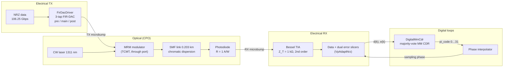
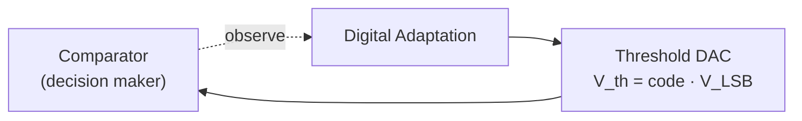
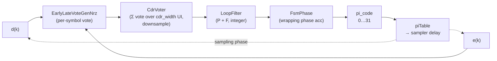
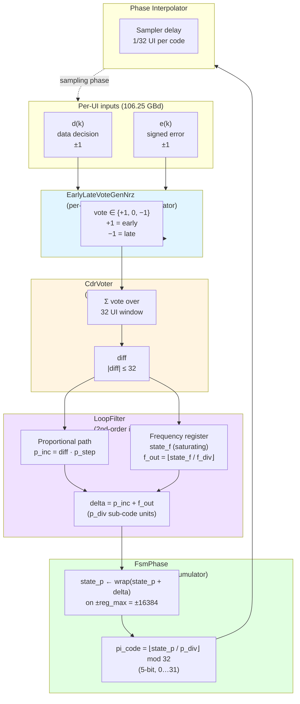

# L250 PMA Architecture Specification — 106.25 Gbps NRZ Optical Link

**Electrical PMA + PIC **

**Status:** draft
**Date:** 2026-07-20

Conventions: parameter tables list a **placeholder variable** (the generic fixed-point template name), the **model/RTL name**, and the **default value**. Every dead-band or hysteresis mechanism is flagged with a **Dead-band / hysteresis** callout that states how it is implemented. Voltage-domain LSB sizes at the slicer/DAC interfaces (`V_LSB,vp`, `V_LSB,off`) are **TBD pending the slicer-input full-scale**: no absolute voltage numbers are committed at those interfaces, and quantities derived from them are expressed symbolically. Likewise, the CTLE peaking range/resolution (`N_code,ctle`, `P_min`, `P_step`) and the AGC gain range/resolution (`N_code,agc`, `G_step`) are **intentionally left TBD pending the front-end design and the equalization sweep**; the loop logic (truth tables, dead-bands in normalized units, decimation, shifts) is specified independently of them.

---

## Section 1: Link Overview

### 1-1 Top-level block diagram



### 1-2 Primary goals

1. **Error-free NRZ transport at 106.25 GBd** End to End channel includes: microbump-attached modulator and photodiode, ~0.2 km fibre, no electrical transmission line and hence a near-zero-loss electrical channel. The ISI budget is dominated by the *bandwidths* of the driver, MRM, PD, and TIA rather than by channel loss (see the PMA architecture doc §3-7).
2. **Baud-rate receive path**: a data slicer plus two error slicers feed integer digital loops. All equalization is linear (CTLE only — no DFE, no FFE taps in this architecture).
3. **Hardware-faithful digital control**: every adaptation loop and the CDR are specified as integer truth-table / accumulator machines (vote → scale → accumulate → DAC) that translate directly to Verilog; truth tables, filter equations, and DAC code ranges in this document are the source of truth.
4. **Self-contained bring-up**: all thresholds (Vp), gain (AGC), vertical centering (offset/BLW), equalization (CTLE peaking), and timing (MM CDR) converge from the received data itself, with a defined nesting hierarchy (Section 6-10).

### 1-3 Target performance metrics

| Metric | Target | Source / status |
|---|---|---|
| Line rate | 106.25 Gbps NRZ (106.25 GBd) | Fixed; model constant `DATA_RATE = 106.25e9` |
| UI | ≈ 9.41 ps | 1 / 106.25 GHz |
| Nyquist | 53.125 GHz | `NYQUIST_HZ = DATA_RATE / 2` |
| Reference-receiver bandwidth | 53.125 GHz (0.5 × baud, BT4) | Measurement/compliance reference (0.5 × baud rule scaled to 106.25 GBd); anchors the Nyquist-aligned driver/TIA corners (§3, §4) |
| Raw (uncoded) BER — internal spec | **< 1e-12** | Committed internal target: this link is designed to close a raw BER < 1e-12 at the data slicer, i.e. FEC-free operation, and all eye/jitter/slicer margins (§3-4, §5-9, §2) are budgeted against it |
| Pre-FEC BER — standards anchor | 2.4E-4 | Used **only** where standards compliance methodology requires a pre-FEC reference (optical TDEC ≤ 3.4 dB and stressed-receiver SRS at 2.4E-4); it is a measurement anchor, not our operating target — the internal < 1e-12 spec above governs the design |
| Energy efficiency, TX driver | 0.4 (≤ 0.5) pJ/bit | First-cut estimate, PMA architecture doc §3-7 (`TBD_from_partner`) |
| Energy efficiency, RX TIA | 0.2 (≤ 0.3) pJ/bit | First-cut estimate, PMA architecture doc §4-6 |
| Energy efficiency, total link | 3 pJ/bit | Fluid |
| Modulation | NRZ (PAM2); PRBS, Others| Fluid |
| CDR frequency tolerance, required | ±100 ppm relative (±50 ppm per end) | IEEE P802.3dj D1.3 signaling-rate tolerance for every 200G/lane interface; consistent with OIF-CEI ±100 ppm asynchronous baud tolerance |
| CDR frequency tolerance, design target | ±200 ppm (2× margin over required) | Frequency register sized to this target: `f_bound = 2^15` (17-bit signed), ±244 ppm capability (§5-6) |
| CDR closed-loop bandwidth, design target | 4–6 MHz (first-iteration architecture target; final value pending jitter-budget and loop-latency closure) | Jitter-tolerance floor derived from OIF CEI-112G-XSR Table 24-12 and IEEE P802.3dj Tables 179-12 / 182-20 masks (§5-9); latency ceiling from loop-delay budget |
| Cycle slips in mission mode | Not permitted during tracking | OIF-CEI burst-error limits (error bursts > 7 symbols < 1E-20) forbid slip-induced bursts once mission data delivery has begun |
| SSC (spread-spectrum clocking) | Not required | Confirmed absent from IEEE P802.3dj and OIF-CEI for these interfaces; the CDR frequency path tracks only static plesiochronous offset and ordinary jitter, not an SSC ramp |

### 1-4 OCI-MSA alignment

This link is the **106G NRZ** operating point of the OCI-MSA-aligned Gen2 co-packaged optics family. Per the PMA architecture document (§3-7 baud-rate bridging): 106.25 GBd NRZ shares the symbol rate and Nyquist frequency of the 224G PAM4 reference part (106.25–224 Gbps range), so bandwidth specs track the PAM4 front end**, while linearity, gain-ripple, and noise specs relax toward the NRZ. The RX PMA is simple and is composed of one data slicer threshold, two error-slicer thresholds, binary ±1 alphabet everywhere in the digital loops.

---

## Section 2: Basic Background & Terminology

### 2-1 Terminology

| Term | Meaning |
|---|---|
| UI | Unit interval, 1 baud period ≈ 9.41 ps at 106.25 GBd |
| `d(k)` | Data decision at symbol `k`, `d ∈ {−1, +1}` |
| `e(k)` | Sliced signed error at symbol `k`, `e ∈ {−1, +1}` |
| `y(k)` | Centered analog sample at the data phase (after SE→diff, AGC, offset) |
| `h_k` | Channel pulse-response cursor at lag `k` UI (esp. `h_{−1}`, `h_0`, `h_{+1}`) |
| PI code | 5-bit phase-interpolator control word (0…31) |
| Vp_top / Vp_bot | Adapted error-slicer thresholds at `+Vp` / `−Vp`; at convergence `Vp ≈ h₀` (the two are the same quantity — see §2-3) |
| Vote | Ternary loop update decision `∈ {+1, 0, −1}` |
| DAC code | Saturating integer register driving an analog knob (threshold, gain, offset, peaking) |
| Dead-band | A no-vote region around the loop target — vote 0 while the measured error is inside the band |
| Decimation | Number of UI averaged into one window measurement before a single vote is taken |
| CPO | Co-packaged optics |
| MRM | Microring modulator |
| BLW | Baseline wander |

### 2-2 Error slicers vs. data slicers

The sampling front end (`VpAdaptNrz`) has **three comparators**, all clocked at the same data sample phase:



Each comparator is this canonical structure: the sample `y(k)` is compared against a threshold voltage from a **threshold DAC** (`V_th = code · V_LSB`; `V_LSB` is TBD pending slicer-input full-scale). A **digital adaptation loop** (vote → scale → accumulate → DAC, §6-1) drives the DAC code so the threshold tracks its target. The data slicer uses a fixed 0 V threshold after centering; the two error slicers each have their own DAC and Vp loop (§6-3).

| Slicer | Threshold | Output |
|---|---|---|
| **Data slicer** | 0 V (after centering) | `d = +1 if y ≥ 0 else −1` |
| **Top error slicer** | `+Vp_top` | `e₊ = +1 if y > +Vp_top else −1` |
| **Bottom error slicer** | `−Vp_bot` | `e₋ = +1 if y > −Vp_bot else −1` |

- A **data slicer** decides the transmitted bit: its threshold is the vertical eye center (nominally 0 after offset cancellation).
- An **error slicer** compares the same sample against an adapted *reference amplitude* rather than against 0; its output is the **sign of the residual** between the sample and the expected rail.
- **Each error slicer has a dedicated threshold DAC** providing its reference voltage (`VpDac` instances `dac_top` / `dac_bot`, `N_code,vp`-bit at `V_LSB,vp` volts per LSB — `V_LSB,vp` is TBD pending the slicer-input full-scale), and a **control loop manages that voltage**: the Vp_top / Vp_bot median loops of Section 6-3 servo each DAC so its slicer sits at the conditional median of its rail (~50/50 duty for the active polarity).
- The signed error `e(k)` handed to the MM CDR and the adaptation loops selects the active rail by the data decision:

| `d(k)` | Active error slicer | Sample condition | `e(k)` |
|---|---|---|---|
| +1 | top (threshold `+Vp_top`) | `y > +Vp_top` | +1 |
| +1 | top (threshold `+Vp_top`) | `y ≤ +Vp_top` | −1 |
| −1 | bottom (threshold `−Vp_bot`) | `y > −Vp_bot` | +1 |
| −1 | bottom (threshold `−Vp_bot`) | `y ≤ −Vp_bot` | −1 |

Equivalently `e = sign(y − d·Vp_rail)`, with the active rail selected by `d`.


*Figure 2-1: NRZ eye with the three slicer levels. The red dashed line is the data slicer at 0 V; the green dashed lines are the two error slicers riding the rail medians at `+Vp_top ≈ +h₀` and `−Vp_bot ≈ −h₀` (§2-3). The vertical grey line is the CDR data sample phase (`h₋₁ = h₊₁`).*

**Why two error slicers.** The MM CDR needs a signed `e(k)` on *every* UI at the data sample phase. A single upper-peak detector cannot see the bottom rail without time-multiplexing and would drop half the votes. Adapting `Vp_top` and `Vp_bot` **separately** means top/bottom asymmetry (e.g. one-sided compression in the optical path) does not bias the MM CDR or the AGC.

**Impact of DC offset on the slicers.** A common DC offset of the waveform shifts the sample relative to **all three** thresholds. The data slicer is hit most directly — its threshold is fixed at 0, so the offset is a straight decision-threshold error: the eye is sampled off-center, one rail's noise margin shrinks, and the `d` decisions become polarity-biased. The error slicers are affected too: the conditional rail medians move with the offset, biasing the `e` duty on each rail; the Vp loops *absorb* the offset by converging to asymmetric codes (`code_top ≠ code_bot`) — exactly the imbalance signal the Offset/BLW loop detects (§6-5) — but until it is nulled, the biased `e` corrupts every consumer (MM CDR votes, CTLE correlation, AGC measurement). Offset is removed in two layers:

1. **Coarse (TIA-integrated, architecture TBD)**: the single-ended→differential conversion at the TIA and its own DC-offset-cancellation (DCOC) loop remove the TIA DC operating point (see the 100 kHz high-pass corner in the TIA spec, §4, and the PMA architecture doc Ch. 7). In the behavioral model this is captured by a running-mean centering stage (`SeToDiff`, `mean += (x − mean)/2^mean_shift`, `mean_shift = 10`) — a simulation stand-in, not an implementation.
2. **Fine, continuous**: the Offset/BLW loop (Section 6-5) drives a common offset DAC from Vp_top vs Vp_bot code imbalance.

The exact SE→diff conversion and DCOC architecture at the TIA is not yet determined; this document only levies the loop-interaction requirements above (and in §6-5, §6-8, §6-10) on whatever that block becomes.

### 2-3 Channel response: `h_{−1}`, `h_0`, `h_{+1}`

Sample the equalized single-bit (pulse) response at baud spacing, aligned so the largest sample is the **main cursor**:

| Cursor | Name | Meaning |
|---|---|---|
| `h_{−1}` | Pre-cursor | Energy that arrives one UI *before* the decision instant — leakage from the *next* symbol into the current sample |
| `h_0` | Main cursor | The wanted sample; sets eye amplitude (AGC and Vp targets) |
| `h_{+1}` | First post-cursor | Energy one UI *after* the decision — trailing ISI from the *previous* symbol; the CTLE loop's primary observable |


*Figure 2-2: Equalized single-bit pulse response sampled at baud spacing. `h₀` is the main cursor at the decision instant; `h₋₁` (pre-cursor) and `h₊₁` (post-cursor) sit one UI either side. The dashed level shows the MM CDR lock condition `h₋₁ = h₊₁` (§5-3).*


**Vp and h₀ are the same quantity.** For ±1 NRZ data the ideal received sample is `y(k) = d(k)·h₀ + ISI`; with the CDR locked and the residual ISI nulled, the conditional median of the top (bottom) rail at the data sample phase *is* `+h₀` (`−h₀`). The Vp_top / Vp_bot median loops (§6-3) servo their threshold DACs onto exactly those medians, so the adapted Vp codes are the **digitized readback of the main cursor**: `Vp_top ≈ Vp_bot ≈ h₀` (they differ only by top/bottom asymmetry), and the merged value `(Vp_top + Vp_bot)/2` used by the AGC (§6-4) is the receiver's `|h₀|` estimate — the loop inventory (§6-2) treats the Vp loops as the h₀ digitiser (§6-3) for this reason. Everywhere this document says "amplitude" or "rail", `Vp` and `h₀` may be read interchangeably.

---

## Section 3: High-Speed Driver Specification

The TX driver is a **3-tap analog FIR-DAC** (`FirDacDriver`): the discrete NRZ symbol stream fans out into three delayed branches (0 / 1 / 2 UI = pre / main / post), each branch scales by its programmable tap weight and drives its own analog output stage; the three analog outputs are **summed at a common node** and hard-clipped to the swing rail. Each branch's analog behaviour is modelled as a 4th-order Bessel-Thomson low-pass (`BesselBranchDriver`) — a behavioral stand-in for the driver's analog bandwidth (see the note below §3-1).

### 3-1 Block parameters

| Parameter | Placeholder | Model/RTL name | Default (106G model) | Notes |
|---|---|---|---|---|
| Number of taps | `N_tap` | `pre / main / post` (`FirDacTapConfig` ×3) | 3 | Branch delays fixed at 0 / 1 / 2 UI |
| Tap weight | `w_pre, w_main, w_post` | `FirDacTapConfig.weight` | 0.0 / 1.0 / 0.0 (main-only baseline) | Linear coefficient on the discrete stream; 0 disables a branch |
| Tap resolution | `N_tapq` | `quantization_bits` | `None` (ideal float) | Sign-magnitude grid, full scale 1.0, step `1/(2^(N_tapq−1) − 1)`; `effective_weight` is the applied value |
| Per-branch bandwidth | `f_br` | `bandwidth_hz` | `NYQUIST_HZ` = 53.125 GHz | Exact −3 dB corner per branch |
| Branch filter order | — | `bessel_order` | 4 | Bessel-Thomson |
| Output swing (clip) | `V_pp` | `swing_pk2pk` (`SWING_PP`) | 3.0 Vpp | Hard clip at ±`swing_pk2pk/2` = ±1.5 V after summation |

When the tap split is optimised, the weights are renormalised to preserve swing: `A = 1 / (|w_pre| + 1 + |w_post|)` and the applied taps are `(w_pre·A, A, w_post·A)` (see the TX tap-sweep study).

The per-branch bandwidth and filter-order rows (`bandwidth_hz`, `bessel_order`) describe the **behavioral model** of the driver's analog bandwidth — a 4th-order Bessel-Thomson stand-in; the silicon driver's actual response is specified by the electrical spec (rise/fall and bandwidth rows of the §3-3 checklist).

The behavioral model calibrates its drive amplitude into the MRM with a lumped scalar (folding a −1 dB driver-gain assumption and a legacy amplitude-normalisation convention); this is a simulation calibration, not an architecture parameter — the physical driver gain and MRM drive amplitude are specified in the driver electrical spec (PMA architecture doc §3-7).

### 3-2 Driver → modulator interface

- The driver output passes through the **TX microbump** (EIC→PIC), modelled with a measured impulse response (DC gain ≈ 0.996); there is **no transmission line and no back-termination** — the load is the capacitive MRM attached directly through the bump.
- The modulator is a **microring (MRM, TCMT model)** biased at the max OMA point.
- Electrical spec targets (power 0.4 pJ/bit, 3 Vpp diff output, 55 GHz low-pass BW, programmable de-emphasis, THD 8 %, eye width ≥ 7 ps @ 1e-12) are the first-cut 106G NRZ column of the PMA architecture doc §3-7 and remain `TBD_*`-tagged there.

### 3-3 Industry driver-spec checklist (coverage and gaps)

Industry NRZ drivers are conventionally specified by the following list. Status of each item against this document and the behavioral simulation model:

| Industry spec item | Status here | Where / value | Gap / action |
|---|---|---|---|
| Differential output swing | Covered | 3 Vpp (`swing_pk2pk`, §3-1); same in PMA doc §3-7 | — |
| Output impedance | N/A by design | Integrated MRM driver: direct microbump to capacitive load, no back-termination (§3-2) | Industry guidance agrees: "not needed for integrated MRM driver" |
| Return loss | N/A by design | No transmission line to reflect on (§3-2; PMA doc §3-7 relaxed SDD22 rationale) | Same |
| TX EQ coefficient range and resolution | Machinery exists, values not frozen | `quantization_bits` sign-magnitude grid + `weight` (§3-1); industry example "Pre, Post, 3 bit, 0.3× max" maps to `quantization_bits = 3` (step 1/3 FS) and a 0.3 cap on \|w_pre\|, \|w_post\| | Freeze range/resolution from the TX tap-sweep study; PMA doc's 0–2 dB de-emphasis suggests 0.3× is generous for CPO — `TBD_from_sim_sweep` |
| Rise/fall time constraints | Implicit in BW, not yet an explicit row | Per-branch 4th-order Bessel at 53.125 GHz ⇒ 10–90 % rise/fall ≈ 0.34/BW ≈ **6.4 ps** (20–80 % ≈ 0.24/BW ≈ 4.5 ps; derived, not yet a signed-off row) | State an explicit rise/fall row; BW is inherent in it but analog sign-off wants the time-domain number |
| Random / deterministic jitter limits (DJ, RJ, PSIJ) | First-iteration budget stated (§3-4) | Behavioral model is still jitter-free (`FirDacDriver`); §3-4 imports a UI-normalized TX jitter budget from CEI XSR so Section 5 CDR/JTOL analysis has a source term | Confirm decomposition against the Gen2 driver extraction; `TBD_from_link_budget` |
| Eye mask | Partial only | Single row "diff output eye width ≥ 7 ps @ 1e-12" (PMA doc §3-7); no full mask | Define a TX eye mask combining swing + jitter + rise/fall in one spec. `TBD_from_link_budget` |
| Asymmetrical peaking / rise-fall control (MRM nonlinearity cancellation) | Hook exists, not exercised | The ring's charge/discharge dynamics and Lorentzian slope make optical rising/falling edges inherently asymmetric (visible in the TCMT model); the driver model explicitly supports nonlinear / asymmetric `BranchDriver` subclasses injected via `FirDacDriver(config, drivers=(...))` | Prototype an asymmetric-edge branch driver and sweep against MRM eye asymmetry at tp2/tp35 before committing to a spec row — internal decision based on MRM performance |

### 3-4 TX electrical jitter budget (first-iteration)

The optical MSA specifies TX quality only through the **TDEC** family (≤ 3.4 dB at pre-FEC BER 2.4E-4, BT4 reference receiver = 0.5 × baud); it does **not** publish an electrical TX jitter decomposition. For CDR jitter-tolerance and eye-margin analysis (§5-9) we import a UI-normalized budget from the OIF CEI XSR clauses, which are the closest die-to-optics electrical analogs. All limits are **UI-normalized**, so they carry to 106.25 GBd directly; the absolute picosecond column below uses UI = 9.41 ps.

| Component | Symbol | First-iteration limit | Abs. @ 9.41 ps UI | Source / basis |
|---|---|---|---|---|
| RMS random jitter | J_RMS | ≤ 0.022 UI rms | ≈ 0.21 ps rms | CEI-112G-XSR TX JRMS (0.0224 UI) — dominant RJ term |
| Even-odd (duty-cycle) jitter | EOJ | ≤ 0.025–0.035 UI pp | ≈ 0.24–0.33 ps pp | CEI-112G-XSR (0.025) / CEI-56G-XSR-NRZ (0.035); tighter PAM4 value taken as the design target |
| Bounded high-probability jitter | J4u / J8u | ≤ 0.15 UI pp | ≈ 1.45 ps pp | CEI-112G-XSR TX J8u (0.1546 UI); NRZ UUGJ/UBHPJ (0.15 UI) agree |
| Total jitter | TJ | ≤ 0.28 UI pp (at clause BER) | ≈ 2.6 ps pp | CEI-56G-XSR-NRZ TX TJ; sanity ceiling on the sum above |
| Signal-to-noise-and-distortion | SNDR | ≥ 32.5 dB | — | CEI-112G-XSR TX SNDR; caps residual DJ/nonlinearity |

Notes:

- These are **borrowed** electrical limits, not signed-off Gen2 numbers — flagged `TBD_from_link_budget` and to be replaced by the Gen2 driver extraction. The behavioral driver (`FirDacDriver`) remains jitter-free, so today these terms are budget line items, not model inputs.
- The high-probability term (J4u/J8u ≈ 0.15 UI pp) is the single largest TX contributor and is what the RX eye and CDR jitter tolerance (§5-9) are budgeted against; even the sub-picosecond EOJ term is meaningful at UI = 9.41 ps.
- **Transition time** re-scales with baud, not UI: the Gen1 optical limit of ≤ 17 ps (20–80 %, ≈ 0.90 UI at 53.125 GBd) becomes ≈ **8.5 ps** at 106.25 GBd for the same UI fraction, consistent with the 53.125 GHz reference-receiver bandwidth (§1-3) and the Nyquist-aligned driver corner (§3-1).

---

## Section 4: TIA Specification

The receiver front end of the behavioral simulation model is deliberately *separable*: an **ideal photodiode** (pure W→A) followed by an **analytical 2nd-order Bessel transimpedance amplifier** (model constants below).

### 4-1 Parameters

| Parameter | Placeholder | Model/RTL name | Default | Notes |
|---|---|---|---|---|
| PD responsivity | `R` | `PD_RESPONSIVITY_A_PER_W` | 1.0 A/W | Ideal: no dark current, shot noise, or intrinsic bandwidth |
| Transimpedance (DC) | `Z_T` | `TIA_ZT_OHM` | 1000 Ω (60 dBΩ) | Transfer function scaled so \|Z_T(0)\| = 1 kV/A; **non-inverting** (positive DC gain) |
| Filter order | `N_TIA` | `TIA_ORDER` | 2 | Bessel response (`BesselResponse`) |
| −3 dB corner | `f_c` | `TIA_CUTOFF_HZ` | `NYQUIST_HZ` = 53.125 GHz | `norm = "mag"` ⇒ `cutoff_hz` is the *exact* −3 dB corner (Butterworth convention) |
| RX microbump | — | same measured IR as TX | DC gain ≈ 0.996 | Applied to the photocurrent (PIC→EIC) |

### 4-2 Following CTLE (behavioral-model baseline, part of the analog front end)

The values below are the behavioral model's **fixed CTLE baseline** (a single representative setting), not a committed hardware peaking range:

| Parameter | Model/RTL name | Default (behavioral-model baseline) | Notes |
|---|---|---|---|
| Peaking target | `CTLE_PEAKING_DB` | 6.0 dB | \|H(f_Nyq)\| − \|H(0)\| by construction (`CtleZPK.from_peaking`) |
| Zero | `CTLE_F_Z_RATIO` | 0.25 × f_N = 13.28 GHz | |
| Outer pole | `CTLE_F_P2_RATIO` | 2.0 × f_N = 106.25 GHz | Inner pole solved analytically to hit the peaking target |
| DC gain | — | 1 (unity) | TIA settled rails carry through unchanged |

In the adaptive configuration the peaking value is not fixed at the 6 dB baseline but selected by the CTLE adaptation code of Section 6-6 (`CtleAdaptNrz.peaking_db(code)`; range TBD — see §6-6).

### 4-3 Electrical spec context

First-cut 106G NRZ electrical targets for the physical TIA (power 0.2 pJ/bit, 62–80 dBΩ gain range in 0.5 dB steps, 0–2 dB integrated CTLE peaking, 50 GHz low-pass BW, 1.5 µA rms input noise, 100 kHz high-pass corner from the DCOC loop) are in the PMA architecture doc §4-6. The architecture stance there (§4-2) is that CTLE peaking and AGC gain **may live physically inside the TIA macro**; the adaptation logic in Section 6 talks to "CTLE codes" and "AGC codes" regardless of where the DACs sit.

---

## Section 5: Clock and Data Recovery (CDR)

The CDR is `DigitalMmCdr`: a baud-rate, second-order, **integer / windowed** Mueller–Müller CDR built from the same block-level pieces used in silicon. It consumes only the sliced `d(k)` and signed `e(k)` from the dual-error-slicer stage — no soft samples.

### 5-1 Block architecture



| RTL block | Class | Function |
|---|---|---|
| `early_late_vote_gen` | `EarlyLateVoteGenNrz` | Per-symbol ternary vote generator (MM phase detector) |
| `cdr_voter` | `CdrVoter` | Majority-accumulates votes over `cdr_width` UI (downsampler) |
| `pathGain + f_path` | `LoopFilter` | 2nd-order integer loop filter (proportional + frequency register) |
| `fsm_phase` | `FsmPhase` | Wrapping phase accumulator in sub-code units |
| `piTable` | `DigitalMmCdr.pi_table()` | 5-bit PI code → sampler delay LUT |
| top orchestration | `DigitalMmCdr` | `step(d, e, state) → (state, pi_code)` |

### 5-2 Parameter table

| Parameter | Placeholder | Model/RTL name | Range | Default | Meaning |
|---|---|---|---|---|---|
| Update window | `W_cdr` | `cdr_width` | TBD | **32** UI | UI accumulated in the voter per loop-filter update (parallel bus width in silicon) |
| Proportional numerator | `K_p,num` | `p_step` | TBD | **2** | Per-window proportional step = `diff · p_step / p_div` PI codes |
| Proportional divider / phase granularity | `K_p,den` | `p_div` | TBD | **512** | Also the sub-code granularity of the phase accumulator; recommended **programmable** for an acquisition gear-shift (see §5-8) |
| Frequency step | `K_f,num` | `f_step` | TBD | **2** | `state_f += diff · f_step` per window |
| Frequency divider | `K_f,den` | `f_div` | TBD | **256** | `f_out = floor(state_f / f_div)` sub-codes per window |
| Frequency clamp | `F_max` | `f_bound` | TBD | **2^15** = 32 768 | `state_f` saturates at ±`f_bound` (no wrap); sized for the ±200 ppm design target per §5-6 (±100 ppm requirement per §1-3; the behavioral model's historical default of 2^20 is not the spec value) |
| Path enables | — | `en_p`, `en_f` | TBD | `True`, `True` | Gate the proportional / frequency paths individually |
| Loop polarity | — | `flip_dir` | TBD | `False` | Negates `delta` before the phase accumulator |
| PI resolution | `N_PI` | `n_pi_codes` | TBD | **32** (5-bit) | Codes across the PI span |
| PI span | — | `pi_span_ui` | TBD | **1.0** UI (full-rate PI) | Set 2 for a GTH-style half-rate PI over 2 UI |
| Initial PI code | — | `init_pi` | TBD | 0 | |

Derived fixed-point widths (all derived, not stored as separate config):

| Register | Placeholder | Width formula | Default width |
|---|---|---|---|
| Voter accumulator `CdrVoter.acc` | `N_diff` | `⌈log2(cdr_width)⌉ + 2` (signed, holds ±`W_cdr`) | 7 bits (±32) |
| Frequency register `LoopFilter.state_f` | `N_f` | `⌈log2(f_bound)⌉ + 2` (signed, holds ±`f_bound` inclusive) | 17 bits (±2^15) |
| Phase accumulator `FsmPhase.state_p` | `N_p` | `⌈log2(n_pi_codes · p_div)⌉ + 1` (signed, wraps on ±`reg_max = n_pi_codes·p_div`) | 15 bits (±16384), set by `p_div·n_pi_codes` = 512·32 = 16 384 |
| PI code | — | `log2(n_pi_codes)` | 5 bits |

Phase resolution: one PI code = `pi_span_ui / n_pi_codes` = **1/32 UI ≈ 294 fs**; one phase-accumulator sub-code (`p_div` unit) = `1/(n_pi_codes · p_div)` = 1/16 384 UI ≈ 0.57 fs (unchanged).

### 5-3 Phase detector and vote truth table

`EarlyLateVoteGenNrz` is a **per-symbol ternary vote generator**. The vote for symbol `k` fires when `d(k+1)` arrives. For sliced ±1 NRZ every data transition is symmetric (`d(k+1) = −d(k−1)`), so the phase detector reduces to a single ternary vote per symbol — there is no asymmetric second path in this link:

**CDR vote truth table** (NRZ):

| `d(k−1)` | `d(k+1)` | `e(k)` | vote | Verdict |
|---|---|---|---|---|
| +1 | +1 | ± | 0 | no crossing (no vote) |
| −1 | −1 | ± | 0 | no crossing (no vote) |
| +1 | −1 | +1 | +1 | **early** |
| +1 | −1 | −1 | −1 | **late** |
| −1 | +1 | +1 | −1 | **late** |
| −1 | +1 | −1 | +1 | **early** |

Sign convention: the voter accumulates the ternary votes, i.e. **(early − late)** counts, so a **positive window sum `diff` ⇒ increase PI delay**. Lock occurs at `h(−1) = h(+1)` on the equalized pulse.

**Dead-band / hysteresis (CDR):** the CDR carries **no explicit dead-band** — noise rejection comes from the *majority vote itself*: `cdr_width = 32` ternary votes are summed before any loop-filter action, so uncorrelated dither averages toward `diff ≈ 0` and only a persistent early/late majority moves the phase. Quantisation of the two paths (`p_div`, `f_div` floor division) additionally suppresses sub-LSB activity.

### 5-4 Downsampling: the windowed voter

`CdrVoter` is the downsampler between the 106.25 GBd symbol rate and the loop-filter update rate:

```python
# CdrVoter.step — one call per UI
self.acc += vote           # vote ∈ {+1 (early), 0 (no crossing), −1 (late)}
self.count += 1
if self.count < self.cdr_width:
    return None            # window still open: no loop-filter update
diff = self.acc            # signed majority sum (early − late), |diff| <= cdr_width
self.acc = 0; self.count = 0
return diff                # one dump per cdr_width UI
```

This matches how the update path clocks in silicon: the digital loop runs on a **deserialized bus of `cdr_width = 32` UI**, so the loop filter and phase FSM update at 106.25 GHz / 32 ≈ **3.32 GHz**. The dump is detected downstream as `state.dump_count` incrementing.

### 5-5 Data paths: phase and frequency



Per window dump (`LoopFilter.step` then `FsmPhase.step`):

```python
# LoopFilter.step(diff) — integer arithmetic, per cdr_width-UI window
p_inc   = diff * p_step if en_p else 0                       # proportional path
if en_f:
    state_f = clip(state_f + diff * f_step, -f_bound, +f_bound)   # frequency register
f_out   = floor(state_f / f_div)
delta   = p_inc + f_out                                      # in p_div sub-code units

# FsmPhase.step(delta) — wrapping phase accumulator
state_p = wrap(state_p + (-delta if flip_dir else delta),    # modular wrap on
               [-reg_max, +reg_max))                         # reg_max = n_pi_codes*p_div
pi_code = floor(state_p / p_div) % n_pi_codes                # 5-bit output
```

- **Phase (proportional) path**: per window the phase moves `diff · p_step / p_div` PI codes. With defaults this is `diff · 2/512 ≈ diff · 0.0039` codes per window (= `diff · 1.22×10⁻⁴` UI per 32-UI window).
- **Frequency path**: `state_f` is a saturating integrator of `diff`; its *divided-down* value `floor(state_f / f_div)` is added into every window's `delta`, producing a constant phase ramp — i.e. a frequency offset. The floor division means the frequency contribution has hysteresis-free `f_div`-sized quantisation: `state_f` must accumulate at least `f_div = 256` counts before the ramp changes by one sub-code per window.
- **Phase accumulator**: the only wrapping register in the whole receiver (`FsmPhase`); everything else saturates. Wrap is modular over `2·reg_max` so continuous phase rotation (plesiochronous operation) is unlimited; an `unwrapped` shadow counter is maintained for observability only.

### 5-6 Frequency accumulator: sizing for a ppm offset, and saturation

A steady value of `state_f` produces a phase ramp of

```text
Δφ per window = (state_f / f_div) / p_div · (pi_span_ui / n_pi_codes)   [UI]
ppm           = state_f · 10⁶ / (f_div · p_div · cdr_width · n_pi_codes / pi_span_ui)
```

With defaults (`f_div = 256`, `p_div = 512`, `cdr_width = 32`, `n_pi_codes = 32`, `pi_span_ui = 1`), the denominator is 256·512·32·32 = 2²⁷ = 134 217 728, so:

| Quantity | Value (defaults) |
|---|---|
| Frequency resolution (1 LSB of `state_f`) | 10⁶/2²⁷ ≈ **0.00745 ppm** |
| Max trackable offset (`state_f = ±f_bound = ±2^15`) | ±2¹⁵/2²⁷ · 10⁶ ≈ **±244 ppm** |
| `state_f` value for a 200 ppm offset | 200×10⁻⁶ · 2²⁷ ≈ 26 844 counts |

**Sizing rule.** To guarantee tracking of a target offset `Δf_ppm`:

```text
f_bound ≥ Δf_ppm · 10⁻⁶ · f_div · p_div · cdr_width · (n_pi_codes / pi_span_ui)
N_f     = ⌈log2(f_bound)⌉ + 2        (signed register holding ±f_bound inclusive)
```

The governing frequency-tolerance **requirement** is **±100 ppm relative** (±50 ppm per end under IEEE P802.3dj D1.3; the same magnitude bounds the OIF-CEI asynchronous baud tolerance). This document adopts a **±200 ppm design target** — a deliberate 2× margin over the required tolerance — to cover reference-clock stack-up and to keep the register unsaturated on the worst-case combination of TX and RX rate error plus low-frequency jitter. At the design target, `f_bound ≥ 26 844`; the specified clamp is `f_bound = 2^15 = 32 768`, a 17-bit signed register, giving a ±244 ppm tracking capability — ~22 % margin over the 26 844 counts a settled 200 ppm offset requires. The clamp must also cover the acquisition transient: `state_f` overshoots its settled value during pull-in (the §5-8 validation shows an overshoot to roughly −28 k before settling at −26.6 k for a +200 ppm offset, ~5 %), which fits comfortably within ±32 768. If the design target changes, `f_bound` re-sizes by the same rule. (The behavioral model's historical default of `f_bound = 2^20` would give ±7 812.5 ppm; that is a model default, not the spec value.)

This sizing depends only on the product `f_div·p_div·cdr_width·n_pi_codes` = 2²⁷ (§5-2), not on how that product is split between `p_div` and `n_pi_codes` individually — so the frequency-register sizing above holds for the `n_pi_codes = 32`, `p_div = 512` configuration exactly as given.

**Saturation logic.** `state_f` is **clamped, not wrapped**: `state_f = clip(state_f + diff·f_step, −f_bound, +f_bound)`. Wrapping a frequency register would be catastrophic (a full-scale frequency sign flip); clamping instead degrades gracefully — if the line frequency offset exceeds the clamp the loop keeps slewing at its maximum ramp rate and simply cannot finish pulling in, which is detectable by the lock detector (persistent one-sided `diff`). The proportional path is unaffected by the clamp.

### 5-7 Loop update summary (per `cdr_width` = 32 UI)

```text
diff    = Σ_window (early − late)                       ∈ [−32, +32]
p_inc   = diff · p_step                                  (= 2·diff sub-codes)
state_f = clip(state_f + diff · f_step, ±f_bound)        (= ±2^15)
delta   = p_inc + floor(state_f / f_div)                 (sub-codes, p_div = 512 per PI code)
state_p = wrap(state_p + delta)                          (±reg_max = ±16384)
pi_code = floor(state_p / p_div) mod 32                  → PI, 1/32 UI per code
```

The lock detector (`CdrLockDetector`, optional via the `lock_detector` field) is fed once per dump with the per-code proportional and frequency contributions (`p_inc/p_div`, `state_f/f_div`); lock gates the bring-up of the slower loops (Section 6-10). A separate **signal-valid gate** (§5-11) suppresses `en_p` and `en_f` on an invalid-signal condition, holding `pi_code`, `state_p`, and `state_f` so the CDR resumes from its held operating point rather than re-acquiring cold.

### 5-8 PI resolution and loop-gain rationale

The **5-bit** PI resolution (`n_pi_codes = 32`, one code ≈ 294 fs) is an **illustrative operating point**, not a committed value — chosen because ~294 fs looks achievable in a real delay-cell PI while ~73.5 fs does not; the bit count may change after delay-cell characterization and link-budget closure.

The proportional divider is set to `p_step/p_div = 2/512`, giving a per-window proportional phase step of `diff · 1.22×10⁻⁴` UI. This value of `p_div` keeps the loop's steady-state dither pinned at the quantisation floor of 1 PI code (1/32 UI ≈ 0.031 UI p-p, RMS ≈ 0.0040 UI); a smaller `p_div` was found in simulation to let the loop hunt across 2 PI codes (≈ 0.063 UI p-p) around lock instead of settling within 1.

This configuration was validated end-to-end in a behavioral simulation study (Jul 2026): the loop locks immediately and tracks a ±200 ppm frequency offset, with `state_f` settling within 1 % of theory and zero counted bit errors, at the cost of a ~56k UI (~0.5 µs) acquisition time for the 200 ppm pull-in. Smaller `p_div` values acquire faster (~9–11k UI) but reintroduce the hunting noted above — hence the recommendation that `p_div` (and/or `f_step`) be **programmable** for an acquisition gear-shift (§6-9).

The "theory" `state_f` value quoted above (and plotted as the dashed line in Figure 5-1) is the same closed-form sizing result already derived in §5-6 — reapplying it to a 200 ppm offset:

```text
state_f_theory = Δf_ppm · 10⁻⁶ · f_div · p_div · cdr_width · (n_pi_codes / pi_span_ui)
               = 200×10⁻⁶ · 256 · 512 · 32 · 32
               = 200×10⁻⁶ · 2²⁷
               ≈ 26 844   (sign per the loop-polarity convention, §5-5)
```

i.e. the value of the frequency register at which its divided-down ramp `floor(state_f / f_div)` sub-codes per window exactly cancels a 200 ppm sampling-clock/data-rate mismatch. "Within 1 % of theory" means the simulated `state_f` settles to within 1 % of this 26 844 figure.

Once `state_f` has settled, the sampling phase should ramp at a constant rate equal to the tracked offset (opposite sign, since the CDR is *cancelling* the mismatch):

```text
slope_theory = −Δf_ppm · 10⁻⁶   [UI per UI]   = −200×10⁻⁶ UI/UI  (= −200 ppm)
```

Fitting a line to the simulated unwrapped phase over a 20 000 UI window well after settling (80 000–100 000 UI in Figure 5-1) gives a measured slope of **−199.9 ppm**, within 0.1 ppm of the −200.0 ppm theoretical slope above — confirming the loop is not just reaching the right frequency-register value but genuinely tracking the offset at the correct rate in steady state.


*Figure 5-1: Closed-loop acquisition of a +200 ppm frequency offset at the default loop gains. Top: the frequency register `state_f` slews from 0 and settles onto the theoretical value (dashed) after ~56k UI. Bottom: the unwrapped sampling phase, initially flat while `state_f` is pulling in, then settling into the steady phase ramp that tracks the residual ppm offset (the CDR continuously re-centers the sampling instant rather than exhausting the PI range, per the wrapping-accumulator behaviour of §5-5). The black segment is a linear fit over 80k–100k UI, annotated with the measured vs. theoretical slope (199.9 ppm vs. 200.0 ppm).*

### 5-9 Closed-loop bandwidth target

The CDR is specified as a first-order-dominant tracking loop with the following closed-loop bandwidth window; this is a **first-iteration architecture target** and will be revisited when the full RX jitter budget and the physical loop-latency budget close.

| Bound | Value | Basis |
|---|---|---|
| Lower bound | ~2.7–4 MHz | Standards jitter-tolerance (JTOL) masks: the 1/f region of the OIF CEI-112G-XSR mask (Table 24-12; `f_CRU = f_b/13 280` ⇒ ~8 MHz at 106.25 GBd) and the IEEE P802.3dj electrical/optical masks (Tables 179-12 / 176D-10 / 182-20, corners at ~4 MHz and 4.27 MHz) both demand a tracking corner high enough to bring the untracked 1/f sinusoidal jitter under the eye-width budget. Above the corner, an unavoidable **0.05 UI pk-pk floor** applies out to ~10× the reference-CRU corner and must be absorbed by the eye budget. |
| Design target | **4–6 MHz** | Chosen inside the standards floor to bind untracked SJ under a ~0.10–0.15 UI pk-pk budget for both the CEI-XSR and IEEE dj mask families. |
| Upper bound | ~30 MHz | Phase-margin ceiling implied by the round-trip loop delay (parallel-bus deserialization, loop-filter update rate, PI settling). Above this, jitter-peaking degrades the 0.05 UI high-frequency floor. |

The **integer parameters** currently exercised in this document (`cdr_width = 32`, `p_step/p_div = 2/512`, `f_step/f_div = 2/256`) are the discrete equivalent of a proportional–integral loop; they were chosen to satisfy dither and pull-in criteria (§5-8) and give a self-consistent worked example, not to hit the 4–6 MHz closed-loop bandwidth *per se*. The loop-gain selection must be **verified against, and if necessary re-tuned to**, this bandwidth target once the loop-latency and jitter budgets are frozen. The verification is a small-signal linearization of the per-window update (§5-7) at the mission-mode operating point; the acquisition gear-shift (§6-9) is a separate operating point and is not constrained by the mission bandwidth target. That linearization is carried out in **`cdr_closed_loop_analysis.md`** (Sonntag & Stonick JSSC 2006 methodology): at the CEI-XSR RJ baseline (σ_φ ≈ 0.022 UI) the default gains yield f_n ≈ 8.8 MHz and f_3dB ≈ 39 MHz — wider than this 4–6 MHz target — confirming that mission-mode gain retuning (integral path first, holding ζ > 1 per §5-10) is required once the operating crossing jitter is frozen.

**Untracked jitter charged to the eye.** The bandwidth window above splits the applied sinusoidal-jitter (SJ) mask into a tracked part and an untracked part. Below the closed-loop corner the loop follows the SJ and it costs no eye; above the corner the CDR cannot track and the residual lands directly on the sampling instant, so it must be **absorbed by the horizontal eye budget** rather than by the loop. Two terms dominate the untracked residue:

- The **0.05 UI pk-pk high-frequency floor** of the CEI/dj masks, which persists from the corner out to ~10× the reference-CRU frequency and is essentially independent of loop bandwidth.
- The **1/f slope residue** — the fraction of the low-frequency SJ ramp between the mask corner and the chosen closed-loop corner that the loop does not fully suppress. Pushing the design target to the upper end of the 4–6 MHz window shrinks this residue but trades against jitter peaking near the floor (§5-10).

Adding these to the TX-side contributions imported in §3-4 (notably the J4u/J8u ≈ 0.15 UI pk-pk high-probability term), the combined horizontal closure is what the **slicer sampling margin** must survive at the **internal raw-BER spec of < 1e-12** (§1-3) — a far deeper eye than the 2.4E-4 standards compliance anchor demands. The first-iteration allocation keeps total untracked SJ under ~0.10–0.15 UI pk-pk so that, after TX jitter and residual ISI, the data-slicer decision point still sees a horizontal opening consistent with FEC-free < 1e-12 operation; this allocation is provisional (`TBD_from_link_budget`) and closes jointly with the vertical slicer-threshold budget (§2, `V_LSB,vp`).

### 5-10 Cycle-slip policy and damping

- **Acquisition:** cycle slips are **permitted** while the CDR is pulling in phase and frequency, before valid data is delivered to the FEC and downstream. This is what allows the loop to converge on the correct sampling instant from arbitrary presets without wrapping through a null-vote region.
- **Mission mode:** cycle slips are **not permitted** in tracking. A single slip generates a burst error orders of magnitude longer than the burst-length limits levied by OIF-CEI on this class of interface (bursts > 7 symbols must occur with probability < 1E-20; bursts > 3 symbols < 1E-12); the CDR must therefore behave so that a slip is a vanishing-probability event during tracking.
- **Implication for loop shaping:** the mission-mode loop must be **heavily damped** (ζ significantly greater than 1, i.e. the frequency-path contribution kept well below the proportional path in the tracking gains), and **jitter peaking must be minimal** near the mask's high-frequency floor. This constrains the P/F balance in §5-5 and rules out re-using the acquisition gear-shift gains as mission-mode gains.
- **How the design achieves this:** (i) `p_step/p_div = 2/512` places the per-window phase step at the 1-LSB dither floor (§5-8); (ii) `f_step/f_div = 2/256` puts the frequency-path quantum ≈ two decades below the proportional step (§6-9 CDR P/F balance), giving a type-II response with no peaking near the corner; (iii) the acquisition gear-shift (§5-8, §6-9) uses a *smaller* `p_div` (higher gain) only until lock, then restores mission gains.

### 5-11 Signal-valid gate — CDR state hold

Whenever the receiver is presented with an invalid-signal condition (no transmit modulation, loss of signal), there is no meaningful `d(k)`, `e(k)` stream and the CDR must **hold its state** rather than drift on noise. When valid signal returns, the sampling phase is then still at (or close to) its pre-gate operating point, avoiding a full cold re-acquisition. Exposing this hold is the CDR's only obligation toward the higher-layer squelch/relink handshake; the timing of that handshake is a link-controller concern outside this PMA document.

The behavior is a **signal-valid gate**, driven by an external `signal_valid` input and distinct from the lock detector:

- Signal invalid:
  - `pi_code` and the phase accumulator `state_p` are **held** (no update via `delta`).
  - The frequency register `state_f` is **held** (no `diff · f_step` integration).
  - Equivalently: `en_p` and `en_f` are forced low; the ternary vote generator (`EarlyLateVoteGenNrz`) and voter (`CdrVoter`) may keep running, but their output cannot move the phase or frequency state.
- Signal valid again:
  - The CDR resumes from the held state (**warm re-acquire**); it does not fall back to `init_pi` or reset `state_f`.
  - The lock detector re-arms and gates downstream adaptation loops as per §6-10.

The signal-valid gate is deliberately **separate from `CdrLockDetector`**: gating the CDR on `locked` would prevent acquisition from cold (the loop is unlocked *by definition* while pulling in). Signal validity is an external condition (receive AFE / link controller); lock is a loop-internal metric. The two combine additively — the CDR integrates only when signal is valid *and* the acquisition/tracking machinery has not been externally disabled.

### 5-12 Pattern robustness — consecutive-identical-digit coast

The MM phase detector votes only on **data transitions** (§5-3: `vote = 0` when `d(k+1)·d(k−1) ≥ 0`), so a run of consecutive identical digits (CID) contributes zero votes to the voter. The OIF-CEI jitter-tolerance test pattern inserts runs of **72 UI** with no transitions between PRBS31 segments, both polarities. The CDR must **coast through at least 72 UI** without loss of lock while the full JTOL sinusoidal-jitter mask is applied.

The specified behavior during a CID run is:

- The phase-detector output stream is a run of `vote = 0` samples: `diff` for any window that overlaps the CID run trends toward the frequency-path contribution alone.
- The **frequency register `state_f` holds its previously learned value** and continues to drive the sampling phase along the tracked ramp (the wrapping phase accumulator, §5-5, has no need for fresh votes to keep advancing).
- On the first symbol after the CID run, transition votes resume and the proportional path re-engages; provided `state_f` was correct entering the run and the applied jitter did not exceed the closed-loop bandwidth budget (§5-9), the sampling instant is still inside the eye.

**Distinction from the signal-valid gate (§5-11).** CID coast is a **valid-signal condition** with no transitions — the frequency estimate is trusted and continues to drive the phase forward. An invalid-signal condition, by contrast, holds everything. It is important that the signal-valid gate not fire during a CID run.

**Related pattern verification.** Non-mission periodic patterns (e.g. `0xCC` = 1100 repeat) may be presented before the mission data stream. The CDR must maintain lock across a phase-continuous pattern swap; the ternary-vote design is inherently robust so long as transitions remain frequent, but the slower adaptation loops (Section 6) can be biased by non-white pattern autocorrelation and should be **frozen (`adapt=False`) while a non-mission pattern is present**, re-enabled only once the mission pattern is running.

The digital adaptation machinery comprises four first-order loops — `VpAdaptNrz`, `AgcVpNrz`, `OffsetAdaptNrz`, `CtleAdaptNrz` — built on a common architecture: the shared vote → scale → accumulate → DAC template (§6-1), the loop inventory (§6-2), per-loop truth tables (§6-3 – §6-6), and the convergence hierarchy (§6-10).

**Mapping to the cursor-named loops.** The outline names the loops "Offset, h₀, h₁, h₋₁". In this architecture they map onto what is actually implemented:

| Outline loop | Implemented as | Block |
|---|---|---|
| Offset | Offset / BLW common vertical-offset loop | `OffsetAdaptNrz` (§6-5) |
| h₀ (amplitude) | Vp_top / Vp_bot rail digitisation (§6-3) + AGC on the merged \|Vp\| (§6-4) | `VpAdaptNrz`, `AgcVpNrz` |
| h₁ (post-cursor) | CTLE peaking loop nulling the residual post-cursor correlation | `CtleAdaptNrz` (§6-6) |
| h₋₁ (pre-cursor) | **No dedicated loop.** The MM CDR lock condition `h(−1) = h(+1)` handles the pre/post balance: the sampling phase, not an equalizer tap, is the h₋₁ control variable. See §6-7. | `DigitalMmCdr` |

### 6-1 Common architecture: vote → scale → accumulate → DAC

All first-order loops (Vp, AGC, offset, CTLE) share one digital template:

```text
(1) observe    — per-UI sample or readback (slicer outputs, Vp codes, …)
(2) average    — accumulate over a decimation window (or per-UI for Vp)
(3) vote       — truth table on the window measurement → vote ∈ {+1, 0, −1}
                 (dead-band / hysteresis lives HERE: vote 0 inside the band)
(4) scale      — vote enters a sub-LSB accumulator with gain 1/2^shift LSB/vote
(5) accumulate — saturating integer accumulator, **saturate no wrap**
(6) DAC code   — code = acc >> shift, drives the analog knob
                 (optional de-glitch strobe when the code changes)
```

Shared fixed-point template (each loop instantiates this with its own values — see the per-loop tables):

| Placeholder | Meaning | Formula |
|---|---|---|
| `N_code` | DAC / code register width | per loop (`dac_bits` / `code_bits`) |
| `N_shift` | Sub-LSB gain shift | per loop (`*_shift`) |
| `N_accum` | Accumulator width | `N_code + N_shift` (holds `0 … (2^N_code − 1)·2^N_shift`) |
| `D` | Decimation (UI per vote) | per loop (`decimation`; 1 for Vp) |
| `T_LSB` | Min UI per code LSB | `D · 2^N_shift` |

The accumulator classes are structurally identical across loops (`VpDac`, `GainDac`, `OffsetDac`, `PeakingDac`):

```python
# shared accumulator kernel (vote ∈ {+1, 0, −1})
acc  = clip(acc + vote, 0, ((1 << code_bits) - 1) << shift)   # saturate, no wrap
code = acc >> shift                                            # DAC code out
```

The **CDR is the only second-order loop** and the only one allowed to wrap (phase/PI path only, §5-5). Every DAC accumulator saturates.

### 6-2 Loop inventory and shared error path

| Loop | Controls | Input | Order | Block |
|---|---|---|---|---|
| CDR (phase + freq) | 5-bit PI code | `d(k±1)`, signed `e(k)` | 2nd | `DigitalMmCdr` |
| Vp_top / Vp_bot | Dual error-slicer threshold DACs | per-UI `e₊`/`e₋` gated by `d` | 1st | `VpAdaptNrz` |
| Offset / BLW | Common offset DAC | Vp_top vs Vp_bot code imbalance | 1st | `OffsetAdaptNrz` |
| CTLE | Peaking / boost DAC | sign-sign corr of `e` with past `d` | 1st | `CtleAdaptNrz` |
| AGC | Front-end gain code | merged \|Vp\| vs target | 1st | `AgcVpNrz` |
| Lock / freeze | Gates CTLE, AGC, offset | higher-level FSM | semi | `adapt=False` on each loop |

All continuous loops share the **same dual-error-slicer observables**: the data decision `d` and the signed error `e` (or the Vp DAC codes, which are digitised readbacks of the rails). Eye partitioning: MM-CDR → horizontal; offset/BLW → vertical center; AGC → amplitude; CTLE → shape (residual ISI); Vp → digitisation thresholds feeding everything else.

### 6-3 Vp_top / Vp_bot — error-slicer threshold (h₀ digitisation)

**Algorithm** (`VpAdaptNrz`). Each rail's threshold DAC is median/SAR-adjusted so its error slicer sits at ~50/50 duty for the active polarity — the threshold converges to the **conditional median** of the top / bottom rail amplitude at the data sample phase. Since that rail median *is* the main cursor (`y = d·h₀ + ISI`, §2-3), the converged thresholds satisfy `Vp_top ≈ Vp_bot ≈ h₀`: this loop **is** the h₀ digitizer, and its codes are the `|h₀|` readback consumed by the AGC and offset loops. Per UI:

```python
y = x_se - running_mean                    # SeToDiff: coarse SE→diff centering (behavioral stand-in for the TIA SE→diff + DCOC)
d = +1 if y >= 0 else -1                   # data slicer
e_top = +1 if y > +vp_top else -1          # top error slicer
e_bot = +1 if y > -vp_bot else -1          # bottom error slicer
e = e_top if d == +1 else e_bot            # signed MM error = sign(y − d·Vp_rail)

if d == +1:  dac_top.step(+e_top)          # valid-gated median vote, top rail
else:        dac_bot.step(-e_bot)          # bottom rail (sign mirrored)
```

**Mapping to the common architecture:** observe = per-UI slicer output; average = none (per-UI voting, the `1/2^vp_shift` sub-LSB gain *is* the filter); vote = the slicer output itself; DAC = `VpDac` saturating accumulator.

**Truth tables** (one per rail; the loop only votes when its rail is active):

Vp_top (valid only when `d = +1`):

| `d(k)` | `e₊(k)` (sample vs `+Vp_top`) | Vote | Action |
|---|---|---|---|
| +1 | +1 (above) | +1 | Too many samples above → **raise** threshold |
| +1 | −1 (below) | −1 | Too few above → **lower** threshold |
| −1 | ± | — | Hold (rail not active this UI) |

Vp_bot (valid only when `d = −1`; vote is `−e₋`):

| `d(k)` | `e₋(k)` (sample vs `−Vp_bot`) | Vote | Action |
|---|---|---|---|
| −1 | −1 (below −Vp_bot) | +1 | **Raise** threshold magnitude |
| −1 | +1 (above −Vp_bot) | −1 | **Lower** threshold magnitude |
| +1 | ± | — | Hold |

**Parameter table:**

| Placeholder | Model/RTL name | Default | Meaning |
|---|---|---|---|
| `N_code` | `dac_bits` | 8 | Threshold DAC width per rail (codes 0…255) |
| `V_LSB,vp` | `v_lsb` | `V_LSB,vp` (TBD — slicer-input full-scale not yet determined) | Threshold = `code · v_lsb` (range `0 … (2^dac_bits − 1)·V_LSB,vp`) |
| `N_shift` | `vp_shift` | 4 | Loop gain = 1/2⁴ LSB per valid vote |
| `N_accum` | `VpDac.acc` (`acc_max` property) | 12 bits | `dac_bits + vp_shift`; saturate no wrap |
| `D` | — | 1 (per-UI, valid-gated) | Valid votes arrive at ≈ rate/2 per rail |
| `T_LSB` | — | ≈ 32 UI per LSB | `2^vp_shift` valid votes ≈ `2·2^vp_shift` UI |
| — | `init_code_top`, `init_code_bot` | 32 (= `32·V_LSB,vp`) | Starting codes |
| — | `mean_shift` | 10 | SE→diff running-mean bandwidth `1/2^10` per sample (model-only — stands in for the TIA DCOC loop, not RTL) |
| — | `init_mean` | 0.0 | Starting SE→diff mean, set to TIA operating point if known (model-only — stands in for the TIA DCOC loop, not RTL) |

**Dead-band / hysteresis (Vp):** **none** — these are pure bang-bang median loops and intentionally dither ±1 LSB around lock. The dither is attenuated by the `1/2^vp_shift = 1/16` sub-LSB accumulator gain, and the *downstream* loops that observe the Vp codes (offset, AGC) carry their own dead-bands sized to ignore it.

**Nesting:** faster than AGC / CTLE / offset (inner loop), but quasi-static on the CDR's 32-UI dump timescale — both hold at the defaults (~32 UI per Vp LSB vs code changes needing 16 consecutive same-sign votes).

### 6-4 AGC — front-end gain (h₀ amplitude to target)

**Algorithm** (`AgcVpNrz`). Drive the programmable front-end gain so the **merged rail amplitude** — measured for free from the settled Vp DAC loops — hits a target:

```python
# per UI: accumulate the merged measurement into the decimation window
vp_sum += 0.5 * (vp_top + vp_bot); ui_count += 1
if ui_count == decimation:                      # one vote per window
    vp_mean = vp_sum / decimation
    err = vp_mean - vp_ideal
    if abs(err) <= hysteresis_v: vote = 0       # inside hysteresis window
    else:                        vote = +1 if err < 0 else -1
    dac.step(vote)                               # saturating gain-code accumulator
    g_lin = 10 ** ((code - code_mid) * step_db / 20)   # linear-in-dB mapping
```

**Mapping to the common architecture:** observe = Vp threshold readbacks; average = `decimation`-UI window mean; vote = hysteresis comparison; DAC = `GainDac`; the code maps to gain **linear-in-dB** (constant fractional amplitude step per LSB, so loop dynamics are independent of where the code sits).

**Truth table:**

| Condition on window mean | Vote | Action |
|---|---|---|
| `Vp_mean < Vp_ideal − hyst` | +1 | Eye too small → raise gain code |
| `Vp_mean > Vp_ideal + hyst` | −1 | Eye too big → lower gain code |
| `\|Vp_mean − Vp_ideal\| ≤ hyst` | 0 | Inside window → hold |

**Parameter table:**

| Placeholder | Model/RTL name | Default | Meaning |
|---|---|---|---|
| `V_target` | `vp_ideal` | TBD from link budget / slicer-input full-scale | Target merged rail amplitude `(Vp_top+Vp_bot)/2` |
| `V_hyst` | `hyst_v` → `hysteresis_v` | `None` → auto `vp_ideal·(10^(step_db/40) − 1)` | Hysteresis half-window (a fraction of the target, not an absolute voltage) |
| `N_code,agc` | `code_bits` | `N_code,agc` (TBD) | Gain-code width (codes `0 … 2^N_code,agc − 1`) |
| `G_step` | `step_db` | `G_step` (TBD) dB / LSB | ±`2^(N_code,agc−1)·G_step` dB about mid-scale (`code_mid = 2^(N_code,agc−1)` = 0 dB) |
| `N_shift` | `agc_shift` | 1 | Loop gain = 1/2 LSB per vote |
| `N_accum` | `GainDac.acc` | `N_code,agc + agc_shift` bits | Saturate no wrap |
| `D` | `decimation` | 4096 UI | Window length per vote |
| `T_LSB` | — | ≥ 8192 UI per LSB | `decimation · 2^agc_shift` |
| — | `init_code` | `None` → mid-scale (0 dB) | |

The AGC gain range and resolution (`N_code,agc`, `G_step`) are intentionally left TBD pending the front-end design and the equalization sweep; the loop logic above is independent of them.

**Dead-band / hysteresis (AGC):** implemented as a **voltage hysteresis half-window on the window-mean measurement** — `vote = 0` while `|Vp_mean − Vp_ideal| ≤ hysteresis_v`. The default auto-selects **half of one gain step's effect on the rail**, `vp_ideal·(10^(step_db/40) − 1)`, so a converged loop *cannot* dither between two adjacent codes: once inside the band, neither neighbouring code's error can exceed the band. This stops coarse-code dither after lock while still tracking slow voltage/temperature drift.

**Nesting:** **slowest continuous loop.** Every gain step rescales the entire eye, so the Vp DACs, the SE→diff DC-cancellation state, and the MM votes must re-settle before the next AGC window is trustworthy (defaults give ≥ 8192 UI per LSB vs ~32 UI per Vp LSB). On a code update the caller applies a **de-glitch strobe**: rescale the SE→diff DC estimate by `g_new/g_old` so the DC-cancellation state does not transiently bias the data slicer. In the real design this requirement lands on the TIA's DC-offset-cancellation loop (architecture TBD, §4); in the behavioral model it is implemented on the running-mean stage's `mean_shift = 10` (~1k UI) tracker.

### 6-5 Offset / BLW — common vertical offset

**Algorithm** (`OffsetAdaptNrz`). The waveform's vertical centering error is read out **for free from the Vp DAC codes**: with residual offset `r` (positive = waveform sits too high), rail half-amplitude `a`, Vp LSB `L`:

```text
code_top ≈ (a + r) / L,   code_bot ≈ (a − r) / L   ⇒   imbalance = code_top − code_bot ≈ 2r / L
```

```python
# per UI: accumulate the code imbalance into the decimation window
imb_sum += code_top - code_bot; ui_count += 1
if ui_count == decimation:                       # one vote per window
    imb_mean = imb_sum / decimation
    if abs(imb_mean) <= deadband_codes: vote = 0 # dead-band (Vp codes)
    else:                               vote = +1 if imb_mean > 0 else -1
    dac.step(vote)
    offset_v = (code - code_mid) * v_lsb         # signed about mid-scale
# caller SUBTRACTS: y_corrected = y − offset_v (analog offset DAC ahead of slicers)
```

**Mapping to the common architecture:** observe = integer Vp code readbacks (two registers already present, no extra analog hardware); average = `decimation`-UI window mean; vote = dead-band comparison; DAC = `OffsetDac`, **signed about mid-scale**.

**Truth table:**

| Condition on window-mean imbalance | Vote | Action |
|---|---|---|
| `imb_mean > +deadband_codes` | +1 | Waveform high (`code_top > code_bot`) → `offset_v` up (subtraction moves waveform down) |
| `imb_mean < −deadband_codes` | −1 | Waveform low → `offset_v` down |
| `\|imb_mean\| ≤ deadband_codes` | 0 | Centered → hold |

**Parameter table:**

| Placeholder | Model/RTL name | Default | Meaning |
|---|---|---|---|
| `N_code` | `dac_bits` | 8 | Offset-code width, mid-scale `code_mid = 128` = 0 V |
| `V_LSB,off` | `v_lsb` | `V_LSB,off` (TBD) | `offset_v = (code − code_mid)·v_lsb` ⇒ trim range `±2^(dac_bits−1)·V_LSB,off`; deliberately finer than `V_LSB,vp` (this loop is a fine trim resolving fractions of a Vp code) — constraint: `V_LSB,off < V_LSB,vp` |
| `N_shift` | `offset_shift` | 1 | Loop gain = 1/2 LSB per vote |
| `N_accum` | `OffsetDac.acc` | 9 bits | `dac_bits + offset_shift`; saturate no wrap |
| `D` | `decimation` | 2048 UI | Window length per vote |
| `DB` | `deadband_codes` | 1.0 Vp code | Dead-band half-width on mean imbalance |
| `T_LSB` | — | ≥ 4096 UI per LSB | `decimation · 2^offset_shift` |
| — | `init_code` | `None` → mid-scale (0 V) | |

**Dead-band / hysteresis (Offset):** implemented as a **dead-band in Vp codes on the window-mean imbalance** — `vote = 0` while `|imb_mean| ≤ deadband_codes` (default **1.0 code**). Rationale: the Vp loops are bang-bang and dither ±1 LSB around lock; the offset loop must not chase that dither. The window mean plus a one-code dead-band makes lock quiet.

**Nesting:** slower than the Vp loops it observes (after every offset step the rails shift by `v_lsb` and the Vp codes need ~32 UI/LSB to re-settle) and faster than / inside CTLE and AGC. **Interaction constraint:** the correction is applied upstream of the TIA's DC-offset-cancellation loop's point of action, so that loop must be **quasi-static on the offset-loop timescale** (frozen after acquisition, or very slow) — a live DC-cancellation integrator would re-converge to the shifted mean and cancel the correction at DC; two integrators must not control the same node. This requirement is levied on whatever the TIA DCOC becomes (architecture TBD, §4); in the behavioral model the actor is the running-mean centering stage (`SeToDiff`), which is frozen after acquisition or given a large `mean_shift`. The TIA DCOC provides the *coarse* one-time centering; this loop is the *fine* trim, and also tracks slow **baseline wander** within its DAC range and decimation-limited slew rate.

### 6-6 CTLE — peaking code (residual post-cursor h₁)

**Algorithm** (`CtleAdaptNrz`). Error-based **sign-sign** adaptation, no LMS estimator: with the Vp DACs tracking the rail medians, residual post-cursor ISI `h_m` shows up as correlation between the signed error and the `m`-UI-old decision:

```python
# per UI (once the decision history ring is full):
corr_sum += sum(d_hist[m - 1] * e for m in lags)   # d_hist[m−1] = d(k−m)
ui_count += 1
d_hist.appendleft(d)

if ui_count == decimation:                          # one vote per window
    corr = corr_sum / (decimation * len(lags))      # mean ∈ [−1, +1]
    if abs(corr) <= corr_deadband: vote = 0         # correlation dead-band
    else:                          vote = +1 if corr > 0 else -1
    dac.step(vote)                                  # saturating peaking-code accumulator
    peaking_db = peak_min_db + code * peak_step_db  # analog CTLE peaking DAC setting
```

`corr > 0 ⇔ h_m > 0 ⇔` **under-boosted** CTLE → raise peaking; `corr < 0 ⇔` over-boosted → lower. Lag 1 senses the first post-cursor (HF / Kh-like deficit); longer lags (3–6) sense the long-tail / Kl-like residue — `lags` sums a configurable set into **one** metric so a single code covers both.

**Mapping to the common architecture:** observe = per-UI `(d, e)` pairs (exactly the outputs of `VpAdaptNrz.step`); average = `decimation`-UI correlation window; vote = dead-band comparison; DAC = `PeakingDac`; code maps **linear-in-dB** to peaking.

**Truth table:**

| Condition on window-mean correlation | Vote | Action |
|---|---|---|
| `corr > +corr_deadband` | +1 | Under-boost (residual `h_m > 0`) → raise peaking code |
| `corr < −corr_deadband` | −1 | Over-boost → lower peaking code |
| `\|corr\| ≤ corr_deadband` | 0 | Converged → hold |

**Parameter table:**

| Placeholder | Model/RTL name | Default | Meaning |
|---|---|---|---|
| `N_code,ctle` | `code_bits` | `N_code,ctle` (TBD) | Peaking-code width (codes `0 … 2^N_code,ctle − 1`) |
| `N_shift` | `ctle_shift` | 1 | Loop gain = 1/2 LSB per vote |
| `N_accum` | `PeakingDac.acc` | `N_code,ctle + ctle_shift` bits | Saturate no wrap |
| `D` | `decimation` | 2048 UI | Correlation window per vote |
| `M` | `lags` | `(1,)` | Decision lags summed into the metric (add 3–6 for long-tail) |
| `DB` | `corr_deadband` | 0.02 | No-vote dead-band on the mean correlation |
| `P_min`, `P_step` | `peak_min_db`, `peak_step_db` | `P_min` (TBD), `P_step` (TBD) dB/LSB | `peaking_db = peak_min_db + code·peak_step_db` ⇒ `P_min … P_min + (2^N_code,ctle − 1)·P_step` |
| — | `init_code` | `None` → mid-scale (`2^(N_code,ctle−1)`) | |

The CTLE peaking range and resolution (`N_code,ctle`, `P_min`, `P_step`) are intentionally left TBD pending the front-end design and the equalization sweep; the loop logic above is independent of them.

**Dead-band / hysteresis (CTLE):** implemented as a **correlation dead-band** — `vote = 0` while `|corr| ≤ corr_deadband`. Sizing is statistical: at the converged point the lag products are i.i.d. zero-mean ±1, so the window correlation is noise with `σ = 1/√(decimation·len(lags))` ≈ **0.022** at the defaults. The default `corr_deadband = 0.02` sits at ≈ 0.9 σ: it suppresses the bulk of the noise votes, and the residual (zero-mean) votes are further attenuated by the `1/2^ctle_shift` sub-LSB gain, leaving bounded, drift-free dither of order one LSB. For a fully quiet converged code raise the dead-band to ≥ 2–3 σ or increase `decimation` — a genuine one-LSB boost error produces `|corr|` of order 0.1–0.5, far above either choice.

**Nesting:** the slowest EQ loop — ≥ 4096 UI per LSB, ~two orders of magnitude slower than the CDR's 32-UI dump. It **must** be slower than the CDR because every peaking step reshapes the pulse the MM phase detector locks to (`h(−1) = h(+1)`), and the shared error slicers must be quasi-static on the CDR update timescale. On a code change the caller applies the de-glitch strobe (swap the CTLE response between UI; let Vp / CDR re-settle before trusting the next windows). Freeze via `adapt=False` (= `lock_ctle`).

### 6-7 h₋₁ (pre-cursor): no dedicated loop

There is deliberately **no pre-cursor adaptation loop** in this architecture. The Mueller–Müller CDR's lock condition is `h(−1) = h(+1)` on the equalized pulse (Section 5-3): the timing loop continuously steers the sampling phase to the point where the pre-cursor equals the first post-cursor, so the pre/post balance is owned by the **CDR**, and the absolute post-cursor magnitude at that phase is then driven down by the **CTLE** loop (§6-6). Adding a separate h₋₁ loop would put two controllers on the same observable and fight the CDR. (TX-side pre-cursor shaping, if used, is the static `w_pre` tap of the FIR-DAC driver, Section 3 — programmed at bring-up, not adapted by the RX.)

### 6-8 Loop interaction commentary

Every continuous loop in this receiver observes the eye through the **same three comparators** (data slicer + dual error slicers), and several loops act on nodes that other loops observe. The stability argument is therefore not per-loop — each loop is a trivially stable first-order bang-bang integrator in isolation — but about **who disturbs whose observable, and by how much per step**. The interaction matrix:

| Actor ↓ steps… | …and disturbs | Mechanism | Mitigation |
|---|---|---|---|
| **AGC** (gain code) | Vp_top/bot, TIA DCOC state (SE→diff mean in the model), MM votes, CTLE corr | One gain LSB rescales the *entire* eye by `G_step` dB: both rail medians move, so both Vp DACs must re-slew by the corresponding fraction of their code; the single-ended DC operating point also rescales, transiently biasing the data slicer through the TIA's DC-cancellation state (in the model, the `mean_shift = 10` (~1k UI) running-mean tracker) | AGC is the **slowest** loop (≥ 8192 UI/LSB); half-gain-step hysteresis prevents converged dither; **de-glitch strobe**: rescale the TIA DC-cancellation state (the SE→diff mean in the model) by `g_new/g_old` at the code update so it does not have to re-converge |
| **CTLE** (peaking code) | CDR lock point, Vp rails, AGC measurement | One peaking LSB (`P_step` dB) reshapes the pulse: the `h(−1)=h(+1)` phase the MM PD locks to *moves*, and the rail medians change | CTLE ≥ 4096 UI/LSB, ~128× slower than the CDR dump so the CDR tracks the drifting lock point as a slow disturbance; de-glitch strobe on code change (swap the response between UI, discard the next windows) |
| **Offset** (offset code) | Vp codes (its own observable!), data-slicer bias | One offset LSB (`V_LSB,off`) shifts both rails by a fraction `V_LSB,off / V_LSB,vp` of a Vp LSB; the Vp codes it reads must re-settle (~32 UI/LSB) before the next imbalance window means anything | Offset ≥ 4096 UI/LSB ≫ Vp settling; 1.0-code dead-band ignores the Vp ±1 LSB dither; the **TIA DCOC loop must be quasi-static after acquisition** (in the model: freeze the SE→diff running mean) — two integrators (TIA DC cancellation + offset DAC) must not control the same DC node |
| **Vp_top/bot** (threshold codes) | `e(k)` seen by CDR, CTLE, AGC | The error sign flips its decision boundary by `V_LSB,vp` per LSB; if the thresholds moved *within* a CDR window, the window's votes would be inconsistent | Vp moves ≤ 1/16 LSB per UI (`vp_shift = 4`), i.e. quasi-static over any `cdr_width = 32` UI window |
| **CDR** (PI code) | Sample instant for everything | A phase step moves where `y` is sampled, so rail medians (Vp) and correlations (CTLE) shift slightly | CDR is deliberately the **fastest** loop — everyone else treats the sampling phase as settled; its own step is tiny (`p_step/p_div = 2/512` ⇒ ≤ 0.125 PI code = 1/256 UI per window at full majority) |

Three structural rules fall out of this matrix:

1. **One controller per node.** The TIA's DC-offset-cancellation loop (modeled by the SE→diff running-mean tracker) and the offset DAC both act on the waveform's DC value; the CDR and any hypothetical h₋₁ loop would both act on the pre/post balance (§6-7). In each case exactly one of them is allowed to integrate in mission mode — the TIA DCOC must be quasi-static (in the model: the mean tracker is frozen, or made very slow) once the offset loop takes over, and no h₋₁ loop exists.
2. **Observer slower than observed.** Offset reads Vp codes → offset ≥ ~100× slower than Vp. AGC reads Vp thresholds → AGC slower still. A loop that votes on a measurement contaminated by another loop's un-settled transient will integrate garbage — the decimation windows are what guarantee each vote sees a settled plant.
3. **Dead-bands absorb the dither budget of the loop below.** Vp is bang-bang and dithers ±1 LSB by design; the offset dead-band (`deadband_codes = 1.0`) is sized to exactly that; the AGC hysteresis is sized to its *own* step size (half a gain step) since its measurement (the window-mean of Vp thresholds) is already dither-averaged. If a lower loop's gain is increased (smaller `vp_shift`), the dead-bands above it must be re-checked.

### 6-9 Recommended step sizes and bandwidth plan

Each first-order loop's bandwidth is set by two knobs — decimation `D` (UI per vote) and shift `N_shift` (sub-LSB gain) — giving a **minimum update interval of `D · 2^N_shift` UI per code LSB**. The recommendation is roughly **a decade or more of separation between adjacent loops in the nesting order**, which the defaults satisfy:

| Loop | Knobs (default) | UI per code LSB (min) | Time per LSB @ 9.41 ps UI | Separation vs inner neighbour |
|---|---|---|---|---|
| CDR proportional | `p_step/p_div = 2/512`, `cdr_width = 32` | ≤ 0.125 PI code / 32-UI window | ~1.2×10⁻⁴ UI phase step per window | — (innermost) |
| CDR frequency | `f_step/f_div = 2/256` | `f_div/f_step = 128` windows ≈ 4096 UI to change the ramp by 1 sub-code | — | 128 windows per f-quantum: F path ~2 decades below P path |
| Vp_top / Vp_bot | `vp_shift = 4`, per-UI valid-gated | ~32 UI (16 valid votes × ~2 UI/valid) | ~0.3 ns | Quasi-static over a 32-UI CDR window ✓ |
| Offset / BLW | `decimation = 2048`, `offset_shift = 1` | ≥ 4096 UI | ~39 ns | ~128× slower than Vp ✓ |
| CTLE | `decimation = 2048`, `ctle_shift = 1` | ≥ 4096 UI | ~39 ns | ~128× slower than the CDR dump ✓ |
| AGC | `decimation = 4096`, `agc_shift = 1` | ≥ 8192 UI | ~77 ns | 2× slower than offset/CTLE, ~256× slower than Vp ✓ |

Guidance on choosing / re-tuning these:

- **Prefer `decimation` over `shift` for slowing a loop down.** Both give the same worst-case slew, but a longer window improves the *measurement* (more averaging → smaller vote noise, better dead-band SNR), while a larger shift only attenuates votes that were already noisy. E.g. to quiet the CTLE code, doubling `decimation` halves the correlation noise floor `1/√(D·len(lags))`; doubling `ctle_shift` does not.
- **Acquisition vs mission gear-shift.** Worst-case full-range slews at the defaults: Vp ≈ 8k UI (255 codes × 32 UI), CTLE ≈ `2^(N_code,ctle−1)`·4096 UI (`2^(N_code,ctle−1)` codes from mid-scale; scales with the TBD code width), AGC ≈ `2^(N_code,agc−1)`·8192 UI (`2^(N_code,agc−1)` codes from mid-scale; scales with the TBD code width), offset ≈ 520k UI ≈ 4.9 µs (128 codes). If bring-up time matters, run acquisition with 4–8× smaller `decimation` (or shift = 0) and restore mission values at lock — the truth tables and dead-bands are unchanged, only the two rate knobs move. The CDR benefits from the same treatment: with the mission `p_div = 512`, pulling in a 200 ppm offset takes ~56k UI, so `p_div` (and/or `f_step`) should be programmable to shift down for acquisition (§5-8).
- **Keep the ratios, not the absolutes.** The load-bearing quantities are the separations: Vp ~100× slower than per-UI, offset/CTLE ~100× slower than Vp/CDR, AGC ≥ 2× slower again. Any retune (e.g. faster tracking for a drifty TIA) should scale the whole ladder, not one rung.
- **CDR P/F balance.** The defaults `p_step/p_div = 2/512`, `f_step/f_div = 2/256` put the frequency path's quantum ~two decades below the proportional step (128 windows of full-majority `diff` to change the ramp by one sub-code), which is the classic type-II damping arrangement — raise `f_div` before touching `f_step` if frequency-path hunting is observed.

### 6-10 Bring-up sequence

Staged sequence, with entry/exit criteria and the freeze state of every loop per stage:

| Stage | Active | Frozen / state | Exit criterion |
|---|---|---|---|
| 0. Coarse presets | — | AGC code = mid-scale (0 dB), CTLE code = mid-scale (`2^(N_code,ctle−1)`), offset = mid-scale (0 V), Vp codes = `init_code_* = 32` (= `32·V_LSB,vp`), TIA DCOC acquiring / **live** (in the model: SE→diff running-mean tracking live) | Signal present; `d`, `e±` not stuck at a rail |
| 1. CDR acquisition | **CDR** (P + F) | All DAC loops frozen (`adapt=False`); Vp thresholds at presets are good enough for vote *signs* | CDR lock detect: PI wander and `state_f/f_div` settled |
| 2. Rail digitisation | CDR + **Vp_top/Vp_bot** | Offset, CTLE, AGC frozen | Vp codes dithering ±1 LSB (settled medians) |
| 3. Vertical centering | + **Offset/BLW**; the **TIA DCOC goes quasi-static** here (one controller per DC node, §6-8; in the model: freeze the SE→diff running mean) | CTLE, AGC frozen | `\|imbalance_meas\| ≤ deadband_codes` for consecutive windows |
| 4. Equalisation | + **CTLE** | AGC frozen | `\|corr_meas\| ≤ corr_deadband` for consecutive windows |
| 5. Mission mode | All continuous loops, mission-rate knobs | Optionally `lock_ctle` / `lock_agc` for a fully static EQ/gain; CDR, Vp, offset keep tracking | — (monitor lock detect, `vp_meas`, `corr_meas`, `imbalance_meas`) |

Rationale for the order: the CDR comes **first** among the continuous loops (stage 1) even though it is the fastest, because every other loop's observable is only meaningful at a stable sampling phase; conversely the CDR only needs the error *sign*, which the preset Vp thresholds already provide. Vp precedes offset because the offset loop's entire measurement is the Vp code pair. CTLE precedes AGC final trim because peaking changes the rail amplitude AGC is trying to hit. If any upstream stage re-fires (e.g. CDR loses lock), freeze the downstream loops and re-enter at that stage — the saturating DAC codes hold their last values, so re-acquisition resumes from a warm state rather than from presets.

**Signal-invalid hold and warm re-entry.** On an invalid-signal condition (§5-11) the CDR asserts the signal-valid gate and **holds** `pi_code`, `state_p`, and `state_f`; every continuous adaptation loop simultaneously freezes (`adapt=False` on Vp, offset, CTLE, AGC — their DAC codes are saturating registers and retain their last mission values). When signal returns, the CDR resumes from its held state (warm re-acquire, stage 1 with `en_p`/`en_f` re-armed); once lock is re-asserted, the downstream loops re-enable in the same order (Vp → offset → CTLE → AGC), each observing a plant that is already close to its pre-gate operating point. This is faster and safer than a cold re-run from stage 0 and is the reason all DAC codes and `state_f` are specified as **saturating (or held), never wrapping** except the intentionally-wrapping phase accumulator.

**Non-mission patterns.** A periodic, non-white pattern (e.g. `0xCC` = 1100 repeat) presented before mission data can bias the sign-sign correlations used by CTLE and (via `d`-conditioning) the offset and AGC observables. While such a pattern is present the slower adaptation loops (CTLE, offset, AGC) must be **frozen (`adapt=False`)** and re-enabled only once the mission pattern is running; the CDR continues to run (transitions in these patterns are dense) but should be verified against the 72-UI CID coast case (§5-12) at the mission bandwidth target.

Nesting summary: CDR and Vp sit inside CTLE/AGC; CTLE must not outrun the CDR; the offset loop must be slower than the Vp loops it observes. The dual error slicers are shared by the MM-CDR, Vp, CTLE, and AGC — their thresholds must be quasi-static on the CDR update timescale. Each loop exposes a freeze control (`adapt=False` = `lock_agc` / `lock_ctle` / offset lock gate): the code is frozen but the window measurement keeps updating for observability.

```text
TIA → CTLE → [ d | e₊ | e₋ ] → MM-CDR → PI
                │         └→ Vp_top / Vp_bot → AGC / CTLE metrics
                └→ offset
```

### 6-11 Dead-band / hysteresis summary (whole receiver)

| Loop | Mechanism | Variable | Default | Implementation |
|---|---|---|---|---|
| CDR | none (majority-vote averaging + `p_div`/`f_div` quantisation) | — | — | §5-3 callout |
| Vp_top / Vp_bot | none (bang-bang; sub-LSB gain bounds dither) | `vp_shift` | 4 | §6-3 callout |
| AGC | voltage hysteresis window on window-mean `Vp_meas` | `hyst_v` / `hysteresis_v` | auto = `vp_ideal·(10^(step_db/40)−1)` (half of one gain step's effect on the rail) | vote 0 inside band; sized to half a gain step so adjacent codes cannot dither |
| Offset / BLW | dead-band in Vp codes on window-mean imbalance | `deadband_codes` | 1.0 code | vote 0 inside band; sized to the Vp loops' ±1 LSB dither |
| CTLE | correlation dead-band on window-mean sign-sign metric | `corr_deadband` | 0.02 (≈ 0.9 σ of the noise floor `1/√(D·len(lags))`) | vote 0 inside band; statistical sizing |
