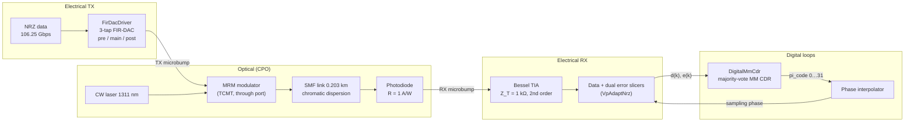
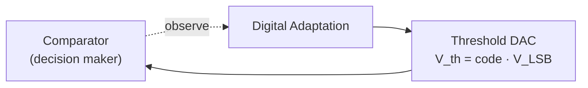
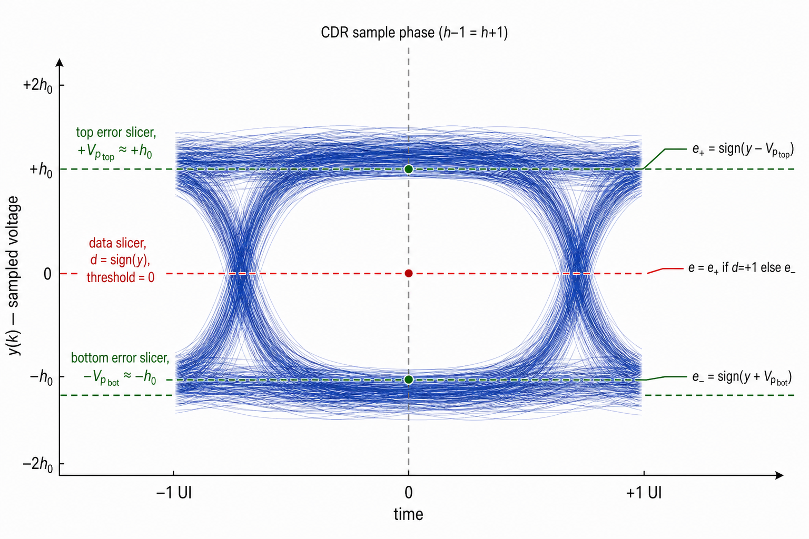
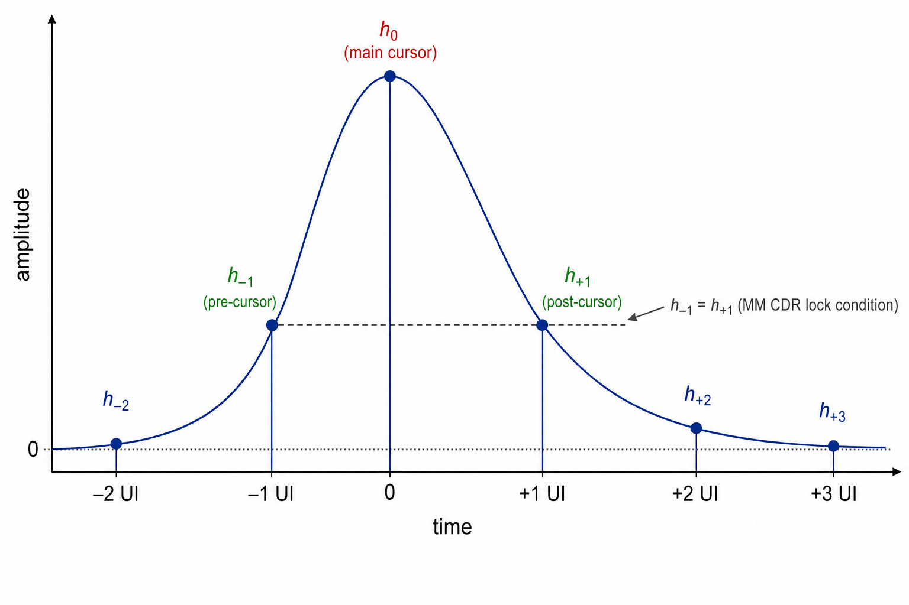
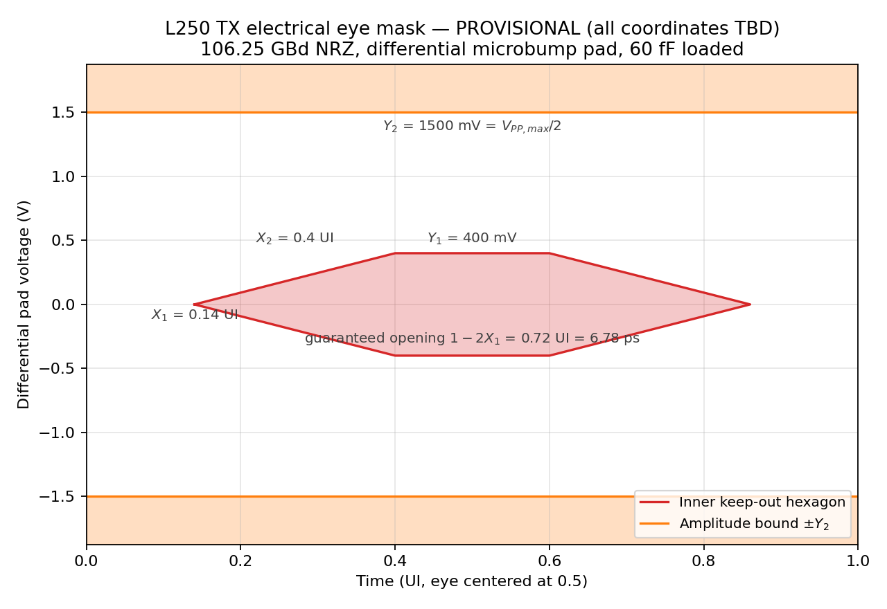
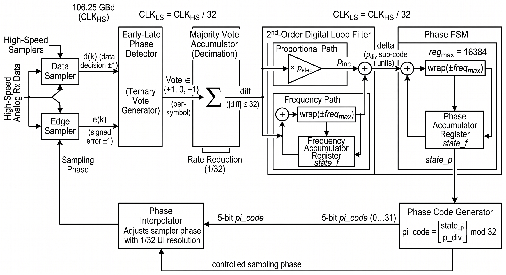
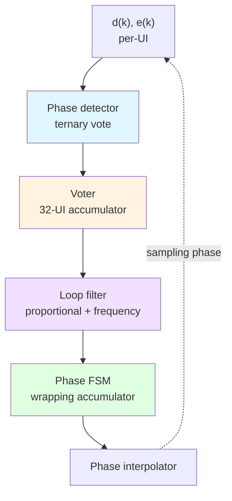
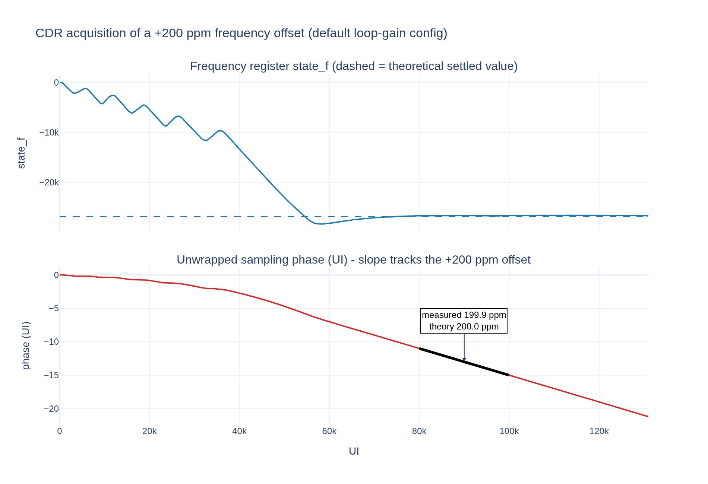

# L250 PMA Architecture Specification — 106.25 Gbps NRZ Optical Link

**Electrical PMA + PIC **

**Status:** draft
**Date:** 2026-07-20

**Operating-mode disclaimer.** This document specifies the **106.25 Gbps NRZ (106.25 GBd)** operating point only. A **53 Gbps half-rate (53.125 GBd)** mode is planned; the digital PMA (CDR, adaptation loops, PI, decimation rates) will need **mode-specific parameterization** that is not fully worked through here. In particular, the phase interpolator may be scaled to span **0 … 2 UI** (UI ≈ 10 ps — ≈ 9.41 ps at 106.25 GBd) so that at half-rate the full PI code range still covers one symbol period when the recovery path runs at the high-speed UI clock. Numeric defaults and tables below assume **106G full-rate** unless noted; half-rate values are **TBD**.

**Architecture classification — analog SerDes.** This is an **analog SerDes PMA**, not an ADC/DSP-based receiver. The high-speed signal path remains continuous-time analog through the TX FIR-DAC/driver, MRM, photodiode, TIA, and CTLE, and terminates in hard data/error slicers. Digital logic is confined to clock recovery, adaptation, sequencing, and DAC/control-code generation from sliced decisions; there is no baud-rate waveform ADC or DSP equalizer in the mission data path. Accordingly, analog waveform integrity, device/load nonlinearity, timing, noise, and PVT closure are primary architecture and sign-off concerns even where the associated control loop is implemented digitally.

Conventions: parameter tables list a **placeholder variable** (the generic fixed-point template name), the **model/RTL name**, and the **default value**. Every dead-band or hysteresis mechanism is flagged with a **Dead-band / hysteresis** callout that states how it is implemented. Voltage-domain LSB sizes at the slicer/DAC interfaces (`V_LSB,vp`, `V_LSB,off`) are **TBD pending the slicer-input full-scale**: no absolute voltage numbers are committed at those interfaces, and quantities derived from them are expressed symbolically. The CTLE peaking range and step (`P_min` = 2.5 dB, `P_step` = 0.5 dB, `N_code,ctle` = 4-bit / 16 codes ⇒ 2.5–10.0 dB) are taken directly from the behavioral model's `CtleAdaptNrz` defaults (§5-1, §7-6) — this is a **simulation-derived working point, not a hardware-signed-off target** (see `simulation_revisit_items.md` for the open realizability question on the peaking topology's outer-pole placement). The AGC/transimpedance gain step (`G_step` = 0.5 dB) similarly has a first-cut hardware target (§5-1), but its code width (`N_code,agc`) is **intentionally left TBD pending the front-end design**; the loop logic (truth tables, dead-bands in normalized units, decimation, shifts) is specified independently of either code width.

**Section outline:** 1. Link Overview · 2. Basic Background & Terminology · 3. TX Electrical Jitter Budget · 4. High-Speed Driver Specification · 5. TIA Specification · 6. Clock and Data Recovery (CDR) · 7. Digital Adaptation Loops · 8. Optical Transmitter & Modulator (MRM) Specification

---

## Section 1: Link Overview

### 1-1 Top-level block diagram



### 1-2 Primary goals

1. **Error-free NRZ transport at 106.25 GBd** End to End channel includes: microbump-attached modulator and photodiode, ~0.2 km fibre, no electrical transmission line and hence a near-zero-loss electrical channel. The ISI budget is dominated by the *bandwidths* of the driver, MRM, PD, and TIA rather than by channel loss (see the PMA architecture doc §3-7).
2. **Baud-rate receive path**: a data slicer plus two error slicers feed integer digital loops. All equalization is linear (CTLE only — no DFE, no FFE taps in this architecture).
3. **Hardware-faithful digital control**: every adaptation loop and the CDR are specified as integer truth-table / accumulator machines (vote → scale → accumulate → DAC) that translate directly to Verilog; truth tables, filter equations, and DAC code ranges in this document are the source of truth.
4. **Self-contained bring-up**: all thresholds (Vp), gain (AGC), vertical centering (offset/BLW), equalization (CTLE peaking), and timing (MM CDR) converge from the received data itself, with a defined nesting hierarchy (Section 7-10).

### 1-3 Target performance metrics

| Metric | Target | Source / status |
|---|---|---|
| Line rate | 106.25 Gbps NRZ (106.25 GBd) | Fixed; model constant `DATA_RATE = 106.25e9` |
| UI | ≈ 9.41 ps | 1 / 106.25 GHz |
| Nyquist | 53.125 GHz | `NYQUIST_HZ = DATA_RATE / 2` |
| Reference-receiver bandwidth | 53.125 GHz (0.5 × baud, BT4) | Measurement/compliance reference (0.5 × baud rule scaled to 106.25 GBd); anchors the Nyquist-aligned driver/TIA corners (§4, §5) |
| Raw (uncoded) BER — internal spec | **< 1e-12** | Committed internal target: this link is designed to close a raw BER < 1e-12 at the data slicer, i.e. FEC-free operation, and all eye/jitter/slicer margins (§3-1, §6-9, §2) are budgeted against it |
| Pre-FEC BER — standards anchor | 2.4E-4 | Used **only** where standards compliance methodology requires a pre-FEC reference (optical TDEC ≤ 3.4 dB and stressed-receiver SRS at 2.4E-4); it is a measurement anchor, not our operating target — the internal < 1e-12 spec above governs the design |
| Energy efficiency, TX driver | 0.4 (≤ 0.5) pJ/bit | First-cut estimate, PMA architecture doc §3-7 (`TBD_from_partner`) |
| Energy efficiency, RX TIA | 0.2 (≤ 0.3) pJ/bit | First-cut estimate, PMA architecture doc §4-6 |
| Energy efficiency, total link | 3 pJ/bit | Fluid |
| Modulation | NRZ (PAM2); PRBS, Others| Fluid |
| CDR frequency tolerance, required | ±100 ppm relative (±50 ppm per end) | IEEE P802.3dj D1.3 signaling-rate tolerance for every 200G/lane interface; consistent with OIF-CEI ±100 ppm asynchronous baud tolerance |
| CDR frequency tolerance, design target | ±200 ppm (2× margin over required) | Frequency register sized to this target: `f_bound = 2^15` (17-bit signed), ±244 ppm capability (§6-6) |
| CDR closed-loop bandwidth, design target | 4–6 MHz (first-iteration architecture target; final value pending jitter-budget and loop-latency closure) | Jitter-tolerance floor derived from OIF CEI-112G-XSR Table 24-12 and IEEE P802.3dj Tables 179-12 / 182-20 masks (§6-9); latency ceiling from loop-delay budget |
| Cycle slips in mission mode | Not permitted during tracking | OIF-CEI burst-error limits (error bursts > 7 symbols < 1E-20) forbid slip-induced bursts once mission data delivery has begun |
| SSC (spread-spectrum clocking) | Not required | Confirmed absent from IEEE P802.3dj and OIF-CEI for these interfaces; the CDR frequency path tracks only static plesiochronous offset and ordinary jitter, not an SSC ramp |

### 1-4 OCI-MSA alignment

This link is the **106G NRZ** operating point of the OCI-MSA-aligned Gen2 co-packaged optics family. Per the PMA architecture document (§3-7 baud-rate bridging): 106.25 GBd NRZ shares the symbol rate and Nyquist frequency of the 224G PAM4 reference part (106.25–224 Gbps range), so bandwidth specs track the PAM4 front end**, while linearity, gain-ripple, and noise specs relax toward the NRZ. The RX PMA is simple and is composed of one data slicer threshold, two error-slicer thresholds, binary ±1 alphabet everywhere in the digital loops.

---

## Section 2: Basic Background & Terminology

### 2-1 Terminology

| Term | Meaning |
|---|---|
| UI | Unit interval, 1 baud period ≈ 9.41 ps at 106.25 GBd |
| `d(k)` | Data decision at symbol `k`, `d ∈ {−1, +1}` |
| `e(k)` | Sliced signed error at symbol `k`, `e ∈ {−1, +1}` |
| `y(k)` | Centered analog sample at the data phase (after SE→diff, AGC, offset) |
| `h_k` | Channel pulse-response cursor at lag `k` UI (esp. `h_{−1}`, `h_0`, `h_{+1}`) |
| PI code | 5-bit phase-interpolator control word (0…31) |
| Vp_top / Vp_bot | Adapted error-slicer thresholds at `+Vp` / `−Vp`; at convergence `Vp ≈ h₀` (the two are the same quantity — see §2-3) |
| Vote | Ternary loop update decision `∈ {+1, 0, −1}` |
| DAC code | Saturating integer register driving an analog knob (threshold, gain, offset, peaking) |
| Dead-band | A no-vote region around the loop target — vote 0 while the measured error is inside the band |
| Decimation | Number of UI averaged into one window measurement before a single vote is taken |
| CPO | Co-packaged optics |
| MRM | Microring modulator |
| BLW | Baseline wander |

### 2-2 Error slicers vs. data slicers

The sampling front end (`VpAdaptNrz`) has **three comparators**, all clocked at the same data sample phase:



Each comparator is this canonical structure: the sample `y(k)` is compared against a threshold voltage from a **threshold DAC** (`V_th = code · V_LSB`; `V_LSB` is TBD pending slicer-input full-scale). A **digital adaptation loop** (vote → scale → accumulate → DAC, §7-1) drives the DAC code so the threshold tracks its target. The data slicer uses a fixed 0 V threshold after centering; the two error slicers each have their own DAC and Vp loop (§7-3).

| Slicer | Threshold | Output |
|---|---|---|
| **Data slicer** | 0 V (after centering) | `d = +1 if y ≥ 0 else −1` |
| **Top error slicer** | `+Vp_top` | `e₊ = +1 if y > +Vp_top else −1` |
| **Bottom error slicer** | `−Vp_bot` | `e₋ = +1 if y > −Vp_bot else −1` |

- A **data slicer** decides the transmitted bit: its threshold is the vertical eye center (nominally 0 after offset cancellation).
- An **error slicer** compares the same sample against an adapted *reference amplitude* rather than against 0; its output is the **sign of the residual** between the sample and the expected rail.
- **Each error slicer has a dedicated threshold DAC** providing its reference voltage (`VpDac` instances `dac_top` / `dac_bot`, `N_code,vp`-bit at `V_LSB,vp` volts per LSB — `V_LSB,vp` is TBD pending the slicer-input full-scale), and a **control loop manages that voltage**: the Vp_top / Vp_bot median loops of Section 7-3 servo each DAC so its slicer sits at the conditional median of its rail (~50/50 duty for the active polarity).
- The signed error `e(k)` handed to the MM CDR and the adaptation loops selects the active rail by the data decision:

| `d(k)` | Active error slicer | Sample condition | `e(k)` |
|---|---|---|---|
| +1 | top (threshold `+Vp_top`) | `y > +Vp_top` | +1 |
| +1 | top (threshold `+Vp_top`) | `y ≤ +Vp_top` | −1 |
| −1 | bottom (threshold `−Vp_bot`) | `y > −Vp_bot` | +1 |
| −1 | bottom (threshold `−Vp_bot`) | `y ≤ −Vp_bot` | −1 |

Equivalently `e = sign(y − d·Vp_rail)`, with the active rail selected by `d`.



*Figure 2-1: NRZ eye with the three slicer levels. The red dashed line is the data slicer at 0 V; the green dashed lines are the two error slicers riding the rail medians at `+Vp_top ≈ +h₀` and `−Vp_bot ≈ −h₀` (§2-3). The vertical grey line is the CDR data sample phase (`h₋₁ = h₊₁`).*

**Why two error slicers.** The MM CDR needs a signed `e(k)` on *every* UI at the data sample phase. A single upper-peak detector cannot see the bottom rail without time-multiplexing and would drop half the votes. Adapting `Vp_top` and `Vp_bot` **separately** means top/bottom asymmetry (e.g. one-sided compression in the optical path) does not bias the MM CDR or the AGC.

**Impact of DC offset on the slicers.** Common DC shifts `y(k)` relative to all three thresholds. With the data slicer fixed at 0 V, offset biases `d` directly; the Vp loops partially absorb it as asymmetric codes (`code_top ≠ code_bot`), corrupting `e(k)` and every downstream loop until nulled. Offset is removed in two layers:

1. **Coarse (TIA-integrated, architecture TBD)**: SE→diff and DCOC at the TIA (§5, 100 kHz corner). In the model: `SeToDiff` running mean (`mean_shift = 10`) — not an implementation.
2. **Fine, continuous**: Offset/BLW loop (§7-5) drives a common offset DAC from Vp_top vs Vp_bot imbalance.

The exact SE→diff conversion and DCOC architecture at the TIA is not yet determined; this document only levies the loop-interaction requirements above (and in §7-5, §7-8, §7-10) on whatever that block becomes.

### 2-3 Channel response: `h_{−1}`, `h_0`, `h_{+1}`

Sample the equalized single-bit (pulse) response at baud spacing, aligned so the largest sample is the **main cursor**:

| Cursor | Name | Meaning |
|---|---|---|
| `h_{−1}` | Pre-cursor | Energy that arrives one UI *before* the decision instant — leakage from the *next* symbol into the current sample |
| `h_0` | Main cursor | The wanted sample; sets eye amplitude (AGC and Vp targets) |
| `h_{+1}` | First post-cursor | Energy one UI *after* the decision — trailing ISI from the *previous* symbol; the CTLE loop's primary observable |



*Figure 2-2: Equalized single-bit pulse response sampled at baud spacing. `h₀` is the main cursor at the decision instant; `h₋₁` (pre-cursor) and `h₊₁` (post-cursor) sit one UI either side. The dashed level shows the MM CDR lock condition `h₋₁ = h₊₁` (§6-3).*


**Vp and h₀ are the same quantity.** For ±1 NRZ data the ideal received sample is `y(k) = d(k)·h₀ + ISI`; with the CDR locked and the residual ISI nulled, the conditional median of the top (bottom) rail at the data sample phase *is* `+h₀` (`−h₀`). The Vp_top / Vp_bot median loops (§7-3) servo their threshold DACs onto exactly those medians, so the adapted Vp codes are the **digitized readback of the main cursor**: `Vp_top ≈ Vp_bot ≈ h₀` (they differ only by top/bottom asymmetry), and the merged value `(Vp_top + Vp_bot)/2` used by the AGC (§7-4) is the receiver's `|h₀|` estimate — the loop inventory (§7-2) treats the Vp loops as the h₀ digitiser (§7-3) for this reason. Everywhere this document says "amplitude" or "rail", `Vp` and `h₀` may be read interchangeably.

---

## Section 3: TX Electrical Jitter Budget

### 3-1 TX jitter and DDJ / ISI budget

This section budgets electrical jitter at the Section 4 driver output, measured at the TX microbump pad before optical modulation. The optical MSA specifies TX quality through the **TDEC** family (≤ 3.4 dB at pre-FEC BER 2.4E-4, BT4 reference receiver = 0.5 × baud), but it does not provide the electrical decomposition needed to bind the CMOS driver. At 106.25 GBd, **UI = 9.412 ps**, so sub-picosecond pattern-dependent closure is architecture-significant and must be separated from random and bounded high-probability jitter.

The deterministic-jitter allocation uses a worst-case additive decomposition:

$$
DJ_{\delta\delta} = DDJ + BUJ
$$

$$
DDJ = DCD + ISI(t_r,t_f)
$$

Thus the committed allocation closes exactly in UI: $0.096 = 0.060 + 0.036$ UIpp and $0.060 = 0.015 + 0.045$ UIpp. `DDJ` is measured across PRBS13 and PRBS31 timing populations; `ISI` is isolated by removing static duty-cycle displacement and bounded uncorrelated crosstalk from that pattern-dependent distribution.

| Component | Symbol | Target / Default | Abs. @ 9.412 ps UI | Notes / Basis |
|---|---|---|---|---|
| RMS random jitter | `J_RMS` | ≤ 0.022 UI rms | ≤ 0.207 ps rms | CEI-112G-XSR TX JRMS (0.0224 UI) reference allocation (`TBD_from_link_budget`). |
| Global deterministic jitter | $DJ_{\delta\delta}$ | ≤ 0.096 UIpp | ≤ 0.904 ps pp | Worst-case additive envelope: `DDJ + BUJ` (`TBD_from_link_budget`). |
| Data Dependent Jitter | `DDJ` | ≤ 0.060 UIpp | ≤ 0.565 ps pp | Total pattern-dependent timing jitter evaluated using PRBS13 and PRBS31; `DDJ = DCD + ISI` (`TBD_from_link_budget`). |
| Intersymbol Interference jitter | `ISI` | ≤ 0.045 UIpp | ≤ 0.424 ps pp | Isolated finite-bandwidth and transition-settling contribution from $t_r/t_f$ and the 60 fF direct-attach load (`TBD_from_sim_sweep`). |
| Duty Cycle Distortion | `DCD` | ≤ 0.015 UIpp | ≤ 0.141 ps pp | Static clock skew and rise/fall delay mismatch in the pre-driver and serialization buffers (`TBD_from_sim_sweep`). |
| Bounded Uncorrelated Jitter | `BUJ` | ≤ 0.036 UIpp | ≤ 0.339 ps pp | Margin for multi-channel WDM electrical crosstalk and other bounded, data-uncorrelated aggressors (`TBD_from_link_budget`). |
| Bounded high-probability jitter | `J4u` / `J8u` | ≤ 0.15 UI pp | ≤ 1.412 ps pp | CEI-112G-XSR TX J8u (0.1546 UI); NRZ UUGJ/UBHPJ (0.15 UI) reference ceiling (`TBD_from_link_budget`). |
| Total jitter | `TJ` | ≤ 0.28 UI pp (at clause BER) | ≤ 2.635 ps pp | CEI-56G-XSR-NRZ TX TJ sanity ceiling (`TBD_from_link_budget`). |
| Signal-to-noise-and-distortion | `SNDR` | ≥ 32.5 dB | — | CEI-112G-XSR TX SNDR reference; caps residual jitter, noise, and nonlinearity (`TBD_from_link_budget`). |

The `ISI` allocation is enforced directly by the electrical transition-time window in §4-4 and the pad-level eye mask defined in §4-5. The 20–80% edge must remain between 3.2 ps and 4.5 ps: the upper bound limits settling-induced ISI, while the lower bound limits excessive high-frequency energy and overshoot at the unterminated capacitive microbump.

---

## Section 4: High-Speed Driver Specification

The physical TX driver is a **three-tap, segmented FIR-DAC feeding a differential merged-cascode output stage**. The NRZ stream fans out into pre, main, and post branches delayed by 0/1/2 UI; signed current-DAC slices set each coefficient, and the three branch currents sum at the common cascode output node that directly drives the MRM through the TX microbump. The merged-cascode devices sustain the required 2.0–3.0 Vppd output swing while isolating the coefficient DACs from the voltage-dependent MRM load.

The existing `FirDacDriver` model remains the system-level executable representation. Its per-branch fourth-order Bessel-Thomson response at $f_{br}=53.125$ GHz is an **analytical stand-in only**; it is not the physical output network and does not define silicon sign-off. The transistor-level driver's frequency-domain implementation is left to the analog design; silicon sign-off is governed by the transition-time, matching, jitter, and eye-mask limits below.

### 4-1 Block parameters

| Parameter | Placeholder / symbol | Target / Default | Notes / Basis |
|---|---|---|---|
| **Number of taps** | `N_tap` | 3 (pre, main, post) | Branch delays fixed at 0/1/2 UI (`TBD_analog_design`). |
| **TX equalization topology** | `FirDacDriver` | DAC-based Asymmetric FFE | Independent tap weights for rising versus falling optical edges compensate MRM carrier-depletion asymmetry (`TBD_analog_design`). |
| **Tap weight boundaries** | `w_pre`, `w_post` | `w_pre`: 0 to −0.25<br>`w_post`: 0 to −0.35 | Asymmetric boundaries allow heavier post-cursor cancellation to counteract slower optical tail decay (`TBD_from_sim_sweep`). |
| **Tap resolution** | `N_tapq` | 8 bits (signed per-slice) | Sign-magnitude grid, full scale 1.0; quantization noise must remain well below the target SNDR (`TBD_from_sim_sweep`). |
| **Differential output swing** | `V_PP` | 2.0 Vppd to 3.0 Vppd | Hard clip after summation; required to achieve ≥3.5 dB optical extinction ratio on silicon MRMs (`TBD_from_partner`). |
| **Inter-tap phase delay matching** | — | ≤±250 fs (≤2.6% UI) | Minimizes phase skew between FFE slices at 9.412 ps UI (`TBD_analog_design`). |
| **Summing-node capacitive matching** | — | ≤±2 fF (≤3.3% of $C_L$) | Prevents differential impedance mismatch and even-order harmonic distortion across the merged-cascode array (`TBD_analog_design`). |
| **Tap-weight current matching (PVT)** | — | ≤±1.5% LSB | Guarantees monotonic DAC steps and prevents coefficient drift across thermal gradients (`TBD_analog_design`). |

The asymmetric FFE is a **mandatory hardware function**, not an optional behavioral hook. Carrier-depletion microrings exhibit voltage-dependent junction capacitance and dynamic refractive-index shifts: $d n_{eff}<0$ on the optical rising edge and $d n_{eff}>0$ on the falling edge. The three-tap FIR-DAC must therefore maintain independent signed coefficient banks for logic-1 and logic-0 transitions. Both banks obey the tap bounds and 8-bit per-slice resolution above; their final programmed values are established by optical-eye and TDEC sweeps (`TBD_from_sim_sweep`).

For either transition bank, coefficient normalization preserves the output-swing envelope:

$$
A = \frac{1}{|w_{pre}| + 1 + |w_{post}|},
\qquad
(w_{pre,applied},w_{main,applied},w_{post,applied})
= A\,(w_{pre},1,w_{post}).
$$

### 4-2 Input and pre-driver interface — CDNS deliverable

The serializer-to-driver input interface and pre-driver implementation shall be completed by **CDNS** before schematic freeze. These parameters are intentionally not inferred from the behavioral `FirDacDriver`; CDNS shall provide values that close the §3-1 jitter allocation and the §4-4 loaded-pad sign-off limits.

| Parameter | Placeholder / symbol | Target / Default | Notes / Basis |
|---|---|---|---|
| **Serializer output levels and common mode** | — | To be filled out by CDNS | Define differential swing, common-mode voltage, polarity, and legal static states (`TBD_from_partner`). |
| **Driver input loading** | $C_{in,drv}$ | To be filled out by CDNS | Maximum differential and common-mode capacitance presented to the serializer, including routing (`TBD_from_partner`). |
| **Serializer fanout and lane interface** | — | To be filled out by CDNS | Define electrical fanout, lane count, buffering, and any required termination or level conversion (`TBD_from_partner`). |
| **Tap-delay generation** | — | To be filled out by CDNS | Define how the pre/main/post 0/1/2-UI phases are generated and distributed, including reset alignment (`TBD_analog_design`). |
| **Pre-driver output swing and common mode** | — | To be filled out by CDNS | Define the interface into the signed FIR-DAC slices across all enabled tap codes (`TBD_analog_design`). |
| **Pre-driver transition time and bandwidth** | $t_{r,pre}$, $t_{f,pre}$ | To be filled out by CDNS | Must support the §4-4 pad-level 20–80% transition-time window without becoming the dominant ISI source (`TBD_analog_design`). |
| **Pre-driver jitter allocation** | $J_{pre}$ | To be filled out by CDNS | Allocate RJ, DCD, and bounded jitter within the parent limits in §3-1 (`TBD_from_link_budget`). |
| **Duty-cycle and inter-phase matching** | — | To be filled out by CDNS | Include static duty-cycle error, 1-UI delay accuracy, phase skew, and PVT limits (`TBD_analog_design`). |

### 4-3 Physical output network and MRM interface

The merged-cascode output stage drives the MRM as a lumped capacitive load through the direct EIC-to-PIC microbump. There is no controlled-impedance electrical transmission line and no back-termination resistor; electrical output impedance and SDD22 are therefore not sign-off quantities for this topology.

The total load is **$C_L=60$ fF**, comprising the MRM junction ($C_{PN}\approx25$ fF), microbump pad (approximately 30 fF), and local routing parasitics (§8-3). The analog designer may choose the output-network topology needed to drive this load; compliance is determined by the loaded 20–80% rise/fall-time window in §4-4 and the pad-level eye mask defined in §4-5 rather than by a prescribed peaking topology or −3 dB bandwidth.

The behavioral path continues to use the measured TX-microbump impulse response (DC gain ≈0.996), the TCMT microring model biased at maximum OMA, and a fourth-order Bessel-Thomson branch response at 53.125 GHz. Those blocks remain correlation and architecture-sweep tools; transistor-level AC, transient, PVT, extracted-interconnect, and loaded-pad simulations are the sign-off authority for this section. Section 8 specifies the corresponding optical launch, OMA, TDEC, extinction-ratio, MRM-bias, RIN, reflectance, and squelch limits.

### 4-4 Electrical Driver Sign-Off Specification & Eye Mask

All limits in this table are evaluated differentially at the **TX microbump pad before optical modulation**, with the extracted 60 fF MRM-plus-pad load present. Timing metrics must be verified across PRBS13 and PRBS31, supply/temperature/process corners, tap-code extrema, and simultaneous WDM-lane activity.

| Parameter | Placeholder / symbol | Target / Default | Notes / Basis |
|---|---|---|---|
| **Global deterministic jitter** | $DJ_{\delta\delta}$ | ≤0.096 UIpp (≤0.904 ps) | Worst-case additive limit: $DJ_{\delta\delta}=DDJ+BUJ$ (`TBD_from_link_budget`). |
| **Data Dependent Jitter** | `DDJ` | ≤0.060 UIpp (≤0.565 ps) | Total pattern-dependent timing jitter under PRBS13/PRBS31: $DDJ=DCD+ISI$ (`TBD_from_link_budget`). |
| **Intersymbol Interference jitter** | `ISI` | ≤0.045 UIpp (≤0.424 ps) | Isolated finite-bandwidth, $t_r/t_f$ settling, and 60 fF microbump-load contribution (`TBD_from_sim_sweep`). |
| **Duty Cycle Distortion** | `DCD` | ≤0.015 UIpp (≤0.141 ps) | Static serializer/pre-driver skew and electrical rise/fall delay mismatch (`TBD_from_sim_sweep`). |
| **Bounded Uncorrelated Jitter** | `BUJ` | ≤0.036 UIpp (≤0.339 ps) | Allocation for simultaneous-lane WDM electrical crosstalk (`TBD_from_link_budget`). |
| **Electrical rise/fall time (20–80%)** | $t_{r,e}$, $t_{f,e}$ | 3.2 ps min / 4.5 ps max (0.34–0.48 UI) | The 4.5 ps ceiling prevents RC settling from exceeding the 0.424 ps ISI allocation on alternating `1010`; the 3.2 ps floor limits excessive high-frequency energy and overshoot at the high-impedance microbump (`TBD_from_sim_sweep`). |
| **Electrical rise/fall mismatch** | $\Delta t_{rf,e}=\lvert t_{r,e}-t_{f,e}\rvert$ | ≤0.35 ps (≤3.7% UI) | Limits pad-level electrical asymmetry so the asymmetric FFE capacity corrects the optical ring's nonlinear depletion dynamics (`TBD_analog_design`). |
| **Horizontal eye-mask coordinates (provisional)** | $X_1$, $X_2$ | $X_1=0.14$ UI; $X_2=0.40$ UI | $X_1=TJ_{pp}/2$ from the §3-1 total-jitter allocation; guarantees unclosed electrical eye width $1-2X_1 \ge 0.72$ UI = 6.78 ps. Full mask definition in §4-5 (`TBD_from_link_budget`). |
| **Vertical eye-mask coordinates (provisional)** | $Y_1$, $Y_2$ | $Y_1=400$ mV; $Y_2=1500$ mV | $Y_1$ is the rounded nominal static MRM $P(V)$ floor derived below (399.2 mV at the modeled $Q=5000$ corner); PVT and dynamic NRZ TDEC are not closed. $Y_2$ = maximum-amplitude bound = $V_{PP,max}/2$ hard-clip level (§4-1). Full mask definition in §4-5 (`TBD_from_link_budget`). |
| **Signal-to-noise-and-distortion** | `SNDR` | ≥32.5 dB | Includes coefficient quantization, merged-cascode nonlinearity, supply noise, and loaded-pad distortion (`TBD_from_link_budget`). |
| **Output impedance / electrical return loss** | — | N/A by architecture | Direct lumped-capacitive MRM attachment; no transmission line or back-termination (§4-3). |

### 4-5 TX electrical eye mask — normative definition (provisional coordinates)

This subsection is the single normative definition of the pad-level eye mask referenced by §3-1 and Table 4-4. The mask geometry follows the standard OIF-CEI TX mask construction; this is an internal OCI-MSA Gen2 mask, not a CEI compliance claim. **All four coordinates are provisional** and individually tagged below; the geometry, coordinate system, alignment, and pass/fail methodology defined here are committed and will not change when the coordinate values are finalized.



**Coordinate system.** The mask is evaluated on the differential pad voltage $v(t)=V_{TXP}-V_{TXN}$ (absolute millivolts, not normalized to measured swing) at the TX microbump pad before optical modulation, with the extracted 60 fF MRM-plus-pad load present. Time is expressed in UI (9.412 ps at 106.25 GBd) over one full unit interval folded about the eye center at $t=0.5$ UI.

**Alignment.** The eye is folded against the ideal (jitter-free) serializer symbol clock, with the fold phase chosen so that the mean 0 V differential-crossing time sits at $t=0$ UI (eye center at 0.5 UI). Recovered-clock or per-edge alignment is not permitted: it would absorb DCD and DDJ that are already budgeted in §3-1 and must remain visible to the mask.

**Mask regions.** Two region families define the mask:

1. **Inner keep-out hexagon** — no sample of $v(t)$ may fall inside (or on the boundary of) the polygon with vertices, in $(t\ \mathrm{[UI]},\ v\ \mathrm{[mV]})$:

   $$(X_1, 0),\ (X_2, +Y_1),\ (1-X_2, +Y_1),\ (1-X_1, 0),\ (1-X_2, -Y_1),\ (X_2, -Y_1)$$

   With the provisional coordinates this is $(0.14, 0)$, $(0.40, +400)$, $(0.60, +400)$, $(0.86, 0)$, $(0.60, -400)$, $(0.40, -400)$.

2. **Amplitude bound** — $\lvert v(t)\rvert \le Y_2$ at all times. This bounds overshoot and ringing at the unterminated capacitive microbump.

**Provisional coordinate values and derivation status.**

| Coordinate | Provisional value | Derivation / status |
|---|---|---|
| $X_1$ | 0.14 UI | $=TJ_{pp}/2=0.28/2$ UI from the §3-1 total-jitter allocation; final value follows the closed link budget (`TBD_from_link_budget`). |
| $X_2$ | 0.40 UI | CEI-56G-XSR-NRZ shoulder value adopted as-is; must be validated against the §4-4 3.2–4.5 ps transition-time envelope (`TBD_from_sim_sweep`). |
| $Y_1$ | 400 mV | Provisional nominal static floor, rounded from 399.2 mV at the modeled $Q=5000$ corner with 25 pm/V tuning and ER ≥ 3.5 dB. OMA also passes when $P_{avg}=0$ dBm; partner PVT curves and dynamic NRZ TDEC remain open (`TBD_from_link_budget`). |
| $Y_2$ | 1500 mV | $=V_{PP,max}/2$, the §4-1 hard-clip level at the 3.0 Vppd maximum swing. Supersedes an earlier 600 mV placeholder, which was inconsistent with the committed 2.0–3.0 Vppd swing under this mask construction (rails sit at ±1.0 to ±1.5 V). Final value set by MRM reverse-bias reliability and overshoot limits (`TBD_from_partner`). |

**Pass/fail statistics (provisional).** Zero mask violations over an observation set of at least $10^6$ UI per corner, evaluated with PRBS13 and PRBS31, both asymmetric-FFE tap banks active at tap-code extrema, across supply/temperature/process corners and with simultaneous WDM-lane activity. The observation length, and whether a small violation-count allowance tied to a hit-ratio BER equivalent is adopted instead of strict zero-hit, are `TBD_from_link_budget`.

**Mask-margin decomposition (provisional).** The mask coordinates are traceable to the §3-1 allocations, so the closure against each coordinate can be attributed per contributor rather than treated as a monolithic limit.


*Horizontal (exact, dual-Dirac).* Per eye side, the closure against the ideal-clock fold is $DJ_{\delta\delta}/2 + Q(\mathrm{BER})\cdot J_{RMS}$, with the deterministic half splitting per §3-1 into $ISI/2 + DCD/2 + BUJ/2$. At the pre-FEC clause BER of $2.4\times10^{-4}$ ($Q=3.49$):

| Contributor (per eye side) | UI | ps | Share of $X_1$ |
|---|---|---|---|
| $ISI/2$ | 0.0225 | 0.212 | 16.1% |
| $DCD/2$ | 0.0075 | 0.071 | 5.4% |
| $BUJ/2$ | 0.0180 | 0.169 | 12.9% |
| $Q(2.4\times10^{-4})\cdot J_{RMS}$ | 0.0768 | 0.723 | 54.9% |
| **Total closure** | **0.1248** | **1.175** | **89.2%** |
| **Unallocated margin vs $X_1=0.14$ UI** | **+0.0152** | **+0.143** | **10.8%** |

Random jitter dominates the horizontal budget (55% of $X_1$), followed by ISI (16%), BUJ (13%), and DCD (5%). Two consequences: (i) $X_1$ is BER-sensitive — the same allocations evaluated at the committed internal raw-BER target of $10^{-12}$ give $Q=7.03$, an RJ term of 0.155 UI, and a total closure of 0.203 UI per side, **exceeding $X_1$ by 0.063 UI**. The provisional coordinates are therefore only self-consistent at the pre-FEC standards anchor, not at the internal BER target, and the mask's BER convention and/or allocations must be revised. (ii) Improving DCD or ISI buys comparatively little horizontal margin relative to the RJ allocation.

*Vertical (electro-optic derivation, provisional).* SNDR is a waveform-quality metric containing fitted signal, residual ISI, noise, and distortion under a specified measurement procedure; it is **not** an input-referred Gaussian voltage-noise rms value and is not converted to $Q(\mathrm{BER})\sigma$ closure. Rise/fall time likewise constrains transition shape and $X_2$, but does not establish $Y_1$. Instead, `mrm_y1_derivation.py` evaluates symmetric electrical levels $\pm Y$ about the maximum-slope MRM bias. The §8 $Q=5000$–8000 range is represented by scaling the reference TCMT model's bus-coupling and intrinsic-loss rates together while preserving their ratio/notch shape, with 25 pm/V tuning. The resulting static ER ≥ 3.5 dB thresholds are 399.2, 306.3, and 248.7 mV for $Q=5000$, 6500, and 8000 respectively; the OMA constraint is weaker (230.2 mV worst case) when average launch power is scaled to its 0 dBm maximum. The mask therefore adopts **$Y_1=400$ mV as a provisional static lower bound**.


This is not PVT or TDEC sign-off. Scaling both loss rates together is an explicit surrogate because partner corner curves are not available, and the model-derived maximum-slope biases (−2.49 to −3.05 V in its voltage convention) do not yet reconcile with the §8-3 −1.5 to −2.0 V bias range. Moreover, applying TDEC = 3.4 dB in the OMA limit does not measure TDEC: final closure requires partner $P(V)$ curves across process, voltage, temperature, wavelength and heater-lock error, plus a dynamic SSPR waveform through the normative 53.125 GHz BT4 NRZ reference receiver. The final $Y_1$ must then be verified directly from vertical eye distributions including residual ISI, ripple, level mismatch, noise, distortion, and swing derating (`TBD_from_link_budget`).

**Machine-readable artifact.** The mask polygon, coordinate values, status tags, measurement conditions, and the per-contributor margin decomposition above are maintained in `tx_eye_mask.json` (generated by `scripts/oci_msa_gen2/tx_eye_mask.py` in the `optical-serdes` repository, which also renders the figure above and provides the point-in-polygon violation checker used against extracted or behavioral eye samples). That file is the interchange format for sign-off tooling; this subsection remains the normative text.

---

## Section 5: TIA Specification

This section specifies **three analog blocks together as one macro**: the **TIA** (photodiode + transimpedance amplifier), the **CTLE** (peaking equalizer), and the **AGC** (front-end gain control). Architecturally, CTLE peaking and AGC gain **may live physically inside the TIA macro**; whether or not the silicon partitions them that way, §5-1 tabulates all three blocks' electrical targets (transimpedance/AGC gain range+step, CTLE peaking range+step, bandwidth, noise, group-delay variation) as a single spec, and Section 7 owns the digital adaptation loops that drive each of their DAC codes ("AGC codes", "CTLE codes") regardless of where the DACs physically sit.

The receiver front end of the behavioral simulation model is deliberately *separable*: an **ideal photodiode** (pure W→A) followed by an **analytical 2nd-order Bessel transimpedance amplifier** (model constants below).

### 5-1 Parameters

| Parameter | Placeholder | Model/RTL name | Default | Notes |
|---|---|---|---|---|
| PD responsivity | `R` | `PD_RESPONSIVITY_A_PER_W` | 1.0 A/W | Ideal: no dark current, shot noise, or intrinsic bandwidth |
| Transimpedance (DC), model | `Z_T` | `TIA_ZT_OHM` | 1000 Ω (60 dBΩ) | Behavioral-model fixed gain; transfer function scaled so \|Z_T(0)\| = 1 kV/A; **non-inverting** |
| Transimpedance gain range | `Z_T,min`–`Z_T,max` | TBD | **62–80 dBΩ** | First-cut hardware target (PMA doc §4-6, `TBD_from_partner`); spanned by the AGC loop (§7-4, `G_step`) |
| Transimpedance gain step | `G_step` | `step_db` (`AgcVpNrz`) | **0.5 dB** | Same quantity as `G_step` in the §7-4 AGC parameter table; matches the behavioral model's `step_db = 0.5` default. `N_code,agc` (code width) remains TBD |
| CTLE peaking range | `P_min`–`P_max` | `peak_min_db` (`CtleAdaptNrz`) | **2.5–10.0 dB** | Behavioral-model value: `peak_min_db = 2.5` dB, `code_bits = 4` (16 codes) ⇒ `P_max = P_min + 15·P_step = 10.0` dB; spanned by the CTLE adaptation loop (§7-6, `P_min`/`P_step`/`N_code,ctle`). The model's fixed, non-adaptive CTLE baseline used elsewhere in the reference script sits at 6.0 dB (code 7) inside this range — see §5-2. Simulation-derived, not yet a hardware-signed-off target (`TBD_from_sim_sweep`); the 1z2p topology's peaking ceiling is ≈10.3 dB, and whether the outer-pole placement needed to reach it is physically realizable is an open item (`simulation_revisit_items.md` §1) |
| CTLE peaking step | `P_step` | `peak_step_db` (`CtleAdaptNrz`) | **0.5 dB** | Same quantity as `P_step` in the §7-6 CTLE parameter table; matches the behavioral model's `peak_step_db = 0.5` default |
| Filter order | `N_TIA` | `TIA_ORDER` | 2 | Bessel response (`BesselResponse`) |
| −3 dB corner | `f_c` | `TIA_CUTOFF_HZ` | `NYQUIST_HZ` = 53.125 GHz | `norm = "mag"` ⇒ `cutoff_hz` is the *exact* −3 dB corner (Butterworth convention) |
| High-pass corner (DCOC) | `f_HP` | TBD | **100 kHz** | First-cut target; set by the TIA DC-offset-cancellation loop (§7-5 offset/BLW provides fine trim downstream) |
| Input-referred noise (rms) | `I_n,rms` | TBD | **1.5 µA rms** | Excludes PD shot noise; integrated DC → 1.5×`f_N` (`TBD_from_link_budget`) |
| RX microbump | — | same measured IR as TX | DC gain ≈ 0.996 | Applied to the photocurrent (PIC→EIC) |
| Group-delay variation, band 1 | `GDV_1` | TBD | **≤ 1 ps** | DC–`f_1`; band edge `f_1` `TBD_from_sim_sweep` |
| Group-delay variation, band 2 | `GDV_2` | TBD | **≤ 1 ps** | `f_1`–`f_2` |
| Group-delay variation, band 3 | `GDV_3` | TBD | **≤ 1 ps** | `f_2`–`f_3` (`f_3` ≲ low-pass BW); small vs 9.41 ps UI |

---

## Section 6: Clock and Data Recovery (CDR)

The CDR is `DigitalMmCdr`: a baud-rate, second-order, **integer / windowed** Mueller–Müller CDR, structured so its block-level partitioning maps directly onto the eventual RTL/silicon implementation (no silicon exists yet — this is the pre-silicon architecture). It consumes only the sliced `d(k)` and signed `e(k)` from the dual-error-slicer stage — no soft samples.

### 6-1 Block architecture



| RTL block | Class | Function |
|---|---|---|
| `early_late_vote_gen` | `EarlyLateVoteGenNrz` | Per-symbol ternary vote generator (MM phase detector) |
| `cdr_voter` | `CdrVoter` | Majority-accumulates votes over `cdr_width` UI (downsampler) |
| `pathGain + f_path` | `LoopFilter` | 2nd-order integer loop filter (proportional + frequency register) |
| `fsm_phase` | `FsmPhase` | Wrapping phase accumulator in sub-code units |
| `piTable` | `DigitalMmCdr.pi_table()` | 5-bit PI code → sampler delay LUT |
| top orchestration | `DigitalMmCdr` | `step(d, e, state) → (state, pi_code)` |

### 6-2 Parameter table

| Parameter | Placeholder | Model/RTL name | Range | Default | Meaning |
|---|---|---|---|---|---|
| Update window | `W_cdr` | `cdr_width` | TBD | **32** UI | UI accumulated in the voter per loop-filter update (parallel bus width in silicon) |
| Proportional numerator | `K_p,num` | `p_step` | TBD | **2** | Per-window proportional step = `diff · p_step / p_div` PI codes |
| Proportional divider / phase granularity | `K_p,den` | `p_div` | TBD | **512** | Also the sub-code granularity of the phase accumulator; recommended **programmable** for an acquisition gear-shift (see §6-8) |
| Frequency step | `K_f,num` | `f_step` | TBD | **2** | `state_f += diff · f_step` per window |
| Frequency divider | `K_f,den` | `f_div` | TBD | **256** | `f_out = floor(state_f / f_div)` sub-codes per window |
| Frequency clamp | `F_max` | `f_bound` | TBD | **2^15** = 32 768 | `state_f` saturates at ±`f_bound` (no wrap); sized for the ±200 ppm design target — see §6-6 for the sizing rule |
| Path enables | — | `en_p`, `en_f` | TBD | `True`, `True` | Gate the proportional / frequency paths individually |
| Loop polarity | — | `flip_dir` | TBD | `False` | Negates `delta` before the phase accumulator |
| PI resolution | `N_PI` | `n_pi_codes` | TBD | **32** (5-bit) | Codes across the PI span |
| PI span | — | `pi_span_ui` | TBD | **1.0** UI (full-rate PI) | Set 2 for a GTH-style half-rate PI over 2 UI |
| Initial PI code | — | `init_pi` | TBD | 0 | |

Derived fixed-point widths (all derived, not stored as separate config):

| Register | Placeholder | Width formula | Default width |
|---|---|---|---|
| Voter accumulator `CdrVoter.acc` | `N_diff` | `⌈log2(cdr_width)⌉ + 2` (signed, holds ±`W_cdr`) | 7 bits (±32) |
| Frequency register `LoopFilter.state_f` | `N_f` | `⌈log2(f_bound)⌉ + 2` (signed, holds ±`f_bound` inclusive) | 17 bits (±2^15) |
| Phase accumulator `FsmPhase.state_p` | `N_p` | `⌈log2(n_pi_codes · p_div)⌉ + 1` (signed, wraps on ±`reg_max = n_pi_codes·p_div`) | 15 bits (±16384), set by `p_div·n_pi_codes` = 512·32 = 16 384 |
| PI code | — | `log2(n_pi_codes)` | 5 bits |

Phase resolution: one PI code = `pi_span_ui / n_pi_codes` = **1/32 UI ≈ 294 fs**; one phase-accumulator sub-code (`p_div` unit) = `1/(n_pi_codes · p_div)` = 1/16 384 UI ≈ 0.57 fs (unchanged).

### 6-3 Phase detector and vote truth table

`EarlyLateVoteGenNrz` is a **per-symbol ternary vote generator**. The vote for symbol `k` fires when `d(k+1)` arrives. For sliced ±1 NRZ every data transition is symmetric (`d(k+1) = −d(k−1)`), so the phase detector reduces to a single ternary vote per symbol:

**CDR vote truth table** (NRZ):

| `d(k−1)` | `d(k+1)` | `e(k)` | vote | Verdict |
|---|---|---|---|---|
| +1 | +1 | ± | 0 | no crossing (no vote) |
| −1 | −1 | ± | 0 | no crossing (no vote) |
| +1 | −1 | +1 | +1 | **early** |
| +1 | −1 | −1 | −1 | **late** |
| −1 | +1 | +1 | −1 | **late** |
| −1 | +1 | −1 | +1 | **early** |

Sign convention: the voter accumulates the ternary votes, i.e. **(early − late)** counts, so a **positive window sum `diff` ⇒ increase PI delay**. Lock occurs at `h(−1) = h(+1)` on the equalized pulse.

**Dead-band / hysteresis (CDR):** the CDR carries **no explicit dead-band** — noise rejection comes from the *majority vote itself*: `cdr_width = 32` ternary votes are summed before any loop-filter action, so uncorrelated dither averages toward `diff ≈ 0` and only a persistent early/late majority moves the phase. Quantisation of the two paths (`p_div`, `f_div` floor division) additionally suppresses sub-LSB activity.

### 6-4 Downsampling: the windowed voter

`CdrVoter` is the downsampler between the 106.25 GBd symbol rate and the loop-filter update rate:

```python
# CdrVoter.step — one call per UI
self.acc += vote           # vote ∈ {+1 (early), 0 (no crossing), −1 (late)}
self.count += 1
if self.count < self.cdr_width:
    return None            # window still open: no loop-filter update
diff = self.acc            # signed majority sum (early − late), |diff| <= cdr_width
self.acc = 0; self.count = 0
return diff                # one dump per cdr_width UI
```

This matches how the update path is intended to clock in the eventual silicon implementation: the digital loop runs on a **deserialized bus of `cdr_width = 32` UI**, so the loop filter and phase FSM update at 106.25 GHz / 32 ≈ **3.32 GHz**. The dump is detected downstream as `state.dump_count` incrementing.

### 6-5 Data paths: phase and frequency




Per window dump (`LoopFilter.step` then `FsmPhase.step`):

```python
# LoopFilter.step(diff) — integer arithmetic, per cdr_width-UI window
p_inc   = diff * p_step if en_p else 0                       # proportional path
if en_f:
    state_f = clip(state_f + diff * f_step, -f_bound, +f_bound)   # frequency register
f_out   = floor(state_f / f_div)
delta   = p_inc + f_out                                      # in p_div sub-code units

# FsmPhase.step(delta) — wrapping phase accumulator
state_p = wrap(state_p + (-delta if flip_dir else delta),    # modular wrap on
               [-reg_max, +reg_max))                         # reg_max = n_pi_codes*p_div
pi_code = floor(state_p / p_div) % n_pi_codes                # 5-bit output
```

- **Phase (proportional) path**: per window the phase moves `diff · p_step / p_div` PI codes. With defaults this is `diff · 2/512 ≈ diff · 0.0039` codes per window (= `diff · 1.22×10⁻⁴` UI per 32-UI window).
- **Frequency path**: `state_f` is a saturating integrator of `diff`; its *divided-down* value `floor(state_f / f_div)` is added into every window's `delta`, producing a constant phase ramp — i.e. a frequency offset. The floor division means the frequency contribution has hysteresis-free `f_div`-sized quantisation: `state_f` must accumulate at least `f_div = 256` counts before the ramp changes by one sub-code per window.
- **Phase accumulator**: the only wrapping register in the whole receiver (`FsmPhase`); everything else saturates. Wrap is modular over `2·reg_max` so continuous phase rotation (plesiochronous operation) is unlimited; an `unwrapped` shadow counter is maintained for observability only.

### 6-6 Frequency accumulator: sizing for a ppm offset, and saturation

A steady value of `state_f` produces a phase ramp of

```text
Δφ per window = (state_f / f_div) / p_div · (pi_span_ui / n_pi_codes)   [UI]
ppm           = state_f · 10⁶ / (f_div · p_div · cdr_width · n_pi_codes / pi_span_ui)
```

With defaults (`f_div = 256`, `p_div = 512`, `cdr_width = 32`, `n_pi_codes = 32`, `pi_span_ui = 1`), the denominator is 256·512·32·32 = 2²⁷ = 134 217 728, so:

| Quantity | Value (defaults) |
|---|---|
| Frequency resolution (1 LSB of `state_f`) | 10⁶/2²⁷ ≈ **0.00745 ppm** |
| Max trackable offset (`state_f = ±f_bound = ±2^15`) | ±2¹⁵/2²⁷ · 10⁶ ≈ **±244 ppm** |
| `state_f` value for a 200 ppm offset | 200×10⁻⁶ · 2²⁷ ≈ 26 844 counts |

**Sizing rule.** To guarantee tracking of a target offset `Δf_ppm`:

```text
f_bound ≥ Δf_ppm · 10⁻⁶ · f_div · p_div · cdr_width · (n_pi_codes / pi_span_ui)
N_f     = ⌈log2(f_bound)⌉ + 2        (signed register holding ±f_bound inclusive)
```

The governing frequency-tolerance **requirement** is **±100 ppm relative** (±50 ppm per end under IEEE P802.3dj D1.3; the same magnitude bounds the OIF-CEI asynchronous baud tolerance). This document adopts a **±200 ppm design target** — a deliberate 2× margin over the required tolerance — to cover reference-clock stack-up and to keep the register unsaturated on the worst-case combination of TX and RX rate error plus low-frequency jitter. At the design target, `f_bound ≥ 26 844`; the specified clamp is `f_bound = 2^15 = 32 768`, a 17-bit signed register, giving a ±244 ppm tracking capability — ~22 % margin over the 26 844 counts a settled 200 ppm offset requires. The clamp must also cover the acquisition transient: `state_f` overshoots its settled value during pull-in (the §6-8 validation shows an overshoot to roughly −28 k before settling at −26.6 k for a +200 ppm offset, ~5 %), which fits comfortably within ±32 768. If the design target changes, `f_bound` re-sizes by the same rule. (The behavioral model's historical default of `f_bound = 2^20` would give ±7 812.5 ppm; that is a model default, not the spec value.)

This sizing depends only on the product `f_div·p_div·cdr_width·n_pi_codes` = 2²⁷ (§6-2), not on how that product is split between `p_div` and `n_pi_codes` individually — so the frequency-register sizing above holds for the `n_pi_codes = 32`, `p_div = 512` configuration exactly as given.

**Saturation logic.** `state_f` is **clamped, not wrapped**: `state_f = clip(state_f + diff·f_step, −f_bound, +f_bound)`. Wrapping a frequency register would be catastrophic (a full-scale frequency sign flip); clamping instead degrades gracefully — if the line frequency offset exceeds the clamp the loop keeps slewing at its maximum ramp rate and simply cannot finish pulling in, which is detectable by the lock detector (persistent one-sided `diff`). The proportional path is unaffected by the clamp.

### 6-7 Loop update summary (per `cdr_width` = 32 UI)

```text
diff    = Σ_window (early − late)                       ∈ [−32, +32]
p_inc   = diff · p_step                                  (= 2·diff sub-codes)
state_f = clip(state_f + diff · f_step, ±f_bound)        (= ±2^15)
delta   = p_inc + floor(state_f / f_div)                 (sub-codes, p_div = 512 per PI code)
state_p = wrap(state_p + delta)                          (±reg_max = ±16384)
pi_code = floor(state_p / p_div) mod 32                  → PI, 1/32 UI per code
```

The lock detector (`CdrLockDetector`, optional via the `lock_detector` field) is fed once per dump with the per-code proportional and frequency contributions (`p_inc/p_div`, `state_f/f_div`); lock gates the bring-up of the slower loops (Section 7-10). A separate **signal-valid gate** (§6-11) suppresses `en_p` and `en_f` on an invalid-signal condition, holding `pi_code`, `state_p`, and `state_f` so the CDR resumes from its held operating point rather than re-acquiring cold.

### 6-8 PI resolution and loop-gain rationale

The **5-bit** PI resolution (`n_pi_codes = 32`, one code ≈ 294 fs) is an **illustrative operating point**, not a committed value — chosen because ~294 fs looks achievable in a real delay-cell PI while ~73.5 fs does not; the bit count may change after delay-cell characterization and link-budget closure.

The proportional divider is set to `p_step/p_div = 2/512`, giving a per-window proportional phase step of `diff · 1.22×10⁻⁴` UI. This value of `p_div` keeps the loop's steady-state dither pinned at the quantisation floor of 1 PI code (1/32 UI ≈ 0.031 UI p-p, RMS ≈ 0.0040 UI); a smaller `p_div` was found in simulation to let the loop hunt across 2 PI codes (≈ 0.063 UI p-p) around lock instead of settling within 1.

This configuration was validated end-to-end in a behavioral simulation study (Jul 2026): the loop locks immediately and tracks a ±200 ppm frequency offset, with `state_f` settling within 1 % of theory and zero counted bit errors, at the cost of a ~56k UI (~0.5 µs) acquisition time for the 200 ppm pull-in. Smaller `p_div` values acquire faster (~9–11k UI) but reintroduce the hunting noted above — hence the recommendation that `p_div` (and/or `f_step`) be **programmable** for an acquisition gear-shift (§7-9).

The "theory" `state_f` value quoted above (and plotted as the dashed line in Figure 5-1) is the same closed-form sizing result already derived in §6-6 — reapplying it to a 200 ppm offset:

```text
state_f_theory = Δf_ppm · 10⁻⁶ · f_div · p_div · cdr_width · (n_pi_codes / pi_span_ui)
               = 200×10⁻⁶ · 256 · 512 · 32 · 32
               = 200×10⁻⁶ · 2²⁷
               ≈ 26 844   (sign per the loop-polarity convention, §6-5)
```

i.e. the value of the frequency register at which its divided-down ramp `floor(state_f / f_div)` sub-codes per window exactly cancels a 200 ppm sampling-clock/data-rate mismatch. "Within 1 % of theory" means the simulated `state_f` settles to within 1 % of this 26 844 figure.

Once `state_f` has settled, the sampling phase should ramp at a constant rate equal to the tracked offset (opposite sign, since the CDR is *cancelling* the mismatch):

```text
slope_theory = −Δf_ppm · 10⁻⁶   [UI per UI]   = −200×10⁻⁶ UI/UI  (= −200 ppm)
```

Fitting a line to the simulated unwrapped phase over a 20 000 UI window well after settling (80 000–100 000 UI in Figure 5-1) gives a measured slope of **−199.9 ppm**, within 0.1 ppm of the −200.0 ppm theoretical slope above — confirming the loop is not just reaching the right frequency-register value but genuinely tracking the offset at the correct rate in steady state.



*Figure 5-1: Closed-loop acquisition of a +200 ppm frequency offset at the default loop gains. Top: the frequency register `state_f` slews from 0 and settles onto the theoretical value (dashed) after ~56k UI. Bottom: the unwrapped sampling phase, initially flat while `state_f` is pulling in, then settling into the steady phase ramp that tracks the residual ppm offset (the CDR continuously re-centers the sampling instant rather than exhausting the PI range, per the wrapping-accumulator behaviour of §6-5). The black segment is a linear fit over 80k–100k UI, annotated with the measured vs. theoretical slope (199.9 ppm vs. 200.0 ppm).*

### 6-9 Closed-loop bandwidth target

The CDR is specified as a first-order-dominant tracking loop with the following closed-loop bandwidth window; this is a **first-iteration architecture target** and will be revisited when the full RX jitter budget and the physical loop-latency budget close.

| Bound | Value | Basis |
|---|---|---|
| Lower bound | ~2.7–4 MHz | Standards jitter-tolerance (JTOL) masks: the 1/f region of the OIF CEI-112G-XSR mask (Table 24-12; `f_CRU = f_b/13 280` ⇒ ~8 MHz at 106.25 GBd) and the IEEE P802.3dj electrical/optical masks (Tables 179-12 / 176D-10 / 182-20, corners at ~4 MHz and 4.27 MHz) both demand a tracking corner high enough to bring the untracked 1/f sinusoidal jitter under the eye-width budget. Above the corner, an unavoidable **0.05 UI pk-pk floor** applies out to ~10× the reference-CRU corner and must be absorbed by the eye budget. |
| Design target | **4–6 MHz** | Chosen inside the standards floor to bind untracked SJ under a ~0.10–0.15 UI pk-pk budget for both the CEI-XSR and IEEE dj mask families. |
| Upper bound | ~30 MHz | Phase-margin ceiling implied by the round-trip loop delay (parallel-bus deserialization, loop-filter update rate, PI settling). Above this, jitter-peaking degrades the 0.05 UI high-frequency floor. |


The **integer parameters** currently exercised in this document (`cdr_width = 32`, `p_step/p_div = 2/512`, `f_step/f_div = 2/256`) are the discrete equivalent of a proportional–integral loop; they were chosen to satisfy dither and pull-in criteria (§6-8) and give a self-consistent worked example, not to hit the 4–6 MHz closed-loop bandwidth *per se*. The loop-gain selection must be **verified against, and if necessary re-tuned to**, this bandwidth target once the loop-latency and jitter budgets are frozen. The verification is a small-signal linearization of the per-window update (§6-7) at the mission-mode operating point; the acquisition gear-shift (§7-9) is a separate operating point and is not constrained by the mission bandwidth target. That linearization is carried out in **`cdr_closed_loop_analysis.md`** (Sonntag & Stonick JSSC 2006 methodology): at the CEI-XSR RJ baseline (σ_φ ≈ 0.022 UI) the default gains yield f_n ≈ 8.8 MHz and f_3dB ≈ 39 MHz — wider than this 4–6 MHz target — confirming that mission-mode gain retuning (integral path first, holding ζ > 1 per §6-10) is required once the operating crossing jitter is frozen.

**Untracked jitter charged to the eye.** The bandwidth window above splits the applied sinusoidal-jitter (SJ) mask into a tracked part and an untracked part. Below the closed-loop corner the loop follows the SJ and it costs no eye; above the corner the CDR cannot track and the residual lands directly on the sampling instant, so it must be **absorbed by the horizontal eye budget** rather than by the loop. Two terms dominate the untracked residue:

- The **0.05 UI pk-pk high-frequency floor** of the CEI/dj masks, which persists from the corner out to ~10× the reference-CRU frequency and is essentially independent of loop bandwidth.
- The **1/f slope residue** — the fraction of the low-frequency SJ ramp between the mask corner and the chosen closed-loop corner that the loop does not fully suppress. Pushing the design target to the upper end of the 4–6 MHz window shrinks this residue but trades against jitter peaking near the floor (§6-10).

Adding these to the TX-side contributions imported in §3-1 (notably the J4u/J8u ≈ 0.15 UI pk-pk high-probability term), the combined horizontal closure is what the **slicer sampling margin** must survive at the **internal raw-BER spec of < 1e-12** (§1-3) — a far deeper eye than the 2.4E-4 standards compliance anchor demands. The first-iteration allocation keeps total untracked SJ under ~0.10–0.15 UI pk-pk so that, after TX jitter and residual ISI, the data-slicer decision point still sees a horizontal opening consistent with FEC-free < 1e-12 operation; this allocation is provisional (`TBD_from_link_budget`) and closes jointly with the vertical slicer-threshold budget (§2, `V_LSB,vp`).

### 6-10 Cycle-slip policy and damping

- **Acquisition:** cycle slips **permitted** while pulling in phase/frequency (before mission data).
- **Mission mode:** slips **not permitted** in tracking — OIF-CEI burst limits (bursts > 7 symbols < 1E-20) require slips to be vanishingly rare once data delivery has begun.
- **Loop shaping:** mission gains must be **heavily damped** (ζ ≫ 1, minimal jitter peaking) — not the acquisition gear-shift values. Defaults: `p_step/p_div = 2/512` (1-LSB dither floor, §6-8), `f_step/f_div = 2/256` (frequency path ≈ two decades below proportional, §7-9); higher acquisition gain via smaller `p_div` only until lock (§6-8, §7-9).

### 6-11 Signal-valid gate — CDR state hold

Whenever the receiver is presented with an invalid-signal condition (no transmit modulation, loss of signal), there is no meaningful `d(k)`, `e(k)` stream and the CDR must **hold its state** rather than drift on noise. When valid signal returns, the sampling phase is then still at (or close to) its pre-gate operating point, avoiding a full cold re-acquisition. Exposing this hold is the CDR's only obligation toward the higher-layer squelch/relink handshake; the timing of that handshake is a link-controller concern outside this PMA document.

The behavior is a **signal-valid gate**, driven by an external `signal_valid` input and distinct from the lock detector:

- Signal invalid:
  - `pi_code` and the phase accumulator `state_p` are **held** (no update via `delta`).
  - The frequency register `state_f` is **held** (no `diff · f_step` integration).
  - Equivalently: `en_p` and `en_f` are forced low; the ternary vote generator (`EarlyLateVoteGenNrz`) and voter (`CdrVoter`) may keep running, but their output cannot move the phase or frequency state.
- Signal valid again:
  - The CDR resumes from the held state (**warm re-acquire**); it does not fall back to `init_pi` or reset `state_f`.
  - The lock detector re-arms and gates downstream adaptation loops as per §7-10.

The signal-valid gate is deliberately **separate from `CdrLockDetector`**: gating the CDR on `locked` would prevent acquisition from cold (the loop is unlocked *by definition* while pulling in). Signal validity is an external condition (receive AFE / link controller); lock is a loop-internal metric. The two combine additively — the CDR integrates only when signal is valid *and* the acquisition/tracking machinery has not been externally disabled.

### 6-12 Pattern robustness — consecutive-identical-digit coast

The MM phase detector votes only on **data transitions** (§6-3: `vote = 0` when `d(k+1)·d(k−1) ≥ 0`), so a run of consecutive identical digits (CID) contributes zero votes to the voter. The OIF-CEI jitter-tolerance test pattern inserts runs of **72 UI** with no transitions between PRBS31 segments, both polarities. The CDR must **coast through at least 72 UI** without loss of lock while the full JTOL sinusoidal-jitter mask is applied.

The specified behavior during a CID run is:

- The phase-detector output stream is a run of `vote = 0` samples: `diff` for any window that overlaps the CID run trends toward the frequency-path contribution alone.
- The **frequency register `state_f` holds its previously learned value** and continues to drive the sampling phase along the tracked ramp (the wrapping phase accumulator, §6-5, has no need for fresh votes to keep advancing).
- On the first symbol after the CID run, transition votes resume and the proportional path re-engages; provided `state_f` was correct entering the run and the applied jitter did not exceed the closed-loop bandwidth budget (§6-9), the sampling instant is still inside the eye.

**Distinction from the signal-valid gate (§6-11).** CID coast is a **valid-signal condition** with no transitions — the frequency estimate is trusted and continues to drive the phase forward. An invalid-signal condition, by contrast, holds everything. It is important that the signal-valid gate not fire during a CID run.

**Related pattern verification.** Non-mission periodic patterns (e.g. `0xCC` = 1100 repeat) may be presented before the mission data stream. The CDR must maintain lock across a phase-continuous pattern swap; the ternary-vote design is inherently robust so long as transitions remain frequent, but the slower adaptation loops (Section 7) can be biased by non-white pattern autocorrelation and should be **frozen (`adapt=False`) while a non-mission pattern is present**, re-enabled only once the mission pattern is running.

---

## Section 7: Digital Adaptation Loops

The digital adaptation machinery comprises four first-order loops — `VpAdaptNrz`, `AgcVpNrz`, `OffsetAdaptNrz`, `CtleAdaptNrz` — built on a common architecture: the shared vote → scale → accumulate → DAC template (§7-1), the loop inventory (§7-2), per-loop truth tables (§7-3 – §7-6), and the convergence hierarchy (§7-10).

**Mapping to the cursor-named loops.** The outline names the loops "Offset, h₀, h₁, h₋₁". In this architecture they map onto what is actually implemented:

| Outline loop | Implemented as | Block |
|---|---|---|
| Offset | Offset / BLW common vertical-offset loop | `OffsetAdaptNrz` (§7-5) |
| h₀ (amplitude) | Vp_top / Vp_bot rail digitisation (§7-3) + AGC on the merged \|Vp\| (§7-4) | `VpAdaptNrz`, `AgcVpNrz` |
| h₁ (post-cursor) | CTLE peaking loop nulling the residual post-cursor correlation | `CtleAdaptNrz` (§7-6) |
| h₋₁ (pre-cursor) | **No dedicated loop.** The MM CDR lock condition `h(−1) = h(+1)` handles the pre/post balance: the sampling phase, not an equalizer tap, is the h₋₁ control variable. See §7-7. | `DigitalMmCdr` |

### 7-1 Common architecture: vote → scale → accumulate → DAC

All first-order loops (Vp, AGC, offset, CTLE) share one digital template:

```text
(1) observe    — per-UI sample or readback (slicer outputs, Vp codes, …)
(2) average    — accumulate over a decimation window (or per-UI for Vp)
(3) vote       — truth table on the window measurement → vote ∈ {+1, 0, −1}
                 (dead-band / hysteresis lives HERE: vote 0 inside the band)
(4) scale      — vote enters a sub-LSB accumulator with gain 1/2^shift LSB/vote
(5) accumulate — saturating integer accumulator, **saturate no wrap**
(6) DAC code   — code = acc >> shift, drives the analog knob
                 (optional de-glitch strobe when the code changes)
```

Shared fixed-point template (each loop instantiates this with its own values — see the per-loop tables):

| Placeholder | Meaning | Formula |
|---|---|---|
| `N_code` | DAC / code register width | per loop (`dac_bits` / `code_bits`) |
| `N_shift` | Sub-LSB gain shift | per loop (`*_shift`) |
| `N_accum` | Accumulator width | `N_code + N_shift` (holds `0 … (2^N_code − 1)·2^N_shift`) |
| `D` | Decimation (UI per vote) | per loop (`decimation`; 1 for Vp) |
| `T_LSB` | Min UI per code LSB | `D · 2^N_shift` |

The accumulator classes are structurally identical across loops (`VpDac`, `GainDac`, `OffsetDac`, `PeakingDac`):

```python
# shared accumulator kernel (vote ∈ {+1, 0, −1})
acc  = clip(acc + vote, 0, ((1 << code_bits) - 1) << shift)   # saturate, no wrap
code = acc >> shift                                            # DAC code out
```

The **CDR is the only second-order loop** and the only one allowed to wrap (phase/PI path only, §6-5). Every DAC accumulator saturates.

### 7-2 Loop inventory and shared error path

| Loop | Controls | Input | Order | Block |
|---|---|---|---|---|
| CDR (phase + freq) | 5-bit PI code | `d(k±1)`, signed `e(k)` | 2nd | `DigitalMmCdr` |
| Vp_top / Vp_bot | Dual error-slicer threshold DACs | per-UI `e₊`/`e₋` gated by `d` | 1st | `VpAdaptNrz` |
| Offset / BLW | Common offset DAC | Vp_top vs Vp_bot code imbalance | 1st | `OffsetAdaptNrz` |
| CTLE | Peaking / boost DAC | sign-sign corr of `e` with past `d` | 1st | `CtleAdaptNrz` |
| AGC | Front-end gain code | merged \|Vp\| vs target | 1st | `AgcVpNrz` |
| Lock / freeze | Gates CTLE, AGC, offset | higher-level FSM | semi | `adapt=False` on each loop |

All continuous loops share the **same dual-error-slicer observables**: the data decision `d` and the signed error `e` (or the Vp DAC codes, which are digitised readbacks of the rails). Eye partitioning: MM-CDR → horizontal; offset/BLW → vertical center; AGC → amplitude; CTLE → shape (residual ISI); Vp → digitisation thresholds feeding everything else.

### 7-3 Vp_top / Vp_bot — error-slicer threshold (h₀ digitisation)

**Algorithm** (`VpAdaptNrz`). Each rail's threshold DAC is median/SAR-adjusted so its error slicer sits at ~50/50 duty for the active polarity — the threshold converges to the **conditional median** of the top / bottom rail amplitude at the data sample phase. Since that rail median *is* the main cursor (`y = d·h₀ + ISI`, §2-3), the converged thresholds satisfy `Vp_top ≈ Vp_bot ≈ h₀`: this loop **is** the h₀ digitizer, and its codes are the `|h₀|` readback consumed by the AGC and offset loops. Per UI:

```python
y = x_se - running_mean                    # SeToDiff: coarse SE→diff centering (behavioral stand-in for the TIA SE→diff + DCOC)
d = +1 if y >= 0 else -1                   # data slicer
e_top = +1 if y > +vp_top else -1          # top error slicer
e_bot = +1 if y > -vp_bot else -1          # bottom error slicer
e = e_top if d == +1 else e_bot            # signed MM error = sign(y − d·Vp_rail)

if d == +1:  dac_top.step(+e_top)          # valid-gated median vote, top rail
else:        dac_bot.step(-e_bot)          # bottom rail (sign mirrored)
```

**Mapping to the common architecture:** observe = per-UI slicer output; average = none (per-UI voting, the `1/2^vp_shift` sub-LSB gain *is* the filter); vote = the slicer output itself; DAC = `VpDac` saturating accumulator.

**Truth tables** (one per rail; the loop only votes when its rail is active):

Vp_top (valid only when `d = +1`):

| `d(k)` | `e₊(k)` (sample vs `+Vp_top`) | Vote | Action |
|---|---|---|---|
| +1 | +1 (above) | +1 | Too many samples above → **raise** threshold |
| +1 | −1 (below) | −1 | Too few above → **lower** threshold |
| −1 | ± | — | Hold (rail not active this UI) |

Vp_bot (valid only when `d = −1`; vote is `−e₋`):

| `d(k)` | `e₋(k)` (sample vs `−Vp_bot`) | Vote | Action |
|---|---|---|---|
| −1 | −1 (below −Vp_bot) | +1 | **Raise** threshold magnitude |
| −1 | +1 (above −Vp_bot) | −1 | **Lower** threshold magnitude |
| +1 | ± | — | Hold |

**Parameter table:**

| Placeholder | Model/RTL name | Default | Meaning |
|---|---|---|---|
| `N_code` | `dac_bits` | 8 | Threshold DAC width per rail (codes 0…255) |
| `V_LSB,vp` | `v_lsb` | `V_LSB,vp` (TBD — slicer-input full-scale not yet determined) | Threshold = `code · v_lsb` (range `0 … (2^dac_bits − 1)·V_LSB,vp`) |
| `N_shift` | `vp_shift` | 4 | Loop gain = 1/2⁴ LSB per valid vote |
| `N_accum` | `VpDac.acc` (`acc_max` property) | 12 bits | `dac_bits + vp_shift`; saturate no wrap |
| `D` | — | 1 (per-UI, valid-gated) | Valid votes arrive at ≈ rate/2 per rail |
| `T_LSB` | — | ≈ 32 UI per LSB | `2^vp_shift` valid votes ≈ `2·2^vp_shift` UI |
| — | `init_code_top`, `init_code_bot` | 32 (= `32·V_LSB,vp`) | Starting codes |
| — | `mean_shift` | 10 | SE→diff running-mean bandwidth `1/2^10` per sample (model-only — stands in for the TIA DCOC loop, not RTL) |
| — | `init_mean` | 0.0 | Starting SE→diff mean, set to TIA operating point if known (model-only — stands in for the TIA DCOC loop, not RTL) |

**Dead-band / hysteresis (Vp):** **none** — these are pure bang-bang median loops and intentionally dither ±1 LSB around lock. The dither is attenuated by the `1/2^vp_shift = 1/16` sub-LSB accumulator gain, and the *downstream* loops that observe the Vp codes (offset, AGC) carry their own dead-bands sized to ignore it.

**Nesting:** faster than AGC / CTLE / offset (inner loop), but quasi-static on the CDR's 32-UI dump timescale — both hold at the defaults (~32 UI per Vp LSB vs code changes needing 16 consecutive same-sign votes).

### 7-4 AGC — front-end gain (h₀ amplitude to target)

**Algorithm** (`AgcVpNrz`). Drive the programmable front-end gain so the **merged rail amplitude** — measured for free from the settled Vp DAC loops — hits a target:

```python
# per UI: accumulate the merged measurement into the decimation window
vp_sum += 0.5 * (vp_top + vp_bot); ui_count += 1
if ui_count == decimation:                      # one vote per window
    vp_mean = vp_sum / decimation
    err = vp_mean - vp_ideal
    if abs(err) <= hysteresis_v: vote = 0       # inside hysteresis window
    else:                        vote = +1 if err < 0 else -1
    dac.step(vote)                               # saturating gain-code accumulator
    g_lin = 10 ** ((code - code_mid) * step_db / 20)   # linear-in-dB mapping
```

**Mapping to the common architecture:** observe = Vp threshold readbacks; average = `decimation`-UI window mean; vote = hysteresis comparison; DAC = `GainDac`; the code maps to gain **linear-in-dB** (constant fractional amplitude step per LSB, so loop dynamics are independent of where the code sits).

**Truth table:**

| Condition on window mean | Vote | Action |
|---|---|---|
| `Vp_mean < Vp_ideal − hyst` | +1 | Eye too small → raise gain code |
| `Vp_mean > Vp_ideal + hyst` | −1 | Eye too big → lower gain code |
| `\|Vp_mean − Vp_ideal\| ≤ hyst` | 0 | Inside window → hold |

**Parameter table:**

| Placeholder | Model/RTL name | Default | Meaning |
|---|---|---|---|
| `V_target` | `vp_ideal` | TBD from link budget / slicer-input full-scale | Target merged rail amplitude `(Vp_top+Vp_bot)/2` |
| `V_hyst` | `hyst_v` → `hysteresis_v` | `None` → auto `vp_ideal·(10^(step_db/40) − 1)` | Hysteresis half-window (a fraction of the target, not an absolute voltage) |
| `N_code,agc` | `code_bits` | `N_code,agc` (TBD) | Gain-code width (codes `0 … 2^N_code,agc − 1`) |
| `G_step` | `step_db` | **0.5 dB** / LSB (§5-1) | ±`2^(N_code,agc−1)·G_step` dB about mid-scale (`code_mid = 2^(N_code,agc−1)` = 0 dB) |
| `N_shift` | `agc_shift` | 1 | Loop gain = 1/2 LSB per vote |
| `N_accum` | `GainDac.acc` | `N_code,agc + agc_shift` bits | Saturate no wrap |
| `D` | `decimation` | 4096 UI | Window length per vote |
| `T_LSB` | — | ≥ 8192 UI per LSB | `decimation · 2^agc_shift` |
| — | `init_code` | `None` → mid-scale (0 dB) | |

The AGC gain step (`G_step` = 0.5 dB) is the §5-1 TIA electrical spec target; the code width `N_code,agc` remains TBD pending the front-end design (it sets how many 0.5 dB steps span the 62–80 dBΩ range). The loop logic above is independent of either.

**Dead-band / hysteresis (AGC):** implemented as a **voltage hysteresis half-window on the window-mean measurement** — `vote = 0` while `|Vp_mean − Vp_ideal| ≤ hysteresis_v`. The default auto-selects **half of one gain step's effect on the rail**, `vp_ideal·(10^(step_db/40) − 1)`, so a converged loop *cannot* dither between two adjacent codes: once inside the band, neither neighbouring code's error can exceed the band. This stops coarse-code dither after lock while still tracking slow voltage/temperature drift.

**Nesting:** **slowest continuous loop.** Every gain step rescales the entire eye, so the Vp DACs, the SE→diff DC-cancellation state, and the MM votes must re-settle before the next AGC window is trustworthy (defaults give ≥ 8192 UI per LSB vs ~32 UI per Vp LSB). On a code update the caller applies a **de-glitch strobe**: rescale the SE→diff DC estimate by `g_new/g_old` so the DC-cancellation state does not transiently bias the data slicer. In the real design this requirement lands on the TIA's DC-offset-cancellation loop (architecture TBD, §5); in the behavioral model it is implemented on the running-mean stage's `mean_shift = 10` (~1k UI) tracker.

### 7-5 Offset / BLW — common vertical offset

**Algorithm** (`OffsetAdaptNrz`). The waveform's vertical centering error is read out **for free from the Vp DAC codes**: with residual offset `r` (positive = waveform sits too high), rail half-amplitude `a`, Vp LSB `L`:

```text
code_top ≈ (a + r) / L,   code_bot ≈ (a − r) / L   ⇒   imbalance = code_top − code_bot ≈ 2r / L
```

```python
# per UI: accumulate the code imbalance into the decimation window
imb_sum += code_top - code_bot; ui_count += 1
if ui_count == decimation:                       # one vote per window
    imb_mean = imb_sum / decimation
    if abs(imb_mean) <= deadband_codes: vote = 0 # dead-band (Vp codes)
    else:                               vote = +1 if imb_mean > 0 else -1
    dac.step(vote)
    offset_v = (code - code_mid) * v_lsb         # signed about mid-scale
# caller SUBTRACTS: y_corrected = y − offset_v (analog offset DAC ahead of slicers)
```

**Mapping to the common architecture:** observe = integer Vp code readbacks (two registers already present, no extra analog hardware); average = `decimation`-UI window mean; vote = dead-band comparison; DAC = `OffsetDac`, **signed about mid-scale**.

**Truth table:**

| Condition on window-mean imbalance | Vote | Action |
|---|---|---|
| `imb_mean > +deadband_codes` | +1 | Waveform high (`code_top > code_bot`) → `offset_v` up (subtraction moves waveform down) |
| `imb_mean < −deadband_codes` | −1 | Waveform low → `offset_v` down |
| `\|imb_mean\| ≤ deadband_codes` | 0 | Centered → hold |

**Parameter table:**

| Placeholder | Model/RTL name | Default | Meaning |
|---|---|---|---|
| `N_code` | `dac_bits` | 8 | Offset-code width, mid-scale `code_mid = 128` = 0 V |
| `V_LSB,off` | `v_lsb` | `V_LSB,off` (TBD) | `offset_v = (code − code_mid)·v_lsb` ⇒ trim range `±2^(dac_bits−1)·V_LSB,off`; deliberately finer than `V_LSB,vp` (this loop is a fine trim resolving fractions of a Vp code) — constraint: `V_LSB,off < V_LSB,vp` |
| `N_shift` | `offset_shift` | 1 | Loop gain = 1/2 LSB per vote |
| `N_accum` | `OffsetDac.acc` | 9 bits | `dac_bits + offset_shift`; saturate no wrap |
| `D` | `decimation` | 2048 UI | Window length per vote |
| `DB` | `deadband_codes` | 1.0 Vp code | Dead-band half-width on mean imbalance |
| `T_LSB` | — | ≥ 4096 UI per LSB | `decimation · 2^offset_shift` |
| — | `init_code` | `None` → mid-scale (0 V) | |

**Dead-band / hysteresis (Offset):** implemented as a **dead-band in Vp codes on the window-mean imbalance** — `vote = 0` while `|imb_mean| ≤ deadband_codes` (default **1.0 code**). Rationale: the Vp loops are bang-bang and dither ±1 LSB around lock; the offset loop must not chase that dither. The window mean plus a one-code dead-band makes lock quiet.

**Nesting:** slower than the Vp loops it observes (after every offset step the rails shift by `v_lsb` and the Vp codes need ~32 UI/LSB to re-settle) and faster than / inside CTLE and AGC. **Interaction constraint:** the correction is applied upstream of the TIA's DC-offset-cancellation loop's point of action, so that loop must be **quasi-static on the offset-loop timescale** (frozen after acquisition, or very slow) — a live DC-cancellation integrator would re-converge to the shifted mean and cancel the correction at DC; two integrators must not control the same node. This requirement is levied on whatever the TIA DCOC becomes (architecture TBD, §5); in the behavioral model the actor is the running-mean centering stage (`SeToDiff`), which is frozen after acquisition or given a large `mean_shift`. The TIA DCOC provides the *coarse* one-time centering; this loop is the *fine* trim, and also tracks slow **baseline wander** within its DAC range and decimation-limited slew rate.

### 7-6 CTLE — peaking code (residual post-cursor h₁)

**Algorithm** (`CtleAdaptNrz`). Error-based **sign-sign** adaptation, no LMS estimator: with the Vp DACs tracking the rail medians, residual post-cursor ISI `h_m` shows up as correlation between the signed error and the `m`-UI-old decision:

```python
# per UI (once the decision history ring is full):
corr_sum += sum(d_hist[m - 1] * e for m in lags)   # d_hist[m−1] = d(k−m)
ui_count += 1
d_hist.appendleft(d)

if ui_count == decimation:                          # one vote per window
    corr = corr_sum / (decimation * len(lags))      # mean ∈ [−1, +1]
    if abs(corr) <= corr_deadband: vote = 0         # correlation dead-band
    else:                          vote = +1 if corr > 0 else -1
    dac.step(vote)                                  # saturating peaking-code accumulator
    peaking_db = peak_min_db + code * peak_step_db  # analog CTLE peaking DAC setting
```

`corr > 0 ⇔ h_m > 0 ⇔` **under-boosted** CTLE → raise peaking; `corr < 0 ⇔` over-boosted → lower. Lag 1 senses the first post-cursor (HF / Kh-like deficit); longer lags (3–6) sense the long-tail / Kl-like residue — `lags` sums a configurable set into **one** metric so a single code covers both.

**Mapping to the common architecture:** observe = per-UI `(d, e)` pairs (exactly the outputs of `VpAdaptNrz.step`); average = `decimation`-UI correlation window; vote = dead-band comparison; DAC = `PeakingDac`; code maps **linear-in-dB** to peaking.

**Truth table:**

| Condition on window-mean correlation | Vote | Action |
|---|---|---|
| `corr > +corr_deadband` | +1 | Under-boost (residual `h_m > 0`) → raise peaking code |
| `corr < −corr_deadband` | −1 | Over-boost → lower peaking code |
| `\|corr\| ≤ corr_deadband` | 0 | Converged → hold |

**Parameter table:**

| Placeholder | Model/RTL name | Default | Meaning |
|---|---|---|---|
| `N_code,ctle` | `code_bits` | **4-bit** (16 codes) | Peaking-code width (codes `0 … 2^N_code,ctle − 1` = `0…15`) |
| `N_shift` | `ctle_shift` | 1 | Loop gain = 1/2 LSB per vote |
| `N_accum` | `PeakingDac.acc` | `N_code,ctle + ctle_shift` bits | Saturate no wrap |
| `D` | `decimation` | 2048 UI | Correlation window per vote |
| `M` | `lags` | `(1,)` | Decision lags summed into the metric (add 3–6 for long-tail) |
| `DB` | `corr_deadband` | 0.02 | No-vote dead-band on the mean correlation |
| `P_min`, `P_step` | `peak_min_db`, `peak_step_db` | **2.5 dB**, **0.5 dB**/LSB (§5-1) | `peaking_db = peak_min_db + code·peak_step_db` ⇒ `P_min … P_min + (2^N_code,ctle − 1)·P_step` = 2.5 … 10.0 dB |
| — | `init_code` | `CtleAdaptNrz`'s own field default is `None` → mid-scale of *its* `code_bits`/`peak_min_db` defaults (5-bit, 0 dB min ⇒ code 16 = 8.0 dB); the reference script overrides `code_bits`/`peak_min_db`/`peak_step_db` to this section's values **and** sets `init_code = 7` explicitly (6.0 dB) to match its fixed non-adaptive CTLE baseline (§5-2) — the script never relies on the `None`/mid-scale default | |

The CTLE peaking range (`P_min = 2.5` dB, `P_max = 10.0` dB) and step (`P_step = 0.5` dB) are the §5-1 behavioral-model working point, taken directly from `CtleAdaptNrz`'s defaults; the code width `N_code,ctle = 4` bits (16 codes) is likewise taken from the model rather than left open. These are simulation-derived values, not a hardware-signed-off target — see §5-1's note on the open peaking-topology realizability question. The loop logic above is independent of the specific range/step/width chosen.

**Dead-band / hysteresis (CTLE):** implemented as a **correlation dead-band** — `vote = 0` while `|corr| ≤ corr_deadband`. Sizing is statistical: at the converged point the lag products are i.i.d. zero-mean ±1, so the window correlation is noise with `σ = 1/√(decimation·len(lags))` ≈ **0.022** at the defaults. The default `corr_deadband = 0.02` sits at ≈ 0.9 σ: it suppresses the bulk of the noise votes, and the residual (zero-mean) votes are further attenuated by the `1/2^ctle_shift` sub-LSB gain, leaving bounded, drift-free dither of order one LSB. For a fully quiet converged code raise the dead-band to ≥ 2–3 σ or increase `decimation` — a genuine one-LSB boost error produces `|corr|` of order 0.1–0.5, far above either choice.

**Nesting:** the slowest EQ loop — ≥ 4096 UI per LSB, ~two orders of magnitude slower than the CDR's 32-UI dump. It **must** be slower than the CDR because every peaking step reshapes the pulse the MM phase detector locks to (`h(−1) = h(+1)`), and the shared error slicers must be quasi-static on the CDR update timescale. On a code change the caller applies the de-glitch strobe (swap the CTLE response between UI; let Vp / CDR re-settle before trusting the next windows). Freeze via `adapt=False` (= `lock_ctle`).

### 7-7 h₋₁ (pre-cursor): no dedicated loop

There is deliberately **no pre-cursor adaptation loop** in this architecture. The Mueller–Müller CDR's lock condition is `h(−1) = h(+1)` on the equalized pulse (Section 6-3): the timing loop continuously steers the sampling phase to the point where the pre-cursor equals the first post-cursor, so the pre/post balance is owned by the **CDR**, and the absolute post-cursor magnitude at that phase is then driven down by the **CTLE** loop (§7-6). Adding a separate h₋₁ loop would put two controllers on the same observable and fight the CDR. (TX-side pre-cursor shaping, if used, is the static `w_pre` tap of the FIR-DAC driver, Section 4 — programmed at bring-up, not adapted by the RX.)

### 7-8 Loop interaction commentary

Every continuous loop in this receiver observes the eye through the **same three comparators** (data slicer + dual error slicers), and several loops act on nodes that other loops observe. The stability argument is therefore not per-loop — each loop is a trivially stable first-order bang-bang integrator in isolation — but about **who disturbs whose observable, and by how much per step**. The interaction matrix:

| Actor ↓ steps… | …and disturbs | Mechanism | Mitigation |
|---|---|---|---|
| **AGC** (gain code) | Vp_top/bot, TIA DCOC state (SE→diff mean in the model), MM votes, CTLE corr | One gain LSB rescales the *entire* eye by `G_step` dB: both rail medians move, so both Vp DACs must re-slew by the corresponding fraction of their code; the single-ended DC operating point also rescales, transiently biasing the data slicer through the TIA's DC-cancellation state (in the model, the `mean_shift = 10` (~1k UI) running-mean tracker) | AGC is the **slowest** loop (≥ 8192 UI/LSB); half-gain-step hysteresis prevents converged dither; **de-glitch strobe**: rescale the TIA DC-cancellation state (the SE→diff mean in the model) by `g_new/g_old` at the code update so it does not have to re-converge |
| **CTLE** (peaking code) | CDR lock point, Vp rails, AGC measurement | One peaking LSB (`P_step` dB) reshapes the pulse: the `h(−1)=h(+1)` phase the MM PD locks to *moves*, and the rail medians change | CTLE ≥ 4096 UI/LSB, ~128× slower than the CDR dump so the CDR tracks the drifting lock point as a slow disturbance; de-glitch strobe on code change (swap the response between UI, discard the next windows) |
| **Offset** (offset code) | Vp codes (its own observable!), data-slicer bias | One offset LSB (`V_LSB,off`) shifts both rails by a fraction `V_LSB,off / V_LSB,vp` of a Vp LSB; the Vp codes it reads must re-settle (~32 UI/LSB) before the next imbalance window means anything | Offset ≥ 4096 UI/LSB ≫ Vp settling; 1.0-code dead-band ignores the Vp ±1 LSB dither; the **TIA DCOC loop must be quasi-static after acquisition** (in the model: freeze the SE→diff running mean) — two integrators (TIA DC cancellation + offset DAC) must not control the same DC node |
| **Vp_top/bot** (threshold codes) | `e(k)` seen by CDR, CTLE, AGC | The error sign flips its decision boundary by `V_LSB,vp` per LSB; if the thresholds moved *within* a CDR window, the window's votes would be inconsistent | Vp moves ≤ 1/16 LSB per UI (`vp_shift = 4`), i.e. quasi-static over any `cdr_width = 32` UI window |
| **CDR** (PI code) | Sample instant for everything | A phase step moves where `y` is sampled, so rail medians (Vp) and correlations (CTLE) shift slightly | CDR is deliberately the **fastest** loop — everyone else treats the sampling phase as settled; its own step is tiny (`p_step/p_div = 2/512` ⇒ ≤ 0.125 PI code = 1/256 UI per window at full majority) |

Three structural rules fall out of this matrix:

1. **One controller per node.** The TIA's DC-offset-cancellation loop (modeled by the SE→diff running-mean tracker) and the offset DAC both act on the waveform's DC value; the CDR and any hypothetical h₋₁ loop would both act on the pre/post balance (§7-7). In each case exactly one of them is allowed to integrate in mission mode — the TIA DCOC must be quasi-static (in the model: the mean tracker is frozen, or made very slow) once the offset loop takes over, and no h₋₁ loop exists.
2. **Observer slower than observed.** Offset reads Vp codes → offset ≥ ~100× slower than Vp. AGC reads Vp thresholds → AGC slower still. A loop that votes on a measurement contaminated by another loop's un-settled transient will integrate garbage — the decimation windows are what guarantee each vote sees a settled plant.
3. **Dead-bands absorb the dither budget of the loop below.** Vp is bang-bang and dithers ±1 LSB by design; the offset dead-band (`deadband_codes = 1.0`) is sized to exactly that; the AGC hysteresis is sized to its *own* step size (half a gain step) since its measurement (the window-mean of Vp thresholds) is already dither-averaged. If a lower loop's gain is increased (smaller `vp_shift`), the dead-bands above it must be re-checked.

**Note on the CTLE de-glitch mitigation (row 2 of the matrix).** Follow-up analysis on whether the "discard the next windows" strobe is actually load-bearing, given the CTLE row's own ~128× separation from the CDR:

1. *Not needed for stability.* `CtleAdaptNrz` (§7-6) is a bang-bang saturating accumulator, not a linear integrator — a corrupted vote from one contaminated window costs at most one wrong-direction LSB step, which the next (clean) window's vote corrects. Omitting the discard risks a little extra hunting or noisier settling near `corr_deadband`, not divergence.
2. *The real defense is dilution by averaging, and it's a ratio argument.* Each vote means `d(k−m)·e(k)` over the full `ctle_decimation`-UI window; if the post-step Vp/CDR re-settling transient occupies only a small fraction of that window, it's diluted into the clean majority and the vote direction is unaffected. This is exactly the reasoning behind the "~128× slower than the CDR dump" figure already in the mitigation cell, and at the spec's mission defaults (`ctle_decimation = 2048`, `ctle_shift = 1` ⇒ 4096 UI/LSB) that margin is large — the explicit discard is likely belt-and-suspenders there.
3. *The margin is thinner at the reference script's actual (faster, simulation-budget-driven) rate.* `mrm_nrz_transceiver_106g25.py` defaults to `ctle_decimation = 512`, `ctle_shift = 0` ⇒ 512 UI/LSB, only ~16× the CDR's `cdr_width = 32` dump, not ~128×. Its own docstring notes a peaking step "shifts the CTLE group delay, so the CDR walks to a new lock point during the climb" — and since the CDR's proportional path moves ≤ 0.125 PI code per window (`p_step/p_div = 2/512` at full majority), fully walking to a new lock point after a larger group-delay jump can plausibly take several hundred to ~1000+ UI. At `decimation = 512` that is no longer a small fraction of the window, so the case for the discard is stronger at the script's rate than at the mission rate.
4. *The single-sample discontinuity itself is negligible.* With `lags = (1,)`, only one `d(k−1)·e(k)` term per window straddles the waveform-bank swap — a 1-in-`decimation` weighted contribution. The multi-UI Vp/CDR re-settling in point 3, not this discontinuity, is the actual mechanism of concern.

Whether this is observable in practice (a dip/spike in `corr_meas` right after a code change, relative to the steady-state noise floor) has not been checked empirically — tracked as an open item in `simulation_revisit_items.md`.

### 7-9 Recommended step sizes and bandwidth plan

Each first-order loop's bandwidth is set by two knobs — decimation `D` (UI per vote) and shift `N_shift` (sub-LSB gain) — giving a **minimum update interval of `D · 2^N_shift` UI per code LSB**. The recommendation is roughly **a decade or more of separation between adjacent loops in the nesting order**, which the defaults satisfy:

| Loop | Knobs (default) | UI per code LSB (min) | Time per LSB @ 9.41 ps UI | Separation vs inner neighbour |
|---|---|---|---|---|
| CDR proportional | `p_step/p_div = 2/512`, `cdr_width = 32` | ≤ 0.125 PI code / 32-UI window | ~1.2×10⁻⁴ UI phase step per window | — (innermost) |
| CDR frequency | `f_step/f_div = 2/256` | `f_div/f_step = 128` windows ≈ 4096 UI to change the ramp by 1 sub-code | — | 128 windows per f-quantum: F path ~2 decades below P path |
| Vp_top / Vp_bot | `vp_shift = 4`, per-UI valid-gated | ~32 UI (16 valid votes × ~2 UI/valid) | ~0.3 ns | Quasi-static over a 32-UI CDR window ✓ |
| Offset / BLW | `decimation = 2048`, `offset_shift = 1` | ≥ 4096 UI | ~39 ns | ~128× slower than Vp ✓ |
| CTLE | `decimation = 2048`, `ctle_shift = 1` | ≥ 4096 UI | ~39 ns | ~128× slower than the CDR dump ✓ |
| AGC | `decimation = 4096`, `agc_shift = 1` | ≥ 8192 UI | ~77 ns | 2× slower than offset/CTLE, ~256× slower than Vp ✓ |

Guidance on choosing / re-tuning these:

- **Prefer `decimation` over `shift` for slowing a loop down.** Both give the same worst-case slew, but a longer window improves the *measurement* (more averaging → smaller vote noise, better dead-band SNR), while a larger shift only attenuates votes that were already noisy. E.g. to quiet the CTLE code, doubling `decimation` halves the correlation noise floor `1/√(D·len(lags))`; doubling `ctle_shift` does not.
- **Acquisition vs mission gear-shift.** Worst-case full-range slews at the defaults: Vp ≈ 8k UI (255 codes × 32 UI), CTLE ≈ `2^(N_code,ctle−1)`·4096 UI = 8 codes from mid-scale × 4096 UI ≈ 32.8k UI (`N_code,ctle = 4` bits, §6-6), AGC ≈ `2^(N_code,agc−1)`·8192 UI (`2^(N_code,agc−1)` codes from mid-scale; scales with the still-TBD AGC code width), offset ≈ 520k UI ≈ 4.9 µs (128 codes). If bring-up time matters, run acquisition with 4–8× smaller `decimation` (or shift = 0) and restore mission values at lock — the truth tables and dead-bands are unchanged, only the two rate knobs move. The CDR benefits from the same treatment: with the mission `p_div = 512`, pulling in a 200 ppm offset takes ~56k UI, so `p_div` (and/or `f_step`) should be programmable to shift down for acquisition (§6-8).
- **Keep the ratios, not the absolutes.** The load-bearing quantities are the separations: Vp ~100× slower than per-UI, offset/CTLE ~100× slower than Vp/CDR, AGC ≥ 2× slower again. Any retune (e.g. faster tracking for a drifty TIA) should scale the whole ladder, not one rung.
- **CDR P/F balance.** The defaults `p_step/p_div = 2/512`, `f_step/f_div = 2/256` put the frequency path's quantum ~two decades below the proportional step (128 windows of full-majority `diff` to change the ramp by one sub-code), which is the classic type-II damping arrangement — raise `f_div` before touching `f_step` if frequency-path hunting is observed.

### 7-10 Bring-up sequence

Staged sequence, with entry/exit criteria and the freeze state of every loop per stage:

| Stage | Active | Frozen / state | Exit criterion |
|---|---|---|---|
| 0. Coarse presets | — | AGC code = mid-scale (0 dB), CTLE code = mid-scale (`2^(N_code,ctle−1)`), offset = mid-scale (0 V), Vp codes = `init_code_* = 32` (= `32·V_LSB,vp`), TIA DCOC acquiring / **live** (in the model: SE→diff running-mean tracking live) | Signal present; `d`, `e±` not stuck at a rail |
| 1. CDR acquisition | **CDR** (P + F) | All DAC loops frozen (`adapt=False`); Vp thresholds at presets are good enough for vote *signs* | CDR lock detect: PI wander and `state_f/f_div` settled |
| 2. Rail digitisation | CDR + **Vp_top/Vp_bot** | Offset, CTLE, AGC frozen | Vp codes dithering ±1 LSB (settled medians) |
| 3. Vertical centering | + **Offset/BLW**; the **TIA DCOC goes quasi-static** here (one controller per DC node, §7-8; in the model: freeze the SE→diff running mean) | CTLE, AGC frozen | `\|imbalance_meas\| ≤ deadband_codes` for consecutive windows |
| 4. Equalisation | + **CTLE** | AGC frozen | `\|corr_meas\| ≤ corr_deadband` for consecutive windows |
| 5. Mission mode | All continuous loops, mission-rate knobs | Optionally `lock_ctle` / `lock_agc` for a fully static EQ/gain; CDR, Vp, offset keep tracking | — (monitor lock detect, `vp_meas`, `corr_meas`, `imbalance_meas`) |

Rationale for the order: the CDR comes **first** among the continuous loops (stage 1) even though it is the fastest, because every other loop's observable is only meaningful at a stable sampling phase; conversely the CDR only needs the error *sign*, which the preset Vp thresholds already provide. Vp precedes offset because the offset loop's entire measurement is the Vp code pair. CTLE precedes AGC final trim because peaking changes the rail amplitude AGC is trying to hit. If any upstream stage re-fires (e.g. CDR loses lock), freeze the downstream loops and re-enter at that stage — the saturating DAC codes hold their last values, so re-acquisition resumes from a warm state rather than from presets.

**Signal-invalid hold and warm re-entry.** On an invalid-signal condition (§6-11) the CDR asserts the signal-valid gate and **holds** `pi_code`, `state_p`, and `state_f`; every continuous adaptation loop simultaneously freezes (`adapt=False` on Vp, offset, CTLE, AGC — their DAC codes are saturating registers and retain their last mission values). When signal returns, the CDR resumes from its held state (warm re-acquire, stage 1 with `en_p`/`en_f` re-armed); once lock is re-asserted, the downstream loops re-enable in the same order (Vp → offset → CTLE → AGC), each observing a plant that is already close to its pre-gate operating point. This is faster and safer than a cold re-run from stage 0 and is the reason all DAC codes and `state_f` are specified as **saturating (or held), never wrapping** except the intentionally-wrapping phase accumulator.

**Non-mission patterns.** A periodic, non-white pattern (e.g. `0xCC` = 1100 repeat) presented before mission data can bias the sign-sign correlations used by CTLE and (via `d`-conditioning) the offset and AGC observables. While such a pattern is present the slower adaptation loops (CTLE, offset, AGC) must be **frozen (`adapt=False`)** and re-enabled only once the mission pattern is running; the CDR continues to run (transitions in these patterns are dense) but should be verified against the 72-UI CID coast case (§6-12) at the mission bandwidth target.

Nesting summary: CDR and Vp sit inside CTLE/AGC; CTLE must not outrun the CDR; the offset loop must be slower than the Vp loops it observes. The dual error slicers are shared by the MM-CDR, Vp, CTLE, and AGC — their thresholds must be quasi-static on the CDR update timescale. Each loop exposes a freeze control (`adapt=False` = `lock_agc` / `lock_ctle` / offset lock gate): the code is frozen but the window measurement keeps updating for observability.

```text
TIA → CTLE → [ d | e₊ | e₋ ] → MM-CDR → PI
                │         └→ Vp_top / Vp_bot → AGC / CTLE metrics
                └→ offset
```

### 7-11 Dead-band / hysteresis summary (whole receiver)

| Loop | Mechanism | Variable | Default | Implementation |
|---|---|---|---|---|
| CDR | none (majority-vote averaging + `p_div`/`f_div` quantisation) | — | — | §6-3 callout |
| Vp_top / Vp_bot | none (bang-bang; sub-LSB gain bounds dither) | `vp_shift` | 4 | §7-3 callout |
| AGC | voltage hysteresis window on window-mean `Vp_meas` | `hyst_v` / `hysteresis_v` | auto = `vp_ideal·(10^(step_db/40)−1)` (half of one gain step's effect on the rail) | vote 0 inside band; sized to half a gain step so adjacent codes cannot dither |
| Offset / BLW | dead-band in Vp codes on window-mean imbalance | `deadband_codes` | 1.0 code | vote 0 inside band; sized to the Vp loops' ±1 LSB dither |
| CTLE | correlation dead-band on window-mean sign-sign metric | `corr_deadband` | 0.02 (≈ 0.9 σ of the noise floor `1/√(D·len(lags))`) | vote 0 inside band; statistical sizing |

---

## Section 8: Optical Transmitter & Modulator (MRM) Specification

### 8-1 Architecture and electro-optic rationale

The optical transmitter uses a **carrier-depletion silicon microring modulator (MRM)** connected directly to the Section 4 CMOS driver through the EIC-to-PIC microbump interface. There is no electrical transmission line and no back-termination resistor: the driver sees the lumped MRM junction, microbump-pad, and local-routing capacitance specified in §8-3.

Increasing optical extinction ratio (ER) increases the received optical swing, but insufficient ER imposes an average-optical-power penalty. With ER expressed as the linear optical-power ratio, the penalty factor is

$$
PP_{\mathrm{lin}} = \frac{ER_{\mathrm{lin}} + 1}{ER_{\mathrm{lin}} - 1},
\qquad
PP_{\mathrm{dB}} = 10\log_{10}(PP_{\mathrm{lin}}).
$$

This design commits to **ER ≥ 3.5 dB**, with **4.5 dB typical**, and bounds the required differential driver swing to **2.0–3.0 Vppd** (`TBD_from_partner`), consistent with the transistor-level driver requirement in §4-1. The final link-budget penalty attributed to ER remains `TBD_from_link_budget` pending sign-off of the precise power-penalty convention. A direct first-pass conversion of the equation above gives approximately **4.2 dB at the 3.5 dB minimum ER** and **3.2 dB at the 4.5 dB typical ER**; these are provisional derived values, not independently committed limits.

Carrier-depletion modulators are nonlinear electrical-to-optical loads: the reverse-biased junction capacitance $C_{PN}$ varies with voltage, while the carrier-density change shifts the effective refractive index $\Delta n_{eff}$ and the ring resonance. The two transition directions therefore need not be symmetric ($t_r \ne t_f$): the rising optical edge corresponds to $d n_{eff} < 0$, while the falling optical edge corresponds to $d n_{eff} > 0$. The resulting edge asymmetry requires the mandatory independent logic-1 and logic-0 FIR coefficient banks defined in §4-1; the hardware support is committed, while the programmed coefficient values remain `TBD_from_sim_sweep`.

### 8-2 Optical launch power, OMA & eye closure (TDEC)

| Parameter | Placeholder / symbol | Target / Default | Notes / Basis |
|---|---|---|---|
| **Optical Modulation Amplitude (per channel)** | `OMA` | ≥ max(−5.5, −6.9 + `TDEC`) dBm; ≤ −1 dBm | Normative launch OMA per WDM lane (`TBD_from_link_budget`). |
| **Average launch power (per channel)** | `Pavg` | −8.5 dBm (min) to 0 dBm (max) | Target operating range per lane (`TBD_from_partner`). |
| **Total average launch power (all lanes)** | `Pavg_total` | ≤ 6 dBm | Combined optical power across all WDM lanes under PRBS13 modulation (`TBD_from_partner`). |
| **OMA imbalance across channels** | `dOMA` | ≤ 3 dB | Maximum OMA variation between any two WDM lanes in the package (`TBD_from_partner`). |
| **Optical Extinction Ratio** | `ER` | ≥ 3.5 dB (min); 4.5 dB (typ) | Evaluated using PRBS13 pattern. Direct driver swing must achieve this target (`TBD_from_partner`). |
| **Transmitter and Dispersion Eye Closure** | `TDEC` | ≤ 3.4 dB | Normative optical quality metric evaluated using SSPR pattern at pre-FEC BER = $2.4 \times 10^{-4}$ through a 53.125 GHz BT4 reference receiver (`TBD_from_link_budget`). |
| **TDEC pattern penalty delta** | `dTDEC` | ≤ 0.4 dB | Absolute delta $\lvert TDEC_{SSPR} - TDEC_{PRBS13} \rvert$; ensures modulator linearity across pattern lengths (`TBD_from_link_budget`). |
| **Optical transition time (20–80%)** | $t_{r,o}$, $t_{f,o}$ | ≤ 4.8 ps (≤ 0.51 UI) | Modulated optical edge rate; scaled from Gen1 MSA to prevent severe TDEC eye closure at 106.25 GBd (`TBD_from_link_budget`). |
| **Optical over / undershoot** | — | ≤ 22% | Evaluated using SSPR pattern (`TBD_from_sim_sweep`). |

### 8-3 MRM electro-optic & physical properties

| Parameter | Placeholder / symbol | Target / Default | Notes / Basis |
|---|---|---|---|
| **Modulator architecture** | — | Carrier-Depletion Ring Resonator | Lateral or interleaved PN junction profile in 130 nm/90 nm SOI (`TBD_from_partner`). |
| **Total microbump capacitive load** | $C_L$ | 60 fF | Total electrical load seen by the Section 4 driver; combines MRM junction capacitance ($C_{PN} \approx 25$ fF), microbump pad (30 fF), and routing parasitics (`TBD_from_partner`). This is the established direct-attach load baseline for this architecture. |
| **Optical Q-factor** | $Q$ | 5000 to 8000 | Balances optical modulation bandwidth against voltage-swing efficiency (`TBD_from_partner`). |
| **Modulator tuning efficiency** | — | ≈ 25 pm/V | Resonant wavelength shift per volt of reverse bias (`TBD_from_partner`). |
| **Ring radius** | $r$ | 7.5 µm to 10 µm | Physical footprint bounding Free Spectral Range (FSR) (`TBD_from_partner`). |
| **DC reverse-bias operating point** | $V_{bias}$ | −1.5 V to −2.0 V | Center DC bias applied to the anode/cathode to maintain junction depletion during high-voltage swings (`TBD_analog_design`). |

### 8-4 Reflectance, noise (RIN) & protocol squelch

| Parameter | Placeholder / symbol | Target / Default | Notes / Basis |
|---|---|---|---|
| **OMA-referenced RIN** | `RIN_OMA` | ≤ −138 dB/Hz | Evaluated under PRBS13 modulation with 21.4 dB optical return loss (`TBD_from_partner`). |
| **Optical return loss tolerance** | `ORL` | ≤ 21.4 dB | Maximum back-reflection the transmitter must withstand without RIN degradation (`TBD_analog_design`). |
| **TX data-path reflectance** | `Tx_data_Ref` | ≤ −19 dB | Maximum optical reflection looking into the transmitter output port within the transmission band (`TBD_analog_design`). |
| **Squelched TX OMA (per channel)** | `Tsq_channel` | ≤ −15 dBm | Squelch state for invalid electrical input; average optical power must be held constant to keep thermal tuning loops locked (`TBD_from_partner`). |
| **TX squelch / relink duration** | `relink_squelch_tx_duration` | 60 ms to 75 ms | Maximum duration to enter/exit optical squelch while maintaining MRR thermal-heater lock (`TBD_from_partner`). |
