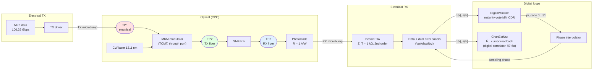
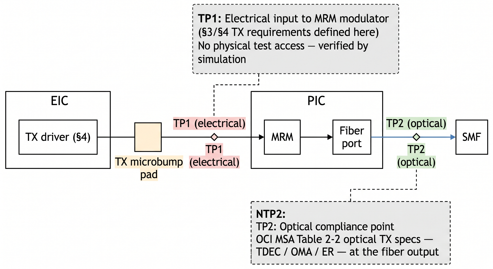
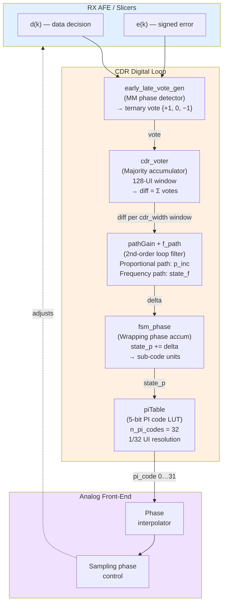
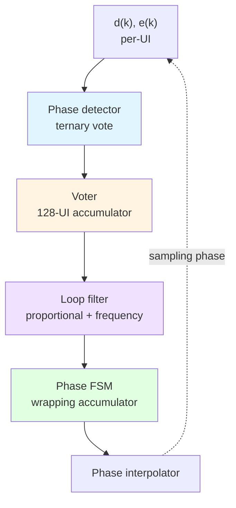
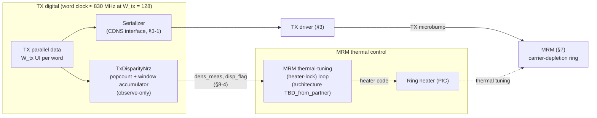
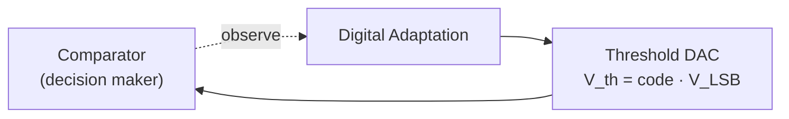

# Gizmo Arch Spec

This document covers the 106.25 Gbps NRZ (106.25 GBd) operating point; a 53 Gbps half-rate (53.125 GBd) mode is planned. As an analog SerDes PMA without a baud-rate waveform ADC or DSP equalizer in the mission data path, digital logic handles only clock recovery, adaptation, sequencing, and control-code generation from sliced decisions. Consequently, analog waveform integrity remains a key architecture and sign-off priority, even for digitally controlled loops.

---

## Section 1: Link Overview

### 1-1 Top-level block diagram



### 1-2 Primary goals

1. Error-free 106.25 GBd NRZ transport: Driver, MRM, PD, and TIA bandwidths dominate the ISI budget..
2. Hitless analog TX equalization: Pre-driver (CDNS) and driver are related blocks (§3); the driver implements a 3-tap analog FIR with glitchless mission-mode updates to adjust equalization without BER loss.
3. Baud-rate RX path: Data and dual error slicers feed integer digital loops, CTLE extends TIA bandwidth, and an observe-only estimator computes baud-spaced cursor estimates ĥ_i from slicer outputs.
4. Hardware-faithful digital control: Adaptation loops and CDR operate as integer truth-table/accumulator machines.
5. Self-contained bring-up: Thresholds (Vp), gain (AGC), vertical centering (offset/BLW), equalization (CTLE peaking), and timing (MM CDR) converge from received data per Section 7–10 hierarchy.
6. Rich Telemetry 

### 1-3 Target performance metrics

| Metric | Target | Source / status |
|---|---|---|
| Line rate | 106.25 Gbps NRZ (106.25 GBd) | Fixed; model constant `DATA_RATE = 106.25e9` |
| UI | ≈ 9.41 ps | 1 / 106.25 GHz |
| Nyquist | 53.125 GHz | `NYQUIST_HZ = DATA_RATE / 2` |
| Reference-receiver bandwidth | 53.125 GHz (0.5 × baud, BT4) | Measurement/compliance reference|
| Raw (uncoded) BER — internal spec | **< 1e-12** | Committed internal target |
| Pre-FEC BER — standards anchor | 2.4E-4 | Used a measurement anchor, not our operating target|
| Energy efficiency, TX driver | 0.X pJ/bit | Tallied **separately** from the SerDes power budget |
| Energy efficiency, RX TIA | 0.X pJ/bit | Tallied **separately** from the SerDes power budget |
| Energy efficiency, SerDes | 0.X pJ/bit | Serializer, TX digital, RX slicers, clocking, and RX logic.|
| Energy efficiency, total link | 3 pJ/bit | Fluid; TX driver + RX TIA + SerDes + optical/PIC |
| Modulation | NRZ | Fixed |
| CDR frequency tolerance, required | ±100 ppm relative (±50 ppm per end) | Per IEEE P802.3dj; consistent with OIF-CEI|
| CDR frequency tolerance, design target | ±200 ppm (2× margin over required) | Frequency register sized to this target|
| CDR closed-loop bandwidth, design target | 4–6 MHz| JTOL from OIF CEI-112G-XSR Table 24-12 and IEEE P802.3dj Tables 179-12 / 182-20 masks |

**Power-accounting convention.** Although the analog TX driver and RX TIA are physically within the SerDes/PMA, their power is tracked separately. The SerDes budget covers only the serializer, TX digital, RX slicers, clocking, and RX logic. The driver and TIA represent internal allocations rather than partner deliverables, while optical/PIC elements (laser, heaters) are budgeted separately. Total link efficiency (pJ/bit) combines all four categories.

---

## Section 2: TX Electrical Jitter Targets at TP1

This section defines the electrical TX signal-quality targets at **TP1**, the electrical input to the MRM modulator (§A-1, Figure 2-1). The optical MSA specifies TX quality only through the **TDEC** family (≤ 3.4 dB at pre-FEC BER 2.4E-4; reference receiver = fourth-order Bessel–Thomson (**BT4**) low-pass at 0.5 × baud) and provides no electrical decomposition that can bind the transmitter. The targets therefore come from two distinct sources, kept in separate subsections: **§2-1** adopts the three clock-jitter limits of IEEE P802.3dj Table 179-7 (the only standard at exactly this baud), and **§2-2** defines the internal dual-Dirac jitter budget at the raw-BER 1e-12 operating point — quantities dj deliberately does not specify. **§2-3** makes the correlation between the two sets of limits explicit.



*Figure 2-1: Transmit-direction test points in this CPO architecture. **TP1** is the electrical input to the MRM modulator (the modulator drive terminals) where all TX electrical requirements (§2 TP1 targets, §3 driver specs) are defined; it is buried inside the package with no physical test access and is verified by simulation, on-die instrumentation, and test-vehicle correlation. **TP2** is the optical fiber output, the link's only accessible TX compliance point (IEEE optical-PMD convention), where the OCI MSA binds TDEC/OMA/ER (its RX counterpart TP3 appears in the MSA stressed-receiver spec).*

### 2-1 Adopted standard limits — IEEE P802.3dj D3.1, Table 179-7

**IEEE P802.3dj D3.1 (Table 179-7)** is the only standard that specifies an electrical lane at exactly our 106.25 GBd, and it is the standard through which the OCI MSA's normative reference chain runs. The dj 200G/lane electrical clauses are **PAM4** — **no NRZ electrical standard exists at 106.25 GBd, in dj or anywhere else** — so the dj values are used as *exact-baud analogs* (note (a) below). The adopted metrics are the three output-jitter parameters `JHRMS`, `JH4u`, `EOJ03` (179.9.4.7; D3.1 renamed `JRMS03`/`J4u03` to `JHRMS`/`JH4u` and collapsed the per-host-class J4u values to one number):

| dj metric | dj subclause | Target at TP1 (adopted from Table 179-7) | Abs. @ 9.412 ps UI | What it bounds |
|---|---|---|---|---|
| Signaling rate | 179.9.4.1 | 106.25 GBd ± 50 ppm | — | Baud-rate accuracy; consistent with the §1-3 CDR frequency-tolerance rows (±50 ppm per end) |
| `JHRMS` | 179.9.4.7.1 | ≤ 0.023 UI rms | ≤ 216 fs rms | RMS clock jitter (slope-extrapolated; additive noise removed) |
| `EOJ03` | 179.9.4.7.3 | ≤ 0.025 UI pp | ≤ 235 fs pp | Even–odd jitter — the DCD analog |
| `JH4u` | 179.9.4.7.2 | ≤ 0.118 UI pp | ≤ 1.11 ps pp | Bounded high-probability clock jitter (all-but-1E-4 interval of the jitter distribution) |

Notes:

- **(a) PAM4 numbers on an NRZ link.** `EOJ03` is even–odd jitter on PAM4 levels 0↔3 (full-swing edges — the only kind NRZ has). `JHRMS`/`JH4u` fit timing spread vs. edge slope and extrapolate to infinite slope, isolating clock phase noise, which is modulation-agnostic at the same baud.
- **(b) dj books no ISI/DDJ.** Transition locations, thresholds, and the JH extrapolation exclude pattern-dependent closure; those allocations are made in §2-2 and are enforced by the §3-2 transition-time window and §3-4 eye mask.
- **(c) TP1 is unprobeable.** It is the MRM drive terminals (Figure 2-1); the only accessible compliance points are optical **TP2** (TX fiber) and **TP3** (RX fiber). Table 179-7 therefore binds design verification (simulation, on-die instrumentation, test-vehicle), not a bench test. Measurement (179.9.4): BT4 at 60 GHz, AC-coupled 50 Ω, CRU 4 MHz / 20 dB per decade, PRBS13Q (PRBS9Q allowed per 179.9.4.7).

### 2-2 Internal dual-Dirac jitter budget — normative allocations at raw BER 1e-12

**Why this budget exists.** dj contains no dual-Dirac jitter decomposition — no $\sigma_{RJ}$ / $DJ_{\delta\delta}$ split, no $DDJ = DCD + ISI$ sub-allocation, no BUJ — and no total-jitter-at-BER metric: its jitter methodology isolates clock jitter by construction (note (b)) and excludes pattern-dependent closure. dj also has no concept of this link's committed **raw BER < 1e-12 FEC-free** operating point (§1-3): every dj limit is anchored to RS-FEC operation at pre-FEC BER 2.4E-4. The decomposed budget the design needs at the internal operating point therefore cannot be sourced from any standard and is defined normatively in the table below; the full first-principles derivation (clock-chain phase-noise build-up, duty-cycle/rise-fall model, first-order settling model, crosstalk slew model, and sensitivity analysis) is in the companion `tx_jitter_budget_derivation.md` and is not required to apply these numbers. The related 20–80% transition-time window and TP1 eye-mask geometry are carried in **§3-2 and §3-4**.

**Assembly convention.** Bounded (deterministic) terms add linearly (worst-case alignment), Gaussian terms RSS, with $DDJ = DCD + ISI$ and $DJ_{\delta\delta} = DDJ + BUJ$; total jitter at a given BER is the dual-Dirac opening $TJ(\mathrm{BER}) = DJ_{\delta\delta} + 2\,Q(\mathrm{BER})\,\sigma_{RJ}$, where $Q$ is defined by $\mathrm{BER} = \tfrac{1}{2}\,\mathrm{erfc}\!\left(Q/\sqrt{2}\right)$: $Q = 3.49$ at the dj pre-FEC anchor 2.4E-4 and **$Q = 7.034$ at the internal raw-BER 1e-12 operating point** (transition density ρ = 1, the conservative convention).

| Quantity | Symbol | Requirement at TP1 | Abs. @ 9.412 ps UI |
|---|---|---|---|
| RMS random jitter | $\sigma_{RJ}$ | ≤ 0.011 UI rms (`JH4u`-bound, §2-3) | ≤ 104 fs |
| Duty-cycle distortion | `DCD` | ≤ 0.025 UI pp | ≤ 0.235 ps |
| ISI jitter | `ISI` | ≤ 0.012 UI pp | ≤ 0.113 ps |
| Bounded uncorrelated jitter | `BUJ` | ≤ 0.036 UI pp | ≤ 0.339 ps |
| Data-dependent jitter | $DDJ = DCD + ISI$ | ≤ 0.037 UI pp | ≤ 0.348 ps |
| Deterministic total | $DJ_{\delta\delta} = DDJ + BUJ$ | ≤ 0.123 UI pp with FIR included (baseline); ≤ 0.073 UI pp no-FIR | ≤ 1.16 / 0.69 ps |
| Total jitter at BER 1e-12 | `TJ` | ≤ 0.278 UI pp with FIR included (baseline); ≤ 0.228 UI pp no-FIR | ≤ 2.61 / 2.14 ps |
| Eye-mask half-closure | $X_1$ | 0.139 UI with FIR included (baseline); 0.114 UI no-FIR | 1.31 / 1.07 ps |

**Sensitivity.** $\partial TJ/\partial\sigma_{RJ} = 2Q \approx 14.1$ at 1e-12: every 10 fs rms of clock jitter costs 141 fs of eye, while bounded terms trade 1:1. Clock-chain phase noise — not edge rate — is where design effort buys the most margin, which is why $\sigma_{RJ}$ carries a kill-or-confirm flag.

### 2-3 Correlation between the §2-1 dj limits and the §2-2 internal budget

The two tables do not map term-for-term because they measure different things: the dj JH family isolates **clock** jitter (slope-extrapolated, pattern-dependent closure excluded, note (b)), while the internal budget decomposes **all** timing error at TP1 by physical origin. The crosswalk:

| dj metric (§2-1) | dj limit | Internal analog (§2-2) | Internal value | Status |
|---|---|---|---|---|
| `JHRMS` | ≤ 0.023 UI rms | $\sigma_{RJ}$ | ≤ 0.011 UI rms | Consistent — 52% inside the dj ceiling |
| `EOJ03` | ≤ 0.025 UI pp | `DCD` | ≤ 0.025 UI pp | Coincident — the DCD derivation lands exactly on the dj ceiling (`tx_jitter_budget_derivation.md` §3) |
| `JH4u` | ≤ 0.118 UI pp | Clock-visible jitter at 1E-4: $BUJ + 2\,Q(10^{-4})\,\sigma_{RJ} = 0.036 + 0.082$ | 0.118 UI pp | Coincident — $\sigma_{RJ}$ sized to land on the dj ceiling (tougher-spec rule; see below) |
| — | — | `ISI`, `DDJ` | ≤ 0.012 / 0.037 UI pp | No dj counterpart: the JH method excludes pattern-dependent closure (note (b)); enforced instead by the §3-2 edge window and §3-4 eye mask |
| — | — | `TJ`(1e-12), $X_1$ | ≤ 0.278 / 0.139 UI (FIR incl.); 0.228 / 0.114 no-FIR | No dj counterpart: dj defines no total-jitter-at-BER metric and no raw-1e-12 operating point |

**RMS random jitter is bound by the dj `JH4u` ceiling.** Although TP1 is a design-verification point, not a dj compliance point (note (c)), the internal budget adopts the tougher of the two constraints: at the fixed BUJ = 0.036 UI, meeting `JH4u` ≤ 0.118 UI pp requires $\sigma_{RJ} \le$ **0.011 UI rms (104 fs)**, landing exactly on the ceiling. All §2-2 derived quantities (`TJ`, $X_1$) and the §3-2 / §3-4 masks carry this value. 104 fs rms is tighter than the ≈142 fs clock-chain build-up in the companion `tx_jitter_budget_derivation.md` (itself flagged there as an aggressive, low-confidence estimate), so the kill-or-confirm on $\sigma_{RJ}$ remains open, with the $2Q \approx 14.1$ sensitivity making clock phase noise the binding design effort.

---

## Section 3: TX Pre-Driver & Driver Specification

The TX electrical path is specified as **two separate blocks with separate but related specs**: the **input pre-driver** (§3-1), delivered by **CDNS**, which receives the serializer output and conditions and fans out the full-rate NRZ into the driver's tap branches; and the **TX driver** (§3-2), the modulator-facing output stage that implements the three-tap **analog TX FIR** and drives the MRM through the TX microbump (§3-3). Every FIR-related specification — tap count, weight bounds and resolution, tap-delay generation, coefficient matching, glitchless coefficient updates — lives with the TX driver, because the FIR is implemented in the driver; the pre-driver's job is to hand the driver edges and jitter that leave enough of the §2 TP1 budget for the driver to close its §3-2 limits.

### 3-1 Input pre-driver — CDNS deliverable

The serializer-to-driver input interface and pre-driver implementation shall be completed by **CDNS**. CDNS shall provide values that close the §2 TP1 jitter targets and the §3-2 loaded-pad driver limits.

| Parameter | Placeholder / symbol | Target / Default | Notes / Basis |
|---|---|---|---|
| **Serializer output level (differential swing)** | — | To be filled out by CDNS | Define the differential output swing (`TBD_from_partner`). |
| **Serializer output common-mode voltage** | — | To be filled out by CDNS | Define the common-mode voltage (`TBD_from_partner`). |
| **Serializer output polarity** | — | To be filled out by CDNS | Define the output polarity convention (`TBD_from_partner`). |
| **Serializer legal static states** | — | To be filled out by CDNS | Define legal static (non-toggling) output states, e.g. for squelch/idle (`TBD_from_partner`). |
| **Driver input loading (differential)** | $C_{in,drv,diff}$ | To be filled out by CDNS | Maximum differential capacitance presented to the serializer, including routing (`TBD_from_partner`). |
| **Driver input loading (common-mode)** | $C_{in,drv,cm}$ | To be filled out by CDNS | Maximum common-mode capacitance presented to the serializer, including routing (`TBD_from_partner`). |
| **Serializer electrical fanout** | — | To be filled out by CDNS | Define the electrical fanout (`TBD_from_partner`). |
| **Serializer lane count** | — | To be filled out by CDNS | Define the lane count for the serializer interface (`TBD_from_partner`). |
| **Serializer interface buffering** | — | To be filled out by CDNS | Define any buffering stages in the serializer-to-driver interface (`TBD_from_partner`). |
| **Termination / level conversion** | — | To be filled out by CDNS | Define any required termination or level conversion between serializer and driver (`TBD_from_partner`). |
| **Pre-driver output swing** | — | To be filled out by CDNS | Define the swing interface into the driver's signed analog-FIR tap slices across all enabled tap codes  |
| **Pre-driver output common mode** | — | To be filled out by CDNS | Define the common-mode interface into the driver's signed analog-FIR tap slices across all enabled tap codes  |
| **Pre-driver rise time** | $t_{r,pre}$ | To be filled out by CDNS | Must support the §3-2 pad-level 20–80% transition-time window without becoming the dominant ISI source  |
| **Pre-driver fall time** | $t_{f,pre}$ | To be filled out by CDNS | Must support the §3-2 pad-level 20–80% transition-time window without becoming the dominant ISI source  |
| **Pre-driver bandwidth** | $BW_{pre}$ | To be filled out by CDNS | Must support the §3-2 pad-level 20–80% transition-time window without becoming the dominant ISI source  |
| **Pre-driver RJ allocation** | $J_{pre,RJ}$ | To be filled out by CDNS | Allocate random jitter within the §2 TP1 jitter targets (`JHRMS`, `JH4u`) and the §3-2 internal allocations (`TBD_from_link_budget`). |
| **Pre-driver DCD allocation** | $J_{pre,DCD}$ | To be filled out by CDNS | Allocate duty-cycle distortion within the §2 TP1 jitter targets (`EOJ03`) and the §3-2 internal allocations (`TBD_from_link_budget`). |
| **Pre-driver bounded-jitter allocation** | $J_{pre,BUJ}$ | To be filled out by CDNS | Allocate bounded (uncorrelated) jitter within the §2 TP1 jitter targets (`JH4u`) and the §3-2 internal allocations (`TBD_from_link_budget`). |
| **Static duty-cycle error** | — | To be filled out by CDNS | Static duty-cycle error, under PVT  |
| **1-UI delay accuracy** | — | To be filled out by CDNS | 1-UI tap-delay accuracy, under PVT  |
| **Inter-phase skew** | — | To be filled out by CDNS | Phase skew between interface signals, under PVT  |
| **Power** | — | 0.33–0.40 pJ/bit (diff), 33–40% of total driver power depending on fan-out | FO4: 0.33 pJ/bit (33% of total); FO2: 0.40 pJ/bit (40% of total) at 3.0 Vppd (`TxDriver.pdf`, TX driver architecture study). Lower-FO pre-drivers cost more power for a faster/cleaner edge into the driver's tap slices. |
| **Area** | — | To be filled out by CDNS | No die-area figure available yet; scales with fan-out and pre-driver device count (`TBD_from_partner`). |

### 3-2 TX driver — analog TX FIR and electrical limits at TP1

An output stage utilizing a voltage-mode topology was selected instead of current-mode, delivering approximately twice the energy efficiency for equivalent signal swings. Series inductive peaking ($L_{out}$) is integrated at the output node to expand bandwidth. The electrical performance limits detailed in the table below are measured differentially at TP1 (the electrical input interface of the MRM modulator) under the extracted 150 fF load of the MRM and pad assembly (§3-3). All timing parameters require verification across PRBS13 and PRBS31 test patterns, process/temperature/voltage (PVT) corners, extreme tap-code settings, and active multi-lane WDM operations.

| Parameter | Placeholder / symbol | Target / Default | Notes / Basis |
|---|---|---|---|
| **Driver output-stage architecture** | — | Voltage-mode | Use series-inductive-peaking BW extension. |
| **Output device stacking** | — | 2.0 Vppd: unstacked (single device)<br>3.0 Vppd: 2× series-stacked device pairs per rail | Stacking is main driver of the 3.0 Vppd case. |
| **Number of taps** | `N_tap` | 3 (pre, main, post) | Branch delays fixed at 0/1/2 UI  |
| **Tap weight boundaries** | `w_pre`, `w_post` | `w_pre`: 0 to −0.25<br>`w_post`: 0 to −0.25 | Could be assymmteric if pre/post ISI are very different. |
| **Tap resolution** | `N_tapq` | 2 bits  | Coefficient-quantization noise must remain negligible. |
| **Tap-delay generation** | — | To be filled out by CDNS | Define how the pre/main/post 0/1/2-UI branch phases are generated. |
| **Inter-tap phase delay matching** | — | ≤±250 fs (≤2.6% UI) | Phase skew between FFE slices. |
| **Coefficient update behavior** | — | **Glitchless (hitless) in mission mode** | Tap codes are updatable during live traffic without BER impact. |
| **Differential output swing** | `V_PP` | 2.0 Vppd to 3.0 Vppd | Hard clip after summation. |
| **Main supply / MRM-bias / ESD headroom** | — | 2.0 Vppd: main supply 0.90–0.96 V; MRM bias ≥1.2 V; output ESD ≥ MRM bias + 0.5 V.<br>3.0 Vppd: main supply ≥1.5 V; MRM bias ≥1.7 V; output ESD ≥ MRM bias + 0.75 V | Lower 2.0 Vppd supply follows directly from the unstacked single-device ≈0.96 V ceiling above; MRM-bias headroom assumes a 0.2 V drop across the bias resistor from photodiode current, to avoid forward-biasing the MRM (`TxDriver.pdf`, TBD final bias level `TBD_from_partner`). |
| **Electrical rise/fall time (20–80%)** | $t_{r,e}$, $t_{f,e}$ | 3.5 ps typical target (0.35 UI) |   |
| **Electrical rise/fall mismatch** | $\Delta t_{rf,e}=\lvert t_{r,e}-t_{f,e}\rvert$ | ≤0.35 ps (≤3.7% UI) | Limits TP1 electrical asymmetry so the asymmetric FFE capacity corrects the optical ring's nonlinear depletion dynamics  |
| **Global deterministic jitter** | $DJ_{\delta\delta}$ | ≤0.123 UIpp (≤1.16 ps) FIR included (baseline); ≤0.073 UIpp (≤0.69 ps) no-FIR | §2: $DJ_{\delta\delta}=DCD+ISI+BUJ$. The FIR value includes ≈0.05 UI FIR slice-DCD; the no-FIR option (removal study, §3 intro) sets that term to zero. |
| **Data Dependent Jitter** | `DDJ` | ≤0.037 UIpp (≤0.348 ps) | §2: $DDJ=DCD+ISI$. Pattern-dependent timing jitter under PRBS13/PRBS31. |
| **Intersymbol Interference jitter** | `ISI` | ≤0.012 UIpp (≤0.113 ps) | §2: finite-bandwidth settling at the 4.0 ps hard-max 20–80% edge and 150 fF microbump load (§3-3). |
| **Duty Cycle Distortion** | `DCD` | ≤0.025 UIpp (≤0.235 ps) | §2: DCC residual plus the $\Delta t_{rf}\le0.35$ ps rise/fall-mismatch row above. Coincident with the dj `EOJ03` ceiling. The FIR baseline separately books ≈0.05 UI of FIR slice-DCD; zero in the no-FIR option. |
| **Bounded Uncorrelated Jitter** | `BUJ` | ≤0.036 UIpp (≤0.339 ps) | §2: simultaneous-lane WDM electrical crosstalk, ≤2.5% coupling at the 2.0 Vppd / 4.0 ps corner. |
| **Power (output stage)** | — | 2.0 Vppd: 0.10 pJ/bit (diff)<br>3.0 Vppd: 0.26 pJ/bit (diff) | Voltage-mode output stage only, excludes pre-driver (§3-1) and tap-slice/bias overhead (`TxDriver.pdf`). Add ≈0.1 pJ/bit if resistive-feedback BW enhancement is used. |
| **Area (output stage)** | — | 2.0 Vppd:  XXXX <br>3.0 Vppd: XXXX |  |

Note: A study of an architecture which employs a non-standard FIR strategy deviating from typical approaches to specifically address unique MRM lock point sensitivities is under investigation. 

### Glitchless TX FIR Coefficient Update 
Glitchless (hitless) coefficient updates. Tap codes must be updatable during live transmission without degradation of raw BER while avoiding error bursts or RX re-acquisition. Required for mission mode, this enables live trimming for temperature and aging drifts.

---

## Section 4: TIA Specification

This section covers three analog functional blocks within a single combined macro: the TIA (photodiode and transimpedance amplifier), the CTLE (peaking equalizer), and the AGC (front-end gain control). While AGC gain control and CTLE peaking are integrated directly into the physical TIA macro, their unified electrical requirements are defined together here as a single specification. Section 7 maintains responsibility for the digital adaptation loops that command their respective settings.


### 4-1 Parameters

| Parameter | Placeholder | Default | Notes |
|---|---|---|---|
| Transimpedance gain range | `Z_T,min`–`Z_T,max` | **62–80 dBΩ** | 1st cut target. RXTIA spec: ≥75 dBΩ at max-gain, ≤65 dBΩ at min-gain — consistent. |
| Transimpedance gain step | `G_step` | **0.5 dB** | Fluid. RXTIA spec: 0.25 typ / 0.5 max. |
| CTLE peaking range | `P_min`–`P_max` | **2.5–10.0 dB** | Fluid |
| CTLE peaking step | `P_step` | **0.5 dB** | Fluid |
| −3 dB corner | `f_c` | 60 GHz | Target. RXTIA spec: ≥50 GHz min — consistent. |
| High-pass corner (DCOC) | `f_HP` | **100 kHz** | First-cut target; set by the TIA DC-offset-cancellation loop and sized to hold baseline wander to ≤0.05 dB over a 72-bit consecutive-identical-digits (CID). Matches RXTIA spec (≤100 kHz, set by DCOC loop BW). |
| Input-referred noise (rms) | `I_n,rms` | **4 µA rms** | Excludes PD shot noise; integrated DC → 1.5×`f_N`. RXTIA initial spec target was ≤2 µA rms, flagged there as likely infeasible given input capacitance (`TBD_from_partner`). |
| Differential output swing (peak-to-peak) | — | 100–600 mVpp | RXTIA spec. |
| Total harmonic distortion (THD) | — | ≤8% | RXTIA spec. |
| Overload / dynamic range | — | — | **New link-budget requirement**: 160–700 µA$_{pp}$ input overload range; AGC ≥14 dB range at ≤1 dB steps (same quantity as the `G_step` row above) (`OCI_Link_Budget_Summary.md` §4). RXTIA spec: 125–400 µA$_{pp}$ (narrower; `TBD_from_partner`). |
| DC cancellation | — | — | **New link-budget requirement**: ≥750 µA (`OCI_Link_Budget_Summary.md` §4). RXTIA spec: max input DC current ≤520 µA — below this requirement (`TBD_from_partner`). |
| RX microbump | — | DC gain ≈ 0.996 | Applied to the photocurrent (PIC→EIC). **Link-budget requirement: ≤25 fF, ≤30 pH** (booked as a single 127 GHz pole; 50 fF would cost an extra +0.5 dB of ISI) (`OCI_Link_Budget_Summary.md` §8; Report §4.1). Combines with the PD's own junction capacitance (30–40 fF assumed, **unmeasured, low confidence**) at the TIA input node: a combined 60 fF would strand the 4.0 µA noise-ceiling line above and is a **buildability gate**, not a margin lever. |
| Group-delay variation| `GDV` | **≤ 3 ps** | DC to Nyquist. Matches RXTIA spec (phase delay variation ≤3 pS). |
| Energy efficiency | — | **0.4 pJ/bit** | Analog TIA allocation (§1-3), including analog CTLE/AGC current that lives in the TIA macro. Tallied **separately** from the SerDes budget (RX slicers, clocking, RX logic). Not a partner deliverable. RXTIA spec target: ≤0.2 pJ/bit (~20 mW) (`TBD_from_partner`). |
| Area | — |   | No die-area figure available yet for the TIA/CTLE/AGC macro; scales with the TIA option selected and the CTLE pole count (`TBD_from_partner`). |

---

## Section 5: Clocking Circuits (TX PLL, Clock Distribution, Phase Interpolator)

**Status:** Placeholder — to be completed with detailed specifications.

This section covers the TX clock generation and distribution chain that feeds the serializer and provides the phase-interpolated sampling clock for the CDR. Key subsystems include:

- **TX PLL:** 53.125 GHz LC-PLL generating the half-rate clock; integrated phase-noise budget allocated in `tx_jitter_budget_derivation.md` §2 (100 fs rms nominal; §2-3 tougher-spec binding at 104 fs rms total).
- **Clock distribution buffers:** Low-jitter clock tree routing to serializer and CDR; 60 fs rms allocation per `tx_jitter_budget_derivation.md` §2.
- **Phase interpolator (PI):** Full-rate (1.0 UI span) 5-bit delay-locked loop element; 70 fs rms jitter allocation; commands the sampling phase via CDR loop.
- **Serializer interface:** 2:1 mux at half rate clocked by the PLL; final stage jitter allocation 40 fs rms per `tx_jitter_budget_derivation.md` §2.

**Normative references:**
- `tx_jitter_budget_derivation.md` §2 (RJ build-up and RSS total)
- `tx_jitter_budget_derivation.md` §7 (cross-check against dj `JHRMS`, `JH4u` ceilings)
- Section 2 of this document (TP1 jitter targets) — the clock chain must close to ≤ 104 fs rms RJ to meet the `JH4u` allocation.

**Placeholder subsections (TBD):**
- 5-1: PLL architecture and phase-noise specification
- 5-2: Clock distribution bandwidth and skew budget
- 5-3: Phase interpolator delay-cell characterization
- 5-4: Serializer timing and output jitter model
- 5-5: PVT sensitivity and tuning ranges

---

## Section 6: Clock and Data Recovery (CDR)

The CDR is a baud-rate, second-order, Mueller–Müller CDR, structured so its block-level partitioning maps directly onto the eventual RTL/silicon implementation . It consumes only the sliced `d(k)` and signed `e(k)` from the dual-error-slicer stage — no soft samples.

### 6-1 Block architecture



**Signal flow:** Per UI, the phase detector generates a ternary vote {early, no-vote, late}. The voter accumulates 128 votes per window, generating a signed majority sum `diff`. The 2nd-order loop filter splits `diff` into a fast proportional path and a slower frequency-tracking integrator. The phase FSM wraps the accumulated delta into the PI code space (1/32 UI), which commands the phase interpolator and closes the loop on the sampling instant. Lock occurs when `h(−1) = h(+1)` on the equalized eye (§6-3).

| RTL block | Function |
|---|---|
| `early_late_vote_gen` | Per-symbol ternary vote generator (MM phase detector) |
| `cdr_voter` | Majority-accumulates votes over `cdr_width` UI (downsampler) |
| `pathGain + f_path` | 2nd-order integer loop filter (proportional + frequency register) |
| `fsm_phase` | Wrapping phase accumulator in sub-code units |
| `piTable` | 5-bit PI code → sampler delay LUT |
| top orchestration | `step(d, e, state) → (state, pi_code)` |

### 6-2 Parameter table

| Parameter | Placeholder | Model/RTL name | Range | Default | Meaning |
|---|---|---|---|---|---|
| Update window | `W_cdr` | `cdr_width` | TBD | **128** UI | UI accumulated in the voter per loop-filter update (parallel bus width in silicon); sets the digital update clock at 106.25 GBd / 128 ≈ **830 MHz** (< 1 GHz) |
| Proportional numerator | `K_p,num` | `p_step` | TBD | **2** | Per-window proportional step = `diff · p_step / p_div` PI codes |
| Proportional divider / phase granularity | `K_p,den` | `p_div` | TBD | **512** | Also the sub-code granularity of the phase accumulator; recommended **programmable** for an acquisition gear-shift (see §6-8) |
| Frequency step | `K_f,num` | `f_step` | TBD | **2** | `state_f += diff · f_step` per window |
| Frequency divider | `K_f,den` | `f_div` | TBD | **64** | `f_out = floor(state_f / f_div)` sub-codes per window; paired with `cdr_width` so that `f_div · cdr_width` (and hence the §6-6 frequency scaling) is invariant across window-width changes |
| Frequency clamp | `F_max` | `f_bound` | TBD | **2^15** = 32 768 | `state_f` saturates at ±`f_bound` (no wrap); sized for the ±200 ppm design target — see §6-6 for the sizing rule |
| Path enables | — | `en_p`, `en_f` | TBD | `True`, `True` | Gate the proportional / frequency paths individually |
| Loop polarity | — | `flip_dir` | TBD | `False` | Negates `delta` before the phase accumulator |
| PI resolution | `N_PI` | `n_pi_codes` | TBD | **32** (5-bit) | Codes across the PI span |
| PI span | — | `pi_span_ui` | TBD | **1.0** UI (full-rate PI) | Set 2 for a GTH-style half-rate PI over 2 UI |
| Initial PI code | — | `init_pi` | TBD | 0 | |

Derived fixed-point widths (all derived, not stored as separate config):

| Register | Placeholder | Width formula | Default width |
|---|---|---|---|
| Voter accumulator `CdrVoter.acc` | `N_diff` | `⌈log2(cdr_width)⌉ + 2` (signed, holds ±`W_cdr`) | 9 bits (±128) |
| Frequency register `LoopFilter.state_f` | `N_f` | `⌈log2(f_bound)⌉ + 2` (signed, holds ±`f_bound` inclusive) | 17 bits (±2^15) |
| Phase accumulator `FsmPhase.state_p` | `N_p` | `⌈log2(n_pi_codes · p_div)⌉ + 1` (signed, wraps on ±`reg_max = n_pi_codes·p_div`) | 15 bits (±16384), set by `p_div·n_pi_codes` = 512·32 = 16 384 |
| PI code | — | `log2(n_pi_codes)` | 5 bits |

Phase resolution: one PI code = `pi_span_ui / n_pi_codes` = **1/32 UI ≈ 294 fs**; one phase-accumulator sub-code (`p_div` unit) = `1/(n_pi_codes · p_div)` = 1/16 384 UI ≈ 0.57 fs (unchanged).

### 6-3 Phase detector and vote truth table

`EarlyLateVoteGenNrz` is a **per-symbol ternary vote generator**. The vote for symbol `k` fires when `d(k+1)` arrives. For sliced ±1 NRZ every data transition is symmetric (`d(k+1) = −d(k−1)`), so the phase detector reduces to a single ternary vote per symbol:

**CDR vote truth table** (NRZ):

| `d(k−1)` | `d(k+1)` | `e(k)` | vote | Verdict |
|---|---|---|---|---|
| +1 | +1 | ± | 0 | no crossing (no vote) |
| −1 | −1 | ± | 0 | no crossing (no vote) |
| +1 | −1 | +1 | +1 | **early** |
| +1 | −1 | −1 | −1 | **late** |
| −1 | +1 | +1 | −1 | **late** |
| −1 | +1 | −1 | +1 | **early** |

Sign convention: the voter accumulates the ternary votes, i.e. **(early − late)** counts, so a **positive window sum `diff` ⇒ increase PI delay**. Lock occurs at `h(−1) = h(+1)` on the equalized pulse.

**Dead-band / hysteresis (CDR):** the CDR carries **no explicit dead-band** — noise rejection comes from the *majority vote itself*: `cdr_width = 128` ternary votes are summed before any loop-filter action, so uncorrelated dither averages toward `diff ≈ 0` and only a persistent early/late majority moves the phase. Quantisation of the two paths (`p_div`, `f_div` floor division) additionally suppresses sub-LSB activity.

### 6-4 Downsampling: the windowed voter

`CdrVoter` is the downsampler between the 106.25 GBd symbol rate and the loop-filter update rate:

```python
# CdrVoter.step — one call per UI
self.acc += vote           # vote ∈ {+1 (early), 0 (no crossing), −1 (late)}
self.count += 1
if self.count < self.cdr_width:
    return None            # window still open: no loop-filter update
diff = self.acc            # signed majority sum (early − late), |diff| <= cdr_width
self.acc = 0; self.count = 0
return diff                # one dump per cdr_width UI
```

This matches how the update path is intended to clock in the eventual silicon implementation: the digital loop runs on a **deserialized bus of `cdr_width = 128` UI**, so the loop filter and phase FSM update at 106.25 GHz / 128 ≈ **830 MHz** — keeping the entire digital update path **below 1 GHz**, a comfortable synthesis target (the previous 32-UI working point implied a ≈ 3.32 GHz update clock, which is aggressive for standard-cell digital). The dump is detected downstream as `state.dump_count` incrementing. The hardware cost of the wider bus is small: a 128-input ternary adder tree in place of a 32-input one, and the voter accumulator growing from 7 to 9 bits.

### 6-5 Data paths: phase and frequency




Per window dump (`LoopFilter.step` then `FsmPhase.step`):

```python
# LoopFilter.step(diff) — integer arithmetic, per cdr_width-UI window
p_inc   = diff * p_step if en_p else 0                       # proportional path
if en_f:
    state_f = clip(state_f + diff * f_step, -f_bound, +f_bound)   # frequency register
f_out   = floor(state_f / f_div)
delta   = p_inc + f_out                                      # in p_div sub-code units

# FsmPhase.step(delta) — wrapping phase accumulator
state_p = wrap(state_p + (-delta if flip_dir else delta),    # modular wrap on
               [-reg_max, +reg_max))                         # reg_max = n_pi_codes*p_div
pi_code = floor(state_p / p_div) % n_pi_codes                # 5-bit output
```

- **Phase (proportional) path**: per window the phase moves `diff · p_step / p_div` PI codes. With defaults this is `diff · 2/512 ≈ diff · 0.0039` codes per window (= `diff · 1.22×10⁻⁴` UI per 128-UI window). Because `diff` scales with the window length for a persistent phase error, the *per-UI* proportional gain is independent of `cdr_width`.
- **Frequency path**: `state_f` is a saturating integrator of `diff`; its *divided-down* value `floor(state_f / f_div)` is added into every window's `delta`, producing a constant phase ramp — i.e. a frequency offset. The floor division means the frequency contribution has hysteresis-free `f_div`-sized quantisation: `state_f` must accumulate at least `f_div = 64` counts before the ramp changes by one sub-code per window.
- **Phase accumulator**: the only wrapping register in the whole receiver (`FsmPhase`); everything else saturates. Wrap is modular over `2·reg_max` so continuous phase rotation (plesiochronous operation) is unlimited; an `unwrapped` shadow counter is maintained for observability only.

### 6-6 Frequency accumulator: sizing for a ppm offset, and saturation

A steady value of `state_f` produces a phase ramp of

```text
Δφ per window = (state_f / f_div) / p_div · (pi_span_ui / n_pi_codes)   [UI]
ppm           = state_f · 10⁶ / (f_div · p_div · cdr_width · n_pi_codes / pi_span_ui)
```

With defaults (`f_div = 64`, `p_div = 512`, `cdr_width = 128`, `n_pi_codes = 32`, `pi_span_ui = 1`), the denominator is 64·512·128·32 = 2²⁷ = 134 217 728, so:

| Quantity | Value (defaults) |
|---|---|
| Frequency resolution (1 LSB of `state_f`) | 10⁶/2²⁷ ≈ **0.00745 ppm** |
| Max trackable offset (`state_f = ±f_bound = ±2^15`) | ±2¹⁵/2²⁷ · 10⁶ ≈ **±244 ppm** |
| `state_f` value for a 200 ppm offset | 200×10⁻⁶ · 2²⁷ ≈ 26 844 counts |

**Sizing rule.** To guarantee tracking of a target offset `Δf_ppm`:

```text
f_bound ≥ Δf_ppm · 10⁻⁶ · f_div · p_div · cdr_width · (n_pi_codes / pi_span_ui)
N_f     = ⌈log2(f_bound)⌉ + 2        (signed register holding ±f_bound inclusive)
```

The governing frequency-tolerance **requirement** is **±100 ppm relative** (±50 ppm per end under IEEE P802.3dj, verified in D3.1; the same magnitude bounds the OIF-CEI asynchronous baud tolerance). This document adopts a **±200 ppm design target** — a deliberate 2× margin over the required tolerance — to cover reference-clock stack-up and to keep the register unsaturated on the worst-case combination of TX and RX rate error plus low-frequency jitter. At the design target, `f_bound ≥ 26 844`; the specified clamp is `f_bound = 2^15 = 32 768`, a 17-bit signed register, giving a ±244 ppm tracking capability — ~22 % margin over the 26 844 counts a settled 200 ppm offset requires. The clamp must also cover the acquisition transient: `state_f` overshoots its settled value during pull-in (the §6-8 validation shows an overshoot to roughly −28 k before settling at −26.6 k for a +200 ppm offset, ~5 %), which fits comfortably within ±32 768. If the design target changes, `f_bound` re-sizes by the same rule. (The behavioral model's historical default of `f_bound = 2^20` would give ±7 812.5 ppm; that is a model default, not the spec value.)

This sizing depends only on the product `f_div·p_div·cdr_width·n_pi_codes` = 2²⁷ (§6-2), not on how that product is split between the individual factors — so the frequency-register sizing above holds for the `n_pi_codes = 32`, `p_div = 512` configuration exactly as given. The same invariance is what allowed the update window to move from `cdr_width = 32` / `f_div = 256` to `cdr_width = 128` / `f_div = 64` (the < 1 GHz digital-clock change, §6-4) without touching `f_bound`, the ppm resolution, or the ±244 ppm tracking range: `f_div` was scaled down by the same 4× that `cdr_width` grew, keeping `f_div · cdr_width` — and with it both the converged `state_f` for a given offset *and* the per-UI frequency-path gain — identical.

**Saturation logic.** `state_f` is **clamped, not wrapped**: `state_f = clip(state_f + diff·f_step, −f_bound, +f_bound)`. Wrapping a frequency register would be catastrophic (a full-scale frequency sign flip); clamping instead degrades gracefully — if the line frequency offset exceeds the clamp the loop keeps slewing at its maximum ramp rate and simply cannot finish pulling in, which is detectable by the lock detector (persistent one-sided `diff`). The proportional path is unaffected by the clamp.

### 6-7 Loop update summary (per `cdr_width` = 128 UI)

```text
diff    = Σ_window (early − late)                       ∈ [−128, +128]
p_inc   = diff · p_step                                  (= 2·diff sub-codes)
state_f = clip(state_f + diff · f_step, ±f_bound)        (= ±2^15)
delta   = p_inc + floor(state_f / f_div)                 (sub-codes, p_div = 512 per PI code)
state_p = wrap(state_p + delta)                          (±reg_max = ±16384)
pi_code = floor(state_p / p_div) mod 32                  → PI, 1/32 UI per code
```

The lock detector (`CdrLockDetector`, optional via the `lock_detector` field) is fed once per dump with the per-code proportional and frequency contributions (`p_inc/p_div`, `state_f/f_div`); lock gates the bring-up of the slower loops (Section 7-10). A separate **signal-valid gate** (§6-11) suppresses `en_p` and `en_f` on an invalid-signal condition, holding `pi_code`, `state_p`, and `state_f` so the CDR resumes from its held operating point rather than re-acquiring cold.

### 6-7a CDR lock detection

**Purpose.** The lock detector distinguishes between the CDR's **acquisition transient** (where it is still pulling the sampling phase onto the correct data-eye location and frequency register is slewing) and **tracking / mission mode** (where the loop has converged and is in its steady-state dither around the lock point). Lock gates the bring-up of the downstream adaptation loops (§7-10): Vp, offset, CTLE, and AGC are held frozen at their presets until the CDR asserts lock, then released in their nested sequence. This prevents the slower loops from voting on an eye that is still moving — their observables (the data decision `d` and signed error `e`) are only meaningful at a settled sampling phase.

**Lock criterion (proportional + frequency convergence).** The lock detector observes two quantities on every CDR dump:

1. **Proportional contribution** `p_inc/p_div` — the per-window phase update, in units of PI codes per dump. At lock this should be small (the loop dithering ±1 PI code around the balance point), during acquisition it is large (slewing toward the eye center).
2. **Frequency contribution** `state_f/f_div` — the divided-down frequency accumulator, also in PI codes per dump. At lock this should be constant (the settled ppm offset), during acquisition it is ramping (the integrator pulling in the frequency error).

The lock detector declares **lock asserted** when both conditions hold simultaneously for a programmable number of consecutive dumps:

```python
abs(p_inc / p_div) <= lock_p_tol     # proportional settled
abs(Δstate_f / f_div) <= lock_f_tol  # frequency register stable (Δ = change over 1 dump)
```

where `lock_p_tol` and `lock_f_tol` are programmable thresholds in units of PI codes, and the consecutive-dump counter (`lock_count`) must reach `lock_thresh` (e.g. 8–16 consecutive dumps) before lock is asserted. Typical working points:

| Parameter | Symbol | Default | Notes |
|---|---|---|---|
| Proportional tolerance | `lock_p_tol` | 0.1 PI codes (≈ 0.003 UI) | Passes if `|p_inc/p_div|` ≤ 0.1; the ±1 code steady dither is 1/32 UI per dump, well above this, so this threshold sees *sub-code* proportional jitter — i.e. the loop is settled within the PI quantization floor |
| Frequency tolerance | `lock_f_tol` | 0.05 PI codes (≈ 0.0016 UI) | Passes if `state_f` is changing by ≤ 0.05 codes per dump; at 128 UI/dump this is ≈ 4 ppm resolution (0.05/128 ≈ 4E-4) |
| Consecutive dumps | `lock_thresh` | 16 | Must see both conditions pass for 16 dumps in a row before asserting lock; prevents false lock during a transient glitch |

**Lock lost (re-acquisition).** Once lock is asserted, the detector continues to monitor the same two observables. If either exceeds its threshold for a programmable number of consecutive dumps (`unlock_thresh`, typically equal to `lock_thresh`), lock is **de-asserted** and the CDR is declared to have lost lock. In this event the downstream loops are frozen (`adapt=False`) and the bring-up sequence (§7-10) re-enters at stage 1 — the CDR continues to run (with `en_p`/`en_f` still enabled) and the system waits for lock to be re-asserted before resuming Vp / offset / CTLE / AGC. This is a **warm re-entry**: because the CDR state (`pi_code`, `state_p`, `state_f`) is not reset, the loop resumes from wherever it was when lock was lost rather than re-acquiring from presets, which is faster and safer for transient disturbances.

**Lock detect vs. signal-valid gate (§6-11).** These are separate mechanisms with distinct purposes:

- **Lock detect** distinguishes acquisition from tracking based on loop observables (phase/frequency convergence). It gates the adaptation-loop bring-up sequence but does **not** freeze the CDR itself — the CDR continues to update `pi_code` and track the data even during acquisition (before lock).
- **Signal-valid gate** detects an **invalid signal** condition (e.g. loss of light, sustained rail-stuck) and **freezes the CDR** by suppressing `en_p`/`en_f`, holding `pi_code`, `state_p`, and `state_f` at their last mission values so the receiver can resume immediately when signal returns. It also freezes all adaptation loops. Signal-valid is an external assertion (from the optical/analog domain, e.g. loss-of-signal detector), not derived from the CDR's loop observables.

In the behavioral model, the lock detector is instantiated via the optional `lock_detector` field in the `DigitalMmCdr` class; if omitted, lock is considered always-asserted and the bring-up gates in §7-10 are bypassed. The RTL/firmware implementation should provide programmable thresholds, counters, and a lock status readback.

### 6-8 PI resolution and loop-gain rationale

The **5-bit** PI resolution (`n_pi_codes = 32`, one code ≈ 294 fs) is an **illustrative operating point**, not a committed value — chosen because ~294 fs looks achievable in a real delay-cell PI while ~73.5 fs does not; the bit count may change after delay-cell characterization and link-budget closure.

The proportional divider is set to `p_step/p_div = 2/512`, giving a per-window proportional phase step of `diff · 1.22×10⁻⁴` UI. This value of `p_div` keeps the loop's steady-state dither pinned at the quantisation floor of 1 PI code (1/32 UI ≈ 0.031 UI p-p, RMS ≈ 0.0040 UI); a smaller `p_div` was found in simulation to let the loop hunt across 2 PI codes (≈ 0.063 UI p-p) around lock instead of settling within 1.

This configuration was validated end-to-end in a behavioral simulation study (Jul 2026, at the then-current `cdr_width = 32` / `f_div = 256` split): the loop locks immediately and tracks a ±200 ppm frequency offset, with `state_f` settling within 1 % of theory and zero counted bit errors, at the cost of a ~56k UI (~0.5 µs) acquisition time for the 200 ppm pull-in. Smaller `p_div` values acquire faster (~9–11k UI) but reintroduce the hunting noted above — hence the recommendation that `p_div` (and/or `f_step`) be **programmable** for an acquisition gear-shift (§7-9).

The move to `cdr_width = 128` / `f_div = 64` (Aug 2026) was re-validated two ways: (a) a synthetic-plant A/B of the two operating points shows identical lock from a 0.3 UI offset, identical phase dither, and 200 ppm tracking with `|state_f|` within 0.2 % of the 26 844-count theory value; (b) a full-chain A/B in `mrm_nrz_transceiver_106g25.py` (identical waveform, bits, and alignment) locks at the same PI code with the same settled phase (−0.295 UI) and zero counted errors at both window widths. This is expected by construction — the per-UI proportional gain is invariant in `cdr_width` (the vote sum scales with the window) and `f_div · cdr_width` was held constant — so the per-window numbers below are quoted at the 128/64 point without re-derivation.

The "theory" `state_f` value quoted above (and plotted as the dashed line in Figure 5-1) is the same closed-form sizing result already derived in §6-6 — reapplying it to a 200 ppm offset:

```text
state_f_theory = Δf_ppm · 10⁻⁶ · f_div · p_div · cdr_width · (n_pi_codes / pi_span_ui)
               = 200×10⁻⁶ · 64 · 512 · 128 · 32
               = 200×10⁻⁶ · 2²⁷
               ≈ 26 844   (sign per the loop-polarity convention, §6-5)
```

i.e. the value of the frequency register at which its divided-down ramp `floor(state_f / f_div)` sub-codes per window exactly cancels a 200 ppm sampling-clock/data-rate mismatch. "Within 1 % of theory" means the simulated `state_f` settles to within 1 % of this 26 844 figure.

Once `state_f` has settled, the sampling phase should ramp at a constant rate equal to the tracked offset (opposite sign, since the CDR is *cancelling* the mismatch):

```text
slope_theory = −Δf_ppm · 10⁻⁶   [UI per UI]   = −200×10⁻⁶ UI/UI  (= −200 ppm)
```

Fitting a line to the simulated unwrapped phase over a 20 000 UI window well after settling (80 000–100 000 UI in Figure 5-1) gives a measured slope of **−199.9 ppm**, within 0.1 ppm of the −200.0 ppm theoretical slope above — confirming the loop is not just reaching the right frequency-register value but genuinely tracking the offset at the correct rate in steady state.


*Figure 5-1: Closed-loop acquisition of a +200 ppm frequency offset at the default loop gains. Top: the frequency register `state_f` slews from 0 and settles onto the theoretical value (dashed) after ~56k UI. Bottom: the unwrapped sampling phase, initially flat while `state_f` is pulling in, then settling into the steady phase ramp that tracks the residual ppm offset (the CDR continuously re-centers the sampling instant rather than exhausting the PI range, per the wrapping-accumulator behaviour of §6-5). The black segment is a linear fit over 80k–100k UI, annotated with the measured vs. theoretical slope (199.9 ppm vs. 200.0 ppm).*

### 6-9 Closed-loop bandwidth target

The CDR is specified as a first-order-dominant tracking loop with the following closed-loop bandwidth window; this is a **first-iteration architecture target** and will be revisited when the full RX jitter budget and the physical loop-latency budget close.

| Bound | Value | Basis |
|---|---|---|
| Lower bound | ~2.7–4 MHz | Standards jitter-tolerance (JTOL) masks: the 1/f region of the OIF CEI-112G-XSR mask (Table 24-12; `f_CRU = f_b/13 280` ⇒ ~8 MHz at 106.25 GBd) and the IEEE P802.3dj electrical/optical masks (Tables 179-12 / 176D-10 / 182-20, corners at ~4 MHz and 4.27 MHz) both demand a tracking corner high enough to bring the untracked 1/f sinusoidal jitter under the eye-width budget. Above the corner, an unavoidable **0.05 UI pk-pk floor** applies out to ~10× the reference-CRU corner and must be absorbed by the eye budget. |
| Design target | **4–6 MHz** | Chosen inside the standards floor to bind untracked SJ under a ~0.10–0.15 UI pk-pk budget for both the CEI-XSR and IEEE dj mask families. |
| Upper bound | ~7–8 MHz | Phase-margin ceiling implied by the round-trip loop delay (parallel-bus deserialization, loop-filter update rate, PI settling) at `cdr_width = 128` (§6-4): the ≈1.2 ns update interval (≈128-UI window, vs. ≈301 ps at a 32-UI window) sets the delay-implied ceiling roughly 4× lower than a 32-UI window would allow. Above this, jitter-peaking degrades the 0.05 UI high-frequency floor. The 4–6 MHz design target fits under this ceiling, but with limited margin — the ceiling must be re-derived exactly when the physical loop-latency budget closes. |


The **integer parameters** currently exercised in this document (`cdr_width = 128`, `p_step/p_div = 2/512`, `f_step/f_div = 2/64`) are the discrete equivalent of a proportional–integral loop; they were chosen to satisfy dither and pull-in criteria (§6-8) and give a self-consistent worked example, not to hit the 4–6 MHz closed-loop bandwidth *per se*. The loop-gain selection must be **verified against, and if necessary re-tuned to**, this bandwidth target once the loop-latency and jitter budgets are frozen. The verification is a small-signal linearization of the per-window update (§6-7) at the mission-mode operating point; the acquisition gear-shift (§7-9) is a separate operating point and is not constrained by the mission bandwidth target. That linearization is carried out in **`cdr_closed_loop_analysis.md`** (Sonntag & Stonick JSSC 2006 methodology) at the `cdr_width = 32` / `f_div = 256` point: at the CEI-XSR RJ baseline (σ_φ ≈ 0.022 UI) the default gains yield f_n ≈ 8.8 MHz and f_3dB ≈ 39 MHz — wider than this 4–6 MHz target. The per-UI-equivalent gains are unchanged at the committed `cdr_width = 128` point (§6-8), so f_n carries over approximately, but the 4× longer update interval adds transport delay that lowers the phase-margin ceiling (see the table above) — the as-analyzed 8.8 MHz point sits at or above the delay-implied ceiling, so the mission-mode gain retuning toward 4–6 MHz (integral path first, holding ζ > 1 per §6-10) is **mandatory rather than optional**, and `cdr_closed_loop_analysis.md` must be re-run with the 128-UI update interval and delay in the model once the operating crossing jitter is frozen.

**Untracked jitter charged to the eye.** The bandwidth window above splits the applied sinusoidal-jitter (SJ) mask into a tracked part and an untracked part. Below the closed-loop corner the loop follows the SJ and it costs no eye; above the corner the CDR cannot track and the residual lands directly on the sampling instant, so it must be **absorbed by the horizontal eye budget** rather than by the loop. Two terms dominate the untracked residue:

- The **0.05 UI pk-pk high-frequency floor** of the CEI/dj masks, which persists from the corner out to ~10× the reference-CRU frequency and is essentially independent of loop bandwidth.
- The **1/f slope residue** — the fraction of the low-frequency SJ ramp between the mask corner and the chosen closed-loop corner that the loop does not fully suppress. Pushing the design target to the upper end of the 4–6 MHz window shrinks this residue but trades against jitter peaking near the floor (§6-10).

Adding these to the TX-side contributions imported in §2 (notably the dj `JH4u` ≤ 0.118 UI pk-pk high-probability term), the combined horizontal closure is what the **slicer sampling margin** must survive at the **internal raw-BER spec of < 1e-12** (§1-3) — a far deeper eye than the 2.4E-4 standards compliance anchor demands. The first-iteration allocation keeps total untracked SJ under ~0.10–0.15 UI pk-pk so that, after TX jitter and residual ISI, the data-slicer decision point still sees a horizontal opening consistent with FEC-free < 1e-12 operation; this allocation is provisional (`TBD_from_link_budget`) and closes jointly with the vertical slicer-threshold budget (§7-3, `V_LSB,vp`).

### 6-10 Cycle-slip policy and damping

- **Acquisition:** cycle slips **permitted** while pulling in phase/frequency (before mission data).
- **Mission mode:** slips **not permitted** in tracking — OIF-CEI burst limits (bursts > 7 symbols < 1E-20) require slips to be vanishingly rare once data delivery has begun.
- **Loop shaping:** mission gains must be **heavily damped** (ζ ≫ 1, minimal jitter peaking) — not the acquisition gear-shift values. Defaults: `p_step/p_div = 2/512` (1-LSB dither floor, §6-8), `f_step/f_div = 2/64` (frequency path ≈ two decades below proportional, §7-9); higher acquisition gain via smaller `p_div` only until lock (§6-8, §7-9).

### 6-11 Signal-valid gate — CDR state hold

Whenever the receiver is presented with an invalid-signal condition (no transmit modulation, loss of signal), there is no meaningful `d(k)`, `e(k)` stream and the CDR must **hold its state** rather than drift on noise. When valid signal returns, the sampling phase is then still at (or close to) its pre-gate operating point, avoiding a full cold re-acquisition. Exposing this hold is the CDR's only obligation toward the higher-layer squelch/relink handshake; the timing of that handshake is a link-controller concern outside this PMA document.

The behavior is a **signal-valid gate**, driven by an external `signal_valid` input and distinct from the lock detector:

- Signal invalid:
  - `pi_code` and the phase accumulator `state_p` are **held** (no update via `delta`).
  - The frequency register `state_f` is **held** (no `diff · f_step` integration).
  - Equivalently: `en_p` and `en_f` are forced low; the ternary vote generator (`EarlyLateVoteGenNrz`) and voter (`CdrVoter`) may keep running, but their output cannot move the phase or frequency state.
- Signal valid again:
  - The CDR resumes from the held state (**warm re-acquire**); it does not fall back to `init_pi` or reset `state_f`.
  - The lock detector re-arms and gates downstream adaptation loops as per §7-10.

The signal-valid gate is deliberately **separate from `CdrLockDetector`**: gating the CDR on `locked` would prevent acquisition from cold (the loop is unlocked *by definition* while pulling in). Signal validity is an external condition (receive AFE / link controller); lock is a loop-internal metric. The two combine additively — the CDR integrates only when signal is valid *and* the acquisition/tracking machinery has not been externally disabled.

### 6-12 Pattern robustness — consecutive-identical-digit coast

The MM phase detector votes only on **data transitions** (§6-3: `vote = 0` when `d(k+1)·d(k−1) ≥ 0`), so a run of consecutive identical digits (CID) contributes zero votes to the voter. The OIF-CEI jitter-tolerance test pattern inserts runs of **72 UI** with no transitions between PRBS31 segments, both polarities. The CDR must **coast through at least 72 UI** without loss of lock while the full JTOL sinusoidal-jitter mask is applied.

The specified behavior during a CID run is:

- The phase-detector output stream is a run of `vote = 0` samples: `diff` for any window that overlaps the CID run trends toward zero and the phase update toward the frequency-path contribution alone. At `cdr_width = 128` a 72-UI run fits inside at most two windows, merely diluting their majority sums.
- The **frequency register `state_f` holds its previously learned value** and continues to drive the sampling phase along the tracked ramp (the wrapping phase accumulator, §6-5, has no need for fresh votes to keep advancing).
- On the first symbol after the CID run, transition votes resume and the proportional path re-engages; provided `state_f` was correct entering the run and the applied jitter did not exceed the closed-loop bandwidth budget (§6-9), the sampling instant is still inside the eye.

**Distinction from the signal-valid gate (§6-11).** CID coast is a **valid-signal condition** with no transitions — the frequency estimate is trusted and continues to drive the phase forward. An invalid-signal condition, by contrast, holds everything. It is important that the signal-valid gate not fire during a CID run.

**Related pattern verification.** Non-mission periodic patterns (e.g. `0xCC` = 1100 repeat) may be presented before the mission data stream. The CDR must maintain lock across a phase-continuous pattern swap; the ternary-vote design is inherently robust so long as transitions remain frequent, but the slower adaptation loops (Section 7) can be biased by non-white pattern autocorrelation and should be **frozen (`adapt=False`) while a non-mission pattern is present**, re-enabled only once the mission pattern is running.

---

## Section 7: Digital Adaptation Loops

The digital adaptation machinery comprises four first-order control loops — `VpAdaptNrz`, `AgcVpNrz`, `OffsetAdaptNrz`, `CtleAdaptNrz` — plus an **observe-only channel estimator** (`ChanEstNrz`, §7-6a), built on a common architecture: the shared vote → scale → accumulate → DAC template (§7-1), the loop inventory (§7-2), per-loop truth tables (§7-3 – §7-6a), and the convergence hierarchy (§7-10).

**Mapping to the cursor-named loops.** The outline names the loops "Offset, h₀, h₁, h₋₁". In this architecture they map onto what is actually implemented:

| Outline loop | Implemented as | Block |
|---|---|---|
| Offset | Offset / BLW common vertical-offset loop | `OffsetAdaptNrz` (§7-5) |
| h₀ (amplitude) | Vp_top / Vp_bot rail digitisation (§7-3) + AGC on the merged \|Vp\| (§7-4) | `VpAdaptNrz`, `AgcVpNrz` |
| h₁ (post-cursor) | CTLE peaking loop nulling the residual post-cursor correlation | `CtleAdaptNrz` (§7-6) |
| h₋₁ (pre-cursor) | **No dedicated loop.** The MM CDR lock condition `h(−1) = h(+1)` handles the pre/post balance: the sampling phase, not an equalizer tap, is the h₋₁ control variable. See §7-7. | `DigitalMmCdr` |
| ĥ_i readback (any lag) | Observe-only channel estimator: the §7-3 sign-sign update gated by `d(k−i)`, accumulated in a digital register — computes the baud-spaced cursors without controlling anything | `ChanEstNrz` (§7-6a) |

### 7-1 Common architecture: vote → scale → accumulate → DAC

All first-order loops (Vp, AGC, offset, CTLE) share one digital template (the observe-only channel estimator, §7-6a, uses stages 1–2 only: it accumulates a readback register, not a DAC code):

```text
(1) observe    — per-UI sample or readback (slicer outputs, Vp codes, …)
(2) average    — accumulate over a decimation window (or per-UI for Vp)
(3) vote       — truth table on the window measurement → vote ∈ {+1, 0, −1}
                 (dead-band / hysteresis lives HERE: vote 0 inside the band)
(4) scale      — vote enters a sub-LSB accumulator with gain 1/2^shift LSB/vote
(5) accumulate — saturating integer accumulator, **saturate no wrap**
(6) DAC code   — code = acc >> shift, drives the analog knob
                 (optional de-glitch strobe when the code changes)
```

Shared fixed-point template (each loop instantiates this with its own values — see the per-loop tables):

| Placeholder | Meaning | Formula |
|---|---|---|
| `N_code` | DAC / code register width | per loop (`dac_bits` / `code_bits`) |
| `N_shift` | Sub-LSB gain shift | per loop (`*_shift`) |
| `N_accum` | Accumulator width | `N_code + N_shift` (holds `0 … (2^N_code − 1)·2^N_shift`) |
| `D` | Decimation (UI per vote) | per loop (`decimation`; 1 for Vp) |
| `T_LSB` | Min UI per code LSB | `D · 2^N_shift` |

The accumulator classes are structurally identical across loops (`VpDac`, `GainDac`, `OffsetDac`, `PeakingDac`):

```python
# shared accumulator kernel (vote ∈ {+1, 0, −1})
acc  = clip(acc + vote, 0, ((1 << code_bits) - 1) << shift)   # saturate, no wrap
code = acc >> shift                                            # DAC code out
```

The **CDR is the only second-order loop** and the only one allowed to wrap (phase/PI path only, §6-5). Every DAC accumulator saturates.

### 7-2 Loop inventory and shared error path

| Loop | Controls | Input | Order | Block |
|---|---|---|---|---|
| CDR (phase + freq) | 5-bit PI code | `d(k±1)`, signed `e(k)` | 2nd | `DigitalMmCdr` |
| Vp_top / Vp_bot | Dual error-slicer threshold DACs | per-UI `e₊`/`e₋` gated by `d` | 1st | `VpAdaptNrz` |
| Offset / BLW | Common offset DAC | Vp_top vs Vp_bot code imbalance | 1st | `OffsetAdaptNrz` |
| CTLE | Peaking / boost DAC | sign-sign corr of `e` with past `d` | 1st | `CtleAdaptNrz` |
| AGC | Front-end gain code | merged \|Vp\| vs target | 1st | `AgcVpNrz` |
| Channel estimator (ĥ_i) | Nothing — observe-only readback registers | per-UI `d(k−i)·e(k)` from the mission slicers | — (open-loop correlator) | `ChanEstNrz` (§7-6a) |
| Lock / freeze | Gates CTLE, AGC, offset, channel estimator | higher-level FSM | semi | `adapt=False` on each loop |

All continuous loops share the **same dual-error-slicer observables**: the data decision `d` and the signed error `e` (or the Vp DAC codes, which are digitised readbacks of the rails). Eye partitioning: MM-CDR → horizontal; offset/BLW → vertical center; AGC → amplitude; CTLE → shape (residual ISI); Vp → digitisation thresholds feeding everything else. The channel estimator consumes exactly this shared `(d, e)` stream — **all-digital, no additional slicer, threshold DAC, or analog hardware** — and, being open-loop, moves nothing the mission loops observe (§7-6a).

### 7-3 Vp_top / Vp_bot — error-slicer threshold (h₀ digitisation)

**Algorithm** (`VpAdaptNrz`). Each rail's threshold DAC is median/SAR-adjusted so its error slicer sits at ~50/50 duty for the active polarity — the threshold converges to the **conditional median** of the top / bottom rail amplitude at the data sample phase. It is the median, not the mean, because the slicer reports only the *sign* of the residual and every vote steps the DAC by the same fixed amount regardless of error magnitude: the loop's equilibrium is where up- and down-votes balance by count, `P(y > Vp) = P(y < Vp) = 1/2` — the 50th percentile — whereas a mean lock would require amplitude-weighted updates (a linear error measurement this slicer-based architecture deliberately does not have). Since that rail median *is* the main cursor (`y = d·h₀ + ISI`, §A-3), the converged thresholds satisfy `Vp_top ≈ Vp_bot ≈ h₀`: this loop **is** the h₀ digitizer, and its codes are the `|h₀|` readback consumed by the AGC and offset loops. Per UI:

```python
y = x_se - running_mean                    # SeToDiff: coarse SE→diff centering (behavioral stand-in for the TIA SE→diff + DCOC)
d = +1 if y >= 0 else -1                   # data slicer (threshold DAC at nominal mid-scale = 0 V)
e_top = +1 if y > +vp_top else -1          # top error slicer
e_bot = +1 if y > -vp_bot else -1          # bottom error slicer
e = e_top if d == +1 else e_bot            # signed MM error = sign(y − d·Vp_rail)

if d == +1:  dac_top.step(+e_top)          # valid-gated median vote, top rail
else:        dac_bot.step(-e_bot)          # bottom rail (sign mirrored)
```

**Mapping to the common architecture:** observe = per-UI slicer output; average = none (per-UI voting, the `1/2^vp_shift` sub-LSB gain *is* the filter); vote = the slicer output itself; DAC = `VpDac` saturating accumulator.

**Truth tables** (one per rail; the loop only votes when its rail is active):

Vp_top (valid only when `d = +1`):

| `d(k)` | `e₊(k)` (sample vs `+Vp_top`) | Vote | Action |
|---|---|---|---|
| +1 | +1 (above) | +1 | Too many samples above → **raise** threshold |
| +1 | −1 (below) | −1 | Too few above → **lower** threshold |
| −1 | ± | — | Hold (rail not active this UI) |

Vp_bot (valid only when `d = −1`; vote is `−e₋`):

| `d(k)` | `e₋(k)` (sample vs `−Vp_bot`) | Vote | Action |
|---|---|---|---|
| −1 | −1 (below −Vp_bot) | +1 | **Raise** threshold magnitude |
| −1 | +1 (above −Vp_bot) | −1 | **Lower** threshold magnitude |
| +1 | ± | — | Hold |

**Parameter table:**

| Placeholder | Model/RTL name | Default | Meaning |
|---|---|---|---|
| `N_code` | `dac_bits` | 8 | Threshold DAC width per rail (codes 0…255) |
| `V_LSB,vp` | `v_lsb` | `V_LSB,vp` (TBD — slicer-input full-scale not yet determined) | Threshold = `code · v_lsb` (range `0 … (2^dac_bits − 1)·V_LSB,vp`) |
| `N_shift` | `vp_shift` | 4 | Loop gain = 1/2⁴ LSB per valid vote |
| `N_accum` | `VpDac.acc` (`acc_max` property) | 12 bits | `dac_bits + vp_shift`; saturate no wrap |
| `D` | — | 1 (per-UI, valid-gated) | Valid votes arrive at ≈ rate/2 per rail |
| `T_LSB` | — | ≈ 32 UI per LSB | `2^vp_shift` valid votes ≈ `2·2^vp_shift` UI |
| — | `init_code_top`, `init_code_bot` | 32 (= `32·V_LSB,vp`) | Starting codes |
| — | `mean_shift` | 10 | SE→diff running-mean bandwidth `1/2^10` per sample (model-only — stands in for the TIA DCOC loop, not RTL) |
| — | `init_mean` | 0.0 | Starting SE→diff mean, set to TIA operating point if known (model-only — stands in for the TIA DCOC loop, not RTL) |

**Dead-band / hysteresis (Vp):** **none** — these are pure bang-bang median loops and intentionally dither ±1 LSB around lock. The dither is attenuated by the `1/2^vp_shift = 1/16` sub-LSB accumulator gain, and the *downstream* loops that observe the Vp codes (offset, AGC) carry their own dead-bands sized to ignore it.

**Nesting:** faster than AGC / CTLE / offset (inner loop). Relative to the CDR's 128-UI dump: around lock the Vp codes dither ±1 LSB about the rail median, so the error-slicer thresholds are consistent to within one LSB across any CDR window; during acquisition slew, however, a Vp code can move up to ~4 LSB within one 128-UI window (~32 UI per Vp LSB at the defaults). This is tolerated because cycle slips are permitted during acquisition (§6-10) and was verified benign in the full-chain A/B at `cdr_width = 128` (§6-8: identical lock point, zero errors).

### 7-4 AGC — front-end gain (h₀ amplitude to target)

**Algorithm** (`AgcVpNrz`). Drive the programmable front-end gain so the **merged rail amplitude** — measured for free from the settled Vp DAC loops — hits a target:

```python
# per UI: accumulate the merged measurement into the decimation window
vp_sum += 0.5 * (vp_top + vp_bot); ui_count += 1
if ui_count == decimation:                      # one vote per window
    vp_mean = vp_sum / decimation
    err = vp_mean - vp_ideal
    if abs(err) <= hysteresis_v: vote = 0       # inside hysteresis window
    else:                        vote = +1 if err < 0 else -1
    dac.step(vote)                               # saturating gain-code accumulator
    g_lin = 10 ** ((code - code_mid) * step_db / 20)   # linear-in-dB mapping
```

**Mapping to the common architecture:** observe = Vp threshold readbacks; average = `decimation`-UI window mean; vote = hysteresis comparison; DAC = `GainDac`; the code maps to gain **linear-in-dB** (constant fractional amplitude step per LSB, so loop dynamics are independent of where the code sits).

**Truth table:**

| Condition on window mean | Vote | Action |
|---|---|---|
| `Vp_mean < Vp_ideal − hyst` | +1 | Eye too small → raise gain code |
| `Vp_mean > Vp_ideal + hyst` | −1 | Eye too big → lower gain code |
| `\|Vp_mean − Vp_ideal\| ≤ hyst` | 0 | Inside window → hold |

**Parameter table:**

| Placeholder | Model/RTL name | Default | Meaning |
|---|---|---|---|
| `V_target` | `vp_ideal` | TBD from link budget / slicer-input full-scale | Target merged rail amplitude `(Vp_top+Vp_bot)/2` |
| `V_hyst` | `hyst_v` → `hysteresis_v` | `None` → auto `vp_ideal·(10^(step_db/40) − 1)` | Hysteresis half-window (a fraction of the target, not an absolute voltage) |
| `N_code,agc` | `code_bits` | `N_code,agc` (TBD) | Gain-code width (codes `0 … 2^N_code,agc − 1`) |
| `G_step` | `step_db` | **0.5 dB** / LSB (§4-1) | ±`2^(N_code,agc−1)·G_step` dB about mid-scale (`code_mid = 2^(N_code,agc−1)` = 0 dB) |
| `N_shift` | `agc_shift` | 1 | Loop gain = 1/2 LSB per vote |
| `N_accum` | `GainDac.acc` | `N_code,agc + agc_shift` bits | Saturate no wrap |
| `D` | `decimation` | 4096 UI | Window length per vote |
| `T_LSB` | — | ≥ 8192 UI per LSB | `decimation · 2^agc_shift` |
| — | `init_code` | `None` → mid-scale (0 dB) | |

The AGC gain step (`G_step` = 0.5 dB) is the §4-1 TIA electrical spec target; the code width `N_code,agc` remains TBD pending the front-end design (it sets how many 0.5 dB steps span the 62–80 dBΩ range). The loop logic above is independent of either.

**Dead-band / hysteresis (AGC):** implemented as a **voltage hysteresis half-window on the window-mean measurement** — `vote = 0` while `|Vp_mean − Vp_ideal| ≤ hysteresis_v`. The default auto-selects **half of one gain step's effect on the rail**, `vp_ideal·(10^(step_db/40) − 1)`, so a converged loop *cannot* dither between two adjacent codes: once inside the band, neither neighbouring code's error can exceed the band. This stops coarse-code dither after lock while still tracking slow voltage/temperature drift.

**Nesting:** **slowest continuous loop.** Every gain step rescales the entire eye, so the Vp DACs, the SE→diff DC-cancellation state, and the MM votes must re-settle before the next AGC window is trustworthy (defaults give ≥ 8192 UI per LSB vs ~32 UI per Vp LSB). On a code update the caller applies a **de-glitch strobe**: rescale the SE→diff DC estimate by `g_new/g_old` so the DC-cancellation state does not transiently bias the data slicer. In the real design this requirement lands on the TIA's DC-offset-cancellation loop (architecture TBD, §4); in the behavioral model it is implemented on the running-mean stage's `mean_shift = 10` (~1k UI) tracker.

### 7-5 Offset / BLW — common vertical offset

**Algorithm** (`OffsetAdaptNrz`). The waveform's vertical centering error is read out **for free from the Vp DAC codes**: with residual offset `r` (positive = waveform sits too high), rail half-amplitude `a`, Vp LSB `L`:

```text
code_top ≈ (a + r) / L,   code_bot ≈ (a − r) / L   ⇒   imbalance = code_top − code_bot ≈ 2r / L
```

```python
# per UI: accumulate the code imbalance into the decimation window
imb_sum += code_top - code_bot; ui_count += 1
if ui_count == decimation:                       # one vote per window
    imb_mean = imb_sum / decimation
    if abs(imb_mean) <= deadband_codes: vote = 0 # dead-band (Vp codes)
    else:                               vote = +1 if imb_mean > 0 else -1
    dac.step(vote)
    offset_v = (code - code_mid) * v_lsb         # signed about mid-scale
# caller SUBTRACTS: y_corrected = y − offset_v (analog offset DAC ahead of slicers)
```

**Mapping to the common architecture:** observe = integer Vp code readbacks (two registers already present, no extra analog hardware); average = `decimation`-UI window mean; vote = dead-band comparison; DAC = `OffsetDac`, **signed about mid-scale**.

**Truth table:**

| Condition on window-mean imbalance | Vote | Action |
|---|---|---|
| `imb_mean > +deadband_codes` | +1 | Waveform high (`code_top > code_bot`) → `offset_v` up (subtraction moves waveform down) |
| `imb_mean < −deadband_codes` | −1 | Waveform low → `offset_v` down |
| `\|imb_mean\| ≤ deadband_codes` | 0 | Centered → hold |

**Parameter table:**

| Placeholder | Model/RTL name | Default | Meaning |
|---|---|---|---|
| `N_code` | `dac_bits` | 8 | Offset-code width, mid-scale `code_mid = 128` = 0 V |
| `V_LSB,off` | `v_lsb` | `V_LSB,off` (TBD) | `offset_v = (code − code_mid)·v_lsb` ⇒ trim range `±2^(dac_bits−1)·V_LSB,off`; deliberately finer than `V_LSB,vp` (this loop is a fine trim resolving fractions of a Vp code) — constraint: `V_LSB,off < V_LSB,vp` |
| `N_shift` | `offset_shift` | 1 | Loop gain = 1/2 LSB per vote |
| `N_accum` | `OffsetDac.acc` | 9 bits | `dac_bits + offset_shift`; saturate no wrap |
| `D` | `decimation` | 2048 UI | Window length per vote |
| `DB` | `deadband_codes` | 1.0 Vp code | Dead-band half-width on mean imbalance |
| `T_LSB` | — | ≥ 4096 UI per LSB | `decimation · 2^offset_shift` |
| — | `init_code` | `None` → mid-scale (0 V) | |

**Dead-band / hysteresis (Offset):** implemented as a **dead-band in Vp codes on the window-mean imbalance** — `vote = 0` while `|imb_mean| ≤ deadband_codes` (default **1.0 code**). Rationale: the Vp loops are bang-bang and dither ±1 LSB around lock; the offset loop must not chase that dither. The window mean plus a one-code dead-band makes lock quiet.

**Nesting:** slower than the Vp loops it observes (after every offset step the rails shift by `v_lsb` and the Vp codes need ~32 UI/LSB to re-settle) and faster than / inside CTLE and AGC. **Interaction constraint:** the correction is applied upstream of the TIA's DC-offset-cancellation loop's point of action, so that loop must be **quasi-static on the offset-loop timescale** (frozen after acquisition, or very slow) — a live DC-cancellation integrator would re-converge to the shifted mean and cancel the correction at DC; two integrators must not control the same node. This requirement is levied on whatever the TIA DCOC becomes (architecture TBD, §4); in the behavioral model the actor is the running-mean centering stage (`SeToDiff`), which is frozen after acquisition or given a large `mean_shift`. The TIA DCOC provides the *coarse* one-time centering; this loop is the *fine* trim, and also tracks slow **baseline wander** within its DAC range and decimation-limited slew rate.

### 7-6 CTLE — peaking code (residual post-cursor h₁)

**Algorithm** (`CtleAdaptNrz`). Error-based **sign-sign** adaptation, no LMS estimator: with the Vp DACs tracking the rail medians, residual post-cursor ISI `h_m` shows up as correlation between the signed error and the `m`-UI-old decision:

```python
# per UI (once the decision history ring is full):
corr_sum += sum(d_hist[m - 1] * e for m in lags)   # d_hist[m−1] = d(k−m)
ui_count += 1
d_hist.appendleft(d)

if ui_count == decimation:                          # one vote per window
    corr = corr_sum / (decimation * len(lags))      # mean ∈ [−1, +1]
    if abs(corr) <= corr_deadband: vote = 0         # correlation dead-band
    else:                          vote = +1 if corr > 0 else -1
    dac.step(vote)                                  # saturating peaking-code accumulator
    peaking_db = peak_min_db + code * peak_step_db  # analog CTLE peaking DAC setting
```

`corr > 0 ⇔ h_m > 0 ⇔` **under-boosted** CTLE → raise peaking; `corr < 0 ⇔` over-boosted → lower. Lag 1 senses the first post-cursor (HF / Kh-like deficit); longer lags (3–6) sense the long-tail / Kl-like residue — `lags` sums a configurable set into **one** metric so a single code covers both.

**Mapping to the common architecture:** observe = per-UI `(d, e)` pairs (exactly the outputs of `VpAdaptNrz.step`); average = `decimation`-UI correlation window; vote = dead-band comparison; DAC = `PeakingDac`; code maps **linear-in-dB** to peaking.

**Truth table:**

| Condition on window-mean correlation | Vote | Action |
|---|---|---|
| `corr > +corr_deadband` | +1 | Under-boost (residual `h_m > 0`) → raise peaking code |
| `corr < −corr_deadband` | −1 | Over-boost → lower peaking code |
| `\|corr\| ≤ corr_deadband` | 0 | Converged → hold |

**Parameter table:**

| Placeholder | Model/RTL name | Default | Meaning |
|---|---|---|---|
| `N_code,ctle` | `code_bits` | **4-bit** (16 codes) | Peaking-code width (codes `0 … 2^N_code,ctle − 1` = `0…15`) |
| `N_shift` | `ctle_shift` | 1 | Loop gain = 1/2 LSB per vote |
| `N_accum` | `PeakingDac.acc` | `N_code,ctle + ctle_shift` bits | Saturate no wrap |
| `D` | `decimation` | 2048 UI | Correlation window per vote |
| `M` | `lags` | `(1,)` | Decision lags summed into the metric (add 3–6 for long-tail) |
| `DB` | `corr_deadband` | 0.02 | No-vote dead-band on the mean correlation |
| `P_min`, `P_step` | `peak_min_db`, `peak_step_db` | **2.5 dB**, **0.5 dB**/LSB (§4-1) | `peaking_db = peak_min_db + code·peak_step_db` ⇒ `P_min … P_min + (2^N_code,ctle − 1)·P_step` = 2.5 … 10.0 dB |
| — | `init_code` | `CtleAdaptNrz`'s own field default is `None` → mid-scale of *its* `code_bits`/`peak_min_db` defaults (5-bit, 0 dB min ⇒ code 16 = 8.0 dB); the reference script overrides `code_bits`/`peak_min_db`/`peak_step_db` to this section's values **and** sets `init_code = 7` explicitly (6.0 dB) to match its fixed non-adaptive CTLE baseline (§4-2) — the script never relies on the `None`/mid-scale default | |

The CTLE peaking range (`P_min = 2.5` dB, `P_max = 10.0` dB) and step (`P_step = 0.5` dB) are the §4-1 behavioral-model working point, taken directly from `CtleAdaptNrz`'s defaults; the code width `N_code,ctle = 4` bits (16 codes) is likewise taken from the model rather than left open. These are simulation-derived values, not a hardware-signed-off target — see §4-1's note on the open peaking-topology realizability question. The loop logic above is independent of the specific range/step/width chosen.

**Dead-band / hysteresis (CTLE):** implemented as a **correlation dead-band** — `vote = 0` while `|corr| ≤ corr_deadband`. Sizing is statistical: at the converged point the lag products are i.i.d. zero-mean ±1, so the window correlation is noise with `σ = 1/√(decimation·len(lags))` ≈ **0.022** at the defaults. The default `corr_deadband = 0.02` sits at ≈ 0.9 σ: it suppresses the bulk of the noise votes, and the residual (zero-mean) votes are further attenuated by the `1/2^ctle_shift` sub-LSB gain, leaving bounded, drift-free dither of order one LSB. For a fully quiet converged code raise the dead-band to ≥ 2–3 σ or increase `decimation` — a genuine one-LSB boost error produces `|corr|` of order 0.1–0.5, far above either choice.

**Nesting:** the slowest EQ loop — ≥ 4096 UI per LSB, 32× the CDR's 128-UI dump. It **must** be slower than the CDR because every peaking step reshapes the pulse the MM phase detector locks to (`h(−1) = h(+1)`), and the shared error slicers must be quasi-static on the CDR update timescale. On a code change the caller applies the de-glitch strobe (swap the CTLE response between UI; let Vp / CDR re-settle before trusting the next windows). Freeze via `adapt=False` (= `lock_ctle`).

### 7-6a Channel estimator — baud-spaced cursor readback ĥ_i (observe-only, all-digital)

**Status.** Proposed digital block (`ChanEstNrz`) — **not yet in the behavioral model**. Lag set and window length are `TBD_from_sim_sweep`.

**Algorithm** (`ChanEstNrz`). The same sign–sign LMS update as the Vp loops (§7-3), with **one change: the gating decision is the `i`-UI-old decision `d(k−i)` instead of the current decision `d(k)`** — and one structural simplification: **no DAC**. In the Vp loop the accumulated estimate must physically move an error-slicer threshold, so it terminates in a threshold DAC; here the estimate is used for nothing but *knowing the channel coefficients*, so it terminates in a **readback register**. The block is pure digital logic on the mission slicer outputs `(d, e)` that already exist (§7-2) plus a decision-history shift register — no extra comparator, no threshold DAC, no analog hardware of any kind.

With the Vp rails converged (`Vp ≈ h₀`, §7-3), the signed error is `e(k) = sign(Σ_{m≠0} h_m·d(k−m) + n(k))`, so the windowed product converges to

```text
ĥ_i = ⟨ d(k−i)·e(k) ⟩_D  →  2Φ(h_i/σ_e) − 1  ≈  √(2/π) · h_i/σ_e   (small cursors)
```

where `σ_e` is the RMS residual (ISI + noise) at the error slicer and `Φ` the Gaussian CDF: the readback is **sign-correct and monotone in `h_i`**, linear for small cursors. Per UI, per lag — all lags run **in parallel** (per-lag hardware is one XOR and a counter):

```python
# lags i ∈ M_est run concurrently on the shared (d, e) stream
for i in lags:                        # d_hist[i−1] = d(k−i); for i = −1, pipeline e by 1 UI
    acc[i] += d_hist[i - 1] * e       # sign-sign product, ±1 — the §7-3 vote, gated by d(k−i)
ui_count += 1
if ui_count == D_est:                 # window complete
    h_hat[i] = acc[i] / D_est         # snapshot readback, mean ∈ [−1, +1]
    acc[i] = 0; ui_count = 0
```

Setting `i = 0` recovers the Vp equilibrium check — `⟨d(k)·e(k)⟩ → 0` when the rails sit on the conditional medians — which is the precise sense in which this is the §7-3 update law re-aimed at lag `i`. The **pre-cursor** (`i = −1`) correlates `e(k)` against the *next* decision `d(k+1)`: a one-UI digital pipeline of `e`, nothing more.

**Relationship to the CTLE loop.** Identical observable, opposite use: §7-6 computes this same sign-sign correlation (summed over its `lags`) and **nulls** it through the peaking code; the estimator computes it **per lag** and **reports** it. `ĥ₊₁` is precisely the residual the CTLE drives into `corr_deadband`.

**Normalization caveat.** Because `e` is one bit, the readback is in units of `σ_e`, not volts. Cursor-to-cursor **ratios are `σ_e`-independent** (`ĥ_i/ĥ_j ≈ h_i/h_j` in the small-cursor regime), which is sufficient for every use below; an absolute-volts conversion would need a separate `σ_e` calibration (`TBD_from_sim_sweep`, only if ever needed).

**Observe-only — by design, not omission.** The block drives no analog knob and closes no loop. This is required by §7-8 rule 1 (one controller per node): `h₊₁` is already owned by the CTLE loop (§7-6) and the pre/post balance by the MM CDR lock condition (§6-3, §7-7). The estimator is the instrument, never the actuator. What the readback buys:

- `ĥ₊₁` cross-checks CTLE convergence (should sit at the residual that `corr_deadband` tolerates);
- `ĥ₋₁` vs `ĥ₊₁` cross-checks the MM lock condition `h(−1) = h(+1)` — a standing imbalance flags a lock-point offset (e.g. a CTLE group-delay change mid-tracking, §7-8) — and the ratio form is exactly what the balance check needs;
- lags 2–6 quantify the long-tail residue that the CTLE's longer `lags` sense (§7-6);
- together with the `|h₀|` readback already provided by the Vp codes, `{ĥ_i}` is an in-situ **baud-spaced pulse-response estimate at the mission sampling phase** (the §A-3 cursors), enabling on-die residual-ISI / eye-margin estimation without external instrumentation.

**Truth table** (per lag, per UI; the product is accumulated, not stepped into a DAC):

| `d(k−i)` | `e(k)` | Product | Meaning |
|---|---|---|---|
| +1 | +1 | +1 | Residual high given a lagged mark → `h_i` pulls up |
| +1 | −1 | −1 | Residual low given a lagged mark → `h_i` pulls down |
| −1 | −1 | +1 | Mirrored space rail |
| −1 | +1 | −1 | Mirrored space rail |

**Parameter table:**

| Placeholder | Model/RTL name | Default | Meaning |
|---|---|---|---|
| `M_est` | `lags` | `(−1, +1, +2, +3)` | Lag set, all in parallel; the deepest lag sets the `d`-history depth |
| `D_est` | `decimation` | 65536 UI | Window per readback snapshot; statistical floor of the mean is `1/√D_est ≈ 0.004` |
| `N_acc,est` | `acc` width | 17 bits signed | Bounded by the window (`\|acc\| ≤ D_est`) — saturation impossible by construction, unlike the DAC accumulators |
| — | `h_hat[i]` | signed fraction ∈ [−1, +1] | Normalized cursor readback (units of `σ_e`, see caveat above) |
| — | `e` pipeline | 1 UI (lag −1 only) | Pre-cursor alignment of `e(k)` against `d(k+1)` |

**Dead-band / hysteresis (estimator):** **none, and none needed** — there is no code to dither and no vote quantization; the block is an open-loop measurement. The readback noise floor is statistical (`σ = 1/√D_est` per snapshot); average snapshots for a quieter estimate.

**Nesting:** none in mission mode — the block actuates nothing, so it has no slot in the §7-8 disturbance ladder and no bandwidth constraint against the control loops. Enable it any time **from stage 2** of the bring-up sequence (§7-10): its observable is `e(k)`, which is measured against the Vp rails, so the readback presumes a locked sampling phase and converged rails; it becomes fully meaningful once the loops it instruments have converged (stages 4–5). Two validity caveats it shares with the other `d`-conditioned observables: (i) **white-data assumption** — during non-mission periodic patterns `d(k−i)` is correlated with the other symbols and the correlation is biased, so the estimator must be frozen (`adapt=False`, §7-10); (ii) a CDR phase step moves every cursor slightly (§7-8 CDR row), so snapshots spanning a re-acquisition should be discarded.

### 7-7 h₋₁ (pre-cursor): no dedicated loop

There is deliberately **no pre-cursor adaptation loop** in this architecture. The Mueller–Müller CDR's lock condition is `h(−1) = h(+1)` on the equalized pulse (Section 6-3): the timing loop continuously steers the sampling phase to the point where the pre-cursor equals the first post-cursor, so the pre/post balance is owned by the **CDR**, and the absolute post-cursor magnitude at that phase is then driven down by the **CTLE** loop (§7-6). Adding a separate h₋₁ loop would put two controllers on the same observable and fight the CDR. (TX-side pre-cursor shaping, if used, is the static `w_pre` tap of the analog TX FIR, Section 3 — programmed at bring-up, not adapted by the RX.) The §7-6a channel estimator does provide an `ĥ₋₁` **readback** — used to monitor the `h(−1) = h(+1)` lock condition — but deliberately closes no loop on it, preserving the one-controller-per-node rule (§7-8).

### 7-8 Loop interaction commentary

Every continuous loop in this receiver observes the eye through the **same three comparators** (data slicer + dual error slicers), and several loops act on nodes that other loops observe. The stability argument is therefore not per-loop — each loop is a trivially stable first-order bang-bang integrator in isolation — but about **who disturbs whose observable, and by how much per step**. The interaction matrix:

| Actor ↓ steps… | …and disturbs | Mechanism | Mitigation |
|---|---|---|---|
| **AGC** (gain code) | Vp_top/bot, TIA DCOC state (SE→diff mean in the model), MM votes, CTLE corr | One gain LSB rescales the *entire* eye by `G_step` dB: both rail medians move, so both Vp DACs must re-slew by the corresponding fraction of their code; the single-ended DC operating point also rescales, transiently biasing the data slicer through the TIA's DC-cancellation state (in the model, the `mean_shift = 10` (~1k UI) running-mean tracker) | AGC is the **slowest** loop (≥ 8192 UI/LSB); half-gain-step hysteresis prevents converged dither; **de-glitch strobe**: rescale the TIA DC-cancellation state (the SE→diff mean in the model) by `g_new/g_old` at the code update so it does not have to re-converge |
| **CTLE** (peaking code) | CDR lock point, Vp rails, AGC measurement | One peaking LSB (`P_step` dB) reshapes the pulse: the `h(−1)=h(+1)` phase the MM PD locks to *moves*, and the rail medians change | CTLE ≥ 4096 UI/LSB, ~128× slower than the CDR dump so the CDR tracks the drifting lock point as a slow disturbance; de-glitch strobe on code change (swap the response between UI, discard the next windows) |
| **Offset** (offset code) | Vp codes (its own observable!), data-slicer bias | One offset LSB (`V_LSB,off`) shifts both rails by a fraction `V_LSB,off / V_LSB,vp` of a Vp LSB; the Vp codes it reads must re-settle (~32 UI/LSB) before the next imbalance window means anything | Offset ≥ 4096 UI/LSB ≫ Vp settling; 1.0-code dead-band ignores the Vp ±1 LSB dither; the **TIA DCOC loop must be quasi-static after acquisition** (in the model: freeze the SE→diff running mean) — two integrators (TIA DC cancellation + offset DAC) must not control the same DC node |
| **Vp_top/bot** (threshold codes) | `e(k)` seen by CDR, CTLE, AGC | The error sign flips its decision boundary by `V_LSB,vp` per LSB; if the thresholds moved *within* a CDR window, the window's votes would be inconsistent | Vp moves ≤ 1/16 LSB per UI (`vp_shift = 4`): ±1 LSB dither around lock keeps windows internally consistent; the up-to-~4-LSB worst-case slew across a `cdr_width = 128` UI window occurs only during acquisition, where slips are permitted (§6-10, §7-3) |
| **CDR** (PI code) | Sample instant for everything | A phase step moves where `y` is sampled, so rail medians (Vp) and correlations (CTLE) shift slightly | CDR is deliberately the **fastest** loop — everyone else treats the sampling phase as settled; its own step is tiny (`p_step/p_div = 2/512` ⇒ ≤ 0.125 PI code = 1/256 UI per window at full majority) |
| **Channel estimator** (`ĥ_i` registers, §7-6a) | Nothing — observe-only | Pure digital correlator on the shared `(d, e)` stream; no analog actuation, no extra comparator, no DAC | Freeze during non-mission patterns (§7-10); discard snapshots spanning a CDR re-acquisition; readback floor is the statistical `1/√D_est` per snapshot |

Three structural rules fall out of this matrix:

1. **One controller per node.** The TIA's DC-offset-cancellation loop (modeled by the SE→diff running-mean tracker) and the offset DAC both act on the waveform's DC value; the CDR and any hypothetical h₋₁ loop would both act on the pre/post balance (§7-7). In each case exactly one of them is allowed to integrate in mission mode — the TIA DCOC must be quasi-static (in the model: the mean tracker is frozen, or made very slow) once the offset loop takes over, and no h₋₁ loop exists (the §7-6a estimator reads `ĥ₋₁` but never acts on it).
2. **Observer slower than observed.** Offset reads Vp codes → offset ≥ ~100× slower than Vp. AGC reads Vp thresholds → AGC slower still. A loop that votes on a measurement contaminated by another loop's un-settled transient will integrate garbage — the decimation windows are what guarantee each vote sees a settled plant.
3. **Dead-bands absorb the dither budget of the loop below.** Vp is bang-bang and dithers ±1 LSB by design; the offset dead-band (`deadband_codes = 1.0`) is sized to exactly that; the AGC hysteresis is sized to its *own* step size (half a gain step) since its measurement (the window-mean of Vp thresholds) is already dither-averaged. If a lower loop's gain is increased (smaller `vp_shift`), the dead-bands above it must be re-checked.

**Note on the CTLE de-glitch mitigation (row 2 of the matrix).** Follow-up analysis on whether the "discard the next windows" strobe is actually load-bearing, given the CTLE row's own ~128× separation from the CDR:

1. *Not needed for stability.* `CtleAdaptNrz` (§7-6) is a bang-bang saturating accumulator, not a linear integrator — a corrupted vote from one contaminated window costs at most one wrong-direction LSB step, which the next (clean) window's vote corrects. Omitting the discard risks a little extra hunting or noisier settling near `corr_deadband`, not divergence.
2. *The real defense is dilution by averaging, and it's a ratio argument.* Each vote means `d(k−m)·e(k)` over the full `ctle_decimation`-UI window; if the post-step Vp/CDR re-settling transient occupies only a small fraction of that window, it's diluted into the clean majority and the vote direction is unaffected. This is exactly the reasoning behind the "~128× slower than the CDR dump" figure already in the mitigation cell, and at the spec's mission defaults (`ctle_decimation = 2048`, `ctle_shift = 1` ⇒ 4096 UI/LSB) that margin is large — the explicit discard is likely belt-and-suspenders there.
3. *The margin is thinner at the reference script's actual (faster, simulation-budget-driven) rate.* `mrm_nrz_transceiver_106g25.py` defaults to `ctle_decimation = 512`, `ctle_shift = 0` ⇒ 512 UI/LSB, only ~4× the CDR's `cdr_width = 128` dump, not ~32×. Its own docstring notes a peaking step "shifts the CTLE group delay, so the CDR walks to a new lock point during the climb" — and since the CDR's proportional path moves ≤ 0.5 PI code per window (`p_step/p_div = 2/512` at full majority, unchanged per UI), fully walking to a new lock point after a larger group-delay jump can plausibly take several hundred to ~1000+ UI. At `decimation = 512` that is no longer a small fraction of the window, so the case for the discard is stronger at the script's rate than at the mission rate.
4. *The single-sample discontinuity itself is negligible.* With `lags = (1,)`, only one `d(k−1)·e(k)` term per window straddles the waveform-bank swap — a 1-in-`decimation` weighted contribution. The multi-UI Vp/CDR re-settling in point 3, not this discontinuity, is the actual mechanism of concern.

Whether this is observable in practice (a dip/spike in `corr_meas` right after a code change, relative to the steady-state noise floor) has not been checked empirically — tracked as an open item in `simulation_revisit_items.md`.

### 7-9 Recommended step sizes and bandwidth plan

Each first-order loop's bandwidth is set by two knobs — decimation `D` (UI per vote) and shift `N_shift` (sub-LSB gain) — giving a **minimum update interval of `D · 2^N_shift` UI per code LSB**. The recommendation is roughly **a decade or more of separation between adjacent loops in the nesting order**, which the defaults satisfy:

| Loop | Knobs (default) | UI per code LSB (min) | Time per LSB @ 9.41 ps UI | Separation vs inner neighbour |
|---|---|---|---|---|
| CDR proportional | `p_step/p_div = 2/512`, `cdr_width = 128` | ≤ 0.5 PI code / 128-UI window (≤ 0.125 per 32 UI — per-UI slew unchanged) | ~1.2×10⁻⁴ UI phase step per window per unit `diff` | — (innermost) |
| CDR frequency | `f_step/f_div = 2/64` | `f_div/f_step = 32` windows ≈ 4096 UI to change the ramp by 1 sub-code (unchanged in time) | — | 32 windows per f-quantum: F path ~2 decades below P path per UI |
| Vp_top / Vp_bot | `vp_shift = 4`, per-UI valid-gated | ~32 UI (16 valid votes × ~2 UI/valid) | ~0.3 ns | ±1 LSB dither around lock across a 128-UI CDR window ✓ (up to ~4 LSB/window slew only during acquisition, §7-3) |
| Offset / BLW | `decimation = 2048`, `offset_shift = 1` | ≥ 4096 UI | ~39 ns | ~128× slower than Vp ✓ |
| CTLE | `decimation = 2048`, `ctle_shift = 1` | ≥ 4096 UI | ~39 ns | ~128× slower than the CDR dump ✓ |
| AGC | `decimation = 4096`, `agc_shift = 1` | ≥ 8192 UI | ~77 ns | 2× slower than offset/CTLE, ~256× slower than Vp ✓ |
| Channel estimator (§7-6a) | `D_est = 65536` UI window, all lags in parallel | one snapshot per 65536 UI | ~0.6 µs per snapshot | exempt — observe-only, no slot in the disturbance ladder |

Guidance on choosing / re-tuning these:

- **Prefer `decimation` over `shift` for slowing a loop down.** Both give the same worst-case slew, but a longer window improves the *measurement* (more averaging → smaller vote noise, better dead-band SNR), while a larger shift only attenuates votes that were already noisy. E.g. to quiet the CTLE code, doubling `decimation` halves the correlation noise floor `1/√(D·len(lags))`; doubling `ctle_shift` does not.
- **Acquisition vs mission gear-shift.** Worst-case full-range slews at the defaults: Vp ≈ 8k UI (255 codes × 32 UI), CTLE ≈ `2^(N_code,ctle−1)`·4096 UI = 8 codes from mid-scale × 4096 UI ≈ 32.8k UI (`N_code,ctle = 4` bits, §6-6), AGC ≈ `2^(N_code,agc−1)`·8192 UI (`2^(N_code,agc−1)` codes from mid-scale; scales with the still-TBD AGC code width), offset ≈ 520k UI ≈ 4.9 µs (128 codes). If bring-up time matters, run acquisition with 4–8× smaller `decimation` (or shift = 0) and restore mission values at lock — the truth tables and dead-bands are unchanged, only the two rate knobs move. The CDR benefits from the same treatment: with the mission `p_div = 512`, pulling in a 200 ppm offset takes ~56k UI, so `p_div` (and/or `f_step`) should be programmable to shift down for acquisition (§6-8).
- **Keep the ratios, not the absolutes.** The load-bearing quantities are the separations: Vp ~100× slower than per-UI, offset/CTLE ~100× slower than Vp/CDR, AGC ≥ 2× slower again. Any retune (e.g. faster tracking for a drifty TIA) should scale the whole ladder, not one rung.
- **CDR P/F balance.** The defaults `p_step/p_div = 2/512`, `f_step/f_div = 2/64` put the frequency path's quantum ~two decades below the proportional step (32 windows of unit `diff` ≈ 4096 UI to change the ramp by one sub-code), which is the classic type-II damping arrangement — raise `f_div` before touching `f_step` if frequency-path hunting is observed. If `cdr_width` is ever changed again, scale `f_div` inversely (keep `f_div · cdr_width` constant, §6-6) to preserve this balance.

### 7-10 Bring-up sequence

Staged sequence, with entry/exit criteria and the freeze state of every loop per stage:

| Stage | Active | Frozen / state | Exit criterion |
|---|---|---|---|
| 0. Coarse presets | — | AGC code = mid-scale (0 dB), CTLE code = mid-scale (`2^(N_code,ctle−1)`), offset = mid-scale (0 V), data-slicer threshold code = mid-scale (0 V), Vp codes = `init_code_* = 32` (= `32·V_LSB,vp`), TIA DCOC acquiring / **live** (in the model: SE→diff running-mean tracking live) | Signal present; `d`, `e±` not stuck at a rail |
| 1. CDR acquisition | **CDR** (P + F) | All DAC loops frozen (`adapt=False`); Vp thresholds at presets are good enough for vote *signs* | CDR lock detect: PI wander and `state_f/f_div` settled |
| 2. Rail digitisation | CDR + **Vp_top/Vp_bot** | Offset, CTLE, AGC frozen | Vp codes dithering ±1 LSB (settled medians) |
| 3. Vertical centering | + **Offset/BLW**; the **TIA DCOC goes quasi-static** here (one controller per DC node, §7-8; in the model: freeze the SE→diff running mean) | CTLE, AGC frozen | `\|imbalance_meas\| ≤ deadband_codes` for consecutive windows |
| 4. Equalisation | + **CTLE** | AGC frozen | `\|corr_meas\| ≤ corr_deadband` for consecutive windows |
| 5. Mission mode | All continuous loops, mission-rate knobs | Optionally `lock_ctle` / `lock_agc` for a fully static EQ/gain; CDR, Vp, offset keep tracking | — (monitor lock detect, `vp_meas`, `corr_meas`, `imbalance_meas`) |

Rationale for the order: the CDR comes **first** among the continuous loops (stage 1) even though it is the fastest, because every other loop's observable is only meaningful at a stable sampling phase; conversely the CDR only needs the error *sign*, which the preset Vp thresholds already provide. Vp precedes offset because the offset loop's entire measurement is the Vp code pair. CTLE precedes AGC final trim because peaking changes the rail amplitude AGC is trying to hit. If any upstream stage re-fires (e.g. CDR loses lock), freeze the downstream loops and re-enter at that stage — the saturating DAC codes hold their last values, so re-acquisition resumes from a warm state rather than from presets. The observe-only channel estimator (§7-6a) may be enabled any time from stage 2 (its `e(k)` observable is measured against the Vp rails, so it needs a locked sampling phase and converged rails); it participates in no exit criterion, and its readbacks become fully meaningful once stages 4–5 converge.

**Signal-invalid hold and warm re-entry.** On an invalid-signal condition (§6-11) the CDR asserts the signal-valid gate and **holds** `pi_code`, `state_p`, and `state_f`; every continuous adaptation loop simultaneously freezes (`adapt=False` on Vp, offset, CTLE, AGC — their DAC codes are saturating registers and retain their last mission values). When signal returns, the CDR resumes from its held state (warm re-acquire, stage 1 with `en_p`/`en_f` re-armed); once lock is re-asserted, the downstream loops re-enable in the same order (Vp → offset → CTLE → AGC), each observing a plant that is already close to its pre-gate operating point. This is faster and safer than a cold re-run from stage 0 and is the reason all DAC codes and `state_f` are specified as **saturating (or held), never wrapping** except the intentionally-wrapping phase accumulator.

**Non-mission patterns.** A periodic, non-white pattern (e.g. `0xCC` = 1100 repeat) presented before mission data can bias the sign-sign correlations used by CTLE and (via `d`-conditioning) the offset and AGC observables. While such a pattern is present the slower adaptation loops (CTLE, offset, AGC) and the channel estimator (§7-6a, whose conditional medians assume white data) must be **frozen (`adapt=False`)** and re-enabled only once the mission pattern is running; the CDR continues to run (transitions in these patterns are dense) but should be verified against the 72-UI CID coast case (§6-12) at the mission bandwidth target.

Nesting summary: CDR and Vp sit inside CTLE/AGC; CTLE must not outrun the CDR; the offset loop must be slower than the Vp loops it observes. The dual error slicers are shared by the MM-CDR, Vp, CTLE, and AGC — their thresholds must be quasi-static on the CDR update timescale. Each loop exposes a freeze control (`adapt=False` = `lock_agc` / `lock_ctle` / offset lock gate): the code is frozen but the window measurement keeps updating for observability.

```text
TIA → CTLE → [ d | e₊ | e₋ ] → MM-CDR → PI
                │         └→ Vp_top / Vp_bot → AGC / CTLE metrics
                └→ offset
```

### 7-11 Dead-band / hysteresis summary (whole receiver)

| Loop | Mechanism | Variable | Default | Implementation |
|---|---|---|---|---|
| CDR | none (majority-vote averaging + `p_div`/`f_div` quantisation) | — | — | §6-3 callout |
| Vp_top / Vp_bot | none (bang-bang; sub-LSB gain bounds dither) | `vp_shift` | 4 | §7-3 callout |
| AGC | voltage hysteresis window on window-mean `Vp_meas` | `hyst_v` / `hysteresis_v` | auto = `vp_ideal·(10^(step_db/40)−1)` (half of one gain step's effect on the rail) | vote 0 inside band; sized to half a gain step so adjacent codes cannot dither |
| Offset / BLW | dead-band in Vp codes on window-mean imbalance | `deadband_codes` | 1.0 code | vote 0 inside band; sized to the Vp loops' ±1 LSB dither |
| CTLE | correlation dead-band on window-mean sign-sign metric | `corr_deadband` | 0.02 (≈ 0.9 σ of the noise floor `1/√(D·len(lags))`) | vote 0 inside band; statistical sizing |
| Channel estimator | none (open-loop digital correlator — no code to dither; statistical floor `1/√D_est` per snapshot) | `D_est` | 65536 UI | §7-6a callout |
| TX disparity checker (TX-side, observe-only) | two-threshold hysteresis + persistence count on the snapshot flag; readback itself none (floor `1/√D_disp`) | `T_hi` / `T_lo` / `N_persist` | 0.25 / 0.125 / 2 windows | §8-4 callout |

---

## Section 8: Optical Transmitter & Modulator (MRM) Specification

### 8-1 Architecture and electro-optic rationale

The optical transmitter uses a **carrier-depletion silicon microring modulator (MRM)** connected directly to the Section 3 CMOS driver through the EIC-to-PIC microbump interface. There is no electrical transmission line and no back-termination resistor: the driver sees the lumped MRM junction, microbump-pad, and local-routing capacitance specified in §8-3.

Increasing optical extinction ratio (ER) increases the received optical swing, but insufficient ER imposes an average-optical-power penalty. With ER expressed as the linear optical-power ratio, the penalty factor is

$$
PP_{\mathrm{lin}} = \frac{ER_{\mathrm{lin}} + 1}{ER_{\mathrm{lin}} - 1},
\qquad
PP_{\mathrm{dB}} = 10\log_{10}(PP_{\mathrm{lin}}).
$$

This design commits to **ER ≥ 3.5 dB**, with **4.5 dB typical**, and bounds the required differential driver swing to **2.0–3.0 Vppd** (`TBD_from_partner`), consistent with the transistor-level driver requirement in §3-2. The final link-budget penalty attributed to ER remains `TBD_from_link_budget` pending sign-off of the precise power-penalty convention. A direct first-pass conversion of the equation above gives approximately **4.2 dB at the 3.5 dB minimum ER** and **3.2 dB at the 4.5 dB typical ER**; these are provisional derived values, not independently committed limits.

Carrier-depletion modulators are nonlinear electrical-to-optical loads: the reverse-biased junction capacitance $C_{PN}$ varies with voltage, while the carrier-density change shifts the effective refractive index $\Delta n_{eff}$ and the ring resonance. The two transition directions therefore need not be symmetric ($t_r \ne t_f$): the rising optical edge corresponds to $d n_{eff} < 0$, while the falling optical edge corresponds to $d n_{eff} > 0$. The resulting edge asymmetry requires the mandatory independent logic-1 and logic-0 FIR coefficient banks defined in §3-2; the hardware support is committed, while the programmed coefficient values remain `TBD_from_sim_sweep`.

### 8-2 Optical launch power, OMA & eye closure (TDEC)

| Parameter | Placeholder / symbol | Target / Default | Notes / Basis |
|---|---|---|---|
| **Optical Modulation Amplitude (per channel)** | `OMA` | ≥ max(−5.5, −6.9 + `TDEC`) dBm; ≤ −1 dBm | Normative launch OMA per WDM lane (`TBD_from_link_budget`). |
| **Average launch power (per channel)** | `Pavg` | −8.5 dBm (min) to 0 dBm (max) | Target operating range per lane (`TBD_from_partner`). |
| **Total average launch power (all lanes)** | `Pavg_total` | ≤ 6 dBm | Combined optical power across all WDM lanes under PRBS13 modulation (`TBD_from_partner`). |
| **OMA imbalance across channels** | `dOMA` | ≤ 3 dB | Maximum OMA variation between any two WDM lanes in the package (`TBD_from_partner`). |
| **Optical Extinction Ratio** | `ER` | ≥ 3.5 dB (min); 4.5 dB (typ) | Evaluated using PRBS13 pattern. Direct driver swing must achieve this target (`TBD_from_partner`). |
| **Transmitter and Dispersion Eye Closure** | `TDEC` | ≤ 3.4 dB | Normative optical quality metric evaluated using SSPR pattern at pre-FEC BER = $2.4 \times 10^{-4}$ through a 53.125 GHz BT4 reference receiver (`TBD_from_link_budget`). |
| **TDEC pattern penalty delta** | `dTDEC` | ≤ 0.4 dB | Absolute delta $\lvert TDEC_{SSPR} - TDEC_{PRBS13} \rvert$; ensures modulator linearity across pattern lengths (`TBD_from_link_budget`). |
| **Optical transition time (20–80%)** | $t_{r,o}$, $t_{f,o}$ | ≤ 4.8 ps (≤ 0.51 UI) | Modulated optical edge rate; scaled from Gen1 MSA to prevent severe TDEC eye closure at 106.25 GBd (`TBD_from_link_budget`). |
| **Optical over / undershoot** | — | ≤ 22% | Evaluated using SSPR pattern. |

### 8-3 MRM electro-optic & physical properties

| Parameter | Placeholder / symbol | Target / Default | Notes / Basis |
|---|---|---|---|
| **Modulator architecture** | — | Carrier-Depletion Ring Resonator | Lateral or interleaved PN junction profile in 130 nm/90 nm SOI (`TBD_from_partner`). |
| **Total microbump capacitive load** | $C_L$ | 150 fF | Total electrical load seen by the Section 3 driver; itemized breakdown (EIC/PIC pad, ESD, MRM junction, interconnect, microbump/Cu-pillar, bias-T, routing) in §3-3 (`TxDriver.pdf`, TX driver architecture study). This is the established direct-attach load baseline for this architecture. |
| **Optical Q-factor** | $Q$ | 5000 to 8000 | Balances optical modulation bandwidth against voltage-swing efficiency (`TBD_from_partner`). |
| **Modulator tuning efficiency** | — | ≈ 25 pm/V | Resonant wavelength shift per volt of reverse bias (`TBD_from_partner`). |
| **Ring radius** | $r$ | 7.5 µm to 10 µm | Physical footprint bounding Free Spectral Range (FSR) (`TBD_from_partner`). |
| **DC reverse-bias operating point** | $V_{bias}$ | −1.5 V to −2.0 V | Center DC bias applied to the anode/cathode to maintain junction depletion during high-voltage swings  |

### 8-4 Reflectance, noise (RIN) & protocol squelch

| Parameter | Placeholder / symbol | Target / Default | Notes / Basis |
|---|---|---|---|
| **OMA-referenced RIN** | `RIN_OMA` | ≤ −138 dB/Hz | Evaluated under PRBS13 modulation with 21.4 dB optical return loss (`TBD_from_partner`). |
| **Optical return loss tolerance** | `ORL` | ≤ 21.4 dB | Maximum back-reflection the transmitter must withstand without RIN degradation  |
| **TX data-path reflectance** | `Tx_data_Ref` | ≤ −19 dB | Maximum optical reflection looking into the transmitter output port within the transmission band  |
| **Squelched TX OMA (per channel)** | `Tsq_channel` | ≤ −15 dBm | Squelch state for invalid electrical input; average optical power must be held constant to keep thermal tuning loops locked (`TBD_from_partner`). |
| **TX squelch / relink duration** | `relink_squelch_tx_duration` | 60 ms to 75 ms | Maximum duration to enter/exit optical squelch while maintaining MRR thermal-heater lock (`TBD_from_partner`). |

---

## Section 9: TX Disparity Checker

**Status.** Proposed digital block (`TxDisparityNrz`) — **not yet in the behavioral model**. Accumulation-window default, flag thresholds, and the thermal-tuning-loop consumption model are working proposals, individually tagged `TBD` below.

The TX disparity checker is an **observe-only digital monitor in the TX digital (serializer-side) logic** that measures the running balance of 1's versus 0's in the transmitted bit stream and reports it to the **MRM thermal-tuning (heater-lock) loop** (§8-4). It is the TX-side counterpart of the RX channel estimator (§7-6a): pure digital logic on a data stream that already exists, terminating in readback registers and status flags rather than a DAC — the instrument, never the actuator. It drives no knob in the TX datapath and closes no loop of its own; the ring's thermal operating point remains owned by the thermal-tuning loop (one controller per node, §7-8 rule 1).

### 9-1 Motivation — MRM sensitivity to transmit-data disparity

The carrier-depletion MRM (§8) is sensitive to the density of 1's vs 0's in the transmit stream through two mechanisms, both landing on the ring resonance:

1. **Data-dependent self-heating (thermo-optic).** The intracavity optical energy — and with it the power absorbed in the ring — differs between the mark and space states, because the two symbols sit at different detunings from resonance. The time-averaged absorbed power is therefore a function of the transmitted ones density, and a drift in ones density is a **thermal disturbance**: through silicon's thermo-optic coefficient it shifts the ring resonance exactly as an ambient-temperature change would, moving the modulation operating point (OMA, ER, and the §3-4 static `Y₁` floor all degrade off-peak). Which symbol is the hotter one depends on the mark/space-to-detuning mapping (`TBD_from_partner`); the `flip_sign` control (§8-5) absorbs the polarity.
2. **Average-bias shift (electrical).** The driver-to-MRM attach is DC-coupled, with no back-termination and no AC coupling (§3-3), so the average differential voltage at the MRM junction tracks the transmitted duty cycle. Through the ≈ 25 pm/V tuning efficiency (§8-3), a ones-density change is directly an average-detuning change, even before any thermal response.

Nothing in this PMA bounds the disparity of the mission stream: the datapath applies **no encoding or scrambling**, so the ones density of the line stream is whatever the higher layer delivers. The document already treats identical-digit statistics as a first-class stressor — the CDR must coast through 72-UI CID runs (§6-12), the TIA LF cutoff is sized against baseline wander over a 72-bit CID run (§4-1), and the §8-4 squelch spec requires the average optical power be held constant precisely "to keep thermal tuning loops locked" (the same physics at the limit of a fully static input). What is *not* otherwise instrumented is the mission stream's density drift in the band **between the heater-lock loop bandwidth and the ring's thermal cutoff ≈ 1/τ_th**: fluctuations below the loop bandwidth are tracked by the heater lock as ordinary drift (its error observable is `TBD_from_partner`), fluctuations above ≈ 1/τ_th are averaged by the ring's own thermal mass, but disturbances inside the band land directly on the resonance. The disparity checker instruments that band and gives the thermal-tuning loop a feed-forward observable for it (e.g., compensating the thermal tuning for data-dependent heating), plus a flag for gross imbalance events.

### 9-2 Block placement and datapath tap

The checker taps the **TX parallel data word at the serializer input** — the parallel-domain equivalent of the transmitted bit stream. Because the PMA datapath applies no encoding or scrambling, and the analog-FIR tap branches (when enabled) re-use the same bit sequence at 0/1/2-UI delays (§3-2), the word at the serializer input is **bit-identical to the serialized line stream**: a parallel tap measures the true line disparity with no high-speed tap on the serialized output and no load added to the §3-1 serializer-to-driver interface.



*Figure 8-1: TX disparity checker placement. The checker taps the parallel word at the serializer input, accumulates running disparity over a programmable window, and exports snapshot readbacks and flags to the MRM thermal-tuning (heater-lock) loop. The notification path is report-only: the heater code remains owned by the thermal-tuning loop.*

The hardware is small and runs entirely in the sub-GHz TX word-clock domain: a `W_tx`-input ones-counter (popcount adder tree — the same hardware class as the 128-input ternary adder tree in `CdrVoter`, §6-4), a signed per-word disparity of at most ±`W_tx` (9 bits signed at `W_tx = 128`, matching the §6-2 voter-accumulator width), and one signed window accumulator. At the proposed `W_tx = 128` the word clock is 106.25 GBd / 128 ≈ **830 MHz**, consistent with the < 1 GHz digital-clock convention established for the RX update path (§6-4); the final word width follows the CDNS serializer lane interface (§3-1, `TBD_from_partner`), and the checker logic is width-agnostic.

### 9-3 Disparity metric, accumulation, and readback

**Algorithm** (`TxDisparityNrz`). Per word, count ones and accumulate the signed disparity; per window, snapshot and reset:

```python
# per TX word-clock cycle (one W_tx-UI word per cycle)
ones      = popcount(word)                 # W_tx-input adder tree (cf. CdrVoter, §6-4)
acc      += 2 * ones - W_tx                # signed per-word disparity ∈ [−W_tx, +W_tx]
ui_count += W_tx

if ui_count == D_disp:                     # window complete (D_disp = multiple of W_tx)
    disp_meas = acc                        # signed running disparity, |disp_meas| ≤ D_disp
    dens_meas = acc / D_disp               # normalized disparity ∈ [−1, +1];
    #                                        ones density = (dens_meas + 1) / 2
    update_flag(dens_meas)                 # threshold / hysteresis / persistence (§8-4)
    acc = 0; ui_count = 0
```

`dens_meas = 0` is a balanced stream (50 % ones density); `dens_meas = +1` is all-ones. For random data the snapshot has a statistical floor of `1/√D_disp` per window — ≈ 0.004 at the default 65536-UI window, the same construction as the channel estimator's readback floor (§7-6a) — so any genuine density event of interest sits orders of magnitude above the noise.

**Mapping to the common architecture:** observe = per-word popcount of the serializer-input word; average = `D_disp`-UI window accumulation; **no vote, no DAC** — the block instantiates stages (1)–(2) of the §7-1 template only, exactly as the channel estimator does (§7-6a). The §8-4 threshold/hysteresis stage is a reporting comparator, not a control vote. The accumulator is bounded by the window (`|acc| ≤ D_disp`), so saturation is impossible by construction — consistent with the document-wide rule that only the CDR phase accumulator may wrap and everything else saturates or is bounded (§6-5, §7-1).

**Secondary observable — peak CID run length (proposed).** The same tap cheaply supports a per-window longest-run monitor: `cid_max` = the longest consecutive-identical-digit run observed in the window (run state carried across word boundaries), with a flag threshold `T_cid` defaulting to the **72-UI** OIF-CEI CID stressor already adopted in §6-12. A mission stream exceeding that run-length class is outside what the CDR's CID coast (§6-12) and the TIA LF-cutoff sizing (§4-1) were provisioned for, so `cid_flag` is a link-health observable as much as a thermal one. Whether the CID monitor is retained in hardware is `TBD_from_sim_sweep`.

### 9-4 Notification interface to the MRM thermal-tuning loop

The checker exports the following, all synchronous to the TX word clock:

| Export | Type | Meaning |
|---|---|---|
| `dens_meas` | signed snapshot word, one per `D_disp` window | Normalized disparity, sign-corrected by `flip_sign` so + always means "toward the hotter (higher-absorbed-power) symbol" regardless of driver/modulator polarity |
| `meas_valid` | strobe / qualifier | Asserted with each snapshot; forced low under squelch (below) |
| `disp_flag` | level | Sustained excessive disparity (truth table below); the primary notification to the thermal-tuning loop |
| `cid_flag` | level (proposed) | Peak CID run ≥ `T_cid` observed in the window |
| `dens_peak`, `cid_max` | sticky watermark readbacks | Max-magnitude `dens_meas` (sign preserved) and longest run since last clear; cleared by register access |

**Truth table** (flag update, evaluated once per window snapshot):

| Condition on window snapshot | Action | Meaning |
|---|---|---|
| `\|dens_meas\| ≥ T_hi` for `N_persist` consecutive windows | assert `disp_flag` | Sustained excessive disparity → notify thermal-tuning loop |
| `\|dens_meas\| ≤ T_lo` for `N_persist` consecutive windows | deassert `disp_flag` | Balance restored |
| `T_lo < \|dens_meas\| < T_hi` (either run broken) | hold `disp_flag` | Inside hysteresis band |

**Dead-band / hysteresis (disparity checker):** implemented as a **two-threshold hysteresis pair plus a persistence count on the window snapshot** — `disp_flag` asserts only after `N_persist` consecutive windows at `\|dens_meas\| ≥ T_hi` and deasserts only after `N_persist` consecutive windows at `\|dens_meas\| ≤ T_lo` (`T_lo < T_hi`), so a density hovering near threshold cannot chatter the flag at the snapshot rate. The snapshot readback itself carries **no dead-band** — like the channel estimator (§7-6a) it is an open-loop measurement whose noise floor is the statistical `1/√D_disp` per snapshot.

**Consumption by the thermal-tuning loop.** How the loop incorporates the report — a feed-forward term scaled into the heater drive to pre-compensate data-dependent heating, a gain-scheduling input, or a firmware-level alarm only — is a property of the thermal-tuning loop, whose architecture is not specified in this document (`TBD_from_partner`; the EIC-side digital interface into it is `TBD_analog_design`). The checker's contract is only the exported observables above. This mirrors the CDR's posture toward the squelch/relink handshake (§6-11): expose the observable, leave the policy to its owner.

**Squelch / invalid-input gating.** During TX squelch (§7-4) the serializer input is not mission data, and a disparity measured on a squelched (static) input must not reach the thermal-tuning loop — which is at that moment relying on the constant-average-power squelch state to hold heater lock. The checker therefore follows the CDR's signal-valid discipline (§6-11): while the TX-side squelch/invalid condition is asserted, `meas_valid` is forced low and `disp_flag` is **held**; on exit, the window accumulator and persistence counters are cleared so the first post-squelch snapshot is not contaminated by a partial window.

### 9-5 Parameter table

| Placeholder | Model/RTL name | Default | Meaning |
|---|---|---|---|
| `W_tx` | `word_width` | **128** UI (proposed) | Parallel word per checker cycle; at 128 the word clock is 106.25 GBd / 128 ≈ 830 MHz (< 1 GHz digital convention, §6-4). Final width follows the CDNS serializer lane interface (§3-1, `TBD_from_partner`); the checker logic is width-agnostic |
| `D_disp` | `decimation` | **65536** UI (≈ 0.62 µs) | Accumulation window per snapshot; integer multiple of `W_tx`; programmable 2¹² … 2²⁴ UI (≈ 39 ns … 158 µs). Default sized to give several snapshots per ring thermal time constant `τ_th` (µs-class assumed, `TBD_from_partner`) |
| `N_acc,disp` | `acc` width | 25 bits signed | `⌈log2(D_disp,max)⌉ + 1`; bounded by the window (`\|acc\| ≤ D_disp`) — saturation impossible by construction (cf. `ChanEstNrz`, §7-6a) |
| `T_hi` | `thresh_hi` | 0.25 (proposed) | Flag-assert threshold on `\|dens_meas\|` (ones density outside 37.5 % … 62.5 %); ≈ 64× the random-data floor at the default window. Final value set by the MRM's resonance sensitivity to absorbed-power change (`TBD_from_partner`) |
| `T_lo` | `thresh_lo` | 0.125 (proposed) | Flag-deassert threshold; hysteresis requires `T_lo < T_hi` (`TBD_from_partner`) |
| `N_persist` | `persist` | 2 windows | Consecutive-window persistence for both assert and deassert |
| `T_cid` | `cid_thresh` | **72** UI | Peak-CID flag threshold, anchored to the §6-12 OIF-CEI CID stressor (retention of the CID monitor `TBD_from_sim_sweep`) |
| — | `flip_sign` | `False` | Negates the exported `dens_meas` so + always means "toward the hotter symbol", independent of driver/modulator polarity (`TBD_from_partner`); cf. `flip_dir`, §6-2 |
| — | `disp_meas`, `dens_meas` | signed count / fraction ∈ [−1, +1] | Snapshot readbacks, one per window, qualified by `meas_valid` |
| — | `dens_peak`, `cid_max` | sticky watermarks | Max-magnitude snapshot (sign preserved) and longest run since last clear |
| — | `enable` | 1 | Freeze control per the §7-10 convention: exports to the thermal-tuning loop gate off, but the window measurement keeps updating for observability |

Per the operating-mode disclaimer, all defaults above assume 106G full-rate; at 53 Gbps half-rate the UI-denominated windows double in absolute time and the defaults are **TBD**.

### 9-6 Interaction, timescales, and open items

**Timescale placement.** Three timescales bracket the design: the symbol (9.41 ps), the snapshot window (0.62 µs default, ≈ 1.6 MHz snapshot rate), and the thermal plant (`τ_th` µs-class assumed, heater-control settling ms-class — cf. the 60–75 ms squelch/relink budget, §7-4). The default window therefore oversamples the τ_th-limited disturbance band by several snapshots per thermal time constant, and the flag's `N_persist = 2` adds ≈ 1.2 µs of notification latency — negligible against the thermal response it reports on. If partner data places `τ_th` faster than the µs class, shorten `D_disp` by the same ratio (the `1/√D_disp` readback floor degrades only as the square root).

**Nesting / disturbance ladder.** The checker itself is observe-only and TX-side, so — like the channel estimator (§7-6a) — it has **no slot in the §7-8 disturbance ladder** and no bandwidth constraint against the RX loops. The actuation it informs does touch an observable the RX cares about: a heater step moves the ring operating point, hence OMA/ER, hence the rail amplitude seen by the Vp/AGC loops. This is safe by construction: the heater's own thermal response low-passes any disparity-informed action into the µs–ms class, more than four decades slower than the slowest RX loop (AGC, ≥ 8192 UI ≈ 77 ns per LSB, §7-9), so to the RX ladder it is the same slow environmental drift the Vp/offset/AGC loops already track.

**Power accounting.** The checker is TX digital logic and books against the **SerDes** energy line (§1-3), not the analog TX-driver allocation.

**Open items.**

- MRM thermal time constant `τ_th`, heater-lock loop bandwidth, and resonance sensitivity to absorbed-power change — needed to finalize `D_disp`, `T_hi`, `T_lo` (`TBD_from_partner`).
- Thermal-tuning-loop consumption model: feed-forward heater pre-compensation vs. flag-only alarm (`TBD_from_partner`, EIC-side interface `TBD_analog_design`).
- Behavioral-model implementation of `TxDisparityNrz` and threshold sizing sweeps: PRBS13/PRBS31 (balanced baselines), the §6-12 72-UI CID JTOL pattern, and synthetic duty-skewed patterns against modeled resonance shift.
- Retention of the peak-CID secondary monitor.

---

## Appendix A: Basic Background & Terminology

### A-1 Terminology

| Term | Meaning |
|---|---|
| UI | Unit interval, 1 baud period ≈ 9.41 ps at 106.25 GBd |
| `d(k)` | Data decision at symbol `k`, `d ∈ {−1, +1}` |
| `e(k)` | Sliced signed error at symbol `k`, `e ∈ {−1, +1}` |
| `y(k)` | Centered analog sample at the data phase (after SE→diff, AGC, offset) |
| `h_k` | Channel pulse-response cursor at lag `k` UI (esp. `h_{−1}`, `h_0`, `h_{+1}`) |
| PI code | 5-bit phase-interpolator control word (0…31) |
| Vp_top / Vp_bot | Adapted error-slicer thresholds at `+Vp` / `−Vp`; at convergence `Vp ≈ h₀` (the two are the same quantity — see §A-3) |
| `ĥ_i` | Channel-estimator readback of cursor `h_i` — the §7-3 sign-sign update gated by `d(k−i)` instead of `d(k)`, accumulated digitally (normalized units; observe-only, §7-6a) |
| Vote | Ternary loop update decision `∈ {+1, 0, −1}` |
| DAC code | Saturating integer register driving an analog knob (threshold, gain, offset, peaking) |
| Dead-band | A no-vote region around the loop target — vote 0 while the measured error is inside the band |
| Decimation | Number of UI averaged into one window measurement before a single vote is taken |
| BLW | Baseline wander |

**Acronyms** (alphabetical; jitter-metric naming specific to P802.3dj — e.g. the "03" suffix in `EOJ03` — is explained in §2):

| Acronym | Expansion |
|---|---|
| ADC / DSP | Analog-to-digital converter / digital signal processing (absent from this PMA's mission data path) |
| AGC | Automatic gain control |
| BER | Bit error ratio |
| BT4 | Fourth-order Bessel–Thomson low-pass response (standard reference-receiver filter shape) |
| BUJ | Bounded uncorrelated jitter |
| CDNS | Cadence Design Systems (analog IP partner) |
| CDR | Clock and data recovery |
| CEI | Common Electrical I/O (OIF electrical-interface specification family) |
| CID | Consecutive identical digits (run of same symbol) |
| CPO | Co-packaged optics |
| CTLE | Continuous-time linear equalizer |
| DAC | Digital-to-analog converter |
| DCD | Duty-cycle distortion |
| DCOC | DC-offset cancellation |
| DDJ | Data-dependent jitter |
| DFE / FFE | Decision-feedback / feed-forward equalizer (no RX DFE or FFE; the analog TX FIR realizes a 3-tap TX FFE, §3 — its removal is under study) |
| DJ, $DJ_{\delta\delta}$ | Deterministic jitter; the δδ subscript denotes the dual-Dirac model value |
| EIC / PIC | Electrical / photonic integrated circuit |
| EO | Electro-optic |
| EOJ | Even–odd jitter |
| ER | Extinction ratio |
| FEC | Forward error correction |
| FIR | Finite impulse response (filter); the TX FIR is **analog**: full-rate NRZ drives each tap branch directly, weighted by current-steering slice banks and summed in the analog current domain — no digital FIR arithmetic and no waveform DAC in the data path (§3) |
| FSM | Finite-state machine |
| GEN1 / GEN2 | OCI generations: 53.125 GBd NRZ (MSA v1.0) / 106.25 GBd NRZ (this design) |
| ISI | Intersymbol interference |
| J4u / J8u | Jitter interval containing all but 1E-4 / 1E-8 of the jitter distribution |
| JHRMS / JH4u | P802.3dj D3.1 TX clock-jitter metrics (RMS / all-but-1E-4 interval), slope-extrapolated to exclude additive noise (§2); D3.1 renames of the former JRMS03 / J4u03 |
| JTOL | Jitter tolerance |
| LF | Low frequency |
| LSB | Least significant bit (one DAC code step) |
| MM | Mueller–Müller (baud-rate phase detector) |
| MRM | Microring modulator |
| MSA | Multi-source agreement |
| OCI | Optical compute interconnect |
| OIF | Optical Internetworking Forum |
| OMA | Optical modulation amplitude |
| PD | Photodiode |
| PMA | Physical medium attachment (sublayer) |
| ppm | Parts per million |
| RIN | Relative intensity noise |
| RJ | Random jitter |
| SE | Single-ended (SE→diff = single-ended-to-differential conversion) |
| SJ | Sinusoidal jitter |
| SMF | Single-mode fiber |
| SSPR | Short stress pattern random (IEEE stress test pattern) |
| TCMT | Temporal coupled-mode theory (MRM behavioral model) |
| TDEC | Transmitter and dispersion eye closure |
| TIA | Transimpedance amplifier |
| TJ | Total jitter |
| TP1 / TP2 / TP3 | Electrical and optical test points (IEEE optical-PMD convention):<br>TP1 = electrical input to optical transmitter (MRM modulator terminals);<br>TP2 = TX fiber output;<br>TP3 = RX fiber input.<br>TP2 and TP3 are the link's only accessible compliance points;<br>TP1 is the TX electrical design target point (§2) |
| WDM | Wavelength-division multiplexing |
| XSR | Extra short reach (die-to-die / die-to-optics electrical reach class) |

### A-2 Error slicers vs. data slicers

The sampling front end has **three comparators**, all clocked at the same data sample phase. Each is the same structure: the sample `y(k)` is compared against a DAC-programmable threshold voltage.



| Slicer | Threshold | Output |
|---|---|---|
| **Data slicer** | `V_th,d` — programmable, nominally mid-scale = 0 V (after centering) | `d = +1 if y ≥ V_th,d else −1` |
| **Top error slicer** | `+Vp_top` — programmable, adapted (§7-3) | `e₊ = +1 if y > +Vp_top else −1` |
| **Bottom error slicer** | `−Vp_bot` — programmable, adapted (§7-3) | `e₋ = +1 if y > −Vp_bot else −1` |

- A **data slicer** decides the transmitted bit. Its programmable threshold is placed at the vertical eye center (nominally 0, i.e. mid-scale code, after offset cancellation).
- An **error slicer** compares the same sample against a *reference amplitude* rather than against the eye center. Its output is the **sign of the residual** between the sample and that reference rail.
- **Every slicer has a programmable threshold**: each of the three comparators has its own threshold DAC. The error-slicer DACs are adapted by the Vp loops (§7-3). The data-slicer DAC is **not** driven by any mission adaptation loop — vertical eye centering is owned by the offset/BLW loop (§7-5), so its code nominally stays at mid-scale (0 V); it is firmware-programmable for margining, diagnostics, and comparator-offset trim. How the error-slicer DAC codes are adapted, how `e₊`/`e₋` are combined into the signed `e(k)` used by the CDR and loops, why both rails are instrumented, and how DC offset is removed are specified later (§4, §5, §7-3, §7-5).


*Figure A-1: NRZ eye with the three slicer levels. The red dashed line is the data slicer at its nominal (mid-scale) 0 V threshold; the green dashed lines are the two error slicers at `+Vp_top` and `−Vp_bot`. All three thresholds are DAC-programmable. The vertical grey line is the CDR data sample phase.*

### A-3 Channel response: `h_{−1}`, `h_0`, `h_{+1}`

Sample the channel impulse response at baud spacing, aligned so the largest sample is the **main cursor**:

| Cursor | Name | Meaning |
|---|---|---|
| `h_{−1}` | Pre-cursor | Energy that arrives one UI *before* the decision instant — leakage from the *next* symbol into the current sample |
| `h_0` | Main cursor | The wanted sample; sets eye amplitude (AGC and Vp targets) |
| `h_{+1}` | First post-cursor | Energy one UI *after* the decision — trailing ISI from the *previous* symbol; the CTLE loop's primary observable |


*Figure A-2: Single-bit pulse response sampled at baud spacing. `h₀` is the main cursor at the decision instant; `h₋₁` (pre-cursor) and `h₊₁` (post-cursor) sit one UI either side. The dashed level shows the MM CDR lock condition `h₋₁ = h₊₁` (§6-3).*


**Vp and h₀ are the same quantity.** For ±1 NRZ data the ideal received sample is `y(k) = d(k)·h₀ + ISI`; with the CDR locked and the residual ISI nulled, the conditional median of the top (bottom) rail at the data sample phase *is* `+h₀` (`−h₀`). The Vp_top / Vp_bot median loops (§7-3) servo their threshold DACs onto exactly those medians, so the adapted Vp codes are the **digitized readback of the main cursor**: `Vp_top ≈ Vp_bot ≈ h₀` (they differ only by top/bottom asymmetry), and the merged value `(Vp_top + Vp_bot)/2` used by the AGC (§7-4) is the receiver's `|h₀|` estimate — the loop inventory (§7-2) treats the Vp loops as the h₀ digitiser (§7-3) for this reason. Everywhere this document says "amplitude" or "rail", `Vp` and `h₀` may be read interchangeably.
