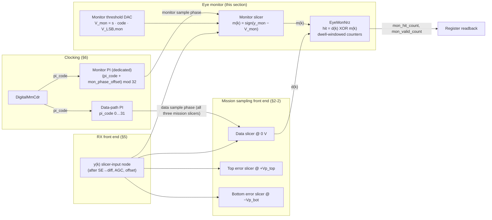

# RX Eye Monitor — proposed new section for `architecture_spec.md`

**Status:** draft, for integration into *L250 PMA Architecture Specification — 106.25 Gbps NRZ Optical Link*
**Date:** 2026-08-21

**Integration checklist.** This file is written as a drop-in section of the main architecture spec; all cross-references (§2-2, §6-x, §7-x) resolve against that document. On integration:

1. Insert the section below. It is numbered **Section 9** to avoid renumbering the existing Section 8 (Optical TX/MRM); if it is instead inserted between Section 7 (Digital Adaptation Loops) and Section 8, renumber accordingly.
2. Append `· 9. RX Eye Monitor` to the **Section outline** line in the front matter.
3. Add the §7-8 interaction-matrix row and the §7-11 dead-band-summary row provided in §9-8 below to those tables.
4. Optionally add to the §2-1 terminology table: `m(k)` — *Monitor-slicer decision at symbol `k`, `m ∈ {−1, +1}`, taken at the monitor sample phase* — and `V_mon` — *Programmable eye-monitor threshold (signed about 0 V)*.

Everything above this rule is integration scaffolding and is deleted on merge.

---

## Section 9: RX Eye Monitor

**Status.** Proposed block — **not yet in the behavioral model**. The digital comparison/counter block is named `EyeMonNrz` by analogy with the §7 loop classes; the analog content (one additional comparator, its threshold DAC, and a dedicated phase interpolator) is new hardware on the RX slicer input node. Defaults below are proposed working points, tagged TBD per the front-matter conventions where they are genuinely open.

The eye monitor provides **in-situ, non-destructive 2D eye measurement at the slicer input during live mission traffic**. It adds exactly one comparator — a **fourth comparator** alongside the three mission comparators of §2-2 — with two independent programmable axes:

- **Vertical (amplitude):** a programmable threshold DAC sets the monitor slicing level `V_mon`, signed about the vertical eye center.
- **Horizontal (timing):** a **dedicated phase interpolator**, separate from the data-path PI, sets the monitor sample phase as a programmable offset from the CDR-recovered data sample phase.

Comparing the monitor decision `m(k)` against the mission data decision `d(k)` and accumulating mismatches over a dwell window yields the eye's hit ratio at any `(phase, threshold)` point; rastering both axes yields the full 2D eye/BER contour. The block is **observe-only** in exactly the §7-6a / §7-8 sense: it drives no analog knob in the mission path, closes no loop, and has no slot in the loop-nesting ladder.

### 9-1 Purpose and overview

The mission loops already provide two in-situ instruments, both pinned to the data sample phase: the Vp codes digitise `|h₀|` (§7-3) and the channel estimator reads back the baud-spaced cursors `ĥ_i` (§7-6a). The eye monitor completes the set — it is the only instrument that measures **off the mission sampling point**, at sub-UI phase resolution and arbitrary amplitude:

| Instrument | Observable | Units | Coverage |
|---|---|---|---|
| Vp_top / Vp_bot codes (§7-3) | Rail medians = \|h₀\| | `V_LSB,vp` codes | Vertical, rails only, at the data sample phase |
| Channel estimator `ĥ_i` (§7-6a) | Baud-spaced cursors | Normalized (units of `σ_e`) | Horizontal at baud-spaced lags, at the data sample phase |
| **Eye monitor (this section)** | Hit ratio / BER at any `(Δt, V)` point | `V_LSB,mon` codes × 1/32 UI | Full 2D eye interior, off the data sample point |

What this buys, against the committed **internal raw-BER spec of < 1e-12** (§1-3):

- Direct measurement of **eye height and eye width at a target BER** at the actual slicer input — the quantity the §3 / §6-9 jitter and margin budgets ultimately close against, measured where they bind rather than inferred from external instrumentation. In a CPO package with **no accessible electrical test point** (§3, Figure 3-1b), this is the only way to see the received electrical eye at all.
- **Margin monitoring during live traffic**: the measurement is non-destructive — the mission slicers, CDR, and adaptation loops are untouched while the monitor scans (constraints in §9-8).
- **BER contour / bathtub estimation** and extrapolation toward the 1e-12 operating point using the same dual-Dirac / `Q` conventions as §3.
- **Adaptation diagnostics**: independent cross-checks of the Vp, offset, CTLE, and MM-CDR convergence points (§9-7).

### 9-2 Block description



| Block | Class / RTL name | Function |
|---|---|---|
| Monitor slicer | `mon_slicer` | Fourth comparator on the `y(k)` node; same comparator structure as the three mission comparators (§2-2), clocked by the monitor PI instead of the data-path PI |
| Monitor threshold DAC | `mon_thresh_dac` | Sign-magnitude programmable threshold `V_mon = s · code · V_LSB,mon` (§9-3); register-driven, **no adaptation accumulator** — unlike the `VpDac`-family DACs it terminates a register, not a loop |
| Monitor PI | `pi_mon` | Dedicated phase interpolator; monitor sample phase = data sample phase + programmable offset (§9-4) |
| Comparison + counters | `EyeMonNrz` | XOR of `m(k)` against `d(k)`, polarity gating, dwell-windowed hit/valid counters, start/done handshake, register interface (§9-5) |

Denote the monitor's sample `y_mon(k) = y(t_k + Δt_mon)` — the same slicer-input node as §2-1's `y(k)`, sampled `Δt_mon` away from the data sample instant. The monitor decision is `m(k) = +1 if y_mon(k) > V_mon else −1`.

The monitor comparator is a **copy of the mission comparator cell** (per §2-2, all comparators share one structure: sample vs. threshold-DAC voltage), so its metastability, sensitivity, and input-loading characteristics track the mission slicers by construction. Its power is booked in the **SerDes** energy line of §1-3 (RX slicers + clocking + RX logic; the line is already TBD pending PMA closure).

### 9-3 Vertical axis — monitor threshold DAC

The monitor threshold must reach both rails and the space between them, so unlike the unipolar per-rail Vp DACs (§7-3) it is **sign-magnitude about the vertical eye center**:

```text
V_mon = s · code · V_LSB,mon        s ∈ {+1, −1},  code ∈ 0 … 2^N_code,mon − 1
```

The proposed grid reuses the Vp LSB: `V_LSB,mon = V_LSB,vp`. This makes a monitor threshold code **directly comparable to the Vp code readbacks** — the monitor at `s = +1` with `code` equal to the settled `Vp_top` code sits exactly on the adapted upper-rail median, a convergence cross-check used in §9-7 — and it makes the monitor's ±255-code span cover, by construction, everything the 8-bit Vp DACs can represent, with the same margin above the converged rails.

| Placeholder | Model/RTL name | Default | Meaning |
|---|---|---|---|
| `N_code,mon` | `mon_dac_bits` | 8 (proposed, = Vp `dac_bits`) | Magnitude code width, codes 0…255 per polarity (`TBD_analog_design`) |
| `V_LSB,mon` | `mon_v_lsb` | `V_LSB,vp` (proposed; TBD — slicer-input full-scale not yet determined, §2-2) | Threshold LSB; sharing the Vp grid keeps monitor codes and Vp readbacks on one scale |
| — | `mon_thresh_sign` | +1 | Rail select `s`: +1 = upper half of the eye, −1 = lower half |
| — | `mon_thresh_code` | 0 | Threshold magnitude; `code = 0` puts the monitor on the data-slicer level (0 V), the §9-7 calibration anchor |

As with `V_LSB,vp` and `V_LSB,off`, no absolute voltage is committed at this interface: the vertical axis is specified symbolically in `V_LSB,mon` units pending the slicer-input full-scale (front-matter conventions).

### 9-4 Horizontal axis — dedicated monitor phase interpolator

The monitor sample phase comes from a **dedicated PI (`pi_mon`), separate from the data-path PI**, so the monitor point can be swept in time while the three mission comparators stay pinned to the CDR-recovered sample phase.

The monitor PI is **not free-running**: its code is slaved to the CDR output plus a programmable offset, applied in PI-code units downstream of the §6-5 `FsmPhase`/`piTable` path:

```text
pi_code_mon = (pi_code + mon_phase_offset) mod n_pi_codes
```

This slaving is load-bearing. The data-path `pi_code` is not static in mission mode — the wrapping phase accumulator continuously rotates under a ppm offset (§6-5, §6-8) and dithers with tracked jitter. An absolute monitor phase would smear across the eye at the tracked ramp rate; the modular offset instead keeps the monitor point at a **fixed horizontal displacement from the eye center as the CDR tracks**, which is exactly the horizontal axis a 2D eye scan needs.

| Placeholder | Model/RTL name | Default | Meaning |
|---|---|---|---|
| `N_PI,mon` | `n_pi_codes_mon` | = `n_pi_codes` = **32** (5-bit) | Monitor-PI resolution; inherits the data-path PI decision, including the §6-8 caveat that 5-bit / ≈294 fs is an illustrative operating point, not a committed value |
| — | `pi_span_ui_mon` | = `pi_span_ui` = **1.0** UI | Monitor-PI span; follows the data path, including the front-matter half-rate disclaimer (a 0…2 UI PI span for 53 GBd mode would carry over to `pi_mon`; half-rate values **TBD**) |
| — | `mon_phase_offset` | 0 | Signed PI-code offset, −16…+15 codes = **±0.5 UI** about the data sample phase, added mod 32 |
| Phase step | — | `pi_span_ui / n_pi_codes` = **1/32 UI ≈ 294 fs** | Horizontal scan resolution, identical to the data-path PI code step (§6-2) |

Since the eye is periodic in 1 UI, the ±0.5 UI offset range covers the entire eye. The offset addition and the deserializer word alignment must keep the `m(k)`-to-`d(k)` **symbol pairing fixed** across the full offset range (the pairing is unambiguous for offsets within ±0.5 UI); this retiming detail is an RTL/clock-distribution obligation on the implementation (`TBD_analog_design`).

The monitor slicer output crosses from the `pi_mon` clock domain into the ~830 MHz deserialized digital domain (§6-4); because the monitor is *designed* to be parked near decision boundaries, its comparator will be driven metastable at contour points by construction, and the retiming must resolve metastable outputs to a legal ±1 without corrupting adjacent bus lanes. The mission data path is unaffected by construction (separate comparator, separate clock branch).

### 9-5 Comparison logic and error accumulation

Per UI, the monitor decision is compared against the mission data decision; a mismatch is a **hit**:

| `d(k)` | `m(k)` | Hit `= d(k) ⊕ m(k)` | Meaning |
|---|---|---|---|
| +1 | +1 | 0 | Mark, monitor agrees |
| +1 | −1 | 1 | Mark fell below the monitor point |
| −1 | +1 | 1 | Space rose above the monitor point |
| −1 | −1 | 0 | Space, monitor agrees |

The hit ratio over a dwell window is precisely **the BER the receiver would suffer if it sliced at `(Δt_mon, V_mon)` instead of at the mission decision point**, under the assumption that `d(k)` is ground truth — valid to the committed < 1e-12 internal operating point (§1-3). On a marginal link, `d` errors bias the measured contour near the mission decision point: the monitor measures the eye *as decided by this receiver*, not against an external reference pattern. No pattern generator or checker is involved, which is what makes the measurement traffic-transparent.

```python
# per UI (conceptually; hardware operates per cdr_width-UI bus word, §6-4)
m   = +1 if y_mon > v_mon else -1        # monitor slicer, clocked by pi_mon
hit = (m != d)                            # d = mission data decision (§2-2)
if gate_sel == 0 or d == gate_sel:        # 0: all samples (BER mode); ±1: rail-CDF mode
    hit_count   += hit
    valid_count += 1
ui_count += 1
if ui_count == mon_dwell_ui:              # dwell complete: snapshot and halt
    hit_ratio = hit_count / valid_count   # readback; firmware reprograms and restarts
```

**Mapping to the common architecture (§7-1):** stages 1–2 only, like the channel estimator — observe = per-UI `(d, m)` pair; average = dwell-window accumulation; **no vote, no scale, no DAC**. The accumulated value terminates in a readback register, not an actuator.

In hardware the per-UI loop above is a **popcount over each 128-UI deserialized bus word** (the same adder-tree class as the §6-4 voter) accumulated at the ~830 MHz digital update clock; the dwell is therefore counted in `cdr_width`-UI words.

| Placeholder | Model/RTL name | Default | Meaning |
|---|---|---|---|
| `D_mon` | `mon_dwell` | 2^13 words = **2^20 UI** ≈ 9.9 µs (proposed, `TBD_from_sim_sweep`) | Dwell per measurement point, in `cdr_width`-UI words; register width 32 bits ⇒ max dwell 2^39 UI ≈ 5.2 s per point |
| `N_hit` | `mon_hit_count` | 40 bits unsigned | Hit counter; bounded by the max dwell in UI — saturation impossible by construction, as with the §7-6a accumulator |
| — | `mon_valid_count` | 40 bits unsigned | Samples passing the polarity gate; the denominator for gated modes (= dwell in UI when `mon_gate_sel = 0`) |
| — | `mon_gate_sel` | 0 | 0: count all mismatches (BER mode); +1 / −1: count only `d(k) = ±1` samples (per-rail CDF mode, used by the §9-7 rail cross-check) |
| — | `mon_start`, `mon_done` | — | Single-point handshake: firmware programs `(s, code, offset)`, asserts start, polls done, reads counters |

**Dead-band / hysteresis (eye monitor):** **none, and none needed** — the block is an open-loop instrument with no code to dither and no vote quantization, exactly as for the channel estimator (§7-6a). The per-point noise floor is statistical: a dwell of `D_mon` UI cannot resolve hit ratios below `1/D_mon` (single-hit floor), and a contour at hit ratio `p` needs of order `10–100/p` UI of dwell near the contour for a stable estimate.

### 9-6 2D eye-scan and measurement procedure

The hardware provides only the **single-point primitive** of §9-5 (program → settle → dwell → read); scan orchestration is firmware over the register interface. After reprogramming the threshold DAC or PI offset, an analog settling delay must elapse before the dwell window opens (settling values `TBD_analog_design`).

```python
# firmware-orchestrated raster scan
for offs in range(-16, +16):                    # horizontal: ±0.5 UI in 1/32-UI steps
    program(mon_phase_offset=offs)
    for (s, code) in threshold_sweep:           # vertical: −255 … +255 on the V_LSB,mon grid
        program(mon_thresh_sign=s, mon_thresh_code=code)
        wait_settle(); start(dwell=D_mon); wait_done()
        eye[offs, s*code] = read(mon_hit_count) / read(mon_valid_count)
```

**Standard measurement modes** (all are subsets or post-processings of the raster):

- **Vertical bathtub / eye height.** Fix `mon_phase_offset = 0` (eye center); sweep `V_mon` upward until the hit ratio crosses the target `p` at `V₊(p)`, and downward to `V₋(p)`. Eye height at BER `p`: `EH(p) = V₊(p) − V₋(p)`, in `V_LSB,mon` units.
- **Horizontal bathtub / eye width.** Fix `V_mon = 0`; sweep the phase offset left and right until the hit ratio crosses `p` at `Δt_L(p)` and `Δt_R(p)`. Eye width at BER `p`: `EW(p) = Δt_R(p) − Δt_L(p)`, in 1/32-UI steps. This is the on-die counterpart of the horizontal closure budgeted in §6-9.
- **Full 2D scan / BER contour.** Full raster; the locus of `hit_ratio = p` is the BER-`p` eye contour. Practical scans run a coarse grid first and refine near the contour.

**Dwell vs. BER floor vs. scan time** (full 32 × 511 = 16 352-point raster at 106.25 GBd, UI ≈ 9.41 ps):

| Dwell per point | Time per point | Single-hit floor `1/D_mon` | Full raster |
|---|---|---|---|
| 2^20 UI | ≈ 9.9 µs | ≈ 1e-6 | ≈ 0.16 s |
| 2^26 UI | ≈ 0.63 ms | ≈ 1.5e-8 | ≈ 10.3 s |
| 2^32 UI | ≈ 40 ms | ≈ 2.3e-10 | ≈ 11 min |

Directly resolving the **1e-12 internal-spec contour** is impractical per point (≳ 100 s/point for stable counts); the intended methodology is to measure contours in the 1e-4 … 1e-9 range and **extrapolate to 1e-12 with the dual-Dirac / `Q`-scale conventions already used by §3** (`Q(1e-12) = 7.035`; horizontal extrapolation per eye side, vertical per rail). The extrapolation validity bounds (minimum contour set, fit residual limits) are `TBD_from_sim_sweep`.

### 9-7 Calibration and diagnostic cross-checks

**Vertical zero (`code_zero_mon`).** With `mon_phase_offset = 0` and `V_mon = 0`, the monitor replicates the data slicer (`m ≡ d = sign(y)`), so the hit ratio collapses to the comparator's own offset/metastability residue. Sweeping `mon_thresh_code` through zero locates the code of minimum hit ratio; firmware stores it as `code_zero_mon` and references all subsequent threshold programming to it, absorbing the monitor comparator's input offset. (A dedicated analog offset-trim DAC on the monitor comparator is the alternative; choice is `TBD_analog_design`.) Note the mission slicers get their vertical zero from the offset/BLW loop (§7-5); the monitor, being outside all loops, needs this explicit one-time calibration.

**Horizontal zero (`phase_zero_mon`).** With `V_mon = 0` (post-vertical-cal), sweeping `mon_phase_offset` yields a hit-ratio bathtub whose minimum should sit at offset 0; a displaced minimum measures the **static skew between the monitor-PI and data-path-PI clock distribution branches**. Firmware stores the displacement as `phase_zero_mon` and references horizontal sweeps to it. The residual (sub-code) skew budget is `TBD_analog_design`.

Both calibrations are observe-only, run any time after CDR lock, and should be re-checked across temperature drift (slow PVT tracking of `code_zero_mon` / `phase_zero_mon` is a firmware policy, not a hardware loop).

**Adaptation cross-checks** enabled by the calibrated monitor:

- **Vp / h₀ (§7-3):** in rail-CDF mode (`mon_gate_sel = +1`), the monitor at `s = +1` with `code` set to the settled `Vp_top` code should read a conditional hit ratio ≈ 0.5 — the monitor sitting on the adapted rail median. A standing deviation flags Vp mis-convergence or `V_LSB,mon`/`V_LSB,vp` grid mismatch.
- **Offset / BLW (§7-5):** upper and lower BER contours should be symmetric about `V_mon = 0`; a standing vertical asymmetry beyond the Vp top/bottom asymmetry flags residual centering error.
- **CTLE (§7-6) / channel estimator (§7-6a):** eye-opening changes across a peaking-code sweep give a direct margin-vs-code curve; the monitor's measured eye complements the `σ_e`-normalized `ĥ_i` readbacks with an absolute (code-unit) 2D view.
- **MM lock point (§6-3):** left/right eye-width asymmetry about the data sample phase cross-checks the `h(−1) = h(+1)` lock condition, corroborating the `ĥ₋₁` vs `ĥ₊₁` comparison of §7-6a.
- **JTOL / stress correlation (§6-9, §6-12):** eye-width erosion under applied SJ or CID stress patterns is directly observable at the slicer, closing the loop between the mask-derived untracked-jitter allocations and the physical eye.

### 9-8 Interaction with the mission loops — non-intrusiveness constraints

The eye monitor's row in the §7-8 interaction matrix (to be added there on integration):

| Actor ↓ steps… | …and disturbs | Mechanism | Mitigation |
|---|---|---|---|
| **Eye monitor** (`mon_thresh_*`, `mon_phase_offset`) | Nothing in the digital loops — observe-only | Fourth comparator + counters on the shared `d(k)`; no DAC vote into any mission loop, no actuation | Same exemption as the channel estimator: no slot in the disturbance ladder. Residual *analog* coupling constrained by the sign-off items below |

And its row for the §7-11 dead-band summary:

| Loop | Mechanism | Variable | Default | Implementation |
|---|---|---|---|---|
| Eye monitor | none (open-loop instrument — no code to dither; statistical floor `1/D_mon` per point) | `D_mon` | 2^20 UI | §9-5 callout |

The observe-only property is structural (§7-8 rule 1: one controller per node — every node the monitor observes already has its owner), but two **analog** coupling paths do not vanish by architecture; together with one structural policy rule, they are explicit sign-off items:

1. **Static input loading.** The monitor comparator's input capacitance on the `y(k)` node must be **constant regardless of monitor enable, threshold, or phase state** (present and biased even when idle): a load that toggles with monitor activity would modulate the very eye being measured, and the mission eye when the monitor is off would differ from the eye when it scans. The slicer-input full-scale / bandwidth budget of §2-2 and §5 must include the fourth comparator's load from the outset (`TBD_analog_design`).
2. **Monitor-PI clock coupling.** During a scan, `pi_code_mon` sweeps every phase relative to the data-path clock, so supply/substrate coupling from the monitor clock branch arrives at the data-path PI at every possible phase relationship. Injected jitter on the data sample phase must remain negligible against the RX jitter allocations (§3 class); this closes with the extracted clock-distribution design (`TBD_analog_design`).
3. **Future auto-margining stays observe-only.** Any feature that would act on monitor results (e.g. margin-triggered re-adaptation) must gate through firmware policy, never close a hardware loop on a mission node — preserving §7-8 rule 1.

**Bring-up and operating constraints** (§7-10 alignment):

- Enable **any time from stage 2**: the horizontal axis is slaved to `pi_code`, so a locked CDR is required; Vp convergence is *not* required (the comparison reference is `d(k)`, not `e(k)`), but measured margins are fully meaningful once stages 4–5 have converged.
- Discard points or scans spanning a CDR re-acquisition, gear-shift, or signal-valid gate event (§6-11), as for §7-6a snapshots.
- Unlike the channel estimator, the monitor carries **no white-data assumption** — it measures the actual eye under whatever traffic is present and needs no freeze during non-mission patterns. Note only that a contour measured on a periodic pattern (e.g. `0xCC`, §6-12) reflects that pattern's ISI content, not the mission eye.
- The monitor's counters are held (not cleared) across the §6-11 signal-valid gate, consistent with the receiver-wide hold-don't-wrap convention; firmware discards any dwell in flight when the gate fires.
