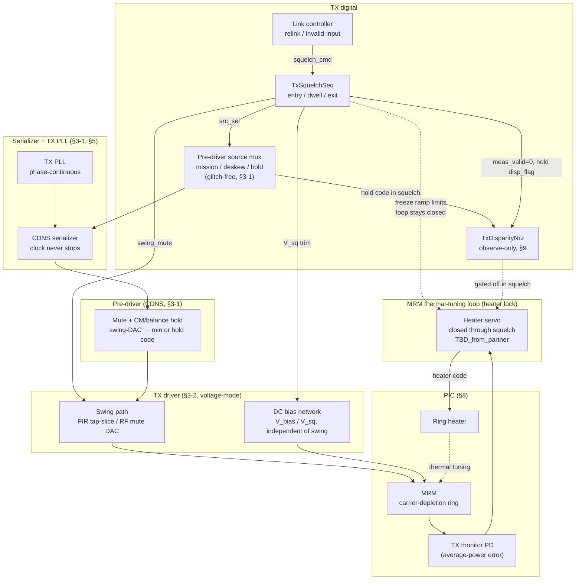
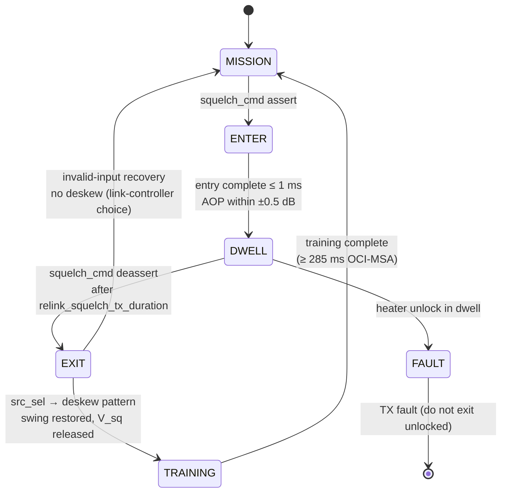

# TX Squelch Architecture

**Status:** draft, for later integration into *Gizmo PMA Architecture Specification* after §8-4 (protocol squelch rows) and before §9 (TX Disparity Checker).

**Status of the block.** Proposed sequencer (`TxSquelchSeq`) plus two analog knobs (swing-mute DAC, per-lane \(V_{\mathrm{sq}}\)). **Not yet in the behavioral model.** CDNS pre-driver/serializer §3-1, voltage-mode driver §3-2, MRM §8, thermal-tuning loop `TBD_from_partner`. Numeric defaults that already appear in §8-4 (`Tsq_channel`, `relink_squelch_tx_duration`) are reused; additional implementation targets are in the parameter table (§8-11).

Transmit squelch is a **whole-signal-chain behavior** spanning the pre-driver, driver, MRM, and MRM thermal-tuning (heater-lock) loop. It is **not** observe-only: a PMA-side sequencer commands the data-path source mux, the driver swing-mute DAC, and the squelch-bias trim. It is also **not** a second heater controller. The ring's thermal operating point remains owned by the thermal-tuning loop (one controller per node, §7-9 rule 1). Squelch's contract with that loop is: preserve the average-power error signal the servo already uses, freeze integrator ramp limits across the entry transient, and stay out of the heater-code path.

## 8-5 Purpose and why TX squelch exists

Squelch is the modulation-suppressed, **power-preserving** TX state mandated by OCI-MSA TXO-010 (Table 2-2, note 4): launched OMA ≤ −15 dBm per channel (`Tsq_channel`, §8-4) while **average launched power remains constant**. It is not a quiet / idle convenience — it is a protocol signal.

Two distinct PMA uses share the same optical signature:

1. **Relink handshake.** The OCI-MSA deskew state machine uses squelch to command the far end to restart deskew: entering `Deskew_Data_Relink` squelches modulation on every WDM lane of the group for `relink_squelch_tx_duration` (60–75 ms, OCI-MSA Table 1-3 / §8-4), after which the transmitter proceeds **directly** into the 160-bit deskew training pattern. Handshake timing is a link-controller concern (the same split as the CDR's posture in §6-11); the PMA's job is to execute a glitch-free, constant-AOP mute and a phase-continuous exit into the commanded pattern.
2. **Invalid electrical input.** When the serializer-side stream is not mission data (static / idle / fault), the same mute holds average optical power so the TX and far-end RX ring heaters do not unlock. This is the use §8-4 currently names; it is the same plant, not a second mode.

The constant-average-power constraint exists because **both** ends of the link hold micro-ring resonances locked using average-power-derived error signals — TX modulator rings here, RX demux filter rings at the partner (`TBD_from_partner` on the far-end filter architecture). A squelch that disturbed average power would unlock heaters at both ends and turn a 75 ms handshake into a full optical re-acquisition. That is the same physics the disparity checker (§9) instruments in mission mode, taken to the limit of a fully static input.

Squelch is architecturally distinct from **PMD transmit disable** (OCI-MSA DJI-003): transmit disable removes optical power entirely via the ELS / laser path for safety and management, and does **not** preserve average power. Squelch shall never be implemented by ELS power reduction, heater park, or laser blanking. Gizmo does not yet specify the ELS disable path; the distinction is recorded here so a later management-plane section cannot reuse this sequencer.

## 8-6 Squelch principle for an MRM transmitter

In mission mode the MRM (§8-1) converts driver swing into optical amplitude by moving the ring resonance between two detuning states, producing levels \(P_1\) and \(P_0\). For balanced data the launched average power is approximately \((P_1 + P_0)/2\). Squelch must freeze the output at that average while removing the swing.

Two levers accomplish this:

1. **Electrical modulation mute** in the pre-driver / driver (swing suppression). Primary mute is commanded at the pre-driver (swing-DAC to minimum, or data forced to a legal static hold code — §3-1 "Serializer legal static states"). The driver contributes the balance of the mute. The composite electrical target is ≥ 20 dB of swing suppression, which, relative to the §8-2 maximum operating OMA of −1 dBm, yields ≥ 14 dB of optical OMA suppression and lands on `Tsq_channel` ≤ −15 dBm with margin.
2. **Calibrated static bias \(V_{\mathrm{sq}}\)** applied through the driver's DC path, chosen so the ring's static transmission equals the time-averaged transmission of the modulated state.

Because the ring transfer function is strongly nonlinear in both voltage and wavelength, \(V_{\mathrm{sq}}\) is **not** the electrical mid-swing point and cannot be derived analytically with sufficient accuracy. It is a **per-channel calibrated quantity**, trimmed against the TX monitor photodiode (PIC monitor path `TBD_from_partner` / `TBD_analog_design`). It is a distinct operating point from the mission DC reverse-bias \(V_{\mathrm{bias}}\) (−1.5 V to −2.0 V, §8-3).

Two second-order effects must be absorbed by the heater servo, not by opening it:

- Removing RF modulation changes the average intracavity optical energy and the carrier-induced self-heating of the junction, producing a small resonance step at squelch entry and exit. This is the same data-dependent self-heating mechanism §9-1 names, now a step rather than a density drift.
- The heater servo's error signal is the monitor-photodiode **average power**, which squelch preserves by construction — this is why TXO-010 forbids average-power squelch. The loop, including its lock dither, runs uninterrupted through entry, dwell, and exit.

**DAC terminology.** As in §7, "DAC" here means a **digital code controlling an analog setting**, not necessarily a voltage DAC. The swing-mute code, the \(V_{\mathrm{sq}}\) trim, and the heater code are three different DACs on three different nodes. Squelch may write the first two; it shall not write the heater code.

## 8-7 Block diagram and block-level responsibilities



*Figure 8-2: TX squelch spans pre-driver source select and mute, driver swing-mute (independent of the DC bias network), per-channel \(V_{\mathrm{sq}}\) on the MRM, and the heater servo. The TX PLL and serializer keep running. The disparity checker is gated, not used as a substitute error signal. The heater code remains owned by the thermal-tuning loop.*

**Pre-driver (CDNS, §3-1).**

- **Data-path source select:** a glitch-free three-way multiplexer (mission data / deskew training pattern / squelch hold code), switched synchronously to the serializer clock. The TX PLL (§5) and serializer **never stop**; only the data content changes. That is what guarantees the phase-continuity the deskew protocol requires of pattern transitions, and what the far-end CDR's signal-valid / warm re-acquire path (§6-11) depends on.
- **Mute control:** primary swing suppression is commanded here — swing-DAC to minimum, or data forced to the hold code — sequenced with the driver mute to reach the composite ≥ 20 dB electrical suppression target. The legal static (non-toggling) serializer states this mute uses are the §3-1 row already tagged `TBD_from_partner`.
- **Common-mode and balance hold:** pre-driver output common mode and duty-cycle balance are held through mute entry/exit so no common-mode step propagates to the modulator and perturbs AOP beyond the ±0.5 dB window. This is the same CM/DCD allocation already levied on CDNS in §3-1, now with an explicit squelch-entry constraint.

**Driver (§3-2).**

- **Independent swing and bias paths:** the output stage shall separate the RF swing (the analog-FIR tap-slice / swing-mute DAC) from the DC bias network applied across the MRM junction, so that muting the swing leaves the modulator DC operating point untouched. Gizmo's driver is **voltage-mode** (§3-2). A topology in which swing and bias share a control (for example supply-collapse mute) is prohibited, because it moves the ring operating point and violates constant AOP. Voltage-mode mute is therefore a swing-path disable or FIR-slice collapse to a DC hold, **not** a rail collapse (`TBD_analog_design`).
- **Mute depth and settling:** driver mute contributes the balance of the ≥ 20 dB electrical suppression, with entry/exit settling ≤ 1 ms so the driver transient is negligible against the 60 ms minimum squelch dwell.
- **Residual-swing floor:** output-stage feedthrough (clock, data-path leakage, FIR-slice residual) at the launched-OMA level must remain below −15 dBm optical. Isolation/feedthrough is a driver specification (`TBD_analog_design`).

**MRM (§8).**

- **Calibrated squelch bias \(V_{\mathrm{sq}}\) per channel**, applied through the driver DC path, placing static transmission at the mission-mode average. Factory-set and periodically re-trimmed in service using the monitor photodiode, because \(V_{\mathrm{sq}}\) drifts with ring detuning, temperature, and aging.
- **Operating-regime containment:** \(V_{\mathrm{sq}}\) shall keep the junction in its normal depletion regime (§8-1 / §8-3) so carrier-plasma index/absorption changes between squelched and modulated states stay small and the resulting resonance step remains inside the heater servo's linear capture range.

**MRM controller — heater servo (thermal-tuning loop, `TBD_from_partner`).**

- **Continuous closed-loop lock:** the servo's error signal is average power at the monitor photodiode, which squelch preserves by construction. The loop, including the lock dither of the MRM thermal-tuning algorithm (the heater code hunting ±LSB around lock — architecture `TBD_from_partner`), runs through entry, dwell, and exit. Squelch does not substitute a disparity-checker density, a frozen heater code, or an open-loop park.
- **Dither budget in squelch:** that same heater-code dither converts to residual OMA at the output, because there is no mission modulation to hide it. Dither amplitude during squelch shall be bounded so dither-induced OMA does not consume `Tsq_channel`. If the mission-mode heater dither is too large, a reduced-dither squelch profile shall be defined — with the corresponding lock-slope penalty analyzed (`TBD_from_sim_sweep`).
- **Thermal-step absorption:** the servo shall settle the squelch entry/exit resonance step to within the mission detuning budget in ≤ 10 ms (target), inside the 60 ms minimum dwell, with zero unlock events over the qualification soak.
- **Far-end dependency:** the same constant-AOP property keeps the remote RX demux-filter servo locked. Any AOP droop during our squelch is a direct attack on the partner's lock margin, which is why AOP is budgeted at ±0.5 dB rather than at a 3 dB LOS margin. Relative to the §8-2 `Pavg` floor of −8.5 dBm, a ±0.5 dB squelch excursion does not approach a typical far-end LOS assert (OCI-MSA RXO-006, −14 dBm AOP).

**Lane atomicity.** All WDM lanes of a PMA group shall enter and exit squelch together, with lane-to-lane entry/exit alignment such that the far-end deskew engine observes a consistent group state. Per-lane squelch is reserved for test modes only. Lane count is `TBD_from_partner` (§3-1 serializer lane count, §8-2 `Pavg_total`).

## 8-8 Algorithm and state machine

The sequencer `TxSquelchSeq` is commanded by the link controller. It owns the pre-driver `src_sel`, the driver swing-mute DAC, and the \(V_{\mathrm{sq}}\) trim. It does not own the heater code, the TX PLL, or the serializer clock.



*Figure 8-3: TX squelch sequencer. Entry and exit are analog/digital sequences on a running serializer; DWELL is the protocol interval. Unlock during dwell escalates to TX fault rather than returning an unlocked ring to mission modulation.*

**Algorithm** (`TxSquelchSeq`).

```python
# Owns: src_sel, swing_mute DAC, V_sq trim
# Does not own: heater code (thermal-tuning loop, one controller per node, §7-9)

def enter(t0):
    heater.freeze_integrator_ramp_limits()   # transient guard; loop stays CLOSED
    disparity.meas_valid = 0                   # §9-4: not mission data
    hold(disparity.disp_flag)
    src_sel     = HOLD                         # glitch-free; serializer + PLL keep running
    ramp(swing_mute, MUTE)                     # independent of V_bias / V_sq
    apply(V_sq)                                 # per-channel calibrated static bias
    # complete within t_entry ≤ 1 ms; launched AOP within ±0.5 dB of pre-squelch
    state = DWELL

def dwell():
    # servo re-settles the RF-removal thermal step (target ≤ 10 ms)
    # dither continues at the squelch profile (bounded vs Tsq_channel)
    # residual OMA verified ≤ −15 dBm; all WDM lanes of the group stay muted
    if heater.unlock:
        escalate_tx_fault()                    # do not exit squelch with an unlocked ring
        state = FAULT
        return
    # far end detects loss of modulation within t_loselock ≤ 50 ms (OCI-MSA)

def exit_to_training():
    src_sel = DESKEW_TRAINING                    # phase-continuous; 160-bit OCI-MSA pattern
    ramp(swing_mute, MISSION)
    release(V_sq)                               # back to mission V_bias
    disparity.acc = 0; disparity.persist = 0    # §9-4: first post-squelch snapshot is clean
    disparity.meas_valid = 1                   # once the training/mission stream is live
    heater.release_integrator_ramp_limits()
    state = TRAINING                            # ≥ 285 ms training (OCI-MSA), then MISSION
```

**Abort / fault.** If the servo reports unlock during dwell, the channel escalates to TX fault rather than exiting squelch with an unlocked ring. The PMA does not attempt to re-acquire the heater; that would put a second controller on the thermal node.

**Mapping to the common architecture.** This is a sequencer plus two DACs (swing-mute, \(V_{\mathrm{sq}}\)), not a §7-1 vote→scale→accumulate loop. The heater servo is the loop; squelch is a plant change that loop must survive. The disparity checker remains observe-only and is **gated** for the duration (§9-4).

## 8-9 Timing

| Interval | Symbol | Target | What must be true |
|---|---|---|---|
| Entry sequence | \(t_{\mathrm{entry}}\) | ≤ 1 ms | Hold-code switch, swing mute, \(V_{\mathrm{sq}}\) apply, CM/balance hold; AOP excursion within ±0.5 dB |
| Heater thermal-step settle | \(t_{\mathrm{th,sq}}\) | ≤ 10 ms (target) | Residual detuning back inside the mission detuning budget; zero unlock |
| Relink squelch dwell | `relink_squelch_tx_duration` | **60 ms to 75 ms** | OCI-MSA Table 1-3 / §8-4. Modulation stays suppressed for this entire interval. Entry and thermal settle are **inside** this window, not in addition to it |
| Far-end loss-of-modulation detect | `t_loselock` | ≤ 50 ms | Bounds allowable residual OMA ripple during dwell; far-end CDR takes the §6-11 signal-valid gate |
| Exit sequence | \(t_{\mathrm{exit}}\) | ≤ 1 ms (same mute-settling target) | Phase-continuous source switch to the 160-bit deskew training pattern, swing restore, \(V_{\mathrm{sq}}\) release; immediately compliant with the ≥ 285 ms training-pattern transmission requirement |
| Deskew training after exit | — | ≥ 285 ms (OCI-MSA) | Link-controller / PCS concern; PMA must not insert an extra gap between squelch exit and the training pattern |

```mermaid
sequenceDiagram
  participant LC as Link controller
  participant SEQ as TxSquelchSeq
  participant PRE as Pre-driver / serializer
  participant DRV as Driver swing / V_sq
  participant HTR as Heater servo
  participant FAR as Far-end CDR / RX rings

  Note over PRE,DRV: mission modulation, PLL running
  LC->>SEQ: squelch_cmd (relink or invalid-input)
  SEQ->>HTR: freeze integrator ramp limits (loop stays closed)
  SEQ->>PRE: src_sel = HOLD (phase-continuous)
  SEQ->>DRV: swing_mute → MUTE, apply V_sq
  Note over SEQ: t_entry ≤ 1 ms, ΔAOP ≤ ±0.5 dB
  SEQ->>SEQ: DWELL 60–75 ms
  HTR->>HTR: absorb thermal step (≤ 10 ms)
  FAR->>FAR: loss of modulation within 50 ms; CDR hold (§6-11); RX heaters stay locked
  LC->>SEQ: squelch_cmd deassert
  SEQ->>PRE: src_sel = DESKEW_TRAINING (or MISSION)
  SEQ->>DRV: swing_mute → MISSION, release V_sq
  Note over PRE,DRV: t_exit ≤ 1 ms, then ≥ 285 ms training
```

*Figure 8-4: Relink squelch timing. The 60–75 ms figure is the **dwell** at squelched OMA, not the time allowed to slew into or out of squelch.*

`relink_squelch_tx_duration` is the **dwell** of the handshake: 60 ms minimum so the far end can detect mute inside a 50 ms `t_loselock` and still see a 10 ms settle margin; 75 ms maximum before training must start. Enter/exit settling is a separate ≤ 1 ms budget. (The §8-4 notes cell currently reads this interval as "duration to enter/exit" and says "MRR"; both should be corrected on merge — dwell, and **MRM**.)

The 60–75 ms window is comfortable against the thermal plant assumed in §9-6 (heater-control settling ms-class, `τ_th` µs-class): a 10 ms thermal-step settle is well inside a 60 ms minimum dwell. If partner data move `τ_th` or the heater-loop bandwidth enough to threaten that 10 ms target, the dwell cannot be shortened — it is an OCI-MSA protocol number — the servo and \(V_{\mathrm{sq}}\) trim have to close instead (`TBD_from_partner`).

## 8-10 Interfaces

**Link controller.** Assert/deassert `squelch_cmd`, choose the exit destination (deskew training vs. return to mission), and own `relink_squelch_tx_duration` within the 60–75 ms window. The PMA does not time the handshake itself — same split as §6-11.

**CDNS serializer / pre-driver (§3-1, §5).** Legal static hold code; glitch-free `src_sel`; TX PLL and serializer remain in lock and in phase through the whole sequence. Phase-continuity on hold → training is what keeps the far-end CDR from treating exit as a cold re-acquisition.

**Driver swing-mute and bias DACs (§3-2, §8-3).** Two knobs, two nodes. Squelch writes swing-mute and \(V_{\mathrm{sq}}\); it does not write FIR tap weights as a substitute for mute (tap codes stay at their mission values so exit is hitless — the existing glitchless-FIR rule, §3-2), and it does not write the heater code.

**TX disparity checker (§9-4).** While `squelch_cmd` is asserted the serializer input is not mission data. A disparity measured on a static hold code would look like a sustained `|dens_meas| = 1` event and must not reach the thermal-tuning loop, which is at that moment relying on the constant-AOP squelch state to hold heater lock. Follow the CDR's signal-valid discipline (§6-11): `meas_valid` forced low, `disp_flag` **held**; on exit, window accumulator and persistence counters cleared so the first post-squelch snapshot is not a partial window. This section is the definition of the "TX-side squelch/invalid condition" that §9-4 already names.

**Thermal-tuning loop.** Closed throughout. At entry, freeze integrator **ramp limits** (slew/anti-windup guard) so the 1 ms electrical transient is not integrated as a huge error; do not freeze the integrator state and do not open the loop. Optionally switch to a reduced-dither squelch profile. Unlock in dwell → TX fault, not a PMA takeover of the heater DAC.

**Far-end RX (informative to this PMA).** Our squelch is the far-end's invalid-signal condition: that CDR holds `pi_code` / `state_p` / `state_f` (§6-11) rather than drifting on a muted input. Far-end demux-filter heaters stay locked because AOP is constant. Far-end adaptation loops freeze per §7-11 signal-invalid hold. None of that is implemented here; it is why our AOP and residual-OMA budgets exist.

**Lane group.** `squelch_cmd` is lane-atomic across the WDM group. Per-lane override is a test-mode hook only.

## 8-11 Parameter table

| Placeholder / symbol | Model/RTL name | Default | Meaning |
|---|---|---|---|
| `Tsq_channel` | `tsq_channel` | **≤ −15 dBm** OMA per channel | Squelched launched OMA (OCI-MSA TXO-010 / §8-4) |
| `relink_squelch_tx_duration` | `relink_squelch_tx_duration` | **60 ms to 75 ms** | OCI-MSA Table 1-3 dwell at squelched OMA, **not** the enter/exit slew time |
| \(\Delta P_{\mathrm{avg,sq}}\) | `aop_squelch_tol` | **±0.5 dB** vs. pre-squelch `Pavg` | AOP constancy across entry/dwell/exit. Compatible with §8-2 `Pavg` (−8.5 dBm to 0 dBm) |
| \(A_{\mathrm{mute,e}}\) | `swing_mute_db` | **≥ 20 dB** electrical (design target) | Pre-driver + driver composite swing suppression. Optical consequence: ≥ 14 dB OMA suppression vs. §8-2 max OMA −1 dBm → `Tsq_channel` |
| \(t_{\mathrm{entry}}\), \(t_{\mathrm{exit}}\) | `t_squelch_settle` | **≤ 1 ms** | Mute/bias sequencing and CM/balance settle |
| \(t_{\mathrm{th,sq}}\) | `t_heater_squelch_settle` | **≤ 10 ms** (target) | Heater-servo absorption of the RF-removal/restoration thermal step |
| `t_loselock` | — | **≤ 50 ms** (far end, OCI-MSA) | Far-end loss-of-modulation detect; bounds residual OMA ripple in dwell. Not a local timer |
| \(V_{\mathrm{sq}}\) | `v_sq` (per lane) | calibrated, **≠** mid-swing; ≠ mission \(V_{\mathrm{bias}}\) | Static MRM bias whose transmission equals modulated-state average. Factory + in-service trim vs. TX monitor PD (`TBD_from_partner`) |
| `src_sel` | `src_sel` | `{MISSION, DESKEW, HOLD}` | Glitch-free three-way source mux. HOLD uses the §3-1 legal static serializer state (`TBD_from_partner`) |
| `swing_mute` | `swing_mute` | `{MISSION, MUTE}` | Driver RF-swing mute DAC, independent of the DC bias network (`TBD_analog_design` for voltage-mode realization) |
| — | `squelch_cmd` | level from link controller | Lane-atomic command; per-lane override is test-only |
| — | `squelch_dither_profile` | mission dither, or reduced | MRM thermal-tuning (heater-lock) lock-dither amplitude during dwell; must not consume `Tsq_channel` (`TBD_from_sim_sweep`) |
| — | `heater_ramp_limit_freeze` | asserted in ENTER/EXIT | Transient guard on the servo integrator; loop remains closed |

**Dead-band / hysteresis (TX squelch).** Squelch is a commanded sequencer, not a bang-bang loop, so it carries **no vote dead-band** of the §7-12 kind.

What *does* sit on this path:

- **AOP compliance window ±0.5 dB** — a plant-excursion limit during entry/dwell/exit, not a loop dead-band. The MRM thermal-tuning loop's own (unspecified) lock detector and heater-code dither live inside that window (`TBD_from_partner`).
- **MRM heater-lock dither vs. `Tsq_channel`** — the thermal-tuning algorithm's lock dither (heater code ±LSB) is residual OMA once modulation is muted. If the mission-mode dither would violate −15 dBm, switch to a reduced-dither profile rather than opening the loop.
- **Disparity-checker hysteresis is not used during squelch.** `disp_flag` is held and `meas_valid` is low (§9-4, §7-12). Re-enable only after the post-exit accumulator clear.
- **Integrator ramp-limit freeze** at entry/exit is a de-glitch strobe on the thermal loop (same idea as the AGC/CTLE de-glitch strobes in §7-9), not a second controller.

**Nesting / disturbance ladder.** Squelch is TX-side and ms-class. To the RX ladder it is an invalid-signal event: the far-end CDR holds (§6-11) and every continuous RX adaptation loop freezes (§7-11). Locally, the only loop that **keeps running** is the heater servo, which is already the slowest plant in the document (µs `τ_th`, ms settle — four decades below AGC, §9-6). Squelch must not insert a faster actuator on that node. The swing-mute and \(V_{\mathrm{sq}}\) DACs are allowed to move in ≤ 1 ms because their purpose is to *remove* the RF disturbance the heater would otherwise see; they are sequenced, not continuously adapted.

## 8-12 Requirements, calibration, and open items

### Derived requirements

| ID | Requirement | Basis |
|---|---|---|
| SQL-001 | Squelched OMA ≤ −15 dBm (`Tsq_channel`); pre-driver+driver ≥ 20 dB electrical suppression → ≥ 14 dB optical vs. §8-2 max OMA −1 dBm | OCI-MSA TXO-010; Table 2-2 n.4 |
| SQL-002 | AOP constant within ±0.5 dB of pre-squelch mission `Pavg`; far-end demux-filter lock held; squelch shall not trigger far-end LOS (OCI-MSA RXO-006) | OCI-MSA TXO-010 |
| SQL-003 | Glitch-free three-way `src_sel` (mission / deskew / hold); serializer and TX PLL run continuously; source transitions phase-continuous so the far-end CDR does not lose lock (§6-11) | OCI-MSA deskew SM; this PMA |
| SQL-004 | Pre-driver mute holds CM and duty-cycle balance; any CM step at the driver input settles such that launched AOP stays in the SQL-002 window | this PMA / §3-1 |
| SQL-005 | Driver swing mute while independently preserving MRM DC bias; DC operating point shall not move when RF swing is removed. Mute entry/exit ≤ 1 ms (target). Voltage-mode realization `TBD_analog_design`; supply-collapse mute prohibited | OCI-MSA TXO-010; §3-2 |
| SQL-006 | Per-channel calibrated \(V_{\mathrm{sq}}\) such that static transmission equals modulated-state average (nonlinear ring: not electrical mid-swing). Factory + in-service re-trim vs. TX monitor PD | OCI-MSA TXO-010 |
| SQL-007 | Junction remains in depletion at \(V_{\mathrm{sq}}\). Residual resonance shift inside heater linear capture range | §8-1 / §8-3 |
| SQL-008 | Heater servo remains closed-loop through entry/dwell/exit on monitor-PD average power; dither continues, amplitude bounded vs. SQL-001 | OCI-MSA TXO-010 |
| SQL-009 | Servo absorbs RF-removal/restoration thermal step with zero unlock; residual detuning inside mission budget in ≤ 10 ms (target), inside the 60 ms minimum dwell | this PMA |
| SQL-010 | Sequencing satisfies OCI-MSA Table 1-3: squelch for `relink_squelch_tx_duration` (60–75 ms) then glitch-free 160-bit training; far end detects mute within 50 ms `t_loselock` | OCI-MSA Table 1-3 |
| SQL-011 | Architecturally distinct from PMD transmit disable: disable removes AOP via ELS; squelch preserves AOP. Never implement squelch by ELS attenuation, heater park, or laser blanking | OCI-MSA DJI-003; TXO-010 |
| SQL-012 | All WDM lanes of a PMA group enter/exit together (lane-atomic). Per-lane squelch is test-only | OCI-MSA §1.1 |

### Calibration and verification

- Per-lane \(V_{\mathrm{sq}}\) calibration (factory and in-service re-trim) using the TX monitor photodiode; stored per lane with temperature annotation (`TBD_from_partner` on the monitor path and the trim engine).
- Squelched-OMA compliance at TP2 (≤ −15 dBm) and AOP-delta across entry/dwell/exit (±0.5 dB), per lane, across temperature corners.
- Heater-lock soak: 10k+ squelch entry/exit cycles at hot and cold plate corners with zero unlock events and logged residual-detuning settling profiles.
- Partner-survival: far-end CDR and demux-filter lock monitored through squelch cycles (loss-of-modulation detect ≤ 50 ms, no LOS assertion, no far-end heater unlock) — system-level proof of SQL-002/003.
- Disable-vs-squelch discrimination: PMD transmit disable and squelch produce distinct optical signatures (AOP removed vs. AOP preserved) and cannot be cross-triggered (`SQL-011`).

### Relationship to other Gizmo sections

| Location | Relationship |
|---|---|
| §8-4 `Tsq_channel`, `relink_squelch_tx_duration` | Optical limits this architecture implements. 60–75 ms is dwell, not enter/exit; heater lock is MRM |
| §3-1 serializer legal static states | `src_sel = HOLD`; PLL/serializer never stop |
| §3-2 voltage-mode driver | Swing mute is independent of DC bias; supply-collapse mute is prohibited |
| §6-11 CDR signal-valid gate | This TX squelch **is** the far-end's invalid-signal condition; we owe phase-continuous exit and residual OMA low enough for 50 ms detect |
| §7-9 rule 1 | Squelch does not write the heater code; disparity checker remains observe-only and is gated |
| §7-11 signal-invalid hold | Far-end consequence of our mute; local heater loop is the exception (it must keep running) |
| §7-12 / §9-4 | During squelch: `meas_valid` low, `disp_flag` held; accumulators cleared on exit |
| §9-1 / §9-6 | Entry/exit thermal step is the fully-static limit of data-dependent heating; servo absorbs it in ≤ 10 ms without unlock |

### Open items

- Voltage-mode realization of swing mute that does not move \(V_{\mathrm{bias}}\) (no supply collapse, no shared swing/bias control) (`TBD_analog_design`).
- CDNS legal static hold code, glitch-free `src_sel`, and CM/balance hold through mute (`TBD_from_partner`, §3-1).
- TX monitor photodiode path, \(V_{\mathrm{sq}}\) trim engine, temperature annotation, in-service re-trim cadence (`TBD_from_partner`, `TBD_analog_design`).
- Heater-servo architecture, lock detector, linear capture range, mission vs. squelch dither profiles, integrator ramp-limit interface (`TBD_from_partner`; EIC digital interface `TBD_analog_design`).
- Confirm \(t_{\mathrm{th,sq}}\) ≤ 10 ms against partner `τ_th` and heater-loop bandwidth (`TBD_from_sim_sweep`; dwell itself stays 60–75 ms).
- Lane-group membership and lane-to-lane entry/exit skew budget for SQL-012 (`TBD_from_partner`).
- ELS / PMD-disable specification, and a test that disable and squelch cannot be cross-triggered (`SQL-011`).
- Behavioral-model `TxSquelchSeq`: AOP step, residual OMA including dither, heater-lock soak, and interaction with `TxDisparityNrz` gating (§9).
- Deskew-pattern generator placement (PMA vs. PCS) and the ≥ 285 ms training hold (`TBD_from_partner` on which side of the CDNS interface the 160-bit pattern lives).
- Electrical mute depth and \(V_{\mathrm{sq}}\) must be verified at 106.25 GBd (`TBD_from_sim_sweep`). Protocol times (60–75 ms, 50 ms, 285 ms) are baud-independent.
