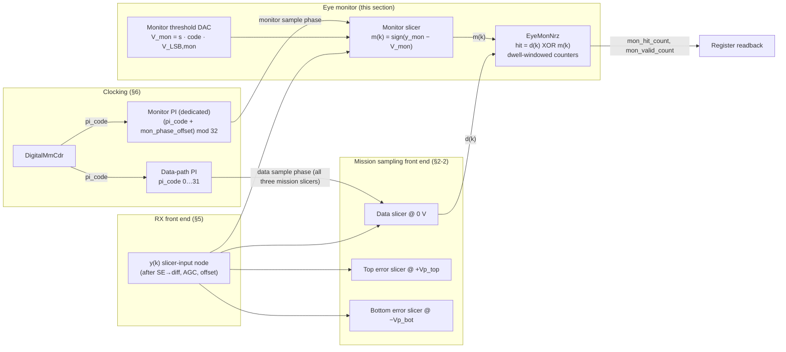
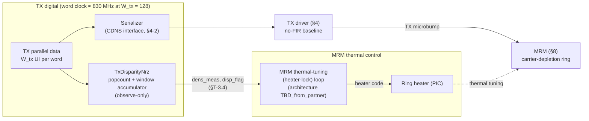

# Telemetry — Observe-Only Instrumentation

**Status:** Consolidated telemetry section for *Gizmo PMA Architecture Specification — 106.25 Gbps NRZ Optical Link*  
**Date:** 2026-09-02  
**Integration note:** This document consolidates the three observe-only telemetry instruments (RX channel estimator, RX eye monitor, TX disparity checker) into a single section. Once reviewed, fold into the main gizmo.md as a new section following §7 (Digital Adaptation Loops) and before §8 (Optical TX/MRM).

---

## Telemetry: In-Situ Measurement and Diagnostics

This architecture includes **three observe-only digital telemetry instruments** — all explicitly designed to measure mission-stream observables without driving any control loop or actuating any analog knob. Together they provide in-situ visibility into the physical-layer eye, channel response, and transmit-data statistics during live traffic, with no accessible electrical test points and no disruption to the mission path.

### Overview and common properties

All three instruments share these structural characteristics:

1. **Observe-only, never actuate.** Each terminates in readback registers and status flags, not DAC control codes. This is a design constraint, not an omission: it preserves §7-8 rule 1 (one controller per node) — every observable these blocks measure already has an owner.

2. **All-digital or minimal-analog hardware.** Two instruments (channel estimator, disparity checker) are pure digital logic on data streams that already exist in the mission path; one (eye monitor) adds a single analog comparator plus a phase interpolator. All consume the shared mission observables `(d, e)` or tap existing parallel words.

3. **No slot in the disturbance ladder.** Because they actuate nothing, none appear in the §7-8 loop-interaction matrix as disturbers, and none constrain the bandwidth of any mission loop.

4. **Dwell-windowed accumulation, statistical noise floors.** Each accumulates a correlation or count over a programmable window (65 k–1 M UI class); readback precision is statistical, `1/√D` per snapshot.

5. **Freeze during non-mission patterns or invalid-signal conditions.** Like the mission loops they observe, the telemetry is meaningful only on white, mission-rate data. During periodic patterns (e.g. `0xCC`, §6-12), TX squelch (§8-4), or RX signal-valid gate (§6-11), the instruments are frozen or their outputs are gated invalid.

The three blocks occupy different domains and serve complementary diagnostic purposes:

| Instrument | Domain | Observable | Units | What it measures |
|---|---|---|---|---|
| **RX Channel Estimator** (`ChanEstNrz`, §T-1) | RX digital | Baud-spaced cursors `ĥ_i` | Normalized (σ_e) | Time-domain ISI at the data sample phase; CTLE/MM lock cross-checks |
| **RX Eye Monitor** (`EyeMonNrz`, §T-2) | RX analog + digital | 2D eye / BER contour | V_LSB,mon × 1/32 UI | Full eye interior at sub-UI phase resolution; margin vs. BER at the slicer input |
| **TX Disparity Checker** (`TxDisparityNrz`, §T-3) | TX digital | Ones density / CID runs | Normalized fraction ∈ [−1, +1] | Line-stream DC balance; thermal-disturbance feed-forward to MRM heater lock |

---

## §T-1: RX Channel Estimator (`ChanEstNrz`) — baud-spaced cursor readback

**Status.** Proposed digital block (`ChanEstNrz`) — **not yet in the behavioral model**. Lag set and window length are `TBD_from_sim_sweep`.

### T-1.1 Purpose and algorithm

The channel estimator computes the **baud-spaced pulse-response cursors `ĥ_i`** — the same §2-3 cursors (`h_{−1}`, `h_0`, `h_{+1}`) that the CTLE loop targets and the MM CDR locks to — from the mission slicer outputs `(d, e)` without any additional analog hardware. Together with the `|h₀|` readback already provided by the Vp codes (§7-3), `{ĥ_i}` gives an in-situ pulse-response estimate at the mission sampling phase.

**Algorithm** (`ChanEstNrz`). The same sign–sign LMS update as the Vp loops (§7-3), with **one change: the gating decision is the `i`-UI-old decision `d(k−i)` instead of the current decision `d(k)`** — and one structural simplification: **no DAC**. In the Vp loop the accumulated estimate must physically move an error-slicer threshold, so it terminates in a threshold DAC; here the estimate is used for nothing but *knowing the channel coefficients*, so it terminates in a **readback register**. The block is pure digital logic on the mission slicer outputs `(d, e)` that already exist (§7-2) plus a decision-history shift register — no extra comparator, no threshold DAC, no analog hardware of any kind.

With the Vp rails converged (`Vp ≈ h₀`, §7-3), the signed error is `e(k) = sign(Σ_{m≠0} h_m·d(k−m) + n(k))`, so the windowed product converges to

```text
ĥ_i = ⟨ d(k−i)·e(k) ⟩_D  →  2Φ(h_i/σ_e) − 1  ≈  √(2/π) · h_i/σ_e   (small cursors)
```

where `σ_e` is the RMS residual (ISI + noise) at the error slicer and `Φ` the Gaussian CDF: the readback is **sign-correct and monotone in `h_i`**, linear for small cursors. Per UI, per lag — all lags run **in parallel** (per-lag hardware is one XOR and a counter):

```python
# lags i ∈ M_est run concurrently on the shared (d, e) stream
for i in lags:                        # d_hist[i−1] = d(k−i); for i = −1, pipeline e by 1 UI
    acc[i] += d_hist[i - 1] * e       # sign-sign product, ±1 — the §7-3 vote, gated by d(k−i)
ui_count += 1
if ui_count == D_est:                 # window complete
    h_hat[i] = acc[i] / D_est         # snapshot readback, mean ∈ [−1, +1]
    acc[i] = 0; ui_count = 0
```

Setting `i = 0` recovers the Vp equilibrium check — `⟨d(k)·e(k)⟩ → 0` when the rails sit on the conditional medians — which is the precise sense in which this is the §7-3 update law re-aimed at lag `i`. The **pre-cursor** (`i = −1`) correlates `e(k)` against the *next* decision `d(k+1)`: a one-UI digital pipeline of `e`, nothing more.

### T-1.2 What the readback buys

**Relationship to the CTLE loop.** Identical observable, opposite use: §7-6 computes this same sign-sign correlation (summed over its `lags`) and **nulls** it through the peaking code; the estimator computes it **per lag** and **reports** it. `ĥ₊₁` is precisely the residual the CTLE drives into `corr_deadband`.

**Normalization caveat.** Because `e` is one bit, the readback is in units of `σ_e`, not volts. Cursor-to-cursor **ratios are `σ_e`-independent** (`ĥ_i/ĥ_j ≈ h_i/h_j` in the small-cursor regime), which is sufficient for every use below; an absolute-volts conversion would need a separate `σ_e` calibration (`TBD_from_sim_sweep`, only if ever needed).

**Observe-only — by design, not omission.** The block drives no analog knob and closes no loop. This is required by §7-8 rule 1 (one controller per node): `h₊₁` is already owned by the CTLE loop (§7-6) and the pre/post balance by the MM CDR lock condition (§6-3, §7-7). The estimator is the instrument, never the actuator. What the readback buys:

- `ĥ₊₁` cross-checks CTLE convergence (should sit at the residual that `corr_deadband` tolerates);
- `ĥ₋₁` vs `ĥ₊₁` cross-checks the MM lock condition `h(−1) = h(+1)` — a standing imbalance flags a lock-point offset (e.g. a CTLE group-delay change mid-tracking, §7-8) — and the ratio form is exactly what the balance check needs;
- lags 2–6 quantify the long-tail residue that the CTLE's longer `lags` sense (§7-6);
- together with the `|h₀|` readback already provided by the Vp codes, `{ĥ_i}` is an in-situ **baud-spaced pulse-response estimate at the mission sampling phase** (the §2-3 cursors), enabling on-die residual-ISI / eye-margin estimation without external instrumentation.

### T-1.3 Truth table and parameters

**Truth table** (per lag, per UI; the product is accumulated, not stepped into a DAC):

| `d(k−i)` | `e(k)` | Product | Meaning |
|---|---|---|---|
| +1 | +1 | +1 | Residual high given a lagged mark → `h_i` pulls up |
| +1 | −1 | −1 | Residual low given a lagged mark → `h_i` pulls down |
| −1 | −1 | +1 | Mirrored space rail |
| −1 | +1 | −1 | Mirrored space rail |

**Parameter table:**

| Placeholder | Model/RTL name | Default | Meaning |
|---|---|---|---|
| `M_est` | `lags` | `(−1, +1, +2, +3)` | Lag set, all in parallel; the deepest lag sets the `d`-history depth (`TBD_from_sim_sweep`) |
| `D_est` | `decimation` | 65536 UI | Window per readback snapshot; statistical floor of the mean is `1/√D_est ≈ 0.004` |
| `N_acc,est` | `acc` width | 17 bits signed | Bounded by the window (`|acc| ≤ D_est`) — saturation impossible by construction, unlike the DAC accumulators |
| — | `h_hat[i]` | signed fraction ∈ [−1, +1] | Normalized cursor readback (units of `σ_e`, see caveat above) |
| — | `e` pipeline | 1 UI (lag −1 only) | Pre-cursor alignment of `e(k)` against `d(k+1)` |

**Dead-band / hysteresis (estimator):** **none, and none needed** — there is no code to dither and no vote quantization; the block is an open-loop measurement. The readback noise floor is statistical (`σ = 1/√D_est` per snapshot); average snapshots for a quieter estimate.

### T-1.4 Nesting and bring-up

**Nesting:** none in mission mode — the block actuates nothing, so it has no slot in the §7-8 disturbance ladder and no bandwidth constraint against the control loops. Enable it any time **from stage 2** of the bring-up sequence (§7-10): its observable is `e(k)`, which is measured against the Vp rails, so the readback presumes a locked sampling phase and converged rails; it becomes fully meaningful once the loops it instruments have converged (stages 4–5). Two validity caveats it shares with the other `d`-conditioned observables: (i) **white-data assumption** — during non-mission periodic patterns `d(k−i)` is correlated with the other symbols and the correlation is biased, so the estimator must be frozen (`adapt=False`, §7-10); (ii) a CDR phase step moves every cursor slightly (§7-8 CDR row), so snapshots spanning a re-acquisition should be discarded.

---

## §T-2: RX Eye Monitor (`EyeMonNrz`) — 2D eye / BER contour measurement

**Status.** Proposed block — **not yet in the behavioral model**. The digital comparison/counter block is named `EyeMonNrz` by analogy with the §7 loop classes; the analog content (one additional comparator, its threshold DAC, and a dedicated phase interpolator) is new hardware on the RX slicer input node. Defaults below are proposed working points, tagged TBD per the front-matter conventions where they are genuinely open.

### T-2.1 Purpose and overview

The eye monitor provides **in-situ, non-destructive 2D eye measurement at the slicer input during live mission traffic**. It adds exactly one comparator — a **fourth comparator** alongside the three mission comparators of §2-2 — with two independent programmable axes:

- **Vertical (amplitude):** a programmable threshold DAC sets the monitor slicing level `V_mon`, signed about the vertical eye center.
- **Horizontal (timing):** a **dedicated phase interpolator**, separate from the data-path PI, sets the monitor sample phase as a programmable offset from the CDR-recovered data sample phase.

Comparing the monitor decision `m(k)` against the mission data decision `d(k)` and accumulating mismatches over a dwell window yields the eye's hit ratio at any `(phase, threshold)` point; rastering both axes yields the full 2D eye/BER contour. The block is **observe-only** in exactly the §T-1 sense: it drives no analog knob in the mission path, closes no loop, and has no slot in the loop-nesting ladder.

The mission loops already provide two in-situ instruments, both pinned to the data sample phase: the Vp codes digitise `|h₀|` (§7-3) and the channel estimator reads back the baud-spaced cursors `ĥ_i` (§T-1). The eye monitor completes the set — it is the only instrument that measures **off the mission sampling point**, at sub-UI phase resolution and arbitrary amplitude:

| Instrument | Observable | Units | Coverage |
|---|---|---|---|
| Vp_top / Vp_bot codes (§7-3) | Rail medians = |h₀| | `V_LSB,vp` codes | Vertical, rails only, at the data sample phase |
| Channel estimator `ĥ_i` (§T-1) | Baud-spaced cursors | Normalized (units of `σ_e`) | Horizontal at baud-spaced lags, at the data sample phase |
| **Eye monitor (this section)** | Hit ratio / BER at any `(Δt, V)` point | `V_LSB,mon` codes × 1/32 UI | Full 2D eye interior, off the data sample point |

What this buys, against the committed **internal raw-BER spec of < 1e-12** (§1-3):

- Direct measurement of **eye height and eye width at a target BER** at the actual slicer input — the quantity the §3 / §6-9 jitter and margin budgets ultimately close against, measured where they bind rather than inferred from external instrumentation. In a CPO package with **no accessible electrical test point** (§3, Figure 3-1), this is the only way to see the received electrical eye at all.
- **Margin monitoring during live traffic**: the measurement is non-destructive — the mission slicers, CDR, and adaptation loops are untouched while the monitor scans (constraints in §T-2.7).
- **BER contour / bathtub estimation** and extrapolation toward the 1e-12 operating point using the same dual-Dirac / `Q` conventions as §3.
- **Adaptation diagnostics**: independent cross-checks of the Vp, offset, CTLE, and MM-CDR convergence points (§T-2.6).

### T-2.2 Block description



| Block | Class / RTL name | Function |
|---|---|---|
| Monitor slicer | `mon_slicer` | Fourth comparator on the `y(k)` node; same comparator structure as the three mission comparators (§2-2), clocked by the monitor PI instead of the data-path PI |
| Monitor threshold DAC | `mon_thresh_dac` | Sign-magnitude programmable threshold `V_mon = s · code · V_LSB,mon` (§T-2.3); register-driven, **no adaptation accumulator** — unlike the `VpDac`-family DACs it terminates a register, not a loop |
| Monitor PI | `pi_mon` | Dedicated phase interpolator; monitor sample phase = data sample phase + programmable offset (§T-2.4) |
| Comparison + counters | `EyeMonNrz` | XOR of `m(k)` against `d(k)`, polarity gating, dwell-windowed hit/valid counters, start/done handshake, register interface (§T-2.5) |

Denote the monitor's sample `y_mon(k) = y(t_k + Δt_mon)` — the same slicer-input node as §2-1's `y(k)`, sampled `Δt_mon` away from the data sample instant. The monitor decision is `m(k) = +1 if y_mon(k) > V_mon else −1`.

The monitor comparator is a **copy of the mission comparator cell** (per §2-2, all comparators share one structure: sample vs. threshold-DAC voltage), so its metastability, sensitivity, and input-loading characteristics track the mission slicers by construction. Its power is booked in the **SerDes** energy line of §1-3 (RX slicers + clocking + RX logic; the line is already TBD pending PMA closure).

### T-2.3 Vertical axis — monitor threshold DAC

The monitor threshold must reach both rails and the space between them, so unlike the unipolar per-rail Vp DACs (§7-3) it is **sign-magnitude about the vertical eye center**:

```text
V_mon = s · code · V_LSB,mon        s ∈ {+1, −1},  code ∈ 0 … 2^N_code,mon − 1
```

The proposed grid reuses the Vp LSB: `V_LSB,mon = V_LSB,vp`. This makes a monitor threshold code **directly comparable to the Vp code readbacks** — the monitor at `s = +1` with `code` equal to the settled `Vp_top` code sits exactly on the adapted upper-rail median, a convergence cross-check used in §T-2.6 — and it makes the monitor's ±255-code span cover, by construction, everything the 8-bit Vp DACs can represent, with the same margin above the converged rails.

| Placeholder | Model/RTL name | Default | Meaning |
|---|---|---|---|
| `N_code,mon` | `mon_dac_bits` | 8 (proposed, = Vp `dac_bits`) | Magnitude code width, codes 0…255 per polarity (`TBD_analog_design`) |
| `V_LSB,mon` | `mon_v_lsb` | `V_LSB,vp` (proposed; TBD — slicer-input full-scale not yet determined, §2-2) | Threshold LSB; sharing the Vp grid keeps monitor codes and Vp readbacks on one scale |
| — | `mon_thresh_sign` | +1 | Rail select `s`: +1 = upper half of the eye, −1 = lower half |
| — | `mon_thresh_code` | 0 | Threshold magnitude; `code = 0` puts the monitor on the data-slicer level (0 V), the §T-2.6 calibration anchor |

As with `V_LSB,vp` and `V_LSB,off`, no absolute voltage is committed at this interface: the vertical axis is specified symbolically in `V_LSB,mon` units pending the slicer-input full-scale (front-matter conventions).

### T-2.4 Horizontal axis — dedicated monitor phase interpolator

The monitor sample phase comes from a **dedicated PI (`pi_mon`), separate from the data-path PI**, so the monitor point can be swept in time while the three mission comparators stay pinned to the CDR-recovered sample phase.

The monitor PI is **not free-running**: its code is slaved to the CDR output plus a programmable offset, applied in PI-code units downstream of the §6-5 `FsmPhase`/`piTable` path:

```text
pi_code_mon = (pi_code + mon_phase_offset) mod n_pi_codes
```

This slaving is load-bearing. The data-path `pi_code` is not static in mission mode — the wrapping phase accumulator continuously rotates under a ppm offset (§6-5, §6-8) and dithers with tracked jitter. An absolute monitor phase would smear across the eye at the tracked ramp rate; the modular offset instead keeps the monitor point at a **fixed horizontal displacement from the eye center as the CDR tracks**, which is exactly the horizontal axis a 2D eye scan needs.

| Placeholder | Model/RTL name | Default | Meaning |
|---|---|---|---|
| `N_PI,mon` | `n_pi_codes_mon` | = `n_pi_codes` = **32** (5-bit) | Monitor-PI resolution; inherits the data-path PI decision, including the §6-8 caveat that 5-bit / ≈294 fs is an illustrative operating point, not a committed value |
| `pi_span_ui_mon` | = `pi_span_ui` = **1.0** UI | Monitor-PI span; follows the data path, including the front-matter half-rate disclaimer (a 0…2 UI PI span for 53 GBd mode would carry over to `pi_mon`; half-rate values **TBD**) |
| — | `mon_phase_offset` | 0 | Signed PI-code offset, −16…+15 codes = **±0.5 UI** about the data sample phase, added mod 32 |
| Phase step | — | `pi_span_ui / n_pi_codes` = **1/32 UI ≈ 294 fs** | Horizontal scan resolution, identical to the data-path PI code step (§6-2) |

Since the eye is periodic in 1 UI, the ±0.5 UI offset range covers the entire eye. The offset addition and the deserializer word alignment must keep the `m(k)`-to-`d(k)` **symbol pairing fixed** across the full offset range (the pairing is unambiguous for offsets within ±0.5 UI); this retiming detail is an RTL/clock-distribution obligation on the implementation (`TBD_analog_design`).

The monitor slicer output crosses from the `pi_mon` clock domain into the ~830 MHz deserialized digital domain (§6-4); because the monitor is *designed* to be parked near decision boundaries, its comparator will be driven metastable at contour points by construction, and the retiming must resolve metastable outputs to a legal ±1 without corrupting adjacent bus lanes. The mission data path is unaffected by construction (separate comparator, separate clock branch).

### T-2.5 Comparison logic and error accumulation

Per UI, the monitor decision is compared against the mission data decision; a mismatch is a **hit**:

| `d(k)` | `m(k)` | Hit `= d(k) ⊕ m(k)` | Meaning |
|---|---|---|---|
| +1 | +1 | 0 | Mark, monitor agrees |
| +1 | −1 | 1 | Mark fell below the monitor point |
| −1 | +1 | 1 | Space rose above the monitor point |
| −1 | −1 | 0 | Space, monitor agrees |

The hit ratio over a dwell window is precisely **the BER the receiver would suffer if it sliced at `(Δt_mon, V_mon)` instead of at the mission decision point**, under the assumption that `d(k)` is ground truth — valid to the committed < 1e-12 internal operating point (§1-3). On a marginal link, `d` errors bias the measured contour near the mission decision point: the monitor measures the eye *as decided by this receiver*, not against an external reference pattern. No pattern generator or checker is involved, which is what makes the measurement traffic-transparent.

```python
# per UI (conceptually; hardware operates per cdr_width-UI bus word, §6-4)
m   = +1 if y_mon > v_mon else -1        # monitor slicer, clocked by pi_mon
hit = (m != d)                            # d = mission data decision (§2-2)
if gate_sel == 0 or d == gate_sel:        # 0: all samples (BER mode); ±1: rail-CDF mode
    hit_count   += hit
    valid_count += 1
ui_count += 1
if ui_count == mon_dwell_ui:              # dwell complete: snapshot and halt
    hit_ratio = hit_count / valid_count   # readback; firmware reprograms and restarts
```

**Mapping to the common architecture (§7-1):** stages 1–2 only, like the channel estimator — observe = per-UI `(d, m)` pair; average = dwell-window accumulation; **no vote, no scale, no DAC**. The accumulated value terminates in a readback register, not an actuator.

In hardware the per-UI loop above is a **popcount over each 128-UI deserialized bus word** (the same adder-tree class as the §6-4 voter) accumulated at the ~830 MHz digital update clock; the dwell is therefore counted in `cdr_width`-UI words.

| Placeholder | Model/RTL name | Default | Meaning |
|---|---|---|---|
| `D_mon` | `mon_dwell` | 2^13 words = **2^20 UI** ≈ 9.9 µs (proposed, `TBD_from_sim_sweep`) | Dwell per measurement point, in `cdr_width`-UI words; register width 32 bits ⇒ max dwell 2^39 UI ≈ 5.2 s per point |
| `N_hit` | `mon_hit_count` | 40 bits unsigned | Hit counter; bounded by the max dwell in UI — saturation impossible by construction, as with the §T-1 accumulator |
| — | `mon_valid_count` | 40 bits unsigned | Samples passing the polarity gate; the denominator for gated modes (= dwell in UI when `mon_gate_sel = 0`) |
| — | `mon_gate_sel` | 0 | 0: count all mismatches (BER mode); +1 / −1: count only `d(k) = ±1` samples (per-rail CDF mode, used by the §T-2.6 rail cross-check) |
| — | `mon_start`, `mon_done` | — | Single-point handshake: firmware programs `(s, code, offset)`, asserts start, polls done, reads counters |

**Dead-band / hysteresis (eye monitor):** **none, and none needed** — the block is an open-loop instrument with no code to dither and no vote quantization, exactly as for the channel estimator (§T-1). The per-point noise floor is statistical: a dwell of `D_mon` UI cannot resolve hit ratios below `1/D_mon` (single-hit floor), and a contour at hit ratio `p` needs of order `10–100/p` UI of dwell near the contour for a stable estimate.

### T-2.6 2D eye-scan, calibration, and diagnostic cross-checks

**Measurement procedure.** The hardware provides only the **single-point primitive** of §T-2.5 (program → settle → dwell → read); scan orchestration is firmware over the register interface. After reprogramming the threshold DAC or PI offset, an analog settling delay must elapse before the dwell window opens (settling values `TBD_analog_design`).

```python
# firmware-orchestrated raster scan
for offs in range(-16, +16):                    # horizontal: ±0.5 UI in 1/32-UI steps
    program(mon_phase_offset=offs)
    for (s, code) in threshold_sweep:           # vertical: −255 … +255 on the V_LSB,mon grid
        program(mon_thresh_sign=s, mon_thresh_code=code)
        wait_settle(); start(dwell=D_mon); wait_done()
        eye[offs, s*code] = read(mon_hit_count) / read(mon_valid_count)
```

**Standard measurement modes** (all are subsets or post-processings of the raster):

- **Vertical bathtub / eye height.** Fix `mon_phase_offset = 0` (eye center); sweep `V_mon` upward until the hit ratio crosses the target `p` at `V₊(p)`, and downward to `V₋(p)`. Eye height at BER `p`: `EH(p) = V₊(p) − V₋(p)`, in `V_LSB,mon` units.
- **Horizontal bathtub / eye width.** Fix `V_mon = 0`; sweep the phase offset left and right until the hit ratio crosses `p` at `Δt_L(p)` and `Δt_R(p)`. Eye width at BER `p`: `EW(p) = Δt_R(p) − Δt_L(p)`, in 1/32-UI steps. This is the on-die counterpart of the horizontal closure budgeted in §6-9.
- **Full 2D scan / BER contour.** Full raster; the locus of `hit_ratio = p` is the BER-`p` eye contour. Practical scans run a coarse grid first and refine near the contour.

**Dwell vs. BER floor vs. scan time** (full 32 × 511 = 16 352-point raster at 106.25 GBd, UI ≈ 9.41 ps):

| Dwell per point | Time per point | Single-hit floor `1/D_mon` | Full raster |
|---|---|---|---|
| 2^20 UI | ≈ 9.9 µs | ≈ 1e-6 | ≈ 0.16 s |
| 2^26 UI | ≈ 0.63 ms | ≈ 1.5e-8 | ≈ 10.3 s |
| 2^32 UI | ≈ 40 ms | ≈ 2.3e-10 | ≈ 11 min |

Directly resolving the **1e-12 internal-spec contour** is impractical per point (≳ 100 s/point for stable counts); the intended methodology is to measure contours in the 1e-4 … 1e-9 range and **extrapolate to 1e-12 with the dual-Dirac / `Q`-scale conventions already used by §3** (`Q(1e-12) = 7.035`; horizontal extrapolation per eye side, vertical per rail). The extrapolation validity bounds (minimum contour set, fit residual limits) are `TBD_from_sim_sweep`.

**Calibration and diagnostic cross-checks:**

- **Vertical zero (`code_zero_mon`).** With `mon_phase_offset = 0` and `V_mon = 0`, the monitor replicates the data slicer (`m ≡ d = sign(y)`), so the hit ratio collapses to the comparator's own offset/metastability residue. Sweeping `mon_thresh_code` through zero locates the code of minimum hit ratio; firmware stores it as `code_zero_mon` and references all subsequent threshold programming to it, absorbing the monitor comparator's input offset. (A dedicated analog offset-trim DAC on the monitor comparator is the alternative; choice is `TBD_analog_design`.) Note the mission slicers get their vertical zero from the offset/BLW loop (§7-5); the monitor, being outside all loops, needs this explicit one-time calibration.

- **Horizontal zero (`phase_zero_mon`).** With `V_mon = 0` (post-vertical-cal), sweeping `mon_phase_offset` yields a hit-ratio bathtub whose minimum should sit at offset 0; a displaced minimum measures the **static skew between the monitor-PI and data-path-PI clock distribution branches**. Firmware stores the displacement as `phase_zero_mon` and references horizontal sweeps to it. The residual (sub-code) skew budget is `TBD_analog_design`.

Both calibrations are observe-only, run any time after CDR lock, and should be re-checked across temperature drift (slow PVT tracking of `code_zero_mon` / `phase_zero_mon` is a firmware policy, not a hardware loop).

**Adaptation cross-checks** enabled by the calibrated monitor:

- **Vp / h₀ (§7-3):** in rail-CDF mode (`mon_gate_sel = +1`), the monitor at `s = +1` with `code` set to the settled `Vp_top` code should read a conditional hit ratio ≈ 0.5 — the monitor sitting on the adapted rail median. A standing deviation flags Vp mis-convergence or `V_LSB,mon`/`V_LSB,vp` grid mismatch.
- **Offset / BLW (§7-5):** upper and lower BER contours should be symmetric about `V_mon = 0`; a standing vertical asymmetry beyond the Vp top/bottom asymmetry flags residual centering error.
- **CTLE (§7-6) / channel estimator (§T-1):** eye-opening changes across a peaking-code sweep give a direct margin-vs-code curve; the monitor's measured eye complements the `σ_e`-normalized `ĥ_i` readbacks with an absolute (code-unit) 2D view.
- **MM lock point (§6-3):** left/right eye-width asymmetry about the data sample phase cross-checks the `h(−1) = h(+1)` lock condition, corroborating the `ĥ₋₁` vs `ĥ₊₁` comparison of §T-1.
- **JTOL / stress correlation (§6-9, §6-12):** eye-width erosion under applied SJ or CID stress patterns is directly observable at the slicer, closing the loop between the mask-derived untracked-jitter allocations and the physical eye.

### T-2.7 Interaction with the mission loops — non-intrusiveness constraints

The observe-only property is structural (§7-8 rule 1: one controller per node — every node the monitor observes already has its owner), but two **analog** coupling paths do not vanish by architecture; together with one structural policy rule, they are explicit sign-off items:

1. **Static input loading.** The monitor comparator's input capacitance on the `y(k)` node must be **constant regardless of monitor enable, threshold, or phase state** (present and biased even when idle): a load that toggles with monitor activity would modulate the very eye being measured, and the mission eye when the monitor is off would differ from the eye when it scans. The slicer-input full-scale / bandwidth budget of §2-2 and §5 must include the fourth comparator's load from the outset (`TBD_analog_design`).
2. **Monitor-PI clock coupling.** During a scan, `pi_code_mon` sweeps every phase relative to the data-path clock, so supply/substrate coupling from the monitor clock branch arrives at the data-path PI at every possible phase relationship. Injected jitter on the data sample phase must remain negligible against the RX jitter allocations (§3 class); this closes with the extracted clock-distribution design (`TBD_analog_design`).
3. **Future auto-margining stays observe-only.** Any feature that would act on monitor results (e.g. margin-triggered re-adaptation) must gate through firmware policy, never close a hardware loop on a mission node — preserving §7-8 rule 1.

**Bring-up and operating constraints:**

- Enable **any time from stage 2**: the horizontal axis is slaved to `pi_code`, so a locked CDR is required; Vp convergence is *not* required (the comparison reference is `d(k)`, not `e(k)`), but measured margins are fully meaningful once stages 4–5 have converged (§7-10).
- Discard points or scans spanning a CDR re-acquisition, gear-shift, or signal-valid gate event (§6-11), as for §T-1 snapshots.
- Unlike the channel estimator, the monitor carries **no white-data assumption** — it measures the actual eye under whatever traffic is present and needs no freeze during non-mission patterns. Note only that a contour measured on a periodic pattern (e.g. `0xCC`, §6-12) reflects that pattern's ISI content, not the mission eye.
- The monitor's counters are held (not cleared) across the §6-11 signal-valid gate, consistent with the receiver-wide hold-don't-wrap convention; firmware discards any dwell in flight when the gate fires.

---

## §T-3: TX Disparity Checker (`TxDisparityNrz`) — ones density and thermal feed-forward

**Status.** Proposed digital block (`TxDisparityNrz`) — **not yet in the behavioral model**. Accumulation-window default, flag thresholds, and the thermal-tuning-loop consumption model are working proposals, individually tagged `TBD` below.

### T-3.1 Purpose and motivation

The TX disparity checker is an **observe-only digital monitor in the TX digital (serializer-side) logic** that measures the running balance of 1's versus 0's in the transmitted bit stream and reports it to the **MRM thermal-tuning (heater-lock) loop** (§8-4). It is the TX-side counterpart of the RX channel estimator (§T-1): pure digital logic on a data stream that already exists, terminating in readback registers and status flags rather than a DAC — the instrument, never the actuator. It drives no knob in the TX datapath and closes no loop of its own; the ring's thermal operating point remains owned by the thermal-tuning loop (one controller per node, §7-8 rule 1).

**MRM sensitivity to transmit-data disparity.** The carrier-depletion MRM (§8) is sensitive to the density of 1's vs 0's in the transmit stream through two mechanisms, both landing on the ring resonance:

1. **Data-dependent self-heating (thermo-optic).** The intracavity optical energy — and with it the power absorbed in the ring — differs between the mark and space states, because the two symbols sit at different detunings from resonance. The time-averaged absorbed power is therefore a function of the transmitted ones density, and a drift in ones density is a **thermal disturbance**: through silicon's thermo-optic coefficient it shifts the ring resonance exactly as an ambient-temperature change would, moving the modulation operating point (OMA, ER, and the §4-5 static `Y₁` floor all degrade off-peak). Which symbol is the hotter one depends on the mark/space-to-detuning mapping (`TBD_from_partner`); the `flip_sign` control (§T-3.5) absorbs the polarity.
2. **Average-bias shift (electrical).** The driver-to-MRM attach is DC-coupled, with no back-termination and no AC coupling (§4-3), so the average differential voltage at the MRM junction tracks the transmitted duty cycle. Through the ≈ 25 pm/V tuning efficiency (§8-3), a ones-density change is directly an average-detuning change, even before any thermal response.

Nothing in this PMA bounds the disparity of the mission stream: the datapath applies **no encoding or scrambling**, so the ones density of the line stream is whatever the higher layer delivers. The document already treats identical-digit statistics as a first-class stressor — the CDR must coast through 72-UI CID runs (§6-12), the TIA LF cutoff is sized against baseline wander over a 72-bit CID run (§5-1), and the §8-4 squelch spec requires the average optical power be held constant precisely "to keep thermal tuning loops locked" (the same physics at the limit of a fully static input). What is *not* otherwise instrumented is the mission stream's density drift in the band **between the heater-lock loop bandwidth and the ring's thermal cutoff ≈ 1/τ_th**: fluctuations below the loop bandwidth are tracked by the heater lock as ordinary drift (its error observable is `TBD_from_partner`), fluctuations above ≈ 1/τ_th are averaged by the ring's own thermal mass, but disturbances inside the band land directly on the resonance. The disparity checker instruments that band and gives the thermal-tuning loop a feed-forward observable for it (e.g., compensating the thermal tuning for data-dependent heating), plus a flag for gross imbalance events.

### T-3.2 Block placement and datapath tap

The checker taps the **TX parallel data word at the serializer input** — the parallel-domain equivalent of the transmitted bit stream. Because the PMA datapath applies no encoding or scrambling, and the FIR-DAC branches (when enabled) re-use the same bit sequence at 0/1/2-UI delays (§4-1), the word at the serializer input is **bit-identical to the serialized line stream**: a parallel tap measures the true line disparity with no high-speed tap on the serialized output and no load added to the §4-2 serializer-to-driver interface.



*Figure T-1: TX disparity checker placement. The checker taps the parallel word at the serializer input, accumulates running disparity over a programmable window, and exports snapshot readbacks and flags to the MRM thermal-tuning (heater-lock) loop. The notification path is report-only: the heater code remains owned by the thermal-tuning loop.*

The hardware is small and runs entirely in the sub-GHz TX word-clock domain: a `W_tx`-input ones-counter (popcount adder tree — the same hardware class as the 128-input ternary adder tree in `CdrVoter`, §6-4), a signed per-word disparity of at most ±`W_tx` (9 bits signed at `W_tx = 128`, matching the §6-2 voter-accumulator width), and one signed window accumulator. At the proposed `W_tx = 128` the word clock is 106.25 GBd / 128 ≈ **830 MHz**, consistent with the < 1 GHz digital-clock convention established for the RX update path (§6-4); the final word width follows the CDNS serializer lane interface (§4-2, `TBD_from_partner`), and the checker logic is width-agnostic.

### T-3.3 Disparity metric, accumulation, and readback

**Algorithm** (`TxDisparityNrz`). Per word, count ones and accumulate the signed disparity; per window, snapshot and reset:

```python
# per TX word-clock cycle (one W_tx-UI word per cycle)
ones      = popcount(word)                 # W_tx-input adder tree (cf. CdrVoter, §6-4)
acc      += 2 * ones - W_tx                # signed per-word disparity ∈ [−W_tx, +W_tx]
ui_count += W_tx

if ui_count == D_disp:                     # window complete (D_disp = multiple of W_tx)
    disp_meas = acc                        # signed running disparity, |disp_meas| ≤ D_disp
    dens_meas = acc / D_disp               # normalized disparity ∈ [−1, +1];
    #                                        ones density = (dens_meas + 1) / 2
    update_flag(dens_meas)                 # threshold / hysteresis / persistence (§T-3.4)
    acc = 0; ui_count = 0
```

`dens_meas = 0` is a balanced stream (50 % ones density); `dens_meas = +1` is all-ones. For random data the snapshot has a statistical floor of `1/√D_disp` per window — ≈ 0.004 at the default 65536-UI window, the same construction as the channel estimator's readback floor (§T-1) — so any genuine density event of interest sits orders of magnitude above the noise.

**Mapping to the common architecture:** observe = per-word popcount of the serializer-input word; average = `D_disp`-UI window accumulation; **no vote, no DAC** — the block instantiates stages (1)–(2) of the §7-1 template only, exactly as the channel estimator does (§T-1). The §T-3.4 threshold/hysteresis stage is a reporting comparator, not a control vote. The accumulator is bounded by the window (`|acc| ≤ D_disp`), so saturation is impossible by construction — consistent with the document-wide rule that only the CDR phase accumulator may wrap and everything else saturates or is bounded (§6-5, §7-1).

**Secondary observable — peak CID run length (proposed).** The same tap cheaply supports a per-window longest-run monitor: `cid_max` = the longest consecutive-identical-digit run observed in the window (run state carried across word boundaries), with a flag threshold `T_cid` defaulting to the **72-UI** OIF-CEI CID stressor already adopted in §6-12. A mission stream exceeding that run-length class is outside what the CDR's CID coast (§6-12) and the TIA LF-cutoff sizing (§5-1) were provisioned for, so `cid_flag` is a link-health observable as much as a thermal one. Whether the CID monitor is retained in hardware is `TBD_from_sim_sweep`.

### T-3.4 Notification interface to the MRM thermal-tuning loop

The checker exports the following, all synchronous to the TX word clock:

| Export | Type | Meaning |
|---|---|---|
| `dens_meas` | signed snapshot word, one per `D_disp` window | Normalized disparity, sign-corrected by `flip_sign` so + always means "toward the hotter (higher-absorbed-power) symbol" regardless of driver/modulator polarity |
| `meas_valid` | strobe / qualifier | Asserted with each snapshot; forced low under squelch (below) |
| `disp_flag` | level | Sustained excessive disparity (truth table below); the primary notification to the thermal-tuning loop |
| `cid_flag` | level (proposed) | Peak CID run ≥ `T_cid` observed in the window |
| `dens_peak`, `cid_max` | sticky watermark readbacks | Max-magnitude `dens_meas` (sign preserved) and longest run since last clear; cleared by register access |

**Truth table** (flag update, evaluated once per window snapshot):

| Condition on window snapshot | Action | Meaning |
|---|---|---|
| `|dens_meas| ≥ T_hi` for `N_persist` consecutive windows | assert `disp_flag` | Sustained excessive disparity → notify thermal-tuning loop |
| `|dens_meas| ≤ T_lo` for `N_persist` consecutive windows | deassert `disp_flag` | Balance restored |
| `T_lo < |dens_meas| < T_hi` (either run broken) | hold `disp_flag` | Inside hysteresis band |

**Dead-band / hysteresis (disparity checker):** implemented as a **two-threshold hysteresis pair plus a persistence count on the window snapshot** — `disp_flag` asserts only after `N_persist` consecutive windows at `|dens_meas| ≥ T_hi` and deasserts only after `N_persist` consecutive windows at `|dens_meas| ≤ T_lo` (`T_lo < T_hi`), so a density hovering near threshold cannot chatter the flag at the snapshot rate. The snapshot readback itself carries **no dead-band** — like the channel estimator (§T-1) it is an open-loop measurement whose noise floor is the statistical `1/√D_disp` per snapshot.

**Consumption by the thermal-tuning loop.** How the loop incorporates the report — a feed-forward term scaled into the heater drive to pre-compensate data-dependent heating, a gain-scheduling input, or a firmware-level alarm only — is a property of the thermal-tuning loop, whose architecture is not specified in this document (`TBD_from_partner`; the EIC-side digital interface into it is `TBD_analog_design`). The checker's contract is only the exported observables above. This mirrors the CDR's posture toward the squelch/relink handshake (§6-11): expose the observable, leave the policy to its owner.

**Squelch / invalid-input gating.** During TX squelch (§8-4) the serializer input is not mission data, and a disparity measured on a squelched (static) input must not reach the thermal-tuning loop — which is at that moment relying on the constant-average-power squelch state to hold heater lock. The checker therefore follows the CDR's signal-valid discipline (§6-11): while the TX-side squelch/invalid condition is asserted, `meas_valid` is forced low and `disp_flag` is **held**; on exit, the window accumulator and persistence counters are cleared so the first post-squelch snapshot is not contaminated by a partial window.

### T-3.5 Parameter table

| Placeholder | Model/RTL name | Default | Meaning |
|---|---|---|---|
| `W_tx` | `word_width` | **128** UI (proposed) | Parallel word per checker cycle; at 128 the word clock is 106.25 GBd / 128 ≈ 830 MHz (< 1 GHz digital convention, §6-4). Final width follows the CDNS serializer lane interface (§4-2, `TBD_from_partner`); the checker logic is width-agnostic |
| `D_disp` | `decimation` | **65536** UI (≈ 0.62 µs) | Accumulation window per snapshot; integer multiple of `W_tx`; programmable 2¹² … 2²⁴ UI (≈ 39 ns … 158 µs). Default sized to give several snapshots per ring thermal time constant `τ_th` (µs-class assumed, `TBD_from_partner`) |
| `N_acc,disp` | `acc` width | 25 bits signed | `⌈log2(D_disp,max)⌉ + 1`; bounded by the window (`|acc| ≤ D_disp`) — saturation impossible by construction (cf. `ChanEstNrz`, §T-1) |
| `T_hi` | `thresh_hi` | 0.25 (proposed) | Flag-assert threshold on `|dens_meas|` (ones density outside 37.5 % … 62.5 %); ≈ 64× the random-data floor at the default window. Final value set by the MRM's resonance sensitivity to absorbed-power change (`TBD_from_partner`) |
| `T_lo` | `thresh_lo` | 0.125 (proposed) | Flag-deassert threshold; hysteresis requires `T_lo < T_hi` (`TBD_from_partner`) |
| `N_persist` | `persist` | 2 windows | Consecutive-window persistence for both assert and deassert |
| `T_cid` | `cid_thresh` | **72** UI | Peak-CID flag threshold, anchored to the §6-12 OIF-CEI CID stressor (retention of the CID monitor `TBD_from_sim_sweep`) |
| — | `flip_sign` | `False` | Negates the exported `dens_meas` so + always means "toward the hotter symbol", independent of driver/modulator polarity (`TBD_from_partner`); cf. `flip_dir`, §6-2 |
| — | `disp_meas`, `dens_meas` | signed count / fraction ∈ [−1, +1] | Snapshot readbacks, one per window, qualified by `meas_valid` |
| — | `dens_peak`, `cid_max` | sticky watermarks | Max-magnitude snapshot (sign preserved) and longest run since last clear |
| — | `enable` | 1 | Freeze control per the §7-10 convention: exports to the thermal-tuning loop gate off, but the window measurement keeps updating for observability |

Per the operating-mode disclaimer, all defaults above assume 106G full-rate; at 53 Gbps half-rate the UI-denominated windows double in absolute time and the defaults are **TBD**.

### T-3.6 Interaction, timescales, and open items

**Timescale placement.** Three timescales bracket the design: the symbol (9.41 ps), the snapshot window (0.62 µs default, ≈ 1.6 MHz snapshot rate), and the thermal plant (`τ_th` µs-class assumed, heater-control settling ms-class — cf. the 60–75 ms squelch/relink budget, §8-4). The default window therefore oversamples the τ_th-limited disturbance band by several snapshots per thermal time constant, and the flag's `N_persist = 2` adds ≈ 1.2 µs of notification latency — negligible against the thermal response it reports on. If partner data places `τ_th` faster than the µs class, shorten `D_disp` by the same ratio (the `1/√D_disp` readback floor degrades only as the square root).

**Nesting / disturbance ladder.** The checker itself is observe-only and TX-side, so — like the channel estimator (§T-1) — it has **no slot in the §7-8 disturbance ladder** and no bandwidth constraint against the RX loops. The actuation it informs does touch an observable the RX cares about: a heater step moves the ring operating point, hence OMA/ER, hence the rail amplitude seen by the Vp/AGC loops. This is safe by construction: the heater's own thermal response low-passes any disparity-informed action into the µs–ms class, more than four decades slower than the slowest RX loop (AGC, ≥ 8192 UI ≈ 77 ns per LSB, §7-9), so to the RX ladder it is the same slow environmental drift the Vp/offset/AGC loops already track.

**Power accounting.** The checker is TX digital logic and books against the **SerDes** energy line (§1-3), not the analog TX-driver allocation.

**Open items:**

- MRM thermal time constant `τ_th`, heater-lock loop bandwidth, and resonance sensitivity to absorbed-power change — needed to finalize `D_disp`, `T_hi`, `T_lo` (`TBD_from_partner`).
- Thermal-tuning-loop consumption model: feed-forward heater pre-compensation vs. flag-only alarm (`TBD_from_partner`, EIC-side interface `TBD_analog_design`).
- Behavioral-model implementation of `TxDisparityNrz` and threshold sizing sweeps: PRBS13/PRBS31 (balanced baselines), the §6-12 72-UI CID JTOL pattern, and synthetic duty-skewed patterns against modeled resonance shift (`TBD_from_sim_sweep`).
- Retention of the peak-CID secondary monitor (`TBD_from_sim_sweep`).

---

## Summary: Telemetry instrument comparison

| Property | RX Channel Estimator (§T-1) | RX Eye Monitor (§T-2) | TX Disparity Checker (§T-3) |
|---|---|---|---|
| **Block name** | `ChanEstNrz` | `EyeMonNrz` | `TxDisparityNrz` |
| **Domain** | RX digital | RX analog + digital | TX digital |
| **Analog hardware** | None (pure digital) | +1 comparator, +1 PI | None (pure digital) |
| **Observable** | `d(k−i) · e(k)` per lag | `d(k) ⊕ m(k)` hit count | popcount(TX word) |
| **Readback** | `ĥ_i` ∈ [−1, +1] (normalized) | `hit_ratio` at `(Δt, V)` | `dens_meas` ∈ [−1, +1] |
| **Units** | σ_e (residual RMS) | `V_LSB,mon` × 1/32 UI | fraction (50 % → 0) |
| **Default window** | 65536 UI (≈ 0.62 µs) | 2^20 UI (≈ 9.9 µs) | 65536 UI (≈ 0.62 µs) |
| **Statistical floor** | ≈ 0.004 per snapshot | ≈ 1e-6 (single-hit) | ≈ 0.004 per snapshot |
| **Freeze during patterns?** | Yes (white-data assumption) | No (measures actual eye) | No (measures actual stream) |
| **Power budget** | SerDes (§1-3) | SerDes (§1-3) | SerDes (§1-3) |
| **Primary use** | CTLE/MM cross-check, ISI | BER contour, margin | MRM thermal feed-forward |
| **Inform which loop?** | None (diagnostic only) | None (diagnostic only) | MRM heater lock (§8-4) |
| **Behavioral model status** | Not yet implemented | Not yet implemented | Not yet implemented |

All three instruments share the observe-only, no-actuate, no-disturbance-ladder structural properties, and all are specified as firmware-accessible readbacks with no mission-loop actuation. Their complementary coverage — time-domain cursors, 2D spatial eye, and transmit-stream statistics — provides comprehensive visibility into the physical-layer operating point with minimal hardware overhead.
