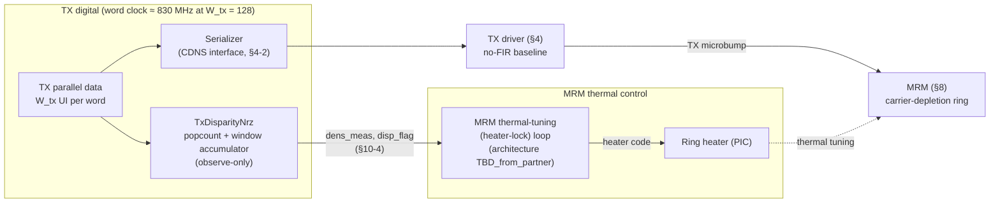

# TX Disparity Checker — drop-in section for `architecture_spec.md`

> **Integration note.** This file is a self-contained section written for direct insertion into the L250 PMA Architecture Specification. The section number (10) is **provisional** — the RX eye monitor draft (`rx_eye_monitor_spec.md`) occupies provisional Section 9 — confirm both at integration and append "10. TX Disparity Checker" to the §1 section outline. All `§n-m` cross-references below refer to the existing document.

---

## Section 10: TX Disparity Checker

**Status.** Proposed digital block (`TxDisparityNrz`) — **not yet in the behavioral model**. Accumulation-window default, flag thresholds, and the thermal-tuning-loop consumption model are working proposals, individually tagged `TBD` below.

The TX disparity checker is an **observe-only digital monitor in the TX digital (serializer-side) logic** that measures the running balance of 1's versus 0's in the transmitted bit stream and reports it to the **MRM thermal-tuning (heater-lock) loop** (§8-4). It is the TX-side counterpart of the RX channel estimator (§7-6a): pure digital logic on a data stream that already exists, terminating in readback registers and status flags rather than a DAC — the instrument, never the actuator. It drives no knob in the TX datapath and closes no loop of its own; the ring's thermal operating point remains owned by the thermal-tuning loop (one controller per node, §7-8 rule 1).

### 10-1 Motivation — MRM sensitivity to transmit-data disparity

The carrier-depletion MRM (§8) is sensitive to the density of 1's vs 0's in the transmit stream through two mechanisms, both landing on the ring resonance:

1. **Data-dependent self-heating (thermo-optic).** The intracavity optical energy — and with it the power absorbed in the ring — differs between the mark and space states, because the two symbols sit at different detunings from resonance. The time-averaged absorbed power is therefore a function of the transmitted ones density, and a drift in ones density is a **thermal disturbance**: through silicon's thermo-optic coefficient it shifts the ring resonance exactly as an ambient-temperature change would, moving the modulation operating point (OMA, ER, and the §4-5 static `Y₁` floor all degrade off-peak). Which symbol is the hotter one depends on the mark/space-to-detuning mapping (`TBD_from_partner`); the `flip_sign` control (§10-5) absorbs the polarity.
2. **Average-bias shift (electrical).** The driver-to-MRM attach is DC-coupled, with no back-termination and no AC coupling (§4-3), so the average differential voltage at the MRM junction tracks the transmitted duty cycle. Through the ≈ 25 pm/V tuning efficiency (§8-3), a ones-density change is directly an average-detuning change, even before any thermal response.

Nothing in this PMA bounds the disparity of the mission stream: the datapath applies **no encoding or scrambling**, so the ones density of the line stream is whatever the higher layer delivers. The document already treats identical-digit statistics as a first-class stressor — the CDR must coast through 72-UI CID runs (§6-12), the TIA LF cutoff is sized against baseline wander over a 72-bit CID run (§5-1), and the §8-4 squelch spec requires the average optical power be held constant precisely "to keep thermal tuning loops locked" (the same physics at the limit of a fully static input). What is *not* otherwise instrumented is the mission stream's density drift in the band **between the heater-lock loop bandwidth and the ring's thermal cutoff ≈ 1/τ_th**: fluctuations below the loop bandwidth are tracked by the heater lock as ordinary drift (its error observable is `TBD_from_partner`), fluctuations above ≈ 1/τ_th are averaged by the ring's own thermal mass, but disturbances inside the band land directly on the resonance. The disparity checker instruments that band and gives the thermal-tuning loop a feed-forward observable for it (e.g., compensating the thermal tuning for data-dependent heating), plus a flag for gross imbalance events.

### 10-2 Block placement and datapath tap

The checker taps the **TX parallel data word at the serializer input** — the parallel-domain equivalent of the transmitted bit stream. Because the PMA datapath applies no encoding or scrambling, and the FIR-DAC branches (when enabled) re-use the same bit sequence at 0/1/2-UI delays (§4-1), the word at the serializer input is **bit-identical to the serialized line stream**: a parallel tap measures the true line disparity with no high-speed tap on the serialized output and no load added to the §4-2 serializer-to-driver interface.



*Figure 10-1: TX disparity checker placement. The checker taps the parallel word at the serializer input, accumulates running disparity over a programmable window, and exports snapshot readbacks and flags to the MRM thermal-tuning (heater-lock) loop. The notification path is report-only: the heater code remains owned by the thermal-tuning loop.*

The hardware is small and runs entirely in the sub-GHz TX word-clock domain: a `W_tx`-input ones-counter (popcount adder tree — the same hardware class as the 128-input ternary adder tree in `CdrVoter`, §6-4), a signed per-word disparity of at most ±`W_tx` (9 bits signed at `W_tx = 128`, matching the §6-2 voter-accumulator width), and one signed window accumulator. At the proposed `W_tx = 128` the word clock is 106.25 GBd / 128 ≈ **830 MHz**, consistent with the < 1 GHz digital-clock convention established for the RX update path (§6-4); the final word width follows the CDNS serializer lane interface (§4-2, `TBD_from_partner`), and the checker logic is width-agnostic.

### 10-3 Disparity metric, accumulation, and readback

**Algorithm** (`TxDisparityNrz`). Per word, count ones and accumulate the signed disparity; per window, snapshot and reset:

```python
# per TX word-clock cycle (one W_tx-UI word per cycle)
ones      = popcount(word)                 # W_tx-input adder tree (cf. CdrVoter, §6-4)
acc      += 2 * ones - W_tx                # signed per-word disparity ∈ [−W_tx, +W_tx]
ui_count += W_tx

if ui_count == D_disp:                     # window complete (D_disp = multiple of W_tx)
    disp_meas = acc                        # signed running disparity, |disp_meas| ≤ D_disp
    dens_meas = acc / D_disp               # normalized disparity ∈ [−1, +1];
    #                                        ones density = (dens_meas + 1) / 2
    update_flag(dens_meas)                 # threshold / hysteresis / persistence (§10-4)
    acc = 0; ui_count = 0
```

`dens_meas = 0` is a balanced stream (50 % ones density); `dens_meas = +1` is all-ones. For random data the snapshot has a statistical floor of `1/√D_disp` per window — ≈ 0.004 at the default 65536-UI window, the same construction as the channel estimator's readback floor (§7-6a) — so any genuine density event of interest sits orders of magnitude above the noise.

**Mapping to the common architecture:** observe = per-word popcount of the serializer-input word; average = `D_disp`-UI window accumulation; **no vote, no DAC** — the block instantiates stages (1)–(2) of the §7-1 template only, exactly as the channel estimator does (§7-6a). The §10-4 threshold/hysteresis stage is a reporting comparator, not a control vote. The accumulator is bounded by the window (`|acc| ≤ D_disp`), so saturation is impossible by construction — consistent with the document-wide rule that only the CDR phase accumulator may wrap and everything else saturates or is bounded (§6-5, §7-1).

**Secondary observable — peak CID run length (proposed).** The same tap cheaply supports a per-window longest-run monitor: `cid_max` = the longest consecutive-identical-digit run observed in the window (run state carried across word boundaries), with a flag threshold `T_cid` defaulting to the **72-UI** OIF-CEI CID stressor already adopted in §6-12. A mission stream exceeding that run-length class is outside what the CDR's CID coast (§6-12) and the TIA LF-cutoff sizing (§5-1) were provisioned for, so `cid_flag` is a link-health observable as much as a thermal one. Whether the CID monitor is retained in hardware is `TBD_from_sim_sweep`.

### 10-4 Notification interface to the MRM thermal-tuning loop

The checker exports the following, all synchronous to the TX word clock:

| Export | Type | Meaning |
|---|---|---|
| `dens_meas` | signed snapshot word, one per `D_disp` window | Normalized disparity, sign-corrected by `flip_sign` so + always means "toward the hotter (higher-absorbed-power) symbol" regardless of driver/modulator polarity |
| `meas_valid` | strobe / qualifier | Asserted with each snapshot; forced low under squelch (below) |
| `disp_flag` | level | Sustained excessive disparity (truth table below); the primary notification to the thermal-tuning loop |
| `cid_flag` | level (proposed) | Peak CID run ≥ `T_cid` observed in the window |
| `dens_peak`, `cid_max` | sticky watermark readbacks | Max-magnitude `dens_meas` (sign preserved) and longest run since last clear; cleared by register access |

**Truth table** (flag update, evaluated once per window snapshot):

| Condition on window snapshot | Action | Meaning |
|---|---|---|
| `\|dens_meas\| ≥ T_hi` for `N_persist` consecutive windows | assert `disp_flag` | Sustained excessive disparity → notify thermal-tuning loop |
| `\|dens_meas\| ≤ T_lo` for `N_persist` consecutive windows | deassert `disp_flag` | Balance restored |
| `T_lo < \|dens_meas\| < T_hi` (either run broken) | hold `disp_flag` | Inside hysteresis band |

**Dead-band / hysteresis (disparity checker):** implemented as a **two-threshold hysteresis pair plus a persistence count on the window snapshot** — `disp_flag` asserts only after `N_persist` consecutive windows at `\|dens_meas\| ≥ T_hi` and deasserts only after `N_persist` consecutive windows at `\|dens_meas\| ≤ T_lo` (`T_lo < T_hi`), so a density hovering near threshold cannot chatter the flag at the snapshot rate. The snapshot readback itself carries **no dead-band** — like the channel estimator (§7-6a) it is an open-loop measurement whose noise floor is the statistical `1/√D_disp` per snapshot.

**Consumption by the thermal-tuning loop.** How the loop incorporates the report — a feed-forward term scaled into the heater drive to pre-compensate data-dependent heating, a gain-scheduling input, or a firmware-level alarm only — is a property of the thermal-tuning loop, whose architecture is not specified in this document (`TBD_from_partner`; the EIC-side digital interface into it is `TBD_analog_design`). The checker's contract is only the exported observables above. This mirrors the CDR's posture toward the squelch/relink handshake (§6-11): expose the observable, leave the policy to its owner.

**Squelch / invalid-input gating.** During TX squelch (§8-4) the serializer input is not mission data, and a disparity measured on a squelched (static) input must not reach the thermal-tuning loop — which is at that moment relying on the constant-average-power squelch state to hold heater lock. The checker therefore follows the CDR's signal-valid discipline (§6-11): while the TX-side squelch/invalid condition is asserted, `meas_valid` is forced low and `disp_flag` is **held**; on exit, the window accumulator and persistence counters are cleared so the first post-squelch snapshot is not contaminated by a partial window.

### 10-5 Parameter table

| Placeholder | Model/RTL name | Default | Meaning |
|---|---|---|---|
| `W_tx` | `word_width` | **128** UI (proposed) | Parallel word per checker cycle; at 128 the word clock is 106.25 GBd / 128 ≈ 830 MHz (< 1 GHz digital convention, §6-4). Final width follows the CDNS serializer lane interface (§4-2, `TBD_from_partner`); the checker logic is width-agnostic |
| `D_disp` | `decimation` | **65536** UI (≈ 0.62 µs) | Accumulation window per snapshot; integer multiple of `W_tx`; programmable 2¹² … 2²⁴ UI (≈ 39 ns … 158 µs). Default sized to give several snapshots per ring thermal time constant `τ_th` (µs-class assumed, `TBD_from_partner`) |
| `N_acc,disp` | `acc` width | 25 bits signed | `⌈log2(D_disp,max)⌉ + 1`; bounded by the window (`\|acc\| ≤ D_disp`) — saturation impossible by construction (cf. `ChanEstNrz`, §7-6a) |
| `T_hi` | `thresh_hi` | 0.25 (proposed) | Flag-assert threshold on `\|dens_meas\|` (ones density outside 37.5 % … 62.5 %); ≈ 64× the random-data floor at the default window. Final value set by the MRM's resonance sensitivity to absorbed-power change (`TBD_from_partner`) |
| `T_lo` | `thresh_lo` | 0.125 (proposed) | Flag-deassert threshold; hysteresis requires `T_lo < T_hi` (`TBD_from_partner`) |
| `N_persist` | `persist` | 2 windows | Consecutive-window persistence for both assert and deassert |
| `T_cid` | `cid_thresh` | **72** UI | Peak-CID flag threshold, anchored to the §6-12 OIF-CEI CID stressor (retention of the CID monitor `TBD_from_sim_sweep`) |
| — | `flip_sign` | `False` | Negates the exported `dens_meas` so + always means "toward the hotter symbol", independent of driver/modulator polarity (`TBD_from_partner`); cf. `flip_dir`, §6-2 |
| — | `disp_meas`, `dens_meas` | signed count / fraction ∈ [−1, +1] | Snapshot readbacks, one per window, qualified by `meas_valid` |
| — | `dens_peak`, `cid_max` | sticky watermarks | Max-magnitude snapshot (sign preserved) and longest run since last clear |
| — | `enable` | 1 | Freeze control per the §7-10 convention: exports to the thermal-tuning loop gate off, but the window measurement keeps updating for observability |

Per the operating-mode disclaimer, all defaults above assume 106G full-rate; at 53 Gbps half-rate the UI-denominated windows double in absolute time and the defaults are **TBD**.

### 10-6 Interaction, timescales, and open items

**Timescale placement.** Three timescales bracket the design: the symbol (9.41 ps), the snapshot window (0.62 µs default, ≈ 1.6 MHz snapshot rate), and the thermal plant (`τ_th` µs-class assumed, heater-control settling ms-class — cf. the 60–75 ms squelch/relink budget, §8-4). The default window therefore oversamples the τ_th-limited disturbance band by several snapshots per thermal time constant, and the flag's `N_persist = 2` adds ≈ 1.2 µs of notification latency — negligible against the thermal response it reports on. If partner data places `τ_th` faster than the µs class, shorten `D_disp` by the same ratio (the `1/√D_disp` readback floor degrades only as the square root).

**Nesting / disturbance ladder.** The checker itself is observe-only and TX-side, so — like the channel estimator (§7-6a) — it has **no slot in the §7-8 disturbance ladder** and no bandwidth constraint against the RX loops. The actuation it informs does touch an observable the RX cares about: a heater step moves the ring operating point, hence OMA/ER, hence the rail amplitude seen by the Vp/AGC loops. This is safe by construction: the heater's own thermal response low-passes any disparity-informed action into the µs–ms class, more than four decades slower than the slowest RX loop (AGC, ≥ 8192 UI ≈ 77 ns per LSB, §7-9), so to the RX ladder it is the same slow environmental drift the Vp/offset/AGC loops already track.

**Power accounting.** The checker is TX digital logic and books against the **SerDes** energy line (§1-3), not the analog TX-driver allocation.

**Open items.**

- MRM thermal time constant `τ_th`, heater-lock loop bandwidth, and resonance sensitivity to absorbed-power change — needed to finalize `D_disp`, `T_hi`, `T_lo` (`TBD_from_partner`).
- Thermal-tuning-loop consumption model: feed-forward heater pre-compensation vs. flag-only alarm (`TBD_from_partner`, EIC-side interface `TBD_analog_design`).
- Behavioral-model implementation of `TxDisparityNrz` and threshold sizing sweeps: PRBS13/PRBS31 (balanced baselines), the §6-12 72-UI CID JTOL pattern, and synthetic duty-skewed patterns against modeled resonance shift (`TBD_from_sim_sweep`).
- Retention of the peak-CID secondary monitor (`TBD_from_sim_sweep`).
