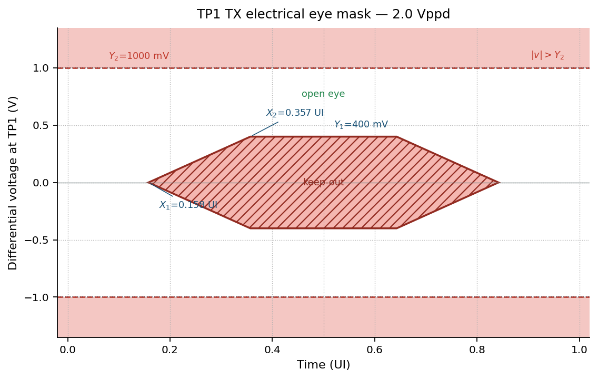
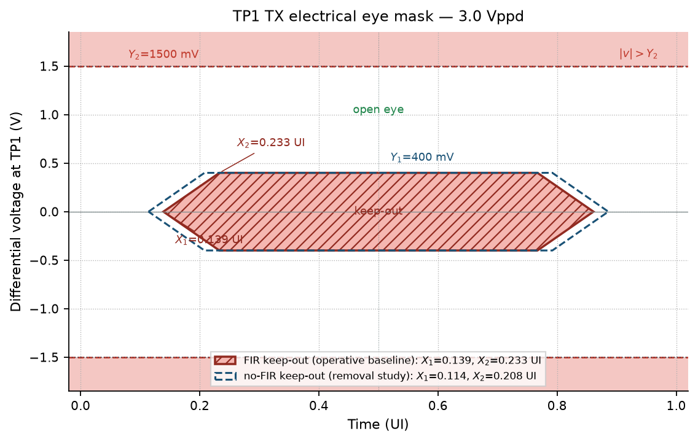
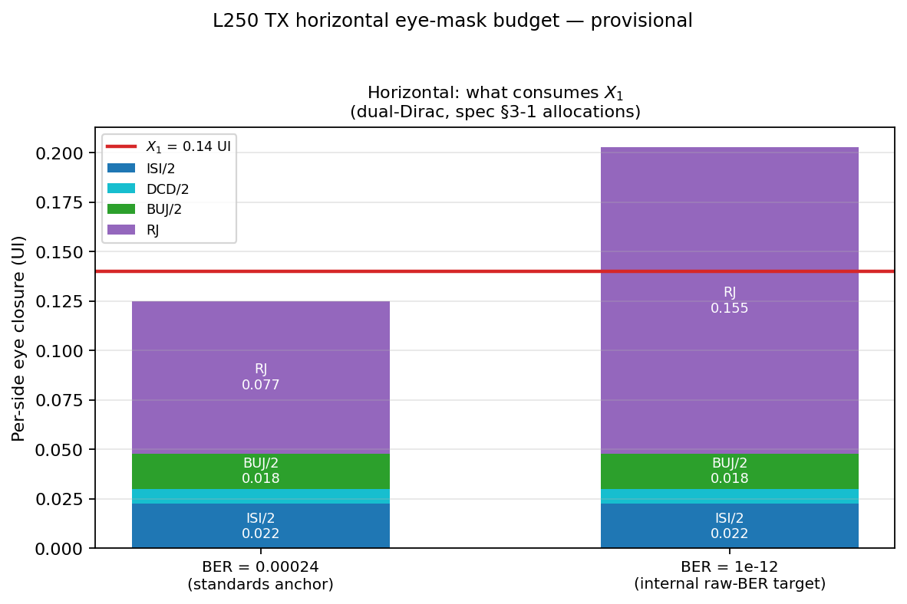
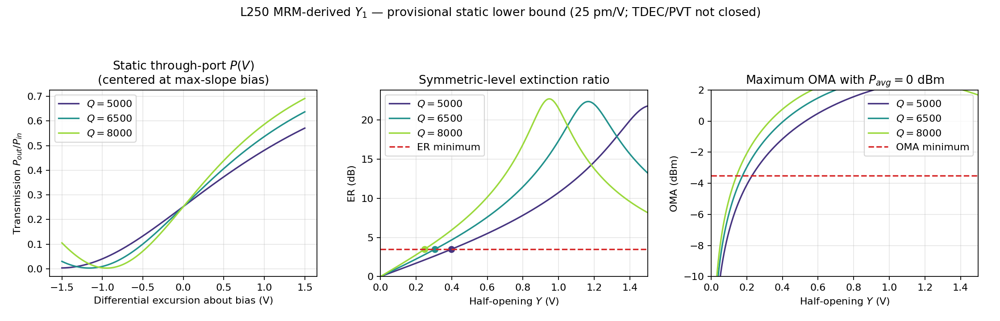

# TP1 TX Electrical Eye Mask — Normative Definition

**Extracted from `gizmo.md` §3-4** (Gizmo PMA Architecture Specification, 106.25 Gbps NRZ). This file is the normative eye-mask text; `gizmo.md` §3-4 is a pointer stub. All `§n-m` cross-references below refer to `gizmo.md`.

---

### 3-4 TX electrical eye mask — normative definition (2.0 Vppd and 3.0 Vppd)

This subsection is the single normative definition of the TP1 eye mask referenced by §2 and the §3-2 driver table. The mask geometry follows the standard OIF-CEI TX hexagon construction; this is an internal mask, not a CEI compliance claim. Two swing-specific masks are defined, one at each §3-2 sign-off swing, each in two tap-configuration variants: the **FIR** hexagon (solid in Figures 4-4a/b; defined after the coordinate table) with $X_1$ from the §2 FIR-included $DJ_{\delta\delta}$ — the operative sign-off mask while the FIR is in the mission path (§3 intro) — and the **no-FIR** hexagon (dashed in Figures 4-4a/b; coordinate table below), built from the §2 no-FIR dual-Dirac budget at raw BER $10^{-12}$ and applicable to the FIR-removal-study configuration. In both, the inner-hexagon slope is set by the §3-2 hard-max 20–80% edge so a legal slow edge still clears $Y_1$. $Y_1$ remains a model-derived static floor pending partner PVT and dynamic TDEC.

*Figure 4-4a: TP1 keep-out hexagons and amplitude bound at **2.0 Vppd**. Solid: FIR operative baseline, $X_1=0.139$ UI, $X_2=0.281$ UI. Dashed: no-FIR (removal study), $X_1=0.114$ UI, $X_2=0.256$ UI. $Y_1=400$ mV, $Y_2=1000$ mV.*

*Figure 4-4b: TP1 keep-out hexagons and amplitude bound at **3.0 Vppd**. Solid: FIR operative baseline, $X_1=0.139$ UI, $X_2=0.233$ UI. Dashed: no-FIR (removal study), $X_1=0.114$ UI, $X_2=0.208$ UI. $Y_1=400$ mV, $Y_2=1500$ mV. The larger slew at the same 4.0 ps hard-max edge lets the hexagon shoulder sit earlier, so the 3 V mask is the tighter of the two in $X_2$.*

**Coordinate system.** The mask is evaluated on the differential voltage $v(t)=V_{TXP}-V_{TXN}$ (absolute millivolts, not normalized to measured swing) at **TP1** (the electrical input to the MRM modulator), with the extracted 150 fF MRM-plus-pad load present (gizmo.md §3-3). Time is expressed in UI (9.412 ps at 106.25 GBd) over one full unit interval folded about the eye center at $t=0.5$ UI. Apply the mask whose $Y_2$ matches the swing under test; interpolating between the two polygons is not permitted.

**Alignment.** The eye is folded against the ideal (jitter-free) serializer symbol clock, with the fold phase chosen so that the mean 0 V differential-crossing time sits at $t=0$ UI (eye center at 0.5 UI). Recovered-clock or per-edge alignment is not permitted: it would absorb even-odd and data-dependent jitter that the §2 TP1 targets (`EOJ03`) and the §2 internal allocations bound, and which must remain visible to the mask.

**Mask regions.** Two region families define each mask:

1. **Inner keep-out hexagon** — no sample of $v(t)$ may fall inside (or on the boundary of) the polygon with vertices, in $(t\ \mathrm{[UI]},\ v\ \mathrm{[mV]})$:

   $$(X_1, 0),\ (X_2, +Y_1),\ (1-X_2, +Y_1),\ (1-X_1, 0),\ (1-X_2, -Y_1),\ (X_2, -Y_1)$$

   At **2.0 Vppd**: $(0.114, 0)$, $(0.256, +400)$, $(0.744, +400)$, $(0.886, 0)$, $(0.744, -400)$, $(0.256, -400)$.

   At **3.0 Vppd**: $(0.114, 0)$, $(0.208, +400)$, $(0.792, +400)$, $(0.886, 0)$, $(0.792, -400)$, $(0.208, -400)$.

2. **Amplitude bound** — $\lvert v(t)\rvert \le Y_2$ at all times, with $Y_2=V_{PP}/2$. This bounds overshoot and ringing at the unterminated capacitive microbump: $\lvert v\rvert\le 1000$ mV at 2.0 Vppd and $\lvert v\rvert\le 1500$ mV at 3.0 Vppd.

**Coordinate values.**

| Coordinate | 2.0 Vppd | 3.0 Vppd | Derivation |
|---|---|---|---|
| $X_1$ | 0.114 UI | 0.114 UI | $=TJ(10^{-12})/2=0.228/2$ UI from the §2 no-FIR budget. Swing-independent. Guarantees unclosed electrical eye width $1-2X_1=0.772$ UI = 7.27 ps. |
| $X_2$ | 0.256 UI | 0.208 UI | $X_2=X_1+Y_1/\mathrm{SR}_{\min}$. $\mathrm{SR}_{\min}$ is the linear-ramp slew of the §3-2 hard-max 20–80% edge (4.0 ps = 0.42 UI): $T_{0\rightarrow100}=4.0/0.6=6.67$ ps, $\mathrm{SR}=V_{PP}/T_{0\rightarrow100}$. At 2.0 Vppd this is 0.300 V/ps and $Y_1$ is reached 1.33 ps = 0.142 UI after the jittered crossing; at 3.0 Vppd, 0.450 V/ps and 0.89 ps = 0.094 UI. Extracted two-pole edges are `TBD_from_sim_sweep`. |
| $Y_1$ | 400 mV | 400 mV | Static MRM ER ≥ 3.5 dB floor, rounded from 399.2 mV at the modeled $Q=5000$ corner with 25 pm/V tuning. OMA also passes when $P_{avg}=0$ dBm. Partner PVT curves and dynamic NRZ TDEC remain open (`TBD_from_link_budget`). |
| $Y_2$ | 1000 mV | 1500 mV | $=V_{PP}/2$ at the swing under test. Final confirmation against MRM reverse-bias reliability and overshoot limits is `TBD_from_partner`. |

**FIR mask variant (operative baseline).** With the FIR in the mission path (§3 intro), the §2-2 / §3-2 budget adds ≈0.05 UI of FIR slice-DCD: $DJ_{\delta\delta} \le 0.123$ UI pp, $TJ(10^{-12}) = 0.278$ UI pp. The same construction then gives $X_1 = TJ/2 = 0.139$ UI (unclosed width 0.722 UI = 6.80 ps) and $X_2 = 0.281$ / $0.233$ UI at 2.0 / 3.0 Vppd; $Y_1$, $Y_2$, and all measurement conditions are unchanged, and the hexagon follows the generic vertex formula above. This is the operative mask while the FIR is included; the no-FIR hexagon applies to the removal-study configuration (see pass/fail below). Figures 4-4a/b render both hexagons (FIR solid, no-FIR dashed); both variants are carried in `tx_eye_mask.json`.

**Pass/fail statistics (provisional).** Zero mask violations over ≥ $10^6$ UI per corner, with PRBS13 and PRBS31, across supply/temperature/process corners and simultaneous WDM-lane activity, at both sign-off swings. The inner hexagon is evaluated against the variant matching the tap configuration under sign-off: the FIR configuration (current baseline, §3 intro) with both tap banks at tap-code extrema against the $X_1=0.139$ UI hexagon; the no-FIR configuration (removal study) with all tap weights forced to zero against the $X_1=0.114$ UI hexagon, which books no FIR slice-DCD and would spuriously fail a FIR transmitter legal under §2-2. The $Y_2$ amplitude bound applies in every configuration (worst-case overshoot at the unterminated microbump). Observation length, and whether a small violation-count allowance tied to a hit-ratio BER equivalent replaces strict zero-hit, are `TBD_from_link_budget`.

**Mask-margin decomposition.** Horizontal closure is dual-Dirac from the §2 no-FIR allocations (the FIR variant adds 0.025 UI per side of slice-DCD) and is the same at both swings. Per eye side, the closure against the ideal-clock fold is $DJ_{\delta\delta}/2 + Q(\mathrm{BER})\cdot\sigma_{RJ}$, with the deterministic half splitting into $ISI/2 + DCD/2 + BUJ/2$. At the committed internal raw-BER target of $10^{-12}$ ($Q=7.034$, $\sigma_{RJ}=0.011$ UI):

| Contributor (per eye side) | UI | ps | Share of $X_1$ |
|---|---|---|---|
| $ISI/2$ | 0.0060 | 0.056 | 5.3% |
| $DCD/2$ | 0.0125 | 0.118 | 11.0% |
| $BUJ/2$ | 0.0180 | 0.169 | 15.8% |
| $Q(10^{-12})\cdot\sigma_{RJ}$ | 0.0774 | 0.728 | 67.9% |
| **Total closure** | **0.1139** | **1.072** | **100%** |
| **Unallocated margin vs $X_1=0.114$ UI** | **0** | **0** | **0%** |

$X_1$ equals the 1e-12 dual-Dirac closure by construction (0.114 UI). Random jitter dominates (68% of $X_1$); BUJ, DCD, and ISI are 16%, 11%, and 5%. With the 4.0 ps hard-max edge the ISI term is only 5% of $X_1$, so almost all remaining horizontal closure is clock jitter — the same §2 sensitivity. At the dj pre-FEC anchor of $2.4\times10^{-4}$ ($Q=3.49$) the same allocations consume only 0.075 UI per side (66% of $X_1$); that headroom is not used to relax the mask.

*Vertical (electro-optic derivation, provisional).* No waveform-quality ratio is converted to $Q(\mathrm{BER})\sigma$ closure here. Rise/fall time constrains the hexagon slope $X_2$ as above, but does not establish $Y_1$. Instead, `mrm_y1_derivation.py` evaluates symmetric electrical levels $\pm Y$ about the maximum-slope MRM bias. The §7 $Q=5000$–8000 range is represented by scaling the reference TCMT model's bus-coupling and intrinsic-loss rates together while preserving their ratio/notch shape, with 25 pm/V tuning. The resulting static ER ≥ 3.5 dB thresholds are 399.2, 306.3, and 248.7 mV for $Q=5000$, 6500, and 8000 respectively; the OMA constraint is weaker (230.2 mV worst case) when average launch power is scaled to its 0 dBm maximum. The mask therefore adopts **$Y_1=400$ mV as a provisional static lower bound** at both swings.

This is not PVT or TDEC sign-off. Scaling both loss rates together is an explicit surrogate because partner corner curves are not available, and the model-derived maximum-slope biases (−2.49 to −3.05 V in its voltage convention) do not yet reconcile with the §7-3 −1.5 to −2.0 V bias range. Moreover, applying TDEC = 3.4 dB in the OMA limit does not measure TDEC: final closure requires partner $P(V)$ curves across process, voltage, temperature, wavelength and heater-lock error, plus a dynamic SSPR waveform through the normative 53.125 GHz BT4 NRZ reference receiver. The final $Y_1$ must then be verified directly from vertical eye distributions including residual ISI, ripple, level mismatch, noise, distortion, and swing derating (`TBD_from_link_budget`).

**Machine-readable artifact.** All four mask variants (two swings × FIR / no-FIR), the coordinate values, status tags, measurement conditions, and the per-contributor margin decomposition above are maintained in `tx_eye_mask.json` (generated by `tx_eye_mask.py` in this directory, which also renders Figures 4-4a, 4-4b, and the budget bar). That file is the interchange format for sign-off tooling; this document remains the normative text.
