# Danyang Driver + BiasT + MRM Characterisation Summary

**Dataset:** `0720` Virtuoso AC + transient captures  
**Raw data:** `optical-serdes/temp/food/danyang/`  
**Analysis scripts:** `optical-serdes/temp/food/danyang/*.py`  
**Baud-rate reference:** 106.25 GBd NRZ (`UI = 9.41 ps`, resampled to `UI/32 = 0.294 ps`)

---

## Signal chain

Both AC and transient testbenches probe the same insertion points:

```
VIN → DRV → (drv out) → BiasT → (drv_eic / eic out) → MRM → Opto
```

| Node key (diff) | Description | Role |
|---|---|---|
| `input` / `drv_in` | Differential input | Stimulus reference |
| `drv` | Driver output | Pre-BiasT electrical output |
| `drv_eic` | BiasT output | Post-BiasT; drives the MRM |
| `vmrm` / `mrm` | MRM input | Modulator electrical port |
| `opto` | Optical power | Modulator output (AC diff only) |

Single-ended captures record P and N legs separately at each node (`DRV_single_*` files).

---

## Source files

| File | Format | Content |
|---|---|---|
| `DRV_diff_ac_response_0720_w_notes.xlsx` | Excel | Differential AC sweep: mag + phase, 121 log-spaced points (100 kHz – 100 GHz) |
| `DRV_single_ac_response_0720_w_notes.xlsx` | Excel | Single-ended (P/N) AC sweep, same frequency grid |
| `DRV_diff_tran_response_0720.csv` | CSV | Differential transient: step/pulse response |
| `DRV_single_tran_response_0720.csv` | CSV | Single-ended (P/N) transient |

**Transient stimulus:** differential pulse — low for 0–100 ns, high for 100 ns–5.1 µs, then back low. The rising edge at ~100 ns is finely resolved (~1 ps near the edge); the long hold exposes BiasT/MRM droop and settling.

**Transient grid:** 1445 non-uniform samples over 10.09 µs (mean Δt ≈ 7 ns; sub-ps spacing at the edge). All baud-rate analysis resamples onto a uniform `UI/32` grid via linear interpolation.

---

## Analysis scripts

All scripts live in `optical-serdes/temp/food/danyang/` and share loaders/constants in `load_data.py`.

| Script | Purpose | Output figure(s) |
|---|---|---|
| `ac_bode.py` | Bode plots (mag + phase) for diff and single-ended AC | `ac_bode_diff.png`, `ac_bode_single.png` |
| `transient_response.py` | Full pulse + rising-edge zoom for diff and SE | `transient_diff.png`, `transient_single.png` |
| `crosscheck_diff_single.py` | Validate `Vdiff` vs `Vp − Vn` in AC and transient | `crosscheck_diff_single.png` |
| `extract_sbr_from_step.py` | Step → IR → frequency response (DRV and BiasT nodes) | `step_raw_vs_interpolated.png`, `step_derived_ir.png`, `step_derived_freqresponse.png` |
| `eye_diagrams.py` | PRBS-15 NRZ eyes through derived IRs | `eye_diagrams.png` |
| `channel_plus_driver.py` | Cascade BiasT output with Masood channel IR | `channel_plus_driver_freqresponse.png`, `channel_plus_driver_impulse_responses.png`, `channel_plus_driver_eye.png` |
| `tdec_effective_channel.py` | TDEC (NRZ, FlexDCA-free `tdecqlib`) for the effective channel | `tdec_effective_channel_eye.png` |
| `bathtub_lockpoints.py` | Gaussian-blind BER vs CDR lock point (`--node drv\|drv_eic`, `--no-channel`) | `bathtub_lockpoints*.png` |
| `bathtub_noise.py` | Exact ISI ⊕ AWGN bathtubs vs slicer SNR + required-SNR margin | `bathtub_noise_curves.png`, `bathtub_noise_margin.png` |

Regenerate all plots:

```bash
cd optical-serdes/temp/food/danyang
python3 ac_bode.py
python3 transient_response.py
python3 crosscheck_diff_single.py
python3 extract_sbr_from_step.py
python3 eye_diagrams.py
python3 channel_plus_driver.py
python3 tdec_effective_channel.py
python3 bathtub_lockpoints.py            # cascade (drv_eic ⊗ Masood)
python3 bathtub_lockpoints.py --node drv --no-channel
python3 bathtub_noise.py
```

---

## Data validation (diff vs single-ended)

Direct differential probes match `Vp − Vn` from the single-ended dataset to numerical precision:

| Node | AC max \|error\| | Transient max \|error\| |
|---|---:|---:|
| DRV input | 0.0000 dB | 1×10⁻¹³ V |
| DRV output | 0.0000 dB | 1×10⁻¹¹ V |
| BiasT output | 0.0000 dB | 1×10⁻¹¹ V |
| MRM input | 0.0000 dB | 1×10⁻¹¹ V |

The two testbenches are self-consistent; either representation can be used for analysis.

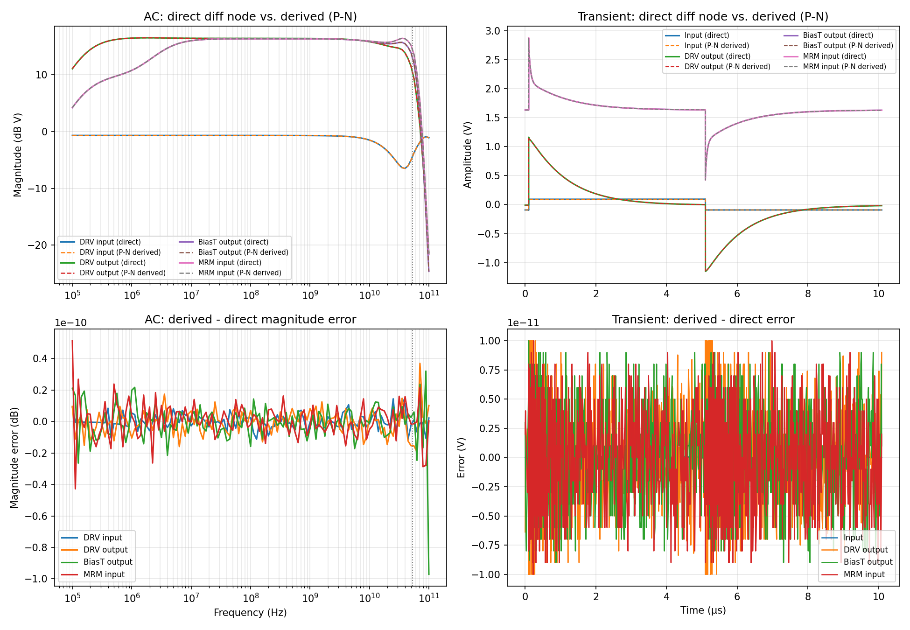

---

## AC (small-signal) results

Frequency sweep: 100 kHz – 100 GHz, 121 points. Magnitude normalised to the value at 100 kHz.

**Nyquist loss at 53.125 GHz** (half of 106.25 GBd):

| Node | Nyquist magnitude (rel. 100 kHz) |
|---|---:|
| DRV input | −3.71 dB |
| DRV output | −0.64 dB |
| BiasT output | +8.74 dB |
| MRM input | +10.18 dB |

The BiasT and MRM nodes show *gain* relative to the 100 kHz reference because the BiasT is AC-coupled: the low-frequency reference sits on the blocked-DC side of the high-pass characteristic. These AC numbers describe the small-signal phasor chain, not the large-signal step bandwidth in isolation.

Optical output (`opto`) is available in the differential AC file as a power magnitude (not dB-normalised voltage).

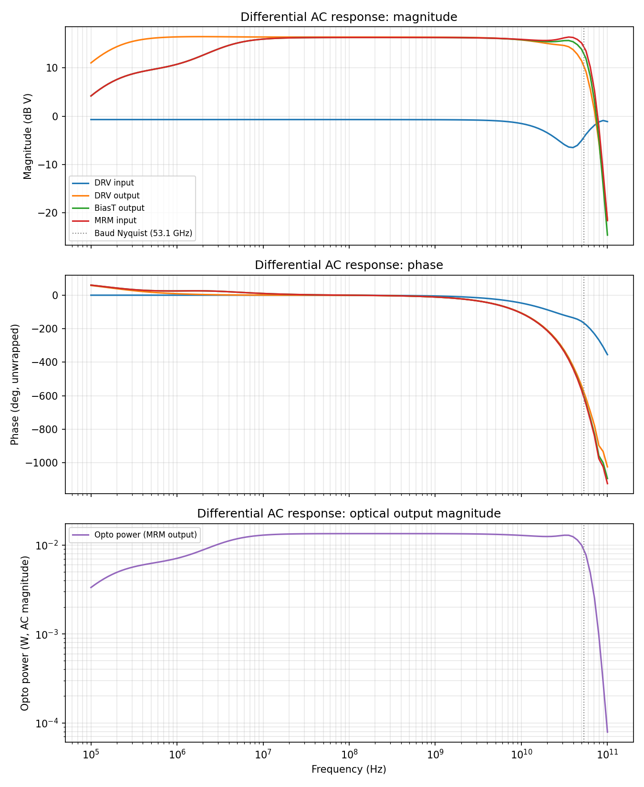

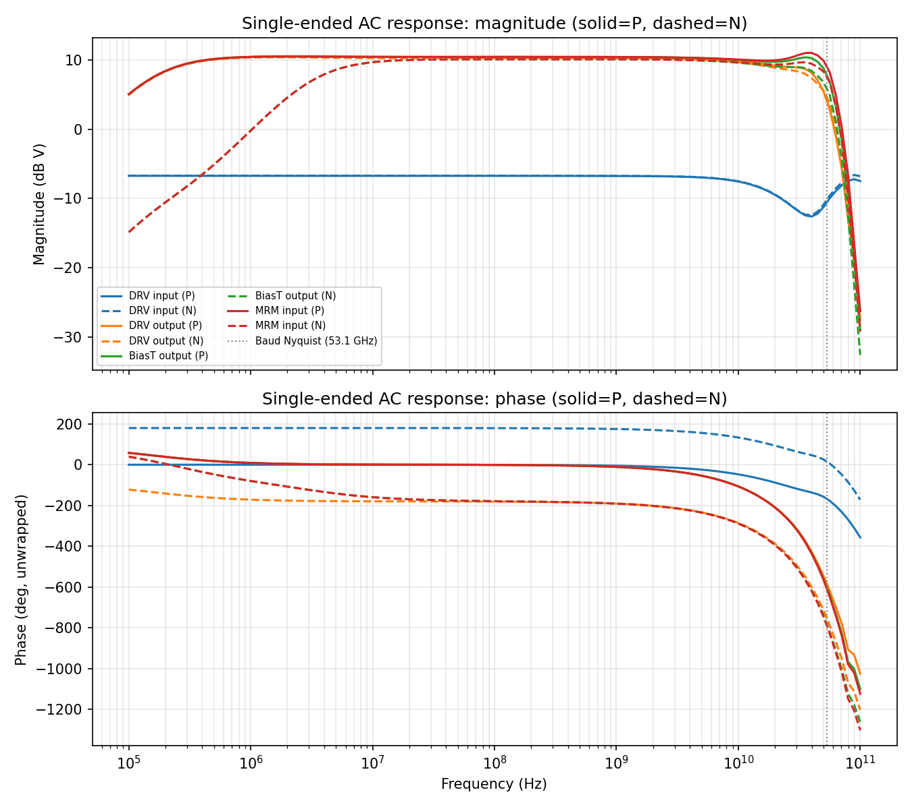

---

## Transient (large-signal step) results

**Step swings** (rising edge, diff):

| Node | Swing (V) | 10–90% risetime (ps) |
|---|---:|---:|
| DRV output (`drv`) | 1.145 | 11.2 |
| BiasT output (`drv_eic`) | 1.106 | 9.7 |

DRV output spans roughly ±1.15 V differential. BiasT output is single-ended referenced (0.45 – 2.85 V range over the full pulse). MRM input (`vmrm`) tracks BiasT output closely. Optical power (`opto`) swings ~3 – 8 mW.

The long hold (multi-µs) reveals slow droop on the BiasT/MRM side — expected from AC coupling — but this is far slower than baud-rate ISI and must be handled carefully when building convolution kernels (see below).

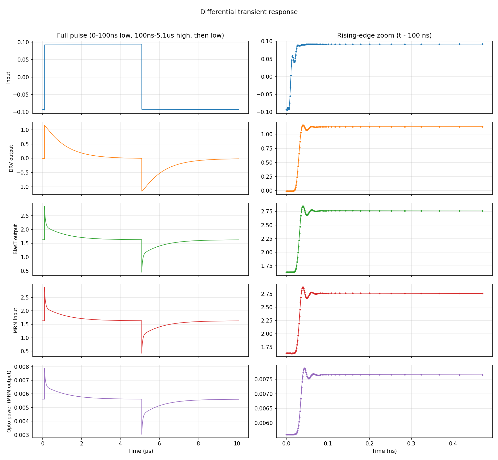

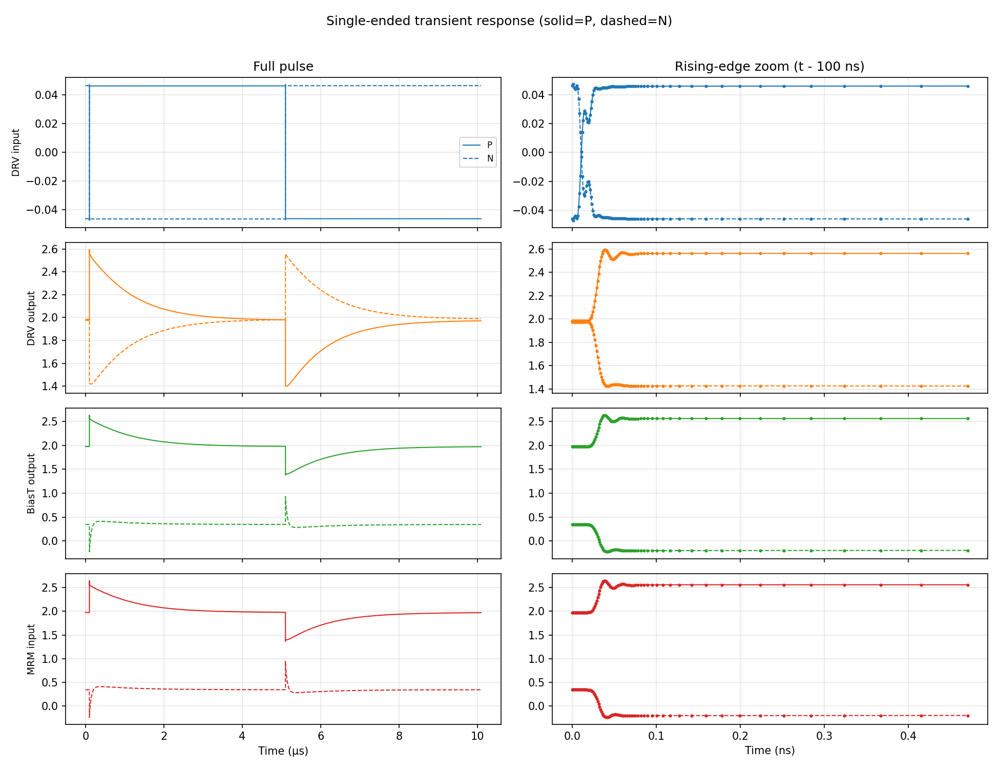

---

## Step-derived impulse response and frequency response

Method (per `optical-serdes/.claude/skills/characterise-step-sbr.md`):

1. Window the rising edge: 50 ps before → 2.5 ns after t = 100 ns.
2. Linear interpolation onto uniform `UI/32` grid.
3. Differentiate step response → continuous IR (V/s).
4. Discrete tap: `h[n] = ir × DT`.
5. FFT of tapered IR → magnitude and group delay.

**Caveat:** the applied step has a finite (~10–20 ps) input risetime, so the derived IR is `(source risetime) ⊗ (system)`, not a deconvolved Dirac-source response. Suitable for first-look bandwidth/ISI modelling; Wiener deconvolution would be needed for a true Dirac IR.

**Nyquist loss from step-derived IR** (truncated to 30 UI + tail taper):

| Node | DC gain Σh | Nyquist loss |
|---|---:|---:|
| DRV output | 1.144 | −9.87 dB |
| BiasT output | 1.131 | −6.92 dB |

Step-derived Nyquist loss is more pessimistic than the AC small-signal numbers for DRV output (−9.9 dB vs −0.6 dB), reflecting the combined effect of finite input edge rate, large-signal behaviour, and the differentiation/FFT pipeline. Use AC for small-signal chain budgeting; use step-derived IR for time-domain eye/ISI simulation.

Group-delay plots mask bins below 5 GHz and where \|H\| is >40 dB below peak, to suppress numerical artefacts from truncation and AC-coupling tails.

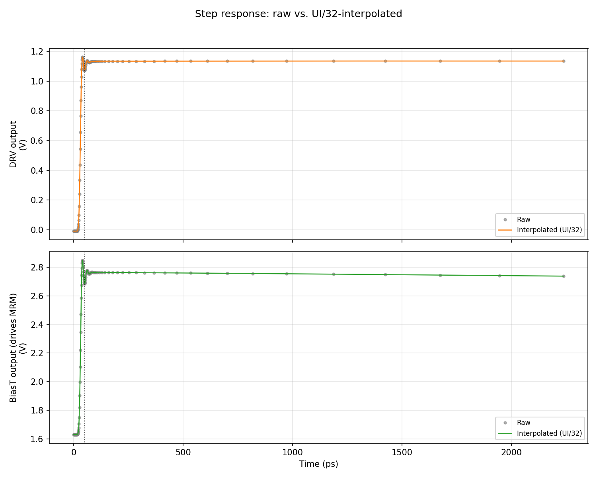

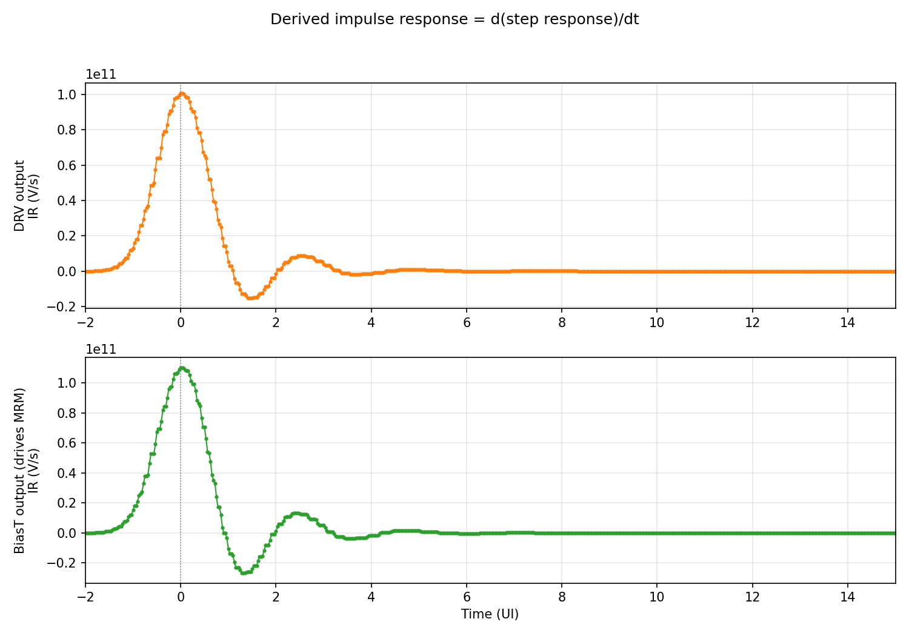

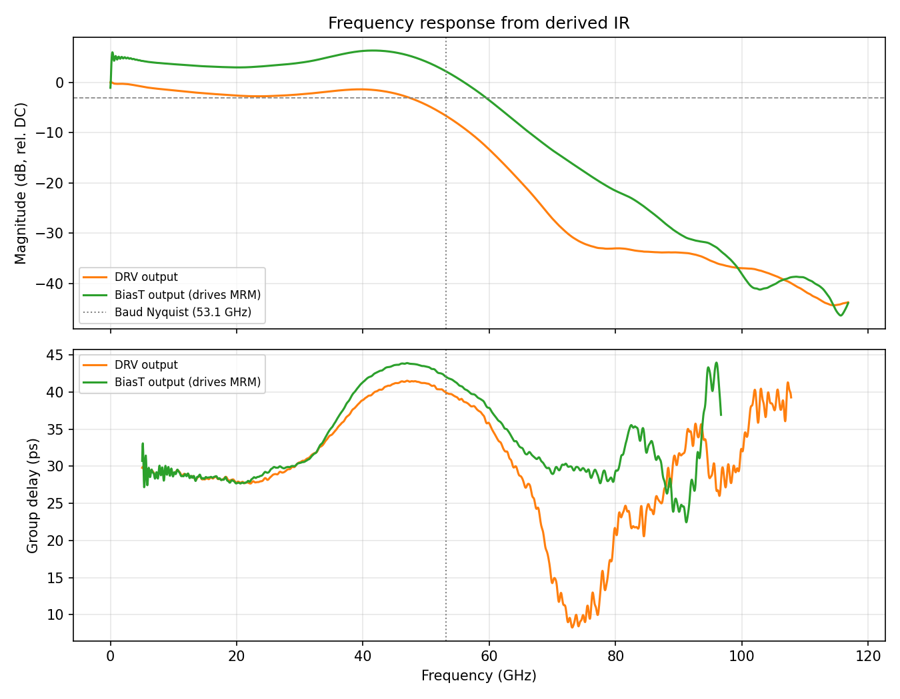

---

## Eye diagrams (PRBS-15, 106.25 GBd NRZ)

Drive: one full PRBS-15 period (32 767 bits), zero-order hold (`np.repeat(symbols, SPS)`), convolved with the truncated step-derived IR.

| Node | Eye height (V) | Eye width (UI) |
|---|---:|---:|
| DRV output | 0.429 | 0.375 |
| BiasT output | 0.596 | 0.344 |

**IR truncation (30 UI):** the full 2.5 ns extraction window leaves `drv_eic` sitting on a tiny but persistent one-signed plateau from microsecond-scale BiasT droop. Unlike DRV's alternating-sign tail, this plateau integrates coherently over long PRBS runs and produces spurious baseline wander that artificially closes the eye. Truncating the kernel to 30 UI past the main lobe removes this artefact while retaining baud-rate ISI.

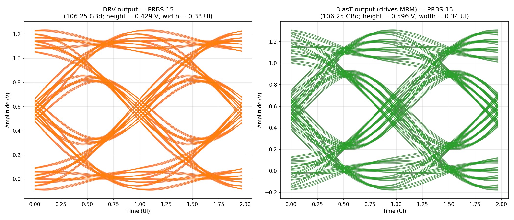

---

## Effective channel: Danyang driver + Masood interconnect

The BiasT output (`drv_eic`) was cascaded with the Masood channel impulse response (`optical-serdes/temp/data/step_response/from_masood/impulse_response.csv`), resampled to the same `UI/32` grid:

```
h_effective = conv(h_driver, h_channel)
```

**Nyquist loss at 53.125 GHz:**

| Block | Loss |
|---|---:|
| Danyang driver + BiasT | −6.92 dB |
| Masood channel | −4.77 dB |
| **Cascade (effective channel)** | **−11.69 dB** |

The dB-sum matches the direct FFT of `h_combined` exactly.

**Effective-channel eye** (PRBS-15 through cascade):

| Metric | Value |
|---|---:|
| Eye height | 0.133 V |
| Eye width | 0.312 UI |

The combined ~12 dB Nyquist loss produces a tight but still open eye.

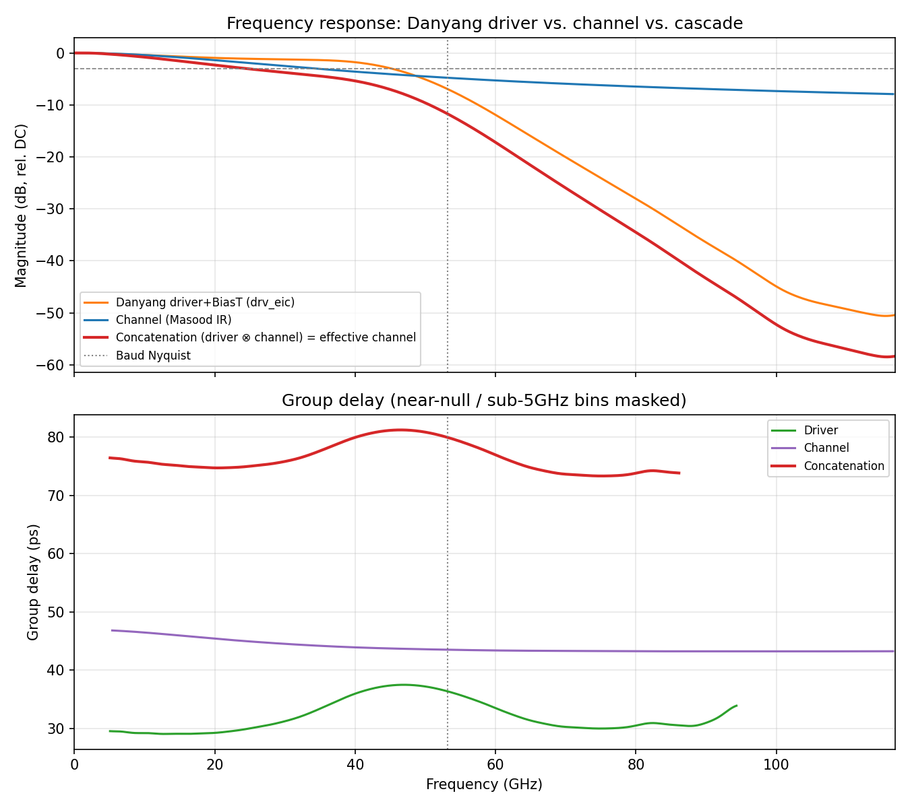

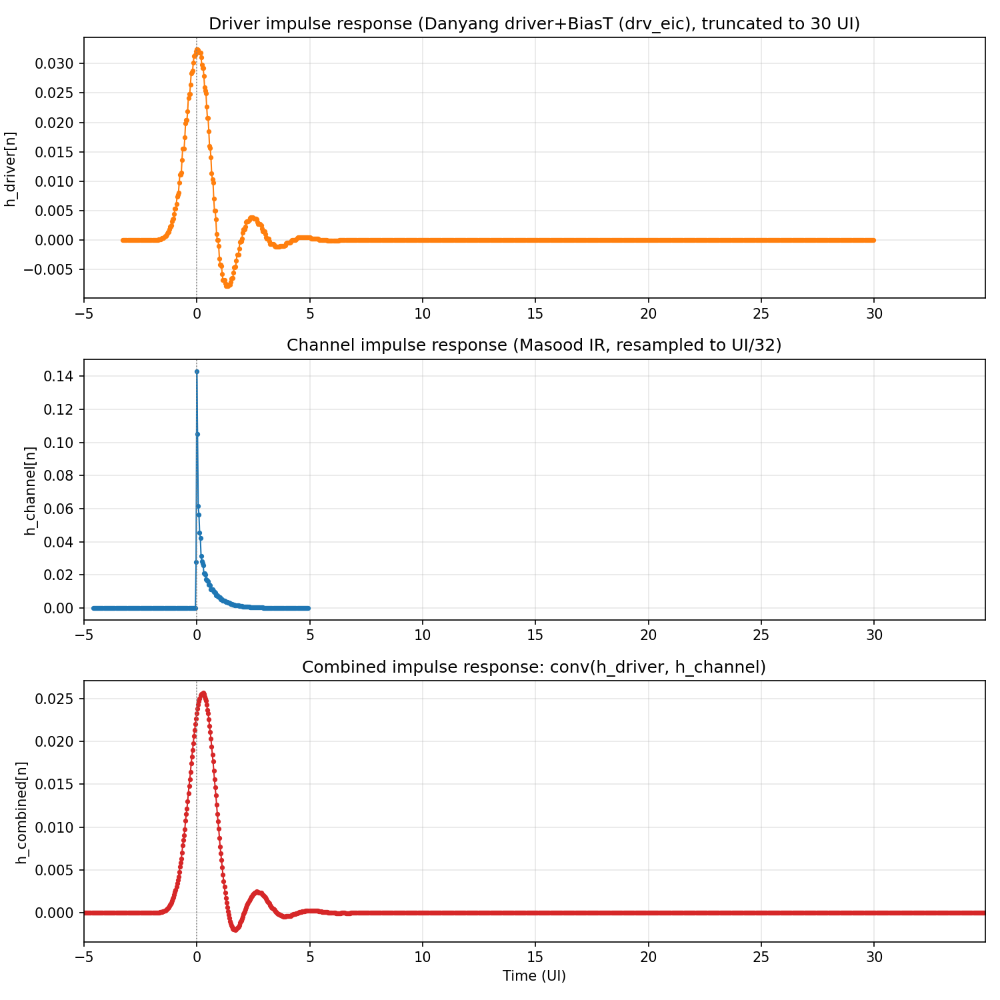

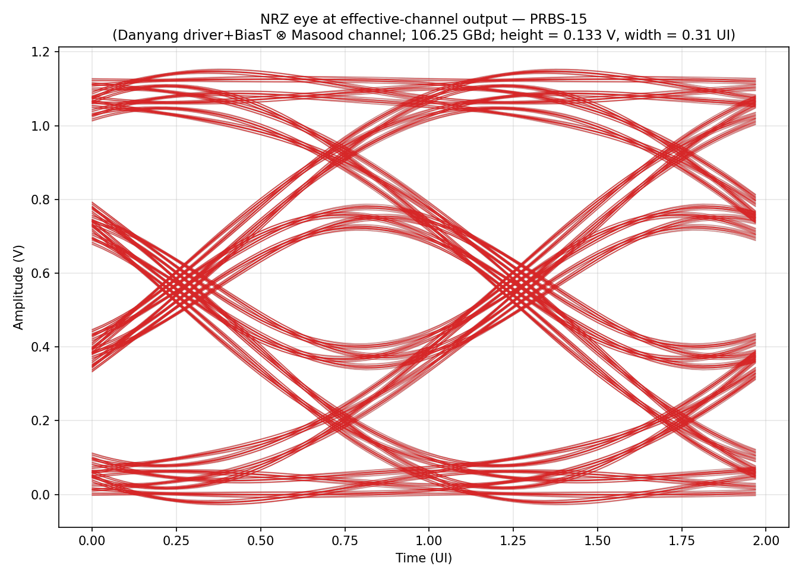

To cascade the channel before the BiasT instead (bare DRV output), change `DRIVER_NODE = "drv"` at the top of `channel_plus_driver.py`.

---

## TDEC of the effective channel

TDEC computed with the FlexDCA-free calculator (`tdecqlib`, `getTDEC_NRZ`) per
`optical-serdes/TDEC_CALCULATOR_GUIDE.md`: pattern-locked one-period PRBS-15
waveform through the effective channel, 4th-order Bessel-Thomson reference
receiver at 53.125 GHz, target pre-FEC BER 2.4×10⁻⁴.

| Metric | Value |
|---|---:|
| **TDEC** | **6.50 dB** |
| OMA | 1.086 V (linear; volts, not watts — dBm value not meaningful) |
| ER | 17.6 dB |

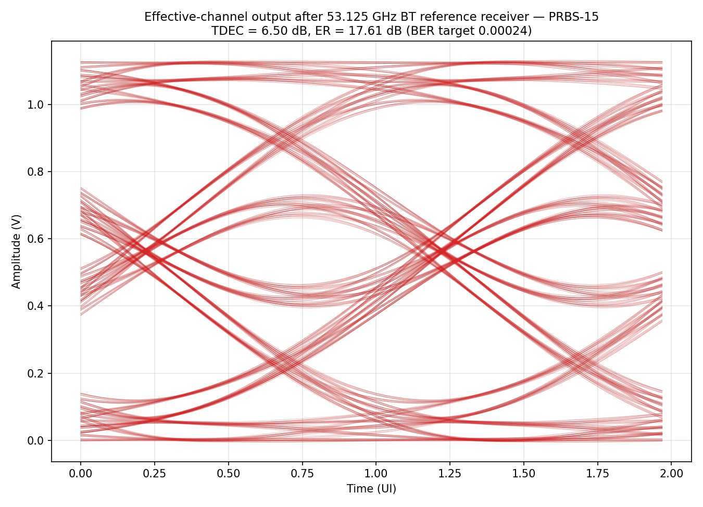

**Spec comparison:** the L250 architecture spec (§8) sets **TDEC ≤ 3.4 dB** as
the normative *optical* quality metric with the same methodology (BT4 at
0.5 × baud, BER 2.4×10⁻⁴). The electrical effective channel is over that limit
by ~3.1 dB — with the caveats that (a) the spec's measurement plane is the
optical MRM output, not this electrical node; (b) the measured chain has **no
TX FFE**, which the spec driver mandates (3-tap asymmetric); (c) the
BiasT + interconnect topology differs from the spec's direct microbump attach;
(d) pattern was PRBS-15 vs the spec's SSPR (minor for a linear chain). The
consistent picture: the raw driver + interconnect needs the mandated TX
equalization to approach the TDEC target.

---

## BER bathtub vs CDR lock point

BER evaluated at each of the 32 candidate CDR lock points (UI/32 phase steps,
matching the phase-interpolator resolution of the MM CDR). Two methods were
used; the Gaussian-blind one is retained mainly as a cautionary result. Full
methodology in Appendix A.

### Gaussian-blind bathtub (Appendix A.1) — pessimistic artifact for ISI-only waveforms

Per-phase SNR = (μ₁−μ₀)/(σ₀+σ₁) from the baud-rate sample statistics, BER =
½·erfc(SNR/√(2)·…) — the same "blind BER" recipe as
`optical_serdes.rx.rx_analysis`. On these **noiseless** waveforms σ is purely
bounded ISI, and the Gaussian tail extrapolation grossly overestimates BER:

| Configuration | Best lock point | SNR | "Blind" BER | Actual counted errors |
|---|---:|---:|---:|---:|
| DRV output only | 15/32 (0.469 UI) | 10.97 dB | 2.0×10⁻⁴ | 0 / 32 767 |
| BiasT ⊗ Masood channel | 22/32 (0.688 UI) | 9.17 dB | 2.0×10⁻³ | 0 / 32 767 |

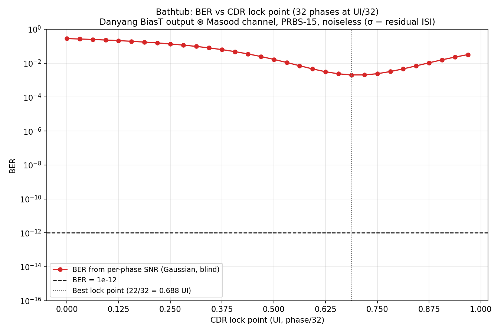

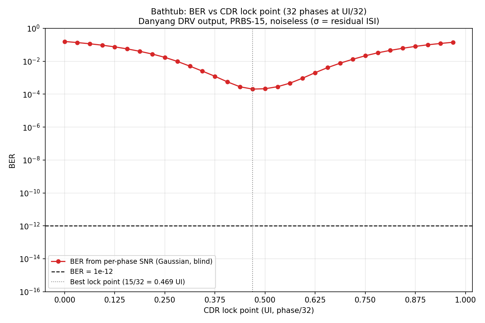

Both eyes are open, so the true noiseless error count is zero at the central
phases; the reported BER comes entirely from the fictitious Gaussian tail
fitted to a bounded, strongly non-Gaussian (excess kurtosis ≈ −1, hard-edged)
ISI distribution. The histogram at the cascade's best lock point makes the
failure mode explicit — every sample sits within 1.67σ of its level mean, with
a 0.30 V empty gap around the threshold that the Gaussian fit smears across:

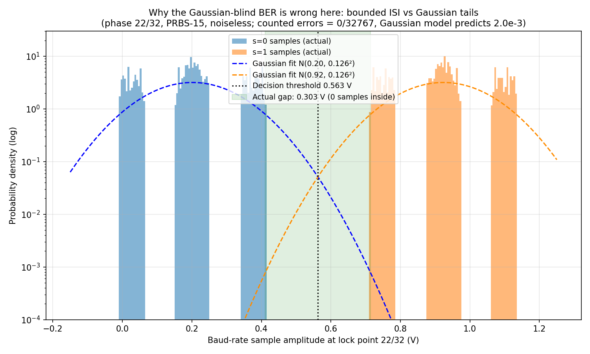

**Use this method only when the slicer residual is genuinely noise-dominated**
(e.g. post-equalization with a real noise source), which is how
`rx_analysis` uses it (cross-checked against counted BER).

### Exact ISI ⊕ AWGN bathtub (Appendix A.2) — the meaningful version

Additive Gaussian noise of RMS σ is introduced at the slicer analytically and
the BER is computed exactly by averaging the Gaussian tail over every
individual ISI-displaced sample (no Gaussian fit to the ISI), with the
decision threshold optimized per phase and noise level. Noise is expressed as
**SNR = 20·log₁₀(OMA/σ)**, with OMA = Σh the settled level separation
(1.144 V driver-only, 1.125 V cascade). The ideal ISI-free NRZ requirement at
BER 1e-12 is 20·log₁₀(2·7.03) = **23.0 dB**, so required-SNR minus 23.0 dB
reads directly as ISI penalty.

| Configuration | Best lock point | Required SNR @ 1e-12 | ISI penalty | Max noise RMS @ 1e-12 |
|---|---:|---:|---:|---:|
| DRV output only | 18/32 (0.562 UI) | 30.3 dB | **7.3 dB** | 35.0 mV |
| BiasT ⊗ Masood channel | 23/32 (0.719 UI) | 33.4 dB | **10.5 dB** | 23.9 mV |

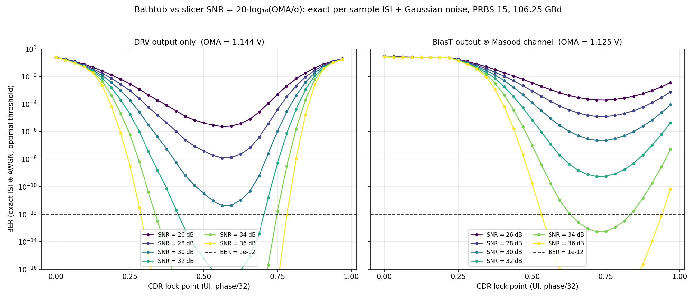

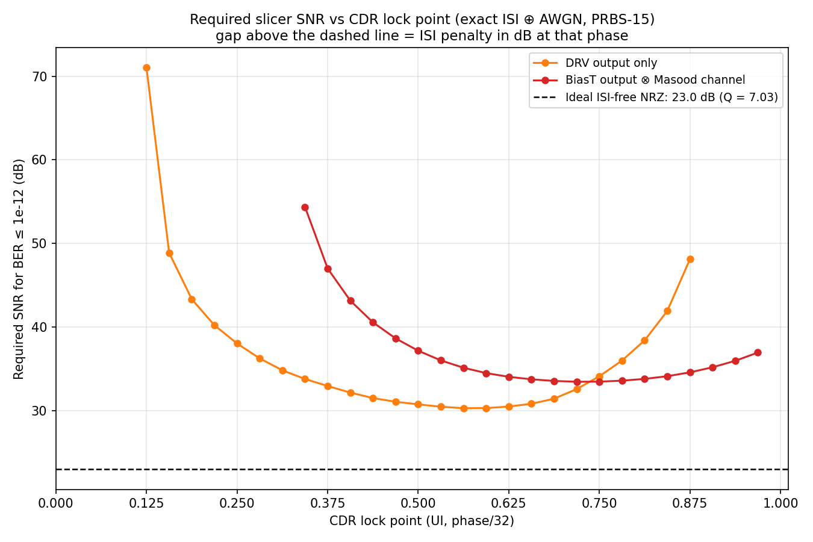

Observations:

- The unequalized eyes **do** close 1e-12, given enough SNR: 30 dB suffices
  for the driver alone; the cascade needs ~33.5 dB. The Masood channel costs
  ~3.2 dB of required SNR on top of the driver's own 7.3 dB ISI penalty.
- The optimum lock point sits **late** (0.56 UI driver-only, 0.72 UI cascade)
  because of the post-cursor-heavy impulse response; a CDR locking at 0.5 UI
  by default gives up ~8 mV of noise budget on the cascade.
- The required-SNR wall is steep: within ±0.35 UI of the optimum the cascade's
  requirement rises by >20 dB. Only ~4 of the 32 lock points hold the noise
  budget within ~10% of its peak.
- Read against the spec's driver SNDR floor (≥32.5 dB, §4-4): the driver
  alone fits with ~2 dB margin; the unequalized cascade does not — same
  conclusion as the TDEC result (TX FFE needed).

---

## Key takeaways

1. **Dataset quality:** differential and single-ended captures are internally consistent across AC and transient domains.
2. **Driver bandwidth:** DRV output has ~11 ps 10–90% edge rate on a ~1.15 V step; step-derived Nyquist loss is ~−10 dB, tighter than ideal for clean 106G NRZ without equalisation.
3. **BiasT impact:** AC coupling adds high-pass shaping and long-timescale droop. For baud-rate simulation, truncate the IR to an ISI-relevant window (~30 UI) rather than using the full 2.5 ns extraction span.
4. **End-to-end electrical channel:** Danyang BiasT output + Masood channel ≈ **−11.7 dB at Nyquist**, eye height ~0.13 V at unit NRZ swing — marginal but open; FFE/CDR would likely be required in a real receiver.
5. **MRM/optical path:** AC and transient data include MRM and optical nodes; this summary focused on the electrical TX chain through BiasT. Optical modulation characterisation is available in the AC Bode plots but not yet folded into the IR/eye pipeline.
6. **TDEC:** the effective channel measures **6.50 dB** against the spec's 3.4 dB optical limit (same BT4/BER methodology) — ~3.1 dB over, unequalized, before the MRM is even included.
7. **Timing/noise budget:** exact ISI ⊕ AWGN bathtubs show the unequalized cascade needs **≥33.4 dB slicer SNR** (≈24 mV RMS noise allowance on a 1.13 V OMA) to close BER 1e-12, at a late optimal lock point (0.72 UI), with a steep required-SNR wall away from it. The driver alone needs 30.3 dB (7.3 dB ISI penalty over an ideal eye).

---

## Assumptions and limitations

- Baud rate fixed at **106.25 GBd** for all UI-normalised analysis (matches the OCI-Gen2 / Masood channel work).
- Step-derived IR includes the finite input edge; not deconvolved.
- BiasT droop handled by IR truncation for eyes/convolution, not by explicit high-pass modelling.
- Masood channel cascade attaches at **BiasT output** (`drv_eic`), modelling the interconnect between the TX assembly and the MRM.
- AC Nyquist numbers for BiasT/MRM nodes use a 100 kHz reference and are not directly comparable to the step-derived loss figures.

---

## Appendix A: Bathtub methodology

Both bathtub methods share the same waveform construction and differ only in
how BER is derived from the baud-rate samples at each lock point.

### A.0 Common waveform construction (pattern-locked, periodic steady state)

1. **Kernel.** Driver impulse response from the step transient
   (`extract_ir_from_step`: rising-edge window → UI/32 linear resampling →
   d/dt), truncated to 30 UI past the main lobe with a raised-cosine tail
   taper (removes the microsecond-scale BiasT droop plateau, which otherwise
   integrates into spurious baseline wander — see the eye-diagram section),
   converted to discrete taps via `h = ir_continuous × DT`. For the cascade
   case, convolved with the Masood channel IR resampled onto the same UI/32
   grid.
2. **Stimulus.** Exactly **one full PRBS-15 period** (32 767 bits), mapped to
   NRZ levels {0, 1}, zero-order-hold upsampled ×32 (`np.repeat`, not a
   zero-stuffed comb).
3. **Circular convolution.** `y = IFFT(FFT(x_zoh) · FFT(h, N))` over the
   N = 32 767 × 32 sample period. Because the kernel (~1.4 k samples) is far
   shorter than the period, every output sample is in periodic steady state —
   no edge transients to trim, and the waveform remains exactly one pattern
   period long.
4. **Cursor alignment.** The output is rolled left by the kernel's cursor
   delay (driver IR peak index + channel IR peak index) so that sample
   `k·32 + p` corresponds to **bit k** at intra-UI phase `p/32`. Lock point
   `p` then maps to the baud-rate decimation `y[p::32]`, giving 32 767
   symbol-aligned samples per phase — one per PRBS-15 bit.
5. **Per-phase populations.** Samples are split by the known transmitted bit
   into `s0` (16 383 samples) and `s1` (16 384 samples). No slicing/decision
   feedback is involved; the pattern is known.

The 32 lock points correspond one-to-one to the MM CDR's phase-interpolator
codes (`n_phases = 32` per UI in `MuellerMullerCDR`).

### A.1 Gaussian-blind method (`bathtub_lockpoints.py`)

Reuses the repo's blind-BER recipe
(`optical_serdes.rx.rx_analysis._amplitude_stats` +
`optical_serdes.analysis.gaussian_tail.ber_nrz_awgn_asymmetric`), applied
per phase:

- μ₀, σ₀, μ₁, σ₁ = mean/std of `s0`, `s1`
- SNR(dB) = 20·log₁₀((μ₁−μ₀)/(σ₀+σ₁))
- Optimal-threshold Gaussian BER:
  **BER = ½·erfc((μ₁−μ₀) / (√2·(σ₀+σ₁)))**
  (threshold V_th = (μ₀σ₁+μ₁σ₀)/(σ₀+σ₁))

**Validity caveat:** this collapses each population to a Gaussian. On a
noiseless simulation the per-level spread is *bounded ISI* (hard-edged,
multi-modal, excess kurtosis ≈ −1, all mass within ~1.7σ), so the erfc tail
integrates probability mass that does not exist; an open eye (zero counted
errors) can report BER ~1e-3. Appropriate only when the slicer residual is
genuinely noise-dominated (post-EQ + real noise), where `rx_analysis`
cross-checks it against counted BER.

### A.2 Exact ISI ⊕ AWGN method (`bathtub_noise.py`)

Treats the noiseless waveform as the deterministic ISI part and adds slicer
AWGN of RMS σ **analytically** — no Gaussian approximation of the ISI, no
Monte-Carlo noise injection:

- For decision threshold `vth`, each sample errs with probability
  Q(margin/σ), margin = `v − vth` for bit 1 and `vth − v` for bit 0
  (Q(x) = ½·erfc(x/√2); samples on the wrong side of `vth` correctly
  contribute > ½).
- **BER(φ, σ) = min over vth of ½·[ mean(Q((vth−s0)/σ)) + mean(Q((s1−vth)/σ)) ]**,
  threshold optimized on a 61-point grid between the level means per
  (phase, σ). This is the exact error probability of an optimal fixed-threshold
  slicer for bounded deterministic ISI plus Gaussian noise, equal priors.
- **Noise margin:** the largest σ with BER ≤ 1e-12 is found by bisection
  (40 iterations, σ ∈ [0.1 mV, 200 mV]); phases whose eye is closed even at
  negligible noise return NaN.
- **SNR normalization:** SNR(dB) = 20·log₁₀(OMA/σ) with OMA = Σh (the settled
  0→1 level separation for 0/1 signaling), making configurations with
  different DC gains comparable. The ideal ISI-free NRZ reference is
  BER = Q(OMA/2σ) ⇒ required SNR = 20·log₁₀(2·Q_target) = **22.96 dB** at
  BER 1e-12 (Q_target = 7.034); required-SNR curves are plotted against this
  line so the vertical gap reads directly as ISI penalty in dB.

Assumptions/limits of A.2: AWGN at the slicer only (no jitter → the phase
axis is deterministic sampling phase, not a jitter-integrated bathtub); fixed
optimal threshold (no per-pattern adaptation); equal symbol priors; PRBS-15
exercises up to 15/14-bit runs of the bounded ISI, which is ample for the
~10-UI settled kernel memory here.
