# OCI-Gen2 100G/lane NRZ TX Driver — SBR & Channel Analysis Summary

**Data sources**

- Driver SBR: `100G Driver Sample output Pulse - Leq80p.csv` — 173 non-uniformly-sampled
  time/voltage points (native spacing 0.036–5.14 ps, mean 0.581 ps, far coarser and less
  regular than the analysis grid).
- Channel IR: `../../data/step_response/from_masood/impulse_response.csv` — 1800 uniformly
  sampled points at 0.05 ps native spacing (89.95 ps span), units 1/s (continuous-time impulse
  response, converted to a discrete tap via `h = ir_per_s * DT`).
- Baud rate = 106.25 Gbaud NRZ &nbsp;→&nbsp; UI = 9.4118 ps, SPS = 32 samples/UI, DT = UI/32 = 0.2941 ps.
  Every script resamples both the SBR and the channel IR onto this common UI/32 grid before
  any convolution/deconvolution.

## 1. Overview

This directory investigates the OCI-Gen2 100G/lane driver's measured single-bit response
(SBR) and a companion channel impulse response, in order to answer three practical questions:

1. **What does the driver's own SBR look like**, in time and frequency, once put on a
   uniform simulation grid — and how much ISI/eye closure does the driver introduce *on its
   own*, before any channel is involved?
2. **What is the driver's underlying Dirac impulse response** (as opposed to its single-bit,
   ZOH-smeared response), recovered via Wiener-Hopf deconvolution, and does it validate
   against the measured SBR?
3. **What does the combined driver+channel system look like** — cascaded frequency response,
   Nyquist-frequency loss budget, and resulting eye — and how sensitive is that answer to the
   *method* used to build it (Wiener deconvolution + ZOH drive vs. a deconvolution-free
   direct-convolution approach)?

The investigation proceeds in build-up order: SBR characterization → SBR-only eye →
Wiener-Hopf IR extraction (with a same-day sanity check on the SNDR) → channel+driver cascade
→ a deconvolution-free re-derivation of that cascade eye, compared head-to-head against the
Wiener-based one → rise/fall-time extraction of the SBR itself (cross-validated on raw,
non-resampled data). All numbers below were reproduced by re-running the corresponding script
in this directory.

## 2. SBR characterization (`analyse_sbr.py`)

The raw CSV (173 samples) is **not** uniformly sampled — native spacing ranges from 0.036 ps
to 5.14 ps (mean 0.581 ps, std 0.759 ps), i.e. far coarser near the pulse tails than near the
transition. It is linearly interpolated onto a uniform UI/32 = 0.2941 ps grid, producing 341
samples spanning 100.00 ps. `sbr_raw_vs_interpolated.png` confirms the interpolation tracks
the raw points essentially exactly (top panel) and visualizes the native non-uniform spacing,
which grows from ~0.2–0.4 ps near the pulse to >3 ps in the flat tails (bottom panel).

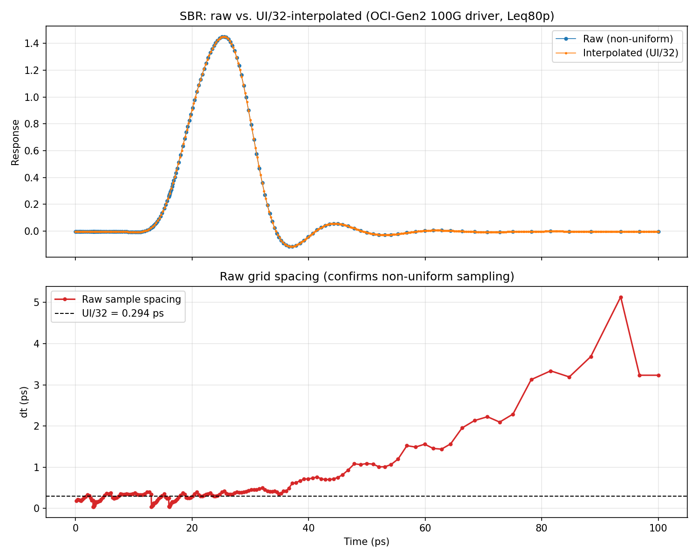

**Basic shape:** pre-pulse baseline = −0.00313 (essentially zero); peak = 1.4501 at
t ≈ 25.6 ps (a positive-going pulse, amplitude 1.4532); the pulse undershoots to roughly
−0.13 after the main lobe, followed by a small damped-ringing rebound (~+0.05) around
40–50 ps, settling close to zero by ~70–80 ps.

**Frequency-domain content:** this script derives an approximate "frequency response" by
numerically differentiating the interpolated SBR (`d(SBR)/dt`) and taking its FFT —
`sbr_frequency_response.png`. This is a *first-pass, naive* view (see §4 for why a plain
derivative is not the mathematically correct way to recover the driver's true transfer
function): it shows a broad flat plateau around +27 to +29 dB from ~5–50 GHz, rolling off past
the baud Nyquist (53.13 GHz) down to a local minimum of ~+9 dB near 85–90 GHz, then staying
roughly flat at +9 to +10 dB out to 105 GHz. Group delay is flat at ~24–25 ps below Nyquist,
with a bump peaking near ~41 ps around 82 GHz before falling back to ~24 ps by 105 GHz.

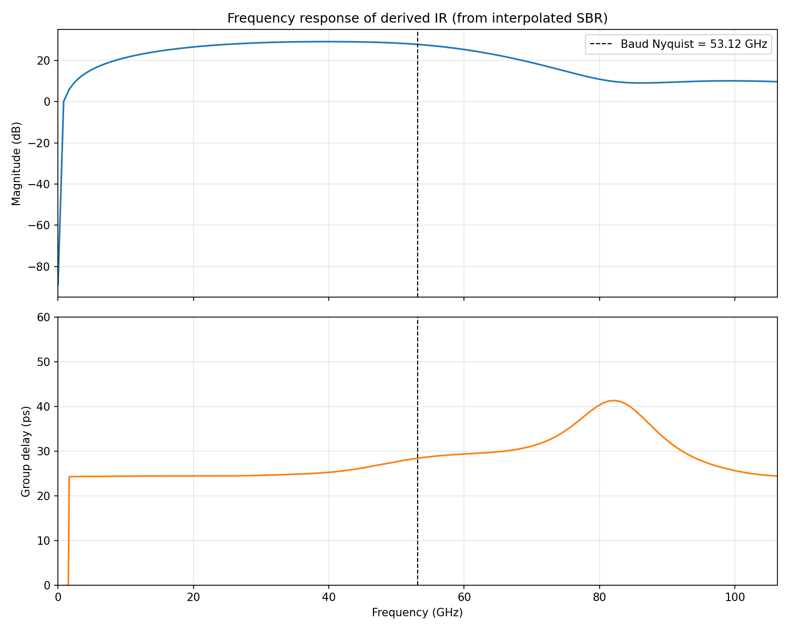

This plot is superseded by the rigorous Wiener-Hopf-based frequency response in §4, which
correctly undoes the SBR's own ZOH (32-sample boxcar) smearing; the two disagree substantially
above ~50 GHz, which is expected since a plain derivative does not invert that boxcar.

## 3. Eye diagram from the SBR alone (`eye_diagram_from_sbr.py`)

**Method:** generate one PRBS-7 period (127 bits), map to NRZ symbol levels {0, 1}, zero-stuff
(impulse-comb) upsample by SPS = 32, convolve with the baseline-subtracted (AC) SBR and add the
baseline back — this reproduces exactly the driver's analog output waveform for that bit
sequence with no deconvolution or modelling approximation. The SBR's own startup/tail
transient is trimmed from both ends, and the result is folded into a 2-UI eye.

**Result** (re-run to confirm, printed to stdout only):

| Metric | Value |
|---|---|
| Eye height | 0.8132 V |
| Eye width | 0.125 UI |
| Eye margin @ 1e-4 | 0.000 UI |

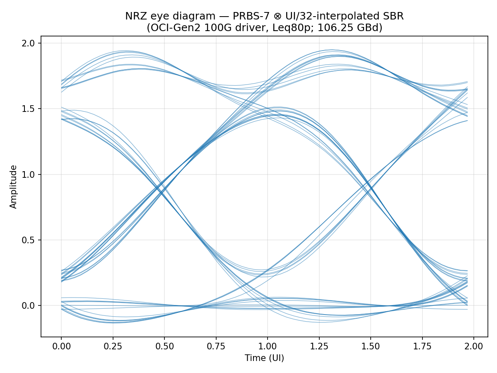

Despite a reasonable eye *height*, the eye *width/margin* are almost completely closed even
with no channel present. This is the first quantitative sign (developed further in §7) that
the driver's own edge speed is slow enough, relative to a 106.25 GBd UI, to be a first-order
ISI contributor by itself.

## 4. Impulse response extraction via Wiener-Hopf deconvolution (`extract_ir_wiener.py`)

**Method:** build `y` = the same zero-stuffed-comb-convolved-with-SBR waveform as §3 (extended
to 4096 PRBS-7 bits, 32.3 periods, for a longer fit), and `x` = a rectangular ZOH ("hold for
32 samples") of the same symbol sequence. Because SBR = h_dirac ⊛ rect₃₂ by definition,
`y = h_dirac ⊛ x` exactly, so solving `y = h ⊛ x` via regularized Wiener-Hopf deconvolution
(`N_PRE=3, N_POST=20, REG=1e-4`) recovers the driver's Dirac impulse response h_dirac.

**Fit quality:** Wiener fit SNDR = **29.98 dB** over 3672 UI (circular reconstruction on the
periodic PRBS-7 fit domain — see §6 for why this number is optimistic).

**Validation** (the mathematically correct check, since a plain derivative is *not* equivalent
to deconvolving the ZOH boxcar): re-convolving the recovered h with a 32-sample ones-kernel
must reproduce the original SBR. It does, with **correlation = 0.9986** and **max error =
4.64% of the SBR peak**:

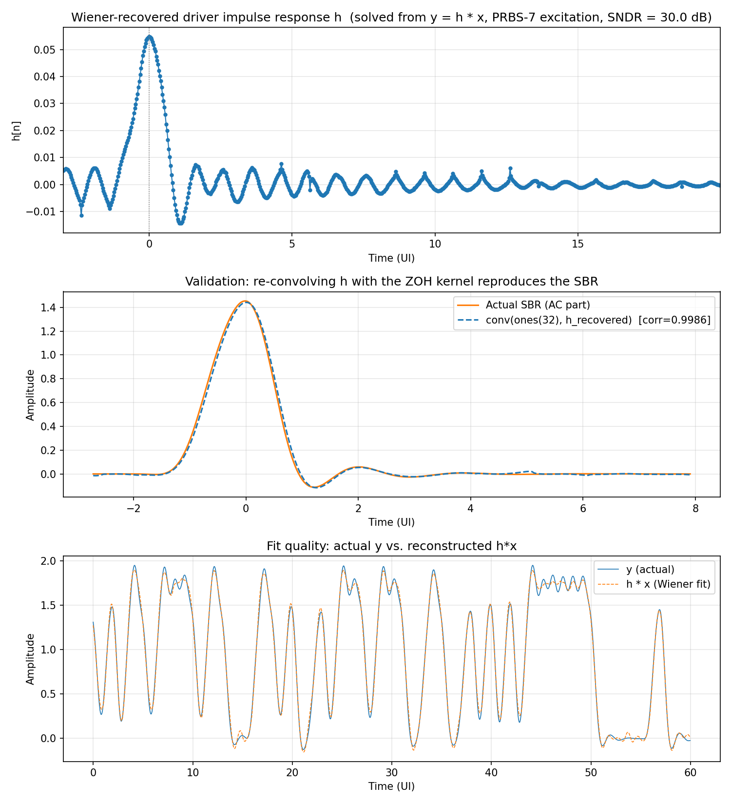

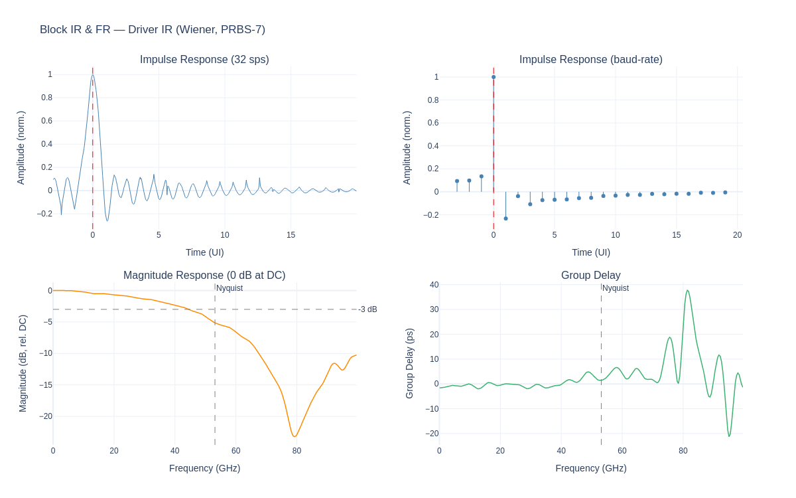

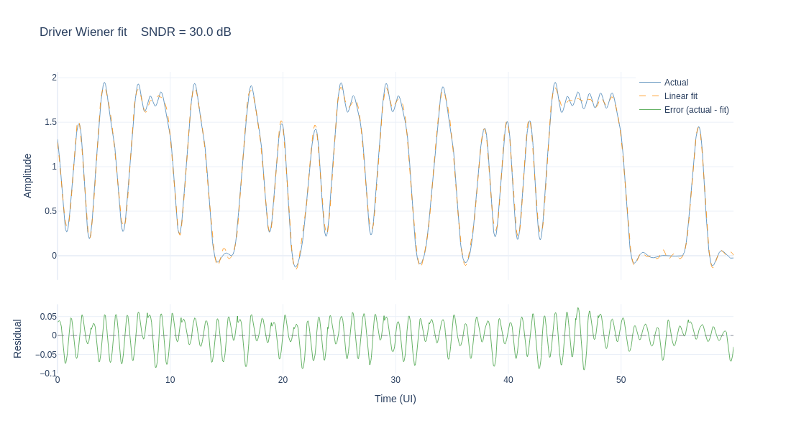

**True (full-rate) frequency response** — `extract_ir_wiener_freqresponse.png`, left column,
computed via a direct FFT of the full 32-sps recovered IR (valid up to the ZOH nulls, not just
to Nyquist):

| Landmark | Value |
|---|---|
| DC / low-frequency | ~0 dB (flat) |
| −3 dB point | ≈ 45 GHz |
| Baud Nyquist (53.13 GHz) | ≈ −5 dB |
| Deep notch | ≈ −22 to −23 dB near 80 GHz |
| Recovery shelf | ≈ −8 to −12 dB across ~90–115 GHz (local peak ≈ −7.5 dB near 105 GHz) |

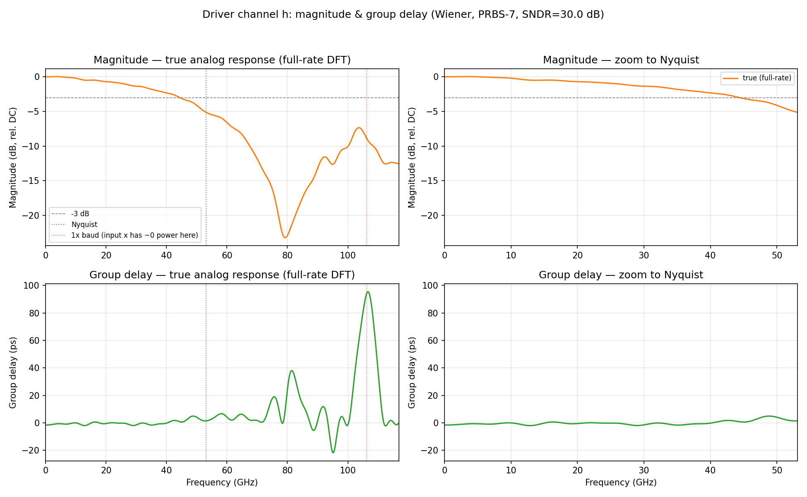

**Baud-rate-aliased view — an important nuance.** `freq_response()` (the shared helper used
throughout this directory) has two modes: if asked to display only up to Nyquist, it computes
the FFT of the **baud-rate-decimated** IR (`h_win[::32]`, one sample per UI) rather than the
full-rate IR. Re-running that decimated-DFT branch on this same recovered h (confirmed
directly, matching the method in `channel_estimation.freq_response`) shows the magnitude
**peaking up to +9.8 dB** (≈ +9.0–9.4 dB across most of 10–50 GHz) instead of rolling off to
−3 dB by 45 GHz as the true response does. This is because the driver's genuine out-of-band
content — the −22 dB notch near 80 GHz and the −8 to −12 dB shelf out to 115 GHz — lies beyond
the baud-rate Nyquist window and **aliases (folds back)** into the [0, Nyquist] band when the
impulse response is decimated to one sample/UI, and it folds back constructively rather than
destructively here. The two views are not in conflict: they answer different questions (the
driver's actual continuous-time/analog transfer function vs. what a baud-rate-sampled receiver
"sees" after the SBR's harmonics alias down), but conflating them would lead to the wrong
conclusion (a driver that *boosts* high frequencies rather than one that rolls off with a real
notch).

## 5. Channel + driver cascade — Wiener-deconvolution method (`channel_plus_driver.py`)

**Method:** re-derive `h_driver` exactly as in §4 (Wiener-Hopf on the SBR, same parameters).
Load the channel IR, resample onto the same UI/32 grid, and convert to a discrete tap via
`h_channel = ir_per_s * DT`. Form `h_combined = conv(h_driver, h_channel)`. Drive with a ZOH
of one full PRBS-15 period (32767 bits — chosen because `h_combined`'s post-cursor ringing
extends ~20 UI, well beyond what PRBS-7's 7-bit max run length can exercise) for both the
combined-system eye and a channel-only eye (ideal, infinitely-fast ZOH straight into
`h_channel`, isolating the channel's own ISI from the driver's).

| Quantity | Value |
|---|---|
| Driver h | 736 taps, cursor at index 96, Wiener fit SNDR = 30.0 dB |
| Channel IR (native) | 1800 samples, dt = 0.0500 ps (uniform), span = 89.95 ps |
| Channel h (resampled) | 306 taps on UI/32 grid, DC gain Σh_channel = 0.9952 |

**Nyquist-frequency (53.125 GHz) loss breakdown:**

| Block | Loss @ Nyquist |
|---|---|
| Driver | −5.14 dB |
| Channel | −4.77 dB |
| Sum (dB add in cascade) | −9.91 dB |
| Direct FFT of h_combined (cross-check) | −9.91 dB |

The direct-FFT cross-check confirms the expected cascade arithmetic exactly (dB losses of two
LTI blocks in series add).

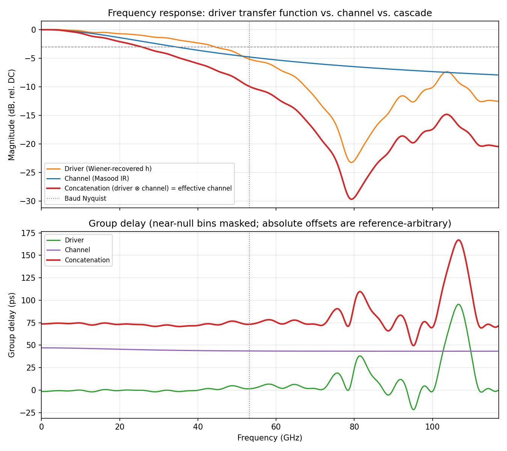

The channel (blue) is a smooth, resonance-free rolloff typical of a simple lossy
interconnect. The driver (orange) reproduces the −3 dB≈45 GHz / −22 dB notch≈80 GHz shape from
§4. The cascade (red) tracks the channel's smooth low-frequency rolloff but inherits the
driver's deep notch at higher frequency, bottoming out around −30 dB near 80 GHz before a
partial recovery to roughly −15 to −20 dB by 100–115 GHz. Group delay of the cascade is flat
around 70–75 ps below Nyquist, with a large excursion (peaking ≈165 ps near 105–110 GHz)
inherited from the driver's own high-frequency ringing.

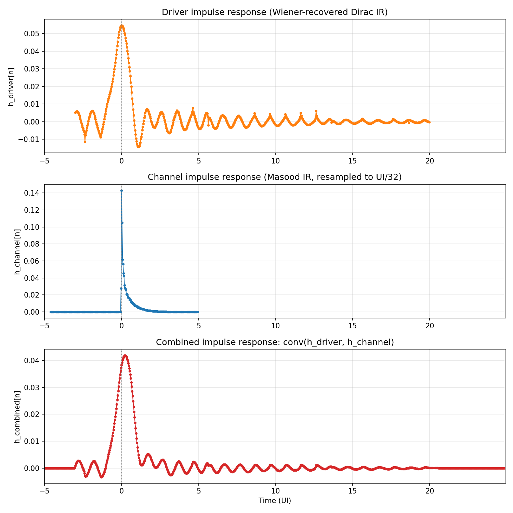

The channel's own impulse response is a fast, single-sided, near-monotonic decay (peak ≈0.143,
essentially settled within ~2–3 UI) — i.e., minimal channel-side ringing. The combined impulse
response (peak ≈0.042) visibly inherits the driver's ~20-UI-long decaying oscillation riding on
top of the channel's smoother envelope.

**Eyes:**

| Eye | Height (V) | Width (UI) | Margin @ 1e-4 (UI) |
|---|---|---|---|
| Channel + driver (`channel_plus_driver_eye.png`) | 0.3339 | 0.375 | 1.000 |
| Channel only, ideal ZOH (`channel_only_eye.png`) | 0.4187 | 0.594 | 1.000 |

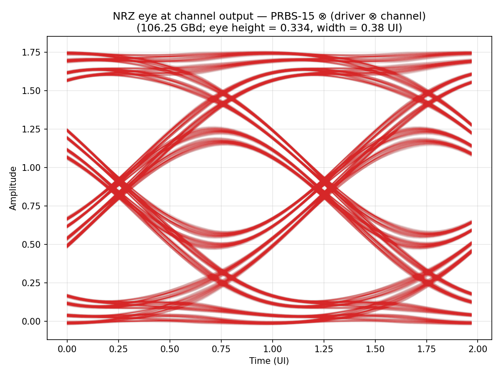
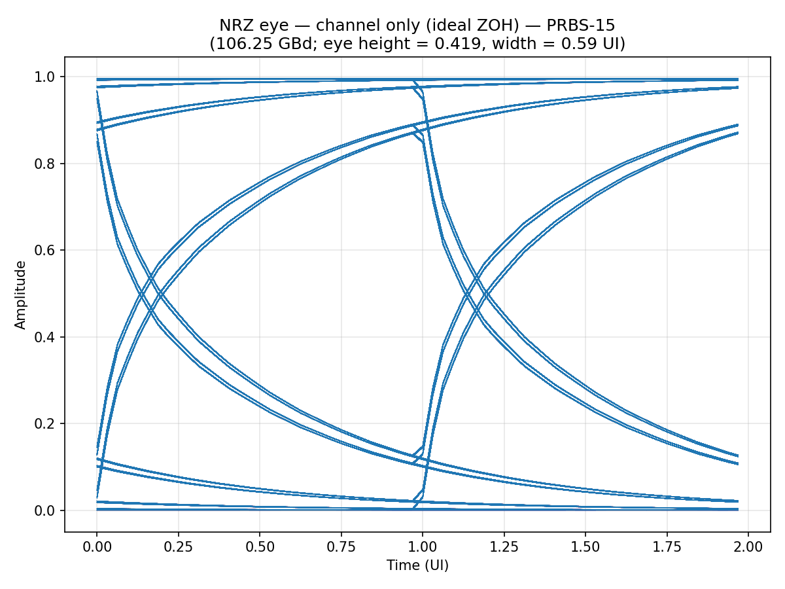

Adding the driver on top of the channel closes the eye from 0.594 UI → 0.375 UI (width) and
from 0.419 V → 0.334 V (height) relative to an idealized infinitely-fast transmitter — a
direct, quantitative demonstration that the driver contributes materially to end-to-end ISI on
top of the channel's own loss.

## 6. Deconvolution-free alternative (`sbr_comb_then_channel_eye.py`) and head-to-head comparison

**Method (NEW, "comb-then-channel"):** load and resample both the SBR and channel IR exactly as
in §3/§5. Generate **one** full PRBS-15 period and share that *identical* bit sequence with a
recomputed "OLD" (Wiener) method for a fair, apples-to-apples comparison. For the NEW method:
zero-stuff/comb the symbols, convolve directly with the measured SBR's AC part (+ baseline) to
get the driver's actual analog output — no deconvolution, no `h_driver` approximation — then
convolve that output with `h_channel`. The two methods are mathematically identical in the
noiseless limit, since `comb ⊛ SBR_ac == ZOH(symbols) ⊛ h_driver_dirac` (SBR = h_driver_dirac
⊛ rect₃₂) and convolution is associative, so it makes no difference whether the channel is
applied after the SBR-built waveform (NEW) or folded into a single `h_combined` before a ZOH
drive (OLD, §5's method, recomputed here with the same PRBS-15 sequence).

**Key finding — the two eyes do not agree:**

| Method | Eye height (V) | Eye width (UI) | Margin @ 1e-4 (UI) |
|---|---|---|---|
| NEW: comb ⊛ SBR_ac, then ⊛ h_channel | **0.3867** | 0.375 | 1.000 |
| OLD: Wiener h_driver ⊛ h_channel, ZOH drive | 0.3339 | 0.375 | 1.000 |
| Difference (NEW − OLD) | +0.0527 (**+15.79%**) | +0.0000 (+0.00%) | +0.0000 (+0.00%) |

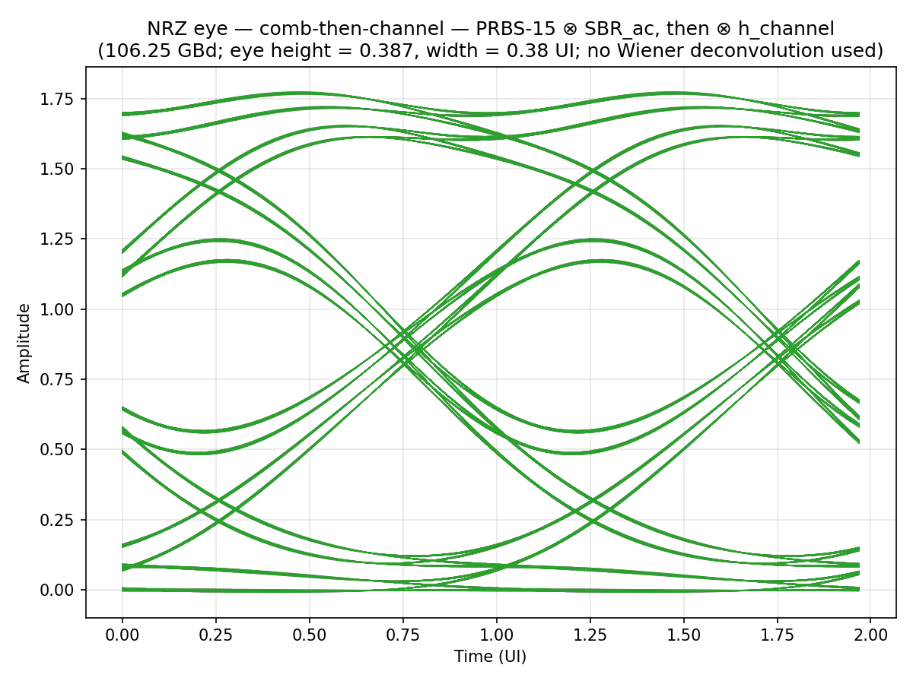
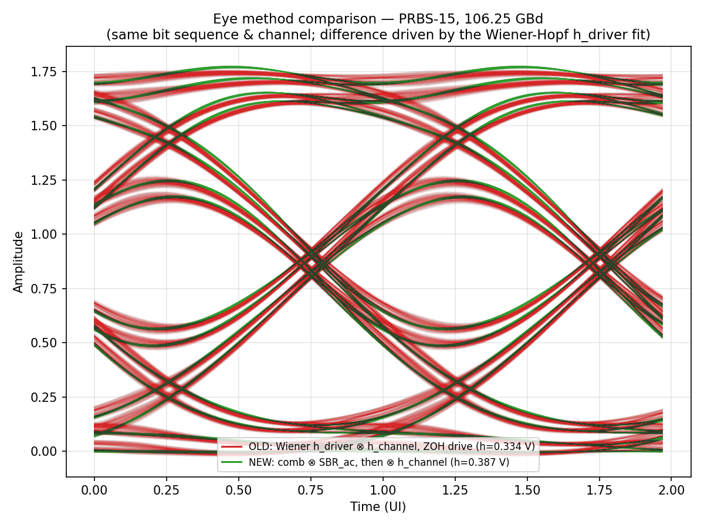

Eye width and margin are identical between the two methods, but eye height differs by nearly
16% — a sizeable discrepancy given both methods are meant to represent the same physical
system.

**Root cause.** The OLD method's headline Wiener fit SNDR (~30.0 dB, §4 and §5) is measured by
`compute_sndr()` via a **circular** reconstruction over the periodic, 127-bit-repeat PRBS-7 fit
domain — this only truly constrains `h_driver` at the discrete harmonics of that periodic
input's spectrum, leaving it comparatively under-determined in between, and is therefore
optimistic. Evaluated instead via a genuine **linear** convolution reconstruction (the actual
operation used to build every eye in this directory) on that same PRBS-7 fit domain, the same
`h_driver` only achieves **SNDR ≈ 3.7 dB** — a >26 dB gap from the headline number. That much
lower true fidelity propagates into the PRBS-15 eye: a full-waveform cross-correlation-aligned
comparison of the two methods' output waveforms finds a maximum sample-wise difference of
1.79 (536% of the OLD eye height) and an RMS difference implying only ≈2.0 dB of waveform-level
SNDR between the two reconstructions — consistent with, and explaining, the 15.8% eye-height
gap.

**Conclusion:** the `channel_plus_driver.py` Wiener-based combined-channel eye should be
treated as **optimistic** (it *understates* ISI / overstates eye height), because it relies on
a `h_driver` estimate whose true (linear-convolution) fidelity is much lower than its headline
circular-reconstruction SNDR suggests. The comb-then-channel method is more trustworthy: it
uses the measured SBR directly, with no deconvolution approximation and therefore no such
generalization gap.

## 7. Rise/fall time analysis (`sbr_rise_fall_time.py`, `sbr_rise_fall_time_raw.py`)

**Method:** establish the pre-pulse baseline (mean of the first 8 samples) and the pulse peak
(polarity auto-detected via `argmax|y − baseline|`); define 10/20/80/90% threshold levels
relative to (baseline, peak); find sub-sample threshold-crossing times via linear interpolation
between bracketing samples, restricted to the correct rising segment (search window:
start→peak, take the crossing closest to the peak) or falling segment (peak→end, take the
crossing closest to the peak) so that pre-pulse noise or post-pulse ringing cannot be mistaken
for the primary transition.

**Results** (UI/32-interpolated grid):

| Metric | Value (ps) | Value (UI) |
|---|---|---|
| Rise (20–80%) | 5.44 | 0.578 |
| Fall (80–20%) | 3.94 | 0.418 |
| Rise (10–90%) | 7.96 | 0.845 |
| Fall (90–10%) | 5.66 | 0.602 |
| Asymmetry (20–80% basis) | +1.51 (rise slower) | +32.2% of mean |

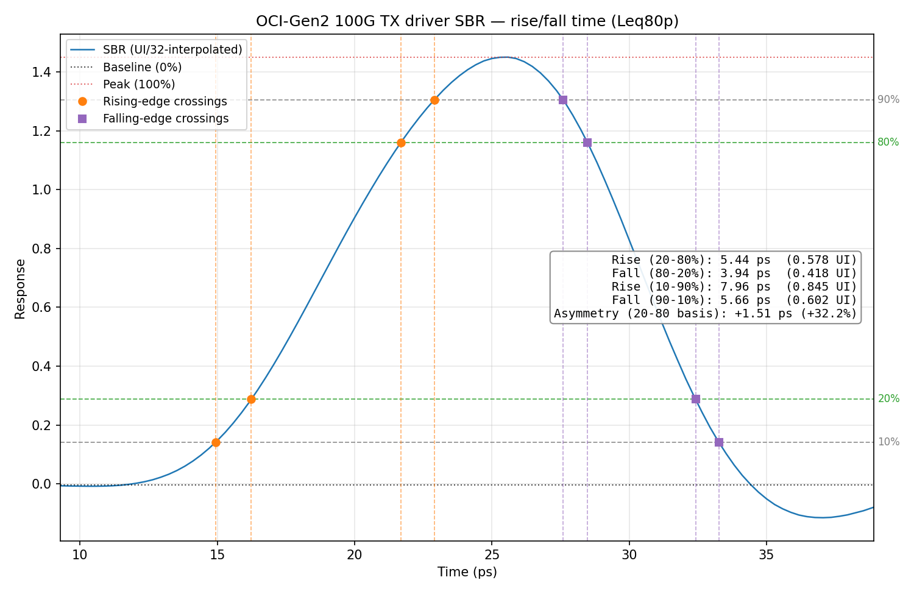

The driver's rising edge is ~32% slower than its falling edge — a signature consistent with a
pull-up/pull-down slew-rate mismatch in the driver's output stage.

**Cross-validation on raw (non-resampled) data** (`sbr_rise_fall_time_raw.py` applies the
identical methodology directly to the 173 native, non-uniformly-sampled CSV points):

| Metric | Raw (ps) | UI/32 (ps) | Diff (ps) | Diff (UI) |
|---|---|---|---|---|
| Rise 20–80% | 5.446 | 5.444 | 0.002 | 0.0002 |
| Fall 80–20% | 3.932 | 3.936 | −0.004 | −0.0004 |
| Rise 10–90% | 7.958 | 7.957 | 0.002 | 0.0002 |
| Fall 90–10% | 5.667 | 5.663 | 0.004 | 0.0004 |

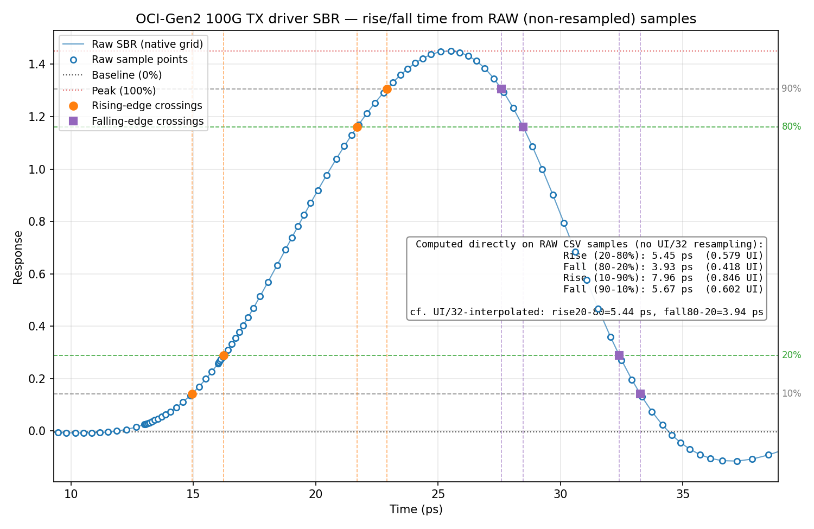

Agreement is within ≤0.004 ps (≤0.05%) on every metric, confirming the UI/32 linear
interpolation used everywhere else in this directory introduces no measurable artifact into
the rise/fall-time (or, by extension, any other time-domain) results.

**Practical implication:** at the standard 20–80% threshold, the driver's own edges already
span 0.42–0.58 UI out of a full 1-UI symbol period at 106.25 GBd. This makes the driver's
transition speed a **first-order, non-negligible ISI contributor in its own right**,
independent of any channel loss — consistent with the near-zero-margin SBR-only eye found in
§3 using nothing but a PRBS-7 pattern and the measured SBR.

## 8. Overall conclusions / key takeaways

- **The driver has two real, physically-grounded impairments**, both confirmed by independent
  methods in this analysis: a genuine ~80 GHz notch (≈−22 to −23 dB, validated via
  Wiener-Hopf deconvolution + a forward-convolution check against the measured SBR,
  corr = 0.9986), and a ~32% rise/fall edge-speed asymmetry (5.44 ps/0.578 UI rise vs.
  3.94 ps/0.418 UI fall), independently cross-checked on raw, non-resampled samples to
  ≤0.05% agreement. Neither is a resampling or fitting artifact.
- **The driver's own edge speed is a first-order ISI contributor at 106.25 GBd**, on par with
  channel loss: an SBR-only eye (no channel) with just a PRBS-7 pattern already reaches
  ~0 UI margin at 1e-4 (§3), and adding the driver on top of the channel closes the eye from
  0.594 UI/0.419 V (channel-only) to 0.375 UI/0.334 V (channel+driver, Wiener method) (§5).
- **The Wiener-deconvolution-based combined-channel eye (`channel_plus_driver.py`) is likely
  optimistic.** Its headline ~30 dB fit SNDR is a circular-reconstruction artifact of the
  periodic PRBS-7 fit domain; the same `h_driver`, evaluated the way it is actually used
  (linear convolution), only achieves ≈3.7 dB SNDR, and produces an eye height 15.8% lower than
  the deconvolution-free comb-then-channel method built from the identical bit sequence and
  channel (§6).
- **The comb-then-channel method (`sbr_comb_then_channel_eye.py`) should be preferred** as the
  reference end-to-end eye/ISI estimate going forward: it convolves the measured SBR directly
  with the channel, with no deconvolution step and therefore no generalization gap.
- **The naive derivative-based frequency response in `analyse_sbr.py`** disagrees
  substantially with the rigorous Wiener-Hopf-based one above ~50 GHz and should be considered
  superseded/deprecated in favor of the `extract_ir_wiener.py` result.
- **Beware baud-rate-decimated frequency-response views of this driver**: because of its
  genuine out-of-band notch/shelf structure past Nyquist, decimating its impulse response to
  one sample/UI and taking the FFT aliases that content back in-band and makes the driver
  falsely appear to *peak* (+~10 dB) rather than roll off — always inspect the full-rate
  response for actively-peaking blocks like this one.
- **Open follow-ups:**
  - Should `channel_plus_driver.py` be rewritten to use the deconvolution-free
    (comb-then-channel) approach directly, retiring the Wiener-Hopf `h_driver` step for eye/ISI
    purposes?
  - Would extending the Wiener fit's `N_POST` (currently 20 UI) and/or using a longer/less
    periodic fit pattern (e.g., PRBS-15 instead of a repeated 4096-bit PRBS-7) close the
    ~26 dB gap between circular and linear-convolution SNDR, making the Wiener route usable
    where an explicit `h_driver` is still needed (e.g., for equalizer co-design)?
  - The driver's Dirac IR is still useful in its own right (e.g., for tap-domain analysis); it
    should just not be trusted for eye/ISI predictions without the linear-SNDR caveat above.
