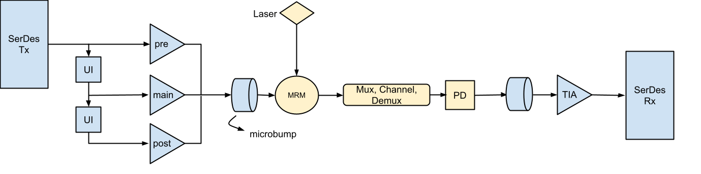
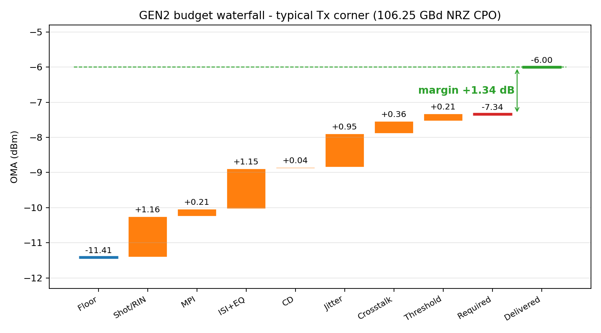
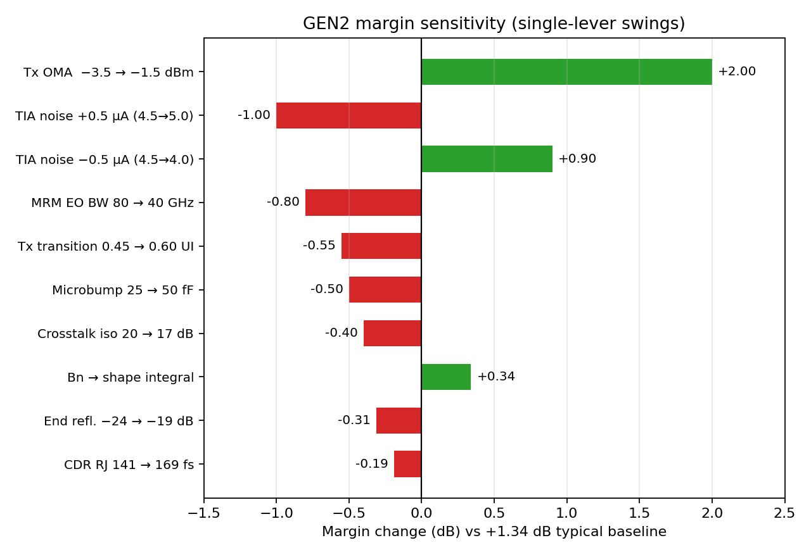

# OCI Link Budget — Results Summary

GEN1 (53.125 GBd NRZ, OCI MSA v1.0) and GEN2 (106.25 GBd NRZ CPO) per-channel OMA-domain
budgets at BER $10^{-12}$ ($Q = 7.035$). Results only — methodology, derivations, and
provenance in `OCI_Link_Budget_Report.md` and `Methodology_Provenance.md`. All numbers
reproduce from scripts `01`–`07`.

---

## 1. Targets

| BER | $Q$ | Role |
|---|---|---|
| $2.4\times10^{-4}$ | 3.49 | OCI MSA compliance threshold |
| $10^{-12}$ | **7.035** | Internal design target (KP4 FEC = pure margin) |

---

## 2. GEN1 — 53.125 GBd NRZ

**Floor −12.93 dBm OMA** (measured TIA: $i_n$ = 3.17 µA rms, 29.3 GHz, $R$ = 0.876 A/W).

| Penalty | dB |
|---|---:|
| ER / shot | 0.18 |
| RIN (−138 dB/Hz) | 0.68 |
| MPI (−24 dB ends) | 0.24 |
| ISI residual (post-DFE) | 0.64 |
| CD | 0.01 |
| Jitter (TJ 0.241 UI) | 0.61 |
| Crosstalk | 0.36 |
| Threshold offset | 0.21 |
| Dark current | 0.00 |
| **Stack total** | **2.93** |

Required OMA at Rx = −12.93 + 2.93 = **−10.00 dBm**.

| Closure scenario | Tx OMA | −IL | −TDEC | At Rx | Margin |
|---|---:|---:|---:|---:|---:|
| Spec-min Tx (TDEC 1.4 or 3.4 dB) | −5.5 / −3.5 | 2.5 | 1.4 / 3.4 | −9.40 | **+0.60 dB** |
| Realistic Tx | −3.2 | 2.5 | 2.0 | −7.70 | **+2.30 dB** |

**MPI finding:** at the spec's −19 dB end reflectance the MPI penalty is 0.51 dB —
2.5× the MSA's 0.2 dB allocation. **≤ −24 dB ends required** (enforced both
generations; GEN1 books 0.24 dB, GEN2 0.205 dB).

---

## 3. GEN2 — 106.25 GBd NRZ CPO

| Rate scaling | GEN1 → GEN2 |
|---|---|
| UI | 18.82 → 9.412 ps |
| Nyquist | 26.56 → 53.125 GHz |
| Noise bandwidth ($1.5\times f_{3\mathrm{dB}}$) | 43.9 → 87 GHz |
| TJ at $10^{-12}$ | 4.5 → 3.30 ps |

**Target-class TIA floor −11.41 dBm** (58 GHz Butterworth-2, $i_n$ = 4.5 µA rms).

| Penalty | GEN1-CPO @ 53 GBd | GEN2 @ 106 GBd |
|---|---:|---:|
| ER/shot + RIN | 0.86 | 1.16 |
| MPI | 0.21 | 0.21 |
| ISI + EQ net | 1.86 | 1.15 |
| CD | 0.01 | 0.04 |
| Jitter | 0.73 | 0.95 |
| Crosstalk | 0.36 | 0.36 |
| Threshold | 0.21 | 0.21 |
| **Stack total** | **4.23** | **4.07** |

| Closure at Tx OMA −3.5 dBm (Rx −6.0 dBm) | Floor | Stack | Required | Margin |
|---|---:|---:|---:|---:|
| Fast Tx (0.35 UI) | −11.41 | 3.74 | −7.67 | **+1.67 dB** |
| Typical Tx (0.45 UI) | −11.41 | 4.07 | −7.34 | **+1.34 dB** |
| Max Tx (0.60 UI) | −11.41 | 4.62 | −6.79 | **+0.79 dB** |

**Bottom line: feasible, but specification-sensitive** — closes at every modeled
corner; the doubled rate moves the problem into the receiver (§4 below).

---

## 4. Derived GEN2 TIA requirements

| Parameter | Requirement |
|---|---|
| Bandwidth $f_{3\mathrm{dB}}$ (diff.) | **50–64 GHz window** (53–58 GHz target) |
| Input-referred noise | **≤ 4.0 µA rms** over $B_n = 1.5\times f_{3\mathrm{dB}}$ (6.5 µA absolute fail) |
| Noise density mask | ≤ 14 pA/√Hz band avg; ≤ 16 pA/√Hz spot (1–53 GHz); measure to ≥ 90 GHz |
| Magnitude peaking | **≤ 1.0 dB** (DC–53 GHz), monotonic rolloff |
| Group-delay ripple | **≤ 3 ps p-p** (2–40 GHz) |
| Transimpedance gain | **≥ 57 dBΩ** differential at max gain |
| Overload / dynamic range | 160–700 µApp; AGC ≥ 14 dB range, ≤ 1 dB steps |
| DC cancellation | ≥ 750 µA |
| LF cutoff | ≤ 1 MHz (0.05 dB BLW at 72-bit CID) |

---

## 5. Device trade study (margins at Tx OMA −3.5 dBm)

| Tx case | A @ 3 µA/50 G | A @ 4 µA/50 G | B @ 4 µA/60 G | B @ 5 µA/60 G |
|---|---:|---:|---:|---:|
| FIR3, typ driver (0.45 UI) | +2.81 | +1.63 | +1.98 | +1.06 |
| FIR3, slow driver (0.60 UI) | +2.22 | +1.04 | +1.40 | +0.48 |
| no-FIR, drv 60 G + MRM 80 GHz | +2.80 | +1.62 | +1.83 | +0.92 |
| no-FIR, drv 60 G + MRM 60 GHz | +2.50 | +1.32 | **+1.63** | +0.72 |
| no-FIR, drv 60 G + MRM 50 GHz | +2.25 | +1.07 | +1.42 | +0.50 |
| no-FIR, drv 60 G + MRM 40 GHz | +1.95 | +0.77 | +1.07 | **+0.16** |

**Preferred baseline: no-FIR 60 GHz driver + TIA B** (single post-cursor tap retained
as an option pending measured MRM EO response). The FIR buys 0 dB of ISI on this
channel and costs 0.27 dB of slice-DCD jitter.

---

## 6. Margin sensitivity

PD capacitance (30–40 fF assumed, unmeasured) is not a margin lever but a
**buildability gate**: 60 fF strands the 4.0 µA TIA noise line.

---

## 7. Status and confidence

| Item | Status | Confidence |
|---|---|---|
| GEN1 design-point TIA ($i_n$ 3.17 µA, 29.3 GHz), $R$ = 0.876 A/W | Measured | High |
| $f^2$-dominated noise scaling law | Measured + fit | High |
| GD-ripple failure mode (12.5 ps → $h_{-1}$ ≈ 0.48) | Measured | High |
| TIA noise ceiling ≤ 4.0 µA | Derived | Medium |
| TIA bandwidth window 50–64 GHz | Derived | Medium |
| GD ripple ≤ 3 ps / peaking ≤ 1 dB | Derived | Medium |
| Microbump ≤ 25 fF (at assumed $R_{\mathrm{eff}}$ = 50 Ω) | Derived | Medium |
| $B_n = 1.5\times f_{3\mathrm{dB}}$ | Convention | Medium |
| End reflectance ≤ −24 dB | Required | Medium |
| PD capacitance 30–40 fF | Assumed | **Low** |
| MRM EO bandwidth 40–80 GHz | Assumed | **Low** |
| MRM peaking-free response | Assumed | **Low** |
| RJ 141 fs rms | Assumed | **Low** |
| +1.34 dB typical margin | Model result | Medium |

---

## 8. Key derived requirements

| Requirement | Value |
|---|---|
| GEN2 TIA class | §4 table above |
| Noise integration bandwidth | $B_n = 1.5\times f_{3\mathrm{dB}}$, both generations |
| End reflectance | ≤ −24 dB both ends, both generations |
| Tx 20–80 % transition | ≤ 5.6 ps (0.60 UI) hard / 4.2 ps (0.45 UI) target |
| Microbump | ≤ 25 fF, ≤ 30 pH |
| Jitter | RJ ≤ 141 fs rms, DJ ≤ 1.32 ps (TJ 3.30 ps) |
| TDEC | ≤ 1.8 dB |

---

## 9. Kill-or-confirm experiments

1. PD capacitance + MRM EO response (magnitude + phase) at 106 GBd bandwidths.
2. Candidate-TIA magnitude, phase, and noise spectrum to ≥ 90 GHz.
3. Clock/CDR RJ characterization vs the 141 fs target (169 fs fallback: −0.19 dB).
4. Full measured-chain pulse-response closure (driver → bump → MRM → fiber → PD → bump → TIA).
