# Caribou OCI-Gen2 NRZ 106.25 Gbps — Python Receiver Characterisation

**Date:** 2026-06-06  
**Signal:** NRZ · 106.25 Gbps · 32 samples per symbol  
**Channel:** Caribou OCI-Gen2 post-layout waveform captures  
**Waveforms:** 6 variants (OMA 100 / 150 / 200 µW × VGA setting 0 / 2)

---

## 1. Receiver Architecture

The simulation implements a baud-rate digital receiver following the chain:

```
Analog waveform (32 SPS)
        │
        ▼
  ┌───────────┐
  │   CTLE    │  1-zero 2-pole continuous-time linear equaliser
  └─────┬─────┘
        │  32 SPS
        ▼
  ┌───────────┐
  │ Ideal ADC │  sample at CDR-controlled phase, normalise to [-1, +1]
  └─────┬─────┘
        │  1 sample/UI (baud rate)
        ▼
  ┌─────────────────┐
  │ Mueller-Müller  │  baud-rate TED + phase interpolator (PI)
  │      CDR        │  32 phases per UI
  └─────┬───────────┘
        │  baud-rate samples at settled phase
        ▼
  ┌───────────┐
  │  Rx FFE   │  LMS-adapted FIR, (n_pre + 1 + n_post) taps
  └─────┬─────┘
        │
        ▼
  ┌───────────┐
  │  Slicer   │  NRZ threshold at 0 (normalised)
  └─────┬─────┘
        │
        ▼
    Recovered bits
```

### 1.1 CTLE — `Ctle1z2p`

The 1-zero 2-pole (1z2p) peaking equaliser boosts high-frequency content to
partially compensate for the roll-off of the optical link before the baud-rate
sampler. Its transfer function places a real zero at frequency `f_z` and two
complex poles at `f_p`, shaping the channel response toward a flat passband.

Key parameters for this channel:

| Parameter | Value |
|-----------|-------|
| Model | 1z2p (1-zero, 2-pole) |
| Peaking | 4.0 dB |
| G_DC | −3.0 dB |
| Data rate | 106.25 GBaud |
| Samples per symbol | 32 |

The −3 dB DC gain attenuates low-frequency content, preserving high-frequency
peaking headroom without hitting saturation.

### 1.2 Ideal ADC and signal normalisation

The ADC samples the CTLE output at the phase selected by the CDR. Before
processing, the full CTLE output waveform is used to compute a normalisation:

- **Offset** `μ` = mean of baud-rate sub-sampled CTLE output (mid-phase samples)
- **Scale** `σ_full` = (max − min) / 2 of the CTLE waveform

Each baud sample is normalised as `x_norm = (x − μ) / σ_full`, placing the
NRZ eye nominally at ±1 before the FFE.

### 1.3 Mueller-Müller CDR — `MuellerMullerCDR`

The baud-rate Mueller-Müller timing error detector (MM-TED) generates a
timing error estimate from consecutive baud samples and their sliced decisions:

```
e[n] = d[n−1] · x[n] − d[n] · x[n−1]
```

where `x[n]` is the current baud sample and `d[n]` is the slicer decision. The
TED output drives a phase interpolator (PI) with 32 uniformly spaced phases per
UI. The loop filter is proportional-only (`kp = 0.01`, `ki = 0.0`), as the
frequency offset on this channel is negligible.

**Asymmetric TED weight:** The MM-TED uses a pre-cursor weight `w_pre = 0.9`
and post-cursor weight `w_post = 1.0`, i.e.

```
e[n] = w_post · d[n−1] · x[n] − w_pre · d[n] · x[n−1]
```

This shifts the CDR lock point to compensate for the inherent bias of the
Mueller-Müller TED on this channel, aligning the sampling instant with the
FFE-optimal phase found during the sweep optimisation (Step 2 below).

**Note on polarity:** The OCI-Gen2 channel inverts signal polarity relative to
the TX bitstream. This is detected automatically during BER alignment by
cross-correlating the recovered bits against both the reference and its
complement, selecting whichever yields more matches.

### 1.4 Feed-Forward Equaliser — `RxFFE`

The FFE is a transversal (FIR) filter operating at the baud rate. It uses LMS
adaptation to minimise the mean-squared error between the filter output and the
expected levels (±1 for NRZ). The tap structure is:

```
y[n] = Σ_{k} w[k] · x[n − k]      k ∈ {−n_post, …, 0 (main), …, +n_pre}
```

| Parameter | Value |
|-----------|-------|
| Pre-cursor taps (n_pre) | 5 |
| Main cursor tap | 1 |
| Post-cursor taps (n_post) | 14 |
| Total taps | 20 |
| LMS step size (μ) | 0.01 |
| Modulation | NRZ |

The large post-cursor allocation (14 taps) reflects the significant ISI
tail visible in the pre-CTLE eye diagram, where the channel exhibits strong
multi-UI dispersion.

### 1.5 Simulation methodology — adaptive then frozen

All metrics (histograms, BER, SNR) are computed using a two-pass approach:

1. **Adaptive pass** — run the full chain on the waveform tiled 3× to allow
   CDR and FFE to converge. The tiling gives approximately 131k symbols, which
   is sufficient for LMS convergence within the first ~5k symbols and stable
   CDR lock within ~500 symbols.

2. **Frozen pass** — once the adaptive pass yields a settled CDR phase and
   final FFE tap vector, a second pass runs on a single (un-tiled) CSV period
   with the CDR frozen at the settled phase (kp = ki = 0) and the FFE
   coefficients fixed. The first and last 150 symbols are discarded to eliminate
   the leading zero preamble and FIR edge artefacts. All quality metrics
   (histogram, SNR, BER) are derived from this frozen pass.

This approach gives a clean measure of steady-state receiver performance, free
from adaptation transients and tile-boundary artefacts.

---

## 2. Optimisation Procedure

Receiver parameters were tuned following a structured six-step sweep methodology.

### Step 1 — Baseline sanity check

A default configuration run confirms that the waveform loads cleanly, the
post-CTLE eye opens, and the FFE taps converge to a stable vector. The
CDR trajectory and histogram are inspected visually.

### Step 2 — Phase × tap-split sweep (MMSE sampling point)

The sweep script freezes the CDR at each of the 32 PI phases, sweeps all
pre/post tap-split combinations for a fixed total tap budget, and for each
configuration applies the final adapted FFE taps as a static FIR to the full
baud-rate sample sequence. The **intra-level standard deviation** (σ_intra,
see Section 3) is the metric. The output is a 2-D heatmap of
(phase × n_pre → σ_intra), marginal profiles, and the globally optimal
configuration `(k*, n_pre*, n_post*)`.

For OCI-Gen2 the optimal configuration was found to be:

| Parameter | Value |
|-----------|-------|
| Optimal CDR phase k* | 29 / 32 |
| Pre-cursor taps | 5 |
| Post-cursor taps | 14 |

### Step 3 — CDR acquisition validation

With the optimal tap split held fixed:

- **Frozen CDR** (kp = ki = 0, initial_phase = k*): establishes the performance
  ceiling — what is achievable if the CDR is perfectly locked.
- **Warm start** (initial_phase = k*, kp = 0.01): confirms stable lock with
  σ_PI < 0.5 codes in the settled half of the trajectory.
- **Cold start** (no initial_phase): tests autonomous acquisition. The gap
  between the cold-start lock point and k* reveals the TED bias that must be
  corrected in Step 5.

### Step 4 — Frequency offset check

The unwrapped CDR PI trajectory is fitted with a linear trend to extract any
residual frequency offset between the TX and RX clocks. If the slope is below
~0.5 ppm the offset is negligible and `ki = 0` is appropriate. For OCI-Gen2
the offset is below this threshold across all six waveforms; the CDR is run
purely proportional.

### Step 5 — Asymmetric TED weight sweep

If the cold-start CDR locks several codes away from k*, the pre-cursor TED
weight `w_pre` is swept from 0.4 to 2.2 in steps of 0.1. For each weight, the
settled mean CDR phase and σ_intra are recorded. The weight minimising σ_intra
is selected as the operating point.

For OCI-Gen2, `w_pre = 0.9` (slightly below unity) shifts the lock point
toward the optimal phase. Note that asymmetric TED weights create a systematic
DC bias in the TED output; this is stable only when `ki = 0`.

### Step 6 — Final configuration run

The final parameters are applied and all diagnostic plots generated. The
settled σ_intra is compared against the frozen-CDR baseline from Step 3 to
quantify the cost of closed-loop CDR adaptation.

---

## 3. SNR and BER Estimation

### 3.1 Intra-level standard deviation (σ_intra)

The primary quality metric is the within-cluster noise standard deviation of
the equalised output. The frozen-pass equalized samples are split at the NRZ
decision threshold (0 in normalised units):

```
positive cluster:  S+ = { y[n] : y[n] > 0 }
negative cluster:  S− = { y[n] : y[n] ≤ 0 }
```

For each cluster, the mean (`μ+`, `μ−`) and standard deviation (`σ+`, `σ−`)
are computed. The intra-level std is:

```
σ_intra = (σ+ + σ−) / 2
```

Lower σ_intra indicates a cleaner, more open eye. It is the joint result of
channel ISI residual after equalization, timing jitter, and thermal noise.

### 3.2 Eye amplitude

The half eye-opening amplitude is the distance from the decision threshold (0)
to the nearest level mean:

```
A_eye = (μ+ − μ−) / 2
```

Because the normalisation places the levels near ±1, A_eye ≈ 1 in the ideal
case. Any deviation from 1 indicates normalisation mismatch or systematic ISI
residual pulling the level means.

### 3.3 SNR

The signal-to-noise ratio is defined as the ratio of the eye amplitude to the
intra-level noise:

```
SNR_linear = A_eye / σ_intra
SNR_dB     = 20 · log10(A_eye / σ_intra)
```

This is the Q-factor of the NRZ eye (sometimes written Q = A_eye / σ_intra),
directly related to the expected BER under the Gaussian noise assumption.

### 3.4 Extrapolated BER

Assuming additive white Gaussian noise at both NRZ levels, the bit error
probability is given by the complementary error function:

```
BER_extrap = (1/2) · erfc( A_eye / (√2 · σ_intra) )
           = Q( A_eye / σ_intra )
```

where Q(·) is the Q-function (Gaussian tail probability). This extrapolated BER
is derived analytically from the eye statistics and is meaningful even when zero
errors are observed in the finite-length simulation run.

**Caveat:** The Gaussian assumption underestimates BER when the noise has heavy
tails (e.g., from pattern-dependent ISI residual, burst errors, or non-linear
crosstalk). The extrapolated BER should be read as a lower-bound estimate of the
true BER.

### 3.5 Raw BER from frozen-pass decisions

The raw BER is measured by aligning the slicer decisions from the frozen pass
against the known 300k-symbol TX reference bitstream. The alignment uses
cross-correlation to find the offset and polarity (normal or inverted) that
maximises agreement. Since the frozen pass uses final settled CDR phase and FFE
taps, every decision is made under identical steady-state conditions — no
convergence skip is required.

For all six OCI-Gen2 waveforms at the CSV run length (~43k symbols per frozen
pass), zero bit errors were observed. This is consistent with the extrapolated
BER values (≤ 4 × 10⁻⁹ at 100 µW OMA), since the expected number of errors in
43k symbols at that BER is less than 0.0002.

### 3.6 Rolling SNR during adaptation

The rolling SNR tracks equaliser quality across the adaptive run without
requiring a separate frozen pass. A sliding window of width `W` symbols is
advanced in steps of `S` symbols. Within each window, the equalised baud-rate
samples `y[n]` are split by the NRZ threshold and the same σ_intra / A_eye
formulation (sections 3.1–3.3) is applied locally:

```
for window [n₀, n₀ + W):

    S+ = { y[n] : y[n] > 0,  n ∈ window }
    S− = { y[n] : y[n] ≤ 0,  n ∈ window }

    μ+, σ+  = mean, std of S+
    μ−, σ−  = mean, std of S−

    σ_w   = (σ+ + σ−) / 2
    A_w   = (μ+ − μ−) / 2
    SNR_w = 20 · log₁₀( A_w / σ_w )   [dB]
```

The result is a time-resolved SNR trajectory that reveals the convergence
transient: during early adaptation the FFE taps are far from their optimal
values and σ_w is large; once the LMS loop converges A_w / σ_w stabilises at
its steady-state value.

**Boundary exclusion.** The adaptive waveform is formed by tiling the single
CSV capture three times. At each tile boundary a short zero-preamble region
(≈ 150 symbols) is present before the CDR and FFE re-lock to the new tile.
Windows that overlap this preamble produce artificially low SNR estimates and
are excluded:

```
A window [n₀, n₀ + W) is excluded if there exists any tile boundary b
such that  n₀ < b + G  and  n₀ + W > b,
where G = 200 symbols (guard).
```

In Python (from `_plot_adaptation_dashboard` in
`examples/caribou_oci_gen2_nrz_results.py`):

```python
WIN          = 1000          # window width (symbols)
STEP         = 50            # advance per window (symbols)
_PREAMBLE_GUARD = 200        # samples after boundary to exclude

eq_out  = result.equalized_samples     # baud-rate FFE output, all adaptive symbols
n_ui    = len(eq_out)

# locate tile boundaries
boundaries: list[int] = []
if n_period_sym is not None and n_period_sym < n_ui:
    k = n_period_sym
    while k < n_ui:
        boundaries.append(k)
        k += n_period_sym

snr_t, snr_v = [], []
for start in range(0, n_ui - WIN, STEP):
    end = start + WIN
    # skip any window overlapping the preamble after a boundary
    if any(start < b + _PREAMBLE_GUARD and end > b for b in boundaries):
        continue
    w = eq_out[start:end]
    pos, neg = w[w > 0], w[w <= 0]
    if len(pos) < 10 or len(neg) < 10:
        continue
    sig  = (pos.mean() - neg.mean()) / 2.0
    nois = (pos.std()  + neg.std())  / 2.0
    if nois > 0:
        snr_t.append((start + end) / 2)
        snr_v.append(20.0 * np.log10(sig / nois))
```

This produces the bottom-left panel of the adaptation dashboard (Figure 8).
The window width W = 1000 symbols (≈ 9.4 ns at 106.25 GBaud) is a compromise
between temporal resolution (shorter window → faster tracking) and statistical
stability (shorter window → noisier SNR estimate). At W = 1000 symbols the
95% confidence interval on σ_w is approximately ±3% (from χ² sampling
theory), corresponding to a ±0.27 dB uncertainty on the reported SNR.

---

## 4. Simulation Results — OMA 100 µW, VGA Setting 0

The following figures are for the representative case **OMA_100uW_VGA1_0**
(lowest optical modulation amplitude tested). This is the most challenging
waveform and therefore the most informative for characterising receiver margins.

**Receiver configuration:**

| Parameter | Value |
|-----------|-------|
| CTLE | 1z2p, peaking = 4.0 dB, G_DC = −3.0 dB |
| FFE | 5 pre + 1 main + 14 post (20 taps), LMS μ = 0.01 |
| CDR | MM-TED, kp = 0.01, ki = 0.0, w_pre = 0.9, w_post = 1.0 |
| Settled CDR phase | 29 / 32 |
| Waveform tiling | 3× (131k symbols for adaptation) |
| Frozen-pass symbols | 43,468 |

### 4.1 Pre-CTLE eye diagram

The raw waveform (32 samples per UI) before any equalization. The eye is
visible but heavily degraded by channel dispersion — the crossing point is near
zero amplitude and the opening is limited by ISI from multiple preceding and
following symbols.

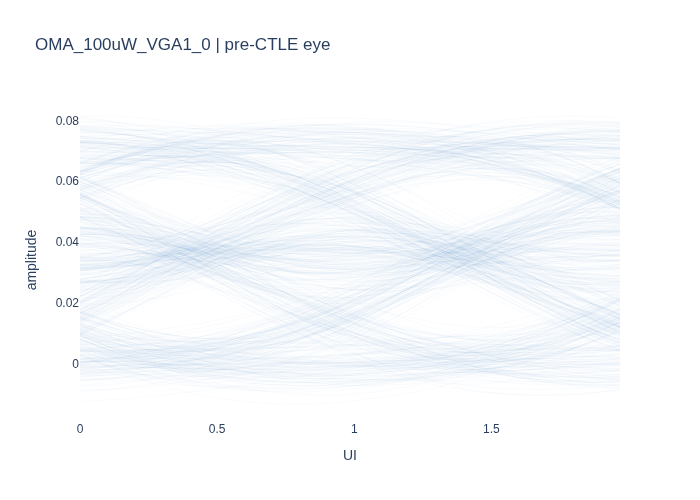

*Figure 1. Pre-CTLE oversampled eye (2 UI window, 600 traces). Amplitude in
raw waveform units (∼mV scale at photodetector). The eye closes significantly
at the optimal sampling phase due to multi-UI channel dispersion.*

### 4.2 Post-CTLE eye diagram

After the 1z2p CTLE applies high-frequency peaking, the eye opens modestly —
the CTLE compensates for the band-limiting effect of the channel. However,
significant ISI from multiple symbols remains, motivating the multi-tap FFE.

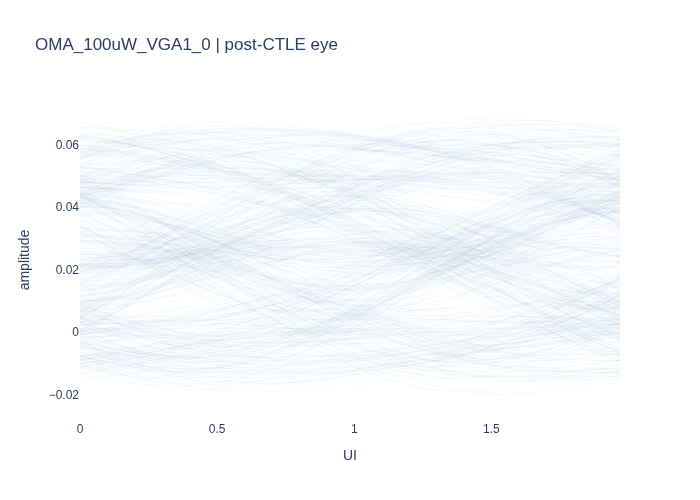

*Figure 2. Post-CTLE oversampled eye. High-frequency peaking broadens the
transition waveforms, reducing multi-UI ISI; the opening at UI = 1 is noticeably
wider than Figure 1.*

### 4.3 Post-FFE eye diagram

After the 20-tap baud-rate FFE is applied. This eye is generated by upsampling
the final FFE tap vector by 32 (zero-insertion between taps) to produce a
full-rate FIR filter, which is convolved with the normalised post-CTLE waveform
at 32 SPS. The result is folded into 2-UI segments for display.

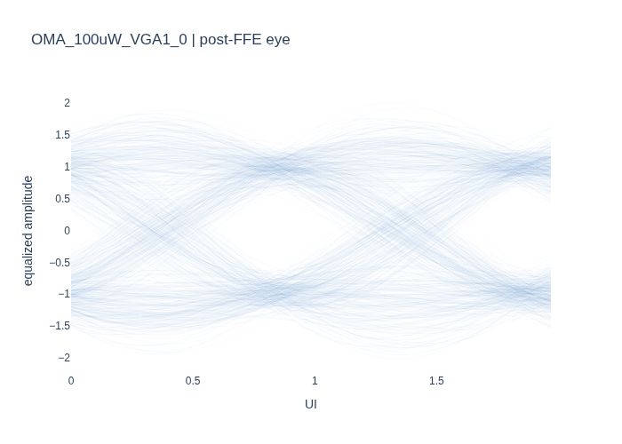

*Figure 3. Post-FFE oversampled eye (frozen-pass FFE taps convolved with 32-SPS
CTLE output). Clear two-level opening centered at ±1 (normalised). The crossing
at amplitude 0 confirms correct threshold placement. Trace spread reflects
residual noise and residual ISI at this OMA.*

### 4.4 ADC output histogram

The distribution of baud-rate samples at the ADC output (post-CTLE, pre-FFE),
shown across the full 131k-symbol adaptive run.

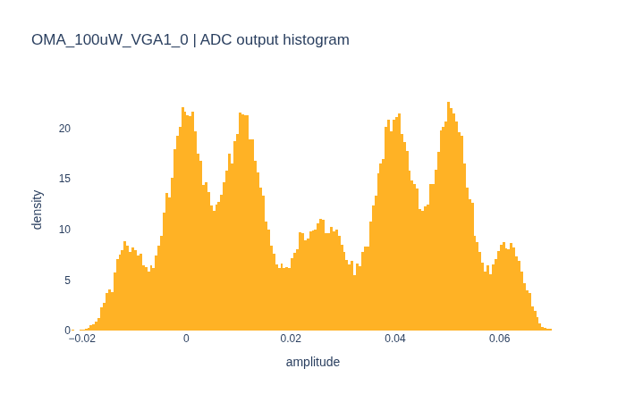

*Figure 4. ADC output amplitude histogram. The two NRZ levels are partially
resolved; the valley between them indicates that the FFE has significant ISI to
cancel. The asymmetry in peak heights reflects the channel's polarity inversion
(negative level is the mapped '1', positive level the '0').*

### 4.5 Post-FFE histogram

The amplitude distribution at the FFE output from the frozen pass, with the
leading and trailing 150 symbols trimmed. The decision threshold is marked at 0.

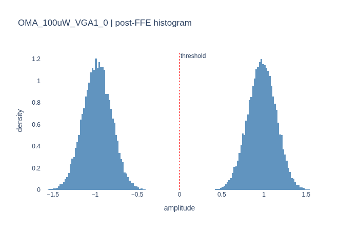

*Figure 5. Post-FFE equalized amplitude histogram (frozen pass, 43,468 symbols).
Two well-separated Gaussian clusters at approximately ±1. The near-zero density
between them confirms a clean decision margin. The intra-level std σ_intra =
0.169 for this OMA.*

### 4.6 FFE final tap weights and frequency response

#### Tap weights — stem plot (OMA 100 µW, VGA0)

The converged FFE tap vector shown as a stem plot. The main cursor (red) sits at
offset 0. Positive offsets are post-cursor taps (looking back in time, cancelling
trailing ISI); negative offsets are pre-cursor taps (non-causal, providing phase
lead).

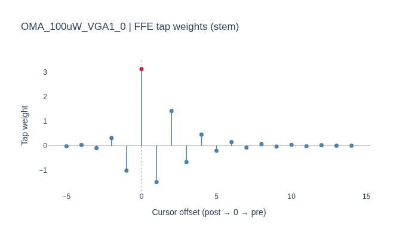

*Figure 6a. Converged FFE tap weights, OMA_100uW_VGA1_0 (5 pre + 1 main +
14 post = 20 taps). Main cursor weight ≈ 3.1 reflects the CTLE-output
amplitude being below the ADC normaliser's target of ±1; the FFE must supply
the missing gain. T+1 (−1.5) and T+2 (+1.4) are the dominant post-cursor ISI
terms — their alternating sign is characteristic of a dispersive optical
channel with a bandwidth-limited impulse response.*

#### FFE frequency response — all six variants

The frequency response is computed directly from the converged tap vectors:

```
H(f) = Σ_k  w[k] · exp(−j · 2π · f · k / f_baud)
```

where the sum runs over tap index k (positive = post-cursor delay, negative =
pre-cursor advance) and `f_baud` = 106.25 GHz. The magnitude is
`20 log₁₀ |H(f)|` and the group delay is `−dφ(f)/dω` expressed in picoseconds.

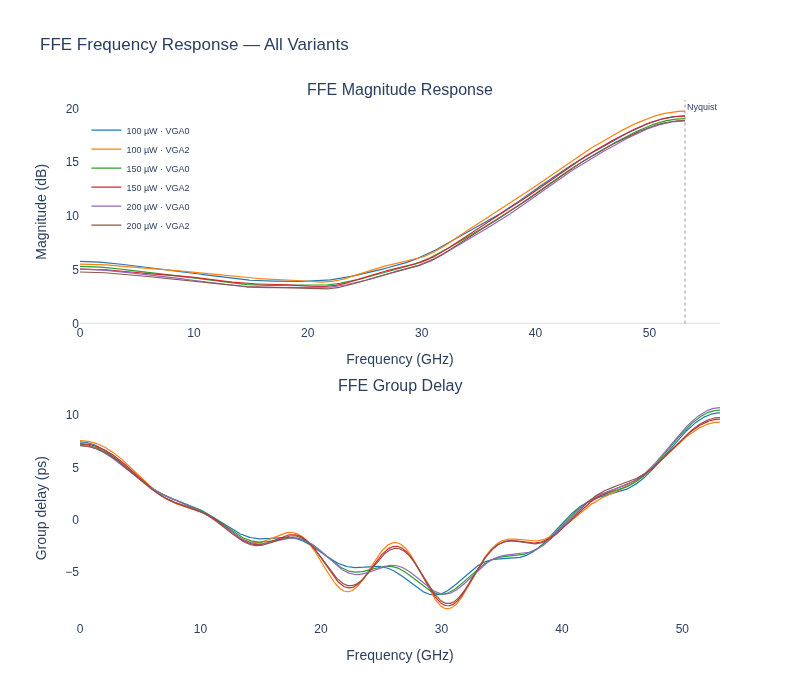

*Figure 6b. FFE magnitude response (top) and group delay (bottom) for all six
OCI-Gen2 variants. The six curves are nearly coincident, confirming that the
converged FFE solution is driven by the channel physics rather than by the
VGA or OMA setting.*

*Magnitude:* The equaliser has a high-pass characteristic — ~5 dB at DC, a
trough near 20–22 GHz, then a steep rise to ~20 dB at the Nyquist frequency
(53.1 GHz). This is the approximate inverse of the optical channel's low-pass
roll-off: the CTLE removes the majority of the mid-frequency droop, and the
FFE compensates the residual at higher frequencies.

*Group delay:* At DC the group delay is approximately +7 ps, corresponding
to the n_post = 14 tap delay inherent in the causal portion of the filter.
The group delay swings negative (minimum ≈ −7 ps) around 25–30 GHz,
introduced by the pre-cursor taps (k < 0) which phase-advance the signal in
that band. The variation between variants is small (< 1 ps across the passband),
indicating the filter shape is tightly constrained by the channel response
rather than the noise level.

#### Tap weight comparison: Python Rx vs SNPS AMI — all six variants

Both tap vectors are normalised to unity main cursor (offset 0) before plotting
so that the shape of the ISI cancellation can be compared independent of the
gain difference (Python Rx main tap ≈ 3.1 due to signal normalisation; SNPS
main tap = 1.0 by convention).

The SNPS AMI model uses 26 fixed taps (offsets 0 to +25) plus 6 pre-cursor
taps (offsets −1 to −6); the Python Rx uses 20 taps (offsets −5 to +14).
Floating far-cursor taps (SNPS offsets 36, 50, 59) are excluded.

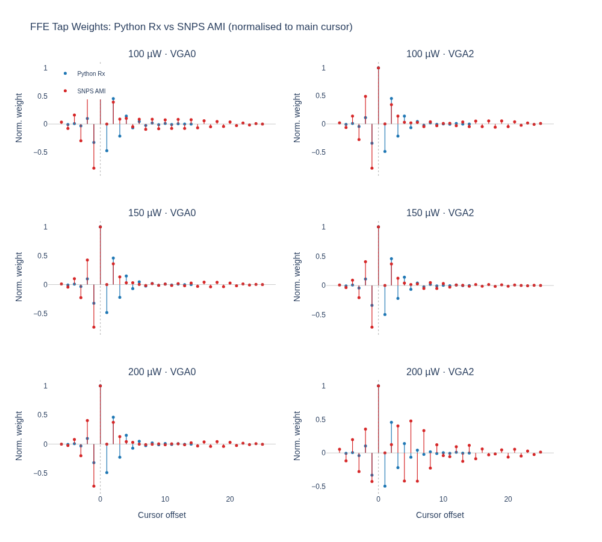

*Figure 6c. Normalised FFE tap weights: Python Rx (blue) vs SNPS AMI (red),
for all six OCI-Gen2 variants. Both receivers converge to the same dominant ISI
structure — strong activity at offsets −1, 0, +1, +2 — confirming they are
inverting the same underlying channel response. Beyond offset +14 (the Python
Rx boundary) the SNPS taps decay to near-zero, indicating that the 14
post-cursor tap allocation captures the bulk of the ISI energy. The largest
discrepancy appears at offset −1 (pre-cursor), where SNPS places a larger
fraction of the pre-cursor correction; this reflects the additional 6-tap DFE
feedback in the SNPS model partially relieving the FFE pre-cursor burden.*

#### Per-variant comparison: impulse response, magnitude, and group delay

Each figure below shows, for a single OCI-Gen2 variant, the full FFE
characterisation in three panels: (1) impulse response (normalised tap weights
as a stem plot); (2) magnitude response; (3) group delay. Python Rx is shown as
a solid blue line; SNPS AMI as a dashed red line. Both are normalised to unity
main cursor.

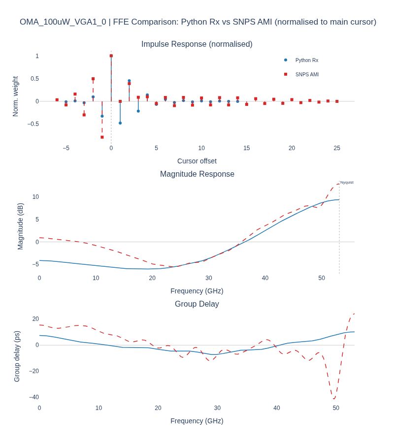

*Figure 6d. OMA 100 µW, VGA setting 0.*

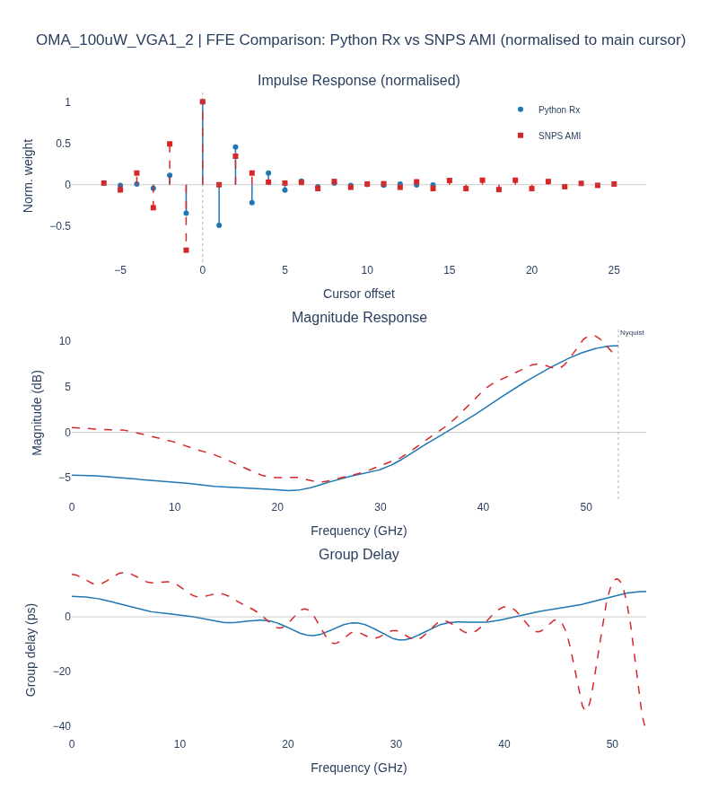

*Figure 6e. OMA 100 µW, VGA setting 2.*

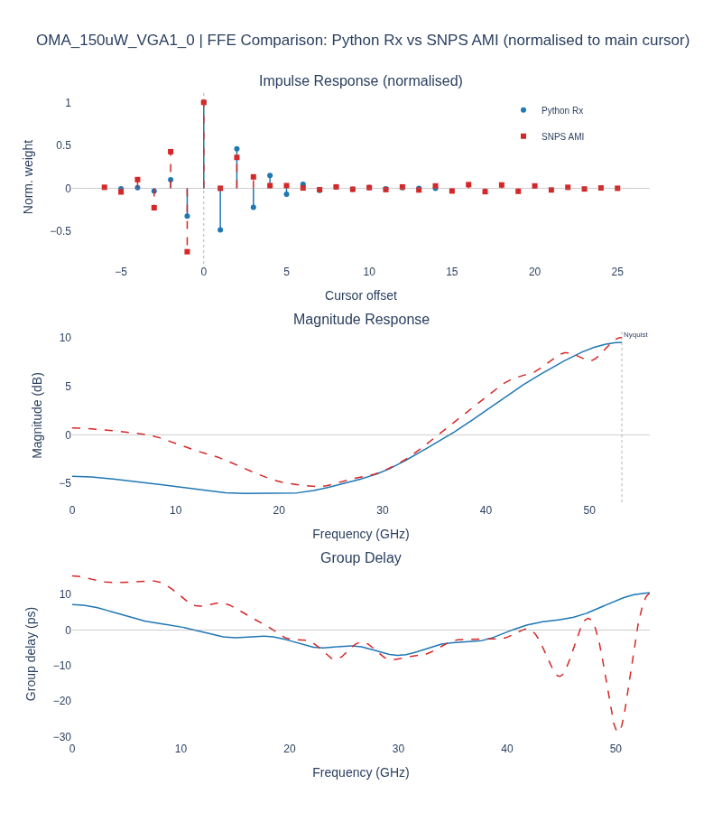

*Figure 6f. OMA 150 µW, VGA setting 0.*

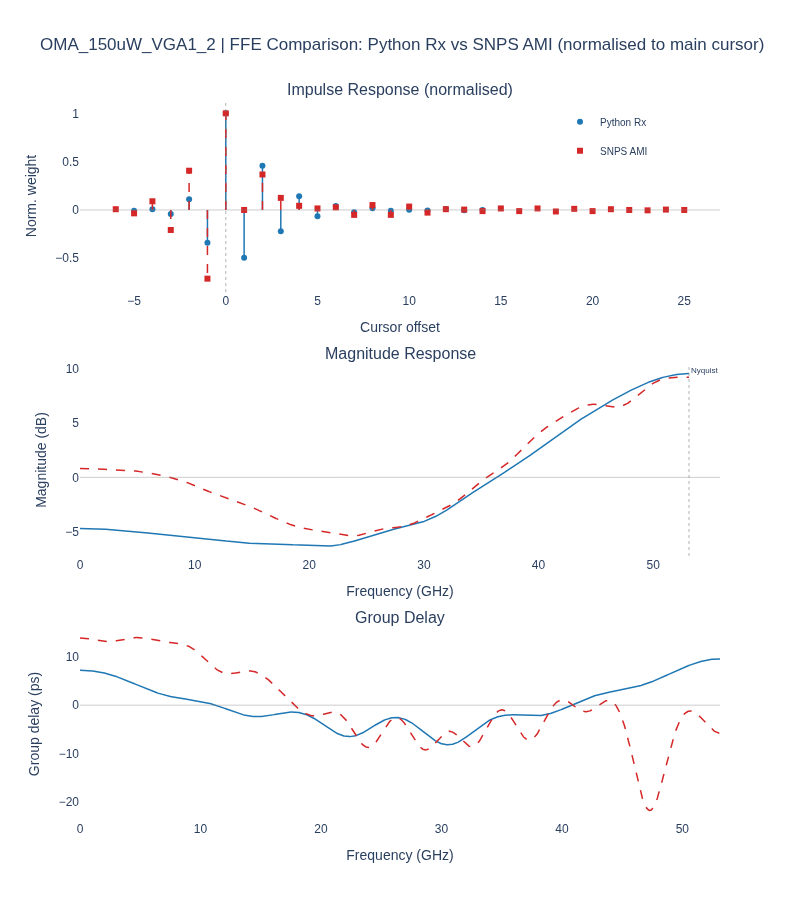

*Figure 6g. OMA 150 µW, VGA setting 2.*

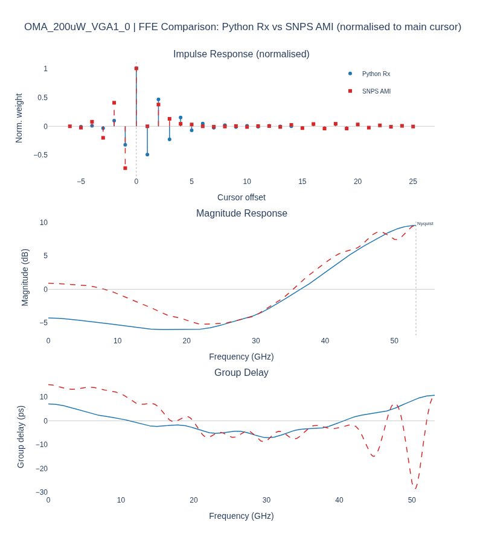

*Figure 6h. OMA 200 µW, VGA setting 0.*

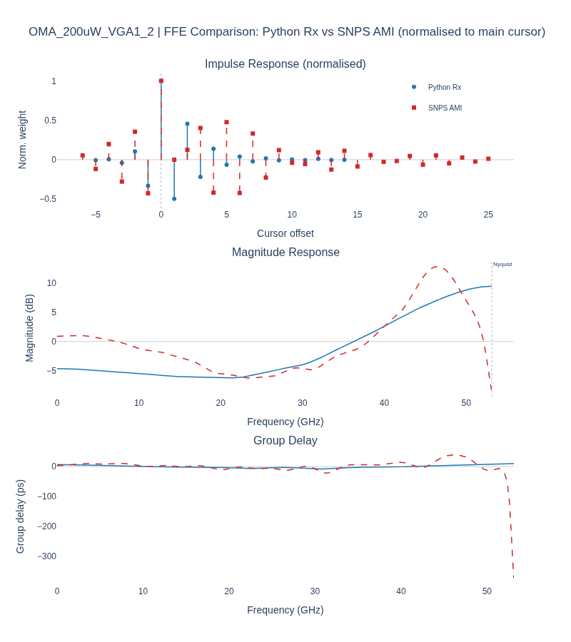

*Figure 6i. OMA 200 µW, VGA setting 2.*

The per-variant panels confirm that both solvers converge to essentially the
same equaliser shape across all operating points: the impulse response
discrepancies are limited to the pre-cursor region (offsets −1 to −5) and
to far post-cursor taps beyond +14 where SNPS has additional degrees of
freedom. The magnitude and group-delay curves are nearly indistinguishable
within the passband, indicating that the channel inversion is well captured
by the 20-tap Python FFE.

### 4.7 CDR phase trajectory

The phase interpolator (PI) code as a function of symbol index across the full
131k-symbol adaptive run.


*Figure 7. CDR PI code trajectory. The CDR acquires lock within the first
~500 symbols and remains stable throughout. Settled mean = 28.9 / 32,
σ = 0.30 codes, confirming that the asymmetric TED weight (w_pre = 0.9)
successfully aligns the lock point near the sweep-optimal phase k* = 29.*

### 4.8 Rx adaptation dashboard

A four-panel view of the adaptation dynamics across the full 131k-symbol
adaptive run (1.24 µs).

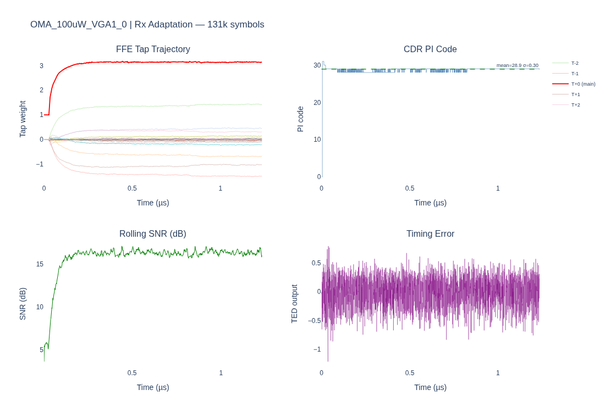

*Figure 8. Rx adaptation dashboard.*  
*Top-left: FFE tap trajectory — main tap (red) rises from 1.0 to ~3.1 within
the first ~100 ns; post-cursor taps converge to their ISI-cancellation values.*  
*Top-right: CDR PI code — locks within the first 5 ns and remains flat at
phase 29.*  
*Bottom-left: Rolling SNR (1k-symbol window) — rises from ~5 dB during
adaptation to a steady ~15 dB; tile boundaries are excluded from the rolling
calculation.*  
*Bottom-right: Timing error (TED output) — heavy oscillation during initial
CDR acquisition, settling to zero-mean noise once locked.*

---

## 5. Batch Results — All Six Waveforms

### 5.1 Summary table

| Waveform | OMA (µW) | VGA | SNR (dB) | σ_intra | Extrap. BER | Raw BER | Errors / Symbols |
|----------|----------|-----|----------|---------|-------------|---------|-----------------|
| OMA_100uW_VGA1_0 | 100 | 0 | 15.22 | 0.169 | 3.98 × 10⁻⁹ | 0 | 0 / 43,468 |
| OMA_100uW_VGA1_2 | 100 | 2 | 16.13 | 0.154 | 7.58 × 10⁻¹¹ | 0 | 0 / 43,468 |
| OMA_150uW_VGA1_0 | 150 | 0 | 17.27 | 0.135 | 1.38 × 10⁻¹³ | 0 | 0 / 43,468 |
| OMA_150uW_VGA1_2 | 150 | 2 | 17.89 | 0.127 | 2.14 × 10⁻¹⁵ | 0 | 0 / 43,468 |
| OMA_200uW_VGA1_0 | 200 | 0 | 18.31 | 0.121 | 9.16 × 10⁻¹⁷ | 0 | 0 / 43,468 |
| OMA_200uW_VGA1_2 | 200 | 2 | 18.69 | 0.116 | 3.82 × 10⁻¹⁸ | 0 | 0 / 43,468 |

Key observations:

- **SNR increases monotonically with OMA** as expected — higher optical power
  reduces the relative impact of thermal and shot noise.
- **VGA setting 2 consistently outperforms VGA setting 0** at the same OMA
  (approximately 0.4–0.9 dB SNR improvement), suggesting the higher VGA gain
  better matches the signal swing to the ADC input range.
- **Zero raw errors** across all variants. With 43k symbols per run, the
  Clopper-Pearson 95% upper bound on raw BER is approximately 7 × 10⁻⁵.
- **Extrapolated BER spans nine decades** from 3.98 × 10⁻⁹ to 3.82 × 10⁻¹⁸
  across the OMA range, indicating substantial sensitivity to optical power
  in this receiver configuration.

---

## 6. Receiver Configuration Reference

```json
{
  "ctle_model": "1z2p",
  "ctle_pk_db": 4.0,
  "ctle_g_dc_db": -3.0,
  "ffe_pre": 5,
  "ffe_post": 14,
  "ffe_mu": 0.01,
  "cdr_kp": 0.01,
  "cdr_ki": 0.0,
  "ted_pre": 0.9,
  "ted_post": 1.0,
  "initial_phase": null,
  "repeat": 3
}
```

Simulation outputs: `runs/caribou_oci_gen2_nrz_results/<variant>/`  
Script: `examples/caribou_oci_gen2_nrz_results.py`  
TX reference: `snps200g_nrz_from_bitfile_300k_symbols_pam4digits.txt` (300k NRZ bits)
