# Golden SerDes Rx Optimizer — Methodology and Results

**Date:** 2026-09-26
**Signal:** NRZ and PAM4, 106.25 GBd, 32 samples/UI
**Code:** `optical-serdes` — `examples/golden_rx_optimizer.py`, `examples/oif_lr_rx_compare.py`, `src/optical_serdes/rx/ctle.py`, `src/optical_serdes/analysis/mlsd_bound.py`
**Standards:** OIF CEI-224G-LR (OIF2023.235.13, Clause 33), CEI-224G-MR (OIF2024.058.12, Clause 32), CEI-224G-LINEAR-PAM4 (OIF2024.522.05/.06, Clause 30), IEEE P802.3dj D1.3 Annex 178A
**Data:** synthetic captures `data/gui_test/`; Colossus capture `temp/food/ranjit_colossus/`
**Results:** `runs/golden_rx/oif_ctle/`, `runs/ranjit_colossus/`
**Appendix data:** [`oif_cei224_ctle.json`](oif_cei224_ctle.json) — copy of `docs/oif_cei224_ctle.json`, the CTLE parameter extraction from the four OIF drafts

Every number quoted in this document was read back from the result JSON files listed in Appendix B. Numbers that could not be checked against a result file are marked as such where they appear.

---

## Table of Contents

- [1. Purpose](#1-purpose)
- [2. Receiver chain and definitions](#2-receiver-chain-and-definitions)
  - [2.1 Automatic gain control](#21-automatic-gain-control)
- [3. CTLE catalog from the OIF CEI-224G drafts](#3-ctle-catalog-from-the-oif-cei-224g-drafts)
- [4. Three-stage search](#4-three-stage-search)
- [5. Effective response](#5-effective-response)
- [6. Reporting and outputs](#6-reporting-and-outputs)
- [7. MLSD](#7-mlsd)
- [8. Results on the synthetic captures](#8-results-on-the-synthetic-captures)
- [9. Results on the ranjit_colossus capture](#9-results-on-the-ranjit_colossus-capture)
- [10. The OIF CEI-224G-LR Table 33-1 receiver](#10-the-oif-cei-224g-lr-table-33-1-receiver)
- [11. Interpretation of the FFE coefficient limits](#11-interpretation-of-the-ffe-coefficient-limits)
- [12. Limitations and open items](#12-limitations-and-open-items)
- [13. Reproduction](#13-reproduction)
- [Appendix A. Files in this directory](#appendix-a-files-in-this-directory)
- [Appendix B. Verification notes](#appendix-b-verification-notes)

---

## 1. Purpose

A receiver design is judged against a bound. For a baud-rate PAM4 or NRZ receiver the useful bound is not the matched-filter bound of textbook theory, which ignores the receiver architecture, but the best that the *same architecture* can do when every non-ideality that a real receiver has to estimate is handed to it for free: the transmitted symbols, the sampling instant, the CTLE setting, the equaliser length. That receiver is called *golden* here. Its output MSE and SNR say how much of the channel's information a CTLE + T-spaced FFE + one-tap detector can recover; the distance between a real receiver and the golden one says how much is being lost to adaptation, timing recovery, coefficient limits, or a short equaliser rather than to the channel.

The golden receiver is a search, not a model. Given

- a bit file (`--tx-bits`, `.npy` or `.txt` of 0/1),
- an oversampled waveform at the receiver input (`--rx-signal`, `.npy`),
- the samples per UI (`--sps`), the modulation (`--modulation nrz | pam4`) and the symbol rate (`--baud`),

it finds the CTLE code, the sampling phase, the FFE structure \((n_\mathrm{pre}, n_\mathrm{post})\) and the detector configuration that minimise the mean-squared error on held-out symbols. The waveform is taken as-is; nothing about the channel is assumed. The inputs stay user-supplied so the same tool applies to a synthetic capture, a Virtuoso transient, or a scope record.

The PAM4 mapping is Gray, the same as `optical_serdes.tx.waveform` and `rx.pam4`: bit pairs (msb, lsb) `00 → −1`, `01 → −1/3`, `11 → +1/3`, `10 → +1`. NRZ maps \(b \to 2b - 1\). The symbol alphabet is therefore normalised to \(\pm 1\) at the outer levels, so every MSE in this document is in units of the squared outer level.

Three things are fixed by definition rather than searched, because they are what makes the receiver a reference: the AGC is an oracle (block mode over the whole record), the timing is ideal (a sampling phase is chosen, no CDR runs), and the decision feedback is a genie (the feedback uses the transmitted symbols, so there is no error propagation).

## 2. Receiver chain and definitions

```
rx waveform (oversampled, sps samples/UI)
   │
   ▼
front end  optional, off by default (Section 10.4): + η0 receiver noise, then a 4th-order
           Butterworth low-pass at f_r — the CEI-224G-LR Table 33-1 values with --front-end oif-lr
   │
   ▼
AGC        oracle block mode: subtract the block mean, scale so the waveform RMS
           equals the RMS of the symbol alphabet (1 for NRZ, √(5/9) ≈ 0.745 for PAM4)
   │
   ▼
CTLE       one OIF CEI-224G code (Section 3), bilinear-transform SOS at fs = sps · fb
   │
   ▼
sampler    one sample per UI at phase τ ∈ [0, 1) UI — ideal timing, no CDR
   │
   ▼
ADC        optional, with the front end: N_qb-bit mid-rise quantiser, full scale from the
           (1 − P_qc) quantile of |x| at that phase; applied in every search and fitting path
   │
   ▼
FFE        T-spaced, n_pre + 1 + n_post taps; c[i] multiplies x[k − i], i ∈ [−n_pre, n_post]
   │
   ▼
detector   1-tap genie DFE on the first post-cursor (feedback from known symbols), or
           MLSD over the residual response [1, b1 … bL] (Section 7)
   │
   ▼
PAM slicer at the midpoints of the estimated levels (for the counted errors)
```

**Front end (optional).** By default the golden receiver is noiseless, full-bandwidth and samples ideally, so its bound is the bound of the *architecture* alone. `--front-end oif-lr` (or `--eta0`, `--rx-bw-factor`, `--adc-bits`, `--adc-clip-prob` individually) adds the Table 33-1 receiver front end of Section 10.1 — white receiver noise of one-sided density η0 and a 4th-order Butterworth at \(f_r\) ahead of the AGC, an \(N_{qb}\)-bit ADC on the baud-rate samples after the sampler — using the same functions (`rx_front_end`, `quantize`) as the LR receiver script, so with the same noise seed (`--fe-seed`, default 11) the two receivers see the identical noise realisation. The ADC is applied wherever the optimiser samples (stage 1, the length search, the rescoring, and the final fit); the oversampled equalised waveform used for the eye figures stays unquantised (the figure says so). What was applied is recorded in the `front_end` block of the result JSON. Section 10.4 uses it for the like-for-like comparison.

**AGC.** `rx.analog_agc.AnalogAgc(target_amplitude=√E[a²], detect="rms", mode="block", remove_dc=True, dc_mode="block")`: one DC value and one gain for the whole record, the target being the RMS of the transmitted symbols. The DC offset removed and the gain applied are reported (`agc` block of the result JSON). On the ranjit capture the gain is +23.21 dB and the DC removed is 1.2e-5 (the capture is already zero-mean); behind the Table 33-1 front end it is +23.24 dB, the same as the LR receiver's. Section 2.1 gives the algorithm step by step, the reason an oracle is acceptable here, and the gains of every run.

**Sampler.** `sample_at_phase(wf, sps, τ)` returns `wf[⌊τ·sps⌋ :: sps]` when \(\tau \cdot \mathrm{sps}\) is an integer (the default phase grid has one point per sub-sample, so `--phase-steps 0` means 32 phases at 32 samples/UI) and linearly interpolates between adjacent oversampled points otherwise.

**Symbol alignment.** The integer symbol lag \(L\) such that \(x[k+L] \leftrightarrow a[k]\) is the peak of the FFT cross-correlation between the mean-removed baud-rate samples and the mean-removed symbols. The peak of \(|\mathrm{corr}|\) is used, so a polarity inversion is tolerated and absorbed by the sign of the least-squares taps. The aligned arrays are cut to their overlap.

**Tap convention.** The FFE output at symbol \(k\) is \(\sum_i c[i]\, x[k-i]\) for \(i \in [-n_\mathrm{pre}, n_\mathrm{post}]\). A negative index is an anti-causal pre-cursor tap: \(c[-1]\) multiplies the sample one UI *after* the cursor. The result JSON stores the taps in this order (`ffe.taps_cursor_order`, with `ffe.tap_labels`).

**Model.** With \(M\) residual post-cursor taps left to the detector (\(M = 1\) for the genie DFE, \(M = L\) for an MLSD of memory \(L\)),

```
y[k] = Σ_{i = −n_pre}^{n_post} w_i · x[k − i]  −  Σ_{j = 1}^{M} b_j · a[k − j]   ≈   a[k]
```

The FFE weights \(w\) and the residual taps \(b\) are solved *jointly* by linear least squares against the known symbols: the regressor matrix has one column per FFE delay (\(x[k_s - i]\)) and one column per feedback tap (\(-a[k_s - j]\)); the target is \(a[k_s]\). For the DFE this is the MMSE equaliser with ideal decisions. For the MLSD the same fit gives the FFE and the partial response the sequence detector will resolve (the IEEE P802.3dj 178A.1.11 construction, Section 7).

**Index set, training and held-out split.** The valid symbol indices are \(k_s \in [\max(n_\mathrm{post}, M),\ N - n_\mathrm{pre})\) (edge trim). The first `round(train_frac · |k_s|)` rows are the training set (`--train-frac 0.6`, never fewer than twice the number of columns); the remaining 40 % are held out. Every selection decision in the optimiser — CTLE code, phase, FFE length, cursor position, rescoring — uses the **held-out MSE** (`mse_eval`), so the winning configuration is not favoured for overfitting a longer regressor. When several structures are compared (Section 4, stage 2), they are all scored on a *frozen* index set: the saturated fit's \(k_s\) is passed to every shorter candidate so that the train / held-out boundary does not move by a few symbols from one candidate to the next.

**Solvers.** Reference fits use `numpy.linalg.lstsq` (SVD). Wherever a fit only *ranks* candidates (stage 1 grid, stage 3 rescoring, the FFE/MLSD trade-off sweep) the normal equations \(G\theta = M^\mathsf{T} t\), \(G = M^\mathsf{T} M\), are solved instead (`fast=True`), which is several times faster on a tall regressor. Backward elimination (stage 2) goes one step further: the training Gram matrix \(G_\mathrm{tr}\), the cross term \(r_\mathrm{tr} = M_\mathrm{tr}^\mathsf{T} t_\mathrm{tr}\) and the held-out Gram terms are formed once from the saturated regressor, and a candidate structure \(S\) (a column subset) is scored as

```
θ_S       = G_tr[S,S]⁻¹ · r_tr[S]
MSE_eval  = ( t_evᵀt_ev − 2 θ_Sᵀ r_ev[S] + θ_Sᵀ G_ev[S,S] θ_S ) / N_eval
```

in \(O(|S|^2)\), so each of the few hundred evaluations in a length search costs microseconds instead of a 30k-row `lstsq`. The evaluator checks itself against the saturated `lstsq` fit at run time (tolerance 1e-4 relative; if the normal equations are too ill-conditioned it falls back to exact `lstsq` per candidate). During development the Gram evaluator was verified against exact `lstsq` to about 3e-11 relative on the NRZ 40 dB and PAM4 test cases; the docstring quotes a conservative 1e-8.

**Cursor.** At high loss the cross-correlation peak is not the MMSE cursor. After the saturated fit, the symbol lag is moved so that the dominant FFE tap (largest \(|w|\)) sits at \(c[0]\), and the fit is repeated until it stays there (or alternates between two positions within noise). \(n_\mathrm{pre}\) and \(n_\mathrm{post}\) are counted either side of that tap. The shift from the cross-correlation lag is reported as `cursor_shift_ui` (0 on every run in this document).

**Figures of merit.**

| Quantity | Definition | PAM4 value of the constants |
|---|---|---|
| held-out MSE | \(\mathrm{mean}\,(y - a)^2\) over the held-out symbols | — |
| post-EQ SNR | \(10\log_{10}\left(E[a^2] / \mathrm{MSE}\right)\) | \(E[a^2] = 5/9\) |
| slicer (genie-DFE) margin | \(20\log_{10}(A_s/\sigma)\), \(A_s = \Delta/2\), \(\sigma\) = rms of the held-out residual | \(A_s = 1/3\) |
| MLSD margin | \(20\log_{10}(A_s\, d_\mathrm{eff,min} / \sigma)\) (Section 7) | — |
| Gaussian SER | \(\frac{2(M_\mathrm{lev}-1)}{M_\mathrm{lev}}\, Q(\text{argument})\) | factor 3/2 |

For PAM4 the SNR and the slicer margin differ by a constant: \(10\log_{10}(5/9) - 20\log_{10}(1/3) = 6.99\) dB (24.62 dB SNR is 17.63 dB margin on the ranjit capture). With the 3/2 nearest-neighbour factor, a 17.6 dB margin corresponds to a Gaussian SER of about 2e-14, 15.6 dB to about 1e-9, and 13.4 dB to about 2e-6.

### 2.1 Automatic gain control

**Placement.** The AGC is the first block the optimiser owns. It acts on the oversampled waveform as loaded (`--rx-signal`) or, when the Table 33-1 front end is on, on the output of `rx_front_end` (η0 noise added, then the 4th-order Butterworth), and its output `wf_agc` is the waveform every CTLE code of the catalog is applied to (`code.ctle.filter(wf_agc)`). It therefore sits ahead of the CTLE, the sampler and the ADC, runs once per script invocation, and is not part of the search. Both scripts construct `rx.analog_agc.AnalogAgc` identically and call `apply` once on the whole record:

```python
AnalogAgc(target_amplitude=sqrt(mean(a**2)), detect="rms", mode="block",
          remove_dc=True, dc_mode="block", samples_per_symbol=sps).apply(waveform)
```

There are no command-line options for it. (The class docstring describes a placement between the CTLE output and the ADC input; the scripts place it ahead of the CTLE. With a linear CTLE and an ADC whose full scale is fitted from the data, the two placements differ only in the level the CTLE sees.)

**Block-mode algorithm.** With \(x[n]\) the input record of \(N\) oversampled points — all of them: the 4,800,064 samples of the ranjit capture including its zero preamble and the 180 UI before the signal arrives, or the synthetic captures including their 517-sample DC lead — `apply` does, in order:

1. *DC estimate and removal* (`dc_mode="block"`): \(\hat d = \frac{1}{N}\sum_n x[n]\), \(x_\mathrm{ac}[n] = x[n] - \hat d\). One number for the whole record.
2. *Amplitude detection* (`detect="rms"`): \(\hat\sigma = \sqrt{\frac{1}{N}\sum_n x_\mathrm{ac}[n]^2}\), the RMS of the zero-mean record over every oversampled point (transitions included), i.e. the standard deviation of the waveform. An all-zero record is guarded to 1e-30.
3. *Gain*: \(g = \mathrm{clip}\left(A_t / \hat\sigma,\ 10^{-30/20},\ 10^{+30/20}\right)\) — the target divided by the detected RMS, clamped to ±30 dB (`gain_min_db` / `gain_max_db` defaults; neither script changes them). The clamp is silent: nothing in the result says whether it acted. None of the runs in this document is near it: for a PAM4 target the ceiling binds at 23.6 mV rms, so the ranjit capture (51.5 mV rms) has 6.8 dB of headroom and the TX-FFE run (37.2 mV) 4.0 dB.
4. *Output*: \(y[n] = g \, x_\mathrm{ac}[n]\).

The target \(A_t\) = `sqrt(sym_power)` is the RMS of the *transmitted symbol sequence as loaded* (after `--max-symbols`), \(\sqrt{\mathrm{mean}(a^2)}\): exactly 1 for NRZ (\(a = \pm 1\)); for the Gray PAM4 alphabet \(\{\pm 1, \pm 1/3\}\) the alphabet value is \(\sqrt{5/9} = 0.7454\), and the realised sequences give 0.7452 on the 150,000-symbol ranjit record and 0.7483 on the 16,384-symbol synthetic PAM4 file (the level counts are not exactly balanced). After the AGC the waveform carries the power of a unit-alphabet symbol stream. What the sampler sees is a unit-*power* signal, not a unit cursor: the power is shared between the cursor and the ISI. On the ranjit capture the gain, ×14.47, takes the 51.5 mV rms record to 0.745 rms and the 64.07 mV-per-level cursor of the Section 9.1 pulse fit to 0.927 per unit level; the rest of the unit power is in the ISI terms of that fit (\(\sum_k h_k^2 = 1.165\) including the cursor, and \(0.927 \sqrt{1.165} = 1.00\)).

**Diagnostics.** `apply` returns an `AgcResult` with `waveform` (the output), `gain_trajectory` (in block mode a constant array, \(g\) at every sample), `dc_offset_removed` (\(\hat d\)), `settled_gain_linear` (\(g\)) and `settled_gain_db` (\(20 \log_{10} g\)). The golden script stores `settled_gain_db` and `dc_offset_removed` as `agc.gain_db` and `agc.dc_offset_removed` in `golden_rx_result.json` (with `agc.mode = "block"`) and prints them in the console report; the LR script stores `agc_gain_db`. Nothing in block mode is time-varying: one DC value and one gain for the whole record, no settling, no gain steps, no quantisation of the gain, and no dependence on `samples_per_symbol` (the argument is passed but only feeds the time constants of the other modes). `settled_gain_linear` has one further use: in demo mode the known channel impulse response is multiplied by it and by the AFE scale before the CTLE, so that the effective-response path of Section 5 sees the same pulse the FFE was fitted to (`baud_channel_from_ir`; the demo generator's DC offset does not enter, the AGC has removed it).

**Why "oracle".** The other modes of the class are what a receiver would have to do. `mode="training"` measures the same statistic over the first `training_symbols` × sps samples (5000 symbols by default) and holds that gain. `mode="adaptive"` is a causal sample-by-sample loop — a peak detector with separate attack and decay time constants (`attack_ui` = 5 UI, `decay_ui` = 50 UI) or a one-pole power tracker for `detect="rms"` — whose gain \(g[n] = A_t / \hat\sigma[n]\) rides on the running estimate, moves with the data pattern, and reports its last value as the settled gain. `dc_mode="iir"` replaces the block mean by a causal first-order high-pass (an AC-coupling model). The block mode uses the whole record for both estimates and has no loop dynamics, no gain quantisation and no settling time; it is an oracle in the same sense as the frozen sampling phase and the genie DFE of Section 1.

**Why that is acceptable for a golden reference.** Everything after the AGC is scale-invariant. The CTLE is linear. The joint least-squares fit of Section 2 is invariant to a common scale of its regressors: multiplying \(x\) by \(g\) divides the FFE taps by \(g\) and leaves \(y\), the held-out MSE, the SNR and the margins unchanged. The AGC gain therefore only sets the numeric level at which taps, eyes and histograms are reported (the taps in `ffe.taps_cursor_order` are in post-AGC units). The one block that could break the invariance is the ADC, present only with the front end: a quantiser with a fixed full scale would make σ_q depend on the level the AGC delivered. `quantize` instead sets its full scale from the data — the \((1 - P_{qc})\) quantile of \(|x|\) over the baud-rate samples at each CTLE code and phase — so a gain change by \(g\) scales the full scale and the LSB by \(g\), leaves the code assignment \(\lfloor x / \mathrm{LSB} \rfloor\) unchanged, and scales the quantised samples by \(g\): the ADC output is, to floating-point precision, the AGC gain times what it would be at any other gain, the clip fraction stays at \(P_{qc}\), and the quantisation SNR is independent of the AGC. The η0 noise is added ahead of the AGC and is scaled with the signal, so the noise-to-signal ratio into the CTLE is independent of it as well. The AGC gain is not a tuning knob anywhere in these results; it is a level normalisation, and the only thing the block-mode idealisation omits is the transient a real loop would have (Section 12).

**Interaction with the CTLE DC gain.** The AGC normalises the level *into* the CTLE, and the COM codes attenuate it afterwards: `com gDC=−8 gDC2=−4`, the capped ranjit winner, has −12.0 dB at DC and −2.7 dB at Nyquist, so the post-CTLE waveform is well below the unit level the AGC set and the FFE restores the difference (\(c[0] = 1.72\), \(|W| = +8.4\) dB at DC, Section 3.4). The linear codes keep 0 dB at DC (the front-end winner `linear +3/0` of Section 10.4 has \(c[0] = 0.78\)). In the ideal receiver this costs nothing (scale invariance). Behind the front end it does not cost ADC resolution either, because the quantiser's full scale is fitted to the post-CTLE sampled signal per code and phase: at the same +23.24 dB AGC gain, `oif_lr_rx` (`com 0/−1`, −1 dB at DC) fits a full scale of 1.687 (LSB 0.0527) and `oif_lr_rx_nomainmin` (`com −7/−2`, −9 dB at DC) 0.940 (LSB 0.0294), 5.1 dB less; `golden_rx_pk10_fe` (`linear +3/0`, 0 dB at DC) fits 1.911 (LSB 0.0597). Each clips the same one sample in 150,000 (clip fraction 6.7e-6). What the CTLE code does change behind the front end is \(\sum w^2\), the FFE's gain on the quantisation noise, and that — not the ADC's range — is why the front-end search moved to the linear family (Section 10.4).

**Numbers.** From the result files (`agc.gain_db` and `agc.dc_offset_removed` of `golden_rx_result.json`; `agc_gain_db` of `oif_lr_rx_result.json`, which does not store the DC). The input rms is \(A_t / g\).

| Run | Modulation | Target \(A_t\) | Input rms | AGC gain | DC removed |
|---|---|---:|---:|---:|---:|
| `runs/ranjit_colossus/golden_rx`, `golden_rx_pk10`, `golden_rx_pk10_mlsd` | PAM4 | 0.7452 | 51.5 mV | +23.21 dB | 1.2e-5 |
| `golden_rx_pk10_fe`, `golden_rx_pk10_fe_mlsd` (Table 33-1 front end) | PAM4 | 0.7452 | 51.3 mV | +23.24 dB | 1.5e-5 |
| `oif_lr_rx`, `oif_lr_rx_pk10`, `oif_lr_rx_nomainmin` (front end) | PAM4 | 0.7452 | 51.3 mV | +23.24 dB | not stored |
| `oif_lr_rx_txffe` (front end; TX FFE \(c(-1) = -0.2\), \(c(0) = 0.8\) applied to the waveform before the front end) | PAM4 | 0.7452 | 37.2 mV | +26.04 dB | not stored |
| `runs/golden_rx/oif_ctle/nrz_loss10` | NRZ | 1.0 | 288.0 mV | +10.81 dB | 0.0410 |
| `runs/golden_rx/oif_ctle/nrz_loss40` | NRZ | 1.0 | 631.1 mV | +4.00 dB | 0.0411 |
| `runs/golden_rx/oif_ctle/pam4_loss40` | PAM4 | 0.7483 | 464.7 mV | +4.14 dB | 0.0485 |

The ranjit capture is already zero-mean (a mean of 1.2e-5 V against 51.5 mV rms), and the Butterworth + η0 front end changes its rms by −0.03 dB (the filter removes what the capture has above 58 GHz, the noise adds 0.68 mV rms). The TX-FFE emulation has a DC gain of 0.6 (−4.4 dB) and unit gain at Nyquist; most of the received power is at low frequency, so the record's rms falls by 2.8 dB and the AGC gain rises by the same 2.8 dB. The synthetic captures carry the demo generator's 0.041 V offset (`make_demo`, `dc_offset = 0.041`); the PAM4 file's 0.0485 is that offset plus the channel's DC response to the +0.0035 mean of its 16,384-symbol sequence (0.0075, reproduced from the generator's impulse response for this document). Their gains fall with loss because the generator normalises the channel impulse response to unit peak, so the more dispersed 40 dB pulse carries more power per UI than the 10 dB one.

## 3. CTLE catalog from the OIF CEI-224G drafts

The four CEI-224G drafts define two different continuous-time linear equalisers. Long-reach and medium-reach share the IEEE 802.3 COM filter; the two linear drafts share a reference-receiver filter used at TP1a and TP4. The gain codes are not interchangeable: in the COM filter `gDC` is a negative DC gain, in the linear reference receiver `gDC` is a positive high-frequency gain and the DC gain stays at 0 dB. The full extraction — sources, equations, gain tables and magnitudes computed at 106.25 GBd — is in `docs/oif_cei224_ctle.md` and [`oif_cei224_ctle.json`](oif_cei224_ctle.json) (copied next to this document). The optimiser searches the **union** of the two families; `--ctle-families com,linear` (default) selects them.

### 3.1 COM filter (CEI-224G-LR Table 33-1, CEI-224G-MR Table 32-1)

Neither draft prints \(H(f)\); the symbols are the inputs of the IEEE 802.3 COM continuous-time filter, Equation (93A-22):

```
H(f) = (10^(gDC/20) + j f/fz) · (10^(gDC2/20) + j f/fLF)
       ─────────────────────────────────────────────────────
       (1 + j f/fp1) · (1 + j f/fp2) · (1 + j f/fLF)
```

| Symbol | Value | At 106.25 GBd |
|---|---|---|
| \(f_z\) | \(f_b/2.5\) | 42.5 GHz |
| \(f_{p1}\) | \(f_b/2.5\) | 42.5 GHz |
| \(f_{p2}\) | \(f_b\) | 106.25 GHz |
| \(f_{LF}\) | \(f_b/80\) | 1.328 GHz |
| gDC | −20 … 0 dB, 1 dB steps (21 values) | |
| gDC2 | −6 … 0 dB, 1 dB steps (7 values) | |

147 codes. `gDC = 0`, `gDC2 = 0` puts the scaled zero on top of \(f_{p1}\), so the first stage is flat and what remains is the real pole at \(f_b\), about −1 dB at Nyquist. A more negative `gDC` lowers the DC gain and moves the high-frequency zero down to \(f_z \cdot 10^{gDC/20}\); the response rises toward 0 dB and rolls off through \(f_{p2}\). The peak sits *above* Nyquist (55–67 GHz), so the boost available at Nyquist is a few dB short of \(-gDC\). `gDC2` only moves the response below a few GHz: each −1 dB of `gDC2` adds 1 dB of "peaking" by lowering the 1 MHz floor, not by raising the peak.

Computed at 106.25 GBd, `gDC2 = 0` (from the appendix JSON):

| gDC (dB) | \|H\| at 1 MHz (dB) | \|H\| at Nyquist (dB) | Peak (dB) | Peak frequency (GHz) | Peaking (dB) |
|---:|---:|---:|---:|---:|---:|
| 0 | 0.0 | −0.97 | 0.0 | — | 0.0 |
| −5 | −5.0 | −2.32 | −2.31 | 55.4 | 2.7 |
| −10 | −10.0 | −2.85 | −2.74 | 63.8 | 7.3 |
| −15 | −15.0 | −3.03 | −2.87 | 66.2 | 12.1 |
| −20 | −20.0 | −3.09 | −2.91 | 66.8 | 17.1 |

At `gDC = −20`, stepping `gDC2` from 0 to −6 dB takes the 1 MHz gain from −20 to −26 dB and the peaking from 17.1 to 23.1 dB while Nyquist stays at −3.09 dB. The COM filter's "peaking" is DC attenuation; its Nyquist gain never rises above about −1 dB. `CtleCom` in `src/optical_serdes/rx/ctle.py` is this filter.

### 3.2 Linear reference receiver (CEI-224G-LINEAR-PAM4, TP1a and TP4)

Equation (30-3) with the ratios of Equation (30-4):

```
H(f) = (1 + j · 10^(gDC/20) · f/fZ) · (1 + j · 10^(gDC2/20) · f/fLF)
       ────────────────────────────────────────────────────────────────
       (1 + j f/fp1) · (1 + j f/fp2) · (1 + j f/fLF)
```

| Symbol | Value | At 106.25 GBd |
|---|---|---|
| \(f_{p1}\) | \(f_b/1.8839\) | 56.40 GHz |
| \(f_{p2}\) | \(f_b\) | 106.25 GHz |
| \(f_Z\) | \(f_b/2.862\) | 37.12 GHz |
| \(f_{LF}\) | \(f_b/40\) | 2.656 GHz |
| gDC | 0 … 10 dB, 1 dB steps (11 values) | |
| gDC2 | 0 … 2 dB, 0.5 dB steps (5 values) | |

55 codes. The poles stay put; `gDC` scales the high-frequency zero down to \(f_Z / 10^{gDC/20}\) and `gDC2` does the same to the low-frequency zero. DC is 0 dB for every code. The `gDC = 0` curve is already +1.1 dB at Nyquist because \(f_Z\) sits below \(f_{p1}\); each extra dB of `gDC` adds about 1 dB at the peak and walks the peak from just above Nyquist out to about 75 GHz. At `gDC = 10, gDC2 = 0` the peak is +10.0 dB and Nyquist +9.6 dB; `gDC2 = 2` adds 2 dB, so the top code peaks at +12.0 dB (Nyquist +11.6 dB), located above Nyquist at about 75.5 GHz. `CtleLinearRef` in `ctle.py` is this filter; the drafts' recommended code tracks die-bump-to-TP1a loss from `gDC = 0` at 8 dB to `gDC = 10, gDC2 = 1` from 18 dB on.

### 3.3 Catalog, baud scaling, peaking and the cap

`oif_ctle_catalog(data_rate, samples_per_symbol, families)` realises every legal code of both families as an `OifCtleCode(family, g_dc_db, g_dc2_db, ctle)` — 147 + 55 = 202 codes, ordered family → gDC2 → gDC. All break frequencies are fixed fractions of `data_rate`, so `--baud` is the \(f_b\) of both families: a 106.25 GBd run reproduces the drafts' figures and any other baud rate scales the curves (`tests/test_rx/test_ctle.py::TestOifCtleCatalog::test_break_frequencies_scale_with_baud`). There is no separate bypass; `gDC = 0` is a standard curve in both families.

`OifCtleCode.peaking_db()` applies the draft's definition (CEI-224G-LINEAR 30.4.1.5: the difference between the maximum high-frequency response and the response at 1 MHz), evaluated on a 2000-point log grid from 1 MHz to \(4 f_b\), to either family. For COM codes it is essentially the DC attenuation \(-(gDC + gDC2)\) plus the small rise above 0 dB: `com gDC=−20 gDC2=−3` is 20.09 dB of peaking although its Nyquist gain is −3.09 dB; `com gDC=−8 gDC2=−4` is 9.37 dB.

`--max-peaking-db X` drops every code whose peaking exceeds \(X\) by more than 0.1 dB. A 10 dB cap keeps 70 COM and 49 linear codes (119 of 202; the largest kept peaking is 10.09 dB). The result JSON `ctle` block records `family`, `g_dc_db`, `g_dc2_db`, `label`, `peaking_db`, `max_peaking_db`, the realised `zeros_hz` / `poles_hz`, `gain_dc_db` and `gain_at_nyquist_db`; the `sweep.ctle_catalog` list records every code that was searched.

### 3.4 What the searches chose, and why

**Synthetic channels (Section 8).** On all three `data/gui_test` captures the winner is a COM code with `gDC = 0` and a low-frequency cut, `gDC2 = −1` (10 dB channel) or `gDC2 = −4` (40 dB channels). The best linear-family probe code in each run also had `gDC = 0` (no high-frequency boost): `gDC2 = 2` on the 10 dB channel — which in the linear equation lifts everything above 2.7 GHz relative to DC, again a cut of DC relative to the mid-band — and `gDC2 = 0` on the 40 dB channels (the rescored neighbourhoods in `sweep.rescored_code_indices` are the corners around those codes). Two mechanisms explain this:

1. *The low-frequency cut equalises what the FFE cannot reach.* The synthetic channel is a causal skin + dielectric loss model; its impulse response has a long, slowly decaying tail (the demo generator spans \(4 \times \mathrm{loss}\) UI, 160 UI at 40 dB). A T-spaced FFE of \(n_\mathrm{post}\) taps cannot shape the response below roughly \(f_b / n_\mathrm{post}\) (0.7 GHz for 151 taps). The COM `gDC2` stage is a real pole at \(f_{LF} = 1.33\) GHz with a zero at \(f_{LF}\cdot 10^{gDC2/20}\) (0.84 GHz at −4 dB): a first-order tilt in exactly the region the FFE span leaves untreated.
2. *High-frequency boost is a noise penalty when the input noise is white.* The synthetic captures add white Gaussian noise at the receiver input (σ = 8 mV). Any in-band shaping the CTLE applies, an MMSE FFE could apply equally with the same noise consequence, so the CTLE only changes the result through what happens *outside* the FFE's reach: below its span (point 1) and above Nyquist, where the sampler aliases. The COM peak sits at 55–67 GHz, above Nyquist. Lowering `gDC` raises the out-of-band noise that folds into the band on sampling, while the FFE can already supply the in-band boost. The search therefore keeps `gDC = 0`.

**The ranjit capture (Section 9).** With no peaking cap the search went to `com gDC=−20 gDC2=−3` (20.1 dB peaking, DC gain −23.0 dB, Nyquist −3.09 dB). The capture's noise is band-limited with the signal (it went through the same channel; Section 9.1), so high-frequency boost costs nothing, and the held-out MSE is nearly flat across the codes: in the stage-1 grid (`golden_rx_sweep.npz`, best phase per code) the 147 COM codes span 1.0 dB, 103 of them lie within 0.3 dB of the best, and the linear family's best code is 0.16 dB behind. The uncapped winner is the corner of a flat optimum, and it is realised in an unattractive way: the FFE has to put back what the CTLE took out at low frequency. From the result JSON,

| Run | CTLE \|H\| DC / Nyquist | FFE \|W\| DC / Nyquist | CTLE·FFE DC / Nyquist | \(\sum w^2 / w_0^2\) | post-cursor taps |
|---|---|---|---|---|---|
| uncapped, `com −20/−3` | −23.00 / −3.09 dB | +19.30 / +9.55 dB | −3.70 / +6.46 dB | +4.91 dB | \(c[+1..+4]\) = 1.595, 1.142, 1.070, 0.841; positive through \(c[+42]\) |
| capped ≤ 10 dB, `com −8/−4` | −12.00 / −2.70 dB | +8.37 / +9.15 dB | −3.63 / +6.45 dB | +1.75 dB | \(c[+1..+4]\) = 0.635, 0.180, 0.202, 0.086; first sign change at \(c[+9]\) |

The cascades are the same filter to within 0.1 dB at both ends of the band, and the held-out MSEs are 1.924e-3 and 1.919e-3. The uncapped solution restores 19.3 dB of low-frequency gain in the FFE (a 9.75 dB tilt from Nyquist to DC) with a long positive tail — the FFE is doing the CTLE's job in the coefficient domain, with a 3.2 dB larger noise / quantisation gain \(\sum w^2 / w_0^2\) and a wider coefficient range (\(\sum|w| = 12.8\) against 5.2). That is the reason the 10 dB cap was imposed for the reported golden configuration: it removes a degenerate split of the same equaliser between CTLE and FFE, at no cost in MSE. The two `golden_rx_eq_detail` figures in Section 9 show the two tap sets.

## 4. Three-stage search

The knobs that are not convex — CTLE code and sampling phase — are gridded; everything else (taps, cursor, lengths) is solved in closed form inside the grid. Three stages:

### 4.1 Stage 1 — grid over (CTLE code × phase) with a probe FFE

Every code of the catalog (202, or 119 under the 10 dB cap) is applied to the AGC output once; at each of the 32 phases the waveform is sampled, the symbol lag is found (once per code, then carried across phases), and a fixed *probe* FFE of `PROBE_PRE + 1 + PROBE_POST` = 8 + 1 + 24 taps with the detector's \(M\) residual taps is fitted by the fast solver. The probe is deliberately wide — a cursor one or two UI off the cross-correlation peak costs nothing — and cheap (33 coefficients). The ranking metric is the held-out MSE. The cost is 202 × 32 = 6464 fast LS solves; the run log reported 44–79 s for the 16k–32k-symbol synthetic captures (three runs sharing one machine) and about 8 minutes for the 150,000-symbol PAM4 capture. (Wall-clock times come from the development log; the result files do not store timing.) One progress line is printed per (family, gDC2) block, and the best code of the other family is printed at the end so that the two families can be compared.

### 4.2 Stage 2 — FFE length selection at the winner

`select_equalizer_lengths` chooses \((n_\mathrm{pre}, n_\mathrm{post})\) at the stage-1 (code, τ) with the detector length fixed:

1. **Saturated fit.** Fit an FFE of `--max-ffe-pre` + 1 + `--max-ffe-post` taps (defaults 16 / 40) with the \(M\) residual taps in the cross-correlation lag frame; move the lag so the dominant tap is \(c[0]\) and refit until it stays (at most 8 recentrings).
2. **Frozen index set.** Freeze the saturated fit's symbol indices and its train / held-out split. Its held-out MSE is \(\mathrm{MSE}_\mathrm{sat}\), on \(N_\mathrm{eval}\) symbols, and the tolerance is

   ```
   τ_len = max( length_tol · MSE_sat ,  2 · MSE_sat · √(2 / N_eval) )
   ```

   \(\sqrt{2/N}\) is the relative standard error of a Gaussian MSE estimate from \(N\) samples; twice that is the smallest change worth believing, and the relative floor (`--length-tol`, default 0.02, i.e. about 0.1 dB) stops the rule from chasing sub-percent wriggles when \(N\) is very large. On the ranjit capture \(N_\mathrm{eval}\) = 59,819 so the statistical term is 1.2 % and the 2 % floor binds: \(\tau_\mathrm{len}\) = 3.78e-5 on \(\mathrm{MSE}_\mathrm{sat}\) = 1.888e-3.
3. **Backward elimination.** Starting from the saturated structure, repeatedly remove the outermost pre *or* post tap whose removal costs the least held-out MSE (scored with the Gram evaluator on the frozen index set; ties within 2 % of \(\tau_\mathrm{len}\) go to the post side). Stop when either removal would push the held-out MSE above \(\mathrm{MSE}_\mathrm{sat} + \tau_\mathrm{len}\). The final structure satisfies the bound as a whole, and the budget is spent on the taps that buy the most MSE rather than on whichever side happened to be searched first. The step-by-step trace is stored in `equalizer_search.trace`.
4. **Cap growth.** The reference must be the converged MMSE floor, not a truncation. Any cap the chosen length sits on is doubled and the selection repeated; when nothing sits on a cap, the post cap is still doubled as a probe and adopted if it lowers \(\mathrm{MSE}_\mathrm{sat}\) by more than \(\tau_\mathrm{len}/10\). Growth stops at `--cap-limit` (default 256). If the floor is still falling at the limit, the result is flagged **LIMIT-BOUND** (`floor_converged = false`, with `floor_last_gain_rel` the relative drop of the last doubling) and the report says so.

The final reported \(\mathrm{MSE}\) is a fresh `lstsq` fit at the chosen lengths on the frozen index set.

### 4.3 Stage 3 — rescoring the neighbourhood at the chosen lengths

The probe FFE can mis-rank codes that differ by one step. `rescore_neighbourhood` re-fits, at the *chosen* \((n_\mathrm{pre}, n_\mathrm{post})\) and over all 32 phases, the lattice neighbourhood of the winning code (±1 step in gDC and in gDC2 on that family's grid, including diagonals — up to 9 codes) plus the other family's best probe code and *its* neighbours. The cursor lag at each point is the row's cross-correlation lag minus the stage-2 cursor shift, tried at −1 / 0 / +1 UI (the correlation peak can hop one sample between phases and curves); the best of the three is kept. If a strictly better (code, τ) exists, the length selection is repeated once there and `moved_after_rescore` is set. On the ranjit capture both searches moved: uncapped from the probe winner `com −20/−2` to `com −20/−3`, capped from `com −9/−3` to `com −8/−4`. On the synthetic 40 dB channels the move was `com 0/−3 → 0/−4`; on the 10 dB channel the stage-2 point was confirmed.

### 4.4 Pinning the CTLE and the phase

`--ctle-code FAMILY:GDC:GDC2` (e.g. `com:-8:-4`) replaces the catalog by that one code and `--phase τ` replaces the phase grid by one value. Stage 1 then degenerates to a single fit, stage 3 rescoring covers one point, and stage 2 runs as usual. This is how the MLSD and trade-off runs of Section 9 were pinned to the capped golden receiver's (code, τ) so that only the detector changed.

## 5. Effective response

The dashboard's "effective impulse response" is the symbol-spaced pulse the detector would see for an isolated symbol after AGC, CTLE, sampler, FFE and (for the DFE) feedback. Two paths produce the baud-rate channel \(h\):

- **Known impulse response (demo mode).** The channel IR is scaled by the AFE gain and the AGC gain, passed through the chosen CTLE, and sampled one point per UI on the locked phase, with lag 0 the sample that \(c[0]\) multiplies (the lock point, not the peak of the impulse).
- **Capture (no IR).** `baud_channel_from_data` estimates \(h[m] = E[x[n]\,a[n-m]] / E[a^2]\) from the aligned samples over \(m \in \pm\max(256,\ n_\mathrm{pre} + n_\mathrm{post} + 64)\) UI, so the estimate always covers the tail the FFE was solved against.

The equalised response is the **full** convolution

```
g[d] = Σ_i c[i] · h[d − i]        (h taken as 0 outside its estimated window)
```

and for the DFE the feedback is subtracted from the post-cursor bins, \(g[j] \mathrel{-}= b_j\), \(j = 1 \dots M\) — the genie cancels a symbol, so it removes that coefficient of \(g\); it is not convolved with \(h\). For the MLSD the residual taps are what the detector resolves, so they stay in and the plotted response is a partial response, not meant to be flat. The dashboard reports the cursor value and the RMS of the off-cursor bins, and shows \(|G(f)|\) relative to DC on a ±2 dB scale.

**The bug this replaced.** An earlier version estimated \(h\) over a fixed ±40 UI window and evaluated \(g[d]\) with a loop that dropped every product \(c[i]\,h[d-i]\) whose \(h\) index fell outside that window. On a 45 dB demo channel (impulse span 180 UI, fitted FFE 6+1+24 with \(c[0] = -0.86\), \(c[+1] = +3.01\), \(c[+2] = -1.30\), \(c[+3] = -1.57\)) the large post-cursor taps were replayed onto a pulse that stopped at +40 UI, the cancellation was left half-finished, and \(|G(f)|\) rose through the mid-band and fell toward Nyquist — the receiver looked over-equalised while the equalised eye was open and the held-out MSE was at its floor. The 15 dB channel (span 64 UI, tail beyond 40 UI about 1e-3) did not show it, which is what made the panel misleading. The current path estimates over the full FFE span plus margin and uses the full convolution, so \(g\) is a unit cursor with a flat spectrum whenever the equaliser has done its job.

## 6. Reporting and outputs

**Console report.** Modulation and geometry; AGC gain and DC removed; the CTLE code with its peaking, Nyquist gain and realised pole / zero frequencies (and the cap, if any); sampling phase and symbol lag; the chosen FFE structure with the saturated reference, the stop rule, \(\tau_\mathrm{len}\), the cursor shift, and the `AT CAP` / `LIMIT-BOUND` flags; every FFE tap; the DFE tap or the MLSD residual response; train and held-out MSE and post-EQ SNR.

**Level statistics.** On the held-out equalised samples (with the residual removed by the genie), `level_stats` estimates each level as the mean of \(y\) conditioned on the transmitted level, reports the per-level σ and count, places the decision thresholds at the midpoints of the *estimated* means, slices, and counts symbol errors against the transmitted symbols. The estimated means expose level compression in the capture (Section 9.2).

**Detector report.** σ at the FFE output, \(A_s\), the slicer margin with its Gaussian SER and the counted errors; for an MLSD the minimum effective distance, the error event that attains it, the number of events enumerated, the margin and its gain over the slicer, and the Viterbi error count on the held-out symbols (Section 7).

**Figures.**

- `golden_rx_dashboard.png` (+ `.html`), 7 × 2 panels: OIF CTLE \(|H(f)|\) curves (gDC2 = 0 slices of both families, winner highlighted) · probe MSE at the best phase vs gDC, one line per (family, gDC2) · channel impulse response (demo only) · effective impulse response · channel \(|H(f)|\) (demo only) · effective \(|G(f)|\) · AFE-input eye (post-AGC) · post-CTLE eye · equalised eye (residual removed by the genie, sample at 1.0 UI) · histogram of the held-out equalised samples with the ideal levels · equaliser taps as stems vs \(n\) with the DFE / residual tap at \(n = 1\) in green · FFE spectrum \(|W(f)|\) over 0 … \(f_b/2\) in absolute dB · channel group delay · effective group delay relative to the cursor.
- `golden_rx_eq_detail.png` (+ `.html`), 2 × 2: held-out histogram with estimated levels (solid) and thresholds (dashed) and the error count · a 25-UI zoom of the equalised waveform (FFE minus ZOH genie feedback) over the post-CTLE waveform with sampling instants, sent symbols and estimated levels · FFE impulse response, full span · FFE impulse response, zoom \(n \in [-n_\mathrm{pre}, +24]\).
- `golden_rx_ffe_mlsd_tradeoff.png` (+ `.html`) with `--ffe-mlsd-tradeoff`: detector margin vs FFE length for each memory (solid MLSD bound, dashed genie DFE) · MLSD advantage over a slicer fed by the same FFE · the residual taps left to the detector.

**Data.**

- `golden_rx_result.json`: everything in the console report plus `front_end` (preset, η0, bandwidth factor, \(f_r\), the noise rms added in band, the noise seed, and the ADC's bits, clip probability, full scale, LSB, σ_q and clip fraction at the winning phase — `enabled: false` for the default ideal receiver), `held_out_levels`, `detector` (with `mlsd_bound` and `viterbi_check`), `dfe`, `equalizer_search` (caps, tolerance, convergence flags, the elimination trace), `ffe_mlsd_tradeoff` rows, and `sweep` (probe structure, families, catalog with peaking per code, best probe index, rescored indices, phase count, train fraction).
- `golden_rx_sweep.npz`: `mse_grid` (codes × phases, stage 1), `mse_rescore` (stage 3, NaN where not rescored), the code arrays, `phase_grid`, `ffe_taps`, `dfe_taps`, `eq_samples_eval`, `h_eff_lags`, `h_eff`.

## 7. MLSD

### 7.1 What the drafts say

CEI-224G-LR Table 33-1 sets "Include the maximum likelihood sequence detection: MLSD = Yes" next to \(N_\mathrm{DFE} = 1\), \(b_\mathrm{DFE,max}(1) = 0.85\), \(b_\mathrm{DFE,min}(1) = 0\), and states that the MLSD defined in IEEE 802.3dj 178A.1.11 is used for the calculation of COM. CEI-224G-MR Table 32-1 sets MLSD = No. The linear drafts do not use it; their reference receiver is a CTLE plus a 15- or 30-tap FFE for the eye measurement.

IEEE P802.3dj D1.3 178A.1.11 models the MLSD receiver as the DFE receiver's feed-forward filter, designed with the 178A.1.8.1 procedure and \(N_b = 1\), followed by a sequence detector in place of the feedback tap (Figure 178A-10). COM is first computed for the DFE receiver (\(\mathrm{COM}_\mathrm{DFE}\)); the MLSD's advantage is then a correction from the detector error ratio, Equation (178A-39/40), built from the error events on the residual response \([1, b(1)]\), the noise plus residual-ISI autocorrelation \(V_j\) (178A.1.11.3), and the argument \(A_s\,(u^\mathsf{T}u)^{3/2}/(u^\mathsf{T}V_j u)^{1/2}\) with the alternating event vectors \(u_j\) of Equation (178A-41), plus a calibrated additional receiver noise (\(\mathrm{COM}_\mathrm{an}\), 178A.1.11.1). In this construction the FFE is the MMSE FFE of a DFE receiver whose one feedback tap is free; the sequence detector then resolves that one residual instead of subtracting a decision.

### 7.2 Implementation (`analysis/mlsd_bound.py`)

The FFE output presented to the detector is \(r[k] = a[k] + \sum_{j=1}^{L} b_j a[k-j] + n[k]\), where \(b\) are the residual taps the joint least-squares fit left (the same taps a genie DFE would subtract) and \(n\) is the noise plus unmodelled ISI at the FFE output with autocorrelation \(R(m)\), estimated from the held-out residual \(y - a\). For a Euclidean-metric MLSD the pairwise error probability of an integer error sequence \(e\) (entries multiples of the level spacing \(\Delta\), in \(\pm(M_\mathrm{lev}-1)\)) with \(u = e * h\), \(h = [1, b_1 \dots b_L]\), is

```
P(e) = Q( A_s · (uᵀu) / (σ · √(uᵀ V u)) ),      A_s = Δ/2,   V = R / R(0)
```

which is Equation (178A-40)'s argument once the sequence-noise pdf is normalised to unit variance. The draft enumerates only the alternating events of a one-tap residual; `mlsd_bound` enumerates **every** integer error sequence with \(e[0] > 0\) (the sign symmetry removed) up to length \(L + 4\) (`max_extra = 4`) — for PAM4 and \(L = 1\) that is 3 + 21 + 147 + 1029 + 7203 = 8,403 events — and reports

```
d_eff(e)    = (uᵀu) / √(uᵀ V u)         in units of Δ;  1 for the single error of a memoryless slicer
d_eff,min   = min_e d_eff(e)            with the attaining event
Q-argument  = A_s · d_eff,min / σ
margin      = 20·log10(Q-argument)      gain over the slicer = 20·log10(d_eff,min)
SER_gauss   ≈ (2(M_lev − 1)/M_lev) · Q(Q-argument)
```

`tests/test_analysis/test_mlsd_bound.py` pins the sanity cases: with white noise and a one-tap residual the single error dominates and \(d = \sqrt{1 + b_1^2}\); positively correlated noise reduces \(d_\mathrm{eff}\) for a Euclidean detector (the noise projects onto \(u = [1, b]\)); for a heavy residual \([0.7, 0.3, 0.1]\) the alternating \([1, -1]\) event is the closest; the memoryless case returns \(d = 1\) and the NRZ alphabet gives one nearest neighbour per symbol.

The bound is a prediction; the check is a decode. The repo's Viterbi, `rx.mlse.MlseEqualizer(n_memory=L, channel_taps=[1, b_1 … b_L])`, is run on the held-out FFE output *with the residual left in* (`detector_input` adds the genie term back), and its symbol errors are counted against the transmitted symbols (the first \(L\) decisions are skipped because the trellis starts from an arbitrary state).

### 7.3 Options

`--mlsd-memory N` replaces the genie DFE by an MLSD of memory \(N\): the least-squares fit leaves \(N\) residual post-cursor taps, the bound and the Viterbi check are run, and the effective response keeps the residual in. `--ffe-mlsd-tradeoff` sweeps, at the chosen (CTLE, τ) with \(n_\mathrm{pre}\) fixed, the FFE post length over the ladder {0, 1, 2, 3, 4, 6, 8, 12, 16, 24, 32, 48, 64, 96, 128, 192, 256} (plus the chosen length, capped at the saturated post cap) against detector memory 0 … `--tradeoff-max-memory` (default 3), fitting each combination jointly and reporting both margins from the same fit. The result rows are stored in `ffe_mlsd_tradeoff` and plotted in `golden_rx_ffe_mlsd_tradeoff.png`.

## 8. Results on the synthetic captures

`data/gui_test/` holds PRBS captures through the demo skin + dielectric channel (loss split skin : dielectric : DC = 3 : 9 : 1 at Nyquist): 32,768 bits per file, 32 samples/UI, 106.25 GBd, white noise σ = 0.008 V, PRBS-15 with seed 1. NRZ files carry 32,768 symbols; the `_pam4` files take the bits in Gray pairs, 16,384 symbols. Runs with the default options (both families, 32 phases, caps 16 / 40, `--length-tol 0.02`) gave:

| Capture | Symbols | AGC gain | Winner | Peaking | τ (UI) | FFE | \(b_1\) | Held-out MSE | SNR | Old 1z2p list |
|---|---:|---:|---|---:|---:|---|---:|---:|---:|---:|
| NRZ 10 dB | 32,768 | +10.81 dB | `com gDC=0 gDC2=−1` | 1.0 dB | 0.844 | 0 + 1 + 23 | +0.225 | 5.531e-5 | 42.57 dB | 42.22 dB |
| NRZ 40 dB | 32,768 | +4.00 dB | `com gDC=0 gDC2=−4` | 3.9 dB | 0.969 | 4 + 1 + 151 | +0.780 | 1.760e-4 | 37.55 dB | 37.19 dB |
| PAM4 40 dB | 16,384 | +4.14 dB | `com gDC=0 gDC2=−4` | 3.9 dB | 0.000 | 4 + 1 + 41 | +0.723 | 2.207e-4 | 34.04 dB | 33.72 dB |

The last column is the SNR the same tool reached with its earlier CTLE list (a 1-zero 2-pole peaking family in 1 dB steps) before the OIF catalog replaced it; those result files were overwritten and the values come from the development log. The OIF catalog gains 0.32–0.36 dB on every capture; since every winner has `gDC = 0`, the only shaping the winners use is the `gDC2` low-frequency cut, which the old family did not have.

Length-search details from the JSONs: the NRZ 10 dB run converged its floor at caps 16 / 80 (`floor_converged = true`, last doubling −0.5 %), removed 73 taps from the saturated 16+1+80 structure and needs no pre-cursor tap at all; the two 40 dB runs converged at caps 16 / 160 (last doublings −0.09 % and −0.16 %). \(N_\mathrm{eval}\) is 13,069 / 13,037 / 6,483 symbols, so \(\tau_\mathrm{len}\) is the statistical term (2.5 % / 2.5 % / 3.5 %) rather than the 2 % floor. On the 40 dB channels the cursor tap is 2.91 with \(c[+1] \approx -1.1\) and the genie DFE carries a large first post-cursor (0.78 / 0.72): the MMSE solution puts the post-cursor into the feedback tap, where it costs no noise, and uses the FFE's post taps for the tail.

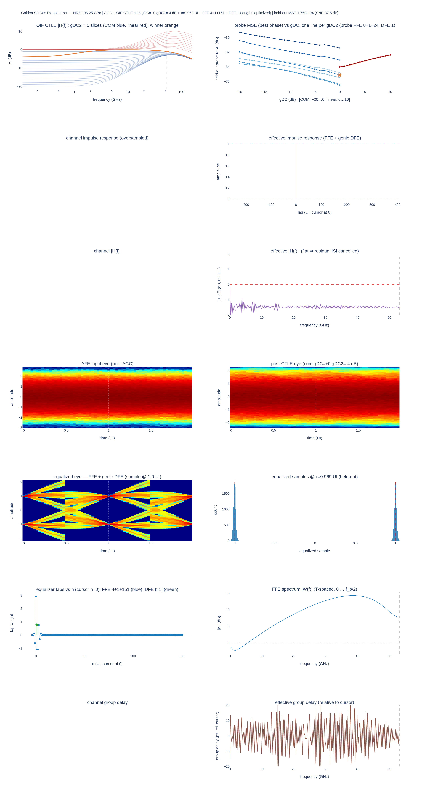

*Figure 8-1. Golden receiver dashboard on the synthetic NRZ 40 dB capture (`runs/golden_rx/oif_ctle/nrz_loss40`). Top row: the OIF CTLE curves with the winner `com gDC=0 gDC2=−4` in orange, and the probe MSE vs gDC per gDC2 (COM blue, linear red) — the COM curves fall monotonically toward gDC = 0 (−31.9 dB at gDC = −20 to −35.1 dB at gDC = 0 on the gDC2 = −4 line) and the linear family's HF boost costs MSE (−34.1 dB at gDC = 0 to −32.4 dB at gDC = 10). The effective response (right column, rows 2–3) is a unit cursor with a flat spectrum. The equalised eye and histogram show two clean levels; the FFE spectrum (row 6, right) rises from −1.8 dB at DC to a 14.3 dB maximum near 39 GHz and 7.8 dB at Nyquist. The channel panels on the left are empty because the run has no impulse response (capture path).*

## 9. Results on the ranjit_colossus capture

### 9.1 The capture

`temp/food/ranjit_colossus/after_rxterm.csv` is a Colossus transient at the receiver termination: 4,800,064 samples at 3.4 TS/s (294.1 fs period; 1.412 µs), which is 32 samples/UI at 106.25 GBd. `tx_symbols (1).csv` holds 150,000 PAM4 symbols as integer level indices 0 … 3 (natural order, not Gray; TX level \((\mathrm{idx} - 1.5)/1.5 \times 0.5\) V). The examination step (`after_rxterm_summary.json`, `after_rxterm_examine.png`) found a 64-sample zero preamble, a channel delay of about 180 UI (1694 ps), and, from a least-squares pulse fit at the peak phase:

| Quantity | Value |
|---|---|
| cursor amplitude | 64.07 mV per unit level |
| baud-spaced pulse relative to the cursor | \(h[-1] = +0.335\), \(h[+1] = +0.221\), \(h[-2] = -0.022\), \(h[+2] = -0.041\) |
| reflection | \(h[+9 .. +11] = +0.034, +0.016, +0.020\) |
| \(\sum |\mathrm{ISI}|\) relative to the cursor | 1.246 (the eye is closed at the input) |
| channel-only loss (\(|P(f)|\) minus the 1-UI sinc) | −4.05 dB at 26.6 GHz, −7.95 dB at 39.8 GHz, −14.92 dB at 53.125 GHz (Nyquist), −21.28 dB at 60 GHz, −42.47 dB at 70 GHz |
| DC gain vs the 0.5 V TX level | −12.19 dB |
| residual noise about the LS model | 2.82 mV rms, Gaussian, band-limited with the signal |
| pre-arrival noise (before the signal) | 1.64 mV rms |
| waveform peak-to-peak | 231.8 mV |

The examination found no jitter signature: the LS residual is Gaussian and its spectrum follows the signal's, which is what additive noise entering ahead of the channel looks like. The two `.npy` exports used by the optimiser are `tx_symbols_gray_bits.npy` (the level indices re-expressed as Gray bit pairs so that the tool's PAM4 map reproduces the sent levels) and `after_rxterm_wave.npy`.

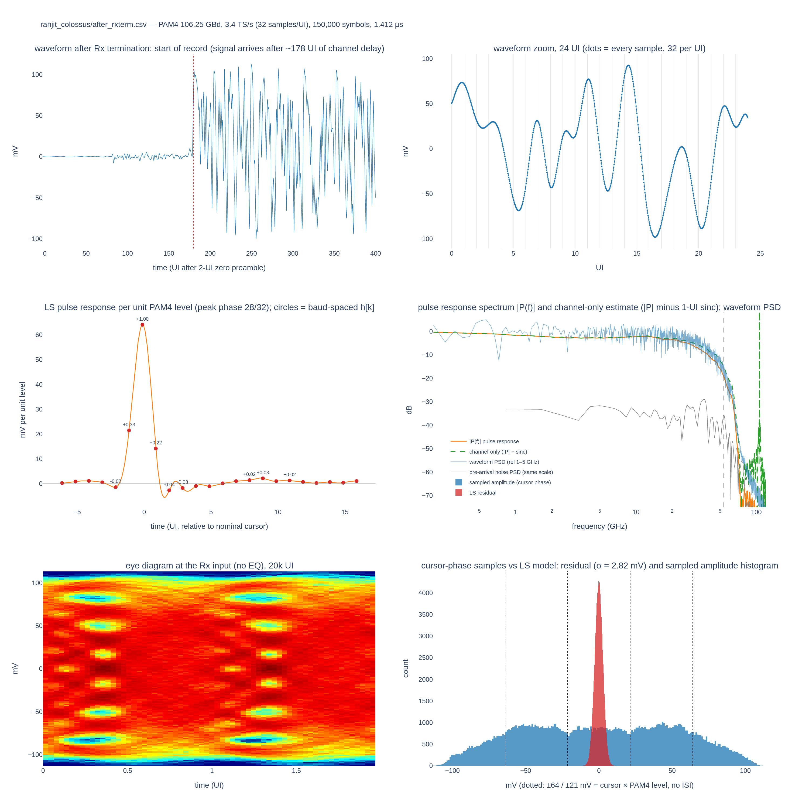

*Figure 9-1. `after_rxterm_examine.png`. Top: start of the record (signal arrives after about 178 UI) and a 24-UI zoom. Middle: the LS pulse response per unit PAM4 level with the baud-spaced samples (\(h[-1] = 0.33\), \(h[+1] = 0.22\), reflection near +9 … +11 UI), and the pulse spectrum against the channel-only estimate — a 60 GHz cliff, −15 dB at Nyquist. Bottom: the eye at the receiver input (closed) and the residual of the LS model (σ = 2.82 mV) over the sampled-amplitude histogram.*

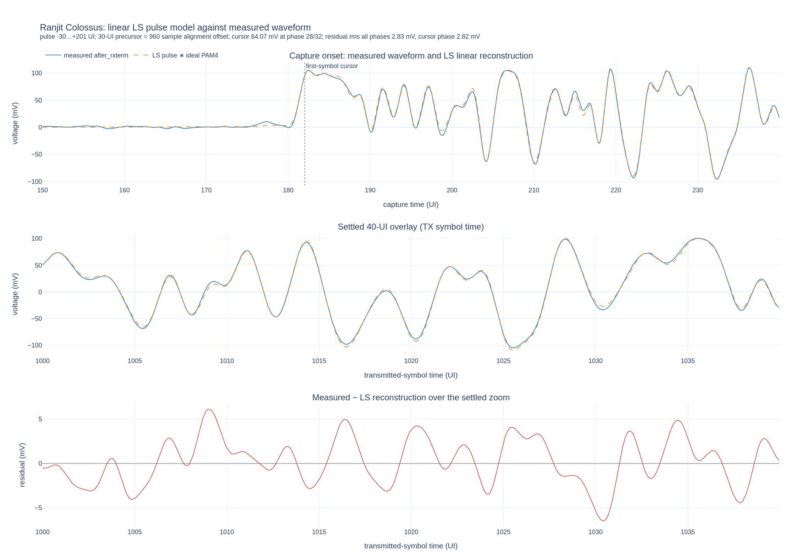

*Figure 9-1a. `after_rxterm_ls_match.png`. The \(-30 \ldots +200\) UI, 32-phase LS pulse response is convolved with impulses carrying the ideal transmitted PAM4 levels and overlaid on the measured waveform. Since the first pulse coefficient is 30 UI before its cursor, the convolution is advanced by \(30 \times 32 = 960\) samples (equivalently, the measured data is left-padded by 960 samples before comparison). The model reproduces both the signal arrival and a settled 40-UI segment. Its residual is 2.83 mV rms over every fully supported phase and 2.825 mV at the cursor phase, against 2.8245 mV in the original baud-phase check. The near-identical all-phase and cursor-phase residuals show that one linear time-invariant pulse explains the captured waveform to the measured noise floor; any nonlinearity is below that residual rather than visibly dominating the record.*

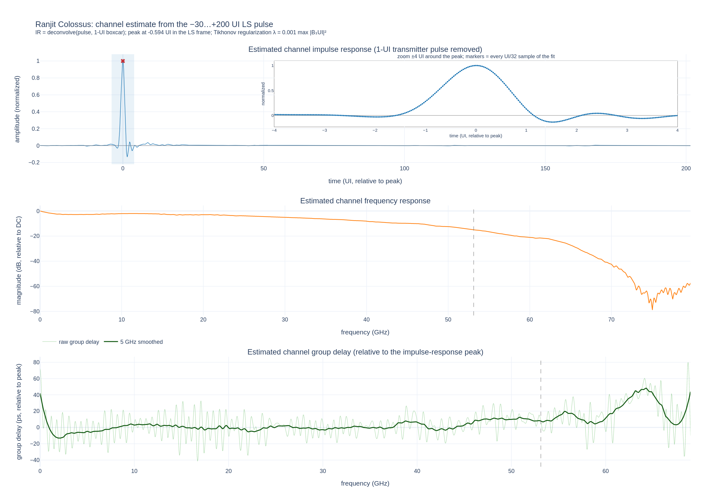

*Figure 9-1b. `after_rxterm_channel_estimate.png`. Channel characterisation from the same \(-30 \ldots +200\) UI LS fit. Top: the estimated channel impulse response after removing the ideal transmitter's 1-UI rectangular pulse; the full fitted time span is retained so that weak long-delayed energy is not hidden. At that span the 1.4-UI main lobe occupies about a dozen pixels, so the inset repeats the shaded ±4 UI region with every UI/32 coefficient of the fit marked: a smooth lobe with a −0.03 precursor dip at −2.0 UI, a −0.13 undershoot at +1.5 UI and a +0.04 lobe at +2.4 UI. The boxcar has spectral nulls at integer multiples of the baud rate, so its inverse uses a small Tikhonov term, \(\lambda = 10^{-3}\max |B_\mathrm{1UI}(f)|^2\), rather than amplifying those unobservable frequencies into a baud-periodic artifact. Middle: \(|P(f)/B_\mathrm{1UI}(f)|\), the channel-only frequency response relative to DC, including the measured \(-14.9\) dB at the 53.125 GHz Nyquist frequency. Bottom: raw and 5 GHz-smoothed channel group delay relative to the impulse-response peak. Group delay is shown only while the channel estimate remains within 40 dB of DC; beyond that, phase is noise dominated.*

### 9.2 Golden receiver, DFE detector

Both searches used the full 150,000 symbols (\(N_\mathrm{eval}\) = 59,819 held-out symbols), 32 phases, caps 16 / 40 growing to the 256 limit, `--length-tol 0.02`.

| | Uncapped (`runs/ranjit_colossus/golden_rx`) | Peaking ≤ 10 dB (`golden_rx_pk10`) |
|---|---|---|
| catalog searched | 202 codes | 119 codes (70 COM + 49 linear) |
| stage-1 probe winner → after rescoring | `com −20/−2` → `com gDC=−20 gDC2=−3` | `com −9/−3` → `com gDC=−8 gDC2=−4` |
| CTLE peaking · \|H\| DC · \|H\| Nyquist | 20.09 dB · −23.00 dB · −3.09 dB | 9.37 dB · −12.00 dB · −2.70 dB |
| sampling phase τ · symbol lag | 0.0000 UI · 182 | 0.0625 UI · 182 |
| FFE | 14 + 1 + 164 (179 taps) | 14 + 1 + 165 (180 taps) |
| \(c[-3 .. +4]\) | −0.311, +0.465, −0.996, **+2.012**, +1.595, +1.142, +1.070, +0.841 | −0.244, +0.429, −0.839, **+1.717**, +0.635, +0.180, +0.202, +0.086 |
| genie DFE \(b_1\) | +0.1447 | +0.1419 |
| saturated reference | 16 + 1 + 256, \(\mathrm{MSE}_\mathrm{sat}\) = 1.886e-3, \(\tau_\mathrm{len}\) = 3.77e-5 (2.0 %) | 16 + 1 + 256, \(\mathrm{MSE}_\mathrm{sat}\) = 1.888e-3, \(\tau_\mathrm{len}\) = 3.78e-5 (2.0 %) |
| floor at the 256 cap | **LIMIT-BOUND**, still falling 2.05 % per doubling | **LIMIT-BOUND**, still falling 2.03 % per doubling |
| taps removed by backward elimination | 94 | 93 |
| held-out MSE (train) | 1.924e-3 (1.917e-3) | 1.919e-3 (1.910e-3) |
| post-EQ SNR | 24.60 dB | 24.62 dB |
| slicer margin | 17.62 dB | 17.63 dB |
| estimated levels (sent −1, −1/3, +1/3, +1) | −0.9917, −0.3483, +0.3474, +0.9905 | −0.9917, −0.3483, +0.3474, +0.9905 |
| per-level σ | 0.0407, 0.0419, 0.0429, 0.0432 | 0.0406, 0.0418, 0.0428, 0.0432 |
| counted symbol errors | 0 / 59,819 | 0 / 59,819 |

The two configurations are the same receiver to within 0.02 dB; Section 3.4 explains why the capped one is the reported golden receiver (the uncapped FFE rebuilds 19 dB of low-frequency gain with a positive tail to \(c[+42]\)). Both are limit-bound: with 59,819 held-out symbols the 2 % tolerance is about 0.09 dB, and the saturated MSE was still improving by 2 % per doubling of the post cap at 256 taps, so the "shortest structure within τ of the floor" is also long. That is a property of the stop rule, not of the channel: the trade-off sweep in Section 9.4 shows that 14 + 1 + 24 is within 0.3 dB of the 256-tap floor.

The estimated levels show a level compression in the capture: the inner levels sit at ±0.348 instead of ±0.333 while the outer levels sit at ±0.991. Both a linear FFE and the completely different LR receiver of Section 10 (−0.995, −0.350, +0.349, +0.993) reproduce the same pattern, so it is in the waveform, not in the equaliser. In IEEE terms, with \(V_\mathrm{mid} = (V_0 + V_3)/2\), \(\mathrm{ES}_1 = (V_1 - V_\mathrm{mid})/(V_0 - V_\mathrm{mid}) = 0.351\), \(\mathrm{ES}_2 = 0.351\) and \(R_\mathrm{LM} = \min(3\mathrm{ES}_1, 3\mathrm{ES}_2, 2 - 3\mathrm{ES}_1, 2 - 3\mathrm{ES}_2) = 0.947\) — coincidentally the 0.95 that Table 33-1 assumes for COM. The per-level σ grows slightly from the −1 level (0.0406) to the +1 level (0.0432).

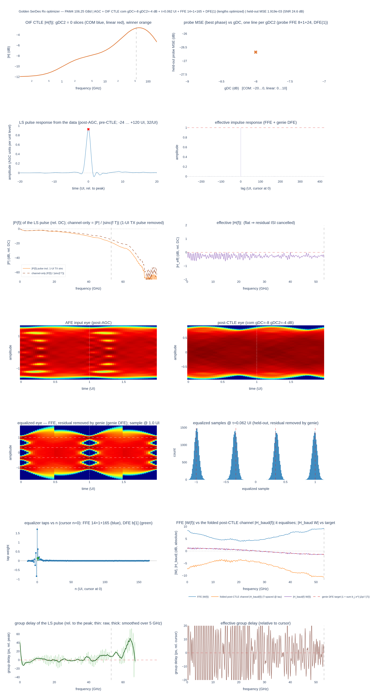

*Figure 9-2. `golden_rx_pk10/golden_rx_dashboard.png`. Row 1: the 119 CTLE codes under the 10 dB cap with the winner `com gDC=−8 gDC2=−4` in orange, and the probe MSE vs gDC per gDC2: the 70 COM codes span 0.6 dB (62 of them within 0.3 dB of the best) and the linear family (red) is 0.1–0.2 dB behind — the MSE surface is flat. Rows 2–3: the effective response from the capture path — unit cursor, residual within ±0.5 dB across the band. Row 4: the closed input eye and the post-CTLE eye. Row 5: the equalised eye with four open levels at the 1.0 UI sampling instant and the held-out histogram. Row 6: the 180 FFE taps and the FFE spectrum — 8.4 dB at DC, a 4.0 dB minimum near 22 GHz, 9.2 dB at Nyquist.*

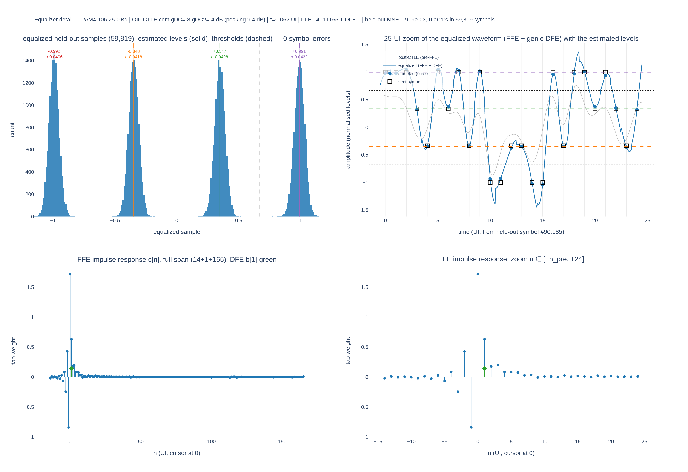

*Figure 9-3. `golden_rx_pk10/golden_rx_eq_detail.png`. Top left: the held-out histogram with the estimated levels (−0.992, −0.348, +0.347, +0.991; σ 0.041–0.043) and the midpoint thresholds, 0 errors in 59,819. Top right: 25 UI of the equalised waveform (FFE minus genie feedback) over the post-CTLE waveform, with the sampled cursors landing on the sent symbols. Bottom: the FFE impulse response over its full 14 + 1 + 165 span and zoomed to \([-14, +24]\); the DFE tap \(b_1 = +0.142\) is the green diamond at \(n = 1\). The pre-cursor side alternates (−0.839 at \(n = -1\), +0.429 at \(n = -2\)), the post-cursor side decays and changes sign by \(n = 9\).*

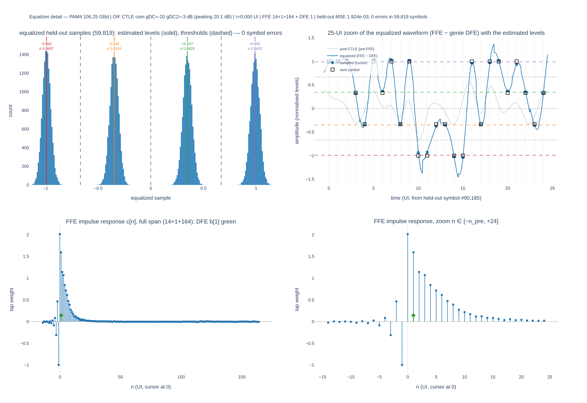

*Figure 9-4. `golden_rx/golden_rx_eq_detail.png`, the uncapped search (`com gDC=−20 gDC2=−3`, 20.1 dB peaking). The histogram and the zoom are indistinguishable from Figure 9-3 (MSE 1.924e-3 against 1.919e-3), but the FFE is not: \(c[0] = 2.01\) and a long positive post-cursor tail (1.60, 1.14, 1.07, 0.84, … positive through \(n = 42\)) restore the 20 dB of low-frequency gain the CTLE removed. This tap set motivated the 10 dB peaking cap.*

### 9.3 Golden receiver, MLSD detector

`runs/ranjit_colossus/golden_rx_pk10_mlsd` pins the capped winner (`--ctle-code com:-8:-4 --phase 0.0625`) and replaces the genie DFE by an MLSD of memory 1 (`--mlsd-memory 1`). Because the joint fit with one residual tap is the same fit, the FFE (14 + 1 + 165) and the residual \(b_1 = +0.1419\) are identical to the DFE run.

| Quantity | Value |
|---|---|
| σ at the FFE output (held-out, noise + unmodelled ISI) | 0.04380 |
| \(A_s\) | 1/3 |
| slicer / genie-DFE margin | 17.63 dB (Gaussian SER 2.0e-14; counted 0 / 59,819) |
| MLSD: \(d_\mathrm{eff,min}\) · attaining event · events enumerated | 1.0098 · \([1]\) · 8,403 events of length ≤ 5 |
| MLSD margin (gain over the slicer) | 17.71 dB (+0.08 dB), Gaussian SER 1.1e-14 |
| Viterbi check (memory-1 trellis on the FFE output with the residual left in) | 0 errors in 59,818 |

With \(b_1 = 0.14\) the single-symbol error is the closest event and the ideal gain would be \(10\log_{10}(1 + b_1^2) = 0.09\) dB; the measured 0.08 dB is that number less the effect of the slight positive correlation of the residual. The MLSD buys nothing here because the MMSE FFE has already flattened the response and the noise is white enough.

### 9.4 FFE length against detector memory

The same run swept the FFE post length (0 … 256) against detector memory 0 … 3 at the pinned (CTLE, τ) with \(n_\mathrm{pre} = 14\) (`--ffe-mlsd-tradeoff --tradeoff-max-memory 3`; 72 joint fits). Margins in dB; \(L = 0\) is an FFE followed by a slicer, \(L \ge 1\) is the MLSD bound of that memory (the genie-DFE margin of the same fit is in the JSON and the figure):

| post taps → | 0 | 1 | 2 | 3 | 4 | 6 | 8 | 12 | 16 | 24 | 32 | 64 | 165 | 256 |
|---|---:|---:|---:|---:|---:|---:|---:|---:|---:|---:|---:|---:|---:|---:|
| FFE taps | 15 | 16 | 17 | 18 | 19 | 21 | 23 | 27 | 31 | 39 | 47 | 79 | 180 | 271 |
| \(L = 0\) slicer | 5.63 | 9.55 | 10.87 | 13.70 | 14.29 | 16.37 | 16.78 | 16.84 | 17.06 | 17.30 | 17.35 | 17.41 | 17.54 | 17.59 |
| \(L = 1\) (4 states) | 12.28 | 13.01 | 13.19 | 14.90 | 14.90 | 16.36 | 16.84 | 16.88 | 17.13 | 17.41 | 17.48 | 17.56 | 17.71 | 17.79 |
| \(L = 2\) (16 states) | 13.13 | 13.03 | 15.89 | 16.04 | 16.07 | 16.66 | 16.92 | 16.97 | 17.18 | 17.42 | 17.49 | 17.57 | 17.72 | 17.79 |
| \(L = 3\) (64 states) | 15.56 | 15.70 | 16.12 | 16.16 | 16.31 | 16.73 | 16.93 | 16.98 | 17.18 | 17.42 | 17.49 | 17.57 | 17.72 | 17.79 |
| \(b_1\) at \(L = 1\) | −0.209 | −0.488 | −0.573 | −0.364 | −0.362 | −0.054 | +0.091 | +0.075 | +0.097 | +0.122 | +0.131 | +0.137 | +0.142 | +0.153 |

Reading the table:

- Detector memory pays only when the FFE is starved. With no post taps a memory-3 detector recovers 10 dB over a slicer (15.6 against 5.6 dB); with 3 post taps the gain is 2.5 dB; with 4 post taps 2.0 dB; from 6 post taps on it is below 0.4 dB and from 8 post taps on all four detectors are within 0.15 dB of each other (16.78–16.93 dB) and stay so to the end of the ladder (17.59–17.79 dB at 256).
- The starved-FFE MLSD residuals are *negative* (\(b_1 = -0.2 \ldots -0.57\)): the fit leaves a negative post-cursor for the detector because the FFE has spent its few taps elsewhere. At \(L = 1\) with 1–4 post taps the MLSD bound is even slightly *below* the genie-DFE margin of the same fit (e.g. 13.01 against 13.31 dB at one post tap; \(d_\mathrm{eff} = 0.97\)), because the residual is correlated with the remaining ISI.
- The dominant ISI in this capture is the **pre-cursor** \(h[-1] = +0.33\), and a post-cursor sequence detector cannot touch it; the FFE's 14 pre-cursor taps do that work in every row, which is why all curves converge once a handful of post taps are present.
- A practical design point is 14 + 1 + 24 with a slicer at 17.30 dB (17.41 dB with a memory-1 MLSD): 0.3 dB below the 256-tap floor of the same detector, with 39 taps instead of 271.

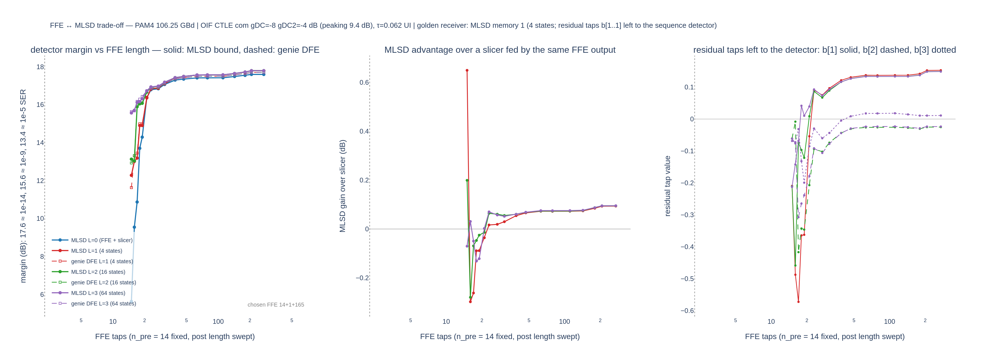

*Figure 9-5. `golden_rx_pk10_mlsd/golden_rx_ffe_mlsd_tradeoff.png`. Left: detector margin vs FFE length (log axis) for memory 0–3, solid MLSD bound, dashed genie DFE of the same fit; the curves separate only below about 20 taps. Middle: the MLSD gain over a slicer fed by the same FFE output — 0.65 dB at 15 taps for \(L = 1\), negative for 16–21 taps (the fit leaves a negative residual), then +0.02 … +0.09 dB from 23 taps on. Right: the residual taps left to the detector; \(b_1\) settles at +0.14 once the FFE is long enough.*

**Caveats.** The FFE is MMSE-designed with a free residual (the 178A form), not the partial response an MLSD would prefer; a detector-aware FFE design (e.g. constraining the residual to a chosen partial response) could move the short-FFE rows. And the Gaussian bound is optimistic when the residual at the FFE output is dominated by data-dependent ISI rather than noise; in the starved rows the Viterbi count, not the bound, is the number to trust.

## 10. The OIF CEI-224G-LR Table 33-1 receiver

`examples/oif_lr_rx_compare.py` builds the CEI-224G-LR reference receiver from Table 33-1 of OIF2023.235.13, fits its coefficients the way IEEE P802.3dj D1.3 178A.1.8.1 does — but in the data domain, on the captured waveform — and compares it on the same held-out symbols with the golden receivers. Everything that is not the LR receiver itself (AGC, alignment, least squares, MLSD bound, Viterbi, level statistics) is imported from `golden_rx_optimizer.py`.

### 10.1 Receiver

| Block | Table 33-1 | Implementation |
|---|---|---|
| receiver noise | \(\eta_0 = 7.5 \times 10^{-9}\) V²/GHz one-sided | white Gaussian at 3.57 mV per sample over 0 … \(f_s/2\) = 1.7 THz, giving 0.68 mV rms in band after the receiver filter |
| receiver bandwidth | \(f_r = 0.55 f_b\) | 4th-order Butterworth low-pass, \(f_r\) = 58.44 GHz (bilinear SOS at \(f_s\)) |
| AGC | — | oracle block mode, the golden receiver's configuration (Section 2.1), after the noise and the Butterworth, before the CTLE; +23.24 dB on this capture |
| CTLE | COM filter, gDC −20 … 0, gDC2 −6 … 0 dB | full 147-code catalog of Section 3.1 |
| sampler | \(t_s\) chosen to minimise the MSE (178A.1.8) | phase τ chosen to minimise the constrained MSE — the CDR is faked by that choice, the same convention as the golden receiver |
| ADC | \(N_{qb} = 6\), \(P_{qc} = 10^{-7}\) | mid-rise uniform quantiser; full scale from the \((1 - P_{qc})\) quantile of \(|x|\); on this capture LSB = 0.0527, σ_q = 0.0152 (normalised units), clip fraction 6.7e-6 |
| FFE | \(N_\mathrm{FFE,pre} = 6\), \(N_\mathrm{FFE,post} = 8\), \(N_{bg} = 2\) floating groups of \(N_{bf} = 4\), span \(N_f = 80\), tail start \(N_{ts} = 9\) | 6 + 1 + 8 fixed taps plus two non-overlapping 4-tap windows in post lags 9 … 80 |
| FFE limits | \(b_\mathrm{min}(0) = 0.7\), \(b_\mathrm{max} = 0.7\) for \(n = -1 \ldots -6\), \(1 \ldots 8\), \(B_\mathrm{maxf} = 0.05\), \(t_\mathrm{max} = 0.02\) | applied in the \(\sum|w| = 1\) domain (Section 11) |
| DFE / MLSD | \(N_\mathrm{DFE} = 1\), \(0 \le b(1) \le 0.85\), MLSD = Yes | one feedback tap; MLSD bound and Viterbi over \([1, b(1)]\) |

Table 33-1 says nothing about gain control, so the LR script imports the golden receiver's `AnalogAgc` and constructs it with the identical arguments (`target_amplitude = √mean(a²)`, `detect="rms"`, `mode="block"`, `remove_dc=True`, `dc_mode="block"`) at the identical point in the chain: on the output of `rx_front_end`, before any CTLE code is applied. On the ranjit capture its gain is +23.24 dB (`agc_gain_db` in `oif_lr_rx_result.json`; +26.04 dB in `oif_lr_rx_txffe`, where the emulated TX FFE lowers the waveform rms), the same value the front-ended golden runs report, so the LR and golden receivers of Sections 10.3 and 10.4 share the level normalisation and their taps, ADC full scales and histograms are in the same units.

### 10.2 Coefficient procedure (178A.1.8.1 in the data domain)

1. Joint MMSE of the 15 fixed taps and \(b\) on the training symbols.
2. Residual post-cursor ISI of that solution at lags 9 … 80 (\(E[e\,a[k-l]]/E[a^2]\)); the two non-overlapping 4-tap windows with the most residual-ISI energy become the floating groups (178A.1.8.1: "chosen to minimise the mean-squared error").
3. Joint MMSE of the 23 taps and \(b\); the cursor gain is later normalised to 1 (the 178A-26 constraint).
4. Clip \(b\) to \([b_\mathrm{min}, b_\mathrm{max}]\) (178A-27); if it changed, re-solve the FFE with \(b\) fixed (178A-28).
5. FFE limits (178A-29 as the OIF table rows read): normalise to \(\sum|w| = 1\); if the main tap is below \(b_\mathrm{min}(0) = 0.7\), shrink all other taps by a common factor so it lands exactly on 0.7 and renormalise (a uniform shrink preserves the tap shape, unlike per-tap clipping, and is the reading `analysis/com_178a.py` uses); clip the fixed taps to \(|w| \le 0.7\) and the floating taps to \(|w| \le 0.05\); scale the floating tail so its RSS is \(\le 0.02\).
6. Renormalise the equalised cursor to 1, recompute \(b(1)\) as the equalised first post-cursor, clip again.
7. Evaluate on the frozen index set; the held-out MSE is the ranking metric.

**Search (178A.1.8).** Every COM code × 8 coarse phases × cursor lag ±1 around the cross-correlation peak, running the full constrained procedure at each point (the cursor position matters for a 6-pre-tap FFE whose main tap must carry 70 % of the weight); then the fine 32-phase grid on the 5 best codes.

**TX FFE.** Table 33-1 presumes a transmitter equaliser (\(c(-2) \in [0, 0.16]\), \(c(-1) \in [-0.4, 0]\), \(c(1) \in [-0.2, 0]\), \(c(0) \ge 0.54\), \(\sum|c| = 1\)) which the capture does not have — it is raw PAM4 symbols. `--tx-ffe c(-2),c(-1),c(0),c(1)` emulates one by T-spaced filtering of the received waveform. The channel is linear so the filter commutes with it, but the capture's own noise is filtered too, which makes the emulation slightly optimistic.

### 10.3 Results on the ranjit capture

All four runs use the same capture, AGC (+23.24 dB with the front end; +26.04 dB with the TX FFE), front end (seed 11) and held-out split (59,894 symbols).

| Run | CTLE (peaking) | τ (UI) | main tap (cursor units · L1-normalised, i.e. share of Σ\|w\|) | \(b(1)\) | limits hit | held-out MSE | SNR | slicer / MLSD margin | errors slicer / Viterbi |
|---|---|---:|---|---:|---|---:|---:|---|---|
| as specified (`oif_lr_rx`) | `com gDC=0 gDC2=−1` (1.0 dB) | 0.469 | 1.291 · **0.700** | **0.797** | main-tap min, DFE clipped | 1.226e-2 | 16.56 dB | 9.57 / 11.66 dB | 63 / 62 in 59,894 |
| peaking cap 10 dB (`oif_lr_rx_pk10`) | identical | identical | identical | identical | identical | identical | identical | identical | identical |
| without \(b_\mathrm{min}(0)\) (`oif_lr_rx_nomainmin`) | `com gDC=−7 gDC2=−2` (6.4 dB) | 0.844 | 1.717 · 0.366 | 0.255 | none | 2.744e-3 | 23.06 dB | 16.07 / 16.32 dB | 0 / 0 |
| emulated TX FFE \(c(-1) = -0.20\), \(c(0) = 0.80\), CTLE pinned to `0:−1` (`oif_lr_rx_txffe`) | `com gDC=0 gDC2=−1` | 0.594 | 1.262 · 0.709 | 0.797 | main-tap min, DFE clipped, floating RSS | 5.814e-3 | 19.80 dB | 12.81 / 14.16 dB | 0 / 0 |
| golden, capped, DFE (`golden_rx_pk10`) | `com gDC=−8 gDC2=−4` (9.4 dB) | 0.0625 | 1.717 · 0.327 | 0.142 | — | 1.919e-3 | 24.62 dB | 17.63 / — | 0 |
| golden, capped, MLSD(1) (`golden_rx_pk10_mlsd`) | same | same | same | 0.142 | — | 1.919e-3 | 24.62 dB | 17.63 / 17.71 dB | 0 / 0 in 59,818 |

**As specified.** The main-tap rule binds (main = 0.700 of \(\sum|w|\) exactly) and \(b(1)\) = 0.797 sits near its 0.85 limit after the FFE limits (the unconstrained feedback tap fell outside \([0, 0.85]\) and was clipped before them, `dfe_clipped`). The search chose the flattest CTLE codes: the five finalists were `0/0`, `0/−1`, `0/−3`, `0/−2`, `−1/0`, all with the same two limits hit and constrained MSEs within 10 %. The receiver cannot cancel the 0.33 pre-cursor with an FFE whose non-main taps may only carry 30 % of the weight, so the optimiser moves the sampling instant early instead: re-sampling the capture through the LR front end (Butterworth + `com 0/−1`, a direct check made for this document, not stored in the result files) shows the post-front-end pulse peaking at \(t = 182.81\) UI while the receiver samples at 182.47 UI, 0.34 UI ahead of the peak, where the sampled pulse is \([h_{-1}, h_0, h_{+1}] = [0.17, 1, 0.70]\) — a \([1, 0.7]\) partial response that the DFE then absorbs as \(b(1) = 0.80\). The MLSD bound gives it 2.1 dB over the slicer (\(d_\mathrm{eff} = 1.27\)), but the counted errors — 63 slicer, 62 Viterbi in 59,894 — say the residual is ISI-dominated and the Gaussian bound is optimistic here. The per-level σ is 0.110, 2.5 times the golden receiver's.

**Peaking cap.** A 10 dB peaking cap changes nothing: the as-specified winner has 1.0 dB of peaking.

**Without the main-tap rule.** Dropping \(b_\mathrm{min}(0)\) (`--no-main-tap-min`) moves the receiver to `com gDC=−7 gDC2=−2`, τ = 0.844 (0.22 UI *after* the post-front-end peak, like the golden receiver), a large pre-cursor tap \(c[-1] = -0.870\) in cursor units, \(b(1)\) = 0.255, no limit hit, 0 errors, and a margin of 16.07 dB — 1.56 dB behind the 180-tap golden receiver with 23 taps. The MSE surface is flat around the winner (the five finalists `−5/−2`, `−4/−2`, `−7/−2`, `−4/−3`, `−6/−2` are within 0.3 %).

**Emulated TX FFE.** With \(c(-1) = -0.20\), \(c(0) = 0.80\) applied to the waveform and the CTLE pinned to the as-specified winner, the pre-cursor the receiver sees is small enough that the FFE's \(c[-1]\) becomes −0.008; the main-tap rule still binds (0.709 after the floating-tail RSS limit), \(b(1)\) = 0.797, and the receiver reaches 19.80 dB SNR, margins 12.81 / 14.16 dB, 0 errors — 3.5 dB short of the golden MLSD margin. A 3 × 3 grid \(c(-1) \in \{-0.2, -0.3, -0.4\} \times c(1) \in \{0, -0.1, -0.2\}\) at that CTLE (development log; only the best cell was kept as `oif_lr_rx_txffe`) showed that stronger pre-emphasis lowers \(c(0)\) and hurts, and that settings with \(c(0) < 0.54\) are illegal and collapse.

**Comparison.** The LR receiver as specified is 8.1 dB behind the golden receiver of Section 9 in SNR (16.56 against 24.62 dB) and in slicer margin (9.57 against 17.63 dB), 6.1 dB behind in MLSD margin (11.66 against 17.71 dB). Almost all of it is the main-tap rule: removing that one row recovers 6.5 dB, leaving the 23-tap structure 1.5 dB behind the 180-tap golden receiver. That last number is not like for like: the golden receiver of Section 9 has no receiver noise, no bandwidth limit and no ADC, while the LR receiver carries all three. Section 10.4 repeats the golden search behind the same front end and finds that the front end accounts for 1.0 dB of the 1.5 dB.

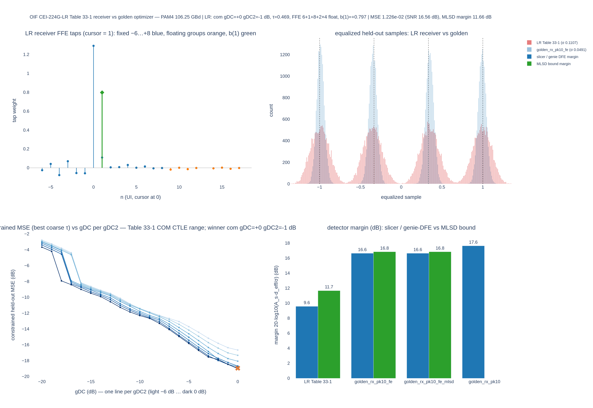

*Figure 10-1. `oif_lr_rx/oif_lr_rx_compare.png`, the Table 33-1 receiver as specified (figure refreshed with the Section 10.4 golden rows). Top left: the FFE taps in cursor units — the main tap at 1.29 dwarfs everything else (the non-main taps may hold only 30 % of \(\sum|w|\)), and the DFE tap \(b(1) = 0.80\) (green) carries the post-cursor. Top right: the held-out histograms, LR receiver (red, σ 0.111) against the golden receiver behind the same front end (`golden_rx_pk10_fe`, blue, σ 0.049). Bottom left: the constrained MSE vs gDC per gDC2 falls monotonically toward gDC = 0 — with the main-tap rule the receiver wants no CTLE boost. Bottom right: margins, 9.6 / 11.7 dB for the LR receiver against 16.6 / 16.8 dB for the two golden runs with the front end and 17.6 dB for the golden receiver without it.*

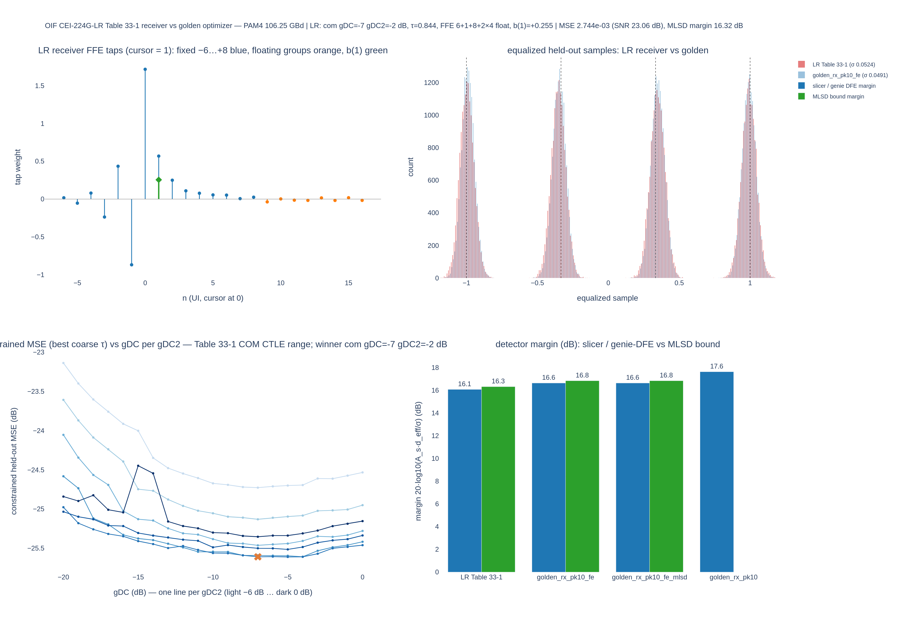

*Figure 10-2. `oif_lr_rx_nomainmin/oif_lr_rx_compare.png`, the same receiver with \(b_\mathrm{min}(0)\) removed (refreshed likewise). The FFE now has \(c[-1] = -0.87\) and \(c[-2] = +0.43\) in cursor units and \(b(1) = 0.255\); the histograms nearly coincide with the front-ended golden receiver's (σ 0.052 against 0.049); the constrained MSE surface has become a shallow bowl with its minimum at gDC ≈ −7; the margins are 16.1 / 16.3 dB against 16.6 / 16.8 dB (golden, same front end) and 17.6 dB (golden, no front end).*

### 10.4 Golden receiver with the Table 33-1 front end

The residual 1.5 dB of Section 10.3 compared a receiver that adds noise, limits its bandwidth and quantises with one that does none of those things. To separate the front end from the equaliser structure, the golden search was repeated behind the LR receiver's front end: `--front-end oif-lr` puts the η0 = 7.5e-9 V²/GHz noise and the 4th-order Butterworth at \(f_r = 0.55 f_b\) ahead of the AGC and the 6-bit ADC (\(P_{qc} = 10^{-7}\)) after the sampler, in every search and fitting path, through the same `rx_front_end` / `quantize` functions the LR script imports. Both scripts use noise seed 11 on the same 4,800,064-sample record, so the noise realisation is identical (the LR script's stored in-band noise rms, 0.6788 mV, is reproduced to the last digit), and the AGC gain is the same +23.24 dB. Everything else — capture, 10 dB peaking cap, both CTLE families (119 codes), 32 phases, caps 16 / 40 growing to 256, `--length-tol 0.02`, the 59,819 held-out symbols — is as in Section 9.2.

**Result (`runs/ranjit_colossus/golden_rx_pk10_fe`, DFE detector; `golden_rx_pk10_fe_mlsd`, MLSD memory 1 pinned to the same code and phase).**

| | Golden, no front end (`golden_rx_pk10`, Section 9.2) | Golden behind the Table 33-1 front end (`golden_rx_pk10_fe`) |
|---|---|---|
| front end | none | η0 noise (3.57 mV white per sample over 0 … 1.7 THz, 0.68 mV rms in band after the filter), Butterworth-4 \(f_r\) = 58.44 GHz, ADC 6 bit |
| ADC at the winning phase | — | full scale 1.911, LSB 0.0597, σ_q = 0.0172 (normalised units), clip fraction 6.7e-6 (one sample in 150,000) |
| AGC gain | +23.21 dB | +23.24 dB |
| stage-1 probe winner → after rescoring | `com −9/−3` → `com gDC=−8 gDC2=−4` | `com −6/−3` → **`linear gDC=+3 gDC2=0`** |
| CTLE peaking · \|H\| DC · \|H\| Nyquist | 9.37 dB · −12.00 dB · −2.70 dB | 3.47 dB · 0.00 dB · +3.34 dB (zeros 2.66 / 26.28 GHz, poles 2.66 / 56.40 / 106.25 GHz) |
| sampling phase τ · symbol lag | 0.0625 UI · 182 | 0.9375 UI · 182 |
| FFE | 14 + 1 + 165 (180 taps) | 14 + 1 + 164 (179 taps) |
| \(c[-3 .. +4]\) | −0.244, +0.429, −0.839, **+1.717**, +0.635, +0.180, +0.202, +0.086 | −0.154, +0.260, −0.461, **+0.776**, +0.321, +0.046, +0.038, +0.011 |
| FFE \|W\| DC / Nyquist · CTLE·FFE DC / Nyquist | +8.37 / +9.15 dB · −3.63 / +6.45 dB | −3.02 / +3.76 dB · −3.02 / +7.09 dB |
| \(\sum w^2 / w_0^2\) · \(\sum\lvert w\rvert\) | +1.75 dB · 5.25 | +2.30 dB · 2.53 |
| genie DFE / MLSD residual \(b_1\) | +0.1419 | +0.2368 |
| saturated reference · \(\tau_\mathrm{len}\) | 16 + 1 + 256, 1.888e-3 · 3.78e-5 (2.0 %) | 16 + 1 + 256, 2.365e-3 · 4.73e-5 (2.0 %) |
| floor at the 256 cap · taps removed | LIMIT-BOUND, 2.03 %/doubling · 93 | LIMIT-BOUND, 1.90 %/doubling · 94 |
| held-out MSE (train) | 1.919e-3 (1.910e-3) | 2.412e-3 (2.406e-3) |
| post-EQ SNR | 24.62 dB | 23.62 dB |
| estimated levels · per-level σ | −0.9917, −0.3483, +0.3474, +0.9905 · 0.0406 … 0.0432 | −0.9910, −0.3477, +0.3472, +0.9894 · 0.0462, 0.0474, 0.0482, 0.0485 |
| σ at the FFE output · slicer margin · Gaussian SER | 0.0438 · 17.63 dB · 2.0e-14 | 0.0491 · 16.63 dB · 8.5e-12 |
| MLSD bound: \(d_\mathrm{eff,min}\) · margin (gain) · Gaussian SER | 1.0098 · 17.71 dB (+0.08 dB) · 1.1e-14 | 1.0235 · 16.84 dB (+0.20 dB) · 2.8e-12 |
| counted errors: slicer · Viterbi | 0 / 59,819 · 0 / 59,818 | 0 / 59,819 · 0 / 59,818 |

**What the front end did to the golden receiver.** The cost is 0.99 dB: the held-out MSE rises from 1.919e-3 to 2.412e-3, the SNR falls from 24.62 to 23.62 dB and the slicer margin from 17.63 to 16.63 dB; the MLSD bound falls 0.87 dB (17.71 → 16.84 dB) because the larger residual \(b_1\) = 0.24 gives the sequence detector a little more to work with (+0.20 dB instead of +0.08 dB over the slicer). The extra 4.93e-4 of MSE is accounted for by passing each impairment alone through the fixed winning receiver (Butterworth → AGC gain → CTLE → sampler → FFE; computed for this document, Appendix B): the ADC quantisation error, σ_q = 0.0172 at the ADC output and 0.0174 at the FFE output (\(\sum w^2\) = 1.02), contributes 3.03e-4 (61 %); the η0 noise, 0.68 mV rms at the waveform → 0.0124 rms at the sampler after the +23.24 dB AGC → 0.0134 rms at the FFE output, contributes 1.80e-4 (37 %); the remaining 1.0e-5 (2 %) is what the 0.55 \(f_b\) bandwidth limit (−1.66 dB at Nyquist, −3.0 dB at \(f_r\)) and the different CTLE leave behind. The 6-bit ADC, not the receiver noise, is the larger of the two Table 33-1 impairments on this capture.

The CTLE choice changed family. Without the front end the capture's own noise is band-limited with the signal and the search sits on a flat 20 dB-wide optimum whose capped corner is a COM code with a 12 dB DC cut that the FFE restores (\(c[0]\) = 1.72, \(|W|\) = +8.4 dB at DC, Section 3.4). With the front end the noise added after the channel is white up to 58 GHz, and the quantisation noise at the FFE output scales with \(\sum w^2\): the search now prefers the code that needs the least FFE gain, the linear reference receiver's `gDC = +3, gDC2 = 0` — 0 dB at DC, +3.3 dB at Nyquist — with an FFE that *attenuates* DC by 3 dB and lifts Nyquist by 3.8 dB (\(\sum w^2\) = 1.02 against 4.41 for the previous winner). The cascade CTLE·FFE is −3.0 dB at DC and +7.1 dB at Nyquist against −3.6 / +6.5 dB before: the extra 0.6 dB of high-frequency gain buys back part of the Butterworth's −1.7 dB at Nyquist. The optimum is still flat: in the stage-1 grid all 49 linear codes lie within 0.19 dB of each other and 53 of the 70 COM codes within 0.3 dB of the best COM code (`com −6/−3`, which the probe ranked 0.11 dB *ahead* of the linear winner); at the chosen lengths in stage 3 the linear winner beats the best COM neighbour (`com −7/−2`, `−6/−2`, `−5/−2`) by 0.04 dB. The CTLE family is therefore worth a few hundredths of a dB here; the front end is worth 1 dB.

The sampling phase moved from 0.0625 to 0.9375 UI, +0.875 UI at the same symbol lag. Most of that is the Butterworth's group delay — 2.613 / (2π \(f_r\)) = 7.1 ps = 0.756 UI at low frequency (0.84 UI at \(f_b/4\), 1.13 UI at Nyquist; computed for this document) — so relative to the delayed pulse the cursor moved by about +0.1 UI. The equaliser also changed shape: with more noise the MMSE solution leaves more of the first post-cursor to the genie DFE (\(b_1\) = 0.24 against 0.14), and the taps scale down with the cursor (\(c[-1]\) = −0.46 against −0.84) while the pre-cursor tap grows relative to it (\(c[-1]/c[0]\) from 0.49 to 0.59) because the CTLE now supplies part of the high-frequency boost in place of the FFE's DC restoration. The length search is limit-bound exactly as before (the floor still falls 1.9 % per doubling at 256 post taps), and the level compression of the capture is unchanged (inner levels at ±0.348).

**FFE length against detector memory behind the front end** (`golden_rx_pk10_fe_mlsd`, `--ffe-mlsd-tradeoff --tradeoff-max-memory 3`, 72 joint fits at `linear +3/0`, τ = 0.9375, \(n_\mathrm{pre}\) = 14; margins in dB, same layout as Section 9.4):

| post taps → | 0 | 1 | 2 | 3 | 4 | 6 | 8 | 12 | 16 | 24 | 32 | 64 | 164 | 256 |
|---|---:|---:|---:|---:|---:|---:|---:|---:|---:|---:|---:|---:|---:|---:|
| FFE taps | 15 | 16 | 17 | 18 | 19 | 21 | 23 | 27 | 31 | 39 | 47 | 79 | 179 | 271 |
| \(L = 0\) slicer | 9.41 | 13.31 | 13.88 | 14.54 | 14.58 | 14.75 | 14.85 | 15.71 | 15.96 | 16.16 | 16.23 | 16.31 | 16.39 | 16.45 |
| \(L = 1\) (4 states) | 13.89 | 13.86 | 13.96 | 14.58 | 14.60 | 14.76 | 14.85 | 15.83 | 16.16 | 16.47 | 16.61 | 16.72 | 16.84 | 16.94 |
| \(L = 2\) (16 states) | 14.20 | 14.22 | 15.33 | 15.33 | 15.33 | 15.39 | 15.43 | 16.10 | 16.31 | 16.54 | 16.64 | 16.74 | 16.86 | 16.96 |
| \(L = 3\) (64 states) | 14.67 | 14.83 | 15.33 | 15.36 | 15.41 | 15.44 | 15.50 | 16.13 | 16.32 | 16.54 | 16.64 | 16.75 | 16.86 | 16.96 |
| \(b_1\) at \(L = 1\) | −0.122 | −0.256 | −0.194 | −0.079 | −0.054 | −0.028 | −0.022 | +0.128 | +0.151 | +0.202 | +0.221 | +0.232 | +0.237 | +0.248 |

From 12 post taps on every row sits 0.8–1.2 dB below its Section 9.4 counterpart (about 1.1 dB for the slicer, 0.85 dB for the sequence detectors, which gain a little more from the larger residual), and the shape is the same — detector memory pays only while the FFE is starved (5.3 dB for \(L = 3\) with no post taps, 0.4–0.5 dB from 12 post taps on), and the MLSD gain grows slightly with the larger residual (+0.20 dB at 164 post taps for \(L = 1\), +0.08 dB before). The best margin in the sweep is 16.96 dB (\(L \ge 2\), 14 + 1 + 192); the shortest FFE within 0.5 dB of it is 14 + 1 + 24 for every \(L \ge 1\) (16.47 dB at \(L = 1\)), and 14 + 1 + 12 is within 1 dB for \(L \ge 2\).

**Like for like against the LR receiver.** Same capture, same front end and noise realisation, same held-out symbols (59,819 for the golden runs, 59,894 for the LR runs — the LR equaliser's edge trim differs by 75 symbols):

| Receiver | front end | CTLE (peaking) | τ (UI) | FFE taps | \(b(1)\) | held-out MSE | SNR | slicer margin | MLSD margin | errors slicer / Viterbi |
|---|---|---|---:|---:|---:|---:|---:|---:|---:|---|
| LR Table 33-1 as specified (`oif_lr_rx`) | yes | `com 0/−1` (1.0 dB) | 0.4688 | 23 | 0.797 | 1.226e-2 | 16.56 dB | 9.57 dB | 11.66 dB | 63 / 62 |
| LR without \(b_\mathrm{min}(0)\) (`oif_lr_rx_nomainmin`) | yes | `com −7/−2` (6.4 dB) | 0.8438 | 23 | 0.255 | 2.744e-3 | 23.06 dB | 16.07 dB | 16.32 dB | 0 / 0 |
| golden, DFE (`golden_rx_pk10_fe`) | yes | `linear +3/0` (3.5 dB) | 0.9375 | 179 | 0.237 | 2.412e-3 | 23.62 dB | 16.63 dB | 16.84 dB (bound) | 0 / — |
| golden, MLSD(1) (`golden_rx_pk10_fe_mlsd`) | yes | same | same | 179 | 0.237 | 2.412e-3 | 23.62 dB | 16.63 dB | 16.84 dB | 0 / 0 |
| golden, no front end, reference (`golden_rx_pk10`; MLSD margin and Viterbi count from `golden_rx_pk10_mlsd`) | no | `com −8/−4` (9.4 dB) | 0.0625 | 180 | 0.142 | 1.919e-3 | 24.62 dB | 17.63 dB | 17.71 dB | 0 / 0 |

Against the like-for-like golden receiver the LR receiver as specified is 7.1 dB behind in SNR and slicer margin (16.56 against 23.62 dB; 9.57 against 16.63 dB) and 5.2 dB behind in MLSD margin (11.66 against 16.84 dB). Without the main-tap rule the gap is **0.56 dB** in SNR and slicer margin (23.06 against 23.62 dB; 16.07 against 16.63 dB) and **0.52 dB** in MLSD margin (16.32 against 16.84 dB). Of the 1.56 dB residual gap reported in Section 10.3 (17.63 against 16.07 dB), the front end therefore explains 1.00 dB — 64 % — and the Table 33-1 equaliser structure (23 taps with 6 pre-cursor taps and two floating groups, COM-only CTLE range, N_DFE = 1) costs the remaining 0.56 dB against a 179-tap FFE that may also use the linear family; in MLSD margin the split is 0.87 dB of 1.39 dB to the front end and 0.52 dB to the structure. The two like-for-like receivers also agree on the sampling instant to within 0.1 UI (τ = 0.9375 and 0.8438 at the same symbol lag), and their per-level σ differ by 5 % (0.049 against 0.052). The 23-tap structure is close to the architecture bound on this channel; the impairments that Table 33-1 assumes are, on this capture, worth nearly twice as much as the structure.

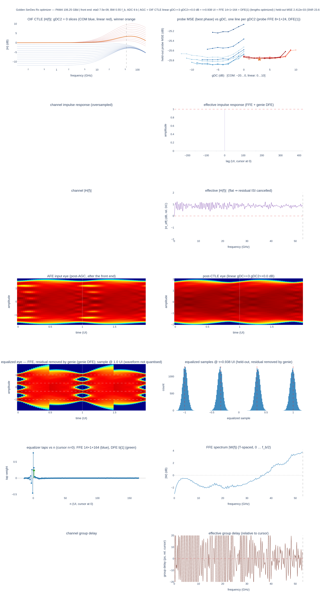

*Figure 10-3. `golden_rx_pk10_fe/golden_rx_dashboard.png`. Row 1: the 119 CTLE codes with the winner `linear gDC=+3 gDC2=0` in orange — a curve with 0 dB at DC and +3.3 dB at Nyquist, unlike every earlier winner — and the probe MSE vs gDC per gDC2 with the linear family (red) now level with the COM family (blue) at about −25.8 dB. Row 4: the input eye after the front end and AGC and the post-CTLE eye. Row 5: the equalised eye (folded from the oversampled waveform, which the ADC does not touch — the title says so) and the histogram of the quantised, equalised held-out samples with σ 0.046–0.049 per level. Row 6: the 179 FFE taps and the FFE spectrum, −3.0 dB at DC rising to +3.8 dB at Nyquist — the FFE no longer restores a DC cut.*

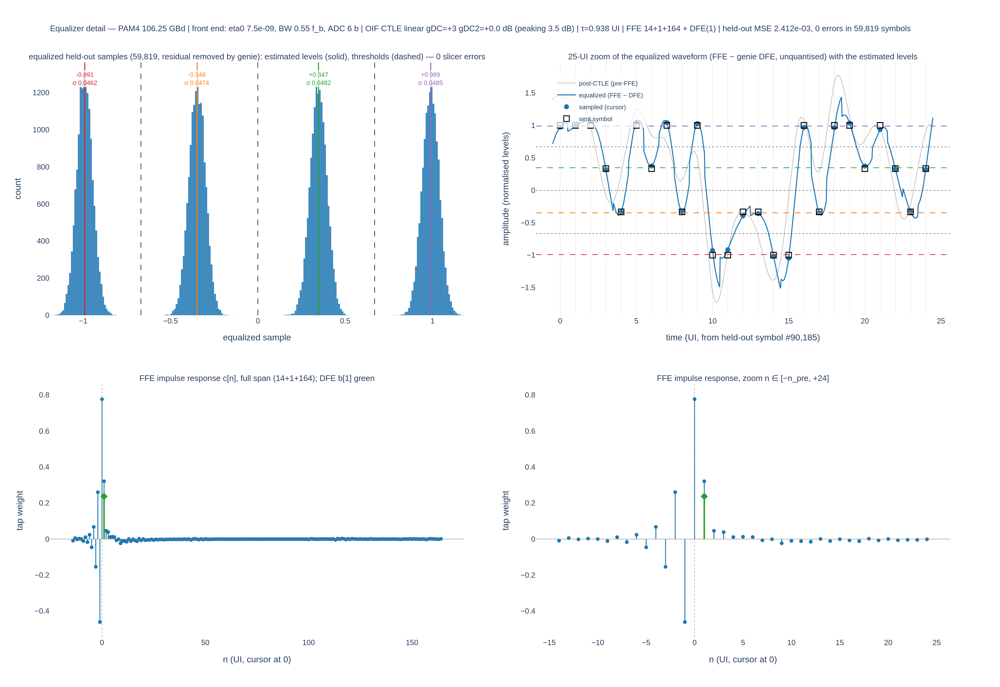

*Figure 10-4. `golden_rx_pk10_fe/golden_rx_eq_detail.png`. Top left: the held-out histogram with the estimated levels (−0.991, −0.348, +0.347, +0.989) and σ 0.046–0.049, 0 errors in 59,819. Top right: 25 UI of the equalised waveform (unquantised, as the title notes) over the post-CTLE waveform. Bottom: the FFE impulse response, \(c[0]\) = 0.78 with \(c[-1]\) = −0.46 and \(c[+1]\) = +0.32, the DFE tap \(b_1\) = +0.24 as the green diamond at \(n = 1\); compare Figure 9-3, where \(c[0]\) = 1.72 restored the COM code's DC cut.*

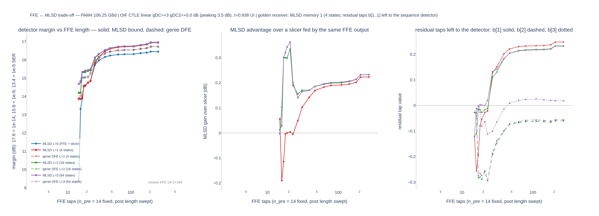

*Figure 10-5. `golden_rx_pk10_fe_mlsd/golden_rx_ffe_mlsd_tradeoff.png`. Left: detector margin vs FFE length for memory 0–3 behind the front end (solid MLSD bound, dashed genie DFE); the curves separate only below about 25 taps and converge to 16.4–17.0 dB. Middle: the MLSD gain over a slicer fed by the same FFE — negative for \(L = 1\) with 1–2 post taps (the fit leaves a negative residual), +0.1 … +0.25 dB from 12 post taps on. Right: the residual taps; \(b_1\) settles at +0.24, larger than the +0.14 of the noiseless receiver.*

## 11. Interpretation of the FFE coefficient limits

The comparison in Section 10 turns on one row of Table 33-1, so its meaning deserves a section.

**Where \(\sum|c| = 1\) with a cursor minimum comes from.** On the transmitter side the normalisation is physical. A TX FIR drives a fixed output swing; the worst-case data pattern produces \(\sum|c|\) times the per-tap swing, so \(\sum|c| = 1\) is the statement that the worst case fits in the driver's range, and the cursor minimum \(c(0) \ge 0.54\) bounds how much of the swing is given up to de-emphasis. Table 33-1 carries exactly that for the transmitter: \(c(0) \ge 0.54\), \(c(-2) \le 0.16\), \(c(-1) \ge -0.4\), \(c(1) \ge -0.2\).

**How IEEE P802.3dj D1.3 writes the receiver limits.** 178A.1.8.1 solves Equation (178A-26) for the FFE and DFE jointly with the equalised cursor fixed at 1, clips the feedback taps (178A-27) and re-solves the FFE (178A-28), and then applies Equation (178A-29):

```
w_lim(j) = w(dw+1) · wmax(j)   if w(j) > w(dw+1) · wmax(j)
         = w(dw+1) · wmin(j)   if w(j) < w(dw+1) · wmin(j)
         = w(j)                otherwise
```

Every limit is **relative to the main tap** \(w(d_w + 1)\). The D1.3 COM parameter tables (Table 178-13 and its counterparts in the other clauses) set \(w_\mathrm{max}(j) = 0.7\) and \(w_\mathrm{min}(j) = -0.7\) for the fixed taps other than the main tap (\(1 \le j \le d_w\), \(d_w + 2 \le j \le N_\mathrm{fix}\)) and \(\pm 0.05\) for the floating taps (\(N_\mathrm{fix} < j\)); after clipping, \(w_\mathrm{lim}\) is divided by \(h_0 w_\mathrm{lim}\) so the equalised pulse amplitude is again 1, and \(b\) is recomputed as \(H_b w_\mathrm{lim}\) and clipped. There is **no main-tap minimum** and no \(\sum|w|\) normalisation anywhere in the receiver procedure.

**What the OIF row needs.** The Table 33-1 row "Normalized FFE main tap coefficient minimum limit, \(b_\mathrm{min}(0) = 0.7\)" has no counterpart in D1.3 and cannot be read relative to the main tap (the main tap relative to itself is 1). It needs a different normalisation, and the only one in which a main-tap minimum of 0.7 is meaningful next to a per-tap maximum of 0.7 and floating limits of 0.05 / 0.02 is \(\sum|w| = 1\) — the COM code's tap normalisation (`ffe_main_cursor_min` in the COM reference implementation). This work used that reading, the same one `src/optical_serdes/analysis/com_178a.py` implements, with the main tap brought to 0.7 by a uniform shrink of the other taps so that the tap *shape* of the MMSE solution is preserved.

**The two readings disagree on this capture.** The solution the receiver finds without the rule (`runs/ranjit_colossus/oif_lr_rx_nomainmin/oif_lr_rx_result.json`, fields `ffe.delays`, `ffe.taps_cursor_norm`, `ffe.taps_sum_abs_norm`) is, in cursor units, main 1.717, \(c[-1] = -0.870\) (ratio 0.506 to the main tap, within the D1.3 limit of 0.7), largest fixed non-main tap 0.870 (the same tap), largest floating tap 0.037 (ratio 0.022, within 0.05), floating-tail RSS 0.012 (within 0.02), \(b(1) = 0.255\) (within 0 … 0.85), and a noise gain \(\sum w^2 / w_0^2\) of +1.71 dB. It satisfies **every** D1.3 relative-to-main limit and fails only the \(\sum|w|\) reading: main / \(\sum|w|\) = 0.366 against the required 0.7. The as-specified solution that the rule forces (main 0.700 of \(\sum|w|\), \(c[-1] = -0.058\), \(b(1) = 0.80\)) is 6.5 dB worse.

**Conclusion.** As literally written with \(\sum|w| = 1\) normalisation, \(b_\mathrm{min}(0) = 0.7\) is a peak-output (L1) bound: it says the worst-case data pattern may not exceed 1/0.7 times the cursor at the FFE output. That is a driver constraint. It is not fundamental for an ADC / DSP FFE, whose output can be rescaled at will; what limits a digital FFE is the noise and quantisation enhancement \(\sum w^2 / w_0^2\) and the coefficient range, and both are captured by the D1.3 relative-to-main limits (\(|w(j)| \le 0.7\, w_0\) bounds every ratio, and with 14 non-main fixed taps and 8 floating taps the noise gain is bounded above by \(1 + 14 \times 0.49 + 8 \times 0.0025 \approx 7.9\), i.e. 9 dB). The row should therefore be read as an implementability knob inherited from the COM code's `ffe_main_cursor_min`, useful for keeping the reference receiver conservative but not a physical receiver constraint, and the D1.3 relative-to-main form is the receiver-appropriate statement. On this capture the choice between the two readings is worth 6.5 dB of margin, so whichever is intended should be stated explicitly in the implementation agreement.

## 12. Limitations and open items

- **Genie DFE.** The feedback and the level statistics use the transmitted symbols. A real DFE propagates errors; at the 17–18 dB margins of this capture the effect is negligible, but for the starved-FFE rows of Section 9.4 or the as-specified LR receiver (SER 1e-3) it is not, and the Viterbi count is the honest number.
- **Ideal timing.** The sampling phase is searched and frozen; no CDR runs, and the capture shows no jitter. The repo's `MuellerMullerCDR` exists but is not in this flow. A baud-rate CDR locks where its timing function is zero, which is in general not the MMSE phase; the golden phase is a bound on what a CDR with a tunable lock offset could reach.
- **Noise model of the capture.** The residual noise of the ranjit capture is band-limited with the signal (it entered before the channel or the termination), so high-frequency CTLE boost is free and the uncapped search runs to 20 dB of peaking. A receiver that adds white noise after the termination chooses a different CTLE code: the synthetic captures, with white noise at the input, do (Section 3.4), and so does the golden receiver behind the Table 33-1 front end, which moves to the linear family's `gDC = +3` (Section 10.4). The default golden receiver remains the bound of the architecture alone; the Table 33-1 numbers are the bound of the architecture plus one particular set of impairments.
- **Front-end model.** The front end of Sections 10.1 and 10.4 is the Table 33-1 abstraction, not a circuit: white noise of density η0 filtered by an ideal 4th-order Butterworth, and a mid-rise quantiser whose full scale is set from the data itself (the \((1 - P_{qc})\) quantile of the sampled record at each phase — an oracle, like the AGC). Noise entering elsewhere (e.g. after the CTLE), CTLE noise figure, ADC nonlinearity, sampling jitter and the clock path are not modelled, and the ADC's full scale would in practice be set by a gain loop. The eye figures fold the oversampled equalised waveform, which the baud-rate ADC does not touch, so they are unquantised even when the ADC is on; the histograms, MSE and margins are the quantised path.
- **Oracle AGC.** The block-mode AGC of Section 2.1 measures the DC and the rms over the whole record and applies one unquantised gain; it has no loop. A real AGC — the repo has continuous-loop detectors in `AnalogAgc` itself (`mode="adaptive"`, causal peak or power tracking with attack / decay time constants; `mode="training"`, measure over the first 5000 symbols, then hold) and a hardware-style decimated hysteresis loop, `AgcVpNrz` in `rx/agc_adapt.py` (one vote per 4096 UI on the averaged error-slicer thresholds, driving a saturating linear-in-dB gain code) — adds a settling time, gain steps that rescale the whole eye and force the downstream loops to re-settle, pattern-dependent gain ripple, and, with a fixed ADC full scale, a level error that becomes quantisation noise or clipping. None of that is in these results. Because the ADC's full scale is also fitted from the data, the reported numbers do not depend on the AGC gain at all (Section 2.1); they bound what a settled AGC could reach, not what happens while it settles.
- **Limit-bound FFE lengths.** Both ranjit searches stopped at the 256-tap cap with the saturated MSE still falling 2 % per doubling. The 2 % (0.09 dB) tolerance is a statistical statement about 60k held-out symbols, not an engineering one; `--length-tol 0.05 … 0.1` (0.2 … 0.4 dB) gives practical lengths, and Section 9.4 shows 24 post taps are within 0.3 dB of the floor.
- **FFE design for the MLSD.** The 178A form designs the FFE for MMSE with a free residual, then hands the residual to the detector. It is not the MLSD-optimal design (which would shape a deliberate partial response), and the trade-off study inherits that.
- **Gaussian bound optimism.** The error-event bound treats the FFE-output residual as Gaussian with the measured autocorrelation. When the residual is mostly data-dependent ISI (starved FFE, constrained LR receiver) the bound over-predicts the margin: the as-specified LR receiver's 11.66 dB bound predicts a Gaussian SER of about 1e-4, while the Viterbi count is 62 in 59,893, about 1e-3.
- **GUI.** `examples/golden_rx_gui.py` invokes the optimizer with the old CLI (`--ffe-pre`, `--ffe-post`, `--dfe-taps`), which the current script no longer accepts; it is out of date and should not be used until it is rewritten for `--max-ffe-pre` / `--max-ffe-post` / `--mlsd-memory` and the OIF catalog options.
- **Old-list SNRs.** The "old 1z2p" column of Section 8 is from the development log; those result files were overwritten by the OIF-catalog runs.

## 13. Reproduction

All commands run from `/home/patrick/optical-serdes`. Figures are written as PNG (scale 2) and HTML next to the JSON in `--out-dir`.

**Golden receiver on the ranjit capture**

```bash
# uncapped CTLE search → runs/ranjit_colossus/golden_rx
python examples/golden_rx_optimizer.py \
    --tx-bits temp/food/ranjit_colossus/tx_symbols_gray_bits.npy \
    --rx-signal temp/food/ranjit_colossus/after_rxterm_wave.npy \
    --modulation pam4 --sps 32 --baud 106.25e9 \
    --out-dir runs/ranjit_colossus/golden_rx

# CTLE peaking capped at 10 dB → runs/ranjit_colossus/golden_rx_pk10
python examples/golden_rx_optimizer.py \
    --tx-bits temp/food/ranjit_colossus/tx_symbols_gray_bits.npy \
    --rx-signal temp/food/ranjit_colossus/after_rxterm_wave.npy \
    --modulation pam4 --sps 32 --baud 106.25e9 --max-peaking-db 10 \
    --out-dir runs/ranjit_colossus/golden_rx_pk10

# MLSD memory 1 at the capped winner + FFE/MLSD trade-off → runs/ranjit_colossus/golden_rx_pk10_mlsd
python examples/golden_rx_optimizer.py \
    --tx-bits temp/food/ranjit_colossus/tx_symbols_gray_bits.npy \
    --rx-signal temp/food/ranjit_colossus/after_rxterm_wave.npy \
    --modulation pam4 --sps 32 --baud 106.25e9 --max-peaking-db 10 \
    --mlsd-memory 1 --ffe-mlsd-tradeoff --tradeoff-max-memory 3 \
    --ctle-code com:-8:-4 --phase 0.0625 \
    --out-dir runs/ranjit_colossus/golden_rx_pk10_mlsd

# the same behind the Table 33-1 front end (Section 10.4) → runs/ranjit_colossus/golden_rx_pk10_fe
python examples/golden_rx_optimizer.py \
    --tx-bits temp/food/ranjit_colossus/tx_symbols_gray_bits.npy \
    --rx-signal temp/food/ranjit_colossus/after_rxterm_wave.npy \
    --modulation pam4 --sps 32 --baud 106.25e9 --max-peaking-db 10 --front-end oif-lr \
    --out-dir runs/ranjit_colossus/golden_rx_pk10_fe

# MLSD memory 1 + trade-off at that winner → runs/ranjit_colossus/golden_rx_pk10_fe_mlsd
python examples/golden_rx_optimizer.py \
    --tx-bits temp/food/ranjit_colossus/tx_symbols_gray_bits.npy \
    --rx-signal temp/food/ranjit_colossus/after_rxterm_wave.npy \
    --modulation pam4 --sps 32 --baud 106.25e9 --max-peaking-db 10 --front-end oif-lr \
    --mlsd-memory 1 --ffe-mlsd-tradeoff --tradeoff-max-memory 3 \
    --ctle-code linear:3:0 --phase 0.9375 \
    --out-dir runs/ranjit_colossus/golden_rx_pk10_fe_mlsd
```

**Front-end options** (group "receiver front end (OIF CEI-224G-LR Table 33-1)", all off by default): `--front-end oif-lr` is the preset η0 = 7.5e-9 V²/GHz, \(f_r = 0.55 f_b\), 6-bit ADC, \(P_{qc} = 10^{-7}\); `--eta0` (V²/GHz one-sided receiver noise density, 0 = none), `--rx-bw-factor` (Butterworth-4 3 dB point as a fraction of \(f_b\), 0 = none), `--adc-bits` (0 = ideal sampler), `--adc-clip-prob` (default 1e-7) set the blocks individually; `--fe-seed` (default 11) seeds the receiver noise and should equal the LR script's `--seed` for a like-for-like comparison. With `--demo` the synthetic channel impulse response is not passed through the front end, so the script says so and estimates the effective response from the data instead.

**Golden receiver on the synthetic captures**

```bash
python examples/golden_rx_optimizer.py --tx-bits data/gui_test/prbs15_loss10dB_bits.npy \
    --rx-signal data/gui_test/prbs15_loss10dB_wave.npy --modulation nrz --sps 32 --baud 106.25e9 \
    --out-dir runs/golden_rx/oif_ctle/nrz_loss10
python examples/golden_rx_optimizer.py --tx-bits data/gui_test/prbs15_loss40dB_bits.npy \
    --rx-signal data/gui_test/prbs15_loss40dB_wave.npy --modulation nrz --sps 32 --baud 106.25e9 \
    --out-dir runs/golden_rx/oif_ctle/nrz_loss40
python examples/golden_rx_optimizer.py --tx-bits data/gui_test/prbs15_loss40dB_pam4_bits.npy \
    --rx-signal data/gui_test/prbs15_loss40dB_pam4_wave.npy --modulation pam4 --sps 32 --baud 106.25e9 \
    --out-dir runs/golden_rx/oif_ctle/pam4_loss40

# self-contained demo with a known channel impulse response (exercises the IR path of Section 5)
python examples/golden_rx_optimizer.py --demo --demo-loss 45
```

Other options: `--ctle-families com` or `linear` to search one family; `--phase-steps N` for a coarser phase grid; `--max-ffe-pre / --max-ffe-post / --cap-limit` for the saturated caps; `--length-tol` for the stop rule; `--train-frac`; `--ridge` (Tikhonov, default 0); `--max-symbols` to cap the record; the front-end options listed above.

**Table 33-1 receiver**

```bash
# as specified, compared with the like-for-like golden runs of Section 10.4 and the
# no-front-end golden receiver of Section 9 → runs/ranjit_colossus/oif_lr_rx
python examples/oif_lr_rx_compare.py \
    --tx-bits temp/food/ranjit_colossus/tx_symbols_gray_bits.npy \
    --rx-signal temp/food/ranjit_colossus/after_rxterm_wave.npy \
    --golden runs/ranjit_colossus/golden_rx_pk10_fe/golden_rx_result.json \
    --golden runs/ranjit_colossus/golden_rx_pk10_fe_mlsd/golden_rx_result.json \
    --golden runs/ranjit_colossus/golden_rx_pk10/golden_rx_result.json \
    --out-dir runs/ranjit_colossus/oif_lr_rx

# variants (same --tx-bits / --rx-signal / --golden arguments)
#   --max-peaking-db 10                      → runs/ranjit_colossus/oif_lr_rx_pk10
#   --no-main-tap-min                        → runs/ranjit_colossus/oif_lr_rx_nomainmin
#   --tx-ffe 0,-0.20,0.80,0 --ctle-code 0:-1 → runs/ranjit_colossus/oif_lr_rx_txffe
```

`--no-front-end` skips the η0 noise, the Butterworth and the ADC; `--coarse-phase-steps` (8) and `--top-k` (5) control the search; `--seed` (11) seeds the receiver noise (the golden script's `--fe-seed`). The front end itself (`rx_front_end`, `quantize`) is implemented once, in `golden_rx_optimizer.py`, and imported here. The comparison table marks which rows carry the front end (`FE` column; `front_end_on` in the JSON `comparison` list) by reading the golden files' `front_end` block. Outputs: `oif_lr_rx_result.json`, `oif_lr_rx.npz`, `oif_lr_rx_compare.png` (+ `.html`). The `oif_lr_rx_pk10` and `oif_lr_rx_txffe` directories were not re-run for Section 10.4 (their LR results are unaffected; only the golden comparison rows in their table and figure would change).

**Capture examination.** `runs/ranjit_colossus/after_rxterm_summary.json` and `after_rxterm_examine.png` were produced by the capture-examination step that also wrote the two `.npy` exports (`exports` block of the summary).

**Tests**

```bash
python -m pytest tests/test_rx/test_ctle.py tests/test_analysis/test_mlsd_bound.py -q
```

`tests/test_rx/test_ctle.py` — `TestCtleLinearRef` (Equation 30-4 break frequencies, 0 dB DC for every code, the +10.0 dB peak and +9.6 dB Nyquist of the top code, +1.1 dB at gDC = 0, gDC2 adding its value at the peak, break frequencies doubling with the data rate, the analog ZPK matching the closed form, Table 30-13 range validation) and `TestOifCtleCatalog` (202 = 21 × 7 + 11 × 5 codes, right class and baud per family, the Table 33-1 COM ratios and −20 dB DC gain, the peaking definition on both families, baud scaling). `tests/test_analysis/test_mlsd_bound.py` — the error-event enumeration and sign convention, unit distance of the memoryless slicer, \(\sqrt{1 + b_1^2}\) under white noise, distance loss under positively correlated noise, the alternating event on a heavy residual, and the NRZ alphabet.

---

## Appendix A. Files in this directory

| File | Origin | Content |
|---|---|---|
| `README.md` | this document | |
| `oif_cei224_ctle.json` | `docs/oif_cei224_ctle.json` | CTLE parameters extracted from the four OIF drafts, both transfer functions, gain ranges, recommended settings, and magnitudes computed at 106.25 GBd |
| `figures/after_rxterm_examine.png` | `runs/ranjit_colossus/after_rxterm_examine.png` | capture examination (Figure 9-1) |
| `figures/after_rxterm_ls_match.png` | `runs/ranjit_colossus/after_rxterm_ls_match.png` | measured waveform against the convolved LS pulse model (Figure 9-1a) |
| `figures/after_rxterm_channel_estimate.png` | `runs/ranjit_colossus/after_rxterm_channel_estimate.png` | estimated channel impulse, frequency, and group-delay responses (Figure 9-1b) |
| `figures/ranjit_golden_rx_pk10_dashboard.png` | `runs/ranjit_colossus/golden_rx_pk10/golden_rx_dashboard.png` | golden receiver dashboard, peaking ≤ 10 dB (Figure 9-2) |
| `figures/ranjit_golden_rx_pk10_eq_detail.png` | `runs/ranjit_colossus/golden_rx_pk10/golden_rx_eq_detail.png` | equaliser detail, peaking ≤ 10 dB (Figure 9-3) |
| `figures/ranjit_golden_rx_uncapped_eq_detail.png` | `runs/ranjit_colossus/golden_rx/golden_rx_eq_detail.png` | equaliser detail, uncapped CTLE, 20 dB-peaking FFE tail (Figure 9-4) |
| `figures/ranjit_golden_rx_pk10_mlsd_ffe_mlsd_tradeoff.png` | `runs/ranjit_colossus/golden_rx_pk10_mlsd/golden_rx_ffe_mlsd_tradeoff.png` | FFE length vs detector memory (Figure 9-5) |
| `figures/ranjit_oif_lr_rx_compare.png` | `runs/ranjit_colossus/oif_lr_rx/oif_lr_rx_compare.png` | Table 33-1 receiver as specified, with the like-for-like golden rows (Figure 10-1) |
| `figures/ranjit_oif_lr_rx_nomainmin_compare.png` | `runs/ranjit_colossus/oif_lr_rx_nomainmin/oif_lr_rx_compare.png` | Table 33-1 receiver without the main-tap rule, with the like-for-like golden rows (Figure 10-2) |
| `figures/ranjit_golden_rx_pk10_fe_dashboard.png` | `runs/ranjit_colossus/golden_rx_pk10_fe/golden_rx_dashboard.png` | golden receiver dashboard behind the Table 33-1 front end (Figure 10-3) |
| `figures/ranjit_golden_rx_pk10_fe_eq_detail.png` | `runs/ranjit_colossus/golden_rx_pk10_fe/golden_rx_eq_detail.png` | equaliser detail behind the Table 33-1 front end (Figure 10-4) |
| `figures/ranjit_golden_rx_pk10_fe_mlsd_ffe_mlsd_tradeoff.png` | `runs/ranjit_colossus/golden_rx_pk10_fe_mlsd/golden_rx_ffe_mlsd_tradeoff.png` | FFE length vs detector memory behind the front end (Figure 10-5) |
| `figures/synthetic_nrz_loss40_dashboard.png` | `runs/golden_rx/oif_ctle/nrz_loss40/golden_rx_dashboard.png` | synthetic NRZ 40 dB dashboard (Figure 8-1) |

The figures are copies; the originals and their interactive `.html` versions remain in `runs/`.

## Appendix B. Verification notes

Result files read for this document:

- `runs/ranjit_colossus/after_rxterm_summary.json`
- `runs/ranjit_colossus/golden_rx/golden_rx_result.json`
- `runs/ranjit_colossus/golden_rx_pk10/golden_rx_result.json`
- `runs/ranjit_colossus/golden_rx_pk10_mlsd/golden_rx_result.json` (including the 72 `ffe_mlsd_tradeoff` rows)
- `runs/ranjit_colossus/golden_rx_pk10_fe/golden_rx_result.json` and `golden_rx_sweep.npz` (stage-1 and rescore grids for the flatness statements of Section 10.4)
- `runs/ranjit_colossus/golden_rx_pk10_fe_mlsd/golden_rx_result.json` (including its 72 `ffe_mlsd_tradeoff` rows)
- `runs/ranjit_colossus/oif_lr_rx/oif_lr_rx_result.json`, `oif_lr_rx_pk10/…`, `oif_lr_rx_nomainmin/…`, `oif_lr_rx_txffe/…` (`oif_lr_rx` and `oif_lr_rx_nomainmin` re-run for Section 10.4; their LR numbers are unchanged)
- `runs/golden_rx/oif_ctle/{nrz_loss10,nrz_loss40,pam4_loss40}/golden_rx_result.json`
- `docs/oif_cei224_ctle.json`

Derived quantities computed for this document from those files: the FFE spectra at DC and Nyquist and the noise gains \(\sum w^2/w_0^2\) in Sections 3.4, 10.4 and 11 (from `ffe.taps_cursor_order` / `ffe.taps_cursor_norm`); \(R_\mathrm{LM}\) in Section 9.2 (from `held_out_levels.estimated_mean`); the ideal MLSD gain \(10\log_{10}(1 + b_1^2)\) in Section 9.3; the stage-1 spans and counts within 0.3 dB in Section 10.4 (from `mse_grid` and `mse_rescore` of `golden_rx_pk10_fe/golden_rx_sweep.npz`). The sampling-instant check in Section 10.3 (where each receiver samples relative to the post-front-end pulse peak) re-sampled the capture through the corresponding front end; it is not stored in any result file. The noise budget of Section 10.4 (η0 noise and ADC quantisation error passed separately through the fixed winning receiver, 1.80e-4 and 3.03e-4 of the 4.93e-4 extra MSE) and the Butterworth group delay (0.756 UI at low frequency) were likewise computed for this document from the capture, the stored front-end parameters (`front_end` block, seed 11) and the stored FFE taps; they are not in any result file.

For Section 2.1 (AGC) the fields read were `agc.mode`, `agc.gain_db` and `agc.dc_offset_removed` in the eight golden `golden_rx_result.json` files listed above; `agc_gain_db`, `adc.full_scale_v`, `adc.lsb_v` and `adc.clip_fraction` in the four `oif_lr_rx_result.json` files; and `front_end.adc.full_scale_v`, `lsb_v` and `clip_fraction` in the two front-ended golden files. The block-mode gain was also recomputed for this document from the capture files themselves — the mean and the standard deviation of `after_rxterm_wave.npy` and of the three `data/gui_test` waveforms, with the target from the corresponding bit files — and reproduces `agc.gain_db` and `agc.dc_offset_removed` to every printed digit on all four; the input rms values, the 0.927 post-AGC cursor (from Section 9.1's 64.07 mV) and the 0.0075 V DC contribution of the PAM4 file's mean level (from the generator's impulse response) in Section 2.1 come from that computation and are not in any result file.

Statements that could not be checked against a result file: the stage-1 wall-clock times in Section 4.1, the "old 1z2p" SNRs in Section 8, and the 3 × 3 TX-FFE grid in Section 10.3 (only its best cell, `oif_lr_rx_txffe`, was kept). These come from the development log and are marked as such in the text.

The synthetic-channel result files predate the `detector`, `held_out_levels` and `ctle.peaking_db` fields (they carry `dfe`, `mse_eval`, `post_eq_snr_db`, `equalizer_search` and `sweep`); the peaking values quoted for them in Section 8 are the catalog values of the same codes from the ranjit runs' `sweep.ctle_catalog` (0.95 dB for `com 0/−1`, 3.92 dB for `com 0/−4`).
